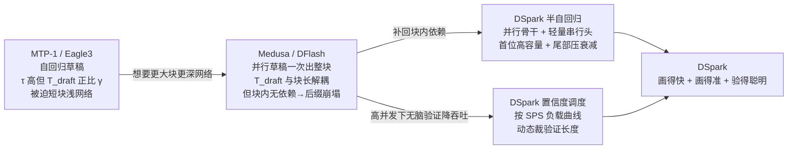

# 投机推理（Speculative Decoding）演进 —— 目录索引 + MTP → Eagle3 → DFlash → DSpark 总览

> 覆盖：投机解码草稿器（drafter）架构与验证调度的演进主线；以 DeepSeek 的 **MTP / DFlash / DSpark** 为骨架，旁及 Eagle3。
> **基线**：DSpark = `DeepSpec` @ `dd854392`（2026-06-28）随仓 PDF；DFlash = arXiv:2602.06036v2（ICML 2026）；Eagle3 = arXiv:2503.01840；MTP = DeepSeek-V3（arXiv:2412.19437）模型侧。
> **最后更新**：2026-06-29

> [!warning] arXiv 编号订正
> 用户最初给的 **arXiv:2606.19348 是 DeepSeek-V4 模型论文**（见 [[deepseek_v4_analysis]]），**不是 DSpark**。DSpark 论文随开源仓 DeepSpec 以 PDF 发布。详见 [[dspark_analysis]] 顶部说明。

---

## 一、一条主线：投机解码在 `L = (T_draft + T_verify) / τ` 上的三代演进

自回归解码的瓶颈是**串行**：生成 N 个 token 要 N 次目标前向。投机解码用便宜草稿器一次提 $\gamma$ 个 token、目标模型一次前向并行验证、拒绝采样接受最长合法前缀（数学无偏，原理见 [[vllm_speculative_decoding_analysis]]）。每 token 平均延迟（DSpark 论文 Eq.1）：

$$L=\frac{T_{\text{draft}}+T_{\text{verify}}}{\tau}\quad\Rightarrow\quad\text{提速三杆：① 降 } T_{\text{draft}}\text{（画得快）② 升 } \tau\text{（画得准）③ 降有效 } T_{\text{verify}}\text{（验得聪明）}$$

**演进就是依次把这三个杆拨到位**，且每一代都在解决上一代暴露的瓶颈：

三代各自的「主攻杆」：
1. **第一代 · 自回归草稿（MTP、Eagle/Eagle3）**：把草稿器做成轻量自回归头/小模型，主攻**升 $\tau$**。代价：$T_{\text{draft}}\propto\gamma$，只能短块浅网络。
2. **第二代 · 并行草稿（Medusa、DFlash）**：一次前向出整块，主攻**降 $T_{\text{draft}}$**，从而能上深网络大块。代价：块内位置独立预测 → 多模态碰撞、后缀接受率崩塌（$\tau$ 在尾部掉得快）。
3. **第三代 · DSpark（半自回归 + 置信度调度）**：用**串行头**把第二代丢掉的 $\tau$ 补回来（几乎不加 $T_{\text{draft}}$），又用**硬件感知调度**主攻第三杆**降有效 $T_{\text{verify}}$**，让大草稿块在高并发生产里真正变成加速而非降速。

---

## 二、四代横向对比

| 维度 | MTP-1（DeepSeek-V3/V4 生产基线） | Eagle3 | DFlash | DSpark |
|---|---|---|---|---|
| 草稿生成 | **自回归**（模型自带 MTP 头，逐 token） | **自回归**（TTT，复用目标隐状态，1 层） | **并行**（块扩散，一次前向出整块） | **半自回归**（并行骨干 + 串行 Markov/RNN 头） |
| 草稿层数 | 1（单 MTP 模块） | 浅（1 层；受 $O(\gamma)$ 延迟限制） | 深（默认 5 层） | 深骨干 5 层 + 极轻串行头 |
| 块内依赖 | 有（自回归） | 有（自回归） | **无**（每位置独立 → 后缀崩塌） | **有**（串行头注入一阶/全前缀转移） |
| $T_{\text{draft}}$ | $\propto\gamma$ | $\propto\gamma$ | $\approx O(1)$ | $\approx O(1)$（串行头 +0.2%~1.3%） |
| 目标上下文用法 | 共享主干隐状态 | 复用目标多层隐状态 | **KV 注入**（目标层拼进草稿 K/V） | KV 注入（同 DFlash） |
| 验证调度 | **静态**（生产只敢用单 token，MTP-3/5 高并发降吞吐） | 静态/启发式 | 静态固定块 | **置信度头 + 硬件感知前缀调度器**（负载自适应） |
| 训练范式 | 随主模型联合训练 | 蒸馏（冻结目标，TTT） | 蒸馏（冻结目标，CE-only） | 蒸馏（冻结目标，CE+TV+置信 三损失） |
| 接受长度 τ（Qwen3-4B 宏均，越大越好） | — | 基线 | 比 Eagle3 高 | **比 Eagle3 高 30.9%、比 DFlash 高 16.3%** |
| 出处 | DeepSeek-V3 §; [[deepseek_v3_analysis]] | arXiv:2503.01840 | arXiv:2602.06036 | DSpark 论文; [[dspark_analysis]] |

### 三者「相互区别」的本质（用户问的重点）

- **MTP vs DFlash**：自回归 vs 并行。MTP 逐 token、有依赖但慢；DFlash 一次出整块、快但无依赖。两者在「画得快」与「画得准」上各占一端。DFlash 的反直觉之处：**首 token 因能上深网络反而比浅层自回归更准**，而投机解码是严格前缀存活，首位杠杆最大，所以并行能全局赢——但尾部仍崩塌。
- **DFlash vs DSpark**：DSpark **就是 DFlash 骨干 + 一个轻量串行头 + 一个置信度头**（代码上 DFlash = DSpark 关掉这两个头的消融，见 [[deepspec_codebase_analysis]] §3.1）。串行头补回块内依赖压住后缀崩塌（接受长度 +16%~18%），置信度头 + 调度器把「该验多长」做成随负载自适应。
- **MTP-1 vs DSpark（生产对比）**：MTP-1 是 DeepSeek-V4 上线时的生产基线（单 token，因 MTP-3/5 在高并发降吞吐而长期只敢用单 token）。DSpark 上线两周即取代之，匹配吞吐下单用户提速 **60%–85%（V4-Flash）/ 57%–78%（V4-Pro）**，并把基线撑不住的严格交互档位变得可行（外推服务 Pareto 前沿）。

---

## 三、本目录页面

三页按 **Overview → Theory → Deep Dive** 递进阅读（既是单页内部结构，也是三页之间的关系）：

| 阶段 | 页面 | 类型 | 核心 |
|---|---|---|---|
| **Overview** | 本页 [[index]] | 总览/演进 | 投机推理四代演进主线 + 横向对比 + 三者区别本质 |
| **Theory + Deep Dive** | [[dspark_analysis]] | 论文深挖 | 页内自带 **Overview（§1）→ Theory 理论基础（§2：延迟公式/草稿器谱系/DFlash 骨干）→ Deep Dive（§3 起，两大部件四拍）** |
| **Deep Dive（源码）** | [[deepspec_codebase_analysis]] | 源码分析 | 开源仓 DeepSpec：Overview → Quick Start → Deep Dive；一套框架产 Eagle3/DFlash/DSpark，论文公式 ↔ 代码逐行核对，开源 vs 生产边界 |

---

## 四、知识缺口（Knowledge Gaps）

- **DFlash 独立深挖**：本库目前从 DSpark 视角（其并行骨干）覆盖 DFlash，尚无独立的 DFlash（块扩散 / block diffusion）论文页。arXiv:2602.06036 在 `raw/` 中暂缺。
- **Eagle3 独立深挖**：仅在对比表与 [[vllm_speculative_decoding_analysis]] §3.3（EAGLE 时序）中出现，无专页。
- **MTP 模型侧**：原理散见 [[deepseek_v3_analysis]]（§Multi-Token Prediction）与 [[deepseek_v4_analysis]]，尚未抽成「投机解码视角的 MTP」专页。

---

## 关联域

- [[vllm_speculative_decoding_analysis]] —— 投机解码在 vLLM V1 引擎的验收侧实现（proposer 家族含 mtp/dflash、拒绝采样内核）
- [[../index]] —— 推理框架目录
- [[../../01_theory/01_models/deepseek/index]] —— DeepSeek 模型族（V3 MTP / V4 底座）

## Related Pages
- [[../../index]] — 知识库总索引
- [[../../changelog]] — 变更日志
