# vLLM 软件架构分析：设计目标、模块分工与使用场景

> **源码基线**：`vllm-project/vllm@199cb9b964822e59ab9b58d88e7be31eb419a2ae`（`main` 快照，2026-09-07 UTC）
> **主题**：从并发推理面对的计算、显存与服务压力出发，建立六个职责模块的静态架构，再跟随服务启动和一次生成理解它们的协作。随后逐个展开模块设计、代码映射及离线、在线、批处理、渲染、分布式和工具场景。
> **适用范围**：整体能力、模块合同与顶层场景；以 V1 Engine 和普通文本生成为代表路径，内部算法由 Scheduler、KV、Runner 等专题展开。
> **最近更新**：2026-09-10。补齐模块概要设计、启动与请求闭环、场景完成条件及外部依赖边界。

## 1. 软件背景、设计目标与能力边界

### 1.1 从模型计算到并发推理系统

假设已经把一个语言模型加载到 GPU 上。给它一段提示词，执行模型计算，就可以得到后续 token 的预测。**token 是模型处理文本的基本单位，不一定对应一个汉字或一个单词。** 对普通自回归生成，系统选择下一个 token，再把它接回上下文，继续生成，直到遇到停止条件。

对于一个请求，这个循环容易理解。但如果三个用户同时使用同一张 GPU，问题马上变了：

- A 已经开始回答，每隔一会儿就需要生成后续文本。
- B 刚提交一篇长文，需要先处理大量输入。
- C 在 A 和 B 运行期间到达，希望尽快获得响应。

如果每个请求独占 GPU 直到结束，后面的请求要长时间等待；如果先凑齐一批、等整批全部完成才换下一批，短请求结束后留下的执行机会又难以及时交给新请求。即使把所有请求放在一起算，也仍需解决显存够不够、各自算到哪里、下一轮处理多少，以及结果应该返回给谁。

这里先认识三个后文反复出现的词：

| 概念 | 在普通文本生成中做什么 | 对服务的影响 |
|---|---|---|
| **Prefill：处理提示词** | 计算输入上下文，建立后续生成需要的中间结果；完整处理提示词后，可以选择第一个输出 token | 长输入可能占用较多单步计算时间，影响首段输出何时到达 |
| **Decode：继续生成** | 利用已有上下文，反复处理新 token 并选择后续 token | 持续占用计算和上下文存储，直到完成或取消 |
| **KV Cache：缓存注意力中间结果** | 保存已经计算的位置的 Key/Value，让后续注意力计算复用它们 | 请求越多、上下文越长，容量管理越重要；缓存不是最终回答 |

vLLM 在模型外面提供一套推理运行系统：接收不同形式的请求，安排每一步的计算，管理 KV 空间，把逻辑请求组织成 GPU 输入，再将计算结果返回给对应调用者。模型与底层算子的效率仍然重要，但它们只是整个服务的一部分。

上面的排队对比是帮助理解设计的简化分析，不是实测性能结论。当前源码能直接验证的是：`Scheduler.schedule` 每步重新选择工作，而 `LLM.generate` 可以把一组提示词交给引擎自动组批。真正的调度还受请求优先级、token 预算、KV 容量和模型能力等条件约束。

这组 A、B、C 请求将贯穿第 2 章：先理解系统需要保证什么，再看职责怎样组织。


### 1.2 设计目标与取舍依据

这类系统同时追求吞吐、响应延迟和可扩展性，三者需要共同约束：一次安排更多输入可以提高设备利用率，也可能延长其他请求等待本步结束的时间；容纳更多请求又会增加 KV 占用。架构需要让这些决策有明确的负责模块，并允许模型、硬件与部署方式独立变化。

下表是依据当前构造点、接口和资源检查重建的设计解释；“直观方案”及取舍判据属于分析判断，不是源码作者逐项记录的架构决策。

| 工程压力 | 直观方案及其问题 | 当前设计与判断依据 |
|---|---|---|
| 请求长度和到达时间不同 | 固定批次等全部结束，会留下无法及时复用的执行机会 | 每步重新计划；`Scheduler.schedule` 用 token 进度描述工作，使分块输入和继续生成进入同一资源模型 |
| 上下文持续增长 | 按最大长度为每个请求预留连续 KV，会使未使用容量也长期被占有 | 用 block 表达逻辑缓存，按需要分配和复用；能否运行同时接受 token 预算与 KV 容量检查 |
| HTTP、Python、媒体和池化接口并存 | 把协议字段和模板处理放进计算循环，会扩大调度器的变更范围 | 接口与语义形成内部请求；Engine 运行维持生命周期，资源调度消费统一进度 |
| 请求变化频繁、设备提交成本敏感 | 每步重建全部状态，或把长期状态固定绑在当步 batch 顺序上 | Runner 保留状态并增量更新；MRV2 再把状态行与当步输入分离，具体布局交给 Runner 专题 |
| 单设备容量与多设备协作要求不同 | 为每种部署方式复制调度逻辑，会把通信变化传播到请求政策 | Executor 提供执行合同，worker 组织 rank-local 工作；部署与调度通过计划对象协作 |
| 模型、权重格式、后端和硬件组合很多 | 把模型类和专用 kernel 写死在上层，会使每种组合都成为特殊路径 | registry、loader、attention selector 和平台选择在明确接合点绑定实现；不满足能力时拒绝或回退 |

这里有三个范围限制：vLLM 的主任务是推理，梯度训练和优化器更新由外部训练框架承担；性能收益取决于负载、模型和设备，本页不把设计收益写成实测结果；服务入口能够启动，也不能证明模型、量化、并行方式与 connector 的任意组合都有效。

### 1.3 冻结版本的能力范围

| 类别 | 当前可见能力与实现依据 | 阅读时的边界 |
|---|---|---|
| 核心请求路径 | `LLM.generate`、`LLM.chat`、`AsyncLLM.generate` 与 Python `vllm serve`；`LLM.enqueue/wait_for_completion` 提供两阶段离线接口 | 生成模型、上下文长度和停止条件受配置约束；入队与完成是不同事件 |
| 池化与媒体任务 | `PoolingOfflineMixin`、pooling 路由、音频与多模态 serving 实现 | 模型声明的 supported tasks 决定可用接口；向量、分数、音频流不能统一解释为文本采样 |
| 可选执行能力 | TP/PP/DP、量化、LoRA、投机、结构化输出、编译图、KV/encoder transfer 与 offload | 分别在执行、模型、调度和接口边界接入；每种组合仍需通过对应能力检查 |
| 可选入口与运行后端 | gRPC、Rust frontend、Ray executor、external launcher、headless、独立 render | 有独立的依赖和完成语义；Rust/Ray 的存在不表示所有 Python 行为均被同样实现 |
| 兼容与回退 | 旧 Engine 类别名、旧 API server 转发模块、raw prompt 输入、MRV1 回退 | 当前仍存在的兼容分支与推荐入口分开说明；MRV1/MRV2 是 Runner 维度 |
| 外部集成 | vLLM-Omni、Ray Data、外部训练器和插件提供者 | 本仓可以证明委托点与传递合同；第三方内部行为和部署保障需要其自己的证据 |
| 工具和作业 | `run-batch`、`launch render`、`chat/complete`、`bench`、`collect-env` | CLI 注册定义启动类别；子命令不都创建 GPU Engine，完成工件也不同 |

能力来源为 `vllm/entrypoints/cli/main.py::main` 的子命令注册、`ServeSubcommand.cmd` 的部署分支、`docs/serving/offline_inference.md` 的公共接口以及对应实现。第 5 章会把这些能力落成可追踪的使用场景。

## 2. 静态架构与动态协作

### 2.1 按职责与依赖划分六个模块

下面按软件职责划分六个模块。**模块不等于进程，也不等于源码中的一个目录。** 例如 `AsyncLLM` 同时装配输入输出处理和 Engine 客户端，但这两部分解决的问题不同。

这六个模块使用同一分类轴：谁拥有请求语义、运行生命周期、资源政策、设备协作、执行状态或模型计算合同。Engine 运行分别依赖资源调度和执行组织，两者是协作分支；六个模块不构成每次请求必须依次穿过的六个进程。PyTorch、设备运行时和通信库作为外部底座，可观测性与插件作为侧接面。

图 1 表示依赖关系：上层组织请求，下层提供执行能力；箭头不是每个函数的实际调用顺序。结果沿相应接口返回。跨实例传输、监控和插件等能力会接入多个模块，在后文单独介绍。

<!-- 图 1：固定职责布局。接口与语义、Engine 运行居上；资源调度和执行组织并列；设备运行与模型在下。右侧注明侧接位置，底部注明外部 API 边界；实线为依赖而非逐请求调用。生成器：tools/figs/svg/vllm_architecture.mjs。 -->
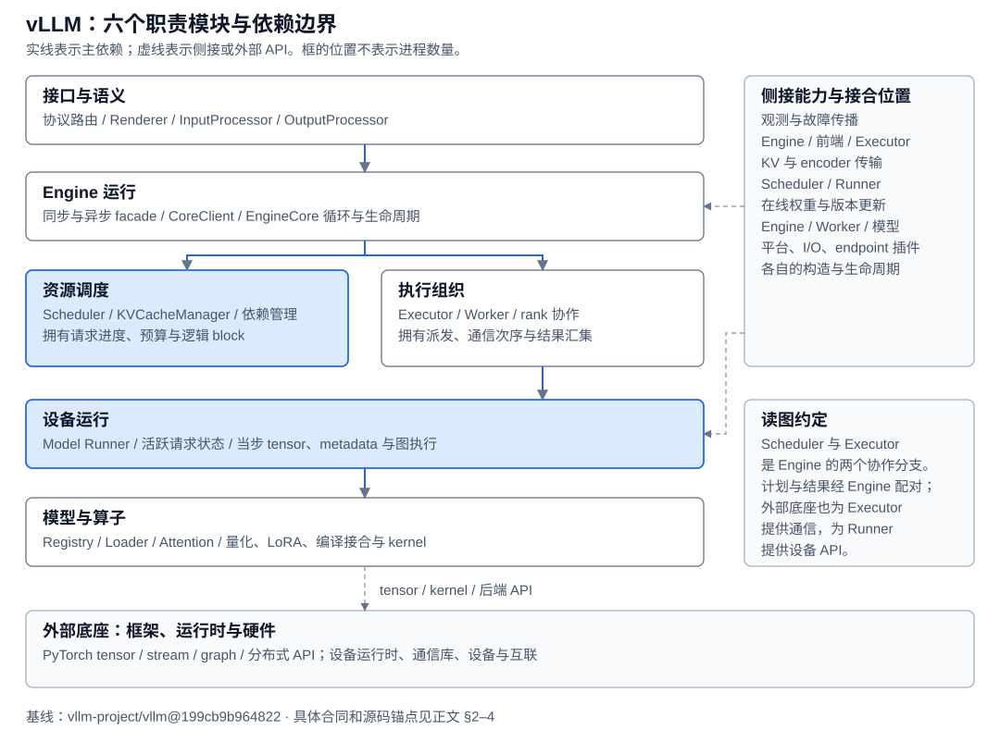

| 模块 | 负责回答什么 | 主要输入与输出 | 掌握的信息及分工边界 |
|---|---|---|---|
| **接口与语义** | 聊天消息怎样变成模型输入？token 怎样变回文本？ | 消息、提示词、媒体和参数 → 内部请求；内部结果 → 用户响应 | 保存模板、tokenizer、输出收集器和前端请求信息；不分配 GPU KV block |
| **Engine 运行** | 怎样接收、关联、推进和终止请求？ | 请求及控制消息 ↔ 调度计划、执行结果、输出消息 | 管理客户端连接、运行循环与存活检测；调用调度器和执行器，不自行实现它们的算法 |
| **资源调度** | 哪些请求在本步处理多少 token？ | 等待/运行请求及剩余资源 → `SchedulerOutput` | 管理请求进度、逻辑 KV block 和完成状态；输出逻辑计划，不构造设备 tensor |
| **执行组织** | 同一个计划怎样由一张或多张卡执行？ | `SchedulerOutput` → 各设备执行 → 汇集结果 | 管理 worker、rank 和通信；不另起一套请求调度政策 |
| **设备运行** | 动态请求怎样进入高效的模型执行路径？ | 逻辑计划 → 输入 tensor、attention metadata → runner 结果 | 管理请求行、设备 buffer 和图执行；不解析 HTTP 消息 |
| **模型与算子** | 当前模型、参数格式和硬件组合怎样实际计算？ | 配置与 checkpoint → 可执行模型；tensor → 模型输出 | 负责模型实现、参数与算子选择；不决定全局请求队列 |

这套划分保留了两个关键区分：**决定做多少工作，与把工作算出来，是不同职责；保存请求逻辑进度，与保存 GPU 上的 tensor，也不是同一份数据。** 下面的请求过程会说明它们为什么需要协作。

### 2.2 启动：先建立模型与容量，才能接受执行计划

第 1 章的“显存够不够”在运行前就影响系统装配。Engine 运行先创建执行组织，后者让 worker 初始化设备、选择 Runner 并加载模型。EngineCore 随后收集各 worker 的 KV 需求和支持的布局，确定一致布局，取得可用缓存容量，再建立设备缓存与调度器。Scheduler 因而拿到的是已经与模型及设备匹配的资源视图。

`EngineCore._initialize_kv_caches` 还把模型性质反映回调度政策：发现 non-causal attention 时关闭 chunked prefill 和 prefix caching；无 KV cache 的模型也会关闭 chunked prefill。这说明模块间通过明确的能力合同协商，不能仅凭上层参数已经解析就认为某项优化一定启用。

```text
Engine 运行：EngineCore.__init__
├─ executor_class(vllm_config)                  执行组织：创建并初始化 worker
│  └─ [执行器相关分发，间接] Worker.init_device / Worker.load_model
│     └─ [构造与装载，间接] GPUModelRunner     设备运行：接入模型与算子
├─ EngineCore._initialize_kv_caches
│  ├─ Executor.get_kv_cache_specs
│  ├─ Executor.get_supported_kv_cache_layouts
│  ├─ resolve_kv_cache_layout / Executor.set_kv_cache_layout
│  ├─ [模型需要 KV] Executor.determine_available_memory
│  ├─ get_kv_cache_configs                     根据设备容量形成配置
│  ├─ [后续初始化] Executor.initialize_from_config
│  └─ [非弹性扩容启动] Executor.compile_or_warm_up_model
├─ StructuredOutputManager(...)
├─ Scheduler(...)                             资源调度：持有已确定的缓存配置
└─ 选择 step_fn 与可选 batch_queue             Engine 运行：组织后续每步执行
```

初始化调用树中的设备与模型工作发生在所选 executor 管理的执行环境；它不宣称各项都在 EngineCore 进程内直接执行。模型加载、KV 分配或能力检查失败会阻止正常请求循环建立，HTTP socket 已绑定也不足以证明 Engine 已可推理。启动路径的实际入口和清理顺序在 5.3 展开。

### 2.3 运行：跟随一条请求，从聊天消息到流式回答

以普通文本模型的一次在线聊天请求为例：模型和服务已经启动，用户发送消息并请求流式返回。不启用投机解码、跨实例 KV 或多模态扩展；这些变体在主线清楚后再进入。

#### 2.3.1 输入：先把用户的表达转换成计算任务

HTTP 路由把请求交给聊天服务处理器。处理器通过 Renderer 应用聊天模板并准备 token 输入，再建立采样参数，例如生成长度和 token 选择方式。模型实际看到的是处理后的序列，不是原始 JSON 中的角色、消息列表和字段名。

`AsyncLLM` 随后通过 InputProcessor 校验输入、任务和参数，形成 `EngineCoreRequest`。这份内部请求携带请求 ID、token 或 embedding、生成/池化参数及必要的路由信息。前端先在 OutputProcessor 中登记结果接收者，再通过 EngineCoreClient 发出请求，避免结果返回时找不到对应的输出通道。

新基线还允许前端按配置的队列阈值拒绝请求：`AsyncLLM.check_admission` 检查未完成请求数以及仍在 prefill 的请求所对应的提示词 token 总量。**这是前端过载控制；本步能不能获得计算和 KV 空间，仍要由资源调度决定。** 两者不能合并成“请求已被接收，所以已经可以执行”。

协议差异、池化任务和输入输出转换继续阅读 [[02_engineering/03_infer_frameworks/vllm/03_vllm_request_semantics_analysis|请求语义]]。

#### 2.3.2 调度：一条请求通常会跨越很多步

EngineCore 的运行循环处理新请求和取消等消息，再调用调度器生成本步计划。对于 B 这样的长输入，可能先处理部分提示词；对于 A 这样的生成中请求，则继续处理新的 token。Scheduler 用各请求“已有多少可计算 token、已经计算到哪里”统一描述进度，而不是让两套完全独立的 prefill/decode 调度器各自组批。

下图用一个**教学用的普通同步调度例子**说明这种组织方式：单步 token 预算取 4，A 本步需计算 1 个 decode token，B 的提示词有 6 个 token，C 的提示词有 2 个 token、在下一步前到达。假设允许分块 prefill，KV 与请求数容量充足，没有额外调度限制，A 在第一步结果返回后结束。数字表示模型本步处理的输入位置数，不是本步必然输出的 token 数，也不是生产推荐参数。

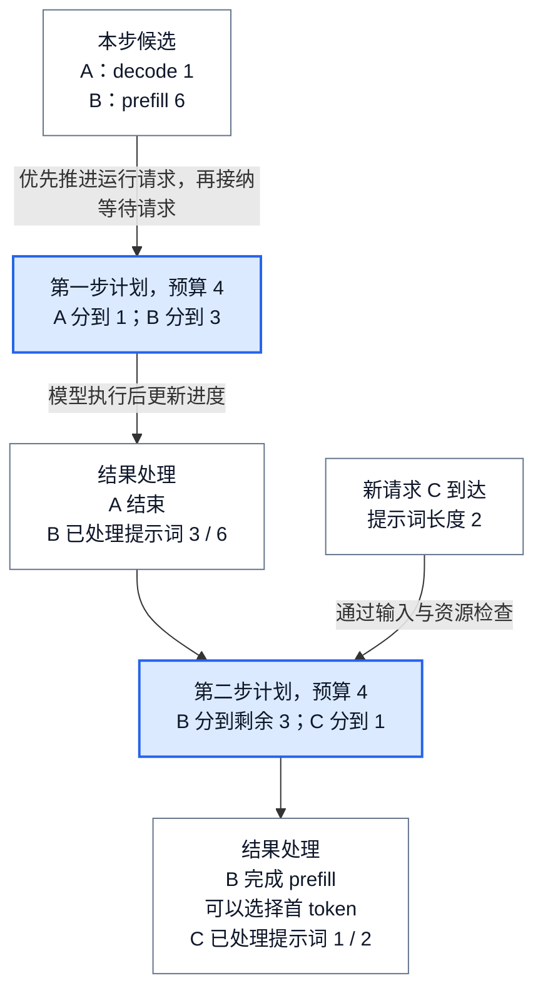
```mermaid
flowchart TB
    Q["本步候选<br/>A：decode 1<br/>B：prefill 6"]
    P["第一步计划，预算 4<br/>A 分到 1；B 分到 3"]
    O["结果处理<br/>A 结束<br/>B 已处理提示词 3 / 6"]
    C["新请求 C 到达<br/>提示词长度 2"]
    N["第二步计划，预算 4<br/>B 分到剩余 3；C 分到 1"]
    Z["结果处理<br/>B 完成 prefill<br/>可以选择首 token<br/>C 已处理提示词 1 / 2"]
    Q -->|优先推进运行请求，再接纳等待请求| P
    P -->|模型执行后更新进度| O
    O --> N
    C -->|通过输入与资源检查| N
    N --> Z
    classDef neutral fill:#ffffff,stroke:#64748b,color:#0f172a
    classDef acc1 fill:#dbeafe,stroke:#2563eb,color:#0f172a,stroke-width:2px
    class Q,O,C,Z neutral
    class P,N acc1
```

图中有两个直观结果：B 不必在一步内处理完全部输入；A 结束后，C 可以在后续调度步加入，而不必等待 B 的整个回答结束。每步总量仍受预算约束，KV 不足时还可能需要等待或抢占。因此连续组批提供的是动态安排工作的能力，不保证每个新请求都立即运行。

这一例子的决策依据来自 `Scheduler.schedule` 的 running/waiting 处理和 token 裁剪逻辑；它不是 GPU 运行记录。具体的公平性、预算相互影响和抢占代价分别见 [[02_engineering/03_infer_frameworks/vllm/07_vllm_scheduler_analysis|Scheduler]] 与 [[02_engineering/03_infer_frameworks/vllm/08_vllm_kv_cache_management_analysis|KV Cache 管理]]。

#### 2.3.3 执行：逻辑计划还不是 GPU 输入

调度结果告诉执行侧“本步有哪些请求、各算多少 token、使用哪些 block”。执行器把计划送到所需的 worker；worker 再交给 Model Runner 准备设备输入。在多卡部署中，同一请求的一步计算可能由多个 rank 共同完成，rank 是参与分布式计算的进程编号。

Runner 将请求 ID、token 进度和 block 信息组织成连续的输入 token、位置、KV 寻址信息和 attention metadata。metadata 是描述本批请求长度与缓存位置等信息的数据，供 attention 实现正确解释混合 batch。随后 Runner 选择适用的普通执行、编译或 CUDA Graph 路径。CUDA Graph 复用已捕获的 GPU 工作提交序列，可以减少反复提交的开销，但需要满足输入布局和 buffer 生命周期等条件。

模型前向计算与 token 选择在接口上可以分开：普通生成路径中，EngineCore 先取得模型执行结果；若执行接口返回 `None`，再调用采样接口取得本步 runner 输出。不能把一次 `execute_model` 调用的提交直接理解为“用户已经拿到下一个字”。

#### 2.3.4 返回：计算完成之后，还要更新进度和恢复用户输出

Runner 结果先回到 Scheduler。Scheduler 检查请求是否已结束或取消，更新 token 进度和完成原因，处理资源释放，再形成 EngineCore 输出。前端的后台输出任务读取这些输出，由 OutputProcessor 进行文本解码、停止字符串检查和结果组装，然后交给该请求的异步输出收集器。

最后，聊天服务把这些增量结果编码成 HTTP 流。一个模型 token 不一定立刻对应一个独立的网络数据块：文本解码、输出间隔、协议包装都可能影响可见粒度。流式输出关注“结果逐步可见”，与模型内部的逐 token 计算步不是同一层概念。

取消可在请求执行期间的任一步发生，并不需要等到本轮输出返回。图 3 分开表示用户可见过程和 Engine 内部的一步。上图中的“执行一步”在下图展开；两图是模块之间的语义交互，实际函数调用、进程消息和后台任务在后面的源码路线中区分。

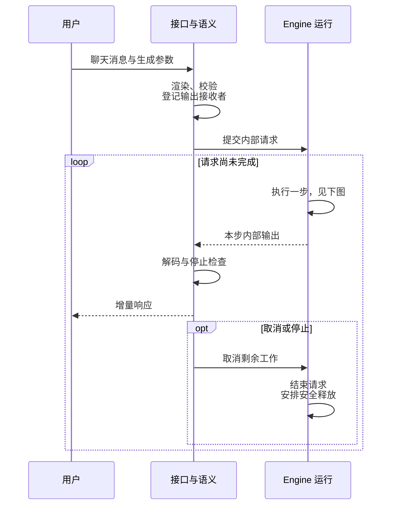
```mermaid
sequenceDiagram
    participant U as 用户
    participant I as 接口与语义
    participant E as Engine 运行
    U->>I: 聊天消息与生成参数
    I->>I: 渲染、校验<br/>登记输出接收者
    I->>E: 提交内部请求
    loop 请求尚未完成
        E->>E: 执行一步，见下图
        E-->>I: 本步内部输出
        I->>I: 解码与停止检查
        I-->>U: 增量响应
        opt 取消或停止
            I->>E: 取消剩余工作
            E->>E: 结束请求<br/>安排安全释放
        end
    end
```

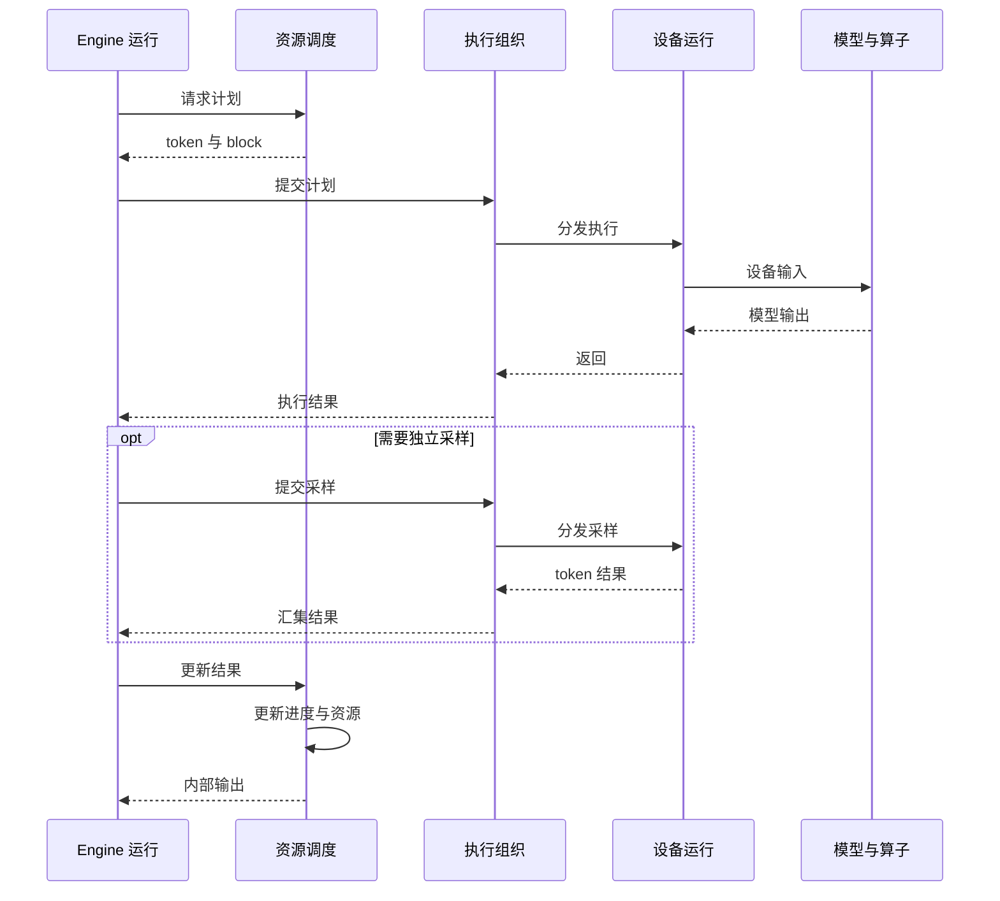
```mermaid
sequenceDiagram
    participant E as Engine 运行
    participant S as 资源调度
    participant X as 执行组织
    participant R as 设备运行
    participant M as 模型与算子
    E->>S: 请求计划
    S-->>E: token 与 block
    E->>X: 提交计划
    X->>R: 分发执行
    R->>M: 设备输入
    M-->>R: 模型输出
    R-->>X: 返回
    X-->>E: 执行结果
    opt 需要独立采样
        E->>X: 提交采样
        X->>R: 分发采样
        R-->>X: token 结果
        X-->>E: 汇集结果
    end
    E->>S: 更新结果
    S->>S: 更新进度与资源
    S-->>E: 内部输出
```

为了看清依赖，图中将一次结果处理完整画出。启用异步调度或流水线并行时，多步可以处于在途状态；`EngineCore.step_with_batch_queue` 负责组织这种重叠。它仍需要用执行结果更新 Scheduler，不能把“已排入队列”当成“已完成”。

### 2.4 合同对象、调用关系与完成信号

| 跨模块对象 | 生产者与消费者 | 读者需要辨认的完成边界 |
|---|---|---|
| `EngineCoreRequest` | 接口与语义形成，Engine 运行传输，资源调度接收 | 包含 ID、输入与任务参数；发送返回只证明提交步骤结束，尚未分配本步资源 |
| `SchedulerOutput` | 资源调度形成，Engine 运行保存并交给执行组织 | 请求数、各请求 token 数、block 和新增/结束信息构成计划；对应计划必须与其结果配对 |
| `ModelRunnerOutput` / Future | 设备运行产生，执行组织送回 Engine 运行 | Future 的就绪与 runner 输出交付定义这个接口的完成；普通路径可能先返回 `None`，再独立采样 |
| `EngineCoreOutputs` | 资源调度对账后，由 Engine 运行交给接口与语义 | 核心已处理本步结果；前端仍须解码、检查停止字符串并组装用户输出 |
| `RequestOutput` / HTTP 流 | 接口与语义交付调用者 | 用户结果已可见；取消或完成之后，缓存释放仍可能等待在途执行或传输安全结束 |

同一个请求 ID 把这些表示关联起来，但它们各自携带的信息和完成含义不同。下面把 2.3 的模块交互对应到真实函数；调用树用于定位源码，时序图用于解释对象和控制消息怎样跨边界流动。

下面只保留普通 `n=1` 生成请求中改变执行语义的调用点。标为“跨任务/进程”的部分不是直接函数调用；标为“间接”的部分省略了包装、序列化或分发辅助函数。EngineCore 树展示基本 `step` 分支，异步队列分支另读 `step_with_batch_queue`。

```text
接口与语义：OpenAIServingChat._create_chat_completion
├─ render_chat_request                         准备 EngineInput
└─ AsyncLLM.generate                           异步生成器，由响应路径迭代
   ├─ AsyncLLM.add_request
   │  ├─ InputProcessor.process_inputs          已渲染输入路径
   │  └─ AsyncLLM._add_request
   │     ├─ AsyncLLM.check_admission             前端阈值检查
   │     ├─ OutputProcessor.add_request          登记输出接收者
   │     └─ AsyncMPClient.add_request_async      Engine 运行：发出 ADD 消息
   └─ RequestOutputCollector.get                必要时等待；取得结果后 yield

Engine 运行：跨进程 ADD 消息
└─ EngineCoreProc.process_input_sockets         预处理并放入队列
   [队列交接，不是直接调用]
   EngineCoreProc.run_busy_loop
   ├─ _process_input_queue
   │  └─ _handle_client_request                 ADD 分支
   │     └─ EngineCore.add_request
   │        └─ Scheduler.add_request            资源调度：加入等待队列
   └─ _process_engine_step
      ├─ EngineCore.step                       经 self.step_fn 选择
      │  ├─ Scheduler.schedule                 资源调度：本步计划
      │  ├─ Executor.execute_model             执行组织：返回 Future
      │  │  └─ [RPC / worker 分发，间接] Worker.execute_model
      │  │     └─ GPUModelRunner.execute_model  设备运行：准备输入并执行模型与算子
      │  ├─ Scheduler.get_grammar_bitmask       资源调度：取得约束信息
      │  ├─ Future.result                      等待 execute_model 结果
      │  ├─ Executor.sample_tokens             当上述结果为 None 时调用
      │  │  └─ [RPC / worker 分发，间接] Worker.sample_tokens
      │  │     └─ GPUModelRunner.sample_tokens  设备运行：选择输出 token
      │  ├─ _process_aborts_queue               先处理执行期间发生的取消
      │  └─ Scheduler.update_from_output       资源调度：对账并形成内部输出
      └─ output_queue.put_nowait               Engine 运行：交给输出通道

接口与语义：AsyncLLM._run_output_handler 创建的后台 output_handler
├─ EngineCoreClient.get_output_async           Engine 运行：从跨进程输出通道取结果
├─ OutputProcessor.process_outputs
│  └─ RequestOutputCollector.put               交付给上面的 generate 等待者
└─ EngineCoreClient.abort_requests_async        前端停止字符串触发时取消核心剩余工作
[跨任务恢复] AsyncLLM.generate 的 yield 被聊天响应生成器消费，再形成 HTTP 输出
```

启动与请求处理属于不同生命周期。在线服务的装配入口在 `vllm/entrypoints/cli/serve.py::ServeSubcommand.cmd`。普通单 API server 分支调用 `vllm/entrypoints/launchers/api_server/entry.py::run_server`；同文件的 `run_server_worker` 和 `build_async_engine_client_from_engine_args` 展示 AsyncLLM 的创建与退出清理。HTTP 请求入口另在 `vllm/entrypoints/openai/chat_completion/api_router.py::create_chat_completion`，它不是由启动函数逐请求直接调用。

若要验证边界，可继续打开以下现成测试。本次核对了测试逻辑，未运行依赖 GPU、模型权重的推理测试，也未测量吞吐或延迟：

- `tests/v1/engine/test_admission_control.py::test_admission_reqs_rejects_at_limit`、`test_admission_tokens_rejects_at_limit`：前端两类阈值怎样触发拒绝。
- `tests/v1/engine/test_async_llm.py::test_mid_stream_cancellation`：流式取消后前端不遗留请求，并能重新使用请求 ID。
- `tests/v1/core/test_deferred_block_free.py::test_abort_defers_free`：取消后，在途步骤尚未收齐时，block 不立即释放。

## 3. 六个模块的概要设计

前面的动态路径已经确定了每个交接点。下面沿用同样的六个模块名称，分别解释输入输出、内部协作、设计取舍和失败边界；模型与算子的内部算法继续交给专题。

下面的设计理由依据当前实现和公开设计文档重建；除明确引用的设计说明外，替代方案及取舍属于分析判断，并不表示源码作者逐项记录过这些比较。

### 3.1 接口与语义：把表达差异留在计算循环之外

聊天消息、纯文本、图片以及 embedding 请求的输入输出形态不同，但调度器需要的是可以安排的计算任务。如果 Scheduler 直接处理 HTTP 字段和聊天模板，每增加一种接口，都可能改动资源分配循环。

当前实现把渲染、输入验证和输出恢复放在前端。InputProcessor 形成窄一些的内部请求，OutputProcessor 保留请求对应的文本解码、logprobs、停止条件和输出通道信息。协议层再将通用结果恢复成聊天或其他 API 的响应格式。这样更换协议可以复用核心执行，也把 tokenizer 和媒体预处理的 CPU 成本放在明确的位置。

这个边界并非把所有输入路径都立即删掉：直接传 raw prompt 给 InputProcessor 的兼容路径仍会执行，但有弃用警告；当前 `AsyncLLM` 还对这类可能阻塞的预处理使用异步包装。新接入应优先使用 Renderer 形成的输入。

**内部协作与合同。** 协议处理器拥有用户请求的格式，Renderer 拥有模板和预处理，InputProcessor 校验并形成内部请求，OutputProcessor 保存请求对应的解码器和输出收集器。输入侧逐步消除表达差异，输出侧则恢复用户语义；同一个请求在两侧始终需要可关联的 ID。

<!-- 模块图：输入侧从协议到 Renderer 再到 InputProcessor，内部请求进入 Engine；输出侧从 Engine 到 OutputProcessor 再回协议。仅表达合同流向。 -->
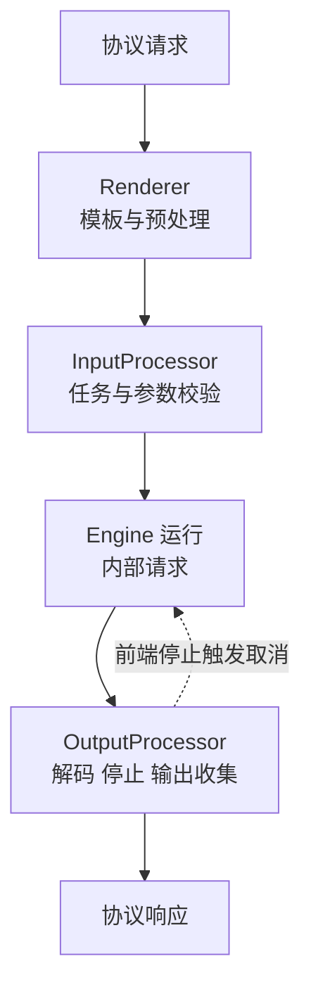
```mermaid
flowchart TB
    P[协议请求] --> T[Renderer<br/>模板与预处理]
    T --> V[InputProcessor<br/>任务与参数校验]
    V --> E[Engine 运行<br/>内部请求]
    E --> O[OutputProcessor<br/>解码 停止 输出收集]
    O --> U[协议响应]
    O -.->|前端停止触发取消| E
```

**源码与边界。** 从 `OpenAIServingChat._create_chat_completion`、`InputProcessor.process_inputs` 和 `OutputProcessor.process_outputs` 读输入与输出两侧；完整路径见 2.4。客户端传入的任务必须符合模型能力，前端队列阈值在 `AsyncLLM.check_admission` 执行。阈值拒绝属于接收控制，KV 不足属于资源调度；两者的负责对象和处理时机不同。请求 ID 冲突、输出任务异常或取消均会影响交付，不能只检查模型前向是否成功。

### 3.2 Engine 运行：让不同调用方式复用同一个核心

离线 Python 程序可以同步等待最终结果，在线服务需要异步消费多个请求的输出。如果两者各自实现一套调度和资源回收，相同请求可能在两条路径上产生不同的生命周期行为。

vLLM 把差异分布在前端 facade 和 EngineCoreClient 中，共用 EngineCore 的调度执行核心。EngineCoreClient 负责传输和消息关联；EngineCore 运行循环处理新增、取消、控制消息，并协调 Scheduler 与 Executor。前端保存“怎样交付输出”的信息，核心保存“请求怎样推进”的信息，而不是把一个 Python 对象原样共享给所有进程。

多进程客户端为此支付序列化、队列与存活检测成本。调用提交接口返回，只能说明该传输步骤已完成，不代表请求已获得 GPU 资源。输出任务和 EngineCore 也可能分别失败，因此运行状态不能只用 HTTP 进程是否存在来判断。

**内部协作与合同。** 这一模块分为前端 facade、CoreClient 和 EngineCore：facade 适配同步或异步消费，CoreClient 提供进程内或消息式访问，EngineCore 保存核心对象并反复协调计划与结果。共享的是内部合同，多进程时两端各自保存必要状态。

<!-- Engine 图：Client 把请求送到核心循环；循环把计划和结果配对后发布；异步 batch queue 只改变在途组织。 -->
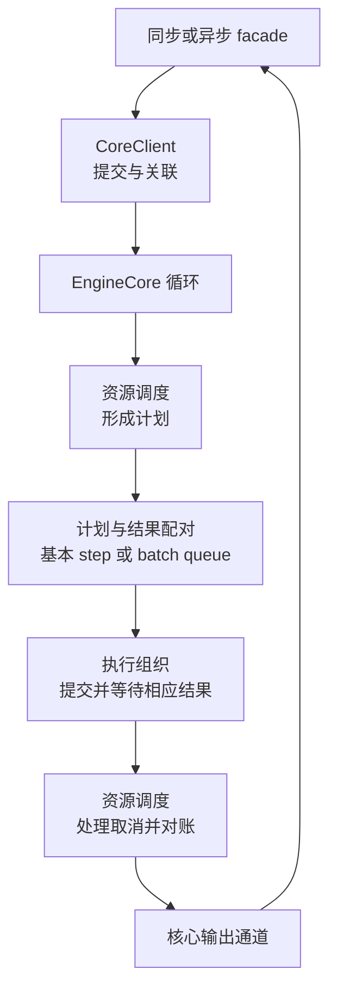
```mermaid
flowchart TB
    F[同步或异步 facade] --> C[CoreClient<br/>提交与关联]
    C --> L[EngineCore 循环]
    L --> S[资源调度<br/>形成计划]
    S --> Q[计划与结果配对<br/>基本 step 或 batch queue]
    Q --> X[执行组织<br/>提交并等待相应结果]
    X --> A[资源调度<br/>处理取消并对账]
    A --> O[核心输出通道]
    O --> F
```

**选择与限制。** `EngineCoreClient.make_client` 在同步进程内、同步多进程和异步多进程间选择，明确对 asyncio 且不开 multiprocessing 抛出 `NotImplementedError`。使用 batch queue 时，EngineCore 保留在途计划及 Future，结果更新仍与该计划对应。运行策略的收益是允许准备与设备工作重叠，代价是取消、资源回收和错误传播需要理解在途状态。具体队列时序见 [[06_vllm_engine_architecture_analysis|Engine 运行循环]]。

### 3.3 资源调度：把计算机会和 KV 容量一起考虑

只按请求先后凑一个 batch，再让 GPU 执行时发现显存不够，会让资源不足发生得太晚。Scheduler 因而在计划阶段同时考虑 token 数、请求数、encoder 工作量和 KV 空间。

KV Cache Manager 用 block 管理缓存位置。请求可以引用逻辑 block 列表，设备侧再用映射找到物理存储；请求增长时按需分配，而不是为每个请求独占一段按最大长度预留的连续 KV。Prefix Caching 还可复用符合条件的已计算前缀，不过复用的是上下文状态，不是直接复用下一 token 的概率或整段回答。

当前 `allocate_slots` 在启用 `full_sequence_must_fit` 时，先检查整请求准入容量，此处就可能返回失败。通过这项可选预检后，普通增量分配先回收已经安全越过的旧窗口，再计算本步需求与保留容量；空间不足返回失败，通过后才接入命中块和新分配块。因此失败不保证完全没有副作用，安全的旧块回收可能已经发生。Scheduler 再根据容量结果决定继续、等待或抢占。

请求进度与实际 GPU 工作存在时间差，异步路径还会提前推进部分计数。正确性要求结果返回时对账，而不是把预测进度视为已经完成。分页减少预留浪费，也增加块映射、引用计数和回收管理；抢占还可能带来重算。详细分配算法留在 KV 专页，本页保留它与调度协同的边界。

**内部协作与合同。** Scheduler 拥有 waiting/running 请求、预算和进度；KVCacheManager 管理逻辑 block、命中与引用；encoder 和 structured-output 等依赖决定某个请求是否已具备执行条件。输出是满足当前检查的一步计划，实际 tensor 由设备运行建立。

2.3.2 中 A=1、B=6、预算=4 的图就是这一模块的最小原理图：第一步分配 A=1/B=3；A 结束后，第二步重新安排 B=3/C=1。它暴露了“总计划不超过预算、长输入可以跨步、完成请求释放后续机会”的共同约束。该例假设 KV 充足；在真实执行中，token 候选还须通过 KV 落实和依赖检查，不能从算术剩余量直接推出一个请求一定被接纳。

<!-- 调度模块图：队列和依赖输入 Scheduler；token 候选接受 KV 检查；成功计划进入执行，容量不足回到等待或抢占；结果对账更新请求与缓存。 -->
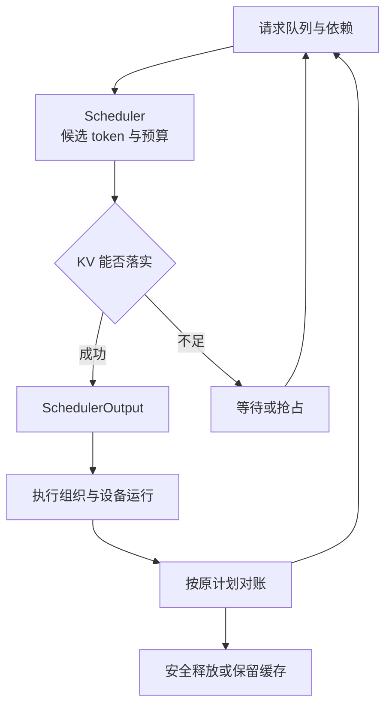
```mermaid
flowchart TB
    Q[请求队列与依赖] --> S[Scheduler<br/>候选 token 与预算]
    S --> K{KV 能否落实}
    K -->|成功| P[SchedulerOutput]
    K -->|不足| W[等待或抢占]
    W --> Q
    P --> E[执行组织与设备运行]
    E --> U[按原计划对账]
    U --> Q
    U --> F[安全释放或保留缓存]
```

**源码与边界。** 核心锚点是 `Scheduler.schedule/update_from_output`、`KVCacheManager.allocate_slots`。主流程、各状态的处理和抢占成本由 [[07_vllm_scheduler_analysis|Scheduler 每步计划]] 负责；block 生命周期由 [[08_vllm_kv_cache_management_analysis|KV 管理]] 负责。这里保留的架构结论是：资源政策和计算执行分别拥有状态，结果返回时必须重新对齐它们。

### 3.4 执行组织：把计划映射到设备与通信

调度器决定做什么，执行器决定怎样让所需设备一起做。`Executor.get_class` 按配置选择单设备、multiprocessing、Ray、external launcher 或自定义执行器。以 MultiprocExecutor 为例，它用 collective RPC 向相关 worker 派发方法调用，从指定输出 rank 收取普通结果，并可汇集 KV/encoder connector 的附加输出。

这样替换启动和通信方式时，可以复用调度器。若每种部署方式各带一套 Scheduler，调整 GPU 拓扑就会同时改变请求政策，组合测试也更难控制。worker 负责把必要的流水线接收、Runner 执行和发送组织起来；它既不能漏掉本 rank 的工作，也不能自行换一批请求。

代价是多设备必须遵守通信顺序和 buffer 使用条件。例如 Worker 会在复用相关 buffer 前等待上一轮尚未结束的流水线发送。MultiprocExecutor 的 worker monitor 发现意外退出时，会标记失败、关闭执行器并通知 Engine；这不是默认自动把丢失计算迁移到另一张卡。

**内部协作与合同。** Executor 对 EngineCore 暴露统一执行接口；worker 初始化自己的设备、接收执行方法、处理必要的流水线通信，然后交给 Runner。普通模型输出有指定的返回 rank，connector 附加结果可能另行汇集；“向所有 rank 发起调用”与“向上返回一份模型结果”同时存在。

<!-- 执行组织图：同一步计划广播给 worker；各 rank 交给 Runner；普通结果来自输出 rank，connector 输出另行聚合，最后结束 Future。底部外部通信 API 明确为依赖。 -->
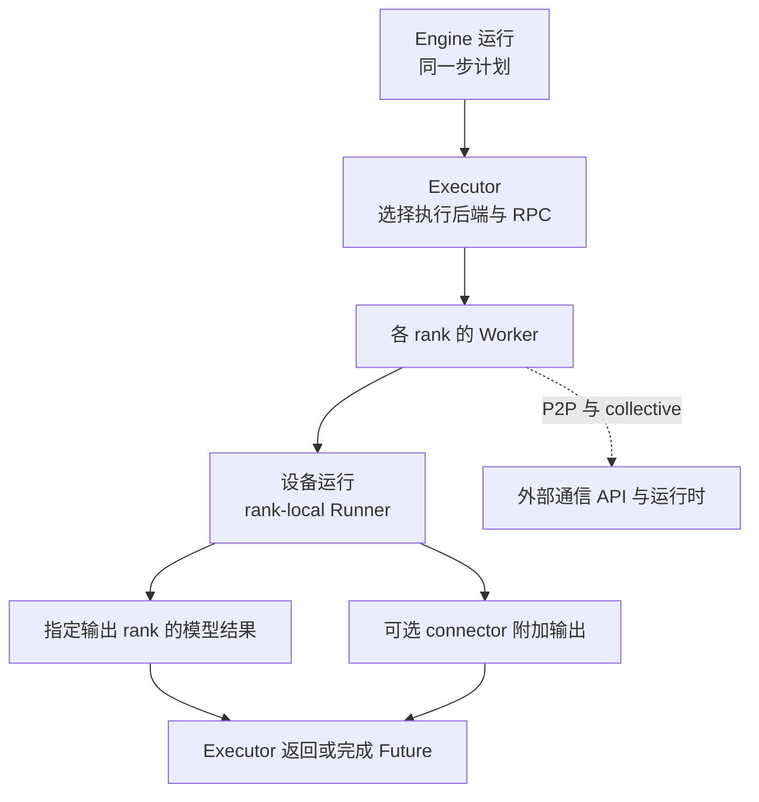
```mermaid
flowchart TB
    P[Engine 运行<br/>同一步计划] --> E[Executor<br/>选择执行后端与 RPC]
    E --> W[各 rank 的 Worker]
    W --> R[设备运行<br/>rank-local Runner]
    W -.->|P2P 与 collective| D[外部通信 API 与运行时]
    R --> O[指定输出 rank 的模型结果]
    R --> K[可选 connector 附加输出]
    O --> A[Executor 返回或完成 Future]
    K --> A
```

**源码与边界。** `Executor.get_class` 校验自定义 executor 类型；`MultiprocExecutor.collective_rpc/execute_model` 负责调用与结果；`Worker.execute_model` 负责设备执行前后的通信。进程启动、背压、响应配对和故障关闭详见 [[26_vllm_multiproc_executor_rpc_deepdive|MultiprocExecutor RPC]]。TP/PP 的张量拆分与 collective 算法属于 [[18_vllm_distributed_inference_analysis|分布式推理]]，图中不展开第三方通信库内部实现。

### 3.5 设备运行：让动态请求进入可复用的设备输入

Scheduler 的计划以请求为单位变化，GPU 输入则需要适当的 tensor 布局。如果每步从头构建所有输入，会增加 CPU 准备成本；如果长期状态和本步输入完全绑定，新请求加入或旧请求离开，又容易引发数据搬移。

两代 Model Runner 展示了不同取舍。MRV1 使用紧凑的 persistent batch，同时保留 `CachedRequestState`；空行压缩和重排时，相关 token、block 和采样状态要一起移动。MRV2 把请求活跃期间的状态行与本步输入顺序分开：保存稳定行，再为本步 gather 所需输入。请求结束或被抢占后可释放该行，恢复时重新加入，因此“稳定”不表示跨越整个请求的所有暂停与恢复过程都不变。

MRV2 的 `execute_model` 先处理完成、释放、新增与更新，再应用暂存的 block 写入，准备设备输入及 attention metadata，选择图执行路径。持久状态复用和临时传输 buffer 的生命周期必须配套，否则 CPU 改写的数据可能仍在被 GPU 异步读取。这里的收益依据设计与实现分析；本页没有测量两代 Runner 的速度。

源码的 MRV2 设计文档解释了 persistent state 与逐步输入分离的动机。两代的内部布局和异步细节分别见 [[02_engineering/03_infer_frameworks/vllm/11_vllm_model_runner_v1_analysis|Model Runner V1]]、[[02_engineering/03_infer_frameworks/vllm/12_vllm_model_runner_v2_analysis|Model Runner V2]]。

**内部协作与最小例子。** 继续使用第一步 A=1/B=3 的计划。设备侧需要的是四个输入位置及其请求归属、序列位置和 KV 地址；它不能仅把“两条请求”传给模型。下面只展示表示转换的合同，不规定两个 Runner 的全部字段或 attention backend 的最终排序。

<!-- Runner 原理图：同一 A/B 计划结合持久请求状态生成当步连续输入和 metadata，模型输出按请求映射回来；蓝色强调逻辑请求到设备表示的转换，橙色提示状态复用需要生命周期安全。 -->
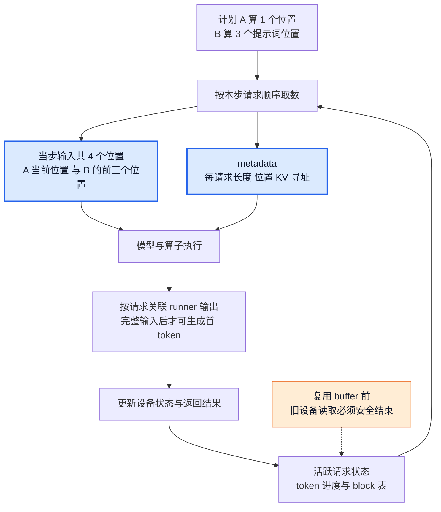
```mermaid
flowchart TB
    P[计划 A 算 1 个位置<br/>B 算 3 个提示词位置] --> G[按本步请求顺序取数]
    S[活跃请求状态<br/>token 进度与 block 表] --> G
    G --> T[当步输入共 4 个位置<br/>A 当前位置 与 B 的前三个位置]
    G --> M[metadata<br/>每请求长度 位置 KV 寻址]
    T --> F[模型与算子执行]
    M --> F
    F --> O[按请求关联 runner 输出<br/>完整输入后才可生成首 token]
    O --> U[更新设备状态与返回结果]
    U --> S
    B[复用 buffer 前<br/>旧设备读取必须安全结束] -.-> S
    classDef acc1 fill:#dbeafe,stroke:#2563eb,color:#0f172a,stroke-width:2px
    classDef acc2 fill:#ffedd5,stroke:#ea580c,color:#0f172a
    class T,M acc1
    class B acc2
```

B 的提示词仍未处理完，所以四个已计算输入位置不代表产生四个用户输出 token。这个区分把第 2 章的计划预算与设备执行合同接起来，也解释了为什么返回结果必须带请求映射。

两代 Runner 的差异也可以用 A、B 重放。取 A 已结束、下一步只安排 B 的情况，假设原来 A 在行 0、B 在行 1，并固定当步请求顺序为 B：MRV1 压紧 persistent batch，把 B 的关联输入一起移到行 0；MRV2 保留 B 的活跃状态行 1，通过当步索引取数。两条路径都要得到 B 剩余三个提示词位置，并保持 token、block 与采样状态属于同一请求。

<!-- 两代 Runner 的原理对比：同一 A/B 行占用，A 结束后分成紧凑搬移与稳定行 gather 两条可追踪分支，再汇合到同样的 B 输入；不以二维网格表达具体内存布局。 -->
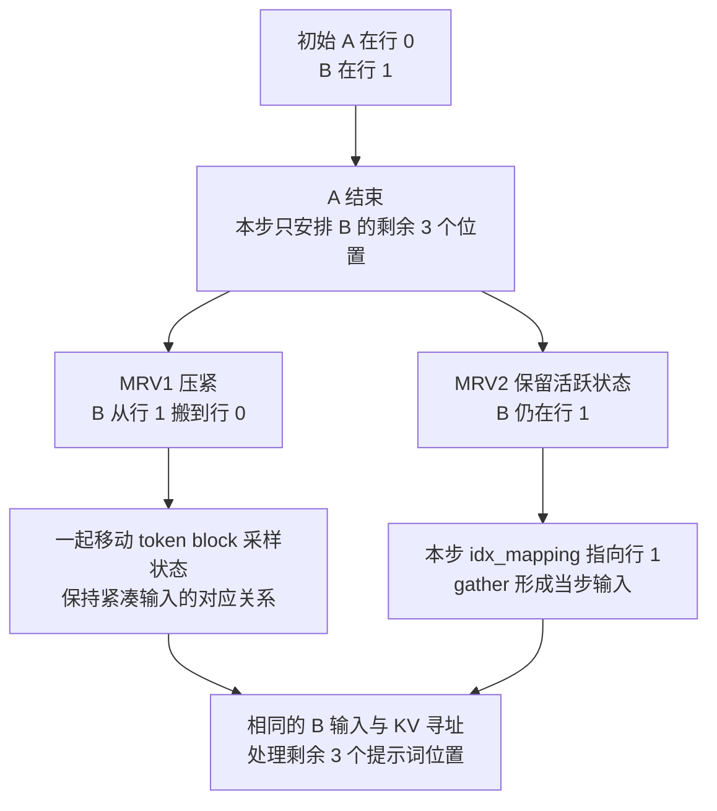
```mermaid
flowchart TB
    S[初始 A 在行 0<br/>B 在行 1] --> F[A 结束<br/>本步只安排 B 的剩余 3 个位置]
    F --> V1[MRV1 压紧<br/>B 从行 1 搬到行 0]
    F --> V2[MRV2 保留活跃状态<br/>B 仍在行 1]
    V1 --> C[一起移动 token block 采样状态<br/>保持紧凑输入的对应关系]
    V2 --> G[本步 idx_mapping 指向行 1<br/>gather 形成当步输入]
    C --> O[相同的 B 输入与 KV 寻址<br/>处理剩余 3 个提示词位置]
    G --> O
```

这个分支例子用于比较状态组织，暂不接纳 C；2.3.2 的连续组批例子则展示 C 加入后的资源计划。压紧会产生关联字段搬移，稳定行方案增加当步索引与 gather，两者的收益须结合实际工作量评估。

**源码与边界。** `VllmConfig.use_v2_model_runner` 决定默认选择和回退；`Worker.init_device` 还处理 encoder-only 专用 Runner。MRV1 的 `gpu_input_batch.py::InputBatch.condense` 处理空行；MRV2 的 `gpu/model_runner.py::GPUModelRunner._remove_request/prepare_inputs` 连接状态释放与当步取数。MRV2 的 `execute_model` 先处理结束、释放、新增和更新，随后应用 block 差量并准备输入；`sample_tokens` 承接需要采样的结果。显式指定 MRV2 优先于默认回退规则，不是“强制开启后所有特性都会受支持”。输入布局、图捕获资格和异步存储安全继续由对应 Runner 与 [[19_vllm_compilation_cudagraph_analysis|编译与 CUDA Graph]] 解释。

### 3.6 模型与算子：逐层处理模型、权重与硬件差异

模型名称只是入口。运行前还要找到实现类、构造当前 rank 需要的层、把 checkpoint 中的 tensor 写到正确参数位置，并选择适用的 attention 与计算 kernel。把这些差异直接写进 Scheduler，会让新增模型或硬件也触发调度代码修改。

ModelRegistry 负责模型实现与能力解析，loader 负责构造和权重供给，参数加载逻辑处理分片与名称映射；量化及 attention 模块还可以在加载后进行布局转换或派生数据初始化。原生实现和 Transformers 兼容实现都需要通过相应能力检查，不是任意模型文件都能直接执行。旧式外部模型构造签名仍有警告后的兼容猜参路径，不能把设计文档中的统一签名目标误写成“当前一律拒绝旧签名”。

Attention selector 根据 head size、dtype、KV 格式、滑窗或 MLA 等条件选择 backend；按 KV 类型的显式设置可以覆盖全局选择。EngineCore 在实际分配前收集设备支持的 KV layout 并确定兼容布局，使逻辑 block 在执行侧有一致解释。参数的 shape 正确还不够：分片、scale 和布局语义也必须一致。

LoRA 也依赖这个模型接合点：基础模型上的可替换层、packed 参数命名和 adapter wrapper 要相互匹配；当步每个请求选用哪个 adapter，则还需与 Runner 的批输入配合。接合机制继续阅读 [[02_engineering/03_infer_frameworks/vllm/09_vllm_model_library_analysis|模型库与 LoRA 接合]]。

这些适配提高了模型与硬件复用能力，也带来组合限制。专用 kernel、CUDA Graph 与低精度路径都只能在适用条件下启用；进入回退路径可能仍然得到正确结果，但性能与内存成本会改变。具体数学变换、kernel 行为和第三方内部实现不在此概览中展开。

**内部协作与合同。** 构造阶段先解析模型实现与能力，再初始化层和参数、加载权重，最后执行必要的量化/attention 后处理。运行阶段消费 Runner 提供的 tensor 和 metadata，在当前 rank 的模型结构内调用选定实现。静态参数结构、运行时 KV 布局和 kernel 支持条件共同构成有效执行合同。

<!-- 模型与算子图：模型配置和 checkpoint 各自进入解析及权重加载，汇合为可执行模型；运行侧 tensor/metadata 交给模型后按能力选择 backend，外部依赖放在边界外。 -->
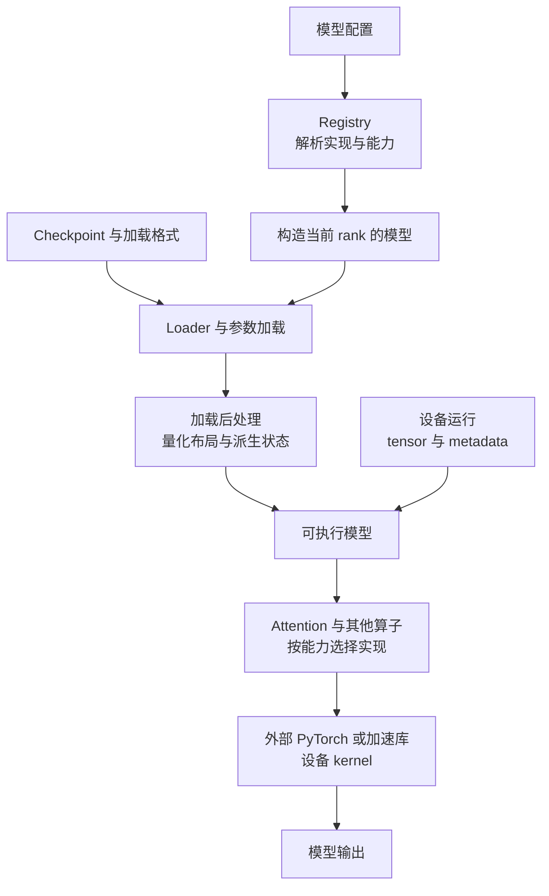
```mermaid
flowchart TB
    C[模型配置] --> R[Registry<br/>解析实现与能力]
    R --> I[构造当前 rank 的模型]
    W[Checkpoint 与加载格式] --> L[Loader 与参数加载]
    I --> L
    L --> P[加载后处理<br/>量化布局与派生状态]
    P --> M[可执行模型]
    T[设备运行<br/>tensor 与 metadata] --> M
    M --> A[Attention 与其他算子<br/>按能力选择实现]
    A --> D[外部 PyTorch 或加速库<br/>设备 kernel]
    D --> O[模型输出]
```

**源码与边界。** 构造路线由 `_ModelRegistry.resolve_model_cls`、`initialize_model`、`process_weights_after_loading` 定位；attention 选择由 `get_attn_backend` 定位。LoRA、低精度与融合不能只验证参数 shape，还要验证分片、scale、packed 命名和运行布局。详见 [[09_vllm_model_library_analysis|模型库]]、[[10_vllm_attention_backends_analysis|Attention Backend]]、[[17_vllm_quantization_analysis|量化]]；[[20_vllm_fused_ops_and_kernels_analysis|融合算子]] 与 [[21_vllm_ir_and_fusion_passes_analysis|IR 和融合 Pass]] 负责内部变换。

### 3.7 侧接能力：在既有合同上组合功能

| 能力 | 为什么需要跨模块 | 必须区分的结果 | 专题 |
|---|---|---|---|
| KV transfer / offload | Scheduler 决定逻辑进度，设备或传输实现负责实际搬运；不同 offload 路径不一定共用一个 connector | 请求结束不代表异步传输已结束；block 可能延迟释放 | [[02_engineering/03_infer_frameworks/vllm/08_vllm_kv_cache_management_analysis|本地 KV]]、[[02_engineering/03_infer_frameworks/vllm/22_vllm_disaggregated_kv_serving_analysis|跨实例 KV]] |
| 在线权重更新 | 前端发起更新，各 rank 执行，Engine 记录版本标签 | `finish_weight_update` 先等待 worker 完成，再按需写版本；版本可单独修改，不能证明多 rank 原子回滚或 cache 已处理 | [[02_engineering/03_infer_frameworks/vllm/25_vllm_weight_transfer_online_update_analysis|在线权重更新]] |
| 插件 | 平台、I/O、endpoint 和统计扩展作用于不同位置 | general plugin 的加载保护是进程内一次；endpoint 插件仅在前端，并需显式允许 | [[02_engineering/03_infer_frameworks/vllm/24_vllm_extension_plugin_system_analysis|扩展与插件]] |
| 观测与故障处理 | 核心产生调度统计，前端汇总请求结果，执行器与客户端分别检测故障 | 指标收到、进程存活、请求成功是不同事实；output handler 异常也会向等待请求传播 | [[02_engineering/03_infer_frameworks/vllm/23_vllm_observability_reliability_analysis|可观测性与可靠性]] |

这些侧接能力有多个接入点，因此不再组成与六个模块并列的第七模块。平台插件和外部后端提供实现，观测收集跨边界事件，KV transfer 与权重更新则额外引入资源持有或版本可见性合同。接入成功不能代替这些合同的验证。

### 3.8 外部底座与四个易混淆的边界

PyTorch 提供 tensor、stream、编译及通用分布式 API，设备运行时、通信库和硬件实际执行计算与搬运。vLLM 源码能证明传入的对象、调用顺序、设备/后端选择和显式等待点；本页没有读取这些依赖的内部实现，也不能由仓库代码推断某台机器实际采用哪种互联。六个主模块的职责以这些交接点为止，性能与故障定位则可能需要继续观察底层。

**Engine V1 与 Model Runner V1/V2 是两个版本维度。** `vllm.engine.LLMEngine` 和 `AsyncLLMEngine` 是 V1 实现的别名；同步 LLMEngine 保留兼容 facade，不代表另有一套 V0 核心。Runner 则由 `VllmConfig.use_v2_model_runner` 选择：显式环境变量优先；未显式选择时，特定 ROCm 模型、缺少 Triton 或不支持的特性会回退 MRV1，其余路径使用 MRV2。Worker 还会为 encoder-only 模式选择专用 Runner，不能只凭“V1”字样推断实际实现。

**软件模块数不等于进程数。** EngineCoreClient 有 in-process、同步多进程、异步多进程及 DP 变体，Executor 另有自己的设备组织选择。当前 factory 明确拒绝“asyncio 但不用 multiprocessing”的组合。官方架构文档的进程图有助于理解默认意图，但其中部分 `AsyncLLMEngine` 命名需要与当前别名、构造器对照。

**取消、抢占与传输结束不能共用一个完成标记。** 取消后，Scheduler 不再交付该请求的正常迟到结果；但新基线中，普通异步抢占产生的 stale 输出可以继续交付，同时避免再次修改已重置的进度计数。需要同一步恢复或涉及特定 KV 交接时，可进入丢弃模式。`_preempt_request` 与 `update_from_output` 必须一起读，不能把 stale 一概解释成“全部忽略”。KV 释放还可能等待在途计算或传输完成，客户端结束并不使 GPU 工作瞬间消失。

**入口兼容不等于推荐入口不变。** 当前 `vllm.entrypoints.openai.api_server` 已是带弃用警告的转发模块，实际启动实现位于 `vllm.entrypoints.launchers`。其警告文字写了 `vllm server`，但 CLI 实际注册名是 `serve`；应以 `ServeSubcommand.name` 和 parser 为准，不能直接把警告中的拼写当作可执行命令。

## 4. 架构模块与代码目录的对应关系

下表把前面六个模块映射到源码。一个文件可能同时装配多个职责，源码目录不需要与图中的模块一一对应。所有路径相对 vLLM 仓库根；本页核验的是所声明提交中的实现。

| 模块 | 优先打开的路径与符号 | 重点看什么 |
|---|---|---|
| 接口与语义 | `vllm/entrypoints/openai/chat_completion/serving.py::OpenAIServingChat._create_chat_completion`；`vllm/v1/engine/input_processor.py::InputProcessor.process_inputs`；`vllm/v1/engine/output_processor.py::OutputProcessor.process_outputs` | Renderer 输入、内部请求字段、文本与停止条件恢复 |
| Engine 运行 | `vllm/v1/engine/async_llm.py::AsyncLLM._add_request`、`AsyncLLM._run_output_handler`；`vllm/v1/engine/core_client.py::EngineCoreClient.make_client`；`vllm/v1/engine/core.py::EngineCoreProc.run_busy_loop`、`EngineCore.step` | 先登记后提交、跨进程传输、后台输出任务、调度与执行协调 |
| 资源调度 | `vllm/v1/core/sched/scheduler.py::Scheduler.schedule`、`Scheduler.update_from_output`；`vllm/v1/core/kv_cache_manager.py::KVCacheManager.allocate_slots` | 请求选择、资源检查、结果对账与安全回收 |
| 执行组织 | `vllm/v1/executor/abstract.py::Executor.get_class`；`vllm/v1/executor/multiproc_executor.py::MultiprocExecutor.execute_model`、`MultiprocExecutor.collective_rpc`；`vllm/v1/worker/gpu_worker.py::Worker.execute_model` | 后端选择、RPC、rank 结果和流水线通信 |
| 设备运行 | `vllm/config/vllm.py::VllmConfig.use_v2_model_runner`；`vllm/v1/worker/gpu/model_runner.py::GPUModelRunner.execute_model`、`GPUModelRunner.sample_tokens`；`vllm/v1/worker/gpu_model_runner.py::GPUModelRunner` | Runner 选择、输入准备、图执行和采样；两份同名类属于不同实现 |
| 模型与算子 | `vllm/model_executor/models/registry.py::_ModelRegistry.inspect_model_cls`、`_ModelRegistry.resolve_model_cls`；`vllm/model_executor/model_loader/utils.py::initialize_model`、`process_weights_after_loading`；`vllm/v1/attention/selector.py::get_attn_backend` | 模型解析、加载后转换与硬件能力选择；KV layout 的集中解析另在 `EngineCore._initialize_kv_caches` |

物理目录与职责是多对多关系：`vllm/v1/engine/` 同时容纳接口处理、CoreClient 和核心循环；`vllm/v1/worker/` 同时容纳 worker 执行边界与两代 Runner。反过来，“接口与语义”跨越 entrypoints、renderers 和 engine 的输入输出处理文件；“模型与算子”跨越 model_executor、attention、compilation、IR 和原生 kernel 接合处。

```text
vLLM/
├─ vllm/entrypoints/       接口与语义；CLI 与场景启动装配
├─ vllm/renderers/         接口与语义：模板、tokenizer、媒体预处理
├─ vllm/v1/engine/         接口与语义 + Engine 运行，共享目录而分别持有合同
├─ vllm/v1/core/           资源调度：Scheduler、KV 与依赖管理
├─ vllm/v1/executor/       执行组织：后端、RPC 与结果
├─ vllm/v1/worker/         执行组织的 worker + 设备运行的 Runner
├─ vllm/model_executor/    模型与算子：模型、加载、量化及层实现
├─ vllm/v1/attention/      模型与算子选择 + 设备运行的 metadata 接口
├─ vllm/compilation/      设备运行的图执行 + 模型与算子的编译接合
├─ vllm/distributed/      执行组织的通信 + KV/encoder/权重等侧接
├─ vllm/platforms/        后端与硬件能力选择，供多个主模块使用
├─ vllm/plugins/          扩展发现与加载，按各进程和应用生命周期调用
├─ csrc/                  原生算子实现，不是独立请求生命周期
├─ examples/              第 5 章的场景证据，不作为运行时主模块
└─ tests/                 合同、数值和失败路径的验证证据
```

所有路径相对冻结版本的 vLLM 仓库根。对于同名 `GPUModelRunner`，必须保留 `gpu_model_runner.py` 与 `gpu/model_runner.py` 的区别；源码导航只写类名会把两代实现混在一起。第三方 PyTorch、CUDA/ROCm 运行时和通信库没有对应的仓库主目录，其位置是第 2 章图中的外部底座。

## 5. 顶层使用场景：怎样启动、经过哪些模块、何时完成

场景按“用户从哪里发起工作、得到什么结果、谁负责结束”归类。依据是 CLI 注册、公共 Python 接口及冻结仓库中的示例：同一 `serve` 生命周期里的模型/协议变体放在同一场景，已有 Engine 上的控制操作列为侧接合同。这样可以覆盖入口，又能保持前四章的模块划分稳定。

| 场景 | 启动边界 | 可见输出或完成条件 |
|---|---|---|
| Python 离线生成与嵌入式流式调用 | 自有程序创建 LLM 或 AsyncLLM | 同步结果列表，或异步生成器逐次交付后结束 |
| 池化、embedding 与评分 | pooling 模型及任务 I/O processor | 向量、分类值、token 级结果或分数 |
| 在线推理服务 | `serve` 的协议服务与 Engine 生命周期 | 每个请求返回完整响应或流；服务持续运行直到关闭 |
| 文件批处理 | `run-batch` 创建 Engine 并消费 JSONL | 收齐各条结果后写出结果文件 |
| 独立渲染 | `launch render` 创建 CPU 前后处理服务 | 渲染/反渲染响应，不创建模型执行循环 |
| 多设备、多副本与前后端分离 | serve 分支、Executor、DP coordinator | rank 协作或副本路由后的请求响应 |
| 终端客户端 | `chat/complete` 访问已有服务 | 打印流并完成单次调用，或继续交互 |
| 测量、诊断与参数扫描 | `bench/collect-env` | 测量报告、环境文本或扫描工件 |

命令从冻结版本源码根目录执行，假定相应版本的 vLLM 已安装且可导入。所有 `<...>` 都是待替换输入，模型必须与场景及硬件兼容，并提前准备访问权限、权重、tokenizer 和可选依赖。本页核对脚本、解析器与实现路径，未运行 GPU 推理、多机通信或性能测量；示例数字用于说明调用，不是调优建议。

### 5.1 Python 离线生成，以及嵌入自己的流式应用

**执行入口。** `examples/basic/offline_inference/generate.py` 构造 LLM，处理脚本内四条提示词并打印结果。它通过 `EngineArgs.add_cli_args` 接收模型参数，脚本另行解析采样参数。单机最小路径要求模型与 KV 能被所选设备承载。

```bash
python examples/basic/offline_inference/generate.py --model "<生成模型或本地路径>" --max-tokens 32
```

**函数调用。** `LLM` 通过 mixin 复用离线请求处理；下列父子关系保留“先加入，再循环”的顺序。

```text
generate.py::main                            接口与语义：用户程序
├─ LLM(...)                                 装配 Engine 运行及下层
├─ LLM.generate(...)
│  └─ OfflineInferenceMixin._run_completion
│     ├─ _add_completion_requests            接口与语义：渲染并提交
│     └─ _run_engine
│        ├─ [未完成请求循环] LLMEngine.step  Engine 运行
│        │  └─ [经 CoreClient，间接] 第 2 章的调度执行与输出路径
│        └─ 按请求 ID 排序最终输出
└─ 打印 RequestOutput 中的文本
```

**软件逻辑。** 同步调用只在所有相关结果完成后交付；执行过程中仍可连续组批。

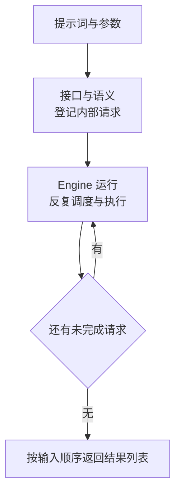
```mermaid
flowchart TB
    P[提示词与参数] --> I[接口与语义<br/>登记内部请求]
    I --> E[Engine 运行<br/>反复调度与执行]
    E --> C{还有未完成请求}
    C -->|有| E
    C -->|无| O[按输入顺序返回结果列表]
```

**完成与限制。** `generate` 对非 generate runner 抛出 `ValueError`；最终输出按请求 ID 排序恢复输入顺序。两阶段接口 `enqueue/enqueue_chat` 只加入请求，调用 `wait_for_completion` 才推进并等待结果，不能把“enqueue 非阻塞”理解为后台计算已启动。同步离线媒体预处理也不会因增加 `renderer_num_workers` 自动变成在线异步线程池路径，构造器对此有警告。

如果应用需要流式交付，可使用冻结示例 `examples/deployment/async_llm_streaming.py`：

```bash
python examples/deployment/async_llm_streaming.py
```

该脚本固定使用 `meta-llama/Llama-3.2-1B-Instruct`，需先取得权重访问权限；它没有用于替换模型的 CLI 参数。它依次运行三条提示词，并不演示三请求并发。其调用树与前面的同步路径分开：

```text
async_llm_streaming.py::main                 接口与语义：用户应用
├─ AsyncLLM.from_engine_args                 Engine 运行：创建异步核心客户端
├─ [逐条提示词] stream_response
│  └─ [异步迭代] AsyncLLM.generate           第 2 章的请求与输出闭环
└─ [finally] AsyncLLM.shutdown
```

其逻辑是“提交一条请求、逐次消费增量直到 finished、再处理下一条、最后 shutdown”；对应 2.3 的用户时序图，只把 HTTP 响应消费者替换成应用的 `async for`。进一步使用见 [[01_vllm_feature_optimizations_guide|使用指南]]。

### 5.2 池化：embedding、分类和评分

**执行入口。** `examples/basic/offline_inference/embed.py` 设置 pooling runner 并打印每条提示词的 embedding；所选模型必须支持 embed task。脚本的模型参数同样来自 EngineArgs。

```bash
python examples/basic/offline_inference/embed.py --model "<embedding 模型或本地路径>"
```

**函数调用。** 池化复用底层 Engine，但输入展开与输出恢复由任务 I/O processor 决定。

```text
embed.py::main                              接口与语义
├─ LLM(...)
├─ PoolingOfflineMixin.embed
│  └─ PoolingOfflineMixin.encode
│     ├─ _verify_pooling_task
│     ├─ io_processor.get_request_factory_offline
│     ├─ _run_tiling_engine                  按任务工厂驱动 Engine 运行
│     └─ io_processor.post_process_offline
└─ 打印 embedding
```

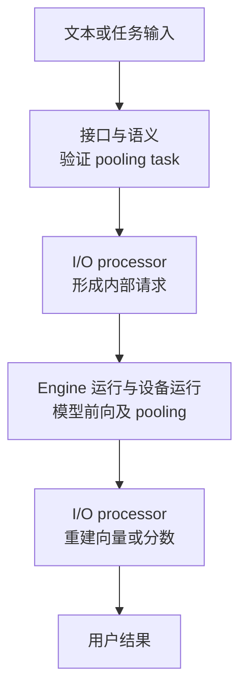
```mermaid
flowchart TB
    P[文本或任务输入] --> V[接口与语义<br/>验证 pooling task]
    V --> I[I/O processor<br/>形成内部请求]
    I --> E[Engine 运行与设备运行<br/>模型前向及 pooling]
    E --> O[I/O processor<br/>重建向量或分数]
    O --> U[用户结果]
```

**完成与限制。** `encode` 要求 pooling runner 和明确的 `pooling_task`；`embed` 自动指定 embed，分类及评分有对应公共方法。模型隐藏状态经 pooling 得到任务结果，通常不需要自回归地反复采样文本。一个用户任务可能通过 I/O processor 展开为多个内部请求，再恢复为向量或分数，因此“一个向量等于一个普通生成步”并不成立。任务字段、token 级输出与 scoring 的差异继续读 [[03_vllm_request_semantics_analysis|请求与任务语义]]。

在线对应接口 `AsyncLLM.encode` 以 `PoolingParams` 提交请求，后台输出任务把 `PoolingRequestOutput` 放入请求收集器，调用者消费到 `finished` 后结束。它沿用第 2 章的异步交付关系，输出语义则由 pooling task 决定。

### 5.3 在线服务：启动、请求交付与退出

**执行入口。** CLI 的 `ServeSubcommand.cmd` 选择 launcher，默认 Python 单 API server 路径启动 AsyncLLM 与 HTTP 服务。模型需支持被调用的接口；聊天模型还需要可用模板。

```bash
vllm serve "<生成模型或本地路径>" --host 127.0.0.1 --port 8000
```

**函数调用。** 启动过程建立对象；实际请求由 Web 框架后续分发，不能画成启动函数直接调用每个请求。

```text
cli/main.py::main                           接口与语义：解析命令
└─ ServeSubcommand.cmd
   └─ [普通单 API server] run_server
      ├─ setup_server                       绑定 socket
      └─ run_server_worker
         ├─ [async context] build_async_engine_client
         │  └─ build_async_engine_client_from_engine_args
         │     ├─ AsyncLLM.from_vllm_config  Engine 运行：装配核心客户端
         │     ├─ reset_mm_cache
         │     └─ [退出 context] AsyncLLM.shutdown
         ├─ build_and_serve                  接口与语义：应用与 HTTP 服务
         ├─ [退出 Engine context 后] 等待 shutdown_task
         └─ [finally] sock.close

[Web 框架分发；独立于启动调用栈]
chat_completion/api_router.py::create_chat_completion
└─ [serving 包装，间接] OpenAIServingChat._create_chat_completion
   └─ 第 2.4 节的输入、核心执行与后台输出调用树
```

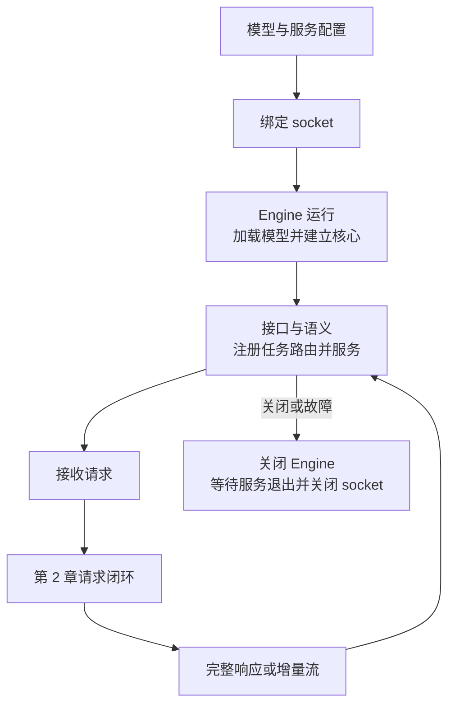
```mermaid
flowchart TB
    C[模型与服务配置] --> S[绑定 socket]
    S --> E[Engine 运行<br/>加载模型并建立核心]
    E --> A[接口与语义<br/>注册任务路由并服务]
    A --> R[接收请求]
    R --> G[第 2 章请求闭环]
    G --> O[完整响应或增量流]
    O --> A
    A -->|关闭或故障| F[关闭 Engine<br/>等待服务退出并关闭 socket]
```

**完成与限制。** 单条请求结束后服务继续运行；整个服务结束需走退出与资源清理。前端 admission 阈值、模型任务支持、客户端取消及核心死亡都有各自处理点。以下变体仍属于服务生命周期，但选择条件和完成对象不同：

| 变体及入口依据 | 如何进入 | 相比普通文本请求新增的合同 |
|---|---|---|
| embedding、分类、score/rerank | `serve` 选择兼容 pooling 模型；路由按 supported tasks 装配 | 返回向量或分数，按 5.2 的任务语义交付 |
| 多模态聊天、音频转录/翻译与实时音频 | 对应媒体模型及协议路由；示例位于 `examples/generate/multimodal/` 等目录 | 媒体预处理、encoder 和流式输入具有独立状态；详见 [[15_vllm_multimodal_execution_analysis|多模态执行]] |
| gRPC | `vllm serve "<兼容模型>" --grpc`；`ServeSubcommand.cmd` 委托 `serve_grpc` | 需 protobuf/gRPC 依赖和对应客户端；不能用 HTTP/SSE 的完成事件解释 gRPC 流 |
| Rust frontend | 配置 `VLLM_USE_RUST_FRONTEND` 与可解析的 `VLLM_RUST_FRONTEND_PATH`，经 `run_multi_api_server` | 启动外部二进制并连接核心；本页证明启动交接，协议实现与兼容性须按 Rust 路径核实 |
| vLLM-Omni | CLI 检测 `--omni` 后委托其独立入口 | 需另外安装 `vllm_omni`；本仓不提供其全部运行保证 |

gRPC、Rust 与 Omni 的调用边界如下。此处只给源代码能够证明的委托及退出边界，客户端操作与完整部署参数由 [[13_vllm_serving_control_plane_analysis|Serving 控制面]] 和对应外部项目负责。

```text
ServeSubcommand.cmd
├─ [grpc] serve_grpc                         独立协议服务；返回后 cmd 结束
└─ [Rust frontend] run_multi_api_server      Engine 运行：多进程装配
   ├─ [context] launch_core_engines
   ├─ RustFrontendProcessManager            外部二进制边界
   ├─ wait_for_completion_or_failure
   └─ [finally] 各 manager.shutdown

cli/main.py::main
└─ [--omni] find_spec("vllm_omni")
   ├─ [缺失] sys.exit(1)
   └─ [存在] vllm_omni.entrypoints.cli.main.main
```

服务变体的软件逻辑仍是配置选择后建立协议前端和计算核心，再等待服务结束；Omni 从入口整体委托，独立 render 则在 5.5 明确只建立前后处理服务。不要把未验证的外部实现画进普通 Python 请求路径。

### 5.4 文件批处理：收齐响应后写出 JSONL

**执行入口。** `RunBatchSubcommand.cmd` 调用 `vllm/entrypoints/launchers/run_batch.py::main`，自己创建 EngineClient。输入每行包含 custom_id、method、url 和 body，body 中的模型名及任务必须与实际加载模型匹配；已有在线 HTTP 服务不是这一最小路径的前提。

```bash
vllm run-batch --model "<兼容模型或本地路径>" -i "<输入.jsonl>" -o "<输出.jsonl>"
```

```text
RunBatchSubcommand.cmd                      接口与语义：文件作业
└─ launchers/run_batch.py::main
   ├─ validate_run_batch_args
   └─ [async context] build_async_engine_client
      [context body] run_batch
      ├─ build_endpoint_registry
      ├─ read_file / BatchRequestInput.model_validate_json
      ├─ handle_endpoint_request            按 url 选择任务处理器
      ├─ asyncio.gather                     等待每条响应
      └─ write_file                         写本地文件或上传
   [context 退出] 关闭 Engine 运行
```

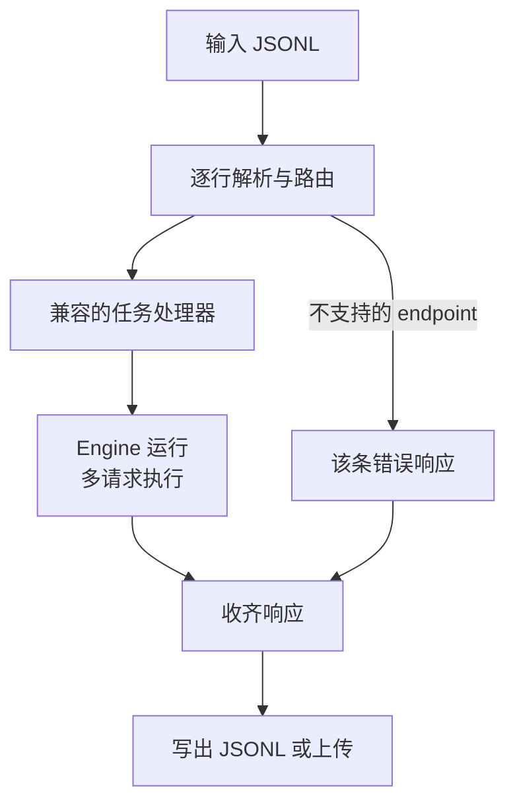
```mermaid
flowchart TB
    F[输入 JSONL] --> V[逐行解析与路由]
    V --> H[兼容的任务处理器]
    H --> E[Engine 运行<br/>多请求执行]
    V -->|不支持的 endpoint| X[该条错误响应]
    E --> G[收齐响应]
    X --> G
    G --> W[写出 JSONL 或上传]
```

**完成与限制。** 结果计算完成后还需等待 `write_file` 完成；输出文件出现不能证明每条请求都成功，应检查各条结果。路由不支持可以形成逐条错误；JSON 解析等发生在响应任务收集之前的错误则可能终止整个作业，不能假定任何坏行都会被转成结果记录。输入整体读取、响应整体收集的实现也意味着作业规模受主机内存约束。

> [!contradiction] 批接口注释与实现不一致
> `BatchRequestInput` 的类注释仍写只支持聊天，`build_endpoint_registry` 实际注册了聊天、embedding、score、rerank、音频转录和翻译。以 registry 和 handler 的可用性判断当前支持范围；它并未因此支持任意 OpenAI endpoint，例如普通 completion URL 不能由聊天匹配条件推导得到支持。

### 5.5 独立渲染：只运行输入输出处理

**执行入口。** `RenderSubcommand` 复用服务解析器，创建不做模型推理的 render 服务。需要模型对应 tokenizer、模板和 processor 配置；无需为该进程准备模型 GPU 执行。

```bash
vllm launch render "<模型或本地配置路径>" --host 127.0.0.1 --port 8100
```

```text
LaunchSubcommand.cmd
└─ RenderSubcommand.cmd
   └─ run_launch_fastapi
      ├─ setup_server
      ├─ AsyncEngineArgs.create_model_config
      ├─ 清除 quantization；构造 VllmConfig
      ├─ build_and_serve_renderer
      │  ├─ build_app(args, ("render",))
      │  ├─ init_render_app_state
      │  └─ serve_http
      ├─ 等待 shutdown_task
      └─ [finally] sock.close
```

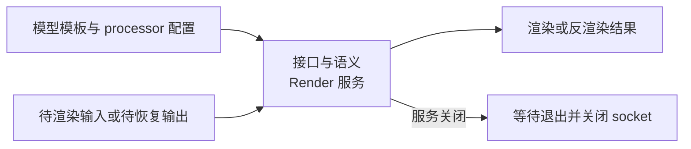
```mermaid
flowchart LR
    C[模型模板与 processor 配置] --> R[接口与语义<br/>Render 服务]
    I[待渲染输入或待恢复输出] --> R
    R --> O[渲染或反渲染结果]
    R -->|服务关闭| S[等待退出并关闭 socket]
```

**完成与限制。** `run_launch_fastapi` 只创建模型配置，清除 quantization 以跳过不需要的量化设备检查，并抑制 CPU KV 容量配置的无关警告。该路径不创建 Scheduler 和模型 GPU 缓存，因此 render 成功证明的是预处理/后处理完成，下一步模型计算仍需独立执行服务。其具体请求合同见 [[03_vllm_request_semantics_analysis|Render 与请求语义]]。

### 5.6 多设备、多副本与前后端分离

**执行入口。** 仍从 `serve` 进入，配置决定一个模型跨几张卡，以及有多少 Engine 副本承接请求。下面分别给出单机 TP=2 与 DP=2 的独立模板，两者各自需要匹配的两设备资源。

```bash
vllm serve "<支持 TP 的模型>" --tensor-parallel-size 2
vllm serve "<兼容模型>" --data-parallel-size 2
```

```text
ServeSubcommand.cmd                         接口与语义：选择部署
├─ [单 API server] run_server              Engine 运行：复用 5.3
├─ [多个 API server 或 Rust] run_multi_api_server
│  ├─ [context] launch_core_engines        创建 Engine 与可选 coordinator
│  ├─ APIServerProcessManager / RustFrontendProcessManager
│  ├─ wait_for_completion_or_failure
│  └─ [finally] manager.shutdown
├─ [multi-port external LB] run_dp_supervisor
└─ [headless] run_headless
   ├─ [远端 TP/PP worker 节点] MultiprocExecutor / start_worker_monitor
   └─ [本地 Engine 节点，由 run_headless 顺序执行]
      ├─ CoreEngineProcManager(...)         构造 manager
      ├─ engine_manager.monitor_engine_liveness
      └─ [finally] engine_manager.shutdown

EngineCore.__init__                         Engine 运行
└─ 配置选定的 Executor                     执行组织：每个模型副本的 rank 集合
   └─ [分发，间接] 各 Worker 与 Runner     设备运行：执行本 rank 工作
```

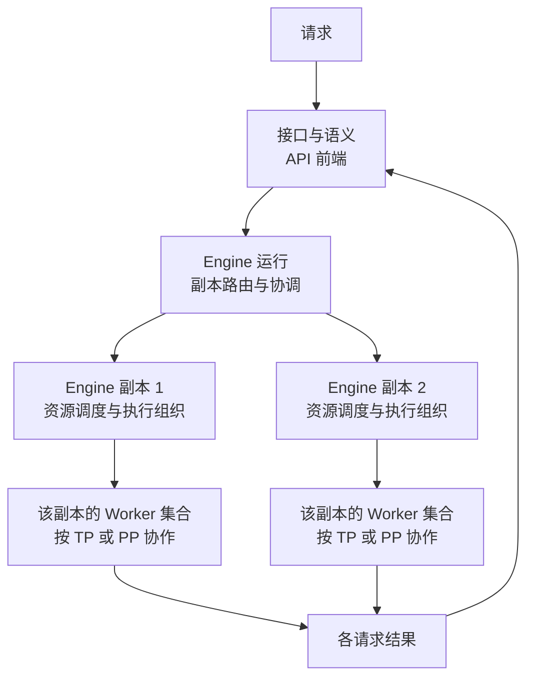
```mermaid
flowchart TB
    P[请求] --> A[接口与语义<br/>API 前端]
    A --> D[Engine 运行<br/>副本路由与协调]
    D --> E1[Engine 副本 1<br/>资源调度与执行组织]
    D --> E2[Engine 副本 2<br/>资源调度与执行组织]
    E1 --> R1[该副本的 Worker 集合<br/>按 TP 或 PP 协作]
    E2 --> R2[该副本的 Worker 集合<br/>按 TP 或 PP 协作]
    R1 --> O[各请求结果]
    R2 --> O
    O --> A
```

图同时表示两个可组合维度，不要求上面两个模板同时执行：TP/PP 让一个模型的计算由多个 rank 完成，DP 引入多个 Engine 的请求承载；MoE 等配置还会增加跨 DP 协调。

**完成与限制。** `ServeSubcommand.cmd` 对多种 DP 负载均衡模式做互斥检查；headless 不启动 API server，并拒绝与正的 API server 数量混用。单进程 `LLM(data_parallel_size>1)` 在普通配置下有拒绝 guard，需要使用明确的多进程部署路径。Ray、external launcher 和远端 headless 还需要各自的集群地址、rank 配置与进程环境；当前 factory 接受某个名称，不证明所有调度组合都已受支持。

KV/encoder 分离是资源传输维度：发送方、接收方、路由服务和 connector 必须协同，请求结束后还可能有未完成传输。跨实例块的有效性与释放详见 [[22_vllm_disaggregated_kv_serving_analysis|分离式 KV Serving]]，多机启动及并行约束详见 [[18_vllm_distributed_inference_analysis|分布式推理]]。

### 5.7 终端客户端：向已有服务发送请求

**执行入口。** `ChatCommand` 和 `CompleteCommand` 创建 OpenAI 客户端，访问已经运行的兼容服务。客户端本地不加载模型；若服务配置鉴权，应按同一客户端的鉴权选项配置访问。

```bash
vllm chat --url http://127.0.0.1:8000/v1 --model-name "<服务模型名>" --quick "请介绍连续组批"
vllm complete --url http://127.0.0.1:8000/v1 --model-name "<服务模型名>" --quick "连续组批是"
```

```text
ChatCommand.cmd / CompleteCommand.cmd       接口与语义：终端客户端
├─ _interactive_cli                        创建客户端并确定模型名
├─ [外部 OpenAI 客户端] chat.completions.create / completions.create
└─ _print_chat_stream / _print_completion_stream
   └─ 消费网络流并打印
```

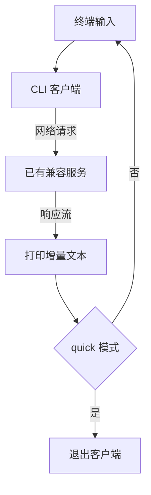
```mermaid
flowchart TB
    U[终端输入] --> C[CLI 客户端]
    C -->|网络请求| S[已有兼容服务]
    S -->|响应流| P[打印增量文本]
    P --> Q{quick 模式}
    Q -->|是| D[退出客户端]
    Q -->|否| U
```

**完成与限制。** quick 模式在本次流消费完后返回；交互模式继续接收输入，直到 EOF 或信号。网络错误、模型名不匹配或服务任务不支持会影响调用结果；不能通过客户端进程成功启动判断服务器健康。客户端耗时还包含网络和协议成本，测量方法继续见 [[04_vllm_performance_tuning_guide|性能评测与调优]]。

### 5.8 基准、环境诊断与参数扫描

**执行入口。** `BenchmarkSubcommand` 注册 throughput、latency、serve、startup、mm-processor 与 sweep；`CollectEnvSubcommand` 收集环境。它们按测量对象分别驱动 Engine、已有服务或 CPU processor。

```bash
vllm bench throughput --model "<生成模型>" --dataset-name random --num-prompts 16
vllm bench serve --model "<服务模型名>" --dataset-name random --num-prompts 16
vllm collect-env
```

第二条命令要求默认地址上的兼容服务已启动，也可按该子命令解析器指定服务地址。第一条会创建本地 Engine；随机负载和少量提示词仅说明命令入口，不代表可据此得出生产容量。

```text
cli/main.py::main
├─ [bench] 解析器绑定 Benchmark*Subcommand.cmd
│  ├─ [throughput] benchmarks/throughput.py::main
│  │  ├─ validate_args / get_requests
│  │  └─ run_vllm / run_vllm_async           Engine 运行：本地测量
│  ├─ [serve] benchmarks/serve.py::main
│  │  └─ main_async                        外部 HTTP 服务：请求与结果统计
│  └─ [其他测量] 对应子命令的 cmd 与测量模块
└─ [collect-env] CollectEnvSubcommand.cmd
   └─ collect_env.main                     输出软件及硬件环境信息
```

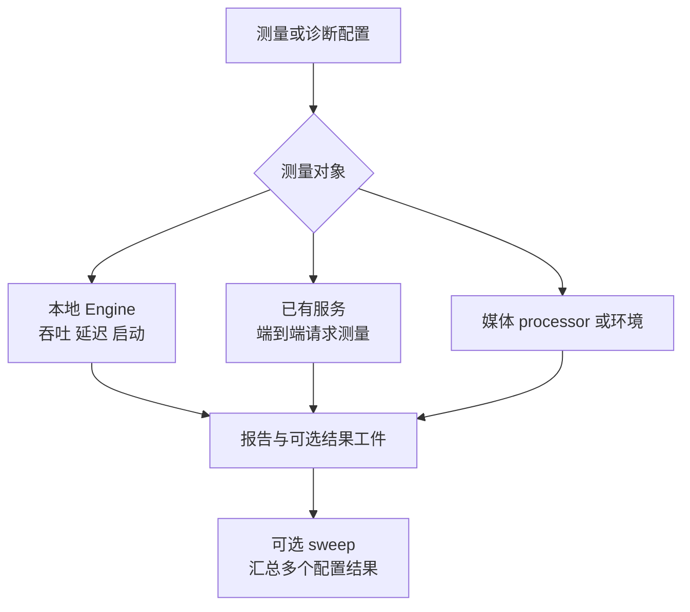
```mermaid
flowchart TB
    C[测量或诊断配置] --> S{测量对象}
    S --> L[本地 Engine<br/>吞吐 延迟 启动]
    S --> R[已有服务<br/>端到端请求测量]
    S --> M[媒体 processor 或环境]
    L --> O[报告与可选结果工件]
    R --> O
    M --> O
    O --> W[可选 sweep<br/>汇总多个配置结果]
```

**完成与限制。** 测量返回或结果写出才构成该作业完成；serve benchmark 中还需看请求成功率，不能把全部发出等同于全部成功。startup 测装载阶段，latency 测单批，mm-processor 测媒体预处理，sweep 组织参数扫描，各自指标不能直接互换。`VLLM_USE_RUST_BENCH` 可以把 `bench serve` 委托给 Rust 二进制，缺少解析出的二进制路径会直接报错；上述调用树针对 Python 分支。环境报告用于 [[05_vllm_debugging_troubleshooting_guide|调试与排障]]，不能单独证明推理数值正确。

### 5.9 已有 Engine 上的控制操作与外部生态

公共 API 还包括 sleep/wake、cache reset、profile、collective RPC 以及权重传输和版本更新。它们作用在已经创建的 Engine 上，沿用创建该 Engine 的场景前提，另有各自的完成条件：

| 操作族 | 执行边界与输出 | 不能由一次返回推导的结论 |
|---|---|---|
| sleep / wake 与缓存重置 | 前端控制请求经 Engine/Executor 到设备或缓存管理者 | 重新唤醒不自动证明所有外部资源和调用者状态已恢复 |
| profile 与 metrics | 设备侧或前端开始/结束记录，读取统计快照 | 指标快照不等于所有在途请求已结束；profile 也不等于端到端性能测量 |
| 在线权重更新 | 外部提供权重，经各 rank 的更新接口完成，并可写版本标签 | `finish_weight_update` 等待 worker 后按需记版本；单独改版本标签不证明多 rank 原子回滚或缓存已处理 |
| 模型/平台/I/O/endpoint 插件 | 在所属模块与进程生命周期加载，提供选择或转换实现 | general plugin 的进程内加载保护不代表全局恰好一次；endpoint 插件需显式允许 |
| Ray Data、训练器或 Omni | 外部系统拥有数据作业、训练更新或独立服务生命周期 | 本仓交接成功不足以证明外部任务持久化、容错或训练完成 |

这些操作的命令及前置条件由 [[25_vllm_weight_transfer_online_update_analysis|在线权重更新]]、[[24_vllm_extension_plugin_system_analysis|插件扩展]] 和 [[23_vllm_observability_reliability_analysis|观测与可靠性]] 维护。本页的架构交接是：调用者发出控制意图，Engine 运行关联和分发，所属资源或设备模块执行，最后按该操作合同报告结果；其余训练梯度、数据作业和第三方内部状态仍由外部系统拥有。

## 6. 小结与专题阅读入口

读到这里，应能把一条请求分解为：**解释输入、维护执行循环、安排资源、组织设备、准备运行输入、执行模型，再处理并交付结果。** 可以从最感兴趣的问题继续，不必按文件编号全部读完。

| 想进一步理解的问题 | 下一页 |
|---|---|
| 先亲手完成一次模型调用？ | [[01_vllm_feature_optimizations_guide|使用指南]] |
| 服务已经能用，怎样测量和调优？ | [[04_vllm_performance_tuning_guide|性能评测与调优]] |
| 报错、卡住或输出异常，怎样定位？ | [[05_vllm_debugging_troubleshooting_guide|调试与排障]] |
| 输入、任务、停止条件和协议输出为何不同？ | [[02_engineering/03_infer_frameworks/vllm/03_vllm_request_semantics_analysis|请求语义]] |
| 请求怎样在客户端与核心之间推进？ | [[02_engineering/03_infer_frameworks/vllm/06_vllm_engine_architecture_analysis|Engine 架构]] |
| 长短请求怎样混合调度，显存紧张时怎么办？ | [[02_engineering/03_infer_frameworks/vllm/07_vllm_scheduler_analysis|Scheduler]]、[[02_engineering/03_infer_frameworks/vllm/08_vllm_kv_cache_management_analysis|KV Cache]] |
| 模型怎样加载，attention 实现怎样选？ | [[02_engineering/03_infer_frameworks/vllm/09_vllm_model_library_analysis|模型库]]、[[02_engineering/03_infer_frameworks/vllm/10_vllm_attention_backends_analysis|Attention Backend]] |
| 如何减少生成步数或设备提交成本？ | [[02_engineering/03_infer_frameworks/vllm/16_vllm_speculative_decoding_analysis|投机解码]]、[[02_engineering/03_infer_frameworks/vllm/19_vllm_compilation_cudagraph_analysis|编译与 CUDA Graph]] |
| 量化、融合算子和编译 Pass 怎样配合？ | [[02_engineering/03_infer_frameworks/vllm/17_vllm_quantization_analysis|量化]]、[[02_engineering/03_infer_frameworks/vllm/20_vllm_fused_ops_and_kernels_analysis|融合算子]]、[[02_engineering/03_infer_frameworks/vllm/21_vllm_ir_and_fusion_passes_analysis|IR 与融合 Pass]] |

六个模块形成稳定的职责划分：接口交付语义，Engine 推进生命周期，Scheduler 决定资源计划，Executor 组织设备，Runner 形成当步输入，模型与算子完成计算。选择使用场景时，先确定交付的是文本、向量、文件还是控制结果，再决定同步/异步、服务/离线和单模型多卡/多副本部署；每个选择都对应第 5 章的一种完成条件。具体机制的适用组合与验证范围以其权威专题为准。

## Related Pages

- [[02_engineering/03_infer_frameworks/vllm/index|vLLM 知识地图]] — 按读者问题选择全部专题及阅读依赖。
- [[02_engineering/03_infer_frameworks/vllm/07_vllm_scheduler_analysis|Scheduler]] — 用逐步预算与抢占案例展开动态请求的资源约束。
- [[02_engineering/03_infer_frameworks/vllm/11_vllm_model_runner_v1_analysis|Model Runner V1]] — 深入紧凑 persistent batch 的输入组织与异步处理。
- [[02_engineering/03_infer_frameworks/vllm/12_vllm_model_runner_v2_analysis|Model Runner V2]] — 深入状态行与本步设备输入分离的实现。
- [[02_engineering/03_infer_frameworks/vllm/18_vllm_distributed_inference_analysis|分布式推理]] — 展开执行组织中的 rank、并行轴和通信顺序。
- [[02_engineering/03_infer_frameworks/vllm/23_vllm_observability_reliability_analysis|可观测性与可靠性]] — 从用户症状回溯调度、设备执行和进程故障。
