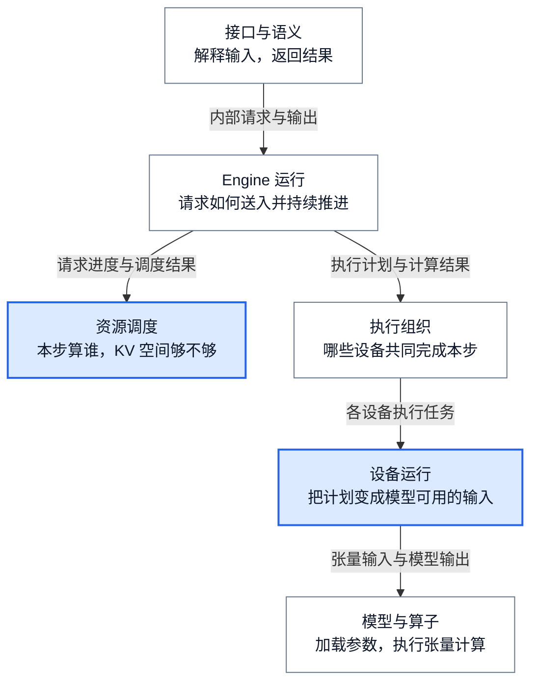
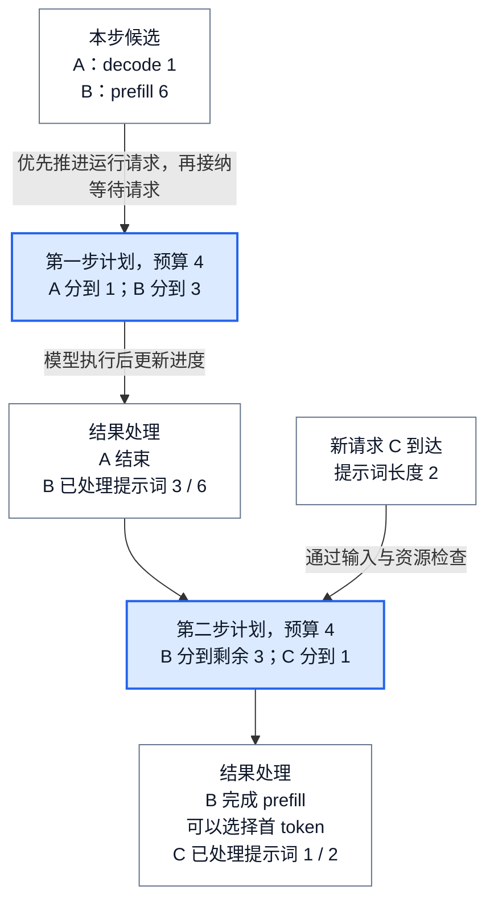
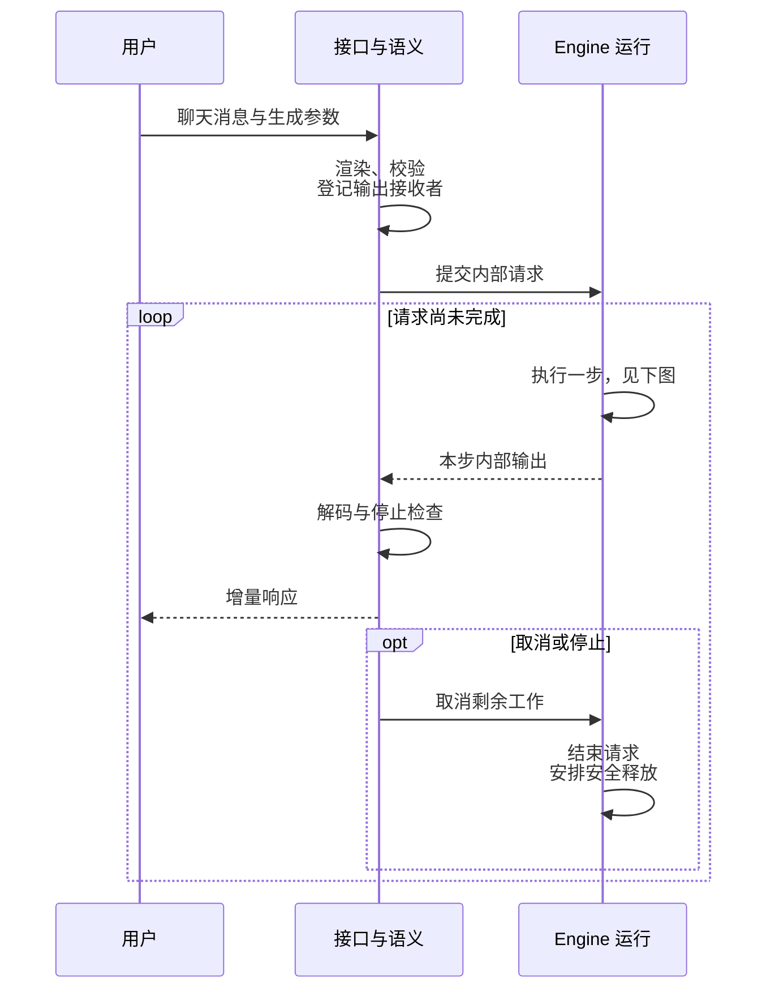
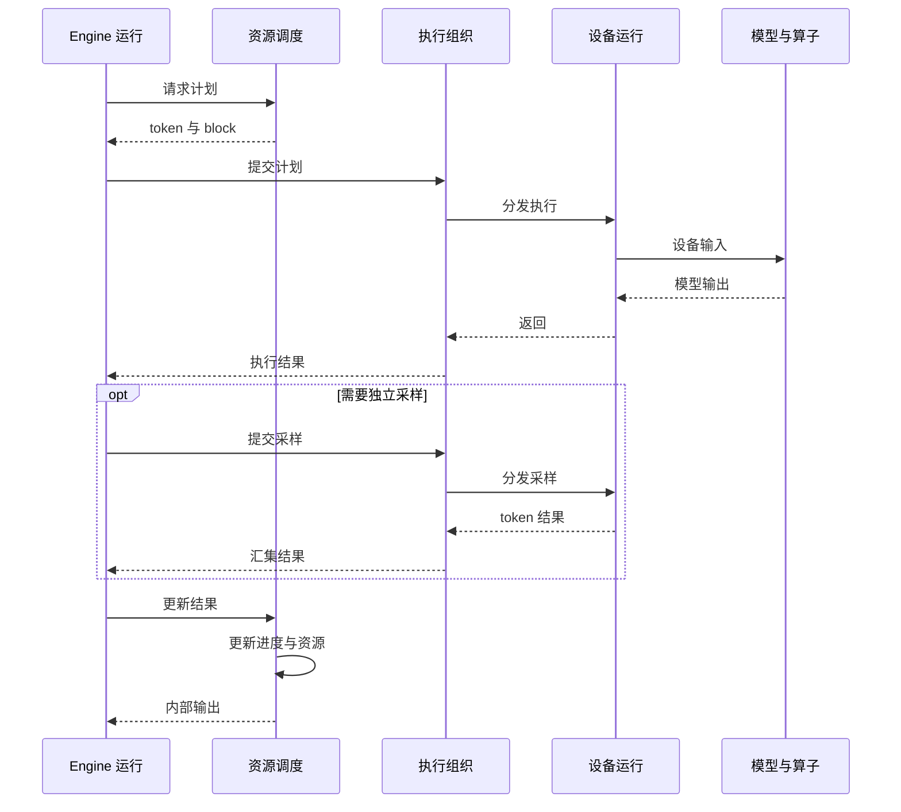

# vLLM 架构概览：从一次模型计算到并发推理服务

> **源码基线**：`vllm-project/vllm@199cb9b964822e59ab9b58d88e7be31eb419a2ae`（`main` 快照，2026-09-07 UTC）
> **主题**：从多个请求同时生成文本的问题出发，认识 vLLM 的模块分工，再跟随一条在线请求理解输入处理、调度、设备计算和结果返回。最后对照源码入口、部署变体与后续专题。
> **适用范围**：以普通自回归文本生成和 Python 在线前端为主线；模块算法、使用教程与专项调优由对应专题展开。
> **最近更新**：2026-09-08。重构为可直接开始阅读的架构入口，并按新基线核验实现。

## 1. 模型已经能运行，为什么还需要 vLLM？

假设已经把一个语言模型加载到 GPU 上。给它一段提示词，执行模型计算，就可以得到后续 token 的预测。**token 是模型处理文本的基本单位，不一定对应一个汉字或一个单词。** 对普通自回归生成，系统选择下一个 token，再把它接回上下文，继续生成，直到遇到停止条件。

对于一个请求，这个循环容易理解。但如果三个用户同时使用同一张 GPU，问题马上变了：

- A 已经开始回答，每隔一会儿就需要生成后续文本。
- B 刚提交一篇长文，需要先处理大量输入。
- C 在 A 和 B 运行期间到达，希望尽快获得响应。

如果每个请求独占 GPU 直到结束，后面的请求要长时间等待；如果先凑齐一批、等整批全部完成才换下一批，短请求结束后留下的执行机会又难以及时交给新请求。即使把所有请求放在一起算，也仍需解决显存够不够、各自算到哪里、下一轮处理多少，以及结果应该返回给谁。

这里先认识两个后文反复出现的词：

| 概念 | 在普通文本生成中做什么 | 对服务的影响 |
|---|---|---|
| **Prefill：处理提示词** | 计算输入上下文，建立后续生成需要的中间结果；完整处理提示词后，可以选择第一个输出 token | 长输入可能占用较多单步计算时间，影响首段输出何时到达 |
| **Decode：继续生成** | 利用已有上下文，反复处理新 token 并选择后续 token | 持续占用计算和上下文存储，直到完成或取消 |
| **KV Cache：缓存注意力中间结果** | 保存已经计算的位置的 Key/Value，让后续注意力计算复用它们 | 请求越多、上下文越长，容量管理越重要；缓存不是最终回答 |

vLLM 在模型外面提供一套推理运行系统：接收不同形式的请求，安排每一步的计算，管理 KV 空间，把逻辑请求组织成 GPU 输入，再将计算结果返回给对应调用者。模型与底层算子的效率仍然重要，但它们只是整个服务的一部分。

上面的排队对比是帮助理解设计的简化分析，不是实测性能结论。当前源码能直接验证的是：`Scheduler.schedule` 每步重新选择工作，而 `LLM.generate` 可以把一组提示词交给引擎自动组批。真正的调度还受请求优先级、token 预算、KV 容量和模型能力等条件约束。

接下来先认识负责这些工作的模块，再追踪 A、B、C 怎样共用这个系统。

## 2. 先认识六个模块：分别解决哪一部分问题？

下面按软件职责划分六个模块。**模块不等于进程，也不等于源码中的一个目录。** 例如 `AsyncLLM` 同时装配输入输出处理和 Engine 客户端，但这两部分解决的问题不同。

图 1 表示依赖关系：上层组织请求，下层提供执行能力；箭头不是每个函数的实际调用顺序。结果沿相应接口返回。跨实例传输、监控和插件等能力会接入多个模块，在后文单独介绍。



| 模块 | 负责回答什么 | 主要输入与输出 | 掌握的信息及分工边界 |
|---|---|---|---|
| **接口与语义** | 聊天消息怎样变成模型输入？token 怎样变回文本？ | 消息、提示词、媒体和参数 → 内部请求；内部结果 → 用户响应 | 保存模板、tokenizer、输出收集器和前端请求信息；不分配 GPU KV block |
| **Engine 运行** | 怎样接收、关联、推进和终止请求？ | 请求及控制消息 ↔ 调度计划、执行结果、输出消息 | 管理客户端连接、运行循环与存活检测；调用调度器和执行器，不自行实现它们的算法 |
| **资源调度** | 哪些请求在本步处理多少 token？ | 等待/运行请求及剩余资源 → `SchedulerOutput` | 管理请求进度、逻辑 KV block 和完成状态；输出逻辑计划，不构造设备 tensor |
| **执行组织** | 同一个计划怎样由一张或多张卡执行？ | `SchedulerOutput` → 各设备执行 → 汇集结果 | 管理 worker、rank 和通信；不另起一套请求调度政策 |
| **设备运行** | 动态请求怎样进入高效的模型执行路径？ | 逻辑计划 → 输入 tensor、attention metadata → runner 结果 | 管理请求行、设备 buffer 和图执行；不解析 HTTP 消息 |
| **模型与算子** | 当前模型、参数格式和硬件组合怎样实际计算？ | 配置与 checkpoint → 可执行模型；tensor → 模型输出 | 负责模型实现、参数与算子选择；不决定全局请求队列 |

这套划分保留了两个关键区分：**决定做多少工作，与把工作算出来，是不同职责；保存请求逻辑进度，与保存 GPU 上的 tensor，也不是同一份数据。** 下面的请求过程会说明它们为什么需要协作。

## 3. 跟随一条请求：从聊天消息到流式回答

以普通文本模型的一次在线聊天请求为例：模型和服务已经启动，用户发送消息并请求流式返回。不启用投机解码、跨实例 KV 或多模态扩展；这些变体在主线清楚后再进入。

### 3.1 输入：先把用户的表达转换成计算任务

HTTP 路由把请求交给聊天服务处理器。处理器通过 Renderer 应用聊天模板并准备 token 输入，再建立采样参数，例如生成长度和 token 选择方式。模型实际看到的是处理后的序列，不是原始 JSON 中的角色、消息列表和字段名。

`AsyncLLM` 随后通过 InputProcessor 校验输入、任务和参数，形成 `EngineCoreRequest`。这份内部请求携带请求 ID、token 或 embedding、生成/池化参数及必要的路由信息。前端先在 OutputProcessor 中登记结果接收者，再通过 EngineCoreClient 发出请求，避免结果返回时找不到对应的输出通道。

新基线还允许前端按配置的队列阈值拒绝请求：`AsyncLLM.check_admission` 检查未完成请求数以及仍在 prefill 的请求所对应的提示词 token 总量。**这是前端过载控制；本步能不能获得计算和 KV 空间，仍要由资源调度决定。** 两者不能合并成“请求已被接收，所以已经可以执行”。

协议差异、池化任务和输入输出转换继续阅读 [[02_engineering/03_infer_frameworks/vllm/03_vllm_request_semantics_analysis|请求语义]]。

### 3.2 调度：一条请求通常会跨越很多步

EngineCore 的运行循环处理新请求和取消等消息，再调用调度器生成本步计划。对于 B 这样的长输入，可能先处理部分提示词；对于 A 这样的生成中请求，则继续处理新的 token。Scheduler 用各请求“已有多少可计算 token、已经计算到哪里”统一描述进度，而不是让两套完全独立的 prefill/decode 调度器各自组批。

下图用一个**教学用的普通同步调度例子**说明这种组织方式：单步 token 预算取 4，A 本步需计算 1 个 decode token，B 的提示词有 6 个 token，C 的提示词有 2 个 token、在下一步前到达。假设允许分块 prefill，KV 与请求数容量充足，没有额外调度限制，A 在第一步结果返回后结束。数字表示模型本步处理的输入位置数，不是本步必然输出的 token 数，也不是生产推荐参数。



图中有两个直观结果：B 不必在一步内处理完全部输入；A 结束后，C 可以在后续调度步加入，而不必等待 B 的整个回答结束。每步总量仍受预算约束，KV 不足时还可能需要等待或抢占。因此连续组批提供的是动态安排工作的能力，不保证每个新请求都立即运行。

这一例子的决策依据来自 `Scheduler.schedule` 的 running/waiting 处理和 token 裁剪逻辑；它不是 GPU 运行记录。具体的公平性、预算相互影响和抢占代价分别见 [[02_engineering/03_infer_frameworks/vllm/07_vllm_scheduler_analysis|Scheduler]] 与 [[02_engineering/03_infer_frameworks/vllm/08_vllm_kv_cache_management_analysis|KV Cache 管理]]。

### 3.3 执行：逻辑计划还不是 GPU 输入

调度结果告诉执行侧“本步有哪些请求、各算多少 token、使用哪些 block”。执行器把计划送到所需的 worker；worker 再交给 Model Runner 准备设备输入。在多卡部署中，同一请求的一步计算可能由多个 rank 共同完成，rank 是参与分布式计算的进程编号。

Runner 将请求 ID、token 进度和 block 信息组织成连续的输入 token、位置、KV 寻址信息和 attention metadata。metadata 是描述本批请求长度与缓存位置等信息的数据，供 attention 实现正确解释混合 batch。随后 Runner 选择适用的普通执行、编译或 CUDA Graph 路径。CUDA Graph 复用已捕获的 GPU 工作提交序列，可以减少反复提交的开销，但需要满足输入布局和 buffer 生命周期等条件。

模型前向计算与 token 选择在接口上可以分开：普通生成路径中，EngineCore 先取得模型执行结果；若执行接口返回 `None`，再调用采样接口取得本步 runner 输出。不能把一次 `execute_model` 调用的提交直接理解为“用户已经拿到下一个字”。

### 3.4 返回：计算完成之后，还要更新进度和恢复用户输出

Runner 结果先回到 Scheduler。Scheduler 检查请求是否已结束或取消，更新 token 进度和完成原因，处理资源释放，再形成 EngineCore 输出。前端的后台输出任务读取这些输出，由 OutputProcessor 进行文本解码、停止字符串检查和结果组装，然后交给该请求的异步输出收集器。

最后，聊天服务把这些增量结果编码成 HTTP 流。一个模型 token 不一定立刻对应一个独立的网络数据块：文本解码、输出间隔、协议包装都可能影响可见粒度。流式输出关注“结果逐步可见”，与模型内部的逐 token 计算步不是同一层概念。

取消可在请求执行期间的任一步发生，并不需要等到本轮输出返回。图 3 分开表示用户可见过程和 Engine 内部的一步。上图中的“执行一步”在下图展开；两图是模块之间的语义交互，实际函数调用、进程消息和后台任务在后面的源码路线中区分。





为了看清依赖，图中将一次结果处理完整画出。启用异步调度或流水线并行时，多步可以处于在途状态；`EngineCore.step_with_batch_queue` 负责组织这种重叠。它仍需要用执行结果更新 Scheduler，不能把“已排入队列”当成“已完成”。

## 4. 为什么这样分工？逐个打开模块

下面的设计理由依据当前实现和公开设计文档重建；除明确引用的设计说明外，替代方案及取舍属于分析判断，并不表示源码作者逐项记录过这些比较。

### 4.1 接口与语义：把表达差异留在计算循环之外

聊天消息、纯文本、图片以及 embedding 请求的输入输出形态不同，但调度器需要的是可以安排的计算任务。如果 Scheduler 直接处理 HTTP 字段和聊天模板，每增加一种接口，都可能改动资源分配循环。

当前实现把渲染、输入验证和输出恢复放在前端。InputProcessor 形成窄一些的内部请求，OutputProcessor 保留请求对应的文本解码、logprobs、停止条件和输出通道信息。协议层再将通用结果恢复成聊天或其他 API 的响应格式。这样更换协议可以复用核心执行，也把 tokenizer 和媒体预处理的 CPU 成本放在明确的位置。

这个边界并非把所有输入路径都立即删掉：直接传 raw prompt 给 InputProcessor 的兼容路径仍会执行，但有弃用警告；当前 `AsyncLLM` 还对这类可能阻塞的预处理使用异步包装。新接入应优先使用 Renderer 形成的输入。

### 4.2 Engine 运行：让不同调用方式复用同一个核心

离线 Python 程序可以同步等待最终结果，在线服务需要异步消费多个请求的输出。如果两者各自实现一套调度和资源回收，相同请求可能在两条路径上产生不同的生命周期行为。

vLLM 把差异分布在前端 facade 和 EngineCoreClient 中，共用 EngineCore 的调度执行核心。EngineCoreClient 负责传输和消息关联；EngineCore 运行循环处理新增、取消、控制消息，并协调 Scheduler 与 Executor。前端保存“怎样交付输出”的信息，核心保存“请求怎样推进”的信息，而不是把一个 Python 对象原样共享给所有进程。

多进程客户端为此支付序列化、队列与存活检测成本。调用提交接口返回，只能说明该传输步骤已完成，不代表请求已获得 GPU 资源。输出任务和 EngineCore 也可能分别失败，因此运行状态不能只用 HTTP 进程是否存在来判断。

### 4.3 资源调度：把计算机会和 KV 容量一起考虑

只按请求先后凑一个 batch，再让 GPU 执行时发现显存不够，会让资源不足发生得太晚。Scheduler 因而在计划阶段同时考虑 token 数、请求数、encoder 工作量和 KV 空间。

KV Cache Manager 用 block 管理缓存位置。请求可以引用逻辑 block 列表，设备侧再用映射找到物理存储；请求增长时按需分配，而不是为每个请求独占一段按最大长度预留的连续 KV。Prefix Caching 还可复用符合条件的已计算前缀，不过复用的是上下文状态，不是直接复用下一 token 的概率或整段回答。

当前 `allocate_slots` 会先回收已经安全越过的旧窗口，计算新需求与保留容量，空间不足则返回失败；通过检查后才接入命中块和新分配块。它不是“完全没有任何副作用的尝试”，因为安全的旧块回收可先发生。Scheduler 再根据容量结果决定继续、等待或抢占。

请求进度与实际 GPU 工作存在时间差，异步路径还会提前推进部分计数。正确性要求结果返回时对账，而不是把预测进度视为已经完成。分页减少预留浪费，也增加块映射、引用计数和回收管理；抢占还可能带来重算。详细分配算法留在 KV 专页，本页保留它与调度协同的边界。

### 4.4 执行组织：把计划映射到设备与通信

调度器决定做什么，执行器决定怎样让所需设备一起做。`Executor.get_class` 按配置选择单设备、multiprocessing、Ray、external launcher 或自定义执行器。以 MultiprocExecutor 为例，它用 collective RPC 向相关 worker 派发方法调用，从指定输出 rank 收取普通结果，并可汇集 KV/encoder connector 的附加输出。

这样替换启动和通信方式时，可以复用调度器。若每种部署方式各带一套 Scheduler，调整 GPU 拓扑就会同时改变请求政策，组合测试也更难控制。worker 负责把必要的流水线接收、Runner 执行和发送组织起来；它既不能漏掉本 rank 的工作，也不能自行换一批请求。

代价是多设备必须遵守通信顺序和 buffer 使用条件。例如 GPUWorker 会在复用相关 buffer 前等待上一轮尚未结束的流水线发送。MultiprocExecutor 的 worker monitor 发现意外退出时，会标记失败、关闭执行器并通知 Engine；这不是默认自动把丢失计算迁移到另一张卡。

### 4.5 设备运行：让动态请求进入可复用的设备输入

Scheduler 的计划以请求为单位变化，GPU 输入则需要适当的 tensor 布局。如果每步从头构建所有输入，会增加 CPU 准备成本；如果长期状态和本步输入完全绑定，新请求加入或旧请求离开，又容易引发数据搬移。

两代 Model Runner 展示了不同取舍。MRV1 使用紧凑的 persistent batch，同时保留 `CachedRequestState`；空行压缩和重排时，相关 token、block 和采样状态要一起移动。MRV2 把请求活跃期间的状态行与本步输入顺序分开：保存稳定行，再为本步 gather 所需输入。请求结束或被抢占后可释放该行，恢复时重新加入，因此“稳定”不表示跨越整个请求的所有暂停与恢复过程都不变。

MRV2 的 `execute_model` 先处理完成、释放、新增与更新，再应用暂存的 block 写入，准备设备输入及 attention metadata，选择图执行路径。持久状态复用和临时传输 buffer 的生命周期必须配套，否则 CPU 改写的数据可能仍在被 GPU 异步读取。这里的收益依据设计与实现分析；本页没有测量两代 Runner 的速度。

源码的 MRV2 设计文档解释了 persistent state 与逐步输入分离的动机。两代的内部布局和异步细节分别见 [[02_engineering/03_infer_frameworks/vllm/11_vllm_model_runner_v1_analysis|Model Runner V1]]、[[02_engineering/03_infer_frameworks/vllm/12_vllm_model_runner_v2_analysis|Model Runner V2]]。

### 4.6 模型与算子：逐层处理模型、权重与硬件差异

模型名称只是入口。运行前还要找到实现类、构造当前 rank 需要的层、把 checkpoint 中的 tensor 写到正确参数位置，并选择适用的 attention 与计算 kernel。把这些差异直接写进 Scheduler，会让新增模型或硬件也触发调度代码修改。

ModelRegistry 负责模型实现与能力解析，loader 负责构造和权重供给，参数加载逻辑处理分片与名称映射；量化及 attention 模块还可以在加载后进行布局转换或派生数据初始化。原生实现和 Transformers 兼容实现都需要通过相应能力检查，不是任意模型文件都能直接执行。旧式外部模型构造签名仍有警告后的兼容猜参路径，不能把设计文档中的统一签名目标误写成“当前一律拒绝旧签名”。

Attention selector 根据 head size、dtype、KV 格式、滑窗或 MLA 等条件选择 backend；按 KV 类型的显式设置可以覆盖全局选择。EngineCore 在实际分配前收集设备支持的 KV layout 并确定兼容布局，使逻辑 block 在执行侧有一致解释。参数的 shape 正确还不够：分片、scale 和布局语义也必须一致。

LoRA 也依赖这个模型接合点：基础模型上的可替换层、packed 参数命名和 adapter wrapper 要相互匹配；当步每个请求选用哪个 adapter，则还需与 Runner 的批输入配合。接合机制继续阅读 [[02_engineering/03_infer_frameworks/vllm/09_vllm_model_library_analysis|模型库与 LoRA 接合]]。

这些适配提高了模型与硬件复用能力，也带来组合限制。专用 kernel、CUDA Graph 与低精度路径都只能在适用条件下启用；进入回退路径可能仍然得到正确结果，但性能与内存成本会改变。具体数学变换、kernel 行为和第三方内部实现不在此概览中展开。

## 5. 主线之外：能力、部署和完成边界

### 5.1 同一架构怎样支持不同使用场景？

下表是场景入口地图，不是安装或配置教程。生成任务与池化任务是否可用，由所选模型和运行配置决定；可选能力不能由“仓库里存在实现”推导成任意组合都支持。

| 场景 | 真实入口与前提 | 如何结束或交付结果 | 继续阅读 |
|---|---|---|---|
| 离线文本生成 | `LLM.generate` / `LLM.chat`；已加载可生成模型，提供 prompts 或 messages | 同步返回与输入顺序对应的结果列表；内部仍多步调度 | [[02_engineering/03_infer_frameworks/vllm/01_vllm_feature_optimizations_guide|现有使用与优化指南]] |
| 在线文本服务 | `vllm serve`；Python launcher 创建 AsyncLLM，协议路由消费结果 | HTTP 完整响应或增量流；取消与异常有独立结束路径 | [[02_engineering/03_infer_frameworks/vllm/13_vllm_serving_control_plane_analysis|Serving 控制面]] |
| Embedding、分类等池化任务 | `AsyncLLM.encode` / 对应公开接口；模型声明相应 pooling task | 交付 tensor、向量或分数，不走反复采样的文本输出循环 | [[02_engineering/03_infer_frameworks/vllm/03_vllm_request_semantics_analysis|请求与任务语义]] |
| 多模态、转录、实时音频 | 对应媒体接口与兼容模型；额外预处理、encoder 或流式输入状态 | 输出形式由任务决定，不能都视为一次普通文本请求 | [[02_engineering/03_infer_frameworks/vllm/15_vllm_multimodal_execution_analysis|多模态执行]] |
| 多卡、多实例或前后端分离 | serve 的部署分支与 Executor 选择；需要对应拓扑和通信环境 | 多 rank 协作完成一次执行，或多个 Engine 分担请求；headless 进程不直接提供 HTTP API | [[02_engineering/03_infer_frameworks/vllm/18_vllm_distributed_inference_analysis|分布式推理]] |
| 独立渲染服务 | `vllm launch render`；准备模型对应的模板和预处理配置 | 提供不执行模型 GPU 推理的前后处理服务，render 任务不进入普通生成循环 | [[02_engineering/03_infer_frameworks/vllm/03_vllm_request_semantics_analysis|Render 与请求语义]] |
| 文件批任务、评测与诊断工具 | CLI 注册的 `run-batch`、`bench`、`collect-env`，以及访问已有服务的 `chat` / `complete`；输入和依赖各异 | 批结果、测量报告、环境信息或交互式文本响应；它们不是新的模型执行核心 | [[02_engineering/03_infer_frameworks/vllm/01_vllm_feature_optimizations_guide|工具使用与评测入口]] |

`vllm serve` 还包含 gRPC、Rust 前端、headless 和多 API server 等条件分支；CLI 可将 `--omni` 委托给另外安装的 vLLM-Omni。它们属于可选入口或外部依赖边界，本页核对了入口分支，未验证这些部署的端到端运行。具体命令与组合限制应进入对应使用或部署专题。

### 5.2 跨模块能力怎样接入？

| 能力 | 为什么需要跨模块 | 必须区分的结果 | 专题 |
|---|---|---|---|
| KV transfer / offload | Scheduler 决定逻辑进度，设备或传输实现负责实际搬运；不同 offload 路径不一定共用一个 connector | 请求结束不代表异步传输已结束；block 可能延迟释放 | [[02_engineering/03_infer_frameworks/vllm/08_vllm_kv_cache_management_analysis|本地 KV]]、[[02_engineering/03_infer_frameworks/vllm/22_vllm_disaggregated_kv_serving_analysis|跨实例 KV]] |
| 在线权重更新 | 前端发起更新，各 rank 执行，Engine 记录版本标签 | `finish_weight_update` 先等待 worker 完成，再按需写版本；版本可单独修改，不能证明多 rank 原子回滚或 cache 已处理 | [[02_engineering/03_infer_frameworks/vllm/25_vllm_weight_transfer_online_update_analysis|在线权重更新]] |
| 插件 | 平台、I/O、endpoint 和统计扩展作用于不同位置 | general plugin 的加载保护是进程内一次；endpoint 插件仅在前端，并需显式允许 | [[02_engineering/03_infer_frameworks/vllm/24_vllm_extension_plugin_system_analysis|扩展与插件]] |
| 观测与故障处理 | 核心产生调度统计，前端汇总请求结果，执行器与客户端分别检测故障 | 指标收到、进程存活、请求成功是不同事实；output handler 异常也会向等待请求传播 | [[02_engineering/03_infer_frameworks/vllm/23_vllm_observability_reliability_analysis|可观测性与可靠性]] |

### 5.3 阅读源码时容易混淆的四个边界

**Engine V1 与 Model Runner V1/V2 是两个版本维度。** `vllm.engine.LLMEngine` 和 `AsyncLLMEngine` 是 V1 实现的别名；同步 LLMEngine 保留兼容 facade，不代表另有一套 V0 核心。Runner 则由 `VllmConfig.use_v2_model_runner` 选择：显式环境变量优先；未显式选择时，特定 ROCm 模型、缺少 Triton 或不支持的特性会回退 MRV1，其余路径使用 MRV2。GPUWorker 还会为 encoder-only 模式选择专用 Runner，不能只凭“V1”字样推断实际实现。

**软件模块数不等于进程数。** EngineCoreClient 有 in-process、同步多进程、异步多进程及 DP 变体，Executor 另有自己的设备组织选择。当前 factory 明确拒绝“asyncio 但不用 multiprocessing”的组合。官方架构文档的进程图有助于理解默认意图，但其中部分 `AsyncLLMEngine` 命名需要与当前别名、构造器对照。

**取消、抢占与传输结束不能共用一个完成标记。** 取消后，Scheduler 不再交付该请求的正常迟到结果；但新基线中，普通异步抢占产生的 stale 输出可以继续交付，同时避免再次修改已重置的进度计数。需要同一步恢复或涉及特定 KV 交接时，可进入丢弃模式。`_preempt_request` 与 `update_from_output` 必须一起读，不能把 stale 一概解释成“全部忽略”。KV 释放还可能等待在途计算或传输完成，客户端结束并不使 GPU 工作瞬间消失。

**入口兼容不等于推荐入口不变。** 当前 `vllm.entrypoints.openai.api_server` 已是带弃用警告的转发模块，实际启动实现位于 `vllm.entrypoints.launchers`。其警告文字写了 `vllm server`，但 CLI 实际注册名是 `serve`；应以 `ServeSubcommand.name` 和 parser 为准，不能直接把警告中的拼写当作可执行命令。

## 6. 从架构进入源码：先看装配，再看一次执行

下表把前面六个模块映射到源码。一个文件可能同时装配多个职责，源码目录不需要与图中的模块一一对应。所有路径相对 vLLM 仓库根；本页核验的是所声明提交中的实现。

| 模块 | 优先打开的路径与符号 | 重点看什么 |
|---|---|---|
| 接口与语义 | `vllm/entrypoints/openai/chat_completion/serving.py::OpenAIServingChat._create_chat_completion`；`vllm/v1/engine/input_processor.py::InputProcessor.process_inputs`；`vllm/v1/engine/output_processor.py::OutputProcessor.process_outputs` | Renderer 输入、内部请求字段、文本与停止条件恢复 |
| Engine 运行 | `vllm/v1/engine/async_llm.py::AsyncLLM._add_request`、`AsyncLLM._run_output_handler`；`vllm/v1/engine/core_client.py::EngineCoreClient.make_client`；`vllm/v1/engine/core.py::EngineCoreProc.run_busy_loop`、`EngineCore.step` | 先登记后提交、跨进程传输、后台输出任务、调度与执行协调 |
| 资源调度 | `vllm/v1/core/sched/scheduler.py::Scheduler.schedule`、`Scheduler.update_from_output`；`vllm/v1/core/kv_cache_manager.py::KVCacheManager.allocate_slots` | 请求选择、资源检查、结果对账与安全回收 |
| 执行组织 | `vllm/v1/executor/abstract.py::Executor.get_class`；`vllm/v1/executor/multiproc_executor.py::MultiprocExecutor.execute_model`、`MultiprocExecutor.collective_rpc`；`vllm/v1/worker/gpu_worker.py::Worker.execute_model` | 后端选择、RPC、rank 结果和流水线通信 |
| 设备运行 | `vllm/config/vllm.py::VllmConfig.use_v2_model_runner`；`vllm/v1/worker/gpu/model_runner.py::GPUModelRunner.execute_model`、`GPUModelRunner.sample_tokens`；`vllm/v1/worker/gpu_model_runner.py::GPUModelRunner` | Runner 选择、输入准备、图执行和采样；两份同名类属于不同实现 |
| 模型与算子 | `vllm/model_executor/models/registry.py::_ModelRegistry.inspect_model_cls`、`_ModelRegistry.resolve_model_cls`；`vllm/model_executor/model_loader/utils.py::initialize_model`、`process_weights_after_loading`；`vllm/v1/attention/selector.py::get_attn_backend` | 模型解析、加载后转换与硬件能力选择；KV layout 的集中解析另在 `EngineCore._initialize_kv_caches` |

下面只保留普通 `n=1` 生成请求中改变执行语义的调用点。标为“跨任务/进程”的部分不是直接函数调用；标为“间接”的部分省略了包装、序列化或分发辅助函数。EngineCore 树展示基本 `step` 分支，异步队列分支另读 `step_with_batch_queue`。

```text
接口与语义：OpenAIServingChat._create_chat_completion
├─ render_chat_request                         准备 EngineInput
└─ AsyncLLM.generate                           异步生成器，由响应路径迭代
   ├─ AsyncLLM.add_request
   │  ├─ InputProcessor.process_inputs          已渲染输入路径
   │  └─ AsyncLLM._add_request
   │     ├─ AsyncLLM.check_admission             前端阈值检查
   │     ├─ OutputProcessor.add_request          登记输出接收者
   │     └─ AsyncMPClient.add_request_async      Engine 运行：发出 ADD 消息
   └─ RequestOutputCollector.get                必要时等待；取得结果后 yield

Engine 运行：跨进程 ADD 消息
└─ EngineCoreProc.process_input_sockets         预处理并放入队列
   [队列交接，不是直接调用]
   EngineCoreProc.run_busy_loop
   ├─ _process_input_queue
   │  └─ _handle_client_request                 ADD 分支
   │     └─ EngineCore.add_request
   │        └─ Scheduler.add_request            资源调度：加入等待队列
   └─ _process_engine_step
      ├─ EngineCore.step                       经 self.step_fn 选择
      │  ├─ Scheduler.schedule                 资源调度：本步计划
      │  ├─ Executor.execute_model             执行组织：返回 Future
      │  │  └─ [RPC / worker 分发，间接] Worker.execute_model
      │  │     └─ GPUModelRunner.execute_model  设备运行：准备输入并执行模型与算子
      │  ├─ Scheduler.get_grammar_bitmask       资源调度：取得约束信息
      │  ├─ Future.result                      等待 execute_model 结果
      │  ├─ Executor.sample_tokens             当上述结果为 None 时调用
      │  │  └─ [RPC / worker 分发，间接] Worker.sample_tokens
      │  │     └─ GPUModelRunner.sample_tokens  设备运行：选择输出 token
      │  ├─ _process_aborts_queue               先处理执行期间发生的取消
      │  └─ Scheduler.update_from_output       资源调度：对账并形成内部输出
      └─ output_queue.put_nowait               Engine 运行：交给输出通道

接口与语义：AsyncLLM._run_output_handler 创建的后台 output_handler
├─ EngineCoreClient.get_output_async           Engine 运行：从跨进程输出通道取结果
├─ OutputProcessor.process_outputs
│  └─ RequestOutputCollector.put               交付给上面的 generate 等待者
└─ EngineCoreClient.abort_requests_async        前端停止字符串触发时取消核心剩余工作
[跨任务恢复] AsyncLLM.generate 的 yield 被聊天响应生成器消费，再形成 HTTP 输出
```

在线服务的装配入口在 `vllm/entrypoints/cli/serve.py::ServeSubcommand.cmd`。普通单 API server 分支调用 `vllm/entrypoints/launchers/api_server/entry.py::run_server`；同文件的 `run_server_worker` 和 `build_async_engine_client_from_engine_args` 展示 AsyncLLM 的创建与退出清理。HTTP 请求入口另在 `vllm/entrypoints/openai/chat_completion/api_router.py::create_chat_completion`，它不是由启动函数逐请求直接调用。

若要验证边界，可继续打开以下现成测试。本次核对了测试逻辑，未运行依赖 GPU、模型权重的推理测试，也未测量吞吐或延迟：

- `tests/v1/engine/test_admission_control.py::test_admission_reqs_rejects_at_limit`、`test_admission_tokens_rejects_at_limit`：前端两类阈值怎样触发拒绝。
- `tests/v1/engine/test_async_llm.py::test_mid_stream_cancellation`：流式取消后前端不遗留请求，并能重新使用请求 ID。
- `tests/v1/core/test_deferred_block_free.py::test_abort_defers_free`：取消后，在途步骤尚未收齐时，block 不立即释放。

## 7. 接下来按问题阅读

读到这里，应能把一条请求分解为：**解释输入、维护执行循环、安排资源、组织设备、准备运行输入、执行模型，再处理并交付结果。** 可以从最感兴趣的问题继续，不必按文件编号全部读完。

| 想进一步理解的问题 | 下一页 |
|---|---|
| 先亲手完成一次模型调用？ | [[01_vllm_feature_optimizations_guide|使用指南]] |
| 服务已经能用，怎样测量和调优？ | [[04_vllm_performance_tuning_guide|性能评测与调优]] |
| 报错、卡住或输出异常，怎样定位？ | [[05_vllm_debugging_troubleshooting_guide|调试与排障]] |
| 输入、任务、停止条件和协议输出为何不同？ | [[02_engineering/03_infer_frameworks/vllm/03_vllm_request_semantics_analysis|请求语义]] |
| 请求怎样在客户端与核心之间推进？ | [[02_engineering/03_infer_frameworks/vllm/06_vllm_engine_architecture_analysis|Engine 架构]] |
| 长短请求怎样混合调度，显存紧张时怎么办？ | [[02_engineering/03_infer_frameworks/vllm/07_vllm_scheduler_analysis|Scheduler]]、[[02_engineering/03_infer_frameworks/vllm/08_vllm_kv_cache_management_analysis|KV Cache]] |
| 模型怎样加载，attention 实现怎样选？ | [[02_engineering/03_infer_frameworks/vllm/09_vllm_model_library_analysis|模型库]]、[[02_engineering/03_infer_frameworks/vllm/10_vllm_attention_backends_analysis|Attention Backend]] |
| 如何减少生成步数或设备提交成本？ | [[02_engineering/03_infer_frameworks/vllm/16_vllm_speculative_decoding_analysis|投机解码]]、[[02_engineering/03_infer_frameworks/vllm/19_vllm_compilation_cudagraph_analysis|编译与 CUDA Graph]] |
| 量化、融合算子和编译 Pass 怎样配合？ | [[02_engineering/03_infer_frameworks/vllm/17_vllm_quantization_analysis|量化]]、[[02_engineering/03_infer_frameworks/vllm/20_vllm_fused_ops_and_kernels_analysis|融合算子]]、[[02_engineering/03_infer_frameworks/vllm/21_vllm_ir_and_fusion_passes_analysis|IR 与融合 Pass]] |

本轮各专题已统一源码基线；从上表进入具体机制，适用条件与验证边界以相应正文为准。

## Related Pages

- [[02_engineering/03_infer_frameworks/vllm/index|vLLM 知识地图]] — 按读者问题选择全部专题及阅读依赖。
- [[02_engineering/03_infer_frameworks/vllm/07_vllm_scheduler_analysis|Scheduler]] — 用逐步预算与抢占案例展开动态请求的资源约束。
- [[02_engineering/03_infer_frameworks/vllm/11_vllm_model_runner_v1_analysis|Model Runner V1]] — 深入紧凑 persistent batch 的输入组织与异步处理。
- [[02_engineering/03_infer_frameworks/vllm/12_vllm_model_runner_v2_analysis|Model Runner V2]] — 深入状态行与本步设备输入分离的实现。
- [[02_engineering/03_infer_frameworks/vllm/18_vllm_distributed_inference_analysis|分布式推理]] — 展开执行组织中的 rank、并行轴和通信顺序。
- [[02_engineering/03_infer_frameworks/vllm/23_vllm_observability_reliability_analysis|可观测性与可靠性]] — 从用户症状回溯调度、设备执行和进程故障。
