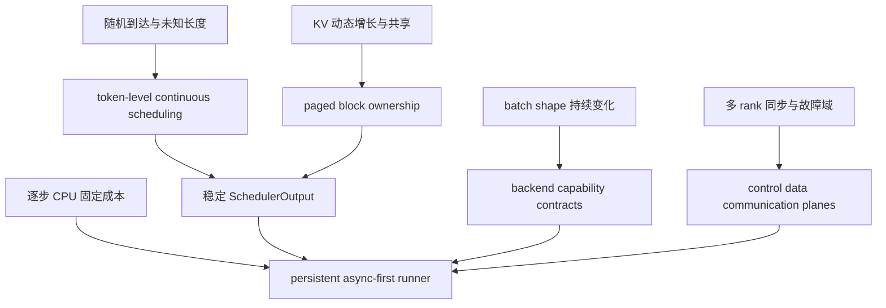

# vLLM 系统设计原则：把动态生成变成可调度资源系统

> **源码基线**：`vllm-project/vllm@d66300a1baa7779c68c7dfa4e51eee2502b48017`
> **中心命题**：vLLM 的主要价值不是让一次模型前向更快，而是让长度未知、到达随机、阶段不同的请求持续共享 GPU，同时控制 KV 容量、CPU 开销和分布式同步。连续调度、Paged KV、异步 runner 与编译专用化都是这个约束系统的推论。

## 一、原始问题不是矩阵乘法，而是不确定性

离线训练容易形成稳定大 batch；在线生成则同时具有四种动态性：请求到达时间不同、prompt/输出长度不同、prefill/decode 计算形态不同、每个 decode step 都会改变活跃集合。若仍按请求级静态 batch 执行，短请求完成后留下尾部气泡，长 prompt 会阻塞 decode，KV 又必须为未知输出长度预留空间。

因此推理系统优化的是一组相互牵制的目标：

$$
T_{\mathrm{TTFT}}
=T_{\mathrm{queue}}+T_{\mathrm{prepare}}+T_{\mathrm{prefill}}+T_{\mathrm{return}},
$$

$$
T_{\mathrm{TPOT}}
\approx T_{\mathrm{schedule}}+T_{\mathrm{prepare}}+T_{\mathrm{forward}}+T_{\mathrm{sample}}+T_{\mathrm{return}}.
$$

提高每步 token 数通常增加吞吐，却可能增加排队和单步时间；为长 prompt 分配更多 prefill token 会改善其 TTFT，却可能伤害正在 decode 的请求。Scheduler 因而用 `max_num_running_reqs` 和 `max_num_scheduled_tokens` 两条独立预算约束并发请求数与本步 token 数；`vllm/v1/core/sched/scheduler.py:110-116`。

## 二、四类资源约束

### 2.1 计算：prefill 与 decode 不是同一种负载

- prefill 通常是较大的矩阵计算，容易提高算力利用率，但单请求 token 数大；
- decode 每请求每步通常只有一个新 token，批次不足时受 launch、访存和 CPU 调度影响；
- speculative decoding 会把“一次 target step”扩成多个候选 token，但收益取决于接受率；
- MoE 还把计算转化为跨 rank token routing 与负载不均衡问题。

vLLM 没有为 prefill 和 decode 建两套孤立 scheduler。Scheduler 的产物是每个请求本轮的 token 数，EngineCore 再把整个 `SchedulerOutput` 交给 executor；真实承重链只有 `schedule → execute_model → update_from_output` 三步，见 `vllm/v1/engine/core.py:583-613`。关键不是这三个函数的先后，而是“调度决定资源承诺，执行消费承诺，更新提交真实结果”。

### 2.2 内存：权重近似固定，KV 随请求增长

对标准全注意力，KV 容量可粗略写成：

$$
M_{\mathrm{KV}}
\approx 2LNH_{\mathrm{KV}}D_{\mathrm{head}}B_{\mathrm{dtype}},
$$

其中 $L$ 是层数，$N$ 是同时驻留的 token 数。真正难点是 $N$ 由在线请求动态决定。若每个请求预留最大长度的连续 tensor，会产生内部碎片并要求昂贵搬迁；若只在需要时扩展连续 tensor，又会遇到外部碎片和地址不稳定。

vLLM 把物理显存切成 block，由 `BlockPool` 统一持有；free queue 同时表示可分配块和 prefix-cache 淘汰候选，hash map 支持内容寻址，见 `vllm/v1/core/block_pool.py:143-190`。Paged KV 的本质不是一个 attention kernel 技巧，而是把“请求拥有一整段连续内存”改成“请求持有一组可引用的物理块”。

### 2.3 控制：逐 token Python 工作会进入关键路径

GPU forward 越快，每步固定 CPU 成本越显眼：整理活跃请求、构造 block table、复制采样参数、生成 attention metadata、处理输出，都可能让 GPU 等待。MRV2 的设计文档把旧实现的问题直接归结为 persistent state 与 step input 耦合、tensor-wide reorder 和 async bookkeeping；`docs/design/model_runner_v2.md:11-39`。

因此新的方向不是“把 Python 全删掉”，而是：

1. 保留每个活跃请求的持久 row；
2. 每步只提交差分；
3. 让 CPU 准备 step $n+1$ 时 GPU 执行 step $n$；
4. 对大状态使用 staged writes，避免全量 H2D copy；
5. 把 metadata 和 sampler 尽量移到 GPU。

MRV2 从设计上假定执行循环没有 CPU 同步点，CPU 入口只向 CUDA stream 排队；`docs/design/model_runner_v2.md:43-55`。这也是为什么 async scheduling 不是给旧 runner 多套一层队列，而会反过来重塑状态表示。

### 2.4 分布式：每个优化都必须服从 collective 顺序

TP、PP、DP、EP、CP 改变的是不同维度的所有权：权重切片、layer stage、请求副本、expert、context token。局部 rank 没有请求时，某些模式仍必须执行 dummy batch，保证 collective 顺序一致。由此可见，“本 rank 无工作就直接跳过”在单卡正确，在分布式中可能导致 hang。

设计上可以把分布式不变量概括为：参与同一 process group 的 rank 必须对 collective 的种类、顺序和张量契约达成一致。`Executor` 抽象只统一控制接口，不能消除 backend 的同步语义；实际 group、worker 和 DBO 机制见 [[02_engineering/03_infer_frameworks/vllm/22_vllm_distributed_inference_analysis|vLLM 分布式推理]]。

## 三、由约束推导出的五个系统支点

### 3.1 Token-level continuous scheduling

请求不是一次性获得整个 batch 席位，而是每个 engine step 重新竞争 token budget。这样 decode、chunked prefill、speculative token 和 encoder token 可以进入同一 admission 问题。代价是 Scheduler 每一步都处在延迟关键路径，并且要处理抢占、远端 KV、grammar 和多模态等阻塞状态。

### 3.2 Paged KV ownership

Scheduler 不直接操作 GPU 指针，只向 KV 管理器申请逻辑 slot；KV 管理器通过 coordinator 管理一个或多个 KV group，最终触碰 `BlockPool`。全量 prefix hit 仍必须重算最后一个 token 获得 logits；当前实现将最大 cache hit 限制为 `request.num_tokens - 1`，见 `vllm/v1/core/kv_cache_manager.py:232-267`。这条看似局部的规则实际连接了 cache 正确性与模型输出语义。

### 3.3 Async-first model execution

EngineCore 用 `execute_model(..., non_block=True)` 提交执行，再在需要结果时等待 future；`vllm/v1/engine/core.py:594-603`。batch queue 和 MRV2 进一步增加并发 batch，使 schedule/input preparation 与前一轮 GPU 工作重叠。代价是状态不能再隐式共享：缓冲区地址、生命周期和提交时机都必须显式建模。

### 3.4 Capability contracts and graceful fallback

动态系统不能假定每个 backend 都支持所有 dtype、KV layout、mixed batch 和 CUDA Graph 模式。`AttentionBackend` 声明 dtype、KV cache dtype、block size 与 layout 接口；`vllm/v1/attention/backend.py:55-115`。metadata builder 另行声明 graph 支持、batch reorder 和原地更新能力；`vllm/v1/attention/backend.py:655-708`。

这比在 runner 中写大量 backend 名称判断更可靠：选择器先根据平台与配置选候选，runner/graph dispatcher 再按能力降级。官方 CUDA Graph 设计明确把 compile 与 capture 解耦，并允许根据 batch composition 在 full、piecewise 和 eager 间派发；`docs/design/cuda_graphs.md:23-36`。

### 3.5 分层的控制面、执行面与扩展面

当前 CLI 会根据 DP load-balancing 模式和 API server 数量选择 supervisor、headless、多 API server 或单 server 路径；`vllm/entrypoints/cli/serve.py:90-150`。API server 负责协议、render 和 streaming，EngineCore 负责调度/KV/执行承诺，Worker/Runner 负责设备数据面。

分层不是为了追求“漂亮架构”，而是隔离三种不同节奏：HTTP 请求生命周期以毫秒到秒计，EngineCore 以 token step 计，kernel 以微秒计。把它们塞进一个 event loop 会让慢 tokenizer、客户端断连或日志写入直接干扰 GPU 关键路径；多进程隔离的代价则是 IPC、错误传播和部署复杂度。

## 四、四个系统平面与状态所有权

| 平面 | 主要 owner | 持有的状态 | 不能越过的边界 |
|---|---|---|---|
| Serving control plane | launcher、API server、`AsyncLLM` | HTTP/stream 生命周期、render、请求队列、路由 | 不直接决定物理 KV block 和 kernel |
| Engine control plane | `EngineCore`、Scheduler | 请求状态、token/encoder budget、调度承诺、abort | 不持有模型权重和设备输入 tensor |
| Memory/communication substrate | KV manager、BlockPool、connectors、process groups | block ownership、refcount、remote transfer、rank group | 不解释 API 语义和采样文本 |
| Model execution plane | Executor、Worker、Model Runner、backend/kernel | 权重分片、persistent rows、metadata、graph、device buffers | 不自行改变请求生命周期真相 |

`EngineCore.__init__` 的实际构造顺序也反映这种依赖：先创建 executor，profile/初始化 KV，再创建 Scheduler，并把 connector aggregator 接到 executor；`vllm/v1/engine/core.py:132-177`。这不是建议按构造函数顺序写架构文档，而是说明 Scheduler 的 admission 必须依赖已经确定的物理 KV 容量。

## 五、为什么几个直观方案不够

| 直观方案 | 为什么看起来简单 | 为什么在在线生成中失效 | vLLM 的选择 |
|---|---|---|---|
| 请求级静态 batch | 一次组 batch 后顺序执行 | 长度差造成尾部气泡，无法插入新请求 | 每 step 重新做 token admission |
| 每请求连续 KV tensor | 索引直接、kernel 简单 | 最大长度预留浪费；增长/搬迁破坏地址稳定 | block table + paged KV |
| 每步从 Python 重建所有输入 | 状态少、容易理解 | decode step 固定成本压过小模型 forward | persistent rows + delta update |
| 所有 batch 都走同一 graph | 路径统一 | shape、attention backend 与 mixed batch 能力不同 | capability contract + runtime dispatch |
| 单进程处理 HTTP 到 kernel | 错误传播直接 | tokenizer、网络和输出处理阻塞 GPU loop | serving 与 EngineCore 进程隔离 |
| 空闲 rank 跳过 step | 节省本地计算 | collective 次序不一致可造成死锁 | lockstep/dummy execution |

## 六、优化不是免费叠加

vLLM 的优化可以分为三类：减少浪费、隐藏成本、改变工作量。

- **减少浪费**：continuous batching、Paged KV、fusion、quantization；
- **隐藏成本**：async scheduling、DBO、流水化 KV transfer；
- **改变工作量**：prefix caching、speculative decoding、disaggregated prefill。

它们可能互相冲突。更深的 async overlap 增加 in-flight state 和延迟释放需求；更激进的 CUDA Graph 增加 capture 时间和静态 buffer；更大的 token budget 提高吞吐却增加 step latency；prefix cache 增加 hash/refcount/eviction 元数据。官方 CUDA Graph 当前默认 `FULL_AND_PIECEWISE` 追求性能，但也明确说明它占用更多内存、捕获时间最长；`docs/design/cuda_graphs.md:38-50`。

因此“开启多少优化”不是正确问题。正确问题是：当前瓶颈在哪个资源平面，优化改变了哪项成本，新增了什么不变量，何时会回退。

## 七、失败边界与观测方法

| 失效模式 | 直接信号 | 应检查的 owner |
|---|---|---|
| TTFT 抖动 | queue time、prefill tokens/step、preemption | Scheduler、KV manager |
| GPU 间歇空闲 | engine step gap、input preparation、IPC | EngineCore、MRV2、serving |
| KV 容量抖动 | usage、prefix hit、eviction、preemption | BlockPool、connector |
| graph 没命中 | graph mode fallback、batch shape、backend capability | runner、attention builder、dispatcher |
| 多 rank hang | collective 序列、dummy batch、worker failure | process group、executor、DP core |
| 请求不结束或输出错位 | request state、row ownership、abort/finish commit | Scheduler、runner、output processor |

生产反馈闭环见 [[02_engineering/03_infer_frameworks/vllm/27_vllm_observability_reliability_analysis|vLLM 可观测性与可靠性]]。这里的核心原则是：指标必须落到状态 owner；只看 GPU utilization 无法区分调度、数据准备、通信和 kernel 退化。

## 八、最小源码阅读顺序

1. `vllm/v1/engine/core.py:104-177,583-613`：确认 EngineCore 拥有什么，以及一次资源承诺如何提交。
2. `vllm/v1/core/sched/scheduler.py:69-180`：确认 admission budget、request maps 与 connector 边界。
3. `vllm/v1/core/kv_cache_manager.py:118-194,347-442`：确认 slot 分配依赖的容量和 block contract。
4. `vllm/v1/core/block_pool.py:143-190,647-743`：确认物理块、free queue 与 refcount 所有权。
5. `docs/design/model_runner_v2.md:11-55` 与 `vllm/v1/worker/gpu/model_runner.py`：理解 async-first 如何改变状态表示。
6. `vllm/v1/attention/backend.py:55-115,655-708`：理解 backend 不是简单函数指针，而是能力合同。
7. `vllm/entrypoints/cli/serve.py:90-150`：最后补服务进程选择，避免从 HTTP 入口反推整个系统。

## Related Pages

- [[02_engineering/03_infer_frameworks/vllm/index|vLLM 知识地图]] — 按设计问题和性能症状导航全部页面。
- [[02_engineering/03_infer_frameworks/vllm/10_vllm_engine_architecture_analysis|vLLM 引擎架构]] — 展开四个平面的对象与进程所有权。
- [[02_engineering/03_infer_frameworks/vllm/11_vllm_scheduler_analysis|vLLM Scheduler]] — 深入 token admission、抢占和结果提交。
- [[02_engineering/03_infer_frameworks/vllm/12_vllm_kv_cache_management_analysis|vLLM KV Cache 管理]] — 深入分页内存、refcount 与 prefix cache。
- [[02_engineering/03_infer_frameworks/vllm/15_vllm_model_runner_v2_analysis|vLLM Model Runner V2]] — 深入 persistent rows 与异步执行。
- [[02_engineering/03_infer_frameworks/vllm/23_vllm_compilation_cudagraph_analysis|vLLM 编译与 CUDA Graph]] — 深入动态形状系统的专用化与回退。
