# vLLM 系统设计原则：把动态请求变成受约束的资源承诺

> **读者问题**：为什么在线请求一旦持续到达，推理引擎就不能只优化一次模型前向，而必须同时采用连续调度、分页状态、异步执行与能力合同？
>
> **源码基线**：`vllm-project/vllm@6b110badbb22d3f66c7218b71138f13b7a6b3419`（`main`，提交时间 2026-08-29T02:40:53Z）
>
> **中心命题**：在线生成的活跃请求、当步 token 数、KV 占用和可执行快路径都在变化。vLLM 的核心设计不是把这些变化抹平，而是把它们依次变成四种显式合同：每步重做 token admission、按 block 承诺状态容量、让已提交但未返回的执行成为一等状态、只在能力校验通过时启用专用快路径。
>
> **所有权边界**：本页拥有动态负载的全局约束，以及四个“瓶颈 → 直观替代 → 设计支点 → 代价”因果链。
>
> **明确排除**：完整责任分层、进程拓扑和端到端调用链由 [[02_engineering/03_infer_frameworks/vllm/03_vllm_architecture_overview_analysis|vLLM 架构概览]] 拥有；Scheduler、KV、Model Runner 与 CUDA Graph 的内部证明由各机制页拥有。

## 1. 起点：系统每一步面对的都不是同一个 batch

当前 Scheduler 不把请求永久归入“prefill 阶段”或“decode 阶段”。它只比较每个请求已经计算的 token 数与当前应该计算的 token 数，并在**每一个 engine step**重新分配 token；同一规则同时覆盖 chunked prefill、prefix cache 与 speculative decode（`vllm/v1/core/sched/scheduler.py:501-512`）。这说明运行时的基本事实不是“一个 batch 做完”，而是请求集合及其进度持续变化。

变化同时作用于三种稀缺资源：单步可执行 token 数、可驻留请求数和 KV block 数。配置分别给出 `max_num_scheduled_tokens`、`max_num_batched_tokens` 与 `max_num_seqs`；其中调度 token 上限甚至可以小于输入 batch 上限，为会在执行中追加 token 的机制留出空间（`vllm/config/scheduler.py:49-68`）。因此，吞吐并不是一个孤立目标：多接纳请求可能抬高队列时间，多发 token 可能拉长一步，多占 KV 则可能触发抢占和重算。

源码把这些牵制关系做成了可观测状态，而不是只暴露 GPU 利用率：Scheduler stats 同时记录 running、waiting 与 KV 使用率；请求侧分别计算首 token 延迟、token 间延迟和 preemption（`vllm/v1/metrics/stats.py:185-204`；`vllm/v1/metrics/stats.py:469-500`；`vllm/v1/metrics/stats.py:516-526`）。也就是说，设计是否有效要由队列、进度和容量共同验证。

下图只表达四条因果链，不表达架构层或调用顺序。浅灰节点是看似简单但不能覆盖动态负载的方案；蓝色是 vLLM 的设计支点；橙色是它为此支付的成本。

```mermaid
flowchart TB
    subgraph S1["连续调度"]
        direction LR
        B1["瓶颈<br/>活跃集合与 token 需求每步变化"]
        N1["直观方案<br/>请求级固定 batch"]
        P1["设计支点<br/>逐 step token admission"]
        C1["代价<br/>调度进入延迟关键路径"]
        B1 --> N1 --> P1 --> C1
    end
    subgraph S2["分页状态"]
        direction LR
        B2["瓶颈<br/>KV 随请求进度增长"]
        N2["直观方案<br/>按最大长度预留连续状态"]
        P2["设计支点<br/>block pool 与逻辑 block table"]
        C2["代价<br/>refcount 淘汰与重算"]
        B2 --> N2 --> P2 --> C2
    end
    subgraph S3["异步执行"]
        direction LR
        B3["瓶颈<br/>逐步 CPU 工作造成 GPU 间隙"]
        N3["直观方案<br/>等待结果后准备下一步"]
        P3["设计支点<br/>提前提交与差量状态"]
        C3["代价<br/>in-flight 真相与并发安全"]
        B3 --> N3 --> P3 --> C3
    end
    subgraph S4["能力合同"]
        direction LR
        B4["瓶颈<br/>硬件 backend 与 batch 组合爆炸"]
        N4["直观方案<br/>所有组合共走一条快路径"]
        P4["设计支点<br/>显式能力校验与运行时回退"]
        C4["代价<br/>启动内存与降级性能"]
        B4 --> N4 --> P4 --> C4
    end

    classDef neutral fill:#ffffff,stroke:#64748b,color:#0f172a
    classDef ghost fill:#f8fafc,stroke:#94a3b8,color:#475569,stroke-dasharray:4 3
    classDef acc1 fill:#dbeafe,stroke:#2563eb,color:#0f172a,stroke-width:2px
    classDef acc2 fill:#ffedd5,stroke:#ea580c,color:#0f172a,stroke-width:2px
    class B1,B2,B3,B4 neutral
    class N1,N2,N3,N4 ghost
    class P1,P2,P3,P4 acc1
    class C1,C2,C3,C4 acc2
```

## 2. 连续调度：把 batch 席位改成每步资源承诺

### 2.1 背景与被否掉的替代

静态 batch 看起来最简单：凑齐一组请求，保持成员不变，直到全部完成。但当前负载模型允许请求在不同进度上共享一步；Scheduler 先推进已有 running 请求，再在剩余 token 与 request 容量内接纳 waiting 请求（`vllm/v1/core/sched/scheduler.py:550-594`；`vllm/v1/core/sched/scheduler.py:775-804`）。固定成员会让已经完成或暂时阻塞的请求继续占据机会，也无法把当步剩余预算交给新到请求。

> [!note] 分析推断
> 源码没有在上述函数中直接写出“连续调度胜过静态 batch”的历史取舍。本页依据其逐步 budget、running/waiting 队列和动态接纳行为重建理由：**席位若只在请求边界回收，动态负载的空闲资源就不能在下一步立刻复用。**

### 2.2 设计支点与因果机制

vLLM 把 admission 单位从“整个请求”降为“本轮计算多少 token”。每步开始时建立 token budget 和 input budget；每个请求获得的 token 数同时受未完成进度、长 prefill 上限、模型长度和剩余预算约束（`vllm/v1/core/sched/scheduler.py:519-535`；`vllm/v1/core/sched/scheduler.py:585-603`）。只有 KV slots 也能兑现时，这份 token 承诺才进入当步计划；否则 Scheduler 会选择 victim 抢占，归还刚承诺的 token/encoder 预算，再尝试完成可执行计划（`vllm/v1/core/sched/scheduler.py:655-728`）。

这条机制之所以能统一 prefill 与 decode，是因为 Scheduler 追踪的是“应计算进度减已计算进度”，而不是为两阶段维护两套 admission 语义。chunked prefill 只是把长请求裁到剩余预算；decode、speculative token 和 cache hit 仍进入同一 token 账本（`vllm/v1/core/sched/scheduler.py:503-512`；`vllm/config/scheduler.py:56-76`）。

### 2.3 不变量、代价与失败边界

连续调度不是无限混批。每轮结束前，源码断言已发 token 不超过调度上限、两个预算都非负、running 数不超过 request 上限（`vllm/v1/core/sched/scheduler.py:1204-1210`）。配置也拒绝 `max_num_batched_tokens < max_num_seqs`；关闭 chunked prefill 时，batch token 上限若小于最大模型长度会直接导致长请求不可接纳，因此被显式拒绝（`vllm/config/scheduler.py:249-267`）。

它支付的成本是调度本身进入每步关键路径，并在容量不足时产生重算。抢占会释放 request blocks、把状态移回 waiting、把 `num_computed_tokens` 归零并累计 preemption；这不是免费的暂停（`vllm/v1/core/sched/scheduler.py:1392-1433`）。测试用 5 个可用 block 构造出容量耗尽场景，验证高优先级请求继续运行而低优先级请求被抢占，表明 preemption 是真实容量边界而非异常兜底（`tests/v1/core/test_scheduler.py:2915-2935`；`tests/v1/core/test_scheduler.py:2999-3009`）。

## 3. 分页状态：把 KV 容量变成可回收、可共享的块

### 3.1 背景与被否掉的替代

请求的 KV 状态按“已计算 token + 本步新 token + lookahead”增长，并受 `max_model_len` 截断；需要多少 slot 是每次 admission 时重新计算的量（`vllm/v1/core/kv_cache_manager.py:452-460`；`vllm/v1/core/kv_cache_manager.py:489-518`）。若每个请求在入场时就按最大长度占有一段连续状态，地址简单，却会把尚未生成的 token 也变成容量承诺；若等状态增长后再寻找更大的连续区域，又把搬移与碎片带进热路径。

> [!note] 分析推断
> 冻结源码直接证明 vLLM 以有限 block pool、按需 slot 分配和 `max_model_len` 上限管理 KV，但没有在这些文件中复述原始 PagedAttention 论文对连续分配的论证。本段对“最大长度连续预留”的批评是从当前容量合同重建的替代方案分析，不是作者原话。

### 3.2 设计支点与因果机制

分页的关键不是某个 attention kernel 名称，而是**物理块所有权可以独立变化**。`BlockPool` 在初始化时建立固定数量的 block；free queue 同时保存可分配块和 prefix-cache 淘汰候选，hash map 则把内容身份映射回块（`vllm/v1/core/block_pool.py:143-185`）。请求因此只持有当前需要的逻辑 block 集合，增长时追加，完成时归还；分配与释放都通过 KV coordinator 落到同一个 block pool（`vllm/v1/core/kv_cache_manager.py:541-574`）。

分配发生在资源承诺阶段。`allocate_slots` 先计算需要的 block 数，再与 free blocks、为其他 in-flight 请求保留的 blocks 以及 admission watermark 比较；不足就返回 `None`。容量检查前允许先释放滑窗已经跳过的块，但只有检查通过后才追加 cache hit block 和新 block（`vllm/v1/core/kv_cache_manager.py:471-487`；`vllm/v1/core/kv_cache_manager.py:494-546`）。这让 Scheduler 能用同一种容量货币处理增长、prefix reuse、滑窗释放和抢占，而不需要理解 GPU 指针。

同一个 block 还可以承担 cache 与运行中状态两种角色。cache hit 会增加 `ref_cnt` 并把零引用块移出 free queue；分配 free block 时若它仍有 hash，就先清除 cache 身份再复用（`vllm/v1/core/block_pool.py:647-700`；`vllm/v1/core/block_pool.py:702-717`）。分页由此不仅减少预留，还把共享、淘汰和回收放进同一所有权协议。

### 3.3 不变量、代价与失败边界

核心不变量是“可回收”不等于“无人引用”：只有 `ref_cnt` 降到零的块才能进入 free queue；无 hash 的块优先复用，有 hash 的块留在队尾形成 LRU 候选（`vllm/v1/core/block_pool.py:723-747`）。违反引用计数或在共享块上原地写入，会把另一个请求仍在读取的 KV 变成错误状态。

分页也带来元数据与内部碎片，并不消灭容量压力。V1 的 block table 是 append-only；发现重复 prefix block 时不能把已经追加的 block ID 换掉，重复块要等请求释放后才消失（`docs/design/prefix_caching.md:194-198`）。全 prompt 命中 cache 时仍必须重算最后一个 token 取得 logits，而 block 对齐可能让这次重算扩大为整块（`vllm/v1/core/kv_cache_manager.py:251-258`）。这些代价解释了为什么高 KV 使用率与 preemption 必须一起观察，而不能把 prefix hit 当作无条件收益。

## 4. 异步执行：让“已提交但未返回”成为合法状态

### 4.1 背景与被否掉的替代

连续调度提高 GPU 工作密度后，每步固定 CPU 成本会更显眼。Model Runner V2 设计文档指出，block table、采样参数等输入若每步在 Python 中从头构造，会很慢；相邻 step 的 request batch 通常只发生少量加入或完成，因此全量重建浪费了这种时间局部性（`docs/design/model_runner_v2.md:13-27`）。

等待 step N 完成、CPU 再准备 step N+1 的同步循环虽然状态直观，却把 CPU 准备时间直接变成 GPU 间隙。当前设计明确选择在 GPU 执行 step N 时准备下一步，并要求设备主循环没有 CPU 同步点（`docs/design/model_runner_v2.md:43-53`）。

### 4.2 设计支点与因果机制

异步执行首先是控制协议：EngineCore 在 batch queue 未满时提交 non-blocking execution，优先继续填队列；只有队列已满或没有可调度工作时才等待最早结果（`vllm/v1/engine/core.py:638-670`；`vllm/v1/engine/core.py:692-700`）。这把“schedule 后立即得到真实 token”改成“先得到一份 in-flight 承诺，稍后提交结果”。

因此 Scheduler 也必须显式表示未返回的真相。`AsyncScheduler` 在发出 decode 后增加 output placeholders；真实 token 返回时再减少 placeholder，并且 preemption 后到达的 stale output 不允许修改已经重置的计数（`vllm/v1/core/sched/async_scheduler.py:19-49`；`vllm/v1/core/sched/async_scheduler.py:51-69`）。换句话说，异步优化不是在同步状态机外包一层 future；它改变了 token 进度、抢占和 cache commit 的时序语义。

设备状态也随之从“当步输入”分离为“持久状态 + 当步投影”。MRV2 给活跃请求稳定 row，加入与完成只产生差量；对大 block table 使用 GPU base tensor、CPU staged diff、打包传输和一次 kernel 应用，避免每步全量 H2D copy（`docs/design/model_runner_v2.md:31-39`；`docs/design/model_runner_v2.md:104-130`）。

### 4.3 不变量、代价与失败边界

异步的首要不变量是：CPU 不能修改 GPU 仍在异步读取的 host buffer。设计文档明确展示了 pinned buffer 的并发读写 race，并把 V1 barrier 的代价归纳为易漏保护、组织僵硬和减少 overlap（`docs/design/model_runner_v2.md:51-80`）。因此稳定 row 与 staged copy 的意义首先是生命周期隔离，其次才是少一次 copy。

兼容边界也更严格。显式开启 async scheduling 时，不支持的 executor、某些 speculative method 或 ROCm DeepEP high-throughput DBO 会 hard fail；保持配置为自动时，同样的组合会禁用 async，pooling 也因当前性能负收益而默认关闭（`vllm/config/vllm.py:1173-1212`；`vllm/config/vllm.py:1213-1262`）。这说明 overlap 的成本不仅是更多 in-flight 状态，还包括更窄的安全组合集合。

## 5. 能力合同：让快路径证明自己适用于当前组合

### 5.1 背景与被否掉的替代

动态 batch 不只改变大小，还会混合 prefill/decode、KV layout、dtype、sliding window、multimodal prefix、speculative verification 和分布式能力。CUDA Graph 设计文档记录了“一刀切”路径的失败：full capture 并非所有 attention backend 都支持，有些 backend 只支持 pure decode；把 compilation 与 capture 紧耦合导致全有或全无的性能/兼容取舍（`docs/design/cuda_graphs.md:23-36`）。

另一个直观方案是在 runner 中按 backend 名称和硬件写分支。它能解决眼前组合，却不能回答新 backend 是否支持 head size、KV dtype 或某个运行时语义，也无法区分“用户显式要求但非法”与“自动选择时可降级”。

> [!note] 分析推断
> “名称分支会随组合爆炸”是从当前 capability API 与候选选择器重建的设计理由；源码没有把这一替代方案写成历史决策记录。

### 5.2 设计支点与因果机制

vLLM 把兼容性变成 backend 可查询的事实。Attention backend 声明 dtype、KV dtype、kernel block size 等基本能力，并为 sink、sliding window、batch invariance、KV connector 等语义提供默认拒绝或显式 opt-in（`vllm/v1/attention/backend.py:59-133`；`vllm/v1/attention/backend.py:160-205`）。统一验证器把当前配置投影成一组 rejection reasons，而不是让执行走到不支持的 kernel 才失败（`vllm/v1/attention/backend.py:248-323`）。

选择策略区分意图强度：用户显式指定 backend 时，任何 invalid reason 都直接报错；自动模式则枚举候选、过滤不兼容组合并选优先级最高的有效实现（`vllm/platforms/cuda.py:403-459`；`vllm/platforms/cuda.py:461-469`）。async scheduling 的“显式开启则 hard fail，未指定则自动禁用”采用同一种合同语义（`vllm/config/vllm.py:1182-1213`；`vllm/config/vllm.py:1213-1262`）。

CUDA Graph 再把能力合同推进到**每个 runtime batch**：uniform decode 可以走 full graph，prefill 或 mixed batch 可以走 piecewise；没有合适 graph 时允许回到 `NONE`。同 commit 设计文档还明确规定，不兼容 backend 会把请求模式降到最接近的支持模式（`docs/design/cuda_graphs.md:38-58`）。因此“已启动”不代表所有请求共享同一快路径；快路径的适用性也是每批次资源决策的一部分。

### 5.3 不变量、代价与失败边界

能力合同的正确性条件是保守：未声明支持就不能假定支持。它可能牺牲峰值性能；例如用户只指定 block size 就可能排除更高优先级 backend，CUDA 平台会选择较低优先级实现并明确警告性能下降（`vllm/platforms/cuda.py:471-490`）。

专用化还要支付启动时间和显存。默认 `FULL_AND_PIECEWISE` 通常性能最好，但占用内存最多、capture 最久；capture size 也被限制，以免紧张显存下 OOM 并控制大 graph 的启动成本（`docs/design/cuda_graphs.md:40-48`；`vllm/config/compilation.py:692-706`）。所以 capability contract 不是“自动找到最快实现”的保证，而是“在当前组合内只承诺已证明安全的实现，并让降级可解释”。

## 6. 四个支点是一条闭环，不是四个独立开关

连续调度决定本步 token 与请求集合；分页状态决定这份计划是否有 KV 容量兑现；异步执行让多份计划可以处于 in-flight；能力合同再决定当前 batch 能进入哪条设备快路径。反方向上，KV 不足触发抢占并改变下轮调度，async 的 placeholder 约束可提交进度，backend 的拒绝或降级改变一步成本。任一支点都不能绕过其余三者独立开启。

| 观察到的信号 | 首先说明哪项合同受压 | 不能直接得出的结论 |
|---|---|---|
| waiting 增长、request queue time 上升 | admission 未能及时消化到达工作 | 不等于 kernel 本身变慢 |
| KV usage 接近 1 且 preemption 增长 | 分页容量不足，已运行工作被回收重算 | 不等于 prefix cache 必须关闭 |
| inter-token latency 上升而队列稳定 | step 执行或 CPU/GPU overlap 可能退化 | 仅凭该指标不能定位 runner 或 kernel |
| 某请求回退 piecewise 或 eager | 当前 batch/backend capability 不满足 full graph | 不等于编译整体失效 |

这些信号在源码中有独立定义：KV usage 与 preemption 是资源压力，TTFT、ITL 与 WAITING queue time 是不同延迟区间（`vllm/v1/metrics/loggers.py:561-568`；`vllm/v1/metrics/loggers.py:661-668`；`vllm/v1/metrics/loggers.py:796-856`；`vllm/v1/metrics/loggers.py:922-929`）。表中的定位是诊断顺序的**分析推断**，不是单个指标对根因的充分证明。

最终原则可以压缩成一句话：**先把动态性变成可审计的资源承诺，再优化承诺的执行；任何快路径都必须同时声明容量、生命周期和兼容边界。**

## Related Pages

- [[02_engineering/03_infer_frameworks/vllm/03_vllm_architecture_overview_analysis|vLLM 架构概览]] —— 把本页四个设计支点映射到完整责任分层与一条在线请求生命周期。
- [[02_engineering/03_infer_frameworks/vllm/11_vllm_scheduler_analysis|vLLM Scheduler 分析]] —— 深入逐 step token admission、抢占与结果提交的事务细节。
- [[02_engineering/03_infer_frameworks/vllm/12_vllm_kv_cache_management_analysis|vLLM KV Cache 管理]] —— 深入逻辑 block、refcount、prefix cache 与物理容量边界。
- [[02_engineering/03_infer_frameworks/vllm/15_vllm_model_runner_v2_analysis|vLLM Model Runner V2]] —— 深入 persistent row、staged write 与 async-first 执行。
- [[02_engineering/03_infer_frameworks/vllm/14_vllm_attention_backends_analysis|vLLM Attention Backend]] —— 展开 attention 能力声明、选择与兼容性验证。
- [[02_engineering/03_infer_frameworks/vllm/23_vllm_compilation_cudagraph_analysis|vLLM 编译与 CUDA Graph]] —— 展开动态 batch 如何在 full、piecewise 与 eager 路径间派发。
- [[02_engineering/03_infer_frameworks/vllm/27_vllm_observability_reliability_analysis|vLLM 可观测性与可靠性]] —— 用队列、延迟、KV 与 preemption 信号闭合设计反馈。
