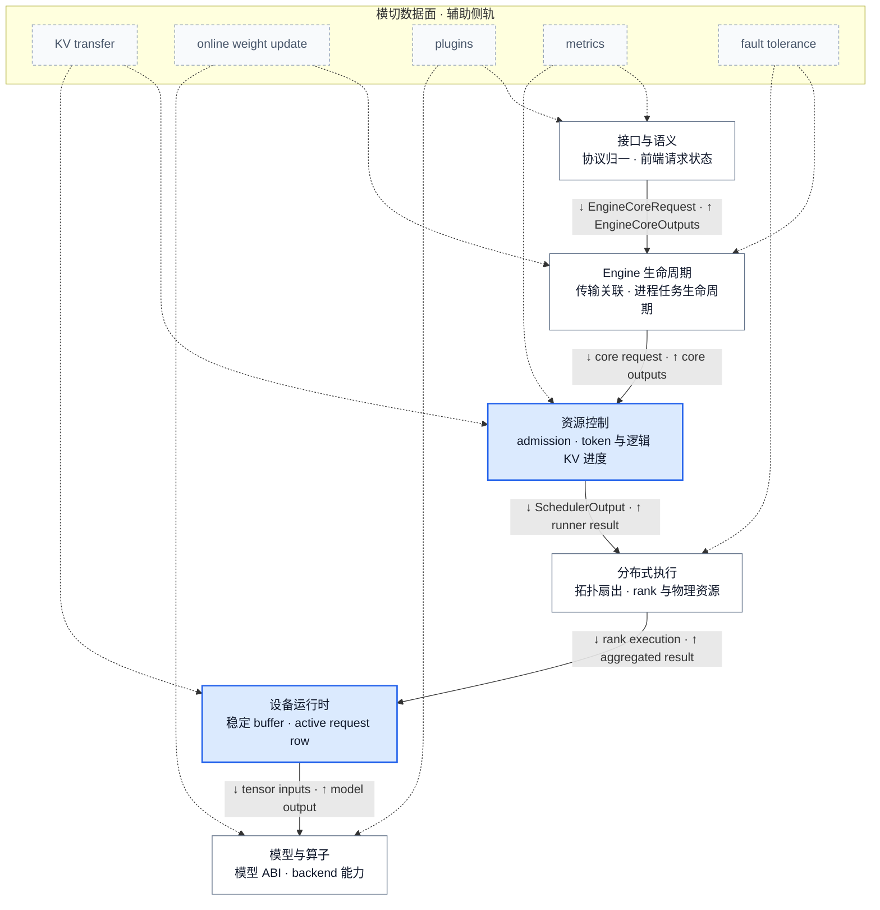
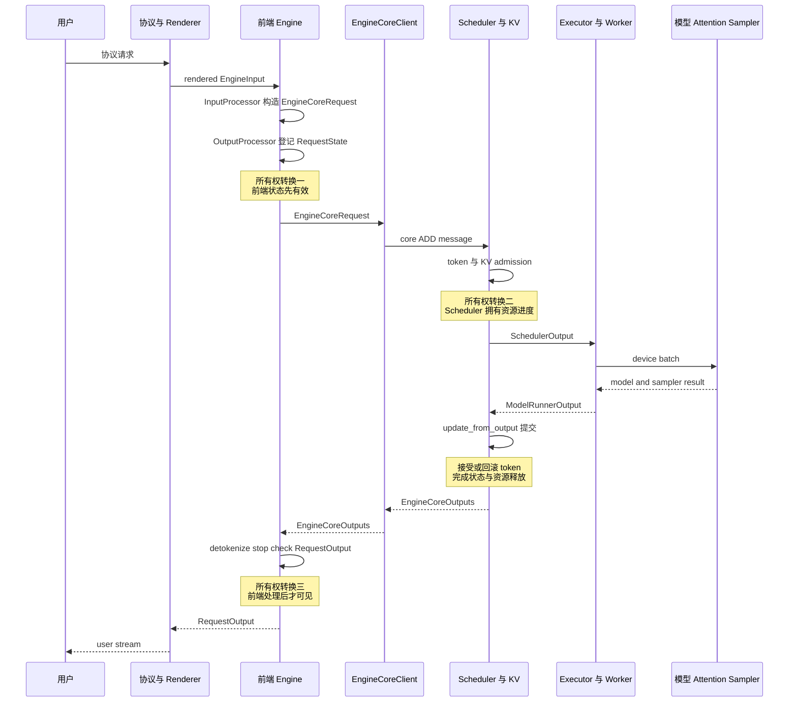

# vLLM 架构概览：责任分层、状态所有权与请求生命周期

> **源码基线**：`vllm-project/vllm@6b110badbb22d3f66c7218b71138f13b7a6b3419`（冻结的 detached checkout，提交时间 2026-08-29T02:40:53Z）
> **维度**：Architecture Overview（责任分层优先，在线请求生命周期为代表路径）
> **中心命题**：vLLM 的稳定架构边界不是源码目录，也不是一条拉长的调用链，而是六个按责任与状态所有权分开的层：上层把用户语义变成内部合同，中层决定资源承诺并组织执行，下层把计划落实为设备状态、模型与算子。请求生命周期只是在这些静态边界上的一次状态移交。
> **所有权边界**：本页拥有全系统静态分层、层间合同与一条在线请求的提交/可见性主线；Scheduler、KV、分布式、设备 runner、模型 ABI 等内部证明由对应 owner 页负责，本页不展开其算法细节。
> **最近更新**：2026-08-31。重写逐层设计逻辑，补齐每层的定位、因果机制、设计理由与失败边界。

## 1. 背景与中心命题

vLLM 同时面对离线 Python 调用、在线协议、生成与 pooling 等任务，以及 uni、multiprocess、Ray 和外部 launcher 等执行拓扑。如果把这些变化直接塞进一个 Engine 类或一个 GPU 循环，协议语义、请求生命周期、资源策略与硬件执行会共享可变状态；任一变化都可能破坏其余部分的时序。当前源码反而把 renderer、输入/输出处理器与 EngineCore client 装配为明确接缝，并让不同 client 和 executor 实现复用相同的 core 合同（`vllm/v1/engine/async_llm.py:135-156`；`vllm/v1/engine/core_client.py:78-139`；`vllm/v1/executor/abstract.py:38-93`）。

**设计选择**是按“谁能决定状态何时有效”分层，而不是按进程数、目录名或类名分层。这样，前端可以负责协议与用户可见输出，Scheduler 可以成为 admission/KV 进度的唯一决策者，executor/worker 可以替换拓扑而不复制请求语义，runner 与模型层则可以围绕设备热路径和能力合同演进。官方设计文档也把 API server、EngineCore 与 worker 描述为分离的 concern，但本页进一步把进程图还原为六个责任层；进程只是这些责任的一种部署方式（`docs/design/arch_overview.md:67-99`）。

因此，理解架构要按两个正交问题阅读：先看**静态责任**——每层为什么存在、拥有什么状态；再看**动态生命周期**——一条请求何时跨层、何时提交、何时对用户可见。

## 2. 静态架构：六层责任与合同

图 A 只表达稳定责任和合同。实线是主请求/计划/结果合同，虚线侧轨是会跨越多个责任层的数据面；它们不能因为实现文件位于某个目录，就被误判成该层独占的内部功能。

| 责任层 | 核心能力 | 输入 → 输出合同 | 拥有的状态 / 不变量 | 明确不拥有 | 最小证据 |
|---|---|---|---|---|---|
| 接口与语义 | render、验证、tokenize、detokenize、stop 与 stream | 协议/Prompt/媒体 → `EngineCoreRequest`；core token → 用户响应 | renderer/tokenizer、前端 `RequestState`、per-request collector | waiting/running、token budget、逻辑 KV | `vllm/tasks.py:7-44`；`vllm/v1/engine/input_processor.py:281-340`；`vllm/v1/engine/output_processor.py:447-468` |
| Engine 生命周期 | 构造、传输、请求关联、liveness、abort、shutdown、背压 | frontend request/utility message ↔ core outputs/events | client transport、core 进程/任务生命周期、前端与 core 的关联 | admission policy、模型执行、协议渲染 | `vllm/v1/engine/core_client.py:78-139`；`vllm/v1/engine/core_client.py:503-514` |
| 资源控制 | request lifecycle、token admission、逻辑 KV 分配、抢占、结果提交 | Engine 请求 + 旧状态 → `SchedulerOutput`；runner result → `EngineCoreOutputs` | waiting/running、token progress、block table、完成/取消状态 | GPU tensor 地址、用户 stream、模型 ABI | `vllm/v1/core/sched/scheduler.py:119-169`；`vllm/v1/core/sched/scheduler.py:501-542` |
| 分布式执行 | worker 生命周期、RPC fan-out、collective、rank 聚合与失败传播 | `SchedulerOutput` → 每 rank 执行；rank result → 聚合结果 | worker 拓扑、rank/group、通信顺序、权重与物理 KV 的设备位置 | 全局公平性、协议输出、模型语义解释 | `vllm/v1/executor/abstract.py:38-93`；`vllm/v1/executor/multiproc_executor.py:340-364` |
| 设备运行时 | persistent row、staged write、输入 gather、graph replay、sampling | scheduler delta → 稳定 device buffer；model output → token/pooling/aux output | active request row、device-resident dynamic state、graph descriptor、当步 sampler 状态 | 全局 admission、detokenization、跨实例策略 | `vllm/v1/worker/gpu/model_runner.py:168-240`；`vllm/v1/worker/gpu/model_runner.py:999-1055` |
| 模型与算子 | 模型解析/加载、模型 ABI、attention/backend 选择与 kernel | config + checkpoint + device capability → executable model/backend | 参数与 scale 语义、backend capability、kernel selection | request lifecycle、token fairness、服务拓扑 | `vllm/model_executor/models/registry.py:1274-1324`；`vllm/v1/attention/backend.py:59-130` |

## 3. 逐层设计逻辑

### 3.1 接口与语义层：把用户语义挡在资源循环之外

这一层是 vLLM 的**语义适配器和用户可见状态所有者**。它向上面对 chat message、completion prompt、音频、多模态媒体和不同响应协议，向下只交付 `EngineCoreRequest`，并把 core 返回的 token 或 pooling tensor 恢复为 `RequestOutput`。generation、pooling 与 frontend render 在任务表中是不同能力，但只有 generation/pooling 会穿过 Engine 合同；这正是该层“保留公开语义、压缩执行语义”的定位（`vllm/tasks.py:7-44`）。

它之所以独立，不只是为了复用 tokenizer。若让 Scheduler 或 runner 直接理解 HTTP/Pydantic 对象、chat template、stop string 和流式输出，那么每增加一种协议或模型渲染规则，都要进入资源状态机或设备热路径；不同 executor 还可能各自复制一套语义分支。当前边界选择在进入 core 前丢掉这些表达差异、返回后再恢复它们，判断标准是让资源循环只依赖稳定的 token/feature/执行参数合同。这个理由是根据下述状态边界重建的分析推断；源码直接证明的是组件分工，而不是一场完整的方案评审。

一次请求在这一层经过四步转换：

1. 协议 adapter 先把消息、工具和媒体组织成 renderer 可处理的输入；Renderer 产生带类型的 `EngineInput`。直接把 raw prompt 交给 `InputProcessor` 的兼容入口已经 deprecated，说明 Renderer 输出正在成为正式上游合同（`vllm/v1/engine/input_processor.py:309-335`）。
2. `InputProcessor` 校验模型能力、并行路由、token/embedding 与多模态字段，clone 并补全 sampling/pooling 参数，最后构造不含 HTTP 响应类型的 `EngineCoreRequest`（`vllm/v1/engine/input_processor.py:281-340`；`vllm/v1/engine/input_processor.py:337-425`）。
3. 请求送入 core **之前**，`OutputProcessor` 先建立 `request_id → RequestState`，保存 external id、prompt、detokenizer、logprobs processor 和 collector。这个顺序保证任意早到的 core 输出都有前端接收者（`vllm/v1/engine/async_llm.py:393-437`；`vllm/v1/engine/output_processor.py:543-568`）。
4. core 返回增量 token 或 pooling tensor 后，`OutputProcessor` 用该 state 做 detokenize、stop-string 判断和输出模式处理，再写入异步 queue 或同步返回列表；已 abort 请求没有 state，其迟到输出被丢弃（`vllm/v1/engine/output_processor.py:607-724`）。

因此这一层拥有的是“如何解释请求”和“何时对用户可见”，不拥有“何时获得计算资源”。代价是前端要为每个在途请求保存状态并承担 tokenizer/parser 的 CPU 开销；若前端 state 与内部 request id 的关联先失效，GPU 即使正确算出 token，也无法构造正确的用户响应。

### 3.2 Engine 生命周期层：复用 core，而不是复刻状态机

这一层是前端与权威 EngineCore 之间的**稳定访问合同和生命周期管理面**。调用者只需要提交、abort、读取输出和发 utility request，不需要知道 core 与自己同进程、位于后台进程，还是由一个 client 面向多个 DP engine。`EngineCoreClient` 同时覆盖 in-process、同步 MP、异步 MP 与 DP 变体，说明 client/core 是逻辑边界；是否跨进程只是其中一种部署选择（`vllm/v1/engine/core_client.py:78-139`）。

如果每种调用方式都直接嵌入 EngineCore，离线同步 API、在线 asyncio API 和 DP serving 就会各自拥有一套启动、传输、输出循环与死亡处理，并很容易让同一种 request 在不同入口获得不同的生命周期语义。当前设计把变化限制在 client：上层调用合同不变，后面的 Scheduler 状态机也不因 transport 改变。这里的决策理由同样是根据可替换实现和共享 core 合同作出的分析推断。

实际装配和运行过程是：`AsyncLLM` 创建 Renderer、InputProcessor、OutputProcessor 和 async MP client；client factory 根据 multiprocessing、asyncio 与 DP 配置选择具体实现（`vllm/v1/engine/async_llm.py:135-156`；`vllm/v1/engine/core_client.py:89-139`）。MP client 用 input socket 发送编码后的 ADD/ABORT/UTILITY message，用独立 output task 解码 `EngineCoreOutputs`；普通输出交给 output handler/queue，utility reply 则按 call id 唤醒等待者（`vllm/v1/engine/core_client.py:503-514`；`vllm/v1/engine/core_client.py:1041-1152`）。于是 transport 线程只搬运和关联消息，EngineCore busy loop 才修改调度真相。

这一层拥有 socket、后台 task/process、call id、engine identity 和 liveness；它不拥有 admission、KV block 或模型 forward。边界的代价是多一层序列化、queue 与故障传播，且不是所有拓扑组合都实现了：asyncio 但不启用 multiprocessing 的 EngineCore 当前显式拒绝（`vllm/v1/engine/core_client.py:97-112`）。

### 3.3 资源控制层：由一个提交者协调请求、token 与逻辑 KV

这一层是 EngineCore 的**资源政策和提交权威**。它回答的不是“模型如何算 token”，而是“哪些请求可以在本 step 消耗多少 token、encoder 和逻辑 KV 容量，以及执行结果是否能成为新的请求真相”。`SchedulerOutput` 因而是一份已批准的逻辑计划，不是临时 batch，也不是 GPU tensor。

token、KV slot、encoder compute 和并发请求数是相互约束的资源。若先按 FIFO 组成 batch，再让 worker 各自拒绝放不下的请求，早先扣除的 token/encoder 预算和其他 rank 的选择可能已经不同；若每个 worker 各自 admission，共享 block 和请求进度也不再有唯一 owner。当前实现把这些决定放进一个 Scheduler transaction：同一轮同时维护 token/input/encoder budget，只有 KV allocation 成功后才登记 scheduled work。其目标不是“中心化总是更简单”，而是让一个提交者能够原子地回滚部分选择（`vllm/v1/core/sched/scheduler.py:501-542`；`vllm/v1/core/sched/scheduler.py:655-729`）。

机制分成计划和回执两半。计划阶段以 `num_computed_tokens` 追赶当前应计算 token，尝试分配 slots；失败时选择 victim，并把已经登记给 victim 的 token、input、encoder 和 block 增量一并撤销，成功后才生成 `SchedulerOutput`。计划生成后，`_update_after_schedule` 乐观推进 computed/in-flight 进度，使下一轮可以继续流水化，但明确保留随后因 speculative reject 或 stale output 回滚的入口（`vllm/v1/core/sched/scheduler.py:655-729`；`vllm/v1/core/sched/scheduler.py:1435-1455`）。回执阶段再扣减 in-flight、丢弃 abort/preempt 后的 stale output、回退 rejected draft、finish/free，并生成 `EngineCoreOutput`（`vllm/v1/core/sched/scheduler.py:1848-1904`；`vllm/v1/core/sched/scheduler.py:2031-2103`）。

所以该层拥有 waiting/running、token progress、逻辑 block table 与完成状态；GPU 地址、rank-local buffer 和用户 stream 都在边界之外。它支付的是中心循环复杂度和单一政策点的压力，但换来一个可检查的不变量：只有 Scheduler 能把“资源可用”升级成“本 step 已承诺”，也只有它能把 runner 结果提交成新的 core 状态。

### 3.4 分布式执行层：把计划映射到拓扑，不复制 Engine 语义

这一层是逻辑计划到**具体 worker、rank、通信组和设备故障域**的映射器。Scheduler 只说每个 request 本步做多少工作；executor 决定用 uni、multiprocessing、Ray、external launcher 或自定义 backend 把同一份计划送到哪些 worker，并从约定的输出 rank/aggregator 收回一个 runner result（`vllm/v1/executor/abstract.py:38-93`；`vllm/v1/executor/abstract.py:219-237`）。

把它与资源控制分开，是因为“哪些请求值得执行”和“多少 rank 共同完成一次执行”是两种变化。若每种拓扑自带 Scheduler，切换 MP/Ray 或调整 TP/PP 就可能同时改变 admission 和请求状态语义；若 Scheduler 直接操作 rank，则每种通信 backend 的进程、RPC 和失败细节都会反向污染资源政策。统一的 `SchedulerOutput → ModelRunnerOutput` 合同把选择标准固定为：拓扑可以替换，但同一逻辑资源承诺不能被重新解释。这一设计理由是从统一 executor ABI 重建的分析推断。

运行时，executor 先按配置解析 backend class，再通过 collective RPC 把 `execute_model(SchedulerOutput)` fan-out。multiprocessing 实现要求相关 worker 都执行同一调用，只从 `output_rank` 取普通结果，同时允许 KV/encoder connector aggregator 合并侧轨 metadata（`vllm/v1/executor/multiproc_executor.py:340-364`）。worker 把 PP recv/forward/send、runner 调用和 rank-local state 串成一次执行；任一进程异常退出时 monitor 标记 executor 失败、关闭其他 worker 并通知 Engine（`vllm/v1/worker/gpu_worker.py:1108-1189`；`vllm/v1/executor/multiproc_executor.py:298-324`）。

该层拥有 rank/group、collective 顺序、worker 生命周期，以及权重和物理 KV 的设备位置；它不重新决定 token 公平性，也不解释模型层的 tensor 语义。代价是所有成员必须在相同 group 上以相同顺序进入通信；一次 rank 分叉通常表现为整个 step 挂起，而不是某个 request 的局部错误。

### 3.5 设备运行时层：把动态计划投影到稳定设备状态

这一层是 Scheduler 逻辑 delta 与模型 forward 之间的**设备输入运行时**。它把 request id、scheduled token 数和 block id 变成 `input_ids`、positions、slot mapping、attention metadata 与 sampler state，并管理可复用 buffer、CUDA Graph 地址和异步输出。它提供的是统一能力合同，而不是单一实现：同一个 `GPUWorker` 会按能力选择 Model Runner V1 或 V2（`vllm/v1/worker/gpu_worker.py:455-475`）。

这一层存在的原因是调度状态的形状与 GPU 高效执行需要的形状相反：Scheduler 以动态 request 和逻辑 block 思考，GPU 更适合连续/固定地址的 tensor、批量 metadata 和可重复 replay。每步从 Python request 全量重建大 tensor 会浪费 CPU；但把 persistent state 直接当作当步输入，又会让 request 加入/完成触发整组 row 搬移。vLLM 当前保留两条 live 路线，就是这组取舍的具体体现：MRV1 选择紧凑 persistent batch，MRV2 选择稳定 request row 加 per-step gather。设计文档明确把前者的问题和后者的选择写成这一对照（`docs/design/model_runner_v2.md:15-39`）。

两条实现都遵守同一外部因果链，但内部提交点不同：

- **MRV1** 维护 request-id keyed 的 `CachedRequestState` 和连续 `InputBatch` row。每步先删除 finished/unscheduled row、增量更新 token 与 block，再 add/resume、condense 空洞和允许 backend reorder；布局稳定后才把 request-major row 展开成 token-major 输入（`vllm/v1/worker/gpu_model_runner.py:1188-1213`；`vllm/v1/worker/gpu_model_runner.py:1450-1516`）。它省去一次 gather，却要求所有 row-local 状态随 condense/swap 一起移动。
- **MRV2** 为请求活跃期分配稳定 row，新请求只 stage token/progress/model/sampler/block-table diff；`execute_model` 按 finish/free/add/update/apply 的顺序提交这些变化，再用本 step 的 request order gather 一份执行 view（`vllm/v1/worker/gpu/states.py:9-67`；`vllm/v1/worker/gpu/states.py:91-132`；`vllm/v1/worker/gpu/model_runner.py:999-1055`；`vllm/v1/worker/gpu/model_runner.py:1500-1536`）。它支付间接寻址和固定容量预分配，换取长期状态不随 batch 顺序搬动。

该层拥有 active row、device-resident state、固定输入 buffer、graph descriptor 和当步 sampler/输出事件；它不拥有 admission、用户协议或跨 Engine 政策。不变量是 scheduler request/block delta、runner row 和实际 device buffer 必须指向同一请求。破坏这一映射通常不会立即报 shape 错，而会把另一个请求的 token、KV 或 sampling state 带进 forward。

### 3.6 模型与算子层：用能力合同吸收模型和硬件组合爆炸

最下层把“一个模型配置和 checkpoint”变成**当前 rank、当前设备上可以执行的模型与 backend**。它同时承担三个连续但不同的责任：解析模型实现，按 vLLM ABI 构造并加载 rank-local 参数，最后根据 dtype、KV layout、head/block size 与平台能力选择 attention/算子实现。上层 runner 只应看到可调用模型和 backend metadata 合同，而不应按模型名字或 GPU 型号分支。

若把这些差异放到 Scheduler 或 runner 中，模型架构、量化格式、checkpoint 命名、attention backend 和硬件 provider 会形成乘法组合：新增一个模型可能要求修改调度，新增一个 backend 又要复制所有模型分支。当前设计选择多个窄合同逐步消解差异；它没有消除组合复杂度，而是把每种判断放到拥有足够信息的最晚边界。这个“避免组合爆炸”的表述是根据 registry、loader 和 capability 接缝重建的分析推断。

实际链路是：

1. `ModelRegistry` 读取 architecture，先处理 native/转换默认值，再在强制 Transformers、native registry 与 Transformers fallback 之间解析一个模型类；不支持的 architecture 在这里失败，而不是在第一次 forward 才失败（`vllm/model_executor/models/registry.py:1248-1324`）。
2. loader 根据 load format 选择实现，调用 `initialize_model` 以统一的 `vllm_config + prefix` ABI 构造模块；旧式构造签名只走带 deprecation 的兼容猜参路径。权重加载后，量化/attention 等模块还可执行 post-load repack 或派生状态构造（`vllm/model_executor/model_loader/__init__.py:119-139`；`vllm/model_executor/model_loader/utils.py:38-94`；`vllm/model_executor/model_loader/utils.py:97-146`）。
3. attention selector 把模型形状、dtype、KV dtype、block size、MLA/滑窗和 PCP/DCP 等运行条件组成 capability query；backend 必须声明实现类、metadata builder 以及 dtype/head/block 支持，选择失败或不兼容时由这一层处理，而不是让上层猜测 kernel（`vllm/v1/attention/selector.py:102-180`；`vllm/v1/attention/backend.py:59-133`）。

因此这一层拥有参数与 scale 语义、forward ABI、backend capability 和 kernel/provider 选择；它不拥有请求生命周期、token fairness 或服务拓扑。代价是 ABI 和能力矩阵必须被模型、loader、量化方法与 backend 共同遵守：shape 可能正确但 shard/scale 语义错误，或者某 backend 只在特定 block/head 条件下可用，都是这一层的失败，而不是 Scheduler 问题。

## 4. 动态生命周期：一条在线请求何时换所有者

图 B 把子系统内部折叠，只标出三次关键所有权变化：前端 state 必须先有效，Scheduler 才能接管资源进度；runner result 必须先由 Scheduler 提交，才能回到前端；前端处理完成后，输出才对用户可见。

1. 协议层先 render/tokenize；raw prompt 直接进入 InputProcessor 的路径已经发出 deprecation，新的稳定边界是 Renderer 产出的 EngineInput（`vllm/v1/engine/input_processor.py:309-335`）。
2. `AsyncLLM.add_request` 为请求分配内部 ID 和 collector，然后 `_add_request` **先**在 OutputProcessor 创建前端 state，**后**通过 EngineCore client 提交；这条顺序是“返回结果一定有接收者”的 guard（`vllm/v1/engine/async_llm.py:393-437`；`vllm/v1/engine/output_processor.py:543-568`）。
3. async client 序列化 ADD message，core I/O 线程反序列化并预处理成 Scheduler 的 `Request`，再交给 busy loop；socket 线程不直接修改权威调度状态（`vllm/v1/engine/core_client.py:1108-1152`；`vllm/v1/engine/core.py:1694-1795`）。
4. EngineCore busy loop 先排空输入，再 step；基本 step 顺序是 `schedule → execute_model → update_from_output`（`vllm/v1/engine/core.py:1410-1475`；`vllm/v1/engine/core.py:597-627`）。
5. Scheduler 在 `schedule` 中统一 token budget 与 KV slots；其输出是逻辑资源承诺，而不是 GPU tensor。executor/worker 再把它映射为 rank 与 device batch（`vllm/v1/core/sched/scheduler.py:501-542`；`vllm/v1/worker/gpu/model_runner.py:1501-1529`）。
6. 模型、attention 和 sampler 产生 runner result；Scheduler 以 `update_from_output` 接受、回滚或丢弃 stale 结果并构造 `EngineCoreOutput`。因此“GPU 已算完”不等于“core 状态已提交”（`vllm/v1/core/sched/scheduler.py:1848-1904`；`vllm/v1/core/sched/scheduler.py:2073-2103`）。
7. core output 经 client queue 交给 `AsyncLLM.output_handler`；OutputProcessor detokenize、stop check 并写入 per-request queue 后，`generate` 才 yield 给调用者（`vllm/v1/engine/core_client.py:1041-1106`；`vllm/v1/engine/async_llm.py:687-732`；`vllm/v1/engine/output_processor.py:692-724`）。

这条主线描述普通在线路径的责任移交，不等于唯一时序。启用 PP 或 async scheduling 时，EngineCore 可使用 batch queue 让 schedule 与 execution 重叠；但结果仍必须回到 Scheduler 更新权威状态（`vllm/v1/engine/core.py:638-653`）。

## 5. 横切数据面：状态在哪里提交

横切能力之所以不是“第七层”，是因为它们在多个状态所有者之间建立协议：只说 connector、plugin 或 metrics 位于哪个目录，无法回答哪一侧能宣布操作完成。

| 横切面 | 为什么跨层 | 分侧状态所有者 | 提交点与失败边界 |
|---|---|---|---|
| KV transfer / offload | Scheduler 决定逻辑 block 与请求进度，worker 才能实际 load/save device KV | scheduler-side connector 拥有 request/block metadata；worker-side connector 拥有传输与设备操作 | worker metadata 聚合回 Scheduler；request finish hook 可接管异步 block 释放。角色与协议见 `vllm/distributed/kv_transfer/kv_connector/v1/base.py:7-40`、`vllm/distributed/kv_transfer/kv_connector/v1/base.py:124-159`、`vllm/distributed/kv_transfer/kv_connector/v1/base.py:543-562` |
| 在线权重更新 | 前端触发事务，executor fan-out，各 rank 修改实际权重，core 维护对外版本 | frontend orchestration、worker update session、EngineCore `_weight_version` | worker `finish_weight_update` 清理 session 后，frontend 才设置新 version；见 `vllm/v1/engine/async_llm.py:1123-1167`、`vllm/v1/worker/gpu_worker.py:1357-1427`、`vllm/v1/engine/core.py:981-986` |
| plugins | endpoint、I/O、platform、stat logger 与 general plugin 运行在不同进程 | 每类 plugin 的目标进程各自持有初始化副作用 | 每进程只加载一次；endpoint plugin 只在前端，general plugin 可在 core/worker；见 `vllm/plugins/__init__.py:16-33`、`vllm/plugins/__init__.py:77-90` |
| metrics | 资源事件在 Scheduler/worker 发生，用户级统计与导出在 frontend 聚合 | core 生成 scheduler stats；OutputProcessor 更新 request stats；frontend logger manager 导出 | core outputs 到达并经 frontend 处理后记录；见 `vllm/v1/engine/async_llm.py:117-169`、`vllm/v1/engine/async_llm.py:687-743` |
| fault tolerance | worker death、core loop failure与用户请求失败处在不同故障域 | executor monitor、EngineCore sentinel、client liveness 各有局部状态 | worker death 先关闭 executor 并回调 engine；core busy loop受 fault wrapper 保护；见 `vllm/v1/executor/multiproc_executor.py:298-324`、`vllm/v1/engine/core.py:1101-1115`、`vllm/v1/engine/core.py:1410-1422` |

## 6. Live / legacy 与失败边界

### 6.1 “V1”有两个不同版本轴

`vllm.engine.LLMEngine` 直接别名到 V1 `LLMEngine`，`AsyncLLMEngine` 直接别名到 V1 `AsyncLLM`；不要再把独立 V0 engine 当作当前并行架构。V1 `LLMEngine` 自称 legacy，是为旧式同步 `add_request/step` 兼容的 facade，不代表其背后仍有另一套 V0 core（`vllm/engine/llm_engine.py:4-7`；`vllm/engine/async_llm_engine.py:4-7`；`vllm/v1/engine/llm_engine.py:48-61`）。

Engine V1 与 Model Runner V1/V2 又是不同维度。当前配置先接受显式环境变量选择（`vllm/config/vllm.py:619-623`）；未显式覆盖时，ROCm 上命中 `ROCM_DEFAULT_MRV1_ARCHITECTURES` 的模型会独立回退 MRV1（`vllm/config/vllm.py:627-635`），随后才检查 Triton 是否可用以及 capability check 是否存在不支持项，任一失败也回退 MRV1，只有其余情况默认 MRV2（`vllm/config/vllm.py:637-652`）。`GPUWorker` 按这一结果实例化不同 runner（`vllm/v1/worker/gpu_worker.py:455-475`），所以“V1 engine”不能推出“必走某一代 runner”。两条设备路径分别由 [[02_engineering/03_infer_frameworks/vllm/15_vllm_model_runner_v1_analysis|Model Runner V1]] 与 [[02_engineering/03_infer_frameworks/vllm/16_vllm_model_runner_v2_analysis|Model Runner V2]] 展开。

### 6.2 拓扑由 backend 决定，不是固定进程公式

`EngineCoreClient` 可以选择 in-process、同步 MP、异步 MP 或 DP client，Executor 又可以选择 uni、mp、Ray、external launcher 或自定义类（`vllm/v1/engine/core_client.py:89-139`；`vllm/v1/executor/abstract.py:48-93`）。因此“API server + 一个 core + 每卡一个 worker”只是常见部署实例，不是架构不变量。官方文档的 V1 process 图适合解释默认多进程意图，但其后仍沿用 `AsyncLLMEngine` 等较旧类名；live path 应以本 commit 的 aliases、constructors 与 backend selection 为准（`docs/design/arch_overview.md:67-113`；`docs/design/arch_overview.md:134-166`）。

### 6.3 失败不是一个全局布尔值

前端 state、Scheduler request、in-flight GPU work 与跨实例 transfer 可能处在不同完成阶段。代码因此分别处理 client abort、执行中 abort 的 stale output、deferred KV free、worker death 和 core death；不能用“请求失败”同时代表这些状态。特别是 output 在执行中被 abort 时，Scheduler 会丢弃已过时结果；有并发 KV transfer 时，block 释放还需 fence in-flight write（`vllm/v1/core/sched/scheduler.py:1853-1879`；`vllm/v1/core/sched/scheduler.py:2509-2522`）。

## 7. 阅读交接：按机制进入 owner 页

- [[02_engineering/03_infer_frameworks/vllm/10_vllm_engine_architecture_analysis|Engine 内部与进程接缝]] —— 深入 Client、EngineCore、Executor 的对象/进程所有权和资源承诺提交。
- [[02_engineering/03_infer_frameworks/vllm/11_vllm_scheduler_analysis|Scheduler 事务]] —— 深入 token budget、waiting/running、抢占和 output 后提交。
- [[02_engineering/03_infer_frameworks/vllm/12_vllm_kv_cache_management_analysis|KV Cache 所有权]] —— 深入逻辑 block、物理 KV、prefix cache 与释放不变量。
- [[02_engineering/03_infer_frameworks/vllm/15_vllm_model_runner_v1_analysis|Model Runner V1]] / [[02_engineering/03_infer_frameworks/vllm/16_vllm_model_runner_v2_analysis|Model Runner V2]] —— 对照 compact row 与 stable row 两种设备状态布局，以及它们不同的异步提交代价。
- [[02_engineering/03_infer_frameworks/vllm/22_vllm_distributed_inference_analysis|分布式推理]] —— 深入 rank/group、并行轴和 collective 顺序。
- [[02_engineering/03_infer_frameworks/vllm/26_vllm_disaggregated_kv_serving_analysis|跨实例 KV]] —— 深入 connector、lease 与 producer/consumer 交接。
- [[02_engineering/03_infer_frameworks/vllm/28_vllm_extension_plugin_system_analysis|扩展与插件]] —— 深入 discovery、进程覆盖与多阶段初始化边界。

## Related Pages

- [[02_engineering/03_infer_frameworks/vllm/02_vllm_system_design_principles_analysis|vLLM 系统设计原则]] —— 从动态请求与资源压力解释本页六层边界背后的全局设计支点。
- [[02_engineering/03_infer_frameworks/vllm/10_vllm_engine_architecture_analysis|vLLM Engine 架构]] —— 展开本页 Engine 生命周期层与资源控制层之间的提交接缝。
- [[02_engineering/03_infer_frameworks/vllm/11_vllm_scheduler_analysis|vLLM Scheduler 分析]] —— 证明本页生命周期中 admission、抢占与结果提交的内部事务。
- [[02_engineering/03_infer_frameworks/vllm/12_vllm_kv_cache_management_analysis|vLLM KV Cache 管理]] —— 解释逻辑 block、物理 tensor 与跨实例传输为何必须分开所有权。
- [[02_engineering/03_infer_frameworks/vllm/15_vllm_model_runner_v1_analysis|vLLM Model Runner V1]] / [[02_engineering/03_infer_frameworks/vllm/16_vllm_model_runner_v2_analysis|Model Runner V2]] —— 对照设备运行时如何以 compact row 或 stable row 投影动态计划。
- [[02_engineering/03_infer_frameworks/vllm/22_vllm_distributed_inference_analysis|vLLM 分布式推理]] —— 细化 executor 如何把统一计划映射为 rank 与 collective。
