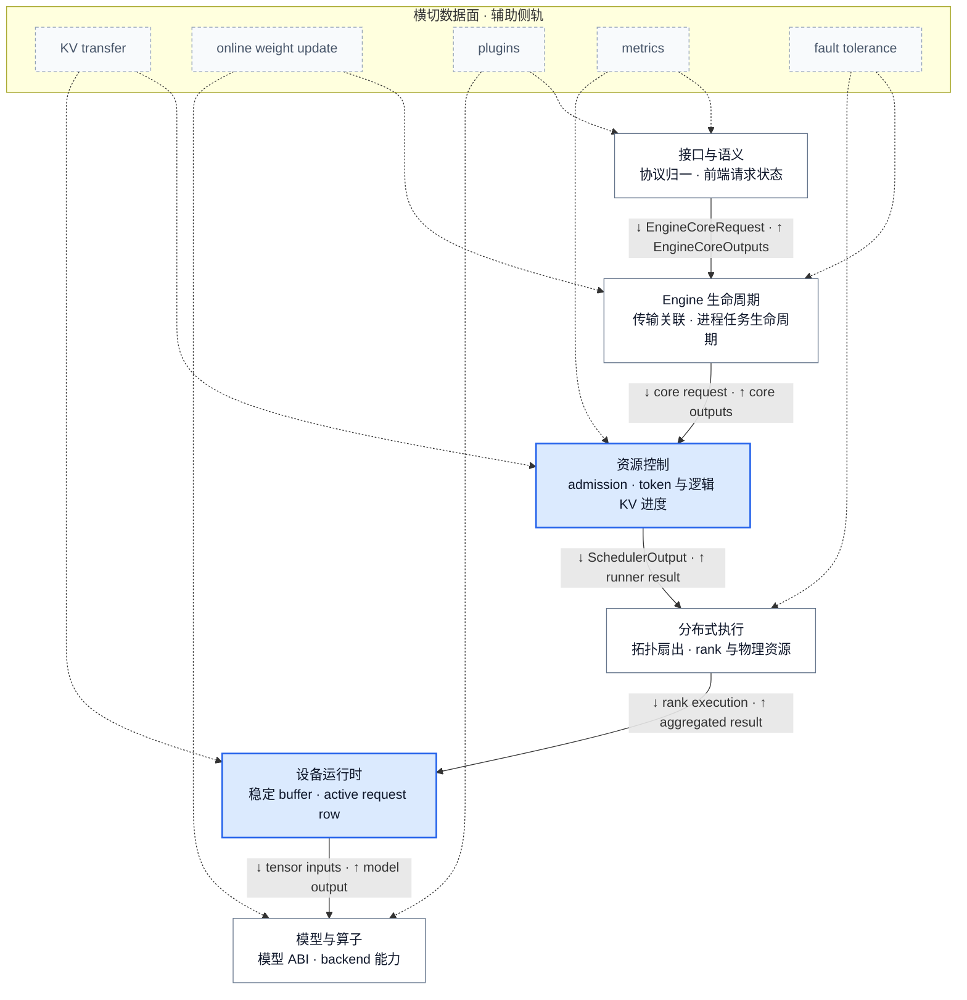
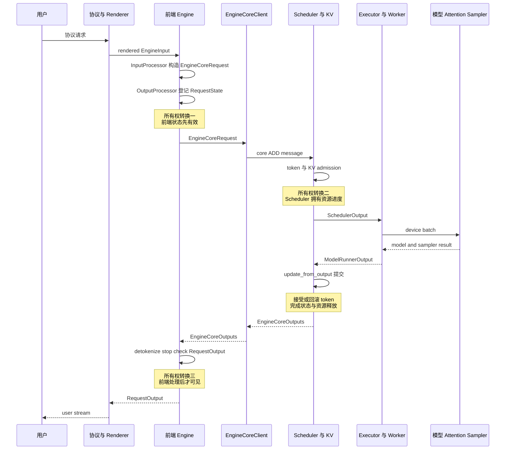

# vLLM 架构概览：责任分层、状态所有权与请求生命周期

> **源码基线**：`vllm-project/vllm@6b110badbb22d3f66c7218b71138f13b7a6b3419`（`main`，提交时间 2026-08-29T02:40:53Z）
> **维度**：Architecture Overview（责任分层优先，在线请求生命周期为代表路径）
> **中心命题**：vLLM 的稳定架构边界不是源码目录，也不是一条拉长的调用链，而是六个按责任与状态所有权分开的层：上层把用户语义变成内部合同，中层决定资源承诺并组织执行，下层把计划落实为设备状态、模型与算子。请求生命周期只是在这些静态边界上的一次状态移交。
> **所有权边界**：本页拥有全系统静态分层、层间合同与一条在线请求的提交/可见性主线；Scheduler、KV、分布式、设备 runner、模型 ABI 等内部证明由对应 owner 页负责，本页不展开其算法细节。

## 1. 背景与中心命题

vLLM 同时面对离线 Python 调用、在线协议、生成与 pooling 等任务，以及 uni、multiprocess、Ray 和外部 launcher 等执行拓扑。如果把这些变化直接塞进一个 Engine 类或一个 GPU 循环，协议语义、请求生命周期、资源策略与硬件执行会共享可变状态；任一变化都可能破坏其余部分的时序。当前源码反而把 renderer、输入/输出处理器与 EngineCore client 装配为明确接缝，并让不同 client 和 executor 实现复用相同的 core 合同（`vllm/v1/engine/async_llm.py:135-156`；`vllm/v1/engine/core_client.py:78-139`；`vllm/v1/executor/abstract.py:38-93`）。

**设计选择**是按“谁能决定状态何时有效”分层，而不是按进程数、目录名或类名分层。这样，前端可以负责协议与用户可见输出，Scheduler 可以成为 admission/KV 进度的唯一决策者，executor/worker 可以替换拓扑而不复制请求语义，runner 与模型层则可以围绕设备热路径和能力合同演进。官方设计文档也把 API server、EngineCore 与 worker 描述为分离的 concern，但本页进一步把进程图还原为六个责任层；进程只是这些责任的一种部署方式（`docs/design/arch_overview.md:67-99`）。

因此，理解架构要按两个正交问题阅读：先看**静态责任**——每层为什么存在、拥有什么状态；再看**动态生命周期**——一条请求何时跨层、何时提交、何时对用户可见。

## 2. 静态架构：六层责任与合同

图 A 只表达稳定责任和合同。实线是主请求/计划/结果合同，虚线侧轨是会跨越多个责任层的数据面；它们不能因为实现文件位于某个目录，就被误判成该层独占的内部功能。

| 责任层 | 核心能力 | 输入 → 输出合同 | 拥有的状态 / 不变量 | 明确不拥有 | 最小证据 |
|---|---|---|---|---|---|
| 接口与语义 | render、验证、tokenize、detokenize、stop 与 stream | 协议/Prompt/媒体 → `EngineCoreRequest`；core token → 用户响应 | renderer/tokenizer、前端 `RequestState`、per-request collector | waiting/running、token budget、逻辑 KV | `vllm/tasks.py:7-44`；`vllm/v1/engine/input_processor.py:281-340`；`vllm/v1/engine/output_processor.py:447-468` |
| Engine 生命周期 | 构造、传输、请求关联、liveness、abort、shutdown、背压 | frontend request/utility message ↔ core outputs/events | client transport、core 进程/任务生命周期、前端与 core 的关联 | admission policy、模型执行、协议渲染 | `vllm/v1/engine/core_client.py:78-139`；`vllm/v1/engine/core_client.py:503-514` |
| 资源控制 | request lifecycle、token admission、逻辑 KV 分配、抢占、结果提交 | Engine 请求 + 旧状态 → `SchedulerOutput`；runner result → `EngineCoreOutputs` | waiting/running、token progress、block table、完成/取消状态 | GPU tensor 地址、用户 stream、模型 ABI | `vllm/v1/core/sched/scheduler.py:119-169`；`vllm/v1/core/sched/scheduler.py:501-542` |
| 分布式执行 | worker 生命周期、RPC fan-out、collective、rank 聚合与失败传播 | `SchedulerOutput` → 每 rank 执行；rank result → 聚合结果 | worker 拓扑、rank/group、通信顺序、权重与物理 KV 的设备位置 | 全局公平性、协议输出、模型语义解释 | `vllm/v1/executor/abstract.py:38-93`；`vllm/v1/executor/multiproc_executor.py:340-364` |
| 设备运行时 | persistent row、staged write、输入 gather、graph replay、sampling | scheduler delta → 稳定 device buffer；model output → token/pooling/aux output | active request row、device-resident dynamic state、graph descriptor、当步 sampler 状态 | 全局 admission、detokenization、跨实例策略 | `vllm/v1/worker/gpu/model_runner.py:168-240`；`vllm/v1/worker/gpu/model_runner.py:999-1055` |
| 模型与算子 | 模型解析/加载、模型 ABI、attention/backend 选择与 kernel | config + checkpoint + device capability → executable model/backend | 参数与 scale 语义、backend capability、kernel selection | request lifecycle、token fairness、服务拓扑 | `vllm/model_executor/models/registry.py:1274-1324`；`vllm/v1/attention/backend.py:59-130` |

## 3. 逐层设计逻辑

### 3.1 接口与语义层：把用户语义挡在资源循环之外

**背景与设计选择（分析推断）。** 源码可直接证明两件事：任务集合包含 generation、pooling 与 frontend render；`InputProcessor` 在提交 core 前构造 `EngineCoreRequest`，`OutputProcessor` 在 core 返回后把内部输出变为 `RequestOutput`（`vllm/tasks.py:7-44`；`vllm/v1/engine/input_processor.py:281-340`；`vllm/v1/engine/output_processor.py:607-700`）。这些位置没有自陈“为何不让 Scheduler 或 runner 处理协议”的作者理由。基于上述责任边界，本页推断：把 render、stop 和流式语义留在接口层，可以避免每个执行后端复制协议分支；这是架构重建，不是源码对替代方案的原话。

**实现、状态与边界。** `InputProcessor` 持有 renderer 和各类配置，阻塞的 raw-prompt 处理被包装到 renderer 线程池；`process_inputs` 校验并产出 `EngineCoreRequest`（`vllm/v1/engine/input_processor.py:38-75`；`vllm/v1/engine/input_processor.py:281-340`）。返回侧 `OutputProcessor` 持有 `request_id → RequestState`，负责 detokenize、stop check 与 `RequestOutput`；它不决定请求是否获得 token/KV 资源（`vllm/v1/engine/output_processor.py:132-197`；`vllm/v1/engine/output_processor.py:607-700`）。其不变量是：core 输出只有匹配到前端 state 才能成为用户输出；已 abort 的 request 输出会被忽略。

### 3.2 Engine 生命周期层：复用 core，而不是复刻状态机

**背景与设计选择（分析推断）。** 源码可直接证明 `EngineCoreClient` 抽象覆盖 in-process、同步 MP、异步 MP 和 DP client，各实现承担不同传输与生命周期（`vllm/v1/engine/core_client.py:78-139`）。源码未在此处比较“每种前端复制一套 core 状态机”的替代方案；本页据此推断，这道边界让同步、异步和进程拓扑差异停留在 client 一侧，而复用同一套 Scheduler 语义。

**实现、状态与边界。** `AsyncLLM` 组合 renderer、InputProcessor、OutputProcessor 与 async MP client；MP client 用 input/output sockets 与后台 core busy loop 交换 `EngineCoreRequest` 和 `EngineCoreOutputs`（`vllm/v1/engine/async_llm.py:135-156`；`vllm/v1/engine/core_client.py:503-514`）。该层拥有 transport、进程/任务生命周期、请求与输出通道的关联；它可以拒绝已死亡 engine 的新请求，却不拥有 token admission 或物理执行。约束是 asyncio 且不启用 multiprocessing 的组合当前显式不支持（`vllm/v1/engine/core_client.py:97-112`）。

### 3.3 资源控制层：由一个提交者协调请求、token 与逻辑 KV

**背景与设计选择（分析推断）。** 源码可直接证明 Scheduler 在同一轮中综合 token、输入、encoder 与 KV 约束，并让 `num_computed_tokens` 追上当前应计算 token，而不是固定区分 prefill/decode 阶段，最后形成统一的 `SchedulerOutput`（`vllm/v1/core/sched/scheduler.py:501-542`）。源码没有在该段陈述分布式 admission 的反例；本页推断：若 worker 各自承诺这些共享预算，就难以维持唯一的 token 与逻辑 block 所有者，因此统一提交者是从现有状态边界重建出的设计理由。

**实现、状态与边界。** Scheduler 先计算 token 数，再调用 `KVCacheManager.allocate_slots`；分配失败时按 policy 抢占，成功后才把请求写入当步计划（`vllm/v1/core/sched/scheduler.py:655-729`）。`schedule` 后的进度是带 in-flight 语义的资源承诺；runner 返回后，`update_from_output` 才处理 stale/failed output、接受或回滚 token、finish/free，并构造 `EngineCoreOutput`（`vllm/v1/core/sched/scheduler.py:1435-1455`；`vllm/v1/core/sched/scheduler.py:1848-1904`；`vllm/v1/core/sched/scheduler.py:2031-2103`）。该层拥有 waiting/running、逻辑 block 与完成状态；GPU 地址和用户 stream 均在边界之外。

### 3.4 分布式执行层：把计划映射到拓扑，不复制 Engine 语义

**背景与设计选择（分析推断）。** 源码可直接证明 `Executor` 合同会从 uni、mp、Ray、external launcher 或自定义类中选择 backend，并把同一 `SchedulerOutput` 执行成可交还 Scheduler 的 runner result（`vllm/v1/executor/abstract.py:48-93`；`vllm/v1/executor/abstract.py:219-237`）。源码没有在这些位置自陈“为何不让每种 topology 自带调度”；本页推断：统一计划合同把拓扑变化限制在执行层，避免 backend 选择反向改变请求资源语义。

**实现、状态与边界。** multiprocess executor 把计划作为 collective RPC 广播，只从输出 rank 或 aggregator 取得结果；worker monitor 在任一子进程异常退出时关闭 executor 并回调 engine（`vllm/v1/executor/multiproc_executor.py:340-364`；`vllm/v1/executor/multiproc_executor.py:298-324`）。因此该层拥有 worker/rank/group、collective 顺序、权重和物理 KV 的设备位置；全局 token 公平性仍由 Scheduler 决定，模型架构与 backend ABI 则由下层解释。

### 3.5 设备运行时层：把动态计划投影到稳定设备状态

**背景与设计选择（分析推断）。** 源码可直接证明 MRV2 的 `RequestState` 预留固定数量的 request slot，并以 free index 分配 row；新增请求只 stage token/进度写入，runner 再批量应用 request、model、sampler 与 block-table 的 staged write，随后 gather 当步 batch（`vllm/v1/worker/gpu/states.py:9-39`；`vllm/v1/worker/gpu/states.py:91-124`；`vllm/v1/worker/gpu/model_runner.py:999-1055`；`vllm/v1/worker/gpu/model_runner.py:1509-1529`）。这些位置没有对“每步重建完整 batch”做作者层面的取舍说明；本页据此推断，稳定 row 加差量写入的边界是在把动态 scheduler 计划投影到可复用的设备状态，而不是声称源码明确以某项性能测量否掉了替代方案。

**实现、状态与边界。** MRV2 runner 为新请求分配稳定 row，写入模型、block table、LoRA 与 sampler 状态，再集中 `apply_staged_writes`；`execute_model` 先提交 finish/free/add/update 的状态变化，然后 gather 当步 batch（`vllm/v1/worker/gpu/model_runner.py:999-1055`；`vllm/v1/worker/gpu/model_runner.py:1501-1529`）。`GPUWorker` 则包住 PP 通信和 runner 调用（`vllm/v1/worker/gpu_worker.py:1108-1189`）。此层不变量是 scheduler delta 与 device row/block 映射一致；它不拥有 admission，也不解释用户协议。

### 3.6 模型与算子层：用能力合同吸收模型和硬件组合爆炸

**背景与设计选择（分析推断）。** 源码可直接证明 ModelRegistry 会归一 architecture，并在 native、Transformers 等实现间解析模型类；attention backend 则显式声明并检查 dtype、KV dtype、head size 与 block size 能力（`vllm/model_executor/models/registry.py:1248-1324`；`vllm/v1/attention/backend.py:59-133`）。源码没有在这些位置自陈“组合爆炸”或比较 Scheduler 按模型名分支的替代方案；本页推断：把模型与硬件差异收敛为 registry 和 capability 合同，可以让上层只消费可执行模型/后端，而不持有这些选择分支。

**实现、状态与边界。** ModelRegistry 先归一 architecture，并在 native、Transformers 等实现之间解析可加载模型类；attention backend 则声明 dtype、KV dtype、block size 与实现/metadata builder 能力（`vllm/model_executor/models/registry.py:1248-1324`；`vllm/v1/attention/backend.py:59-130`）。这一层拥有参数/scale、模型 forward ABI、backend 能力和 kernel 选择；它只消费设备输入，不拥有请求生命周期、token fairness 或服务进程拓扑。

## 4. 动态生命周期：一条在线请求何时换所有者

图 B 把子系统内部折叠，只标出三次关键所有权变化：前端 state 必须先有效，Scheduler 才能接管资源进度；runner result 必须先由 Scheduler 提交，才能回到前端；前端处理完成后，输出才对用户可见。

1. 协议层先 render/tokenize；raw prompt 直接进入 InputProcessor 的路径已经发出 deprecation，新的稳定边界是 Renderer 产出的 EngineInput（`vllm/v1/engine/input_processor.py:309-335`）。
2. `AsyncLLM.add_request` 为请求分配内部 ID 和 collector，然后 `_add_request` **先**在 OutputProcessor 创建前端 state，**后**通过 EngineCore client 提交；这条顺序是“返回结果一定有接收者”的 guard（`vllm/v1/engine/async_llm.py:393-437`；`vllm/v1/engine/output_processor.py:543-568`）。
3. async client 序列化 ADD message，core I/O 线程反序列化并预处理成 Scheduler 的 `Request`，再交给 busy loop；socket 线程不直接修改权威调度状态（`vllm/v1/engine/core_client.py:1108-1152`；`vllm/v1/engine/core.py:1694-1795`）。
4. EngineCore busy loop 先排空输入，再 step；基本 step 顺序是 `schedule → execute_model → update_from_output`（`vllm/v1/engine/core.py:1410-1475`；`vllm/v1/engine/core.py:597-627`）。
5. Scheduler 在 `schedule` 中统一 token budget 与 KV slots；其输出是逻辑资源承诺，而不是 GPU tensor。executor/worker 再把它映射为 rank 与 device batch（`vllm/v1/core/sched/scheduler.py:501-542`；`vllm/v1/worker/gpu/model_runner.py:1501-1529`）。
6. 模型、attention 和 sampler 产生 runner result；Scheduler 以 `update_from_output` 接受、回滚或丢弃 stale 结果并构造 `EngineCoreOutput`。因此“GPU 已算完”不等于“core 状态已提交”（`vllm/v1/core/sched/scheduler.py:1848-1904`；`vllm/v1/core/sched/scheduler.py:2073-2103`）。
7. core output 经 client queue 交给 `AsyncLLM.output_handler`；OutputProcessor detokenize、stop check 并写入 per-request queue 后，`generate` 才 yield 给调用者（`vllm/v1/engine/core_client.py:1041-1106`；`vllm/v1/engine/async_llm.py:687-732`；`vllm/v1/engine/output_processor.py:692-724`）。

这条主线描述普通在线路径的责任移交，不等于唯一时序。启用 PP 或 async scheduling 时，EngineCore 可使用 batch queue 让 schedule 与 execution 重叠；但结果仍必须回到 Scheduler 更新权威状态（`vllm/v1/engine/core.py:638-653`）。

## 5. 横切数据面：状态在哪里提交

横切能力之所以不是“第七层”，是因为它们在多个状态所有者之间建立协议：只说 connector、plugin 或 metrics 位于哪个目录，无法回答哪一侧能宣布操作完成。

| 横切面 | 为什么跨层 | 分侧状态所有者 | 提交点与失败边界 |
|---|---|---|---|
| KV transfer / offload | Scheduler 决定逻辑 block 与请求进度，worker 才能实际 load/save device KV | scheduler-side connector 拥有 request/block metadata；worker-side connector 拥有传输与设备操作 | worker metadata 聚合回 Scheduler；request finish hook 可接管异步 block 释放。角色与协议见 `vllm/distributed/kv_transfer/kv_connector/v1/base.py:7-40`、`124-159`、`543-562` |
| 在线权重更新 | 前端触发事务，executor fan-out，各 rank 修改实际权重，core 维护对外版本 | frontend orchestration、worker update session、EngineCore `_weight_version` | worker `finish_weight_update` 清理 session 后，frontend 才设置新 version；见 `vllm/v1/engine/async_llm.py:1123-1167`、`vllm/v1/worker/gpu_worker.py:1357-1427`、`vllm/v1/engine/core.py:981-986` |
| plugins | endpoint、I/O、platform、stat logger 与 general plugin 运行在不同进程 | 每类 plugin 的目标进程各自持有初始化副作用 | 每进程只加载一次；endpoint plugin 只在前端，general plugin 可在 core/worker；见 `vllm/plugins/__init__.py:16-33`、`77-90` |
| metrics | 资源事件在 Scheduler/worker 发生，用户级统计与导出在 frontend 聚合 | core 生成 scheduler stats；OutputProcessor 更新 request stats；frontend logger manager 导出 | core outputs 到达并经 frontend 处理后记录；见 `vllm/v1/engine/async_llm.py:117-169`、`687-743` |
| fault tolerance | worker death、core loop failure与用户请求失败处在不同故障域 | executor monitor、EngineCore sentinel、client liveness 各有局部状态 | worker death 先关闭 executor 并回调 engine；core busy loop受 fault wrapper 保护；见 `vllm/v1/executor/multiproc_executor.py:298-324`、`vllm/v1/engine/core.py:1101-1115`、`1410-1422` |

## 6. Live / legacy 与失败边界

### 6.1 “V1”有两个不同版本轴

`vllm.engine.LLMEngine` 直接别名到 V1 `LLMEngine`，`AsyncLLMEngine` 直接别名到 V1 `AsyncLLM`；不要再把独立 V0 engine 当作当前并行架构。V1 `LLMEngine` 自称 legacy，是为旧式同步 `add_request/step` 兼容的 facade，不代表其背后仍有另一套 V0 core（`vllm/engine/llm_engine.py:4-7`；`vllm/engine/async_llm_engine.py:4-7`；`vllm/v1/engine/llm_engine.py:48-61`）。

Engine V1 与 Model Runner V1/V2 又是不同维度。当前配置先接受显式环境变量选择（`vllm/config/vllm.py:619-623`）；未显式覆盖时，ROCm 上命中 `ROCM_DEFAULT_MRV1_ARCHITECTURES` 的模型会独立回退 MRV1（`vllm/config/vllm.py:627-635`），随后才检查 Triton 是否可用以及 capability check 是否存在不支持项，任一失败也回退 MRV1，只有其余情况默认 MRV2（`vllm/config/vllm.py:637-652`）。`GPUWorker` 按这一结果实例化不同 runner（`vllm/v1/worker/gpu_worker.py:455-475`），所以“V1 engine”不能推出“必走某一代 runner”。

### 6.2 拓扑由 backend 决定，不是固定进程公式

`EngineCoreClient` 可以选择 in-process、同步 MP、异步 MP 或 DP client，Executor 又可以选择 uni、mp、Ray、external launcher 或自定义类（`vllm/v1/engine/core_client.py:89-139`；`vllm/v1/executor/abstract.py:48-93`）。因此“API server + 一个 core + 每卡一个 worker”只是常见部署实例，不是架构不变量。官方文档的 V1 process 图适合解释默认多进程意图，但其后仍沿用 `AsyncLLMEngine` 等较旧类名；live path 应以本 commit 的 aliases、constructors 与 backend selection 为准（`docs/design/arch_overview.md:67-113`；`docs/design/arch_overview.md:134-166`）。

### 6.3 失败不是一个全局布尔值

前端 state、Scheduler request、in-flight GPU work 与跨实例 transfer 可能处在不同完成阶段。代码因此分别处理 client abort、执行中 abort 的 stale output、deferred KV free、worker death 和 core death；不能用“请求失败”同时代表这些状态。特别是 output 在执行中被 abort 时，Scheduler 会丢弃已过时结果；有并发 KV transfer 时，block 释放还需 fence in-flight write（`vllm/v1/core/sched/scheduler.py:1853-1879`；`vllm/v1/core/sched/scheduler.py:2509-2522`）。

## 7. 阅读交接：按机制进入 owner 页

- [[02_engineering/03_infer_frameworks/vllm/10_vllm_engine_architecture_analysis|Engine 内部与进程接缝]] —— 深入 Client、EngineCore、Executor 的对象/进程所有权和资源承诺提交。
- [[02_engineering/03_infer_frameworks/vllm/11_vllm_scheduler_analysis|Scheduler 事务]] —— 深入 token budget、waiting/running、抢占和 output 后提交。
- [[02_engineering/03_infer_frameworks/vllm/12_vllm_kv_cache_management_analysis|KV Cache 所有权]] —— 深入逻辑 block、物理 KV、prefix cache 与释放不变量。
- [[02_engineering/03_infer_frameworks/vllm/15_vllm_model_runner_v2_analysis|Model Runner V2]] —— 深入 persistent row、staged write 与 async-first 设备热路径。
- [[02_engineering/03_infer_frameworks/vllm/22_vllm_distributed_inference_analysis|分布式推理]] —— 深入 rank/group、并行轴和 collective 顺序。
- [[02_engineering/03_infer_frameworks/vllm/26_vllm_disaggregated_kv_serving_analysis|跨实例 KV]] —— 深入 connector、lease 与 producer/consumer 交接。
- [[02_engineering/03_infer_frameworks/vllm/28_vllm_extension_plugin_system_analysis|扩展与插件]] —— 深入 discovery、进程覆盖与多阶段初始化边界。

## Related Pages

- [[02_engineering/03_infer_frameworks/vllm/02_vllm_system_design_principles_analysis|vLLM 系统设计原则]] —— 从动态请求与资源压力解释本页六层边界背后的全局设计支点。
- [[02_engineering/03_infer_frameworks/vllm/10_vllm_engine_architecture_analysis|vLLM Engine 架构]] —— 展开本页 Engine 生命周期层与资源控制层之间的提交接缝。
- [[02_engineering/03_infer_frameworks/vllm/11_vllm_scheduler_analysis|vLLM Scheduler 分析]] —— 证明本页生命周期中 admission、抢占与结果提交的内部事务。
- [[02_engineering/03_infer_frameworks/vllm/12_vllm_kv_cache_management_analysis|vLLM KV Cache 管理]] —— 解释逻辑 block、物理 tensor 与跨实例传输为何必须分开所有权。
- [[02_engineering/03_infer_frameworks/vllm/15_vllm_model_runner_v2_analysis|vLLM Model Runner V2]] —— 细化设备运行时如何把动态计划投影到稳定 row 与 buffer。
- [[02_engineering/03_infer_frameworks/vllm/22_vllm_distributed_inference_analysis|vLLM 分布式推理]] —— 细化 executor 如何把统一计划映射为 rank 与 collective。
- [[02_engineering/03_infer_frameworks/vllm/index|vLLM 推理引擎知识地图]] —— 按问题与机制 owner 导航整个 vLLM 知识域。
