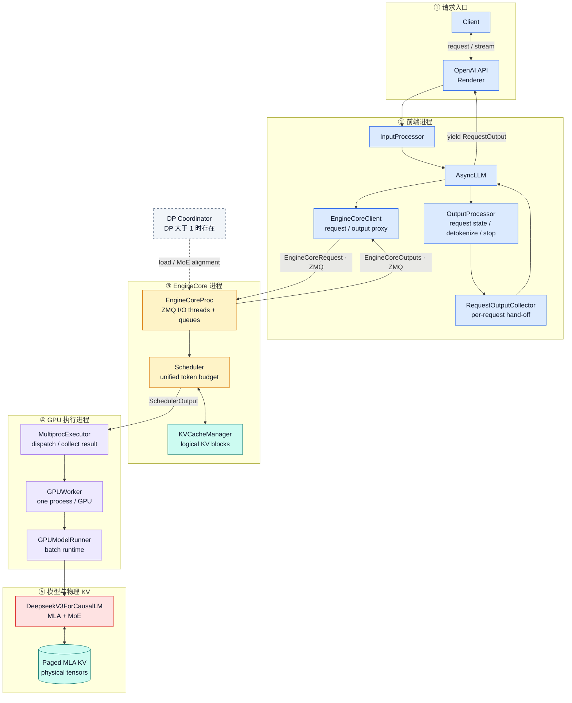
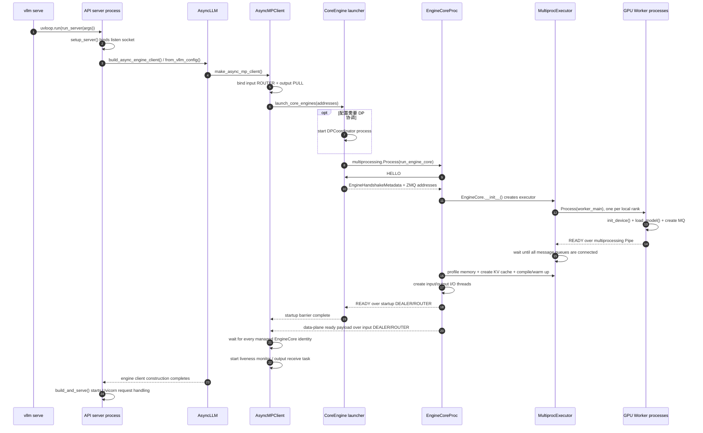
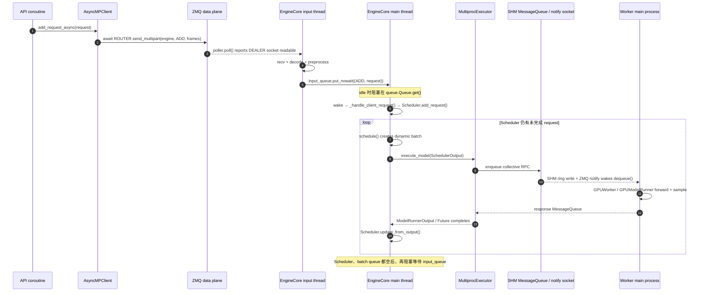
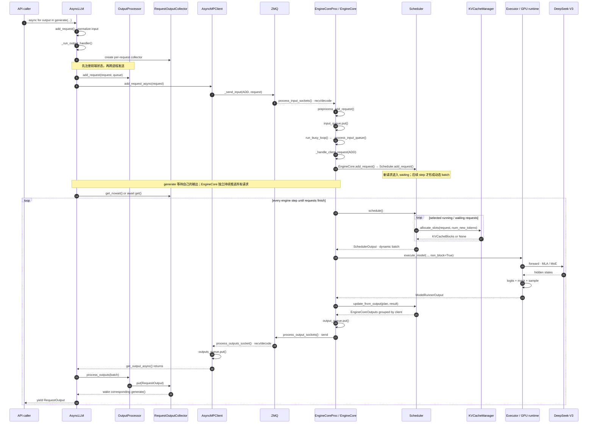
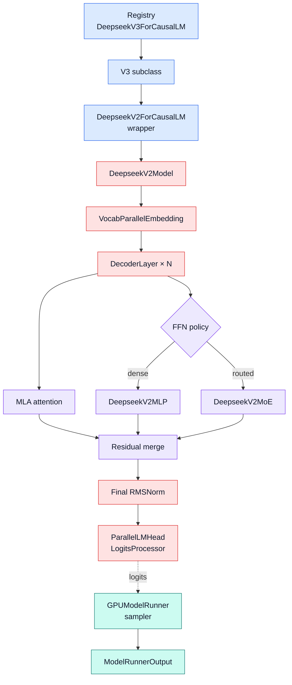
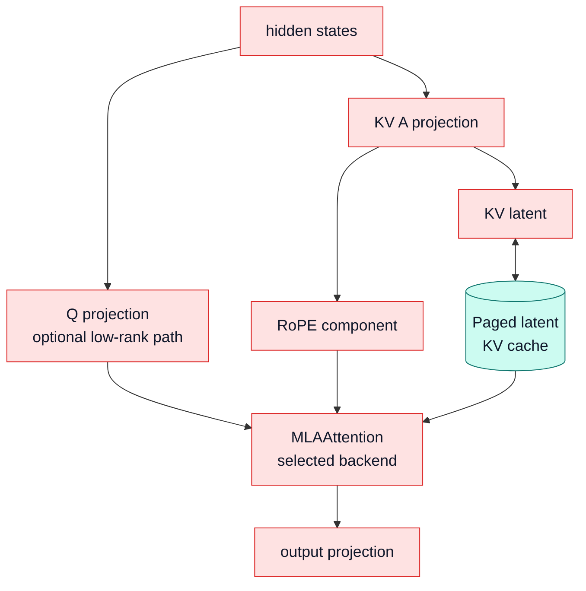
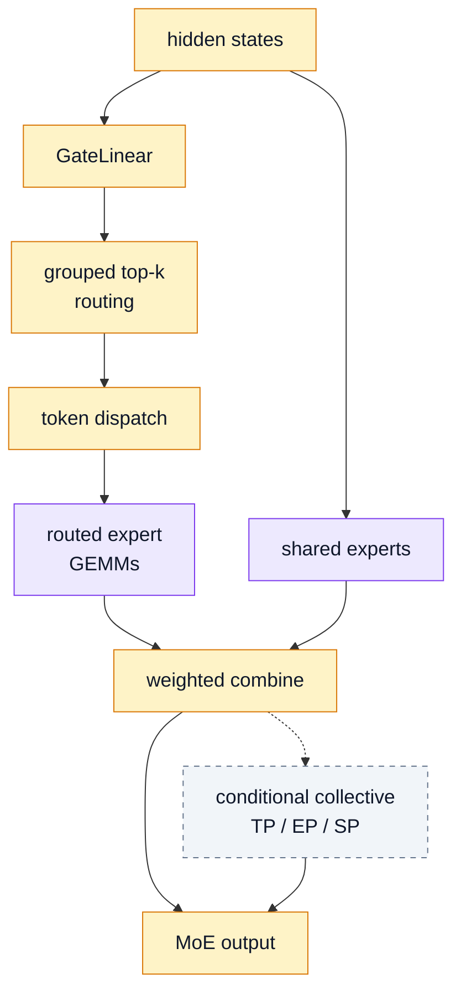

# vLLM 请求全链路导览：以 DeepSeek-V3 推理为例

> **源码基线**：`vllm-project/vllm@26858770eccf9592073b502a57f4662aac358001`（`main`，提交时间 2026-08-24T06:54:41Z）
> **与本域统一基线的关系**：本域其余页面统一固定在 `d66300a1baa7779c68c7dfa4e51eee2502b48017`。本页显式声明更新到 `26858770`；两个提交之间，本页引用的架构、引擎、调度、worker 与 DeepSeek 模型文件没有源码差异。
> **中心命题**：在线主路径由**前端请求状态机**与 **EngineCore 调度状态机**共同构成，以 ZMQ、线程队列与 Future 衔接；`AsyncLLM.generate()` 面向一条逻辑请求，`Scheduler.schedule()` 面向所有活跃请求组成的动态 batch。DeepSeek-V3 的 MLA + MoE 是这条通用执行骨架里的模型实现，不是另一套请求调度架构。
> **本页定位**：**导览页**，回答“一条请求实际怎样穿过进程、队列与 GPU”。各子系统的设计论证由对应 owner 页负责（见 [[02_engineering/03_infer_frameworks/vllm/index|vLLM 推理引擎知识地图]]），本页不重复论证，只补齐三段 owner 页未覆盖的运行期机制：**服务启动的三级就绪屏障**、**空闲后端如何被唤醒**、**跨进程管道拓扑**。

[打开可缩放、可拖拽、可点击源码节点的交互图](assets/deepseek_v3_inference_flow_interactive.html)

交互图完全离线，不依赖 Mermaid CDN；同目录下的 `assets/deepseek_v3_inference_flow_interactive.js` 是其依赖，两者需一起保留。使用方法：滚轮缩放、空白处拖拽、`＋/－/0` 缩放或复位；点击节点后，右侧显示进程归属、状态所有权、关键机制与冻结源码链接。

## 零、适用范围与命名澄清

| 项目 | 冻结值 |
|---|---|
| 主路径 | V1 engine；在线 `AsyncLLM`；默认 `DeepseekV3ForCausalLM` GPU Model Runner V1 路径 |
| 不在主图中的条件分支 | speculative decoding、KV connector、encoder/cache transfer、PP、DP/EP、DCP/PCP、Model Runner V2 |

一个容易混淆的命名：**V1 engine** 是整个请求调度/执行架构；**Model Runner V1/V2** 是 GPU worker 内部的两代 runner。当前默认 V2 runner 名单包含 `DeepseekV2ForCausalLM`，但不包含 `DeepseekV3ForCausalLM`；若没有显式 `VLLM_USE_V2_MODEL_RUNNER` 或 PCP/特定 speculative 方法等强制条件，按当前配置逻辑，DeepSeek-V3 走 V1 runner。[默认名单](https://github.com/vllm-project/vllm/blob/26858770eccf9592073b502a57f4662aac358001/vllm/config/vllm.py#L69-L114)；[runner 选择逻辑](https://github.com/vllm-project/vllm/blob/26858770eccf9592073b502a57f4662aac358001/vllm/config/vllm.py#L649-L700)。这是从当前默认名单与选择逻辑得出的结论，不代表手动强制 V2 永远不可用。

## 一、中央命题：两层状态机通过消息衔接

理解当前流程最有效的方法，不是背一串函数名，而是看清两个状态机：

1. **前端请求状态机**：拥有 tokenizer/renderer、反分词器、停止字符串、每请求输出队列和 HTTP stream。它知道“怎样把内部 token 变成用户响应”，但不拥有 GPU 调度状态。
2. **EngineCore 调度状态机**：拥有 waiting/running 请求、`num_computed_tokens`、token budget、逻辑 KV block table、抢占和完成状态。它知道“下一次 GPU 应算什么”，但不直接维护 HTTP stream。

两者通过 `EngineCoreClient` 的 ZMQ 通道交换 `EngineCoreRequest` 与 `EngineCoreOutputs`。API server 负责 HTTP、输入处理与流式返回；EngineCore 负责 scheduler/KV 管理；每张 GPU 由一个 worker 进程管理。[官方进程架构说明](https://github.com/vllm-project/vllm/blob/26858770eccf9592073b502a57f4662aac358001/docs/design/arch_overview.md#L69-L99)。

这种拆分的直接收益是：tokenization/反分词与网络 I/O 不阻塞核心调度循环；EngineCore 可用 busy loop 持续批处理；worker 可通过非阻塞 Future 与 batch queue 重叠下一批 CPU 调度和当前批 GPU 执行。代价是调用关系不再是普通栈帧，排障时必须同时观察前端队列、ZMQ、EngineCore request state 和 worker collective。

## 二、组件边界与状态所有权

阅读约定：这张逻辑框图突出组件依赖与主数据方向，完整返回路径见第 3 章时序图；虚线表示条件路径。`KVCacheManager` 画的是逻辑 KV 状态，`Paged MLA KV tensors` 画的是 GPU 上的物理存储，二者不能合并理解。



### 2.1 进程数量与权威状态

| 组件 | 数量 | 它拥有的权威状态 | 它不负责什么 |
|---|---:|---|---|
| API server | 默认 1；DP 时默认随 DP size 扩展，也可用 `--api-server-count` 指定 | tokenizer/renderer、`InputProcessor`、`OutputProcessor`、per-request stream | 不决定本 step 的 token/KV block |
| EngineCore | 每个 DP rank 1 个 | Scheduler、逻辑 KV blocks、request lifecycle、抢占/完成 | 不直接做反分词或 HTTP streaming |
| GPU worker | local multiprocess executor 下每个 world rank 1 个；全局通常为 `DP × PP × TP × PCP` | 模型权重、物理 GPU KV tensors、runner persistent batch | 不拥有跨请求的全局调度策略 |
| DP Coordinator | 在线 DP 且 `needs_dp_coordinator` 时 1 个 | 内部/混合 LB 统计；MoE wave 协调 | 不替代每 rank 的本地 scheduler |

数量关系与职责见 [architecture overview 的进程表](https://github.com/vllm-project/vllm/blob/26858770eccf9592073b502a57f4662aac358001/docs/design/arch_overview.md#L71-L112)。特别是 API server 与 EngineCore 在 DP 场景是 many-to-many ZMQ 拓扑，不应画成一个前端永久绑定一个 core。

“KV cache 归谁”需要分两层说：EngineCore 的 `KVCacheManager` 拥有**逻辑 block 分配/复用/释放决策**；GPU worker 拥有**物理 KV tensor 与 slot 写入**。把二者都简写成一个 `KV Cache` 方框，会掩盖大量“block table 正确但 GPU slot/connector 状态不一致”的故障边界。

### 2.2 模块契约

| 模块 | 接收什么 | 产出什么 | 权威状态/职责 | 明确不负责 |
|---|---|---|---|---|
| `InputProcessor` | `PromptType`、已渲染 `EngineInput`、采样参数 | 规范化 `EngineCoreRequest` | tokenization、多模态预处理、请求字段规范化 | 不决定本 step 是否执行 |
| `AsyncLLM` | 单条逻辑请求及参数 | 异步 `RequestOutput` 流 | 编排输入、注册前端状态、提交 EngineCore、取消/异常传播 | 不维护 waiting/running 或 KV block table |
| `OutputProcessor` | `EngineCoreOutput` batch | 反分词后的 `RequestOutput` | `request_id → RequestState`、detokenize、stop string、前端完成状态 | 不采样 token，不决定 GPU batch |
| `RequestOutputCollector` | 某个逻辑请求的 `RequestOutput` | 唤醒对应 `generate()` | frontend 内部的每请求交接与 DELTA 合并 | 不是保存全部历史元素的通用 FIFO |
| `EngineCoreClient` | `EngineCoreRequest`/utility/abort | `EngineCoreOutputs` | frontend 与 EngineCore 的传输代理、序列化与存活检查 | 不修改 scheduler 状态 |
| `EngineCoreProc` | ZMQ 消息、worker 结果 | EngineCore 输出消息 | I/O 线程、输入/输出队列、busy loop、EngineCore 生命周期 | 不做 HTTP/反分词 |
| `Scheduler` | `Request` 与上一步 `ModelRunnerOutput` | `SchedulerOutput`、`EngineCoreOutputs` | waiting/running、token 进度、抢占/完成、逻辑执行计划 | 不直接执行模型 forward |
| `KVCacheManager` | 请求 token 进度与分配约束 | 逻辑 KV blocks 或 `None` | prefix 命中、block admission/复用/释放 | 不拥有 GPU 上的 KV tensor 数据 |
| `Executor/Worker/Runner` | `SchedulerOutput` | `ModelRunnerOutput` | 分布式派发、物理 batch、forward、logits 与 sampling | 不拥有跨请求全局调度策略 |
| `DeepseekV3ForCausalLM` | runner 准备的 tensors/context | hidden states/logits 所需模型结果 | MLA、MoE、权重和层级计算 | 不负责请求队列、HTTP stream 或调度策略 |

在线构造时，`AsyncLLM` 同时创建 `InputProcessor`、`OutputProcessor` 和异步多进程 `EngineCoreClient`。[frontend 组件装配](https://github.com/vllm-project/vllm/blob/26858770eccf9592073b502a57f4662aac358001/vllm/v1/engine/async_llm.py#L135-L156)。`EngineCoreClient` 的实现选择进一步区分 in-process、同步 ZMQ 和异步 ZMQ；`AsyncLLM` 使用的是 `AsyncMPClient` 或其 DP 子类。[client 类型与选择](https://github.com/vllm-project/vllm/blob/26858770eccf9592073b502a57f4662aac358001/vllm/v1/engine/core_client.py#L78-L139)。

### 2.3 在线路径与离线路径的汇合点

在线服务调用 `AsyncLLM.generate()`：它创建/取得请求输出队列、处理输入、把请求分别登记到本进程 `OutputProcessor` 和独立 EngineCore，然后从 per-request queue 持续 `yield RequestOutput`。[`generate()` 的契约](https://github.com/vllm-project/vllm/blob/26858770eccf9592073b502a57f4662aac358001/vllm/v1/engine/async_llm.py#L550-L621)；[请求同时登记到前端与 EngineCore](https://github.com/vllm-project/vllm/blob/26858770eccf9592073b502a57f4662aac358001/vllm/v1/engine/async_llm.py#L424-L436)。

离线 `LLM()` 走同步 `LLMEngine`。但它的 `step()` 现在也不是“在当前函数中 scheduler → forward”：它从 EngineCoreClient 取 `EngineCoreOutputs`，交给 `OutputProcessor`，再发 abort/记录统计。[同步 `LLMEngine.step()`](https://github.com/vllm-project/vllm/blob/26858770eccf9592073b502a57f4662aac358001/vllm/v1/engine/llm_engine.py#L298-L335)。所以在线/离线的前端等待方式不同，但真正的 schedule/execute 都汇合在 EngineCore。

> 这三小节回答的是“谁拥有什么状态”。**为什么必须这样分层**（时间尺度、失败模式、资源承诺的唯一提交者）由 [[02_engineering/03_infer_frameworks/vllm/10_vllm_engine_architecture_analysis|vLLM 引擎架构]] 论证，本页不重复。

## 三、服务启动：进程树与三级就绪屏障

先看默认的**单 API server、非 Ray、local multiprocessing executor** 路径。它形成的进程树是：

```text
vllm serve / API server（当前进程）
├─ DP Coordinator（条件性：在线 DP 且配置需要协调）
└─ EngineCore_DP<i>（每个本地 DP rank 一个）
   ├─ VllmWorker-0（本 DP rank 的 TP/PP/PCP worker）
   ├─ VllmWorker-1
   └─ ...
```

EngineCore 内的 `process_input_sockets`、`process_output_sockets` 是后台**线程**，`AsyncMPClient.process_outputs_socket` 与 `AsyncLLM.output_handler` 是 frontend event loop 上的 asyncio **任务**；它们不是额外进程。多 API server、headless、external/hybrid DP load balancing 和 Ray 会改变“谁创建谁”，但不会改变 EngineCore 拥有 Scheduler、worker 拥有模型执行状态这一职责边界。[CLI 对单/多 API、headless 与 DP supervisor 的分流](https://github.com/vllm-project/vllm/blob/26858770eccf9592073b502a57f4662aac358001/vllm/entrypoints/cli/serve.py#L42-L151)；[Ray 与本地 EngineCore 启动分支](https://github.com/vllm-project/vllm/blob/26858770eccf9592073b502a57f4662aac358001/vllm/v1/engine/utils.py#L1104-L1247)。



这里不是“`Process.start()` 返回就算启动完成”，而是三层嵌套屏障：

1. **Worker 屏障**：`MultiprocExecutor` 用配置后的 multiprocessing context 创建 `VllmWorker-*`。worker 完成 device 初始化、模型加载和消息队列创建后，经 `Pipe` 发 `READY`；executor 等齐所有本地 worker，并让输入/响应消息队列完成订阅握手。[worker 创建与父子 Pipe](https://github.com/vllm-project/vllm/blob/26858770eccf9592073b502a57f4662aac358001/vllm/v1/executor/multiproc_executor.py#L600-L780)；[worker 加载模型后发送 READY](https://github.com/vllm-project/vllm/blob/26858770eccf9592073b502a57f4662aac358001/vllm/v1/executor/multiproc_executor.py#L853-L935)。
2. **EngineCore 启动屏障**：launcher 创建每个本地 EngineCore 进程；core 先发 `HELLO` 领取 ZMQ/DP 元数据，随后构造 Executor、初始化 KV cache/Scheduler、启动 I/O 线程，最后才发 `READY`。launcher 同时监控 EngineCore、Coordinator 和相关 frontend 的 process sentinel，初始化期间任一进程死亡都会使启动失败。[EngineCore 进程管理器](https://github.com/vllm-project/vllm/blob/26858770eccf9592073b502a57f4662aac358001/vllm/v1/engine/utils.py#L144-L269)；[`HELLO → init metadata → READY` 状态机](https://github.com/vllm-project/vllm/blob/26858770eccf9592073b502a57f4662aac358001/vllm/v1/engine/utils.py#L1250-L1405)；[EngineCore 握手与初始化上下文](https://github.com/vllm-project/vllm/blob/26858770eccf9592073b502a57f4662aac358001/vllm/v1/engine/core.py#L1021-L1260)。
3. **数据面屏障**：EngineCore 的输入线程用 DEALER 向 frontend 的 ROUTER 主动发送 `EngineCoreReadyResponse`；`MPClient` 必须收齐自己管理的所有 engine identity，才完成构造并启动存活监控。单 API server 路径随后才进入 `build_and_serve()`，所以 socket 虽已绑定，Uvicorn 的应用请求处理要等后端就绪。[client 绑定 socket、启动 core 并等待数据面 ready](https://github.com/vllm-project/vllm/blob/26858770eccf9592073b502a57f4662aac358001/vllm/v1/engine/core_client.py#L516-L680)；[engine client 构造完成后才 build and serve](https://github.com/vllm-project/vllm/blob/26858770eccf9592073b502a57f4662aac358001/vllm/entrypoints/launchers/api_server/entry.py#L67-L112)。

本地进程的启动方式不是硬编码成一种：`get_mp_context()` 默认读取 `VLLM_WORKER_MULTIPROC_METHOD`（当前 env schema 的默认值为 `fork`，允许值为 `fork/spawn`），但 CUDA/XPU 已初始化、Ray actor、NUMA binding 或 WSL 等条件会强制改用 `spawn`。API entry 还保留一条直接检查字符串 `forkserver` 的预加载分支；由于当前 env schema 与该分支表面上并不一致，不能仅凭这段代码断言 `forkserver` 是普通 executor 路径的完整受支持配置。理解“进程如何拉起”时，应抓住实际选出的 context、`context.Process(target=...)` 和 READY 协议，不要把它简化成“永远 fork”。[multiprocessing context 选择](https://github.com/vllm-project/vllm/blob/26858770eccf9592073b502a57f4662aac358001/vllm/utils/system_utils.py#L125-L182)；[env schema 的允许值](https://github.com/vllm-project/vllm/blob/26858770eccf9592073b502a57f4662aac358001/vllm/envs.py#L946-L949)；[API entry 的 forkserver 分支](https://github.com/vllm-project/vllm/blob/26858770eccf9592073b502a57f4662aac358001/vllm/entrypoints/launchers/api_server/entry.py#L36-L63)。

## 四、新输入如何唤醒空闲后端

运行期没有一个中心线程不断检查“prompt 变量有没有变化”，也不是所有进程都以固定周期轮询。一次新请求通过不同 IPC 原语逐层唤醒：



逐层看其触发条件：

- **frontend → EngineCore I/O 线程**：`AsyncMPClient` 把 engine identity、请求类型和序列化 frames 发到 ZMQ ROUTER；EngineCore 的 DEALER socket 由 `zmq.Poller.poll()` 阻塞等待，可读事件到来后才接收和解码。[frontend ZMQ send](https://github.com/vllm-project/vllm/blob/26858770eccf9592073b502a57f4662aac358001/vllm/v1/engine/core_client.py#L1108-L1152)；[EngineCore socket poll/recv](https://github.com/vllm-project/vllm/blob/26858770eccf9592073b502a57f4662aac358001/vllm/v1/engine/core.py#L1688-L1789)。
- **I/O 线程 → EngineCore 主线程**：I/O 线程将请求放入线程安全的 `queue.Queue`；空闲 busy loop 阻塞在 `input_queue.get(block=True)`，`put_nowait()` 会通过队列内部条件变量唤醒它。只有 EngineCore 主线程调用 `_handle_client_request()` 并修改 Scheduler 权威状态，I/O 线程只负责搬运/预处理。[空闲等待与输入 drain](https://github.com/vllm-project/vllm/blob/26858770eccf9592073b502a57f4662aac358001/vllm/v1/engine/core.py#L1405-L1460)。
- **EngineCore → GPU workers**：`MultiprocExecutor.collective_rpc()` 把 `execute_model` 广播写入 `MessageQueue`。同机小消息走共享内存 ring buffer；writer 写完调用 `SpinCondition.notify()`，其通知通道是 ZMQ PUB/SUB。worker 在高负载期短暂 spin/yield 以降低每次读的通知开销，空闲超过阈值后在 ZMQ poll 上睡眠，收到通知后 `dequeue(indefinite=True)` 并执行方法；跨节点 reader 则使用 ZMQ 消息通道。[collective RPC enqueue/response](https://github.com/vllm-project/vllm/blob/26858770eccf9592073b502a57f4662aac358001/vllm/v1/executor/multiproc_executor.py#L375-L438)；[worker 阻塞消费并执行 RPC](https://github.com/vllm-project/vllm/blob/26858770eccf9592073b502a57f4662aac358001/vllm/v1/executor/multiproc_executor.py#L1029-L1055)；[`SpinCondition` 的 busy/idle 唤醒策略](https://github.com/vllm-project/vllm/blob/26858770eccf9592073b502a57f4662aac358001/vllm/distributed/device_communicators/shm_broadcast.py#L112-L223)；[SHM enqueue/dequeue](https://github.com/vllm-project/vllm/blob/26858770eccf9592073b502a57f4662aac358001/vllm/distributed/device_communicators/shm_broadcast.py#L823-L919)。

最关键的区分是：**输入消息只负责把 EngineCore 从“完全无工作”唤醒并加入/修改请求；它不负责逐 token 驱动模型。**一旦 Scheduler 有未完成请求，`run_busy_loop()` 会连续执行 `schedule → execute → update`；上一步采样 token 更新了 `num_computed_tokens` 与请求状态，下一圈自然形成下一次 decode 工作。直到 Scheduler 和 batch queue 都空，EngineCore 才重新阻塞在输入队列。因此“生成下一个 token 的信号”是 Scheduler 中仍有未完成状态，而不是客户端再发送一个输入变化。[`has_work()` 与 busy loop](https://github.com/vllm-project/vllm/blob/26858770eccf9592073b502a57f4662aac358001/vllm/v1/engine/core.py#L1395-L1471)。

`DP + MoE` 是条件例外而不是另一套基本 IPC：`DPEngineCoreProc` 还会从 coordinator 通道接收 `START_DP_WAVE`，用 `engines_running` 和跨 rank unfinished all-reduce 保持 collective cadence；本 rank 没有可执行请求时也可能做 dummy batch。也就是说，单 rank 的“Scheduler 空就睡眠”在此被扩展成“所有相关 DP ranks 协调后一起停”，但 frontend ZMQ → input queue 与 Executor → worker MessageQueue 两段仍然存在。[DP wave 唤醒与全局 unfinished 协议](https://github.com/vllm-project/vllm/blob/26858770eccf9592073b502a57f4662aac358001/vllm/v1/engine/core.py#L2070-L2240)。

这也说明它不是一条全局 FIFO：单个 ZMQ peer 和各局部队列各自保持相应顺序，但多 frontend/DP rank 的消息会汇合，Scheduler 会按 token budget、优先级、KV 可用性和抢占重新组成动态 batch；ABORT 还会被同时送入 eager abort queue 与有序 input queue。这里保证的是每个状态机的提交约束，不是“所有请求严格按到达次序完成”。[ABORT 的双队列语义](https://github.com/vllm-project/vllm/blob/26858770eccf9592073b502a57f4662aac358001/vllm/v1/engine/core.py#L1760-L1789)。

## 五、跨进程数据流与管道拓扑

把主线画成一根箭头容易产生两个误解：一是把 ZMQ、线程队列、共享内存和 asyncio queue 当成同一种 FIFO；二是以为 `SchedulerOutput` 发给 worker 后，结果会沿原调用栈同步返回。更准确的模型是一组由**状态所有权边界**串联的局部管道：frontend 拥有用户请求与反分词状态，EngineCore 主线程拥有调度提交权，worker 进程拥有设备执行状态；I/O 线程和队列只搬运载荷，不越权修改相邻状态机。

```mermaid
%%{init: {"themeVariables": {"fontSize": "18px"}, "sequence": {"actorFontSize": 17, "messageFontSize": 16, "noteFontSize": 16}}}%%
flowchart LR
    Client["Client / HTTP stream"]

    subgraph Frontend["Frontend / API process"]
        F0["AsyncLLM<br/>InputProcessor"]
        F1["AsyncMPClient<br/>input ROUTER"]
        F2["output PULL<br/>receive task"]
        F3[("outputs_queue<br/>asyncio.Queue")]
        F4["output_handler<br/>OutputProcessor"]
        F5[("RequestOutputCollector<br/>single slot + Event")]
    end

    subgraph Core["EngineCore process"]
        C0["input DEALER<br/>I/O thread"]
        C1[("input_queue<br/>queue.Queue")]
        C1A[("aborts_queue<br/>eager side queue")]
        C2["busy loop<br/>Scheduler"]
        C3[("batch_queue<br/>Future + SchedulerOutput")]
        C4["MultiprocExecutor"]
        C5[("output_queue<br/>queue.Queue")]
        C6["output PUSH<br/>I/O thread"]
    end

    subgraph Workers["GPU worker process(es)"]
        W0[("rpc_broadcast_mq<br/>MessageQueue")]
        W1["worker_busy_loop<br/>GPUWorker / ModelRunner"]
        W2[("async_output_queue<br/>optional thread queue")]
        W3[("worker_response_mq<br/>MessageQueue")]
    end

    TensorQ[("tensor IPC queue<br/>optional torch_shm")]
    DP["DP Coordinator process<br/>optional"]
    CTRL["startup / liveness rail<br/>READY · death Pipe · sentinel"]

    Client -->|P0 HTTP body / prompt| F0
    F0 --> F1
    F1 ==>|P1 ADD + msgpack EngineCoreRequest| C0
    F0 -.->|P2 TensorIpcData| TensorQ
    TensorQ -.->|handle lookup| C0
    C0 -->|P3 decoded request tuple| C1
    C0 -.->|P4 eager ABORT copy| C1A
    C1 --> C2
    C1A --> C2
    C2 -->|P5 SchedulerOutput + Future| C3
    C3 --> C4
    C4 ==>|P6 collective RPC| W0
    W0 --> W1
    W1 -.->|P7 async scheduling| W2
    W1 --> W3
    W2 --> W3
    W3 ==>|P8 ResponseStatus + ModelRunnerOutput| C4
    C4 --> C3
    C3 -->|update_from_output| C2
    C2 -->|P9 client_index + EngineCoreOutputs| C5
    C5 --> C6
    C6 ==>|P10 msgpack EngineCoreOutputs| F2
    F2 -->|P11 decoded output batch| F3
    F3 --> F4
    F4 -->|P12 per-request RequestOutput| F5
    F5 -->|P13 yield / HTTP stream| Client

    C5 -.->|P14 stats / wave state| DP
    F1 -.->|P15 FIRST_REQ / current wave| DP
    DP -.->|P16 START_DP_WAVE| C0
    DP -.->|P17 counts / wave / running| F1
    W1 -.->|P18 worker READY / parent EOF| CTRL
    C0 -.->|core READY / data-plane ready| CTRL
    CTRL -.-> F1

    classDef frontend fill:#0d3345,stroke:#29b6f6,color:#eef3ff
    classDef core fill:#3b2b0e,stroke:#f5ad42,color:#eef3ff
    classDef worker fill:#2d2250,stroke:#a78bfa,color:#eef3ff
    classDef asyncq fill:#103a36,stroke:#2dd4bf,color:#eef3ff
    classDef conditional fill:#20283a,stroke:#7d8aa7,color:#eef3ff,stroke-dasharray:5 5
    class F0,F1,F2,F4 frontend
    class F3,F5 asyncq
    class C0,C1,C1A,C2,C3,C4,C5,C6 core
    class W0,W1,W2,W3 worker
    class TensorQ,DP,CTRL conditional
```



图中的双线是主要跨进程数据面，实线是进程内交接，虚线是条件路径或控制面。这里的“全部管道”限定为：在线 V1 multiprocessing 主路径上会跨执行上下文、产生等待/唤醒、承担背压或保存未提交结果的交接结构；CUDA stream、collective kernel 内部队列和普通容器不属于这张 IPC 图。

| 管道/结构 | 生产者 → 消费者 | 机制与主要载荷 | 阻塞、顺序与背压语义 |
|---|---|---|---|
| P0 HTTP 输入 | client → API coroutine | JSON/body、prompt、sampling parameters；流式输入时是异步 chunk | 由 ASGI/HTTP 层调度；还没有进入 EngineCore 调度顺序 |
| P1 request data plane | `AsyncMPClient` → EngineCore input thread | ZMQ `ROUTER → DEALER`；identity、`EngineCoreRequestType`、msgpack frames | socket 可读事件唤醒 input thread；多 frontend 可在 core 汇合，[发送端](https://github.com/vllm-project/vllm/blob/26858770eccf9592073b502a57f4662aac358001/vllm/v1/engine/core_client.py#L1108-L1152)、[接收端](https://github.com/vllm-project/vllm/blob/26858770eccf9592073b502a57f4662aac358001/vllm/v1/engine/core.py#L1688-L1789) |
| P2 tensor IPC queue（条件） | frontend encoder → EngineCore decoder | `torch.multiprocessing.Queue[TensorIpcData]`；共享内存 tensor 走队列，msgpack 只留 `(sender_id, message_id, tensor_id)` handle | 仅 `mm_tensor_ipc=torch_shm`，当前数据流限 DP=1；发送/接收各有 10 秒 timeout，失败可退回标准序列化。[创建条件](https://github.com/vllm-project/vllm/blob/26858770eccf9592073b502a57f4662aac358001/vllm/v1/engine/utils.py#L1122-L1128)、[发送与接收协议](https://github.com/vllm-project/vllm/blob/26858770eccf9592073b502a57f4662aac358001/vllm/v1/engine/tensor_ipc.py#L45-L178) |
| P3 `input_queue` | core input thread → core main thread | `queue.Queue[(EngineCoreRequestType, request)]` | idle core 阻塞 `get(block=True)`；`put_nowait()` 唤醒。FIFO 只描述这一本地队列，Scheduler 仍会重新组 batch。[队列所有权](https://github.com/vllm-project/vllm/blob/26858770eccf9592073b502a57f4662aac358001/vllm/v1/engine/core.py#L1039-L1044)、[消费与 drain](https://github.com/vllm-project/vllm/blob/26858770eccf9592073b502a57f4662aac358001/vllm/v1/engine/core.py#L1431-L1460) |
| P4 `aborts_queue` | core input thread → scheduler update path | ABORT request ID 的 eager 副本；原 ABORT 仍进入 `input_queue` | 双写允许模型执行期间尽快 abort，同时保留 input queue 中的有序提交；abort 必须幂等，不是普通单队列 FIFO。[双队列原因](https://github.com/vllm-project/vllm/blob/26858770eccf9592073b502a57f4662aac358001/vllm/v1/engine/core.py#L1781-L1789) |
| P5 `batch_queue`（条件） | Scheduler/core → core result commit | bounded `deque[(Future, SchedulerOutput, exec_future)]` | `max_concurrent_batches > 1` 时存在；未满先继续调度，满或无新工作才等待最老 Future，把 CPU 调度与 GPU 执行重叠。[队列协议](https://github.com/vllm-project/vllm/blob/26858770eccf9592073b502a57f4662aac358001/vllm/v1/engine/core.py#L638-L750) |
| P6 `rpc_broadcast_mq` | `MultiprocExecutor` → all worker readers | `(method, args, kwargs, output_rank)`；`execute_model` 的 args 包含 `SchedulerOutput` | 同机小消息写共享内存 ring，大消息走本机 ZMQ，远端 reader 走 ZMQ；`SpinCondition` 在忙时 spin、闲时靠通知唤醒。[collective RPC](https://github.com/vllm-project/vllm/blob/26858770eccf9592073b502a57f4662aac358001/vllm/v1/executor/multiproc_executor.py#L375-L438)、[MessageQueue 传输选择](https://github.com/vllm-project/vllm/blob/26858770eccf9592073b502a57f4662aac358001/vllm/distributed/device_communicators/shm_broadcast.py#L464-L550) |
| P7 `async_output_queue`（条件） | worker main loop → worker output thread | Python `queue.Queue[AsyncModelRunnerOutput/ModelRunnerOutput]` | 只在 async scheduling 下使用；输出线程阻塞 `get()`、解析异步结果，再送 response MQ。[条件分流](https://github.com/vllm-project/vllm/blob/26858770eccf9592073b502a57f4662aac358001/vllm/v1/executor/multiproc_executor.py#L982-L1027) |
| P8 worker response MQ | worker → `MultiprocExecutor` | `(ResponseStatus, result)`，模型主路径的 result 是 `ModelRunnerOutput` | executor 按所需 rank 的 response MQ `dequeue()`；Future 在本进程承接非阻塞结果，失败状态转换为异常。[响应入队与消费](https://github.com/vllm-project/vllm/blob/26858770eccf9592073b502a57f4662aac358001/vllm/v1/executor/multiproc_executor.py#L982-L999)、[Future 结果收集](https://github.com/vllm-project/vllm/blob/26858770eccf9592073b502a57f4662aac358001/vllm/v1/executor/multiproc_executor.py#L420-L438) |
| P9 `output_queue` | core busy loop → core output thread | `queue.Queue[(client_index, EngineCoreOutputs) | ENGINE_CORE_DEAD]` | output thread 阻塞 `get()`；`client_index` 决定发往哪个 frontend，`-1` 路由给 coordinator。[产生输出](https://github.com/vllm-project/vllm/blob/26858770eccf9592073b502a57f4662aac358001/vllm/v1/engine/core.py#L1462-L1469)、[消费与路由](https://github.com/vllm-project/vllm/blob/26858770eccf9592073b502a57f4662aac358001/vllm/v1/engine/core.py#L1826-L1858) |
| P10 output data plane | core output thread → frontend receive task | ZMQ `PUSH → PULL`；msgpack `EngineCoreOutputs`，含 per-request token IDs、完成状态、统计或 utility result | frontend 协程阻塞 `recv_multipart()`；core death sentinel 也经此路径传播。[输出结构](https://github.com/vllm-project/vllm/blob/26858770eccf9592073b502a57f4662aac358001/vllm/v1/engine/__init__.py#L196-L277)、[异步接收](https://github.com/vllm-project/vllm/blob/26858770eccf9592073b502a57f4662aac358001/vllm/v1/engine/core_client.py#L1020-L1095) |
| P11 frontend `outputs_queue` | ZMQ receive task → `AsyncLLM.output_handler` | `asyncio.Queue[EngineCoreOutputs | Exception]` | 一个 frontend 的多请求 batch/统计在这里汇合；`get_output_async()` await 本地队列，而不直接读 socket。[队列与等待](https://github.com/vllm-project/vllm/blob/26858770eccf9592073b502a57f4662aac358001/vllm/v1/engine/core_client.py#L1001-L1106) |
| P12/P13 per-request collector | `OutputProcessor` → 对应 `generate()` → HTTP | `RequestOutputCollector` 的单个 `output` 槽位 + `asyncio.Event` | **不是历史 FIFO**；DELTA producer 领先时合并输出，consumer 用 `get_nowait() or await get()`，从而把 batch 拆回逻辑请求。[单槽位协议](https://github.com/vllm-project/vllm/blob/26858770eccf9592073b502a57f4662aac358001/vllm/v1/engine/output_processor.py#L48-L99)、[按 request 路由](https://github.com/vllm-project/vllm/blob/26858770eccf9592073b502a57f4662aac358001/vllm/v1/engine/output_processor.py#L688-L705) |
| P14–P17 DP coordinator（条件） | cores/frontends ↔ coordinator | core `PUSH → PULL` 发 `SchedulerStats/wave`；coordinator XPUB/XSUB 广播 counts、`START_DP_WAVE`；frontend 可发 `FIRST_REQ` | 仅在线 DP 且配置需要 coordinator；它协调负载快照和 MoE wave，不承载普通 token 输出。[创建条件](https://github.com/vllm-project/vllm/blob/26858770eccf9592073b502a57f4662aac358001/vllm/v1/engine/utils.py#L1130-L1153)、[socket 与载荷](https://github.com/vllm-project/vllm/blob/26858770eccf9592073b502a57f4662aac358001/vllm/v1/engine/coordinator.py#L189-L248)、[wave/stats 路由](https://github.com/vllm-project/vllm/blob/26858770eccf9592073b502a57f4662aac358001/vllm/v1/engine/coordinator.py#L347-L469) |
| P18 startup/liveness rail | worker/core/launcher/frontend | worker READY/death `Pipe`、core `HELLO/READY` startup ZMQ、data-plane `EngineCoreReadyResponse`、process sentinel | 这是控制面屏障与故障传播，不参与逐 step token 数据流；详细时序由 2.4 节负责，避免与运行期队列重复解释。 |

因此排障时应按“哪一段管道停止推进”定位，而不是只问“请求是否还在队列里”：P1/P3 停滞通常属于 frontend/core admission；P5–P8 停滞属于调度—worker 往返；P9–P13 停滞属于输出拆批和客户端消费；P14–P17 只在 DP 条件路径上成立。每一段各自可能有序，但跨段以后会发生 batch 重组、按 client/request 路由或 DELTA 合并，所以端到端完成次序不等于入口到达次序。

## 六、端到端调用时序



这张图从一条请求的视角跟踪数据，但 `SchedulerOutput` 和 `EngineCoreOutputs` 都可能包含多条请求；这是“per-request API”和“batch engine”的交界，而不是矛盾。

### 6.1 加入请求：为什么先登记 frontend，再发送 EngineCore

`generate()` 首先调用 `add_request()`。后者根据输入形态选择同步或异步预处理，把 prompt 规范化成 `EngineCoreRequest`；随后确保后台 output handler 已启动，创建 `RequestOutputCollector`。普通 `n == 1` 请求进入 `_add_request()`；`n > 1` 则 fan-out 成共享 parent collector 的多个 child request。[输入规范化、collector 与 fan-out](https://github.com/vllm-project/vllm/blob/26858770eccf9592073b502a57f4662aac358001/vllm/v1/engine/async_llm.py#L338-L422)。

`_add_request()` 的顺序是一个正确性约束：先调用 `OutputProcessor.add_request()` 建立 `request_id → RequestState → collector` 映射，再调用 `EngineCoreClient.add_request_async()`。[双重登记的固定顺序](https://github.com/vllm-project/vllm/blob/26858770eccf9592073b502a57f4662aac358001/vllm/v1/engine/async_llm.py#L424-L436)；[前端 RequestState 建立](https://github.com/vllm-project/vllm/blob/26858770eccf9592073b502a57f4662aac358001/vllm/v1/engine/output_processor.py#L539-L568)。由这个固定顺序可以推断其并发正确性目的：即使 EngineCore 很快返回，output handler 也已经能找到前端状态；如果顺序反过来，就可能出现“结果先到、路由表后建”的竞态。

### 6.2 调度与执行：本页只标出交界，不重复论证

时序图中 `schedule → execute_model → update_from_output` 这一段，涉及四个已有 owner 页负责的设计命题，本页只保留读图时必须知道的交界事实：

- **三条执行上下文**：`EngineCoreProc` 不在 busy loop 里直接读写 ZMQ。输入 I/O 线程、输出 I/O 线程与核心 busy loop 通过 `input_queue`/`output_queue` 连接，使 socket I/O、序列化与 GPU forward 得以重叠；**只有核心循环能提交调度状态**，I/O 线程只搬运和预处理。[I/O 线程与队列设计](https://github.com/vllm-project/vllm/blob/26858770eccf9592073b502a57f4662aac358001/vllm/v1/engine/core.py#L1039-L1043)
- **单请求 API 与动态 batch 的交界**：frontend 的隔离单位是 `request_id` 与 per-request collector；scheduler 的执行单位是本 step 的 `SchedulerOutput`；GPU runner 的计算单位是该计划形成的物理 batch；output processor 再按 `request_id` 把 batch 拆回各前端请求。continuous batching 不会把 `generate()` 变成批量 API。
- **调度的是 token 工作量**：当前 scheduler 没有独立的 prefill/decode 相位，只在共享 `max_num_scheduled_tokens` 预算下让 `num_computed_tokens` 追上 `num_tokens_with_spec`。因此“一次 step 生成一个 token”“prefill 完成后切换到 decode 模式”都不准确。[统一调度算法注释](https://github.com/vllm-project/vllm/blob/26858770eccf9592073b502a57f4662aac358001/vllm/v1/core/sched/scheduler.py#L499-L520)
- **配对提交不变量**：scheduler 为某个 Future 产生的 `SchedulerOutput` 必须与该 Future 的 `ModelRunnerOutput` 成对提交，乱序或复用计划会让 token counts、block table 与返回 token 错位。[核心 step](https://github.com/vllm-project/vllm/blob/26858770eccf9592073b502a57f4662aac358001/vllm/v1/engine/core.py#L597-L627)
- **Executor/Worker/Runner 分工**：`MultiprocExecutor.execute_model()` 把执行包装成 `collective_rpc`，可非阻塞返回 Future 并指定唯一 output rank —— “参与 forward 的 rank”与“向 EngineCore 返回完整结果的 rank”不是同一个概念。[executor RPC](https://github.com/vllm-project/vllm/blob/26858770eccf9592073b502a57f4662aac358001/vllm/v1/executor/multiproc_executor.py#L340-L364)；[GPUWorker 执行入口](https://github.com/vllm-project/vllm/blob/26858770eccf9592073b502a57f4662aac358001/vllm/v1/worker/gpu_worker.py#L1055-L1136)

> token admission、chunked prefill 与抢占的完整设计见 [[02_engineering/03_infer_frameworks/vllm/11_vllm_scheduler_analysis|vLLM Scheduler 设计分析]]；prefix cache 命中与 `allocate_slots()` 的块所有权见 [[02_engineering/03_infer_frameworks/vllm/12_vllm_kv_cache_management_analysis|vLLM KV Cache 管理设计]]；runner 内部 persistent batch 与异步执行见 [[02_engineering/03_infer_frameworks/vllm/15_vllm_model_runner_v2_analysis|vLLM Model Runner V2 设计]]（该页讲 V2；本页主路径是 V1 runner，二者不可机械套用同一组行号）。

## 七、DeepSeek-V3 模型内部：复用骨架，不是复用参数



### 7.1 Registry 与继承链

registry 将 `DeepseekV3ForCausalLM` 映射到 `deepseek_v2` 模块。[registry 映射](https://github.com/vllm-project/vllm/blob/26858770eccf9592073b502a57f4662aac358001/vllm/model_executor/models/registry.py#L88-L98)。在实现中，`DeepseekV3ForCausalLM(DeepseekV2ForCausalLM)` 类体只有 `pass`。[V3 继承](https://github.com/vllm-project/vllm/blob/26858770eccf9592073b502a57f4662aac358001/vllm/model_executor/models/deepseek_v2.py#L1966-L1971)。

这意味着“实现骨架复用”：V3 的层数、hidden size、MLA ranks、专家数量、top-k 策略仍来自自己的 HF config 和 checkpoint。它绝不意味着 V3 使用 V2 的权重或把两种模型结构参数等同。

`DeepseekV2ForCausalLM` 组装 backbone、只在最后 PP rank 创建 `ParallelLMHead`，并创建 `LogitsProcessor`。[wrapper 初始化](https://github.com/vllm-project/vllm/blob/26858770eccf9592073b502a57f4662aac358001/vllm/model_executor/models/deepseek_v2.py#L1837-L1899)。它的 `forward()` 返回 hidden states，`compute_logits()` 才调用 lm_head；sampling 不在模型类内，而在 runner。[forward 与 logits](https://github.com/vllm-project/vllm/blob/26858770eccf9592073b502a57f4662aac358001/vllm/model_executor/models/deepseek_v2.py#L1930-L1947)。

### 7.2 Decoder layer 如何选择 MLA 与 MoE

`DeepseekV2Model` 在首个 PP rank 放置 `VocabParallelEmbedding`，用 `make_layers()` 建立本 PP stage 的 decoder layers，末 PP rank 放最终 RMSNorm。[backbone/PP 分层](https://github.com/vllm-project/vllm/blob/26858770eccf9592073b502a57f4662aac358001/vllm/model_executor/models/deepseek_v2.py#L1401-L1455)。

每个 `DeepseekV2DecoderLayer` 根据 config 判断 attention 类：常规 DeepSeek-V3 且 `model_config.use_mla` 时选择 `DeepseekV2MLAAttention`。当前层是否为 MoE，则由 `n_routed_experts`、`first_k_dense_replace`、`moe_layer_freq` 与 layer index 决定；否则使用 dense `DeepseekV2MLP`。[attention/MoE 层选择](https://github.com/vllm-project/vllm/blob/26858770eccf9592073b502a57f4662aac358001/vllm/model_executor/models/deepseek_v2.py#L1230-L1319)。所以“DeepSeek-V3 每层都经过 MoE”也是过度简化。

### 7.3 MLA：优化的是 KV 表示与访存路径



`DeepseekV2MLAAttention` 的 KV A projection 输出维度是 `kv_lora_rank + qk_rope_head_dim`；如果配置了 `q_lora_rank`，Q 也走低秩分解路径。[DeepSeek MLA 投影构造](https://github.com/vllm-project/vllm/blob/26858770eccf9592073b502a57f4662aac358001/vllm/model_executor/models/deepseek_v2.py#L982-L1047)。这就是为什么 MLA KV cache 不能当作普通 MHA 的 K/V 两个完整多头 tensor 来理解。

通用 `MLAAttention` 把 `head_size` 定义为 `kv_lora_rank + qk_rope_head_dim`、`num_kv_heads=1`，并按设备/dtype/cache dtype/sparse 配置选择真正 backend implementation。[MLA head size 与 backend selection](https://github.com/vllm-project/vllm/blob/26858770eccf9592073b502a57f4662aac358001/vllm/model_executor/layers/attention/mla_attention.py#L388-L548)。它向 KV cache 配置层公开 `MLAAttentionSpec`，带 block size、单 KV head、head size 与量化布局；`fp8_ds_mla` 还有专用 state bytes。[MLA KV cache spec](https://github.com/vllm-project/vllm/blob/26858770eccf9592073b502a57f4662aac358001/vllm/model_executor/layers/attention/mla_attention.py#L1191-L1217)。

所以 MLA 的机制收益是：用较小 latent 状态承载可恢复/参与注意力计算的信息，降低长上下文 decode 的 KV 容量与带宽压力；具体计算路径、layout 与是否支持 prefix caching 等，仍由 FlashMLA/FlashInfer/Triton 等 backend 决定，不能把某一个 kernel 路径写成对所有硬件都必然成立。

### 7.4 MoE：router、expert kernel 与通信是三层机制



`DeepseekV2MoE` 首先建立 `GateLinear`。`noaux_tc` 路由还会加载 expert score correction bias；shared experts 可单独执行，也可在支持的实现上与 routed experts 融合。[gate/shared experts 初始化](https://github.com/vllm-project/vllm/blob/26858770eccf9592073b502a57f4662aac358001/vllm/model_executor/models/deepseek_v2.py#L287-L369)。

随后它调用 `FusedMoEFactory`，显式开启 grouped top-k，并传入 expert group、top-k group、renormalization、routed scaling、EPLB 与 shared-expert 配置。[DeepSeek 的 FusedMoE 配置](https://github.com/vllm-project/vllm/blob/26858770eccf9592073b502a57f4662aac358001/vllm/model_executor/models/deepseek_v2.py#L370-L429)。

`FusedMoEFactory` 不是一个固定 Triton kernel 的别名；它是装配完整 MoE execution pipeline 的工厂：router → routed experts → MoERunner。量化、平台与并行配置会选择具体 experts、prepare/finalize 与 runner 实现。[工厂职责](https://github.com/vllm-project/vllm/blob/26858770eccf9592073b502a57f4662aac358001/vllm/model_executor/layers/fused_moe/layer.py#L88-L145)。

MoE 的跨卡通信也不是永远一次 all-reduce。`FusedMoEParallelConfig.make()` 根据 TP、DP、PCP、SP 与 `enable_expert_parallel` 决定 expert parallel 配置；EP 开启时专家沿更大的 EP group 分片。[MoE 并行决策与示例](https://github.com/vllm-project/vllm/blob/26858770eccf9592073b502a57f4662aac358001/vllm/model_executor/layers/fused_moe/config.py#L1131-L1215)。最终输出是否 all-reduce，还取决于 fused output 是否已经归约、是否 SP、是否允许跳过 final reduction。[MoERunner reduction 条件](https://github.com/vllm-project/vllm/blob/26858770eccf9592073b502a57f4662aac358001/vllm/model_executor/layers/fused_moe/runner/moe_runner.py#L424-L498)。

## 八、输出如何回到用户

runner 结果回到 EngineCore 后，scheduler 以与之配对的 `SchedulerOutput` 调用 `update_from_output()`，更新 token 计数、停止/完成状态、释放资源，并产生按 client index 分组的 `EngineCoreOutputs`。[step 的提交点](https://github.com/vllm-project/vllm/blob/26858770eccf9592073b502a57f4662aac358001/vllm/v1/engine/core.py#L615-L627)；[按 client 分组](https://github.com/vllm-project/vllm/blob/26858770eccf9592073b502a57f4662aac358001/vllm/v1/core/sched/scheduler.py#L2145-L2181)。

EngineCore 的输出线程从 `output_queue` 取出结果、序列化并发往对应 frontend ZMQ socket。[EngineCore 输出 socket 线程](https://github.com/vllm-project/vllm/blob/26858770eccf9592073b502a57f4662aac358001/vllm/v1/engine/core.py#L1791-L1858)。frontend 的 `AsyncMPClient` 有另一个后台协程执行 `recv_multipart()`、反序列化并写入 asyncio `outputs_queue`；`get_output_async()` 只是等待该本地队列。[frontend ZMQ 接收协程](https://github.com/vllm-project/vllm/blob/26858770eccf9592073b502a57f4662aac358001/vllm/v1/engine/core_client.py#L1020-L1095)；[`get_output_async()`](https://github.com/vllm-project/vllm/blob/26858770eccf9592073b502a57f4662aac358001/vllm/v1/engine/core_client.py#L1097-L1106)。

在线 `AsyncLLM` 再运行独立的 `output_handler` 循环：异步 `get_output_async()`，把大批输出分 chunk 交给 `OutputProcessor.process_outputs()`，必要时把 stop-string 完成的请求 abort 回 EngineCore。[在线输出循环](https://github.com/vllm-project/vllm/blob/26858770eccf9592073b502a57f4662aac358001/vllm/v1/engine/async_llm.py#L665-L747)。严格地说，`output_handler` 不是 `AsyncLLM` 的公开方法，而是 `_run_output_handler()` 内部创建的局部异步函数。

`OutputProcessor.process_outputs()` 是 batch → per-request 的拆分点：它按 `request_id` 找 `RequestState`、把 `new_token_ids` 反分词、构造 `RequestOutput`，最后放进对应 collector。[batch 输出处理与路由](https://github.com/vllm-project/vllm/blob/26858770eccf9592073b502a57f4662aac358001/vllm/v1/engine/output_processor.py#L603-L731)。`generate()` 从自己的 collector 取结果并 `yield`；这样一个慢客户端不会要求 EngineCore 同步卡在 HTTP 写操作上。[per-request 消费与 yield](https://github.com/vllm-project/vllm/blob/26858770eccf9592073b502a57f4662aac358001/vllm/v1/engine/async_llm.py#L601-L614)。

### 8.1 有队列，但不是每一级都严格 FIFO

主路径上至少有四类交接结构：

| 结构 | 所在位置 | 主要目的 | 是否应理解成普通 FIFO |
|---|---|---|---|
| `EngineCoreProc.input_queue` | EngineCore 进程 | ZMQ 输入线程 → busy loop | 是线程队列，但 abort 还有额外 eager queue，语义不只 FIFO |
| `EngineCoreProc.output_queue` | EngineCore 进程 | busy loop → ZMQ 输出线程 | 是线程队列，消息还按 `client_index` 路由 |
| `AsyncMPClient.outputs_queue` | frontend | ZMQ 接收协程 → `output_handler` | asyncio queue，承载多个请求/统计消息 |
| `RequestOutputCollector` | frontend，每逻辑请求一个 | `OutputProcessor` → 对应 `generate()` | **不是完整历史 FIFO**；单槽位并可合并 DELTA |

`RequestOutputCollector` 内部只有一个当前 `output` 和一个 `asyncio.Event`。如果 producer 在 consumer 取走前又写入 `RequestOutput`，它调用 `RequestOutput.add(..., aggregate=True)` 合并流式增量，而不是无限追加队列元素。[collector 的单槽位/合并语义](https://github.com/vllm-project/vllm/blob/26858770eccf9592073b502a57f4662aac358001/vllm/v1/engine/output_processor.py#L50-L95)。所以“生产者—消费者”是正确的总体模型，但“每一级都保存所有元素且严格 FIFO”是不正确的。

### 8.2 流式输入、流式输出与自回归解码是三件事

`generate()` 的 `prompt` 类型联合表示入口接受多种**互斥输入形态**：已构造的 `EngineCoreRequest`、用户/渲染后的 prompt、`EngineInput`，或随时间产出 `StreamingInput` 的异步生成器；不是要求一次同时传入这些类型。[`generate()` 输入契约](https://github.com/vllm-project/vllm/blob/26858770eccf9592073b502a57f4662aac358001/vllm/v1/engine/async_llm.py#L550-L568)。

| 概念 | 数据方向 | 解决的问题 | 当前路径中的实现 |
|---|---|---|---|
| 流式输入 | client → model | prompt/音频尚未完整到达 | `AsyncGenerator[StreamingInput]`，每个 chunk 继续提交同一内部 request |
| 流式输出 | model → client | 尽早返回已经生成的结果 | `output_handler → RequestOutputCollector → generate().yield` |
| 自回归 token 解码 | model 内部循环 | 根据已有上下文产生下一批 token | `schedule → execute_model → update_from_output` 的重复 step |
| beam hypothesis 修正 | ASR/搜索算法 → client | 新证据到来后替换尚不稳定的旧假设 | 需要显式 revision/版本/稳定前缀协议，不等同于以上三者 |

流式输入分支为每个 input chunk 构造 `resumable=True` 的请求，复用同一内部 request ID；输入生成器结束后再发送一个 final request 作为结束信号。[streaming input 的 chunk 与 final 协议](https://github.com/vllm-project/vllm/blob/26858770eccf9592073b502a57f4662aac358001/vllm/v1/engine/async_llm.py#L441-L527)。Scheduler 收到重复 request ID 时，不新建独立请求，而是把 `StreamingUpdate` 加入现有请求的 streaming queue 或恢复会话。[Scheduler 的流式更新状态](https://github.com/vllm-project/vllm/blob/26858770eccf9592073b502a57f4662aac358001/vllm/v1/core/sched/scheduler.py#L2346-L2364)。

当前分支明确限制 pooling、`n > 1`、`FINAL_ONLY` 和 stop strings。[streaming input 限制](https://github.com/vllm-project/vllm/blob/26858770eccf9592073b502a57f4662aac358001/vllm/v1/engine/async_llm.py#L529-L542)。从这条通用输出协议可以进一步推断：它把新增 token 转成 `RequestOutput` 并可合并 DELTA，但没有定义“撤回客户端已经看到的旧文本”这一 ASR beam revision 协议。若音频转录需要动态改写，应用层应区分稳定前缀和暂定后缀，或者为输出增加 revision/version 语义；不能只靠 `StreamingInput` 自动获得。

### 8.3 阅读异步代码时的最小 Python 语法表

| 语法/调用 | 在本流程中的含义 |
|---|---|
| `async def` | 定义协程函数；若函数体还有 `yield`，则定义异步生成器 |
| `await x` | 当前协程暂停，把 event loop 让给其他任务，直到 `x` 完成；不等于阻塞整个线程 |
| `yield out` | `generate()` 产出一个结果并保留执行现场，调用方用 `async for` 继续消费 |
| `async for` | 异步迭代输出或流式输入；每次迭代都可能等待 |
| `asyncio.create_task()` | 把长期循环如 `output_handler()` 放到后台并发推进 |
| `CancelledError` / `GeneratorExit` | client 断开或生成器关闭时的取消信号；`generate()` 据此向 EngineCore abort |

理解这段代码时，可以把 `await` 看成“这里可能切换任务”，把 `yield` 看成“这里把一条结果交给调用方”，再结合状态所有权判断：协程可以并发交错，但 `Scheduler` 状态仍只在 EngineCore 核心循环中权威更新。

## 九、并行维度：分别切什么、在哪通信

| 维度 | 主要切分对象 | EngineCore / worker 拓扑 | DeepSeek-V3 关键影响 |
|---|---|---|---|
| TP | attention/linear 权重与激活 | 每个 EngineCore 下 `TP × PP` 个 worker 的一部分 | MLA heads/projections 分片；MoE 未开 EP 时也可沿扩展 TP group 分片 |
| PP | decoder layers | stage 间传 `IntermediateTensors`，最后 stage 才 logits/sample | 模型过大或节点互联较弱时可用；增加 pipeline bubble 与 step cadence 约束 |
| DP | 请求与 attention 副本 | 每 DP rank 一个 EngineCore；总 GPU=`DP × PP × TP` | MoE 跨 DP×TP group 时需要 forward 对齐；DP coordinator 条件存在 |
| EP | routed experts | expert dispatch/combine collective | 专家权重按 EP rank 分片；attention 仍按 DP/TP 布局 |
| DCP | decode 上下文/KV 的 token 维 | 不增加 GPU 进程数，复用 TP GPUs | 可减少长上下文 KV duplication，通信开销增大；MLA 有专门 DCP manager |
| PCP | prefill context | 当前配置强制 Model Runner V2 | 不应与本文默认 V1 runner 主路径混画；需要按 V2 runner 重新追踪 |
| SP-MoE | token/sequence 维激活 | MoE 前 chunk、后 gather/专门归约 | 当前 DeepSeek decoder 明确在 `PP == 1` 时才启用该层路径 |

进程数量见 [architecture overview](https://github.com/vllm-project/vllm/blob/26858770eccf9592073b502a57f4662aac358001/docs/design/arch_overview.md#L81-L112)；PP 非末 rank 返回中间 tensor 见 [runner PP 分支](https://github.com/vllm-project/vllm/blob/26858770eccf9592073b502a57f4662aac358001/vllm/v1/worker/gpu_model_runner.py#L4579-L4585)；PCP 强制 V2 runner 见 [runner 选择逻辑](https://github.com/vllm-project/vllm/blob/26858770eccf9592073b502a57f4662aac358001/vllm/config/vllm.py#L649-L656)；SP-MoE 的 PP 限制见 [DeepSeek decoder 初始化](https://github.com/vllm-project/vllm/blob/26858770eccf9592073b502a57f4662aac358001/vllm/model_executor/models/deepseek_v2.py#L1273-L1284)。

> 本表只标注每个维度在本页调用链上的落点。rank 所有权、collective 顺序与 DBO 的完整设计见 [[02_engineering/03_infer_frameworks/vllm/22_vllm_distributed_inference_analysis|vLLM 分布式推理]]。

## 十、故障边界与排查顺序

三条条件路径先说清楚，避免把它们误画成 DeepSeek-V3 的固有模块：

- **Speculative decoding**：draft tokens 计入 `num_tokens_with_spec`，scheduler 产生 `scheduled_spec_decode_tokens`，runner 做 target logits 与 acceptance/sampling。它改变每 step token 数与 sampling 输出，但不替换 `schedule → allocate slots → execute → update` 主骨架；没有配置 speculator 时这条支路完全不存在。详见 [[02_engineering/03_infer_frameworks/vllm/20_vllm_speculative_decoding_analysis|vLLM 投机解码]]。
- **DP + MoE**：`DP > 1` 时某些 rank 即使没有本地真实请求也可能需要 dummy forward，以确保所有 rank 进入相同 MoE collectives。若一个 rank 提前跳过 collective，典型结果不是普通 Python 异常，而是**跨 rank hang**。[DP coordinator 职责](https://github.com/vllm-project/vllm/blob/26858770eccf9592073b502a57f4662aac358001/docs/design/arch_overview.md#L95-L101)
- **Model Runner V2**：MRV2 是 worker 内部重新设计的 runner，不是新的 EngineCore；官方设计文档仍标注它尚未 feature-complete、未充分测试并存在开放设计项。[MRV2 设计状态](https://github.com/vllm-project/vllm/blob/26858770eccf9592073b502a57f4662aac358001/docs/design/model_runner_v2.md#L1-L7)。若显式强制 DeepSeek-V3 使用 MRV2，进程图仍大体成立，但 runner 内部的 persistent batch、sampling 与异步执行细节应改读 `vllm/v1/worker/gpu_model_runner_v2.py`，不能机械套用本页第六章的行号。

### 10.1 启动故障与运行期故障要分开看

启动期依次经过 worker Pipe READY、EngineCore `HELLO/READY` 和数据面 ready；任一级未完成，engine client 构造就不会成功，Uvicorn 应用也不会进入正常服务阶段。launcher 在等待 EngineCore 时同时监听子进程 sentinel，因此“子进程提前退出”会被转换成启动失败，而不是一直静默等待。[EngineCore 启动 barrier 与 sentinel 监控](https://github.com/vllm-project/vllm/blob/26858770eccf9592073b502a57f4662aac358001/vllm/v1/engine/utils.py#L1250-L1405)；[worker READY/EOF 处理](https://github.com/vllm-project/vllm/blob/26858770eccf9592073b502a57f4662aac358001/vllm/v1/executor/multiproc_executor.py#L780-L835)。

前端把同一请求分别登记在 OutputProcessor 和 EngineCore；两边都根据 `finished` 清理自己的状态。[请求双重登记](https://github.com/vllm-project/vllm/blob/26858770eccf9592073b502a57f4662aac358001/vllm/v1/engine/async_llm.py#L424-L436)；[`generate()` 清理语义](https://github.com/vllm-project/vllm/blob/26858770eccf9592073b502a57f4662aac358001/vllm/v1/engine/async_llm.py#L601-L663)。client 取消或生成器被回收时，frontend 必须把 abort 传给 EngineCore；EngineCore 死亡、输入流错误和普通异常又走不同传播分支。

排查“请求没有返回”时按状态边界定位，比只看模型 forward 更有效：

| 观察到的最后状态 | 优先检查 |
|---|---|
| worker 尚未发 READY | worker `init_device/load_model` 日志、ready Pipe 是否 EOF、分布式组与 MQ `wait_until_ready()` |
| EngineCore 已 HELLO、未 READY | Executor 初始化、KV memory profiling/cache 初始化、compile/warmup、EngineCore/Coordinator sentinel |
| EngineCore 已 READY、client 仍未构造完成 | EngineCore input thread 的 data-plane ready payload、ROUTER identity、`VLLM_ENGINE_READY_TIMEOUT_S` |
| frontend 已有 `EngineCoreRequest`，Scheduler 没有 request | `AsyncMPClient._send_input()`、ZMQ input socket、`process_input_sockets()`、`input_queue` |
| Scheduler 有 request，但迟迟没有执行计划 | waiting 状态、token budget、grammar/connector 条件、`allocate_slots()` 返回值和抢占 |
| 已产生 `SchedulerOutput`，没有 `ModelRunnerOutput` | Executor/worker RPC、PP/TP/EP collective、GPU runner |
| Scheduler 已产生 `EngineCoreOutputs`，frontend 收不到 | EngineCore `output_queue`、`process_output_sockets()`、ZMQ、client `process_outputs_socket()` |
| frontend 已收到 batch，某 request 没有 yield | `OutputProcessor.request_states`、stop/detokenize、对应 `RequestOutputCollector`、consumer 是否仍存活 |

## 十一、对常见旧图的逐项修正

| 旧理解 | 当前更准确的表述 |
|---|---|
| `vllm serve` 只启动一个 Python 服务进程 | 默认在线 MP 路径还会创建每 DP rank 一个 EngineCore；每个 EngineCore 再由 Executor 创建本地 GPU workers；DP Coordinator 条件存在 |
| 后台进程不断轮询某个输入变量，变化后开始算 | frontend 以 ZMQ 可读事件唤醒 EngineCore I/O 线程，再由 `queue.Queue` 唤醒 core 主线程；worker 由 SHM ring + ZMQ notify 的 MessageQueue 唤醒 |
| 每生成一个 token 都要客户端再发一次通知 | 输入只负责加入/修改请求和从完全空闲状态唤醒；未完成请求由 EngineCore busy loop 持续 `schedule → execute → update` |
| `User → LLMEngine → Scheduler` 是一条同步函数调用 | 在线是 frontend `AsyncLLM` → `EngineCoreClient` → ZMQ → 独立 `EngineCoreProc` |
| `LLMEngine.step()` 直接执行 scheduler/model | 当前同步 step 主要 `get_output + process_outputs`；schedule/execute 在 EngineCore busy loop |
| Scheduler 先 prefill phase 再 decode phase | 统一 token budget，让 `num_computed_tokens` 追上总 token 状态 |
| 一次 step 返回一个 token | 一次 step 是一个多请求、多 token 的执行计划；spec decode 可返回多个 accepted token |
| 一个 `KV Cache` 方框足够 | EngineCore 拥有逻辑 blocks；worker 拥有物理 tensors/slots；connector 还可引入外部状态 |
| `FusedMoE` 就是一个固定 kernel | `FusedMoEFactory` 装配 router、experts、runner；kernel/collective 随平台与并行配置变化 |
| DeepSeek-V3 的类里直接实现了 V3 forward | registry 指向 `deepseek_v2.py`，V3 subclass 继承 V2 wrapper，差异由 config/weights 驱动 |
| V1 就只有一个含义 | V1 engine 与 Model Runner V1/V2 是不同版本轴 |
| `generate()` 是 batch 接口 | 一次 `generate()` 面向一个逻辑 request；动态 batch 在 Scheduler 内部形成，`n > 1` 是 child fan-out |
| 异步生产者/消费者就等于每一级严格 FIFO | EngineCore/client 有多级队列，但 per-request `RequestOutputCollector` 是单槽位并可合并 DELTA |
| 流式输入就是模型逐 token 输出 | 流式输入解决 prompt/音频分块到达；流式输出和自回归解码是另外两条时间轴 |
| `StreamingInput` 会自动处理 ASR beam 回改 | 它只定义输入 chunk/session 协议；已发布文本的 revision 需要搜索/应用层的显式协议 |

## 十二、建议的源码阅读顺序

如果要继续追源码，按“控制流 → 状态 → GPU → 模型”阅读最省时间：

1. [`docs/design/arch_overview.md`](https://github.com/vllm-project/vllm/blob/26858770eccf9592073b502a57f4662aac358001/docs/design/arch_overview.md#L69-L112)：先固定进程数量和边界。
2. [`serve.py`](https://github.com/vllm-project/vllm/blob/26858770eccf9592073b502a57f4662aac358001/vllm/entrypoints/cli/serve.py#L42-L151) → [`api_server/entry.py`](https://github.com/vllm-project/vllm/blob/26858770eccf9592073b502a57f4662aac358001/vllm/entrypoints/launchers/api_server/entry.py#L36-L112)：先看 CLI 如何选择单/多 API、headless/DP 路径，以及为何 backend 先于 Uvicorn 应用就绪。
3. [`core_client.py` 的 MPClient 构造](https://github.com/vllm-project/vllm/blob/26858770eccf9592073b502a57f4662aac358001/vllm/v1/engine/core_client.py#L516-L680) → [`engine/utils.py`](https://github.com/vllm-project/vllm/blob/26858770eccf9592073b502a57f4662aac358001/vllm/v1/engine/utils.py#L1104-L1405)：沿 ZMQ bind、EngineCore process creation、`HELLO/READY` 和 data-plane ready 理解启动屏障。
4. [`multiproc_executor.py` 的 worker 初始化](https://github.com/vllm-project/vllm/blob/26858770eccf9592073b502a57f4662aac358001/vllm/v1/executor/multiproc_executor.py#L118-L229) → [`WorkerProc`](https://github.com/vllm-project/vllm/blob/26858770eccf9592073b502a57f4662aac358001/vllm/v1/executor/multiproc_executor.py#L600-L780) → [`MessageQueue`](https://github.com/vllm-project/vllm/blob/26858770eccf9592073b502a57f4662aac358001/vllm/distributed/device_communicators/shm_broadcast.py#L464-L650)：看 GPU worker 如何拉起、加载模型并建立 SHM/ZMQ 消息通道。
5. [`async_llm.py`](https://github.com/vllm-project/vllm/blob/26858770eccf9592073b502a57f4662aac358001/vllm/v1/engine/async_llm.py#L283-L436)：沿 `generate → add_request → _add_request` 看 frontend 如何建立每请求状态并跨进程提交。
6. [`output_processor.py`](https://github.com/vllm-project/vllm/blob/26858770eccf9592073b502a57f4662aac358001/vllm/v1/engine/output_processor.py#L50-L95)：先理解 collector 不是普通 FIFO，再看 [`process_outputs()`](https://github.com/vllm-project/vllm/blob/26858770eccf9592073b502a57f4662aac358001/vllm/v1/engine/output_processor.py#L603-L731) 怎样拆分 batch。
7. [`core_client.py` 的运行期 I/O](https://github.com/vllm-project/vllm/blob/26858770eccf9592073b502a57f4662aac358001/vllm/v1/engine/core_client.py#L978-L1152)：跟踪 AsyncMPClient 的 ZMQ send、recv task 和 asyncio output queue。
8. [`core.py` 的 EngineCoreProc I/O/busy loop](https://github.com/vllm-project/vllm/blob/26858770eccf9592073b502a57f4662aac358001/vllm/v1/engine/core.py#L1405-L1471)：看消息如何进入权威调度状态；再读 [`EngineCore.step()`](https://github.com/vllm-project/vllm/blob/26858770eccf9592073b502a57f4662aac358001/vllm/v1/engine/core.py#L597-L627) 抓住 schedule/execute/update 提交协议。
9. [`scheduler.py`](https://github.com/vllm-project/vllm/blob/26858770eccf9592073b502a57f4662aac358001/vllm/v1/core/sched/scheduler.py#L499-L520) 与 [`kv_cache_manager.py`](https://github.com/vllm-project/vllm/blob/26858770eccf9592073b502a57f4662aac358001/vllm/v1/core/kv_cache_manager.py#L232-L389)：理解 request/token/block invariants，以及 running/waiting 如何共同形成动态 batch。
10. [`multiproc_executor.py` 的 collective RPC](https://github.com/vllm-project/vllm/blob/26858770eccf9592073b502a57f4662aac358001/vllm/v1/executor/multiproc_executor.py#L340-L438) → [`gpu_worker.py`](https://github.com/vllm-project/vllm/blob/26858770eccf9592073b502a57f4662aac358001/vllm/v1/worker/gpu_worker.py#L1055-L1136) → [`gpu_model_runner.py`](https://github.com/vllm-project/vllm/blob/26858770eccf9592073b502a57f4662aac358001/vllm/v1/worker/gpu_model_runner.py#L4286-L4325)：看逻辑计划怎样唤醒 worker 并变成真实 GPU batch。
11. [`deepseek_v2.py`](https://github.com/vllm-project/vllm/blob/26858770eccf9592073b502a57f4662aac358001/vllm/model_executor/models/deepseek_v2.py#L1230-L1319)：看 layer policy，再分别进入 MLA 与 MoE。
12. [`mla_attention.py`](https://github.com/vllm-project/vllm/blob/26858770eccf9592073b502a57f4662aac358001/vllm/model_executor/layers/attention/mla_attention.py#L388-L548) 与 [`fused_moe/layer.py`](https://github.com/vllm-project/vllm/blob/26858770eccf9592073b502a57f4662aac358001/vllm/model_executor/layers/fused_moe/layer.py#L88-L145)：最后再进入具体 backend/kernel。

这样读的原因是：kernel 只解释“这一小段 GPU 工作怎样算”，而 request/token/block 的权威状态在上游。若先钻 kernel，很容易知道某个矩阵乘法，却仍无法解释一次请求为什么被调度、为什么抢占、输出为什么尚未返回。

## 十三、启动与请求主线函数索引

下面是适合在 IDE 中逐个跳转的最小主线。它不是另一份架构解释，而是前面模块模型的源码导航。

### 13.1 服务启动主线

| 顺序 | 函数/类 | 关键问题 |
|---:|---|---|
| S1 | [`ServeSubcommand.cmd()`](https://github.com/vllm-project/vllm/blob/26858770eccf9592073b502a57f4662aac358001/vllm/entrypoints/cli/serve.py#L48-L151) | 当前参数会进入单 API、多 API、headless 还是 DP supervisor？ |
| S2 | [`run_server()` → `run_server_worker()`](https://github.com/vllm-project/vllm/blob/26858770eccf9592073b502a57f4662aac358001/vllm/entrypoints/launchers/api_server/entry.py#L163-L201) | listen socket 与 backend/Uvicorn 分别在什么时点建立？ |
| S3 | [`build_async_engine_client()`](https://github.com/vllm-project/vllm/blob/26858770eccf9592073b502a57f4662aac358001/vllm/entrypoints/launchers/api_server/entry.py#L36-L112) | CLI 参数如何变成 `VllmConfig`，何时构造/销毁 `AsyncLLM`？ |
| S4 | [`AsyncLLM.from_vllm_config()` / `__init__()`](https://github.com/vllm-project/vllm/blob/26858770eccf9592073b502a57f4662aac358001/vllm/v1/engine/async_llm.py#L135-L232) | Executor 类型如何选择，Input/OutputProcessor 与 EngineCoreClient 如何装配？ |
| S5 | [`MPClient.__init__()`](https://github.com/vllm-project/vllm/blob/26858770eccf9592073b502a57f4662aac358001/vllm/v1/engine/core_client.py#L516-L680) | ZMQ ROUTER/PULL 在哪里 bind，core 如何拉起，client 等待哪些 ready payload？ |
| S6 | [`launch_core_engines()`](https://github.com/vllm-project/vllm/blob/26858770eccf9592073b502a57f4662aac358001/vllm/v1/engine/utils.py#L1104-L1247) | 何时创建 DP Coordinator、本地进程或 Ray actors，handshake 地址如何决定？ |
| S7 | [`CoreEngineProcManager.__init__()`](https://github.com/vllm-project/vllm/blob/26858770eccf9592073b502a57f4662aac358001/vllm/v1/engine/utils.py#L144-L229) | 每个本地 DP rank 的 `EngineCoreProc.run_engine_core` 怎样变成子进程？ |
| S8 | [`EngineCoreProc.run_engine_core()` / `__init__()`](https://github.com/vllm-project/vllm/blob/26858770eccf9592073b502a57f4662aac358001/vllm/v1/engine/core.py#L1021-L1368) | EngineCore 如何握手、构造 Executor/KV/Scheduler、启动 I/O 线程并进入 busy loop？ |
| S9 | [`MultiprocExecutor._init_executor()`](https://github.com/vllm-project/vllm/blob/26858770eccf9592073b502a57f4662aac358001/vllm/v1/executor/multiproc_executor.py#L118-L229) | world ranks 如何变成 workers，父进程等待哪些 Pipe/MQ 条件？ |
| S10 | [`WorkerProc.make_worker_process()` / `worker_main()`](https://github.com/vllm-project/vllm/blob/26858770eccf9592073b502a57f4662aac358001/vllm/v1/executor/multiproc_executor.py#L705-L935) | worker 何时 init device、load model、发 READY 并进入 RPC 消费循环？ |
| S11 | [`wait_for_engine_startup()`](https://github.com/vllm-project/vllm/blob/26858770eccf9592073b502a57f4662aac358001/vllm/v1/engine/utils.py#L1250-L1405) | `HELLO/READY` 状态如何推进，进程提前退出怎样 fail closed？ |
| S12 | [`EngineCoreProc.process_input_sockets()` 的 ready 首包](https://github.com/vllm-project/vllm/blob/26858770eccf9592073b502a57f4662aac358001/vllm/v1/engine/core.py#L1688-L1752) | frontend ROUTER 为什么必须先收到每个 EngineCore DEALER 的 identity/能力数据？ |

### 13.2 请求执行主线

| 顺序 | 函数 | 关键问题 |
|---:|---|---|
| 1 | [`AsyncLLM.generate()`](https://github.com/vllm-project/vllm/blob/26858770eccf9592073b502a57f4662aac358001/vllm/v1/engine/async_llm.py#L550-L663) | 单请求异步生成器怎样提交并消费结果？ |
| 2 | [`AsyncLLM.add_request()`](https://github.com/vllm-project/vllm/blob/26858770eccf9592073b502a57f4662aac358001/vllm/v1/engine/async_llm.py#L283-L422) | 输入类型怎样归一化、何时建 collector、`n > 1` 怎样 fan-out？ |
| 3 | [`AsyncLLM._add_request()`](https://github.com/vllm-project/vllm/blob/26858770eccf9592073b502a57f4662aac358001/vllm/v1/engine/async_llm.py#L424-L436) | 为什么先注册 OutputProcessor 再发送 EngineCore？ |
| 4 | [`OutputProcessor.add_request()`](https://github.com/vllm-project/vllm/blob/26858770eccf9592073b502a57f4662aac358001/vllm/v1/engine/output_processor.py#L539-L568) | frontend 的 `request_id → state → queue` 在哪里建立？ |
| 5 | [`AsyncMPClient.add_request_async()`](https://github.com/vllm-project/vllm/blob/26858770eccf9592073b502a57f4662aac358001/vllm/v1/engine/core_client.py#L1149-L1152) | ADD 消息如何进入 ZMQ？ |
| 6 | [`AsyncMPClient._send_input()` / `_send_input_message()`](https://github.com/vllm-project/vllm/blob/26858770eccf9592073b502a57f4662aac358001/vllm/v1/engine/core_client.py#L1108-L1127) | request type、序列化 frames 与 engine identity 怎样编码？ |
| 7 | [`EngineCoreProc.process_input_sockets()`](https://github.com/vllm-project/vllm/blob/26858770eccf9592073b502a57f4662aac358001/vllm/v1/engine/core.py#L1688-L1789) | EngineCore 的 ZMQ 线程怎样接收、反序列化并入队？ |
| 8 | [`EngineCore.preprocess_add_request()`](https://github.com/vllm-project/vllm/blob/26858770eccf9592073b502a57f4662aac358001/vllm/v1/engine/core.py#L982-L1004) | `EngineCoreRequest` 怎样变成 Scheduler 使用的 `Request`？ |
| 9 | [`EngineCoreProc.run_busy_loop()`](https://github.com/vllm-project/vllm/blob/26858770eccf9592073b502a57f4662aac358001/vllm/v1/engine/core.py#L1405-L1416) | EngineCore 主循环如何交替处理输入和 GPU step？ |
| 10 | [`_process_input_queue()`](https://github.com/vllm-project/vllm/blob/26858770eccf9592073b502a57f4662aac358001/vllm/v1/engine/core.py#L1431-L1460) → [`_handle_client_request()`](https://github.com/vllm-project/vllm/blob/26858770eccf9592073b502a57f4662aac358001/vllm/v1/engine/core.py#L1534-L1567) | 哪个执行上下文真正修改请求状态，ADD/ABORT/UTILITY 怎样分发？ |
| 11 | [`EngineCore.add_request()`](https://github.com/vllm-project/vllm/blob/26858770eccf9592073b502a57f4662aac358001/vllm/v1/engine/core.py#L452-L496) | 进入 Scheduler 前还有哪些验证/connector 边界？ |
| 12 | [`Scheduler.add_request()`](https://github.com/vllm-project/vllm/blob/26858770eccf9592073b502a57f4662aac358001/vllm/v1/core/sched/scheduler.py#L2346-L2372) | 新请求、重复 streaming request ID 分别怎样入状态机？ |
| 13 | [`EngineCore._process_engine_step()`](https://github.com/vllm-project/vllm/blob/26858770eccf9592073b502a57f4662aac358001/vllm/v1/engine/core.py#L1462-L1471) | busy loop 怎样调用 `step_fn` 并把结果写入 output queue？ |
| 14 | [`EngineCore.step()`](https://github.com/vllm-project/vllm/blob/26858770eccf9592073b502a57f4662aac358001/vllm/v1/engine/core.py#L597-L627) | `schedule → execute → update` 的提交顺序是什么？ |
| 15 | [`Scheduler.schedule()`](https://github.com/vllm-project/vllm/blob/26858770eccf9592073b502a57f4662aac358001/vllm/v1/core/sched/scheduler.py#L499-L535) | token/input budgets 如何初始化，running/waiting 如何共同竞争？ |
| 16 | [`KVCacheManager.allocate_slots()`](https://github.com/vllm-project/vllm/blob/26858770eccf9592073b502a57f4662aac358001/vllm/v1/core/kv_cache_manager.py#L347-L442) | 逻辑 slots 在什么条件下成功，为什么会返回 `None`？ |
| 17 | [`MultiprocExecutor.execute_model()`](https://github.com/vllm-project/vllm/blob/26858770eccf9592073b502a57f4662aac358001/vllm/v1/executor/multiproc_executor.py#L340-L364) | SchedulerOutput 怎样广播给 worker，哪个 rank 返回结果？ |
| 18 | [`GPUWorker.execute_model()`](https://github.com/vllm-project/vllm/blob/26858770eccf9592073b502a57f4662aac358001/vllm/v1/worker/gpu_worker.py#L1064-L1136) | worker 外围的 PP/通信与 runner 调用在哪里？ |
| 19 | [`GPUModelRunner.execute_model()`](https://github.com/vllm-project/vllm/blob/26858770eccf9592073b502a57f4662aac358001/vllm/v1/worker/gpu_model_runner.py#L4286-L4325) | 逻辑计划怎样更新 persistent batch 并准备 forward？ |
| 20 | [`Scheduler.update_from_output()`](https://github.com/vllm-project/vllm/blob/26858770eccf9592073b502a57f4662aac358001/vllm/v1/core/sched/scheduler.py#L1759-L1815) | sampled tokens 怎样提交到 request 状态、finish/free 在哪里发生？ |
| 21 | [`EngineCoreProc.process_output_sockets()`](https://github.com/vllm-project/vllm/blob/26858770eccf9592073b502a57f4662aac358001/vllm/v1/engine/core.py#L1791-L1858) | EngineCoreOutputs 怎样按 client 发回 ZMQ？ |
| 22 | [`AsyncMPClient` 内部 `process_outputs_socket()`](https://github.com/vllm-project/vllm/blob/26858770eccf9592073b502a57f4662aac358001/vllm/v1/engine/core_client.py#L1041-L1095) | frontend 怎样持续接收并写入 asyncio queue？ |
| 23 | [`AsyncLLM` 内部 `output_handler()`](https://github.com/vllm-project/vllm/blob/26858770eccf9592073b502a57f4662aac358001/vllm/v1/engine/async_llm.py#L686-L747) | batch 输出怎样交给 OutputProcessor，并处理 stop/异常？ |
| 24 | [`OutputProcessor.process_outputs()`](https://github.com/vllm-project/vllm/blob/26858770eccf9592073b502a57f4662aac358001/vllm/v1/engine/output_processor.py#L603-L731) | token IDs 怎样变成每请求 RequestOutput 并唤醒 `generate()`？ |

需要注意一个条件分支：`EngineCore` 在 `max_concurrent_batches > 1` 时把 `step_fn` 指向 `step_with_batch_queue()`，而不是普通 `step()`。[step 函数选择](https://github.com/vllm-project/vllm/blob/26858770eccf9592073b502a57f4662aac358001/vllm/v1/engine/core.py#L206-L237)。因此上表第 14 步是最清晰的基本提交协议；分析 PP/batch queue 并发时，应再读 [`step_with_batch_queue()`](https://github.com/vllm-project/vllm/blob/26858770eccf9592073b502a57f4662aac358001/vllm/v1/engine/core.py#L638-L750)。

## Related Pages

- [[02_engineering/03_infer_frameworks/vllm/10_vllm_engine_architecture_analysis|vLLM 引擎架构]] —— 本页画出分层的**样子**，该页论证为什么必须这样分层，以及 EngineCore 为何是资源承诺的唯一提交者。
- [[02_engineering/03_infer_frameworks/vllm/16_vllm_serving_control_plane_analysis|vLLM Serving 控制面]] —— 本页第三章的启动屏障，是它所述进程拓扑与有界生命周期的运行期证据。
- [[02_engineering/03_infer_frameworks/vllm/11_vllm_scheduler_analysis|vLLM Scheduler 设计分析]] —— 本页时序图里 `schedule()` 一步的完整 token admission 与抢占语义归该页。
- [[02_engineering/03_infer_frameworks/vllm/12_vllm_kv_cache_management_analysis|vLLM KV Cache 管理设计]] —— 解释本页反复强调的“逻辑 block 与物理 tensor 分属两个所有者”。
- [[02_engineering/03_infer_frameworks/vllm/22_vllm_distributed_inference_analysis|vLLM 分布式推理]] —— 第九章并行维度表的 rank 所有权与 collective 顺序详解。
- [[01_theory/01_models/deepseek/12_deepseek_v3_analysis|DeepSeek-V3 分析]] —— 本页第七章只讲 MLA/MoE 在 vLLM 调用链中的落点，模型本身的设计动机见该页。
- [[02_engineering/03_infer_frameworks/vllm/index|vLLM 推理引擎知识地图]] —— 按设计问题而非调用顺序检索本域其余页面。
