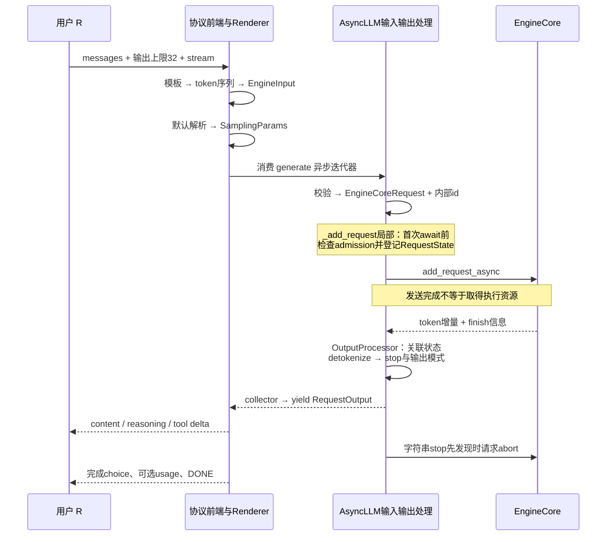
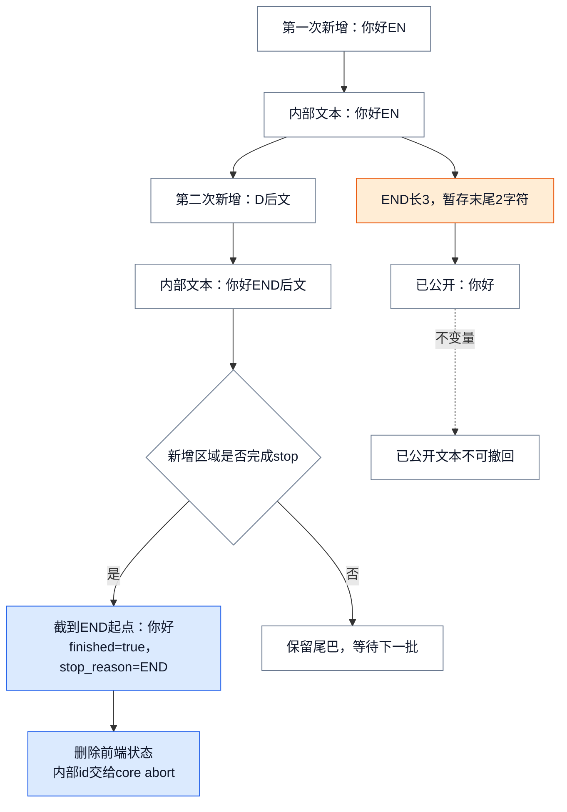
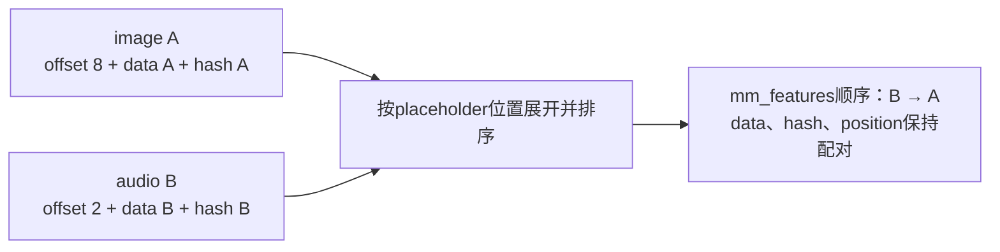
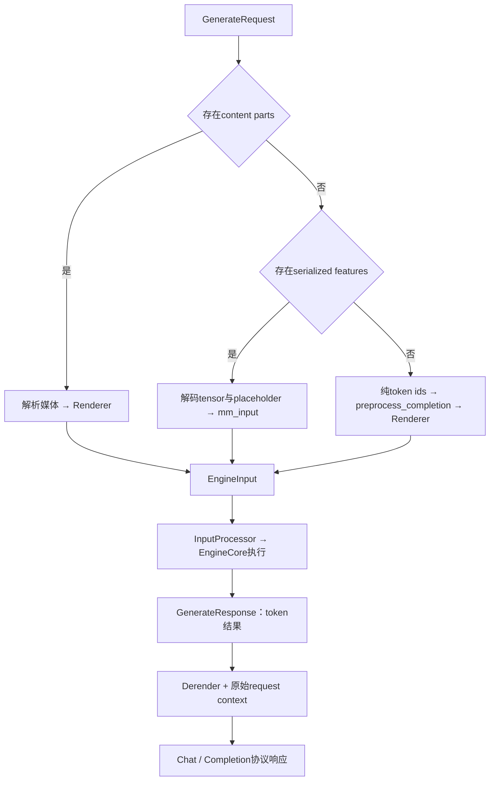

# vLLM 请求语义：消息怎样变成引擎请求，再恢复为用户输出

> **源码基线**：`vllm-project/vllm@199cb9b964822e59ab9b58d88e7be31eb419a2ae`（`main` 快照，2026-09-07 UTC）
> **主题**：跟随一次聊天请求理解模板、tokenization、执行参数和引擎请求的转换，再解释文本停止、流式返回与协议恢复。随后对照 pooling、Render/Derender、文件转录和实时音频的差异。
> **适用范围**：拥有接口与任务语义、输入输出表示及前端完成边界；采样算法归采样专题，媒体 encoder 执行归多模态专题，进程生命周期归 Serving 专题。
> **最近更新**：2026-09-08。补充可重建的请求往返与停止示例，并按新基线核验默认解析、能力和错误路径。

## 1. 一条聊天消息为什么不能直接交给模型？

用户发送 `messages=[{"role":"user","content":"只回答：你好"}]`，要求 `max_completion_tokens=32`、`stream=true`。模型并不直接理解 HTTP、`role` 或 SSE：它接收 token 与必要的模型输入。反过来，模型产生一个 token id，也还没有说明它应显示在正文、reasoning、工具参数还是结束事件里。

vLLM 因而把这次往返分成三件事：**Renderer 决定模型看见什么；InputProcessor 核验并构造执行请求；OutputProcessor 配合协议 builder 决定用户看见什么。** `EngineInput` 是 render 后的带类型输入，`EngineCoreRequest` 则额外带着已经处理的执行参数和请求标识。返回的 `EngineCoreOutput` 很窄，前端必须保留原请求、tokenizer 和输出状态，才能恢复用户语义。

把原始协议对象一直传到 EngineCore 看起来能省掉转换，但会让每种聊天模板、音频格式和响应字段都进入资源循环。当前代码把这些变动集中在前端，生成任务在 core 边界共享 `SamplingParams`，pooling 保留 `PoolingParams.task`。**这里的取舍理由是依据接口分支作出的分析推断**；源码可直接验证的是对象字段与调用顺序，并未给出两个方案的性能对比。

下面沿普通 HF 文本聊天路径讲清楚这个例子，再看媒体和其他任务。示例文本、token 数量与分段均为教学设定，不是指定模型的实测结果；token id 不在文中虚构。实际调用方法见 [[01_vllm_feature_optimizations_guide|使用指南]]。

## 2. 从消息到可以提交的请求

### 2.1 Render 先确定上下文，再完成 tokenization

Chat handler 先检查模型和前端排队限制，再调用 `OnlineRenderer.render_chat`。它把请求拆成两组输入：`ChatParams` 保存模板、工具、reasoning、媒体处理及 assistant mask 选项；`TokenizeParams` 保存上下文预算、输出预算、截断方向、special token 和 token offsets 选项。`max_completion_tokens` 有值时优先于兼容字段 `max_tokens`。

对普通 HF 聊天，`BaseRenderer.render_chat_async` 经 `HfRenderer.render_messages_async` 解析消息内容并应用模板，形成模型专用 prompt；随后 `tokenize_prompts_async` 把文本 prompt 变成 token 序列，已经是 token ids 的 prompt 走相应分支，最后 `process_for_engine_async` 生成带 `type` 和 `arrival_time` 的 `EngineInput`。`add_generation_prompt` 表示在模板允许时添加助手回答起点；`continue_final_message` 表达续写最后消息的意图。这些字段影响模型上下文，不能在模型已经生成以后补做。

以例子为准，转换前是一条带 `user` 角色的消息，转换后是**角色边界、内容和助手起点共同对应的 token 序列**，不是只对“只回答：你好”单独分词。模板可能直接返回 token ids：例如 Mistral 或启用 prompt embeds 的路径会要求模板阶段 tokenization；不能把上面的逻辑阶段理解为所有 renderer 都调用两遍编码。

HF renderer 的模板选择有明确顺序：

1. 显式给定的模板，包含模板名经 tokenizer 解析的情况。
2. 没有 tools 时尝试 AutoProcessor 模板；有 tools 跳过这一候选。
3. AutoTokenizer 模板。
4. 按 model type/tokenizer 匹配仓内预定义 fallback；仍无模板才抛 `ChatTemplateResolutionError`。

因此“模型没有 tokenizer.chat_template 就一定不能聊天”过于绝对；“所有模型都有默认模板”也不成立。请求自带模板还受 `trust_request_chat_template` 检查，这与上述模型模板 fallback 是两层规则。`safe_apply_chat_template` 还会为不支持 `developer` 角色的模板做 system 转换与合并，并处理 Transformers v4/v5 返回类型差异。vLLM 传给外部 tokenizer 的 conversation、模板和参数可在源码验证；本页没有读取第三方 tokenizer 的内部编码实现，也没有运行远程模型模板。

Renderer 并非只支持文本。Completion 可接受文本、token ids 或受支持的 prompt embeds；encoder-decoder 输入会分开构造 encoder/decoder 输入并按模型规则处理 decoder 起点；多模态要处理媒体与占位信息（§5）。Renderer registry 按模型/tokenizer 配置选择 HF、Mistral、Cohere 等实现。在线、离线和独立 Render 服务因此可以共用同一模型输入解释。

### 2.2 输出上限：先选择缺省值，再应用硬上限

Render 后才知道真正的 prompt 长度，Chat handler 据此调用 `get_max_tokens`。这里须区分“用户没写时采用什么”与“用户写再大也不能超过什么”：

| 来源 | 如何进入这次聊天请求 |
|---|---|
| 请求的 `max_completion_tokens`，否则 `max_tokens` | 有值时作为请求输出长度；替代模型作者的缺省长度 |
| `generation_config=auto` 读到的 `max_new_tokens` | 映射成默认 `max_tokens`，仅在请求没指定时兜底 |
| `override_generation_config.max_new_tokens`，或显式 generation-config 路径提供的上限 | 进入 `override_max_tokens`，作为服务端硬上限 |
| `max_model_len - input_length` | 剩余上下文容量；还要考虑已经配置的截断语义 |
| 平台返回的 output limit | 若平台给出限制，也参与取最小值 |

`generation_config=vllm` 让通用采样缺省从 vLLM 的中性值开始，之后仍应用显式 override。它不表示 EOS 等特殊 token 信息完全不再读取模型配置。

设例子的 render 后 prompt 长度为 20，上下文上限 128，模型默认输出长度 16，没有平台限制。请求显式要求 32，就得到 32，而不是被模型默认 16 截断；若服务显式设置硬上限 24，就得到 24；若请求省略输出长度，则默认 16 生效。这里 20、128 等只是演示值。Render/tokenization 自身也会校验长度，不能把 `get_max_tokens` 的取最小值误读为任意过长请求都会自动成功。

随后 `ChatCompletionRequest.to_sampling_params` 归一 temperature、top-p/top-k/min-p、penalties、seed、stop、logprobs、structured outputs 等字段。普通 chat 的 `stream=true` 对应 `DELTA`，非流式对应 `FINAL_ONLY`；服务默认 `stop_token_ids` 会与请求值合并。`InputProcessor` 再 clone 这份参数；若 `max_tokens` 仍为 `None`，补为剩余上下文，并补 EOS/stop 信息与 bad words 的 token 表示。**这一步不是再次用 generation config 覆盖所有显式采样值。** token 如何从 logits 中选出、grammar 如何约束候选，见 [[14_vllm_sampling_structured_output_analysis|采样与结构化输出]]。

### 2.3 InputProcessor 构造 EngineCoreRequest，但尚未取得计算资源

`InputProcessor.process_inputs` 先检查 generation/pooling capability、参数、LoRA、DP rank 和平台请求约束，然后检查 decoder/encoder 长度、token id 与多模态容量。空 decoder prompt 被拒绝；生成模型的 prompt 不能占满上下文而不给输出留一个位置；有 tokenizer 时，负 token id 以及超出 tokenizer/model 合并可用范围的 id 被拒绝。图像占位展开后的 token 也计入长度，不能只数原始消息文字。

通过后，生成请求写 `sampling_params`，pooling 请求写 `pooling_params`，另一个为空。`EngineCoreRequest` 还携带以下执行语义：

| 字段组 | 保存什么；什么已不再进入 core |
|---|---|
| `prompt_token_ids` / `prompt_embeds` / `prompt_is_token_ids` | token、预计算 embeddings，以及混合输入逐位置的 token/embedding 标记；不再保留 chat messages |
| `mm_features` | 媒体处理输入、modality、hash/identifier 与 prompt 位置；不是 HTTP 上传音频的原始协议对象 |
| `arrival_time`、LoRA、`cache_salt` | 请求到达与执行/缓存区分信息 |
| `priority`、`data_parallel_rank`、`trace_headers`、`session_id` | 调度提示、路由与追踪关联；具体执行策略仍由下游决定 |
| `request_id`、`external_req_id`、`client_index`、`current_wave` | 内部唯一标识、用户标识及输出路由/DP wave 关联 |
| `resumable`、reasoning 状态字段、`abort_immediately` | 流式输入续接、引擎所需 reasoning 状态，以及预入场 KV 拒绝清理的特殊标记 |

`AsyncLLM.add_request` 用 `assign_request_id` 保留用户 id，默认附加随机后缀作为内部 id，避免重复外部 id 混淆输出。`n > 1` 会建立 parent 和多个 child；多 prompt 协议也可能拆分请求。因而一个用户 response id 不能当作一个 core 请求的永久一对一键。

提交前，`AsyncLLM._add_request` 再做本地 admission 检查，并在**该方法的第一次 await 之前**把 `RequestState` 登记到 OutputProcessor，之后才 `await engine_core.add_request_async`。这保证并发提交能看见已占用的前端名额，也保证快速回来的输出有 collector 和 detokenizer 接收。完成发送只说明请求交给了 core client；何时进入 waiting/running、拿到 token/KV 预算并真正执行，见 [[07_vllm_scheduler_analysis|Scheduler]]，跨进程接缝见 [[06_vllm_engine_architecture_analysis|Engine 架构]]。

<!-- 图1 spec：四泳道依次为用户、协议前端与Renderer、AsyncLLM输入输出处理、EngineCore。前端将messages经模板和tokenization变成EngineInput并生成SamplingParams。AsyncLLM核验、分配内部id；_add_request局部在自己的首次await前检查admission并注册RequestState。Core发送与执行不混同；token回传经detokenize/stop、collector再到协议builder发SSE。字符串stop先出现时向Core abort。 -->

图中的 AsyncLLM 泳道归并了 InputProcessor、OutputProcessor 和后台 output handler，具体调用者见正文与源码路线。**首次 await 只指 `_add_request` 的局部顺序**；它的上层 `add_request` 此前可以已等待能力查询等操作。

## 3. 从 token 到文字：用户可见的完成发生在哪里？

### 3.1 前端保留状态，才能解释一小段输出

core 返回 `request_id`、`new_token_ids`、可选 logprobs/pooling tensor、finish/stop reason 及 transfer/统计元数据，并不返回原始 chat request。`RequestState` 保存 external id、prompt、token ids/embeds、output kind、detokenizer、logprobs processor、collector 和 parent/child 关系。生成请求创建解码器和 logprobs 状态；pooling 则不创建这两者。

后台 output handler 等待 core 输出，以有限 chunk 交给 `OutputProcessor.process_outputs`，避免一个大批次长时间占住事件循环。输出先匹配仍存活的 state，再更新 token/text 与停止判断，然后构造 `RequestOutput` 放入 collector；`generate` 从 collector 取出并 yield 给 handler。同步 `LLMEngine` 没有异步 collector 时，则直接取得返回列表。collector 可以合并消费前积累的增量，所以一次 SSE chunk 不保证恰好对应一次 core step。

| 输出模式 | 连续收到解码文本“你”“好”时的可见对象；假定无stop缓冲 |
|---|---|
| `DELTA` | 输出“你”、再“好”，由调用者拼接 |
| `CUMULATIVE` | 输出“你”、再“你好”，调用者应替换累计文本 |
| `FINAL_ONLY` | 完成前不产出普通结果，结束时输出“你好” |

`stream_interval` 还可合并发送，当前规则允许首 token、达到间隔或完成时输出。输出对象的 `finished` 是请求完成标记；一个 parent 要根据所有 child 的完成状态聚合，不能看到一个 choice 结束就关闭所有 choices。

### 3.2 stop string 为什么需要保留尚未显示的尾巴？

EOS/stop token id 可由 core 根据 token 判断，`stop="END"` 则必须在 detokenize 后匹配文字。字符串可能横跨两个 token 或两次 core 输出，如果已经把 `EN` 发给客户端，下一次收到 `D` 后就无法撤回。于是默认不包含 stop string 时，解码器最多保留“最长 stop 长度减一”的字符尾巴，等新文本足以排除跨界匹配再公开。

把同一聊天请求额外设为 `stop=["END"]`、`min_tokens=0`、`include_stop_str_in_output=false`。假设两次输出解码分别增加 `你好EN` 和 `D后文`：第一次内部文本是 `你好EN`，缓冲最后两个字符，只发“你好”；第二次内部出现 `你好END后文`，匹配后把文本截到 `END` 起点，最终仍为“你好”。已生成 token ids/logprobs 不因此全部倒退为“你好”的重新编码，不能用文本长度反推模型实际生成的 token 数。

<!-- 图2 spec：两次输入分别是解码新增“你好EN”和“D后文”。第一步累积“你好EN”，因stop END长度3缓冲2字符，公开“你好”；第二步累积匹配END后截断至“你好”，公开完成且stop_reason END，内部id进入abort列表。另一路标注无匹配继续等下一批；不变量是已公开文本不可撤回。 -->

实际 `check_stop_strings` 只搜索新增字符及必要的跨界部分，多个 stop 同时命中时选择**最早完成**的那个，同一结束位置按 stop 列表顺序打破平局。例如一次增量包含 `END后STOP`，即使 stop 列表写作 `["STOP","END"]`，也先在 `END` 完成；这使一次返回多个 token 时仍能选择先完成的停止点。`include_stop_str_in_output=true` 则保留匹配 stop，到它的末尾截断，也无需为了排除 stop 而缓冲尾巴。`min_tokens` 未越过时不会启用普通字符串停止检查。

解码器本身也有选择：符合 `tokenizers>=0.22.0` 且 tokenizer 是 `TokenizersBackend` 时用原生 `DecodeStream`，否则走 Python 增量解码；没有 tokenizer 则仅跟踪 token ids。两种文字解码路径共享上述 stop/可见性逻辑；第三方 DecodeStream 的内部算法未在本页验证。

如果 stop 是前端先发现的，OutputProcessor **先生成 finished 输出并清除本地 state，再把内部 id 放进 abort 列表**，后台循环请求 core 停止余下执行。core 迟到的输出找不到 state 就丢弃。用户结果因此可以已经结束，而 core 的清理消息仍在传递；完成不是同步回滚之前的模型计算。

### 3.3 最后一步恢复协议，而非只把 text 填进 JSON

普通 Chat builder 将最终/增量 `RequestOutput` 转成 message 或 SSE：parser 将文本与 token 信息解释为 reasoning、正文或 tool calls，choice 编号、角色、finish reason、usage 也在这里生成。`include_reasoning=false` 会抑制相关输出；reasoning token budget 等执行限制已在请求侧进入参数，二者不可混为一谈。工具调用输出是供调用方处理的结构；本页这条普通 Chat 路径没有因为解析出函数名就自动执行用户工具。

同样的模型生成结果在不同协议有不同外壳：

| 协议 | 输入侧保留什么 | 输出侧恢复什么 / 兼容边界 |
|---|---|---|
| OpenAI Chat | messages、模板、tools、reasoning；parser 可调整请求 | role、content/reasoning、tool calls、logprobs、usage；有工具调用时可能把协议 finish reason 设为 `tool_calls` |
| OpenAI Completion | 文本/token/embeds、多 prompt、echo | choice 编号、echo、prompt/output logprobs、usage；suffix 不支持，stream 与 beam search 组合被拒绝，embeds 与 echo/prompt logprobs 不兼容 |
| OpenAI Responses | 将其输入和工具语义适配到共享 renderer | 仍有 Responses 专属对象和事件；Chat/Responses parity test 比较 renderer 边界的消息与参数，不保证两个 API 所有行为相同 |
| Anthropic Messages | handler 继承 Chat serving，Render 路径也先转换为 Chat request | 在外层恢复 Anthropic 响应；不会另建一套 core generation task |
| Cohere Chat | 使用相应 renderer/adapter | Chat builder 的 message hook 可由 subclass 替换为 Cohere message |

对于 SSE，最终 choice、可选 usage chunk 与 `[DONE]` 是协议层收尾。**`[DONE]` 只说明流结束，不独自证明生成成功**：Chat stream generator 捕获异常后也可先发 error payload，再发 `[DONE]`。已经开始的流不能再把 HTTP 200 改写成失败状态，客户端应同时检查 error 与 finish reason。

## 4. 输入无效、排队拒绝、取消和异步错误怎样结束？

前端转换不是“成功就必然跑完”的保证。把失败发生的时刻分清楚，才能解释为什么用户有时看到 HTTP 错误、有时收到流内错误、有时只收到部分文本。

| 失败或限制 | 发生位置与外部可见性 |
|---|---|
| 工具解析器、请求模板权限、suffix/embeds 组合不满足 | OnlineRenderer/协议预处理返回错误，不提交普通执行请求；例如 named/required tool choice 缺 parser 会拒绝，HF auto tools 需满足对应配置 |
| capability、长度、token id、LoRA、DP rank 等无效 | InputProcessor 的校验失败；`SamplingParams` 要求模型至少有一个 generation task，pooling 还须匹配具体 task；core 对 pooling task 再校验 |
| `max_num_queued_reqs` 满 | 前端统计未完成请求，包含 waiting 和 running，`n` 占 `n` 个名额；超限抛 `QueueOverflowError`，映射为 503 |
| `max_num_queued_tokens` 达阈值 | 统计仍处于 prefill 的完整 prompt token 总量，达到阈值拒绝；不是逐次扣掉已完成 chunk/prefix hit 的剩余 token 数，也不是“当前加新请求必须小于阈值”的硬容量式校验 |
| 客户端断开、取消或生成器关闭 | `generate` 收到取消/GeneratorExit 后，以内部 id 调用 `abort`，先去掉前端映射并结算 collector，再通知 core；所有关联 child 都须覆盖 |
| 运行中发生 request error 或后台异常 | `finish_reason=error` 被协议 builder 转为 `GenerationError`；后台 output handler 的异常传播到 collector；未知 generate 异常在 collector 已取得时请求 abort，再包装为 `EngineGenerateError`，不能作为正常 stop 展示 |
| Engine 已死 | `EngineDeadError` 向上传播，不再把它当作普通可继续请求；服务存活与故障恢复机制见可靠性专题 |

Chat 的 `_preflight` 在创建流式响应前做早期 admission，因此此时的过载可以返回真正的 HTTP 503；实际提交还会重新检查，早期通过并不是保留名额的承诺。当前单请求的最终检查与本地注册之间没有 await，测试专门验证并发请求不能同时占同一个最后名额。它仍不等于 Scheduler 的 KV admission；后者处理真实执行资源。

取消只终止后续消费和执行，已经发送给用户的文本不可收回，已发生的计算也不会回滚。external id 的取消会扩展到相关 internal ids/children，迟到 core 输出被忽略。另一个特殊边界是跨实例 KV：如果远端 prefill 已经固定了资源、接收端却在正常 admission 前拒绝请求，`_with_kv_transfer_rejection_cleanup` 会通知 connector，使用 `abort_immediately` 的特殊请求触发标准清理 hook；这不是为失败的用户请求继续生成。其资源细节见 [[22_vllm_disaggregated_kv_serving_analysis|跨实例 KV 服务]]。

## 5. 换成媒体或别的任务，哪些语义必须保留？

任务名描述模型可以执行什么，API 名描述用户如何请求，两者不是一一对应。当前 `GenerationTask` 为 `generate`、`transcription`、`realtime`；pooling 有 `embed`、`classify`、`token_embed`、`token_classify`、`plugin`、`embed&token_classify` 六个 task；`render` 是独立 frontend task。router 依据 capability 注册入口，runner 分别探测文本生成、转录和 realtime；transcription-only 模型可以只报告 `transcription`，不能由“使用 SamplingParams”推断它支持普通 Chat。

### 5.1 聊天中的媒体：保留内容与位置的对应关系

若把例子换成“这张图里有什么”加 image content part，Renderer 要解析媒体、进行模型相关 processing 并在 prompt 中准备相应占位。`EngineInput` 的 `mm_kwargs`、`mm_hashes`、`mm_placeholders` 分别表达处理输入、内容身份与 prompt 位置；InputProcessor 按位置将各 modality 字典展开为 `MultiModalFeatureSpec` 列表，不能按字典插入顺序把媒体错配到 token 位置。

例如教学输入中 image A 的 offset 为 8、audio B 的 offset 为 2，flatten 后必须是 B、A，每个项目同时携带原来的 data/hash/position，不能只排序 hash。`mm_hashes` 的叶子不是字符串会显式报错；使用 tower/connector LoRA 时 identifier 会加入 LoRA 名，防止复用不同 LoRA 下的媒体表示。

<!-- 图3 spec：输入字典两项image A offset8与audio B offset2，箭头汇入按placeholder位置排序，输出B→A。每项data/hash/position整体同行，标明不能只排序hash；拓扑与排序示意，非二维张量布局。 -->

这里完成的是**模型输入与位置的归一**，不是媒体 encoder 已执行完成。encoder cache、特征张量与文本 embedding 怎样对齐由 [[15_vllm_multimodal_execution_analysis|多模态执行]] 接续；本页只保留接口需要的 processing 边界与字段，不把 CPU render、媒体 encoder 和 GPU token selection 写成一件事。

### 5.2 Pooling：同样提交引擎，输出不是文字

将“只回答：你好”改交 embedding endpoint，前端不需要助手续写，而是需要整段输入的向量。Pooling IOProcessor 可接受 completion-like 或 chat-like 输入，经 renderer 后调用 `engine_client.encode`；`to_pooling_params` 对 embedding 显式写 `task="embed"`，classification 写 `task="classify"`。OutputProcessor 收到 `pooling_output` 直接构造 `PoolingRequestOutput`，跳过 detokenize/stop strings。

batch 收集按输入索引填入结果槽，而不是按完成先后重排用户输入；任一结果缺失会报错。最外层 adapter 才解释 tensor：embedding 选择 float/base64/bytes/bytes_only、dtype 与 endianness，并生成 usage；classification 取概率最大项再通过 `id2label` 找标签；token-level 或 plugin task 保留自己的输出含义。因此“共享 encode 方法”并不意味着“所有 pooling tensor 都是一个句向量”。

具体 task 必须属于模型 pooler capability。`ModelConfig.get_pooling_task` 先尊重显式任务，识别 token-classification 架构，再按固定优先级选择；InputProcessor 对漏写的任务只有 token_embed/token_classify/plugin 的有限补全，不能假定任意 encode 调用都会自动选到 embed。对外 score/rerank API 仍存在，内部根据 bi-encoder、cross-encoder、late-interaction 路径使用 embed/classify/token_embed 等当前任务；旧 pooling task 名 `score` 和 `encode` 已移除，测试要求给出明确迁移错误。

### 5.3 Render / Derender：前端语义可以搬到无 GPU 的服务

独立 Render 服务复用 `OnlineRenderer`，返回可 JSON 序列化的 `GenerateRequest`：token ids、SamplingParams、可选 assistant mask、媒体 feature/hash/placeholder、cache salt、priority 和 token offsets。它拒绝 beam search、空 token ids 或非单 prompt chat。这个对象是**token-in 服务的公开传输协议**，不是 `EngineCoreRequest`；目标服务仍须构造 EngineInput 并执行 InputProcessor 校验。

<!-- 图4 spec：同一GenerateRequest进入token-in generate的互斥分支。content_parts优先：解析媒体后Renderer；否则有features：反序列化后mm_input；否则纯token：preprocess_completion/Renderer。三者到EngineInput汇合，经InputProcessor执行返回GenerateResponse；Derender加原始request context恢复协议，显示它不恢复引擎状态。 -->

三路是 `if/elif/else`，不是三个都要执行的阶段。当前 features 还允许在 EC transfer 配置下携带 metadata-only 项；纯 token 路径不会重新应用 chat template。token-in `/generate` 会识别客户端是否真的提供了 `max_tokens`，省略时用服务默认规则重新计算，避免 `SamplingParams` 自带的 16 被误当成用户明确要求。普通 Chat 的内部 decode-side token reuse 分支也可直接使用转发的 prompt ids、跳过 templating/tokenization，但仍继续 parser 的请求调整；这是特化复用分支，不改变§2的普通路径。

Derender 需要 `GenerateResponse` 加原始 request context 才能恢复 reasoning、tools、usage；没有 chat context 可以退化为普通 detokenization。它先限制 response/choice/token/logprob 数量再 decode/parse，防止远端 payload 放大 CPU/内存消耗。流式 Derender 还携带客户端维护的 `DerenderStreamState`，当前明确未补齐 reasoning/tool parser 功能，不能把普通 Chat streaming 的能力照搬过去。`PlaceholderRangeInfo` 仍有稀疏 placeholder mask 的 TODO，offset+length 并不足以表达所有模型的稀疏位置；Render 的 assistant mask 长度修正也带有可能位置错齐的 warning。

从代码边界推断，这种拆分让 GPU-less frontend 集中模板和协议工作，代价是序列化媒体/状态、跨服务一致性和额外 CPU 处理；源码没有在本页所读路径给出完整端到端收益测量。

### 5.4 文件转录：先把音频变成模型 prompt，再合并回文件级结果

Transcription 的公开输入是音频 bytes、语言和响应格式。其 capability 名为 `transcription`，STT serving 内部 operation 名则是 `transcribe`，后者用于 prompt 与响应类型选择，不是第二种 core task。前端 decode/重采样/切块，可在模型支持时探测语言，然后对每个 chunk 调用模型类 `get_generation_prompt`，经 renderer 得到 encoder-decoder 或 multimodal `EngineInput`。

每个 chunk 的普通生成路径仍调用 `engine_client.generate`，响应侧按 chunk 索引与时间偏移合并文本/segment，调用模型 post-process，并恢复 text、JSON、verbose 或 diarized 输出。音频前处理使用独立线程池；源码注释记录曾经复用 Renderer executor 吞吐较低，这是已记录的局部依据，不等于本机实测结论。

`verbose_json` 要求 segment timestamp capability，`diarized_json` 要求 diarization capability，二者都拒绝 streaming。Whisper 等模型的生成长度不能机械套“音频输入 token 越多，输出余额必然越少”：当前 STT 长度计算专门处理 decoder prompt，源码注明音频映射为固定 log-mel 表示的差异。transcription usage 可按音频时长向上取整为秒，不能和普通 Chat token usage 等同。取消与失败还要结束关联 chunk 生成，不能只丢掉文件级响应句柄。

### 5.5 Realtime：输出流之外，还有一条持续增长的输入流

普通 Chat 的 `stream=true` 是输入已固定、输出逐步到达；Realtime 则是音频 chunk 继续到达、已生成 token 又成为后续上下文。WebSocket 必须先用 `session.update` 验证模型，随后 commit 才能启动处理；未验证模型就 commit 会返回 protocol error。

`transcribe_realtime` 将模型 `buffer_realtime_audio` 给出的 prompt 逐个 render，包装成 `StreamingInput`。AsyncLLM 给这条输入流分配一个内部 id，各 chunk 构造 `resumable=True` 的 EngineCoreRequest；前端 `RequestState` 排队应用 streaming update、累积上下文。某个 chunk 生成结束时，对外请求仍可保持 `finished=false`；输入流关闭后发送 final request 作为完成信号，不能把其 dummy token 当成新的用户上下文。

返回的 DELTA text 变成 `transcription.delta`，token ids 同时回灌 input queue，最终发 `transcription.done` 与 usage。相比每个音频块建立互不相干的新请求，这保留同一 session 的上下文和输出连续性；此理由是从状态流重建的推断。WebSocket session/服务进程的生命周期细节见 [[13_vllm_serving_control_plane_analysis|Serving 控制面]]。

当前 streaming input 拒绝 pooling、`n > 1`、`FINAL_ONLY`、stop strings 和 prompt embeds，也不接受该接口上的 reasoning 状态参数组合。输入生成器异常先包成 `InputStreamError` 放进 collector，`generate` 取消会话后把原始 cause 交还调用者；端到端测试检查原始异常与无未完成请求。关闭、取消和输入出错不是同一种信号，不能都发成正常 `transcription.done`。

## 6. 成本、兼容入口与源码阅读路线

前端隔离协议的收益，是 core 无需直接认识所有 message、文件和 JSON 格式；实际成本是每请求 prompt/解码/collector/parser 状态、tokenization 与 detokenization CPU、字符串停止缓冲带来的可见延迟，以及 Render/Derender 的序列化。媒体 hash/position 与 parent/child 标识必须持续对应，协议 builder 必须保有足够的原请求上下文。GPU 高吞吐不会自动消除这些前端成本。

当前推荐输入路径是 Renderer → EngineInput → InputProcessor。直接向 InputProcessor 传 raw prompt 仍兼容但会告警；AsyncLLM raw 路径会异步处理，避免阻塞事件循环，直接传 `EngineCoreRequest` 也已 deprecated。这些源码中的迁移信号说明输入边界正在收敛，不能据此承诺下一版本何时删除兼容入口。streaming input 的限制、多 prompt TODO、稀疏媒体 mask 与 streaming Derender TODO 都是有锚点的覆盖缺口，不能写成已支持功能。

以下每组把前文的一个问题接回实际打开的源码；路径均相对页头仓库。测试仅静态阅读，未运行 GPU、模型下载、HTTP/WebSocket 服务或外部 tokenizer/音频依赖，故不宣称运行时验证通过。

| 要继续核对的问题 | 紧凑源码路线 |
|---|---|
| 能力名与router如何选择 | `vllm/tasks.py::GenerationTask/PoolingTask/check_removed_pooling_task`；`vllm/entrypoints/launchers/api_server/routers.py::register_api_routers`；`vllm/v1/worker/gpu_model_runner.py::GPUModelRunner.get_supported_generation_tasks` |
| 一条Chat怎样拆参数并发起生成 | `vllm/entrypoints/openai/chat_completion/serving.py::OpenAIServingChat._create_chat_completion`；`vllm/entrypoints/openai/chat_completion/protocol.py::ChatCompletionRequest.build_chat_params/build_tok_params/to_sampling_params`；`vllm/renderers/online_renderer.py::OnlineRenderer.render_chat/preprocess_chat` |
| 模板、编码与模型输入怎样分层 | `vllm/renderers/registry.py::renderer_from_config`；`vllm/renderers/hf.py::resolve_chat_template/safe_apply_chat_template/HfRenderer.render_messages_async`；`vllm/renderers/base.py::BaseRenderer.render_chat_async/render_cmpl_async/process_for_engine_async`；`tests/entrypoints/openai/test_render_parity.py::_assert_parity` |
| 默认与硬上限区别 | `vllm/config/model.py::ModelConfig.get_diff_sampling_param/try_get_generation_config`；`vllm/entrypoints/serve/utils/api_utils.py::get_max_tokens`；`vllm/sampling_params.py::SamplingParams.update_from_generation_config/update_from_tokenizer`；`tests/entrypoints/serve/utils/test_api_utils.py::TestGetMaxTokens` |
| 核验、媒体展开与请求字段 | `vllm/v1/engine/input_processor.py::InputProcessor.process_inputs/_validate_params/_validate_model_input/assign_request_id`；`vllm/multimodal/utils.py::argsort_mm_positions`；`vllm/v1/engine/__init__.py::EngineCoreRequest/EngineCoreOutput`；`vllm/v1/engine/core.py::EngineCore.add_request` |
| 提交、admission、取消与异常 | `vllm/v1/engine/async_llm.py::AsyncLLM._add_request/check_admission/generate/_run_output_handler/abort`；`vllm/entrypoints/generate/base/serving.py::GenerateBaseServing._preflight/_raise_if_error/_with_kv_transfer_rejection_cleanup`；`tests/v1/engine/test_admission_control.py::test_concurrent_single_request_admission_respects_limit`；`tests/entrypoints/openai/chat_completion/test_serving_chat.py::test_admission_rejection_escapes_before_response_starts` |
| text、stop和完成怎样恢复 | `vllm/v1/engine/output_processor.py::RequestState.make_request_output/OutputProcessor.process_outputs/abort_requests`；`vllm/v1/engine/detokenizer.py::BaseIncrementalDetokenizer.update/get_next_output_text/check_stop_strings`；`tests/v1/engine/test_output_processor.py::test_stop_string/test_request_output_collector` |
| 各文本协议如何复用与恢复 | `vllm/entrypoints/openai/chat_completion/serving.py::OpenAIServingChat.chat_completion_full_generator/chat_completion_stream_generator`；`vllm/entrypoints/openai/completion/serving.py::OpenAIServingCompletion._create_completion`；`vllm/entrypoints/anthropic/serving.py::AnthropicServingMessages` |
| pooling输入、batch结果与编码 | `vllm/entrypoints/pooling/base/io_processor.py::PoolingIOProcessor.get_request_factory_online`；`vllm/entrypoints/pooling/base/serving.py::PoolingBaseServing._prepare_generators/_collect_batch`；`vllm/entrypoints/pooling/embed/serving.py::ServingEmbedding._build_openai_response`；`vllm/entrypoints/pooling/classify/serving.py::ServingClassification._build_response`；`vllm/entrypoints/pooling/scoring/serving.py::ServingScores._build_response`；`tests/test_pooling_params.py::test_removed_pooling_parameters` |
| Render与Derender的可搬运边界 | `vllm/entrypoints/scale_out/render/serving.py::ServingRender.render_chat_request/render_messages_request`；`vllm/entrypoints/scale_out/token_in_token_out/serving.py::ServingTokens.serve_tokens`；`vllm/entrypoints/scale_out/token_in_token_out/protocol.py::PlaceholderRangeInfo`；`vllm/entrypoints/scale_out/derender/serving.py::ServingDerender._validate_derender_bounds/derender_chat_response/derender_chat_stream_response` |
| 文件音频如何进出generation | `vllm/entrypoints/speech_to_text/base/serving.py::SpeechToTextBaseServing._decode_and_chunk_speech/_preprocess_speech_to_text/_create_speech_to_text`；`vllm/entrypoints/speech_to_text/realtime/serving.py::OpenAIServingRealtime.transcribe_realtime`；`vllm/entrypoints/speech_to_text/realtime/connection.py::RealtimeConnection._run_generation` |
| 增长的输入与最终完成 | `vllm/v1/engine/async_llm.py::AsyncLLM._add_streaming_input_request/_validate_streaming_input_sampling_params`；`vllm/v1/engine/output_processor.py::OutputProcessor._update_streaming_request_state`；`tests/v1/e2e/general/test_streaming_input.py::test_streaming_input_error_propagation/test_streaming_input_validation_errors`；`tests/entrypoints/speech_to_text/realtime/test_realtime_validation.py::test_commit_without_session_update_returns_error` |

## Related Pages

- [[02_vllm_architecture_overview_analysis|vLLM 架构概览]]：把输入输出转换放回完整服务的模块协作中。
- [[06_vllm_engine_architecture_analysis|Engine 架构]]：从 EngineCoreRequest 继续追踪 client、core 与 executor 的实际接缝。
- [[07_vllm_scheduler_analysis|Scheduler]]：解释提交后怎样取得 token/KV 资源，以及 waiting/running 和抢占的状态变化。
- [[12_vllm_model_runner_v2_analysis|Model Runner V2]]：解释请求如何进一步映射到设备上的持久 row 与 buffer。
- [[14_vllm_sampling_structured_output_analysis|采样与结构化输出]]：接续 SamplingParams 后的 logits 变换、grammar 与 token selection。
- [[15_vllm_multimodal_execution_analysis|多模态执行]]：接续媒体输入归一后的 encoder、缓存和位置对齐。
- [[22_vllm_disaggregated_kv_serving_analysis|跨实例 KV 服务]]：解释跨服务请求携带的 transfer metadata 及拒绝后的资源清理。
