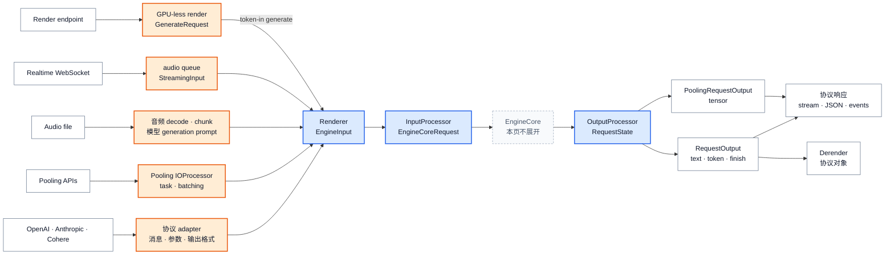

# vLLM 请求语义：从协议与任务到 Engine 合同与用户输出

> **读者问题**：Generate、Pooling、Render、Transcription、Realtime 以及 OpenAI、Anthropic、Cohere 等协议为何没有各带一套 Engine，它们在哪里合流、又在哪里恢复成不同的用户输出？
> **源码基线**：`vllm-project/vllm@6b110badbb22d3f66c7218b71138f13b7a6b3419`（`main`，提交时间 2026-08-29T02:40:53Z）
> **中心命题**：vLLM 用一对窄合同隔离“用户在请求什么”和“Engine 怎样执行”：Renderer 与协议 adapter 把文本、消息、媒体和协议参数压成 `EngineInput + SamplingParams | PoolingParams`，`InputProcessor` 再固化为 `EngineCoreRequest`；返回侧用前端 `RequestState` 把 `EngineCoreOutput` 还原为文本、tensor、流事件和协议对象。合流不是抹平语义——生成类任务共用 sampling 合同，pooling 保留具体 task，Render 不进入 Engine，Transcription 与 Realtime 则在 Engine 两侧保留音频生命周期。
> **所有权边界**：本页拥有任务与能力命名、协议转换、render/tokenize、`EngineInput`、`EngineCoreRequest` 的语义字段、前端输出状态、detokenize/stop、pooling tensor 与各协议响应重建。
> **明确排除**：waiting/running、token/KV admission、优先级策略与抢占属于 [[02_engineering/03_infer_frameworks/vllm/11_vllm_scheduler_analysis|Scheduler]]；logits processor、grammar mask、top-k/top-p 与 GPU token selection 属于规划中的 `17_vllm_sampling_structured_output_analysis.md`。本页只解释 sampling 参数怎样跨边界，不解释 token 怎样被选中。

## 1. 背景：公开语义比 Engine 合同更宽

同一个服务进程可能面对 chat message、completion prompt、embedding 输入、整段音频和 WebSocket 音频块。它还要返回 OpenAI chat/completion、Anthropic、Cohere、embedding/classification、转录 JSON 或 realtime event。若让 EngineCore 直接认识这些对象，每增加一个协议字段、chat template 或输出格式，就要修改资源循环和设备路径。

源码选择的是两阶段收敛。任务表先把能力分成三类：generation 类是 `generate`、`transcription`、`realtime`，pooling 类保留六个具体 task，frontend 类只有 `render`（`vllm/tasks.py:7-44`）。API server 也先按模型报告的 capability 决定是否注册 generate、speech-to-text 或 pooling router，而不是等请求进 core 后再碰运气（`vllm/entrypoints/launchers/api_server/routers.py:39-67`）。

**为什么这样设计（分析推断）。** 源码没有一段注释直接比较“协议对象贯穿 Engine”的替代方案；但 renderer 统一生产 `EngineInput`、core request 只保留 sampling/pooling 二选一、输出处理器只返回 `RequestOutput` 或 `PoolingRequestOutput`，共同表明协议变化被刻意留在前端（`vllm/renderers/base.py:940-977`；`vllm/v1/engine/__init__.py:107-166`；`vllm/v1/engine/output_processor.py:349-393`）。这样做的收益是 EngineCore 只处理稳定的 token、feature 与执行参数合同；代价是前端必须保存足够的 per-request state，才能在返回时重建协议语义。

## 2. 静态合同：共享骨架与任务特化

| 层 / 状态所有者 | 共享合同 | 任务特化 | 不变量与边界 | 证据 |
|---|---|---|---|---|
| 协议 adapter | 解析、验证用户对象，构造 render 与执行参数 | Chat template/tool、pooling IO、音频切块、WebSocket event 各自留在入口层 | 不把 Pydantic/HTTP/WebSocket 对象传入 core | `vllm/entrypoints/openai/chat_completion/protocol.py:570-625`；`vllm/entrypoints/pooling/base/io_processor.py:77-172`；`vllm/entrypoints/speech_to_text/realtime/connection.py:96-161` |
| Renderer | `DictPrompt → TokPrompt → EngineInput`，统一记录 arrival time | completion、chat、encoder-decoder、多模态走不同 render/process 分支 | 输出必须是带 `type` 的 `EngineInput`；raw prompt 兼容路径已 deprecated | `vllm/renderers/base.py:940-1001`；`vllm/renderers/base.py:1030-1064`；`vllm/v1/engine/input_processor.py:309-335` |
| InputProcessor | capability/长度/token id 校验，构造 `EngineCoreRequest` | generation 写 `sampling_params`；pooling 写 `pooling_params` | 两类参数必有且仅有一类；prompt token/embeds 与 MM feature 进入稳定字段 | `vllm/v1/engine/input_processor.py:84-158`；`vllm/v1/engine/input_processor.py:339-425`；`vllm/v1/engine/__init__.py:107-166` |
| OutputProcessor | `request_id → RequestState`，把 core 增量送进同步返回或异步 collector | generation 有 detokenizer/logprobs；pooling 直接包 tensor | core 输出必须命中仍存活的前端 state；abort 后的迟到输出被忽略 | `vllm/v1/engine/output_processor.py:218-281`；`vllm/v1/engine/output_processor.py:607-724` |
| 最外层响应 builder | 把稳定 `RequestOutput` 家族恢复为用户协议 | tool/reasoning、echo、usage、encoding、label、segment、event | Engine 完成不等于协议对象完成；最后一次解析与聚合仍在前端 | `vllm/entrypoints/openai/chat_completion/serving.py:914-1006`；`vllm/entrypoints/pooling/embed/serving.py:103-163`；`vllm/entrypoints/speech_to_text/base/serving.py:600-691` |

### 2.1 请求语义转换图

图中蓝色是所有 Engine 请求共享的窄腰；橙色是必须保留在前端的任务语义。灰色 EngineCore 是本页边界，内部 admission 与 GPU sampling 不展开。

## 3. 共享窄腰怎样建立

### 3.1 Renderer 先消化表达差异

**背景。** 文本、token ids、prompt embeds、chat messages、encoder-decoder 输入与多模态内容不能由一次简单 `tokenizer.encode` 覆盖。`BaseRenderer.render_cmpl` 的真实顺序是 render prompt、tokenize、附加 extras、再 process 成 EngineInput；chat 路径还先把 messages 与 template 参数变成 conversation 与 prompt（`vllm/renderers/base.py:980-1001`；`vllm/renderers/base.py:1030-1064`）。

**为什么这样设计（分析推断）。** 直观替代是每个 HTTP handler 自己拼 prompt 和 token。当前实现把 renderer mode 放进 registry，由模型/tokenizer 配置选择 HF、Mistral、Cohere 等实现；协议 handler 只提供 `ChatParams` 与 `TokenizeParams`（`vllm/renderers/registry.py:35-88`）。源码未自陈该取舍，本页推断：把模型可见的 prompt 语义集中在 renderer，能让离线、在线和独立 Render endpoint 复用同一结果，避免模板规则随协议 handler 漂移。

**机制。** OpenAI chat request 分别生成模板参数和 tokenization budget，其中 reasoning、tools、media、是否返回 assistant mask 等仍是渲染语义（`vllm/entrypoints/openai/chat_completion/protocol.py:570-625`）。`OnlineRenderer` 先拒绝无 parser 支撑的 tool choice 与不受信任的 request template，再调用底层 renderer（`vllm/renderers/online_renderer.py:145-201`；`vllm/renderers/online_renderer.py:310-329`）。Chat 与 Responses 的 parity test 会直接截获两条 API 在 `render_chat_async` 边界上的 messages 和 `ChatParams` 并逐项比较，说明共享 renderer 是可测试合同，不只是代码复用（`tests/entrypoints/openai/test_render_parity.py:140-184`）。

**约束。** completion 当前拒绝 suffix、prompt embeds 与 echo 的组合、prompt embeds 与 prompt logprobs 的组合；这些不兼容在渲染前返回协议错误，而不是送入 Engine（`vllm/renderers/online_renderer.py:269-299`）。Renderer 输出也不是无条件有效：InputProcessor 继续检查空 decoder prompt、长度、encoder cache 和 token id 范围（`vllm/v1/engine/input_processor.py:439-545`）。

### 3.2 InputProcessor 把“想做什么”压成两种 core 参数

**背景。** 入口层知道 `generate`、`transcription`、`realtime`、六种 pooling task 和 `render`，但 EngineCore 不需要把这些名字全部带进热路径。它需要的是输入 token/embeds/MM feature，以及“产生 token”或“产生 pooling tensor”的执行合同。

**为什么这样设计（分析推断）。** `InputProcessor._validate_params` 对任何 `SamplingParams` 只要求模型至少支持一个 generation task；对 `PoolingParams` 则必须解析并核验具体 `task`（`vllm/v1/engine/input_processor.py:84-154`）。这意味着 generate/transcription/realtime 的差异由入口输入构造与输出协议承担，而 pooling task 因 tensor 形状/语义不同必须继续跨过 core 边界。这个理由是从分支与字段重建的推断，不是源码注释的原话。

**机制。** 对 generation，InputProcessor clone 参数、补齐 `max_tokens`、合并 generation config 与 tokenizer stop 信息；对 pooling 则 clone `PoolingParams`。随后二者都落入同一个 `EngineCoreRequest`，分别占用 `sampling_params` 或 `pooling_params` 字段（`vllm/v1/engine/input_processor.py:352-378`；`vllm/v1/engine/input_processor.py:418-431`）。该 struct 同时携带 prompt ids/embeds、MM features、arrival、LoRA、cache salt 与 routing metadata，但没有 HTTP response type、chat messages 或音频 bytes（`vllm/v1/engine/__init__.py:107-158`）。

**不变量与失败。** generation 模型收到 PoolingParams、pooling 模型收到 SamplingParams、或 pooling 的具体 task 不在 capability 中都会在进入执行前失败（`vllm/v1/engine/input_processor.py:90-154`）。core 侧还会再次核验 pooling task，防止绕过 frontend 校验的请求污染权威状态（`vllm/v1/engine/core.py:452-473`）。这一层只验证可执行语义，不决定请求何时获得 token 或 KV；后者是 Scheduler owner 的 admission 事务。

### 3.3 OutputProcessor 用前端状态恢复被压掉的语义

**背景。** `EngineCoreOutput` 只返回 request id、new token ids、可选 pooling tensor、finish/stop reason 与少量 metadata（`vllm/v1/engine/__init__.py:196-218`）。它既没有原始 chat request，也没有 embedding encoding format 或音频 response format。因此输出不是无状态的反序列化。

**为什么这样设计（分析推断）。** 直观替代是让 core 返回完整文本/JSON。当前代码反而在请求提交前创建 frontend `RequestState`，其中保存 external id、prompt、token ids/embeds、output kind、detokenizer、logprobs processor 与 collector（`vllm/v1/engine/output_processor.py:132-197`；`vllm/v1/engine/async_llm.py:425-437`）。本页推断：这用前端内存换取 core 合同稳定，并让 tokenizer、stop string 和协议对象不进入资源循环。

**机制。** generation state 创建 detokenizer/logprobs processor；pooling state 明确把二者置空，只记录 pooling output kind（`vllm/v1/engine/output_processor.py:218-281`）。返回时，generation 分支增量 detokenize 并做 stop-string check，pooling 分支跳过这一步；二者再分别构造成 `RequestOutput` 或 `PoolingRequestOutput`，送进 async collector 或同步返回列表（`vllm/v1/engine/output_processor.py:607-709`）。DELTA 模式只发新增 token/text，FINAL_ONLY 在结束前不产出对象（`vllm/v1/engine/output_processor.py:283-347`）。

**不变量与失败。** 已 abort 的 request state 被删除，迟到的 core output 会直接忽略；若 stop string 是前端 detokenizer 才发现的，OutputProcessor 先产出 finished output，再要求 core abort 未结束的内部请求（`vllm/v1/engine/output_processor.py:637-642`；`vllm/v1/engine/output_processor.py:680-724`）。对应测试确认 stop string 会给用户 external id 的 finished output，同时把 internal id 放入 abort 列表（`tests/v1/engine/test_output_processor.py:930-976`）。因此“core 发出 token”不等于“该 token 已对用户可见”。

## 4. 任务特化：哪些语义共享，哪些必须保留

### 4.1 Generate 与协议变体：同一 token 合同，不同外壳

**背景与设计选择。** OpenAI Chat、Completion、Responses、Anthropic Messages 与 Cohere Chat 都可能驱动文本生成，但 messages/template/tool/reasoning/echo/usage 的语义不同。vLLM 不为每个协议建一套 core：OpenAI chat/completion 先通过 `OnlineRenderer` 得到 EngineInput，再各自把请求字段归一成 `SamplingParams`（`vllm/entrypoints/openai/chat_completion/serving.py:277-332`；`vllm/entrypoints/openai/completion/serving.py:140-180`）。Anthropic handler 继承 OpenAI chat serving；独立 Render path也先把 Anthropic request 转成 OpenAI chat request，再进入同一个 render 函数（`vllm/entrypoints/anthropic/serving.py:99-124`；`vllm/entrypoints/scale_out/render/serving.py:160-173`）。

**机制。** Chat protocol 把 temperature、top-p、stop、logprobs、structured output、stream kind 等归入 SamplingParams（`vllm/entrypoints/openai/chat_completion/protocol.py:661-748`）；handler 把 EngineInput 与该参数交给 `engine_client.generate`（`vllm/entrypoints/openai/chat_completion/serving.py:348-387`）。输出回到前端后，OutputProcessor 先生成稳定 `RequestOutput`，chat response builder 再解析 reasoning/tool calls 并构造 message；Cohere 可以通过 subclass hook 换用专用 message，而不改 Engine 输出（`vllm/entrypoints/openai/chat_completion/serving.py:949-1006`）。Completion builder 则负责 echo、prompt/output logprobs、usage 与 choice 编号（`vllm/entrypoints/openai/completion/serving.py:506-607`）。

**约束。** 协议兼容不是字段全支持：completion 的 streaming 与 beam search 组合被拒绝，suffix 也明确不支持（`vllm/entrypoints/openai/completion/serving.py:112-138`）。这些是 protocol/task failure，不是 GPU sampling failure；本页到 `SamplingParams` 为止，token selection 由 `17` owner 解释。

### 4.2 Pooling：共享 Engine request，保留 tensor 语义

**背景与设计选择。** embedding、classification、token embedding、token classification 与 plugin 的输入都可经过 renderer，但输出 tensor 的含义和协议编码不同。pooling 因此共享 `EngineCoreRequest` 外壳，却不把 task 压成一个无类型的“encode”。当前 task 表已移除 `score` 与 `encode` 旧 task 名，分别要求 `classify`、`token_embed` 或 `token_classify`（`vllm/tasks.py:10-31`）；测试也要求这些旧值在协议解析期抛出明确错误（`tests/test_pooling_params.py:35-67`）。

**机制。** pooling protocol request 的 `to_pooling_params` 显式写入 task，例如 embedding 写 `embed`、classification 写 `classify`（`vllm/entrypoints/pooling/embed/protocol.py:35-46`；`vllm/entrypoints/pooling/classify/protocol.py:26-49`）。通用 serving pipeline 由 IOProcessor 把 completion-like/chat-like 输入变成 render request，调用 renderer 后交给 `engine_client.encode`，再批量收集 `PoolingRequestOutput`（`vllm/entrypoints/pooling/base/io_processor.py:80-172`；`vllm/entrypoints/pooling/base/serving.py:138-204`）。OutputProcessor 只把 core tensor 包成 `PoolingOutput`，不 detokenize（`vllm/v1/engine/output_processor.py:324-329`；`vllm/v1/engine/output_processor.py:363-372`）。

**输出与约束。** 最外层 adapter 才把 tensor 解释为 embedding、label/probability、score 或 generic data。Embedding builder选择 float/base64/bytes 编码并计算 usage，classification builder 才做 argmax 与 label lookup（`vllm/entrypoints/pooling/embed/serving.py:63-101`；`vllm/entrypoints/pooling/classify/serving.py:34-70`）。具体 task 必须属于模型 pooler capability；未指定时按模型与固定优先序解析，无法匹配则不产生 task（`vllm/config/model.py:1770-1803`）。

### 4.3 Render 与 Derender：把语义边界拆成可搬运的两半

**背景。** disaggregated serving 需要在无 GPU 的进程里完成 chat template、tokenization 与协议输出，而 GPU 服务只消费/产生 token。`render` 因而被定义为 frontend task，而不是 generation/pooling task（`vllm/tasks.py:40-44`）。

**为什么这样设计（分析推断）。** 直观替代是让远端 GPU 服务重新 render 原始协议对象，这会复制 tokenizer/template/tool validation，并使两端可能生成不同 token。当前 `ServingRender` 被注释为 GPU-less render server 的 authoritative implementation，直接复用 `OnlineRenderer`，然后返回 JSON 可序列化的 `GenerateRequest`（`vllm/entrypoints/scale_out/render/serving.py:72-95`；`vllm/entrypoints/scale_out/render/serving.py:144-158`）。本页据此推断，token 边界是为了让远端执行与协议语义解耦，同时保持 render 单一权威。

**机制。** chat/completion render 输出 token ids、SamplingParams、可选 assistant mask、MM feature/hash/placeholder、cache salt 与 token offsets；它还拒绝 beam search、空 token ids 和非单 prompt chat（`vllm/entrypoints/scale_out/render/serving.py:86-158`）。下游 token-in `/generate` 再把纯 token、原始 content parts 或已序列化 MM features 复原成 EngineInput，随后调用同一个 `engine_client.generate`（`vllm/entrypoints/scale_out/token_in_token_out/serving.py:144-201`；`vllm/entrypoints/scale_out/token_in_token_out/serving.py:229-261`）。返回侧 Derender 用 `GenerateResponse` 加原始 request context 恢复 reasoning、tool calls、usage 与协议对象（`vllm/entrypoints/scale_out/token_in_token_out/protocol.py:272-335`；`vllm/entrypoints/scale_out/derender/serving.py:130-185`）。

**约束。** Render 输出不是 `EngineCoreRequest`，不能跳过目标服务的 InputProcessor 校验。Derender 也不信任远端 payload：在 decode/parser 前限制 response/choice/token/logprob 数量，避免 CPU/内存放大（`vllm/entrypoints/scale_out/derender/serving.py:65-128`）。

### 4.4 Transcription：音频生命周期包住 generation 窄腰

**背景。** 文件转录的公开输入是压缩音频和语言/格式选项，Engine 需要的却是模型特定的 encoder-decoder 或 multimodal prompt。入口 capability 名称是 `transcription`，而 STT serving 内部的 operation 字符串是 `transcribe`；前者用于 model/router capability，后者用于构造 prompt 与选择响应类型（`vllm/tasks.py:7-8`；`vllm/entrypoints/speech_to_text/transcription/serving.py:42-80`）。二者不是两个任务实现。

**为什么这样设计（分析推断）。** 音频 decode/chunk、采样率、语言检测与 segment timestamp 都是 CPU/协议语义，不应要求 EngineCore 理解文件容器。源码甚至为音频 preprocessing 保留独立线程池，因为复用 Renderer executor 曾显示更低吞吐（`vllm/entrypoints/speech_to_text/base/serving.py:144-155`）。因此这里的分离既是语义隔离，也有已记录的吞吐依据。

**机制。** frontend 解码/切块音频，逐 chunk 调用模型类的 `get_generation_prompt`，再经相同 renderer 得到 EngineInput（`vllm/entrypoints/speech_to_text/base/serving.py:286-315`）。协议参数转成普通 SamplingParams；每个 chunk 都走 `engine_client.generate`（`vllm/entrypoints/speech_to_text/transcription/protocol.py:236-283`；`vllm/entrypoints/speech_to_text/base/serving.py:516-573`）。返回后 frontend 合并 chunk 文本、应用模型 post-process，并按 plain、verbose 或 diarized format 生成 segment 与 usage（`vllm/entrypoints/speech_to_text/base/serving.py:600-691`）。

**约束。** verbose JSON 依赖 model segment timestamp capability，diarized JSON 依赖 diarization capability，二者都不支持 streaming；不兼容组合在提交 Engine 前返回错误（`vllm/entrypoints/speech_to_text/base/serving.py:460-483`）。

### 4.5 Realtime：同一 request id 上追加 EngineInput

**背景。** Realtime 不是“把一个长音频文件切小”那么简单：WebSocket session 必须先选定有效模型，音频 chunk 持续到达，已生成 token 又成为下一轮上下文。普通单次 EngineInput 无法表达输入仍会增长。

**设计选择与机制。** Realtime frontend 把模型的音频 buffer generator 产出的 prompt 逐个 render，包装为 `StreamingInput`（`vllm/entrypoints/speech_to_text/realtime/serving.py:55-88`）。`AsyncLLM` 为输入流分配一个 internal request id，每个 chunk 构造 `resumable=True` 的 `EngineCoreRequest`；流关闭时发送 final request 作为完成信号（`vllm/v1/engine/async_llm.py:472-528`）。返回侧 WebSocket connection 把 DELTA text 发送为 `transcription.delta`，同时把 token ids 回灌 input queue，结束时发 `transcription.done` 与 usage（`vllm/entrypoints/speech_to_text/realtime/connection.py:191-258`）。

**为什么这样设计（分析推断）。** 直观替代是每个 audio chunk 新建独立 request，但那会丢失同一 session 的上下文和输出连续性。resumable request + frontend `RequestState.apply_streaming_update` 保持 external identity 与累积 prompt，而 core 仍只看到 EngineCoreRequest delta（`vllm/v1/engine/output_processor.py:193-216`；`vllm/v1/engine/output_processor.py:574-605`）。源码未用文字比较这两个方案，本页将此标为状态流推断。

**约束与失败。** streaming input 当前拒绝 pooling、`n > 1`、FINAL_ONLY 和 stop strings，也拒绝 prompt embeds；代码 guard 与端到端测试一致（`vllm/v1/engine/async_llm.py:495-506`；`vllm/v1/engine/async_llm.py:530-544`；`tests/v1/e2e/general/test_streaming_input.py:568-598`）。WebSocket 在 `session.update` 验证模型前收到 commit 会返回 protocol error，不会进入 generation（`vllm/entrypoints/speech_to_text/realtime/connection.py:142-161`；`tests/entrypoints/speech_to_text/realtime/test_realtime_validation.py:294-318`）。

## 5. Live / legacy 边界

1. **Live 主路径是 Renderer → EngineInput → InputProcessor。** InputProcessor 仍兼容 raw prompt，但会发 deprecation warning；`AsyncLLM.add_request` 直接接收 `EngineCoreRequest` 也已 deprecated（`vllm/v1/engine/input_processor.py:309-335`；`vllm/v1/engine/async_llm.py:338-369`）。这两条兼容入口不能再被画成推荐架构。
2. **Render 是 frontend capability，不是“另一种 Engine task”。** 它的 live 输出是 `GenerateRequest`，必须经 token-in serving 恢复 EngineInput；Derender 是反向的协议恢复（`vllm/entrypoints/scale_out/render/serving.py:146-158`；`vllm/entrypoints/scale_out/token_in_token_out/serving.py:252-275`）。
3. **`score` API 不等于 `score` pooling task。** 对外 score/rerank endpoint 仍可存在，但内部旧 task 名 `score` 已移除；IOProcessor 可用 classify/embed/token-embed 等当前 task 完成 protocol-level scoring（`vllm/tasks.py:20-38`；`vllm/entrypoints/pooling/scoring/serving.py:74-99`）。
4. **generation capability 不是单一文本模型标志。** runner 分别探测 text generation、transcription 与 realtime support，再把 tuple 交给 router/InputProcessor；transcription-only 模型可只报告 `transcription`（`vllm/v1/worker/gpu_model_runner.py:3387-3420`）。

## 6. 不变量、成本与失败边界

| 不变量 / 成本 | 为什么必须成立 | 失败表现与 owner |
|---|---|---|
| 前端 `RequestState` 必须先于 core request 生效 | core output 只带 request id 与增量，必须有 tokenizer、prompt、collector 接收 | `_add_request` 先登记 OutputProcessor，后调用 core client（`vllm/v1/engine/async_llm.py:425-437`） |
| `EngineCoreRequest` 的 sampling/pooling 参数必须二选一 | `params` property 与 OutputProcessor 分支都依赖该判别 | capability/type/task 不匹配在 InputProcessor 拒绝（`vllm/v1/engine/__init__.py:160-166`；`vllm/v1/engine/input_processor.py:84-158`） |
| 协议 batch identity 不等于 core identity | multi-prompt 与 `n > 1` 可能拆成多个 internal request，但用户仍看一个 external id | OutputProcessor 维护 external→internal 与 parent/child 映射；abort external id 会覆盖所有 child（`vllm/v1/engine/output_processor.py:461-464`；`vllm/v1/engine/output_processor.py:480-541`） |
| stop string 是 frontend 可见性条件 | token id stop 可由 core 判断，字符串 stop 只有增量 detokenize 后才能判断 | frontend 产出 stop 后请求 core abort；迟到输出被丢弃（`vllm/v1/engine/output_processor.py:673-724`） |
| protocol output 必须最后构造 | tool/reasoning parse、embedding encoding、audio segments 需要原始 request/config | core 完成但 response builder 缺 context 时只能报 protocol/internal error（`vllm/entrypoints/openai/chat_completion/serving.py:929-940`；`vllm/entrypoints/scale_out/token_in_token_out/protocol.py:295-334`） |
| 前端隔离会支付状态与 CPU 成本 | tokenizer、detokenizer、parser、audio decode 与 per-request collector 都留在 frontend | Render/Derender 需携带 JSON state；STT 需独立 preprocess pool；streaming input 受更多组合限制（`vllm/entrypoints/scale_out/token_in_token_out/protocol.py:349-359`；`vllm/entrypoints/speech_to_text/base/serving.py:144-155`） |

## 7. 有源码锚点的发展方向

以下只记录源码已暴露的迁移压力，不把它们写成已承诺路线：

- **推断：Renderer 边界会继续替代 raw 输入兼容层。** InputProcessor 与 AsyncLLM 都已对绕过 Renderer 的入口发出 deprecation（`vllm/v1/engine/input_processor.py:309-335`；`vllm/v1/engine/async_llm.py:338-345`）。
- **推断：streaming input 的任务/参数覆盖面仍会扩展，但当前不能假设已支持。** guard 明确拒绝 pooling、parallel choices、FINAL_ONLY 与 stop strings，旁边 TODO 还指出多 prompt API 尚未统一（`vllm/v1/engine/async_llm.py:530-550`）。
- **推断：Render 的多模态搬运合同尚未完全稳定。** `PlaceholderRangeInfo` 的 TODO 说明稀疏 multimodal placeholder mask 尚未被 token-in `/generate` 消费（`vllm/entrypoints/scale_out/token_in_token_out/protocol.py:32-43`）。
- **推断：streaming Derender 仍落后于 non-streaming 的 tool/reasoning 语义。** 当前 handler 明示相关 parser 支持留待未来工作（`vllm/entrypoints/scale_out/derender/serving.py:253-264`）。

## Related Pages

- [[02_engineering/03_infer_frameworks/vllm/03_vllm_architecture_overview_analysis|vLLM 架构概览]] —— 把本页的请求语义窄腰放回全系统六层责任与在线生命周期。
- [[02_engineering/03_infer_frameworks/vllm/10_vllm_engine_architecture_analysis|vLLM Engine 架构]] —— 从 `EngineCoreRequest` 往下解释 client、core 与 executor 的进程和对象接缝。
- [[02_engineering/03_infer_frameworks/vllm/11_vllm_scheduler_analysis|vLLM Scheduler 分析]] —— 接管本页明确排除的 admission、waiting/running 与 token/KV 资源事务。
- [[02_engineering/03_infer_frameworks/vllm/15_vllm_model_runner_v2_analysis|vLLM Model Runner V2]] —— 解释稳定请求合同如何继续投影为设备侧 persistent row 与 buffer。
- [[02_engineering/03_infer_frameworks/vllm/26_vllm_disaggregated_kv_serving_analysis|vLLM 跨实例 KV 服务]] —— 解释 Render/token-in 路径携带的 KV transfer metadata 如何跨 Engine 提交。
- [[02_engineering/03_infer_frameworks/vllm/index|vLLM 推理引擎知识地图]] —— 按能力、机制 owner 与阅读依赖导航整个知识域。
