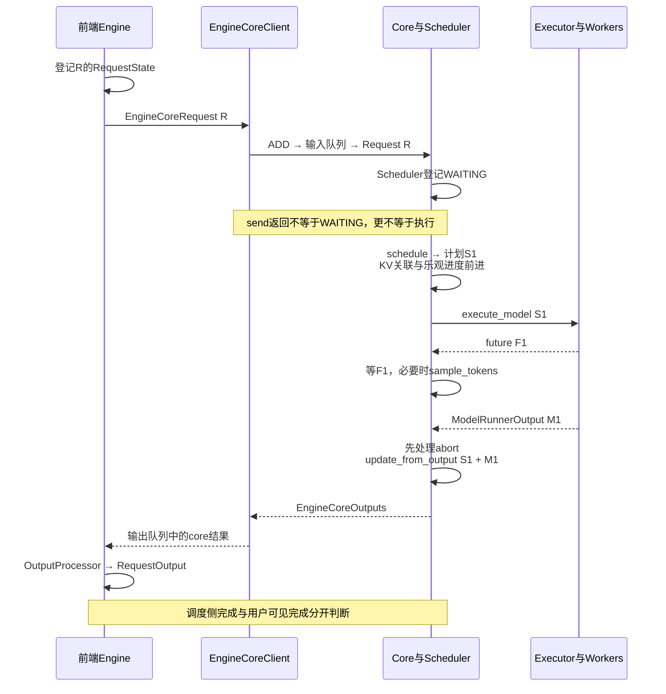
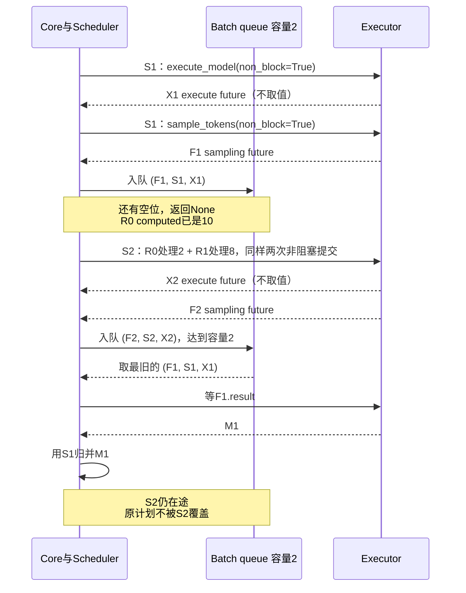
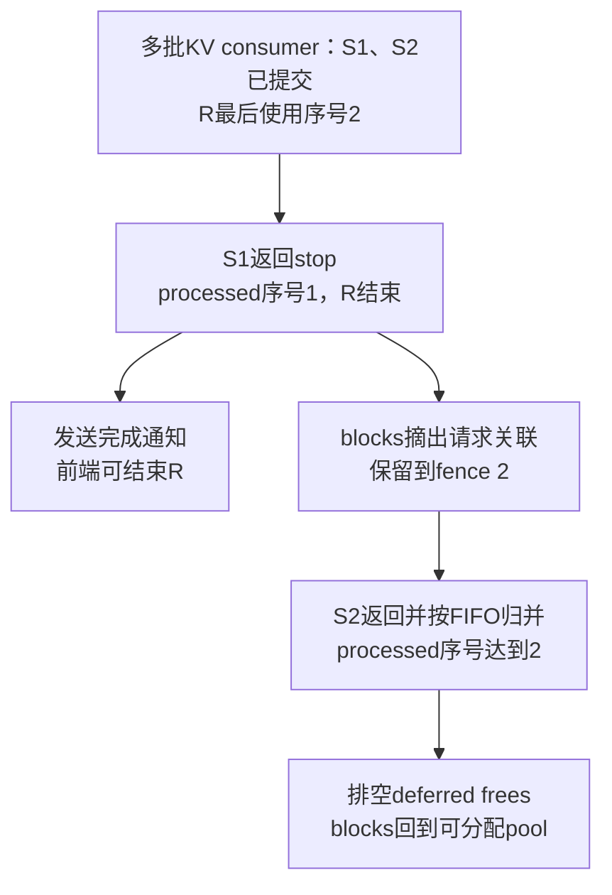
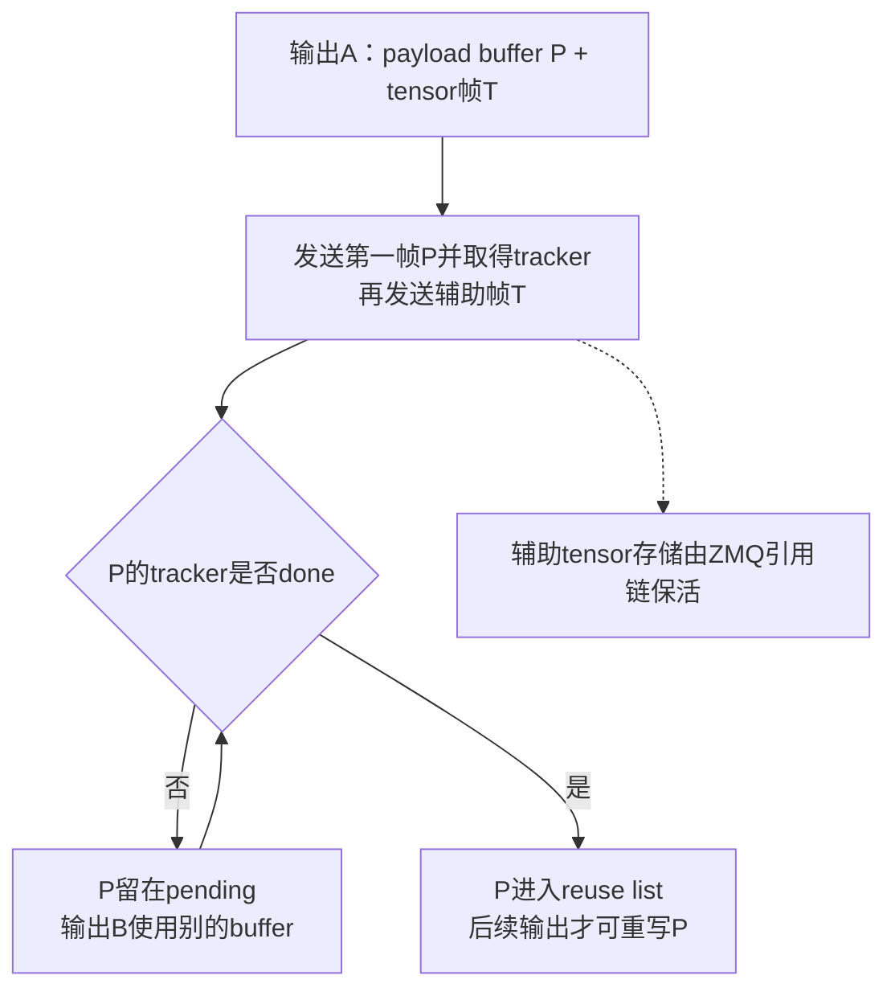

# vLLM Engine 架构：一次请求怎样提交、执行并完成

> **源码基线**：`vllm-project/vllm@199cb9b964822e59ab9b58d88e7be31eb419a2ae`（`main` 快照，2026-09-07 UTC）
> **主题**：从一个已经 render 的请求出发，追踪前端登记、Client 传输、Core 调度与 Executor 返回。再解释 batch queue 怎样把计划与 future 配对，以及抢占、完成和内存释放为何需要不同的判断。
> **适用范围**：拥有 Engine 内对象、可选进程边界与执行协作；调度预算和 KV 分配算法归 Scheduler/KV 专题，设备异步与 host buffer 细节归两代 Model Runner，启动与恢复拓扑归 Serving 专题。
> **最近更新**：2026-09-16。补齐异步调度解析、Scheduler 类、并发容量与 step 入口的选择链，区分同步教学分支与默认 R 的队列调用。

## 1. 已经拿到 token 输入，为什么还不能直接等一个结果？

接续 [[03_vllm_request_semantics_analysis|请求语义]]，现在请求 R 已经有 token 输入与 `SamplingParams`，需要生成两个输出 token。假设它有 12 个 prompt tokens；这些数字只用于讲解，不指定实际模型分词。引擎需要回答四个不同的问题：谁接收 R 的结果、R 何时获得本步资源、模型是否算完这一批，以及用户是否已经收到最终输出。

如果把这些问题都交给一个阻塞的 `generate` 循环，最容易理解的流程是“准备一批→等 GPU 返回→更新状态→准备下一批”。但当 CPU 需要解析新请求、GPU 执行上一批、多个 worker 协作时，等待会把这些工作串在一起。**当前 Engine 用 Client 隔离提交与等待，用 Core/Scheduler 统一决定和结算每步计划，用 Executor 适配设备执行拓扑。** 它允许已经安排的工作尚未返回，但必须记住“哪份结果属于哪份计划”。

从源码可验证三类不同对象：前端 `RequestState` 保存输出接收状态；Core `Request` 保存请求的调度状态和 token 进度；Executor/worker 保存执行和返回状态。把它们分开能避免前端并发接口、调度决策和 worker 拓扑各自维护一套调度循环，这是依据当前接口重建的设计推断，不是历史设计文档给出的实测对比。

本页会用“提交”“完成”加上具体对象说明含义。尤其不能把一个 future 已返回、一个 request 已结束、一个 buffer 可以重写当成同一个事件。

## 2. 先跟随 R 走完一次同步 core step

**这条 scoping 只约束 §2.2 那一格**：`async_scheduling=False`、PP=1、未自定义 `scheduler_cls`，因此使用 `Scheduler` 与 `EngineCore.step`；这是便于逐步观察的同步教学分支，**不是当前普通生成模型的缺省执行分支**。§2.1（前端登记接收者、MP ADD 消息）与 §2.3（输出线程与前端可见完成）在同步与异步两条分支下**是同一套流程**，不受这条假设限制。兼容配置下保留 `async_scheduling=None`、使用 MRV2 且 PP=1，会解析成 `AsyncScheduler`、容量 2 的 `step_with_batch_queue`。完整选择规则由本页 §4.1 统一解释，同一个 R 的默认调用重放见 §4.2 第一张表。这里的同步/异步指调度方式，与前端选择 `LLMEngine` 或 `AsyncLLM` 是不同的轴。

### 2.1 前端登记的是接收者，Core 登记的是等待执行的请求

同步 `LLMEngine.add_request` 先经过 InputProcessor，分配内部 request id，再调用 `OutputProcessor.add_request`，最后交给 `engine_core.add_request`。异步 `AsyncLLM` 也先创建 collector；其 `_add_request` 在**该方法自己的首次 await 之前**检查前端 admission 并登记 RequestState，随后发送 core request。上层 `add_request` 此前可以已经 await 能力查询等操作。

此时前端保存的是 R 的 prompt、detokenizer、输出模式、collector 与 parent/child 关联，尚没有一份承诺 R 本轮处理多少 token 的执行计划。`n > 1` 会有多个 child；这里先固定单个 R。

MP 路径中，Client 把 `EngineCoreRequest` 编码为 ADD 消息；异步 Client 写入 `client_index`，等 socket send 后返回。Core 的 input socket 线程接收并解码，`preprocess_add_request` 把传输对象变成 `Request`，必要时恢复媒体 receiver cache、发起独立 grammar 编译，然后放入 Core input queue。busy loop 再分派 ADD，调用 `EngineCore.add_request → Scheduler.add_request`，将 R 放入 request map 与 waiting queue。

普通 R 的初始状态是 `WAITING`；结构化输出请求可能先是 `WAITING_FOR_STRUCTURED_OUTPUT_GRAMMAR`，调度器会检查编译是否就绪。输入线程可以与 model forward 并行做请求预处理，但**只有 Core 主循环的调度路径将请求加入权威调度状态**。不是 input socket 一收到数据就开始 GPU 计算。

这已经区分两个时刻：MP 的 `send` 完成只证明发送调用完成；等待队列登记还要等 Core 消费 input queue。即便 R 已 WAITING，也不说明它获得了 token/KV 资源。

### 2.2 schedule 给出计划，然后才执行并归并结果

在上述容量为 1 的同步分支中，`EngineCore.step` 先检查 Scheduler 是否还有工作，再做以下顺序：

1. `Scheduler.schedule` 选择本步请求，分配所需 KV slots，生成 `SchedulerOutput`。其中包括新/缓存请求数据、每请求 token 数、block 变化、encoder/connector 信息、finished/preempted ids 等。
2. schedule 返回前，`_update_after_schedule` 增加 `num_computed_tokens` 与 `num_in_flight_tokens`，必要时记录释放 fence。这里的 computed 是包含在途工作的乐观进度，并非“GPU 已经完成”的计数。
3. Core 调用 `Executor.execute_model(..., non_block=True)`，得到 future；同时准备 grammar bitmask，然后在 `future.result()` 等待。如果 execute 返回 `None`，继续调用 `sample_tokens` 取得最终 `ModelRunnerOutput`。pooling 或某些执行分支可以直接返回结果，不能把 `None` 当成统一的失败码。
4. 等待期间到达的 abort，先由 `_process_aborts_queue` 处理，再把**这份 SchedulerOutput 与对应 ModelRunnerOutput**交给 `Scheduler.update_from_output`。
5. Scheduler 结算 in-flight 数、更新真实输出 token、处理停止及释放，按 `client_index` 组织 `EngineCoreOutputs`。

（术语对齐：本页说的“归并结果”与 [[07_vllm_scheduler_analysis|Scheduler]] 页说的“结果对账”是同一个操作——`update_from_output()` 按原计划把返回结果落回请求状态。两页各自沿用本页既有措辞，不是两套机制。）

对 R，假设本步预算允许完整处理 12 个 prompt tokens：schedule 后它的 computed 已是 12、in-flight 是 12，Executor 尚未兑现结果；归并返回后这份 in-flight 份额归零，并可能追加第一个输出 token。下一步再消费这个 token 的模型输入位置，直到满足输出上限或其他停止条件。只分到部分 prompt 的 step 可以完成计算却没有新的用户 token。

所以旧稿所说的“资源承诺”应该理解为 schedule 期间的一组相互匹配的变化：KV 分配已经改变 block 关联，随后请求进度和返回的计划也一起前进。它不是 `_update_after_schedule` 一行独自完成的数据库提交，也不保证失败后自动回滚所有副作用。预算与分配过程见 [[07_vllm_scheduler_analysis|Scheduler]]、[[08_vllm_kv_cache_management_analysis|KV Cache 管理]]；本页关注这份计划何时可交给 Executor，以及如何与返回结果保持对应。

### 2.3 Core 完成后，前端还要使结果对用户可见

MP Core 的 `_process_engine_step` 将分 client 的输出放入 output queue，输出线程编码发送。Client 接收、解码，再放入自己的同步/异步输出队列；同步 `LLMEngine.step` 调用 OutputProcessor 后返回 `RequestOutput`，异步 output handler 则将处理结果放入 R 的 collector，由 `generate` yield 给协议前端。

R 的 core finish reason 说明调度侧已经决定结束；detokenize、字符串 stop、聚合 choices 和协议流收尾仍在前端。反向也可能先发生：前端发现 stop string，先产生 finished 用户输出，随后再向 Core 发 abort。因此“Scheduler 已归并”与“前端已结束”是两处可见完成，先后关系取决于停止条件，不能只看 GPU future。

<!-- 图1 spec：四泳道前端、Client、Core与Scheduler、Executor/worker。R先登记RequestState，ADD经Client到Core等待队列。Core schedule后写进度并产生S1，Executor返回F1；Core等待F1、先处理abort再用S1归并M1，最后Client回前端完成输出。Core/Scheduler归并同泳道但函数名区分职责。 -->

图中仍采用本节显式关闭 async、PP=1 的同步分支；省略 socket 和队列线程，只表达改变有效状态的顺序。默认 batch-queue 分支不会先等 execute 返回 `None` 再发 sampling（见 §4.1）。Core 并没有另存一份与 Scheduler 竞争的 token/KV 真相。

## 3. Client 与 Executor 可以怎么换？

### 3.1 对象边界不等于固定进程数量

| 调用方式 | Client 选择 | 怎样推动与等待 Core |
|---|---|---|
| 同步、不启用 multiprocess | `InprocClient` | 当前进程构造 EngineCore；ADD 直接 preprocess/add，`get_output` 直接调用 `step_fn` 和 `post_step`，没有独立 busy loop |
| 同步、multiprocess | `SyncMPClient` | 通过 ZMQ 发送；后台接收线程把结果放入 `queue.Queue`，调用者在 `get_output` 阻塞 |
| asyncio、multiprocess | `AsyncMPClient` 家族 | 接收 task 把结果放入 `asyncio.Queue`，`get_output_async` await；不用阻塞整个前端事件循环 |
| asyncio、非 multiprocess | 当前不支持 | `make_client` 明确抛 `NotImplementedError` |
| 多 DP engine 的 asyncio | 外部负载均衡用 `DPAsyncMPClient`，内部均衡用 `DPLBAsyncMPClient` | 在同一提交合同上加 engine 选择、wave 与在途请求关联；具体路由策略归 Serving/分布式专题 |

`InprocClient` 折叠了 OS 进程，并未把前端输出状态、Scheduler Request 和 worker 执行状态合并为同一个对象。因此不能用常见部署图推导“一次 vLLM 调用必定有几个进程”。Client 处理 ADD、ABORT、utility 等消息；utility 通过 call id/future 单独等结果，也不等同于模型请求完成。

### 3.2 Executor 把同一计划投向不同设备拓扑

`Executor.get_class` 根据配置选择 `uni`、`mp`、Ray（包含受开关控制的 Ray V2）、external launcher 或自定义 Executor 类/导入路径；自定义实现必须满足 Executor 类型要求。它消费的是 SchedulerOutput，不自行从 waiting queue 挑请求。

UniProc 调用 driver worker；non-block 路径返回已完成 future，或把 `AsyncModelRunnerOutput` 包成 `AsyncOutputFuture`，直到 `.result()` 才 `get_output()`。因此 non-block 不意味着“调用瞬间什么工作都没做”；它表达的是返回结果可以延后物化。

Multiproc 广播 collective RPC，从指定 output rank 取一个结果，或经 KV/EC aggregator 合并多 rank 元数据。`FutureWrapper` 维护 RPC future 队列；请求某个 future 的结果时，会先按顺序 drain 在它之前的响应。模型的算子、rank 通信和设备同步仍由 worker/runner 执行；本页没有把一个 Python Future 的完成自行等同于任意 CUDA stream 都已空闲。

收益是 Core 可以保持相同的调度与归并规则，代价是 backend-specific 的广播、队列、汇总与异常等待。rank/group 和 collective 的详细顺序见 [[18_vllm_distributed_inference_analysis|分布式推理]]。

## 4. batch queue 怎样让上一批没回来时继续安排下一批？

### 4.1 队列里必须同时保留 future 和原计划

这条选择轴的 owner 是本页：`SchedulerConfig.async_scheduling` 的原始缺省为 `None`，先由 `VllmConfig.__post_init__` 解析；`SchedulerConfig.get_scheduler_cls()` 再选择实际类；`VllmConfig.max_concurrent_batches` 结合已解析的 async 值、runner 代际与 PP 大小给出容量；最后 `EngineCore.__init__` 构造调度器与队列并确定 `step_fn`。07 拥有调度算法，11/12 拥有设备执行，两者不替代此处的入口选择。

| `async_scheduling` 输入与条件 | 解析结果 | 边界 |
|---|---|---|
| `None`，普通生成模型且没有下列不兼容项 | `True` | 这是自动缺省，不需要显式开启 |
| `None`，pooling 模型 | `False` | 源码以当前实现的性能负收益为理由默认关闭；不是禁止用户显式设 True |
| `None`，不兼容 speculative method、`disable_padded_drafter_batch=True`、Executor 不支持 async，或 ROCm + DeepEP high-throughput + DBO | `False`，并记录相应 warning | 方法允许集合是 `get_args(EagleModelTypes)`、`get_args(NgramGPUTypes)`、`draft_model`、`dspark`；名称中的 EAGLE 不能缩写成仅 eagle/eagle3 |
| 显式 `True` | 通过上述兼容检查后保持 True | 遇不兼容项抛 `ValueError`，不是静默回落；pooling 不在这些显式拒绝条件中 |
| 显式 `False` | 保持 False | 不再被自动开启；这不等于禁止 PP 使用多批队列 |

Executor 支持与否来自选中类的 `supports_async_scheduling()`，不是从拓扑名称猜测：基类默认 False，`UniProcExecutor` 与 `MultiprocExecutor` 返回 True。未指定 `scheduler_cls` 时，最终 async 为 True 选择 `AsyncScheduler`，否则选择 `Scheduler`；自定义类/导入路径会覆盖这个内置类选择，`get_scheduler_cls()` 会告警其接口兼容性不保证，不能套用以下内置默认推导。投机方法的具体算法和适用边界仍归 [[16_vllm_speculative_decoding_analysis|投机解码]]。

| 已解析配置（PP 大小记作 p） | `max_concurrent_batches` | 内置 Scheduler / `EngineCore.step_fn` |
|---|---|---|
| async=False，p=1 | 1 | `Scheduler` / `step`；本页 §2 |
| async=False，p>1 | p | `Scheduler` / `step_with_batch_queue` |
| async=True，MRV2 | p+1 | `AsyncScheduler` / `step_with_batch_queue`；p=1 时容量为 2 |
| async=True，MRV1，p=1 | 2 | `AsyncScheduler` / `step_with_batch_queue` |
| async=True，MRV1，p>1 | p | `AsyncScheduler` / `step_with_batch_queue`；源码说明 MRV1 对 async+PP 的支持不完整，因此这里没有 V2 的额外一批 |

EngineCore 仅在容量大于 1 时创建 `deque(maxlen=capacity)`；`batch_queue is None` 才选 `step`，否则选 `step_with_batch_queue`。因此**普通生成、兼容配置、MRV2、PP=1 的缺省是 AsyncScheduler + 容量 2 的 batch queue**，pooling 或自动回落到 False 也只有在 PP=1 时才回到同步 `step`。**batch queue 和 async scheduling 不是同义词**：PP 可需要多个 batch，测试也能在 async scheduling 关闭时强制两批来验证队列协作。

**`model_executed` 有一个容易读反的默认值。** 它初始化为 `False`，**只有 `self.is_ec_consumer` 为真时**才被改写成 `total_num_scheduled_tokens > 0`；而 `is_ec_consumer` 的定义是「没配 EC transfer，或配了且本实例是 consumer」。也就是说普通部署恒为 consumer、行为符合直觉，但在 **EC producer 引擎**上 `model_executed` 恒 `False`——即使本轮排了 token 也永不进入采样分支，队列里放的始终是 execute future。所以这个名字读作“本轮是否执行了模型”会在 EPD 分离部署下读错。

对队列分支中实际执行普通生成的批次，Core 发出 `execute_model(..., non_block=True)` 后立即取得 grammar mask，并调用 `sample_tokens(..., non_block=True)`，不先等待 execute future 的值。pooling 或本轮没有模型执行时直接排入 execute future；存在 `pending_structured_output_tokens` 时延期 sampling（§4.3）。同步 §2 才是“先等 execute，返回 None 后再 sample”的顺序。

每个队列项保存三者：结果 future、对应 SchedulerOutput、原 execute future。第三者用于在 sampling 得不到结果时找回真正的 execute 异常。新项 `appendleft`，消费从 `pop` 取最旧项，保持 FIFO 的计划/结果配对。

一次调用先尝试安排新工作。若入队后还有空位且可以继续工作，就返回 `None`，优先填队列；若已达到容量或没有更多可调度工作，就等待最旧结果并归并。方法入口断言队列尚未满，因为上一次调用达到容量时已经取出了最旧项。它并非每轮先无条件 drain 所有完成 future，再开始 schedule。

### 4.2 默认 R 与两个 12-token prompt 的最小重放

先把 §2 的 R 放回缺省：普通生成、MRV2、PP=1、无 speculative/结构化输出、无自定义 Scheduler，保留 `async_scheduling=None`，本步 token 预算至少 12，R 仍要求两个输出 token。下面是依据执行分支推导的教学重放，不是实测时间线；假设资源充足、没有 prefix 命中、抢占、其他请求或提前停止。

| Core 调用 | 新计划与调用顺序 | 本次等待/消费 | 调用结束 |
|---|---|---|---|
| 第 1 次 `step_with_batch_queue` | S1 消费 R 的 12 个 prompt tokens；发 execute 后立即发非阻塞 sample | 容量 2 尚有空位，返回 `None`，不等 S1 | S1 在途；computed=12、in-flight=12，AsyncScheduler 登记 1 个 output placeholder |
| 第 2 次 `step_with_batch_queue` | S2 为 R 安排后续 1 个输入位置；仍先发 execute，再发非阻塞 sample | 队列达到 2，等待最旧 S1 的 sampling future，再以 S1 归并首个输出 token | S2 仍在途；R 已有首个真实输出，S2 对应的 placeholder 仍待结算 |
| 第 3 次 `step_with_batch_queue` | R 已不再进入新计划：running 扫描里 `num_output_placeholders > 0` 且 `num_computed_tokens + 2 − num_output_placeholders`（13 + 2 − 1 = 14）已达 `num_prompt_tokens + max_tokens`（12 + 2 = 14），该请求被跳过；本轮 S3 是 0 token 的空计划，`model_executed` 为假，入队的就是 execute future 本身 | 队列再次达到 2，等待并归并最旧的 S2，R 拿到第二个输出 token | `check_stop` 见 `num_output_tokens >= max_tokens`，R 置 `FINISHED_LENGTH_CAPPED` 并进 `finished_req_ids` |

所以 §2 中“一次 step 先提交再等 S1”的工作，在默认配置下分成这里第 1 次的提交和第 2 次的 FIFO 消费，期间 S2 已可安排。第二个输出要等 S2 自己的 future 被消费才归并，因此**默认配置下 R 走满两个输出 token 要三次 Core 调用，而不是两次**——最后一次里调度侧已经不给 R 排新工作，它存在的意义只是把在途的 S2 排空。Core 侧的 `FINISHED_LENGTH_CAPPED` 只是调度侧终结；R 的用户可见完成仍按 §2.3 走前端，两者先后不固定。设备上怎样消费未回 CPU 的 token 由 [[12_vllm_model_runner_v2_analysis|Model Runner V2]] 解释，placeholder 本身不是一个猜出的 token id。

下面保留一个**隔离队列机制、并非缺省 async 行为**的双请求测试重放。

源码 `test_engine_core_concurrent_batches` 设置每步 10 tokens、R0/R1 各 12 prompt tokens、两批容量，并关闭 async scheduling 来隔离 batch queue 行为。这个例子只借用测试的已给定调度结果，不在此重讲预算算法。

| Core 调用 | 提交的新计划 | 本次等待/消费 | 调用结束仍在队列中的计划 |
|---|---|---|---|
| 第1次 | S1：R0的前10个位置 | 不等待，返回 `None` | S1；R0 computed已为10 |
| 第2次 | S2：R0余2个位置，加R1前8个位置 | 队列达到2，等最旧S1；部分prefill无用户token，可返回空输出字典 | S2；R0 computed已为12，R1为8 |
| 第3次 | S3：R1余4个位置 | 等S2，归并R0完成prefill产生的第一个token | S3；下一轮才据此继续R0的decode |

这解释了最容易看错的一点：R0 的 computed=12 早于 S2 的真实结果；只有 S2 归并后的新 token 才进入 core 的输出序列。computed 让下一轮知道已经安排了哪些输入，future/result 则告诉它哪些计算事实真正返回。

<!-- 图2 spec：三泳道Core/Scheduler、batch queue、Executor。每步Core先非阻塞发execute再非阻塞发sample，入队的是 (sampling future, S, execute future) 三元组；S1包含R0:10，空位尚有直接返回；下一调用发S2 R0:2/R1:8并入队达到容量2，取最旧F1/S1等待M1，用S1归并M1，S2仍在途。不使用比例时间轴，不声称测得overlap时长。 -->

图上把 execute 与 sampling 两个 future 分开画，是因为它们的角色不同：真正入队并在下一轮被 `.result()` 等待的是 `sample_tokens` 返回的 F1；X1 在正常路径**不被取值**，但它一起进队列是有用的——`future.result()` 返回 `None` 说明原来的 `execute_model()` 失败了，此时 Core 正是靠 `exec_model_fut.result()` 把原异常重抛出来。pooling 或本轮没有模型执行时，入队的 future 本身就是 execute future（§4.1）。

### 4.3 输出依赖可以限制跑在前面的距离

async scheduling 在发出 decode 后加入 output placeholders，表示尚未回传的输出位置；真实 token 返回后再结算，而不是先编造真实 token ids。若下一批 structured output 的 grammar mask 依赖前一批尚未返回的 token，`pending_structured_output_tokens` 会使 Core 暂缓这批 sampling：模型执行可先发出，先消费上一批并推进 grammar，之后再计算 mask、调用 `sample_tokens`，把延期项加入队列。启用 draft 时还要先把可用 draft ids 对应地更新/筛选，细节归 [[14_vllm_sampling_structured_output_analysis|采样与结构化输出]]。

这段协作接续旧系统设计页的 async 主题：异步不是在同步循环外面套一个 Future，它改变“已安排进度”与“真实输出”的时序。设备侧怎样用持久 row、staged copy 和同步事件避免 CPU 改写 GPU 尚在读取的 host buffer，分别见 [[11_vllm_model_runner_v1_analysis|Model Runner V1]]、[[12_vllm_model_runner_v2_analysis|Model Runner V2]]；本页不以 batch queue 图替代这些内存算法。

是否进入异步调度以及哪些不兼容项会回落/拒绝，统一按 §4.1 的选择表判断。当前允许的 speculative 分支比旧注释“只支持EAGLE”更宽，包含 MTP/Draft Model/NGram GPU/DSpark 对应类型；能力细项须按配置代码判断，不能拿旧02的版本描述当作新基线事实。

## 5. 如果 R 在结果回来前已被抢占或取消，会发生什么？

### 5.1 为什么结果必须按产生它的那份计划对账

抢占之后仍会有旧计划的结果回来。Core 这一侧要守住的只有一条：**`update_from_output()` 是按传入的那份 `SchedulerOutput` 的 `num_scheduled_tokens` 遍历的，不是按结果本身**。因为抢占已经把该请求的 computed 与 output placeholders 归零，只有原计划还记得这批工作当时安排了几个位置，份额才能被正确排空；拿新状态去对账就会重复结算或让 placeholders 下溢。这条不变量是 §2 那张“先等 execute、再 sample”的时序，以及 §4.2 那两批在途重放能够成立的前提。

至于旧结果回来时到底交付还是丢弃——普通 KV 压力抢占的 stale 可交付、`drop_stale_output` 路径整段跳过、KV load 失败另有截断与恢复策略——这三类的判定表、计数规则与图归 [[07_vllm_scheduler_analysis|Scheduler]] §8.3，本页不再重放一遍。

### 5.2 取消、已完成、抢占，不能用一个“失效输出”规则处理

Core input 线程把 ABORT 同时加入普通 input queue 和专用 abort queue：前者保持 ADD/ABORT 顺序，后者允许 Core 在等待执行完成后、归并结果前优先处理取消。Scheduler 的 abort 处理具备幂等性，双队列不是对请求执行两次取消副作用。

`update_from_output` 对已不存在或 terminal 的 Request 跳过输出；connector 延迟清理时 terminal 对象仍可能留在 map，故只查 `request is None` 不够。普通 PREEMPTED Request 则仍是可恢复请求，按§5.1交付或丢弃模式处理。归并必须携带原 SchedulerOutput，否则既不知道要排空多少在途份额，也无法可靠判断迟到结果属于哪次安排。

前端取消还会移除 OutputProcessor state，之后收到的迟到 core 输出同样丢弃。两边清理针对不同对象：用户已结束并不撤回已送出的文本，Executor 也不会撤销已执行的 GPU 写入。

## 6. 完成通知之后，为什么还有工作和内存不能释放？

### 6.1 四种“finished”分别通知谁

| 状态/字段 | 消费者与含义 | 不能据此推出什么 |
|---|---|---|
| `Request.status` 为 terminal | Core 知道该请求不再正常生成 | Request 一定已经从 map 删除，或所有connector传输已完成 |
| `SchedulerOutput.finished_req_ids` | 通知 runner 移除先前步骤间结束的请求状态 | 这份清理计划一定包含新生成token；它也不是HTTP结束事件 |
| `EngineCoreOutputs.finished_requests` | 按client收集的完成集合；例如DPLB用来解除request→engine关联并减少inflight计数 | 前端已经输出了最终文本，或KV blocks已经回池 |
| `EngineCoreOutput.finish_reason` / 前端 `RequestOutput.finished` | 前者是该输出的core结束语义，后者是前端用户结果完成 | 所有后续设备工作、发送buffer和connector资源同步完成 |

这四行是**消费侧**对照：谁读它、能推出什么。生产侧——`finished_req_ids` 由哪些生命周期路径积累、`_update_after_schedule` 为什么必须换新 set 而不能原地 `clear()`——归 [[07_vllm_scheduler_analysis|Scheduler]] §8.1.2。没有未完成用户请求时，Scheduler 仍可能因待发 finished ids、connector 延迟清理或 pending push work 保持 `has_requests=true`；这允许清理继续取得执行机会。无模型执行但仍有这类工作时，Core 可短暂让出 GIL，给后台传输线程推进机会。

### 6.2 两批在途时的 block fence

下面固定启用了 `defer_block_free` 的路径：当前生产 gate 是**存在 KV consumer connector 且 `max_concurrent_batches > 1`**。不能把“凡是async都延迟回收”写成通用规则；无 connector 的测试明确验证此 gate 关闭，回收仍按对应路径立即进行。

设 S1、S2 都曾安排 R，因此 `request.last_sched_seq = 2`。处理 S1 输出时 R 遇到 stop，`processed_step_seq = 1`。`_free_request_blocks` 用 `last_sched_seq <= processed_step_seq` 判断“最后一次安排它的 step 是否已处理完”：这里 `2 > 1` 不成立，说明 S2 仍可能写 R 的 KV block，于是把 block 从请求关联中摘出、放入 deferred list，而不立刻交回可分配 pool。**要注意入队时写的 fence 值是 `self.sched_step_seq`（当前已发出的最新 step 序号），不是 `last_sched_seq`**——两者在本例恰好都是 2，但当 R 之后又被安排过、或 CoW 释放走 `_free_cow_retained_blocks(..., fence_seq)` 这条另行传入 fence 的路径时就会分开。只有 FIFO 处理到该 fence 对应的 step、使 processed 序号达到它之后，`_drain_deferred_frees` 才归还这些 blocks。

<!-- 图3 spec：S1和S2已提交且最后seq=2；S1返回stop将R终止、通知前端，但processed=1<2，blocks进入deferred fence2；S2返回使processed=2，才归还pool。标明gate仅多批KV consumer；旧S2的token可被忽略但完成事件仍排空fence。 -->

S2 的用户 token 可以因为 R 已结束而不再使用，但处理 S2 这个完成事件仍有内存生命周期意义。fence 是按非空 scheduled/processed step 维护的，不能用“当前剩余请求数为0”替代。源码对 deferred list 只排空头部已满足项；在可能提前一拍的 CoW retention fence 前，后面已安全的项可能多等一会儿，这影响回收时机而不授权提前复用。

还要区分另一种延迟：KV/EC connector 的 `request_finished` 可以要求 `delay_free_blocks`，让 terminal Request 留在 map，等待传输完成后再执行真正 free。它与“GPU在途写入的step fence”是两层条件，可能同时存在。KV allocator、offload/partial tail 与connector具体释放算法见 [[08_vllm_kv_cache_management_analysis|KV Cache 管理]]，跨实例协作见 [[22_vllm_disaggregated_kv_serving_analysis|跨实例 KV 服务]]（`delay_free_blocks`、partial tail 与被拒请求清理的协议侧在其 §5.4）。

### 6.3 ZMQ 发送结束保护的是另一批内存

Client 与 Core 之间除小字段外，还可能传 prompt embeds、媒体 tensor 或 logprobs 数组。`MsgpackEncoder` 把主payload与较大的 tensor/ndarray backing buffers 分成多帧，避免一律复制进主payload；小数据可内联，非连续 ndarray 会先复制。解码按 dtype/shape 恢复对象；tensor 分支根据内联/辅助帧与 share_mem/pin 配置选择 clone/pin 或共享，不能把“zero-copy transport”理解成从用户数据到GPU全程零拷贝。

输入 Client 使用 `send_multipart(copy=False)`。当前源码与专门测试的约定是：交给 ZMQ 的 memoryview 沿引用链保持原 tensor/ndarray 活着，调用方删除请求对象并不导致发送中的存储被回收。**存储仍活着只解决生命周期，不授权调用方同时改写内容。** 这也是传输 buffer 与设备侧 host-buffer race 必须分别解释的原因。

Core 输出端会复用 `MsgpackEncoder.encode_into` 的可写 bytearray，必须更谨慎：**需要跟踪第一帧 payload 何时发送完，而不是只看最后一帧 tensor。** `_send_msg_tracking_payload` 单独给第一帧 `track=True`，其他帧再发送；未完成的 `(tracker, buffer)` 放入 pending，只有 `tracker.done` 才放回 reuse list。普通 `send_multipart(track=True)` 返回最后帧 tracker，不足以保护这里复用的第一帧。

<!-- 图4 spec：输出A编码至可重用bytearray P并附tensor帧T；P首帧tracker未done时P进pending，B改用另一buffer；done后P进reuse可供下一输出编码。辅助tensor帧由ZMQ引用保活，明确不同保护信号，防止A的tensor配B的payload。 -->

这是明确的依赖边界：vLLM 展示了引用链、发送 API、tracker 使用和复用策略，测试验证 payload/tensor 不串配及删除调用方引用后的存活；本页没有读取或重跑 pyzmq 底层发送实现。若配置媒体 `torch_shm` 且有 tensor queue，另走 `TensorIpcSender/Receiver`：msgpack带 sender/message/tensor handle，tensor经共享队列搬运；receiver按handle缓存匹配并清理旧message，sender失败可回退标准序列化。当前这个单队列transport只面向目标engine 0，不能据此宣称它覆盖任意DP拓扑。

## 7. 错误、DP协作与兼容文档的边界

Executor 是故障传播边界，不是回滚器。Multiproc 在 permanent failed 状态拒绝新 RPC，等待响应可以因超时或worker错误失败；failure callback 可通知 Core。普通 `step` 在 future 等待处暴露异常；batch queue 保留 execute future，若 sample future 得到 `None`，再取原 execute 结果以抛出真正异常，而非把缺结果当正常空输出。

输入socket的request预处理异常可产生请求级 ERROR 输出；媒体cache miss还可返回missing hashes供前端失效缓存后由客户端重试。Core/worker永久失败与前端异常队列传播则可能结束整个引擎。当前代码没有一个保证跨所有GPU和connector副作用自动回滚的统一事务；故障检测、进程监督、ready/shutdown与恢复策略见 [[13_vllm_serving_control_plane_analysis|Serving 控制面]]、[[23_vllm_observability_reliability_analysis|可靠性机制]]。

DP 时本地没有请求也不一定能停下：其他rank仍执行共同的模型通信时，当前rank可能需要dummy pass。`DPEngineCoreProc` 在每个wave的**step 1以及 `dp_sync_interval` 的倍数step**同步全局unfinished与pause状态，其他step先保持running。默认interval为16，对应同步点1、16、32……；不是等完16步才第一次同步。这样idle pause可以在一个dummy batch后形成共识，避免额外空转一整段interval；源码测试覆盖此序列与step1 pause。全局空闲时递增 wave 并将 step counter 归零；`wave_complete` 则**不是每个 rank 都发**——发送条件是 `dp_rank == 0 or not has_coordinator`，且 `client_index` 取 `-1 if has_coordinator else 0`：有 coordinator 时由 rank 0 发给 coordinator，没有 coordinator 的 offline SPMD 场景才各 rank 发给自己同机的前端。单请求结束与整个 DP wave 停止仍是不同边界。

> [!contradiction] 文档意图与当前类关系分开读
> `docs/design/arch_overview.md` 的“V1 Process Architecture”可用于理解职责分离意图，但“LLM Engine / AsyncLLMEngine”仍把异步类描述成同步类的wrapper。当前公开alias分别指向V1 `LLMEngine` 与 `AsyncLLM`，二者各自组合输入输出处理器和CoreClient；不能沿用旧类图，也不能把常见多进程部署图当成固定进程公式。

## 8. 紧凑源码阅读路线与验证范围

先追请求的普通路径，再核对批队列和负向分支。下列源码和测试均已静态打开；未启动vLLM、下载模型、运行GPU/IPC/多进程或依赖测试，教学步骤不是本机测量。图示展示事件先后，不声称等比例执行时间或确定的性能收益。

| 问题 | 源码与测试锚点；路径相对页头仓库 |
|---|---|
| 前端先登记后提交、最后怎样产出 | `vllm/v1/engine/llm_engine.py::LLMEngine.add_request/step`；`vllm/v1/engine/async_llm.py::AsyncLLM._add_request/_run_output_handler`；`vllm/v1/engine/output_processor.py::OutputProcessor.process_outputs` |
| Client选择、直调与异步消息 | `vllm/v1/engine/core_client.py::EngineCoreClient.make_client/make_async_mp_client/InprocClient.get_output/SyncMPClient._send_input/AsyncMPClient.add_request_async`；`tests/v1/engine/test_engine_core_client.py::test_engine_core_client/test_engine_core_client_asyncio` |
| Wire request何时进入waiting | `vllm/v1/engine/core.py::EngineCore.preprocess_add_request/add_request/EngineCoreProc.process_input_sockets/_handle_client_request`；`vllm/v1/request.py::Request.__init__`；`vllm/v1/core/sched/scheduler.py::Scheduler.add_request` |
| Core调度与同步等待点 | `vllm/v1/engine/core.py::EngineCore.step/post_step/EngineCoreProc._process_engine_step`；`vllm/v1/core/sched/scheduler.py::Scheduler.schedule/_update_after_schedule/update_from_output` |
| Executor选择与结果物化 | `vllm/v1/executor/abstract.py::Executor.get_class/execute_model/sample_tokens`；`vllm/v1/executor/uniproc_executor.py::UniProcExecutor.collective_rpc/AsyncOutputFuture.result`；`vllm/v1/executor/multiproc_executor.py::MultiprocExecutor.collective_rpc/FutureWrapper.result` |
| async解析、Scheduler类、容量与step入口 | `vllm/config/vllm.py::VllmConfig.__post_init__/max_concurrent_batches`；`vllm/config/scheduler.py::SchedulerConfig.async_scheduling/get_scheduler_cls`；`vllm/v1/engine/core.py::EngineCore.__init__`；`vllm/v1/executor/abstract.py::Executor.supports_async_scheduling`、`vllm/v1/executor/uniproc_executor.py::UniProcExecutor.supports_async_scheduling`、`vllm/v1/executor/multiproc_executor.py::MultiprocExecutor.supports_async_scheduling`；`tests/test_config.py::test_async_scheduling_with_pipeline_parallelism_is_allowed/test_draft_model_enables_async_scheduling_by_default` |
| 队列配对、默认R与延期sampling | `vllm/v1/engine/core.py::EngineCore.step_with_batch_queue`；`vllm/v1/core/sched/async_scheduler.py::AsyncScheduler._update_after_schedule`；`vllm/v1/core/sched/scheduler.py::Scheduler.schedule`；`tests/v1/engine/test_engine_core.py::test_engine_core_concurrent_batches`（显式关闭async并强制容量2，不是默认分支测试） |
| 普通与drop stale路径 | `vllm/v1/core/sched/scheduler.py::Scheduler._preempt_request/update_from_output`；`vllm/v1/core/sched/async_scheduler.py::AsyncScheduler._update_after_schedule/_update_request_with_output`；`tests/v1/core/test_async_scheduler.py::test_kv_pressure_preemption_with_inflight_output/test_reset_prefix_cache_with_inflight_output_under_kv_pressure/test_kv_pressure_preempt_mid_handoff` |
| 完成集合、内存fence与connector延迟 | `vllm/v1/core/sched/scheduler.py::Scheduler._free_request/_free_request_blocks/_drain_deferred_frees/has_requests`；`vllm/v1/engine/core_client.py::DPLBAsyncMPClient.process_engine_outputs`；`tests/v1/core/test_deferred_block_free.py::test_gate_disabled_without_connector/test_finish_defers_free_until_inflight_step_done` |
| 序列化、buffer生命周期和首帧tracker | `vllm/v1/serial_utils.py::MsgpackEncoder.encode_into/_encode_tensor/MsgpackDecoder._decode_tensor`；`vllm/v1/engine/core.py::EngineCoreProc.process_output_sockets/_send_msg_tracking_payload`；`tests/v1/test_serial_utils.py::test_payload_buffer_reuse_does_not_corrupt_in_flight_messages/test_zero_copy_frames_survive_without_caller_side_references` |
| 可选共享tensor通道 | `vllm/v1/engine/core_client.py::MPClient.__init__`；`vllm/v1/engine/tensor_ipc.py::TensorIpcSender.__call__/TensorIpcReceiver.__call__` |
| DP与异常边界 | `vllm/v1/engine/core.py::DPEngineCoreProc.run_busy_loop/_has_global_unfinished_reqs/EngineCoreProc._handle_request_preproc_error`；`vllm/v1/executor/multiproc_executor.py::MultiprocExecutor.register_failure_callback`；`tests/v1/engine/test_engine_core.py::test_dp_sync_interval_normal_wave/test_dp_sync_interval_idle_pause_consensus_on_first_step` |
| 旧类图为何不可照搬 | `vllm/engine/llm_engine.py::LLMEngine`；`vllm/engine/async_llm_engine.py::AsyncLLMEngine`；`docs/design/arch_overview.md` 的“V1 Process Architecture”和“LLM Engine”章节 |

## Related Pages

- [[02_vllm_architecture_overview_analysis|架构概览]]：把本页Engine协作放回完整推理服务的模块分工。
- [[03_vllm_request_semantics_analysis|请求语义]]：解释EngineCoreRequest之前的输入转换和core结果之后的用户可见输出。
- [[07_vllm_scheduler_analysis|Scheduler]]：展开计划内部的budget、waiting/running与抢占算法。
- [[08_vllm_kv_cache_management_analysis|KV Cache管理]]：解释block关联、allocator、缓存提交与延迟回收条件。
- [[12_vllm_model_runner_v2_analysis|Model Runner V2]]：接续设备侧持久状态、当步输入和异步物化，补齐Core队列之外的执行机制。
- [[13_vllm_serving_control_plane_analysis|Serving控制面]]：展开launcher、ready、路由、背压和进程故障拓扑。
- [[26_vllm_multiproc_executor_rpc_deepdive|MultiprocExecutor专题]]：深入Executor后面的进程级启动、广播RPC、响应FIFO与收尾。
