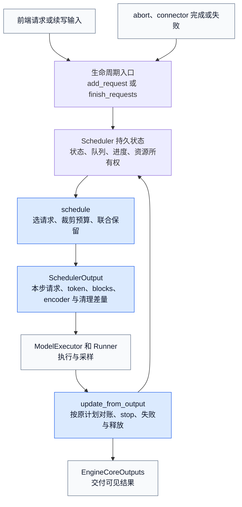
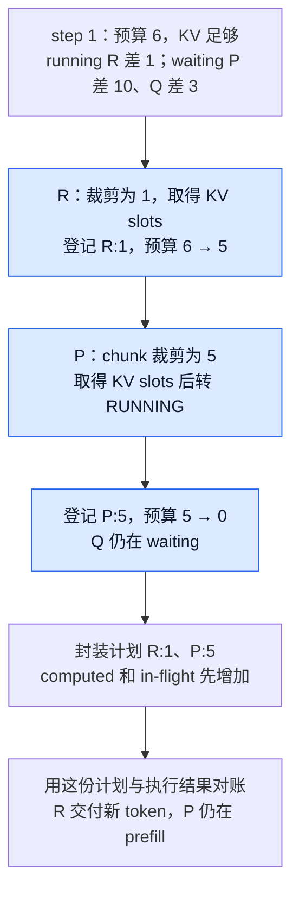
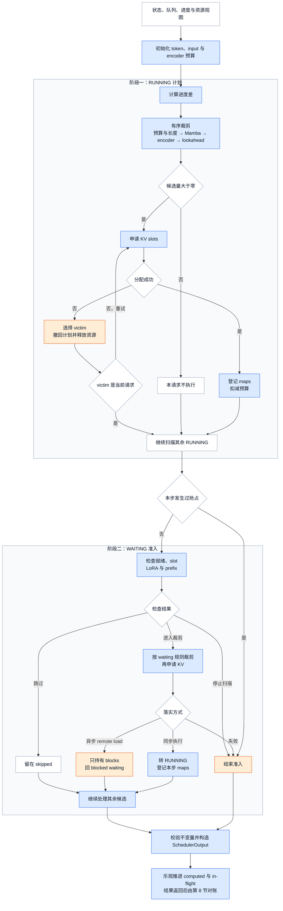
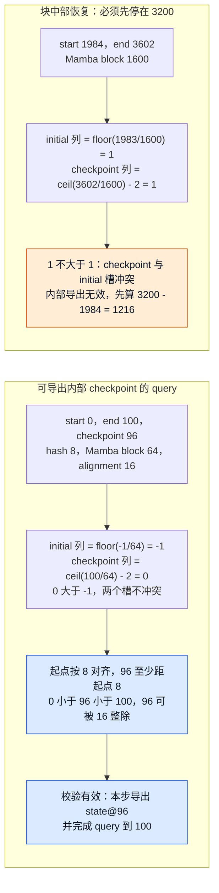
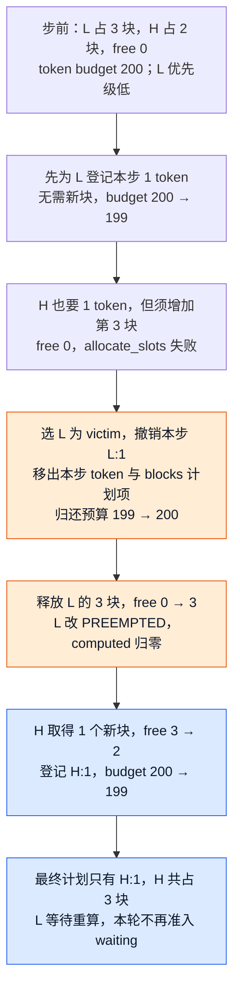
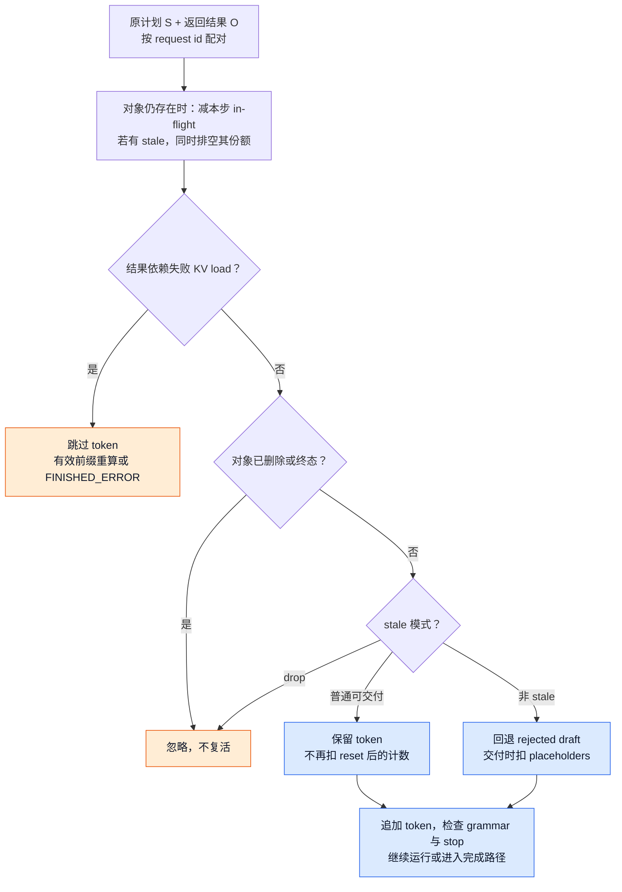

# vLLM Scheduler：请求生命周期、联合资源调度与结果对账

> **源码基线**：`vllm-project/vllm@199cb9b964822e59ab9b58d88e7be31eb419a2ae`（main 快照，2026-09-07 UTC）
> **主题**：Scheduler 在 EngineCore 中怎样管理请求生命周期，把 token、request slot、KV 与 encoder 等约束合成每步执行计划，并用对应结果修正乐观进度与释放资源。
> **适用范围**：V1 `Scheduler` / `AsyncScheduler` 的队列、token/input/spec/encoder 预算、抢占、输出与完成；设备行列及异步执行归 11/12，KV block/hash/refcount 算法归 08，采样和投机正确性归 14/16。
> **最近更新**：2026-09-09。补齐从状态候选到单步计划、抢占、准入和结果对账的连续主流程；按固定源码与测试静态核验，未实跑模型、GPU 或 connector。

## 1. Scheduler 的定位：把请求状态变成可执行的一步

V1 `Scheduler` 是 EngineCore 内的**有状态决策层**。它接收的不是一批已经定形的 GPU 输入，而是处在不同生命周期阶段的请求，以及 token、request slot、KV、encoder、LoRA 和 connector 等资源视图；它输出 `SchedulerOutput`，说明本步哪些请求计算多少位置、使用哪些新块和 encoder 输入、哪些请求首次进入或恢复、哪些 worker 镜像需要清理。模型执行器只消费这份计划，设备侧怎样排 row、跑 attention 或采样不由 Scheduler 实现。

反过来，Scheduler 也不是 KV 分配器或 API 排队器。`KVCacheManager.allocate_slots()` 决定具体块能否落实，前端 admission 决定请求能否进入 EngineCore；Scheduler 的职责是把这些组件的结果放进同一个请求进度和 step 边界中，保证**发出的计划可执行、返回的结果能找到原计划、终止后的资源按各自完成条件回收**。因此它更像持续闭环的协调器，而不是只给 waiting 队列排一次序的优先级队列。

<!-- 图1 spec：输入是请求、队列/进度和资源视图；展示EngineCore调用schedule形成SchedulerOutput、执行器返回与原计划配对、update_from_output更新状态后进入下一步；外部add/abort进入生命周期入口；明确计划提交、结果确认、资源回收三个完成边界，不展开设备行布局。 -->

同步 `EngineCore.step()` 依次调用 `schedule()`、`execute_model()` / `sample_tokens()` 和 `update_from_output()`；开启 batch queue 时，Core 可在旧 future 返回前继续发新计划，再把每个 future 与当时的 `SchedulerOutput` 成对保存。所以下面三个时间点不能合并：`schedule()` 返回只说明**计划已提交**，`update_from_output()` 才说明**结果已确认**，connector 与执行 fence 满足后才说明**资源已回收**。

Scheduler 的功能可以压缩为七组。后文每一节都对应其中一组，而不是按源码长函数逐段翻译。

| 功能 | 要解决的问题 | 设计与实现入口 | 产出的可观察变化 |
|---|---|---|---|
| 请求生命周期 | 新请求、续写会话与外部终止怎样进入同一状态空间 | `add_request()` 建立/续接请求；`finish_requests()` 从队列移除并进入统一释放 | `requests`、waiting 队列、终态与 `finished_req_ids` 改变 |
| 就绪性管理 | grammar、remote KV、streaming 输入未就绪时，怎样不阻塞所有后来请求 | `_enqueue_waiting_request()` 将 blocked 请求放入 skipped；`_try_promote_blocked_waiting_request()` 按外部完成信号恢复 | blocked 状态在 skipped 中等待，ready 后回到 `WAITING` 或 `PREEMPTED` |
| 每步选择与预算 | 已运行请求和新请求谁能在本步计算多少位置 | `schedule()` 先扫 running，再在无抢占时准入 waiting；统一用 computed 追赶 known/spec/placeholder 目标 | `num_scheduled_tokens`、new/resumed/cached request 差量形成 |
| 联合资源保留 | token 数可行时，slot、KV、encoder、LoRA 和 lookahead 是否也同时可行 | `_try_schedule_encoder_inputs()`、`_reserve_prefill_lookahead()` 与 `allocate_slots()` 共同裁剪/落实 | 只有联合成功的请求进入本步 maps；异步 KV load 是只持块、不执行的例外 |
| 抢占与显式撤回 | KV 不足时怎样回收容量，又不让已撤销工作残留在本步计划 | `schedule()` 选择 victim；`_preempt_request()` 重置进度并释放资源，同时撤回 victim 已登记的预算和 maps | victim 变 `PREEMPTED`、回 waiting，worker 收到 reset id |
| 计划发布 | runner 需要的首次数据、缓存差量、块与 connector 操作怎样冻结在同一步 | `SchedulerOutput` 构造后，`_update_after_schedule()` 乐观推进 computed/in-flight | 后续可继续发 step，但必须保留原计划用于结果对账 |
| 结果对账与完成 | spec rejection、stale、load failure、stop 和延迟释放怎样各走正确分支 | `update_from_output()`、`_update_request_with_output()`、`_free_request()` 与 deferred-free fence | token 恰好交付一次；终态、对象删除和物理块回池分别发生 |

这张表也给出本页边界：调度策略只决定候选顺序和 victim，不单独保证公平；KV block/hash/refcount 算法见 08，Engine future 与设备完成见 06/11/12，采样和投机正确性见 14/16。Scheduler 在这些模块之间维护控制一致性，但不替它们证明数据面正确。

## 2. 一步只能算 6 个 token，先给谁

设每步 token budget 和 input budget 都为 6，最多 3 个 running 请求；开启 chunked prefill，关闭长 prefill 限额，无 spec、媒体或 prefix hit，KV 足够。R 已在 decode：已知 21 个 token、算过 20 个，差 1 个；P、Q 按顺序等待，prompt 分别长 10、3。每步结果返回后再排下一步，R 在这三步内不结束。

| step | 先扫描 running | 剩余预算如何准入 waiting | 发出计划 | 结果返回后的变化 |
|---|---|---|---|---|
| 1 | R 得 1，预算 6→5 | P 要 10，只取 5，预算归零；Q 留 waiting | R:1，P:5 | R 多一个输出；P 只完成前 5 个 prompt token，无采样输出 |
| 2 | R 得 1；P 已是 running，取剩余 5 | 预算用完，Q 继续等 | R:1，P:5 | P 完成 prompt，得到第一个输出 token |
| 3 | R、P 各差 1，预算 6→4 | Q 取 3，预算剩 1 | R:1，P:1，Q:3 | Q 完成 prompt，得到第一个输出；无需为了凑满预算再造工作 |

这里“发出 5 个 token”是计算 5 个输入位置，不是向用户交付 5 个新 token。`num_computed_tokens` 在提交计划时已经推进，表中“结果返回”才确定采样输出。若不开 chunked prefill，等待中的长请求放不下会停止本轮 waiting 扫描；不能从本例推成“总会越过长请求，让后面的短请求先走”。`test_schedule_order` 用 800/800/10/10 的请求和 1024 预算验证了这个差别。

<!-- 图2 spec：输入是 R 差1、P差10、Q差3和预算6；沿一次 schedule 的实际顺序显示6→5→0，输出R1/P5和仍waiting的Q；矩形依次表示准入动作与结果对账，非时间比例图。 -->

这就是连续调度的基本单位：**每步重新分配要计算的位置数**。固定成员、等整个 batch 全部完成才换人的方案，无法在下一个 step 立即把空出的机会给新请求；这是从当前 running-first / waiting-admission 控制流重建的设计理由，不是源码中的历史决策记录。源码明确采用统一进度模型，不为 prefill 和 decode 建两套调度阶段；chunked prefill、prefix hit、spec validation 都是在追赶同一请求的目标进度。

但“每步重排”也把 Scheduler 放进延迟关键路径。token 数、可驻留 request slot、KV blocks 分别受限；多发 token 可能拉长一步，多占 KV 可能引发重算，多接纳请求也不等于降低排队时间。后文沿本例逐项加入这些限制。

## 3. 请求状态机：每个状态里 Scheduler 实际做什么

`RequestStatus` 回答“请求处在生命周期哪一段”，但不能单独回答“下一步能否执行”。Scheduler 真正判断的是一个组合状态：**枚举值 + 所在队列 + computed/in-flight/stale 进度 + KV/encoder 所有权 + connector/fence 完成信号**。同为 `WAITING`，新请求可能没有块，remote KV 刚完成的请求却可能已经持有并缓存了块；同为终态，对象和物理块也可能尚未删除。

先逐个看非终态。表中的“占 slot”指 `max_num_seqs` 对应的 model-runner request slot，不是本步一定有执行行。

| `RequestStatus` | 怎样进入 | Scheduler 在该状态做什么 | 队列与资源语义 | 怎样离开 |
|---|---|---|---|---|
| `WAITING` | 普通新请求；grammar 或首次 remote KV ready；续写输入到达 | 作为可准入候选，检查策略顺序、slot、LoRA、prefix、token/input、encoder 与 KV；失败按原因选择 skip 或停止扫描 | 通常在 `waiting`；不占 running slot，但可因已完成 remote load 而持有 blocks | 联合保留成功后设 `RUNNING`；异步 KV load 启动后设 `WAITING_FOR_REMOTE_KVS`；abort/error 进终态 |
| `WAITING_FOR_STRUCTURED_OUTPUT_GRAMMAR` | `Request` 创建时发现结构化输出请求 | `_try_promote_blocked_waiting_request()` 轮询 grammar 对象；未就绪继续跳过，异常登记为 request-level error | 在 `skipped_waiting`，不进入本步 token/KV 计划 | grammar 可用后设 `WAITING`；编译异常在结果更新尾部统一设 `FINISHED_ERROR` |
| `WAITING_FOR_REMOTE_KVS` | waiting 或 preempted 请求已为外部 KV load 分配 blocks | 本步不执行 token；等待 worker connector 的 finished/failed 信号。ready 后缓存有效块，失败时截到有效前缀或释放 | 在 `skipped_waiting`；**可能持有 blocks 和 prefill 容量保留**，但不进 `running`，也不扣本步执行预算 | 首次请求回 `WAITING`，有过抢占的请求回 `PREEMPTED`；load fail 可转重算或 `FINISHED_ERROR` |
| `WAITING_FOR_STREAMING_REQ` | resumable 请求当前输入段触发 stop，且暂时没有下一段输入 | 保留会话对象，拒绝把它当普通 waiting 准入；`add_request()` 收到同 id 更新时调用 `_update_request_as_session()` 拼接新输入 | 在 `skipped_waiting`；不在 `running`，但 `num_waiting_for_streaming_input` 仍计入 slot 上限 | 新输入到达后设 `WAITING`；结束 sentinel 或外部 abort 进终态 |
| `RUNNING` | waiting/preempted 请求联合保留成功 | 每步先扫描：计算待追赶位置，逐项裁剪预算，申请新增 KV，登记本步 maps；候选为零时可跳过它继续扫后续请求 | 在 `running` 并占 slot，通常持有 KV/encoder 状态；是否当步执行只看 `num_scheduled_tokens` | KV 不足且被选为 victim 时设 `PREEMPTED`；stop/error/abort 进完成路径；未结束则留在 `RUNNING` |
| `PREEMPTED` | 只有 `RUNNING` 可由 `_preempt_request()` 进入 | computed 归零、清 draft/placeholders、标记 stale 份额和 reset id；等待重新查 prefix、补资源并重算 | 从 `running` 移除、KV/encoder 引用释放，插到 `waiting` 队首；旧 step 的结果仍可能在途 | stale 排空后通常再准入；drop 模式允许同一步恢复但丢弃旧结果；也可被 abort 或被 stale stop 终止 |

终态不是一个枚举，而是六个原因。`RequestStatus.is_finished()` 的实现是 `status > PREEMPTED`，所以新增终态必须保持这个枚举顺序契约。

| 终态 | 本基线中的触发/含义 | 对外 finish reason 与处理 |
|---|---|---|
| `FINISHED_STOPPED` | EOS、stop token；pooling 得到结果；encoder-only 完整消费 prompt | `STOP`；resumable 请求可能先捕获本段 stop reason，随后立即复位到 `WAITING`，并不最终释放 |
| `FINISHED_LENGTH_CAPPED` | 已达模型长度或请求 `max_tokens` | `LENGTH`；进入统一 `_free_request()` |
| `FINISHED_ABORTED` | 客户端断开、Core 关闭或 streaming session 明确结束等外部终止 | `ABORT`；`finish_requests()` 先从当前队列移除再释放 |
| `FINISHED_IGNORED` | 枚举注释保留给 prompt 超过长度上限的忽略语义；本基线 V1 Scheduler 没有写入该状态的生产路径 | 映射为 `LENGTH`；不能据枚举存在声称当前 Scheduler 会产生它 |
| `FINISHED_ERROR` | grammar 编译/推进失败，或配置为 fail 的 KV load failure | `ERROR`；错误请求不再参与准入，走统一释放与空 token 输出 |
| `FINISHED_REPETITION` | 满足 `min_tokens` 后命中配置的序列重复检测 | `REPETITION`，并记录 `repetition_detected` |

还有一个容易误读的接口细节：`WAITING_FOR_STREAMING_REQ` 虽然不是终态，`get_finished_reason()` 仍把它映射为 `STOP`，用于表达“当前输入段已停止”。**对外 finish reason 与内部 `is_finished()` 不是同一判定。**

<!-- 图3 spec：输入是新请求；主路径展示三个blocked等待、联合准入、KV抢占重置、可续会话和完成释放；状态内写Scheduler动作，边写触发信号；任意非终态的abort/error终止边由旁注合并，避免重复连线掩盖主路径；不把skipped队列误画为enum。 -->

支撑这个组合状态的是以下持久字段和每步差量：

| 状态载体 | 用途 | 不能混同的边界 |
|---|---|---|
| `requests` | request id 到 `Request` 的映射 | connector 延迟释放时，终态对象仍可能在映射中 |
| `waiting`、`skipped_waiting` | 可直接准入候选，以及等待依赖/本轮约束而跳过的请求 | 队列位置不是额外的 `RequestStatus`；blocked 不等于 finished |
| `running` | 已准入、占活跃 slot 的请求 | 不保证每步都执行；当步执行子集看 `num_scheduled_tokens` |
| `num_tokens_with_spec` | prompt + 已返回 output + 当前 draft 的长度 | draft 还没有通过验证 |
| `num_computed_tokens`、`num_in_flight_tokens` | 已提交进度，以及尚未返回的执行位置数 | computed 含乐观推进，不等于全部已确认的 KV |
| `num_output_placeholders`、`num_stale_output_tokens` | 预期输出数量，以及抢占前仍待排空的执行位置数 | 两者单位/消减规则不同，不能互相代替 |
| 本步 maps | 新 blocks、每请求 token 数、encoder 项、scheduled spec | 联合资源成功后才登记；异步 KV load 可只持 blocks 而不执行 |
| `finished_req_ids`、`reset_preempted_req_ids` | 下游清理旧请求镜像的生命周期增量 | 放进 output 后换新 set，不能原地 `clear()` 破坏旧计划 |

五条不变量贯穿后文：已发 token 总量不超上限；token/input budget 非负；running 数不超 slot 上限；发给 runner 的计划只能包含本步能执行的联合保留；返回结果必须按产生它的那份计划对账。源码在封装 output 前直接断言前几项。`running` 数可以大于当步 scheduled 请求数，因此不能拿整个 running 列表当作模型输入。

## 4. 每步执行计划怎样形成：候选量、联合裁剪与资源落实

第 3 节解决的是“请求现在处于什么状态”，第 2 节则直接展示了 `R:1、P:5` 这样的最终计划；两者之间还缺少最关键的一段：**Scheduler 怎样把有资格参与的请求变成本步真正能执行的工作**。这正是 `schedule()` 的核心功能。它不是单独计算一个 token 上限，而是在一次调用里完成候选选择、数量裁剪、资源落实和计划冻结。

对单个请求而言，`num_new_tokens` 只是候选量，不能直接发给 runner。Scheduler 还要证明本步预算容得下、输入区间没有越过模型或缓存边界、encoder 工作可用，并且 KV slots 真正分配成功。只有这些条件联合成立，请求及其 token 数才会写入 `num_scheduled_tokens` 等本步 maps。换句话说，**状态机给出候选，联合调度把候选变成承诺，`SchedulerOutput` 冻结这份承诺**。

### 4.1 一次 `schedule()` 的输入、输出和主流程

一次 `schedule()` 读取的是 Scheduler 的持久状态和当前资源视图，产出的是只属于当前 step 的执行计划：

| 阶段 | 读入什么 | 决定什么 | 结果流向 |
|---|---|---|---|
| 初始化 | token/input/encoder 预算、暂停与节流状态 | 本步最多还能接纳多少计算和输入 | 进入 running 扫描 |
| running-first | `RUNNING` 请求的 known/spec/placeholder 与 computed 进度 | 每个已驻留请求还差多少位置，本步最多批准多少 | KV 成功后登记；为零则继续下一个 |
| 资源落实 | KV、encoder、lookahead 与缓存边界 | 候选量是否真的可执行 | 成功写入 maps；失败进入抢占或停止 |
| waiting admission | `WAITING` / `PREEMPTED`、blocked 完成信号、slot 与 prefix hit | 哪些新请求或恢复请求可以入场 | 加入 running，或跳过/停止/等待 remote KV |
| 计划封装 | 本步 maps、new/resumed/reset/finished 差量 | runner 需要看到的不可变 step 边界 | 构造 `SchedulerOutput`，再乐观推进进度 |

<!-- 图4 spec：从第3节的状态与队列进入一次schedule；主路径依次展示初始化、RUNNING候选与有序裁剪、KV落实、无抢占时的WAITING准入、SchedulerOutput和乐观推进；零候选、KV失败抢占、blocked跳过、硬约束停止和异步KV只持块是辅助分支；箭头终点分别指向第5至第8节的详细解释。 -->

图中的两段扫描是同一次计划构造的两个阶段，但分支并不完全相同。running 和 waiting 都要回答“从哪里继续、最多算多少、资源能否落实”；running 已占 slot 并持有请求状态，waiting 则要先完成准入和 prefix 恢复，还可能为 uniform decode 补 spec 行。三个 blocked waiting 状态尚未就绪时不会进入 token 裁剪，它们在 waiting 扫描中被跳过，留给后续 step 再尝试。

### 4.2 RUNNING：从进度差得到候选量，再逐项缩小

running 请求先按

`num_tokens_with_spec + num_output_placeholders - num_computed_tokens`

得到还需追赶的位置数。随后按源码中的固定顺序应用长 prefill 上限、token/input 预算、模型长度、Mamba split、encoder 边界和 MTP prefill lookahead。这个顺序很重要：后一个约束只能继续缩小前一个结果，不能凭另一种资源尚有余额把 token 数加回来。各约束为什么存在、何时生效，由第 5 节逐项展开。

回到第 2 节 step 1：R 的候选量是 `21 - 20 = 1`，所有约束通过且 KV 可落实后，才登记 `R:1` 并把 token budget 从 6 扣到 5。P 此时还在 waiting，不会和 R 同时进入 running 扫描；它要等 running 阶段结束后再走准入分支。这样，第 2 节表格里的先后顺序就对应到了真实控制流，而不是抽象的“先来先服务”。

候选量被裁成零时，running 通常是 `continue` 而不是 `break`。原因可能是旧 step 仍在途、encoder 预算或 cache 不足、Mamba 对齐无法形成有效 chunk，或者 MTP lookahead 需要保留尾部窗口；这些都只说明当前请求本步不能推进，不代表后面的 running 请求也一定不能推进。这正是第 3 节所说的“处于 `RUNNING` 不等于当步一定执行”。

### 4.3 KV 是落实点：成功才登记，失败才进入抢占

经过裁剪的 `num_new_tokens` 仍只是逻辑计划。`KVCacheManager.allocate_slots()` 要把它落实为新增 blocks；成功后 Scheduler 才把请求写入 scheduled-running 列表、token/block/spec/encoder maps，并扣减预算。因此 `num_scheduled_tokens` 表示的是**已经通过联合资源检查的本步承诺**，不是初始需求量。

若 KV 分配失败，running 路径不会简单跳过当前请求，而是进入 victim 选择循环。被选中的请求如果已经在本步登记，就必须连同 token、blocks、spec、encoder 差量和预算一起撤回；当前请求才可以再次尝试分配。完整的抢占算例放在第 6 节，因为它解释的是图中“资源落实失败后怎样改写已经形成一半的计划”。

### 4.4 WAITING：只有 running 阶段稳定后才补充新请求

running 扫描结束后，只有本步没有发生抢占且 Scheduler 未暂停，才进入 waiting admission。这里先处理第 3 节的组合状态：依赖未就绪、可交付 stale 尚未排空、LoRA 或 connector 暂不可用时跳过当前请求；slot 用完、不可切分的工作超出预算、encoder/KV 容量无法落实时则停止这次扫描。随后再查本地/远端 prefix，从正确进度起点应用 waiting 路径的预算、spec padding、Mamba、encoder 与 lookahead 规则，再申请 KV。它与 running 共享约束概念，但候选起点、padding 和遇阻后的 `break` / `continue` 语义不同。

第 2 节的 P 正是在这个阶段得到候选量 10，再被剩余预算裁成 5；KV 成功后它才从 `WAITING` 变为 `RUNNING`，登记为 new request。Q 因预算已经归零留在 waiting，下一 step 再参加准入。异步 remote KV load 是一个需要单独标出的中间结果：它可以先持有 blocks，却不执行 token、不进入 running，也不扣本步执行预算；完成信号到达后才重新准入。第 7 节会展开这些 skip、break 和 remote-load 分支。

两段扫描结束后，Scheduler 检查 token/input 预算和 running slot 等不变量，计算共同前缀，封装 `SchedulerOutput`，最后由 `_update_after_schedule()` 乐观推进 computed 与 in-flight。至此，本节只完成了“计划已提交”；结果是否接受、是否需要回退以及何时释放资源，要等第 8 节的结果对账。

后面的阅读顺序由这张主流程图决定：第 5 节放大“候选量怎样被约束链裁剪”，第 6 节处理 KV 失败后的抢占和撤回，第 7 节解释 waiting 准入，第 8 节再把已经提交的计划与执行结果闭环。它们不是新的并列主题，而是同一次 `schedule → execute → update` 路径上的连续阶段。

## 5. 约束分支：为什么候选 token 还会继续缩小

第 4 节先建立控制流，本节只放大图中的“按顺序裁剪”节点。基础预算和模型长度对所有请求生效；speculative、encoder 与 Mamba 则由模型能力和请求形态条件触发。它们最终都改写同一个 `num_new_tokens`，但约束的对象并不相同：

| 约束层 | 何时存在 | 防止什么问题 | 详细小节 |
|---|---|---|---|
| token/input、模型长度与 slot | 所有调度 step | 计划超出本步容量、runner 驻留量或合法位置范围 | 5.1 |
| speculative shape | 开启投机或 uniform decode padding | draft 超预算、prefill 混入 draft、query 行数不一致 | 5.2 |
| encoder 与 prefill lookahead | 多模态、encoder-decoder、EAGLE/MTP 等路径 | decoder 越过尚未准备的输入，或 drafter 失去完整预读窗口 | 5.3 |
| Mamba split/checkpoint | hybrid 模型且 Mamba cache mode 为 align | 把中间递归状态冒充成错误 token 边界的可复用状态 | 5.4 |

### 5.1 两种 token 预算和 request slot

每轮 `token_budget = max_num_scheduled_tokens`，`input_budget = max_num_batched_tokens`。二者通常相等；模型会在执行中追加输入位置时，调度上限可以更小。若 speculative 配置要求 `draft_slots = max_num_new_slots_for_drafting`，每接纳一个请求，input budget 扣掉的是 `num_new_tokens + draft_slots`，token budget 只扣 `num_new_tokens`。例如 token budget 6、input budget 8、每请求 draft slots 2：第一个请求取 4 后，剩 token=2、input=2；第二个请求因 `input_budget <= draft_slots` 停止，即使还剩 token 预算也不能入场。

running 的候选量按 `num_tokens_with_spec + num_output_placeholders - num_computed_tokens` 计算。随后按实际顺序处理：长 prefill threshold → token/input 剩余额度 → model length（留本步采样位置）→ Mamba split → encoder 边界 → MTP prefill lookahead。普通自回归每步采样位置数为 1，diffusion 为 0，不能把“总要再留一个 bonus token”当作所有模型的通则。

候选量为零时，running 循环通常 `continue`：可能前一步仍在途、已经到长度上限、encoder budget/cache 不足，或没有足够预算跨过对齐/预读边界；后面的请求仍可运行。源码明确指出这放松了严格 FCFS。V2 + PP + async 还检查 `next_decode_eligible_step`，同一请求两次 decode 至少间隔 PP size 个调度 step；达到输出上限的 placeholder guard 则避免确定无用的额外一步。

waiting 除 token 外还检查 `len(running) + num_waiting_for_streaming_input`：暂停等输入的 streaming session 仍占 runner slot。`max_num_seqs` 是驻留/执行容量约束，前端 `max_num_queued_reqs/tokens` admission 是另一道入口限流，见 [[02_engineering/03_infer_frameworks/vllm/03_vllm_request_semantics_analysis|请求语义]]，两者不能替代。

### 5.2 speculative 也花预算，且 shape 不能随意截断

running 只将批准区间内的 draft 写入 `scheduled_spec_decode_tokens`，然后清空 request 的旧 draft，等 `update_draft_token_ids()` 或 async worker 更新。prefill chunk 不接收 draft：现有测试以 prompt 80、预算 50、draft 3 逐步验证 **50 → 30 → 1+3**；第二步是剩余 30 个 prompt 位置，不能混入 3 个 draft 而变成 33。投机的 propose/verify/accept 分布推导属于 [[02_engineering/03_infer_frameworks/vllm/16_vllm_speculative_decoding_analysis|投机解码]]。

另一个分支发生在 waiting 请求只差 1 个位置时，例如 33-token prompt 命中 32-token prefix。若已有 running decode 或命中进度非零，batch 尚无已排 prefill，使用固定 K 的自回归 spec，且模型长度与预算容得下，Scheduler 可将它补成 `1+K` 行并附 `[-1] * K`，保持 uniform decode，便于 full CUDA Graph。它不是已经产生了 K 个真实 draft。容量不足以保留整个 `1+K` 时，本轮先不准入；已有 prefill、dynamic K 或 diffusion 时不套这条 padding 规则。

**Mamba 对齐后的修正不同于预算不足。** 已补成 `1+3=4` 行的请求，若 split 裁到 1、2、3 中任何一个正数，最终都回退为 **1 行并清掉 padding 标志**，不附 spec placeholders。否则 sampler 按 draft 数推导的 row window 与实际 query 行数不一致；回归测试明确覆盖三个裁剪值。对齐直接得到零则本轮停止准入。动态 spec 在计划结尾按本步 scheduled request 数查询下一步 K；它是下一轮 draft 数选择，不能追溯改写本轮已批准区间。

### 5.3 encoder 预算决定 decoder 能走到哪里

在主例中加入一幅图：P 的媒体占位从位置 4 开始，需要 6 个 encoder embeddings，本步 encoder budget 只有 4，起点为 0、无预读 shift。即使 decoder 获得 5-token 候选区间，也只能取前 4 个文本位置。若下一步起点已在 4，encoder 仍不可用，就取零；running 跳过 P，继续尝试后面的请求。

`_try_schedule_encoder_inputs()` 只检查本步 token 区间（含 drafter read-ahead）覆盖的媒体项，区分已缓存、同一步重复 hash、远端 EC cache 命中和新计算。新计算同时受 encoder compute budget 与 encoder cache 容量约束，通常整个媒体项一起编码；远端加载仍占 cache 容量但不扣本地编码 compute。`disable_chunked_mm_input` 还会把跨不完整媒体项的区间退到该项之前。encoder-decoder 在 decoder 进度为零时先保证 encoder 输入，已有 decoder 进度后不按普通 decoder 媒体占位重复处理。

旧例 `test_schedule_partial_requests` 仍很有区分力：3 个 800-token 请求、媒体区间从 100 起长 600、token/encoder budget 各 1024，第一步排 **800/100/100**；结果返回后第二步排 **1/700/0**。第三个请求还在 running，却没有本步执行项。这也说明“encoder 是 forward 前的附加工作”不够准确：它先裁剪整个调度区间。encoder/媒体算子的设备执行见 [[02_engineering/03_infer_frameworks/vllm/15_vllm_multimodal_execution_analysis|多模态执行]]。

EAGLE 类方法的 prefill lookahead 通常为 1；multi-module MTP 为 spec 数。这个 shift 同时影响 encoder 提前调度、延后释放与 chunk 末端：若 prompt 10、lookahead 3、候选先算 8，会只留下 2 个已知输入供下轮 drafter 预读，因此 `_reserve_prefill_lookahead()` 将本轮退到 7，留下完整 3 个。要么完成 prefill，要么留够预读窗口；不能让尾部 MTP 模块过早改读采样 draft 并污染其 KV。编码后的 cache 也要等已确认进度越过媒体末端加 lookahead 才释放，不能只看包含 placeholders 的乐观 computed。

### 5.4 Mamba split 保证缓存的是哪个位置的状态

Mamba `align` 模式保存的是某个确切 token 边界后的递归状态。可复用的完整块槽 p 必须代表计算完 `(p+1)*block_size` 个 token 的状态；把在 364 处结束的中间状态标成 state@1600，会让命中它的后续请求从错误状态恢复。普通 attention 的 token KV 与这种递归状态不能用同一“随便切一个 chunk”的假设。

`_mamba_block_aligned_split()` 先合并已有进度、本地命中、外部命中得到 start，只在 prefill/重放旧输出期间裁剪。中间 chunk 向块边界对齐；若物理块大于整个配置允许的 chunk，允许先以私有 running state 小步前进，再停在下一个边界。还有几个必须检查的提前停止点：从块中部恢复后的下一个整块边界、最后可缓存块边界、细粒度 prefix hit 所需的 prompt 最后 hash 边界、按块向下对齐的 shared-prefix 分叉点。不能把所有情况简写为“永远按 block_size 向下取整”。

<!-- 图5 spec：两个具体query分别重放共用checkpoint校验；1984→3602的initial/checkpoint列均1因而拒绝，0→100的列为-1/0且满足hash与16对齐因而可导出96；明确输入、算式、判定与下一步，不是二维KV布局。 -->

图例来自 `test_partial_checkpoint_resume_stops_at_mamba_block_boundary`：prompt=3602、start=1984、block=1600，先算 `3200-1984=1216`。即使启用内部 checkpoint，该位置对应的 checkpoint 列会与 initial-state 列冲突，仍不能跨过 3200。相反，支持导出 checkpoint 的 backend 可在最后一次 prefill 内同时保存中间状态，免去某些额外切分；这必须通过共用 `is_mamba_prefill_checkpoint_valid()`：起点 hash 对齐、checkpoint 严格在 query 内、离起点至少一个 hash block、相对起点满足 backend alignment，而且 checkpoint 列必须在 initial-state 列之后。

例如测试中的 start=0、end=100、hash=8、Mamba block=64、alignment=16：checkpoint=96 有效，88 因不满足相对起点 16 对齐而无效；alignment 未声明也无效。Kimi K3 KDA metadata 构建实际使用 **该层 `kv_cache_spec.block_size`** 计算 checkpoint 列，并调用同一校验器；不能拿全局配置块大小替代所有层。Scheduler 当前选择第一个 Mamba spec 的 checkpoint alignment，源码仍有“不同 Mamba spec 对齐要求”的支持 TODO；此处不推成任意混合后端均已支持。

新基线还分开 `use_eagle` 与 `use_eagle_block_drop`：前者决定 hidden-state drafter / 预读语义，后者才决定丢弃易变的尾部 prefix block，并传给 KV manager 与 split/checkpoint 计算。禁用 block drop 不会同时关闭 EAGLE。测试用 prompt=3602、block=1600、无内部 checkpoint，开启 drop 首次停在 1600，关闭则停在 3200。块分配与 checkpoint 的物理保存、partial-tail hash/CoW 仍由 08 页展开。

## 6. 抢占与回滚：KV 不够时怎样撤回已选请求

这是第 4 节主流程图中“KV 分配失败”的展开。第 5 节的约束链只负责把候选量缩到逻辑上可行；真正申请 blocks 时仍可能发现全局 KV 容量不足，此时 Scheduler 必须在当前 step 内改写已经形成的部分计划。

running 请求的 token 区间算好后，`allocate_slots()` 尝试落实逻辑 KV。失败会从 running 选 victim：FCFS 从列表尾部取；priority 按 `(priority, arrival_time)` 最大者取，数值越大优先级越低，同优先级晚到者先被选。priority 排序主要决定等待队列与 victim，不能假定 running 列表每轮都重新全排序。

若 victim 恰好已经在本步更早登记，必须从 scheduled running、token map、new block map、spec map 删除它，退回 `restored_tokens` 的 token budget、`restored_tokens + draft_slots` 的 input budget，并退回其本步已排 encoder embeddings 的 compute budget。移除列表前方 victim 时还要调小扫描游标，避免漏掉下一个请求。随后释放 victim 的 KV/encoder 引用，改成 PREEMPTED、computed 归零、清空 draft 与 placeholders，放回 waiting 队首，累计 preemption 并发出 reset id；继续尝试为当前请求分配，直到成功或当前请求自己也成为 victim。

现有 priority 测试给出可重放的容量例：block_size=16，总 6 块含 1 个 null，实际可用 5 块。低优先级 L 的 32-token prompt 先占 2 块，输出后下一步扩成 3 块；随后高优先级 H 的 32-token prompt 占 2 块，正好用完。再下一步先选中的 L 尚在这 3 块内，H 则需要第 3 块：此时抢占 L，**撤销刚登记的 L:1**，归还预算与 L 的 3 块，H 才能继续。最终计划里不能同时有“执行 L”与“L 的旧 KV 已释放”。

<!-- 图6 spec：采用priority测试的5个可用块与token预算200；L先登记1却随后成为victim，展示撤销L1、budget199→200、释放L3块，再给H第3块并输出仅H1；free块0→3→2，不画物理布局。 -->

这段可以用“本步预留—撤回—提交”理解，但源码并没有把它正式称为事务，也没有通用的异常回滚系统。不是任意阶段异常都能自动恢复所有资源：它实现的是这些确定分支中的显式撤回。普通同步可运行请求只有 KV 成功后才扣预算、进入 scheduled maps；waiting 的 KV 分配失败还会撤销 encoder cache manager 的临时 touch 并停止准入。

本轮一旦发生 preemption，就不再接纳 waiting 新请求。**分析推断**：这避免在刚为已有工作回收容量的同一步又引入新竞争者；源码有 guard，没有写这条理由。暂停全部时 token budget 为零；非完全暂停但不允许新请求时也不进入 waiting admission。

抢占不是把 KV swap 到 CPU 保存。V1 设计文档明确移除了 swapped preemption 与 `--swap-space`，改用 prefix caching 加 recompute：恢复时重查可用前缀，再计算缺失部分。computed 归零意味着重新建立有效进度，未必意味着所有历史 token 都要从零做前向，但重算绝不是免费暂停。

## 7. Waiting admission：就绪、slot 与容量同时满足才入场

第 6 节发生过抢占时，本轮控制流直接跳过 waiting admission；只有 running 阶段没有抢占且 Scheduler 未暂停，才会进入第 4 节主流程图的这条分支，用剩余预算补充新请求或恢复请求。

waiting 扫描先在普通与 skipped 队列中按策略挑候选。grammar 尚未就绪、remote KV 尚未完成、streaming 输入未到的请求继续跳过；grammar 编译异常进入 request-level error 路径。新的 LoRA 会超出本步 `max_loras`、connector 暂不能确定命中数、EC 预取尚未就绪，也会移到本步 skipped 队列再尝试其它请求；pass 末把跳过项放回 skipped 前部。相反，slot 耗尽、等待长请求的不可切分区间放不下、KV 分配失败会停止这次 waiting 扫描。**跳过与停止不是同一策略。**

真正可准入的候选先查本地 prefix，再查 connector 的外部 prefix，确定从哪里继续；重启/重放时使用整个 `request.num_tokens`，不仅是原 prompt 长度。接着裁剪 token/encoder、计算 lookahead/cross-attention slots，再调用 KV allocation。成功后才从队列弹出、加入 running、按 WAITING/PREEMPTED 分别标 new/resumed、记 scheduled maps、扣预算并写回 computed 起点。

异步 KV load 是这个顺序中的明确例外：它先**只保留传输需要的 blocks**，本轮新执行 token=0，spec lookahead slots 留待以后分配；分配时考虑其它 in-flight prefill 尚需的容量，避免无法抢占的 load 把后续完成空间占尽。allocation 成功后从队列取出，却转为 `WAITING_FOR_REMOTE_KVS` 放回 skipped，写入预计命中进度并直接继续扫描：不进入 running，不写 scheduled-token map，不扣本轮执行预算。这个 computed 值在 transfer ready 前不能当作已加载成功的 KV。

worker 报告接收完成后才缓存有效前缀、promote 为 WAITING 或 PREEMPTED，并重新参加准入。全 prompt 命中仍留最后一个 token 重算以取得 logits。需要清零的新块若正被异步 load 覆写，本步跳过 zeroing，避免两条写入互相竞争；加载失败后只保留有效前缀，其余部分重新计算前补回清零要求。传输协议细节见 [[02_engineering/03_infer_frameworks/vllm/22_vllm_disaggregated_kv_serving_analysis|分离式 KV Serving]]。

DP prefill balancing 可让 Core 对某些 step 传入 `throttle_prefills`：存在需要保护的 decode、且上次放行不是容量饱和时，running prefill 暂停、waiting 本地 prefill 延后，decode 继续。没有 decode 工作可保护时仍允许 prefill，避免白跑 dummy；它并非简单的“每隔固定 N 步才能处理 prompt”。Core 的全局 unfinished 同步是另一机制：当前基线在 step 1 及 `dp_sync_interval` 倍数同步，调用与 wave 完成见 [[02_engineering/03_infer_frameworks/vllm/06_vllm_engine_architecture_analysis|Engine 架构]]。

无论请求原来来自 running 还是 waiting，只要联合保留成功，最后都会汇入同一组本步 maps。到这里 Scheduler 已经回答“本步执行什么”，但还没有回答“执行结果是否与原计划一致”；下一节从 `SchedulerOutput` 开始完成闭环。

## 8. 计划发布与结果对账：进度怎样变成事实

第 4～7 节形成并冻结了本步计划。本节接着回答计划提交之后发生什么：为什么 Scheduler 会先乐观推进进度，结果返回时又必须拿出产生它的原计划逐项对账，以及请求进入终态后为什么资源仍可能没有物理回收。

### 8.1 原计划与结果配对

`SchedulerOutput` 携带 new request 首次数据、cached request 差量、每请求 token 数、spec tokens、encoder 项、共同前缀、finished/reset ids，以及 connector metadata、待清零块与 CoW copy 工作。V2 把 resumed 请求并入 new 数据恢复完整 token 历史；V1 在 cached delta 标记 resume。KV connector 的精确 block snapshot 只供 Scheduler 构造 metadata，发往 worker 前会清掉。runner 的 compact/stable row 更新属于 15/16，本页不推断它们的设备布局。

output 先保留原始进度，随后 `_update_after_schedule()` 才增加 computed 和 in-flight。这使下一次 schedule 能立即排后续 prompt chunk；未来 spec rejection 再回退。routed-expert 返回还会先快照 block IDs，防止异步抢占后无法按原执行读取结果。EngineCore 负责保留这份计划并与对应 future FIFO 配对，详见 06 页。

`AsyncScheduler` 对非 partial-prefill 增加本步预期的 sampled + scheduled spec 数为 placeholders，设置下一轮 spec placeholder 列表；grammar 依赖尚未返回 token 时设置 pending 标志，由 Core 延后生成相应 mask/采样。它不是把未知 token 当作已知文本，而是给下一轮调度提供位置数量。新的 decode 资格 step、KV cache 可确认边界和输出上限 guard 都要使用这些计数。

以普通自回归的一次 spec 为例：已知 token 数 21、computed=20，draft=3，本轮排 4。提交后 computed=24、in-flight 加 4，async placeholders 加 4；假设结果为“接受 1 个 draft + 1 个采样 token”，则接受 draft 数=`2-1=1`、拒绝数=`3-1=2`。结果对账先把 in-flight 减 4，computed 回退到 22，placeholders 因 rejection 从 4 减到 2，再因交付 2 个 token 减到 0；已知 token 数变成 23，下一轮又差 1。若中间发生抢占，这些回退不能照搬，见下一小节。

### 8.2 三种迟到/失败结果，不能都叫“丢弃 stale”

`update_from_output()` 按传入计划的 `num_scheduled_tokens` 遍历，先减少仍存在请求的 in-flight 与 stale 份额，再检查是否受 KV load failure 影响、是否已删除/终态，最后通过 runner 的 `req_id_to_index` 取结果。队列位置不能当作结果行号；abort/finished 不会被旧结果重新激活。

| 返回结果类型 | token 是否交付 | 计数与后续动作 |
|---|---|---|
| 正常结果 | 交付实际接受 token | 回退 spec rejection，再扣 async placeholders；可推进 grammar 与 stop |
| 普通 KV 压力抢占前的 stale | 可交付，仍可触发 stop | computed/placeholders 已在 preempt 重置，不再扣 rejection 或交付数量；未排空前暂不恢复 |
| 特殊 drop-mode stale | 全部跳过 | 排空 in-flight/stale 份额；不给用户交付、不推进 grammar、不修改已重置进度 |
| KV load 失败影响的本步结果 | 跳过该结果 | 先截断到有效 prefix，再按 recompute/fail 策略恢复或终止 |
| 对象已删除或终态 | 忽略 | 不重新入队，不复活；对象可能仍因 connector 保留 |

普通 preempt 把 `num_stale_output_tokens` **赋值为**当前 in-flight，不累加，因为在途总量已经包含未排空的旧份额。waiting 看见可交付 stale 尚未排空就跳过该请求，避免恢复时重采同一个位置；结果仍按原序交付，保持 spec 接受行为。AsyncScheduler 仅在更新前状态仍为 RUNNING 时 cache 新确认的 blocks，PREEMPTED stale 不会提交到已释放的旧 KV。

`reset_prefix_cache` 需要同一步恢复，以及 connector `requires_kv_delivery` 的 KV hand-off 情况，使用 drop 模式：旧 KV 已不能支持这些 token 的交付语义，或相同位置已经重采，所以不交付旧结果。多次抢占时，尚未排空的 drop 份额仍保持 drop，不能改回可交付。现有 async 测试覆盖普通 KV 压力、重复 reset、PP 多步在途、producer/consumer 不同 hand-off 要求，并检查 token 恰好交付一次、无 placeholder 下溢、无位置重复采样。

<!-- 图7 spec：输入是原计划S和结果O；先排空本步in-flight，再区分失效KV、终态、drop stale、可交付stale和正常结果；只有正常分支回退已重置前不存在的计数，两个可交付分支汇合stop；负向分支输出明确。 -->

KV load failure 不是计算结果只“过时”：它依赖的数据无效。`_update_requests_with_invalid_blocks()` 先扣除本步乐观 scheduled 数，扫描可能含外部 KV 的 prefix，遇到首个坏块把 computed 截到该块起点。例如已加载前 99 块、首个坏块索引 50，就只承认前 50 块，不能把本步生成 token 交付。同步 recompute 保留请求 RUNNING 和已分配 blocks，重算坏块及后缀；共享坏块只标一份重算，其它依赖请求仍跳过本步结果。fail 策略驱逐坏块及依赖后缀的 cache 身份，并统一返回 `FINISHED_ERROR`。

异步 load 尚未缓存，recompute 把请求记入失败接收集合，等传输真正结束才缓存成功前缀并重新准入；一个有效位置也没有时释放原分配。当前 invalid-block 扫描直接解包单组 block IDs，源码留有 hybrid allocator 支持 TODO，因此不能把这套恢复规则宣称成任意 hybrid group 都已覆盖。对应测试分别验证同步保留 blocks、fail 驱逐污染 cache、异步不缓存坏块。

### 8.3 stop、终态和物理回收是不同完成点

实际输出逐 token 追加，按 EOS、stop token、模型长度/max tokens 的顺序检查，再经过 min_tokens 门槛判断配置的序列重复终止；触发后裁掉同一返回块里多余 token。pooling 有结果即停止；encoder-only 实例要消费完整 prompt 后才能结束，不能首个媒体项算完就结束。grammar 只推进真正需要约束的输出部分，拒绝实际 token 或编译失败走请求级 ERROR；文本 stop 字符串与协议 finish 的前端语义见 03，采样/grammar 算法见 [[02_engineering/03_infer_frameworks/vllm/14_vllm_sampling_structured_output_analysis|采样与结构化输出]]。部分 prefill 不产生用户采样输出，代码有相应断言。

结果确实执行后才 `_free_encoder_inputs()`；确认进度是 computed 减 placeholders，还须越过媒体末端与 drafter lookahead。对 encoder-decoder，decoder 已开始意味着 cross-attention KV 已缓存，可释放 encoder 输出。若 resumable 请求暂时结束，`_handle_stopped_request()` 会接续已排队的新输入或进入 WAITING_FOR_STREAMING_REQ；这时并非终态，不走最终释放。

外部 abort 的 `finish_requests()` 先移除 running/waiting/skipped 中有效请求，再设置终态并调用统一释放。`_free_request()` 通知 KV/EC connector、释放 encoder 引用、登记 finished ids；一般释放 blocks 并删除 request mapping。connector 要求 delay 时，对象已终止、不参与 admission，却仍驻留并持有 blocks，直到 receive/send 完成；producer 的 partial Mamba tail 还可能在 finalize/store 完成前继续保留，这个缓存细节归 08/22。

即使 connector 已允许 `_free_blocks()` 删除 request mapping，物理 blocks 仍可能等待执行 fence 才回池。该 defer gate 在当前生产路径是 **KV consumer connector 且 `max_concurrent_batches > 1`**，防止新 load 覆盖仍被旧 batch 写入的块，不是所有异步模式无条件延迟。`finished_req_ids` 用来让 worker 清镜像，不是“物理 blocks 已空闲”的证明；具体 Core 队列与 fence 时序已在 06 页重放。

## 9. 成本与可观察的边界

| 现象或约束 | 机制上的原因/后果 | 不能直接推出 |
|---|---|---|
| waiting 与 queue time 上升 | 到达工作未被 admission 及时消化，可能受 token、slot、KV 或异步依赖限制 | 不能只归因于 kernel 变慢 |
| KV usage 接近满且 preemption 增长 | 容量回收进入运行路径，已有请求可能需要重算 | 不等于必须关闭 prefix cache |
| ITL 上升、队列却稳定 | step 工作量、执行或 CPU/GPU overlap 可能变化 | 单项指标不能定位 runner/kernel |
| 局部候选为零但后来请求执行 | running `continue`、blocked waiting skip 放松严格先来先服务 | 不承诺所有请求公平，也不保证无饥饿 |
| 本步剩余 token 仍有请求未入场 | input draft reserve、slot、LoRA、encoder、对齐或队首不可切分工作也能阻塞 | token 预算不是唯一容量 |
| spec / async 开启后状态复杂 | rejection、placeholder、stale 跨多个已发 step 对账 | 更多 overlap 不等于无同步或必然更快 |
| 某批回到 piecewise/eager | 当前 batch/backend 不满足 full graph 条件 | 不等于编译整体失效 |
| 用户结束但 blocks 未回池 | connector 与 in-flight fence 各有完成条件 | finished 状态不是物理回收完成 |

表中定位是分析推断。源码分别记录 running、waiting、skipped waiting、KV usage、preemption、TTFT、ITL 和排队时刻；这些指标需要一起解释，定义与排查见 [[02_engineering/03_infer_frameworks/vllm/23_vllm_observability_reliability_analysis|可观测性与可靠性]]。配置还拒绝 `max_num_batched_tokens < max_num_seqs`，以及关闭 chunked prefill 时 batch token 上限小于最大模型长度的组合，避免配置本身令长请求无从准入。

调度、分页、async 与 graph 不是必须同时开启的一组开关。它们可以独立配置或回退；共同参与时则要在同一 token 进度和容量边界保持一致：KV 不足改写当步计划，placeholder 改变未返回进度，graph dispatcher 按最终 batch 形状挑路径。本页能证明的是 Scheduler 在其逻辑资源视角内按这些规则形成计划与更新状态，不是 GPU 无故障、采样分布正确或 KV 永无碎片的保证；设备与 graph 能力另见 [[02_engineering/03_infer_frameworks/vllm/19_vllm_compilation_cudagraph_analysis|编译与 CUDA Graph]]。

## 10. 源码阅读路线

以下均为本基线实际打开的定位符；测试只静态阅读，没有声称在本机运行通过。

1. 定位、状态与计划：`vllm/v1/engine/core.py::EngineCore.step`、`EngineCore.step_with_batch_queue`；`vllm/v1/request.py::Request`、`RequestStatus`；`vllm/v1/core/sched/output.py::SchedulerOutput`，先区分闭环调用、生命周期状态与每步 maps。
2. 从主例重放完整循环：`vllm/v1/core/sched/scheduler.py::Scheduler.schedule`；`tests/v1/core/test_scheduler.py::test_schedule_order`、`test_schedule_partial_requests`，核对 running-first 与 break/continue。
3. 预算和配置前提：`vllm/config/scheduler.py::SchedulerConfig.verify_max_model_len`；`vllm/config/speculative.py::SpeculativeConfig.use_eagle`、`SpeculativeConfig.use_eagle_block_drop`；预算字段与开关不互相代替。
4. encoder / MTP 边界：`vllm/v1/core/sched/scheduler.py::Scheduler._try_schedule_encoder_inputs`、`Scheduler._reserve_prefill_lookahead`、`Scheduler._free_encoder_inputs`，连读调度与回收 shift。
5. spec 行数：`tests/v1/core/test_scheduler.py::test_no_spec_tokens_scheduled_for_prefill_chunks`、`test_spec_decode_padding_first_decode_step`、`test_spec_decode_padding_dropped_when_recurrent_alignment_clips`，验证 50/30/4 与残缺 padding 的修正。
6. Mamba split 与共同校验：`vllm/v1/core/sched/scheduler.py::Scheduler._mamba_block_aligned_split`；`vllm/v1/kv_cache_interface.py::is_mamba_prefill_checkpoint_valid`、`get_mamba_prefill_checkpoint_position`；`tests/v1/core/test_mamba_align_chunk_split.py::test_partial_checkpoint_resume_stops_at_mamba_block_boundary`、`test_disabling_eagle_block_drop_keeps_the_trailing_cache_boundary`。
7. checkpoint 的另一侧：`vllm/models/kimi_k3/nvidia/kda_metadata.py::KimiK3KDAMetadataBuilder.build`；`vllm/v1/core/single_type_kv_cache_manager.py::MambaManager._needs_internal_checkpoint`，验证层 spec 块大小与 initial/checkpoint 槽限制。
8. 抢占与乐观推进：`vllm/v1/core/sched/scheduler.py::Scheduler._preempt_request`、`Scheduler._update_after_schedule`；`tests/v1/core/test_scheduler.py::test_priority_scheduling_preemption`；`docs/design/metrics.md` 的 Removed Metrics，确认 recompute 取代旧 swap。
9. 异步结果：`vllm/v1/core/sched/async_scheduler.py::AsyncScheduler._update_after_schedule`、`AsyncScheduler._update_request_with_output`；`vllm/v1/core/sched/scheduler.py::Scheduler.update_from_output`；`tests/v1/core/test_async_scheduler.py` 的 KV-pressure、reset-prefix-cache 与 mid-handoff 测试。
10. 远端 KV：`vllm/v1/core/sched/scheduler.py::Scheduler._update_requests_with_invalid_blocks`、`Scheduler._handle_invalid_blocks`、`Scheduler._update_waiting_for_remote_kv`、`Scheduler._try_promote_blocked_waiting_request`；`tests/v1/kv_connector/unit/test_invalid_blocks_correctness.py` 的 sync recompute/fail 与 async recompute 测试。
11. 生命周期与完成：`vllm/v1/core/sched/scheduler.py::Scheduler.add_request`、`Scheduler._update_request_as_session`、`Scheduler._handle_stopped_request`、`Scheduler.finish_requests`、`Scheduler._free_request`、`Scheduler._free_request_blocks`、`Scheduler._update_from_kv_xfer_finished`；`vllm/v1/core/sched/utils.py::check_stop`；`tests/v1/core/test_deferred_block_free.py`，与 06 页的完成时序对照。
12. 观察成本：`vllm/v1/metrics/stats.py::SchedulerStats`、`IterationStats.update_from_output`、`IterationStats.update_from_events`；配置/设备动态 graph 的前提接续 19、23 页。

## Related Pages

- [[02_engineering/03_infer_frameworks/vllm/02_vllm_architecture_overview_analysis|vLLM 架构概览]] — 把本页每步调度放回请求入口、资源控制与设备执行的完整路径。
- [[02_engineering/03_infer_frameworks/vllm/06_vllm_engine_architecture_analysis|vLLM Engine 架构]] — 解释谁提交计划、保存 future、按顺序回传结果，以及 Core 与前端的不同完成点。
- [[02_engineering/03_infer_frameworks/vllm/08_vllm_kv_cache_management_analysis|vLLM KV Cache 管理]] — 展开 `allocate_slots` 后面的 blocks、prefix cache、CoW 与延迟回收算法。
- [[02_engineering/03_infer_frameworks/vllm/11_vllm_model_runner_v1_analysis|Model Runner V1]] / [[02_engineering/03_infer_frameworks/vllm/12_vllm_model_runner_v2_analysis|Model Runner V2]] — 对照本页计划如何变成 compact/stable row 和设备输入，说明真正的异步执行约束。
- [[02_engineering/03_infer_frameworks/vllm/16_vllm_speculative_decoding_analysis|vLLM 投机解码]] — 深入本页只计算数量与回退的 draft/verify/accept 正确性。
- [[02_engineering/03_infer_frameworks/vllm/22_vllm_disaggregated_kv_serving_analysis|vLLM 分离式 KV Serving]] — 展开 remote-KV 等待、加载失败与 connector 延迟释放协议。
