# vLLM Scheduler：请求生命周期、联合资源调度与结果对账

> **源码基线**：`vllm-project/vllm@199cb9b964822e59ab9b58d88e7be31eb419a2ae`（main 快照，2026-09-07 UTC）
> **主题**：Scheduler 在 EngineCore 中怎样管理请求生命周期，把 token、request slot、KV 与 encoder 等约束合成每步执行计划，并用对应结果修正乐观进度与释放资源。
> **适用范围**：V1 `Scheduler` / `AsyncScheduler` 的队列、token/input/spec/encoder 预算、抢占、输出与完成；设备行列及异步执行归 11/12，KV block/hash/refcount 算法归 08，采样和投机正确性归 14/16。
> **最近更新**：2026-09-11。补齐服务运行职责、普通生成的逐轮结果处理、增量交付与维护控制；源码及测试静态核验，未实跑模型、GPU 或 connector。

## 1. Scheduler 的定位：把请求状态变成可执行的一步

长 prompt、逐 token decode 和等待外部输入的请求会同时竞争有限的计算位置与缓存；按到达顺序组成一个固定 batch，既不能及时补入新请求，也不能处理“有 token 预算但没有 KV 容量”的情况。V1 `Scheduler` 因此在 EngineCore 内充当**有状态决策层**：每步从请求进度和 token、request slot、KV、encoder、LoRA、connector 资源视图生成 `SchedulerOutput`，说明谁计算多少位置、使用哪些资源以及清理哪些旧镜像。这让 prefill 与 decode 能混排、资源不足时能撤回工作，但代价是每步 CPU 决策、可能的重算和在途结果对账；吞吐与延迟仍受联合容量约束。设备侧排 row、跑 attention 或采样不由 Scheduler 实现。

反过来，Scheduler 也不是 KV 分配器或 API 排队器。`KVCacheManager.allocate_slots()` 决定具体块能否落实，前端 admission 决定请求能否进入 EngineCore；Scheduler 的职责是把这些组件的结果放进同一个请求进度和 step 边界中，保证**发出的计划可执行、返回的结果能找到原计划、终止后的资源按各自完成条件回收**。因此它更像持续闭环的协调器，而不是只给 waiting 队列排一次序的优先级队列。

<!-- 图1 spec：输入是请求、队列/进度和资源视图；展示EngineCore调用schedule形成SchedulerOutput、执行器返回与原计划配对、update_from_output更新状态后进入下一步；外部add/abort进入生命周期入口；区分计划形成、执行提交、结果对账与资源回收；connector完成随结果返回，不展开设备行布局。 -->
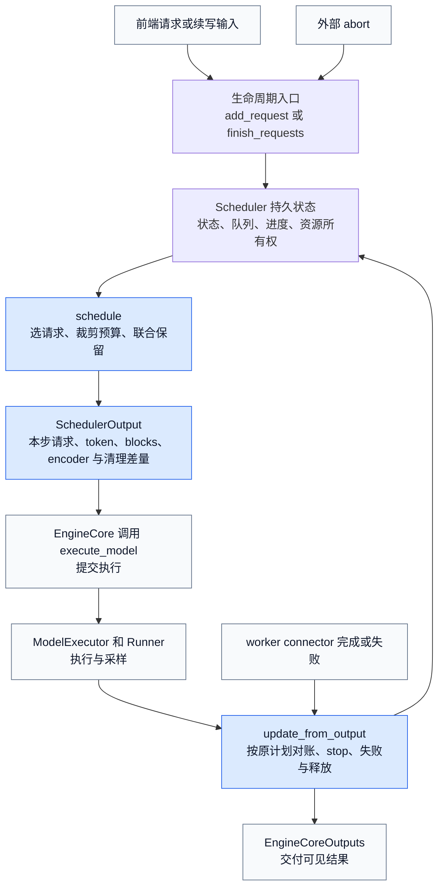

`EngineCore.step()` 依次调用 `schedule()`、`execute_model()` / 必要时的 `sample_tokens()` 和 `update_from_output()`；虽然 executor 提交使用 `non_block=True`，这个 Core step 仍会在 `future.result()` 等结果。开启 batch queue 时，Core 可在旧 future 返回前继续发新计划，再把 future 与当时的 `SchedulerOutput` 成对保存。四个边界不能合并：`schedule()` 返回意味着**计划已形成并乐观记账**；Core 调用 executor 才是**执行提交**；取得对应结果并 `update_from_output()` 后才是**结果对账**；connector 与执行 fence 满足后才是**资源回收**。返回 `EngineCoreOutputs` 是交给前端处理的边界，不等于客户端已经收到文本。

先把每轮计算闭环压缩为七组功能；暂停、缓存维护与服务观测等外围职责在下一小节接入这条主线。

| 功能 | 要解决的问题 | 设计与实现入口 | 产出的可观察变化 |
|---|---|---|---|
| 请求生命周期 | 新请求、续写会话与外部终止怎样进入同一状态空间 | `add_request()` 建立/续接请求；`finish_requests()` 从队列移除并进入统一释放 | `requests`、waiting 队列、终态与 `finished_req_ids` 改变 |
| 就绪性管理 | grammar、remote KV、streaming 输入未就绪时，怎样不阻塞所有后来请求 | `_enqueue_waiting_request()` 将 blocked 请求放入 skipped；`_try_promote_blocked_waiting_request()` 按外部完成信号恢复 | blocked 状态在 skipped 中等待，ready 后回到 `WAITING` 或 `PREEMPTED` |
| 每步选择与预算 | 已运行请求和新请求谁能在本步计算多少位置 | `schedule()` 先扫 running，再在无抢占时准入 waiting；统一用 computed 追赶 known/spec/placeholder 目标 | `num_scheduled_tokens`、new/resumed/cached request 差量形成 |
| 联合资源保留 | token 数可行时，slot、KV、encoder、LoRA 和 lookahead 是否也同时可行 | `_try_schedule_encoder_inputs()`、`_reserve_prefill_lookahead()` 与 `allocate_slots()` 共同裁剪/落实 | 只有联合成功的请求进入本步 maps；异步 KV load 是只持块、不执行的例外 |
| 抢占与显式撤回 | KV 不足时怎样回收容量，又不让已撤销工作残留在本步计划 | `schedule()` 选择 victim；`_preempt_request()` 重置进度并释放资源，同时撤回 victim 已登记的预算和 maps | victim 变 `PREEMPTED`、回 waiting，worker 收到 reset id |
| 计划发布 | runner 需要的首次数据、缓存差量、块与 connector 操作怎样冻结在同一步 | `SchedulerOutput` 构造后，`_update_after_schedule()` 乐观推进 computed/in-flight | 后续可继续发 step，但必须保留原计划用于结果对账 |
| 结果对账与完成 | spec rejection、stale、load failure、stop 和延迟释放怎样各走正确分支 | `update_from_output()`、`_update_request_with_output()`、`_free_request()` 与 deferred-free fence | token 恰好交付一次；终态、对象删除和物理块回池分别发生 |

这张表也给出本页边界：调度策略只决定候选顺序和 victim，不单独保证公平；KV block/hash/refcount 算法见 08，Engine future 与设备完成见 06/11/12，采样和投机正确性见 14/16。Scheduler 在这些模块之间维护控制一致性，但不替它们证明数据面正确。

### 1.1 从一次计算到持续服务，Scheduler 还要保证什么

假设服务正在给 A 生成答案，B 带着长 prompt 到达，随后 A 的用户断开连接。模型能继续算 token，并不意味着服务会正确处理这三个事件：B 需要排队并在容量允许时加入，A 需要停止占用后续计算，已经发出的 A 的结果要安全收尾。**Scheduler 将跨轮存活的请求、每轮有限的资源和陆续返回的结果放在同一套状态里管理。** 下表按服务需求核对职责；其中“基础”是普通持续生成也需要的能力，“条件”表示启用相应服务功能后才需要，不意味着每次推理都经过这些分支。

| 服务需求 | Scheduler 必须完成的动作与缺失后果 | 本页解释位置 / 适用条件 |
|---|---|---|
| 请求不断到达，完成时间各不相同 | 登记请求身份、维护 waiting/running；每步让存量继续、为新请求补位。否则只能等整批结束，或丢失跨轮上下文 | 第 2～4 节；基础 |
| 有限容量下服务长短请求 | 合并 token、slot、KV 等约束；长 prompt 分块；KV 不足时抢占并安排恢复。只有排队顺序无法兑现内存容量 | 第 4～7 节；基础容量控制，chunking/策略按配置选择 |
| 连续返回答案并准确结束 | 对照原计划确认有效结果，追加 token、检查停止，产生请求级增量与结束原因；下一轮读取更新后的状态 | 第 8 节；基础 |
| 用户取消、断连，且计算已经在途 | 接收 Core 转来的终止信号，移出队列；迟到结果不能复活请求，资源仍按执行/传输完成条件回收 | 第 3.1、8.3～8.4 节；基础 |
| 同一批请求来自不同前端 | 按 request id 找结果、按 `client_index` 分组交还 Core；支持没有新 token 的结束通知，避免前端一直等 | 第 8.5 节；基础请求归属，多前端按部署启用 |
| 部分请求等待依赖或发生可处理错误 | 跳过未就绪项，继续检查其它候选；grammar 失败按请求结束，坏 KV 按受影响请求恢复或报错 | 第 3、7、8.3 节；结构化输出、remote KV、EC 按功能启用 |
| 多段输入继续同一个会话 | 接续已有请求，区分本段 stop 与会话终态，并把保留的会话 slot 纳入准入计数 | 第 3.1 节；resumable 流式输入，区别于普通流式输出 |
| 维护时暂停、恢复或清缓存 | 执行 Core 设置的准入/计算门控，维护缓存失效与重算状态；不能让旧结果、旧缓存混入恢复后的工作 | 第 3.2 节；运维与在线更新路径 |
| 用户已结束，后台仍有清理/传输 | 报告仍有待办工作，使 Core 继续送出 finished 差量并接收 connector 完成信号 | 第 3.3、8.4 节；基础清理，传输按配置启用 |
| 服务需要定位排队与资源压力 | 汇集队列、KV、prefix、抢占/调度事件及执行侧统计，交给前端度量链路；不能只看模型耗时解释服务延迟 | 第 8.6、9 节；统计和事件发布按配置启用 |

这些是 Scheduler 在 **EngineCore 内**承担的部分。HTTP 鉴权、参数校验与 tokenization、跨 Engine 路由、文本解码/SSE、设备执行和进程故障恢复各有自己的所有者，见 [[03_vllm_request_semantics_analysis|请求语义]]、[[13_vllm_serving_control_plane_analysis|Serving 控制面]] 和 [[23_vllm_observability_reliability_analysis|可观测性与可靠性]]。尤其是慢客户端的网络背压和任意 GPU 故障恢复，不能从 Scheduler 的 token budget 或请求级 ERROR 分支推出。

## 2. 一步只能算 6 个 token，先给谁

设每步 token budget 和 input budget 都为 6，最多 3 个 running 请求；开启 chunked prefill，关闭长 prefill 限额，无 spec、媒体或 prefix hit，KV 足够。R 已在 decode：已知 21 个 token、算过 20 个，差 1 个；P、Q 按顺序等待，prompt 分别长 10、3。本例先用 `policy="fcfs"`、同步结果反馈，每步结果返回后再排下一步，R 在这三步内不结束。

| step | 先扫描 running | 剩余预算如何准入 waiting | 发出计划 | 结果返回后的变化 |
|---|---|---|---|---|
| 1 | R 得 1，预算 6→5 | P 要 10，只取 5，预算归零；Q 留 waiting | R:1，P:5 | R 多一个输出；P 只完成前 5 个 prompt token，无采样输出 |
| 2 | R 得 1；P 已是 running，取剩余 5 | 预算用完，Q 继续等 | R:1，P:5 | P 完成 prompt，得到第一个输出 token |
| 3 | R、P 各差 1，预算 6→4 | Q 取 3，预算剩 1 | R:1，P:1，Q:3 | Q 完成 prompt，得到第一个输出；无需为了凑满预算再造工作 |

这里“发出 5 个 token”是计算 5 个输入位置，不是向用户交付 5 个新 token。`num_computed_tokens` 在形成计划时已经推进，表中“结果返回”才确定采样输出。若不开 chunked prefill，等待中的长请求放不下会停止本轮 waiting 扫描；不能从本例推成“总会越过长请求，让后面的短请求先走”。`test_schedule_order` 用 800/800/10/10 的请求和 1024 预算验证了这个差别。

<!-- 图2 spec：输入是 R 差1、P差10、Q差3和预算6；沿一次 schedule 的实际顺序显示6→5→0，输出R1/P5和仍waiting的Q；矩形依次表示准入动作与结果对账，非时间比例图。 -->
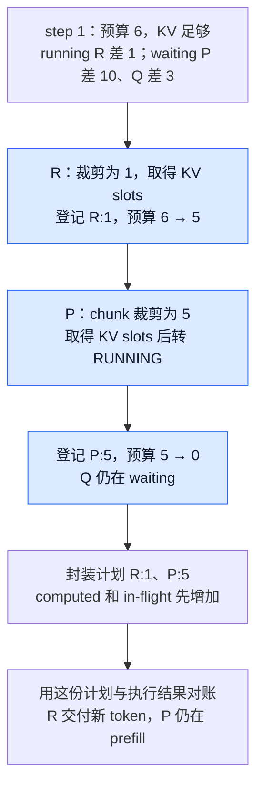

这就是连续调度的基本单位：**每步重新分配要计算的位置数**。固定成员、等整个 batch 全部完成才换人的方案，无法在下一个 step 立即把空出的机会给新请求；这是从当前 running-first / waiting-admission 控制流重建的设计理由，不是源码中的历史决策记录。源码明确采用统一进度模型，不为 prefill 和 decode 建两套调度阶段；chunked prefill、prefix hit、spec validation 都是在追赶同一请求的目标进度。

但“每步重排”也把 Scheduler 放进延迟关键路径。token 数、可驻留 request slot、KV blocks 分别受限；多发 token 可能拉长一步，多占 KV 可能引发重算，多接纳请求也不等于降低排队时间。后文沿本例逐项加入这些限制。

更准确地说，Scheduler 不求解“在预算内让请求数量最大”的全局装箱问题，也不枚举不同请求组合寻找最优解。它按 running-first 和 waiting policy 给出的顺序逐个处理请求，为当前请求裁出 token 数并尝试落实联合资源，直到预算或硬约束耗尽。一个长 prefill 可以占满整步，也可以经 chunking 与多个 decode 混排；最终进入 batch 的请求数只是这种有序贪心填充的结果，不是独立优化目标。

### 2.1 先分清两条选择轴，再改变主例

上例固定了队列策略和结果反馈方式，它们不是同一个开关。枚举依据来自 `SchedulerConfig.get_scheduler_cls()` 与 `SchedulingPolicy` / `create_request_queue()`，而不是根据类名猜测：

| 选择轴 | 源码怎样选择 | 改变什么、不改变什么 |
|---|---|---|
| Scheduler 实现 | 未指定 `scheduler_cls` 时，解析后的 `async_scheduling` 为真选 `AsyncScheduler`，否则选 `Scheduler` | async 增加 placeholders 与结果确认规则；仍复用同一个联合资源调度主循环 |
| 队列策略 | `policy` 接受 `fcfs` 或 `priority`，分别构造 deque 队列或优先级堆 | 改变 waiting 候选和抢占 victim；不把整个 running 列表每步重新排序 |
| 自定义扩展 | `scheduler_cls` 可直接给类或限定名称，覆盖内置选择 | 源码警告接口非稳定公开契约；本页只证明两个内置实现，自定义调度由扩展作者负责 |

`async_scheduling=None` 还不是最终选择：`VllmConfig.__post_init__()` 会结合 executor 支持、spec 方法与兼容条件解析。pooling 默认关闭 async；不兼容 spec 方法、禁用 padded drafter batch 或 ROCm DeepEP high-throughput DBO 等组合会使自动选择关闭，显式强开不兼容组合则报错。spec 允许集合由 `EagleModelTypes`、`NgramGPUTypes` 及 `draft_model` / `dspark` 分支枚举，具体算法由 16 页负责。另一条容易混淆的执行轴是 Core 的 batch queue：它由 `max_concurrent_batches > 1` 创建，PP 也可能需要；“有 batch queue”不等于“必定选了 AsyncScheduler”。

现在只改变第一步的队列策略：仍是 R 差 1、P prompt 10、Q prompt 3、预算 6，P 比 Q 早到，但 P 的 priority=5、Q=0。R 已在 running，所以两种策略都先给 R 一个位置；差别从 waiting 的下一个候选开始。

<!-- 策略对照图 spec：同一R/P/Q输入，FCFS按P先到得R1/P5，priority按Q优先得R1/Q3/P2；两路都展示预算6→5→0，输出已确认前缀与首token，保持running-first不变量。 -->
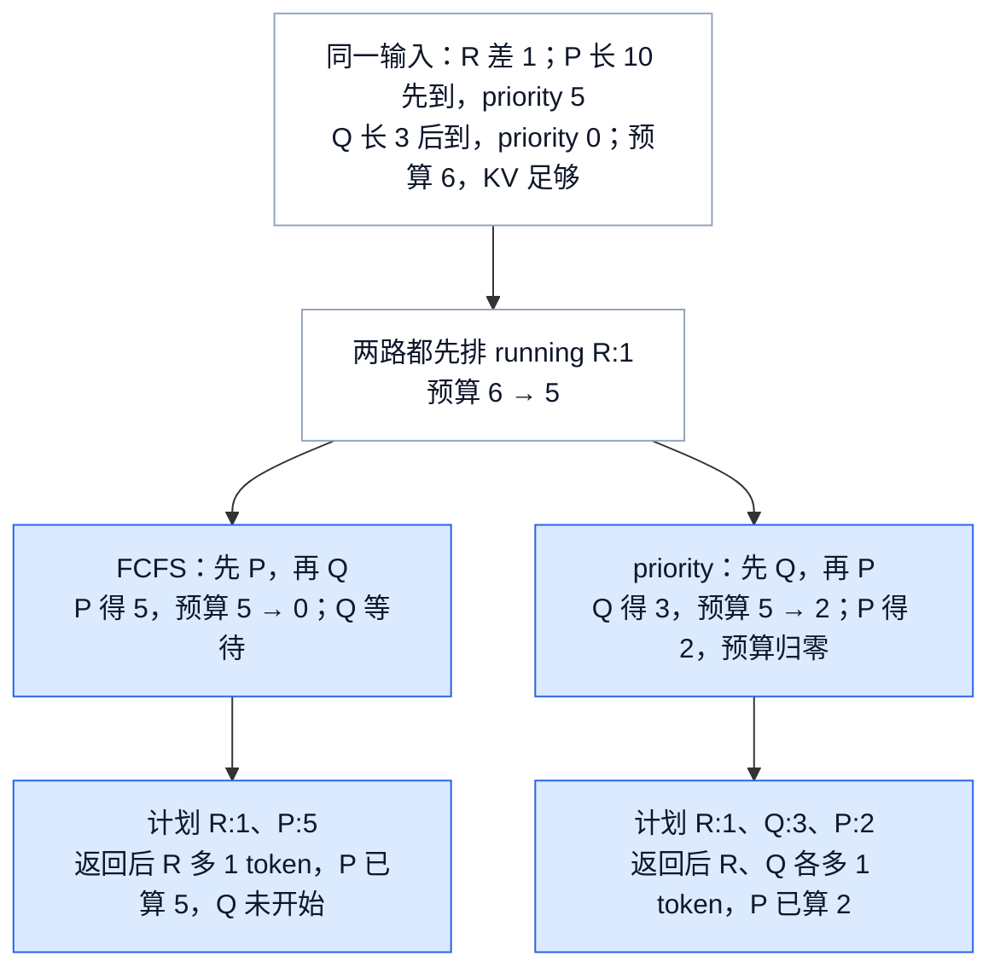

FCFS 用到达顺序提供简单的先来先处理基准；priority 则允许业务重要性覆盖到达顺序。本例 Q 的首次输出提前，代价是 P 本步少算 3 个位置，而不是凭空多出吞吐。**分析推断**：如果约束是优先保障高等级请求，纯到达序无法表达它；如果约束是避免低等级请求长期受挤压，静态 priority 也不能代替 aging 或配额。当前实现没有由这条策略自动给出的无饥饿保证。

策略还作用于普通与 skipped 两个 waiting 队列之间：FCFS 先尝试 skipped，再尝试普通 waiting；priority 比较两队头部，选排序更靠前者。依赖未就绪的请求本轮会移走，因而不会卡在同一头部无限重试。将被抢占请求“prepend”回去也遵循此差别：只有 FCFS 真正插到队首，priority 仍按堆序入队。第 6 节会用相同容量例比较两个 victim；第 8 节再固定策略，只改变同步/异步反馈。

### 2.2 放回系统：谁持有状态，谁兑现计划

一个 step 的输入输出确定后，还要知道这些对象属于谁。Core 在 KV 初始化之后选择并创建 Scheduler；Scheduler 持有请求、队列与进度，KV/encoder manager 落实各自资源，executor/runner 消费计划。Scheduler 不直接把数据送到 GPU，也不拥有前端文本拼接。

<!-- 所有权图 spec：Core持有Scheduler和future-plan配对；Scheduler拥有请求队列计数，依赖KV/encoder/grammar/connector；executor与前端作为消费边界，箭头标交接对象，不代表直接函数调用。 -->
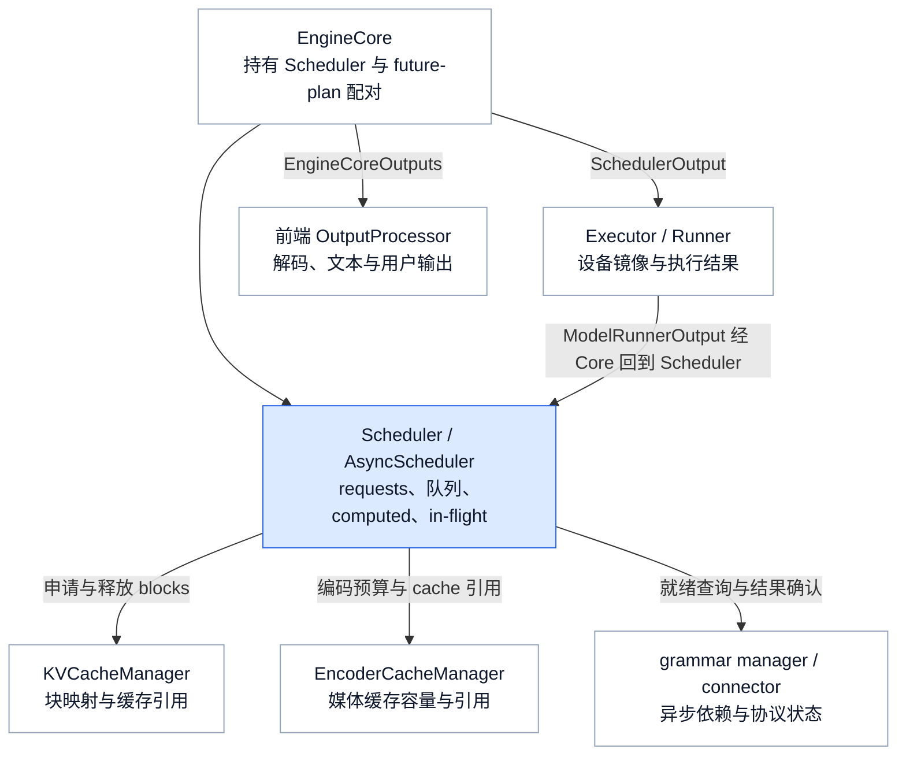

这层分工让容量决策集中在一个 step 中，而不必让各 worker 独立争抢请求；代价是 Scheduler 处于每步 CPU 关键路径，并要维护下游镜像所需的差量。这里的理由是对责任边界的分析推断，不是源码历史决策记录。第 10 节提供从构造到结果交付的真实调用树；现在先打开 Scheduler 自己持有的状态。

## 3. 请求状态机：每个状态里 Scheduler 实际做什么

`RequestStatus` 回答“请求处在生命周期哪一段”，但不能单独回答“下一步能否执行”。Scheduler 真正判断的是一个组合状态：**枚举值 + 所在队列 + computed/in-flight/stale 进度 + KV/encoder 所有权 + connector/fence 完成信号**。同为 `WAITING`，新请求可能没有块，remote KV 刚完成的请求却可能已经持有并缓存了块；同为终态，对象和物理块也可能尚未删除。

先逐个看非终态。表中的“占 slot”指 `max_num_seqs` 对应的 model-runner request slot，不是本步一定有执行行。

| `RequestStatus` | 怎样进入 | Scheduler 在该状态做什么 | 队列与资源语义 | 怎样离开 |
|---|---|---|---|---|
| `WAITING` | 普通新请求；grammar 或首次 remote KV ready；续写输入到达 | 作为可准入候选，检查策略顺序、slot、LoRA、prefix、token/input、encoder 与 KV；失败按原因选择 skip 或停止扫描 | 通常在 `waiting`；不占 running slot，但可因已完成 remote load 而持有 blocks | 联合保留成功后设 `RUNNING`；异步 KV load 启动后设 `WAITING_FOR_REMOTE_KVS`；abort/error 进终态 |
| `WAITING_FOR_STRUCTURED_OUTPUT_GRAMMAR` | `Request` 创建时发现结构化输出请求 | `_try_promote_blocked_waiting_request()` 轮询 grammar 对象；未就绪继续跳过，异常登记为 request-level error | 在 `skipped_waiting`，不进入本步 token/KV 计划 | grammar 可用后设 `WAITING`；编译异常在结果更新尾部统一设 `FINISHED_ERROR` |
| `WAITING_FOR_REMOTE_KVS` | waiting 或 preempted 请求已为外部 KV load 分配 blocks | 本步不执行 token；等待 worker connector 的 finished/failed 信号。ready 后缓存有效块，失败时截到有效前缀或释放 | 在 `skipped_waiting`；**可能持有 blocks 和 prefill 容量保留**，但不进 `running`，也不扣本步执行预算 | 首次请求回 `WAITING`，有过抢占的请求回 `PREEMPTED`；load fail 可转重算或 `FINISHED_ERROR` |
| `WAITING_FOR_STREAMING_REQ` | resumable 请求当前输入段触发 stop，且暂时没有下一段输入 | 保留会话对象，拒绝把它当普通 waiting 准入；`add_request()` 收到同 id 更新时调用 `_update_request_as_session()` 拼接新输入 | 在 `skipped_waiting`；不在 `running`，但 `num_waiting_for_streaming_input` 仍计入 slot 上限 | 新输入到达后设 `WAITING`；结束 sentinel 或外部 abort 进终态 |
| `RUNNING` | waiting/preempted 请求联合保留成功 | 每步先扫描：计算待追赶位置，逐项裁剪预算，申请新增 KV，登记本步 maps；候选为零时可跳过它继续扫后续请求 | 在 `running` 并占 slot，通常持有 KV/encoder 状态；是否当步执行只看 `num_scheduled_tokens` | KV 不足且被选为 victim 时设 `PREEMPTED`；stop/error/abort 进完成路径；未结束则留在 `RUNNING` |
| `PREEMPTED` | 只有 `RUNNING` 可由 `_preempt_request()` 进入 | computed 归零、清 draft/placeholders、标记 stale 份额和 reset id；等待重新查 prefix、补资源并重算 | 从 `running` 移除、KV/encoder 引用释放，按策略重入 `waiting`（FCFS 队首、priority 堆序）；旧 step 的结果仍可能在途 | stale 排空后通常再准入；drop 模式允许同一步恢复但丢弃旧结果；也可被 abort 或被 stale stop 终止 |

终态不是一个枚举，而是六个原因。`RequestStatus.is_finished()` 的实现是 `status > PREEMPTED`，所以新增终态必须保持这个枚举顺序契约。

| 终态 | 本基线中的触发/含义 | 对外 finish reason 与处理 |
|---|---|---|
| `FINISHED_STOPPED` | EOS、stop token；pooling 得到结果；encoder-only 完整消费 prompt | `STOP`；resumable 请求可能先捕获本段 stop reason，随后立即复位到 `WAITING`，并不最终释放 |
| `FINISHED_LENGTH_CAPPED` | 已达模型长度或请求 `max_tokens` | `LENGTH`；先经 `_handle_stopped_request()` 判断可续，真正结束才 `_free_request()` |
| `FINISHED_ABORTED` | 客户端断开、Core 关闭或 streaming session 明确结束等外部终止 | `ABORT`；`finish_requests()` 先从当前队列移除再释放 |
| `FINISHED_IGNORED` | 枚举注释保留给 prompt 超过长度上限的忽略语义；本基线 V1 Scheduler 没有写入该状态的生产路径 | 映射为 `LENGTH`；不能据枚举存在声称当前 Scheduler 会产生它 |
| `FINISHED_ERROR` | grammar 编译/推进失败，或配置为 fail 的 KV load failure | `ERROR`；不再参与准入并统一释放。编译/load fail 产生空 token 输出；grammar 推进失败的结果仍可能携带本轮 token |
| `FINISHED_REPETITION` | 满足 `min_tokens` 后命中配置的序列重复检测 | `REPETITION`，并记录 `repetition_detected` |

还有一个容易误读的接口细节：`WAITING_FOR_STREAMING_REQ` 虽然不是终态，`get_finished_reason()` 仍把它映射为 `STOP`，用于表达“当前输入段已停止”。**对外 finish reason 与内部 `is_finished()` 不是同一判定。**

<!-- 图3 spec：输入是新请求；主路径展示三个blocked等待、联合准入、KV抢占重置、可续会话和完成释放；状态内写Scheduler动作，边写触发信号；任意非终态的abort/error终止边由旁注合并，避免重复连线掩盖主路径；不把skipped队列误画为enum。 -->
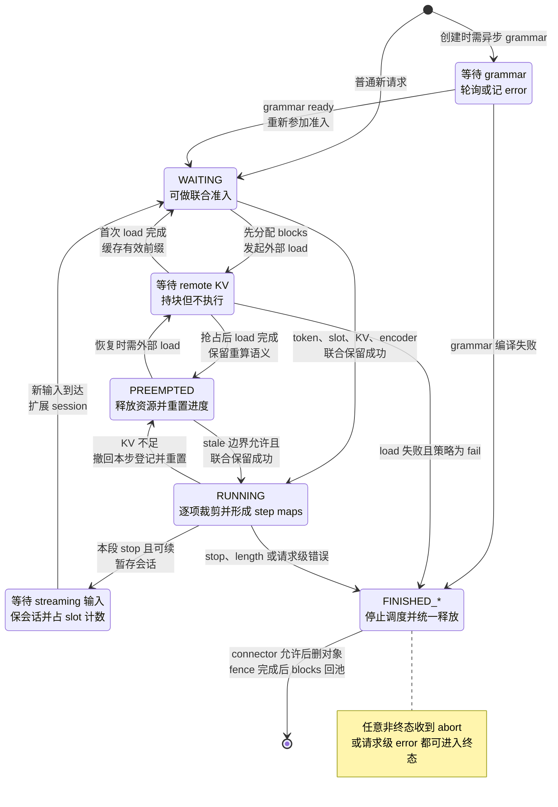

支撑这个组合状态的是以下持久字段和每步差量：

| 状态载体 | 用途 | 不能混同的边界 |
|---|---|---|
| `requests` | request id 到 `Request` 的映射 | connector 延迟释放时，终态对象仍可能在映射中 |
| `waiting`、`skipped_waiting` | 可直接准入候选，以及等待依赖/本轮约束而跳过的请求 | 队列位置不是额外的 `RequestStatus`；blocked 不等于 finished |
| `running` | 已准入、占活跃 slot 的请求 | 不保证每步都执行；当步执行子集看 `num_scheduled_tokens` |
| `num_tokens_with_spec` | prompt + 已返回 output + 当前 draft 的长度 | draft 还没有通过验证 |
| `num_computed_tokens`、`num_in_flight_tokens` | 已提交进度，以及尚未返回的执行位置数 | computed 含乐观推进，不等于全部已确认的 KV |
| `num_output_placeholders`、`num_stale_output_tokens` | 预期输出数量，以及抢占前仍待排空的执行位置数 | 两者单位/消减规则不同，不能互相代替 |
| 本步 maps | 新 blocks、每请求 token 数、encoder 项、scheduled spec | 联合资源成功后才登记；异步 KV load 可只持 blocks 而不执行 |
| `finished_req_ids`、`reset_preempted_req_ids` | 下游清理旧请求镜像的生命周期增量 | 放进 output 后换新 set，不能原地 `clear()` 破坏旧计划 |

五条不变量贯穿后文：已发 token 总量不超上限；token/input budget 非负；running 数不超 slot 上限；发给 runner 的计划只能包含本步能执行的联合保留；返回结果必须按产生它的那份计划对账。源码在封装 output 前直接断言前几项。`running` 数可以大于当步 scheduled 请求数，因此不能拿整个 running 列表当作模型输入。

### 3.1 接入、取消和续接：请求身份怎样跨轮存活

普通新请求经 Core 交给 `add_request()`：Scheduler 将对象登记到 `requests`，按就绪状态放进 waiting 或 skipped 队列，并在启用时记录 QUEUED 事件、通知 KV connector。登记只意味着请求被跟踪，是否进入本轮模型计算还要经过第 4～7 节的准入。batch 会不断变化，跨轮找回同一请求依赖 request id，而非它上次在 batch 里的行号。

用户断连由前端检测并经 Core 转成 abort；Scheduler 的 `finish_requests()` 不监听网络。它忽略不存在或已终态的 id，对有效请求先移除队列，再标记终态并调用统一释放。普通 `EngineCore.step()` 在拿到模型结果后，先处理执行期间到达的 abort，再调用 `update_from_output()`。于是 A 虽然刚被模型算出新 token，返回时也不会再追加到已取消的请求；同批 B 仍可正常交付。取消停止后续调度，并不撤销已经提交的 GPU 写入，释放时仍要遵守第 8.4 节的完成条件。

**流式输入是另一种生命周期。** 普通流式输出只要求逐轮把生成结果交给前端；`resumable` 还允许同一个请求接收下一段输入。下一段提前到达时，`add_request()` 将 `StreamingUpdate` 放进已有会话的 `streaming_queue`；本段 stop 后 `_handle_stopped_request()` 消费队首更新，或转入 `WAITING_FOR_STREAMING_REQ`。下一段到达正在等待的会话时，则直接扩展会话并回到 `WAITING`。结束 sentinel 才表达输入流结束；任意重复 id 不能当成新请求覆盖已有对象。

这里的“接续”有具体的数据边界：`_update_request_as_session()` 保留前段中已经计算的输出作为新 prompt 的一部分，丢弃尚未计算的最后采样 token，清空本段 output 列表，然后追加新输入、调整媒体位置、更新 block hashes 与采样参数。等待输入的会话仍占 runner slot，因此准入用 `len(running) + num_waiting_for_streaming_input` 判断容量；否则新请求会挤占仍需保留的会话位置。这是当前流式输入实现的保留规则，不是所有对话 API 的通用会话记忆协议。

### 3.2 暂停、恢复与缓存失效：维护动作怎样进入调度

服务维护需要表达“停止接入下一批计算”或“暂停全部后续计算”，同时保留可恢复的请求状态。`set_pause_state()` 只改变调度门控，具体状态来自 `PauseState`；设备已经停稳、输出已排空等完成条件由 Core 协调，不能把 setter 返回当成维护操作完成。

| 状态 | `schedule()` 的行为 | `get_num_unfinished_requests()` 的口径 |
|---|---|---|
| `UNPAUSED` | 正常扫描 running 并准入 waiting | running + waiting + skipped，减去仅等待下一段输入的会话数 |
| `PAUSED_NEW` | 可继续安排 running，停止 waiting 准入 | 只返回 running 数，用于观察现有工作是否排空 |
| `PAUSED_ALL` | 本步 token budget 置零，不安排新的 token 计算 | 返回 0；不是请求对象和缓存已经清空 |

例如 A 已在 running、B 仍在 waiting：`PAUSED_NEW` 允许 A 继续，B 保留等待；`PAUSED_ALL` 使两者都不再获得新 token 工作。恢复到 `UNPAUSED` 后，两者仍按原有生命周期与容量规则参与调度。Core 的 `abort` 模式另外调用 `finish_requests()`，`keep` 使用全暂停，进程式 Engine 的 `wait` 允许存量排空；in-process Engine 明确拒绝 `wait`。完整暂停还要经过 Core 的设备同步，DP 共识和 future 完成见 [[13_vllm_serving_control_plane_analysis|Serving 暂停与恢复协议]]。

缓存重置同样是有条件的状态转换。`reset_prefix_cache()` 将重置交给 KV manager 并返回是否成功；要求 `reset_running_requests=True` 时，先逆序抢占 running、标记 drop-mode stale，再清除前步请求镜像记录，避免恢复时把旧执行误当成仍有效的连续计算。持有块的 remote-KV 等待请求仍可能使重置失败；该分支会抛出 `RuntimeError`，不能承诺强制重置总能成功。`reset_connector=True` 才同时请求 connector 清缓存，无 connector 时视为成功的空操作。

权重更新还可能使旧 encoder 输出失效：Scheduler 的 `reset_encoder_cache()` 清逻辑缓存，Core 再调用 executor 清设备侧缓存。更新与同步协议属于 [[25_vllm_weight_transfer_online_update_analysis|权重传输与在线更新]]；这里承担的是让调度视图与缓存失效保持一致。暂停期间保留请求/缓存会继续占资源，清缓存则可能引入恢复后的重算，两者是不同的维护代价。

### 3.3 “没有待生成 token”为什么仍不能让 Core 停下来

`get_num_unfinished_requests()` 服务于当前调度/暂停口径，不能代替“后台工作是否完成”。例如 A 已经返回终止原因，KV producer 却仍在发送它的 blocks；如果仅因 running 为空就停止驱动 Core，发送完成信号将没有机会进入 `update_from_output()`，资源也无法走完释放路径。

因此 `has_requests()` 除了看未完成请求，还检查 `has_finished_requests()` 以及 KV/EC connector 的 pending push work。`has_finished_requests()` 会看到尚待送往 worker 的 finished ids；有 KV connector 时，还会识别已经离开调度队列、仍因延迟清理留在 `requests` 的终态对象。Core 可据此继续执行没有 token 计算的控制步骤，送出镜像清理差量、接收传输完成通知。`test_delayed_kv_connector_free_keeps_scheduler_active` 就用空 token 计划与 `finished_sending` 验证该终态对象最终被删除。

仅等待下一段 streaming 输入的会话则从 unfinished 计数扣除：没有输入时不应持续触发生成工作，但它仍在请求映射与 slot 账上等待唤醒。**可调度工作、保留会话、待清理工作是不同的集合。** 这些本地查询供 Core 判断是否继续推进，跨 DP rank 的全局 idle 判定仍属于控制面。

## 4. 每步执行计划怎样形成：候选量、联合裁剪与资源落实

第 3 节解决的是“请求现在处于什么状态”，第 2 节则直接展示了 `R:1、P:5` 这样的最终计划；两者之间还缺少最关键的一段：**Scheduler 怎样把有资格参与的请求变成本步真正能执行的工作**。这正是 `schedule()` 的核心功能。它不是单独计算一个 token 上限，而是在一次调用里完成候选选择、数量裁剪、资源落实和计划冻结。

对单个请求而言，`num_new_tokens` 只是候选量，不能直接发给 runner。Scheduler 还要证明本步预算容得下、输入区间没有越过模型或缓存边界、encoder 工作可用，并且 KV slots 真正分配成功。只有这些条件联合成立，请求及其 token 数才会写入 `num_scheduled_tokens` 等本步 maps。换句话说，**状态机给出候选，联合调度把候选变成承诺，`SchedulerOutput` 保存这份承诺及其对账身份**。

### 4.1 一次 `schedule()` 的输入、输出和主流程

一次 `schedule()` 读取的是 Scheduler 的持久状态和当前资源视图，产出的是只属于当前 step 的执行计划：

| 阶段 | 读入什么 | 决定什么 | 结果流向 |
|---|---|---|---|
| 初始化 | token/input/encoder 预算、暂停与节流状态 | 本步最多还能接纳多少计算和输入 | 进入 running 扫描 |
| running-first | `RUNNING` 请求的 known/spec/placeholder 与 computed 进度 | 每个已驻留请求还差多少位置，本步最多批准多少 | KV 成功后登记；为零则继续下一个 |
| 资源落实 | KV、encoder、lookahead 与缓存边界 | 候选量是否真的可执行 | 成功写入 maps；失败进入抢占或停止 |
| waiting admission | `WAITING` / `PREEMPTED`、blocked 完成信号、slot 与 prefix hit | 哪些新请求或恢复请求可以入场 | 加入 running，或跳过/停止/等待 remote KV |
| 计划封装 | 本步 maps、new/resumed/reset/finished 差量 | runner 需要看到的本步 token 与资源计划 | 构造 `SchedulerOutput`，再乐观推进进度 |

<!-- 图4 spec：从第3节的状态与队列进入一次schedule；主路径依次展示初始化、RUNNING候选与有序裁剪、KV落实、无抢占时的WAITING准入、SchedulerOutput和乐观推进；零候选、KV失败抢占、blocked跳过、硬约束停止和异步KV只持块是辅助分支；箭头终点分别指向第5至第8节的详细解释。 -->
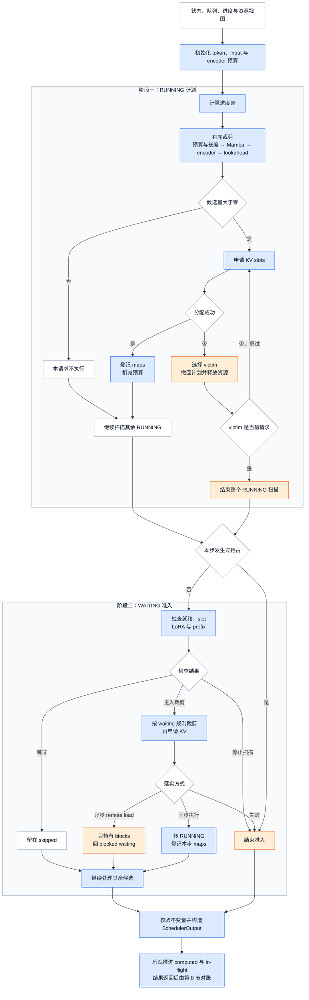

图中的两段扫描是同一次计划构造的两个阶段，但分支并不完全相同。running 和 waiting 都要回答“从哪里继续、最多算多少、资源能否落实”；running 已占 slot 并持有请求状态，waiting 则要先完成准入和 prefix 恢复，还可能为 uniform decode 补 spec 行。三个 blocked waiting 状态尚未就绪时不会进入 token 裁剪，它们在 waiting 扫描中被跳过，留给后续 step 再尝试。

### 4.2 RUNNING：从进度差得到候选量，再逐项缩小

running 请求先按

`num_tokens_with_spec + num_output_placeholders - num_computed_tokens`

得到还需追赶的位置数。随后按源码中的固定顺序应用长 prefill 上限、token/input 预算、模型长度、Mamba split、encoder 边界和 MTP prefill lookahead。这个顺序很重要：后一个约束只能继续缩小前一个结果，不能凭另一种资源尚有余额把 token 数加回来。各约束为什么存在、何时生效，由第 5 节逐项展开。

回到第 2 节 step 1：R 的候选量是 `21 - 20 = 1`，所有约束通过且 KV 可落实后，才登记 `R:1` 并把 token budget 从 6 扣到 5。P 此时还在 waiting，不会和 R 同时进入 running 扫描；它要等 running 阶段结束后再走准入分支。这样，第 2 节表格里的先后顺序就对应到了真实控制流，而不是抽象的“先来先服务”。

候选量被裁成零时，running 通常是 `continue` 而不是 `break`。原因可能是旧 step 仍在途、encoder 预算或 cache 不足、Mamba 对齐无法形成有效 chunk，或者 MTP lookahead 需要保留尾部窗口；这些都只说明当前请求本步不能推进，不代表后面的 running 请求也一定不能推进。这正是第 3 节所说的“处于 `RUNNING` 不等于当步一定执行”。

### 4.3 KV 是落实点：成功才登记，失败才进入抢占

经过裁剪的 `num_new_tokens` 仍只是逻辑计划。`KVCacheManager.allocate_slots()` 要把它落实为新增 blocks；成功后 Scheduler 才把请求写入 scheduled-running 列表、token/block/spec/encoder maps，并扣减预算。因此 `num_scheduled_tokens` 表示的是**已经通过联合资源检查的本步承诺**，不是初始需求量。

若 KV 分配失败，running 路径不会简单跳过当前请求，而是进入 victim 选择循环。被选中的请求如果已经在本步登记，就必须连同 token、blocks、spec、encoder 差量和预算一起撤回；当前请求才可以再次尝试分配。完整的抢占算例放在第 6 节，因为它解释的是图中“资源落实失败后怎样改写已经形成一半的计划”。

### 4.4 WAITING：只有 running 阶段稳定后才补充新请求

running 扫描结束后，只有本步没有发生抢占且 Scheduler 未暂停，才进入 waiting admission。这里先处理第 3 节的组合状态：依赖未就绪、可交付 stale 尚未排空、LoRA 或 connector 暂不可用时跳过当前请求；slot 用完、不可切分的工作超出预算、encoder/KV 容量无法落实时则停止这次扫描。随后再查本地/远端 prefix，从正确进度起点应用 waiting 路径的预算、spec padding、Mamba、encoder 与 lookahead 规则，再申请 KV。它与 running 共享约束概念，但候选起点、padding 和遇阻后的 `break` / `continue` 语义不同。

第 2 节的 P 正是在这个阶段得到候选量 10，再被剩余预算裁成 5；KV 成功后它才从 `WAITING` 变为 `RUNNING`，登记为 new request。Q 因预算已经归零留在 waiting，下一 step 再参加准入。异步 remote KV load 是一个需要单独标出的中间结果：它可以先持有 blocks，却不执行 token、不进入 running，也不扣本步执行预算；完成信号到达后才重新准入。第 7 节会展开这些 skip、break 和 remote-load 分支。

两段扫描结束后，Scheduler 检查 token/input 预算和 running slot 等不变量，计算共同前缀，封装 `SchedulerOutput`，最后由 `_update_after_schedule()` 乐观推进 computed 与 in-flight。至此，本节只完成了“计划已形成”，Core 尚须调用 executor 提交执行；结果是否接受、是否需要回退以及何时释放资源，要等第 8 节的结果对账。

后面的阅读顺序由这张主流程图决定：第 5 节放大“候选量怎样被约束链裁剪”，第 6 节处理 KV 失败后的抢占和撤回，第 7 节解释 waiting 准入，第 8 节再把已经提交的计划与执行结果闭环。它们不是新的并列主题，而是同一次 `schedule → execute → update` 路径上的连续阶段。

## 5. 约束分支：为什么候选 token 还会继续缩小

第 4 节先建立控制流，本节只放大图中的“按顺序裁剪”节点。基础预算和模型长度对所有请求生效；speculative、encoder 与 Mamba 则由模型能力和请求形态条件触发。它们最终都改写同一个 `num_new_tokens`，但约束的对象并不相同：

| 约束层 | 何时存在 | 防止什么问题 | 详细小节 |
|---|---|---|---|
| token/input、模型长度与 slot | 所有调度 step | 计划超出本步容量、runner 驻留量或合法位置范围 | 5.1 |
| speculative shape | 开启投机或 uniform decode padding | draft 超预算、prefill 混入 draft、query 行数不一致 | 5.2 |
| encoder 与 prefill lookahead | 多模态、encoder-decoder、EAGLE/MTP 等路径 | decoder 越过尚未准备的输入，或 drafter 失去完整预读窗口 | 5.3 |
| Mamba split/checkpoint | hybrid 模型且 Mamba cache mode 为 align | 把中间递归状态冒充成错误 token 边界的可复用状态 | 5.4 |

### 5.1 两种 token 预算和 request slot

每轮 `token_budget = max_num_scheduled_tokens`，`input_budget = max_num_batched_tokens`。二者通常相等；模型会在执行中追加输入位置时，调度上限可以更小。若 speculative 配置要求 `draft_slots = max_num_new_slots_for_drafting`，每接纳一个请求，input budget 扣掉的是 `num_new_tokens + draft_slots`，token budget 只扣 `num_new_tokens`。例如 token budget 6、input budget 8、每请求 draft slots 2：第一个请求取 4 后，剩 token=2、input=2；第二个请求因 `input_budget <= draft_slots` 停止，即使还剩 token 预算也不能入场。

running 的候选量按 `num_tokens_with_spec + num_output_placeholders - num_computed_tokens` 计算。随后按实际顺序处理：长 prefill threshold → token/input 剩余额度 → model length（留本步采样位置）→ Mamba split → encoder 边界 → MTP prefill lookahead。普通自回归每步采样位置数为 1，diffusion 为 0，不能把“总要再留一个 bonus token”当作所有模型的通则。

候选量为零时，running 循环通常 `continue`：可能前一步仍在途、已经到长度上限、encoder budget/cache 不足，或没有足够预算跨过对齐/预读边界；后面的请求仍可运行。源码明确指出这放松了严格 FCFS。V2 + PP + async 还检查 `next_decode_eligible_step`，同一请求两次 decode 至少间隔 PP size 个调度 step；达到输出上限的 placeholder guard 则避免确定无用的额外一步。

这个 PP 节拍门槛由 Scheduler 自己维护：`AsyncScheduler._update_after_schedule()` 在非 partial-prefill 请求提交后，把 `next_decode_eligible_step` 设为 `current_step + pp_size`，后续 `schedule()` 用同步递增的 step 编号判断资格。PP last stage 的采样与 sampled-token slot 广播是 worker 侧的数据流，并不会再广播一个“允许下次 decode”的开关；两侧依靠相同的流水线槽位节拍配合，控制路径并不相同。设备侧广播和 slot ring 见 11/12。

waiting 除 token 外还检查 `len(running) + num_waiting_for_streaming_input`：暂停等输入的 streaming session 仍占 runner slot。`max_num_seqs` 是驻留/执行容量约束，前端 `max_num_queued_reqs/tokens` admission 是另一道入口限流，见 [[02_engineering/03_infer_frameworks/vllm/03_vllm_request_semantics_analysis|请求语义]]，两者不能替代。

### 5.2 speculative 也花预算，且 shape 不能随意截断

running 只将批准区间内的 draft 写入 `scheduled_spec_decode_tokens`，然后清空 request 的旧 draft，等 `update_draft_token_ids()` 或 async worker 更新。prefill chunk 不接收 draft：现有测试以 prompt 80、预算 50、draft 3 逐步验证 **50 → 30 → 1+3**；第二步是剩余 30 个 prompt 位置，不能混入 3 个 draft 而变成 33。投机的 propose/verify/accept 分布推导属于 [[02_engineering/03_infer_frameworks/vllm/16_vllm_speculative_decoding_analysis|投机解码]]。

另一个分支发生在 waiting 请求只差 1 个位置时，例如 33-token prompt 命中 32-token prefix。若已有 running decode 或命中进度非零，batch 尚无已排 prefill，使用固定 K 的自回归 spec，且模型长度与预算容得下，Scheduler 可将它补成 `1+K` 行并附 `[-1] * K`，保持 uniform decode，便于 full CUDA Graph。它不是已经产生了 K 个真实 draft。容量不足以保留整个 `1+K` 时，本轮先不准入；已有 prefill、dynamic K 或 diffusion 时不套这条 padding 规则。

**Mamba 对齐后的修正不同于预算不足。** 已补成 `1+3=4` 行的请求，若 split 裁到 1、2、3 中任何一个正数，最终都回退为 **1 行并清掉 padding 标志**，不附 spec placeholders。否则 sampler 按 draft 数推导的 row window 与实际 query 行数不一致；回归测试明确覆盖三个裁剪值。对齐直接得到零则本轮停止准入。动态 spec 在计划结尾按本步 scheduled request 数查询下一步 K；它是下一轮 draft 数选择，不能追溯改写本轮已批准区间。

### 5.3 encoder 预算决定 decoder 能走到哪里

在主例中加入一幅图：P 的媒体占位从位置 4 开始，需要 6 个 encoder embeddings，本步 encoder budget 只有 4，起点为 0、无预读 shift。即使 decoder 获得 5-token 候选区间，也只能取前 4 个文本位置。若下一步起点已在 4，encoder 仍不可用，就取零；running 跳过 P，继续尝试后面的请求。

`_try_schedule_encoder_inputs()` 只检查本步 token 区间（含 drafter read-ahead）覆盖的媒体项，区分已缓存、同一步重复 hash、远端 EC cache 命中和新计算。新计算同时受 encoder compute budget 与 encoder cache 容量约束，通常整个媒体项一起编码；远端加载仍占 cache 容量但不扣本地编码 compute。`disable_chunked_mm_input` 还会把跨不完整媒体项的区间退到该项之前。encoder-decoder 在 decoder 进度为零时先保证 encoder 输入，已有 decoder 进度后不按普通 decoder 媒体占位重复处理。

旧例 `test_schedule_partial_requests` 仍很有区分力：3 个 800-token 请求、媒体区间从 100 起长 600、token/encoder budget 各 1024，第一步排 **800/100/100**；结果返回后第二步排 **1/700/0**。第三个请求还在 running，却没有本步执行项。这也说明“encoder 是 forward 前的附加工作”不够准确：它先裁剪整个调度区间。encoder/媒体算子的设备执行见 [[02_engineering/03_infer_frameworks/vllm/15_vllm_multimodal_execution_analysis|多模态执行]]。

EAGLE 类方法的 prefill lookahead 通常为 1；multi-module MTP 为 spec 数。这个 shift 同时影响 encoder 提前调度、延后释放与 chunk 末端：若 prompt 10、lookahead 3、候选先算 8，会只留下 2 个已知输入供下轮 drafter 预读，因此 `_reserve_prefill_lookahead()` 将本轮退到 7，留下完整 3 个。要么完成 prefill，要么留够预读窗口；不能让尾部 MTP 模块过早改读采样 draft 并污染其 KV。编码后的 cache 也要等已确认进度越过媒体末端加 lookahead 才释放，不能只看包含 placeholders 的乐观 computed。

### 5.4 Mamba split 保证缓存的是哪个位置的状态

Mamba `align` 模式保存的是某个确切 token 边界后的递归状态。可复用的完整块槽 p 必须代表计算完 `(p+1)*block_size` 个 token 的状态；把在 364 处结束的中间状态标成 state@1600，会让命中它的后续请求从错误状态恢复。普通 attention 的 token KV 与这种递归状态不能用同一“随便切一个 chunk”的假设。

这里的 `align` 约束的是哪些历史边界可以发布为可复用的 state/checkpoint，不表示每生成一个 decode token 都分配并永久保存一份新 state。decode 通常在请求当前持有的运行状态上继续更新，跨状态块边界时才可能分配、复制或轮换 block；释放也通常是把 block 归还 vLLM block pool，不等于立即归还 CUDA allocation。Scheduler 本节只决定可安全结束和复用的位置，具体 state block 的引用、轮换与回池归 08 页。

`_mamba_block_aligned_split()` 先合并已有进度、本地命中、外部命中得到 start，只在 prefill/重放旧输出期间裁剪。中间 chunk 向块边界对齐；若物理块大于整个配置允许的 chunk，允许先以私有 running state 小步前进，再停在下一个边界。还有几个必须检查的提前停止点：从块中部恢复后的下一个整块边界、最后可缓存块边界、细粒度 prefix hit 所需的 prompt 最后 hash 边界、按块向下对齐的 shared-prefix 分叉点。不能把所有情况简写为“永远按 block_size 向下取整”。

<!-- 图5 spec：两个具体query分别重放共用checkpoint校验；1984→3602的initial/checkpoint列均1因而拒绝，0→100的列为-1/0且满足hash与16对齐因而可导出96；明确输入、算式、判定与下一步，不是二维KV布局。 -->
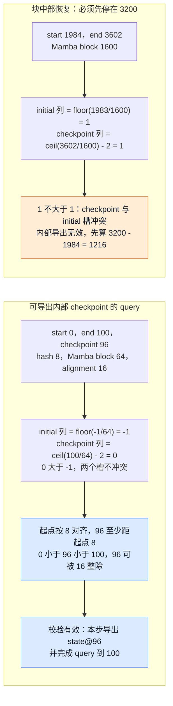

图例来自 `test_partial_checkpoint_resume_stops_at_mamba_block_boundary`：prompt=3602、start=1984、block=1600，先算 `3200-1984=1216`。即使启用内部 checkpoint，该位置对应的 checkpoint 列会与 initial-state 列冲突，仍不能跨过 3200。相反，支持导出 checkpoint 的 backend 可在最后一次 prefill 内同时保存中间状态，免去某些额外切分；这必须通过共用 `is_mamba_prefill_checkpoint_valid()`：起点 hash 对齐、checkpoint 严格在 query 内、离起点至少一个 hash block、相对起点满足 backend alignment，而且 checkpoint 列必须在 initial-state 列之后。

例如测试中的 start=0、end=100、hash=8、Mamba block=64、alignment=16：checkpoint=96 有效，88 因不满足相对起点 16 对齐而无效；alignment 未声明也无效。Kimi K3 KDA metadata 构建实际使用 **该层 `kv_cache_spec.block_size`** 计算 checkpoint 列，并调用同一校验器；不能拿全局配置块大小替代所有层。Scheduler 当前选择第一个 Mamba spec 的 checkpoint alignment，源码仍有“不同 Mamba spec 对齐要求”的支持 TODO；此处不推成任意混合后端均已支持。

新基线还分开 `use_eagle` 与 `use_eagle_block_drop`：前者决定 hidden-state drafter / 预读语义，后者才决定丢弃易变的尾部 prefix block，并传给 KV manager 与 split/checkpoint 计算。禁用 block drop 不会同时关闭 EAGLE。测试用 prompt=3602、block=1600、无内部 checkpoint，开启 drop 首次停在 1600，关闭则停在 3200。块分配与 checkpoint 的物理保存、partial-tail hash/CoW 仍由 08 页展开。

## 6. 抢占与回滚：KV 不够时怎样撤回已选请求

这是第 4 节主流程图中“KV 分配失败”的展开。第 5 节的约束链只负责把候选量缩到逻辑上可行；真正申请 blocks 时仍可能发现全局 KV 容量不足，此时 Scheduler 必须在当前 step 内改写已经形成的部分计划。

running 请求的 token 区间算好后，`allocate_slots()` 尝试落实逻辑 KV。失败会从 running 选 victim：FCFS 从列表尾部取；priority 按 `(priority, arrival_time)` 最大者取，数值越大优先级越低，同优先级晚到者先被选。priority 排序主要决定等待队列与 victim，不能假定 running 列表每轮都重新全排序。

若 victim 恰好已经在本步更早登记，必须从 scheduled running、token map、new block map、spec map 删除它，退回 `restored_tokens` 的 token budget、`restored_tokens + draft_slots` 的 input budget，并退回其本步已排 encoder embeddings 的 compute budget。移除列表前方 victim 时还要调小扫描游标，避免漏掉下一个请求。随后释放 victim 的 KV/encoder 引用，改成 PREEMPTED、computed 归零、清空 draft 与 placeholders，按当前策略重新插回 waiting（FCFS 放队首，priority 按优先级与到达时间入堆），累计 preemption 并发出 reset id；继续尝试为当前请求分配，直到成功或当前请求自己也成为 victim。

现有 priority 测试给出可重放的容量例：block_size=16，总 6 块含 1 个 null，实际可用 5 块。低优先级 L 的 32-token prompt 先占 2 块，输出后下一步扩成 3 块；随后高优先级 H 的 32-token prompt 占 2 块，正好用完。再下一步先选中的 L 尚在这 3 块内，H 则需要第 3 块：此时抢占 L，**撤销刚登记的 L:1**，归还预算与 L 的 3 块，H 才能继续。最终计划里不能同时有“执行 L”与“L 的旧 KV 已释放”。

<!-- 图6 spec：同一L/H容量输入分FCFS和priority；FCFS自抢占H后结束running，保留L1、free2；priority撤销L1、退预算并释放L3块，再给H1，free同为2但重算者相反。 -->
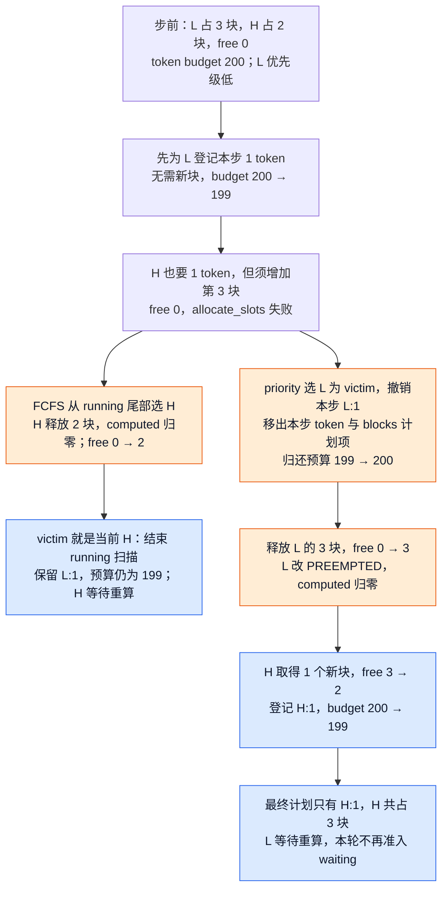

这段可以用“本步预留—撤回—提交”理解，但源码并没有把它正式称为事务，也没有通用的异常回滚系统。不是任意阶段异常都能自动恢复所有资源：它实现的是这些确定分支中的显式撤回。普通同步可运行请求只有 KV 成功后才扣预算、进入 scheduled maps；waiting 的 KV 分配失败还会撤销 encoder cache manager 的临时 touch 并停止准入。

本轮一旦发生 preemption，就不再接纳 waiting 新请求。**分析推断**：这避免在刚为已有工作回收容量的同一步又引入新竞争者；源码有 guard，没有写这条理由。暂停全部时 token budget 为零；非完全暂停但不允许新请求时也不进入 waiting admission。

抢占不是把 KV swap 到 CPU 保存。V1 设计文档明确移除了 swapped preemption 与 `--swap-space`，改用 prefix caching 加 recompute：恢复时重查可用前缀，再计算缺失部分。computed 归零意味着重新建立有效进度，未必意味着所有历史 token 都要从零做前向，但重算绝不是免费暂停。

同一个 L/H 快照若改成 FCFS，running 顺序仍为 L、H，队尾 victim 就是当前 H：释放 H 的 2 块、H 进 PREEMPTED，L 已登记的 1 token 保留。此时 `new_blocks is None`，源码结束整个 running 循环，不再尝试后面的请求，且发生抢占后不进入 waiting。两路最后都空出 2 块，却让不同请求承担重算：priority 保 H，FCFS 保较早运行的 L。第 4 节图中的“当前 victim”因此必须连向结束扫描，而不是普通零候选的 continue。

## 7. Waiting admission：就绪、slot 与容量同时满足才入场

第 6 节发生过抢占时，本轮控制流直接跳过 waiting admission；只有 running 阶段没有抢占且 Scheduler 未暂停，才会进入第 4 节主流程图的这条分支，用剩余预算补充新请求或恢复请求。

waiting 扫描先在普通与 skipped 队列中按策略挑候选。grammar 尚未就绪、remote KV 尚未完成、streaming 输入未到的请求继续跳过；grammar 编译异常进入 request-level error 路径。新的 LoRA 会超出本步 `max_loras`、connector 暂不能确定命中数、EC 预取尚未就绪，也会移到本步 skipped 队列再尝试其它请求；pass 末按队列策略重入 skipped：FCFS 放前部，priority 按堆序重插。相反，slot 耗尽、等待长请求的不可切分区间放不下、KV 分配失败会停止这次 waiting 扫描。**跳过与停止不是同一策略。**

`scheduled_loras` 限制的是本步不同 adapter 的数量，不是带 LoRA 的请求数量。running 扫描结束后，Scheduler 从本步实际选中的 `scheduled_running_reqs` 收集正数 `lora_int_id`；waiting 请求成功准入后再把它的 id 加入集合。多个请求复用同一个 LoRA 不增加 adapter 名额；只有候选引入集合中尚不存在的新 id、且集合已经达到 `max_loras` 时才跳过。这里是 `continue` 而不是 `break`，因为后面的请求可能不使用 LoRA，或复用集合中已有的 LoRA，仍可加入本步 batch。

真正可准入的候选先查本地 prefix，再查 connector 的外部 prefix，确定从哪里继续；重启/重放时使用整个 `request.num_tokens`，不仅是原 prompt 长度。接着裁剪 token/encoder、计算 lookahead/cross-attention slots，再调用 KV allocation。成功后才从队列弹出、加入 running、按 WAITING/PREEMPTED 分别标 new/resumed、记 scheduled maps、扣预算并写回 computed 起点。

这里还有一道“本步放得下”之外的前瞻准入门槛：`SchedulerConfig.scheduler_reserve_full_isl` 默认 true，waiting 分支将它传成 `allocate_slots(full_sequence_must_fit=...)`。KV manager 先估计整个已知输入序列的块需求（考虑 prefix 与窗口等），不足就返回 None；通过后才按本步 chunk 与 lookahead 实际分配。**检查完整序列能否容纳，不等于现在就把完整序列的块全部分配，更不包含尚未生成的全部未来输出。** 恢复请求使用 `request.num_tokens`，所以也会包含已知的历史输出。

以普通 full-attention、block size=16、无 prefix/lookahead、watermark=0 为例：waiting 请求有 48 个输入位置，本步只批准 16，池里剩 2 个可用块。只看本步需要 1 块似乎能执行，但完整输入需 3 块，默认准入检查拒绝；关闭该选项时才能先分配 1 块开始计算。后者提高了当下入场机会，也可能在后续 chunk 扩展时触发抢占。源码配置说明将防止 chunked prefill 过度准入与 cache thrashing 作为前者的目的；它不是对所有未来 decode 或所有并发请求的绝对容量保证。

`SchedulerConfig.watermark` 默认 0，开启后给 waiting/preempted 准入留出额外空闲块余量。当前调用传入的是 `has_scheduled_reqs=bool(self.running)`：只要 running 非空，即使其中某些请求本步没排 token，也会应用余量。比如本次需 2 块、余量要求 2 块、实际 free=3，就会拒绝；running 为空时不加这道余量，避免单靠水位让空闲引擎始终无法启动请求。running 扩展不受这道 admission watermark 限制。它与完整序列检查、异步 load 的 `reserved_blocks` 是三个不同条件：分别保护空闲余量、单请求完整输入可容纳性、其它在途 prefill 的后续空间。

这说明 Scheduler 的联合成功不只是“token 数合法并拿到了当前 chunk 的块”：还包含被启用的前瞻容量策略。allocator 如何计算共享、窗口和异构组的块需求仍由 08 页负责；本页需要保留的是传参条件、失败后停止 waiting 扫描，以及机会利用率与后续重算之间的取舍。

本地与远端 prefix 不是无条件相加。Connector 接收的是按 block 对齐后的本地命中，并返回在这个基线之后还能提供的连续 token 数 `ext_tokens`。返回 `None` 表示命中长度尚不能确定，Scheduler 把请求放入本步 skipped，稍后重查；返回 `0` 则是已经确定没有额外远端命中，请求可以直接沿本地 prefix 或重算路径继续，不需要等待。Connector 只需报告当前确实可加载的最长连续 prompt prefix，并不要求命中完整 prompt。

例如 block size 为 16、本地命中 38 个 token，则 connector 看到的对齐基线是 32，本地 partial tail 长 6。若 `ext_tokens=4`，远端只能把总进度推进到 36；若 `ext_tokens=6`，也只与本地 38 打平，这两种情况都保留完整的本地命中并把 `num_external_computed_tokens` 置零。只有 `ext_tokens=8` 这类严格超过 partial tail 的结果，才会把本地命中截回 32，并令 `num_external_computed_tokens=8`，从远端恢复到 40。严格更长才切换，可以避免同时采用本地 partial block、又让远端传输覆盖相关位置而引入 CoW 和写入竞争。因此 `num_external_computed_tokens` 表示相对对齐基线采用的外部增量，不是整个请求的远端总长度。

异步 KV load 是这个顺序中的明确例外：它先**只保留传输需要的 blocks**，本轮新执行 token=0，spec lookahead slots 留待以后分配；分配时考虑其它 in-flight prefill 尚需的容量，避免无法抢占的 load 把后续完成空间占尽。allocation 成功后从队列取出，却转为 `WAITING_FOR_REMOTE_KVS` 放回 skipped，写入预计命中进度并直接继续扫描：不进入 running，不写 scheduled-token map，不扣本轮执行预算。这个 computed 值在 transfer ready 前不能当作已加载成功的 KV。

worker 报告接收完成后才缓存有效前缀、promote 为 WAITING 或 PREEMPTED，并重新参加准入。全 prompt 命中仍留最后一个 token 重算以取得 logits。需要清零的新块若正被异步 load 覆写，本步跳过 zeroing，避免两条写入互相竞争；加载失败后只保留有效前缀，其余部分重新计算前补回清零要求。传输协议细节见 [[02_engineering/03_infer_frameworks/vllm/22_vllm_disaggregated_kv_serving_analysis|分离式 KV Serving]]。

DP prefill balancing 可让 Core 在非 cadence-aligned step 传入 `throttle_prefills`。Scheduler 只有在当前存在需要保护的 decode、且 `prefill_capacity_bound` 为 false 时才真正形成 `defer_prefills`：running 中尚未完成的 prefill chunk 暂停，waiting 的本地 prefill 延后，decode 继续。没有 decode 工作可保护时仍允许 prefill，避免白跑 dummy；它并非简单的“每隔固定 N 步才能处理 prompt”。

`prefill_capacity_bound` 是这个节流策略的逃生阀。在一次允许 prefill 的 step 结束时，如果普通 `waiting` 队列仍未清空，Scheduler 将它置为 true，表示本次开放机会已经受 token、slot、KV 等容量约束而无法消化 backlog。下一次即使处在非对齐 step，`throttle_prefills and not prefill_capacity_bound` 也不成立，prefill 会继续获得计算机会；否则持续只在少数 cadence step 放行，服务能力可能低于请求到达速率，waiting 会不断堆积并推高 TTFT。后续开放步骤能够清空普通 waiting 后，该标志回到 false，非对齐 step 才重新保护 decode。Core 的全局 unfinished 同步是另一机制：当前基线在 step 1 及 `dp_sync_interval` 倍数同步，调用与 wave 完成见 [[02_engineering/03_infer_frameworks/vllm/06_vllm_engine_architecture_analysis|Engine 架构]]。

无论请求原来来自 running 还是 waiting，只要联合保留成功，最后都会汇入同一组本步 maps。到这里 Scheduler 已经回答“本步执行什么”，但还没有回答“执行结果是否与原计划一致”；下一节从 `SchedulerOutput` 开始完成闭环。

## 8. 计划发布与结果对账：进度怎样变成事实

**一次请求会经历很多轮计算。每轮结果回来后，Scheduler 都要判断哪些结果有效、请求该继续还是结束，以及哪些资源可以释放；`update_from_output()` 负责这一轮的结果处理。** 第 4～7 节回答“本轮安排什么”，这里接着回答“算完以后怎样推进服务”。

先看普通文本生成：用户输入“介绍一下北京”，第一轮计算完整 prompt 后得到第一个输出，后续轮次把新生成的 token 接入上下文继续计算，最终遇到 EOS 或长度上限。为便于理解，可以把输出读成“北京 → 是 → …… → EOS”；这些词只是示意，不代表真实 tokenizer 的单 token 边界。这里先假设无 chunking、spec、异步或 connector 延迟，后文再加入这些分支。

| 本轮角色 | 负责的问题 | 交给下一方的东西 |
|---|---|---|
| Scheduler 的 `schedule()` | 哪些请求计算、计算多少位置、使用哪些 KV blocks？ | 本轮 `SchedulerOutput` 计划；由 Core 交给执行器 |
| ModelExecutor / ModelRunner | 怎样执行这些计算并取得模型结果？ | `ModelRunnerOutput`，包括请求对应的 token 或其它结果 |
| Scheduler 的 `update_from_output()` | 结果还能用吗，如何更新请求，继续还是停止？ | 更新后的内部状态，以及交给 Core 上游的 `EngineCoreOutputs` |

**“模型算完”只是得到了结果，还没有完成请求状态的更新。** 普通生成每轮依次做三件事：

1. **确认有效进度。** 收到原计划与对应结果，扣除本轮在途份额；逐请求检查它是否仍存在、是否已经结束以及结果是否依赖失效 KV。按 request id 找到 runner 结果行，不能沿用调度队列的排列。正常无 spec 的路径保留调度时推进的 computed；有拒绝或失效时再按相应规则修正，而不是每次追加结果都把 computed 再加一遍。
2. **推进请求生命周期。** 将有效 token 逐个追加到请求，检查 EOS、长度等停止条件；同一返回块触发停止后，多余 token 被裁掉。结构化输出启用时推进 grammar。没有停止就保留请求供下一轮使用；停止则先保存本段 finish reason，再决定是真正结束，还是 resumable 会话接续/等待输入。
3. **输出并清理。** 真正结束时进入统一资源释放路径，随后按客户端归属汇总本轮有效 token、结束原因和所需附加结果；移除停止请求的旧队列成员，处理请求级错误、传输完成信号和统计。资源必须在各自完成条件满足后才可复用，不能只因看到了 EOS 就无条件回池。

这使函数形成两个方向的产物：**内部的请求进度、队列和资源状态供下一轮 `schedule()` 使用；外部的增量输出供前端解码并返回给用户。** 输出交还 Core 上游才到达本页的交付边界，客户端是否收到文本还取决于前端处理与传输。

<!-- 结果处理图 spec：输入为原计划与实际结果；先确认本轮完成，再进入逐请求处理。有效结果走进度确认、追加、停止判断；停止分真正结束与等待/续接。失效结果分忽略、有效前缀重算或错误结束，所有路径汇入全批收尾。输出分别指向前端消费与下一轮调度；仅主路径着蓝色，异常旁路用中性色。图展示处理阶段，不把请求级错误汇总误当作循环内直接调用。 -->
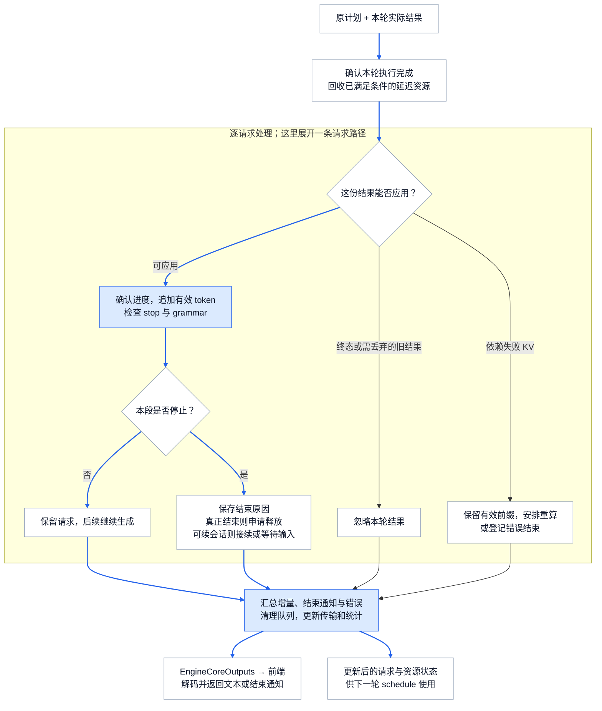

沿图读一次 EOS 轮：结果有效 → 追加并命中 stop → 保存结束原因 → 普通请求进入统一释放 → 本轮输出携带结束原因 → 下一轮不再调度它。沿普通未结束轮读，则在“保留请求”处分流，外部收到增量、内部保留继续计算所需状态。图中的“汇总”代表循环结束后的全批收尾，请求的 `EngineCoreOutput` 在循环中就会构造；它不是每个请求各调用一次整个收尾流程。

**为什么不能直接追加模型结果？** 发出任务到结果返回之间，用户可能取消请求，抢占可能重置它的进度，外部 KV 也可能报告加载失败；投机解码还有“安排了多个候选、只接受其中一部分”的差别。调度阶段又已经提前增加 `num_computed_tokens`，其中可能含尚在途的工作。因此所谓“结果对账”，就是把原计划、当前请求状态和实际有效结果重新对齐。具体异步计数、可交付 stale 与失败恢复分别见下面三节。

### 8.1 原计划与结果配对

`SchedulerOutput` 携带 new request 首次数据、cached request 差量、每请求 token 数、spec tokens、encoder 项、共同前缀、finished/reset ids，以及 connector metadata、待清零块与 CoW copy 工作。V2 把 resumed 请求并入 new 数据恢复完整 token 历史；V1 在 cached delta 标记 resume。KV connector 的精确 block snapshot 只供 Scheduler 构造 metadata，发往 worker 前会清掉。runner 的 compact/stable row 更新属于 11/12，本页不推断它们的设备布局。

output 先保留原始进度，随后 `_update_after_schedule()` 才增加 computed 和 in-flight。这使下一次 schedule 能立即排后续 prompt chunk；未来 spec rejection 再回退。routed-expert 返回还会先快照 block IDs，防止异步抢占后无法按原执行读取结果。EngineCore 负责保留这份计划并与对应 future FIFO 配对，详见 06 页。

这里“冻结计划”指保留本步数量、资源和结果配对身份，不是把整个 Python 对象设成不可变。deferred grammar 分支会在旧结果对账后调用 `update_draft_token_ids_in_output()`，过滤并补齐当步 spec token 内容，再生成 mask、提交采样。不能把这个受控更新误写成所有字段形成后都不再变化；也不能拿最新请求状态替代原计划中的执行数量。

`AsyncScheduler` 对非 partial-prefill 增加本步预期的 sampled + scheduled spec 数为 placeholders，设置下一轮 spec placeholder 列表；grammar 依赖尚未返回 token 时设置 pending 标志，由 Core 延后生成相应 mask/采样。它不是把未知 token 当作已知文本，而是给下一轮调度提供位置数量。新的 decode 资格 step、KV cache 可确认边界和输出上限 guard 都要使用这些计数。

以普通自回归的一次 spec 为例：已知 token 数 21、computed=20，draft=3，本轮排 4。提交后 computed=24、in-flight 加 4，async placeholders 加 4；假设结果为“接受 1 个 draft + 1 个采样 token”，则接受 draft 数=`2-1=1`、拒绝数=`3-1=2`。结果对账先把 in-flight 减 4，computed 回退到 22，placeholders 因 rejection 从 4 减到 2，再因交付 2 个 token 减到 0；已知 token 数变成 23，下一轮又差 1。若中间发生抢占，这些回退不能照搬，见下一小节。

### 8.2 同一个 decode 请求：等待结果还是先排下一步

现在回到第 2 节的 R，暂时不放入 P/Q，以隔离反馈方式的差别：R 已知 21 个 token、computed=20，PP=1，无 spec/grammar/connector，容量足够，输出上限至少还容纳两个 token。两路都要先算位置 20 得到 token x，再把 x 作为下一输入算位置 21 得到 y；异步并没有取消这个自回归依赖。设 x、y 都不触发 stop，以下只比较调度/对账，不声称不同后端随机采样必定产生相同 token 值。

用四元组 **已知 token 数 / computed / placeholders / in-flight** 记 Scheduler 状态，初值都是 `21 / 20 / 0 / 0`：

| 事件 | Scheduler，同步反馈 | AsyncScheduler，两步可在途 |
|---|---|---|
| 形成 S0，排 R:1；Core 随后提交 | `21 / 21 / 0 / 1`；没有 x，不能为 R 形成下一个 decode 工作 | `21 / 21 / 1 / 1`；预留一个尚未回到 CPU 的输出位置 |
| O0 尚未对账时 | Core 等 future；若只检查候选量，则 `21-21=0` | 可形成并提交 S1：候选 `21+1-21=1`，变为 `21 / 22 / 2 / 2` |
| S0 的结果 O0 返回 x | 对账变为 `22 / 21 / 0 / 0`，现在才能形成 S1 | 按 S0 扣 1 个 in-flight、追加 x、扣 1 个 placeholder，变为 `22 / 22 / 1 / 1` |
| S1 的结果 O1 返回 y | S1 先使 computed=22、in-flight=1，再对账为 `23 / 22 / 0 / 0` | 按 S1 对账后同为 `23 / 22 / 0 / 0`；下一步又差 1 |

<!-- 同步异步原理图 spec：同一R初值21/20/0/0；左路S0→O0→S1→O1，右路S0→S1→O0→O1；节点显示四个计数及待确认计划，汇合到23/22/0/0；不画比例时间或暗示GPU取消x→y依赖。 -->
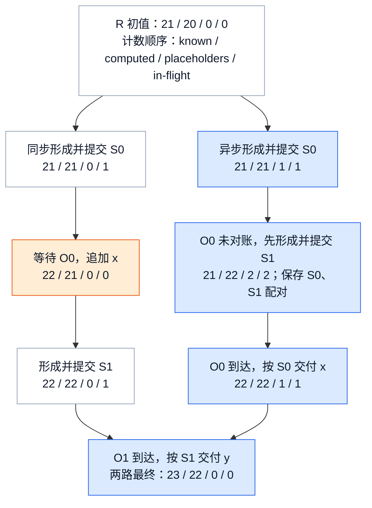

placeholder 只给 CPU 调度器一个**位置数量**，不是 x 的值。worker 必须按执行依赖把 S0 的采样值补到 S1 的输入；设备输入重建与同步由 11/12 页负责。Core 的队列保存 `future + SchedulerOutput + exec_future`，先入先出地取得结果；队列满时要等最旧结果。上表右路还假设执行侧实际允许两批在途，不是只创建 AsyncScheduler 就必然得到重叠。

同步路的优点是每次排 R 都有已确认 token，状态与错误处理较直接；代价是下一步 CPU 计划受 O0 返回约束。异步路把这段等待移出下一步计划的前置条件，可能减少 GPU 等待 CPU 的空隙，但增加在途计划、placeholder、KV 驻留和迟到结果的记账。**这是结构性成本与潜在收益推断，不是本机性能实测。** 上限来自 Core 的并发批数、runner 兼容性和联合资源；grammar 可能要求等旧 token 才能做 mask，PP decode 还受第 5.1 节的节拍门槛约束。

第 8.1 节的 spec 例也能按同一输入对照：known=21、computed=20、draft=3，S0 都排 4；接受 1 个 draft 加 1 个采样 token 后，两路都得到 known=23、computed=22。同步路没有输出 placeholders，只扣 in-flight 并回退拒绝的 2 个位置；异步路额外执行 placeholders 的 `4→2→0`。这解释了为什么结果对账不能只套“computed 加 token 数”。若两步之间发生抢占或无效 KV，旧状态已经改变，就必须进入下一节的异常分支。

### 8.3 三种迟到/失败结果，不能都叫“丢弃 stale”

`update_from_output()` 按传入计划的 `num_scheduled_tokens` 遍历，先减少仍存在请求的 in-flight 与 stale 份额，再检查是否受 KV load failure 影响、是否已删除/终态，最后通过 runner 的 `req_id_to_index` 取结果。队列位置不能当作结果行号；abort/finished 不会被旧结果重新激活。

| 返回结果类型 | token 是否交付 | 计数与后续动作 |
|---|---|---|
| 正常结果 | 交付实际接受 token | 回退 spec rejection，再扣 async placeholders；可推进 grammar 与 stop |
| 普通 KV 压力抢占前的 stale | 可交付，仍可触发 stop | computed/placeholders 已在 preempt 重置，不再扣 rejection 或交付数量；未排空前暂不恢复 |
| 特殊 drop-mode stale | 全部跳过 | 排空 in-flight/stale 份额；不给用户交付、不推进 grammar、不修改已重置进度 |
| KV load 失败影响的本步结果 | 跳过该结果 | 先截断到有效 prefix，再按 recompute/fail 策略恢复或终止 |
| 对象已删除或终态 | 忽略 | 不重新入队，不复活；对象可能仍因 connector 保留 |

普通 preempt 把 `num_stale_output_tokens` **赋值为**当前 in-flight，不累加，因为在途总量已经包含未排空的旧份额。waiting 看见可交付 stale 尚未排空就跳过该请求，避免恢复时重采同一个位置；结果仍按原序交付，保持 spec 接受行为。AsyncScheduler 仅在更新前状态仍为 RUNNING 时 cache 新确认的 blocks，PREEMPTED stale 不会提交到已释放的旧 KV。

`reset_prefix_cache` 需要同一步恢复，以及 connector `requires_kv_delivery` 的 KV hand-off 情况，使用 drop 模式：旧 KV 已不能支持这些 token 的交付语义，或相同位置已经重采，所以不交付旧结果。多次抢占时，尚未排空的 drop 份额仍保持 drop，不能改回可交付。现有 async 测试覆盖普通 KV 压力、重复 reset、PP 多步在途、producer/consumer 不同 hand-off 要求，并检查 token 恰好交付一次、无 placeholder 下溢、无位置重复采样。

<!-- 图7 spec：输入是原计划S和结果O；先排空本步in-flight，再区分失效KV、终态、drop stale、可交付stale和正常结果；只有正常分支回退已重置前不存在的计数，两个可交付分支汇合stop；负向分支输出明确。 -->
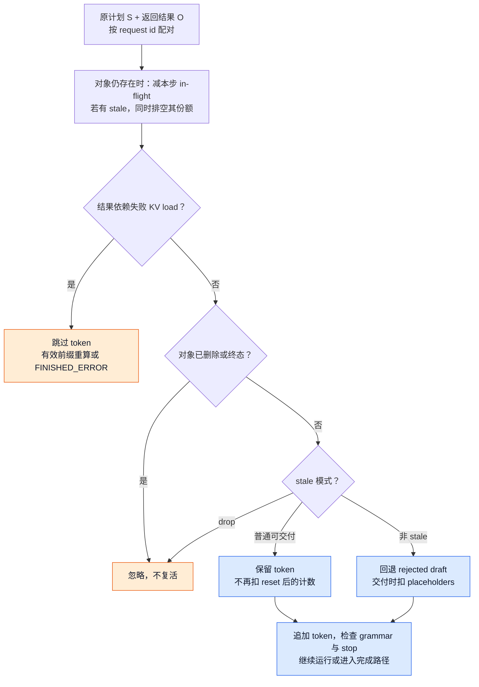

KV load failure 不是计算结果只“过时”：它依赖的数据无效。`_update_requests_with_invalid_blocks()` 先扣除本步乐观 scheduled 数，扫描可能含外部 KV 的 prefix，遇到首个坏块把 computed 截到该块起点。例如已加载前 99 块、首个坏块索引 50，就只承认前 50 块，不能把本步生成 token 交付。同步 recompute 保留请求 RUNNING 和已分配 blocks，重算坏块及后缀；共享坏块只标一份重算，其它依赖请求仍跳过本步结果。fail 策略驱逐坏块及依赖后缀的 cache 身份，并统一返回 `FINISHED_ERROR`。

异步 load 尚未缓存，recompute 把请求记入失败接收集合，等传输真正结束才缓存成功前缀并重新准入；一个有效位置也没有时释放原分配。当前 invalid-block 扫描直接解包单组 block IDs，源码留有 hybrid allocator 支持 TODO，因此不能把这套恢复规则宣称成任意 hybrid group 都已覆盖。对应测试分别验证同步保留 blocks、fail 驱逐污染 cache、异步不缓存坏块。

### 8.4 stop、终态和物理回收是不同完成点

实际输出逐 token 追加，按 EOS、stop token、模型长度/max tokens 的顺序检查，再经过 min_tokens 门槛判断配置的序列重复终止；触发后裁掉同一返回块里多余 token。pooling 有结果即停止；encoder-only 实例要消费完整 prompt 后才能结束，不能首个媒体项算完就结束。grammar 只推进真正需要约束的输出部分，拒绝实际 token 或编译失败走请求级 ERROR；文本 stop 字符串与协议 finish 的前端语义见 03，采样/grammar 算法见 [[02_engineering/03_infer_frameworks/vllm/14_vllm_sampling_structured_output_analysis|采样与结构化输出]]。部分 prefill 不产生用户采样输出，代码有相应断言。

结果确实执行后才 `_free_encoder_inputs()`；确认进度是 computed 减 placeholders，还须越过媒体末端与 drafter lookahead。对 encoder-decoder，decoder 已开始意味着 cross-attention KV 已缓存，可释放 encoder 输出。若 resumable 请求暂时结束，`_handle_stopped_request()` 会接续已排队的新输入或进入 WAITING_FOR_STREAMING_REQ；这时并非终态，不走最终释放。

外部 abort 的 `finish_requests()` 先移除 running/waiting/skipped 中有效请求，再设置终态并调用统一释放。`_free_request()` 通知 KV/EC connector、释放 encoder 引用、登记 finished ids；一般释放 blocks 并删除 request mapping。connector 要求 delay 时，对象已终止、不参与 admission，却仍驻留并持有 blocks，直到 receive/send 完成；producer 的 partial Mamba tail 还可能在 finalize/store 完成前继续保留，这个缓存细节归 08/22。

即使 connector 已允许 `_free_blocks()` 删除 request mapping，物理 blocks 仍可能等待执行 fence 才回池。该 defer gate 在当前生产路径是 **KV consumer connector 且 `max_concurrent_batches > 1`**，防止新 load 覆盖仍被旧 batch 写入的块，不是所有异步模式无条件延迟。`finished_req_ids` 用来让 worker 清镜像，不是“物理 blocks 已空闲”的证明；具体 Core 队列与 fence 时序已在 06 页重放。

### 8.5 增量结果怎样交还对应前端

模型的 batch 顺序、Scheduler 的请求遍历顺序和前端归属是三个不同问题。`req_id_to_index` 找到正确的模型结果；`request.client_index` 决定将它放入哪一份输出；`EngineCoreOutput.request_id` 让接收侧找到自己的请求。函数最终返回的是 `dict[int, EngineCoreOutputs]`，Core 才负责后续传输。若 A 属于客户端 0、B 属于客户端 1，同批得到两个 token，就分别进入 0、1 的结果包，而非把整个 batch 广播给两个前端。

“本轮没有新 token”也不能直接等同于“无需输出”。构造请求级结果的条件是 **有新 token、有 pooling 结果、或请求本轮停止**；普通 partial prefill 尚未产生采样结果时不交付请求输出。grammar 编译失败的请求甚至没有进入本轮 token 计划，也要在循环后的错误处理中通过 `finish_requests(..., FINISHED_ERROR)` 结束，再产生空 token 的错误输出，否则前端会一直等一个永远不会到来的生成结果。失败 KV 按 fail 策略也汇入这一处理；grammar 推进失败则在本次请求处理内设 ERROR。它们是有明确处理路径的请求级故障，不能推演成任意执行异常都能隔离恢复。

还有三种容易混淆的“完成信息”：

| 信息 | 给谁 / 解决什么问题 | 是否意味着物理 KV 已释放 |
|---|---|---|
| `EngineCoreOutput.finish_reason` / `stop_reason` | 前端知道本段输出为何结束；resumable 本段结束仍可保留会话 | 否 |
| `SchedulerOutput.finished_req_ids` | worker 清除持久 batch 中的旧请求镜像，下一次计划带出该差量 | 否 |
| `EngineCoreOutputs.finished_requests` | 启用 `include_finished_set` 时，按客户端返回真正结束的请求集合，供多 Engine 前端结束请求追踪 | 否 |

最后一项即使没有任何普通请求输出，也会单独构造结果包；因此取消或清理不能以“没有文本”为由吞掉结束通知。`DPLBAsyncMPClient.process_engine_outputs()` 消费该集合，移除 request→Engine 归属并扣减其在途计数，完整前端负载跟踪见 [[13_vllm_serving_control_plane_analysis|Serving 控制面]]。这是控制状态的收尾，与网络是否再次向已经断连的用户发送文本是两回事。

**附加结果随需求返回，不能覆盖普通生成主线。** sample logprobs 和 sampling mask 按最终保留下来的新 token 数切片，prompt logprobs、pooling 输出、prefill 统计、trace headers、KV/EC 传输参数按各自条件放入请求结果。这里组装已有结果，不执行采样算法或文本解码。

MoE 专家路由返回也是可选项：`ModelConfig.enable_return_routed_experts` 默认关闭。开启时，一个长 prompt 可以跨多轮计算，Scheduler 先用 `store_batch()` 按 KV slot 保存各轮路由；首次产生输出时，结合调度时保存的 block IDs 读取所需 prompt 范围，避免只返回最后一个 prefill chunk 的路由。后续输出再取本轮对应的路由段；spec 与普通 decode/re-prefill 的切片位置不同。必须先存本轮路由再读请求结果，否则恰好在本轮停止的请求会遗漏刚完成的数据。

路由数据在 batch 中连续排列，`routing_offsets` 按 **ModelRunner 的 `req_ids` 顺序**累加本轮执行长度，不能按 Scheduler 的字典顺序切片。这些路由记录描述已经计算的 token 位置；保存、切片和回传会增加 CPU 存储与复制成本，但不是普通生成所需的决策步骤。理解核心流程时可先略过，设备侧路由计算归模型与 Runner。

### 8.6 运行状态怎样进入服务观测链路

只收到 token 无法解释请求为什么等了很久：排队、被抢占、等待外部 KV 与模型执行慢对应不同状态。Scheduler 在请求进入/获调度/被抢占时记录事件，`update_from_output()` 通过 `take_events()` 随请求结果取走增量；可用时也在首次有效输出或停止时取走并完成 prefill 统计。事件提供生命周期观测点，前端统计器再形成 TTFT、ITL 等指标，定义见 [[23_vllm_observability_reliability_analysis|可观测性与可靠性]]。

`make_stats()` 在 `log_stats` 开启时汇集 running、waiting、skipped 数、KV 使用率、prefix 命中/淘汰、spec 接受等统计，并合入可用的 connector、CUDA Graph 与性能数据。每轮 SchedulerStats 只放进一份前端结果包，避免向每个客户端重复上报；没有请求输出时也可创建客户端 0 的空包承载统计。`test_scheduler_stats_route_to_existing_output_client` 验证已有客户端 1 输出时，统计直接附在它的包中，不额外制造客户端 0 包。

KV 缓存事件另走 publisher：Scheduler 收集 KV manager 与 connector 的事件，合成 `KVEventBatch` 后发布；这不是用户 token 输出。connector 输出还需先更新传输状态，再收集 Scheduler 侧统计。队列数、finished 通知、缓存事件由不同观察点产生，不能把一个统计包解释成前端、设备和所有 DP rank 的原子快照。采集、聚合和发布均有 CPU/传输代价，开关也不改变“有效结果才能推进请求”的要求。

## 9. 成本与可观察的边界

第 8 节把一次请求推进到结果交付和资源释放，现在可以把分散的局部代价合成整项特性的账。下表的容量/状态变化来自实现；延迟与吞吐影响属于**未实测的结构性分析**，不能把某个开关写成固定百分比的加速。

| 机制 | 得到什么 | 直接支付与系统影响 | 适用上限或失败边界 |
|---|---|---|---|
| 每步有序填充、FCFS / priority | 在 step 边界补充请求，用顺序表达服务策略 | 每步扫描 running 与 waiting、构造差量；priority 入/出堆、扫描 victim 另有 CPU 工作。改变顺序会重新分配等待时间 | 请求/依赖数增多会加重 CPU 关键路径；无全局装箱最优或无饥饿保证 |
| Chunked prefill | 长 prompt 可分步，与 decode 分享预算 | 长请求要跨更多 step；每步重复调度/metadata 工作。较大 chunk 提高本步 prefill 份额，却可能拉长其它请求的 token 间隔 | token/input、模型长度、encoder/Mamba 边界仍可让 chunk 为零；TTFT 与 ITL 不能同时仅靠增大 chunk 改善 |
| 完整输入检查与 watermark | 降低只放得下首 chunk 的过度准入与频繁抢占风险 | 多做容量估算、保留空闲余量；有空闲块也可能延后请求，短期占用率不是优化目标 | 不预分配全部未来 KV，也不保证未来 decode 永不抢占；空 running 不应用 admission watermark |
| Prefix / remote KV / encoder 复用 | 少重算已存在的输入或媒体 | 本地需查命中与管理引用；remote 需传输和持块等待；encoder 命中仍占 cache 容量 | 不就绪时 skip；失效 KV 重算或报错。网络协议与实际传输成本由 22 页负责，不能从 Scheduler 推出带宽收益 |
| KV 压力抢占 | 释放容量，使选定请求继续 | victim 已有计算可能需重复执行，另需清理/reset 镜像；prefix 可减少重算，但非免费暂停 | 当前 victim 被抢占则结束 running 扫描；本轮不再准入 waiting；deferred-free 时物理块也未必立刻可用 |
| Spec / encoder / MTP 配套约束 | 保证执行形状、媒体准备与 drafter 预读合法 | draft 消耗 input reserve/lookahead 容量；encoder 消耗计算与缓存；对齐或尾部预留可留下闲置 token 额度 | 接受率与采样正确性不由 Scheduler 证明；预算不足或形状不合法会裁剪、回退 padding 或暂缓 |
| Async 与完成 fence | 允许 CPU 提前排下一步，并避免旧 GPU 写覆盖新 load | 多份在途计划、占位/拒绝/stale 对账和额外 KV 驻留；队列满、grammar 或 PP 节拍仍需等待 | 并发批数和后端兼容性限制重叠；已结束对象/块可能继续驻留，不能按用户完成数估计空闲容量 |
| 增量交付、可选路由与服务观测 | 前端获得请求结果、完成通知及定位延迟的状态 | 每请求结果封装、按客户端分组、条件切片与事件聚合；MoE 返回另需保存跨轮路由 | 交还 Core 不等于网络送达；观测数据不是跨组件原子快照 |
| 暂停、缓存失效与后台收尾 | 维护时控制新工作、恢复状态，并完成终止后的传输清理 | 保留模式继续占有资源；清缓存可能重算；pending connector 工作继续消耗控制步骤 | Scheduler 门控不能代替 Core 设备同步；有持块的远端等待项时重置仍可失败 |

这些支付项不能简单相加成“每步固定开销”：例如本地 prefix 命中会减少重算，remote 命中则把一部分计算换成传输与驻留；async 隐藏的是一段等待，不是消除 CPU 决策或 GPU 自回归依赖。总体工作量取决于被检查的请求/媒体/块、撤回次数和在途计划数，运行包络取决于这些资源限制的交集。只提高 token budget，可能从 token 瓶颈转成 KV、encoder 或 CPU 瓶颈。

据此再看可观察的现象，下面是定位线索，不是性能因果证明：


| 现象或约束 | 机制上的原因/后果 | 不能直接推出 |
|---|---|---|
| waiting 与 queue time 上升 | 到达工作未被 admission 及时消化，可能受 token、slot、KV 或异步依赖限制 | 不能只归因于 kernel 变慢 |
| KV usage 接近满且 preemption 增长 | 容量回收进入运行路径，已有请求可能需要重算 | 不等于必须关闭 prefix cache |
| ITL 上升、队列却稳定 | step 工作量、执行或 CPU/GPU overlap 可能变化 | 单项指标不能定位 runner/kernel |
| 局部候选为零但后来请求执行 | running `continue`、blocked waiting skip 放松严格先来先服务 | 不承诺所有请求公平，也不保证无饥饿 |
| 本步剩余 token 仍有请求未入场 | input draft reserve、slot、LoRA、encoder、对齐或队首不可切分工作也能阻塞 | token 预算不是唯一容量 |
| spec / async 开启后状态复杂 | rejection、placeholder、stale 跨多个已发 step 对账 | 更多 overlap 不等于无同步或必然更快 |
| 某批回到 piecewise/eager | 当前 batch/backend 不满足 full graph 条件 | 不等于编译整体失效 |
| 用户结束但 blocks 未回池 | connector 与 in-flight fence 各有完成条件 | finished 状态不是物理回收完成 |

表中定位是分析推断。源码分别记录 running、waiting、skipped waiting、KV usage、preemption、TTFT、ITL 和排队时刻；这些指标需要一起解释，定义与排查见 [[02_engineering/03_infer_frameworks/vllm/23_vllm_observability_reliability_analysis|可观测性与可靠性]]。配置还拒绝 `max_num_batched_tokens < max_num_seqs`，以及关闭 chunked prefill 时 batch token 上限小于最大模型长度的组合，避免配置本身令长请求无从准入。

调度、分页、async 与 graph 不是必须同时开启的一组开关。它们可以独立配置或回退；共同参与时则要在同一 token 进度和容量边界保持一致：KV 不足改写当步计划，placeholder 改变未返回进度，graph dispatcher 按最终 batch 形状挑路径。本页能证明的是 Scheduler 在其逻辑资源视角内按这些规则形成计划与更新状态，不是 GPU 无故障、采样分布正确或 KV 永无碎片的保证；设备与 graph 能力另见 [[02_engineering/03_infer_frameworks/vllm/19_vllm_compilation_cudagraph_analysis|编译与 CUDA Graph]]。

## 10. 源码阅读路线

> [!contradiction] 本次源码复核纠正的旧表述
> 旧文将 `schedule()` 返回称为“执行已提交”，将所有 `prepend` 都解释为“放队首”，并在主图中把当前请求被抢占后的出口画成继续扫描。当前基线分别是：Core 随后才提交 executor、priority 按堆序重插、当前 victim 导致结束 running 扫描。以上按实际调用与队列实现修正，不是调度策略在本次改写时发生了版本变化。
> 旧终态表还将 ERROR 输出一律写成空 token、将 LENGTH 一律写成最终释放。本基线 grammar 推进失败仍可携带本轮 token；长度停止也先判断 resumable 是否继续，再决定最终释放。第 3、8 节据此区分停止原因、输出内容与会话终态。

下面用普通生成请求、无 connector 延迟、最终触发 stop 的路径连接真实调用点。树中同层节点按调用顺序排列；标为“条件”的分支不一定执行，`...` 只省略不改变此路径语义的细节。Core 持有 Scheduler；树中的 executor 是接口交接，worker 内部见 11/12，前端消费结果见 03/06。

```text
EngineCore.__init__
|-- _initialize_kv_caches
|-- scheduler_config.get_scheduler_cls -> Scheduler 或 AsyncScheduler
|-- Scheduler(...).__init__
|   |-- create_request_queue(policy) -> waiting、skipped_waiting
|   |-- ec_manager_config.get_encoder_cache_manager_obj
|   |-- manager_cls_obj.create_manager(...)  [默认按 encoder-decoder 选择类]
|   `-- KVCacheManager(...)
`-- 建立 batch_queue，并选择 step_fn

EngineCore.add_request
`-- scheduler.add_request
    `-- _enqueue_waiting_request -> 等待队列

EngineCore.step  [单步提交、等待、对账]
|-- scheduler.schedule
|   |-- _try_schedule_encoder_inputs / _reserve_prefill_lookahead  [条件]
|   |-- kv_cache_manager.allocate_slots
|   |-- 构造 SchedulerOutput S
|   `-- _update_after_schedule(S)  [async override 先调用父实现]
|-- model_executor.execute_model(S, non_block=True) -> future
|-- scheduler.get_grammar_bitmask(S)
|-- future.result()  [等待执行结果]
|-- model_executor.sample_tokens(...)  [执行结果为 None 时]
|-- _process_aborts_queue  [执行期间到达的 abort 先处理]
`-- scheduler.update_from_output(S, ModelRunnerOutput)
    |-- _update_request_with_output -> append_output_token_ids、check_stop
    |-- _handle_stopped_request  [stop；可能是可续会话而非最终结束]
    |-- _free_request  [最终结束]
    |   |-- _connector_finished、encoder_cache_manager.free
    |   `-- _free_blocks -> _free_request_blocks -> kv_cache_manager.free
    `-- 构造并返回 EngineCoreOutputs -> Core 返回给上游

EngineCore.step_with_batch_queue  [替代上面的 Core step，不是它的子调用]
|-- scheduler.schedule -> SchedulerOutput S
|-- model_executor.execute_model(S, non_block=True)
|-- scheduler.get_grammar_bitmask / model_executor.sample_tokens  [条件；可延后]
|-- batch_queue.appendleft(future, S, exec_future)
|-- batch_queue.pop -> future.result()  [取最旧配对；可能等待]
|-- _process_aborts_queue
`-- scheduler.update_from_output(S, ModelRunnerOutput) -> 同一对账/完成路径
```

最后一条队列路径是压缩后的同层调用顺序，deferred grammar 的追加采样与入队发生在旧结果对账之后，见第 8.1 节。connector 或 fence 延迟时，普通树中的直接 free 会改为保留对象或进入 deferred_frees；后续 `update_from_output()` 处理完成信号，并由 `_drain_deferred_frees()` 按已完成的 step 放行。这里的闭环终点是结果交给 Core 上游、以及资源在各自条件满足后可重用，不把提交、交付和回收当作一个事件。


以下均为本基线实际打开的定位符；测试只静态阅读，没有声称在本机运行通过。

1. 定位、构造、状态与计划：`vllm/config/vllm.py::VllmConfig.__post_init__`；`vllm/config/scheduler.py::SchedulerConfig.get_scheduler_cls`；`vllm/v1/engine/core.py::EngineCore.__init__`、`EngineCore.add_request`、`EngineCore.step`、`EngineCore.step_with_batch_queue`；`vllm/v1/request.py::Request`、`RequestStatus`；`vllm/v1/core/sched/output.py::SchedulerOutput`，区分配置解析、闭环调用、生命周期状态与每步 maps。
2. 从主例重放完整循环：`vllm/v1/core/sched/scheduler.py::Scheduler.__init__`、`Scheduler.schedule`、`Scheduler._select_waiting_queue_for_scheduling`；`vllm/v1/core/sched/request_queue.py::SchedulingPolicy`、`create_request_queue`、`FCFSRequestQueue`、`PriorityRequestQueue.prepend_request`；`tests/v1/core/test_scheduler.py::test_schedule_order`、`test_schedule_partial_requests`，核对两个队列策略、running-first、LoRA 集合与 break/continue。
3. 预算和配置前提：`vllm/config/scheduler.py::SchedulerConfig.verify_max_model_len`、`scheduler_reserve_full_isl`、`watermark`；`vllm/v1/core/kv_cache_manager.py::KVCacheManager.allocate_slots`；`tests/v1/core/test_prefix_caching.py::test_can_fit_full_sequence_full_attention_still_gates_oversized`；`vllm/config/speculative.py::SpeculativeConfig.use_eagle`、`SpeculativeConfig.use_eagle_block_drop`；`vllm/v1/engine/core.py::EngineCore._should_throttle_prefills`，区分本步预算、完整输入准入、容量余量、spec 能力与 DP prefill cadence。
4. encoder / MTP 边界：`vllm/v1/core/sched/scheduler.py::Scheduler._try_schedule_encoder_inputs`、`Scheduler._reserve_prefill_lookahead`、`Scheduler._free_encoder_inputs`，连读调度与回收 shift。
5. spec 行数：`tests/v1/core/test_scheduler.py::test_no_spec_tokens_scheduled_for_prefill_chunks`、`test_spec_decode_padding_first_decode_step`、`test_spec_decode_padding_dropped_when_recurrent_alignment_clips`，验证 50/30/4 与残缺 padding 的修正。
6. Mamba split 与共同校验：`vllm/v1/core/sched/scheduler.py::Scheduler._mamba_block_aligned_split`；`vllm/v1/kv_cache_interface.py::is_mamba_prefill_checkpoint_valid`、`get_mamba_prefill_checkpoint_position`；`tests/v1/core/test_mamba_align_chunk_split.py::test_partial_checkpoint_resume_stops_at_mamba_block_boundary`、`test_disabling_eagle_block_drop_keeps_the_trailing_cache_boundary`。
7. checkpoint 的另一侧：`vllm/models/kimi_k3/nvidia/kda_metadata.py::KimiK3KDAMetadataBuilder.build`；`vllm/v1/core/single_type_kv_cache_manager.py::MambaManager._needs_internal_checkpoint`，验证层 spec 块大小与 initial/checkpoint 槽限制。
8. 抢占与乐观推进：`vllm/v1/core/sched/scheduler.py::Scheduler._preempt_request`、`Scheduler._update_after_schedule`；`tests/v1/core/test_scheduler.py::test_priority_scheduling_preemption`；`docs/design/metrics.md` 的 Removed Metrics，确认 recompute 取代旧 swap。
9. 异步结果：`vllm/v1/core/sched/async_scheduler.py::AsyncScheduler._update_after_schedule`、`AsyncScheduler._update_request_with_output`；`vllm/v1/core/sched/scheduler.py::Scheduler.update_from_output`、`Scheduler.update_draft_token_ids_in_output`；`tests/v1/core/test_async_scheduler.py::test_stop_by_max_tokens` 及同文件的 KV-pressure、reset-prefix-cache 与 mid-handoff 测试；按 S0/S1 配对验证计数与受控 spec 内容更新。
10. 远端 KV：`vllm/distributed/kv_transfer/kv_connector/v1/base.py::KVConnectorBase_V1.get_num_new_matched_tokens`；`vllm/v1/core/sched/scheduler.py::Scheduler._update_requests_with_invalid_blocks`、`Scheduler._handle_invalid_blocks`、`Scheduler._update_waiting_for_remote_kv`、`Scheduler._try_promote_blocked_waiting_request`；`tests/v1/kv_connector/unit/test_invalid_blocks_correctness.py` 的 sync recompute/fail 与 async recompute 测试。
11. 生命周期与完成：`vllm/v1/core/sched/scheduler.py::Scheduler.add_request`、`Scheduler._update_request_as_session`、`Scheduler._handle_stopped_request`、`Scheduler.finish_requests`、`Scheduler._free_request`、`Scheduler._free_request_blocks`、`Scheduler._update_from_kv_xfer_finished`；`vllm/v1/core/sched/utils.py::check_stop`；`tests/v1/core/test_deferred_block_free.py`，与 06 页的完成时序对照。
12. 观察成本：`vllm/v1/metrics/stats.py::SchedulerStats`、`IterationStats.update_from_output`、`IterationStats.update_from_events`；配置/设备动态 graph 的前提接续 19、23 页。
13. 普通生成与前端交付：`vllm/v1/engine/core.py::EngineCore.step`、`EngineCore._process_aborts_queue` → `vllm/v1/core/sched/scheduler.py::Scheduler.update_from_output`、`Scheduler._update_request_with_output`、`Scheduler._handle_stopped_request`、`Scheduler._free_request`；`vllm/v1/engine/core_client.py::DPLBAsyncMPClient.process_engine_outputs`，核对按 id 取结果、按客户端封装、三种完成信息及前端在途计数收尾。
14. 没有 token 也要处理错误与清理：`tests/v1/core/test_scheduler.py::test_grammar_compile_error_finishes_only_request`、`test_delayed_kv_connector_free_keeps_scheduler_active`；`vllm/v1/core/sched/scheduler.py::Scheduler.get_num_unfinished_requests`、`Scheduler.has_finished_requests`、`Scheduler.has_requests`，核对空结果错误通知、终态对象保留和控制步骤的活性条件。
15. 暂停与维护：`vllm/v1/core/sched/scheduler.py::Scheduler.set_pause_state`、`Scheduler.schedule`、`Scheduler.reset_prefix_cache`、`Scheduler.reset_connector_cache`、`Scheduler.reset_encoder_cache`；`vllm/v1/engine/core.py::EngineCore.pause_scheduler`、`EngineCore.resume_scheduler`、`EngineCore._finish_pause`、`EngineCore._reset_caches`；`tests/v1/engine/test_engine_core.py::test_pause_synchronizes_device_before_cache_reset`、`tests/v1/core/test_scheduler.py::test_reset_connector_cache_no_connector_is_no_op_success`，区分门控、执行完成和缓存失效。
16. 输出附加数据与观测：`vllm/v1/core/sched/scheduler.py::Scheduler._update_after_schedule`、`Scheduler.update_from_output`、`Scheduler.make_stats`；`vllm/config/model.py::ModelConfig.enable_return_routed_experts`；`tests/v1/core/test_scheduler.py::test_scheduler_stats_route_to_existing_output_client`，核对路由存取顺序、结果切片、统计归属和 KV 事件发布。

## Related Pages

- [[02_engineering/03_infer_frameworks/vllm/02_vllm_architecture_overview_analysis|vLLM 架构概览]] — 把本页每步调度放回请求入口、资源控制与设备执行的完整路径。
- [[02_engineering/03_infer_frameworks/vllm/06_vllm_engine_architecture_analysis|vLLM Engine 架构]] — 解释谁提交计划、保存 future、按顺序回传结果，以及 Core 与前端的不同完成点。
- [[02_engineering/03_infer_frameworks/vllm/08_vllm_kv_cache_management_analysis|vLLM KV Cache 管理]] — 展开 `allocate_slots` 后面的 blocks、prefix cache、CoW 与延迟回收算法。
- [[02_engineering/03_infer_frameworks/vllm/11_vllm_model_runner_v1_analysis|Model Runner V1]] / [[02_engineering/03_infer_frameworks/vllm/12_vllm_model_runner_v2_analysis|Model Runner V2]] — 对照本页计划如何变成 compact/stable row 和设备输入，说明真正的异步执行约束。
- [[02_engineering/03_infer_frameworks/vllm/16_vllm_speculative_decoding_analysis|vLLM 投机解码]] — 深入本页只计算数量与回退的 draft/verify/accept 正确性。
- [[02_engineering/03_infer_frameworks/vllm/22_vllm_disaggregated_kv_serving_analysis|vLLM 分离式 KV Serving]] — 展开 remote-KV 等待、加载失败与 connector 延迟释放协议。
