# vLLM KV Cache 管理：请求怎样分块、共享前缀并安全归还容量

> **源码基线**：`vllm-project/vllm@199cb9b964822e59ab9b58d88e7be31eb419a2ae`（`main` 快照，2026-09-07 UTC）
> **主题**：从分页与共享原理走到建池、分配、执行交付和安全回收，再解释子模块数据交互及 partial、hybrid、CPU tier 扩展。
> **适用范围**：V1 单 Engine 的 BlockPool、prefix cache、hybrid group、partial CoW 与 native CPU tier；请求调度策略见 07，设备执行见 11/12，跨 Engine 传输见 22。
> **最近更新**：2026-09-16。补齐回收型准入上限、HMA 选择与 hash 合同、Mamba align 状态轮换、投机尾部缓存登记，以及 GPU profiling 到 KV 预算的启动闭环；保留原有分页、CoW、packing 与 CPU tier 内容。

## 1. 特性概览：把有限显存变成可增长、可共享的请求状态

自回归生成会反复读取已经处理过的 token 的 K/V；如果每步都重算历史，计算随上下文增长反复发生，而保存历史又会持续占用显存。服务端同时处理长短不一、结束时间未知的请求，还可能遇到重复前缀。KV Cache 管理因此不仅要“存下 K/V”，还要在有限容量中解决请求增长、跨请求复用和安全回收；否则计算省下来了，却可能被连续预留、重复保存或错误复用抵消。

vLLM 的基本方案是在请求的逻辑 token 位置与物理存储之间增加分块映射：请求持有逻辑 block table，池提供可复用的物理编号，prefix hash 识别内容，引用数保护正在使用的块。启动时先规划并申请 backing，运行时再按请求建立、共享和解除这些映射。不同层的历史保留方式不一致时，由 group manager 解释自己的状态，由 coordinator 统一命中边界和容量需求。

它与周边的分工是：**Scheduler 决定谁在本步计算多少 token；KV Cache 管理决定这些 token 的状态放在哪里、哪些旧状态还能复用；Runner 与 Attention Backend 把编号转成设备索引并实际读写。** KV Cache manager 返回分配成功，不等于 GPU 已写完 KV；请求结束，也不等于所有执行或传输引用都已释放。

| 目标 | 直接收益 | 必付成本或成立条件 |
|---|---|---|
| 分块增长 | 不必为请求预留连续的最大长度区域 | 尾块碎片、CPU 表项和设备间接寻址 |
| 前缀复用 | 相同语义前缀可以少算、共享物理内容 | hash 查询、引用维护；命中不免除容量占用 |
| 安全回收 | 已不再需要的状态重新服务其他请求 | 必须区分逻辑进度、实际执行进度和传输完成 |
| 混合状态统一管理 | 不同层型可从同一池领取适合自己的空间 | 分组、padding、共同恢复边界与兼容限制 |
| 本地 CPU tier | GPU 淘汰后仍可能保留可复用内容 | host 容量、双向复制与完成跟踪；不增加 GPU 池块数 |

下面先用两个普通请求建立分块与共享的直觉，再沿“建池 → 查找 → 分配 → 执行交付 → 释放”闭合基本流程；随后解释实现分工，最后才引入基本方案遇到的新约束。收益与成本是基于固定源码路径的结构分析，不是性能实测。

实现选择有几个独立维度：`get_kv_cache_coordinator()` 按缓存开关和 group 数选择无前缀缓存、单组或多组协调；group 内再按 spec registry 选择历史保留规则；启动期布局和 offload backend 还有各自分支。§4.5 给出这些选择点的完整定位，下面先沿启用缓存的单组普通路径学习，不能把它视为唯一实现。

## 2. 基本原理：同一物理块怎样服务两个请求

### 2.1 从 token 位置到物理块

本节先限定为单个 full-attention group、启用 prefix caching、没有投机和 offload；A 的前缀已计算并可复用后，B 才加入。group 是一组采用兼容缓存规则的层，它们共享一张请求逻辑表；这里暂时只看一个 group，字节容量留到建池阶段解释。


假设一个 group 的块容纳 4 个 token，请求 A 有 10 个 token。它需要 3 个块，但可以拿到物理编号 `[5, 2, 7]`：逻辑块 0、1、2 分别指向它们。token 位置 9 对应逻辑块 2、块内偏移 1，因此写入编号 7 的块内位置 1。若本例 manager 与 kernel 都采用 4-token 粒度，扁平 slot 就是 `7 × 4 + 1 = 29`。这些编号是教学用的某次池状态，不是从全新 pool 开始的分配次序。尾块仍有 2 个暂未使用的位置；分页减少连续预留，却不消除块内碎片。

此后 B 的前 8 个 token 与 A 相同，可以共享 `[5, 2]`，只为自己的尾部取新块 9。A 完成时，块 7 可以归还；块 5、2 仍有 B 使用，不能复用。B 也完成后，这两个块没有活跃引用，却仍可以保留 hash 供下个请求命中。**逻辑位置、物理编号、内容身份、活跃引用数回答的是四个不同问题。**

<!-- Figure spec: 三参与者顺序图重放 A10/B同前8、block4，展示共享块 ref 1→2→1→0 和私有尾归还；输入编号是池状态示例，不声称新池分配次序。 -->
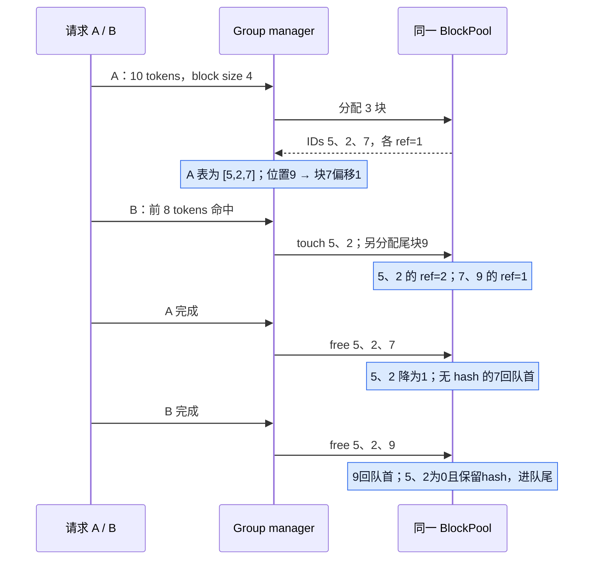
```mermaid
%%{init: {"themeVariables": {"noteBkgColor": "#dbeafe", "noteBorderColor": "#2563eb", "noteTextColor": "#0f172a"}}}%%
sequenceDiagram
    participant A as 请求 A / B
    participant M as Group manager
    participant P as 同一 BlockPool
    A->>M: A：10 tokens，block size 4
    M->>P: 分配 3 块
    P-->>M: IDs 5、2、7，各 ref=1
    Note over M: A 表为 [5,2,7]；位置9 → 块7偏移1
    A->>M: B：前 8 tokens 命中
    M->>P: touch 5、2；另分配尾块9
    Note over P: 5、2 的 ref=2；7、9 的 ref=1
    A->>M: A 完成
    M->>P: free 5、2、7
    Note over P: 5、2 降为1；无 hash 的7回队首
    A->>M: B 完成
    M->>P: free 5、2、9
    Note over P: 9回队首；5、2为0且保留hash，进队尾
```

这种间接层允许请求增长而不搬迁整段 KV，也让共享前缀与私有尾部分开管理。代价是 CPU 上要维护 block table、hash map、引用和淘汰队列，设备上要做间接寻址。这是从当前实现重建的设计权衡，不表示源码作者曾逐项比较过所有替代方案。

### 2.2 一个块怎样同时“空闲”又“可命中”

`BlockPool.blocks[block_id]` 是物理对象的唯一入口；`req_to_blocks[request_id]` 中每个逻辑槽只是对它的引用。`KVCacheBlock` 保存稳定 id、`ref_cnt`、主 hash、hash 覆盖的 token 数、free-list 前后指针及 null 标记。初始池预建所有对象，取出 id 0 作为 null block；它占容量，用于逻辑占位，但不走普通块的引用维护。

普通块遵守以下规则。取新块要求 `ref_cnt == 0`，移出 free queue 后变为 1；命中块由 `touch()` 增加引用，原先为 0 时还要从 queue 移除；每次 `free_blocks()` 归还一个引用才减 1。只有**非 null、ref 为 1、没有 hash**时，`is_block_writable()` 才允许作为私有可写块。最后一个引用消失后，无 hash 块放队首优先复用；有 hash 块放队尾继续可命中，直到被选作新分配目标才删除旧 hash。

因此 `ref_cnt == 0` 表示可驱逐，不表示没有内容。反过来，删除 hash 只取消检索身份，不会把仍有引用的块释放。reset 也不能强行清空活跃池：`reset_prefix_cache()` 检查除 null 外还有没有已使用块，有就返回 `False`。

free queue 是侵入式双向链表，命中位于中间的零引用块时可 O(1) 摘除，不需要扫描队列或另建链表节点。无 hash 块相当于队首 LIFO 复用，带 hash 块从队尾加入形成缓存淘汰次序；请求释放通常按尾到头进行，优先回收尾部。`test_prefill` 的真实例子使用 16-token 块，三个公共块 `[1,2,3]` 被两请求引用到 2，各有私有尾 4、5；全部释放后队列为 `[5,4,6,7,8,9,10,3,2,1]`。这里既验证尾块优先，也验证公共缓存保留在后部。

### 2.3 内容身份：相同内容为什么还能有两个物理块

prefix hash 链接父 hash、当前完整 hash 单元的 tokens，以及必要的额外语义键：MM 内容标识和位置、LoRA 名称、首块 cache salt、prompt embedding 的分片摘要。再加 group id，才能区分不同 group 对同一 prefix 保存的状态。实现允许一个 hash 对应多个物理对象；块变满时不必为去重改写已经交给 runner 的 block table。这保留普通表的追加方式，代价是相同内容可能短时重复占块。

**生成合同与时机。** `EngineCore.__init__` 只在 `enable_prefix_caching` 为真或存在 KV connector 时建立 `request_block_hasher`；两者都没有就不计算请求块 hash，但仍可分页分配。输入是 `Request.all_token_ids`、已有 `block_hashes`、`hash_block_size`、算法与 extra keys；输出只含新产生的完整 hash 单元的 `BlockHash`，追加到原链。`Request.__init__` 首次调用 `update_block_hashes()`；`append_output_token_ids()` 追加真实输出后再次调用。未凑满 hash 单元的尾 token 暂不产出 hash；hash 粒度不必等于各 group 的物理块长。

`get_request_block_hasher()` 从 `len(block_hashes) × hash_block_size` 续算，逐单元调用 `hash_block_tokens()`：将父 hash（首单元用 `NONE_HASH`）、当前 token tuple 和 extra keys 一起序列化并散列。例：hash 粒度 4、已有 10 个 token 时产生截至 4、8 的两个链节点；追加到 12 时只新增第三个，它包含第二个 hash，因而识别的是整个 12-token 前缀，而非孤立的最后四个 token。group id 是池检索时再组合的命名空间，不是把同一 Request 的 token 链按 group 重算。

| `CacheConfig.prefix_caching_hash_algo` | 序列化与 hash | 范围与成本 |
|---|---|---|
| `sha256`（默认） | Pickle + SHA-256 | 密码学 hash；序列化兼容性仍需一致，不承诺跨语言字节完全相同 |
| `sha256_cbor` | canonical CBOR + SHA-256 | 用于可复现、跨语言的序列化合同 |
| `xxhash` / `xxhash_cbor` | Pickle / canonical CBOR + xxHash128 | 依赖可选 `xxhash` 包；速度取舍伴随非密码学碰撞风险，不能把内容隔离当作无条件保证 |

首节点的种子也属于内容合同。`resolve_none_hash_seed()` 优先用显式 `PYTHONHASHSEED`；否则 SHA 系列用固定默认种子，非密码学算法用 `os.urandom(32).hex()` 的进程随机值。`init_none_hash()` 再散列种子得到 `NONE_HASH`，对非密码学随机种子发出跨进程不可复现警告。因此 canonical CBOR 只固定序列化，**不会自动消除 xxhash 的随机首节点差异**；跨实例复用还要统一算法、种子、token/extra keys 与模型内容。`get_none_hash_seed()` 可供 P2P 握手读取已解析种子；具体交换协议归 22。hash 生成只建立内容身份，不证明对应 GPU 状态已经可读。

源码路线：`vllm/config/cache.py::CacheConfig.prefix_caching_hash_algo` → `vllm/v1/engine/core.py::EngineCore.__init__` → `vllm/v1/request.py::Request.update_block_hashes / append_output_token_ids` → `vllm/v1/core/kv_cache_utils.py::get_request_block_hasher / hash_block_tokens / generate_block_hash_extra_keys / resolve_none_hash_seed / init_none_hash`。

hash 也有明确的版本边界：`_gen_lora_extra_hash_keys()` 放入的是 **LoRA 名称**，没有权重内容版本；KV hash 也没有 `weight_version`。`OpenAIServingModels.unload_lora_adapter()` 删除前端映射，不替这条路径清除 Engine KV。因此同名 LoRA 换内容，或仅改变一个 version 字符串，不会自动隔离旧 KV；一致性仍要由外部权重更新与清缓存流程保证，见 [[02_engineering/03_infer_frameworks/vllm/24_vllm_extension_plugin_system_analysis|运行时 LoRA resolver 与插件]]、[[02_engineering/03_infer_frameworks/vllm/25_vllm_weight_transfer_online_update_analysis|权重装载与更新]]。

## 3. 完整工作流程：先建立容量，再让请求使用和归还

第 2 节解释了一个块的四种身份，但还没有解释这些对象何时产生、怎样进入一次真实推理。这里分清两条时间线：**启动期**将模型的存储要求与显存预算变成池容量和设备 views；**运行期**只领取编号、维护引用并交付执行，不会因领取一个编号而重新申请一段 CUDA 显存。

<!-- Figure spec: 生命周期顺序图，Core规划传KVCacheConfig到worker及scheduler；运行时Scheduler查找/分配获得分组IDs，经Core执行器交给Runner读写，结果回Scheduler后free；图中GPU内容留worker，CPU链传描述。 -->
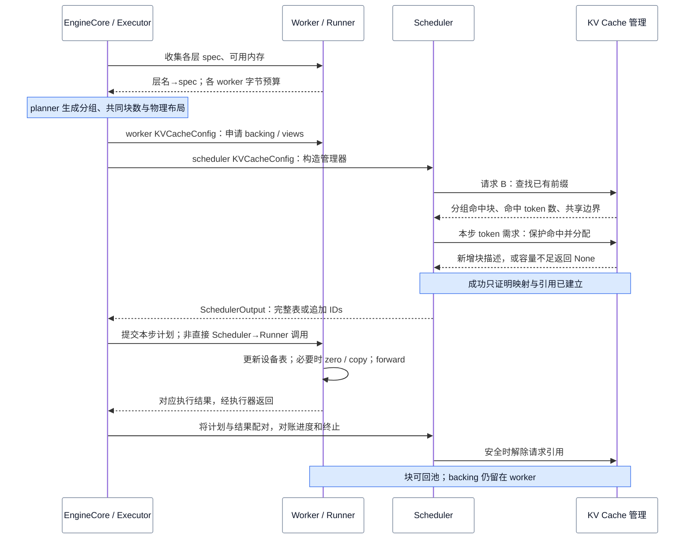
```mermaid
%%{init: {"themeVariables": {"actorBkg": "#ffffff", "actorBorder": "#64748b", "actorTextColor": "#0f172a", "noteBkgColor": "#dbeafe", "noteBorderColor": "#2563eb", "noteTextColor": "#0f172a"}}}%%
sequenceDiagram
    participant C as EngineCore / Executor
    participant W as Worker / Runner
    participant S as Scheduler
    participant K as KV Cache 管理
    C->>W: 收集各层 spec、可用内存
    W-->>C: 层名→spec；各 worker 字节预算
    Note over C: planner 生成分组、共同块数与物理布局
    C->>W: worker KVCacheConfig：申请 backing / views
    C->>S: scheduler KVCacheConfig：构造管理器
    S->>K: 请求 B：查找已有前缀
    K-->>S: 分组命中块、命中 token 数、共享边界
    S->>K: 本步 token 需求：保护命中并分配
    K-->>S: 新增块描述，或容量不足返回 None
    Note over S,K: 成功只证明映射与引用已建立
    S-->>C: SchedulerOutput：完整表或追加 IDs
    C->>W: 提交本步计划；非直接 Scheduler→Runner 调用
    W->>W: 更新设备表；必要时 zero / copy；forward
    W-->>C: 对应执行结果，经执行器返回
    C->>S: 将计划与结果配对，对账进度和终止
    S->>K: 安全时解除请求引用
    Note over K,W: 块可回池；backing 仍留在 worker
```

图中从 Core 到 worker 的交互通过所选 executor 完成，可能跨进程或设备；Scheduler、coordinator、pool 之间则是 EngineCore 内的同步 CPU 调用。普通 `EngineCore.step()` 提交非阻塞执行后仍会等待对应 future，再交给 Scheduler 对账；并发 batch 的反馈与延迟回收规则见 [[07_vllm_scheduler_analysis|Scheduler 的执行与对账]]。图表示因果顺序，不表示耗时比例。

### 3.1 启动期：先把存储单位与容量算清


#### 3.1.1 slot、token block 与 page 各是什么单位

上面的块号只说明所有权，还没有说明显存占多少。先固定最普通的情形：单个 worker、一个全注意力 group、无 KV 量化与 page padding、K/V head 维度相同，`tokens_per_state=1`。这里一个物理 slot 对应一个 token 的存储位置；它本身是索引，字节数由该层 spec 决定。一个 manager block 覆盖连续的若干 token；`page_size_bytes` 则是该层这一块的字节容量，page 不是再容纳若干 manager block 的上级容器。

| 量 | 单位与范围 | 怎样解释 |
|---|---|---|
| `block_size` | token / manager block | 用户配置经平台、模型与 backend 约束确定的分配粒度 |
| `slot` | 扁平位置编号 | 普通路径可拆回执行块号和块内位置，不是字节地址 |
| `page_size_bytes` | 字节 / 层 / manager block | 已包含该 spec 要求的 page padding；不等于系统内存的 4 KiB 页 |
| pool block 的字节跨度 | 字节 / pool id / worker | 本地各组页总量决定；均匀单组才退化为层数乘单层 page |
| `num_blocks` | pool id 数 | 引擎的共享池容量，含 null 等保留位置，不能全算成请求可用块 |

令 $H$ 为本 rank 的 KV head 数，$D$ 为每个 K/V head 的维度，$e$ 为每元素字节数，$B_{\mathrm{m}}$ 为 manager block 的 token 数，$L$ 为本 rank 该组实际持有的层数。普通模型、无 padding 时：

$$
\begin{aligned}
S &= 2HDe, \\
P &= B_{\mathrm{m}}S, \\
C &= LP.
\end{aligned}
$$

$S$ 是单层单 token 的 K 与 V 合计，$P$ 是单层 page，$C$ 是均匀单组下一个 pool id 对应的跨层总量。不能用 Query head 数代替 $H$，也不能用权重量化位数代替 KV dtype。跨层求和只算本 PP stage 的层；TP 可能复制少量 KV heads，不能无条件把全局 KV heads 除以 TP。

以 80 层、8 KV heads、D=128、TP8、PP1、BF16 的教学配置为例，本 rank 有 H=1，得到 **512 B / token / 层**、**40 KiB / token / rank**。B=16 时单层 page 为 **8 KiB**，同号块跨 80 层合计 **640 KiB / rank**；八个 rank 合计 5 MiB。1 KiB=1024 B，这些是容量推导，不是实测分配日志。

| 分配块长 | 单层 page | 80 层 / rank / pool id | 无共享的 40-token 请求 | 尾块空槽对应的容量 |
|---|---|---|---|---|
| 16 tokens | 8 KiB | 640 KiB | 3 块，预留 1.875 MiB | 8 token，320 KiB / rank |
| 32 tokens | 16 KiB | 1.25 MiB | 2 块，预留 2.5 MiB | 24 token，960 KiB / rank |

已保存 T 个 token 时，普通独占请求需要 $\lceil T/B_{\mathrm{m}}\rceil$ 块；尾块空槽为 $\lceil T/B_{\mathrm{m}}\rceil B_{\mathrm{m}}-T$。继续生成可以填掉这些槽。若余数近似均匀，平均空槽才是 $(B_{\mathrm{m}}-1)/2$，不是每个块固定浪费半块。较小分配块减小尾部浪费，较大分配块减少管理项；真正 kernel 粒度还需协商，不能从这个表推导吞吐高低。

#### 3.1.2 先申请 backing，再让请求消费块编号

当前 `allocate_kv_cache()` 申请一份共享 backing，并由配置的 offset、layer stride、block stride 建立各层 view。请求运行时领取的是池编号及相应容量，通常不会每生成一个 token 就调用一次 GPU 显存分配。释放引用后块回池，也不等于 backing 被释放给驱动；`nvidia-smi` 显存用量不必下降。

均匀单组可以用 KV 预算除以 C 求块数。一般组先把本组各层 `page_size_bytes` 相加，普通共享池取最大的组总量作为一个 pool id 的字节跨度；GLM5-Next 等专用 alias 规划见§5.2。不同 group 对同一范围提供不同解释，不能把所有 view 的 `numel` 当成彼此独立的分配再次求和。

`Worker.determine_available_memory()` 的 profile 路径从执行器预算扣除非 KV 开销，CUDA Graph 估算还受相应开关控制；显式 `kv_cache_memory_bytes` 是另一条预算路径，并仍可能扣除多模态 IPC 预留。`gpu_memory_utilization` 不是“显存中全部拿来存 KV 的比例”。最终各 worker 对齐可共同使用的块数，空闲池还保留 null block；普通容量公式并不覆盖所有启动期预留。

> [!contradiction] 旧图解的层存储与 page 口径
> 归档的 v0.10.2 图解用每层独立 buffer、K/V 大半区解释特定旧实现。当前基线的公共 allocator 使用共享 backing，各层 view 的连续性由布局与 stride 决定，不能沿用“层间一定分散”或“一个 page 总是某段 K/V 半区”的说法。普通容量主项仍可按上式算；实际元素布局和 K/V 下标见 [[10_vllm_attention_backends_analysis|Attention Backend]] 的具体寻址解释。

这里使用的 `page_size_bytes` 已包含 spec 的 page padding。若 `tokens_per_state` 不为 1、`num_head_slots` 或 `state_content_bytes` 被 backend 改写，S 与 P 的简单公式就应退回 `KVCacheSpec.get_num_kernel_states()`、`AttentionSpec.unpadded_page_size_bytes` 的真实几何；§5.2展开这些变化。数据的字节布局与分配粒度是不同问题，不应仅因一个 block id 跨多层使用，就把它想象成“一个 token 的所有层依次塞入同一小块”。

源码：`vllm/v1/kv_cache_interface.py::AttentionSpec.state_content_size_bytes`、`unpadded_page_size_bytes`、`page_size_bytes`；`vllm/v1/core/kv_cache_utils.py::_get_kv_cache_bytes_per_block`、`get_kv_cache_config_from_groups`、`get_kv_cache_configs`；`vllm/v1/worker/utils.py::allocate_kv_cache`；`vllm/v1/worker/gpu_worker.py::Worker.determine_available_memory`。

#### 3.1.3 GPU profiling → KV 字节预算 → 全 worker 共同块数

**目的与 I/O。** `Worker.determine_available_memory()` 在模型加载后将初始化显存快照、一次 dummy profile 的消耗和配置变为一个整数 KV 字节预算；它不返回块数，更不在这里创建请求块。`EngineCore._initialize_kv_caches()` 汇集各 worker 的预算与 spec，再由 planner 生成 `KVCacheConfig`，最后把共同块数写入 `cache_config.num_gpu_blocks`。这一流程拥有容量推导；profile 中的编译、graph capture 生命周期继续由 19 展开。

普通 profiling 路径不能简单写成“显存乘比例，再减权重”。设总显存 T、利用比例 u、初始化空闲字节 F₀、profile 后空闲字节 F₁、profile 后的 torch 峰值 P 和当前 allocated A、实际纳入预算的 graph 估计 G、前端多模态预留 M，所有内存量按字节计：

$$
\begin{aligned}
D_{\mathrm{requested}} &= \lceil Tu\rceil, \\
D_{\mathrm{consumed}} &= F_0-F_1, \\
D_{\mathrm{transient}} &= P-A, \\
D_{\mathrm{nonKV}} &= D_{\mathrm{consumed}}+D_{\mathrm{transient}}, \\
D_{\mathrm{KV}} &= D_{\mathrm{requested}}-D_{\mathrm{nonKV}}-G-M.
\end{aligned}
$$

`request_memory()` 先要求 F₀ 至少覆盖 requested，否则启动报错。`memory_profiling()` 用 free-memory 差计持久消耗，再补 torch 临时峰值余量；这样兼容绕开 PyTorch reserved 统计的 allocator，也避免把已计入持久消耗的权重或 activation 再扣一次。初始化快照在 NCCL 初始化后取得；公式的基线不是“这张 GPU 完全空载”。未触发 ROCm fallback 时还断言 F₀≥F₁，防止 profiling 期间其他进程释放显存破坏测量假设；ROCm 的 `maybe_rocm_profiling_fallback()` 有专门替代计数，不能把 F₀−F₁ 强行用于该分支。

CUDA-like（含 ROCm）且 graph mode 非 NONE 时调用 `profile_cudagraph_memory()`；是否将估计计入 G 由 `VLLM_MEMORY_PROFILER_ESTIMATE_CUDAGRAPHS` 控制，基线默认 1，关闭则 G=0，XPU 不走此估计。末尾 `reserve_mm_ipc_gpu_memory()` 对所有预算路径扣 M：原始帧池预算，加 GPU video backend 的每 API 进程 decoder/context 开销；没有 MM 配置或预留为零时原样返回，扣后不剩容量时抛 `ValueError`。它不是把已存在的 API 显存当作可用 KV。

**手算一条普通路径。** 假定 T=80 GiB、u=0.9、F₀=76 GiB、F₁=50 GiB、P=8 GiB、A=3 GiB、G=2 GiB、M=1 GiB：requested=72、持久消耗=26、临时余量=5、nonKV=31，最终 KV=38 GiB。接上 §3.1.1 的 640 KiB/pool id，向下取整得到 62,259 个 id，单 worker 的可用上界还须扣 null id，成为 62,258；这是教学输入，不是硬件测量。

<!-- Figure spec：预算转换图以 80GiB 总量与 0.9 比例得到 72GiB 开始，普通 profile 分支按 26+5+2 得到 MM 前 39GiB；显式预算或通过身份/空闲门的 startup plan 是另一条输入，同样保留 profile_run 编译但不做预算测量。两条支路汇入 MM 预留扣除；普通数例 39−1=38GiB，除以 640KiB 得 62259 个 pool id，再示例另一 worker 60000，共同最小60000，其中59999非null。边传字节或块数；蓝色容量转换、橙色保留成本；不把节点数量解释为 launch 或时间。 -->
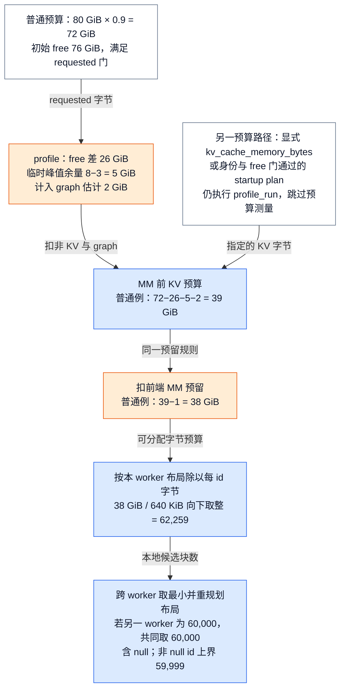
```mermaid
flowchart TB
    I["普通预算：80 GiB × 0.9 = 72 GiB<br/>初始 free 76 GiB，满足 requested 门"]
    P["profile：free 差 26 GiB<br/>临时峰值余量 8−3 = 5 GiB<br/>计入 graph 估计 2 GiB"]
    X["另一预算路径：显式 kv_cache_memory_bytes<br/>或身份与 free 门通过的 startup plan<br/>仍执行 profile_run，跳过预算测量"]
    K["MM 前 KV 预算<br/>普通例：72−26−5−2 = 39 GiB"]
    M["扣前端 MM 预留<br/>普通例：39−1 = 38 GiB"]
    B["按本 worker 布局除以每 id 字节<br/>38 GiB / 640 KiB 向下取整 = 62,259"]
    J["跨 worker 取最小并重规划布局<br/>若另一 worker 为 60,000，共同取 60,000<br/>含 null；非 null id 上界 59,999"]
    I -->|requested 字节| P
    P -->|扣非 KV 与 graph| K
    X -->|指定的 KV 字节| K
    K -->|同一预留规则| M
    M -->|可分配字节预算| B
    B -->|本地候选块数| J
    classDef normal fill:#fff,stroke:#64748b,color:#0f172a
    classDef blue fill:#dbeafe,stroke:#2563eb,color:#0f172a
    classDef orange fill:#ffedd5,stroke:#ea580c,color:#0f172a
    class I,X normal
    class K,B,J blue
    class P,M orange
```

**显式值与 startup plan 是两条有条件的测量旁路。** 非零 `kv_cache_memory_bytes` 直接作为 MM 前预算，仍调用 `model_runner.profile_run()` 完成所需编译，但不运行 `memory_profiling` 或 graph 内存估计；该预算不按 utilization 重新计算，先前初始化阶段的 free/requested 检查仍存在。`VLLM_ENABLE_STARTUP_PLAN` 默认 0；开启且没有显式 KV 字节值时，`maybe_apply_startup_plan()` 尝试读取缓存。fingerprint 包含 config hash、vLLM/torch/CUDA build、设备名/总量/能力、rank/world size；仅 schema/fingerprint 匹配、预算为正且当前初始 free≥记录基线才写回 `kv_cache_memory_bytes`，之后进入同一显式值分支。文件缺失、不可读或门不通过则完整 profiling；driver-only 变化不在 key，故不能称此缓存为绝对 OOM 保证。`compile_or_warm_up_model()` 在正常 profile/capture 后计算带 150 MiB 余量的建议值，再由 `maybe_save_startup_plan()` 原子保存；plan 不是恢复 KV 内容或省掉所有模型初始化。

**字节预算怎样落成块数。** `get_kv_cache_configs()` 先做全局分组与 PP-local 投影，按各 worker 的真实 `_pool_bytes_per_block()` 计算；普通情形为最大组的层 page 总量，特殊 alias 布局见 §5.2。可用内存检查/`max_model_len=-1` 的 auto-fit 先留出 null block，配置分配仍包含它。`num_gpu_blocks_override` 会把有效预算改为 override×每 id 字节，使 auto-fit、容量门和最终配置保持一致，但显式覆盖并不证明物理 GPU 真的够用。各 worker 先得到本地块数，最终取最小值，并为较大者重新生成匹配的 size/stride/offset；不能只改 `num_blocks` 而留下旧布局。若 auto-fit 缩短模型长度，Core 将新长度广播回 worker。

支持范围：本节展开 GPU Worker 的预算分支，未外推 CPU/TPU 等 worker。无 cache-bearing spec 的 attention-free 模型不 profile KV，返回空 group、仅保留 null 所需的 `num_blocks=1`；Elastic EP scale-up launch 使用预先取得的预算而不重新 profile，此处只接其容量输入，扩缩容编排不归本页。容量通过不保证未来任意 workload 都不 OOM，实际形状、其他进程显存变化、graph 与 workspace 仍需匹配测量范围。

源码路线：`vllm/v1/worker/utils.py::request_memory` → `vllm/v1/worker/gpu_worker.py::Worker.determine_available_memory` → `vllm/utils/mem_utils.py::memory_profiling` / `vllm/v1/worker/startup_plan.py::maybe_apply_startup_plan` → `vllm/multimodal/gpu_ipc_memory.py::reserve_mm_ipc_gpu_memory` → `vllm/v1/engine/core.py::EngineCore._initialize_kv_caches` → `vllm/v1/core/kv_cache_utils.py::get_kv_cache_configs / get_kv_cache_config_from_groups / generate_scheduler_kv_cache_config`。验证入口：`tests/v1/worker/test_gpu_worker.py::test_startup_plan_fingerprint_sensitivity / test_startup_plan_apply_gate`；本轮只阅读这些测试，不声称已运行 GPU profiling。

### 3.2 运行期入口：先判断哪里能续算

沿用 A/B：A 已保存前 10 个 token，B 的前 8 个 token 与它相同，B 总输入也为 10 个 token。Scheduler 用 B 的 `Request` 查询 `get_computed_blocks()`；其中 `block_hashes` 描述内容身份，返回值是按 group 组织的 `KVCacheBlocks`、可复用 token 数以及稀疏缓存可能需要保住的 `shared_prefix_boundary`。**查询得到候选，不会在这一步替请求取得活跃引用**；真正保护命中发生在分配阶段。

普通路径最多复用 `request.num_tokens−1`，因为缓存保存状态，不保存当前请求要输出的 logits；还要按有效命中粒度对齐。本例 B 的上限为 9，对齐到 4-token 块后为 8，于是候选是 A 的块 5、2。禁用 prefix caching 或请求要求跳过 KV 读取时，返回空块和 0；分页分配仍然存在，消失的是跨请求复用。partial 命中与多组共同边界分别在 §5.1、§5.3 展开。

Scheduler 根据这段进度决定本步实际补算的 token 数，再把“本地命中块 + 新 token 数 + 必要的 lookahead / 外部计算长度”交给分配入口。因此 **KV 命中长度是调度输入，分配结果又是调度能否成立的约束**；Manager 不自行选择本步 token 配额或抢占对象。

### 3.3 分配：把候选命中变成受保护的请求映射

先走最普通的成功路径：本例预算允许 B 补算剩余 2 个输入 token，容量充足且没有 lookahead。分配器先保护块 5、2，各增加一个引用，再取私有尾块 9。B 的完整逻辑表是 `[5,2,9]`，其中新增物理块只有 9；`allocate_slots()` 返回新增块描述，Scheduler 需要完整表时另取 `get_blocks()`。这两种返回口径不同，不能把“新增 1 块”误读为“请求只占 1 块”。

下一步只要尾块还有空间就复用已有映射，越过物理块边界才增加编号。下面再把这个过程推广到会回收窗口、有命中共享或在途执行的情况；它们仍是在回答同一个问题：本次能否安全建立需要的全部映射？


`allocate_slots()` 要解决的不是“剩几个空 id”这一道题。它先确认安全进度，计算各组的当前与新增需求，再保护命中和建立新引用。容量不足时返回 `None`，但已安全回收的旧窗口不会恢复；这不是任意异常都可回滚的通用事务。

#### 3.3.1 用已执行进度回收窗口

看一个窗口长度 4、块长 2 的 sliding-window 请求。调度器记录 `total_computed_tokens=9`，其中 2 个 token 仍在执行；本次回收只认可 `9−2=7`。下一位置 7 需要历史位置 4、5、6，连同当前位置形成长度 4 的窗口，所以 0～3 已经可以移除，逻辑表前两个槽换成 null。若直接按乐观进度 9 计算，会移除 0～5，误删仍需要的位置 4、5。这里假设无额外保留窗口；实际 `extra_retained_tokens` 会进一步推迟回收。

<!-- Figure spec: TB 分配算法图；显示9减inflight2得7、窗口4/块2回收前两块；容量不足出口保留安全回收但没有新touch/allocate；成功出口全部group touch先于任何外部computed分配。 -->
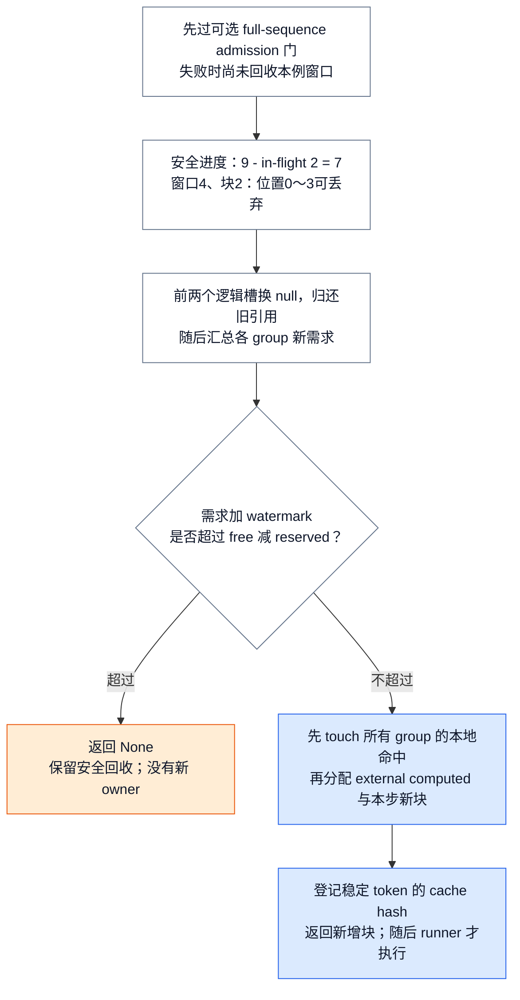
```mermaid
flowchart TB
    A["先过可选 full-sequence admission 门<br/>失败时尚未回收本例窗口"] --> B["安全进度：9 - in-flight 2 = 7<br/>窗口4、块2：位置0～3可丢弃"]
    B --> C["前两个逻辑槽换 null，归还旧引用<br/>随后汇总各 group 新需求"]
    C --> D{"需求加 watermark<br/>是否超过 free 减 reserved？"}
    D -->|超过| E["返回 None<br/>保留安全回收；没有新 owner"]
    D -->|不超过| F["先 touch 所有 group 的本地命中<br/>再分配 external computed 与本步新块"]
    F --> G["登记稳定 token 的 cache hash<br/>返回新增块；随后 runner 才执行"]
    classDef normal fill:#fff,stroke:#64748b,color:#0f172a
    classDef blue fill:#dbeafe,stroke:#2563eb,color:#0f172a
    classDef orange fill:#ffedd5,stroke:#ea580c,color:#0f172a
    class A,B,C,D normal
    class F,G blue
    class E orange
```

full-sequence admission 是更早的可选门，会在上述回收之前预测整个序列是否可接纳；其 watermark 条件、reserved blocks 和抢占选择归 [[02_engineering/03_infer_frameworks/vllm/07_vllm_scheduler_analysis|调度器]]。通过该门后，manager 才以 `max(0, total_computed_tokens − num_in_flight_tokens)` 调用各组 `remove_skipped_blocks()`。回收以完整物理块为单位，保留 null 槽的位置，不能压缩逻辑历史后让位置错位。

**回收型 spec 的 admission cap 归本页，而非调度队列策略。** 它解决“启动按窗口峰值建池，运行准入却按整段 prompt 预留，导致本来可分段执行的长请求永远进不来”的不一致。输入为模型长度上限 M、该 spec 的块长 B、窗口 W 或 chunk 长 Q、额外保留尾部 E，以及最大在途 token 数 I；输出是每请求最多实占多少块的准入上限。`VllmConfig.max_in_flight_tokens` 定义 I 为 `max_concurrent_batches × max_num_batched_tokens`，不是当前请求的 `num_in_flight_tokens`。

两个 spec 的精确公式是：

$$
\begin{aligned}
N_{\mathrm{SWA}} &= \left\lceil\frac{\min(W-1+E+I,M)}{B}\right\rceil+1, \\
N_{\mathrm{chunk}} &= \left\lceil\frac{\min(Q+I,M)}{B}\right\rceil.
\end{aligned}
$$

滑窗多出的 1 块防止窗口起点落在块中间；chunk 不套这个加一规则。两者的 `max_memory_usage_bytes()` 都复用本公式乘 `page_size_bytes`，使建池容量与准入规则来自同一个 spec 方法。教学例取 B=16、W=Q=64、E=0、M=1024、两批在途且每批最多 128 token，I=256：SWA 上限为 `ceil(319/16)+1=21` 块，chunk 上限为 `ceil(320/16)=20` 块；没有本地命中或已有表时，1024-token prompt 的整段需求由 64 块截到该上限，而 full-attention 组仍需 64 块。

调用链是 `KVCacheManager.allocate_slots(full_sequence_must_fit=True)` → coordinator 的 `get_num_blocks_to_allocate(apply_admission_cap=True)` → `SingleTypeKVCacheManager.get_num_blocks_to_allocate()` 将 `ceil(num_tokens/B)` 截到 cap，再计已有表、被跳过历史、本地命中及需占用的 free 候选。`apply_admission_cap=True` 在基线里有**两个**调用点，不是一个：一是这里 `allocate_slots(full_sequence_must_fit=True)` 的整段准入门；二是 `vllm/v1/core/sched/scheduler.py::Scheduler._request_remaining_blocks`，其结果经 `_inflight_prefill_reserved_blocks()` 汇总成异步 load 分配时使用的 `reserved_blocks`（该预留量的调度语义归 07）。因此**在途 prefill 的预留估算也是按截断后的 cap 算的，不是按整段未截断长度**。窗口回收后的本步实际分配才不传 True，不能用 cap 少分本步将写入的 slots。各组仍联合计数，full 组超池照样拒绝；cap 不保证整个 hybrid 请求必能进入，也不替代 watermark、reserved 或抢占策略。

支持范围由 `get_manager_for_kv_cache_spec()` 的 `isinstance(SlidingWindowSpec, ChunkedLocalAttentionSpec)` 注入确定；R-SWA 不设独立 cap，仍按 full-attention 容量界。SWA 的启动容量计算还断言 DCP=1。若 HMA 关闭后 spec 已提升为 full allocation，就不再使用原 sliding cap。`KVCacheManager` 未获 `max_in_flight_tokens` 时回退到 M，相当于保留此前未截断的保守行为。

源码：`vllm/config/vllm.py::VllmConfig.max_in_flight_tokens`；`vllm/v1/kv_cache_interface.py::SlidingWindowSpec.max_admission_blocks_per_request / ChunkedLocalAttentionSpec.max_admission_blocks_per_request`；`vllm/v1/core/single_type_kv_cache_manager.py::get_manager_for_kv_cache_spec / SingleTypeKVCacheManager.get_num_blocks_to_allocate`；`vllm/v1/core/kv_cache_manager.py::KVCacheManager.allocate_slots`。回归入口：`tests/v1/core/test_prefix_caching.py::test_can_fit_full_sequence_full_attention_still_gates_oversized`。

#### 3.3.2 命中块为什么也会消耗 free 容量

本步主模型目标长度是总 computed 加新 token，slot 目标再加 lookahead，并以 `max_model_len` 截断；不能按整个未来生成上限无条件占满。coordinator 汇总各组 `get_num_blocks_to_allocate()`。它考虑当前块、local hit、external computed slots、新 token、lookahead、窗口回收和 partial CoW；有的 manager 会在预测时记录 checkpoint 计划，但这一阶段不建立新块引用。一个 ref 为 0 的命中块虽然不用重算，却已在 free queue 中；新请求 touch 它后便不能再作新块分配，必须计入本次容量占用。partial tail 私有化还要多算目标块。

容量通过后必须**先 touch 全部组的本地命中，再为各组分配 external computed slots**。若按“组 0 touch→组 0 allocate→组 1 touch”循环，组 0 可能取走组 1 尚在 free queue 的命中块。两阶段安排先把所有命中从可驱逐集合中拿走，再扩大各组表。跨组 local/external 混合回归测试断言所有新 owner 的非 null id 不冲突且引用为正。

随后才扩展本步 slots，并调用 `cache_blocks()`。可登记长度最多到 `request.num_tokens`，不把可能被拒绝的 draft 当成稳定内容；多模块投机尾部还须按 coordinator/group 的实际规则限制，见本页 §3.3.3。draft 如何产生和接受归 [[02_engineering/03_infer_frameworks/vllm/16_vllm_speculative_decoding_analysis|投机解码]]。

**这里的 finalized 指 token 内容不会因 draft rejection 回滚，不表示 GPU KV 已写完。** `cache_blocks()` 就在 `allocate_slots()` 内，发生在 forward 之前。普通 attention 的 hash 可以供同一步后续请求查询并共享；设备是否可读依赖当步执行和后续 stream 顺序。Mamba 有不同限制：`cached_blocks_this_step` 记录当步新增/迁移的边界 hash；若另一个请求命中的尾块属于该集合，其需求预测直接返回 `num_gpu_blocks + 1`，让本步容量检查失败，下一步清集合后再尝试。CPU hash 登记不能充当设备完成事件。

#### 3.3.3 投机尾部：有 slot、token 已确定、可登记 hash 是三条不同边界

这一规则避免把将被 rejection 回退或多模块 MTP 再 prefill 的状态暴露为可复用内容。输入是目标进度、`request.num_tokens`、prefill lookahead 和各 group 的 EAGLE 标记；输出是传给各 manager 的可缓存 token 上界，之后仍由整块/partial/retention 规则决定实际登记哪些 hash。普通 `allocate_slots()` 先取 `C = min(total_computed_tokens + num_new_tokens, request.num_tokens)`，与已分配的 `num_tokens_need_slot` 不同；缓存关闭或 `delay_cache_blocks=True` 时跳过这次登记。

`Scheduler.__init__` 对 EAGLE 设置 `num_prefill_lookahead`：多模块 MTP 为 `num_spec_tokens`，其他 EAGLE 为 1，非 EAGLE 保持 0。coordinator 保存 `R = max(0, num_prefill_lookahead−1)`。不能把“所有组统一 C−R，再加一块”当成实现；冻结基线分支如下：

| 消费者 | 给 manager 的 token 上界 | 边界 |
|---|---|---|
| 基类 `KVCacheCoordinator.cache_blocks` | `max(0, C−R)` | 扣掉可能再次 prefill 的尾 token |
| Hybrid 的普通组 | `A(C)` | A 在 fine-grained partial hits 开启时原样返回，否则向下对齐 scheduler block；此覆写分支没有统一扣 R |
| Hybrid 中 `manager.use_eagle` 且 `A(C)>0` 的组 | 令 F=`max(0,C−R)`，取 `min(F, A(F)+manager.block_size)` | EAGLE 查询需多看一个 group 块再 drop，因而允许多登记一个边界块，但绝不超过 F；不是对任意 EAGLE 方法、任意组都加一块 |

例如 C=70、R=2、scheduler block=32、group block=8、partial hits 关闭：基类上界 68，hybrid 普通组 64；EAGLE 组为 `min(68,64+8)=68`。这个数字仍是上界；8-token 整块 manager 不会凭空登记覆盖到 72 的块。C=72、R=0 时 EAGLE 组才可到 72，普通组仍到 64。`test_eagle_swa_alignment_caches_extra_block` 验证额外 tail 块让 SWA+EAGLE 在共同对齐边界可命中。

再 prefill 还影响释放而不只是 hash：`get_kv_cache_configs()` 对多模块 MTP 将每个 `SlidingWindowSpec.extra_retained_tokens` 设为 `num_speculative_tokens−1`；`SlidingWindowManager.get_num_skipped_tokens()` 用 `max(0, computed−window+1−extra_retained_tokens)` 推迟回收。多保留的 token 不因此参与 attention 窗口，它们用于再填充；也已计入 §3.3.1 的容量上限。align Mamba 的 checkpoint 物理槽仍有 multi-module MTP 的显式 TODO，不能由这组通用规则宣称全部组合均已验证。

源码：`vllm/v1/core/kv_cache_manager.py::KVCacheManager.allocate_slots` → `vllm/v1/core/kv_cache_coordinator.py::KVCacheCoordinator.__init__ / cache_blocks` 与 `HybridKVCacheCoordinator._align_cacheable / cache_blocks` → `vllm/v1/core/single_type_kv_cache_manager.py::SlidingWindowManager.get_num_skipped_tokens`；额外保留量由 `vllm/v1/core/kv_cache_utils.py::get_kv_cache_configs` 写入。

### 3.4 执行交付：从新增 id 到 attention 的 slot

分配成功仍只建立了 scheduler 侧关系。完整交付链以 Model Runner V2 为例：

1. `Scheduler.schedule()` 把新请求的完整 block IDs 写入 `NewRequestData`，已驻留请求通过 cached data 携带 `new_block_ids` 追加量，一并放入 `SchedulerOutput`。
2. `add_requests()` 为首次/恢复请求建立稳定 row，`overwrite=True` 写完整表；`update_requests()` 对已有 row 用 `overwrite=False` 追加。request identity 与当步 batch 排序可以分开。
3. runner 按需要清零新块，再执行本步 CoW copy，之后才让 attention 消费这些块。普通追加无需每步重传整个表；Mamba 的缓存尾部处理也要保住已交付的请求表，见 §5.1。
4. `prepare_attn()` 按 `idx_mapping` gather 当步 block tables，用 `query_start_loc` 和 token positions 得到 slot mapping；metadata builder 再生成 backend 参数。§2.1 的 `9→逻辑块2→物理块7偏移1` 到这里才成为设备地址输入。

稳定 row、异步 table 更新、zero/copy/forward 的具体执行顺序由 11/12 展开。manager block 到 kernel block 的虚拟拆分见 10；它不改变本页 pool 分配和回收的物理单位。

### 3.5 结果返回与释放：归还的是引用，不是整段显存

Runner 执行结果通过 executor 回到 EngineCore，再与本步 `SchedulerOutput` 配对交给 `Scheduler.update_from_output()`；Scheduler 据此推进实际状态、处理停止条件，而不是由 pool 猜测请求是否结束。普通终止路径经 `_free_request()`、`_free_blocks()`、`_free_request_blocks()` 到 `KVCacheManager.free()`，再由 coordinator 让各 group manager 删除自己的请求表并归还引用。

回到 A/B：A 结束只解除 A 的那一份引用，公共块 5、2 仍由 B 持有。B 结束后，引用归零的缓存块留在 free queue 中继续可命中；未来被选作新分配目标时才移除旧 hash。由此闭合的不是“请求结束 → 删除 KV tensor”，而是“请求结束 → 解除关系 → 容量可驱逐 → 需要时覆盖内容”。

有在途写入或 connector 保存任务时，这个出口可能延后。`_free_request_blocks()` 在启用 `defer_block_free` 且请求最后调度序号尚未处理时，先取走请求账本中的块，交给 Scheduler 的延迟队列持有，到 fence 满足后才交回 pool；connector 也可以要求延迟清理或独立 pin。普通分支则直接归还，不能泛化成所有路径都等待 GPU fence。CoW 的额外 pin 在 §5.1 解释，CPU store 的 ready 边界在 §5.4 解释。


## 4. 代码实现：子模块如何分工和交换数据

前面的生命周期由两类对象共同完成：CPU 侧保存“请求可以使用哪些状态”的账本，worker 保存状态的实际字节。下面的图不是继承图；实线表示持有或调用，虚线表示跨执行边界传递描述。**CPU 的 `KVCacheBlock` 对象不会作为 GPU tensor 传给 attention，交过去的是整数编号和布局元数据。**

<!-- Figure spec: 所有权图；Core协调planner与executor，Scheduler持有KVCacheManager，后者持有coordinator，coordinator创建group managers和共享pool；manager请求表引用pool对象；worker持有backing与设备block tables；虚线只传config与SchedulerOutput。 -->
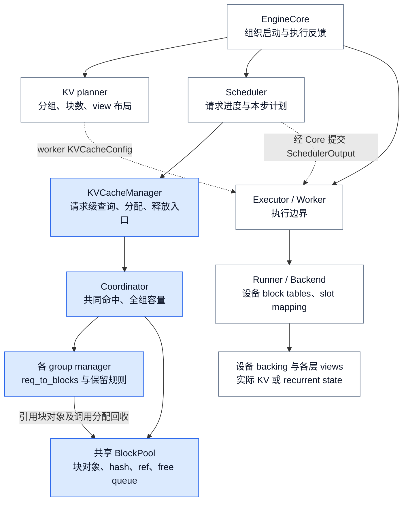
```mermaid
flowchart TB
    C["EngineCore<br/>组织启动与执行反馈"] --> P["KV planner<br/>分组、块数、view 布局"]
    C --> S["Scheduler<br/>请求进度与本步计划"]
    S --> K["KVCacheManager<br/>请求级查询、分配、释放入口"]
    K --> O["Coordinator<br/>共同命中、全组容量"]
    O --> G["各 group manager<br/>req_to_blocks 与保留规则"]
    O --> B["共享 BlockPool<br/>块对象、hash、ref、free queue"]
    G -->|引用块对象及调用分配回收| B
    C --> E["Executor / Worker<br/>执行边界"]
    P -.->|worker KVCacheConfig| E
    S -.->|经 Core 提交 SchedulerOutput| E
    E --> R["Runner / Backend<br/>设备 block tables、slot mapping"]
    R --> V["设备 backing 与各层 views<br/>实际 KV 或 recurrent state"]
    classDef normal fill:#fff,stroke:#64748b,color:#0f172a
    classDef blue fill:#dbeafe,stroke:#2563eb,color:#0f172a
    class C,P,S,E,R,V normal
    class K,O,G,B blue
```

### 4.1 规划器：把模型声明接到 CPU 管理和设备存储两端

规划器的上游是模型/attention 模块提供的“层名 → `KVCacheSpec`”，以及 executor 从每个 worker 收集的可用内存。spec 表达块长、state 形状、dtype、窗口等需求，而不是已分配的 KV 内容。`EngineCore._initialize_kv_caches()` 调用 `get_kv_cache_configs()`，输出每个 worker 的 `KVCacheConfig`，再由 `generate_scheduler_kv_cache_config()` 生成 Scheduler 使用的配置。

两个下游拿到的是同一套编号容量的不同视角：Scheduler 要知道 group 规则和共同 `num_blocks`；worker 还要知道本 rank 层的 tensor view 布局，并经 `Worker.initialize_from_config()` 交给 Runner 初始化。这样分开，是因为请求级容量账不能依赖每个 worker 的 Python tensor 对象，设备地址又不能只凭一个全局层数推算。代价是分组、局部投影与块数必须一致；§5.2 说明 hybrid 和 PP 怎样使这一契约更复杂。

### 4.2 请求入口与协调器：把调度需求变成全组一致的决定

`KVCacheManager` 的上游是 Scheduler，输入包括 `Request`、本步新 token 数、命中块、lookahead 和 connector 提供的外部计算长度。它先确定统一的 token 边界和容量门，再调用 coordinator；向上返回命中描述或新增块，容量不够则返回 `None`。它保留 prefix 统计等请求级信息，但不接管等待队列，也不直接执行 GPU copy。

Coordinator 的下游是各 group manager。它把同一请求的 token 目标分发给各组，将块需求相加，并将各组命中结果收敛到共同的恢复位置。cross-attention 是独立输入轴：它使用 `num_encoder_tokens` 规划静态 encoder 状态，而不是 decoder 的增长长度。所有组共享一个池，所以必须先保护所有 local hits，再允许任何组分配 external computed blocks；若每组各自完成全流程，会出现早处理的组淘汰后处理组候选块的问题。

这里传递的 `KVCacheBlocks` 是按 group 分组的块引用集合；跨到 Runner 前才转换成整数 IDs。`get_computed_blocks()` 返回的共享分叉边界还会影响稀疏保留，不能只保留“命中多少 token”一个数字。协调的收益是一个请求不会从彼此不一致的组状态恢复；成本是跨组遍历、重复确认和更保守的共同命中长度。

### 4.3 Group manager 与 BlockPool：规则属于前者，容量对象属于后者

Group manager 接收 coordinator 传来的请求 id、目标 token 长度和本组候选块，维护 `req_to_blocks`、已登记缓存的进度及必要的 partial/checkpoint 状态。它根据本层型决定哪些历史可丢、还缺多少块、是否需要私有化，然后调用 pool 的 `touch()`、`get_new_blocks()`、`free_blocks()`；向 coordinator 返回本组的新块或命中边界。Full attention 需要可访问完整历史，window 类可回收越过窗口的块，Mamba 保存恢复所需的状态边界，不能用一条“每步追加 token KV”的规则概括。

BlockPool 不接收“本步算几个 token”的策略指令，只处理具体块对象：哪个 id 空闲、哪个 hash 对应什么内容、引用怎样增减、哪个零引用缓存先被驱逐。它将对象交给 group manager 的表持有，hash map 和 free queue 则仍索引这些同一对象。这避免每个 manager 各建一份物理容量账；代价是所有路径必须遵守相同的引用与身份不变量。新分配的 id 可以曾属于别的内容，所以旧 hash 的失效必须发生在它被重新使用时。

### 4.4 执行和传输适配：描述越过边界，完成信号再返回

| 交互边界 | 传入的数据 | 接收方处理与输出 | 完成口径 |
|---|---|---|---|
| Scheduler → Core / Executor → Runner | `SchedulerOutput` 中的新请求完整 IDs、驻留请求追加 IDs、清零 IDs、CoW id 对 | Runner 更新 CPU/设备表，建立本步 batch 的 slot mapping，交给 backend | 计划提交不证明 KV 写完；结果须与本步计划配对 |
| Runner → Attention Backend | 本步 block tables、token positions 派生的 slots、各层 KV views 与 attention metadata | backend 按其布局读历史、写新状态 | 具体 kernel / stream 合同由 [[10_vllm_attention_backends_analysis|Attention Backend]] 和 Runner 页维护 |
| KV connector 的 Scheduler 侧 ↔ Worker 侧 | 内容 key、源/目标块、copy spec 或 connector metadata | worker 执行传输并回报完成；Scheduler 侧提交可用状态或释放 pin | store/load 被安排、设备复制完成、所有 worker 完成都不能混为一步 |
| Pool / CPU manager → 观测方 | cache events、usage、hit 等统计 | 通过上层汇总供日志、指标或外部消费者观察 | event 描述特定内容状态，不是所有执行路径通用的 GPU fence |

普通 forward 不把 KV tensor 整体随执行结果传回 CPU；返回的是生成/执行结果及需要的 connector 完成信息。CPU 管理器负责内容身份和生命周期，设备维护字节，这是数据与控制分开的核心边界。CPU tier 的独立内容 key 与 pending/ready 转换见 §5.4；跨 Engine 协议不在这里展开。

### 4.5 先认清选择轴，再阅读扩展机制

实现集合以源码选择点为准，而不是把出现过的类名排成一个清单：

| 选择轴与源码入口 | 条件与所选路径 | 改变什么 |
|---|---|---|
| `VllmConfig.__post_init__` → `get_kv_cache_groups()` | 先解析 `disable_hybrid_kv_cache_manager`；为 True 时先调用 `unify_hybrid_kv_cache_specs()`，再分组，详见 §4.5.1 | 决定能否保留不同层型的资源管理规则，不等于 prefix caching 开关 |
| `get_kv_cache_coordinator()` | 关闭缓存 → `KVCacheCoordinatorNoPrefixCache`；开启且一组 → `UnitaryKVCacheCoordinator`；开启且多组 → `HybridKVCacheCoordinator` | 是否查询前缀、是否需要跨组协调；无缓存也能有多组 |
| `get_manager_for_kv_cache_spec()` → `KVCacheSpecRegistry` | 由每个 group 的 spec 选择 manager，含平台自定义注册 | 本组历史保留、需求预测与命中算法，不由“是否 hybrid”一个开关决定 |
| `get_kv_cache_groups()` | uniform spec/type、GLM5-Next 专用路径、packed、统一 page 或受限 full-allocation fallback | 启动期怎样把层放进 group、怎样解释物理页；不是请求队列策略 |
| `VllmConfig` 的 offload 配置 | native 默认 `OffloadingConnector`；环境开关可选 Simple 实现；另有 lmcache backend | 在 GPU 本地池之外增加哪种内容层；本文展开 native 默认路径，其他后端由 [[22_vllm_disaggregated_kv_serving_analysis|KV Serving]] 承接 |

内置 registry 除 full、sliding-window、Mamba 外，还注册 circular buffer、chunked-local、cross-attention、RSWA、sink full attention、MLA、hidden-state 和 k-pool tail；平台还能扩展。这里列出它们是为了标明选择边界：**并非每一种 spec 都支持 prefix 命中，也并非所有 state 都按 token 逐项保存。** 本文展开通用池合同、full/window/Mamba 的协作及既有模型布局案例；其余专用算法不作为本页的全覆盖承诺。MLA/RSWA 的计算与布局接口见 [[10_vllm_attention_backends_analysis|Attention Backend]]，hidden-state 的投机用途见 [[16_vllm_speculative_decoding_analysis|投机解码]]，encoder 输入来源见 [[09_vllm_model_library_analysis|模型库]]；后文保留 k-pool 的容量边界。

#### 4.5.1 HMA 开关：改变分配规格，不改变 attention 的计算窗口

**目的与 I/O。** HMA（hybrid KV cache manager）让不同层型按各自保留规则共享资源；兼容性门则防止把多组块表交给无法处理的部署。输入是 `SchedulerConfig.disable_hybrid_kv_cache_manager` 的三态值、平台能力、模型 `attention_chunk_size`、speculative 配置和 connector 配置；`VllmConfig.__post_init__` 输出解析后的布尔值。注意双重否定：True 是关闭 HMA，False 才是开启。

| 输入或限制 | 解析行为 |
|---|---|
| 平台 `support_hybrid_kv_cache()` 为 False | 要求关闭；不只凭“GPU/非 GPU”的名字判断 |
| chunked-local + `use_eagle()` | 要求关闭，当前组合不支持 |
| chunked-local、非上述组合、`VLLM_ALLOW_CHUNKED_LOCAL_ATTN_WITH_HYBRID_KV_CACHE` 未开 | 要求关闭并警告延迟回退；该环境开关允许此分支继续使用 HMA |
| 用户值为 None | 还检查 `KVConnectorFactory.supports_hma_config()`；不支持的 connector 配置自动关闭，否则依据前述限制决定 |
| 用户显式 False，前述平台/chunked-local 限制要求关闭 | `ValueError`，不静默接受冲突 |
| 用户显式 True | 尊重关闭，不重新开启 |

connector 的 `supports_hma_config` 检查位于 **None 分支**，所以显式 False（即显式开启 HMA）不在这里被拒。但它**不是没有 gate，只是换了地方也换了后果**：`KVConnectorFactory.create_connector` 计算 `hma_enabled = not disable_hybrid_kv_cache_manager`，当 `hma_enabled and not cls.supports_hma_config(...)` 时直接 `raise ValueError("Connector ... does not support HMA but HMA is enabled")`——也就是 None 分支下是**静默自动关闭**，显式开启下是**建 connector 时启动硬失败**。跨 Engine 的 group 与协议兼容才由 22 的协议合同负责。MultiConnector 需要子 connector 都支持 HMA。默认解析且没有限制时 HMA 开启；没有多层型时，开启也不凭空造出多个 group。

**对资源的实际变换。** planner 的 `get_kv_cache_groups()` 在禁用时先就地统一 spec 字典。已 uniform 的集合原样返回；混合 full 与 sliding/chunked-local 时，`_promote_local_kv_cache_specs()` 将 local spec 提升为 full-attention allocation（SWA MLA 对应 MLA），必要时统一块长和 page padding，并移除已经无意义的 `extra_retained_tokens`。结果不再按滑窗释放历史，所以容量/性能与 HMA 路径不同；模型仍按原窗口计算 attention，不是把模型语义改成 full attention。无法提升到统一类型（例如 full+Mamba 的 hybrid SSM）会抛 `ValueError`，不是所有混合模型都能以更多显存换取 fallback。

因此下文 §5.2/§5.3 的多组资源优化以通过 HMA/分组合同为前提；“关闭 HMA”与“关闭 prefix cache”是不同轴，后者只关闭跨请求复用，并不取消多组分配。源码：`vllm/config/vllm.py::VllmConfig.__post_init__` → `vllm/v1/core/kv_cache_utils.py::get_kv_cache_groups / unify_hybrid_kv_cache_specs / _promote_local_kv_cache_specs`。

### 4.6 从真实入口到释放出口的调用路线

下面分别列启动和运行入口，缩进表示直接调用；executor 到 worker 的分派明确标记为边界展开，不将其伪装成普通本地调用。Runner 内部只列与本页有关的直接分支，backend metadata 和 forward 的完整执行树由 Runner 页负责。

```text
EngineCore._initialize_kv_caches
+-- register_all_kvcache_specs
+-- model_executor.get_kv_cache_specs / determine_available_memory
+-- get_kv_cache_configs
+-- generate_scheduler_kv_cache_config
`-- model_executor.initialize_from_config
    `-- [executor 分派，展开 worker 端入口] Worker.initialize_from_config
        `-- GPUModelRunner.initialize_kv_cache

EngineCore.__init__                         [初始化缓存后]
`-- [get_scheduler_cls 选择] Scheduler.__init__
    `-- KVCacheManager.__init__
        `-- get_kv_cache_coordinator
            `-- [所选 coordinator 的构造，最终进入基类]
                KVCacheCoordinator.__init__
                +-- BlockPool.__init__
                `-- get_manager_for_kv_cache_spec
                    +-- KVCacheSpecRegistry.get_manager_class
                    `-- [所选 group manager 构造]
```

```text
Scheduler.schedule
+-- _get_local_prefix_cache_hit               [普通新准入路径]
|   `-- KVCacheManager.get_computed_blocks
|       `-- coordinator.find_longest_cache_hit
+-- KVCacheManager.allocate_slots
|   +-- coordinator.get_num_blocks_to_allocate [可选全序列门]
|   +-- coordinator.remove_skipped_blocks
|   +-- coordinator.get_num_blocks_to_allocate [本步容量门]
|   +-- coordinator.allocate_new_computed_blocks
|   |   +-- 各 manager.add_local_computed_blocks
|   |   `-- 各 manager.allocate_external_computed_blocks [有外部计算]
|   +-- coordinator.allocate_new_blocks
|   |   `-- 各 manager.allocate_new_blocks
|   `-- coordinator.cache_blocks              [缓存开启且非延迟登记]
+-- kv_cache_manager.take_boundary_state_offloads  [取走并清空本步待交出的边界状态]
+-- kv_cache_manager.take_kv_cache_block_copies    [取走并清空本步 CoW 复制计划]
`-- 组装并返回 SchedulerOutput

EngineCore.step                               [普通同步反馈路径]
+-- scheduler.schedule
+-- model_executor.execute_model               [提交，跨 executor 边界]
+-- future.result                              [等待；必要时另行采样]
`-- scheduler.update_from_output
    +-- _handle_stopped_request                 [停止条件成立]
    `-- _free_request                          [普通终态路径]
        +-- _connector_finished
        `-- _free_blocks                       [没有要求延迟清理]
            `-- _free_request_blocks
                +-- KVCacheManager.free         [可安全归还]
                |   `-- coordinator.free
                |       `-- 各 manager.free
                |           `-- BlockPool.free_blocks
                `-- pop_blocks_for_free → deferred_frees [条件延迟]

GPUModelRunner.execute_model                  [worker 端独立入口]
+-- add_requests                               [完整 block IDs]
+-- update_requests                            [追加 IDs；zero / CoW]
`-- prepare_attn
    +-- block_tables.gather_block_tables
    `-- block_tables.compute_slot_mappings
```

这些树是代码入口索引，不替代 §3 的执行流程：`allocate_slots()` 的返回只闭合 CPU 分配；`prepare_attn()` 的返回只闭合设备索引准备；请求生命周期还必须经过执行结果、停止判定和引用释放。异步 batch、零 token copy 与 connector 的条件完成不能从普通树直接类推。


## 5. 扩展机制：基本方案遇到新约束时怎样变化

下面每项扩展都接在已经解释过的边界上：partial 改变共享后怎样续写；hybrid 改变建池与多组需求；共同命中决定从哪里恢复；CPU tier 改变内容能保留在哪里。它们并不是四种互斥的 KV Cache 实现。

### 5.1 更细粒度复用：命中 6 个 token，为什么还要复制半个块

**先限定支持范围。** 本节细粒度 partial hit/CoW 是含 Mamba `align` 组的 hybrid 路径，不是纯 full-attention 的默认行为。`HybridKVCacheCoordinator.enable_partial_hash_hits` 要求：非 DCP 时 Mamba block 大于 hash 粒度；DCP>1 时可相等（有效 attention 块另被放大）；所有可缓存 manager 还须支持 fine-grained lookup 或本身块长等于 hash 粒度，否则关闭并告警。`prefix_cacheable=False` 的 scratch 不参与这道能力限制。Hybrid coordinator 另要求 PCP=1；DCP>1 时只接受 full-attention 与 Mamba spec，不能将这里的 DCP 例子套给 SWA。单组 `UnitaryKVCacheCoordinator` 开缓存时要求 hash 粒度等于 block，不能套用下面的 6-token partial 命中算例。

基本例子共享的是两个完整物理块，B 只写自己的新尾块。现在改变这一前提：想复用的边界落在物理块内部，而新请求仍要继续写。问题于是从“能否命中”变成“怎样保留命中内容，又不让续写污染旧缓存身份”；这就是 copy-on-write（CoW，写时复制）介入的原因。

“至多复用 `request.num_tokens−1`、再向下对齐到块整数倍”这条上限规则已在 §3.2 展开（含 B 的 9→8 算例），此处不重述；prompt logprobs 等需实际计算的路径同样跳过 prefix 读取。

“partial”相对于 group 物理块。假设 hash 粒度 2、group 块长 4，前 6 个 token 的 hash 已完整，但第二个物理块只覆盖了其中 2 个有效 token。`cache_partial_block()` 可以给该物理对象登记 6-token 边界的 hash，必要时用旁路 key 保存多个边界；没有另分 tensor。驱逐、reset、提升为更长/full hash 时必须移除旧的主/旁路键，防止旧 key 悬挂到已换内容的对象。

> [!contradiction] 两处注释不能直接当执行规则
> `get_computed_blocks()` 的 docstring 仍写 computed blocks “must be full”，附近整块限制的说明也不能概括当前 partial 路径。测试已覆盖 hash 粒度 2、group 块长 4 的 6-token 命中：必须完整的是 **hash 单元**，不是物理 group block。另一个 `_apply_cow()` 注释说两端保留到 worker copy 完成；调度器实际释放还有条件，见下面的分层说明。

#### 5.1.1 新请求续写：改自己的表，保留旧缓存

假设源块 S 已缓存、ref 为 0，新请求命中 6 个 token 并继续算 1 个。先 touch S，ref 变 1；分配目标 D，ref 为 1；将请求尾槽从 S 改为 D，再给 D 一份 copy 引用，变为 2。S 保留原 hit-ref 作为 copy 的源保护，队列登记 `S→D`。D 在创建时私有且无 hash，copy 为它补齐前 2 个有效位置，随后才追加自己的 token。

<!-- Figure spec: CoW给出S0→touch1和D1→copy ref2；非空step已提交且defer生效时abort只将请求引用转交延迟队列，D仍2，fence后两份引用分别释放到0；普通分支立即释放copy引用，设备仍按序copy和forward。 -->
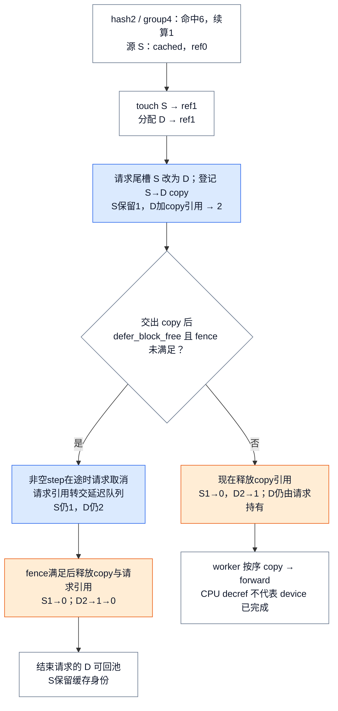
```mermaid
flowchart TB
    A["hash2 / group4：命中6，续算1<br/>源 S：cached，ref0"] --> B["touch S → ref1<br/>分配 D → ref1"]
    B --> C["请求尾槽 S 改为 D；登记 S→D copy<br/>S保留1，D加copy引用 → 2"]
    C --> D{"交出 copy 后<br/>defer_block_free 且 fence 未满足？"}
    D -->|是| E["非空step在途时请求取消<br/>请求引用转交延迟队列<br/>S仍1，D仍2"]
    E --> F["fence满足后释放copy与请求引用<br/>S1→0；D2→1→0"]
    D -->|否| G["现在释放copy引用<br/>S1→0，D2→1；D仍由请求持有"]
    G --> H["worker 按序 copy → forward<br/>CPU decref 不代表 device 已完成"]
    F --> I["结束请求的 D 可回池<br/>S保留缓存身份"]
    classDef normal fill:#fff,stroke:#64748b,color:#0f172a
    classDef blue fill:#dbeafe,stroke:#2563eb,color:#0f172a
    classDef orange fill:#ffedd5,stroke:#ea580c,color:#0f172a
    class A,B,D,H,I normal
    class C,E blue
    class F,G orange
```

此处有三层不同保护，不能只读 `_apply_cow()` 注释就合成“所有路径都等 GPU 完成才 decref”。第一层是 **pool 内保护**：manager 准备本步计划期间保留源 hit-ref 和目标额外 ref，防止后续分配意外拿走端点。`take_kv_cache_block_copies()` 将 copy id 对与 retained 对象一起交给 scheduler。第二层是 **有条件的完成 fence**：`_free_cow_retained_blocks()` 仅在 `defer_block_free` 已启用且 fence 未满足时入延迟队列；该开关针对有并发 batch 的 KV consumer。普通分支立即 decref。fence 用执行 copy 的 step 所对应的序号；零 token copy 步本身不推进序号，由其后首个非空步的处理完成覆盖。第三层是 **设备操作有序**：即使 CPU 引用已归还，copy、读写和后续重用仍须遵守 runner 的 stream 顺序，不能据此认为可以乱序复用设备内容。

图中延迟分支限定为带 1 个续算 token 的非空 step 已提交、尚未处理结果时请求被取消。`_free_request_blocks()` 此时不调用 pool decref，而是移除请求账本并将请求引用转交延迟队列，所以 D 仍为 2；对应 fence 满足后，copy pin 与延迟请求引用分别归还，D 才经历 2→1→0。若请求仍活跃，只释放额外 copy 引用后 D 会保留为 1。D 后续能否原地写还要看有没有被登记成新缓存，不能仅凭 ref 为 1 判断。

> [!contradiction] 旧图把请求取消与 pool decref 合并了
> 旧图在上述在途、延迟释放条件下写“请求结束：D2→1”，遗漏了请求引用本身也要等待 fence。当前基线的 `Scheduler._free_request_blocks()` 将它转交 `deferred_frees`，`update_from_output()` 推进已处理序号后由 `_drain_deferred_frees()` 归还。修正的是取消时机的引用账，不是把普通非延迟路径也改成等待 GPU 完成。

#### 5.1.2 正在运行的 Mamba producer：保请求表，移动缓存身份

Mamba align 模式还有相反方向的动作。请求已经在用尾块 S，不能为保留 prompt 边界随意改掉设备表。它继续生成前分配 D，把 S 的缓存 hash 移到 D，登记 `S→D`；请求仍持有 S，D 保存旧边界快照。S 增加一份 copy 引用，D 的初始引用承担 copy 保留；释放 copy 引用后，活跃 S 保留请求引用，D 可以成为 ref 为 0 的缓存块。D 的新 hash 进入 `cached_blocks_this_step`，避免另一个请求在本步 copy 尚未完成时把它作为 Mamba 状态起点。

如果请求刚好停在最后 prompt 的 partial 边界，没有后续 forward，就不需要先复制再导出。新增 `finalize_partial_tail_offloads()` 只在 `num_computed_tokens == boundary_tokens` 且 `num_in_flight_tokens == 0` 时消费一次 producer 标记，返回**当前请求表中的精确 block id**；多走一个 token、有在途计算、或再次调用都不返回这个旧边界。

<!-- Figure spec: 一个Mamba partial边界6例的两分支，上下排列；继续生成分支移动hash并copy，结束分支检验computed6/inflight0，明确Mooncake额外store pin可使请求清理与job完成分离。 -->
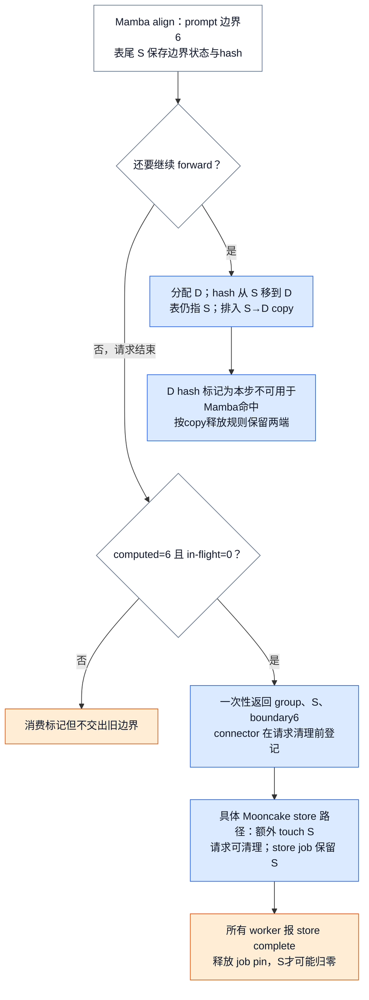
```mermaid
flowchart TB
    A["Mamba align：prompt 边界6<br/>表尾 S 保存边界状态与hash"] --> B{"还要继续 forward？"}
    B -->|是| C["分配 D；hash 从 S 移到 D<br/>表仍指 S；排入 S→D copy"]
    C --> D["D hash 标记为本步不可用于Mamba命中<br/>按copy释放规则保留两端"]
    B -->|否，请求结束| E{"computed=6 且 in-flight=0？"}
    E -->|否| F["消费标记但不交出旧边界"]
    E -->|是| G["一次性返回 group、S、boundary6<br/>connector 在请求清理前登记"]
    G --> H["具体 Mooncake store 路径：额外 touch S<br/>请求可清理；store job 保留 S"]
    H --> I["所有 worker 报 store complete<br/>释放 job pin，S才可能归零"]
    D ~~~ E
    classDef normal fill:#fff,stroke:#64748b,color:#0f172a
    classDef blue fill:#dbeafe,stroke:#2563eb,color:#0f172a
    classDef orange fill:#ffedd5,stroke:#ea580c,color:#0f172a
    class A,B,E normal
    class C,D,G,H blue
    class F,I orange
```

这不是所有 connector 都执行的保存动作。一个实际实现是 Mooncake store scheduler 的 `register_finished_partial_tail()`：校验边界、去重 id 后 `touch()` 精确源块，建立带 worker 完成计数的保存任务；它返回 `False` 允许请求正常清理，因为 job 已独立持有引用。直到所有 worker 的 `completed_saves` 到齐才释放 pin；`has_pending_push_work()` 让 Engine 即使没有活跃请求也继续处理未完成保存。网络协议归 22；本页只需要明确“请求完成”不等于“该物理块立刻可复用”。native CPU tier 是后面的另一条路径，不能用同名 offload 把两者的回调混为一谈。

#### 5.1.3 Mamba align 的正常生命周期：长位置表只持有少量状态

前两节解决 partial 命中的特殊续写；正常 align 路径的目的则是：保存可继续 recurrent 计算的上一状态及本步目标，不为每个历史位置永久持有一个 state。**输入**是 spec 的 block 长度、主模型本步终点、已安全处理进度、命中状态与 checkpoint/scratch 需求；**输出**是需领取的 pool id、含 null 的位置表、可复用 hash 与后续归还引用。分配返回的仍是 CPU 计划，不是已生成的 recurrent state。

`MambaSpec.max_memory_usage_bytes()` 区分三种预算：`all` 按 `ceil(max_model_len / block_size) + num_speculative_blocks` 个 page；`align` 按 `2 + num_speculative_blocks + num_prefill_checkpoint_blocks` 个 page；`none` 按 `1 + num_speculative_blocks` 个 page。align 的**位置表长度**却仍按 `ceil(max_len / block_size) + num_speculative_blocks` 预留，因为旧位置变 null 而不是删列。这里的 page 是 recurrent state 的形状/精度所需字节，可被 padding，不是保存 block 内每个 token 的一份状态。

处理链分为四个时点：

1. **估算与分配**：align 用 `num_tokens_main_model` 而非额外 lookahead 终点定位 running state。普通无 partial/checkpoint 的新请求仅领一个当前 state 加 speculative scratch；跨新边界的老请求通常只需一个新 state，跳过的历史列补 null。若所需列已覆盖且无特殊工作，则无需新增块。`last_state_block_idx` 记下旧 running state；partial 和内部 checkpoint 各有自己的附加容量，不能一概写成“永远只领一块”。
2. **执行交付与安全回收**：新旧状态在本步并存，runner 完成状态读取/写入；后续 `remove_skipped_blocks()` 用已安全处理进度回收。Mamba 的跳过量为 `processed_computed_tokens−1`，只需保留最后已算 token 的状态；align 另按 `last_state_block_idx` 补回收非连续 prefill 留下的更老状态，原列改为 null。没有用带在途部分的乐观进度提前回收。
3. **缓存身份**：完整边界或允许的 partial checkpoint 给精确 state block 登记 hash；新登记和本步 CoW 生成的 hash 放入 `cached_blocks_this_step`。另一请求若本步正好命中这些新状态，估算返回 `num_gpu_blocks+1` 使其延后调度，下一步 `new_step_starts()` 才清集合。它是 Mamba 本步状态尚不可用的保护，不是所有 prefix hash 的通用设备完成事件。
4. **请求清理**：`pop_blocks_for_free()` 清除分配标记、旧状态索引、checkpoint 位置和 producer 标记，并丢弃尚未交出的 boundary offer；请求引用归还走原有释放链。ref 归零可以保留缓存 hash，未来命中再 touch；已有执行/copy/connector pin 仍按各自完成条件释放。

给定块长 1600、无 speculative scratch/内部 checkpoint/partial hit，且每步完成后才进入下一步：首次算到 1600 时表为 `[S0]`；跨到 3200 时同时保有 `[S0,S1]`；确认处理到 3200 后释放 S0 的请求引用，再跨到 4800 时得到 `[null,S1,S2]`。位置列从 1 增至 3，但这条路径同时持有的普通请求状态最多为 2。初次 prefill 若直接跳到 4800，历史两列也可直接补 null，不必曾经分配 S0/S1。

<!-- Figure spec: 问题=align为何不按长位置表占用同等state；范围=串行完成、B1600、无partial/checkpoint/spec的单请求三步；节点=三次表快照和安全回收；边=时间与已处理进度，不表示GPU数据复制；必须看见S0引用归还后列0保留null、S1和S2并存，ref0可能仍cached；正文解释设备执行条件。 -->
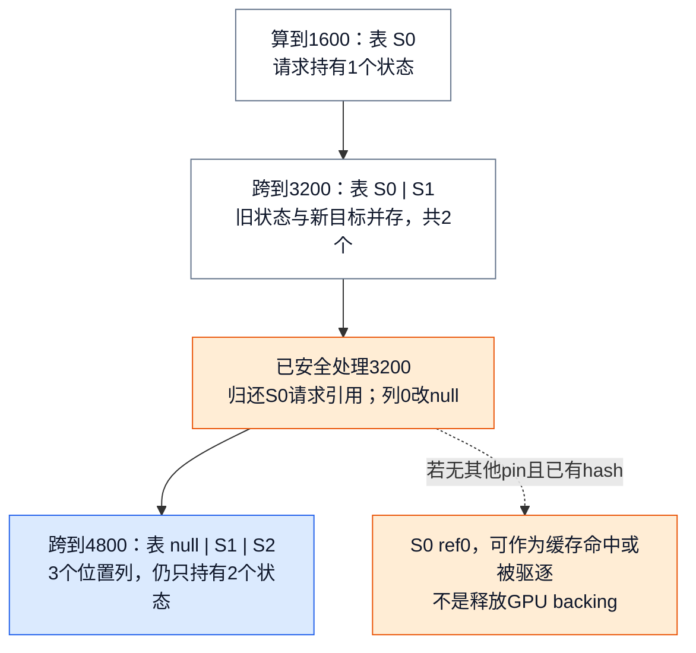
```mermaid
flowchart TB
    A["算到1600：表 S0<br/>请求持有1个状态"] --> B["跨到3200：表 S0 | S1<br/>旧状态与新目标并存，共2个"]
    B --> C["已安全处理3200<br/>归还S0请求引用；列0改null"]
    C --> D["跨到4800：表 null | S1 | S2<br/>3个位置列，仍只持有2个状态"]
    C -.->|若无其他pin且已有hash| E["S0 ref0，可作为缓存命中或被驱逐<br/>不是释放GPU backing"]
    classDef normal fill:#fff,stroke:#64748b,color:#0f172a
    classDef blue fill:#dbeafe,stroke:#2563eb,color:#0f172a
    classDef orange fill:#ffedd5,stroke:#ea580c,color:#0f172a
    class A,B normal
    class D blue
    class C,E orange
```

**内部 checkpoint 与 scratch 是有条件的扩展。** prefill checkpoint 候选为严格小于终点的最后 hash 边界；EAGLE drop 模式再退一个 hash 单元，最后截到零。backend 必须提供 `prefill_checkpoint_alignment`，query 起点须 hash 对齐，候选须严格位于 query 内、至少离起点一个 hash 单元，满足相对 backend 对齐，并且 checkpoint 列晚于 initial-state 列。manager 还检查预留列为空/未存在或可替换的 scratch，准入探测不写 `_checkpoint_positions`；实际分配才记下该步位置并为内部状态留块。

用测试里的数判一次：`start=0、end=100、hash=8、Mamba block=64、alignment=16` 时，**checkpoint=96 有效**；**88 无效**——它虽然是 hash 边界，却不满足“相对起点 16 对齐”这一条；backend 没有声明 `prefill_checkpoint_alignment` 时也一律无效。另有一个层级陷阱：Kimi K3 KDA 构建 metadata 时用的是**该层 `kv_cache_spec.block_size`** 算 checkpoint 列并调同一校验器，不能拿全局配置块大小替所有层；Scheduler 当前只取第一个 Mamba spec 的 alignment，源码仍留着“不同 Mamba spec 各有对齐要求”的支持 TODO。

具体回归例是 hash16、Mamba block32、终点120，启用一个内部 checkpoint：列2持有独立 checkpoint，列3是 running state。真正导出的是 state@112，`_cache_partial_tail_block()` 用 `replace_existing_hashes=True` 把临时 state@96 键替换为112，保留同一个请求表 owner；释放后重放120-token请求命中112，而不是错误命中96。该例覆盖 identity、清理与重命中，不证明 GPU kernel 在本机执行通过。

跨边界时已有 speculative scratch 可移到表尾，旧槽变 null，**不另领物理块，也不由该函数复制 state**；但 `_relocate_speculative_block()` 要求块非 null、ref 为1且无 hash，额外 pin 的共享块会触发断言。checkpoint 分支可能重新分配 scratch，不能把重定位套到所有分支。`_cache_partial_tail_block()` 对 multi-module MTP 仍有显式保存 reserved slot 的 TODO，故本页只陈述现有分支，不声称所有 MTP/checkpoint 组合完备。DCP 不扩大 Mamba 自身的 block 粒度；能否进行细粒度联合命中另受 §5.1 的 coordinator 限制。07 负责挑选可执行的 checkpoint 对齐终点，11/12 负责实际状态导出，本页拥有它们对应的容量、位置表、身份和归还规则。

源码路线：`vllm/v1/kv_cache_interface.py::MambaSpec.max_memory_usage_bytes`、`MambaSpec.max_num_blocks_per_req`、`get_mamba_prefill_checkpoint_position`、`is_mamba_prefill_checkpoint_valid` → `vllm/v1/core/single_type_kv_cache_manager.py::MambaManager.get_num_blocks_to_allocate`、`allocate_new_blocks`、`remove_skipped_blocks`、`cache_blocks`、`_cache_partial_tail_block`、`_relocate_speculative_block`、`pop_blocks_for_free`。验证入口：`tests/v1/core/prefix_cache/test_partial_prefix_cache_hits.py::test_internal_checkpoint_uses_partial_hash_lifecycle`、`tests/v1/core/test_single_type_kv_cache_manager.py::test_mamba_speculative_block_relocation_requires_exclusive_ownership`。

### 5.2 混合状态与布局：不同层的容量怎样统一计算

前面用单个 group 建立了基本流程；现代模型却可能同时包含要保留全部历史的层、只读最近窗口的层和只需恢复 recurrent state 的层。若全部按 full attention 留历史，会失去各自的容量优势；若完全独立分配，又难以共同使用有限预算。因此要回到 §3.1 的启动阶段，把这些存储要求先规划成可共用物理池的 groups，再交给 §4 的管理链。这里的“回到启动期”是对既有基本流程的扩展，不是请求执行中重新布局整池。

full attention、sliding/local attention、Mamba、hidden-state cache 对历史保留和每块 token 数的要求各异。每个 group 有自己的 manager 和逻辑表，却共用一个 BlockPool。底层 `KVCacheTensor` 是同一 backing allocation 的不同 view；不同 group 可以解释同一字节范围，因此同一 id 不能同时分配给两个不同 group。一个请求若两组各需 3 块，总共就占 6 个 pool id，不是用 3 个 id 同时装两组状态。

#### 5.2.1 packed groups：取最大组字节数，不是统一每层 page

当前基线不能概括成“先把所有层 page padding 成一样大”。`get_kv_cache_groups()` 先尝试统一 spec/type、专用 GLM5-Next 分组及 hidden-state 分离等路径；适用时用 block-outermost packed groups，之后才走一般统一 page 的 fallback。

packed 路径先按 `UniformTypeKVCacheSpecs` 的语义兼容性分桶；桶内按 page 字节数归类。每种 page 的层数相等时，把“一层各 page”作为 1:1 重复模式；混合 page 的平衡桶必须保留，设定每组重复数的下界，再由 `_approximate_gcd()` 选使 padding 最少的重复数，平手取更大值。非平衡桶整体保留，不会把任意 2:1 比例都当成重复模式。Mamba 桶还会继续拆分，使组内 state 数装入 attention 已要求的 block 大小。

例如一个兼容桶含 3 层 A 和 3 层 B，另一桶有 5 层 C。混合桶设下界 3；重复数 3 的补齐损失为 `0+1=1`，取 4 为 `1+3=4`，取 5 为 `2+0=2`，故选 3。A/B 形成 6 层组，C 按交错分成 `[C0,C2,C4]` 与 `[C1,C3]`。这对应回归测试中 3 MLA + 3 indexer、5 SWA 层形成 6/3/2 个成员的分组形状。下图 page 字节数是单独给定的教学值，不是该测试的模型参数。

<!-- Figure spec: 真二维物理页布局用SVG；给定page A2/B1/C4 KiB和6/3/2成员，逐行真实宽度相加9/12/8，最大stride12，60KiB得5块含null；所有行是同一ID的重叠view，不是可同时分配的三份显存。 -->
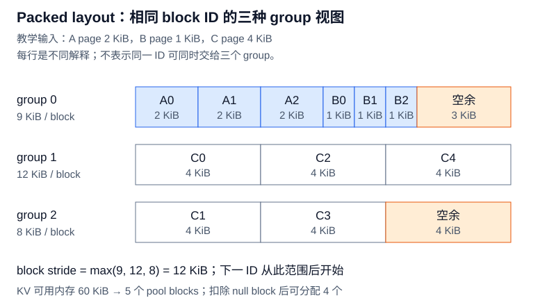

图中的 pool block 宽度为 `max(9,12,8)=12 KiB`，不是三行相加的 29 KiB。给 KV 的内存若为 60 KiB，得到 5 个物理块，扣掉 null 后可分配 4 个。普通 packed layout 的地址来自 view offset、层的 `layer_stride`、物理 id 的 `block_stride`；所有 view 共用 backing，总容量不能按 tensor view 的 size 重复累加。

这种布局要求 block compact；混合 page 且多 group 时，还要求 layer 维在 block 维内。布局不支持就不能套此 packed 路径。fallback 仍可能增大 attention block 以匹配 page、padding Mamba 或非 MLA page；无法表达的组合可能采用受限 full-allocation fallback 或直接报错。把 local cache 提升为 full allocation 改变保留容量，不改变 attention 只看窗口的计算语义。

#### 5.2.2 GLM5-Next 与 PP：先分组，再按本 rank 的层重算容量

GLM5-Next 专用路径组合 Mamba、MLA 和压缩 indexer，并利用 Mamba page 可装入 MLA page 的关系安排 alias。真实测试的 34 层 Mamba、11 层 MLA、11 层 indexer 被分成四个 Mamba 组，成员数 9/9/8/8；一个物理 block 的字节跨度是 `11 × MLA page + 11 × indexer page`。Mamba view 使用对应 MLA 区域，必要的 padding 必须能装下；Mamba 比 MLA page 还大时会拒绝。可选 k-pool tail state 共用 indexer 区域，每请求只留一个块，不额外增加这段 backing 字节数。

PP 不能沿用全模型层数直接估每 rank 容量。`_project_kv_cache_groups_to_worker()` 保持 group 身份但过滤非本 rank 层，重新构造局部 spec；测试中一个 stage 有 5 MLA、5 indexer，Mamba 组为 5/5/4/4，跨度于是变为 `5 × MLA page + 5 × indexer page`。全局分组还要满足最不利 PP stage 的 Mamba/MLA 比例：另一测试需要从四组增到五组，得到全局 7/7/7/7/6。若某 stage 有 Mamba 却没有可共同布局的 MLA，配置直接报错，提示调整层分区。

最终各 worker 按可用内存计算，再取能共同使用的最小 `num_blocks`，重新规划 view stride/offset；不是只缩小一个数字而保留旧地址步长。上述 tail scratch 的 `prefix_cacheable=False` 则影响§5.3 的命中边界：它占本地容量，却不应要求自己也有 prefix hash。

#### 5.2.3 一个 state 可以覆盖多个 token，不等于改大 prefix block

`KVCacheSpec.block_size` 描述调度和逻辑表中的 token 容量，`tokens_per_state` 描述 Kernel 表示里一个 state 对应多少 token。普通 attention 的默认值是 1；值大于 1 时，多 token 被压成一个 state。例如 block 含 256 个 token、`tokens_per_state=4`，`get_num_kernel_states()` 需要 64 个 Kernel states。这个比例改变物理 state 数与 slot mapping 的解释，不会自动把 prefix hash 粒度也从 256 改成 64 个 token。

这个字段不是只为“压缩”命名。`AttentionSpec` 还允许小于 1 的比例来表达一个 token 对应多个 states；`MambaSpec` 则用特殊值表示请求级 state page，而不是套普通 attention 的整数除法。因此容量代码应询问 spec 的转换方法，不能在 manager 或 Kernel 中各自硬编码 `num_tokens / block_size`。

DeepSeek V4 展示了为何“一个模型一类 KV cache”已经不够：

| 构造期模块 | 向 planner 声明的状态 | 规划含义 |
|---|---|---|
| 主 compressed attention cache | 压缩比大于 1 时返回带相同 `tokens_per_state` 的 `MLAAttentionSpec` | 多 token 共用一个 compressed state；比例不满足时不在这里重复分配 SWA |
| `DeepseekV4IndexerCache` | 独立的 `MLAAttentionSpec`，同样携带 compress ratio | indexer 状态有自己的层身份和物理 view，不能假设与主 cache 是同一个 tensor |
| `DeepseekV4SWACache` | 独立 `SlidingWindowMLASpec` | 窗口状态按自己的 page 规划；当前 block size 还受与 C4A page 物理共享的布局约束 |
| `CompressorStateCache` | 独立 `SlidingWindowMLASpec` | compressor history 用 FP32 state 与自己的 shape；block size 由可共享物理 page 的几何关系约束 |

这些模块在模型构造时分别登记进 `static_forward_context`，planner 再按类型收集 spec、分组并建立 backing views；构造目录的生命周期见 [[09_vllm_model_library_analysis|模型库]]。因此排查 DSv4 容量时要同时核对“有哪些 cache-bearing modules”“每类 token/state 比例”“哪些 views 共享一页”，而不是只用 attention 层数乘一个统一 KV 字节数。架构上各状态的算法作用见 [[01_theory/01_models/deepseek/27_deepseek_v4_implementation_deepdive|DeepSeek V4 实现深挖]]。

回归测试用 256 token、压缩比 4 得到 64 个 indexer states，并覆盖压缩比 4/128 的连续 packing 与 DSv4 packed zeroer 几何。这证明当前实现的计数和布局合同；它不是实际模型吞吐或显存节省的 benchmark。

### 5.3 多组前缀复用：各自命中后，为什么还要反复缩短长度

即使字节布局成立，所有组仍须能从同一个 token 边界恢复。scheduler 粒度取各有效 group block size 的公倍数；hash 粒度依可缓存组求公约数或验证显式配置，二者职责不同。**这里的「hash 粒度」就是配置键 `CacheConfig.prefix_match_unit`**——docstring 逐字写明它「equals to the `hash_block_size` used throughout the KV cache code」，默认 `None` 由上述求公约数推出，显式给值时要求每个 group 的 `block_size` 都能被它整除，且它「只控制匹配粒度，不控制多久存一次状态」。另一个容易与之混淆的键是 `CacheConfig.prefix_cache_retention_interval`（默认 0，从已弃用的 `VLLM_PREFIX_CACHE_RETENTION_INTERVAL` 读取）：它同样以 token 计，但管的是**每隔多少 token 额外保留一个 SWA/Mamba checkpoint**——`0` 表示只保留语义 checkpoint（最新重放边界、共享前缀交汇点），正值才按该间隔额外留周期性 checkpoint。两者正好被 `prefix_match_unit` 的 docstring 那句「not how often states are stored」对开：一个定**匹配粒度**，一个定**存的疏密**，都不是时间维度的保留时长。`prefix_cacheable=False` 的 scratch **不参与 hash 对齐、命中查找和 fine-grained 能力限制**，但仍参与 pool 容量和 scheduler block 的共同约束。

Hybrid coordinator 把相同 spec 的组批量查询，按 full attention 优先的顺序迭代候选长度。某组缩短候选后，需要让其它组重新确认；Mamba 可能只保存稀疏 checkpoint，某窗口也可能只在更短边界有完整 tail，不能把各组独立最长命中简单取 min 就当作最终答案。

用一个明确的教学 lookup 结果演示：最大候选 12；full 可以到 12，Mamba 在不超过 12 时最近 checkpoint 是 8，window 在候选 8 时只能找到长度 4 的完整 tail。候选降到 4 后重新确认，假设 Mamba 的 checkpoint 4 和 window 所需 tail 都存在，就共同命中 4。例子的 lookup 结果是给定输入，不代表所有模型都按这些长度保留状态。

<!-- Figure spec: TB fixed-point 算法数值链；给定三组lookup结果12→8→4，第二轮4稳定，full已查结果可截短，不能丢掉重查Mamba/window步骤。 -->
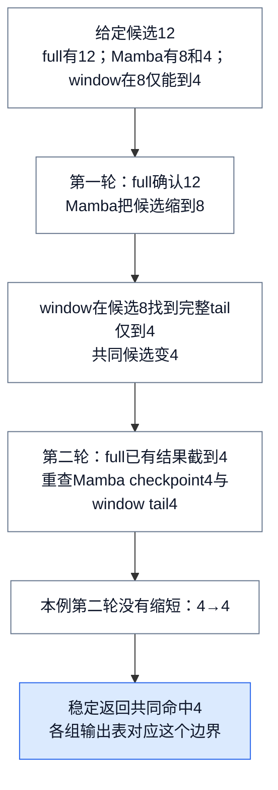
```mermaid
flowchart TB
    A["给定候选12<br/>full有12；Mamba有8和4；window在8仅能到4"] --> B["第一轮：full确认12<br/>Mamba把候选缩到8"]
    B --> C["window在候选8找到完整tail仅到4<br/>共同候选变4"]
    C --> D["第二轮：full已有结果截到4<br/>重查Mamba checkpoint4与window tail4"]
    D --> E["本例第二轮没有缩短：4→4"]
    E --> F["稳定返回共同命中4<br/>各组输出表对应这个边界"]
    classDef normal fill:#fff,stroke:#64748b,color:#0f172a
    classDef blue fill:#dbeafe,stroke:#2563eb,color:#0f172a
    class A,B,C,D,E normal
    class F blue
```

候选只下降，因此能收敛；full 已经查出的连续结果可截短复用，简单 full + 另一类的组合还有少做一轮的优化。fine-grained 命中要求 Mamba align 且相关可缓存 manager 支持；允许在 group 物理块内部的 hash 边界返回实际 token 数，否则向下对齐 scheduler block。PCP 当前拒绝 hybrid，DCP hybrid 只接受 full/Mamba 组合；有效 attention block 还要考虑分片倍率，不能把 Mamba 的时间块也盲目乘上同一倍率。

EAGLE 的命中裁剪受 `use_eagle_block_drop()` 和具体 group 标记控制，不能把“启用任意 EAGLE”直接等价为每组统一减一块。coordinator 针对候选验证需要的额外边界，并记录本轮已验证组；候选缩短后才重新验证，防止同一候选重复丢块。候选 checkpoint 是否有效由本页判定；**用它挑切分点并算 padding** 归 [[07_vllm_scheduler_analysis#5.4 Mamba split 保证缓存的是哪个位置的状态|Scheduler §5.4]]，本页保留的是多组最终能否从同一状态恢复。

缓存保留策略同样影响可命中的边界。取 `None` 时保留密集可达 checkpoint——这是 `SingleTypeKVCacheManager.cache_blocks(retention_interval=None)` 的**形参**默认，不是上面那个配置键的默认（配置键 `prefix_cache_retention_interval` 默认是 0）；0 只保留当前恢复仍需的状态；正 interval 在 sliding-window/Mamba 中按分段边界保留，且必须是 scheduler block 的倍数。窗口要保留相应边界的完整 tail，Mamba 要保留状态 checkpoint；两者还保留当前 replay 所需部分和共享分叉点，不能因“只保留最近”删掉别的请求仍引用的状态。它们改变 hash 可达集合，不绕过 pool 引用规则。

### 5.4 CPU tier：GPU 淘汰后的内容，怎样重新变成可用状态

前面的复用都要求内容仍留在 GPU 池中。若缓存因容量压力被驱逐，后来的相同请求只能重算；CPU tier 为这些可能再次使用的内容提供较大的存放空间。它不是让 attention 直接读取 host slot，而是先把内容复制回已准入的 GPU 槽，再恢复执行。因此需要独立的内容索引、传输计划和完成协议，不能仅给 GPU free queue 加一个“在 CPU”标记。复制与重算谁更便宜取决于模型、链路和复用距离，这是结构上的使用判断，本文没有测量盈亏点。

本地 native CPU offload 扩大的是可复用内容容量，不增加 GPU pool block 数。配置 `kv_offloading_size` 且选择 native backend 时，默认创建 `OffloadingConnector`，显式环境开关才选择 `SimpleCPUOffloadConnector`。以下讲默认路径；跨 Engine P/D 与远端 tier 见 22。

GPU 用 block id 标识当前物理槽；CPU 使用 `OffloadKey = block_hash + group_idx` 标识内容，再映射到独立 host `BlockStatus.block_id`。例如 GPU id 7 的内容 K 可以存在 host slot 2；GPU 7 后来分给别的内容，不会让 host slot 2 自动改名。scheduler 侧 CPU manager 维护 residency、引用和 eviction policy，worker 只按 copy spec 执行 GPU↔CPU 复制。

#### 5.4.1 store：先占位置，完成后才能命中

`prepare_store()` 先按可选 store threshold 筛选，过滤已有 key，保护本次输入集合不被选作 victim，并检查 free + evictable 容量。选择 LRU/ARC 等策略淘汰后，才分配 host slot；新条目 `ref_cnt=-1` 表示写入 pending，lookup 是 `HIT_PENDING`，不能当 ready 数据加载。`complete_store(success=True)` 才变成 ref 0、ready、可驱逐，并发布 stored event；失败删除未完成条目、归还 slot，不覆盖已经存在的 ready key。若复用别的内容的容量，removed event 先于新内容的 stored event。

#### 5.4.2 load：第一个读者取出淘汰队列，最后一个读者放回

`prepare_load()` 要求 key ready，ref 从 0 到 1 时才从 evictable 集合移出；第二个并发 load 变为 2，不重复减少 evictable count。每次完成减 1，只有 1→0 才重新允许淘汰。

<!-- Figure spec: 三参与者顺序图给出GPU7内容K/host2，store pending -1→ready0，再双load0→1→2→1→0及evictable状态；说明worker结果经connector汇总所有worker后生效。 -->
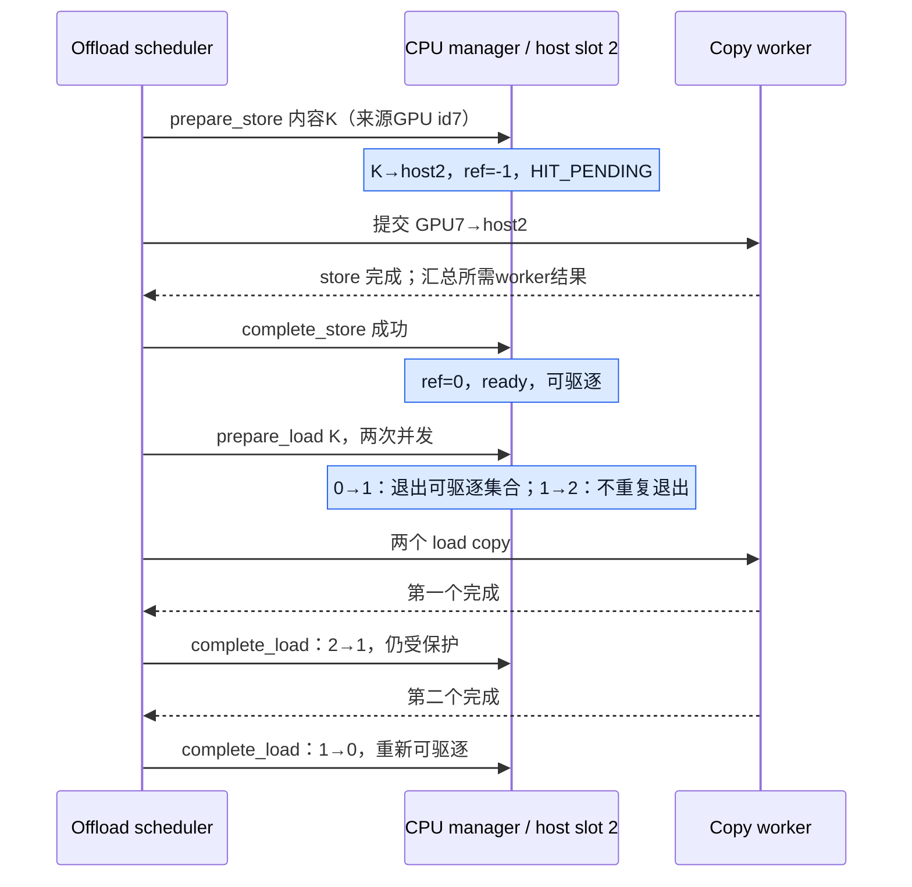
```mermaid
%%{init: {"themeVariables": {"noteBkgColor": "#dbeafe", "noteBorderColor": "#2563eb", "noteTextColor": "#0f172a"}}}%%
sequenceDiagram
    participant S as Offload scheduler
    participant H as CPU manager / host slot 2
    participant W as Copy worker
    S->>H: prepare_store 内容K（来源GPU id7）
    Note over H: K→host2，ref=-1，HIT_PENDING
    S->>W: 提交 GPU7→host2
    W-->>S: store 完成；汇总所需worker结果
    S->>H: complete_store 成功
    Note over H: ref=0，ready，可驱逐
    S->>H: prepare_load K，两次并发
    Note over H: 0→1：退出可驱逐集合；1→2：不重复退出
    S->>W: 两个 load copy
    W-->>S: 第一个完成
    S->>H: complete_load：2→1，仍受保护
    W-->>S: 第二个完成
    S->>H: complete_load：1→0，重新可驱逐
```

worker 的完成不是“提交了一个异步操作”。CPU copy handler 查询结束 event，完成前保留所需缓冲区和 copy 计划；connector scheduler 汇总 job 的 worker 完成数，再通知 manager 提交 store 或释放 load pin。reset 还有旧 job 过滤和旧 load 排空规则，不能将 reset 前晚到的结果登记成新 cache；这与 GPU `reset_prefix_cache()` 遇活跃引用返回 `False` 是不同接口。当前 native CPU worker 支持 CUDA-like 和 XPU，其他平台会拒绝。

GPU pool 与 CPU tier 都要协调内容身份和使用期间的保护，但完成规则不同：CPU pending store 明确在 copy 完成后才 ready；GPU hash 可以在 forward 前登记，CoW 额外引用又有条件 fence。两套引用数不能相互替代，更不能把一种完成点推广给所有 tier。

## 6. 整体收益、成本与使用边界

### 6.1 把各项收益与代价放到同一本账上

分页解决了连续增长与分配的问题；prefix caching 在这套池上减少重复计算；CoW 保证共享内容不被续写破坏；hybrid 适应不同状态模型；CPU tier 则把部分已淘汰内容保留得更久。它们可以组合，但收益不能独立相加：更高命中可能占住更多可驱逐块，细粒度复用可能增加 copy，多组共同边界又可能缩短最终命中。

| 机制 | 省下什么 | 新增或保留的成本 | 什么时候成为限制 |
|---|---|---|---|
| 分页与预分配 backing | 连续最大长度预留、请求增长搬迁 | 尾块空槽、block table、pool 管理；backing 长驻 | 块越大，短请求尾部浪费越明显；块越小，管理项更多 |
| GPU prefix cache | 相同前缀的重复 prefill，活跃公共前缀的重复存储 | hash/key、引用、淘汰队列；内容可能重复落块 | 前缀少重复或被频繁驱逐时，收益受限；同名权重变更还需一致性管理 |
| Window / checkpoint 保留 | 不再需要的历史容量 | 安全进度计算、保留掩码、恢复边界检查 | 在途步骤和共享分叉会延迟回收，不能按乐观进度直接清空 |
| Partial CoW（受 §5.1 能力门约束） | 相对物理块边界本来要重算、但已形成完整 hash 单元的前缀 | 私有目标块、设备 copy、源/目标 pin | 短命中节省的计算可能不足以覆盖 copy 与临时占块；本页未测临界点 |
| Hybrid 与 state packing | 不同历史长度/state 密度可按需持有容量 | padding、分组和投影、共同命中重查 | 最大组字节跨度与每请求 id 数共同限制并发；不支持的布局需 fallback 或拒绝 |
| Native CPU tier | GPU 淘汰后的再次计算机会成本 | host 内存、GPU↔CPU 字节传输、job 元数据、完成等待 | 复用距离、复制链路与可隐藏窗口决定是否划算；GPU 容量仍是执行准入门 |
| 安全释放与观测 | 避免在用内容被覆盖，保留可解释的状态信号 | 延迟队列、pin、完成汇总、事件统计 | 请求完成可能早于容量重新可用，usage 与活跃请求数不总同步 |

上表是从数据量、引用关系和控制路径推导出的成本账，不代表打开这些功能必然降低时延。CPU offload 至少要比较“恢复这些状态的传输与等待”同“重新计算这些前缀”的成本；没有实际模型、链路和复用分布时，不能给出统一阈值。

上述取舍也可以从具体替代方案反看；这张表保留基本机制为何不采用直观方案的理由：

| 直观替代 | 为什么当前实现需要另一条路 | 相应成本 |
|---|---|---|
| 每请求独占连续 KV 区 | 未知增长和结束时间要求搬迁或按最坏长度预留 | 逻辑表映射物理块 |
| prefix cache 单独维护 `hash → tensor` | 活跃 KV 与缓存 KV 会形成两套容量账 | hash 与 free queue 都索引同一对象 |
| 每种 hybrid group 一套池 | 难以让不同历史长度的 group 共享容量 | 所有组联合预测，使用同一 id 空间 |
| partial tail 命中后原地续写 | 改变仍由旧 hash 标识的内容 | 新块与 copy-on-write |
| CPU tier 直接用 GPU id 标识内容 | GPU id 复用后会指向另一份内容 | 独立内容 key、host slot 和完成状态 |

### 6.2 从哪些边界判断正确性与运行状态


| 观察到的边界 | 应怎样解释 |
|---|---|
| GPU 容量不足，分配返回 `None` | 本次没有新增 owner；已经安全越过的窗口可能已回收，重试/抢占由 Scheduler 决定 |
| 块有 hash 但 ref 为 0 | 可命中的缓存也属于可驱逐容量，命中 touch 后会重新占用这份容量 |
| 删除 hash 后 ref 仍正 | 取消缓存身份不释放活跃对象；prefix reset 也不强拆活跃池 |
| partial hit 节省计算却仍多要一块 | CoW 目标与 copy 是代价；释放两端引用须区分 pool 准备、条件 fence、设备顺序 |
| Mamba 请求结束但块未归零 | 可能还有执行保护或 connector 保存任务的独立 pin；完成消息不代表所有引用都消失 |
| hybrid padding 或 group 变多 | 每 block 字节跨度、每请求所需 pool id 数都影响容量；PP 还要按局部投影与最小共同块数重算 |
| CPU lookup 为 `HIT_PENDING` | 有容量和在途内容，不等于现在可加载；失败 store 会删除未完成条目 |
| 日志报 HMA 被自动关闭（None 分支的 connector gate） | 各组不再按自己的窗口回收，SWA 层退化为全长持有：容量与性能都会变，但不会报错。显式开启（`disable_hybrid_kv_cache_manager=False`）遇到不支持的 connector 则是 `create_connector` 抛 `ValueError` 的启动硬失败，两种结局不能混为一谈（§4.5.1） |
| 同一请求在 full 组被拒，SWA/chunked 组看起来还有余量 | 回收型组的准入上限被 cap 截短（§3.3.1），full 组仍要按整段长度计；各组联合计数，任一组超池即拒绝，不能只看剩余块数最多的那一组 |
| 启动时 free 显存低于 startup plan 记录的基线 | plan 未被应用，回落到完整 profiling；本次容量因此可能与上次同配置启动不同（§3.1.3） |
| `num_gpu_blocks_override` 生效 | `available_memory` 被按 override 反算改写，容量门与最终配置仍自洽，但它不再反映实测显存；此时用块数推断可用显存是错的（§3.1.3） |

这些例子依据固定基线源码和已有回归测试重建，教学数字已明确标注；本页没有实跑 GPU kernel、跨 worker 传输或性能基准，不能据此给出实际命中率与时延结论。

### 6.3 源码与验证入口

建议将 §4.6 的调用树与以下稳定符号配合阅读，而不是把文件整体当引用：

1. `vllm/v1/core/kv_cache_utils.py::KVCacheBlock`、`FreeKVCacheBlockQueue`、`generate_block_hash_extra_keys`：物理字段、队列与内容键；`tests/v1/core/test_prefix_caching.py::test_prefill` 对照共享和释放次序。
2. `vllm/v1/core/block_pool.py::BlockPool.get_new_blocks`、`touch`、`is_block_writable`、`free_blocks`、`cache_partial_block`、`move_block_hashes`、`reset_prefix_cache`：同一对象上的分配、身份和回收。
3. `vllm/v1/core/kv_cache_manager.py::KVCacheManager.get_computed_blocks`、`allocate_slots`；`vllm/v1/core/kv_cache_coordinator.py::KVCacheCoordinator.allocate_new_computed_blocks`：命中上限、容量检查与全组 touch 顺序。
4. `vllm/v1/core/single_type_kv_cache_manager.py::SingleTypeKVCacheManager._apply_cow`、`MambaManager.allocate_new_blocks`、`finalize_partial_tail_offload`；`vllm/v1/core/sched/scheduler.py::Scheduler._free_cow_retained_blocks`、`_connector_finished`：两种 partial 尾处理及条件完成边界。
5. `vllm/v1/kv_cache_interface.py::KVCacheSpec.tokens_per_state`、`get_num_kernel_states`、`AttentionSpec.tokens_per_state`；`vllm/models/deepseek_v4/attention.py::DeepseekV4Attention.get_kv_cache_spec`、`DeepseekV4IndexerCache`；`vllm/v1/attention/backends/mla/sparse_swa.py::DeepseekV4SWACache`；`vllm/models/deepseek_v4/compressor.py::CompressorStateCache`：token/state 比例与 DSv4 多缓存身份。验证：`tests/v1/attention/test_indexer_deepseek_v4_slot_mapping.py`、`tests/v1/core/test_contiguous_kv_packing.py`、`tests/v1/worker/test_dsv4_packed_zeroer_geometry.py`。
6. `vllm/v1/core/kv_cache_utils.py::_get_packed_kv_cache_groups`、`_get_kv_cache_groups_glm5_next`、`_get_kv_cache_bytes_per_block`、`_project_kv_cache_groups_to_worker`、`get_kv_cache_configs`：分组、字节跨度与 PP 投影。
7. `vllm/v1/core/kv_cache_coordinator.py::HybridKVCacheCoordinator.find_longest_cache_hit`；`vllm/v1/core/single_type_kv_cache_manager.py::SlidingWindowManager.reachable_block_mask`、`MambaManager.reachable_block_mask`：共同命中长度和保留集合。
8. `vllm/v1/worker/gpu/model_runner.py::GPUModelRunner.add_requests`、`update_requests`、`prepare_attn`：请求表到设备 slot 的交付链。
9. `vllm/distributed/kv_transfer/kv_connector/v1/mooncake/store/scheduler.py::MooncakeStoreScheduler.register_finished_partial_tail`、`update_connector_output`：结束请求的精确边界块如何由保存任务继续持有。
10. `vllm/v1/kv_offload/cpu/manager.py::CPUOffloadingManager.prepare_store`、`complete_store`、`prepare_load`、`complete_load`；`vllm/v1/kv_offload/cpu/gpu_worker.py::SingleDirectionOffloadingHandler.get_finished`：host 内容状态与设备完成。
11. `vllm/v1/engine/core.py::EngineCore._initialize_kv_caches`、`__init__`、`step`；`vllm/v1/core/kv_cache_utils.py::generate_scheduler_kv_cache_config`；`vllm/v1/worker/gpu_worker.py::Worker.initialize_from_config`：启动两端配置与执行结果交付。
12. `vllm/v1/core/kv_cache_coordinator.py::get_kv_cache_coordinator`、`KVCacheCoordinator.__init__`、`free`；`vllm/v1/core/single_type_kv_cache_manager.py::get_manager_for_kv_cache_spec`、`register_all_kvcache_specs`、`SingleTypeKVCacheManager.free`；`vllm/v1/core/sched/scheduler.py::Scheduler._get_local_prefix_cache_hit`、`_free_request`、`_free_request_blocks`、`_drain_deferred_frees`：选择、查询跳转、所有权及安全释放。
13. `vllm/v1/kv_cache_interface.py::SlidingWindowSpec.max_admission_blocks_per_request`、`ChunkedLocalAttentionSpec.max_admission_blocks_per_request`；`vllm/config/vllm.py::VllmConfig.max_in_flight_tokens`；`vllm/v1/core/single_type_kv_cache_manager.py::SingleTypeKVCacheManager.get_num_blocks_to_allocate`：启动预算与 full-sequence admission 共用回收型容量上限，但本步实际分配不套 cap。
14. `vllm/config/vllm.py::VllmConfig.__post_init__`；`vllm/distributed/kv_transfer/kv_connector/factory.py::KVConnectorFactory.supports_hma_config / KVConnectorFactory.create_connector`；`vllm/v1/core/kv_cache_utils.py::unify_hybrid_kv_cache_specs`、`_promote_local_kv_cache_specs`：HMA 三态解析与有限的 full-allocation fallback。hash 初始化/增量路线见 §2.3，Mamba align 状态生命周期与针对性测试见 §5.1.3。
15. `vllm/v1/core/kv_cache_coordinator.py::KVCacheCoordinator.cache_blocks`、`HybridKVCacheCoordinator._align_cacheable`、`HybridKVCacheCoordinator.cache_blocks`；`vllm/v1/core/sched/scheduler.py::Scheduler.__init__`：普通 replay 尾、hybrid 对齐与 EAGLE 特殊边界，不能统一替换为一次减 lookahead。
16. `vllm/v1/worker/gpu_worker.py::Worker.determine_available_memory`；`vllm/utils/mem_utils.py::memory_profiling`；`vllm/v1/worker/startup_plan.py::maybe_apply_startup_plan`；`vllm/v1/engine/core.py::EngineCore._initialize_kv_caches`；`vllm/v1/core/kv_cache_utils.py::get_kv_cache_configs`：实测显存到每 worker 字节预算、groups 和统一 pool 容量；计算及旁路限制见 §3.1.3。

17. §5.1.3 与 §5.1.2 正文引用的两个回归入口，在此点名以便按名定位：`tests/v1/core/prefix_cache/test_partial_prefix_cache_hits.py::test_internal_checkpoint_uses_partial_hash_lifecycle`（内部 checkpoint 的 partial hash 生命周期）、`tests/v1/core/test_single_type_kv_cache_manager.py::test_mamba_speculative_block_relocation_requires_exclusive_ownership`（spec 块重定位要求独占所有权）。

图解源材料归档：`raw/02_engineering/03_infer_frameworks/vllm/kv_cache_diagram_20260911/`。其中保存旧版 HTML 原件、对齐本页基线后的 HTML / Markdown 和六幅 SVG；本文维护容量与所有权解释，具体元素地址由 Attention Backend 页维护。

## Related Pages

- [[02_engineering/03_infer_frameworks/vllm/07_vllm_scheduler_analysis|vLLM Scheduler]] —— 决定 token/request admission、抢占与本页分配失败后的处理，并推导 Mamba checkpoint 对齐。
- [[02_engineering/03_infer_frameworks/vllm/10_vllm_attention_backends_analysis|vLLM Attention Backend]] —— 将本页物理布局与 block table 转为 backend 参数，说明 manager/kernel 粒度转换。
- [[02_engineering/03_infer_frameworks/vllm/11_vllm_model_runner_v1_analysis|Model Runner V1]] / [[02_engineering/03_infer_frameworks/vllm/12_vllm_model_runner_v2_analysis|Model Runner V2]] —— 对照 compact row 与 stable row，并追踪 zero、CoW copy 和 forward 的设备顺序。
- [[02_engineering/03_infer_frameworks/vllm/16_vllm_speculative_decoding_analysis|vLLM 投机解码]] —— 展开 lookahead、draft 生成与 rejection；由本页 §3.3.3 闭合对应的 cache tail 登记边界。
- [[02_engineering/03_infer_frameworks/vllm/22_vllm_disaggregated_kv_serving_analysis|vLLM 分离式 KV Serving]] —— 展开跨 Engine connector、producer/consumer、lease 与远端保存完成。
- [[02_engineering/03_infer_frameworks/vllm/23_vllm_observability_reliability_analysis|vLLM 可观测性与可靠性]] —— 将 prefix hit、eviction、GPU/CPU usage 与 allocation failure 接到生产信号。
