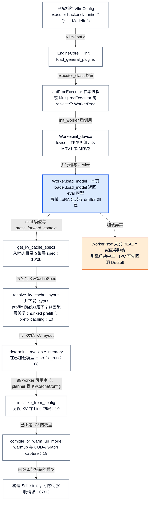
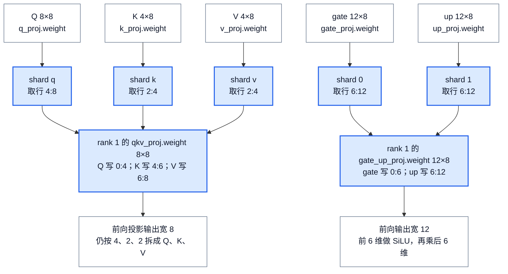
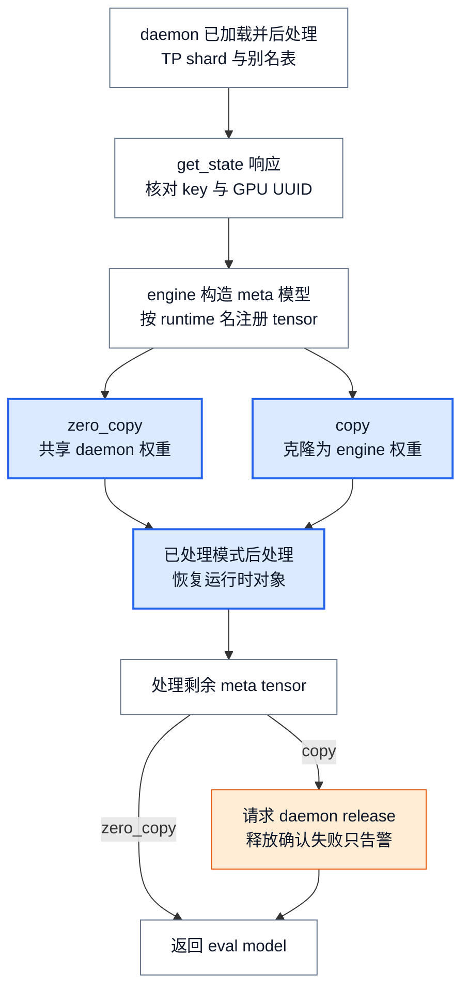
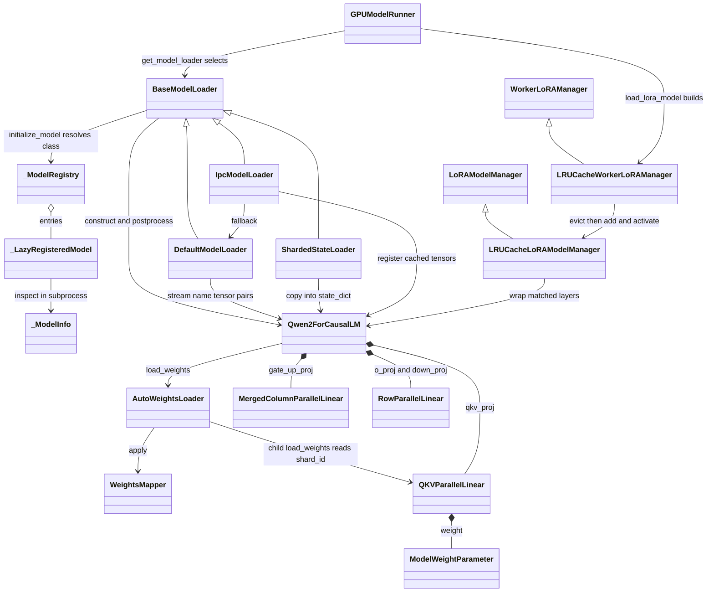

# vLLM 模型库：从 checkpoint 到可执行模型

> **源码基线**：`vllm-project/vllm@199cb9b964822e59ab9b58d88e7be31eb419a2ae`（`main`，2026-09-07）
> **主题**：加载在引擎启动时序中的位置与核心流程清单；Registry 怎样选出模型类，统一构造器怎样建立当前 rank 的模块骨架，`load_format` 选出的加载器、名称映射与并行参数写入怎样把 checkpoint 写进本地参数，以及 EP 专家过滤、sharded state、IPC 缓存等变体和加载完成边界；随后说明构造产物的下游消费者、LoRA 接合、约束成本与配置契约。核心代码在 `vllm/model_executor/model_loader/` 与 `vllm/model_executor/models/`。
> **适用范围**：模型选择、构造、基础权重加载与模型支持接口；量化数值见 17，attention 实现见 10，runner batch 见 11/12，TP/PP/EP 分组与通信见 18，插件发现见 24，在线权重更新见 25，KV 规划与布局见 08/10。
> **最近更新**：2026-09-11。按特性分析重组全页，补齐启动时序定位、核心流程清单与主流程阶段表，以及 sharded state、EP 专家过滤、MTP 完整性、tying 协调、类视图、调用树、成本账和配置契约。

## 1. 特性概览

### 1.1 问题

一个 Qwen2 checkpoint 声明 `architectures=["Qwen2ForCausalLM"]`，里面有 `model.layers.0.self_attn.q_proj.weight`，这仍没有回答三件事：该运行哪个 Python 类，当前 GPU 应保留这个矩阵的哪一部分，运行时把 Q、K、V 合成一个投影后这个名字又该写到哪里。按同名同形复制行不通，运行时只有 `qkv_proj.weight`；先把全局 Q/K/V 拼起来再平均切两半也不对，那样得不到“每个 rank 各有自己的 Q、K、V”的分片。必须先认出每个 constituent（融合前的独立投影），各自选当前 rank 的切片，再写入本地融合参数。

### 1.2 解决方法

vLLM 把这件事拆成三次选择：**Registry 选择模型类，构造器按当前 rank 建立模块骨架和参数形状，模型与层的加载器把外部名字翻译成本地参数中的具体位置。** 文件加载器只产出 `(name, tensor)`；融合、TP 切片与 PP 归属这些模型语义由模型类与并行层决定。`load_format` 是另一条独立的轴：它决定 tensor 从哪里来、以什么形态到达（原始 checkpoint、每 rank 预切好的运行时 state dict、另一进程已处理好的 GPU tensor），因而决定哪些步骤可以跳过。加载器返回经过后处理的 eval 模型，才算完成。

### 1.3 收益、成本与约束

| 维度 | 直接收益 | 必付成本或边界 |
|---|---|---|
| 模型选择 | 同一 architecture 可落到 vLLM、Transformers 或转换 adapter 实现；能力查询不必导入全部模型 | registry 中有一行不证明可运行；Transformers 路径依赖外部动态类与兼容检查 |
| 构造期分片 | 每层只分配本 rank 的参数，PP 只建本 stage 的层 | 构造器、prefix、名称映射和参数写入规则必须互相一致 |
| 名称与切片分离 | safetensors、PT 等读取路径共用模型语义，并行层可被各模型复用 | 每个 rank 读全局 tensor 再 narrow；loaded-name 检查不能证明每个 constituent 到齐 |
| 加载变体 | 跳过不需要的读取（EP 过滤、sharded state），或整段读取与后处理（IPC 缓存） | 被跳过的步骤改由输入的预先约定保证，文件或缓存必须与当前配置严格匹配 |
| 完成边界 | 后处理把权重转成运行格式，返回的 eval 模型可直接交给 runner | 返回不证明首次前向、attention backend 或数值回归已通过 |

**设计理由。** `docs/design/arch_overview.md` 给出两条源码之外的明确理由：统一的 `(vllm_config, prefix)` 构造签名便于扩展，也便于组合视觉塔与语言模型；并选择在初始化时分片，而不是先加载完整权重再切，因为后者要求每卡先放下整个模型。把文件读取、名称和参数布局分成三层，让多种读取路径共享同一套模型语义，这一点是**分析推断**；其代价是这几处规则必须同步维护。

### 1.4 贯穿例子与术语

下文用一个**教学用 Qwen2 配置**：hidden size 8，4 个 query head、2 个 KV head，每个 head 宽 2，MLP intermediate size 12，TP=2、PP=1，不量化。它不是公开 checkpoint 的尺寸，也不是性能实验。一层中 checkpoint 的 Q 为 8×8、K/V 各 4×8，gate/up 各 12×8，down 为 8×12；矩阵统一按 PyTorch 实际存储的“输出维×输入维”书写。MRV1 指 Model Runner V1（`vllm/v1/worker/gpu_model_runner.py`），MRV2 指 Model Runner V2（`vllm/v1/worker/gpu/model_runner.py`）；二者都运行在 V1 engine 内，通过同一套 loader 入口加载模型。

### 1.5 加载在引擎启动时序中的位置

模型加载不是独立的离线步骤，而是引擎启动链中间的一环：上游是已解析的配置、已加载的插件和已建立的并行组，下游四个启动阶段都直接消费它的产物。下图按 GPU worker 的真实调用顺序排列，uniproc 与 multiproc executor 汇合到同一组 worker 方法。

<!-- Figure spec: 启动时序位置图。从已解析 VllmConfig 经 EngineCore.__init__、executor 构造、Worker.init_device 到本页 Worker.load_model，再依次进入 _initialize_kv_caches 的 get_kv_cache_specs、KV layout 解析与非因果开关、determine_available_memory、initialize_from_config、compile_or_warm_up_model 与 Scheduler 构造；每条边标交接对象，节点标归属页；本页节点蓝色，加载异常分支橙色虚线。 -->



**上游前提。** 其一，配置已解析：`VllmConfig.__post_init__` 已定下 executor backend，并在非 dummy、非 sharded 格式时调用 `ModelConfig.maybe_untie_word_embeddings()`（§2.7）；`ModelConfig` 此时也已用 `registry.inspect_model_cls()` 取得 `_ModelInfo`，这发生在任何 worker 出现之前（§2.1）。其二，插件已加载：`EngineCore.__init__` 与每个 worker 的 `WorkerWrapperBase.init_worker()` 都调用 `load_general_plugins()`，外部 model/loader 的注册因此先于类选择，发现机制归 [[24_vllm_extension_plugin_system_analysis|插件与扩展边界]]。其三，设备与并行组已建立：`Worker.init_device()` 设定 CUDA device，经 `init_worker_distributed_environment()` → `ensure_model_parallel_initialized()` 建立 TP/PP/PCP/DCP 组，并按 `VllmConfig.use_v2_model_runner` 构造 MRV1 或 MRV2；loader 与并行层读取的 TP rank 就来自这里（分组归 [[18_vllm_distributed_inference_analysis|分布式推理]]）。

**两种 executor 汇合到同一个 worker 方法。** `Executor.__init__` 调用 `_init_executor()`：`UniProcExecutor` 在本进程依次执行 `init_worker → init_device → load_model`；`MultiprocExecutor` 为每个本地 rank 起一个 `WorkerProc`，子进程在 `WorkerProc.__init__` 里执行同样三步，成功后才经 ready pipe 发 `READY`，父进程由 `WorkerProc.wait_for_ready()` 收齐（进程与 RPC 细节归 [[26_vllm_multiproc_executor_rpc_deepdive|Multiproc Executor]]）。`Worker.load_model()` 在 weights memory pool 与 `set_current_vllm_config` scope 中调用 runner 的 `load_model()`；两代 runner 都先 `get_model_loader()` 再 `loader.load_model()`，随后在配置了 LoRA 时包装模型（§4.2）、加载 drafter/speculator，并把 `DeviceMemoryProfiler` 测得的占用记为 `model_memory_usage`；worker 最后在配置了 weight transfer 时为已加载模型建 transfer engine（归 [[25_vllm_weight_transfer_online_update_analysis|在线权重更新]]）。

**下游四个阶段怎样消费加载产物。** `EngineCore._initialize_kv_caches()` 依次调用：`get_kv_cache_specs()`，两代 runner 都用 `get_layers_from_vllm_config()` 从静态目录收集各层 spec（§4.1）；若任一 spec 标记 `non_causal`，EngineCore 随即关闭 chunked prefill 与 prefix caching，再由 `resolve_kv_cache_layout()` 定下 KV layout 并经 `set_kv_cache_layout()` 下发，源码注释说明这必须在 profile 之前完成，因为捕获 full CUDA graph 的 worker 在 profile 中就会初始化最小 KV cache（两者都归 [[10_vllm_attention_backends_analysis|Attention Backend]]）；`determine_available_memory()`，`Worker.determine_available_memory()` 在已加载模型上跑 `profile_run()`，以 `model_memory_usage` 为权重占用测峰值，得出每个 worker 可给 KV 的字节，planner 据此生成 `KVCacheConfig`（容量归 [[08_vllm_kv_cache_management_analysis|KV Cache 管理]]）；`initialize_from_config()`，runner 分配 KV 并经 `bind_kv_cache()` 交给目录中的层（§4.1，布局归 [[10_vllm_attention_backends_analysis|Attention Backend]]）；`compile_or_warm_up_model()`，对已加载且已绑定 KV 的模型做 compile 尺寸 warmup、kernel warmup 与 CUDA Graph capture（归 [[19_vllm_compilation_cudagraph_analysis|编译与 CUDA Graph]]），之后 EngineCore 才构造 Scheduler。**分析推断**：loader 返回后，模型第一次被真正运行是在 profile 与 warmup/capture 中，所以不少加载缺陷会在这里而不是在 loader 内暴露。

**失败怎样传播。** 加载阶段没有降级路径。uniproc 下异常从 `_init_executor()` 直接穿过 `Executor.__init__` 与 `EngineCore.__init__`；multiproc 下 `WorkerProc.worker_main` 捕获异常并记录 “WorkerProc failed to start”，关闭 ready pipe，父进程 `wait_for_ready()` 读到 EOF 或非 `READY` 状态即抛错，`MultiprocExecutor._init_executor()` 的 `finally` 再终止尚未就绪的 worker。两条路径都让引擎启动中止；服务级握手与收尾归 [[13_vllm_serving_control_plane_analysis|Serving 控制面]]。唯一的回退在 loader 内部：`ipc_cache` 在 daemon 不可用、指纹不符或构建失败且 `fallback=True` 时改走 Default（§2.11）。

**其他入口与钩子。** `load_format="dummy"` 或 runner 的 `load_dummy_weights=True` 都走 `DummyModelLoader`：结构与后处理照常，权重随机。源码中以 `load_dummy_weights=True` 调用 `Worker.load_model()` 的是 elastic EP 扩容：`VLLM_ELASTIC_EP_SCALE_UP_LAUNCH` 时 executor 改调 `elastic_ep_execute("load_model")`，由 `ElasticEPScalingExecutor.load_model()` 以 dummy 权重构造，EngineCore 同时跳过常规显存 profile 与 warmup；扩容后的权重与分组归 18。构造期的 `record_metadata_for_reloading()` 把每层参数与 buffer 的 meta 形态及设备记下，供 25 的 `initialize_layerwise_reload()` 在线重载时把层恢复到 meta 后重新加载。

### 1.6 核心流程清单

| 核心流程 | 触发与上游输入 | 输出与交接对象 | 下游消费者（归属页） | 本页位置 |
|---|---|---|---|---|
| 类选择与能力检查 | 配置解析时 `ModelConfig` 调 `registry.inspect_model_cls()`（worker 出现之前）；worker 内 `initialize_model()` 调 `get_model_architecture()`；输入 HF `architectures`、`model_impl`、`convert` 与插件注册的架构 | `_ModelInfo` 能力位；模型类与 architecture 名 | 配置解析与 runner 类型（[[02_vllm_architecture_overview_analysis\|02]]）；本页构造；外部注册（[[24_vllm_extension_plugin_system_analysis\|24]]） | §2.1、§2.2 |
| 构造 rank 本地骨架 | `Worker.load_model()` 经 loader 进入 `initialize_model()`；输入已解析的 `VllmConfig`、prefix、`init_device` 建好的 TP/PP 组 | 未初始化参数的 rank 本地 `nn.Module`、PP placeholder、`static_forward_context[prefix]` 条目、reload 元数据 | 本页权重写入；KV spec 与 bind（[[10_vllm_attention_backends_analysis\|10]]、[[08_vllm_kv_cache_management_analysis\|08]]）；在线 reload（[[25_vllm_weight_transfer_online_update_analysis\|25]]） | §2.3、§4.1 |
| 加载器选择 | runner `load_model()` 调 `get_model_loader(load_config)`；输入 `load_format`、`model_loader_extra_config`、插件登记的 loader | `BaseModelLoader` 子类实例 | 本页各加载路径 | §2.4 |
| Default 取数 → 名称映射 → 融合 TP 写入 | `DefaultModelLoader.load_weights()`；输入 checkpoint 文件、`secondary_weights`、读取策略、TP rank | 懒 `(name, tensor)` 迭代器 → 改名并挂 `shard_id` 的 tensor → 本地参数的 narrow+copy 结果与 loaded-name 集合 | 本页后处理；量化参数布局（[[17_vllm_quantization_analysis\|17]]）；并行层前向（[[18_vllm_distributed_inference_analysis\|18]]） | §2 阶段表、§2.5、§2.6 |
| tied embedding 协调 | 配置阶段 `maybe_untie_word_embeddings()`；加载时 `AutoWeightsLoader` 别名去重；后处理首步 re-tie | 共享或独立的 embedding 与 `lm_head` 参数 | logits 计算（[[11_vllm_model_runner_v1_analysis\|11]]、[[12_vllm_model_runner_v2_analysis\|12]]） | §2.7 |
| 后处理与完成 | loader 写完权重后 `BaseModelLoader.load_model()` 继续；输入 quant method、目标 device、tying 标记 | 运行格式参数；eval 模型 | runner 持有模型，接 KV 初始化、profile、warmup（08、10、11、12、[[19_vllm_compilation_cudagraph_analysis\|19]]） | §2.8、§1.5 |
| 加载变体：EP 过滤、sharded state、IPC | EP：Default 内 MoE+EP+开关成立；sharded：`load_format` 为 sharded 且有预导出文件；IPC：`ipc_cache` 且 daemon 在线 | 过滤后的迭代器；预切 state dict 的整块写入；已处理 tensor 的注册或克隆；IPC 失败时回退 Default | 与主线相同的后处理与 runner；EP 分组（18） | §2.9–§2.11 与三平面对照图 |
| LoRA 包装 | runner `load_model()` 在配置了 LoRA 时调 `load_lora_model()`；输入 eval 模型与 LoRA 配置 | 替换匹配层的 LoRA wrapper；runner 持有的 `LRUCacheWorkerLoRAManager` 与 `LRUCacheLoRAModelManager` | 运行时 `add_lora` 与每步 `set_active_adapters`（11、12）；LoRA kernel（[[20_vllm_fused_ops_and_kernels_analysis\|20]]）；在线更新后的 LoRA 重置（25） | §4.2 |
| 静态目录的下游消费 | 构造期登记完成；`EngineCore._initialize_kv_caches()` 发起 | 层名到模块的映射；各层 KV spec；绑定到层的 KV view；每步 `ForwardContext.no_compile_layers` | KV spec、布局与 view（10）；容量规划（08）；逐步 forward（11、12） | §4.1、§1.5 |

## 2. 从 checkpoint 到可执行模型

主线沿 Default 路径展开。下表先列出一次加载的阶段；后续小节依次拆开，变体在 §2.9–§2.11 与主线对照。

| 阶段 | 读入什么 | 决定什么 | 结果流向 |
|---|---|---|---|
| 加载器选择 | `LoadConfig.load_format`、extra config、插件登记表 | 用哪个 `BaseModelLoader` 子类，extra config 是否合法 | loader 实例进入其 `load_model()`（§2.4） |
| `initialize_model` | 已解析的 `VllmConfig`、HF `architectures`、并行组、prefix | 模型类、每层参数形状、PP 保留哪些层、哪些层登记静态目录 | 未初始化的 rank 本地模型（§2.1–§2.3、§4.1） |
| 权重迭代 | checkpoint 文件列表、读取策略、`secondary_weights`、EP 专家集合 | 读哪些文件、用哪个迭代器、跳过哪些专家张量 | 懒 `(name, tensor)` 流进入模型 `load_weights()`（§2.5、§2.9） |
| 名称映射 | checkpoint 名、`hf_to_vllm_mapper`、量化 scale 映射 | runtime 名、丢弃项、每个 tensor 的 `shard_id` | 改名后的 tensor 流交给 `AutoWeightsLoader` 递归（§2.5） |
| 逐层写入 | 模块树、tensor 上的 `shard_id`、TP rank | 由哪个层接管、写入本地参数的哪一段 | narrow+copy 后的本地参数与 loaded-name 集合（§2.6、§2.7） |
| 追踪 | loaded-name 集合、`named_parameters()`、quant method | 是否启用 tracking、哪些参数豁免、是否报漏载 | 通过则进入后处理，否则 `ValueError`（§2.8） |
| 后处理 | 已写入参数、quant method、目标 device、tying 标记 | 有在线量化层时先 `finalize_layerwise_processing`；再 re-tie、逐层 `process_weights_after_loading`（repack、TP 状态重对齐）与 deferred 层初始化 | 运行格式参数（§2.7、§2.8） |
| eval | 后处理后的模型 | 切到 eval 模式并返回 | runner 持有模型，接 LoRA 包装与 §1.5 的 KV 初始化 |

### 2.1 选类：同一个 architecture 可以落到不同实现

`initialize_model()` 经 `get_model_architecture()` 取得模型类；后者按 model、convert、runner、`trust_remote_code`、`model_impl` 与 architectures 做进程内缓存，未命中才进入 `_get_model_architecture()`，把 HF config 的候选交给 `ModelConfig.registry.resolve_model_cls()`。本例在内建表中映射到 `qwen2` 模块的 `Qwen2ForCausalLM`。实际选择还受 `model_impl`、候选顺序和任务转换影响：

| 条件 | 选择规则及边界 |
|---|---|
| `model_impl="transformers"` | 先对首个候选解析 Transformers 实现；模块必须通过 backend compatibility 检查，缺模块或不兼容会明确报错 |
| `model_impl="terratorch"` | 先尝试注册的 `Terratorch` 类 |
| 所有原始候选都未注册，`model_impl="auto"` 且 `convert_type` 为 `none` | 在名称规范化前尝试 Transformers fallback；不是永远“先试规范化后的内建类” |
| 普通候选循环 | 按顺序 `_normalize_arch()`，允许从任务后缀找到可转换的内建 base architecture，再尝试加载类 |
| 循环仍未成功，所有原始候选都未注册且为 `auto` | 再尝试 Transformers fallback；已注册但加载失败的候选不满足这个兜底条件 |
| 类已选出，`convert_type="embed"` 或 `"classify"` | 分别套 embedding 或 sequence-classification adapter；`none` 保留原类 |

空候选列表立即 `ValueError`。最终失败区分四类：已登记但检查或加载失败、曾经支持但已移除、迁到外部插件、从未支持；不能概括为“随便调用一个 AutoModel”。Transformers 路径把 model/revision、code revision 与 `trust_remote_code` 交给动态类解析，再要求 `is_backend_compatible()` 或 `_can_set_attn_implementation()` 之一成立；`auto` 落到 Transformers 时只告警可能缺功能。本页只验证 vLLM 的调用与检查，未验证 Transformers 动态加载的内部行为。

**能力查询为什么不导入全部模型。** 控制面常常只需知道模型是否支持生成、pooling、PP、多模态或内部状态。内建表保存 `_LazyRegisteredModel(module_name, class_name)`；`inspect_model_cls()` 先查以模型源码 hash 为键的文件缓存，未命中才在子进程导入并提取 `_ModelInfo`，避免模型导入初始化父进程的 CUDA；`load_model_cls()` 才在当前进程真正 import。入口若是 package 的 `__init__.py`，hash 纳入该目录下全部 Python 子模块，避免只检查导出文件而漏掉实现变化；`vllm.models.*` 等非默认位置经 `find_spec` 找到源文件，缓存同样生效。`test_registry_model_property` 还断言相应架构 inspection 之后 CUDA 仍未初始化。缓存不是 checkpoint 内容校验，也不证明外部依赖兼容。

外部 `register_model()` 接受 `nn.Module` 子类或 `module:class` 字符串；字符串保持懒导入，错误类型或格式被拒绝，重复 architecture 只记 debug 日志后覆盖。插件在哪个进程被发现、何时调用注册，接续 [[24_vllm_extension_plugin_system_analysis|插件与扩展边界]]。

### 2.2 “支持”意味着下游可以调用哪些方法

| 模型接缝 | 要满足的内容 | 在本页路径中的作用 |
|---|---|---|
| 生成与 pooling | Registry 提取相应能力；Qwen2 的 `forward()` 返回隐藏状态，`compute_logits()` 另行投影 | 类可实例化不等于已能生成，还要有 runner 消费这些接口 |
| `SupportsPP` | `make_empty_intermediate_tensors` 与接收 `intermediate_tensors` 的 `forward()` | 当前 stage 必须能接收或交出中间状态，构造也只保留所属层 |
| `SupportsMultiModal` | `embed_multimodal()` 按数据项在 prompt 中出现的顺序返回 embedding，`embed_input_ids()` 合并文本与多模态 embedding；另有 placeholder 与处理器接缝 | 视觉塔、语言模型要各自带稳定前缀；数据处理与执行见 [[15_vllm_multimodal_execution_analysis|多模态执行]] |
| `SupportsLoRA` | `supports_lora` 声明、`packed_modules_mapping`、`embedding_modules`、可选 `lora_skip_prefixes` | adapter 名称必须能找到可包装的基础层，见 §4.2 |
| `SupportsQuant` | 构造时把 rename-only mapper 与 packed mapping 交给量化配置 | 保留原 projection 名，让逐层量化配置命中；数值算法归 [[17_vllm_quantization_analysis|量化派发]] |

Llama 和 Qwen2 都采用这些共同构造/加载接口并声明 LoRA、PP、量化支持，Llama 还提供输入 embedding 与 LM head 的 `embedding_modules` 名称表；它们是同一接口的不同实例，不必平铺所有模型结构。registry 的全架构 import/能力测试与初始化测试的代表子集也体现这一点；测试包含平台与依赖版本的 skip 条件，不能据此声称每个架构在每台设备都实跑通过。

### 2.3 构造：当前 rank 只建立自己会执行的骨架

`initialize_model()` 在有量化配置且类不是 `SupportsQuant` 时先调用 `configure_quant_config()`，把类上的 rename-only mapper 与 packed mapping 交给量化配置；然后在 `set_current_vllm_config(..., prefix=...)` scope 中调用 `model_class(vllm_config=..., prefix=...)`，并用 `record_metadata_for_reloading()` 记下在线 reload 需要的元数据（该事务归 [[25_vllm_weight_transfer_online_update_analysis|在线权重更新]]）。`BaseModelLoader.load_model()` 在外层设置默认 dtype 与目标 device，所以参数一出生就以目标 dtype 分配在目标设备上。`VllmConfig` 让嵌套模块读到同一份模型、缓存、量化配置；`prefix` 是模块在整棵模型中的名字：Qwen2 外层传入 `model`，decoder 逐层派生到 `model.layers.0.self_attn.qkv_proj` 与 `model.layers.0.self_attn.attn`。attention 注册（进入静态模块目录，见 §4.1）与逐层量化匹配都依赖完整前缀，它不是日志装饰。

Qwen2 用 `QKVParallelLinear` 代替独立 Q/K/V，用 `MergedColumnParallelLinear` 合并 gate/up，用 `RowParallelLinear` 构造 `o_proj` 与 `down_proj`。本例每个 rank 此时得到尚未初始化的 `qkv_proj.weight` 8×8、`gate_up_proj.weight` 12×8 与 `down_proj.weight` 8×6；正确数值要等 §2.6 写入后才存在。

若 PP>1，`make_layers()` 按 `get_pp_indices()` 只构造当前 stage 的层，其余位置放 `PPMissingLayer`，而不是先加载完整模型再删除。Qwen2 的 `embed_tokens` 在首 stage，也可因词嵌入 tying 或 EAGLE/DFlash 等需要目标 embedding 的投机方法而留在末 stage，否则同样是 `PPMissingLayer`；末 stage 才持有最终 norm 与 `lm_head`。`AutoWeightsLoader` 遇到 `PPMissingLayer` 或 `StageMissingLayer` 直接停止该子树，所以别的 stage 的 checkpoint tensor 不会变成本 rank 的未知名错误。前向接口与此一致：首 stage 从 token 或 `inputs_embeds` 得到隐藏状态，非首 stage 消费 `IntermediateTensors`；**非末 stage** 返回 `IntermediateTensors`，末 stage 归一化后返回隐藏状态，再由 `compute_logits()` 产生 logits。

> [!contradiction] 文档接口与当前代码有两个差异
> `docs/design/arch_overview.md` 把 `(vllm_config, prefix)` 统一构造签名作为标准，并给出旧式外部模型的迁移写法；live `initialize_model()` 仍发 `DeprecationWarning`，再按签名猜 `config/cache_config/quant_config/lora_config/scheduler_config/prefix` 继续构造，旧兼容桥尚未删除。另外 `SupportsPP.forward` 的 docstring 写“仅末 rank 返回 IntermediateTensors”，Qwen2 的实际分支相反；应以非末 stage 交出中间状态的实现为准。

### 2.4 加载器选择：先确定变体集合

`get_model_loader()` 用 `LoadConfig.load_format` 查 `vllm/model_executor/model_loader/__init__.py::_LOAD_FORMAT_TO_MODEL_LOADER`，未登记的格式抛 `ValueError`；这张表就是下面的枚举依据。`register_model_loader()` 允许插件登记 `BaseModelLoader` 子类，重复格式告警后覆盖。MRV1 与 MRV2 的 `GPUModelRunner.load_model()` 都是先取 loader 再调用其 `load_model()`；`get_model()` 只是同一组合的便捷封装，CPU runner、多个投机 drafter 与 IPC 权重缓存 daemon 的 `WeightCacheDaemon.load_model()`（§2.11 的正常加载）都经它加载（draft 语义归 [[16_vllm_speculative_decoding_analysis|投机解码]]）。

| `load_format` | 实现 | 输入形态与去向 |
|---|---|---|
| `auto`、`hf`、`safetensors`、`pt`、`npcache`、`mistral`、`fastsafetensors`、`instanttensor` | `DefaultModelLoader` | 原始 checkpoint，经模型 `load_weights()` 完成名称映射与 TP 切片，即 §2.5–§2.8 主线。`auto` 见到 `consolidated*.safetensors` 即按 `mistral`，否则按 `hf`；`npcache` 只接受 `.bin` 并维护 numpy 缓存；`fastsafetensors`、`instanttensor` 换第三方 safetensors 读取器，其内部 IO 本页未验证 |
| （Default 内）EP 专家过滤 | 同上 | MoE+EP 时在取 tensor 前跳过非本 rank 的专家；能否省磁盘读取取决于 safetensors 读取策略，见 §2.9 |
| `sharded_state`、`runai_streamer_sharded` | `ShardedStateLoader` | 每个 TP rank 事先导出的运行时 state dict，跳过名称映射与切片，见 §2.10 |
| `ipc_cache` | `IpcModelLoader` | 本机 daemon 已加载并后处理的 GPU tensor，见 §2.11 |
| `dummy` | `DummyModelLoader` | 不读文件，随机初始化（在线量化层先 materialize 再处理），主要用于 profiling，runner 的 `load_dummy_weights` 也切到它；仍经过通用后处理。本域暂无页面 |
| `runai_streamer` | `RunaiModelStreamerLoader` | 从本地、S3、GCS 或 Azure 流式读取 safetensors，再走模型 `load_weights()`。本域暂无页面 |
| `tensorizer` | `TensorizerLoader` | 覆写 `load_model()`：vLLM 序列化模型在 meta 上构造后反序列化，其他 tensorizer 文件则构造后走 `load_weights()`；两条路径都不调用通用 `process_weights_after_loading()`，vLLM 序列化分支连 `.eval()` 也不调用；TP>1 时 URI 按 TP rank 格式化。本域暂无页面 |
| `modelexpress` | `ModelExpressModelLoader` | 薄封装，`load_model()` 委托外部包的 `MxModelLoader`，外部实现未核验。本域暂无页面 |

同一关切还有几条**兄弟选择轴**，不能由 `load_format` 一个字段推出：模型类由 `model_impl`、`convert` 决定（§2.1）；Default 内部，模型可用 `secondary_weights` 追加多个带自身 prefix 的来源，并以 `allow_patterns_overrides`、`fall_back_to_pt_during_load` 改变文件匹配；每层量化 method 决定参数类与 v1/v2 `weight_loader`（归 17）；已初始化模型上的在线替换走 layerwise reload 与 `checkpoint_weight_patch.py` 的 dense/sparse patch，同样复用模型 `load_weights()`，归 25。

### 2.5 名字被翻译，数据仍是原来的 tensor

Default 路径把来源收敛成懒 `(name, tensor)` 迭代器：`_prepare_weights()` 按格式选文件模式、下载并过滤重复 safetensors 分片，`_get_weights_iterator()` 再选 safetensors、PT、多线程或专用读取器，`get_all_weights()` 先产出主来源再依次产出 `secondary_weights`。迭代器交给 `model.load_weights()`，tensor 在被消费时才读取。这里验证的是 vLLM 的选择与传参，不把第三方文件库的内部 IO 或吞吐视为已验证事实。

本例 `Qwen2ForCausalLM.load_weights()` 创建 `AutoWeightsLoader`，沿 `model` 子模块递归到 `Qwen2Model.load_weights()`，在那里应用 `hf_to_vllm_mapper`。以下省略相同的 `model.layers.0.` 前缀：

| checkpoint 名 | runtime 名 | 随 tensor 传递的 `shard_id` |
|---|---|---|
| `self_attn.q_proj.weight` | `self_attn.qkv_proj.weight` | `q` |
| `self_attn.k_proj.weight` | `self_attn.qkv_proj.weight` | `k` |
| `self_attn.v_proj.weight` | `self_attn.qkv_proj.weight` | `v` |
| `mlp.gate_proj.weight` | `mlp.gate_up_proj.weight` | `0` |
| `mlp.up_proj.weight` | `mlp.gate_up_proj.weight` | `1` |

`WeightsMapper` 依次应用 renaming、regex、substring、stacked、prefix、suffix 规则；映射到 `None` 的项被丢弃。`apply()` 只改名字、把 `shard_id` 挂到原 tensor 上并继续 yield，不分片、不拼接、不复制数值。`AutoWeightsLoader.load_weights()` 还并入量化配置的 KV scale 映射与额外可忽略后缀，并丢弃旧 rotary cache tensor。`get_rename_mapper()` 去掉 stacked 与 `None` 规则，供 LoRA 与量化层名列表复用，避免把需要保留的 `q_proj` 等名字提前合并成 `qkv_proj`。

`AutoWeightsLoader` 再沿点分名称递归：子模块有 `load_weights()` 就接管；叶参数用自己的 `weight_loader`，没有则默认复制；持久 registered buffer 与 BatchNorm 统计也可加载，非持久 buffer 排除。未知 module/parameter，或给单个参数追加嵌套名，通常抛 `ValueError`；但显式 ignore 前缀/后缀、意外的 `.bias` 与 PP placeholder 是例外，不能称为“所有额外名字都拒绝”。

### 2.6 融合前分别分片，融合后仍能拆回各投影

本例 rank 0 的 Q 取全局输出行 0:4，rank 1 取 4:8；K/V 分别取 0:2 和 2:4。每个 rank 的 `qkv_proj.weight` 都按本地 Q→K→V 排列，三段起点为 0、4、6，长度为 4、2、2。gate/up 同理：各取全局 6 行，写入本地 gate_up 的 0:6 和 6:12。

<!-- Figure spec: 用名称转换和切片操作图而非二维矩阵布局。两条独立lane共用TP=2/rank1教学输入。Q/K/V三个输入框标shape与全局行范围，经对应shard_id与slice框指向一个本地QKV结果框，注明各目标行。gate/up另一路经各自slice指向本地gate_up。输出节点标前向按相同边界split；不变量为每个constituent各自选当前rank的行，禁止先拼全局矩阵再均分。 -->



图中切片是视图选择，最后才向目标 parameter view 执行 `copy_`，不需要先分配全局融合矩阵。`shard_id` 是挂在 tensor 上的属性，要靠层自己的 `load_weights()` 取出：`AutoWeightsLoader` 递归到 `qkv_proj` 时发现 `QKVParallelLinear` 定义了 `load_weights()`，就把这组 tensor 整个交给它；它读 `loaded_weight.shard_id`、`validate_shard_id()`，再调 `param.weight_loader(param, w, shard_id)`。`MergedColumnParallelLinear.load_weights()` 相同；`RowParallelLinear` 没有自己的 `load_weights()`，由 `_load_param()` 以不带 `shard_id` 的两参数形式调用。非量化权重由 `UnquantizedLinearMethod` 创建 `ModelWeightParameter`，该 method 在 `WEIGHT_LOADER_V2_SUPPORTED` 中，所以层安装的是 v2 loader：`QKVParallelLinear.weight_loader_v2` 按 `shard_id` 算本地 offset/size，`_ColumnvLLMParameter.load_qkv_weight` 同时 narrow 目标段和 checkpoint 中当前 rank 的行，断言形状后复制；Merged 走 `load_merged_column_weight`。旧式 v1 loader 仍在，用参数上的维度属性做同类选择。Qwen2 前向按 `q_size, kv_size, kv_size` 拆分，MLP 对融合输出做 `SiluAndMul`（前半 SiLU 乘后半）再进 down projection——融合参数保留的是投影边界，不是消除投影身份。名称末尾相同不表示所有量化参数布局相同，packed bit/scale 布局归 [[17_vllm_quantization_analysis|量化页]]。

两个变体守同一规则：

- **KV head 少于 TP rank 数**：改成 1 个 KV head、仍 TP=2。Q 仍各取 4 行；此时 `num_kv_head_replicas=2`，两个 rank 都用 `tp_rank // 2 = 0` 取唯一 head 的 2 行，而不是向不存在的第二个 KV head 分片。Q head 与 TP、KV head 与 TP 的整除关系由 `divide()` 断言。
- **磁盘上已经融合**：`shard_id=None` 时，QKV loader 先按全局 Q/K/V 边界切开 checkpoint，再递归到上面的独立 shard 路径；Merged loader 同样按 `output_sizes` 拆 constituent，仍不是对整块融合矩阵直接均分。Merged 还接受连续 tuple shard id，越界或非连续组合被拒；QKV 只接受 `q/k/v/None`。

Column parallel 参数沿输出维切，前向保留本地输出，只有 `gather_output=True` 才 all-gather。Row parallel 沿输入维切：本例 down 的全局 8×12 变成本地 8×6，每个 rank 对自己的 6 维激活算部分输出，默认 all-reduce 得到完整输出，bias 只在 rank 0 加一次。`input_is_parallel=False` 时层先切输入；`reduce_results=False` 又带未跳过的 bias 会被构造器拒绝。这里解释参数布局与消费它的运算如何对应，分组构造与 collective 顺序接续 [[18_vllm_distributed_inference_analysis|分布式推理]]。

### 2.7 共享 embedding：同一对象只写一次，checkpoint 说了算

词嵌入 tying 让 `model.embed_tokens.weight` 与 `lm_head.weight` 指向同一参数。`AutoWeightsLoader` **只对 `VocabParallelEmbedding` 的共享别名去重**，以模块遍历遇到的第一个名字为 canonical。两个名字都出现时只加载 canonical；若 checkpoint 只给出被跳过的别名、canonical 缺失，而且各子模块都回报了 loaded-name 集合，就抛 `ValueError`，避免共享 storage 未初始化。其他共享参数不受这条特殊规则影响。测试用 vocabulary 16、hidden size 2，把 embedding 填 1、head 填 2：tied 时共享值保持 1，untied 时 head 为 2；另一测试只给 head，要求报 canonical 缺失。这比“去掉重复 key”更强，检查的是对象共享与加载来源是否一致。

配置与 checkpoint 也可能不一致。`VllmConfig.__post_init__` 在非 `dummy`、非 sharded 格式时调用 `ModelConfig.maybe_untie_word_embeddings()`：config 声称 tied 而 checkpoint 带独立 `lm_head` 时，把两级 config 的 `tie_word_embeddings` 改为 false 并置位 `word_embeddings_untied_by_checkpoint`，让构造器建出独立 head 并加载它。后处理第一步 `maybe_retie_word_embeddings()` 再比较两者：只有恰好一对未量化的 head/embedding、形状相同且数值完全相等时才重新共享 storage 以回收内存；数值不同则告警并保留 checkpoint 的 head。dummy 与 sharded 格式读不到原 checkpoint 的构成，所以不做这一判断。

### 2.8 什么时候才算加载完成

`BaseModelLoader.load_model()` 在目标 dtype/device scope 内依次完成：构造 → 具体 loader 写权重 → 可适用的 loaded-name 检查 → 在线量化的 layerwise finalize → `process_weights_after_loading()` → `model.eval()` 返回。`LoadConfig.device` 可覆盖初始加载设备。`download_model()` 只准备文件，`initialize_model()` 只建模型，`load_weights()` 返回也不等于运行格式已就绪。

后处理次序本身是模型库的接缝：先按 §2.7 re-tie，再逐层运行 `QuantizeMethodBase.process_weights_after_loading()`；若它换入新 Parameter，随即 `update_param_tp_status()` 重新对齐 TP rank/size，避免 `disable_tp` 层后续 refit 用错 offset，每层之后还在显存压力下释放 allocator 缓存。随后处理 deferred attention 与多模态 encoder、`HpcModule`，最后调用可选的模型级 hook。CPU offload 参数处理时临时迁到目标设备，`device_loading_context` 的 `finally` 再恢复 CPU/UVA 状态。具体量化与 kernel-format 转换归量化页；在线量化可能边加载边量化，不能概括为“所有量化都在全量读取之后发生”。

**loaded-name 集合不等于完整数值证明。** Default loader 默认只对“非量化且模型返回 loaded-name 集合”启用 `track_weights_loading()`，extra config 的 `enable_weights_track` 可显式覆盖；它比较 `named_parameters()` 与 loaded set，但实际豁免范围比“量化例外”更宽。

> [!contradiction] 纠正旧稿的漏载保证
> 旧稿把默认非量化路径写成“任何完全未触达的参数都会报错”。当前 `DefaultModelLoader.track_weights_loading()` 会对带 `uses_meta_device` 或 `process_weights_after_loading` 方法的 quant method，把该模块参数补入 loaded set。**`UnquantizedLinearMethod` 也有这个后处理方法，普通 linear 参数因此也可能被豁免。** 所以这里只能保证未被豁免的缺失参数会报 `Following weights were not initialized`，不能保证每个普通权重都实际到达。

即便没有这项豁免，Q、K、V 也都回报同一个 `qkv_proj.weight`。**分析推断**：只收到 Q 就可能让这个名字进入集合，所以 name-level gate 无法证明 K/V 到齐，也检测不到重复写入；到达 tensor 的 shape/shard-id 合法，与 checkpoint 完整，是两个问题。完整性于是落到模型专项检查，而且粒度不同：DeepSeek MTP（含 DeepSeek V4）、Bailing、MiniMax M3 的 MTP `load_weights()` **按层**检查，某个期望的 MTP 层一个权重都没收到就抛 `ValueError`，其中只有 DeepSeek 的消息提示 checkpoint 可能在量化时丢了 MTP 层；Step3p5 **按参数**检查，期望参数集合（扣除可选的单元素、不需梯度的 `k_scale`/`v_scale`/`q_scale`/`prob_scale`）与 loaded 集合不等即抛 `RuntimeError`；Inkling 也按参数检查 `model.layers.`、`model.chain_norm.` 下的缺失项并抛 `ValueError`。这项检查由 `mtp_validation.py` 的 ContextVar 控制、默认开启；NCCL 与 IPC 权重传输引擎接收更新时，用 `disable_mtp_completeness_check()` 在该次加载的 scope 内关闭它（**分析推断**：一次在线更新不必包含全部 MTP 层权重）。结束标志因此是 loader 成功返回经过后处理的 eval 模型，而不是“某个 key 已出现”或“内存已分配”；这也不证明首次前向、attention backend 或 GPU 数值回归已经通过。

### 2.9 Default 内的变体：EP 专家过滤在取 tensor 前跳过非本 rank 的专家

Qwen2 例子是 dense 模型，没有带编号的专家权重，过滤器对它恒为 no-op；它服务 DP+EP 部署下的 MoE。`DefaultModelLoader.load_weights()` 先调 `_init_ep_weight_filter()`：只有 `model_config.is_moe`、`enable_expert_parallel` 与 `enable_ep_weight_filter` 同时成立、未开 EPLB 且专家数大于 0 时，才按 `ep_size = dp×pcp×tp`、`ep_rank = dp_rank×pcp×tp + pcp_rank×tp + tp_rank` 计算本 rank 的专家集合；注释声明这与 `FusedMoEParallelConfig.make()`、`determine_expert_map` 的规则一致。设 8 个专家、EP=2：`linear` 放置下 rank 1 得 {4,5,6,7}，`round_robin` 下得 {1,3,5,7}。

集合只传给非多线程的 `safetensors_weights_iterator()`，四种读取策略都会调用 `should_skip_weight()`：名字含 `.experts.<id>.`、以 `.weight` 或 `.weight_packed` 结尾且 id 不在集合内，才跳过。于是 `...experts.2.gate_proj.weight` 不读，`...experts.5.gate_proj.weight` 照读，`...experts.2.gate_proj.weight_scale` 仍保留——注释说明有的后端要用全部专家的 scale。**省下什么取决于读取策略**：lazy（显式指定，或 `None` 且没有触发自动 prefetch）与 torchao 在 `safe_open` 之后、`get_tensor()` 之前判断，被跳过的重张量根本不读出；eager 先 `load(f.read())` 把整个文件读进内存再过滤，只省下游的 yield 与参数写入；prefetch（显式指定，或 `None` 在 NFS/Lustre 且 checkpoint 不超过可用内存 90% 时自动选中）先由后台线程按 rank 分摊把全部文件读进 OS page cache，存储读取照付，过滤只省本 rank 的 tensor 物化。模块 docstring 估计专家约占 MoE 权重字节的 85%–90%，这是源码注释的估计，不是本页测量，而且只在 lazy/torchao 下对应磁盘读取的节省。**边界**：3D 融合专家 checkpoint（名字无编号）不被过滤，整块读入后由专家层切；多线程 safetensors、PT、`fastsafetensors`、`instanttensor` 与非 Default 格式都拿不到这个集合；开 EPLB 时冗余物理槽可能映射到别的 rank 的逻辑专家，所以整体关闭。源码没有在加载后核对过滤集合与 MoE 层 expert map 是否一致，两处分配规则需同步维护，单测只覆盖过滤函数本身。EP 分组与专家执行归 [[18_vllm_distributed_inference_analysis|分布式推理]]。

### 2.10 变体：sharded state 让每个 TP rank 直接读自己的运行时 state dict

走 Default 时，每个 rank 都要读出完整 tensor 再 narrow 出自己的行。`ShardedStateLoader` 换一种输入：一次正常加载后的 engine 调 `save_sharded_state`，经 `Worker.save_sharded_state` 让每个 worker 调 `ShardedStateLoader.save_model()`，把 **runner 当前模型的 `state_dict()`**（已经过构造期切片与后处理）按 `model-rank-{rank}-part-{part}.safetensors` 模式和 `max_size` 分文件保存；示例脚本另复制非权重的元数据文件，并拒绝 `enable_lora`。

回放本例：TP=2 的 rank 1 只 glob `model-rank-1-part-*.safetensors`（路径可为本地目录或 S3），其中 `model.layers.0.self_attn.qkv_proj.weight` 已是本地 8×8 的融合布局。`load_weights()` 先对当前模型的 `state_dict()` 做 `_filter_subtensors()`：共享或被包含 storage 的名字只留一个，范围相同时保留较小的 key，tied 模型因此只存 `lm_head.weight`；然后逐个 `state_dict[key].data.copy_(tensor)`。它**完全不调用模型 `load_weights()`**，所以没有 `WeightsMapper`、`shard_id`、TP narrow 或 tying 协调；文件中较小的维度（如 LoRA padding 让参数变大）只写 narrow 视图并告警，文件有而模型没有的 key 在字典查找处抛 `KeyError`，模型有而文件缺的 key 最后抛 `Missing keys`。之后仍由 `BaseModelLoader.load_model()` 跑一次通用后处理并返回 eval 模型。

代价与边界：导出文件与当时的 TP 规模、模型类、量化和 vLLM 运行时布局绑定，换配置就要重新导出；找不到文件直接报“only pre-sharded checkpoints are currently supported”。保存的是后处理后的 tensor；**分析推断**：再做一次后处理只在各 quant method 对运行格式输入可重复时安全，源码没有为此设检查，`test_sharded_state_loader` 只覆盖 Llama-3.2-1B、TP 1/2、LoRA 开关下的未量化输出一致性。文件名只含 TP rank，源码中未见对 PP>1 的检查；按命名规则推断，PP 下同一 TP rank 的各 stage 会写同名文件，这是未验证的风险。`runai_streamer_sharded` 只把读取换成 Run:ai 的流式迭代器。

### 2.11 变体：IPC 权重缓存的输入已经是处理后的参数

`load_format="ipc_cache"` 让重启的 engine 不必重新读取并处理同一份 checkpoint：每个 GPU 的 daemon 先正常加载一个 TP shard、完成后处理，再以 `remove_duplicate=False` 遍历参数与 buffer，给每个唯一 tensor 导出 `TensorEntry`，其余同一对象的名字记入别名表。CUDA tensor 经 PyTorch reduction/rebuild 的 IPC handle 传递，非 CUDA tensor 按值发送；这里进入 PyTorch/CUDA 共享分配的外部依赖边界，本页只验证 vLLM 的句柄导出、重建调用和生命周期约束。回放本例：rank 1 的 daemon 持有已后处理的 `qkv_proj.weight` 8×8，engine 在 meta 模型上按同一运行时名注册它，不再经过 §2.5–§2.6。

<!-- Figure spec: IPC复用采用从上到下的状态/选择图，两个模式左右分支后汇合。daemon完整加载后的entries+aliases经get_state和key/GPU核对进入meta模型注册，分zero_copy共享或copy克隆，汇入已处理模式后处理与剩余meta物化，成功返回eval；copy在返回前请求release。图中明确socket响应不是模型完成，完整结果依赖注册和后处理。 -->



1. `_check_supported()` 在 fallback 的异常捕获之外先检查支持范围：量化只放行未量化与设置了 `weight_block_size` 的 block-wise FP8，其他量化即使 `fallback=True` 也直接拒绝；KV cache dtype 只放行 `auto` 或以 `fp8` 开头的配置。
2. `_fetch_entries()` 向本地 Unix socket 发 `WeightCacheKey`，含 checkpoint 标识、architecture、TP size/rank、dtype、量化及其配置 hash、revision 与 vLLM version；daemon 逐字段比较并返回 entries/aliases，engine 再核对 GPU UUID。**checkpoint 标识只 hash 本地 safetensors 文件名与 header，不读权重数值字节**，因此不是完整内容校验；本地找不到文件时回退为模型路径。
3. `_build_model()` 在 meta device 构造同名模块，`_apply_entries()` 以注册而非赋值替换参数/buffer，允许后处理产生、meta 模型原本没有的 tensor；别名注册回同一对象。`zero_copy` 保留共享权重，`copy` 为每个唯一 tensor clone 一份。
4. 在 `weights_already_processed()` scope 内重跑后处理，只恢复 tensor 导出带不过来的运行时对象；quant method 必须声明 `supports_pre_processed_weights`，否则 `RuntimeError`。随后把残余 meta tensor 物化为未初始化 storage 并告警，这**不是完整性验证**。
5. copy 模式在返回前请求 daemon `release`，daemon 清 entries、aliases 和模型引用后回复；请求失败只告警，因此返回不保证 daemon 已释放。zero-copy 依赖 daemon 保持共享 allocation 存活，类说明明确排除与 sleep 模式的 weight offloading 同用。

> [!contradiction]
> `IpcModelLoader` 类 docstring 仍写 `process_weights_after_loading` 被完全跳过，实际 `_build_model()` 在已处理模式重跑它。跳过的是已完成的 tensor 变换，Python 侧状态仍要重建，不能按 docstring 推断整个 hook 不执行。

默认 `fallback=True`：daemon 不可用、指纹不匹配或构建失败时，改用 `load_format="auto"` 且清空 IPC 专用 extra config 的 Default loader；构建失败时，copy 模式若已取到状态会先尽力 release，随后两种模式都清 accelerator cache，减少磁盘 fallback 与 daemon 同时占用显存。没有跨进程回滚承诺；独立的 `IpcModelLoader.load_weights()` 只是对已有运行格式模型尽力复制同名同形 tensor，不匹配则告警跳过，不能等同首次加载。收益是省去重复 IO 与转换，zero-copy 还省一份权重 storage，copy 则付克隆和短时两份显存。daemon CLI 只支持 TP，拒绝 PP、DP、EP。协议是同一用户的本地进程之间以 pickle 通过 Unix socket 通信；自动路径严格校验私有目录权限，任何路径都拒绝符号链接与非本人所有的 socket，它不是远程权重服务。真实回归 `test_ipc_cache_cold_start_and_warm_restart` 用 `Qwen/Qwen3.5-0.8B` 比较默认磁盘加载、无 daemon 冷启动回退、关闭 fallback 的暖启动与再次重启，要求输出一致；它是单 GPU 的具体回归，本次未运行，不能外推到全部模型、量化与并行组合。

**三条数据平面对照。** 下图用同一个 rank 1 `qkv_proj.weight` 8×8 回放三种输入：Default 要改名、挂 `shard_id` 再 narrow；sharded state 拿到的已是切好的本地块，只按 key 整块复制；IPC 拿到的是 daemon 已后处理的 entry，只注册或克隆。三者都要再经过后处理才返回 eval 模型，但后处理面对的输入不同。

```mermaid
flowchart TB
    subgraph DL["Default：原始 checkpoint"]
        D1["q_proj 8×8、k_proj 4×8、v_proj 4×8<br/>全局 tensor"] --> D2["WeightsMapper 改名 qkv_proj<br/>tensor 挂 shard_id q、k、v"]
        D2 --> D3["QKV load_weights 读 shard_id<br/>weight_loader_v2 取行 4:8、2:4、2:4"]
        D3 --> D4["narrow 后 copy_<br/>写本地 0:4、4:6、6:8"]
    end
    subgraph SL["sharded state：预切文件"]
        S1["model-rank-1 文件中的 qkv_proj.weight<br/>8×8，已切分并后处理"] --> S2["_filter_subtensors 去掉共享 storage 的别名<br/>无 mapper、shard_id、narrow"]
        S2 --> S3["按 state_dict key 整块 copy_"]
    end
    subgraph IL["ipc_cache：daemon entry"]
        I1["daemon rank 1 的 qkv_proj.weight entry<br/>8×8，已后处理"] --> I2["IPC handle rebuild<br/>核对指纹与 GPU UUID"]
        I2 --> I3["zero_copy 直接注册<br/>或 copy 克隆进 meta 模型"]
    end
    D4 --> P1["首次后处理"]
    S3 --> P2["对运行格式再跑后处理<br/>可重复性未验证"]
    I3 --> P3["已处理模式后处理<br/>只重建 Python 状态"]
    P1 --> R["rank 1 的 qkv_proj.weight 8×8 就绪<br/>返回 eval model"]
    P2 --> R
    P3 --> R
    classDef neutral fill:#ffffff,stroke:#64748b,color:#0f172a
    classDef acc1 fill:#dbeafe,stroke:#2563eb,color:#0f172a,stroke-width:2px
    classDef acc2 fill:#ffedd5,stroke:#ea580c,color:#0f172a
    class D1,D2,S1,S2,I1,I2,P1,P3,R neutral
    class D3,D4,S3,I3 acc1
    class P2 acc2
```

<!-- Figure spec: 三列数据平面对照，同一目标 rank 1 的 qkv_proj.weight 8×8。Default 列：全局 q/k/v_proj 三个 tensor → WeightsMapper 改名并挂 shard_id → QKV load_weights 读 shard_id、weight_loader_v2 取行 4:8/2:4/2:4 → narrow 后 copy_ 写本地 0:4/4:6/6:8 → 首次后处理。sharded 列：model-rank-1 文件里已切分并后处理的 8×8 块 → _filter_subtensors 去掉模型 state_dict 中共享或被包含 storage 的别名 key，无 mapper/shard_id/narrow → 按 key 整块 copy_ → 对运行格式再跑后处理（橙色，可重复性未验证）。IPC 列：daemon rank 1 已后处理的 entry → IPC handle rebuild 并核对指纹与 GPU UUID → zero_copy 注册或 copy 克隆进 meta 模型 → 已处理模式后处理只重建 Python 状态。三列汇合到同一个就绪块并返回 eval。蓝色标每列决定性的写入步骤。 -->



## 3. 代码实现

### 3.1 类与职责

空心三角表示 Python 继承，其余连线表示选择、持有或调用；模型内部的 decoder 与 attention 层级折叠到 `Qwen2ForCausalLM`，只画主线与变体用到的对象。



| 对象 | 职责 | 不负责什么 |
|---|---|---|
| `GPUModelRunner.load_model`（MRV1/MRV2） | 取 loader、调用 `load_model()`，按配置接 LoRA、drafter 与 EPLB | 名称映射、切片与后处理的细节 |
| `_ModelRegistry` / `_LazyRegisteredModel` / `_ModelInfo` | architecture → 类；懒导入与子进程能力检查；按类别报告不支持 | 读权重；证明模型在某设备上可运行 |
| `BaseModelLoader.load_model` | 构造 → `load_weights` → 在线量化 finalize → 后处理 → eval 的公共骨架 | 文件格式与具体名称映射 |
| `DefaultModelLoader` | 选文件与迭代器、EP 过滤、主/次来源、loaded-name tracking | 判断 `q_proj` 该写到哪里 |
| `ShardedStateLoader` / `IpcModelLoader` | 用预切的运行时 state dict 或 daemon 的已处理 tensor 替代原始 checkpoint | 名称翻译与 TP 切片（输入已按当前 rank 布局） |
| 模型 `load_weights` + `AutoWeightsLoader` / `WeightsMapper` | 递归分派、名称改写、挂 `shard_id`、tied 去重 | 物理切片与文件 IO |
| `QKVParallelLinear` / `MergedColumnParallelLinear` / `RowParallelLinear` 与 `ModelWeightParameter` | fused 层以自己的 `load_weights()` 读出 tensor 上的 `shard_id`；按 `shard_id` 与 TP rank 算目标段并 narrow+copy；前向按相同边界拆分与规约 | 选择模型类；建立 TP 组 |
| `LRUCacheWorkerLoRAManager` / `LRUCacheLoRAModelManager`（runner 实际构造，继承 `WorkerLoRAManager` / `LoRAModelManager`） | adapter 读入与校验、层包装、LRU 淘汰、设备 slot 激活 | 当步 token 到 adapter 的 batch 映射 |

### 3.2 调用树：Default 路径从 runner 到返回 eval 模型

runner 之前的 executor/worker 调用与之后的 KV 初始化见 §1.5。缩进表示 caller → callee，方括号是条件分支，纯转发已折叠。`get_all_weights()` 返回懒生成器，文件读取发生在 `WeightsMapper.apply` 的下游消费它时，所以画在消费者之下。

```text
GPUModelRunner.load_model                     [MRV1 与 MRV2 各一份；load_dummy_weights 时改为 dummy]
+-- get_model_loader                          [查 _LOAD_FORMAT_TO_MODEL_LOADER；构造 Default 时校验 extra config]
+-- BaseModelLoader.load_model                [set_default_torch_dtype 与目标 device scope]
|   +-- initialize_model
|   |   +-- get_model_architecture            [进程内缓存]
|   |   |   `-- _get_model_architecture
|   |   |       +-- _ModelRegistry.resolve_model_cls
|   |   |       `-- [convert_type 为 embed/classify] as_embedding_model / as_seq_cls_model
|   |   +-- [有 quant_config 且类非 SupportsQuant] configure_quant_config
|   |   `-- set_current_vllm_config scope
|   |       +-- Qwen2ForCausalLM.__init__ -> Qwen2Model.__init__ -> make_layers
|   |       |   `-- Qwen2DecoderLayer -> Qwen2Attention / Qwen2MLP
|   |       |       +-- QKVParallelLinear / MergedColumnParallelLinear / RowParallelLinear
|   |       |       `-- Attention.__init__ -> static_forward_context[prefix] = self   [见 §4.1]
|   |       `-- record_metadata_for_reloading
|   +-- DefaultModelLoader.load_weights
|   |   +-- _init_ep_weight_filter            [MoE、EP 与开关同时成立且未开 EPLB]
|   |   +-- Qwen2ForCausalLM.load_weights(get_all_weights(...))
|   |   |   `-- AutoWeightsLoader.load_weights -> _load_module
|   |   |       `-- Qwen2Model.load_weights
|   |   |           `-- AutoWeightsLoader.load_weights(mapper=hf_to_vllm_mapper)
|   |   |               +-- WeightsMapper.apply
|   |   |               |   `-- 消费 _get_weights_iterator -> safetensors_weights_iterator [读前 should_skip_weight]
|   |   |               `-- _load_module                    [按点分名递归到各层]
|   |   |                   +-- QKVParallelLinear.load_weights  [读 tensor.shard_id，validate_shard_id]
|   |   |                   |   `-- param.weight_loader = QKVParallelLinear.weight_loader_v2
|   |   |                   |       `-- _ColumnvLLMParameter.load_qkv_weight -> narrow + copy_
|   |   |                   +-- MergedColumnParallelLinear.load_weights  [同上，shard_id 为 0/1]
|   |   |                   `-- [层无 load_weights，如 RowParallelLinear] _load_param
|   |   |                       `-- RowParallelLinear.weight_loader_v2 -> RowvLLMParameter.load_row_parallel_weight
|   |   `-- [tracking 启用] track_weights_loading
|   +-- [存在在线量化层] finalize_layerwise_processing
|   +-- process_weights_after_loading
|   |   +-- maybe_retie_word_embeddings
|   |   +-- 各层 quant_method.process_weights_after_loading -> update_param_tp_status
|   |   `-- deferred attention / HpcModule / 模型级 hook
|   `-- model.eval()                           -> 返回可执行模型
`-- [配置了 LoRA] LoRAModelRunnerMixin.load_lora_model     [总是构造 LRUCacheWorkerLoRAManager]
    `-- LRUCacheWorkerLoRAManager.create_lora_manager
        `-- create_lora_manager(lora_manager_cls=LRUCacheLoRAModelManager) -> LoRAModelManager._create_lora_modules
```

sharded state 与 IPC 在 `BaseModelLoader.load_model` 这一层分叉：前者替换 `load_weights` 子树为 `ShardedStateLoader.load_weights`，后者覆写整个 `load_model`，走 `_check_supported → _fetch_entries → _build_model`，失败时回到上面的 Default 树。

### 3.3 源码阅读路线

路径相对 `vllm-project/vllm`，均为本基线实际打开的符号。

1. **启动时序、入口与加载器选择**：`vllm/v1/engine/core.py::EngineCore.__init__`、`EngineCore._initialize_kv_caches`；`vllm/v1/executor/abstract.py::Executor.get_class`、`Executor.__init__`、`Executor.get_kv_cache_specs`、`Executor.determine_available_memory`、`Executor.initialize_from_config`、`Executor.compile_or_warm_up_model`；`vllm/v1/executor/uniproc_executor.py::UniProcExecutor._init_executor`；`vllm/v1/executor/multiproc_executor.py::MultiprocExecutor._init_executor`、`WorkerProc.__init__`、`WorkerProc.worker_main`、`WorkerProc.wait_for_ready`；`vllm/v1/worker/worker_base.py::WorkerWrapperBase.init_worker`；`vllm/v1/worker/gpu_worker.py::Worker.init_device`、`Worker.load_model`、`Worker.get_kv_cache_spec`、`Worker.determine_available_memory`、`Worker.initialize_from_config`、`Worker.compile_or_warm_up_model`、`init_worker_distributed_environment`；`vllm/distributed/elastic_ep/elastic_execute.py::ElasticEPScalingExecutor.load_model`；`vllm/model_executor/model_loader/reload/layerwise.py::record_metadata_for_reloading`、`initialize_layerwise_reload`；`vllm/v1/worker/gpu_model_runner.py::GPUModelRunner.load_model`（MRV1）、`vllm/v1/worker/gpu/model_runner.py::GPUModelRunner.load_model`（MRV2）；`vllm/model_executor/model_loader/__init__.py::_LOAD_FORMAT_TO_MODEL_LOADER`、`get_model_loader`、`get_model`、`register_model_loader`。
2. **类选择与能力**：`vllm/config/model.py::ModelConfig.__post_init__`（配置解析时的 `inspect_model_cls`）；`vllm/model_executor/model_loader/utils.py::get_model_architecture`、`_get_model_architecture`；`vllm/model_executor/models/registry.py::_ModelRegistry.resolve_model_cls`、`_ModelRegistry.inspect_model_cls`、`_ModelRegistry._try_resolve_transformers`、`_ModelRegistry._normalize_arch`、`_ModelRegistry._raise_for_unsupported`、`_ModelRegistry.register_model`、`_LazyRegisteredModel.inspect_model_cls`、`_LazyRegisteredModel._get_modelinfo_module_hash`、`_ModelInfo.from_model_cls`。验证：`tests/models/test_registry.py::test_registry_model_property`、`test_lazy_modelinfo_package_hash_includes_submodules`、`test_lazy_modelinfo_package_attempts_cache_load`、`test_hf_registry_coverage`。
3. **统一构造与模型接口**：`vllm/model_executor/model_loader/utils.py::initialize_model`、`configure_quant_config`；`vllm/model_executor/models/qwen2.py::Qwen2ForCausalLM`、`Qwen2Model`、`Qwen2Attention.forward`、`Qwen2MLP.forward`；`vllm/model_executor/models/llama.py::LlamaForCausalLM`；`vllm/model_executor/models/utils.py::make_layers`、`PPMissingLayer`、`StageMissingLayer`；`vllm/model_executor/models/interfaces.py::SupportsPP`、`SupportsMultiModal`、`SupportsQuant`、`SupportsLoRA`、`supports_lora`。设计对照：`docs/design/arch_overview.md` 的 Extensibility、Uniformity 与 Sharding and Quantization at Initialization，`docs/contributing/model/basic.md` 的 Initialization Code。验证：`tests/models/test_initialization.py::can_initialize`。
4. **Default 取数与 EP 过滤**：`vllm/model_executor/model_loader/default_loader.py::DefaultModelLoader.__init__`、`_prepare_weights`、`_get_weights_iterator`、`get_all_weights`、`_init_ep_weight_filter`、`load_weights`、`track_weights_loading`；`vllm/model_executor/model_loader/weight_utils.py::safetensors_weights_iterator`、`_prefetch_all_checkpoints`、`_prefetch_checkpoint`；`vllm/model_executor/model_loader/ep_weight_filter.py::parse_expert_id`、`compute_local_expert_ids`、`should_skip_weight`。验证：`tests/model_executor/model_loader/test_ep_weight_filter.py::TestComputeLocalExpertIds`、`TestShouldSkipWeight`。
5. **名称、递归与共享参数**：`vllm/model_executor/models/utils.py::WeightsMapper`、`WeightsMapper.get_rename_mapper`、`AutoWeightsLoader.load_weights`、`AutoWeightsLoader._load_module`、`AutoWeightsLoader._load_param`、`AutoWeightsLoader._check_skipped_aliases`、`_get_tied_embedding_params`。验证：`tests/models/test_utils.py::test_module_skip_tied_weights`、`test_module_skip_tied_weights_without_canonical`、`test_module_load_shared_params_that_are_not_tied_embeddings`、`test_get_rename_mapper_keeps_only_renames`；`tests/models/transformers/fusers/test_linear.py::test_weight_mappings_are_scoped_to_fused_prefixes`（验证名字与 shard 标签，不是本页教学尺寸的 GPU 数值测试）。
6. **融合与物理切片**：`vllm/model_executor/layers/linear.py::UnquantizedLinearMethod`、`ColumnParallelLinear`、`MergedColumnParallelLinear.validate_shard_id`、`MergedColumnParallelLinear.weight_loader_v2`、`MergedColumnParallelLinear._load_fused_module_from_checkpoint`、`MergedColumnParallelLinear.load_weights`、`QKVParallelLinear.load_weights`、`QKVParallelLinear.weight_loader_v2`、`QKVParallelLinear._load_fused_module_from_checkpoint`、`RowParallelLinear`、`RowParallelLinear.weight_loader_v2`、`WEIGHT_LOADER_V2_SUPPORTED`；`vllm/model_executor/parameter.py::_ColumnvLLMParameter.load_qkv_weight`、`_ColumnvLLMParameter.load_merged_column_weight`、`RowvLLMParameter.load_row_parallel_weight`、`ModelWeightParameter`；`vllm/distributed/utils.py::divide`；`vllm/model_executor/layers/activation.py::SiluAndMul.forward_native`。
7. **完成、tying 与完整性**：`vllm/model_executor/model_loader/base_loader.py::BaseModelLoader.load_model`；`vllm/model_executor/model_loader/utils.py::process_weights_after_loading`、`device_loading_context`；`vllm/config/vllm.py::VllmConfig.__post_init__`；`vllm/config/model.py::ModelConfig.maybe_untie_word_embeddings`；`vllm/model_executor/model_loader/weight_tying.py::maybe_retie_word_embeddings`；`vllm/model_executor/model_loader/mtp_validation.py::is_mtp_completeness_check_enabled`、`disable_mtp_completeness_check`；`vllm/model_executor/models/deepseek_mtp.py::DeepSeekMTP.load_weights`、`vllm/models/deepseek_v4/nvidia/mtp.py::DeepSeekV4MTP.load_weights`、`vllm/model_executor/models/bailing_moe_mtp.py::BailingMoeV25MTPModel.load_weights`、`vllm/models/minimax_m3/nvidia/mtp.py::MiniMaxM3MTP.load_weights`（按层）；`vllm/model_executor/models/step3p5_mtp.py::Step3p5MTP.load_weights`、`vllm/models/inkling/nvidia/mtp.py::_load_inkling_mtp_weights`（按参数）；`vllm/distributed/weight_transfer/nccl_engine.py::NCCLWeightTransferEngine.receive_weights`、`vllm/distributed/weight_transfer/ipc_engine.py::IPCWeightTransferEngine.receive_weights`。验证：`tests/model_executor/model_loader/test_weight_tying.py::test_retie_only_when_identical`、`test_quantized_lm_head_is_left_alone`、`test_no_retie_without_checkpoint_override`；`tests/model_executor/model_loader/test_mtp_validation.py::test_disable_mtp_completeness_check_is_scoped`。
8. **sharded state 与其余格式**：`vllm/model_executor/model_loader/sharded_state_loader.py::ShardedStateLoader.load_weights`、`_filter_subtensors`、`save_model`；`vllm/v1/worker/gpu_worker.py::Worker.save_sharded_state`；`examples/features/sharded_state/save_sharded_state_offline.py`；`vllm/model_executor/model_loader/dummy_loader.py::DummyModelLoader.load_weights`、`runai_streamer_loader.py::RunaiModelStreamerLoader.__init__`、`tensorizer_loader.py::TensorizerLoader.load_model`、`modelexpress_loader.py::ModelExpressModelLoader.load_model`。验证：`tests/model_executor/model_loader/test_sharded_state_loader.py::test_sharded_state_loader`、`test_filter_subtensors`。
9. **IPC 与生命周期**：`vllm/model_executor/model_loader/weight_cache/ipc_loader.py::IpcModelLoader.__init__`、`load_model`、`_check_supported`、`_build_model`、`_apply_entries`、`_request_state`、`_send_release`、`_materialize_remaining_meta_tensors`；`vllm/model_executor/model_loader/weight_cache/daemon.py::WeightCacheDaemon.load_model`、`export_entries`、`WeightCacheDaemon._handle_get_state`、`WeightCacheDaemon._handle_release`、`_reject_unsupported_parallelism`；`vllm/model_executor/model_loader/weight_cache/protocol.py::WeightCacheKey`、`hash_checkpoint`、`TensorEntry`、`check_ipc_quant_support`、`verify_socket_owner`、`send_msg`；`vllm/model_executor/utils.py::weights_already_processed`。验证：`tests/model_executor/model_loader/test_weight_cache.py::test_ipc_cache_cold_start_and_warm_restart`。
10. **构造产物的下游消费者**：`vllm/model_executor/layers/attention/attention.py::Attention.__init__`；`vllm/config/vllm.py::get_layers_from_vllm_config`；`vllm/v1/worker/gpu_model_runner.py::GPUModelRunner.get_kv_cache_spec`、`GPUModelRunner.initialize_kv_cache`、`GPUModelRunner.initialize_kv_cache_tensors`（MRV1）；`vllm/v1/worker/gpu/model_runner.py::GPUModelRunner.get_kv_cache_spec`、`GPUModelRunner.initialize_kv_cache`（MRV2）；`vllm/v1/worker/gpu/attn_utils.py::get_kv_cache_spec`、`init_kv_cache`；`vllm/v1/worker/utils.py::bind_kv_cache`；`vllm/forward_context.py::ForwardContext`、`set_forward_context`。验证：`tests/v1/worker/test_utils.py::test_bind_kv_cache`、`test_bind_kv_cache_non_attention`、`test_bind_kv_cache_draft_model`；`Duplicate layer name` 守卫没有测试覆盖。
11. **LoRA 接合**：`vllm/v1/worker/lora_model_runner_mixin.py::LoRAModelRunnerMixin.load_lora_model`、`LoRAModelRunnerMixin.add_lora`、`LoRAModelRunnerMixin._set_active_loras`；`vllm/v1/executor/abstract.py::Executor.add_lora`；`vllm/v1/worker/gpu_worker.py::Worker.add_lora`；`vllm/lora/worker_manager.py::WorkerLoRAManager.set_active_adapters`；`vllm/lora/worker_manager.py::LRUCacheWorkerLoRAManager.create_lora_manager`、`LRUCacheWorkerLoRAManager.add_adapter`、`LRUCacheWorkerLoRAManager._apply_adapters`、`WorkerLoRAManager.create_lora_manager`、`WorkerLoRAManager._load_adapter`、`WorkerLoRAManager.add_adapter`；`vllm/lora/model_manager.py::create_lora_manager`、`AdapterLRUCache`、`LRUCacheLoRAModelManager.add_adapter`、`LRUCacheLoRAModelManager.activate_adapter`、`LRUCacheLoRAModelManager.remove_oldest_adapter`、`LoRAModelManager._create_lora_modules`、`LoRAModelManager._create_merged_loras_inplace`、`LoRAModelManager.add_adapter`、`LoRAModelManager.activate_adapter`；`vllm/lora/lora_model.py::LoRAModel.from_local_checkpoint`；`vllm/lora/utils.py::is_in_target_modules`。验证：`tests/lora/test_lora_manager.py::test_target_modules_fail_closed_on_unsupported_matched_modules`、`test_target_modules_match_packed_runtime_modules`、`test_skip_unsupported_matched_modules`、`test_lru_lora_model_manager`、`test_lru_cache_worker_adapter_manager`（后两者断言 LRU 淘汰）。

本次为固定源码与测试内容复核，未运行 GPU 模型加载、CUDA IPC、LoRA 数值测试或第三方依赖集成；教学尺寸由已读切片规则推导，不作为实测保证。

## 4. 配套接缝

### 4.1 构造产物的下游消费者：静态模块目录

构造还留下一份按 prefix 索引的静态目录。它在 §1.5 的 `Worker.load_model()` 之内、由 `initialize_model()` 递归构造各层时写入，loader 返回时已经完整：部分层在构造器里把自己登记进 `vllm_config.compilation_config.static_forward_context[prefix]`，`Attention` 遇到重复 prefix 直接抛 `Duplicate layer name`；MLA、DeepSeek V4 的 indexer/compressor cache 与 MoE runner 也写同一目录，所以不能把它缩写成“KV 层列表”。若两个子模块错误复用 prefix，后续按名字查询、规划或绑定可能指向错误对象。这份目录保存**构造期确定的模块身份与能力**；`set_forward_context()` 建立的动态 `ForwardContext` 把它作为 `no_compile_layers` 引用，另外携带本步 attention metadata、slot mapping、DP metadata 与 CUDA Graph 运行模式——前者寿命跟随配置和模型，后者围绕一次 forward。

这份目录在 §1.5 的启动链上被消费两次，两代 runner 相同：第一步 `get_kv_cache_specs()` 经 `Worker.get_kv_cache_spec()` 进入 runner 的 `get_kv_cache_spec()`，由 `get_layers_from_vllm_config()` 按类型从目录筛出本 rank 的真实层（`PPMissingLayer` 不会凭空产生缓存能力）并逐层询问 spec，MRV2 还允许已选 backend 的 `customize_spec()` 调整；planner 再按这些 spec 与 profile 得到的字节分组并计算容量；第三步 `initialize_from_config()` 进入 runner 的 `initialize_kv_cache()`，申请 backing（MRV2 在 `init_kv_cache()` 中经 `allocate_kv_cache()`）后由 `bind_kv_cache()` 按层名把各层 view 交给目录中的模块（MRV1 在 `initialize_kv_cache_tensors()` 中调用它）；此后每步 forward 才另外设置动态 `ForwardContext`。因此模型“权重加载成功”仍可能在 KV 规划时报层缺失、重复名或 spec 不兼容：两套合同共享 prefix 语义，验证的却是不同事实。所有权按层次划分：本页拥有 prefix → 静态目录 → `get_layers_from_vllm_config` → `bind_kv_cache` 这条模块身份链；spec、布局与 view 分配归 [[10_vllm_attention_backends_analysis|Attention Backend]]，该页使用独立的 per-rank 教学形状（4 个 Q head、2 个 KV head、head size 64），与本页 Qwen2 小配置无关；容量规划归 [[08_vllm_kv_cache_management_analysis|KV Cache 管理]]。

### 4.2 LoRA：包装已构造的基础层

基础模型返回后，仍在 §1.5 的 `Worker.load_model()` 之内、KV 初始化之前，runner 在配置了 LoRA 时调用 `load_lora_model()`，它总是构造 `LRUCacheWorkerLoRAManager`，后者以 `LRUCacheLoRAModelManager` 为 manager 类进入 `create_lora_manager()`；模型不是 `SupportsLoRA` 就拒绝（`load_lora_model()` 自己也先检查一次）；`supports_lora()` 还诊断“只声明 flag 却缺属性”与“属性齐全却未声明”，因为 adapter 依赖稳定的模型名和包装器支持，不能给任意 `nn.Module` 加一个布尔值就算完成。`LoRAModelManager._create_lora_modules()` 遍历 `named_modules(remove_duplicate=False)`，跳过 `PPMissingLayer`，为匹配层找共享的 Punica wrapper，再原地替换为保留 base layer 的 LoRA wrapper；同一底层模块经别名再次出现时复用同一 wrapper，避免激活时对别名 `reset_lora` 抹掉已写权重；`lm_head` 是例外，并连带替换 logits processor。**分析推断**：先建基础图再包装，让 TP/PP 形状与前缀仍由原模型定义，不必每个模型复制 LoRA 分支；代价是包装器必须支持实际选中的 layer subclass。

同一个 projection 名在两处用途不同。部署指定 `target_modules=["gate_proj"]`，实际只有 `gate_up_proj`；`packed_modules_mapping={"gate_up_proj": ["gate_proj", "up_proj"]}` 让 manager 找到融合父层，反向指定父层也能匹配子投影。worker 的 `_load_adapter()` 展开 expected module 集合、校验 PEFT config，用 `get_rename_mapper()`（保留 `gate_proj` 的 constituent 身份）和模型的 `lora_skip_prefixes` 把 adapter 读成 CPU 上的 LoRA 对象；live 的 `LRUCacheWorkerLoRAManager.add_adapter()` 先读入并校验新 adapter，同 id 已存在（in-place 重载）则先移除，注册数将超过 `max_cpu_loras` 时 `remove_oldest_adapter()` 淘汰最久未用者，再登记；登记时 `_create_merged_loras_inplace()` 把子投影 pack 成 fused wrapper 所需的 slices。随后 `LRUCacheLoRAModelManager.activate_adapter()` 在活跃数已达 `max_loras` 时淘汰最旧的活跃 adapter（`AdapterLRUCache` 移除时回调 `_deactivate_adapter()` 腾出其 slot），再由基类找空 slot、更新 `lora_index_to_id`，对每个 wrapper 调 `set_lora()`，adapter 未覆盖的层 `reset_lora()`。已登记的 adapter 再次请求只刷新 LRU 次序。“文件已读入”“已登记”“设备 slot 已激活”是三个不同的完成点。

LoRA 产物的下游有两段。启动链上，wrapper 在 profile 与 warmup 之前就已替换进模型；`compile_or_warm_up_model()` 以 `remove_lora=False` 跑 warmup 尺寸的 `_dummy_run`，结束后调用 `maybe_remove_all_loras()`（warmup 细节归 [[19_vllm_compilation_cudagraph_analysis|编译与 CUDA Graph]]）。运行时，一个 LoRA 请求经 `Executor.add_lora()` → `Worker.add_lora()` → `LoRAModelRunnerMixin.add_lora()` 落到上面的 `LRUCacheWorkerLoRAManager.add_adapter()`；runner 准备输入时经 `_set_active_loras()` 调 `set_active_adapters()`，先由 `_apply_adapters()` 保证本步 adapter 已登记并激活，再更新 Punica mapping，何时调用归 11/12，kernel 如何消费 slot mapping 归 [[20_vllm_fused_ops_and_kernels_analysis|融合算子与 kernel]]。

拒绝边界：checkpoint 出现 expected set 之外的 target，`LoRAModel.from_local_checkpoint` 报错；匹配层无法包装时，默认扫描告警跳过，显式 `target_modules` 则报错，这一差异及 `gate_proj → gate_up_proj` 有直接测试；无 Punica wrapper、非门控 MoE 的 gate 也告警跳过。live 路径上容量满是**淘汰**而不是报错：`max_cpu_loras` 个注册位与 `max_loras` 个设备 slot 都按 LRU 腾位，只有一次请求的 LoRA 数超过 slot 数时 `LRUCacheWorkerLoRAManager._apply_adapters()` 抛 `RuntimeError`；`No free adapter slots`（`LoRAModelManager.add_adapter`）与 `No free lora slots`（`LoRAModelManager.activate_adapter`）只在直接使用不淘汰的基础 manager 时出现。slot 写入与 mapping 更新不是自动回滚事务，失败前可能已有局部修改。本页到 adapter 已登记并可激活为止；当步哪些 token 选哪个 adapter、slot 重排后 mapping 如何生效，接续 [[11_vllm_model_runner_v1_analysis|Model Runner V1]] 与 [[12_vllm_model_runner_v2_analysis|Model Runner V2]]。

> [!contradiction] 纠正旧稿的 LoRA 容量边界
> 旧稿把“注册满报 `No free adapter slots`、激活无空位报 `No free lora slots`”写成默认行为，把 LRU 当作另一种策略。当前 `LoRAModelRunnerMixin.load_lora_model()` 总是构造 `LRUCacheWorkerLoRAManager`，manager 类是 `LRUCacheLoRAModelManager`：注册前按容量淘汰最旧 adapter，激活前淘汰最旧的活跃 adapter；这两条报错只属于基础 manager。

## 5. 约束、成本与失败边界

### 5.1 硬约束与负向输入

| 前提 | 源码边界 | 破坏后的行为 |
|---|---|---|
| architecture 列表非空且可解析 | `_ModelRegistry.resolve_model_cls`、`_raise_for_unsupported` | `ValueError`，区分检查失败、已移除、迁到插件与从未支持 |
| `load_format` 已登记 | `get_model_loader` | `ValueError`：Load format is not supported |
| extra config 只含该 loader 认识的键 | `DefaultModelLoader.__init__`、`ShardedStateLoader.__init__`、`IpcModelLoader.__init__`、`RunaiModelStreamerLoader.__init__`、`DummyModelLoader.__init__` | `ValueError` 列出非法键；Default 还拒绝多线程加载与非 lazy 的 safetensors 策略同开 |
| checkpoint 名能在模块树中找到 | `AutoWeightsLoader._load_module`、`_load_param` | `ValueError`；显式 ignore、意外 `.bias` 与 PP placeholder 除外 |
| packed shard id 合法 | `MergedColumnParallelLinear.validate_shard_id`、`QKVParallelLinear.validate_shard_id` | `ValueError`：越界、非连续 tuple 或不属于 `q/k/v/None` |
| head 数与 TP 整除，tensor 能切成目标形状 | `divide`；`_ColumnvLLMParameter.load_qkv_weight` 等的形状断言 | `assert` 失败，不自动 padding |
| tied 别名被跳过时 canonical 已加载 | `AutoWeightsLoader._check_skipped_aliases` | `ValueError`；任一子模块未回报 loaded-name 时不检查 |
| 未豁免参数全部到达 | `DefaultModelLoader.track_weights_loading` | `ValueError`：Following weights were not initialized；豁免范围见 §2.8 |
| fused 参数的每个 constituent 到齐 | 没有通用检查 | 可能静默少一段；只有模型专项检查（如 MTP 层）或完整 checkpoint 回归能发现 |
| sharded 文件与当前 rank 的 state dict 一致 | `ShardedStateLoader.load_weights` | 无文件或缺 key 抛 `ValueError`，多余 key 在字典查找处抛 `KeyError`；文件维度较小只告警并写 narrow 视图 |
| IPC 量化与 KV dtype 在允许集内，指纹与 GPU 一致 | `IpcModelLoader._check_supported`、`_request_state`、`_check_gpu_uuid` | 量化或 KV dtype 不支持时不论 fallback 都报错；指纹或 GPU 不符按 fallback 回退或抛错 |
| 写入中途不失败 | 没有回滚 | 已完成的 `copy_` 保留，异常向调用者传播，不返回可用模型 |

排查时先确定失败发生在类选择、构造、名称转换、参数写入还是后处理：unsupported architecture 看 registry；key 不存在看模型 mapper 与 PP placeholder；shape 错看参数分片；加载“成功”但融合层数值异常，要检查 constituent 是否真的齐全，不能只看 loaded-name 集合。IPC 先区分取到缓存响应与构建出可执行模型，LoRA 先区分 target 名匹配与 wrapper/slot 实际激活。

### 5.2 成本账与适用范围

| 环节 | 省下什么 | 付出什么 |
|---|---|---|
| 懒 registry 检查 | 控制面不必导入全部模型，也不初始化父进程 CUDA | 缓存未命中时一次子进程导入 |
| 构造期分片与懒迭代器 | 每个 rank 只分配本地参数，tensor 逐个流过 | Default 下每个 rank 都读出完整 tensor 再 narrow，TP 越大重复读越多 |
| 名称与切片分层 | 读取路径与模型语义解耦，并行层复用 | mapper、`shard_id` 与层 loader 必须同步维护；name-level 完整性检查弱 |
| 后处理 | 转为 kernel 运行格式；re-tie 回收重复 head | repack 的临时内存；CPU offload 参数往返搬运 |
| EP 专家过滤 | lazy/torchao 下不读非本地专家的重张量；eager 与 prefetch 只省物化与写入 | 仅限带编号专家名的非多线程 safetensors；eager、prefetch（含 NFS/Lustre 自动 prefetch）照付全部存储读取；与 expert map 的一致性没有运行时核对 |
| sharded state | 每个 rank 只读自己的文件，免名称映射与切片 | 需预先导出，文件绑定 TP 规模与运行时布局；PP 下的命名风险未验证 |
| IPC 缓存 | 重启免读盘与后处理；zero-copy 免一份权重 storage | daemon 常驻显存；copy 模式短时双份；只支持 TP 与少数量化 |
| LoRA 接合 | 基础图与并行形状不必为 LoRA 重写；多个 adapter 共享基础权重 | 匹配层换成 wrapper，按 `max_loras` 个 slot 预分配 adapter 缓冲，CPU 侧最多缓存 `max_cpu_loras` 个；超额时 LRU 淘汰，被淘汰者再次请求要重新读取与激活 |

合起来看，默认路径的启动成本是“每个 rank 读全局 tensor → 本地 narrow → 后处理”，随 checkpoint 大小与 TP 数增长；各变体都拿更强的输入约定换掉其中一段：EP 过滤在 lazy/torchao 下省专家读取，sharded state 省名称映射与切片，IPC 省整段读取与大部分后处理。它们换来的都是“输入必须与当前配置严格匹配”这一新失败面。这是由代码路径推出的结构性成本，本页未测量加载时间或带宽。**分析推断**的使用范围：普通部署用 Default；MoE+EP 且专家逐个编号存储时考虑 EP 过滤；同一 TP 布局反复冷启动的大模型可预导出 sharded state；同机频繁重启、仅用 TP 且量化在允许集内时考虑 IPC 缓存。

## 6. 配置契约

### `LoadConfig`

| 字段 | 类型 | 默认 | 契约 |
|---|---|---|---|
| `load_format` | `str`（内置格式或插件登记值） | `"auto"` | 小写化后查 `_LOAD_FORMAT_TO_MODEL_LOADER`，决定 loader 变体 |
| `download_dir` | `str` 或 `None` | `None` | Default、Sharded、Runai 下载 checkpoint 的目录 |
| `safetensors_load_strategy` | `lazy`/`eager`/`prefetch`/`torchao` 或 `None` | `None` | Default 非多线程 safetensors 的读取策略；`None` 在 NFS/Lustre 且 checkpoint 不超过可用内存 90% 时自动 prefetch；也决定 EP 过滤能否省磁盘读取：lazy/torchao 能，eager 与 prefetch 不能（§2.9） |
| `safetensors_prefetch_num_threads` | `int`，至少 1 | 8 | prefetch 线程数 |
| `safetensors_prefetch_block_size` | `int`，至少 1 | 16 MiB | prefetch 每次读取的字节数 |
| `model_loader_extra_config` | `dict` 或 `TensorizerConfig` | `{}` | 按 loader 解释：Default 收 `enable_multithread_load`、`num_threads`、`enable_weights_track`；Sharded 收 `pattern`；IPC 收 `socket_path`、`socket_dir`、`mode`（默认 `zero_copy`）、`fallback`（默认 true）、`connect_timeout_s`（5.0）、`state_timeout_s`（300.0）；Runai 收 `distributed`、`concurrency`、`memory_limit`；Dummy 不收任何键 |
| `device` | `str` 或 `None` | `None` | 覆盖构造与初始加载设备，默认用 `device_config.device` |
| `ignore_patterns` | `list[str]` 或 `str` | `["original/**/*"]` | 下载时忽略的文件模式 |
| `use_tqdm_on_load` | `bool` | `True` | 是否显示加载进度条 |
| `pt_load_map_location` | `str` 或 `dict` | `"cpu"` | PT checkpoint 的 `map_location` |

该类源码有 10 个类体注解字段，本表覆盖 10 个；vLLM 域尚无覆盖清单，本页之外的字段归属未记录。

### `ModelConfig`

| 字段 | 类型 | 默认 | 契约 |
|---|---|---|---|
| `model_impl` | `auto`/`vllm`/`transformers`/`terratorch` | `"auto"` | §2.1 选择表；`auto` 在没有 vLLM 实现时回退 Transformers |
| `convert` | `auto`/`none`/`embed`/`classify` | `"auto"` | 解析为 `convert_type` 后决定是否套 embedding 或分类 adapter |
| `model_weights` | `str` | `""` | 对象存储场景保留原始 URI；Runai 与 Sharded 优先从它读取 |
| `dtype` | dtype 名或 `torch.dtype` | `"auto"` | 构造与加载时的默认 torch dtype；也进入 IPC 指纹 |
| `quantization` | 量化方法名或 `None` | `None` | 非 `None` 时关闭 Default 的默认 loaded-name tracking；决定 IPC 允许集 |
| `word_embeddings_untied_by_checkpoint` | `bool`（非构造参数） | `False` | 由 `maybe_untie_word_embeddings()` 置位，驱动后处理的 re-tie 判断 |

`model`、`revision`、`trust_remote_code` 也被下载、Transformers 解析与 IPC 指纹读取，含义即字面。该类源码有 75 个类体注解字段，本表覆盖 6 个；vLLM 域尚无覆盖清单，其余字段的归属未记录。

### `ParallelConfig`

| 字段 | 类型 | 默认 | 契约 |
|---|---|---|---|
| `enable_ep_weight_filter` | `bool` | `False` | 与 `enable_expert_parallel`、MoE 同时成立且未开 EPLB 时启用 §2.9 过滤；对 3D 融合专家与非 MoE 无效；磁盘节省只在 lazy/torchao 读取策略下成立 |
| `enable_expert_parallel` | `bool` | `False` | EP 过滤的前提；IPC daemon 遇到它直接拒绝 |
| `enable_eplb` | `bool` | `False` | 开启时关闭 EP 过滤 |
| `expert_placement_strategy` | `linear`/`round_robin` | `"linear"` | 过滤集合采用的专家分配规则 |

该类源码有 61 个类体注解字段，本表覆盖 4 个；vLLM 域尚无覆盖清单，其余字段的归属未记录（并行轴本身归 18）。

## Related Pages

- [[02_vllm_architecture_overview_analysis|vLLM 架构概览]] — 将模型库放回配置、Engine、Executor 与设备执行的整体关系。
- [[10_vllm_attention_backends_analysis|Attention Backend]] — 接续模型层构造出的 attention 对象如何选择实现、声明 spec 并消费 metadata/KV layout。
- [[12_vllm_model_runner_v2_analysis|Model Runner V2]] — 解释模型返回之后的 batch、buffer、持久设备状态与当步 LoRA mapping。
- [[17_vllm_quantization_analysis|量化派发]] — 深入量化参数、scale、后处理和 kernel 格式，承接本页的加载接缝。
- [[18_vllm_distributed_inference_analysis|分布式推理]] — 解释本页并行层与 EP 过滤依赖的 TP/PP/EP 分组与通信执行。
- [[24_vllm_extension_plugin_system_analysis|插件与扩展边界]] — 解释外部 model/loader 注册之前的插件发现与初始化。
- [[25_vllm_weight_transfer_online_update_analysis|在线权重更新]] — 解释已初始化模型上的 layerwise reload、dense/sparse patch 与替换事务。
