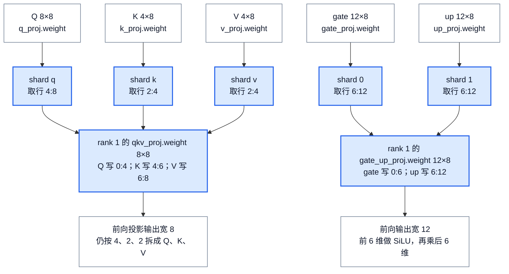
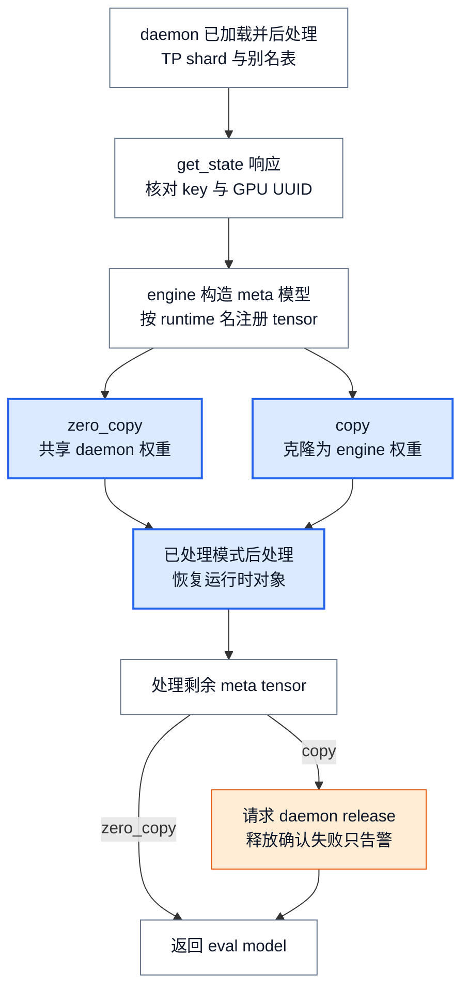

# vLLM 模型库：从 checkpoint 到可执行模型

> **源码基线**：`vllm-project/vllm@199cb9b964822e59ab9b58d88e7be31eb419a2ae`（`main`，2026-09-07）
> **主题**：解释 architecture 如何选出模型类，以及构造器、名称映射和参数加载器怎样把 checkpoint 写入当前 rank 的模型。随后说明加载完成、IPC 权重缓存与 LoRA 接合的边界。
> **适用范围**：模型选择、构造、基础权重加载及模型支持接口；量化数值算法见量化页，attention 能力选择见后端页，设备 batch 与通信分组分别见 runner 和分布式页。
> **最近更新**：2026-09-08。补充小模型分片例子、当前加载变体和实际完整性限制。

## 1. 为什么 checkpoint 不能直接变成一个模型

拿到一个 Qwen2 checkpoint，配置声明 `architectures=["Qwen2ForCausalLM"]`，权重里有 `model.layers.0.self_attn.q_proj.weight`。这仍没有回答三个问题：运行哪一个 Python 类？当前 GPU 应保留这个矩阵的哪一部分？运行时把 Q、K、V 合成一个投影后，这个名字还应写到哪里？

vLLM 将这三个选择分开：**Registry 选择模型类，构造器建立当前 rank 的模型和参数形状，模型与层的加载器把外部名字翻译为本地参数中的具体位置。** 文件加载器负责提供 tensor；它不能单凭文件名推断融合、张量并行（TP）和流水线并行（PP）的模型语义。

下面使用一个**教学用 Qwen2 配置**贯穿说明：hidden size 为 8，4 个 query head、2 个 KV head，每个 head 宽 2，MLP intermediate size 为 12，TP=2、PP=1，不量化。它不是某个公开 checkpoint 的尺寸，也不是性能实验。关注一层时，checkpoint 中的 Q 为 8×8、K/V 各为 4×8，gate/up 各为 12×8；矩阵统一按 PyTorch 实际存储的“输出维×输入维”书写。

如果直接按同名同形复制，运行时 `qkv_proj.weight` 找不到同名的独立 Q/K/V 权重。即使先把全局 Q/K/V 拼起来再平均切两半，也不会得到“每个 rank 都有自己 Q、K、V”的正确分片。必须先知道每个 constituent（融合前的独立投影）的身份，再各自选 rank slice，最后写入本地融合参数。

**设计取舍（分析推断）**：把文件读取、模型名称和参数布局分开，让 safetensors、PT 等读取路径共享模型语义，也让不同模型复用并行层。但代价是 registry 能力、构造出的完整前缀、名称转换和参数写入规则必须一致；注册表中的一行名字不能独自证明模型可运行。官方构造接口设计另有明确理由：统一配置参数便于扩展，也便于组合视觉塔与语言模型。

## 2. 先选模型类，再确认它承诺的接口

### 2.1 同一个 architecture 可以落到不同实现

`_get_model_architecture()` 从 HF config 取得候选 architecture，交给 `model_config.registry.resolve_model_cls()`。本例在内建表中映射到 `qwen2` 模块的 `Qwen2ForCausalLM`。实际选择还受 `model_impl`、候选顺序和任务转换影响：

| 条件 | 选择规则及边界 |
|---|---|
| `model_impl="transformers"` | 先对首个候选解析 Transformers 实现；模块必须通过 backend compatibility 检查，缺模块或不兼容会明确报错 |
| `model_impl="terratorch"` | 先尝试注册的 `Terratorch` 类 |
| 所有原始候选都未注册，`model_impl="auto"` 且 `convert_type` 为 `none` | 在名称规范化前尝试 Transformers fallback；不是永远“先试规范化后的内建类” |
| 普通候选循环 | 按顺序 `_normalize_arch()`，允许从任务后缀找到可转换的内建 base architecture，再尝试加载类 |
| 循环仍未成功，所有原始候选都未注册且为 `auto` | 再尝试 Transformers fallback；已注册但加载失败的候选不满足这个兜底条件 |
| 类已选出，`convert_type="embed"` 或 `"classify"` | 分别套 embedding 或 sequence-classification adapter；`none` 保留原类 |

空候选列表立即 `ValueError`。最终失败会区分已登记但检查/加载失败、曾经支持但已移除、迁到外部插件，以及从未支持；不要把它概括为“随便调用一个 AutoModel”。Transformers 路径会把 model/revision、code revision 和 `trust_remote_code` 交给动态类解析，并检查 `is_backend_compatible()` 或 `_can_set_attn_implementation()`。本页只验证 vLLM 的调用与检查，未验证外部 Transformers 动态加载内部行为。

### 2.2 能力查询为什么不直接导入全部模型

控制面常常只需要知道模型是否支持生成、pooling、PP、多模态或内部状态，尚不需要实例。内建表因此保存 `_LazyRegisteredModel(module_name, class_name)`；`inspect_model_cls()` 查询 `_ModelInfo`，`load_model_cls()` 才在当前进程真正 import 类。

inspection 先查模型源码 hash 对应的文件缓存。没有命中时，在子进程导入并提取能力，避免模型导入初始化父进程 CUDA。当前基线还支持 `vllm.models.*` 等完整模块路径；若入口是 package 的 `__init__.py`，hash 纳入其目录下所有 Python 子模块，避免只检查导出文件而漏掉实现变化。对应测试同时覆盖 package cache 与“inspection 后 CUDA 仍未初始化”。缓存不是 checkpoint 内容校验，也不证明所有外部依赖兼容。

外部 `register_model()` 接受真正的 `nn.Module` 子类，或 `module:class` 字符串；字符串形式保留懒导入，错误类型或格式会被拒绝，重复 architecture 会覆盖登记。插件如何被发现及在哪个进程调用注册，接续 [[24_vllm_extension_plugin_system_analysis|插件与扩展边界]]；本页负责注册后的类选择。

### 2.3 “支持”意味着下游可以调用哪些方法

| 模型接缝 | 要满足的内容 | 在本页路径中的作用 |
|---|---|---|
| 生成与 pooling | Registry 提取相应能力；Qwen2 的 `forward()` 返回隐藏状态，`compute_logits()` 另行投影 | 类可实例化不等于已运行生成；还要有 runner 消费这些接口 |
| `SupportsPP` | `make_empty_intermediate_tensors` 与接收 `intermediate_tensors` 的 `forward()` | 当前 stage 必须能接收/交出中间状态，构造也必须只保留所属层 |
| `SupportsMultiModal` | `embed_multimodal()` 按输入项在 prompt 中的顺序产生 embedding，`embed_input_ids()` 合并文本和多模态 embedding；另有 placeholder 与处理器接缝 | 视觉塔、语言模型仍要各自带稳定前缀；多模态数据处理和设备执行见 [[15_vllm_multimodal_execution_analysis|多模态执行]] |
| `SupportsLoRA` | 支持声明、`packed_modules_mapping`、`embedding_modules` 及实例 manager 接缝 | adapter 名称必须能找到实际可包装的基础层，详见第 7 节 |
| `SupportsQuant` | 向量化配置传递 rename-only mapper 和 packed module mapping | 保留原 projection 名让逐层量化配置命中，再由层创建相应参数；数值算法归 [[17_vllm_quantization_analysis|量化派发]] |

Llama 和 Qwen2 都采用这些共同构造/加载接口并声明 LoRA、PP、量化支持，Llama 还明确提供输入 embedding 与 LM head 的 LoRA 名称表。它们是同一接口的不同实例，不需要在此平铺所有模型结构。registry 的全架构 import/能力测试与初始化测试的代表模型子集也体现这一点；测试包含平台、依赖版本等 skip 条件，不能据此声称每个架构在每台设备都实跑通过。

## 3. 构造器先分配什么，再加载什么

`initialize_model()` 在 current-config/compile scope 中调用 `model_class(vllm_config=..., prefix=...)`，并记录 reload metadata。`VllmConfig` 让嵌套模块读到同一份模型、缓存、量化等配置；`prefix` 则是模块在整棵模型中的名字。Qwen2 外层传入 `model`，decoder 继续派生 `model.layers.0.self_attn.qkv_proj`。attention 注册和逐层量化匹配都依赖这种完整前缀，它不是日志装饰。

Qwen2 构造器用 `QKVParallelLinear` 代替独立 Q/K/V，用 `MergedColumnParallelLinear` 合并 gate/up，用 `RowParallelLinear` 构造 attention 输出投影和 MLP down projection。本例每个 rank 此时得到尚未初始化的 `qkv_proj.weight` 8×8 和 `gate_up_proj.weight` 12×8；正确数值要等下一节加载后才存在。

若 PP>1，`make_layers()` 只构造当前 stage 的层，其余位置放 `PPMissingLayer`，而不是先加载完整模型再删除。Qwen2 的 embedding 通常在首 stage；词嵌入 tying 或 speculative decoding 的特定需求也可让其他 stage 持有它。末 stage 才持有最终 norm 与 LM head。通用加载器遇到 `PPMissingLayer` 或 `StageMissingLayer` 停止整个子树加载，所以别的 stage 的 checkpoint tensor 不该成为本 rank 的漏载错误。

这与前向接口一致：Qwen2 首 stage 从 token 或 `inputs_embeds` 得到隐藏状态，非首 stage 消费 `IntermediateTensors`；**非末 stage** 返回中间状态，末 stage 归一化后返回最终隐藏状态，再由 `compute_logits()` 产生 logits。此处只接到模型方法的输入输出，batch、KV 初始化和实际执行见 runner 页。

> [!contradiction] 文档接口与当前代码有两个差异
> `docs/design/arch_overview.md` 的统一构造签名说明要求旧式外部模型迁移；live `initialize_model()` 仍发 `DeprecationWarning`，再按签名猜 `config/cache_config/quant_config/lora_config/scheduler_config/prefix` 继续构造。统一签名是当前标准，旧兼容桥尚未删除。另外 `SupportsPP.forward` 的 docstring 写“仅末 rank 返回 IntermediateTensors”，Qwen2 的实际分支相反；应以非末 stage 交出中间状态的实现理解本例。

## 4. 一条权重怎样写进融合参数

### 4.1 文件格式选择与模型选择是两个独立轴

`get_model()` 根据 `LoadConfig.load_format` 找 loader，再让它加载已经由 model config 选定的 architecture。当前登记关系如下；它是选择地图，不表示不同 loader 都复用 Default loader 的逐 tensor 路径。

| `load_format` | 选中实现 |
|---|---|
| `auto`、`hf`、`pt`、`safetensors`、`fastsafetensors`、`instanttensor`、`mistral`、`npcache` | `DefaultModelLoader`，内部再选择文件与 iterator |
| `dummy` | `DummyModelLoader` |
| `runai_streamer` | `RunaiModelStreamerLoader` |
| `sharded_state`、`runai_streamer_sharded` | `ShardedStateLoader` |
| `tensorizer` | `TensorizerLoader` |
| `modelexpress` | `ModelExpressModelLoader` |
| `ipc_cache` | `IpcModelLoader`，复用已处理权重，见第 6 节 |

未知格式会报错。`register_model_loader()` 允许登记 `BaseModelLoader` 子类，重复格式会告警后覆盖。Default 路径将来源收敛成 `(name, tensor)` iterator：根据文件类型选 safetensors/PT、可选多线程及专用读取器；`npcache` 当前只接受非 safetensors。主来源之后还能接上 `model.secondary_weights` 的多个来源，并给每个来源加自己的 prefix。这里验证的是 vLLM 的选择与传参，不将第三方文件库的内部 IO 或吞吐视为已验证事实。

### 4.2 名字被翻译，数据仍是原来的 tensor

本例外层 `Qwen2ForCausalLM.load_weights()` 创建 `AutoWeightsLoader`，沿 `model` 子模块递归到 `Qwen2Model.load_weights()`，在那里应用 `hf_to_vllm_mapper`。以下省略相同的 `model.layers.0.` 前缀：

| checkpoint 名 | runtime 名 | 随 tensor 传递的 `shard_id` |
|---|---|---|
| `self_attn.q_proj.weight` | `self_attn.qkv_proj.weight` | `q` |
| `self_attn.k_proj.weight` | `self_attn.qkv_proj.weight` | `k` |
| `self_attn.v_proj.weight` | `self_attn.qkv_proj.weight` | `v` |
| `mlp.gate_proj.weight` | `mlp.gate_up_proj.weight` | `0` |
| `mlp.up_proj.weight` | `mlp.gate_up_proj.weight` | `1` |

`WeightsMapper` 依次应用 renaming、regex、substring、stacked、prefix、suffix 规则；映射到 `None` 的项被丢弃。`apply()` 只改名字、在原 tensor 上附加 `shard_id` 并继续 yield，不分片、不拼接、不复制数值。量化配置可追加 KV scale 映射；旧 rotary cache tensor 有明确 drop 规则。rename-only 版本去掉 stacked 和 `None` drop，供 LoRA 与量化层名列表复用，避免把需要保留的独立 projection 名提前合并。

`AutoWeightsLoader` 再沿点分名称递归模块。子模块有 `load_weights()` 就可接管，普通叶参数用自己的 `weight_loader`，没有则走默认复制。当前也加载持久 registered buffers 与 BatchNorm 统计，排除非持久 buffer。未知 module/parameter 或给单个参数追加 nested name 通常报错；但有明确的 ignore prefix/suffix 配置、意外 `.bias` 等例外，不能称为“所有额外名字都拒绝”。

### 4.3 融合前分别分片，融合后仍能拆回各投影

本例 rank 0 的 Q 取全局输出行 0:4，rank 1 取 4:8；K/V 分别取 0:2 和 2:4。每个 rank 的 `qkv_proj.weight` 都按本地 Q→K→V 排列，三段起点为 0、4、6，长度为 4、2、2。gate/up 同理：各取全局 6 行，写入本地 gate_up 的 0:6 和 6:12。

<!-- Figure spec: 用名称转换和切片操作图而非二维矩阵布局。两条独立lane共用TP=2/rank1教学输入。Q/K/V三个输入框标shape与全局行范围，经对应shard_id与slice框指向一个本地QKV结果框，注明各目标行。gate/up另一路经各自slice指向本地gate_up。输出节点标前向按相同边界split；不变量为每个constituent各自选当前rank的行，禁止先拼全局矩阵再均分。 -->

图中切片是视图选择，最后才向目标 parameter view 执行 `copy_`。不需要先分配全局融合矩阵。本地 QKV 比例不一定相等，Qwen2 前向也明确按 `q_size, kv_size, kv_size` 拆分；MLP 则对融合输出做 `SiluAndMul`，之后进入 down projection。融合参数保留的是投影边界，不是消除投影身份。

在普通非量化权重上，层会安装 v2 weight loader，最终落入 `ModelWeightParameter` 所继承的 column/row parameter 方法。QKV 层算本地 offset/size，parameter 方法同时 narrow 目标段与 checkpoint 的当前 rank 行，断言形状后复制；旧式 parameter loader 仍存在，使用参数上的维度属性执行同类选择。名称末尾相同不表示所有量化参数布局相同，packed bit/scale 布局另由 [[17_vllm_quantization_analysis|量化页]] 解释。

两个变体仍要守住同一规则：

- **KV head 少于 TP rank 数**：例如改成 1 个 KV head、仍 TP=2。Q 仍各取 4 行，两个 rank 的 K/V 都取唯一 head 的 2 行。实现用 `tp_rank // num_kv_head_replicas` 选 K/V 来源，避免错误地向不存在的第二个 KV head 分片。Q head 必须能被 TP 整除；KV head 与 TP 也必须满足分片或复制的整除条件。
- **磁盘上已经融合**：`shard_id=None` 时，QKV loader 先按全局 Q/K/V 边界切开 checkpoint，再递归到上面的独立 shard 路径；Merged loader 同样拆 constituent。它仍不是对整块融合矩阵直接均分。Merged 还支持连续 tuple shard id；越界或非连续组合拒绝，QKV 则只接受 `q/k/v/None`。

普通 column parallel 的参数沿输出维切，前向保留本地输出，只有 `gather_output=True` 才 all-gather。Row parallel 参数沿输入维切：本例 down 的全局 8×12 变成本地 8×6，每个 rank 对自己的 6 维激活计算部分输出，默认 all-reduce 得到完整输出；bias 只在 rank 0 加一次。`input_is_parallel=False` 时层先切输入，`reduce_results=False` 又要求不直接重复加 bias。这里解释参数布局与消费它的运算如何对应，分组构造和 collective ordering 接续 [[18_vllm_distributed_inference_analysis|分布式推理]]。

### 4.4 共享 embedding 要按同一个对象处理

词嵌入 tying 让 `model.embed_tokens.weight` 与 `lm_head.weight` 指向同一份参数。`AutoWeightsLoader` **只对 `VocabParallelEmbedding` 的共享别名去重**，按模块遍历的首个名字作为 canonical name。若两个名字都出现，只加载 canonical；若 checkpoint 只给出被跳过的别名而 canonical 缺失，会在可收集完整 loaded-name 的前提下报错，避免共享 storage 未初始化。其他共享参数不被这一特殊规则一概跳过。

测试用 vocabulary=16、hidden size=2，分别把 embedding 填 1、head 填 2：tied 时最后共享值保持 1，untied 时 head 得到 2；另一测试仅给 head，要求报 canonical 缺失。这比“去掉重复 key”更强，因为检查的是对象共享和加载来源是否一致。

## 5. 什么时候才算加载完成

常规 `BaseModelLoader.load_model()` 在目标 dtype/device 范围内依次完成：构造 → 具体 loader 写权重 → 可适用的 loaded-name 检查 → 在线量化的 layerwise finalize → `process_weights_after_loading()` → `model.eval()` 返回。`LoadConfig.device` 可以覆盖初始加载设备。`download_model()` 只准备文件，`initialize_model()` 只建立模型，`load_weights()` 返回也不等于已经完成所有运行格式处理。

后处理次序本身是模型库的接缝：先尝试重新 tying 相同的 embedding/head，再逐层处理 `QuantizeMethodBase`，随后处理 deferred attention/多模态 encoder、HPC 模块，再调用可选模型级 hook。若后处理替换了参数对象，还会重新协调参数的 TP rank/size，避免 `disable_tp` 层后续 refit 用到错误 rank。CPU offload 参数在处理时临时迁到目标设备，context 的 `finally` 再恢复 CPU/UVA 状态；具体量化和 kernel-format 转换归量化页，不能概括为“所有量化都在全量权重读取之后才发生”，在线量化可能边加载边处理。

### 5.1 loaded-name 集合不等于完整数值证明

Default loader 默认只对“非量化且 model 返回 loaded-name 集合”启用 tracking，也可显式覆盖。它比较 `named_parameters()` 和 loaded set，但实际豁免范围比名字上的“量化例外”更宽。

> [!contradiction] 纠正旧稿的漏载保证
> 旧稿把默认非量化路径写成“任何完全未触达的参数都会报错”。当前 `DefaultModelLoader.track_weights_loading()` 会对带 `uses_meta_device` 或 `process_weights_after_loading` 方法的 quant method，把该模块参数补入 loaded set。**`UnquantizedLinearMethod` 也有这个后处理方法，普通 linear 参数因此也可能被豁免。** 所以这里只能保证尚未被豁免的缺失参数会报 `Following weights were not initialized`；不能保证每个普通权重都实际到达。

即便没有这项豁免，Q、K、V 也都会回报同一个 `qkv_proj.weight`。**分析推断**：仅收到 Q 就可能让这个名字进入 set，因此 name-level gate 无法证明 K/V 都到齐，不能检测全部 constituent 缺失或重复写入。到达 tensor 的 shape/shard-id 合法，与 checkpoint 完整，是两个不同问题。

| 负向输入 | 实际结果或检查局限 |
|---|---|
| 不存在的 module/parameter 名 | 递归加载通常 `ValueError`；显式 skip/ignore 和 PP placeholder 除外 |
| 非法 packed shard id | Merged/QKV 验证拒绝；范围与类型规则分别由对应层定义 |
| tensor 不能切成目标形状 | narrow 或 copy 前的 shape 断言失败 |
| 未豁免参数完全没加载 | tracking 启用且返回集合时，集合差检查报错 |
| fused parameter 少一段 | 通用名称集合不足以证明完整，须模型专项检查/完整 checkpoint 回归 |
| 写入中途失败 | 已完成的 `copy_` 不会自动回滚；常规 `load_model()` 异常向调用者传播，不返回可用模型 |

因此结束标志是 loader 成功返回经过后处理的 eval model，而不是“某个 key 已出现”或“内存已分配”。这也不证明首次模型前向、attention backend 或 GPU 数值回归已经通过；那些需要实际执行环境。

## 6. IPC 权重缓存：输入已经是处理后的参数

`load_format="ipc_cache"` 选择另一条活跃路径。每个 GPU 的 daemon 先正常加载一个 TP shard，完成后处理，再导出 `TensorEntry` 和别名表；重启的 engine 不必重新读取并处理同一份 checkpoint。CUDA tensor 通过 PyTorch reduction/rebuild 的 IPC handle 传递，非 CUDA tensor 按值发送。这里进入 PyTorch/CUDA 的共享分配行为是外部依赖边界，本次只验证 vLLM 的句柄导出、重建调用和生命周期约束。

<!-- Figure spec: IPC复用采用从上到下的状态/选择图，两个模式左右分支后汇合。daemon完整加载后的entries+aliases经get_state和key/GPU核对进入meta模型注册，分zero_copy共享或copy克隆，汇入已处理模式后处理与剩余meta物化，成功返回eval；copy在返回前请求release。图中明确socket响应不是模型完成，完整结果依赖注册和后处理。 -->

选择和完成要拆开看：

1. `_check_supported()` 先检查支持范围，发生在 fallback 的异常捕获之外。当前 allowlist 是未量化，以及设置 `weight_block_size` 的 block-wise FP8；其他量化即使 `fallback=True` 也直接拒绝。KV cache dtype 只放行 `auto` 或以 `fp8` 开头的配置。
2. `_fetch_entries()` 向本地 Unix socket 发 `WeightCacheKey`，包含 checkpoint 标识、architecture、TP size/rank、dtype、量化/配置 hash、revision 与 vLLM version。daemon 按字段比较并返回 entries/aliases；engine 再核对 GPU UUID。**checkpoint hash 只读取本地 safetensors 文件名及 header，不读取权重数值字节**，因此不是完整内容校验；找不到本地文件则回退模型路径作为标识。
3. `_build_model()` 在 meta device 构造同名模块，然后 `_apply_entries()` 注册参数/buffer，允许后处理产生而 meta 模型原本没有的 tensor；别名注册回同一个对象。`zero_copy` 保留共享权重，`copy` 为每个唯一 tensor clone 一份。
4. 在 `weights_already_processed()` scope 内运行后处理，恢复只靠 tensor 导出带不过来的运行时对象。方法必须声明 `supports_pre_processed_weights`，否则报错。随后将残余 meta tensor 物化；缺缓存参数会告警并分配未初始化 storage，这**不是完整性验证**。
5. copy 模式在返回前请求 daemon `release`；daemon 清 entries、aliases 和模型引用再回复。请求失败只告警，因此模型返回不保证 daemon 已释放。zero-copy 模式依赖 daemon 保持共享 allocation 存活，不能把释放当作普通清理；类说明明确排除与 sleep weight offloading 同用。

> [!contradiction]
> `IpcModelLoader` 类 docstring 仍写后处理被完全跳过，实际 `_build_model()` 明确在已处理模式重跑 `process_weights_after_loading()`。跳过的是已完成的 tensor 变换这一要求，Python 侧状态仍可能需要重建，不能按 docstring 推断整个 hook 不执行。

默认 `fallback=True`：daemon 不可用、指纹不匹配或构建失败可以改用清除 IPC 专用 extra config 的 Default loader。copy 模式已经取到状态而构建失败时会先尽力 release，再清 accelerator cache，减少磁盘 fallback 与 daemon 同时占用显存。没有跨进程回滚承诺；独立的 `IpcModelLoader.load_weights()` 甚至只是对已有运行格式模型尽力复制同名同形 tensor，不匹配则 warning/skip，不能等同首次加载路径。

此路径的收益是省去重复 IO/转换；zero-copy 还省独立权重 storage，copy 则支付克隆和短时两份显存成本。daemon CLI 明确只支持 TP，拒绝 PP、DP、EP。通信协议为同用户可信本地进程之间的 pickle/Unix socket，自动路径会校验私有目录、socket 所有者和符号链接；它不是远程权重服务协议。可配置 `socket_path/socket_dir`、`mode`、`fallback`，连接与状态超时默认分别为 5 秒和 300 秒。

真实回归 `test_ipc_cache_cold_start_and_warm_restart` 用 `Qwen/Qwen3.5-0.8B` 比较默认磁盘加载、无 daemon 冷启动回退、关闭 fallback 的暖启动与再次重启，要求输出相同。它是 TP=1 的具体回归，本次未运行，不能外推全部模型、量化和并行组合。

## 7. LoRA 如何接到已构造的基础模型

### 7.1 包装真实层，并为 adapter 预留位置

基础模型加载后，`create_lora_manager()` 检查 `SupportsLoRA`。`supports_lora()` 还诊断“只声明 flag 却缺少属性”以及“属性齐全却未声明支持”，因为 adapter 依赖稳定模型名称和包装器支持，不能给任意 `nn.Module` 加一个布尔值就认为完成。

manager 查找支持的模块、处理 packed mapping、建立共享 Punica wrapper，再遍历真实 `named_modules(remove_duplicate=False)`，跳过 PP missing layer，把匹配层原地替换为保留 base layer 的 LoRA wrapper，并按有限 `max_loras` slots 分配 adapter storage。共享 module 会复用同一 wrapper，避免 alias 再次 reset 已写 adapter；`lm_head` 有自己的处理例外，并接到 logits processor wrapper。

**分析推断**：先建立基础图再包装，让 TP/PP 参数形状与模型前缀仍由原模型定义，避免每个模型复制 LoRA 分支；代价是包装器必须支持实际选中的 layer subclass。没有 Punica wrapper、某些明确跳过的非门控 MoE gate 等路径仍可 warning/skip，不能把所有 target 情况概括为强制成功。

### 7.2 同一个 projection 名在基础加载与 LoRA 中用途不同

例如部署指定 `target_modules=["gate_proj"]`，实际只有 `gate_up_proj`。`packed_modules_mapping={"gate_up_proj": ["gate_proj", "up_proj"]}` 让 manager 找到融合父层；反向指定父层也能匹配 adapter 中的子投影。基础权重 mapper 也可供 LoRA 用，但必须先取 rename-only 版本，保留 `gate_proj` 的 constituent 身份，再由 manager pack 成 fused wrapper 所需 slices。

worker `_load_adapter()` 展开 expected module 集合，读取并验证 PEFT config，把 checkpoint 读入 CPU LoRA 对象，还会应用模型定义的 `lora_skip_prefixes`。`add_adapter()` 先登记，随后 `activate_adapter()` 找空设备 slot、更新 `lora_index_to_id`，对每个 wrapper 调 `set_lora()`；当前 adapter 没有的 layer 会 `reset_lora()`。因此“文件已读入”“已登记”“设备 slot 已激活”不是同一完成点。

### 7.3 拒绝与完成边界

不支持 LoRA 的基础模型会被拒绝；checkpoint 出现 expected set 之外的 target 会报错；选中的层到达 wrapper 匹配检查却没有实现时，默认扫描可 warning/skip，而显式 `target_modules` 会报错。这一差异及 `gate_proj → gate_up_proj` 有直接测试。

基础 manager 注册容量用尽报 `No free adapter slots`，激活找不到设备空位报 `No free lora slots`；LRU manager 是不同的活跃策略，不能把前者外推成全部 manager 都不淘汰。设备 slot 写入与 mapping 更新也不是自动回滚事务，失败前可能已有局部修改。

本页到 adapter 已登记并可激活、目标 module/slot 合法存在为止。某一步哪些 token 选择哪个 adapter、slot 重排后 mapping 如何对设备生效，接续 [[11_vllm_model_runner_v1_analysis|Model Runner V1]] 和 [[12_vllm_model_runner_v2_analysis|Model Runner V2]]。

## 8. 从症状回到源码

排查时先确定失败发生在类选择、模型构造、名称转换、参数写入还是后处理：unsupported architecture 看 registry；key 不存在看模型 mapper/PP placeholder；shape 错看参数分片；加载“成功”但融合层数值异常，要检查 constituent 是否真的齐全，不能只看 loaded-name 集合。IPC 则先区分取到缓存响应与构建可执行模型，LoRA 则先区分 target 名匹配与实际 wrapper/slot 激活。

以下均为本基线实际打开的源码路线，路径相对 `vllm-project/vllm`：

1. **类选择与能力**：`vllm/model_executor/models/registry.py::_ModelRegistry.resolve_model_cls`、`_LazyRegisteredModel.inspect_model_cls`、`_LazyRegisteredModel._get_modelinfo_module_hash`、`_ModelInfo.from_model_cls`；`vllm/model_executor/model_loader/utils.py::_get_model_architecture`。验证：`tests/models/test_registry.py::test_registry_model_property`、`test_lazy_modelinfo_package_attempts_cache_load`、`test_hf_registry_coverage`。
2. **统一构造与模型消费**：`vllm/model_executor/model_loader/utils.py::initialize_model`；`vllm/model_executor/models/qwen2.py::Qwen2ForCausalLM`、`Qwen2Model`、`Qwen2Attention.forward`、`Qwen2MLP.forward`；`vllm/model_executor/models/llama.py::LlamaForCausalLM`；`vllm/model_executor/models/interfaces.py::SupportsMultiModal`、`SupportsPP`、`SupportsQuant`。设计对照：`docs/design/arch_overview.md` 的 Extensibility/Uniformity 与 `docs/contributing/model/basic.md` 的 Initialization Code；初始化验证入口为 `tests/models/test_initialization.py::can_initialize`。
3. **选择加载器与最终返回**：`vllm/model_executor/model_loader/__init__.py::get_model_loader`、`get_model`；`vllm/model_executor/model_loader/base_loader.py::BaseModelLoader.load_model`；`vllm/model_executor/model_loader/default_loader.py::DefaultModelLoader._get_weights_iterator`、`get_all_weights`、`load_weights`、`track_weights_loading`；`vllm/model_executor/model_loader/utils.py::process_weights_after_loading`、`device_loading_context`。
4. **名称、递归和共享参数**：`vllm/model_executor/models/utils.py::WeightsMapper`、`AutoWeightsLoader._load_module`、`AutoWeightsLoader._load_param`、`AutoWeightsLoader._check_skipped_aliases`、`make_layers`。验证：`tests/models/test_utils.py::test_module_skip_tied_weights`、`test_module_skip_tied_weights_without_canonical`、`test_module_load_shared_params_that_are_not_tied_embeddings`；`tests/models/transformers/fusers/test_linear.py::test_weight_mappings_are_scoped_to_fused_prefixes`。
5. **融合与物理切片**：`vllm/model_executor/layers/linear.py::UnquantizedLinearMethod`、`ColumnParallelLinear`、`MergedColumnParallelLinear.weight_loader_v2`、`QKVParallelLinear.weight_loader_v2`、`QKVParallelLinear._load_fused_module_from_checkpoint`、`RowParallelLinear`；`vllm/model_executor/layers/activation.py::SiluAndMul.forward_native`；`vllm/model_executor/parameter.py::_ColumnvLLMParameter.load_qkv_weight`、`_ColumnvLLMParameter.load_merged_column_weight`。前述 fuser 测试验证名字和 shard 标签，不等于本页教学尺寸的 GPU 数值测试。
6. **IPC 与生命周期**：`vllm/model_executor/model_loader/weight_cache/ipc_loader.py::IpcModelLoader.load_model`、`_build_model`、`_apply_entries`、`_request_state`、`_materialize_remaining_meta_tensors`；`vllm/model_executor/model_loader/weight_cache/daemon.py::export_entries`、`WeightCacheDaemon._handle_get_state`、`WeightCacheDaemon._handle_release`、`_reject_unsupported_parallelism`；`vllm/model_executor/model_loader/weight_cache/protocol.py::WeightCacheKey`、`hash_checkpoint`、`TensorEntry`、`check_ipc_quant_support`。验证：`tests/model_executor/model_loader/test_weight_cache.py::test_ipc_cache_cold_start_and_warm_restart`。
7. **LoRA 接合**：`vllm/model_executor/models/interfaces.py::SupportsLoRA`、`supports_lora`；`vllm/lora/model_manager.py::LoRAModelManager._create_lora_modules`、`LoRAModelManager.activate_adapter`、`LoRAModelManager._create_merged_loras_inplace`、`create_lora_manager`；`vllm/lora/worker_manager.py::WorkerLoRAManager._load_adapter`、`WorkerLoRAManager.add_adapter`；`vllm/lora/utils.py::is_in_target_modules`。验证：`tests/lora/test_lora_manager.py::test_target_modules_fail_closed_on_unsupported_matched_modules`、`test_target_modules_match_packed_runtime_modules`。

本次为固定源码与测试内容复核，未运行 GPU 模型加载、CUDA IPC、LoRA 数值测试或第三方依赖集成；教学尺寸由已读切片规则推导，不作为实测保证。

## Related Pages

- [[02_vllm_architecture_overview_analysis|vLLM 架构概览]] — 将模型库放回配置、Engine、Executor 与设备执行的整体关系。
- [[10_vllm_attention_backends_analysis|Attention Backend]] — 接续模型层构造出的 attention 对象如何选择实现并消费 metadata/KV layout。
- [[11_vllm_model_runner_v1_analysis|Model Runner V1]] — 解释模型返回之后的 batch、buffer 与当步 LoRA mapping。
- [[12_vllm_model_runner_v2_analysis|Model Runner V2]] — 对照持久设备状态如何消费相同的可执行模型接口。
- [[17_vllm_quantization_analysis|量化派发]] — 深入量化参数、scale、后处理和 kernel 格式，承接本页加载接缝。
- [[18_vllm_distributed_inference_analysis|分布式推理]] — 解释本页并行层依赖的 TP/PP 分组与通信执行。
- [[24_vllm_extension_plugin_system_analysis|插件与扩展边界]] — 解释外部 model/loader 注册之前的插件发现与初始化。
