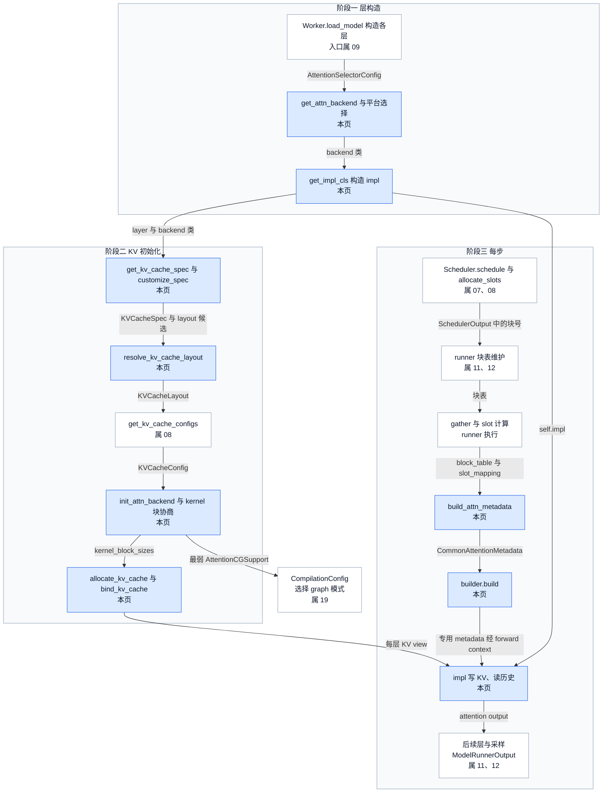
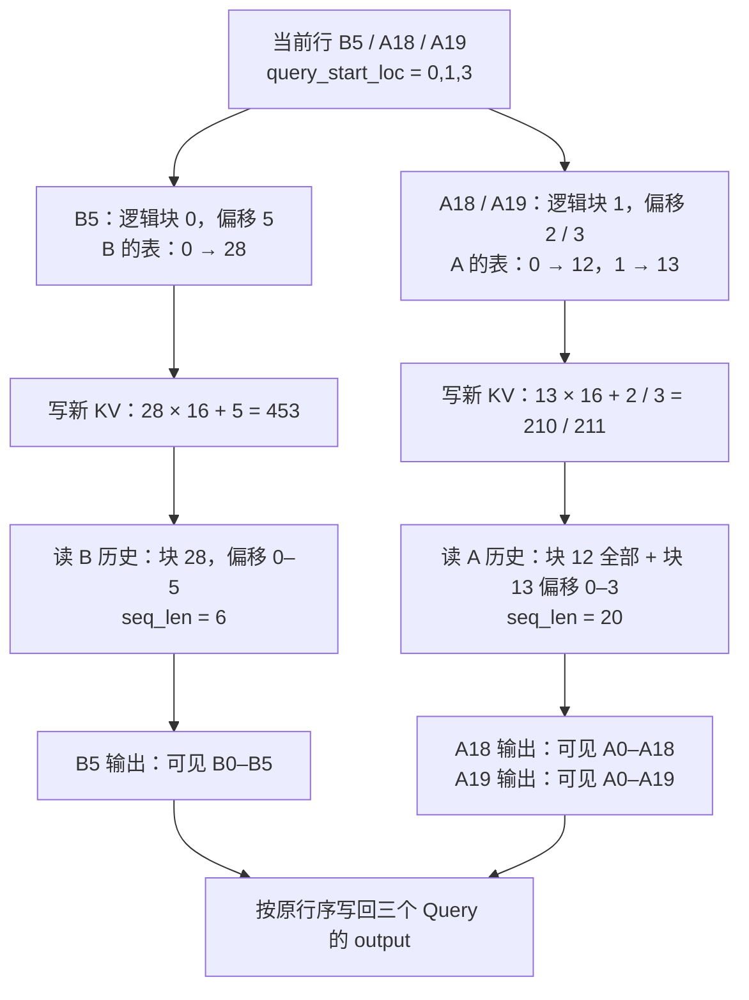
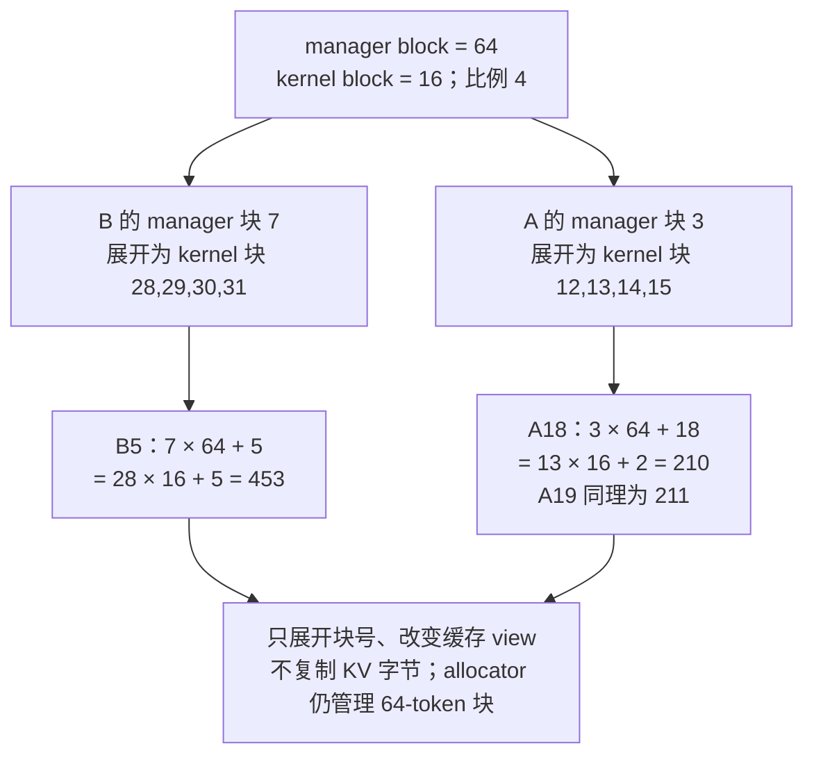
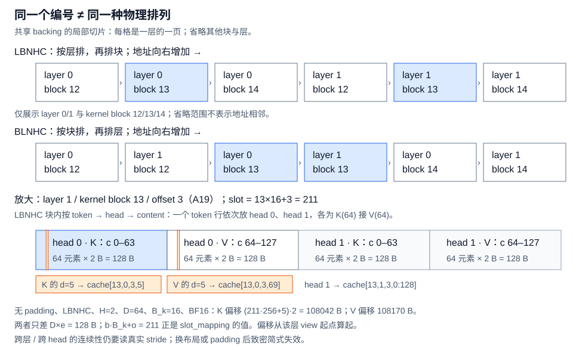
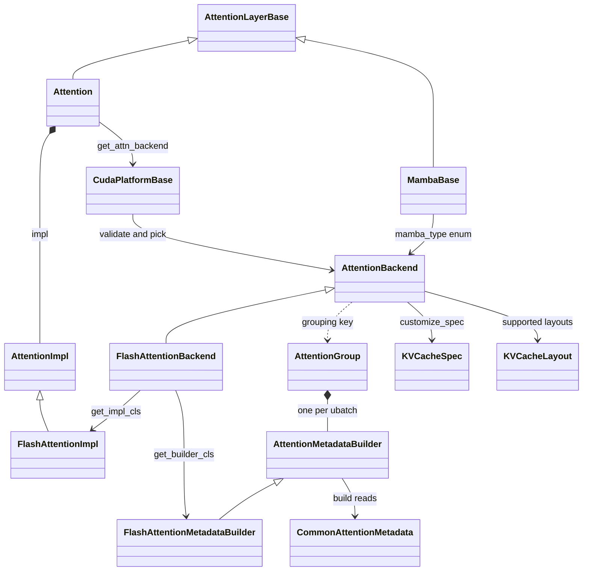

# vLLM Attention Backend：让本步 Query 找到完整 KV 历史

> **源码基线**：`vllm-project/vllm@199cb9b964822e59ab9b58d88e7be31eb419a2ae`（`main`，2026-09-07）
> **主题**：从一个混合 batch 的增量写入与历史读取出发，先给出三阶段位置与核心流程清单，再依次解释 backend 能力选择与变体集合（含 Mamba 与 attention layer 两条相邻选择轴）、KV 初始化阶段与布局协商、manager/kernel 块、slot 到元素与字节地址、metadata 构建、一次调用接线与块号交接链，最后给出约束、成本与配置契约。核心代码在 `vllm/v1/attention/`。
> **适用范围**：attention 能力选择、KV 表示与 metadata 翻译；请求调度见 07，物理块分配与生命周期见 08，设备 batch 维护见 11/12，CUDA Graph 派发见 19，kernel 内部见 20，量化数值见 17。
> **最近更新**：2026-09-11。补核心流程清单、三阶段位置图与块号交接链，为 KV 初始化和每步流程加阶段表，并补 MRV1 的每步调用树。

## 1. 特性概览

### 1.1 问题：三个新 token 只带来三行 K/V

一次模型执行只算本步的新 token。请求 B 已算完位置 0–4，本步算位置 5；请求 A（prompt 20 个 token）已算完 0–17，本步续算 18、19。模型把当前 Query 排成 `[B5, A18, A19]`，新 K/V 也只有这三行，但 B5 要看到 B 的 6 个位置，A19 要看到 A 的 20 个位置：**新 K/V 是要写进缓存的增量，attention 读的是缓存中的完整可见历史。** 写入必须落到正确的物理槽并先于读取，读取必须知道每个请求的历史在哪些块、有多长；而 FlashAttention、FlashInfer、MLA、Mamba 等实现对 dtype、head size、块长和缓存排列各有要求，全模型又共用一份缓存 backing。所以"这一步能否找到历史"取决于初始化期选定的实现、缓存表示与每步 metadata 三者是否一致。

### 1.2 方案形状：初始化固定表示，每步只翻译请求事实

vLLM 把问题拆给六个对象：前三个在初始化期固定，后三个每步构建或执行，Scheduler 不会每步重新挑 FlashAttention 或 FlashInfer。执行一侧有两代 runner：**Model Runner V1（MRV1，`vllm/v1/worker/gpu_model_runner.py`）** 与 **Model Runner V2（MRV2，`vllm/v1/worker/gpu/model_runner.py`）**，二者都运行在 V1 engine 内；本页的一步接线以 MRV2 为主，行维护与输入物化分别见 [[11_vllm_model_runner_v1_analysis|Model Runner V1]] 与 [[12_vllm_model_runner_v2_analysis|Model Runner V2]]。

| 对象 | 输入 → 产物 | 何时固定 | 对本例的作用 |
|---|---|---|---|
| `AttentionBackend` | 模型、设备、特性条件 → 能力声明与 builder/impl 类 | layer 构造时 | 确认 head size 64、BF16、causal 与缓存格式可执行 |
| `KVCacheSpec` | attention 语义 + backend packing → 每层缓存内容与 page 大小 | KV 初始化前 | 说明每个块要存哪些 K/V 字节 |
| `KVCacheLayout` | 所有 backend 的共同支持 → 物理 stride 顺序 | EngineCore 解析一次 | 让槽 211 在缓存 view 中只有一种字节解释 |
| `CommonAttentionMetadata` | 当步 batch → 公共长度、块表、槽映射 | 每步 | 保存 B、A 的共同事实 |
| `AttentionMetadataBuilder` | common metadata + spec → 专用 metadata | 每步 build | 翻译为具体 kernel 的参数与规划数据 |
| `AttentionImpl` | Q/K/V、cache、metadata → 本层输出 | 每层每步 | 执行增量写入与历史读取 |

### 1.3 收益、成本与约束

| 维度 | 直接收益 | 必付成本或边界 |
|---|---|---|
| 初始化期能力选择 | 设备或语义不支持在选择时拒绝，不等到第一次 forward | 每个唯一配置一次 import 与 validator 探测；优先级是平台政策，不证明任意负载最快 |
| spec 与 layout 分离 | 同一份 backing 可被不同 backend、不同 group 按各自语义解释 | 所有 worker、所有 backend 必须对一个 layout 达成一致，否则启动失败 |
| manager/kernel 块分离 | 分配粒度与 kernel 粒度可以不同，不搬运 KV | 块表条目按比例放大；要求致密 page，padding 或层间交错时硬失败 |
| 公共 metadata + 专用 builder | backend 不读 Scheduler 对象；同组多层共享一次 build | 每步每组一次 CPU build；公共字段的 padding、上界语义须由消费方自行核对 |
| 增量写入与读取分离 | 同一写入 op 服务各种布局；编译器可见依赖保证先写后读 | 一次额外 custom op 与 dummy 依赖；KV-sharing 与 profile 有旁路 |

以上是基于固定源码路径的结构分析，不是性能实测。

### 1.4 贯穿例子与符号

教学例子为普通 causal decoder，未量化，无上下文并行或推测解码。形状取**每 rank、TP=1** 的教学值：4 个 Query head、2 个 KV head、head size 64、BF16；它独立于 [[09_vllm_model_library_analysis|模型库]] 的 tiny Qwen2 配置，也不代表真实模型或性能测试。Q 为 `3×4×64`，新 K/V 各为 `3×2×64`，输出仍为 `3×4×64`。先设 manager 块与 kernel 块都是 16 个 token，块号任意选取；§2.7 再引入 manager 64。

| 当步信息 | 教学值 | 它回答的问题 |
|---|---|---|
| 请求顺序 | `[B, A]` | metadata 的第几行属于谁 |
| `query_start_loc` | `[0, 1, 3]` | B 的 Query 是扁平行 `[0,1)`，A 是 `[1,3)` |
| `seq_lens` | `[6, 20]` | 加上本步 Query 后每个请求有多少有效 KV 位置 |
| `positions` | `[5, 18, 19]` | 三行新 token 各自位于请求内哪里 |
| `block_table` 有效部分 | B：`[28]`；A：`[12, 13]` | 请求的第几个逻辑块存在哪个物理块 |
| `slot_mapping` | `[453, 210, 211]` | 每行新 K/V 写入哪个物理 token 槽 |
| 数量与上界 | requests=2，tokens=3，max query=2，max seq=20 | 分段数、有效行数与 kernel 规划范围 |

`query_start_loc` 是前缀和，长度为请求数加一，相邻差得 Query 长度 `[1,2]`。`seq_lens` **包含本步 token**，减去 Query 长度才得旧 context `[5,18]`；若把旧 context 填进 `seq_lens`，kernel 会漏读本步刚写入的 K/V。`CommonAttentionMetadata.seq_lens` 的字段注释写作"the number of computed tokens"，容易被读成旧 context；MRV2 的 `_prepare_pos_seq_lens_kernel` 明确计算 `num_computed_tokens + query_len`，`FlashAttentionMetadata` 的注释图同样定义 seq_len = context_len + query_len，FlashAttention 把它作为 `seqused_k`。

为什么需要两张映射？`slot_mapping` 按**本步 token 行**索引，负责散写；`block_table` 按**请求和逻辑块**索引，负责找到含旧 token 的历史。Query 行数不等于历史长度，二者不能互相代替。把请求事实先归一为公共 metadata，也让 backend 不必读取 Scheduler 的 CPU 对象与请求生命周期（分析推断：源码未写明动机，这是从接口分工得出的解释）。

后文符号：$B_{\mathrm{k}}$、$B_{\mathrm{m}}$ 为 kernel block 与 manager block 的 token 数（均为 16，§2.7 起 $B_{\mathrm{m}}=64$）；$H$、$D$、$e$ 为本 rank 的 KV head slot 数（2）、每个 K/V head 的维度（64）与每元素字节数（BF16 为 2）；$b$、$o$、$s$ 为 kernel 块号、块内偏移与扁平槽号，$s=bB_{\mathrm{k}}+o$。

### 1.5 在引擎中的位置与核心流程清单

本特性横跨三个阶段：模型构造时逐层选定 backend，KV 初始化时全模型协商缓存表示并建好 view，每步把调度结果翻译成 kernel 输入。引擎启动顺序是：`EngineCore.__init__` 先建 executor，各 worker `init_device` → `load_model`，层在构造中选 backend；再由 `EngineCore._initialize_kv_caches` 依次收集 spec、解析 layout、`determine_available_memory`（其中 `profile_run`）、`get_kv_cache_configs`、`initialize_from_config` 与 `compile_or_warm_up_model`，返回后 EngineCore 才创建 Scheduler。下图的边标交接对象，节点标归属页，蓝色是本页负责的环节。

<!-- 图规格：三阶段位置图。阶段一层构造（入口属 09）：AttentionSelectorConfig → backend 类 → impl；阶段二 KV 初始化：KVCacheSpec 与 layout 候选 → KVCacheLayout → KVCacheConfig（08）→ kernel_block_sizes → 每层 view；阶段三每步：SchedulerOutput 块号（07/08）→ runner 块表（11/12）→ block_table 与 slot_mapping → CommonAttentionMetadata → 专用 metadata → impl → 后续层与 ModelRunnerOutput（11/12）；最弱 AttentionCGSupport 交 19。边只写交接对象，蓝色节点归本页；阶段二内有一个不可见占位节点，只为把 spec 节点移出子图标题正下方。 -->


**核心流程清单**

| 核心流程 | 触发与上游输入 | 输出与交接对象 | 下游消费者（归属页） | 本页位置 |
|---|---|---|---|---|
| 构造期逐层 backend 选择 | `Worker.load_model` 构造模型时每个 `Attention.__init__`（构造入口属 09）；`AttentionSelectorConfig`、`AttentionConfig.backend` 与 `backend_per_kind` | backend 类与 `self.impl`；层登记进 `static_forward_context` | KV spec 收集（本页）；runner 分组（11、12） | §2.2–2.3，§3.2(a) |
| Mamba 轴选择 | Mamba 类层构造；层的 `mamba_type` | `MambaAttentionBackendEnum` 对应的 backend 类；`MambaSpec.mamba_type` | KV spec 与缓存（08）；Mamba metadata 与 kernel 暂无 owner | §2.4，§3.2(a) |
| KV spec 收集与 layout 协商 | `EngineCore._initialize_kv_caches`；各 worker 的层 spec 与 backend 的 layout 声明 | `KVCacheSpec` 列表；唯一 `KVCacheLayout`，写入 `CacheConfig.kv_cache_layout` 与各 `KVCacheConfig` | 显存测量与 `get_kv_cache_configs`（08）；worker allocator（本页） | §2.5–2.6，§3.2(b) |
| kernel block 协商与 view 创建、绑定 | `Worker.initialize_from_config` → runner `initialize_kv_cache`；`KVCacheConfig` 与各组 backend | kernel block sizes、`AttentionGroup` 与 builders、每层 KV view | runner 块表（11、12）；每步 metadata 与 impl（本页） | §2.5 阶段表，§2.7–2.8，§3.2(b) |
| 每步逐 KV group 构建 metadata | `EngineCore.step` → `execute_model`；`SchedulerOutput` 的新块号经 runner 块表，当步 `query_start_loc`、`seq_lens`、positions | 每组 `CommonAttentionMetadata` → 专用 metadata；逐层 slot mapping | `set_forward_context` → 各层 impl（本页） | §2.9–2.11，§3.2(c)(d) |
| 逐层 KV 写入 → attention 读取 | 模型 forward 中每个 `Attention.forward`；Q/K/V 与 forward context | 缓存中的新 K/V；本层 attention output | 后续层与采样，最终 `ModelRunnerOutput`（11、12） | §2.1，§2.8，§2.10，§3.2(c) |
| graph 能力上报 | runner KV 初始化末尾；各组 builder 的 `get_cudagraph_support` | 最弱 `AttentionCGSupport` 与其 backend 名 | `CompilationConfig.resolve_cudagraph_mode_and_sizes`（19） | §2.9 |

## 2. 机制：从一次写入/读取走到整条选择链

### 2.1 最小例子：先写增量，再按请求读历史

物理槽号 = 物理块号 × $B_{\mathrm{k}}$ + 块内偏移。B5 在逻辑块 0、偏移 5，查 B 的表得块 28，写槽 `28×16+5=453`；A18 在逻辑块 1、偏移 2，查 A 的表得块 13，写槽 `13×16+2=210`；A19 写 `13×16+3=211`。随后 B 从块 28 的偏移 0–5 读 6 个 KV；A 从块 12 的偏移 0–15 和块 13 的偏移 0–3 读 20 个。causal 语义仍逐 Query 生效：A18 只能读位置 0–18，A19 才能读 0–19。**先写完 A 的两个新 KV，不等于允许较早的 Query 看见较晚的位置。**

<!-- 图规格：拓扑/地址变换图，不画真实二维 storage。输入为按 B/A 分段的三个 Query 与新 K/V；逐分支显示逻辑位置经 block table 得到槽号，再显示完整历史及 causal 输出。读者能重算 453/210/211，并确认当前 Query 行数始终为 3。 -->


缓存写入 kernel 把一个 token 行的 K/V 写到该槽的各 head，**负槽号直接跳过**。MRV2 的 slot kernel 把实际 token 之后到缓冲末尾全部填成 `PAD_SLOT_ID=-1`，上下文并行下不属于本 rank 的位置也写 `-1`；因此槽号不是总有效的连续数组，补齐行也不会被当作新 token 写入。

### 2.2 能力选择：validator、平台优先级、显式选择与注入

**职责与契约。** 普通 `Attention` 在 `__init__` 中调用 `get_attn_backend()`，把 head size、dtype、KV dtype、sink、MM prefix、per-head scale、attention type、sliding window 等组装成 `AttentionSelectorConfig`，交给当前平台的 `get_attn_backend_cls()`，结果按配置 `functools.cache`，随后构造 impl。**为什么在构造期选**：若每步选或在第一次 forward 时"试一试"，不兼容会在服务中途以 kernel 错误暴露，同组多层也可能落到不同实现；构造期统一过滤能把所有拒绝原因一次汇总（分析推断，源码未写明被拒方案）。

**validator 汇总拒绝原因。** `AttentionBackend.validate_configuration()` 检查 head size、activation/KV dtype、block size、compute capability，以及 MM prefix、MLA、sparse、sink、per-head scale、attention type、sliding window、non-causal、batch invariance、KV connector、PCP、adaptive verification 与 DCP 组合；`supports_combination()` 再补交叉约束（如 FP8 与 FA 版本、设备代际）。import 成功不代表组合可执行。默认能力并非全部 opt-in：基类 `supports_kv_connector()` 返回真，`ROCM_ATTN` 因 `(2, num_blocks, …)` 的旧缓存组织返回假；selector 只在配置了实际 KV-transfer 实例时传入 connector 条件。这是**选择阶段的能力过滤**，与 §2.6 的 connector layout 偏好是两件事。

**per-kind 覆盖。** `get_attn_spec_kind()` 先判 encoder-only/cross，再判 MLA 与 sliding window 的组合，最后得 full；`backend_per_kind[kind]` 覆盖全局 `backend`，未配的 kind 回落到全局或 auto。配置拒绝未知 kind，并把名字解析为枚举。它是模型内不同 KV 语义的覆盖，不是逐请求路由；普通 selector 也不会仅因有 sinks 就推导 `SINK_FULL_ATTENTION`，该 kind 只由 `StaticSinkAttention` 产生。

**block size 只在用户显式指定时参与过滤**，否则传 `None`，给平台留余地。基类 `supports_block_size()` 对整数或 `MultipleOf(n)` 声明都按整除关系接受较大的 manager block；真正执行的 kernel block 仍要经 §2.7 的严格协商，具体 backend 也可覆盖该谓词（B12X 只收 64/128）。

**auto、显式与注入。** CUDA 按设备、dense/MLA、Query head 数、head size、KV dtype 和 causal 条件排出候选，逐个懒导入并调用 validator，`ImportError`、`OSError` 与能力拒绝都记为原因。auto 取有效候选中优先级最小者，无候选时报出完整 selector config 与每项原因；若更高优先级者仅因用户 block size 被排除，会 warning 提示可能损失性能。显式 backend 只验证指定项，失败即拒绝启动，不偷换实现。**优先级表达平台政策，不证明任意负载最快**：CUDA dense 在 SM10 且 causal 时先 FlashInfer，其余先 FlashAttention，再 Triton、Flex、TurboQuant；FP32 可使 CUDA auto 落到 Flex，但不意味任何 head size 或设备都能这样回退。ROCm 显式不兼容通常也失败，唯一例外是 `turboquant_*` KV dtype：boundary layer 保留显式 backend，TurboQuant layer 走 per-layer auto。

`Attention(..., attn_backend=SomeClass)` 是另一入口：直接注入绕过 selector 与平台过滤。layer 仍检查 ALiBi sqrt、chunk lookback（须 `TRITON_ATTN`）、Flex 的 `flex_attn_block_m/n`（仅在 `VLLM_BATCH_INVARIANT` 且有 cache config 时不得超过块长）等局部限制；FlashInfer 与 `TRITON_MLA` 在 batch-invariant 模式下会关闭 prefix caching；adaptive verification 建立时还检查所有组是否支持 device/CPU Query 长度不一致。**注入者须自行保证其余设备与特性组合成立**。§2.4 会看到，多种 layer 包装类正是先用 selector 选出底层 backend，再把包装子类经这一入口注入。本页的"回退"只指初始化候选替换。已选 op 内部的 kernel/provider 回退见 [[20_vllm_fused_ops_and_kernels_analysis|融合算子与 kernel]]；full graph、piecewise、eager 的运行期降级见 [[19_vllm_compilation_cudagraph_analysis|编译与 CUDA Graph]]。

### 2.3 变体集合：39 个枚举成员，本页展开哪些

**枚举依据。** selector 的注册表是 `AttentionBackendEnum`，共 39 个成员：`TORCH_SDPA` 只作 ViT 标签（值为空串），`CUSTOM` 须先 `register_backend()` 才能用，`NO_ATTENTION` 的类路径指向本基线不存在的 `vllm/v1/attention/backends/no_attention.py`，选中即 import 失败。各平台再用自己的选择点取子集：CUDA 与 ROCm 由 `_get_backend_priorities()` 给出有序候选并逐个过 validator；CPU 与 XPU 的 `get_attn_backend_cls()` 按条件分支直接返回类路径，不跑 validator 循环；TPU 平台类来自外部 `tpu_inference` 包，本基线看不到其选择逻辑；另有成员只由模型代码注入或显式配置选中。**但枚举不是参与下游的全部 backend**：layout 求交与 kernel block 协商消费的是每个 `AttentionLayerBase` 的 `get_attn_backend()` 返回值，部分缓存层直接返回不在枚举中的类（§2.4 表末行），`test_select_common_block_size_accepts_rocm_sparse_block_size_16` 就用 `DeepseekV32IndexerBackend` 参与块长协商。下表中 LBNHC 等布局名按物理顺序从外到内列轴：L 层、B 块、H head、N 块内 token、C 内容（§2.5 详述）。

| 分组（数） | 成员 | 选择点；本页处理与 owner |
|---|---|---|
| CUDA dense 候选（5） | `FLASH_ATTN`、`FLASHINFER`、`TRITON_ATTN`、`FLEX_ATTENTION`、`TURBOQUANT` | dense 优先级列表；FA 重放本例，FlashInfer、Flex 列边界，TurboQuant 数值无 owner |
| CUDA dense 非默认（4） | `B12X`、`HPC_ATTN`、`FLASH_ATTN_DIFFKV`、`TRITON_ATTN_DIFFKV` | 显式配置，DIFFKV 另由 openPangu、MiMo-V2 注入；B12X 列边界，其余无 owner |
| CUDA MLA（6） | `FLASHINFER_MLA`、`TOKENSPEED_MLA`、`CUTLASS_MLA`、`FLASH_ATTN_MLA`、`FLASHMLA`、`TRITON_MLA` | MLA 优先级（SM10/SM12/其他）；FlashMLA、FlashInfer MLA 列边界，MLA 算法无 owner |
| CUDA sparse MLA（5） | `FLASHINFER_MLA_SPARSE`、`FLASHMLA_SPARSE`、`FLASH_ATTN_MLA_SPARSE`、`FLASHINFER_MLA_SPARSE_SM90`、`FLASHINFER_MLA_SPARSE_SM120` | 各 MLA 分支尾部；SM90、SM120 列规划边界，indexer 数值不展开 |
| 模型专用 sparse（6） | `FLASHMLA_SPARSE_DSV4`、`FLASHINFER_MLA_SPARSE_DSV4`、`ROCM_FLASHMLA_SPARSE_DSV4`、`MINIMAX_M3_SPARSE`、`CUTLASS_MSA`、`TRITON_MSA` | 模型层自带 `get_attn_backend()`，两个 MSA 名只是改写 decode kernel 字段的配置别名；DSv4 缓存见 08，其余无 owner |
| ROCm（6） | `ROCM_ATTN`、`ROCM_AITER_FA`、`ROCM_AITER_UNIFIED_ATTN`、`ROCM_AITER_MLA`、`ROCM_AITER_TRITON_MLA`、`ROCM_AITER_MLA_SPARSE` | ROCm 优先级列表；只保留 connector 与 TurboQuant 例外 |
| CPU / XPU（4） | `CPU_ATTN`、`CPU_MLA`、`AMX_MLA`、`XPU_MLA_SPARSE` | 平台条件分支；超出本页 |
| 特殊标签（3） | `TORCH_SDPA`、`NO_ATTENTION`、`CUSTOM` | ViT 选择、缺失模块、插件注册；ViT 见 §2.4，插件无 owner |

**本页展开的变体边界。** 选这 7 个，是因为它们覆盖 CUDA dense 的默认首选（FlashAttention、FlashInfer）以及每类约束各一例：FP32（Flex）、MLA 块长与设备（FlashMLA、FlashInfer MLA）、非默认且严格的块长与 packing（B12X）、sparse 规划与打包格式（SM90、SM120）。表中声明只说明进入候选集的条件，import 成功、backend 名或 selector 条目都不能代替组合验证与全模型布局交集；这是能力差异，不是性能榜（数值转换见 [[17_vllm_quantization_analysis|量化派发]]，provider 内部算法见 20）。"依赖边界"列标出 kernel 位于哪一侧：对第三方 kernel，vLLM 源码只能证明交给它的参数与版本分支。

| 实现 | 依赖边界 | 当前声明或局部限制 |
|---|---|---|
| FlashAttention | `fa_utils` → `vllm.vllm_flash_attn`，由 `vllm_flash_attn.cmake` 构建的外部 flash-attention | 通常 `MultipleOf(16)`，FA4 hd256 形状例外；head size、FP8、sink、MM prefix 与 FA 版本/设备共同限制；per-head scale 需 FA≥3 |
| FlashInfer dense | 外部 `flashinfer` 包 | head size 64/128/256/512；capability 8.0–12.1（源码注释：SM75 因上游已知问题暂被排除，修复合入后回退到 7.5，所以旧下界与此下界都不能当作固定事实）；SM10 只声明 LBHNC/BLHNC |
| FlexAttention | PyTorch `torch.nn.attention.flex_attention` | 接受 FP32；支持 decoder/encoder-only、non-causal、MM prefix、sliding window、batch invariance；只声明 LBNHC |
| FlashMLA / FlashInfer MLA | 前者 `vllm._flashmla_C`（`flashmla.cmake` 构建的外部 FlashMLA）；后者 `flashinfer` | 前者 kernel block 64、SM9/10；后者 32/64、SM10，并检查 `qk_nope_head_dim` |
| B12X | 外部 `b12x` 包（`vllm/utils/b12x.py` 探测） | BF16 Query，head size 64/128/192/256，SM12.0/12.1；严格只收 block 64/128、偏好 128；LBHNC/BLHNC；**不在 CUDA 默认优先级**；impl 还拒绝 ALiBi、非默认 softcap、非 decoder 与上下文并行 |
| FlashInfer MLA sparse SM90 | `flashinfer.mla` | BF16，head size 512/576，`MultipleOf(64)`，major=9，只声明 LBHNC；非 SM10/12 的 MLA 列表中 head size 512 时排 sparse 尾部首位，否则排末位 |
| FlashInfer MLA sparse SM120 | `flashinfer` 的 sparse MLA API | kernel block 64/256、major=12、`index_topk=2048`；backend 接受 `auto`/`fp8` 等 dtype，impl 只接受打包的 `fp8_ds_mla` |

表外的 `TRITON_ATTN` kernel 在树内 `vllm/v1/attention/ops/triton_unified_attention.py`，不跨第三方边界。B12X 还示范了 spec 为何可被 backend 改写：`customize_spec()` 把 head slot 设为 2，分别承载 K/V 平面，每个平面的内容宽度合并全部 KV head，"每个 H 就是一个 KV head"不再成立。其 builder 声明 uniform-batch graph 与块表更新能力，但运行时仍检查 K/V page size 一致且为 64 或 128；某些 metadata 必须在 capture 前就是连续 int32，不能在捕获中临时转换。SM90 sparse 的 `plan()` 必须在 CUDA Graph capture 外按精确 host KV 长度每步重做，不能拿 async 的乐观 CPU 上界代替；本页只定位这条不同的输入/规划边界，不展开 indexer 选 token 的算法。

### 2.4 相邻选择轴：Mamba 与 attention layer 实体

**Mamba / SSM / linear attention 不走上面的选择链。** `MambaBase` 与 `Attention` 同为 `AttentionLayerBase`，但它的 `get_attn_backend()` 直接调用 `get_mamba_attn_backend(self.mamba_type)`：枚举来自 `MambaAttentionBackendEnum`（`MAMBA1`、`MAMBA2`、`SHORT_CONV`、`LINEAR`、`GDN_ATTN`、`CUSTOM`），`get_class()` 后只做一项检查，即 `VLLM_BATCH_INVARIANT` 下 backend 不支持就 `RuntimeError`。**没有平台优先级、没有 `validate_configuration()`，也不读 `AttentionConfig.backend` 或 `backend_per_kind`**：层类型本身决定实现，`KVCacheSpecKind.MAMBA` 虽存在，`get_attn_spec_kind()` 却从不返回它。同一类型值写进 `MambaSpec.mamba_type`（默认 `MAMBA2`）。选定之后它与普通层走同一条下游：参与 §2.5–2.6 的 layout 求交（Mamba backend 未声明 layout，即任意）和 §2.9 的分组与 builder，但不做 §2.7 的虚拟拆分，`MambaBase.bind_kv_cache()` 把原始 page 拆成各 state view。可选实现只有层类型对应的一个，逐组合验证因此没有候选可比（分析推断）。Mamba 的 KV spec 与缓存管理归 [[08_vllm_kv_cache_management_analysis|KV Cache 管理]]；**Mamba backend 的 metadata 与 kernel 目前没有页面负责**，本页只到选择与接入点。

**Attention layer 实体是另一条轴。** 同一 selector 服务多种 layer 类，差别在调用参数、是否包装后注入，以及产出什么 spec；本页 §2.10 的一步接线只追 `Attention.forward`。`sparse_mla_attention.py` 不是 layer 类，而是 sparse MLA backend 共用的 builder/impl 骨架；DSv4、MiniMax M3 等模型还在 `vllm/models/` 下自带 layer，直接覆盖 `get_attn_backend()`，对应 §2.3 分组表的"模型专用"组；encoder-decoder 与 encoder 执行见 [[15_vllm_multimodal_execution_analysis|多模态执行]]。

| layer 类（`vllm/model_executor/layers/attention/`） | 怎样到达 backend | 产出的 spec | owner |
|---|---|---|---|
| `Attention` | selector（`use_mla=False`）或注入 | `FullAttentionSpec` / `SlidingWindowSpec` | 本页 |
| `MLAAttention` | selector（`use_mla=True`，带 `use_sparse`、`num_heads`）或注入 MLA backend | `MLAAttentionSpec` / `SlidingWindowMLASpec`，`num_kv_heads=1`，ds_mla 打包宽度 656/352 B | 无 MLA 专页；DSv4 缓存见 08 |
| 包装类：`CrossAttention`、`EncoderOnlyAttention`、`PrefillPrefixLMAttention`、`ChunkedLocalAttention`、`StaticSinkAttention` | 同一模式：selector 选底层 backend（依次传 `ENCODER_DECODER`、`ENCODER_ONLY`、`DECODER`、仅基本参数、可直接给定）→ 包装子类 → 注入 | 依次为 `CrossAttentionSpec`、无、`FullAttentionSpec(non_causal=True)`（EngineCore 据此关闭 chunked prefill 与 prefix caching）、`ChunkedLocalAttentionSpec`、`SinkFullAttentionSpec` | Cross 状态见 15；Cross、ChunkedLocal 的管理器见 08；其余无 |
| `RSWAAttention` | 同 `Attention` | `RSWASpec`；掩码由 Flex 或 FA4 的 mask_mod 表达 | 管理器见 08 |
| `MMEncoderAttention` | 平台 `get_vit_attn_backend()`（可为 `TORCH_SDPA`）；不是 `AttentionLayerBase` | 无 | encoder 执行见 15；ViT backend 选择无 owner |
| 目录外的缓存层：`DeepseekV32IndexerCache`、`CompressorStateCache`、`CacheOnlyAttentionLayer` 等 | 不经 selector，`get_attn_backend()` 固定返回不在枚举中的 `DeepseekV32IndexerBackend`、`CompressorBackend`、`CacheOnlyAttentionBackend` | 各自产出 spec，照样参与 layout 求交与 kernel block 协商 | DSv4 缓存身份见 08；其余本域暂无页面 |

### 2.5 KV 初始化：阶段总览，以及 spec 与 layout 各说明什么

KV 初始化在 worker 已 `load_model`、各层 backend 已选定之后运行，入口是 `EngineCore._initialize_kv_caches`（调用树见 §3.2(b)）：

| 阶段 | 读入什么 | 决定什么 | 结果流向 |
|---|---|---|---|
| spec 收集 | 每层 `get_kv_cache_spec()`，再经 `backend.customize_spec()` | 每层存什么、每块多少字节；encoder-only 层不产出 spec | 经 `get_kv_cache_specs` 回 EngineCore |
| 因果性检查 | spec 的 `non_causal` 标记 | 是否关闭 chunked prefill 与 prefix caching | `SchedulerConfig`、`CacheConfig`，影响 07、08 |
| 布局协商 | 各 worker 的候选 layout、specs 的 HNC 形状、`VLLM_KV_CACHE_LAYOUT`、connector 偏好 | 全模型唯一的 `KVCacheLayout`（§2.6） | `set_kv_cache_layout` RPC 与 `CacheConfig.kv_cache_layout` |
| 显存测量 | `determine_available_memory`，其中 `profile_run`；full graph 捕获可能已用到最小缓存 | 每个 worker 可给 KV 的字节 | 08 的 `get_kv_cache_configs` |
| 规划 | specs 与字节预算 | 分组、块数与 tensor 规划（属 08） | 每个 worker 的 `KVCacheConfig`（写入 layout）；Scheduler 侧配置交 07、08 |
| runner 初始化 | `KVCacheConfig` 与每组 backend | 注意力分组、kernel block（§2.7）、builders、graph 能力 | `BlockTables`、每层 view 与 `bind_kv_cache`；最弱能力交 19 |
| 预热 | 已绑定的缓存与解析后的 graph 模式 | 编译与 graph 捕获（属 19） | `compile_or_warm_up_model` 返回后 EngineCore 才创建 Scheduler |

两代 runner 在"runner 初始化"一行的内部顺序不同：MRV2 的 `init_attn_backend()` 先分组、再选 kernel block、再建 builders 并汇总 graph 能力；MRV1 的 `GPUModelRunner.initialize_kv_cache` 先 `initialize_attn_backend`（分组并在其中 `_check_and_update_cudagraph_mode`），再 `prepare_kernel_block_sizes`、`initialize_metadata_builders`（含 reorder 阈值）、`may_reinitialize_input_batch`，最后 `initialize_kv_cache_tensors`。

**spec 描述"存什么"。** 普通 decoder 生成 full 或 sliding-window spec，encoder-only 不产生自回归 KV spec，cross attention 有自己的 spec。sliding-window layer 在共享 page 字节预算内挑自己能容纳的最大 kernel block（`_largest_kernel_block_within`），未必等于全局 block size。worker 汇总 spec 时对每个 `AttentionSpec` 调一次 `backend.customize_spec()`，由 backend 调整 packing。

**layout 描述"怎样按字节解释"。** 逻辑轴是 `[L, B, H, N, C]`：层、块、head slot、块内 state、内容字节。普通 KV 时 H 是本 rank 的 KV head，但打包实现可改写 `num_head_slots` 与 `state_content_bytes`，不能套同一矩形。`KVCacheLayout` 的六个成员 `LBHNC/LBNHC/LHBNC/BLHNC/BLNHC/BHLNC` 各是一种 stride 置换，`is_layer_compact`、`is_block_compact`、`is_block_outermost` 等属性供 allocator 判断能否表达目标 packing。**为什么分开**：同一种内容可以按不同物理顺序存，而顺序必须对共享 backing 的所有层与 group 统一；若让每个 backend 自带排列，混用 backend 的模型就无法共用一份 backing（分析推断）。

**每个 worker 内先求交。** 每个 backend 返回有偏好顺序的 supported layouts，`None` 表示任意、无偏好；声明完全相同时保留顺序，否则按"首选票数"排序、平票按枚举顺序，空交集报错；全都不声明时使用 `_DEFAULT_LAYOUT_PREFERENCE`（LBNHC、LBHNC、BLNHC、BLHNC、BHLNC、LHBNC），首位是 LBNHC。

### 2.6 布局协商：EngineCore 在显存 profiling 前固定一次

EngineCore 收集各 worker 的列表，**要求所有 worker 给出相同且同序的候选**；当前实现断言一致，不是对不同 rank 集合再求交。specs 混有不同 HNC 形状时，候选再限制为 block-compact。显式 `VLLM_KV_CACHE_LAYOUT` 是硬约束，不在候选中就报错，旧别名 NHD/HND 分别映射到 LBNHC/LBHNC；connector 的 layout 要求（如 Nixl 偏好 LBHNC）只是软偏好，不兼容时 warning 并取第一个候选，不能覆盖 backend 的支持集。解析发生在 memory profiling 之前，因为其中的 full graph capture 可能已需要最小缓存；结果经 RPC 发给 worker（`record_kv_cache_layout()` 允许重复提交同值、拒绝改成另一值），再写进最终 `KVCacheConfig`。配置里已有 layout 时，resolver 直接返回记录值。

> [!contradiction] 布局不是 selector 的副作用
> 旧文档曾把布局设置写成 selector 的副作用；`get_attn_backend()` 内的注释也说布局在 `get_kv_cache_spec()` 里跨 backend 解析。实际调用链是 `EngineCore._initialize_kv_caches()` 收齐各 worker 的声明后调用 `resolve_kv_cache_layout()`。selector 只看到一层，不能替其他层决定布局。**backend 名选对，不等于共享缓存的物理解释已经协商完成。**

### 2.7 manager block 与 kernel block：块号不同，槽号相同

§1.4 暂用 16 作为两种块长。现在加入 allocator：manager 以 64 个 token 为一块，同组实现协商出 kernel block 16。B 的 manager 块号为 7，A 为 3；执行侧把每个大块虚拟展开为四个小块：

<!-- 图规格：块号映射拓扑，不画真实二维内存。显示 manager64 到 kernel16 的两个映射，复用 B5/A18/A19；验证大块与小块两种计算得到同一槽号，不变量是原始缓存字节不移动。 -->


MRV2 的 `BlockTables.append_block_ids()` 按比例展开块号（MRV1 对应 `BlockTable.map_to_kernel_blocks()`），后续 gather 对齐请求顺序；slot kernel 用 kernel block size 做除法与取模。展开后 B 的表为 `[28,29,30,31]`，A 为 `[12,13,14,15]`；`seq_lens` 限定实际只用 B 的首块和 A 的前两块，其余已分配容量不是历史 token。

这里的 16 是**假设同组某 backend 要求固定 16 的教学结果**，不能说 FlashAttention 会自动把 64 拆成 16。`select_common_block_size()` 先看 manager size 是否被组内所有 backend 直接支持（整数须相等，`MultipleOf` 须整除），全都支持就保留 manager size；否则按降序尝试能整除 manager size、且所有 backend 都支持的显式整数候选，取最大者，找不到就报错。多个 `MultipleOf` 已同时整除 manager 时不会凭空选更小粒度，源码注释给出了理由：若候选对所有 backend 都是 `MultipleOf` 且整除 manager，manager 本身就已满足第一种情形。

view 变换还有物理条件：kernel size 必须整除 manager size；拆分时原 block stride 必须等于无 padding、无他层插入的致密 page 字节数。`create_kv_cache_views()` 调整块数与 stride，用 `as_strided` 构造 view，不搬运 KV；混合层的间隙或 page padding 使虚拟拆分不成立时硬失败，不能只靠改块表修好。**为什么虚拟拆分，而不是让 manager 直接按 16 分配**：manager 粒度决定分配与尾部空余，kernel 粒度受 backend 约束，拆分让两者各取所需又不复制字节；但它**不会把已按 64 分配的尾部空间变成按 16 回收**，代价是块表条目按比例放大（本例每请求 1→4 项）与更细的寻址。物理块分配和回收见 [[08_vllm_kv_cache_management_analysis|KV Cache 管理]]。

与稀疏 indexer 相连的另一个对齐：配置 `index_kpool>1` 时，CUDA 的 `_get_indexer_block_alignment()` 返回 `index_kpool × paged-MQA page`（通常取最小 page 32，SM120 family 取 64）。它只在 `_align_hybrid_block_size()` 的非 `mamba_cache_mode="all"` 分支里把 attention block 向上对齐，不是对所有模型无条件的 block size 重写，也不是 `index_topk` 本身；增大对齐值改变分配粒度，随后仍要满足 backend 的执行块约束。

### 2.8 slot → 元素 → 字节地址：继续算 A19

槽 211 还只是存储位置编号，不含 layer、K/V、head 或向量元素。沿用 A19：kernel 块 13、偏移 3，`13×16+3=211`，即 `slot_mapping[2]=211`，左边 2 是输入 token 行，右边 211 是存储槽。当前基线先按 layer name 取出该层 view；普通 FlashAttention、K/V 同宽且未量化时，逻辑形状为 `(num_blocks, H, B_k, 2·D)`，本例即 `(num_blocks, 2, 16, 128)`。下文 `cache_by_layer[layer]` 表示按层取 view，不存在一个把所有层直接 stack 起来的连续 tensor。

| 下标 | 所在位置 | 含义（A19 的值） |
|---|---|---|
| `layer` | 取 view 的映射键 | 当前 attention 层 |
| `b` | view 第 0 维 | kernel 块号（13）；未拆分时即 manager 块号 |
| `h` | view 第 1 维 | 本 rank 的 KV head（0 或 1），不等于 Query head |
| `o` | view 第 2 维 | 块内 state 位置（3）；本例每 state 一个 token |
| `c` | view 第 3 维 | 内容元素：K 为 0…63，V 为 64…127 |

**K/V 的选择在最后一维，不是在最前面再加一个 0/1 维。** 取 head 0 的第 6 个数值，K 用内容下标 5，V 用 69：

```python
cache = cache_by_layer[layer]    # (num_blocks, H=2, 16, 2*D=128)
K = cache[13, :, 3, :64]         # 两个 KV head 的 K，形状 (2, 64)
V = cache[13, :, 3, 64:128]      # 两个 KV head 的 V
k_vector = cache[13, 0, 3, :64]  # head 0 的完整 K
k_scalar = cache[13, 0, 3, 5]    # K 的第 6 个元素
v_scalar = cache[13, 0, 3, 69]   # V 的第 6 个元素
```

`FlashAttentionImpl.do_kv_cache_update()` 把 view 的 head/state 两维交换，再沿最后一维拆成 K、V，得到 kernel 用的两个 `(num_blocks, B_k, H, D)` view；transpose 与 split 只是视图，不复制 KV。同一 head 内 K 向量与 V 向量相邻；H=2 时 head 0 的 K、V 之后才是 head 1 的 K、V，"所有 K heads"不是一段无间隙数组。写入 kernel 按实际 block/page/head stride 寻址，负 slot 跳过。

<!-- 图规格：二维布局图。上部给共享 backing 的 layer-major（LBNHC）与 block-major（BLNHC）两种排列，均标 kernel block 13 在各层的页。下部放大 A19（layer1/block13/offset3）一个 token 的内容：head 0 的 K(64)、V(64)，再 head 1 的 K、V；橙色标 head 0 的 d=5 在 K、V 中的位置。层间连续性由 stride 决定；图不是设备实测地址。 -->


取 `cache.data_ptr()` 为该层 view 起点，令 $s_b,s_h,s_o,s_c$ 为**字节 stride**（PyTorch `stride()` 返回元素 stride，要乘元素字节数；`data_ptr()` 已含 view 的 storage offset，不能再加一次）。单个数值的地址为：

$$
\begin{aligned}
a_K &= a_{\mathrm{layer}}+b s_b+h s_h+o s_o+d s_c, \\
a_V &= a_{\mathrm{layer}}+b s_b+h s_h+o s_o+(D+d)s_c.
\end{aligned}
$$

在无 padding 的 LBNHC（旧别名 NHD）、普通等长 K/V 下，物理顺序是 layer → block → token → head → 内容。`compute_layout_strides()` 以字节为 C 轴单位从最内维向外累乘（其 C 轴 stride 为 1 字节），给出 $s_h=256$、$s_o=512$、$s_b=8192$（依次为 $2De$、$2HDe$、$2B_{\mathrm{k}}HDe$）；`create_kv_cache_views()` 随后 `.view(torch.bfloat16)`，每个内容元素占 $e$ 字节，故按元素下标取 $s_c=2$，于是：

$$
\begin{aligned}
a_K &= a_{\mathrm{layer}}+\bigl((bB_{\mathrm{k}}+o)\cdot 2HD+h\cdot 2D+d\bigr)e, \\
a_V &= a_K+De.
\end{aligned}
$$

式中 $bB_{\mathrm{k}}+o$ 正是槽号 $s$：致密 LBNHC 下同一层的 token 行按槽号连续排列，每行 $2HDe=512$ 字节，这把字节地址接回了 `slot_mapping`。代入 $s=211$、$h=0$、$d=5$：K 距 layer view 起点 $(211\cdot 256+5)\cdot 2=$ **108042 B**，V 为 **108170 B**，二者差 $De=128$ 字节。若按 §2.7 的 manager 64 分配，manager 块 3 的 block stride 为 $4\times 8192$ 字节，拆成 kernel 块后 stride 除以 4，kernel 块 13 仍落在同一字节，虚拟拆分不改地址。本例得 LBNHC，是因为 FlashAttention 不声明 layout，全模型若也无别的声明就回落到 `_DEFAULT_LAYOUT_PREFERENCE` 的首位；LBHNC 同样是活布局，SM10 上 dense 首选 FlashInfer 只声明 LBHNC/BLHNC。同一逻辑下标在 LBHNC（块内先 head 后 token）下的字节 stride 变为 $s_o=256$、$s_h=4096$、$s_b=8192$，按同样的 K|V 内容排布，A19 的 K 在 **107274 B**、V 在 **107402 B**：槽号仍是 211，字节地址却变了。这些是给定致密布局的手算地址，不是实际 GPU 指针；block-outermost、padding 或 packed spec 下通用 stride 公式仍成立，致密简式要重新推导。

> [!contradiction] 旧图中的独立 K/V 维度已不适用
> v0.10.2 图解写作 `kv_cache[layer][kv, b, o, h, d]`，其中 kv=0/1，且 K/V 间隔半个 layer buffer。当前普通 FlashAttention 的逻辑 view 已改为 `[b,h,o,content]`，K/V 通过 content 切片选择；同一 head 的 K/V 只差 D 个元素。NHD 是物理轴顺序的旧别名，不保证旧版的 `(2,num_blocks,B,H,D)` shape 继续存在。

一个 slot 对应各层相应的位置，但 allocator 可以让层 view 共用一个 backing：LBNHC 把整层排在外侧，BLNHC 把同号块各层的页排在一起。即使同号块的层页连续，也不能推出一个 token 的所有层紧密连续，因为相邻层之间还隔着同一页内其他 token/head。

### 2.9 metadata：公共事实与专用参数，共享多少取决于哪些值真的相同

**分组键。** MRV2 初始化 attention groups 时，组内键是 **backend 完整类名、layer spec 与 per-rank Query head 数**，不只看 backend 名；按源码注释，拆出 Q head 数是为了让 Q head 数不同的层（如投机解码的 draft head 与其 target）各有 builder。KV-sharing layer 并入目标层的组；每组为所需 microbatch 各建一个 builder，并采用该 KV group 选出的共同 kernel block size；各 builder 可共享串行计算流上使用的 workspace。执行时公共的 Query/sequence/positions 信息进入各 KV group，块表与槽映射按组提供；同一 attention group 的各层共享该次 build 的 metadata 对象。

**公共字段不止本例三组数组。** 还有 encoder、DCP、MM prefix、prefill 标记、稀疏 positions、`rswa_prefix_lens`（前缀恒可见、其后接窗口）、`replayssm_decode_base_cpu`（环形状态回放起点）与 fast-prefill logits 索引等按语义可选的字段。full graph 会把请求/token 数补齐到捕获规模，`num_actual_tokens` 的旧名（源码 TODO 已承认可能含 padding）不能当作永不含 padding 的保证；`max_seq_len` 在 capture 时取模型上限，普通执行由 CPU 上界算出。async speculative decode 下 `seq_lens_cpu_upper_bound` 可能假设 draft 全部接受，只是上界，需要精确每行 context 的 kernel 不能用它；adaptive verification 可使 device 与 CPU 的 Query 分段不同，只有 device `query_start_loc` 才能生成精确的 token→请求映射。deprecated 的 CPU mirror 属性会隐式 device-to-host 同步，不应为读一个字段无意阻塞执行。

| 能力或路径 | 省下什么 | 仍必须满足什么 |
|---|---|---|
| 一次 build 的组内共享 | 同组多层不重复生成相同 metadata | backend、spec、Query head 数与当步事实一致 |
| `supports_update_block_table` | MRV1 同次构建的 hybrid group 复用相同 spec/builder 的结果 | 只替换块表与槽映射；不是跨 step 无条件缓存 |
| `fast_build` | 优先缩短 build，如关闭 AOT 调度 | 仍须给出可执行参数，不能省掉地址/长度正确性 |
| draft metadata 原地更新 | fused draft loop 更新 persistent tensor，减少重建 | 须发出 capture-safe 操作；replay 不会重跑 Python |
| CUDA Graph capability | 让 runner 知道哪些 batch 形状可捕获 | 多组取最弱能力；不能凭一个 backend 支持就捕获全模型 |

FlashAttention 的 `update_block_table()` 浅复制 metadata，只换块表与槽映射，不重算 Query 长度，只有同一轮其余事实本来相同才安全。其 builder 在 FA3 下声明 mixed-batch `ALWAYS`，其他版本为 `UNIFORM_BATCH`；四级能力依次为 mixed batch、统一 Query 长度、单 token decode、完全不支持，cascade 另有条件，不能从这些等级推出它也可捕获。builder 还给出 batch reorder 阈值，MRV1 取所有组的最小值：后端须接受更小阈值，代价可能是把更多 decode 走成 prefill 路径；metadata 不得独自改请求顺序而漏掉伴随状态。设备 batch 怎样移动见 11/12，graph 派发和降级见 19。

**graph 能力上报。** KV 初始化末尾，MRV2 的 `init_attn_backend()` 调 `get_attn_cg_support()`，对每组首个 builder 的 `get_cudagraph_support()` 取最小值，runner 再按 `ModelState.get_additional_cg_support()` 收窄；MRV1 的 `_check_and_update_cudagraph_mode()` 对每组 backend 类做同样的取最小。两者都把最小能力与对应 backend 名交给 `CompilationConfig.resolve_cudagraph_mode_and_sizes()`，MRV1 再用结果初始化 `cudagraph_dispatcher`；模式怎样选、何时降级归 [[19_vllm_compilation_cudagraph_analysis|编译与 CUDA Graph]]。

### 2.10 一次调用的实际接线与完成边界

以 MRV2 的 eager/piecewise 路径和 FlashAttention 为例（调用树见 §3.2(c)，MRV1 见 §3.2(d)；块号怎样从 Scheduler 走到这里见 §2.11）：

| 阶段 | 读入什么 | 决定什么 | 结果流向 |
|---|---|---|---|
| 块号落地 | `SchedulerOutput` 的 `block_ids`、`new_block_ids`、`new_block_ids_to_zero`、`kv_cache_block_copies` | 稳定块表行追加哪些块，必要时展开成 kernel 块；清零与 CoW 复制属 11/12 | runner 块表（11、12） |
| 地址准备 | 块表、当步 `idx_mapping`、`query_start_loc`、positions | `GPUModelRunner.prepare_attn()` 按当步行序 gather 块表、计算槽映射；本例行序必须为 B、A，与 `[0,1,3]` 一致，稳定请求表原来放在哪行不重要 | 按组的块表与槽映射；`build_slot_mappings_by_layer` 转成按层字典 |
| 公共 metadata | `DefaultModelState.prepare_attn()` 给出的长度、位置、有效数与最大长度（`ModelState` 抽象见 [[12_vllm_model_runner_v2_analysis|Model Runner V2]]） | `build_attn_metadata()` 为每个 KV group 建一份 `CommonAttentionMetadata` | 该组各 attention group 的 builder |
| 专用 metadata | common metadata、spec、kernel block | FlashAttention builder 放入 Query 起点、`seq_lens`、块表和槽映射，按模式增加 scheduler、cascade 或 DCP 字段；本例 `common_prefix_len=0` | 按层名索引的 `attn_metadata` |
| 绑定 | `attn_metadata`、逐层 slot mapping | `set_forward_context()` 绑到这一轮 forward；`Attention` 按 layer name 找回自己的 metadata、impl 与已绑定的 KV cache，动态值不靠改写长期模型参数传递 | 模型 forward |
| 写入 | 本层 K/V 行、槽映射、layer view | `Attention.forward()` 在 custom op 外 reshape Q/K/V、分配 output；因 FlashAttention 声明 `forward_includes_kv_cache_update=False`，先走 `unified_kv_cache_update()` → `do_kv_cache_update()` → `reshape_and_cache_flash`，按 453/210/211 写 KV | 缓存字节 |
| 读取 | Q、拆出的 K/V view、`cu_seqlens_q` 来自 `[0,1,3]`、`seqused_k` 来自 `[6,20]`、块表与 causal 条件 | `unified_attention_with_output()` → `FlashAttentionImpl.forward()` → `flash_attn_varlen_func`；交给它的 Q 仍只有本步三行 | 预分配的 output → 后续层，最终 `ModelRunnerOutput`（11、12） |

CUDA 平台 `opaque_attention_op()` 为真，写入与读取两步经 `torch.ops.vllm` 注册的同名 custom op 进入。更新 op 返回的空 tensor `kv_cache_dummy_dep` 不带 KV 数值，但作为参数传给读取 op，给编译器一条可见的数据依赖，防止读缓存被重排到写入之前。

这里的"完成"是本层新 KV 已按序交给 attention、三个 Query 的输出已写入；它不表示 Scheduler 已提交请求进度。KV-sharing layer 不重复写目标层已有的 KV；backend 自带更新的实现不走这条拆分路径；profiling 时 metadata 为空，FlashAttention 直接把 output 清零；encoder attention 使用当次 Q/K/V、不写缓存，不能套用本例的自回归解释。**第三方边界**：vLLM 源码能证明写入 kernel 的寻址与跳过规则、交给 `flash_attn_varlen_func` 的参数与 FA 版本分支；FlashAttention 内部怎样分块读取历史、数值是否正确，只能按其发布的接口契约理解，本页未验证。最关键的不变量是：**同一 forward 的 Query 边界、请求顺序、块表、槽映射与该层 cache view 必须相互一致，且增量写入先于历史读取。**

### 2.11 块号交接链：从 `allocate_slots` 到 kernel

§2.1 的块号 12、13、28 不是 attention 自己分配的。它们沿下表逐跳传到 kernel，本页只拥有后三跳：

| 跳 | 源码符号 | 交接对象 | 本例 | 归属页 |
|---|---|---|---|---|
| 1 分配 | `Scheduler.schedule` 调 `KVCacheManager.allocate_slots`，结果存进 `req_to_new_blocks` | 新 `KVCacheBlocks`，由 `get_block_ids()` 按组转成块号 | 设 A 首步算前 18 个位置，一次拿到块 12、13；本步 A18、A19 仍落在块 13，B5 在块 28，都不需要新块 | 07 调用，08 分配 |
| 2 发布 | 新请求 `NewRequestData.block_ids`（`scheduled_new_reqs`）；已驻留请求 `CachedRequestData.new_block_ids`（`scheduled_cached_reqs`，无新块时为 `None`）；另带 `new_block_ids_to_zero` 与 `kv_cache_block_copies` | `SchedulerOutput` | A 首步带 `([12, 13],)`；本步 A、B 的 `new_block_ids` 都是 `None` | 07 |
| 3 落表 | MRV1 `_update_states` → `InputBatch.add_request` → `MultiGroupBlockTable.add_row`，或 `MultiGroupBlockTable.append_row` → `BlockTable.append_row`（hybrid 块时 `map_to_kernel_blocks`）；MRV2 `add_requests`（`overwrite=True`）或 `update_requests`（`overwrite=False`）→ `BlockTables.append_block_ids`，再 `apply_staged_writes` | 稳定块表行 | manager 64 时，A 的块 3 在这一跳展开成 kernel 块 12–15（§2.7） | 11、12 |
| 4 取址 | MRV1 `commit_block_table` 与 `compute_slot_mapping`；MRV2 `prepare_attn` → `gather_block_tables` 与 `compute_slot_mappings` | 当步块表视图与 slot mapping | `[453, 210, 211]`，其后补 `-1` | 11、12 执行，算式见本页 §2.1 |
| 5 公共 metadata | MRV1 `_build_attention_metadata`；MRV2 `build_attn_metadata` | `CommonAttentionMetadata.block_table_tensor` 与 `slot_mapping` | 行序 B、A | 本页 §2.9 |
| 6 builder | `FlashAttentionMetadataBuilder.build`，或 `update_block_table` 只换这两项 | `FlashAttentionMetadata.block_table` 与 `slot_mapping` | 同上 | 本页 §2.9 |
| 7 kernel | `do_kv_cache_update` → `reshape_and_cache_flash` 按槽写；`FlashAttentionImpl.forward` 把 `block_table` 交给 `flash_attn_varlen_func` 读 | 缓存字节与 attention output | 写槽 211；读块 12、13 | 本页 §2.8、§2.10；kernel 内部属第三方与 20 |

跳 1–3 的正确性（引用计数、CoW、行维护）由 07、08、11/12 保证；本页要求的是到达跳 4 时，块表、槽映射与 Query 边界按同一当步行序对齐。

## 3. 代码实现

### 3.1 所有权视图

实线箭头表示持有、调用或选择，虚线表示分组依据；空心三角只保留两类继承：两条选择轴共享 `AttentionLayerBase` 接口，FlashAttention 三件套实现各自的抽象契约。层怎样产出 spec 见 §1.5 的位置图与 §2.5。



| 对象 | 职责 | 不负责什么 |
|---|---|---|
| selector 与 `CudaPlatformBase` 等平台类 | 排候选、跑 validator、按显式或 auto 规则返回 backend 类路径 | 不决定 layout 与 kernel block，也不管 Mamba 层 |
| `AttentionBackend` | 声明能力、builder/impl 类、spec 调整与可接受 layout | 不持有缓存或每步数据 |
| `Attention` / `MambaBase` | 构造期取得 backend 与 impl、产出本层 spec；运行期按 layer name 取 metadata 与 cache | 不构建 metadata，不分配缓存 |
| `KVCacheSpec` / `KVCacheLayout` | 前者说明每块存什么，后者说明全模型的字节排列 | 不描述请求或块号归属 |
| `AttentionGroup` + builder | 按 (backend, spec, Q heads) 分组，每步把公共事实翻成专用 metadata | 不写 KV，不改请求顺序 |
| `AttentionImpl` | 写增量 KV、读历史、写 output | 不选 backend，不管块分配 |

### 3.2 调用树

缩进表示 caller → callee；方括号是条件分支或执行边界注记；纯转发已折叠。

**(a) 初始化：一层怎样拿到 backend。**

```text
Attention.__init__
+-- [attn_backend is None] get_attn_backend
|   +-- AttentionSelectorConfig(block_size 仅在用户显式指定时非 None)
|   +-- [backend_per_kind 非空] get_attn_spec_kind -> 覆盖 backend
|   `-- _cached_get_attn_backend             [functools.cache；返回后 resolve_obj_by_qualname]
|       `-- current_platform.get_attn_backend_cls          [此处以 CUDA 为例]
|           +-- [显式 backend] get_class + validate_configuration
|           |   `-- [有拒绝原因或 ImportError/OSError] raise ValueError
|           `-- [auto] get_valid_backends
|               +-- _get_backend_priorities
|               +-- 每个候选：get_class + validate_configuration
|               +-- [无有效候选] raise ValueError
|               `-- 取 priority 最小者；[user block size 挤掉更高优先级] warning
+-- [attn_backend 已注入] 直接使用，不经 selector
+-- 局部检查：alibi sqrt / chunk lookback / Flex block / batch invariance
`-- attn_backend.get_impl_cls()(...) -> self.impl

MambaBase.get_attn_backend -> get_mamba_attn_backend(mamba_type)   [无平台优先级与 validator]
`-- _cached_get_mamba_attn_backend -> MambaAttentionBackendEnum.get_class
    `-- [VLLM_BATCH_INVARIANT 且不支持] raise RuntimeError
```

**(b) KV 初始化：layout 与 kernel block 在哪里定下。**

```text
EngineCore._initialize_kv_caches
+-- model_executor.get_kv_cache_specs                      [collective_rpc]
|   `-- Worker.get_kv_cache_spec -> GPUModelRunner.get_kv_cache_spec   [MRV2]
|       `-- attn_utils.get_kv_cache_spec
|           `-- layer.get_kv_cache_spec -> backend.customize_spec   [AttentionSpec]
+-- [存在 non_causal spec] 关闭 chunked prefill 与 prefix caching
+-- model_executor.get_supported_kv_cache_layouts -> WorkerBase.get_supported_kv_cache_layouts
|   `-- get_supported_kv_cache_layouts(get_current_attn_backends)   [collective_rpc]
+-- resolve_kv_cache_layout                                [已记录则直接返回]
|   `-- 同序断言 -> mixed HNC 过滤 -> env 硬约束 / connector 软偏好
+-- model_executor.set_kv_cache_layout -> WorkerBase.set_kv_cache_layout -> record_kv_cache_layout
+-- model_executor.determine_available_memory              [其中可能捕获 full graph]
+-- get_kv_cache_configs -> 写入 kv_cache_config.kv_cache_layout
`-- model_executor.initialize_from_config                  [collective_rpc]
    `-- Worker.initialize_from_config
        `-- GPUModelRunner.initialize_kv_cache             [MRV2]
            +-- init_attn_backend
            |   +-- 按 (backend 全名, spec, Q heads) 建 AttentionGroup
            |   +-- prepare_kernel_block_sizes -> select_common_block_size
            |   `-- AttentionGroup.create_metadata_builders
            +-- BlockTables(kernel_block_sizes=...)
            `-- init_kv_cache
                +-- allocate_kv_cache -> create_kv_cache_views   [as_strided]
                `-- bind_kv_cache
```

**(c) 一步：从块表到第三方 kernel。**

```text
GPUModelRunner.execute_model                                [MRV2，eager/piecewise]
+-- prepare_attn
|   +-- BlockTables.gather_block_tables(idx_mapping)        [行序 B, A]
|   `-- BlockTables.compute_slot_mappings                    [453, 210, 211；其后 -1]
|       `-- _compute_slot_mappings_kernel
+-- build_slot_mappings_by_layer
+-- DefaultModelState.prepare_attn                           [ModelState 抽象见 12]
|   `-- build_attn_metadata
|       +-- 每个 KV group：CommonAttentionMetadata(...)
|       `-- FlashAttentionMetadataBuilder.build(common_prefix_len=0)
`-- set_forward_context(attn_metadata, slot_mapping=...)
    `-- model(...) -> Attention.forward                       [逐层]
        +-- [非 KV-sharing 且 backend 不含更新] unified_kv_cache_update
        |   `-- FlashAttentionImpl.do_kv_cache_update
        |       `-- reshape_and_cache_flash
        |           `-- reshape_and_cache_flash_kernel        [slot < 0 跳过]
        `-- unified_attention_with_output(kv_cache_dummy_dep)
            `-- FlashAttentionImpl.forward
                `-- flash_attn_varlen_func                    [第三方边界]
```

**(d) 一步（MRV1）：入口不同，最终进入同一条 `Attention.forward`。**

```text
GPUModelRunner.execute_model                                 [MRV1]
+-- _update_states(scheduler_output)
|   +-- [新请求或恢复] InputBatch.add_request -> MultiGroupBlockTable.add_row
|   `-- [已驻留且 new_block_ids 非 None] MultiGroupBlockTable.append_row
|       `-- BlockTable.append_row -> [use_hybrid_blocks] map_to_kernel_blocks
+-- _prepare_inputs
|   +-- MultiGroupBlockTable.commit_block_table               [CPU 块表拷到 GPU]
|   `-- MultiGroupBlockTable.compute_slot_mapping            [逐组 slot kernel]
+-- _get_slot_mappings                                        [按组与按层；尾部 -1]
+-- _build_attention_metadata
|   +-- CommonAttentionMetadata(...)                          [以组 0 的块表与槽为底]
|   `-- 每个 KV group：浅拷贝后换成本组 block_table_tensor 与 slot_mapping
|       `-- 每个 attention group：_build_attn_group_metadata
|           +-- [同 spec 与 builder 已建且 supports_update_block_table] update_block_table
|           `-- [否则] builder.build(common_prefix_len=cascade 前缀长度)
`-- set_forward_context(attn_metadata, slot_mapping=...)
    `-- model(...) -> Attention.forward                      [之后同 (c)]
```

### 3.3 源码阅读路线

1. 能力选择：`vllm/model_executor/layers/attention/attention.py::Attention.__init__` → `vllm/v1/attention/selector.py::get_attn_backend`、`get_attn_spec_kind`、`_cached_get_attn_backend` → `vllm/platforms/cuda.py::_get_backend_priorities`、`CudaPlatformBase.get_valid_backends`、`CudaPlatformBase.get_attn_backend_cls`；对照 `vllm/platforms/rocm.py::_get_backend_priorities`、`RocmPlatform.get_attn_backend_cls`，`vllm/platforms/cpu.py::CpuPlatform.get_attn_backend_cls`，`vllm/platforms/xpu.py::XPUPlatform.get_attn_backend_cls`。
2. 能力声明与变体集合：`vllm/v1/attention/backends/registry.py::AttentionBackendEnum`、`MambaAttentionBackendEnum`、`register_backend`；`vllm/v1/attention/backend.py::AttentionBackend.validate_configuration`、`AttentionBackend.supports_block_size`、`AttentionBackend.customize_spec`、`AttentionBackend.supported_kv_cache_layouts`；`vllm/v1/attention/backends/rocm_attn.py::RocmAttentionBackend.supports_kv_connector`；`vllm/config/attention.py::AttentionConfig.validate_backend_per_kind_before`、`AttentionConfig.__post_init__`。
3. 相邻选择轴：`vllm/model_executor/layers/mamba/abstract.py::MambaBase.get_attn_backend`、`MambaBase.get_kv_cache_spec`、`MambaBase.bind_kv_cache` → `vllm/v1/attention/selector.py::get_mamba_attn_backend` → `vllm/v1/kv_cache_interface.py::MambaSpec`；layer 实体 `vllm/model_executor/layers/attention/mla_attention.py::MLAAttention`、`vllm/model_executor/layers/attention/cross_attention.py::CrossAttention`、`vllm/model_executor/layers/attention/encoder_only_attention.py::EncoderOnlyAttention`、`vllm/model_executor/layers/attention/prefill_prefix_lm_attention.py::PrefillPrefixLMAttention`、`vllm/model_executor/layers/attention/chunked_local_attention.py::ChunkedLocalAttention`、`vllm/model_executor/layers/attention/static_sink_attention.py::StaticSinkAttention`、`vllm/model_executor/layers/attention/rswa_attention.py::RSWAAttention`、`vllm/model_executor/layers/attention/mm_encoder_attention.py::MMEncoderAttention`；包装入口 `vllm/v1/attention/backend.py::subclass_attention_backend`；非枚举缓存层 `vllm/model_executor/models/deepseek_v2.py::DeepseekV32IndexerCache.get_attn_backend`、`vllm/models/deepseek_v4/compressor.py::CompressorStateCache.get_attn_backend`、`vllm/model_executor/models/extract_hidden_states.py::CacheOnlyAttentionLayer.get_attn_backend`。
4. spec 与布局：`vllm/model_executor/layers/attention/attention.py::Attention.get_kv_cache_spec`、`_largest_kernel_block_within`；`vllm/v1/worker/gpu/attn_utils.py::get_kv_cache_spec`；`vllm/v1/kv_cache_layout.py::KVCacheLayout`；`vllm/v1/attention/backends/utils.py::get_supported_kv_cache_layouts`、`_DEFAULT_LAYOUT_PREFERENCE`、`resolve_kv_cache_layout`、`record_kv_cache_layout`；`vllm/v1/worker/worker_base.py::WorkerBase.get_supported_kv_cache_layouts`、`WorkerBase.set_kv_cache_layout`；`vllm/v1/worker/gpu_worker.py::Worker.get_kv_cache_spec`、`Worker.initialize_from_config`；`vllm/distributed/kv_transfer/kv_connector/utils.py::get_current_attn_backends`、`get_kv_connector_cache_layout`；`vllm/v1/engine/core.py::EngineCore._initialize_kv_caches`。
5. 块与 view：`vllm/v1/worker/utils.py::select_common_block_size`、`prepare_kernel_block_sizes`、`allocate_kv_cache`、`AttentionGroup.create_metadata_builders`；`vllm/v1/kv_cache_interface.py::AttentionSpec.state_content_size_bytes`、`compute_layer_kv_cache_shape_bytes`、`compute_layout_strides`、`create_kv_cache_views`；`vllm/v1/worker/gpu/block_table.py::BlockTables.append_block_ids`、`BlockTables.compute_slot_mappings`、`_compute_slot_mappings_kernel`；MRV1 对照 `vllm/v1/worker/block_table.py::BlockTable.map_to_kernel_blocks`；`vllm/platforms/cuda.py::CudaPlatformBase._get_indexer_block_alignment`；`vllm/platforms/interface.py::Platform._align_hybrid_block_size`。
6. 分组与每步 metadata：`vllm/v1/worker/gpu/model_runner.py::GPUModelRunner.initialize_kv_cache`、`GPUModelRunner.prepare_attn`、`GPUModelRunner.execute_model`；`vllm/v1/worker/gpu/attn_utils.py::init_attn_backend`、`build_attn_metadata`、`get_attn_cg_support`；`vllm/v1/worker/gpu/model_states/default.py::DefaultModelState.prepare_attn`；`vllm/v1/worker/gpu/input_batch.py::_prepare_pos_seq_lens_kernel`；`vllm/v1/attention/backend.py::CommonAttentionMetadata`、`AttentionMetadataBuilder`、`AttentionCGSupport`；MRV1 对照 `vllm/v1/worker/gpu_model_runner.py::GPUModelRunner._build_attention_metadata`、`GPUModelRunner.calculate_reorder_batch_threshold`；`vllm/v1/worker/gpu/spec_decode/adaptive_verification.py::maybe_create_adaptive_verification_manager`。
7. 写入、读取与第三方边界：`vllm/forward_context.py::set_forward_context`；`vllm/model_executor/layers/attention/attention.py::Attention.forward`、`get_attention_context`、`unified_kv_cache_update`、`unified_attention_with_output`；`vllm/v1/attention/backends/flash_attn.py::FlashAttentionBackend`、`FlashAttentionMetadata`、`FlashAttentionMetadataBuilder.build`、`FlashAttentionMetadataBuilder.update_block_table`、`FlashAttentionImpl.do_kv_cache_update`、`FlashAttentionImpl.forward`；`csrc/libtorch_stable/cache_kernels.cu::vllm::reshape_and_cache_flash_kernel`。
8. 变体边界：`vllm/v1/attention/backends/flashinfer.py::FlashInferBackend`；`vllm/v1/attention/backends/flex_attention.py::FlexAttentionBackend`；`vllm/v1/attention/backends/mla/flashmla.py::FlashMLABackend`；`vllm/v1/attention/backends/mla/flashinfer_mla.py::FlashInferMLABackend`；`vllm/v1/attention/backends/b12x.py::B12xPagedAttentionBackend`、`B12xPagedMetadataBuilder`、`B12xPagedAttentionImpl`；`vllm/v1/attention/backends/mla/flashinfer_mla_sparse_sm90.py::FlashInferMLASparseSM90Backend`、`_SM90State.plan`；`vllm/v1/attention/backends/mla/flashinfer_mla_sparse.py::FlashInferMLASparseSM120Backend`；`vllm/v1/attention/backends/mla/flashinfer_mla_sparse_sm120.py::FlashInferMLASparseSM120Impl`；依赖入口 `vllm/v1/attention/backends/fa_utils.py`（模块级导入 `vllm.vllm_flash_attn`）、`vllm/v1/attention/ops/flashmla.py`、`vllm/utils/b12x.py::get_b12x_paged_attention`。
9. 验证（本次只阅读测试并核对教学演算，未运行 GPU 或可选依赖测试）：`tests/v1/attention/test_backend_per_kind.py::test_get_attn_spec_kind_decoder`、`tests/v1/attention/test_backend_per_kind.py::test_backend_per_kind_rejects_unknown_kind`、`tests/v1/attention/test_backend_per_kind.py::test_backend_per_kind_parses_strings`；`tests/kernels/attention/test_attention_selector.py::test_fp32_fallback`；`tests/v1/attention/test_cuda_backend_probe_errors.py::test_get_valid_backends_records_environment_failure`、`tests/v1/attention/test_cuda_backend_probe_errors.py::test_selected_backend_probe_failure_raises_value_error_with_cause`、`tests/v1/attention/test_cuda_backend_probe_errors.py::test_sm90_nope_mla_prefers_flashinfer_without_changing_rope_order`；`tests/v1/attention/test_attention_backends_selection.py::test_mamba_layers_get_attn_backend`；`tests/v1/worker/test_gpu_model_runner.py::test_select_common_block_size_prefers_manager_block_size`、`tests/v1/worker/test_gpu_model_runner.py::test_select_common_block_size_uses_largest_shared_int`、`tests/v1/worker/test_gpu_model_runner.py::test_select_common_block_size_no_valid_option`、`tests/v1/worker/test_gpu_model_runner.py::test_select_common_block_size_accepts_rocm_sparse_block_size_16`；`tests/v1/worker/test_gpu_block_table.py::test_dcp_slot_mapping_with_smaller_kernel_blocks`、`tests/v1/worker/test_gpu_block_table.py::test_block_tables_skip_custom_slot_mapping_groups`；`tests/v1/worker/test_attn_utils.py::test_copy_kv_cache_blocks_with_virtual_block_splitting`；`tests/v1/attention/test_b12x.py::test_b12x_attention_config_support`、`tests/v1/attention/test_b12x.py::test_b12x_attention_uses_two_plane_nhd_cache`；`tests/v1/attention/test_flashinfer_mla_sparse_sm90.py::test_forward_wiring`、`tests/v1/attention/test_flashinfer_mla_sparse_sm90.py::test_supports_combination_gates`。`resolve_kv_cache_layout` 没有直接的单元测试，间接覆盖见 `tests/models/test_initialization.py::test_can_initialize_small_subset`（经补丁版 `_initialize_kv_caches_v1`）与 `tests/compile/passes/test_fusion_attn.py::test_attention_quant_pattern`（经 `AttentionQuantPatternModel.build_attn_metadata`）。
10. 上下游交接与启动顺序：`vllm/v1/engine/core.py::EngineCore.__init__`、`EngineCore.step`；`vllm/v1/worker/gpu_worker.py::Worker.load_model`、`Worker.determine_available_memory`、`Worker.compile_or_warm_up_model`；`vllm/v1/core/sched/scheduler.py::Scheduler.schedule`、`Scheduler._make_cached_request_data`；`vllm/v1/core/kv_cache_manager.py::KVCacheManager.allocate_slots`、`KVCacheBlocks.get_block_ids`；`vllm/v1/core/sched/output.py::SchedulerOutput`、`NewRequestData`、`CachedRequestData`；MRV2 `vllm/v1/worker/gpu/model_runner.py::GPUModelRunner.add_requests`、`GPUModelRunner.update_requests`；MRV1 `vllm/v1/worker/gpu_model_runner.py::GPUModelRunner._update_states`、`GPUModelRunner._prepare_inputs`、`GPUModelRunner._get_slot_mappings`、`GPUModelRunner.initialize_kv_cache`、`GPUModelRunner.initialize_attn_backend`、`GPUModelRunner.initialize_metadata_builders`、`GPUModelRunner._check_and_update_cudagraph_mode`，`vllm/v1/worker/gpu_input_batch.py::InputBatch.add_request`，`vllm/v1/worker/block_table.py::MultiGroupBlockTable.add_row`、`MultiGroupBlockTable.append_row`、`MultiGroupBlockTable.commit_block_table`、`MultiGroupBlockTable.compute_slot_mapping`、`BlockTable.append_row`；graph 能力 `vllm/config/compilation.py::CompilationConfig.resolve_cudagraph_mode_and_sizes`。

## 4. 配套机制：只在接口处交接

本页的正确性目标，即这一步的 Query 找到完整历史，不需要把相邻机制展开到同等深度；它们只在接口处交接。KV connector 与 P/D 传输在选择期 `supports_kv_connector` 过滤与 layout 软偏好处交接，见 [[22_vllm_disaggregated_kv_serving_analysis|分离式 KV Serving]]；CUDA Graph 捕获与降级消费 builder 的 `AttentionCGSupport` 最弱值，见 19；PCP/DCP 触及 validator 过滤、slot kernel 的 CP 本地判断与 FlashAttention 的 DCP 分支，见 [[18_vllm_distributed_inference_analysis|分布式推理]]；投机解码与 adaptive verification 依赖 device/CPU Query 长度不一致能力与 draft metadata 原地更新，见 [[16_vllm_speculative_decoding_analysis|投机解码]]；KV 量化涉及 KV dtype 过滤、FP8 descale 与 B12X/SM120 打包格式，见 17。

## 5. 约束、失败边界与成本

### 5.1 约束与失败边界

| 前提 | 源码边界 | 破坏后的行为 |
|---|---|---|
| KV dtype 是合法 `CacheDType` | `get_attn_backend` 中的 `assert` | 断言失败 |
| `backend_per_kind` 的 key 是合法 kind | `AttentionConfig.validate_backend_per_kind_before` | 配置期 `ValueError` |
| 显式 backend 对当前组合有效 | `CudaPlatformBase.get_attn_backend_cls` | `ValueError`，不回退；ROCm 仅 `turboquant_*` 层例外 |
| auto 至少有一个有效候选；用户 block size 不挤掉更高优先级实现 | 同上（auto 分支） | 无候选时 `ValueError` 并列出每项拒绝原因；被挤掉只 warning，继续用低优先级实现 |
| Mamba backend 支持 batch invariance | `_cached_get_mamba_attn_backend` | 开 `VLLM_BATCH_INVARIANT` 时 `RuntimeError` |
| 选中或注入的 backend 满足 layer 局部要求 | `Attention.__init__` | ALiBi sqrt 不支持时 `ValueError`；chunk lookback 非 Triton 断言失败；`VLLM_BATCH_INVARIANT` 且有 cache config 时 Flex block 超过块长 `ValueError`；FlashInfer/`TRITON_MLA` 遇 batch invariance 时 warning 并关 prefix caching |
| 每个 worker 内 backend 有共同 layout | `get_supported_kv_cache_layouts` | `ValueError` |
| 各 worker 候选相同且同序 | `resolve_kv_cache_layout` | `assert` 失败 |
| 混合 HNC 有 block-compact 候选；env 值在候选中 | 同上 | `ValueError`；connector 偏好不兼容只 warning |
| layout 解析后不再改 | `record_kv_cache_layout`；`CacheConfig.get_resolved_kv_cache_layout` | 改成另一值或解析前读取均 `ValueError` |
| 组内有共同 kernel block | `select_common_block_size` | `ValueError`，不做 padding |
| kernel block 整除 manager block；拆分时 page 致密且无 padding | `compute_layer_kv_cache_shape_bytes`；`compute_layout_strides`；`create_kv_cache_views` | 不整除或对 padded page 拆分时 `assert`；page 不致密时 `ValueError`，提示减小 `--block-size` 或改用 layer-compact 布局 |
| 块表行容量足够 | `BlockTables.append_block_ids` | `RuntimeError` |
| adaptive verification 的所有组支持 Query 长度不一致 | `maybe_create_adaptive_verification_manager` | `ValueError` |
| 负槽不写 | `reshape_and_cache_flash_kernel` 的 `slot_idx < 0` 分支 | 无异常，直接跳过；这是约定而非错误 |
| Query 边界、行序、块表、槽映射一致 | 无显式 guard；`GPUModelRunner.prepare_attn` 用同一 `idx_mapping` 同时 gather 块表、计算槽映射 | 若被破坏，KV 会静默写到或读自错误位置（分析推断，未见检查） |
| B12X 的 impl 组合与运行时 page | `B12xPagedAttentionImpl.__init__`；`_kv_page_size`；`_ensure_i32_contiguous` | `NotImplementedError`；`ValueError`；capture 中需要转换时 `RuntimeError` |
| SM90 sparse 在 capture 外规划；SM120 使用 `fp8_ds_mla` | `_SM90State.plan`；`FlashInferMLASparseSM120Impl.__init__` | `RuntimeError`；`NotImplementedError` |

### 5.2 成本账与运行包络

| 成本 | 发生在 | 规模（本例或推导） | 引入组件 |
|---|---|---|---|
| 候选探测 | 每个唯一 selector 配置一次 | 候选数 ×（import + validator），结果被 cache | selector / 平台 |
| 布局协商 | 启动期两次 collective RPC | 与 worker 数成正比，不进入每步 | EngineCore / worker |
| 块表放大 | 常驻块表与每步 gather | 条目数乘 $B_{\mathrm{m}}/B_{\mathrm{k}}$；本例每请求 1→4 | manager/kernel 拆分 |
| metadata build | 每步每个 attention group 一次 CPU build（FULL replay 读 capture 时的 buffer） | 与组数、请求数成正比；同组多层共享 | builder |
| 增量写入 | 每层每步 | 每 token 写 $2HDe=512$ B；本例 3 行共 1536 B/层 | `reshape_and_cache_flash` |
| 历史读取 | 每层每步 | 可见历史的唯一字节量 $(6+20)\times 512=13312$ B/层；实际访存次数与分块由第三方决定 | `flash_attn_varlen_func` |
| 顺序依赖 | 每层每步 | 一个空 tensor 与一次额外 op 调度 | `kv_cache_dummy_dep` |

**运行包络。** 开销集中在启动期（选择、协商、分组各一次）与每步 CPU 的 metadata build；GPU 侧新增的只是一次按槽散写，字节量与本步 token 数成正比，而历史读取量与可见 context 成正比，效率由第三方 kernel 决定。因此它适合"初始化一次、执行很多步"的服务：换 backend 或布局都要重建，layout 解析后拒绝改值。拆分比例越大，块表越宽、gather 越多；混合层 padding 使 page 不致密时，拆分直接不可用，只能减小 manager block 或换 layer-compact 布局。以上为结构推导，未做性能测量。

### 5.3 演进注记与排查顺序

`AttentionBackend.customize_spec()` 标为临时兼容 API：现在由 layer 先建 spec、backend 事后调整，注释中的目标是 backend 直接构造 spec（上游 issue 42449）；扩展时按当前接口实现，不能把演进注释当成已落地行为。`CommonAttentionMetadata` 的 `_seq_lens_cpu`、`_num_computed_tokens_cpu` 标注将在 v0.15.0 移除，`num_actual_tokens` 留有改名 TODO。

| 现象 | 先核对的事实 |
|---|---|
| 显式选择启动失败 | 指定项的 import 与 invalid reasons；不要期待 CUDA 偷换实现 |
| auto 换了实现或无候选 | 候选优先级、完整 selector config、每项拒绝原因；用户 block size 是否排除了原首选 |
| layout 初始化失败 | worker 内交集、各 worker 候选是否同序一致、mixed HNC 是否要求 block-compact、env 值 |
| connector layout 偏好落空 | 是否只是软偏好回退；与选择期的 connector 能力过滤分开看 |
| kernel block 无法建立 view | 是否整除 manager block；是否有 padding 或层间交错 |
| 选定后仍关闭/拒绝某特性 | layer/impl 的局部 guard，如 batch-invariant prefix cache、ALiBi、chunk lookback |
| 某一步读错历史 | 当步行序、Query 边界、seq lens、块表、槽映射与写入依赖；这是定位顺序，不是排除 kernel 缺陷的证明 |

## 6. 配置契约

### `AttentionConfig`

| 字段 | 类型 | 默认 | 契约 |
|---|---|---|---|
| `backend` | `AttentionBackendEnum` 或 `None` | `None` | 全局 backend；`"auto"` 解析为 `None` 走自动选择；显式值无效即启动失败 |
| `backend_per_kind` | `dict[str, AttentionBackendEnum]` | `{}` | 按 `KVCacheSpecKind` 覆盖 `backend`；未知 kind 配置期报错；不影响 Mamba 层 |
| `use_non_causal` | `bool` | `False` | 进入 selector 的 non-causal 条件，也改变 CUDA SM10 dense 的候选顺序 |
| `minimax_m3_msa_decode_backend` | `Literal["triton", "cutlass"]` | `"triton"` | `backend` 设为 `CUTLASS_MSA`/`TRITON_MSA` 时改写本字段，`backend` 复位为自动 |
| `flex_attn_block_m`、`flex_attn_block_n` | `int` 或 `None` | `None` | 选中 Flex 时传给 impl；batch invariance 下不得超过 cache block size |

`AttentionConfig` 共 18 个字段，本表覆盖 6 个；vLLM 域尚无 coverage ledger，其余字段的 owner 未登记。

### `CacheConfig`

| 字段 | 类型 | 默认 | 契约 |
|---|---|---|---|
| `block_size` | `int` | `None`，构造后取 `DEFAULT_BLOCK_SIZE=16` | manager block 的 token 数；平台与 hybrid 对齐可再上调 |
| `user_specified_block_size` | `bool`（非 init） | `False` | 仅为真时 `block_size` 进入 selector 过滤 |
| `cache_dtype` | `CacheDType` | `"auto"` | KV dtype，`auto` 跟随模型 dtype；进入 validator 的 KV dtype 检查 |
| `kv_cache_dtype_skip_layers` | `list[str]` | `[]` | 命中的层（层号或 `sliding_window`）KV dtype 回到 `auto` |
| `enable_prefix_caching` | `bool` | `True` | FlashInfer/`TRITON_MLA` 遇 batch invariance、或存在 non-causal spec 时被关闭 |
| `kv_cache_layout` | `str` 或 `None`（非 init） | `None` | EngineCore 解析后记录，之后拒绝改为另一值 |
| `mamba_block_size` | `int` 或 `None` | `None` | 写入 `MambaSpec.block_size`；Mamba 组不做 kernel 拆分 |

`CacheConfig` 共 32 个字段，本表覆盖 7 个；vLLM 域尚无 coverage ledger，其余字段的 owner 未登记。

### 环境变量（不属于 dataclass，也未登记 coverage ledger）

| 变量 | 取值 | 契约 |
|---|---|---|
| `VLLM_KV_CACHE_LAYOUT` | `LBNHC`、`LBHNC`、`LHBNC`、`BLHNC`、`BLNHC`、`BHLNC`，旧名 `NHD`、`HND` | 硬约束：不在候选中即启动失败；未设时用 connector 偏好或首个候选 |
| `VLLM_BATCH_INVARIANT` | 布尔 | 进入 selector 的 batch-invariance 条件；Mamba backend 不支持时 `RuntimeError` |

## Related Pages

- [[07_vllm_scheduler_analysis|vLLM Scheduler]] —— 解释本步 token 和逻辑块怎样被调度出来，以及请求进度何时提交。
- [[08_vllm_kv_cache_management_analysis|vLLM KV Cache 管理]] —— 展开物理块分配、共享、回收、hybrid packing 与 Mamba spec，与本页执行 view 接续。
- [[11_vllm_model_runner_v1_analysis|Model Runner V1]] / [[12_vllm_model_runner_v2_analysis|Model Runner V2]] —— 对照全状态 swap 与逐步 mapping，解释块表、长度和输入如何保持同序。
- [[17_vllm_quantization_analysis|vLLM 量化派发]] —— 展开 KV dtype、scale、加载变换及量化数值路径。
- [[19_vllm_compilation_cudagraph_analysis|vLLM 编译与 CUDA Graph]] —— 解释 runner 如何消费最弱 attention capture capability，并选择或降低执行模式。
- [[20_vllm_fused_ops_and_kernels_analysis|vLLM 融合算子与专用 Kernel]] —— 继续阅读具体 op、provider 选择及内部计算与性能边界。
