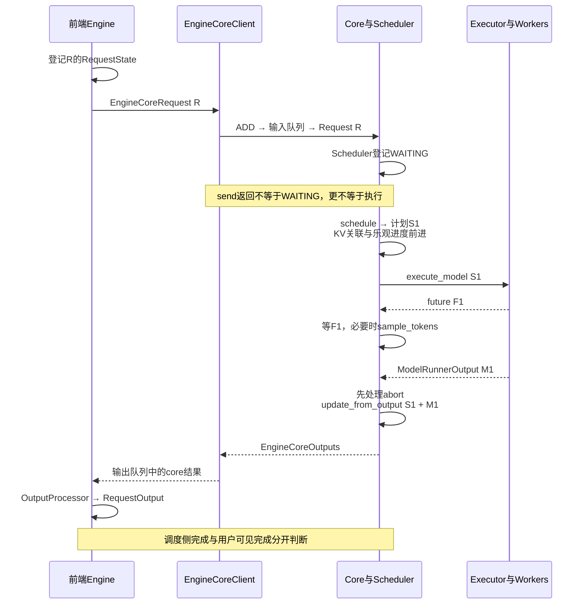
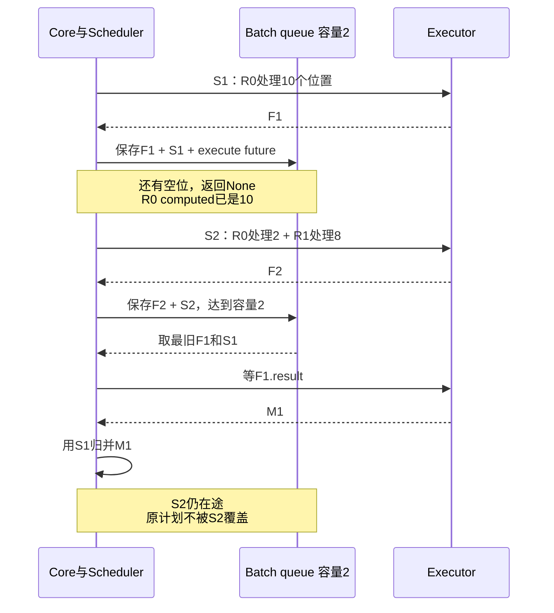
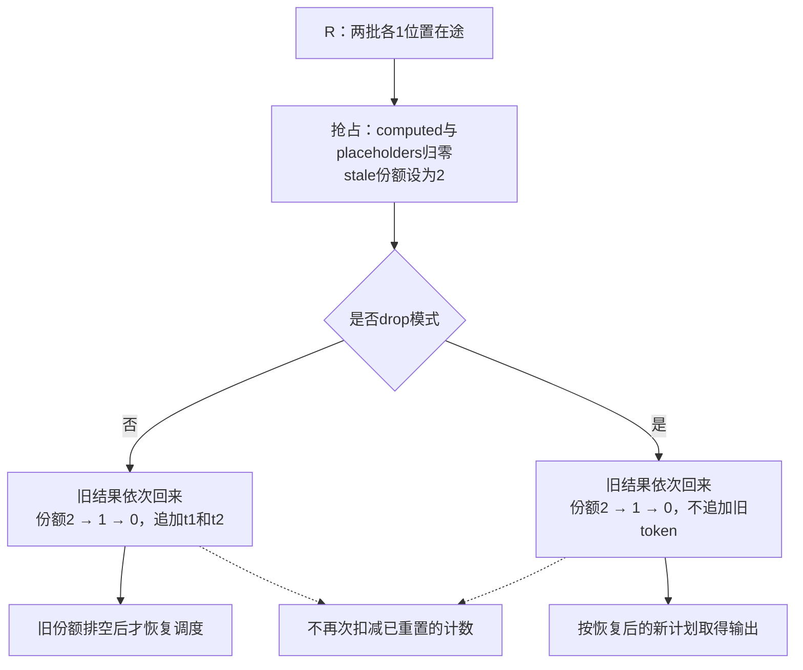
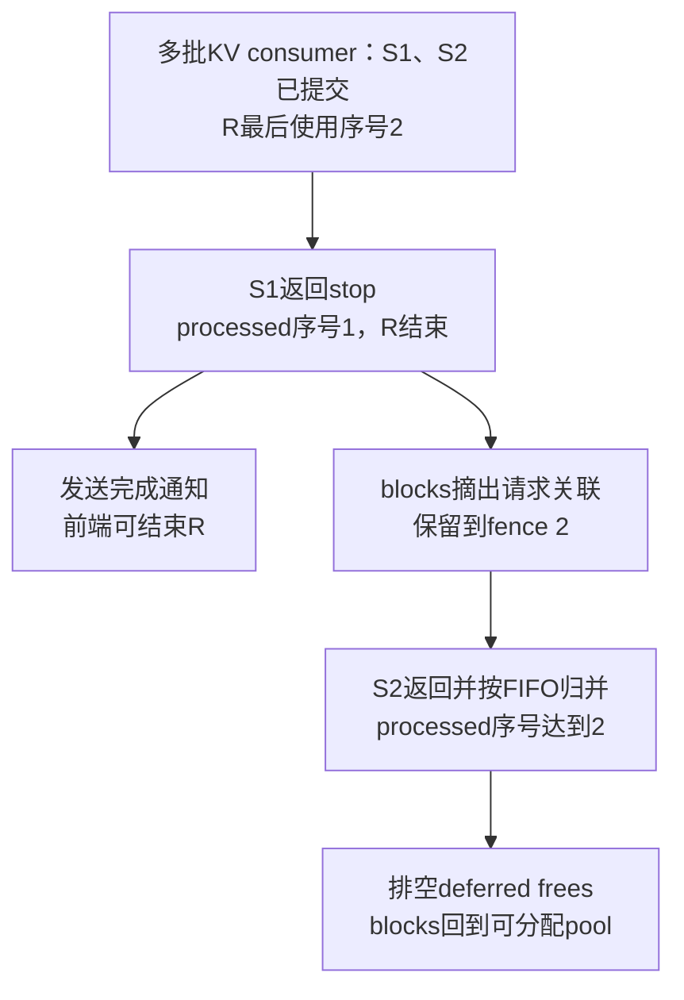
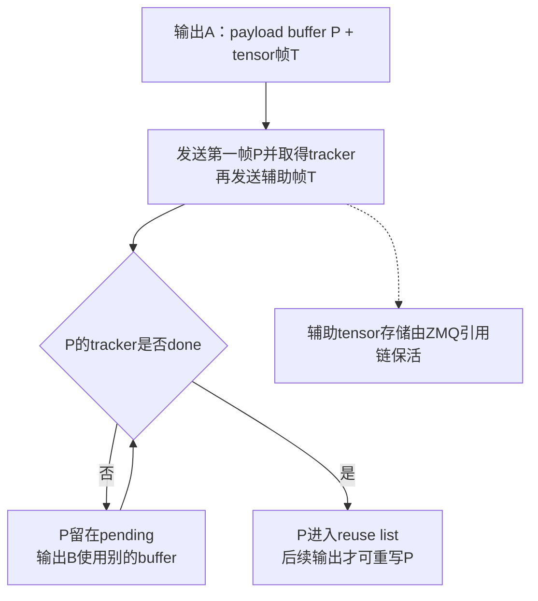

# vLLM Engine 架构：一次请求怎样提交、执行并完成

> **源码基线**：`vllm-project/vllm@199cb9b964822e59ab9b58d88e7be31eb419a2ae`（`main` 快照，2026-09-07 UTC）
> **主题**：从一个已经 render 的请求出发，追踪前端登记、Client 传输、Core 调度与 Executor 返回。再解释 batch queue 怎样把计划与 future 配对，以及抢占、完成和内存释放为何需要不同的判断。
> **适用范围**：拥有 Engine 内对象、可选进程边界与执行协作；调度预算和 KV 分配算法归 Scheduler/KV 专题，设备异步与 host buffer 细节归两代 Model Runner，启动与恢复拓扑归 Serving 专题。
> **最近更新**：2026-09-08。补充普通请求与两批在途示例，核验 stale output、延迟回收、传输缓冲和 DP 同步边界。

## 1. 已经拿到 token 输入，为什么还不能直接等一个结果？

接续 [[04_vllm_request_semantics_analysis|请求语义]]，现在请求 R 已经有 token 输入与 `SamplingParams`，需要生成两个输出 token。假设它有 12 个 prompt tokens；这些数字只用于讲解，不指定实际模型分词。引擎需要回答四个不同的问题：谁接收 R 的结果、R 何时获得本步资源、模型是否算完这一批，以及用户是否已经收到最终输出。

如果把这些问题都交给一个阻塞的 `generate` 循环，最容易理解的流程是“准备一批→等 GPU 返回→更新状态→准备下一批”。但当 CPU 需要解析新请求、GPU 执行上一批、多个 worker 协作时，等待会把这些工作串在一起。**当前 Engine 用 Client 隔离提交与等待，用 Core/Scheduler 统一决定和结算每步计划，用 Executor 适配设备执行拓扑。** 它允许已经安排的工作尚未返回，但必须记住“哪份结果属于哪份计划”。

从源码可验证三类不同对象：前端 `RequestState` 保存输出接收状态；Core `Request` 保存请求的调度状态和 token 进度；Executor/worker 保存执行和返回状态。把它们分开能避免前端并发接口、调度决策和 worker 拓扑各自维护一套调度循环，这是依据当前接口重建的设计推断，不是历史设计文档给出的实测对比。

本页会用“提交”“完成”加上具体对象说明含义。尤其不能把一个 future 已返回、一个 request 已结束、一个 buffer 可以重写当成同一个事件。

## 2. 先跟随 R 走完一次普通 core step

### 2.1 前端登记的是接收者，Core 登记的是等待执行的请求

同步 `LLMEngine.add_request` 先经过 InputProcessor，分配内部 request id，再调用 `OutputProcessor.add_request`，最后交给 `engine_core.add_request`。异步 `AsyncLLM` 也先创建 collector；其 `_add_request` 在**该方法自己的首次 await 之前**检查前端 admission 并登记 RequestState，随后发送 core request。上层 `add_request` 此前可以已经 await 能力查询等操作。

此时前端保存的是 R 的 prompt、detokenizer、输出模式、collector 与 parent/child 关联，尚没有一份承诺 R 本轮处理多少 token 的执行计划。`n > 1` 会有多个 child；这里先固定单个 R。

MP 路径中，Client 把 `EngineCoreRequest` 编码为 ADD 消息；异步 Client 写入 `client_index`，等 socket send 后返回。Core 的 input socket 线程接收并解码，`preprocess_add_request` 把传输对象变成 `Request`，必要时恢复媒体 receiver cache、发起独立 grammar 编译，然后放入 Core input queue。busy loop 再分派 ADD，调用 `EngineCore.add_request → Scheduler.add_request`，将 R 放入 request map 与 waiting queue。

普通 R 的初始状态是 `WAITING`；结构化输出请求可能先是 `WAITING_FOR_STRUCTURED_OUTPUT_GRAMMAR`，调度器会检查编译是否就绪。输入线程可以与 model forward 并行做请求预处理，但**只有 Core 主循环的调度路径将请求加入权威调度状态**。不是 input socket 一收到数据就开始 GPU 计算。

这已经区分两个时刻：MP 的 `send` 完成只证明发送调用完成；等待队列登记还要等 Core 消费 input queue。即便 R 已 WAITING，也不说明它获得了 token/KV 资源。

### 2.2 schedule 给出计划，然后才执行并归并结果

`EngineCore.step` 先检查 Scheduler 是否还有工作，再做以下顺序：

1. `Scheduler.schedule` 选择本步请求，分配所需 KV slots，生成 `SchedulerOutput`。其中包括新/缓存请求数据、每请求 token 数、block 变化、encoder/connector 信息、finished/preempted ids 等。
2. schedule 返回前，`_update_after_schedule` 增加 `num_computed_tokens` 与 `num_in_flight_tokens`，必要时记录释放 fence。这里的 computed 是包含在途工作的乐观进度，并非“GPU 已经完成”的计数。
3. Core 调用 `Executor.execute_model(..., non_block=True)`，得到 future；同时准备 grammar bitmask，然后在 `future.result()` 等待。如果 execute 返回 `None`，继续调用 `sample_tokens` 取得最终 `ModelRunnerOutput`。pooling 或某些执行分支可以直接返回结果，不能把 `None` 当成统一的失败码。
4. 等待期间到达的 abort，先由 `_process_aborts_queue` 处理，再把**这份 SchedulerOutput 与对应 ModelRunnerOutput**交给 `Scheduler.update_from_output`。
5. Scheduler 结算 in-flight 数、更新真实输出 token、处理停止及释放，按 `client_index` 组织 `EngineCoreOutputs`。

对 R，假设本步预算允许完整处理 12 个 prompt tokens：schedule 后它的 computed 已是 12、in-flight 是 12，Executor 尚未兑现结果；归并返回后这份 in-flight 份额归零，并可能追加第一个输出 token。下一步再消费这个 token 的模型输入位置，直到满足输出上限或其他停止条件。只分到部分 prompt 的 step 可以完成计算却没有新的用户 token。

所以旧稿所说的“资源承诺”应该理解为 schedule 期间的一组相互匹配的变化：KV 分配已经改变 block 关联，随后请求进度和返回的计划也一起前进。它不是 `_update_after_schedule` 一行独自完成的数据库提交，也不保证失败后自动回滚所有副作用。预算与分配过程见 [[11_vllm_scheduler_analysis|Scheduler]]、[[12_vllm_kv_cache_management_analysis|KV Cache 管理]]；本页关注这份计划何时可交给 Executor，以及如何与返回结果保持对应。

### 2.3 Core 完成后，前端还要使结果对用户可见

MP Core 的 `_process_engine_step` 将分 client 的输出放入 output queue，输出线程编码发送。Client 接收、解码，再放入自己的同步/异步输出队列；同步 `LLMEngine.step` 调用 OutputProcessor 后返回 `RequestOutput`，异步 output handler 则将处理结果放入 R 的 collector，由 `generate` yield 给协议前端。

R 的 core finish reason 说明调度侧已经决定结束；detokenize、字符串 stop、聚合 choices 和协议流收尾仍在前端。反向也可能先发生：前端发现 stop string，先产生 finished 用户输出，随后再向 Core 发 abort。因此“Scheduler 已归并”与“前端已结束”是两处可见完成，先后关系取决于停止条件，不能只看 GPU future。

<!-- 图1 spec：四泳道前端、Client、Core与Scheduler、Executor/worker。R先登记RequestState，ADD经Client到Core等待队列。Core schedule后写进度并产生S1，Executor返回F1；Core等待F1、先处理abort再用S1归并M1，最后Client回前端完成输出。Core/Scheduler归并同泳道但函数名区分职责。 -->

图中省略 socket 和队列线程，只表达改变有效状态的顺序；Core 并没有另存一份与 Scheduler 竞争的 token/KV 真相。

## 3. Client 与 Executor 可以怎么换？

### 3.1 对象边界不等于固定进程数量

| 调用方式 | Client 选择 | 怎样推动与等待 Core |
|---|---|---|
| 同步、不启用 multiprocess | `InprocClient` | 当前进程构造 EngineCore；ADD 直接 preprocess/add，`get_output` 直接调用 `step_fn` 和 `post_step`，没有独立 busy loop |
| 同步、multiprocess | `SyncMPClient` | 通过 ZMQ 发送；后台接收线程把结果放入 `queue.Queue`，调用者在 `get_output` 阻塞 |
| asyncio、multiprocess | `AsyncMPClient` 家族 | 接收 task 把结果放入 `asyncio.Queue`，`get_output_async` await；不用阻塞整个前端事件循环 |
| asyncio、非 multiprocess | 当前不支持 | `make_client` 明确抛 `NotImplementedError` |
| 多 DP engine 的 asyncio | 外部负载均衡用 `DPAsyncMPClient`，内部均衡用 `DPLBAsyncMPClient` | 在同一提交合同上加 engine 选择、wave 与在途请求关联；具体路由策略归 Serving/分布式专题 |

`InprocClient` 折叠了 OS 进程，并未把前端输出状态、Scheduler Request 和 worker 执行状态合并为同一个对象。因此不能用常见部署图推导“一次 vLLM 调用必定有几个进程”。Client 处理 ADD、ABORT、utility 等消息；utility 通过 call id/future 单独等结果，也不等同于模型请求完成。

### 3.2 Executor 把同一计划投向不同设备拓扑

`Executor.get_class` 根据配置选择 `uni`、`mp`、Ray（包含受开关控制的 Ray V2）、external launcher 或自定义 Executor 类/导入路径；自定义实现必须满足 Executor 类型要求。它消费的是 SchedulerOutput，不自行从 waiting queue 挑请求。

UniProc 调用 driver worker；non-block 路径返回已完成 future，或把 `AsyncModelRunnerOutput` 包成 `AsyncOutputFuture`，直到 `.result()` 才 `get_output()`。因此 non-block 不意味着“调用瞬间什么工作都没做”；它表达的是返回结果可以延后物化。

Multiproc 广播 collective RPC，从指定 output rank 取一个结果，或经 KV/EC aggregator 合并多 rank 元数据。`FutureWrapper` 维护 RPC future 队列；请求某个 future 的结果时，会先按顺序 drain 在它之前的响应。模型的算子、rank 通信和设备同步仍由 worker/runner 执行；本页没有把一个 Python Future 的完成自行等同于任意 CUDA stream 都已空闲。

收益是 Core 可以保持相同的调度与归并规则，代价是 backend-specific 的广播、队列、汇总与异常等待。rank/group 和 collective 的详细顺序见 [[22_vllm_distributed_inference_analysis|分布式推理]]。

## 4. batch queue 怎样让上一批没回来时继续安排下一批？

### 4.1 队列里必须同时保留 future 和原计划

EngineCore 在 `max_concurrent_batches > 1` 时创建 batch queue，改用 `step_with_batch_queue`。当前容量由 `VllmConfig.max_concurrent_batches` 决定：普通 PP 为 PP 大小；启用 async 时，V2 为 `pp_size + 1`，V1 在 PP≤1 时为 2，其余按源码的 PP 分支。**batch queue 和 async scheduling 不是同义词**：PP 可需要多个 batch，测试也能在 async scheduling 关闭时强制两批来验证队列协作。

每个队列项保存三者：结果 future、对应 SchedulerOutput、原 execute future。第三者用于在 sampling 得不到结果时找回真正的 execute 异常。新项 `appendleft`，消费从 `pop` 取最旧项，保持 FIFO 的计划/结果配对。

一次调用先尝试安排新工作。若入队后还有空位且可以继续工作，就返回 `None`，优先填队列；若已达到容量或没有更多可调度工作，就等待最旧结果并归并。方法入口断言队列尚未满，因为上一次调用达到容量时已经取出了最旧项。它并非每轮先无条件 drain 所有完成 future，再开始 schedule。

### 4.2 两个 12-token prompt 的最小重放

源码 `test_engine_core_concurrent_batches` 设置每步 10 tokens、R0/R1 各 12 prompt tokens、两批容量，并关闭 async scheduling 来隔离 batch queue 行为。这个例子只借用测试的已给定调度结果，不在此重讲预算算法。

| Core 调用 | 提交的新计划 | 本次等待/消费 | 调用结束仍在队列中的计划 |
|---|---|---|---|
| 第1次 | S1：R0的前10个位置 | 不等待，返回 `None` | S1；R0 computed已为10 |
| 第2次 | S2：R0余2个位置，加R1前8个位置 | 队列达到2，等最旧S1；部分prefill无用户token，可返回空输出字典 | S2；R0 computed已为12，R1为8 |
| 第3次 | S3：R1余4个位置 | 等S2，归并R0完成prefill产生的第一个token | S3；下一轮才据此继续R0的decode |

这解释了最容易看错的一点：R0 的 computed=12 早于 S2 的真实结果；只有 S2 归并后的新 token 才进入 core 的输出序列。computed 让下一轮知道已经安排了哪些输入，future/result 则告诉它哪些计算事实真正返回。

<!-- 图2 spec：三泳道Core/Scheduler、batch queue、Executor。S1包含R0:10，F1与S1成对入队，空位尚有直接返回；下一调用发S2 R0:2/R1:8并入队达到容量2，取最旧F1/S1等待M1，用S1归并M1，S2仍在途。不使用比例时间轴，不声称测得overlap时长。 -->

### 4.3 输出依赖可以限制跑在前面的距离

async scheduling 在发出 decode 后加入 output placeholders，表示尚未回传的输出位置；真实 token 返回后再结算，而不是先编造真实 token ids。若下一批 structured output 的 grammar mask 依赖前一批尚未返回的 token，`pending_structured_output_tokens` 会使 Core 暂缓这批 sampling：模型执行可先发出，先消费上一批并推进 grammar，之后再计算 mask、调用 `sample_tokens`，把延期项加入队列。启用 draft 时还要先把可用 draft ids 对应地更新/筛选，细节归 [[18_vllm_sampling_structured_output_analysis|采样与结构化输出]]。

这段协作接续旧系统设计页的 async 主题：异步不是在同步循环外面套一个 Future，它改变“已安排进度”与“真实输出”的时序。设备侧怎样用持久 row、staged copy 和同步事件避免 CPU 改写 GPU 尚在读取的 host buffer，分别见 [[15_vllm_model_runner_v1_analysis|Model Runner V1]]、[[16_vllm_model_runner_v2_analysis|Model Runner V2]]；本页不以 batch queue 图替代这些内存算法。

兼容性也会决定是否采用这条路径。显式开启 async 遇到不支持的 executor、speculative method、`disable_padded_drafter_batch` 或 ROCm DeepEP high-throughput DBO 会拒绝；自动配置会对不兼容组合关闭 async，pooling 因当前实现的性能负收益默认关闭。当前允许的 speculative 分支比旧注释“只支持EAGLE”更宽，代码还列出 MTP/Draft Model/NGram GPU/DSpark 对应类型；能力细项须按配置代码判断，不能拿旧02的版本描述当作新基线事实。

## 5. 如果 R 在结果回来前已被抢占或取消，会发生什么？

### 5.1 普通抢占后的旧输出仍可交付，但不能重复结算重置计数

考虑 R 已经有两份 decode 工作在途，每份计划各处理一个位置。抢占前 `num_in_flight_tokens=2`；抢占把 computed 和 output placeholders 重置为0，将这两份工作记为 `num_stale_output_tokens=2`，R 回到 waiting 体系。**stale 指计算计划属于抢占前的状态，并不自动等于用户不应得到的 token。**

普通 KV 压力抢占会保留这些输出。第一份旧计划返回时，按该计划的 scheduled token 数将 in-flight/stale 2→1，把有效输出 token 追加到 R；第二份返回时 1→0，再追加其 token。已经归零的 computed/placeholders 不重新扣减，旧 speculative rejection 也不再次回滚重置计数。AsyncScheduler 对非stale输出才扣 placeholders，且只有更新前仍 RUNNING 的请求才按当前进度推进 cache block 提交。

在可交付 stale 份额排空前，Scheduler 暂缓 R 的恢复调度，避免新执行重采样同一位置、旧输出随后又交付一次。测试通过多批流水与变化的 spec acceptance 检查输出恰好交付一次、位置连续、placeholders 不下溢。

另有明确的 drop 模式：`reset_prefix_cache(reset_running_requests=True)` 可同轮抢占并恢复，因此旧位置会重新采样；需要有效 KV hand-off 的 connector 也不能交付依赖已释放 KV 的旧完成输出。这些路径设置 `drop_stale_output`，返回时只排空旧份额，整段跳过。再次抢占时 stale 份额取当前 in-flight 值而非相加；尚未排空的 drop 份额保持 drop，防止误把旧 token 重新公开。

<!-- 图3 spec：R有两批各1位置inflight；preempt设置computed/placeholders=0，stale=2。分普通deliver与显式drop两路：每份返回都将stale/inflight 2→1→0；普通追加t1/t2且不扣reset counters、排空后恢复；drop不追加旧token，可按新状态重算。终端/已删除请求另示忽略。 -->

### 5.2 取消、已完成、抢占，不能用一个“失效输出”规则处理

Core input 线程把 ABORT 同时加入普通 input queue 和专用 abort queue：前者保持 ADD/ABORT 顺序，后者允许 Core 在等待执行完成后、归并结果前优先处理取消。Scheduler 的 abort 处理具备幂等性，双队列不是对请求执行两次取消副作用。

`update_from_output` 对已不存在或 terminal 的 Request 跳过输出；connector 延迟清理时 terminal 对象仍可能留在 map，故只查 `request is None` 不够。普通 PREEMPTED Request 则仍是可恢复请求，按§5.1交付或丢弃模式处理。归并必须携带原 SchedulerOutput，否则既不知道要排空多少在途份额，也无法可靠判断迟到结果属于哪次安排。

前端取消还会移除 OutputProcessor state，之后收到的迟到 core 输出同样丢弃。两边清理针对不同对象：用户已结束并不撤回已送出的文本，Executor 也不会撤销已执行的 GPU 写入。

## 6. 完成通知之后，为什么还有工作和内存不能释放？

### 6.1 四种“finished”分别通知谁

| 状态/字段 | 消费者与含义 | 不能据此推出什么 |
|---|---|---|
| `Request.status` 为 terminal | Core 知道该请求不再正常生成 | Request 一定已经从 map 删除，或所有connector传输已完成 |
| `SchedulerOutput.finished_req_ids` | 通知 runner 移除先前步骤间结束的请求状态 | 这份清理计划一定包含新生成token；它也不是HTTP结束事件 |
| `EngineCoreOutputs.finished_requests` | 按client收集的完成集合；例如DPLB用来解除request→engine关联并减少inflight计数 | 前端已经输出了最终文本，或KV blocks已经回池 |
| `EngineCoreOutput.finish_reason` / 前端 `RequestOutput.finished` | 前者是该输出的core结束语义，后者是前端用户结果完成 | 所有后续设备工作、发送buffer和connector资源同步完成 |

schedule 将旧 finished/preempted set 放进计划后换成一个**新 set**，不能对原 set 原地 `clear()`，否则已经交给 Executor 的计划也会被清空。没有未完成用户请求时，Scheduler 仍可能因待发 finished ids、connector 延迟清理或 pending push work 保持 `has_requests=true`；这允许清理继续取得执行机会。无模型执行但仍有这类工作时，Core 可短暂让出 GIL，给后台传输线程推进机会。

### 6.2 两批在途时的 block fence

下面固定启用了 `defer_block_free` 的路径：当前生产 gate 是**存在 KV consumer connector 且 `max_concurrent_batches > 1`**。不能把“凡是async都延迟回收”写成通用规则；无 connector 的测试明确验证此 gate 关闭，回收仍按对应路径立即进行。

设 S1、S2 都曾安排 R，`last_sched_seq=2`。处理 S1 输出时 R 遇到 stop，`processed_step_seq=1`，但 S2 仍可能写 R 的 KV block。`_free_request_blocks` 先把 block 从请求关联中摘出，放入带 fence 的 deferred list，而不立刻交回可分配 pool；只有 FIFO 处理到 S2，使 processed 序号达到 fence 后，`_drain_deferred_frees` 才归还这些 blocks。

<!-- 图4 spec：S1和S2已提交且最后seq=2；S1返回stop将R终止、通知前端，但processed=1<2，blocks进入deferred fence2；S2返回使processed=2，才归还pool。标明gate仅多批KV consumer；旧S2的token可被忽略但完成事件仍排空fence。 -->

S2 的用户 token 可以因为 R 已结束而不再使用，但处理 S2 这个完成事件仍有内存生命周期意义。fence 是按非空 scheduled/processed step 维护的，不能用“当前剩余请求数为0”替代。源码对 deferred list 只排空头部已满足项；在可能提前一拍的 CoW retention fence 前，后面已安全的项可能多等一会儿，这影响回收时机而不授权提前复用。

还要区分另一种延迟：KV/EC connector 的 `request_finished` 可以要求 `delay_free_blocks`，让 terminal Request 留在 map，等待传输完成后再执行真正 free。它与“GPU在途写入的step fence”是两层条件，可能同时存在。KV allocator、offload/partial tail 与connector具体释放算法见 [[12_vllm_kv_cache_management_analysis|KV Cache 管理]]，跨实例协作见 [[26_vllm_disaggregated_kv_serving_analysis|跨实例 KV 服务]]。

### 6.3 ZMQ 发送结束保护的是另一批内存

Client 与 Core 之间除小字段外，还可能传 prompt embeds、媒体 tensor 或 logprobs 数组。`MsgpackEncoder` 把主payload与较大的 tensor/ndarray backing buffers 分成多帧，避免一律复制进主payload；小数据可内联，非连续 ndarray 会先复制。解码按 dtype/shape 恢复对象；tensor 分支根据内联/辅助帧与 share_mem/pin 配置选择 clone/pin 或共享，不能把“zero-copy transport”理解成从用户数据到GPU全程零拷贝。

输入 Client 使用 `send_multipart(copy=False)`。当前源码与专门测试的约定是：交给 ZMQ 的 memoryview 沿引用链保持原 tensor/ndarray 活着，调用方删除请求对象并不导致发送中的存储被回收。**存储仍活着只解决生命周期，不授权调用方同时改写内容。** 这也是传输 buffer 与设备侧 host-buffer race 必须分别解释的原因。

Core 输出端会复用 `MsgpackEncoder.encode_into` 的可写 bytearray，必须更谨慎：**需要跟踪第一帧 payload 何时发送完，而不是只看最后一帧 tensor。** `_send_msg_tracking_payload` 单独给第一帧 `track=True`，其他帧再发送；未完成的 `(tracker, buffer)` 放入 pending，只有 `tracker.done` 才放回 reuse list。普通 `send_multipart(track=True)` 返回最后帧 tracker，不足以保护这里复用的第一帧。

<!-- 图5 spec：输出A编码至可重用bytearray P并附tensor帧T；P首帧tracker未done时P进pending，B改用另一buffer；done后P进reuse可供下一输出编码。辅助tensor帧由ZMQ引用保活，明确不同保护信号，防止A的tensor配B的payload。 -->

这是明确的依赖边界：vLLM 展示了引用链、发送 API、tracker 使用和复用策略，测试验证 payload/tensor 不串配及删除调用方引用后的存活；本页没有读取或重跑 pyzmq 底层发送实现。若配置媒体 `torch_shm` 且有 tensor queue，另走 `TensorIpcSender/Receiver`：msgpack带 sender/message/tensor handle，tensor经共享队列搬运；receiver按handle缓存匹配并清理旧message，sender失败可回退标准序列化。当前这个单队列transport只面向目标engine 0，不能据此宣称它覆盖任意DP拓扑。

## 7. 错误、DP协作与兼容文档的边界

Executor 是故障传播边界，不是回滚器。Multiproc 在 permanent failed 状态拒绝新 RPC，等待响应可以因超时或worker错误失败；failure callback 可通知 Core。普通 `step` 在 future 等待处暴露异常；batch queue 保留 execute future，若 sample future 得到 `None`，再取原 execute 结果以抛出真正异常，而非把缺结果当正常空输出。

输入socket的request预处理异常可产生请求级 ERROR 输出；媒体cache miss还可返回missing hashes供前端失效缓存后由客户端重试。Core/worker永久失败与前端异常队列传播则可能结束整个引擎。当前代码没有一个保证跨所有GPU和connector副作用自动回滚的统一事务；故障检测、进程监督、ready/shutdown与恢复策略见 [[17_vllm_serving_control_plane_analysis|Serving 控制面]]、[[27_vllm_observability_reliability_analysis|可靠性机制]]。

DP 时本地没有请求也不一定能停下：其他rank仍执行共同的模型通信时，当前rank可能需要dummy pass。`DPEngineCoreProc` 在每个wave的**step 1以及 `dp_sync_interval` 的倍数step**同步全局unfinished与pause状态，其他step先保持running。默认interval为16，对应同步点1、16、32……；不是等完16步才第一次同步。这样idle pause可以在一个dummy batch后形成共识，避免额外空转一整段interval；源码测试覆盖此序列与step1 pause。全局空闲时发 `wave_complete`、递增wave并将step counter归零；单请求结束与整个DP wave停止仍是不同边界。

> [!contradiction] 文档意图与当前类关系分开读
> `docs/design/arch_overview.md` 的“V1 Process Architecture”可用于理解职责分离意图，但“LLM Engine / AsyncLLMEngine”仍把异步类描述成同步类的wrapper。当前公开alias分别指向V1 `LLMEngine` 与 `AsyncLLM`，二者各自组合输入输出处理器和CoreClient；不能沿用旧类图，也不能把常见多进程部署图当成固定进程公式。

## 8. 紧凑源码阅读路线与验证范围

先追请求的普通路径，再核对批队列和负向分支。下列源码和测试均已静态打开；未启动vLLM、下载模型、运行GPU/IPC/多进程或依赖测试，教学步骤不是本机测量。图示展示事件先后，不声称等比例执行时间或确定的性能收益。

| 问题 | 源码与测试锚点；路径相对页头仓库 |
|---|---|
| 前端先登记后提交、最后怎样产出 | `vllm/v1/engine/llm_engine.py::LLMEngine.add_request/step`；`vllm/v1/engine/async_llm.py::AsyncLLM._add_request/_run_output_handler`；`vllm/v1/engine/output_processor.py::OutputProcessor.process_outputs` |
| Client选择、直调与异步消息 | `vllm/v1/engine/core_client.py::EngineCoreClient.make_client/make_async_mp_client/InprocClient.get_output/SyncMPClient._send_input/AsyncMPClient.add_request_async`；`tests/v1/engine/test_engine_core_client.py::test_engine_core_client/test_engine_core_client_asyncio` |
| Wire request何时进入waiting | `vllm/v1/engine/core.py::EngineCore.preprocess_add_request/add_request/EngineCoreProc.process_input_sockets/_handle_client_request`；`vllm/v1/request.py::Request.__init__`；`vllm/v1/core/sched/scheduler.py::Scheduler.add_request` |
| Core调度与同步等待点 | `vllm/v1/engine/core.py::EngineCore.step/post_step/EngineCoreProc._process_engine_step`；`vllm/v1/core/sched/scheduler.py::Scheduler.schedule/_update_after_schedule/update_from_output` |
| Executor选择与结果物化 | `vllm/v1/executor/abstract.py::Executor.get_class/execute_model/sample_tokens`；`vllm/v1/executor/uniproc_executor.py::UniProcExecutor.collective_rpc/AsyncOutputFuture.result`；`vllm/v1/executor/multiproc_executor.py::MultiprocExecutor.collective_rpc/FutureWrapper.result` |
| 队列配对、延期sampling与兼容性 | `vllm/v1/engine/core.py::EngineCore.step_with_batch_queue`；`vllm/config/vllm.py::VllmConfig.max_concurrent_batches/__post_init__`的async scheduling配置校验；`tests/v1/engine/test_engine_core.py::test_engine_core_concurrent_batches` |
| 普通与drop stale路径 | `vllm/v1/core/sched/scheduler.py::Scheduler._preempt_request/update_from_output`；`vllm/v1/core/sched/async_scheduler.py::AsyncScheduler._update_after_schedule/_update_request_with_output`；`tests/v1/core/test_async_scheduler.py::test_kv_pressure_preemption_with_inflight_output/test_reset_prefix_cache_with_inflight_output_under_kv_pressure/test_kv_pressure_preempt_mid_handoff` |
| 完成集合、内存fence与connector延迟 | `vllm/v1/core/sched/scheduler.py::Scheduler._free_request/_free_request_blocks/_drain_deferred_frees/has_requests`；`vllm/v1/engine/core_client.py::DPLBAsyncMPClient.process_engine_outputs`；`tests/v1/core/test_deferred_block_free.py::test_gate_disabled_without_connector/test_finish_defers_free_until_inflight_step_done` |
| 序列化、buffer生命周期和首帧tracker | `vllm/v1/serial_utils.py::MsgpackEncoder.encode_into/_encode_tensor/MsgpackDecoder._decode_tensor`；`vllm/v1/engine/core.py::EngineCoreProc.process_output_sockets/_send_msg_tracking_payload`；`tests/v1/test_serial_utils.py::test_payload_buffer_reuse_does_not_corrupt_in_flight_messages/test_zero_copy_frames_survive_without_caller_side_references` |
| 可选共享tensor通道 | `vllm/v1/engine/core_client.py::MPClient.__init__`；`vllm/v1/engine/tensor_ipc.py::TensorIpcSender.__call__/TensorIpcReceiver.__call__` |
| DP与异常边界 | `vllm/v1/engine/core.py::DPEngineCoreProc.run_busy_loop/_has_global_unfinished_reqs/EngineCoreProc._handle_request_preproc_error`；`vllm/v1/executor/multiproc_executor.py::MultiprocExecutor.register_failure_callback`；`tests/v1/engine/test_engine_core.py::test_dp_sync_interval_normal_wave/test_dp_sync_interval_idle_pause_consensus_on_first_step` |
| 旧类图为何不可照搬 | `vllm/engine/llm_engine.py::LLMEngine`；`vllm/engine/async_llm_engine.py::AsyncLLMEngine`；`docs/design/arch_overview.md` 的“V1 Process Architecture”和“LLM Engine”章节 |

## Related Pages

- [[03_vllm_architecture_overview_analysis|架构概览]]：把本页Engine协作放回完整推理服务的模块分工。
- [[04_vllm_request_semantics_analysis|请求语义]]：解释EngineCoreRequest之前的输入转换和core结果之后的用户可见输出。
- [[11_vllm_scheduler_analysis|Scheduler]]：展开计划内部的budget、waiting/running与抢占算法。
- [[12_vllm_kv_cache_management_analysis|KV Cache管理]]：解释block关联、allocator、缓存提交与延迟回收条件。
- [[16_vllm_model_runner_v2_analysis|Model Runner V2]]：接续设备侧持久状态、当步输入和异步物化，补齐Core队列之外的执行机制。
- [[17_vllm_serving_control_plane_analysis|Serving控制面]]：展开launcher、ready、路由、背压和进程故障拓扑。
- [[22_vllm_distributed_inference_analysis|分布式推理]]：深入Executor后面的rank/group、并行轴与collective顺序。
