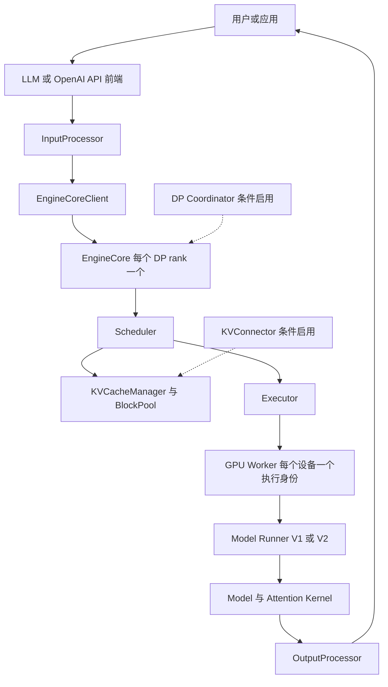

# vLLM 引擎架构与请求生命周期 —— 从入口、EngineCore 到 Model Runner

> **代码基准**：vLLM `main@f4b161d7fca438bfe29509984759be1943a5aa88`（2026-08-18，`v0.27.2rc0-189-gf4b161d7fc`）
> **中心结论**：vLLM V1 的主架构是“前端请求语义与后端 token 执行解耦”。在线入口固定通过异步多进程 client 连接 EngineCore；离线 `LLM` 当前也默认开启 EngineCore 多进程，但可切回 in-process。EngineCore 内部再把统一 token 调度、分页 KV、Executor/Worker 与 Model Runner 串成可流水重叠的一步。

---

## 一、全景：不要把 vLLM 简化成“双进程”

“前端进程 + EngineCore 子进程”能解释最小控制路径，却不足以解释多 GPU、DP 和当前异步执行。更准确的拓扑是：



这里有三种不同的“拆分”，不应混为一谈：

| 拆分 | 边界 | 目的 |
|---|---|---|
| 前端 / EngineCore | `LLMEngine` 或 `AsyncLLM` ↔ `EngineCoreClient` | tokenization、detokenization、HTTP 流式输出不阻塞后端调度 |
| EngineCore / Worker | `Executor.collective_rpc` | 将一个调度决策广播给 TP/PP/DP/EP ranks |
| Prefill / Decode 实例 | `KVConnector` | 跨实例搬运 KV，支持 P/D 分离、缓存卸载或外部 KV 服务 |

### 1.1 在线与离线不是同一条前端路径

| 场景 | 前端对象 | EngineCore client | 输出驱动方式 |
|---|---|---|---|
| 离线 `LLM` | `LLMEngine` | 当前默认 `SyncMPClient`；`VLLM_ENABLE_V1_MULTIPROCESSING=0` 时为 `InprocClient` | 用户线程在 `_run_engine` 中同步拉取 |
| 在线 `vllm serve` | FastAPI/Uvicorn + `AsyncLLM` | `AsyncMPClient`；DP 时选择 `DPAsyncMPClient` 或 `DPLBAsyncMPClient` | 后台 asyncio output handler 持续泵入每请求队列 |

证据链：

- `LLMEngine.from_engine_args` 读取 `VLLM_ENABLE_V1_MULTIPROCESSING` 并传给构造器；`vllm/v1/engine/llm_engine.py:161-186`。当前环境变量默认值是 `1`；`vllm/envs.py:1391-1394`。
- `EngineCoreClient.make_client` 在同步 MP、异步 MP 和 in-process 三种 client 间分派；`vllm/v1/engine/core_client.py:78-112`。
- `AsyncLLM` 直接调用 `make_async_mp_client`，不是 in-process 分支；`vllm/v1/engine/async_llm.py:72-156`。
- DP>1 时 async client 再按是否外部负载均衡选择 DP client；`vllm/v1/engine/core_client.py:114-139`。

> [!note] 对旧结论的修正
> “vLLM 永远是两个进程”与“离线永远在同进程”都不准确。当前离线默认拆出 EngineCore，但环境变量可关闭；单 GPU `UniProcExecutor` 又会把 worker 对象收进 EngineCore，而多 GPU `MultiprocExecutor` 才继续派生 worker 进程。

### 1.2 在线部署的进程数量

官方架构文档给出的逻辑数量是：API server 为 $A$，EngineCore 为 $\mathrm{DP}$，GPU worker 为 $N=\mathrm{DP}\times\mathrm{PP}\times\mathrm{TP}$，$\mathrm{DP}>1$ 时再加一个 coordinator，总数为 $A+\mathrm{DP}+N+1$；`docs/design/arch_overview.md:117-139`。例如：

- `vllm serve -tp 4`：1 API + 1 EngineCore + 4 worker = 6 个逻辑进程。
- `vllm serve -tp 2 -dp 4`：4 API + 4 EngineCore + 8 worker + 1 coordinator = 17 个逻辑进程。

实现上，单设备默认可走 `UniProcExecutor`，worker 是 EngineCore 进程内对象；分布式执行器才把 worker 变成独立进程或 Ray actor。因此容量规划应同时看官方拓扑和实际 `distributed_executor_backend`，而不是机械套公式。

## 二、两个入口怎样汇入同一个 EngineCore

### 2.1 离线 `LLM.generate`

```text
LLM.generate                         vllm/entrypoints/llm.py:418-481
└─ _run_completion                  vllm/entrypoints/offline_utils.py:326-349
   ├─ add_request                   vllm/v1/engine/llm_engine.py:218-279
   │  ├─ InputProcessor
   │  ├─ OutputProcessor.add_request
   │  └─ EngineCoreClient.add_request
   └─ _run_engine                   vllm/entrypoints/offline_utils.py:573-625
      └─ LLMEngine.step             vllm/v1/engine/llm_engine.py:298-336
         ├─ EngineCoreClient.get_output
         └─ OutputProcessor.process_outputs
```

`LLM.generate` 先把一组 prompt 全部加入引擎，再在 `has_unfinished_requests()` 条件下循环 step，所以它天然提供离线 continuous batching，而不是逐 prompt 串行调用模型。`LLM` 构造器最终经 `LLMEngine.from_engine_args` 建引擎；`vllm/entrypoints/llm.py:298-345`。

### 2.2 在线 `vllm serve`

```text
vllm serve
└─ run_server / run_server_worker   vllm/entrypoints/openai/api_server.py:617-650
   └─ build_async_engine_client     vllm/entrypoints/openai/api_server.py:101-178
      └─ AsyncLLM.from_vllm_config
         ├─ InputProcessor
         ├─ OutputProcessor
         ├─ AsyncMPClient
         └─ background output handler
```

在线路径的关键不是 FastAPI 本身，而是 `AsyncLLM` 将每个请求映射为独立 output collector：后端输出可以连续到达，前端 asyncio task 做增量 detokenize 和 SSE 流式返回，而不需要某个 HTTP handler 自己驱动 EngineCore step。

## 三、EngineCore：控制面的心跳

### 3.1 初始化顺序

`EngineCore.__init__` 的重要顺序是：

1. 创建 Executor；
2. profile 可用内存并初始化 KV cache；
3. 创建 Scheduler；
4. 接入 speculative decode、KV connector 等可选组件；
5. 依据并发批次数选择普通 step 或 batch-queue step。

对应源码为 `vllm/v1/engine/core.py:104-236`。这个顺序很重要：Scheduler 能分配多少 token，取决于 KV profiling 最终得到的物理 block 数；它不是独立于显存容量的纯队列算法。

### 3.2 普通一步：schedule → execute → sample → update

`EngineCore.step` 在 `vllm/v1/engine/core.py:583-613`：

```python
scheduler_output = self.scheduler.schedule(...)
future = self.model_executor.execute_model(scheduler_output, non_block=True)
grammar_output = self.scheduler.get_grammar_bitmask(scheduler_output)
model_output = future.result()
if model_output is None:
    model_output = self.model_executor.sample_tokens(grammar_output)
engine_core_outputs = self.scheduler.update_from_output(
    scheduler_output, model_output
)
```

它体现了四个设计选择：

- **先产生最小控制描述**：`SchedulerOutput` 只传本步新增/缓存请求差分、各请求 token 数、spec token、encoder input 和公共前缀等，不复制完整请求状态；`vllm/v1/core/sched/output.py:201-277`。
- **前向非阻塞发起**：CPU 可在 GPU 执行期间准备 grammar mask 或处理其他状态。
- **执行与采样可拆**：结构化输出能在采样前注入合法 token mask。
- **唯一状态提交点**：`update_from_output` 在拿到模型结果后推进请求、释放/保留 KV，并产出 EngineCoreOutputs，避免多个组件各自修改生命周期。

### 3.3 batch queue：把 CPU 调度压进 GPU 时间里

当 pipeline parallelism 或 async scheduling 允许多批并发时，`step_fn` 改为 `step_with_batch_queue`；`vllm/v1/engine/core.py:624-738`。它优先把队列填满：

1. 队列未满就 schedule 并非阻塞地发起新批次；
2. 只要还能填就先返回，不等待当前 batch；
3. 队列满或无新请求时，才 pop 最老 future 并提交结果；
4. 结构化输出依赖上一轮 token 时，采样可延后到状态可用。

这不是简单的“多开一个线程”，而是显式维护在途批次，使 step $N+1$ 的 CPU 工作与 step $N$ 的 GPU 工作重叠。`VllmConfig.max_concurrent_batches` 会结合 PP、异步调度和 Model Runner 版本决定队列深度；`vllm/config/vllm.py:550-560`。

## 四、Scheduler：prefill 与 decode 的统一抽象

V1 Scheduler 不先把请求贴成“prefill 队列”或“decode 队列”。它把本步任务统一表述为：让 `num_computed_tokens` 追赶“已有 prompt + 已生成 token + speculative placeholder”的目标；`vllm/v1/core/sched/scheduler.py:476-487`。

对运行中请求，核心预算关系是：

$$
N_{\text{new}} = N_{\text{tokens+spec}} - N_{\text{computed}}
$$

随后再受 long-prefill 阈值、全局 token budget、encoder budget 和最大模型长度约束；`vllm/v1/core/sched/scheduler.py:489-576`。这带来三个自然结果：

- decode 请求通常只需追赶少量 token；
- 长 prompt 可被预算截断，形成 chunked prefill；
- prefill 和 decode 可以在同一个 `SchedulerOutput` 中混批。

Scheduler 先处理 running 请求，再考虑 waiting 请求；KV 分配失败时进入抢占/跳过逻辑；`vllm/v1/core/sched/scheduler.py:489-639`。因此 continuous batching 的本质不是“动态改 batch size”，而是**每个 step 都重做 admission、token budget 和 KV slot 分配**。

## 五、KV：PagedAttention 背后的所有权系统

### 5.1 三层职责

| 组件 | 责任 | 关键证据 |
|---|---|---|
| `KVCacheManager` | 面向请求计算 prefix hit、分配 slot、free 与多 KV group 协调 | `vllm/v1/core/kv_cache_manager.py:118-180,232-530` |
| `BlockPool` | 拥有全部物理 block、free queue、hash map、引用计数与 eviction | `vllm/v1/core/block_pool.py:143-191` |
| attention backend | 用 block table 将逻辑 token 位置映射到物理 KV block | [[14_vllm_attention_backends_analysis]] |

`allocate_slots` 先判断完整序列是否有资格进入，再计算 prefix cache 已覆盖部分、需要的新 block 和 watermark headroom；资源不足返回 `None`，由 Scheduler 决定抢占或延后；`vllm/v1/core/kv_cache_manager.py:347-530`。

前缀命中也有一个容易漏掉的正确性细节：即使整段 token 都命中，仍需重新计算最后一个 token 才能得到 logits；`vllm/v1/core/kv_cache_manager.py:232-298`。所以 prefix cache 复用的是 KV 计算，不是凭空恢复最后一步采样状态。

## 六、Executor、Worker 与 Model Runner

### 6.1 Executor 是并行拓扑的门面

`Executor.get_class` 将 backend 映射到 `ray`、`mp`、`uni` 或 external launcher；`vllm/v1/executor/abstract.py:50-93`。EngineCore 不关心具体进程模型，只调用：

```text
Executor.execute_model
└─ collective_rpc("execute_model")
   └─ 每个 worker 执行相同调度描述
```

这层抽象让 Scheduler 不需要理解 TP/PP/EP 的通信细节。Executor 还负责跨 worker 的编译与 warm-up；`vllm/v1/executor/abstract.py:95-139,211-229`。

### 6.2 Worker 负责设备与分布式边界

GPU worker 在采集显存快照前先初始化 distributed/NCCL，避免把通信库的显存算成“可供 KV 使用”的空间；`vllm/v1/worker/gpu_worker.py:380-438`。执行时它处理 PP 中间张量、调用 Model Runner 的 `execute_model` / `sample_tokens`，并只在正确 pipeline rank 返回最终结果；`vllm/v1/worker/gpu_worker.py:1044-1139`。

### 6.3 Model Runner V2 不是全量替换

当前源码同时保留 Model Runner V1 与 V2。V2 的核心思想是持久 batch row、async-first 输入准备、差分写入 block table/state、GPU/Triton metadata 与 sampler，以及显式 CUDA Graph manager；`docs/design/model_runner_v2.md:35-205`。

选择逻辑在 `VllmConfig.use_v2_model_runner`：PCP、DSpark、部分 DFlash 与 diffusion 强制 V2；一般 generate 模型还要经过架构、Triton 和不兼容特性判断，不满足则回退 V1；`vllm/config/vllm.py:614-695`。因此分析性能问题时，第一步应确认日志和配置究竟选中了哪个 runner。

## 七、跨进程 IPC 为什么不是主线程自己收发

`EngineCoreProc` 用 ZMQ 连接前端，但 socket IO、msgpack 编解码和 EngineCore step 没挤在同一线程：

- input IO thread 接收 multipart、解码并放入 `input_queue`；`vllm/v1/engine/core.py:1657-1758`。
- output IO thread 从 `output_queue` 取结果，复用 buffer 并 zero-copy 发送；`vllm/v1/engine/core.py:1760-1827`。
- 主 busy loop 处理输入队列、执行 `step_fn`、再提交输出；`vllm/v1/engine/core.py:1375-1449`。

这样做的原因不是“ZMQ 一定更快”，而是把 socket 等待、序列化和 GPU 调度隔离，降低前端负载波动直接制造 GPU 气泡的概率。代价是进程数、CPU 核、共享状态调试和错误传播都更复杂。

## 八、数据并行与 P/D 分离

DP 下每个 rank 有独立 EngineCore。MoE 或同步 collective 场景中，即使本 rank 暂时没有真实请求，也可能执行 dummy batch 维持 lockstep；`vllm/v1/engine/core.py:2153-2198`。DP coordinator 是否需要由模型类型和负载均衡模式共同决定，而不是简单等同于 `DP>1`；`vllm/config/vllm.py:697-718`。

P/D 分离则是另一条轴：Scheduler 中的 KVConnector 可延迟释放 block，并与远端 KV load/save 或 offload 协作；`vllm/v1/core/sched/scheduler.py:126-159`。它不会把单 EngineCore 内的 token 调度自动变成集群路由，生产系统仍需服务发现、路由和容错控制面。

## 九、为什么这一设计有效，又在哪里付出代价

| 设计 | 胜过直接方案的原因 | 代价或失效边界 |
|---|---|---|
| 每步重组 continuous batch | 填掉请求长度不同造成的尾部气泡 | 调度器每步都在关键路径，需要 CPU/GPU overlap |
| 统一 token scheduler | chunked prefill 与 mixed batch 不需两套状态机 | SLO 调优转化为 token budget 的复杂权衡 |
| paged KV + block table | 消除大块连续预留，允许共享与驱逐 | 间接寻址、元数据和 hash/refcount 开销 |
| 前后端多进程 | tokenizer、HTTP、detokenize 不直接阻塞 GPU | IPC、进程数、错误恢复和 CPU 资源更复杂 |
| Executor 抽象 | 单卡、多进程、Ray、外部 launcher 复用同一核心 | backend 行为和性能边界不能只看统一接口 |
| Model Runner V2 | 用持久状态和差分更新削减逐步 CPU 开销 | 功能兼容矩阵尚未完全覆盖，存在 V1 fallback |
| compile + CUDA Graph | 降 Python 和 launch overhead、融合内存流量 | 启动/捕图时间、动态形状与不兼容算子 |

## 十、源码阅读顺序

1. `vllm/v1/engine/core.py:583-738`：先看普通 step 与 batch queue。
2. `vllm/v1/core/sched/scheduler.py:476-639`：理解本步 token 与 KV admission。
3. `vllm/v1/core/kv_cache_manager.py:232-530`：理解 prefix hit 和 block 分配。
4. `vllm/v1/executor/abstract.py:50-139,211-229`：看后端如何扇出。
5. `vllm/v1/worker/gpu_worker.py:1044-1139`：看 worker 到 runner。
6. `vllm/v1/engine/core_client.py:78-139,306-322`：最后补在线/离线 IPC 差异。
7. `docs/design/model_runner_v2.md:35-205` 与 `vllm/config/vllm.py:614-695`：判断 V2 的优化和适用面。

## Related Pages

- [[02_engineering/03_infer_frameworks/vllm/index|vLLM 推理引擎知识地图]]
- [[11_vllm_scheduler_analysis|vLLM Scheduler 源码分析]]
- [[12_vllm_kv_cache_management_analysis|vLLM KV Cache 管理]]
- [[14_vllm_attention_backends_analysis|vLLM 注意力后端]]
- [[22_vllm_distributed_inference_analysis|vLLM 分布式推理]]
- [[23_vllm_compilation_cudagraph_analysis|vLLM 编译与 CUDA Graph]]
- [[01_vllm_feature_optimizations_guide|vLLM 快速使用与优化指南]]
