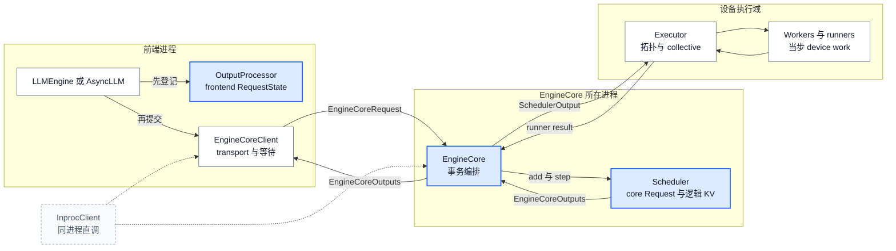
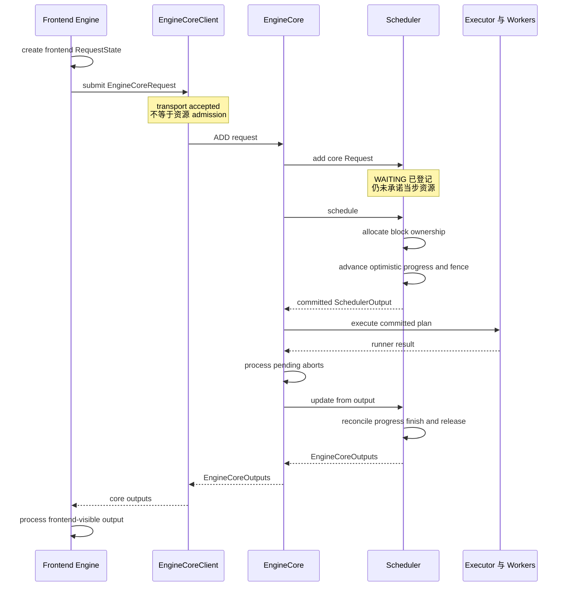

# vLLM Engine 架构：用三种状态所有权封装资源承诺

> **读者问题**：Client、EngineCore 与 Executor 为什么不能合成一个 `generate` 循环；请求从“前端已登记”到“资源已承诺”再到“结果已提交”，分别在哪个对象中变成有效状态？
> **源码基线**：`vllm-project/vllm@6b110badbb22d3f66c7218b71138f13b7a6b3419`（冻结的 detached checkout；提交时间 2026-08-29T02:40:53Z）
> **中心命题**：三者分离的关键不是多一层抽象，而是只允许一个所有者按自己的时钟修改一类状态：Client 保存前端请求与传输状态，EngineCore 用 Scheduler 封装资源事务，Executor 只把已承诺计划投射到设备拓扑。资源承诺是一次复合的 schedule-time commit：KV 分配先改变 block 所有权，Scheduler 再推进与该计划匹配的 optimistic request progress 和释放 fence，完成的 `SchedulerOutput` 才是 Executor 可消费的已提交计划；执行结果随后经 `update_from_output` 归并为 core 状态。
> **所有权边界**：本页拥有 Engine 内部 Client / EngineCore / Executor 的对象与可选进程接缝、三类 request state，以及 create → submit → core step → result commit 路径。
> **明确排除**：全系统六层与完整在线生命周期由 [[02_engineering/03_infer_frameworks/vllm/03_vllm_architecture_overview_analysis|架构概览]] 负责；协议、render、detokenize 与用户输出语义由 [[02_engineering/03_infer_frameworks/vllm/04_vllm_request_semantics_analysis|请求语义]] 负责；waiting/running、budget、抢占与 KV 分配算法由 [[02_engineering/03_infer_frameworks/vllm/11_vllm_scheduler_analysis|Scheduler]] 负责；launcher、ready、路由与故障拓扑由 [[02_engineering/03_infer_frameworks/vllm/17_vllm_serving_control_plane_analysis|Serving 控制面]] 负责。
> **最近更新**：2026-08-29。按 `6b110bad` 重建对象所有权与两阶段提交边界。

## 1. 背景：一个请求同时活在三种时间里

前端首先要保证返回 token 时仍有接收者：同步 `LLMEngine` 在提交 core 前创建
`OutputProcessor.RequestState`，异步 `AsyncLLM` 还要创建 per-request collector；两条路径都遵守
“先登记前端状态、后发送 core request”的顺序（`vllm/v1/engine/llm_engine.py:273-280`；
`vllm/v1/engine/async_llm.py:400-437`）。这份状态记录 prompt、detokenizer、输出队列与已发送 offset，
但不知道请求能否获得 token/KV 资源（`vllm/v1/engine/output_processor.py:132-197`）。

Core 内部的 `Request` 则从 `WAITING` 开始，保存 priority、token 进度和调度状态；
`EngineCore.preprocess_add_request` 把传输用 `EngineCoreRequest` 转成这份内部对象，再由 Scheduler
写入 waiting queue 与权威 request map（`vllm/v1/request.py:59-115`；`vllm/v1/request.py:160-184`；
`vllm/v1/engine/core.py:988-1010`；`vllm/v1/core/sched/scheduler.py:2376-2402`）。登记成功仍不是
资源承诺：此时没有任何当步 token 数或新 KV slots。

第三种时间属于设备工作。Executor 接收的是一个已经决定 request delta、token 数和 block 变化的
`SchedulerOutput`，再选择 uni、multiprocess、Ray、external launcher 或自定义 backend 去执行；
backend 选择不会给 Executor 增加 admission 权（`vllm/v1/executor/abstract.py:48-93`；
`vllm/v1/executor/abstract.py:219-237`）。

**问题因此不是“怎样缩短调用链”，而是“谁有权让哪类状态生效”。** 本页据上述状态分布推断：若三种
状态共用一个对象，前端并发模型、资源决策和设备拓扑会同时修改 request lifecycle；同一请求将出现
多个可写真相来源。

## 2. 为什么是 Client / EngineCore / Executor

| 直观替代 | 表面收益 | 当前结构避免的风险 | 付出的成本 |
|---|---|---|---|
| 前端对象直接拥有 Scheduler 与 worker | 少一次边界跳转 | 同步、asyncio 与多前端传输会各自复制或并发修改资源状态 | Client API、序列化与可选 IPC |
| worker 自己决定下一批请求 | 更贴近 GPU，似乎更快 | 各 rank 可能对 token budget、逻辑 KV 和完成状态作出不同承诺 | Core 成为串行资源决策点 |
| 每种 executor backend 自带 engine loop | backend 可以自由定制 | uni、mp、Ray 的调度与 finish 语义会随拓扑漂移 | 统一 `SchedulerOutput` / runner-result 合同 |
| 只在执行完成后更新所有进度 | 状态看似最保守 | 无法在前一批 GPU work in flight 时继续调度下一批 | 必须维护 optimistic progress、fence 与回滚 |

> [!note] 分析推断
> 源码明确给出当前边界和 guard，但没有一段设计文档逐项记录上表的历史取舍。表中的“避免的风险”是依据单写者状态、client 变体、executor 合同与并发 batch 行为重建的理由，不是作者原话；对应事实分别由后文 locator 支撑。

`EngineCoreClient` 把两个正交变化留在 Core 外：是否跨进程，以及调用者是否使用 asyncio。
`make_client` 为同步路径选择 `InprocClient` 或 `SyncMPClient`，async + multiprocessing 选择
`AsyncMPClient`；async 而不跨进程当前显式 `NotImplemented`（`vllm/v1/engine/core_client.py:78-112`）。
这意味着 Client 决定“怎样提交、怎样等待”，而不决定“提交后调度什么”。

Executor 则吸收另一组变化：一个 driver worker、多个本地 worker、Ray actors 或外部 launcher。
抽象基类把 `SchedulerOutput` 原样交给 `execute_model` collective RPC；multiprocess backend 只从指定
output rank 或 aggregator 收集一个语义结果（`vllm/v1/executor/abstract.py:219-237`；
`vllm/v1/executor/multiproc_executor.py:340-364`）。这使拓扑可以替换，而 Scheduler 的资源真相不随之分叉。

## 3. 静态对象与可选进程边界

图 A 只画本页拥有的接缝。蓝色节点是可修改权威 request/resource state 的对象；灰色 Executor
及 worker 只执行当步计划。多进程模式跨 ZMQ，in-process 模式折叠 OS 进程，但对象责任不折叠。

| Owner | 拥有的有效状态 | 跨边界合同 | 明确不拥有 | 证据 |
|---|---|---|---|---|
| `LLMEngine` / `AsyncLLM` + `OutputProcessor` | `request_id → RequestState`、collector、前端完成/abort 关联 | `EngineCoreRequest` ↓；`EngineCoreOutputs` ↑ | waiting/running、token budget、block table、worker topology | `vllm/v1/engine/llm_engine.py:91-111`；`vllm/v1/engine/async_llm.py:135-156`；`vllm/v1/engine/output_processor.py:132-197` |
| `EngineCoreClient` | transport、同步/异步等待原语、core liveness 的本地视图 | ADD / ABORT / utility message；core outputs | admission policy、request token progress、设备执行 | `vllm/v1/engine/core_client.py:78-139`；`vllm/v1/engine/core_client.py:806-915`；`vllm/v1/engine/core_client.py:978-1156` |
| `EngineCore` + Scheduler | core `Request`、waiting/running、logical KV、in-flight batch、完成与释放 | `SchedulerOutput` ↓；`ModelRunnerOutput` ↑ | 文本/API 语义、rank 内物理执行 | `vllm/v1/engine/core.py:133-170`；`vllm/v1/engine/core.py:206-240`；`vllm/v1/engine/core.py:597-627` |
| Executor + workers | per-backend worker fan-out、collective 顺序、当步 device work 与 Future/result | 当步 `SchedulerOutput` → 一个聚合 runner result | 请求 admission、全局公平性、前端可见性 | `vllm/v1/executor/abstract.py:38-43`；`vllm/v1/executor/abstract.py:219-237`；`vllm/v1/executor/multiproc_executor.py:340-410` |

`InprocClient` 是区分“对象边界”和“进程边界”的反例：它在当前进程构造 `EngineCore`，ADD 时直接
preprocess 并加入 Scheduler，GET 时直接驱动 core step；三份状态仍由三组对象分别持有
（`vllm/v1/engine/core_client.py:306-333`）。相反，MP client 用 input/output socket 传输同一合同，
同步版本用线程和 `queue.Queue` 等待结果，异步版本用 task 和 `asyncio.Queue`（
`vllm/v1/engine/core_client.py:503-514`；`vllm/v1/engine/core_client.py:806-880`；
`vllm/v1/engine/core_client.py:978-1106`）。因此“Client / Core 分离”不等于“必定两个进程”。

## 4. 精确路径：create → submit → core step → result commit

图 B 把“发送成功”“资源计划已提交”“执行结果已归并”分开，并把 EngineCore 与 Scheduler 拆成两个
参与者：Scheduler 修改权威资源状态，EngineCore 则把 schedule、Executor 调用、abort 边界与
reconciliation 串成一个不可交换的事务顺序。

### 4.1 Create：先建立前端接收状态

同步路径在 `OutputProcessor.add_request` 后才调用 `engine_core.add_request`；异步路径先创建 collector，
再由 `_add_request` 以同样顺序登记 OutputProcessor 与发送 core（
`vllm/v1/engine/llm_engine.py:273-295`；`vllm/v1/engine/async_llm.py:400-437`）。
这样返回 token 必然能找到前端 `RequestState`。这一步只承诺“前端会接收结果”，不承诺 GPU 容量。

### 4.2 Submit：传输完成不等于 admission

`InprocClient.add_request` 直接把 wire request 转成 core `Request`；SyncMPClient 把 ADD 编码进 ZMQ，
AsyncMPClient 在发送前写入 `client_index`，然后等待 socket send（`vllm/v1/engine/core_client.py:327-329`；
`vllm/v1/engine/core_client.py:888-915`；`vllm/v1/engine/core_client.py:1108-1152`）。Core 最终调用
`Scheduler.add_request`，新请求进入 waiting queue 和 request map（
`vllm/v1/engine/core.py:452-496`；`vllm/v1/core/sched/scheduler.py:2376-2402`）。
所以 send/add 返回只能证明请求已跨过 transport 或已登记为 `WAITING`；没有 `SchedulerOutput` 就没有当步资源承诺。

### 4.3 Core step：资源承诺在 Executor 之前生效

`EngineCore.step` 的不可交换顺序是：调用 `schedule`，把返回计划交给 Executor 并等待 runner result，
在归并结果前处理执行期间到达的 abort，最后调用 `update_from_output`
（`vllm/v1/engine/core.py:608-624`）。

**Resource commit 不是 `_update_after_schedule` 这一行的单点事件，而是一次复合的 schedule-time
commit。** Scheduler 为 running/new request 调用 `allocate_slots` 时，KV manager 已经为 request 分配新
blocks；当 caching 已启用且不延迟时，它还按可提交 token 边界更新 cache block 状态（`vllm/v1/core/sched/scheduler.py:655-669`；
`vllm/v1/core/sched/scheduler.py:1065-1079`；`vllm/v1/core/kv_cache_manager.py:541-564`）。随后，完成的
`SchedulerOutput` 被 `_update_after_schedule` 配上相同的 optimistic progress：增加
`num_computed_tokens`、`num_in_flight_tokens`，并在需要时记录 deferred-free fence
（`vllm/v1/core/sched/scheduler.py:1322-1371`；`vllm/v1/core/sched/scheduler.py:1435-1455`）。至此，
KV/block 所有权、request progress 与 executor-facing plan 才构成同一份已提交承诺。分配策略、budget
选择和抢占算法由 page 11/12 解释，本页只保留所有权变化。

并发 batch 测试明确断言第一批刚入 queue、尚未消费输出时 `num_computed_tokens` 已更新，证明提交计划
可以先于 result reconciliation 被下一轮 schedule 看见（`tests/v1/engine/test_engine_core.py:336-352`）。

因此更精确的表述是：**Scheduler 是资源状态的唯一写者，EngineCore 是资源事务的外部封装边界。**
EngineCore 决定何时调用 schedule、把哪份 snapshot 交给 Executor、再用哪份 result 做 reconciliation；
它不另存一份可竞争的 KV/token 真相。

### 4.4 Execute：Executor 消费承诺，不改写承诺

抽象 Executor 只把 `SchedulerOutput` 作为 `execute_model` 参数做 collective RPC 并返回一个语义结果；
UniProc 可以直接调用 driver worker，Multiproc 则广播并从 output rank 聚合（
`vllm/v1/executor/abstract.py:219-237`；`vllm/v1/executor/uniproc_executor.py:90-132`；
`vllm/v1/executor/multiproc_executor.py:340-364`）。Executor 可以失败，也可以用 Future 延迟完成，但没有
Scheduler request map 或 admission API，所以不能私自纳入新请求或释放逻辑 block。

### 4.5 Result commit：把执行现实合并回唯一真相

runner result 到达后，`update_from_output` 把当步执行事实与原 `SchedulerOutput` 重新配对：结清
in-flight progress，忽略已失效结果，修正未兑现的 optimistic progress，提交 finish/release 状态，并构造
`EngineCoreOutput`（`vllm/v1/core/sched/scheduler.py:1789-1904`；
`vllm/v1/core/sched/scheduler.py:1942-2049`；`vllm/v1/core/sched/scheduler.py:2073-2103`）。具体 stop、
speculation 与释放算法属于 page 11/12；本页只强调结果必须回到同一 Scheduler owner 才能成为 core 真相。

这次 reconciliation 产生的是 `EngineCoreOutputs`，**不是用户可见输出**。同步 `LLMEngine.step` 仍要把
它交给 `OutputProcessor.process_outputs` 后才返回 `RequestOutput`；异步 `AsyncLLM` 也要在 output handler
中处理 core outputs 并把结果推入 per-request queue（`vllm/v1/engine/llm_engine.py:305-337`；
`vllm/v1/engine/async_llm.py:690-730`）。因此 core result commit 与 frontend visibility 是两个不同边界；
后者的 detokenize、stop 与协议语义由 page 04 负责。

## 5. 约束、代价与失败边界

### 5.1 乐观提交必须携带原计划

并发 batch queue 可以在前一批 result 未到时继续 schedule；队列保存 Future、对应
`SchedulerOutput` 与 execution Future，FIFO 取回后必须用同一份计划调用 `update_from_output`
（`vllm/v1/engine/core.py:638-700`；`vllm/v1/engine/core.py:708-752`）。若只保存 Future 而丢掉计划，
result 无法知道要冲销哪一批 in-flight token，也无法安全处理 stale output。

### 5.2 “请求完成”不一定意味着 block 立刻可复用

当有仍可能写 block 的 in-flight step 时，Scheduler 用 scheduled/processed step fence 延迟归还 block；
`update_from_output` 处理对应 step 后才 drain deferred frees（
`vllm/v1/core/sched/scheduler.py:348-354`；`vllm/v1/core/sched/scheduler.py:1804-1808`；
`vllm/v1/core/sched/scheduler.py:2509-2518`）。测试覆盖了“请求因 stop token 已结束，但下一批仍在飞”时
block 保持占用，直到下一批 output 被处理才回到 pool（
`tests/v1/core/test_deferred_block_free.py:123-145`）。具体 KV block 算法属于 page 12；本页只保留
EngineCore transaction 为什么必须携带 fence 的边界。

### 5.3 Client 可替换不代表所有组合都支持

同步路径可用 in-process 或 MP，但 asyncio without multiprocessing 明确未实现；MP 还要支付 msgpack、
ZMQ、queue/task 与 liveness 检查成本（`vllm/v1/engine/core_client.py:97-112`；
`vllm/v1/engine/core_client.py:503-633`）。同一 client contract 的价值是状态机复用，不是 IPC 免费。
测试用同一 normal/abort cycle 覆盖同步 in-process 与 MP，并单独覆盖 async MP，证明可替换的是行为合同，
不是部署形状（`tests/v1/engine/test_engine_core_client.py:637-703`；
`tests/v1/engine/test_engine_core_client.py:728-779`）。

### 5.4 Executor 是故障边界，不是事务回滚器

EngineCore 构造 Executor 时可注册 failure callback；MultiprocExecutor 在 permanent failed state 拒绝新的
collective RPC（`vllm/v1/engine/core.py:133-137`；`vllm/v1/executor/multiproc_executor.py:334-351`；
`vllm/v1/executor/multiproc_executor.py:375-394`）。这能阻止失败后继续执行新计划，却不提供数据库式的
跨 GPU rollback；资源状态恢复仍取决于 Core/Scheduler 是否取得 result、是否终止 engine。进程监督、
ready handshake 和面向服务的恢复拓扑归 page 16，本页不把它扩写成启动 walkthrough。

## 6. Live / legacy 校正与源码阅读边界

官方 architecture 文档的 V1 process 章节仍适合解释多进程设计意图，但后续把 `LLMEngine` 描述成同时
包含 input、scheduling、model execution 与 output processing，并把 `AsyncLLMEngine` 描述成
`LLMEngine` 的 async wrapper（`docs/design/arch_overview.md:67-93`；
`docs/design/arch_overview.md:134-169`）。当前源码并非这个类关系：公开 `LLMEngine` 与
`AsyncLLMEngine` 分别直接别名到 V1 `LLMEngine` 和 `AsyncLLM`（`vllm/engine/llm_engine.py:4-7`；
`vllm/engine/async_llm_engine.py:4-7`），两者各自组合 Input/OutputProcessor 与不同
`EngineCoreClient`（`vllm/v1/engine/llm_engine.py:91-111`；`vllm/v1/engine/async_llm.py:135-156`）。

> [!contradiction] Code wins at this baseline
> 不应据官方文档旧类图把当前 AsyncLLM 写成同步 LLMEngine 外面的一层 wrapper，也不应把常见的多进程图当作固定 OS 进程公式。本文只采纳该文档的 concern-separation 意图；live 对象所有权以 alias、constructor、client 与 executor 选择代码为准。

建议按状态所有权而不是文件顺序阅读源码：先看前端登记与 client 选择，再看 core step 和
`_update_after_schedule`，最后看 executor 的窄合同与 `update_from_output`。深入 Scheduler policy、KV
allocator 或 serving supervisor 时，应转到各自 owner 页，避免重新把整个系统压回一条调用链。

## Related Pages

- [[02_engineering/03_infer_frameworks/vllm/03_vllm_architecture_overview_analysis|vLLM 架构概览]] —— 把本页三方接缝放回全系统六层责任与代表请求生命周期。
- [[02_engineering/03_infer_frameworks/vllm/04_vllm_request_semantics_analysis|vLLM 请求语义]] —— 解释前端 `RequestState` 保存哪些用户语义，以及 core output 何时变成用户可见结果。
- [[02_engineering/03_infer_frameworks/vllm/11_vllm_scheduler_analysis|vLLM Scheduler]] —— 展开本页 resource commit 内部的 budget、waiting/running、抢占与多资源 admission。
- [[02_engineering/03_infer_frameworks/vllm/12_vllm_kv_cache_management_analysis|vLLM KV Cache 管理]] —— 解释 schedule 分配的逻辑 block、物理 KV 与 deferred free 不变量。
- [[02_engineering/03_infer_frameworks/vllm/17_vllm_serving_control_plane_analysis|vLLM Serving 控制面]] —— 展开 Client/Core 的 launcher、ready、路由、背压与进程故障拓扑。
- [[02_engineering/03_infer_frameworks/vllm/22_vllm_distributed_inference_analysis|vLLM 分布式推理]] —— 深入 Executor 后面的 rank/group、parallel axes 与 collective 顺序。
