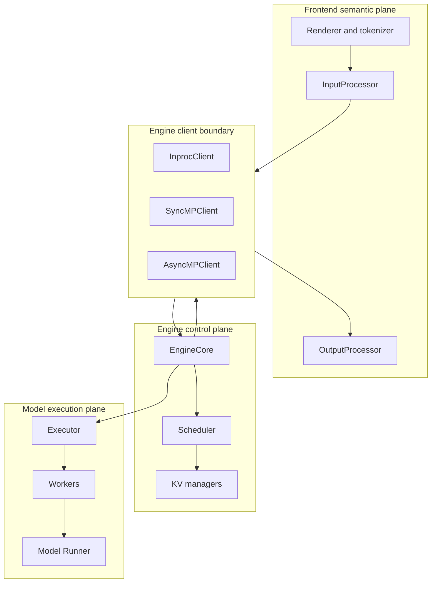
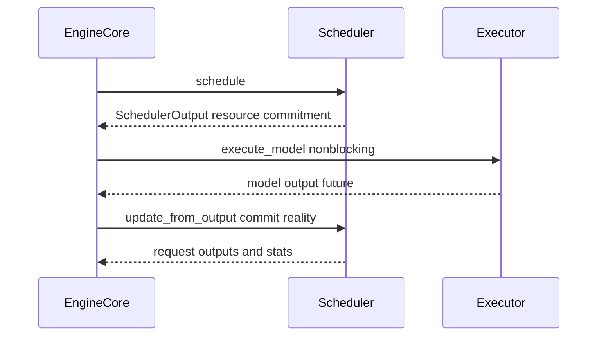

# vLLM 引擎架构：用状态所有权隔离三种运行节奏

> **源码基线**：`vllm-project/vllm@d66300a1baa7779c68c7dfa4e51eee2502b48017`
> **中心命题**：vLLM 把输入/输出语义、token-step 控制和设备执行分层，不是为了抽象而抽象，而是因为 HTTP/渲染、Scheduler/KV、GPU kernel 运行在不同时间尺度并拥有不同失败模式。`EngineCore` 是资源承诺的唯一提交者，client 与 executor 分别隔离前端并发模型和设备拓扑。
> **叙事顺序**：本页按五拍组织——背景 → 为什么这么设计（含被否掉的替代）→ 实现思路与细节 → 约束 → 发展趋势（本页无可锚定的在途改动，第 5 拍略）。
> **最近更新**：2026-08-27。按五拍重排章节顺序；机制正文与既有引用未改。

## 一、背景：为什么不能把所有逻辑写进一个 `generate()` 循环

一个请求至少跨越四种生命周期：

1. 文本、消息和多模态输入被 render/tokenize；
2. token request 排队、调度、申请 KV；
3. worker 执行模型、attention、采样；
4. token 被解码、匹配 stop string 并流式返回。

若单个对象同时拥有这些状态，网络慢客户端、tokenizer、Python 输出处理和 GPU step 会互相阻塞；离线同步接口与在线 asyncio 又会复制两套引擎逻辑。vLLM 因而保留一个不依赖 HTTP 的 `EngineCore`，在两侧放置不同 client 和 executor。

官方设计文档把 API server、每个 DP rank 的 EngineCore 和 GPU workers 区分为进程角色；`docs/design/arch_overview.md:67-93`。但“角色”不必一一对应 OS 进程：实际 executor 可以是 `uni`、multiprocessing、Ray 或 external launcher；选择逻辑在 `vllm/v1/executor/abstract.py:48-93`。

## 二、为什么这么设计：直观替代方案为何不够

| 替代方案 | 表面优势 | 失败原因 | 当前代价 |
|---|---|---|---|
| 一个 `generate()` 拥有全部状态 | 调试路径短 | 网络、tokenizer、scheduler、GPU 相互阻塞；同步/异步分叉 | 多层接口与 IPC |
| 前端直接调用 worker | 少一层 EngineCore | 无唯一 admission/KV owner，多前端会竞争设备状态 | EngineCore 成为关键故障域 |
| EngineCore 直接做 detokenize | stop 逻辑集中 | 引入 tokenizer/文本成本，无法隔离慢客户端 | 前后端需要 abort 协议 |
| 每种 executor 重写 engine loop | backend 定制自由 | 调度、KV 和 finish 语义漂移 | 统一 RPC 需要能力约束 |
| async 只加线程 | 改动小 | 共享 CPU buffer、KV 释放与乐观状态产生竞态 | 显式 in-flight 状态更复杂 |

> [!note] 推断
> 这张表是本页依据代码行为重建的设计权衡：每一行的“为什么不适用”都能落到后文引用的 `file:line` 上，但“当初权衡过、并因此否掉了它”这层意思由本页承担——源码通常只陈述最终形态，不陈述被否掉的选项。要引用其中某一行，请回到对应小节的 locator，不要引用本表。

## 三、对象所有权图

| Owner | 真相来源 | 生命周期 |
|---|---|---|
| Renderer/InputProcessor | prompt、chat template、多模态输入如何变成 `EngineCoreRequest` | 请求进入前 |
| OutputProcessor | token 如何 detokenize、stop、组装 `RequestOutput` | 每次输出到请求结束 |
| EngineCoreClient | in-process/ZMQ、同步/异步、DP 路由和输出队列 | engine 实例 |
| EngineCore/Scheduler | 请求状态、token admission、KV 所有权、abort/finish | token step |
| Executor/Worker/Runner | 权重分片、设备 buffer、forward/sample、collective | 模型实例与 device step |

`AsyncLLM` 的构造直接体现这条边界：renderer、input/output processor 留在前端，随后创建异步多进程 EngineCore client；`vllm/v1/engine/async_llm.py:109-156`。前端不持有 Scheduler，EngineCore 也不持有 tokenizer。

## 四、`EngineCoreClient` 为什么是架构接缝

`EngineCoreClient.make_client()` 根据 multiprocessing 与 asyncio 两个维度选择：

- `InprocClient`：前端直接持有 `EngineCore`，调用时主动 `step_fn()`；
- `SyncMPClient`：后台 EngineCore busy loop + ZMQ，同步离线前端；
- `AsyncMPClient`：后台 EngineCore + asyncio output task，在线前端；
- DP 场景再区分外部负载均衡和内部多 EngineCore 负载均衡；`vllm/v1/engine/core_client.py:78-139`。

这比让 `EngineCore` 同时实现同步、asyncio 和 ZMQ 更重要：**引擎控制逻辑只表达“接收请求、推进一步、返回结果”，client 决定谁驱动 step、怎样等待、输出进哪个并发原语。**

`InprocClient` 直接调用 `preprocess_add_request/add_request`，取输出时执行 step 和 post-step；`vllm/v1/engine/core_client.py:306-349`。多进程 client 则用 input/output socket 与后台 busy loop 通信；`vllm/v1/engine/core_client.py:503-565`。两条路径复用同一个 EngineCore，而不是两套推理状态机。

## 五、EngineCore 是资源承诺的提交边界

初始化时 EngineCore 先构造 executor，再 profile/初始化 KV cache，最后创建 Scheduler；`vllm/v1/engine/core.py:132-169`。顺序背后的约束是 Scheduler 的 admission budget 必须依赖真实设备容量，而不是静态配置猜测。

普通 step 只有三段承重逻辑：

源码为 `vllm/v1/engine/core.py:583-613`。其设计语义是：

1. `schedule()` 决定本轮哪些请求、多少 token、哪些 block；
2. executor 只能消费这份 `SchedulerOutput`，不能私自纳新；
3. `update_from_output()` 根据接受/拒绝、stop、error 和 connector 结果提交真实状态。

Scheduler 可以在执行前乐观推进 in-flight 状态以准备下一批，但最终完成与输出仍必须回到 Scheduler 提交。否则同一请求会在 core 和 runner 各有一份生命周期真相。

## 六、异步重叠为什么会改变 EngineCore

单个 future 只能把“提交”和“等待”分开；若想让 step $n+1$ 的 CPU 工作与 step $n$ 的 GPU 工作重叠，还需要多个 in-flight batch。EngineCore 根据 `max_concurrent_batches` 建 batch queue，并在 queue 未满时优先继续 schedule；`vllm/v1/engine/core.py:209-237,624-695`。

这带来三个新不变量：

- Scheduler 看到的 computed progress 可能是乐观上界；
- KV block 不能在仍有 batch 读取/写入时立即复用；
- Runner 的 CPU buffer 不能被下一 step 改写而让上一 step 的异步 copy 读到新值。

因此 async scheduling、deferred block free 与 MRV2 是同一个因果链，而不是三个独立开关。`VllmConfig` 会根据 executor、spec decode、structured output 等能力决定是否允许 async scheduling；`vllm/config/vllm.py:1197-1301`。

## 七、Executor 隔离的是拓扑，不是语义

`Executor.execute_model()` 把 `SchedulerOutput` 作为一次 collective RPC 的参数，并返回首个语义输出；`vllm/v1/executor/abstract.py:211-249`。具体 backend 决定 worker 如何创建、请求如何广播、PP 哪个 rank 采样、TP/EP collective 怎样执行。

统一接口不能推出统一性能：

- `UniProcExecutor` 可把 worker 折叠进 EngineCore 进程，减少 IPC；
- `MultiprocExecutor` 让每个 local rank 独立执行，增加故障域和同步；
- Ray 负责跨节点 actor 生命周期；
- external launcher 把进程创建权交给外部系统。

EngineCore 依赖的是“所有 rank 对同一调度承诺形成一个语义输出”，不是“每个 worker 都是独立进程”。并行所有权与 collective 顺序见 [[02_engineering/03_infer_frameworks/vllm/22_vllm_distributed_inference_analysis|vLLM 分布式推理]]。

## 八、输出为什么在前端再次提交

设备输出仍是 token id、logprob 和状态信号；stop string 可能跨 token 边界，只能在 detokenize 后判断。离线 `LLMEngine.step()` 先从 core 取结果，再由 OutputProcessor 处理，随后把因 stop string 完成的请求反向 abort 给 EngineCore；`vllm/v1/engine/llm_engine.py:298-334`。

在线 `AsyncLLM` 的 output handler 持续拉取结果，把大批输出分 chunk 处理以避免长时间阻塞 event loop，并把前端判定完成的请求异步 abort 回 core；`vllm/v1/engine/async_llm.py:665-745`。

这里存在双阶段完成：

- core 可基于 EOS、length、error 完成请求；
- front end 可基于 stop string、client cancellation 完成请求。

两者不能合并，因为前者拥有 token-level 资源，后者拥有文本/API 语义；它们通过 abort/finish 协议收敛。

## 九、进程生命周期与故障传播

`EngineCoreProc` 用输入/输出 queue 隔离 ZMQ IO thread 与 core loop，并把 executor failure 转换为内部请求；`vllm/v1/engine/core.py:1007-1089`。启动 handshake 注册地址与角色，DP 场景还交换配置 hash；`vllm/v1/engine/core.py:1193-1268`。

后台 busy loop 不应无条件空转：没有请求时 input queue 可阻塞，有请求或 batch queue 时持续 step；核心循环入口见 `vllm/v1/engine/core.py:1383-1455`。Async client 另启 output socket task，并尽早启动以捕获尚未发送请求时发生的 executor failure；`vllm/v1/engine/core_client.py:978-1045`。

全系统责任边界与一条代表性在线请求的跨层移交见 [[02_engineering/03_infer_frameworks/vllm/03_vllm_architecture_overview_analysis|vLLM 架构概览]]；启动三级就绪屏障、空闲后的逐层唤醒，以及 EngineCore/worker 的进程所有权仍由本页按具体运行时序说明。

错误边界不是完全透明的 RPC。client 必须区分坏请求、可恢复的单请求异常、Engine dead 和 worker/executor failure；在线 generate 路径在异常时关闭输出 queue，并在必要时 abort core request；`vllm/v1/engine/async_llm.py:620-663`。

## 十、约束、边界与源码阅读

- 官方进程图表达逻辑角色，不等价于所有配置的 OS 进程数。
- `EngineCoreClient` 隔离通信方式，不保证 IPC 没有成本；多 API server 还会引入多对多 socket。
- EngineCore 是请求资源真相，不负责集群级流量治理；服务控制面见 `16`。
- Executor 失败可能终止整个 engine；更细粒度 fault tolerance 仍受 backend 和并行模式限制。

最小阅读顺序：

1. `vllm/v1/engine/core.py:104-237,583-736`；
2. `vllm/v1/engine/core_client.py:78-139,306-349,503-565`；
3. `vllm/v1/executor/abstract.py:48-120,211-249`；
4. `vllm/v1/engine/async_llm.py:109-170,665-745`；
5. `vllm/v1/engine/llm_engine.py:298-334`。

## Related Pages

- [[02_engineering/03_infer_frameworks/vllm/02_vllm_system_design_principles_analysis|vLLM 系统设计原则]] — 解释为什么要分成四个系统平面。
- [[02_engineering/03_infer_frameworks/vllm/11_vllm_scheduler_analysis|vLLM Scheduler]] — EngineCore 内部资源承诺的 owner。
- [[02_engineering/03_infer_frameworks/vllm/12_vllm_kv_cache_management_analysis|vLLM KV Cache 管理]] — 调度承诺对应的长期显存所有权。
- [[02_engineering/03_infer_frameworks/vllm/15_vllm_model_runner_v2_analysis|vLLM Model Runner V2]] — in-flight batch 如何要求新的 runner 状态模型。
- [[02_engineering/03_infer_frameworks/vllm/16_vllm_serving_control_plane_analysis|vLLM Serving 控制面]] — launcher、API server 和 DP supervision 的生命周期。
- [[02_engineering/03_infer_frameworks/vllm/22_vllm_distributed_inference_analysis|vLLM 分布式推理]] — executor 后面的 rank/group 所有权。
- [[02_engineering/03_infer_frameworks/vllm/27_vllm_observability_reliability_analysis|vLLM 可观测性与可靠性]] — 进程故障、metrics 和 trace 如何反馈到控制面。
