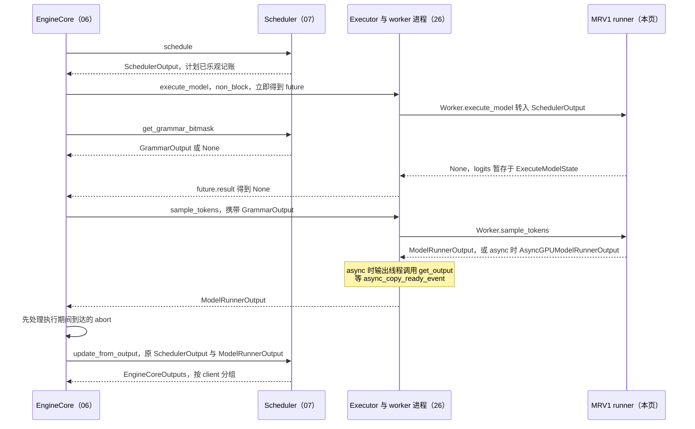
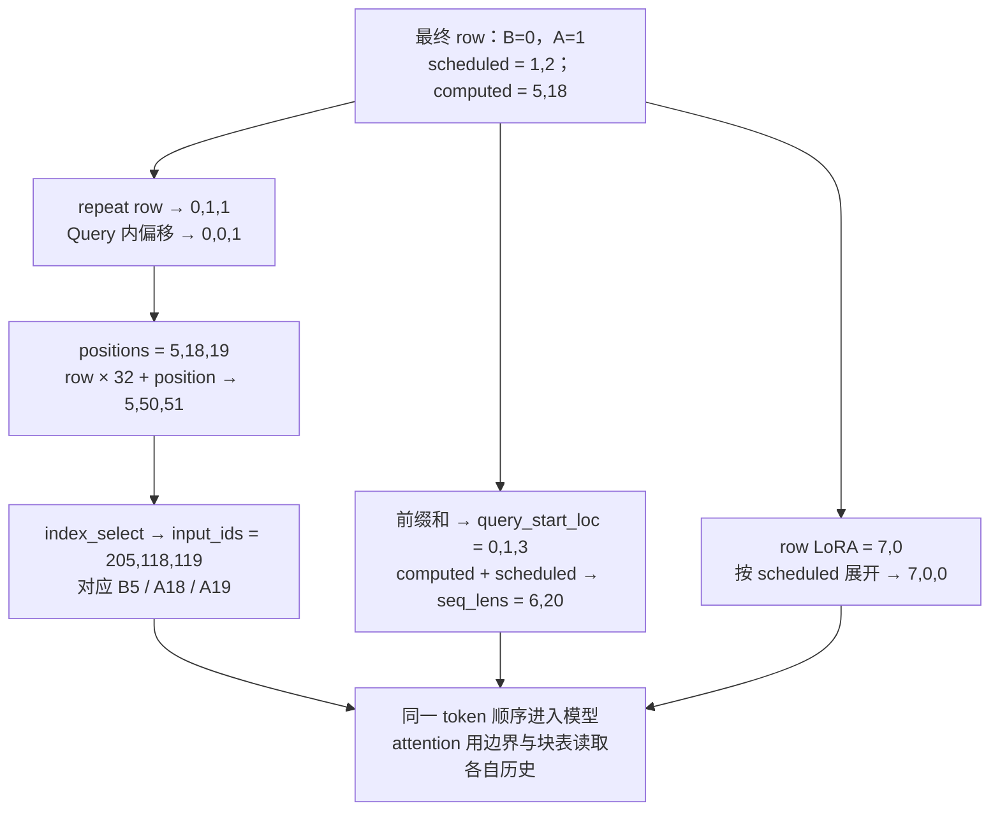
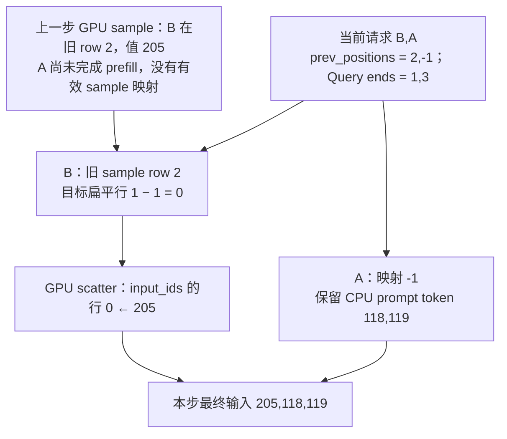
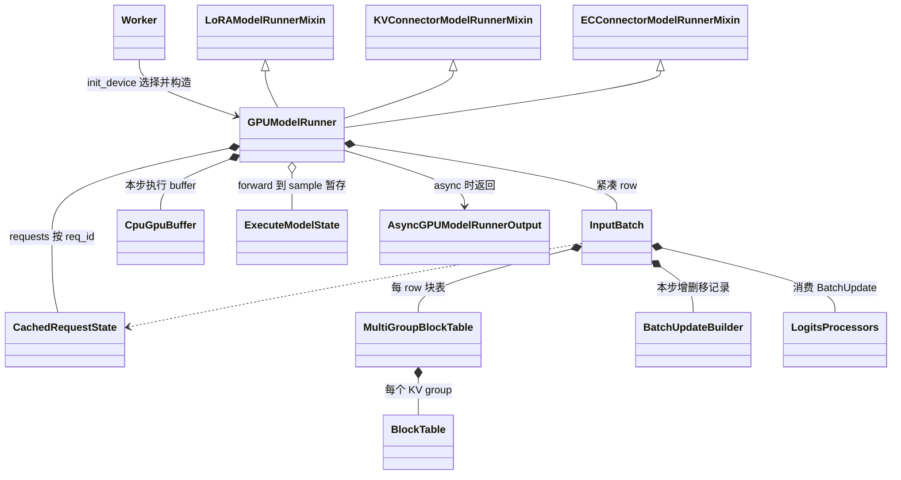

# vLLM Model Runner V1：请求挪了行，哪些输入必须一起挪

> **源码基线**：`vllm-project/vllm@199cb9b964822e59ab9b58d88e7be31eb419a2ae`（`main`，2026-09-07）
> **主题**：Model Runner V1（MRV1）的紧凑持久 batch：在 EngineCore step 闭环中的位置与核心流程清单、请求镜像与 row 的分工、`_update_states()` 顺序与 runner 侧 CoW 复制、condense/reorder 整行搬移及 processor/LoRA 跟随、token-major 输入与槽映射、attention metadata 交接、异步跨 row 复用采样及其与 Scheduler placeholder 的对应、forward/sample 分段交付、启动期 profile/warmup/capture，以及入口、上下游交接契约、约束、成本与配置。核心代码在 `vllm/v1/worker/gpu_model_runner.py`、`gpu_input_batch.py`。
> **适用范围**：Model Runner V1 的 worker 侧状态与执行；调度见 07，KV 分配与 CoW 引用见 08，attention 与字节地址见 10，runner 选择矩阵见 12，采样算法见 14，多模态 encoder 见 15，投机解码见 16，graph 策略见 19，KV connector 见 22。
> **最近更新**：2026-09-11。按 07 的流程覆盖标准补 step 闭环图、核心流程清单、逐阶段主流程表、attention metadata 交接、字段契约、placeholder 对应与启动期调用位置，并把 batch queue 与调度侧字段语义交回 06、07。

## 1. 特性概览

### 1.1 问题

本页的 **MRV1**（Model Runner V1）指 `vllm/v1/worker/gpu_model_runner.py` 的 `GPUModelRunner`，**MRV2**（Model Runner V2）指 `vllm/v1/worker/gpu/model_runner.py` 的同名类；两者都运行在 V1 Engine 的 worker 内，仅看 `vllm/v1/` 路径不能判断 runner 代际。

上一步 batch 的 row 顺序是 `[A, X, B]`。本步 X 不再运行，A、B 继续；如果只把名字改成 `[A, B]`，而 B 的 token history、block table、temperature 和 LoRA 仍留在 row 2，模型与 sampler 就会把 row 1 的旧内容当成 B——张量形状合法，结果却属于另一个请求。每步从零重建这些逐请求张量又太慢：官方 MRV2 设计文档指出，Python 逐步构造 block table 这类大张量的 CPU 开销，正是持久 batch 要消除的对象。

### 1.2 解决方法

MRV1 让**持久状态的 row 同时充当当步模型与采样输入的 row**。它按 request id 保存长期镜像，`InputBatch` 只在连续活跃 row 上保存执行字段；每步按 `SchedulerOutput` 的差量加入、移除、推进，压紧空洞，按 backend 需要重排，并把同一变换通知 logits processor。然后一次性展开成 token-major 的 `input_ids`、`positions`、Query 边界和槽映射，写进预分配的固定 buffer；forward 得到 logits 后另行采样，结果同步返回，或在 async 模式下作为延迟对象返回，下一步直接在 GPU 上复用采样 token。这一动机及其维护成本由 MRV2 设计文档明确说明，并非仅从类名推测。

### 1.3 收益、开销与约束

| 维度 | 直接收益 | 必付成本或边界 |
|---|---|---|
| 持久 batch | 相邻步请求集合高度重合时只写差量，省去逐步重建块表等张量 | 集合重合低时反复进出与搬移；源码注释称此时优化 “very inefficient” |
| row 即输入 | 模型和 sampler 直接读连续 row，不需再 gather | 每次 condense/swap 都要搬全部 row-local 字段并通知 processor，漏一项就跨请求错配 |
| 请求镜像 | 暂离 batch 的请求可恢复 | 镜像与 row 两份状态须一致；resume 必须整份替换 block ids |
| CPU token store | 任意 row、position 可直接索引取 token | 预分配 `max_num_reqs × max_model_len` 的 int32 与 bool 两张表；每步仍有 CPU 索引与 H2D |
| 异步 | 跳过 “sample → D2H → CPU 写回 → H2D” 的依赖链 | 旧 row、当前 row、扁平 token 行三套索引；共享 host buffer 需要 event 协议 |
| buffer 复用 | profile、warmup、capture 与真实步共用地址和形状 | `_dummy_run()` 一个入口承担多种职责，线上新条件可能在 dummy 中缺席 |

§5.2 把这些行与逐项成本合成一本总账，并给出运行包络。下文反复使用四种索引：

| 术语 | 本页含义 |
|---|---|
| request row | 请求在 `InputBatch` 中的当前行，由 `req_id_to_index` 给出 |
| token row `i` | 本步展平输入的第 `i` 个 token；`input_ids`、`positions`、`slot_mapping` 都按它对齐 |
| slot | KV 缓存中 token 级存储槽编号，即 `slot_mapping[i]` |
| prev row | 上一步采样结果在 `prev_sampled_token_ids` 中的行，由 `prev_req_id_to_index` 给出 |

### 1.4 在一次 step 闭环中的位置

MRV1 不决定本步做什么，也不判断请求是否结束；它夹在 Scheduler 的计划与对账之间。普通 `EngineCore.step()` 先 `schedule()` 得到 `SchedulerOutput`，以 `non_block=True` 交给 executor 并**立即**拿到 future，随后调用 `Scheduler.get_grammar_bitmask()` 准备 `GrammarOutput`（由 `StructuredOutputManager` 生成，见 [[14_vllm_sampling_structured_output_analysis|采样与结构化输出]]），然后才在 `future.result()` 等 worker 回应。`execute_model()` 返回 `None` 时 Core 再调用 `sample_tokens(grammar_output)`；拿到 `ModelRunnerOutput` 后先处理执行期间到达的 abort，再调用 `update_from_output()` 生成按客户端分组的 `EngineCoreOutputs`。非 async 的投机解码还在 step 之后由 `post_step()` 取回 draft token 交给 Scheduler（三条发布路径见 16 §8.3）。Core 怎样把 future 与原计划配对归 [[06_vllm_engine_architecture_analysis|Engine 架构]]，结果对账归 [[07_vllm_scheduler_analysis|Scheduler]] §8。

<!-- 图规格：四参与者顺序图，重放一次普通 step：Core 取得 SchedulerOutput 后非阻塞提交 execute_model，并在等待 future 前生成 GrammarOutput；runner 的 execute_model 返回 None 后 Core 再调用 sample_tokens；async 时 worker 侧输出线程在 get_output 等事件，再把 ModelRunnerOutput 交回 Core；Core 先处理 abort 再对账得到 EngineCoreOutputs。消息标交接对象，参与者括注归属页；不表示耗时比例。 -->


开启 batch queue（`max_concurrent_batches > 1`）时，Core 改用 `step_with_batch_queue()` 让多批在途；future 与原计划怎样成对入队、重放与延后采样由 [[06_vllm_engine_architecture_analysis|Engine 架构]] §4 解释。从 runner 侧看只有四处差别：`execute_model` 同样以 `non_block` 提交；`pending_structured_output_tokens` 为真时，这一批的 `sample_tokens` 延后到更早一批对账之后才调用；pooling、零 token 以及 EC producer 的批次不调用 `sample_tokens`，直接把 `exec_future` 作为结果排队；若 `sample_tokens` 的结果是 `None`，Core 调用 `exec_model_fut.result()`，让原先 `execute_model` 中的异常重新抛出。worker 侧的配合是：async 调度下 `WorkerProc.handle_output()` 把 runner 返回值交给独立的 `async_output_busy_loop` 线程，由它调用 `get_output()` 等事件后再回复 Core，worker 主循环因此可以先处理下一条 RPC。

### 1.5 核心流程清单

下表按“谁触发 → 交出什么 → 谁消费”列出本页负责的核心流程，每行都指向逐阶段拆解该流程的小节；字段级交接见 §3.4。

| 核心流程 | 触发与上游输入 | 输出与交接对象 | 下游消费者（归属页） | 本页位置 |
|---|---|---|---|---|
| 每步状态更新 | `Worker.execute_model` 转入的 `SchedulerOutput`：new/cached/finished 差量、块增量、zero/copy 列表 | 更新后的 `requests` 镜像；待压紧的 `InputBatch` row；已排入 stream 的 zero/copy | 本页 row 变换；本步 forward 读取 zero/copy 后的块（10） | §2.1、§2.2 |
| row 压紧与重排 | `remove_request()` 留下的空位；backend 的 `reorder_batch_threshold`（10） | 连续且按四区排序的 row；`BatchUpdateBuilder` 的 move 记录 | processor 刷新、输入物化 | §2.3 |
| processor 与 LoRA 跟随 | 本步 `BatchUpdate`；`request_lora_mapping` | 刷新后的 `SamplingMetadata` 与 processor 状态；token/prompt LoRA mapping | sampler（14）；LoRA manager（09） | §2.4 |
| 输入物化与槽映射 | 最终 row、`num_scheduled_tokens`、computed、token store、块表 | `input_ids`、`positions`、`query_start_loc`、`seq_lens`、`slot_mapping`、`logits_indices` | attention metadata 交接；model forward | §2.5、§2.6 |
| attention metadata 交接 | 上一行的同序张量；执行模式与 padding 决策（19） | 每层 attention metadata、按层槽映射、forward context | attention backend 与 KV 写入（10） | §2.6.1 |
| forward | 已绑定的 forward context；`input_ids` 或 `inputs_embeds`；positions | hidden states；非末 PP rank 的 `IntermediateTensors`（18） | logits 计算；下一 PP stage | §2.8 |
| 采样与 bookkeeping | Core 调用 `sample_tokens(GrammarOutput)`；`ExecuteModelState` | 同步时的 `ModelRunnerOutput`；token store 与镜像写回 | `Scheduler.update_from_output`（07 §8） | §2.8 |
| 异步输出与下一步复用 | `async_scheduling`；本步 GPU sampled tokens | `AsyncGPUModelRunnerOutput`；`prev_sampled_token_ids`、`prev_req_id_to_index`；CPU 中的 `-1` 占位 | worker 输出线程 `get_output` 后交 Core；下一步 `_prepare_input_ids` | §2.7 |
| dummy、profile、KV 初始化与 capture | 启动期 `determine_available_memory`、`initialize_from_config`、`compile_or_warm_up_model`；DP 空步 | KV 可用显存估计；`initialize_kv_cache()` → `may_reinitialize_input_batch()` → KV 张量分配后得到的最终 `InputBatch` 与缓存 view；warm 的 kernel 与捕获的 graph | KV 容量规划（08）；graph 策略（19）；本页每步流程 | §2.9 |
| runner 选择 | `VllmConfig.use_v2_model_runner`；`Worker.init_device` | MRV1 或 MRV2 实例；MRV1 能力校验结果 | 本页全部流程；选择矩阵（12） | §2.10 |

## 2. 机制：从一次删除走到一步输入

**触发与完成点。** 每步由 `Worker.execute_model(SchedulerOutput)` 触发。`execute_model()` 返回 `None` 只说明 forward 已发出、logits 已暂存；`sample_tokens()` 同步返回或 async 的 `get_output()` 之后结果才对 CPU 可见；请求进度要到 Scheduler 的 `update_from_output()` 才被确认（07 §8）。下表按 07 §4.1 的方式列出一步的主流程：

| 阶段 | 读入什么 | 决定什么 | 结果流向 | 本页位置 |
|---|---|---|---|---|
| 入口保护 | `execute_model_state`；async 时上一轮 `prepare_inputs_event` | 是否违反 execute/sample 配对；旧 H2D 是否已读完共享 host buffer | 进入状态更新 | §2.7、§2.8 |
| 状态更新 | finished、未调度、new、cached 差量；`new_block_ids_to_zero`、`kv_cache_block_copies`、`free_encoder_mm_hashes` | 删谁、保留谁的镜像、谁进 row；zero 与 copy 哪些块 | 镜像与未压紧的 row | §2.2 |
| row 变换 | 空位记录；backend 阈值；scheduled、computed、prompt 长度 | 哪行填洞、哪些行交换 | 连续有序的 row；`BatchUpdate` | §2.3 |
| processor 与 LoRA | `BatchUpdate`；row LoRA | 哪些 processor 状态与 sampling metadata 重建 | `SamplingMetadata`；LoRA mapping | §2.4 |
| 输入物化 | 最终 row、每请求 token 数、computed、token store、块表 | 每个 token 行属于谁、position、token id、槽 | `input_ids`、`positions`、Query 边界、`seq_lens`、`slot_mapping`、`logits_indices` | §2.5、§2.6 |
| 执行模式与 metadata | token 数与请求数、uniform decode、cascade 前缀、DP | graph 模式、padding、ubatch；各 KV group 的 metadata | forward context | §2.6.1 |
| forward | forward context、输入与 positions | 不做 runner 侧决策 | hidden states 或 `IntermediateTensors` | §2.8 |
| logits 暂存 | hidden states、`logits_indices` | 只为要采样的行算 logits | `ExecuteModelState`；返回 `None` | §2.8 |
| 采样 | `GrammarOutput`、logits、`SamplingMetadata` | 每请求接受哪些 token | `SamplerOutput` | §2.8 |
| bookkeeping 与交付 | sampler 输出、discard mask、async 模式 | 写回 token store 与镜像，或保存 async 快照 | `ModelRunnerOutput` 或 `AsyncGPUModelRunnerOutput` | §2.7、§2.8 |

下面先用一个具体例子走通前五个阶段。

沿用第 10 页的 A、B：A 的 prompt 共 20 个 token，已计算 18 个，本步计算 A18、A19；B 的 prompt 有 5 个 token，已计算 5 个，本步计算上一步采样出的 B5（token 205）。设 A 使用 greedy、无 LoRA，B 的温度为 0.6、LoRA id 为 7。KV 表有效部分 A 为 `[12,13]`、B 为 `[28]`，**假设 manager block 与 kernel block 都是 16 token**，所以这些编号同时就是 kernel 块号；若 kernel 块更小，`BlockTable.append_row()` 会先用 `map_to_kernel_blocks()` 把每个 manager 块展开成多个 kernel 块号（第 10 页展开）。这些数值都是教学输入。

在阈值为 1、要求 decode 在前的 backend 下，本步发生两次不同变换：

- **压紧**：移除 X 后 `[A, 空洞, B]`，把尾部 B 从 row 2 移到 row 1，得到 `[A, B]`。
- **重排**：B 是 decode，A 是 long extend（已有 context 且本步 token 数超过阈值，四区定义见 §2.3），交换 row 0、1，得到 `[B, A]`。温度、LoRA、块表和 token 都必须随请求移动。

<!-- 图规格：真实 request-row × 字段二维布局，使用独立SVG。三幅纵向表依次显示移除X后的空洞、尾B填洞、B/A交换；列为row、请求、有效token前缀、computed、温度、LoRA、block table。箭头标2→1和swap_states(1, 0)，后者由生成器按reorder helper的src_dest_map重放得到，蓝色强调B移动、橙色标空洞；图不表示KV字节搬运。 -->


图中“token 有效前缀”包含已存储但尚未计算的输入，所以 A 可以有 A0–A19 而 computed 只有 18。**存有 token ID 与已经生成该位置的 KV 是不同事实。** 图只显示部分字段，§2.3 再把 generator、mask、processor 状态接进同一次变换。

### 2.1 请求镜像与 row：两份状态各管什么

**职责。** `GPUModelRunner.requests[req_id]` 存 `CachedRequestState`：prompt/output history、computed、各组 block ids、sampling 参数与 generator、媒体与 M-RoPE/XD-RoPE 位置、LoRA、prompt embeds、pooling 状态。`InputBatch` 只在连续活跃 row 上保存执行所需字段——token store、长度、块表、sampling 参数、LoRA row 映射与 `req_id_to_index`——且自身就持有 CPU/GPU 张量。这不是“CPU 一份、GPU 一份”，而是按 request id 与按 row 两种身份。

**为什么需要镜像。** row 同时是输入，请求被 preempt 或本步未调度就必须让出 row，原 row 随即可被别的请求覆盖；MRV2 设计文档称 `CachedRequestState` 是为此维护的冗余备份。反过来，只保留镜像、每步从镜像重建 row，又回到持久 batch 要避免的逐步构造开销。

**怎样维护。** 主线有四个不变量：`req_id_to_index` 与活跃 row 一一对应；输入物化前没有内部空洞；退出当步集合不等于请求结束；任何 row-local 状态都按同一变换更新。`remove_request()` 的 docstring 要求之后必须调用 `condense()`，却不承诺每次移除都立刻压紧：`add_request()` 经 `_register_add_request()` 先取最小空位，新请求可能先填掉空洞，省去搬移。

**代价与边界。** 普通 token history 在 CPU 按 `max_num_reqs × max_model_len` 预分配 int32，另有同形的 `is_token_ids` mask；这块 tensor 不整块传 GPU，因此不 pin，源码 TODO 承认长上下文下它会过大。prompt embeddings 按 row 单独存入 `req_prompt_embeds`，避免再预分配同等长度的 embedding 矩阵。`CachedRequestState.get_token_id()` 对 prompt-embeds 位置抛 `ValueError`，混合输入靠 `prompt_is_token_ids`/`is_token_ids` 区分。M-RoPE/XD-RoPE、ReplaySSM ring origin（`replayssm_decode_base`：请求（重新）加入 batch 时的完整上下文长度 `num_tokens`，即 prompt 加已恢复输出，作为 decode 环形缓冲的起点；之后只随 swap/condense 搬移）、spec token 列表和 accepted-token count 也都是 row 状态，不能把纯文本的两个长度当作全部。

### 2.2 `_update_states()`：先改状态，再让消费者看到最终 row

**触发**：`execute_model()` 进入 `synchronize_input_prep()` 后的第一件事；**完成点**：`refresh_metadata()` 返回，镜像、row 与 processor 都看到最终 row，zero/copy 已排入 stream。

runner 消费 Scheduler 已批准的 `SchedulerOutput`，不重新决定本步让谁运行。顺序如下：

1. 删除 finished 请求的镜像与 row；同一 id 若同时 finished 又作为 new 提交，按结束旧请求、建立新请求处理。
2. 清零 `new_block_ids_to_zero`，执行 `kv_cache_block_copies`（§2.2.1），再释放 `free_encoder_mm_hashes` 对应的 encoder 输出。
3. 从 batch 移除未调度请求——preempted、暂未排到，以及强制 preempt 后必须走恢复路径的请求——镜像保留。
4. 新请求建立镜像；继续运行者按 Scheduler 更新 computed、输出长度与新增块；resume 整份替换 block ids，而不在已失效的旧表后 append。请求不在 batch 中（preempt 后 resume，或上一步未调度），且 async、`num_output_tokens > 0` 时，runner 用 `all_token_ids` 的末尾 `num_output_tokens` 个值重建输出列表。这是**消费条件**；**发送条件**更宽：Scheduler 的 `_make_cached_request_data()` 在 MRV1 下只要请求上一步未被调度就附带 `all_token_ids`，同步、异步都发，同步路径里 runner 不读它。
5. 新增或恢复者进入最小空 row，剩余空洞才 `condense()`；随后 `_may_reorder_batch()`，最后 `refresh_metadata()`。ngram GPU（在 GPU 上维护 token 表做 n-gram 草稿提议的投机方法，见 [[16_vllm_speculative_decoding_analysis|投机解码]]）的增量张量也在 batch 稳定后更新。

**为什么是这个顺序。** 先删 finished 才能让同 id 的新请求成为新对象；zero/copy 必须在任何输入准备之前；add 先于 condense 让新请求优先填洞；`refresh_metadata()` 放最后，是因为 processor 每步只能通过 `get_and_reset()` 消费一份完整的 `BatchUpdate`，若先刷新再重排，swap 就要到下一步才被 processor 看到（后半句为分析推断）。async spec 的接受数先按乐观值写入，输出列表补 `-1`，`_update_states()` 返回一个修正闭包；`execute_model()` 在 forward 发出后才调用它扣回 CPU computed（Mamba align 模式则在 `preprocess_mamba` 之前），避免过早等待上一步。

| 请求事件 | 长期镜像怎么处理 | 当前 row 怎么处理 |
|---|---|---|
| new | 创建，按 seed 建立独立 generator（若要求） | 填最小空位，否则追加 |
| 继续运行 | 更新进度、输出长度与 block 增量 | 原 row 增量更新 |
| 本步未调度 / preempted | 保留 | 移除，之后填洞或压紧 |
| resume | 替换恢复后的 block ids，必要时恢复 output IDs | 重新加入，row 不保证与以前相同 |
| finished | 删除并触发相关清理 | 移除 |
| streaming update | 原对象更新，新 prompt 已吸收中间输出 | 先移除，再重新加入，避免同 id 占两行 |

streaming 的具体例子：旧 prompt `[1,2,3]`，旧输出 `[10,11]`；Scheduler 提交的新完整 prompt 是 `[1,2,3,10,4,5]`、computed=4。runner 采用这份 prompt 而不自行拼接，清空旧 `output_token_ids`，更新 sampling、block ids 和媒体信息后重新加入 batch；旧输出 11 不在新 prompt 中，就不能偷偷补回。streaming 测试核对原对象复用、先移除和输出清空；镜像在未调度后保留、finished 后删除各有 `_update_states` 测试（§3.3）。`test_update_states_request_resumed` 传入空的 `resumed_req_ids`，覆盖的是未调度请求重新加入并追加块（append 分支）后块表与镜像一致；preempt 后 resume 整份替换 block ids 的分支及其两个 `assert` 在本基线没有直接单测——`tests/v1/worker/test_mamba_utils.py` 中唯一非空的 `resumed_req_ids` 只检验 `preprocess_mamba` 清理 Mamba state 索引。

#### 2.2.1 CoW 复制：续写私有块之前，旧内容要先到位

`SchedulerOutput.kv_cache_block_copies` 携带 `(src_block_id, dst_block_id)`。以部分前缀命中为例，Scheduler 已把请求尾块改指向私有 dst；**仅换块号只改变地址，不能自动生成旧 KV**，worker 必须先把 src 的已有内容复制过去，才能向 dst 续写并读取完整历史。

MRV1 在 `_update_states()` 中先清零 `new_block_ids_to_zero`，再调用 `copy_kv_cache_blocks_inplace()`，之后才准备输入并执行模型。不能把复制放在清零之前（若 dst 也在清零列表中，后清零会抹掉复制结果——分析推断），也不能拖到本次 attention 之后。helper 按 scheduler 块号复制：用 `cache.shape[0] / num_blocks` 折叠第 10 页的虚拟 kernel-block 拆分；共享同一 KV view（相同 `data_ptr`）的层只复制一次；整块存储恰为 `num_blocks × 块跨度` 时，还按 underlying storage 去重、以字节行复制。三个测试分别覆盖多种 layout 的共享 storage、按 head group 分散的 LHBNC 布局和虚拟块拆分。

helper 内部没有 host 同步：索引经 `async_tensor_h2d` 上传，`blocks[dst] = blocks[src]` 按 PyTorch 的 CUDA 语义排入当前 stream。vLLM 源码能证明的是复制先于同一 stream 上的后续输入与 forward 发出，不能证明 helper 返回时 GPU 已完成复制；这里也没有新增 copy event 协议。src/dst 的引用在 Scheduler 侧如何暂留、何时（包括 `defer_block_free` 的 step fence）归还，由 [[08_vllm_kv_cache_management_analysis|KV Cache 管理]] §5.1.1（新请求续写：改自己的表，保留旧缓存）解释。

### 2.3 condense 与 reorder：整行怎样搬

**触发**：`_update_states()` 登记完 add/remove 之后；**完成点**：`req_id_to_index` 与连续 row 一致，且 row 已按 backend 要求的四区排好。

`condense()` 找最小内部空洞，再找末尾最后一个非空 row，把后者搬到前者；尾部连续空行不必填，最后截短请求列表。空洞已全被新加入者占用时直接返回；活跃请求数为零时清空对应列表。它不保证维持原请求顺序，换来的是只搬必要的尾部请求，而不是把空洞之后的所有请求左移——左移的搬移量随空洞位置增长（取舍理由为分析推断）。

本例 `2→1` 要随 B 同行搬走：有效 token prefix、`is_token_ids`、prompt embeds、prompt/总 token/computed 长度、ReplaySSM origin、spec token 与 accepted count、各组 block-table row、LoRA id、温度/top-p/top-k/penalties、allowed-token mask、bad words、generator，以及输出列表引用。按 req_id 保存的集合（如 `greedy_reqs`）不需要伪造 row 搬移，按 row 保存的字典（`generators`、`bad_words_token_ids`）必须换 key。`BlockTable.move_row()` 还把腾空的源行清零，注释说明 dummy batch 会把陈旧 row 当作 Mamba state slot 原地写入。

**reorder 的变体集合。** `calculate_reorder_batch_threshold()` 取所有 attention group 的 metadata builder 所报 `reorder_batch_threshold` 中的最小非空值；全为空或没有 attention group 时不重排，`_may_reorder_batch()` 对零个 KV cache group 的模型也直接返回。有阈值时只有一个实现 `reorder_batch_to_split_decodes_and_prefills()`；`_may_reorder_batch()` 的 docstring 说明 MLA 等 backend 需要按 compute-bound 与 memory-bound 分开请求。helper 按 scheduled token 数、是否已有 context、是否已算完 prompt 分四区，而不是简单的 prefill/decode 二分：**decode → short extend → long extend → first prefill**。阈值为 1 时 B 属于 decode、A 属于 long extend。源码只把误置 row 转成交换链：本例 `src_dest_map={1:0, 0:1}`，实际调用一次 `swap_states(1,0)` 得到 `[B,A]`；不能推导同一区域内始终保持全局稳定顺序。各 backend 报什么阈值归 [[10_vllm_attention_backends_analysis|Attention Backend]]；同一“执行顺序”问题在 MRV2 由稳定 row 加逐步 gather 解决，见 [[12_vllm_model_runner_v2_analysis|Model Runner V2]]。

`swap_states()` 交换两份完整 row 状态。token 数组用临时副本，避免 NumPy view 别名让一次交换覆盖另一侧；复制范围是两请求有效 token 数（含 draft token）的较大者，不按 `max_model_len` 搬整行。这里搬的是 **block table 行**，不是这些物理块里的 KV；真正的 KV 复制是 §2.2.1 的另一件事。

### 2.4 processor 与 LoRA 跟上同一次移动

**触发**：`_update_states()` 末尾的 `refresh_metadata()`，以及 `_prepare_inputs()` 中的 `set_active_loras()`；**完成点**：processor 消费完本步 `BatchUpdate`，sampling metadata 与 LoRA mapping 都对应最终 row。

logits processor 可能有自己的 row-local 状态，不能因 runner 张量已搬好就假定它也知道。`BatchUpdateBuilder` 记录 add/remove/move；本例记录单向 `(2,1)` 和一次 `(1,0,SWAP)`。`refresh_metadata()` 取出本步 `BatchUpdate`，先交 thinking-budget state（按 `reasoning_config` 跟踪各请求思考 token 预算的 state holder），再交各 processor 的 `update_state()`，有变化才重建 sampling metadata；没有 batch 变更时省去重建，async 下的 output history 修补另有消费点（§2.7）。

removal 有顺序约束：先登记全部 removal，再读取排序后的空位；一旦读过 removed 列表又调用 `removed_append()`，builder 抛 `RuntimeError`。这解释了为何不能随意把移除代码塞到 condense 或 add 之后。

LoRA 先按 row 维护 `request_lora_mapping`，随 condense/swap 移动。最终 `[B,A]` 的 request LoRA 为 `[7,0]`，按本步 token 数 `[1,2]` 展开得到 **token LoRA mapping `[7,0,0]`**；不使用 spec 时每请求取一个 logits，按采样候选数 `[1,1]` 得到 **prompt LoRA mapping `[7,0]`**。`prompt_lora_mapping` 的名字指 sampled-token/logits 的映射，并非完整 prompt 每个 token 的映射。启用 LoRA 时 `_prepare_inputs()` 调用 mixin 的 `set_active_loras()`，由 `make_lora_inputs()` 生成两份映射并交给 LoRA manager 激活；adapter 登记与装载见 [[09_vllm_model_library_analysis|模型库]]。

### 2.5 `_prepare_inputs()`：最终 row 怎样变成三行模型输入

**触发**：`execute_model()` 在状态更新之后调用 `_prepare_inputs()`；**完成点**：输入与槽映射已写进固定 buffer，H2D 与 GPU 侧计算已排入 stream，返回 `logits_indices` 与 spec metadata。

Scheduler 按请求提交本步 token 数，模型希望一次处理扁平 token 流。逐请求 forward 会失去跨请求 batching；让 Scheduler 直接拼设备 tensor 又会把固定 buffer 和设备布局推回调度层（设计理由为分析推断）。MRV1 在所有 row 变换完成后做一次展开。

为便于算地址，设 CPU token-store 的 row stride，即教学 `max_model_len`，为 32；A 的 token ID 为 `100+position`，B 为 `200+position`。真实配置通常大得多，32 只用于验证下表：

| 量 | 本例结果 | 怎么得到 |
|---|---|---|
| 当前请求顺序 | `[B,A]` | condense 与 reorder 已完成 |
| 本步 token 数 | `[1,2]` | 按最终请求顺序读取 Scheduler 字典 |
| `req_indices` | `[0,1,1]` | 每个 row 重复它的本步 token 数 |
| Query 内偏移 | `[0,0,1]` | 每个请求从 0 重新计数 |
| `positions` | `[5,18,19]` | 对应请求的 computed 加 Query 内偏移 |
| CPU flattened token indices | `[5,50,51]` | `row×32+position`：5、32+18、32+19 |
| `input_ids` | `[205,118,119]` | 从 CPU token-store 按上述索引提取 |
| `query_start_loc` | `[0,1,3]` | 本步 token 数前缀和，首元素为 0 |
| `seq_lens` | `[6,20]` | computed 加本步 token 数 |
| `logits_indices` | `[0,2]` | 无 spec 时，每段 Query 的末行 |

<!-- 图规格：索引转换拓扑，不画二维storage。输入为稳定后的[B,A]和scheduled/computed，分别显示repeat、前缀和、row stride索引；输出为三个ids及attention边界，并把LoRA映射接到同一展开顺序。所有值由SVG配套教学replay计算并与正文断言比较。 -->


`_prepare_inputs()` 先提交 block table 的 H2D，让复制与随后的 CPU 索引计算重叠；用 `np.repeat` 与 `_get_cumsum_and_arange()` 建立上表索引，再以 `torch.index_select` 把 CPU token history 抽进固定 `input_ids` buffer。Query 起点的 padding 填最终累积值以保持非递减，sequence-length padding 填 0。

**CPU 算过 positions，不代表设备输入直接采用 CPU 的乐观结果。** live path 把 request indices、Query offsets、scheduled counts 传到 GPU，由 GPU 上的 computed 值生成最终 `positions`、`seq_lens`，再由 `BlockTable.compute_slot_mapping()` 计算槽映射；async spec 下，前一步被拒绝的 draft 会先用有效接受数在 GPU 修正 computed。普通例子没有这项修正，两边恰好一致。没有异步 GPU token 可复用时，`_prepare_input_ids()` 直接把当前 `input_ids` buffer 传到 GPU。

prompt-embeds 路径按同一索引取 `is_token_ids`，把实际 embedding 分段写入执行 buffer，不能把每个位置都当整数 token。M-RoPE/XD-RoPE 的 pinned 位置矩阵按行复制：带哑列的非连续切片会让 `copy_()` 先聚到 pageable 临时 buffer 而隐式同步；async spec 下还按 GPU 与 CPU computed 的差值修正多维位置。

未完成的 chunked prefill 也走统一采样入口，但 `optimistic_seq_lens < num_tokens` 的行会记入 `discard_request_mask`，采样结果随后清空；`_bookkeeping_sync()` 还把这些行中带 seed 的 generator 的 offset 回退 4（分析推断：抵消这次被丢弃采样的随机数消耗）。本例 A 恰好在本步算完 prompt，所以它的末行可产生有效下一 token。

### 2.6 请求行、输入 token 行与缓存槽不能互换

把 A18 单独拿出来：它属于请求 row 1，却在展平输入中占 token 行 i=1，自己的 position 是 18；A19 仍属于 row 1，却占 i=2、position 19。按上面的块表假设，A 的逻辑项 1 指向块 13，所以 `slot_mapping[1]=210`、`slot_mapping[2]=211`。i=1 恰好等于请求 row 1 是巧合，A19 已说明两者会分开。

| 输入 token 行 i | 请求 row | 请求内 position | CPU token-store 扁平索引 | KV slot |
|---|---|---|---|---|
| 0 | B 的 row 0 | 5 | 5 | 453 |
| 1 | A 的 row 1 | 18 | 50 | 210 |
| 2 | A 的 row 1 | 19 | 51 | 211 |

CPU token-store 的 50 与 KV slot 210 指向不同对象：前者取 token ID，后者给该 token 新算出的 K/V 找存储槽。`slot_mapping[i]` 按当前输入 token 行读；flash 写缓存的 `reshape_and_cache_flash_kernel` 也用同一个 `token_idx` 读取 K/V 源行和 `slot_mapping[token_idx]`，槽为负（padding）时跳过。一旦只改排序而不一起更新映射，就会把内容写给另一个位置。槽还要补 layer、head 与内容维才能落到 K/V 数值：[[10_vllm_attention_backends_analysis|Attention Backend]] 用同一个 A19 → 块 13、偏移 3、slot 211 的例子继续推到元素下标与字节地址。

#### 2.6.1 交给 attention 的 metadata：padding、分组与 forward context

**触发**：`_prepare_inputs()` 返回后，仍在 `synchronize_input_prep()` 保护区内；**完成点**：`set_forward_context()` 绑定了每层 metadata 与槽映射，`_model_forward()` 中的 attention 层按层名取用。backend 怎样解释这些字段、怎样写 KV，归 [[10_vllm_attention_backends_analysis|Attention Backend]]；graph 模式与 padding 的选择策略归 [[19_vllm_compilation_cudagraph_analysis|编译与 CUDA Graph]]。这里只拆 runner 交出什么。

| 阶段 | 读入什么 | 决定什么 | 结果流向 |
|---|---|---|---|
| cascade 前缀 | 每请求 token 数、computed、`num_common_prefix_blocks` | 启用 cascade 且未开 ubatching 时，各 group 的公共前缀长度 | `_build_attention_metadata()` |
| 执行模式 | 未 padding 的 token 数、请求数、最大 query 长度、encoder 请求数、DP | graph 模式、padding 后的 token/请求数、是否拆 ubatch、跨 DP token 数 | 槽映射、metadata 与 forward context 的形状 |
| 槽映射 | 各 group 的 `BlockTable.slot_mapping`；padding 后 token 数 | full graph 或 KV 写入与 forward 分离时按 padding 长度取，尾部填 `-1` | 按 group 的映射给 builder，按层的映射给 forward context |
| 公共 metadata | Query 边界、`seq_lens`、computed、prompt 长度、group 0 的块表与槽、positions | `max_seq_len`（capture 时取 `max_model_len`）、`is_prefilling`；padding 请求行的块表填 null block | `CommonAttentionMetadata` |
| 分组 build | 每个 KV group 与 attention group 的 builder、spec | 常规用 `build()`，capture 用 `build_for_cudagraph_capture()`；spec 与 builder 类型相同的 group 只换块表 | 每层 attention metadata |
| 绑定 | metadata、padding 后 token 数、graph 模式、batch descriptor、ubatch、按层槽映射 | 不做新决策 | forward context |

本例未发生 padding：`CommonAttentionMetadata` 携带 Query 边界 `[0,1,3]`、序列长度 `[6,20]`、块表行 `[28]` 与 `[12,13]`、槽 `[453,210,211]`、`max_query_len=2`、`max_seq_len=20`，`is_prefilling` 为 `[False, True]`（B 已算完 prompt，A 尚未）。若 full graph 把 3 个 token 补到一个假设的 capture 长度 4，槽映射第 4 项为 `-1`，flash 写缓存 kernel 遇到负槽直接跳过（§2.6）；padding 请求行的块表填 null block。async spec 下，这里把 CPU 的 `seq_lens` 与 computed 置空，因为 GPU 上修正过的值才权威（§2.5）。启用 routed-experts 时，runner 还把本步 attention 槽映射复制进私有 buffer，供异步 D2H 读取（§2.7）。

### 2.7 异步执行：B 换了 row，上一步 GPU token 还放在旧 row

**触发**：`async_scheduling` 为真时，上一步 `_bookkeeping_sync()` 留下 GPU 快照，本步 `_prepare_inputs()` 读取；**完成点**：`input_ids` 的公共 decode 行已在 GPU 上被覆盖；上一步结果则在 `get_output()` 等到事件后才对 CPU 可见。

**当前 row → 前一步有效采样 row → 当前 token 行。** 把同一例子切到 async 模式。上一步 `[A,X,B]` 中，A 只算到 prompt 位置 17，尚未完成 prefill；B 采样出 205，但结果尚未经过 CPU round trip：上一步 GPU sampled tensor 仍按旧 row 存放，B 的结果在 row 2，CPU token store 的 B5 位置暂时是 `-1` placeholder。

`_bookkeeping_sync()` 在 async 分支保存 GPU sampled tensor，并建立**仅含有效采样请求**的 `prev_req_id_to_index`：A 的行被 discard mask 排除，X 在本步 `remove_request()` 时从中弹出。移除 X、压紧和交换后是 `[B,A]`，所以 `_compute_prev_positions()` 得到 **`prev_positions=[2,-1]`**。这里 `-1` 不只表示全新请求，也表示像 A 这样上一步没有可复用采样结果的请求。

当前 cumulative Query ends 为 `[1,3]`。B 没有 draft，目标扁平行是 `1−1=0`；`_prepare_input_ids()` 把 `prev_sampled_token_ids[2,0]=205` scatter 到当前 `input_ids[0]`。A 不在旧映射中，保留 CPU 提供的 118、119。混合 batch 先复制 CPU 基础输入，再覆盖公共 decode token，最终仍是 `[205,118,119]`。

<!-- 图规格：跨step索引拓扑。输入显示前一步B在row2的sample205、当前[B,A]的prev_positions=[2,-1]；分别标GPU scatter到扁平0和CPU填A两行，汇合为三token输入。负分支说明A没有可复用sample，不等于没有请求状态。 -->


若全部公共 decode 的旧 row 恰好等于当前扁平目标且覆盖连续前缀，源码用一次 slice copy 代替 scatter；仅“请求集合相同”不够。带 draft 时还要从每段末尾扣除 draft 长度，分别散写采样 token 与 draft suffix。PP 异步广播未完成时，读取 sampled tokens 前先等待该传输；这一等待也不是普遍的“所有 GPU 工作都先同步”。

**两个 event 保护不同的东西。** `prepare_inputs_event` 保护**被复用的 host 输入 buffer**：本步 CPU 改写 pinned 长度/索引等内存前，`synchronize_input_prep()` 先等上一轮记录的事件，确保旧 H2D 不再读取；准备区结束时再记录，供下一次 real 或 dummy 准备使用。只把 sampled tokens 留在 GPU，消除不了 CPU 覆写旧 H2D 源地址的竞态。`async_copy_ready_event` 保护**本步结果的 CPU 可见性**：copy stream 先等 default stream 的生产操作，再非阻塞复制 tokens、logprobs 和诊断数据并记录事件；`AsyncGPUModelRunnerOutput` 持有 GPU tensor 引用直至复制完成，`get_output()` 等事件后才转成列表，清除无效请求的结果并处理 NaN/EP 通信故障。输出携带的 `req_ids` 与 `req_id_to_index` 是副本，下一轮 row 变化不会改写已返回结果的身份；可选 routed-experts 的共享数据与 slot mapping 先形成私有 GPU clone，防止下一步覆盖源 buffer 时 copy stream 仍在读取。

如果下次 logits processor 确实需要 output history，`InputBatch.update_async_output_token_ids()` 在消费前等同一个结果事件，用真实 token 替换末尾 `-1`；它按旧请求映射定位，并处理 placeholder 数量与实际接受数不同、KV-load 失败丢弃 token 的情况，不是每步无条件同步整份输出。

**与 Scheduler 的 placeholder 是同一缺口的两端。** 同一个“token 已采样、值还没回到 CPU”的位置，Scheduler 只记数量，MRV1 保存数值：

| 位置 | Scheduler / `AsyncScheduler`（07 §8.1、§8.2） | MRV1 |
|---|---|---|
| 形成缺口 | `_update_after_schedule()` 给非 `is_prefill_chunk` 请求加 `num_sampled_tokens_per_step` 与本步 draft 数之和的 placeholder，并把下一轮 `spec_token_ids` 设成 `-1` 列表 | `_bookkeeping_sync()` 把有效行的采样值留在 GPU 的 `prev_sampled_token_ids`，CPU token store 与镜像输出写 `-1` |
| 跨过缺口排下一步 | 候选量取 `num_tokens_with_spec + num_output_placeholders - num_computed_tokens`，不必等值回来就能再排一个位置 | `_prepare_input_ids()` 按 `prev_positions` 把 GPU 值 scatter 进本步 `input_ids`；`update_req_spec_token_ids()` 的注释说明 async 下写进 token store 的 draft 只是占位，也在这里被覆盖 |
| 缺口闭合 | 对账时按交付 token 数扣 placeholder，spec 拒绝再扣拒绝数；`cache_blocks()` 只登记 `computed - placeholders` 以内的块 | `get_output()` 等事件后才有 CPU 列表；只有 processor 需要 history 时，`update_async_output_token_ids()` 才把 `-1` 换成真值，末 rank 的镜像输出长度按 Scheduler 的 `num_output_tokens` 截齐 |

在本例中，B 在上一步 S0 恰好算完 prompt，不是 partial prefill，AsyncScheduler 为它记 1 个 placeholder；本步 S1 在 O0 回来之前按 `5 + 1 - 5 = 1` 排出 `B:1`，正是 07 §8.2 右列“O0 未对账时先形成并提交 S1”那一行。runner 侧对应的就是 CPU 为 `-1`、GPU 旧 row 2 为 205 的 B5。A 在 S0 是 partial prefill：Scheduler 不给它记 placeholder，MRV1 也用 discard mask 把它排除出 `prev_req_id_to_index`，两边同样没有待补的值。Scheduler 一般不把采样值送回 worker，例外只有两处：PP 且非 async 时，`new_token_ids` 把值带给非末 PP rank；MRV1 下上一步未被调度的请求附带 `all_token_ids`，runner 只在 async、请求不在 batch 且已有输出时用它重建输出列表（§2.2）。

event 与 stream 的等待语义（`Event.synchronize()` 阻塞 host 直到已记录工作完成，`wait_stream()` 建立跨 stream 顺序）是 PyTorch/CUDA 的公开契约；vLLM 源码证明的是记录与等待的位置及其保护的 buffer，不证明设备侧的具体调度。收益是缩短依赖链、把等待推迟到真实消费者；代价是两套 row 映射、placeholder 和共享 host buffer 的 event 协议，新 buffer 若漏出保护区仍可能产生竞态——MRV2 设计文档把这列为 MRV1 的维护成本。

### 2.8 forward 与 sample 分开：结果何时可交付

**触发**：`execute_model()` 的准备区结束后发出 forward；Core 在 `future.result()` 为 `None` 时调用 `sample_tokens(grammar_output)`（§1.4）；**完成点**：同步路径返回 `ModelRunnerOutput`，async 路径返回延迟对象，CPU 可见点见下文；请求进度的确认属于 07。

正常生成路径在 `execute_model()` 的准备区更新状态、生成输入、决定 padding/执行模式并建立 attention metadata；随后用 `set_forward_context()` 绑定当步 metadata 和槽映射，再执行 forward；backend 与模型参数此前已初始化，每步变化的只是输入。最后一个 PP rank 对 `logits_indices` 行计算 logits，把 logits、`SchedulerOutput`、spec metadata、hidden states、slot mappings 等存入 `ExecuteModelState`，返回 `None`。下一次 `sample_tokens(grammar_output)` 取出并清空这份状态，应用可选 grammar bitmask，执行 sampler（spec 时为 rejection sampler），再推进 hybrid/spec 状态与结果 bookkeeping。**得到 logits 不等于已按本步约束选出 token。** 分成两次调用让 grammar bitmask 可以在 forward 发出后才交给 runner（分析推断；bitmask 如何生成见 [[14_vllm_sampling_structured_output_analysis|采样与结构化输出]]）。上一份状态未被 sample 消费就再次 execute，会抛 `RuntimeError`。

**交付变体由返回分支枚举。** 选择轴是：是否 EC producer（EC 指 encoder cache transfer，producer 是计算并外送 encoder 输出、不作 consumer 的一端，见 [[15_vllm_multimodal_execution_analysis|多模态执行]]）、本步有无 scheduled token 与 KV transfer、PP rank 位置与 `broadcast_pp_output`、是否 pooling，以及 `async_scheduling`。`execute_model()` 有六种出口：EC producer 只跑 encoder 并返回空 encoder 输出；没有 scheduled token 时返回空结果，或在有 KV transfer 时返回 connector-only 结果（external launcher 且 DP>1 时先 `_dummy_run(1)` 以保持跨 rank 协调）；`broadcast_pp_output` 为假时，非末尾 PP rank 返回 `IntermediateTensors`；pooling 模型经 `_pool()` 直接返回；生成模型返回 `None` 并暂存状态。`broadcast_pp_output` 只在 external launcher 且 PP>1 时为真：非末 rank 用 `send_tensor_dict` 送出 hidden states，各 rank 经 `broadcast_tensor_dict` 拿到末 rank 的 logits，同样暂存 `ExecuteModelState` 并返回 `None`，随后都走采样分支；六种出口不变。`sample_tokens()` 有三种：状态为空时返回 connector-only 结果（非末尾 PP rank 在 async 下先接收上一步 sampled ids）；同步时返回已填好的 `ModelRunnerOutput`；async 时返回 `AsyncGPUModelRunnerOutput`。所以不能把 `execute_model()` 的所有调用都概括成“总返回 None”；pooling 输出路径本域暂无页面展开。

**CPU 可见点。** 同步路径在 `_bookkeeping_sync()` 内经 `_to_list()` 把 sampled ids 复制进 pinned buffer 并等 `transfer_event`，源码注释说明这是为了避免 `tolist()` 触发整条 stream 同步。async 路径的 CPU 列表要到调用方（如 `WorkerProc.enqueue_output`）调用 `get_output()` 时才就绪。涉及 draft 时，可直接使用 GPU sampled token 的 drafter 在 bookkeeping 之前运行，依赖 CPU token 的 drafter 在其后运行（见 [[16_vllm_speculative_decoding_analysis|投机解码]]）；KV connector 的保存等待与 metadata 清理由 target 延迟到 draft 之后的 `finalize_kv_connector()`，避免 target 结束就过早关闭本步保存上下文。

### 2.9 dummy、profile、capture 为什么复用真实 buffer

**触发**：启动期由 Worker 的 `determine_available_memory()`、`initialize_from_config()` 与 `compile_or_warm_up_model()` 依次调用，运行期 DP 空步也可调用 `_dummy_run()`；**完成点**：内存估计交给 KV 规划，按最终块长重建的 `InputBatch` 与 KV 张量就绪，graph 已捕获且 workspace 已锁定。

profile 若另造一套过度简化的输入，可能漏掉 LoRA、mixed batch、attention workspace 或媒体编码峰值；graph capture 还要求 replay 使用捕获时的地址。MRV1 因而预分配 input/position/length 等 buffer，让 `_dummy_run()` 在同一套运行时上合成请求与 token 分段。

启动期的调用位置按 `EngineCore.__init__` 的顺序是（elastic EP 扩容启动跳过其中的测量与 warmup）：

1. 构造 executor：worker 进程先 `Worker.init_device()`，此时构造 MRV1（§2.10），再 `load_model()`。
2. `EngineCore._initialize_kv_caches()` 收集各层 KV spec 后调用 `determine_available_memory()`：`Worker.determine_available_memory()` 在 `memory_profiling` 中执行 `profile_run()`，graph 模式非 NONE 的 CUDA 类平台随后调用 `profile_cudagraph_memory()` 估算 graph 池；显式设置 `kv_cache_memory_bytes` 时仍跑一次 `profile_run()` 以完成编译，但跳过测量。
3. `get_kv_cache_configs()` 用这个可用显存规划 KV（08）；`initialize_from_config()` 进入 `GPUModelRunner.initialize_kv_cache()`，其中 `may_reinitialize_input_batch()` 按最终块长重建 `InputBatch`，再分配 KV 张量。
4. `compile_or_warm_up_model()`：`VLLM_COMPILE` 模式先对 compile size 做 `_dummy_run()` warmup，再做 kernel warmup；未 `enforce_eager` 时调用 `capture_model()`。MRV1 的末 PP rank 在 capture **之后**再跑一次 `_dummy_run()` 与 `_dummy_sampler_run()`（pooling 为 `_dummy_pooler_run()`），源码注释说明这是为了按最大形状预分配 sampler buffer，避免被 `empty_cache` 清掉。
5. 此后 `EngineCore.__init__` 才创建 Scheduler（07 §2.2），开始第一个 step。

- **profile**：`profile_run()` 可先按多模态预算构造编码输入与 encoder cache，再以最大 token budget 调 dummy forward，末尾 rank 运行 dummy sampler 或 pooler，同步后清理临时输出与编码缓存。它是启动内存估计，不保证穷举所有真实 shape 峰值；当前媒体 profile 只选最大输入 token 的单一模态。
- **warmup**：dummy 可指定 mixed 或 uniform decode，`force_attention` 在 eager warmup 也构造 metadata；`profile_seq_lens` 模拟随 context 增长的 workspace，不能只用 Query 数替代历史长度。
- **capture**：`capture_model()` 消费 dispatcher 给出的 capture descriptors（注释要求先大后小以复用内存池）。每个 descriptor 先 eager warmup，等待包括辅助流在内的 warmup 工作完成，再以 dummy 触发 capture；结束后关闭意外 capture 并锁定 workspace，防止运行期 resize。

`_dummy_run()` 支持 mixed、uniform、LoRA active count、microbatch、profile 与 graph mode 等输入；请求的 runtime mode 与 dispatcher 得出的模式不符会断言失败。dummy 没有真实 KV 写入槽，所以槽映射填 `-1`；共享 pinned buffer 的准备同样进入 `synchronize_input_prep()`，不能因为“没有真实请求”就绕过 async 保护。dummy 还提交已清理的 block-table 行，并为 full replay 重新准备捕获所读 metadata，避免沿用已结束请求的状态索引。当前 ubatched capture 还受 full graph、uniform decode 与阈值条件限制，不是所有 dummy 都拆 microbatch。

这套复用减少 real 与 capture 的地址/形状偏差，也让一个入口同时承担 profile、warmup、capture 和空 DP forward，分支组合多；新增线上输入时必须核对 dummy 能否形成对应条件，官方设计文档明确把这种路径漂移列为技术债。graph descriptor、full/piecewise/eager 降级与编译策略由 [[19_vllm_compilation_cudagraph_analysis|编译与 CUDA Graph]] 展开。

### 2.10 什么时候真的走 MRV1

**触发**：配置期先由 `VllmConfig` 解析并校验 runner 选择，worker 进程随后在 `Worker.init_device()` 构造 runner；**完成点**：MRV1 实例已构造，且配置期的 `_validate_v1_model_runner()` 已通过。

`vllm/v1/worker/gpu_worker.py` 的 `Worker.init_device()` 按 `VllmConfig.use_v2_model_runner` 构造 MRV1 或 MRV2（MM encoder-only 另有 V2 专用 runner）。`VLLM_USE_V2_MODEL_RUNNER=0` 显式选择 MRV1；未设置时才自动判断：ROCm 上的 `DeepseekV32ForCausalLM`、`DeepseekV4ForCausalLM`、`GlmMoeDsaForCausalLM`，缺少 Triton，或 MRV2 blocker 非空时选 MRV1，否则默认 MRV2。MRV1 仍是活跃兼容路径，但不是能力全集：选中后 `_validate_v1_model_runner()` 会让 PCP、DSpark、adaptive draft verification、mixed sliding/full DFlash、DFlash2、diffusion 和 batch-sharded sampling 以 `ValueError` 失败；sampling-distribution replay 与 trace replay 的 validator 也明确要求 MRV2。完整的双向选择矩阵留在 [[12_vllm_model_runner_v2_analysis|Model Runner V2]]。

同一个 MRV1 类还是平台 runner 的基类：`xpu_model_runner.py::XPUModelRunner` 与 `cpu_model_runner.py::CPUModelRunner` 继承它，`_on_request_state_removed()` 就是留给平台 runner 的清理钩子。它们继承本页的 row 维护代码，子类具体覆盖了哪些方法本页未逐一核查；本域暂无页面专门展开平台 runner。

## 3. 代码实现

### 3.1 所有权视图

空心三角表示真实的 Python 继承，`GPUModelRunner` 的全部三个 mixin 基类都已画出；虚线表示 `add_request()` 从镜像复制字段到 row；其余连线表示构造、持有或返回。



| 对象 | 职责 | 不负责什么 |
|---|---|---|
| `Worker`（`gpu_worker.py`） | 构造 MRV1/MRV2；把 execute/sample 调用转给 runner，非首 PP rank 先接收 intermediate tensors | 不维护 row 或输入 |
| `GPUModelRunner` | 消费 `SchedulerOutput` 更新镜像与 row，物化输入，发起 forward/logits/sample，组装结果；持有 `input_ids`、`query_start_loc`、`req_indices`、`prev_positions` 等固定 buffer（`CpuGpuBuffer`）与 `positions`、`seq_lens` 设备张量 | 不决定谁运行、不分配 KV 块、不实现 attention 或 sampler 算法 |
| `CachedRequestState` | 按 request id 保存 history、computed、block ids、sampling 与 generator、媒体位置、LoRA、prompt embeds、pooling 状态；未完成请求离开 batch 后仍保留 | 不决定当前 row；finished 才删除 |
| `InputBatch` | 连续活跃 row 上的 token store、长度、sampling 参数、LoRA row 映射、`req_id_to_index`；上一步 async 快照 `prev_sampled_token_ids`、`prev_req_id_to_index` | 不保存已离开 batch 的请求；不按 req_id 解释旧 row |
| `MultiGroupBlockTable` / `BlockTable` | 每个 KV group 的 row→块号表、manager→kernel 块号展开、slot mapping kernel 的输入 | 不分配或释放块（08） |
| `BatchUpdateBuilder` / `LogitsProcessors` | 记录本步 add/remove/move 并转成 `BatchUpdate`，processor 据此更新自己的 row-local 状态 | 不搬 runner 张量 |
| `ExecuteModelState` | `execute_model()` 返回 `None` 后暂存 logits、`SchedulerOutput`、spec metadata、hidden states、slot mappings | 不跨两次 execute 保留 |
| `AsyncGPUModelRunnerOutput` | 持有 GPU sampled tensor，在 copy stream 发起 D2H 并记录 `async_copy_ready_event`；`get_output()` 等事件后生成 CPU 列表 | 不保证调用 `get_output()` 前 CPU 数据已就绪 |
| 三个 mixin | `set_active_loras()`；forward 期间绑定并收取 KV connector 输出，spec 时延后 `finalize_kv_connector()`；收取 EC connector 输出 | adapter 装载见 09，KV 传输协议见 22，EC transfer 见 15 |

### 3.2 调用流程

缩进表示 caller → callee；行内 `a → b` 也表示 a 直接调用 b；同一行 `a / b` 表示按方括号条件二选一；先后发生的兄弟调用分行列出。方括号内是条件或注释，其中的 → 表示数据变换。NVTX/profiler 包装与纯转发省略。`Worker` 是 executor 分派到 worker 端的入口，executor 到 worker 的跨进程分派不在这里展开。

```text
Worker.execute_model                         [非首 PP rank 先 irecv intermediate tensors]
`-- GPUModelRunner.execute_model
    +-- [execute_model_state 非空] raise RuntimeError
    +-- synchronize_input_prep               [async：等上一轮 prepare_inputs_event，退出时 record]
    |   +-- _update_states
    |   |   +-- requests.pop                                   [finished]
    |   |   +-- input_batch.remove_request                     [finished]
    |   |   +-- _zero_block_ids                                [new_block_ids_to_zero]
    |   |   +-- copy_kv_cache_blocks_inplace                   [kv_cache_block_copies]
    |   |   +-- input_batch.remove_request                     [unscheduled]
    |   |   +-- CachedRequestState / _update_streaming_request [new / streaming]
    |   |   +-- block_table.append_row 或加入 reqs_to_add       [running / resumed]
    |   |   +-- input_batch.add_request                        [new / resumed / streaming]
    |   |   +-- input_batch.condense
    |   |   +-- _may_reorder_batch → reorder_batch_to_split_decodes_and_prefills → swap_states
    |   |   `-- input_batch.refresh_metadata → LogitsProcessor.update_state
    |   +-- [EC producer] _execute_mm_encoder，随后 return 空 encoder 输出
    |   +-- [0 scheduled tokens] return 空结果 / kv_connector_no_forward   [无 / 有 KV transfer]
    |   +-- _prepare_inputs
    |   |   +-- block_table.commit_block_table                  [H2D 先发]
    |   |   +-- _get_cumsum_and_arange
    |   |   +-- torch.index_select                              [CPU token store → input_ids]
    |   |   +-- _compute_prev_positions
    |   |   +-- block_table.compute_slot_mapping                [GPU positions → slot]
    |   |   +-- _prepare_input_ids                              [async：scatter prev sampled]
    |   |   `-- [lora_config] set_active_loras → make_lora_inputs
    |   +-- _determine_batch_execution_and_padding             [graph 模式与 padding，见 19]
    |   +-- [mamba align] 先调用修正闭包，再 preprocess_mamba
    |   +-- _get_slot_mappings
    |   +-- _build_attention_metadata → builder.build          [见 10]
    |   `-- _preprocess                                         [多模态 encoder 与 gather，见 15]
    +-- set_forward_context + maybe_get_kv_connector_output
    |   `-- _model_forward → model
    +-- [not broadcast_pp_output]
    |   +-- [非末 PP rank] return IntermediateTensors
    |   +-- [pooling] return _pool
    |   `-- model.compute_logits(hidden_states[logits_indices])
    +-- [broadcast_pp_output：external launcher 且 PP>1]
    |   +-- [非末 PP rank] send_tensor_dict                     [送出 hidden states]
    |   +-- [末 PP rank] model.compute_logits
    |   `-- broadcast_tensor_dict                               [各 rank 得到 logits]
    +-- execute_model_state = ExecuteModelState
    +-- [async spec 修正闭包仍在] 调用它
    `-- return None
```

```text
Worker.sample_tokens
`-- GPUModelRunner.sample_tokens(grammar_output)
    +-- [execute_model_state 为空] return connector-only 输出
    +-- 取出并清空 execute_model_state
    +-- [grammar_output] apply_grammar_bitmask                  [见 14]
    +-- _sample
    |   +-- input_batch.update_async_output_token_ids           [需要 output ids 时等结果事件]
    |   `-- sampler / rejection_sampler                         [无 / 有 spec，见 14、16]
    +-- _update_states_after_model_execute                      [hybrid 且 spec 才生效]
    +-- [GPU token drafter] propose_draft_token_ids             [见 16]
    +-- _bookkeeping_sync
    |   +-- [discard 行] seeded generator 回退 offset
    |   +-- [sync] _to_list → transfer_event.synchronize        [CPU 列表就绪]
    |   `-- [async] 保存 prev_sampled_token_ids、prev_req_id_to_index；token store 写 -1
    +-- [CPU token drafter] propose_draft_token_ids
    +-- [spec] finalize_kv_connector
    +-- ModelRunnerOutput(req_ids 副本, req_id_to_index 副本, ...)
    +-- [sync] return ModelRunnerOutput
    `-- [async]
        +-- AsyncGPUModelRunnerOutput                           [copy stream 发起 D2H 并记录事件]
        +-- input_batch.set_async_sampled_token_ids
        `-- return AsyncGPUModelRunnerOutput

WorkerProc.enqueue_output                    [调用方稍后执行]
`-- AsyncGPUModelRunnerOutput.get_output → async_copy_ready_event.synchronize
```

第一棵树的返回只闭合“forward 已发出、logits 已暂存”；第二棵树的同步分支在 `_to_list()` 后 CPU 结果可见，async 分支要到 `get_output()` 才可见。请求何时被判定完成、结果怎样回到 Scheduler，由 [[07_vllm_scheduler_analysis|Scheduler]] 负责；两端的逐字段交接见 §3.4。

### 3.3 源码阅读路线

1. 选择与构造：`vllm/config/vllm.py::VllmConfig.use_v2_model_runner`、`VllmConfig._get_v1_model_runner_unsupported_features`、`VllmConfig._validate_v1_model_runner`、`VllmConfig._verify_sampling_replay_config`、`VllmConfig._verify_trace_replay_config`、`VllmConfig.__post_init__`（async 解析）；`vllm/envs.py::VLLM_USE_V2_MODEL_RUNNER`；`vllm/v1/worker/gpu_worker.py::Worker.init_device`、`Worker.execute_model`、`Worker.sample_tokens`。
2. 状态所有者与 buffer：`vllm/v1/worker/gpu_model_runner.py::GPUModelRunner.__init__`、`GPUModelRunner.may_reinitialize_input_batch`；`vllm/v1/worker/gpu_input_batch.py::CachedRequestState`、`InputBatch.__init__`；`vllm/v1/worker/block_table.py::MultiGroupBlockTable`、`BlockTable.append_row`、`BlockTable.map_to_kernel_blocks`；`vllm/v1/utils.py::CpuGpuBuffer`。
3. 更新顺序与 CoW 接缝：`GPUModelRunner._update_states`、`GPUModelRunner._update_streaming_request`；`vllm/v1/core/sched/output.py::SchedulerOutput`；`vllm/v1/worker/utils.py::copy_kv_cache_blocks_inplace`；调度侧引用（08 展开）`vllm/v1/core/single_type_kv_cache_manager.py::SingleTypeKVCacheManager._apply_cow`。
4. row 变换：`InputBatch.add_request`、`InputBatch.remove_request`、`InputBatch.condense`、`InputBatch.swap_states`；`BlockTable.move_row`、`BlockTable.swap_row`；`GPUModelRunner.calculate_reorder_batch_threshold`、`GPUModelRunner._may_reorder_batch`；`vllm/v1/attention/backends/utils.py::reorder_batch_to_split_decodes_and_prefills`。
5. processor 与 LoRA：`InputBatch.refresh_metadata`、`InputBatch.make_lora_inputs`；`vllm/v1/sample/logits_processor/state.py::BatchUpdateBuilder`、`LogitsProcessors`；`vllm/v1/worker/lora_model_runner_mixin.py::LoRAModelRunnerMixin.set_active_loras`。
6. 输入物化与槽：`GPUModelRunner._prepare_inputs`、`GPUModelRunner._get_cumsum_and_arange`、`GPUModelRunner._get_slot_mappings`；`BlockTable.compute_slot_mapping`、`ComputeSlotMappingKernel.kernel`；`csrc/libtorch_stable/cache_kernels.cu::vllm::reshape_and_cache_flash_kernel`。
7. 异步依赖：`GPUModelRunner._compute_prev_positions`、`GPUModelRunner._prepare_input_ids`、`GPUModelRunner._bookkeeping_sync`、`GPUModelRunner.synchronize_input_prep`；`InputBatch.set_async_sampled_token_ids`、`InputBatch.update_async_output_token_ids`；`AsyncGPUModelRunnerOutput.__init__`、`AsyncGPUModelRunnerOutput.get_output`。
8. forward/sample 与交付：`GPUModelRunner.execute_model`、`ExecuteModelState`、`GPUModelRunner.sample_tokens`、`GPUModelRunner._sample`、`GPUModelRunner._to_list`；`vllm/v1/worker/kv_connector_model_runner_mixin.py::KVConnectorModelRunnerMixin.maybe_get_kv_connector_output`、`KVConnectorModelRunnerMixin.finalize_kv_connector`；`vllm/v1/worker/ec_connector_model_runner_mixin.py::ECConnectorModelRunnerMixin.maybe_get_ec_connector_output`；`vllm/v1/executor/multiproc_executor.py::WorkerProc.enqueue_output`。
9. dummy/profile/capture：`GPUModelRunner._dummy_run`、`GPUModelRunner.profile_run`、`GPUModelRunner.capture_model`、`GPUModelRunner._warmup_and_capture`、`GPUModelRunner._capture_cudagraphs`。
10. 设计理由：`docs/design/model_runner_v2.md` 的 Persistent Batch、Removing Async Barrier、No Abuse of `dummy_run` 三节。
11. 验证：`tests/v1/worker/test_gpu_model_runner.py::test_update_states_request_unscheduled`（未调度后镜像仍在、row 已移除）、`tests/v1/worker/test_gpu_model_runner.py::test_update_states_request_finished`、`tests/v1/worker/test_gpu_model_runner.py::test_update_states_request_resumed`（未调度后重新加入，append 分支；preempt-resume 替换分支无直接单测）；`tests/v1/worker/test_gpu_input_batch.py::test_sampling_metadata_in_input_batch`（condense 后与期望 metadata 比对）、`tests/v1/worker/test_gpu_input_batch.py::test_swap_states_in_input_batch`（swap 后与按交换顺序重建的参考 batch 比对）；`tests/v1/streaming_input/test_gpu_model_runner_streaming.py::test_e2e_streaming_request_update_basic_flow`；`tests/v1/worker/test_attn_utils.py::test_copy_kv_cache_blocks_shared_storage`、`tests/v1/worker/test_attn_utils.py::test_copy_kv_cache_blocks_separate_head_groups`、`tests/v1/worker/test_attn_utils.py::test_copy_kv_cache_blocks_with_virtual_block_splitting`。
12. step 闭环、worker 输出与启动：`vllm/v1/engine/core.py::EngineCore.__init__`、`EngineCore._initialize_kv_caches`、`EngineCore.step`、`EngineCore.step_with_batch_queue`；`vllm/v1/executor/multiproc_executor.py::WorkerProc.__init__`、`WorkerProc.handle_output`、`WorkerProc.async_output_busy_loop`；`vllm/v1/worker/gpu_worker.py::Worker.determine_available_memory`、`Worker.initialize_from_config`、`Worker.compile_or_warm_up_model`、`Worker.annotate_profile`；`GPUModelRunner.initialize_kv_cache`、`GPUModelRunner.profile_cudagraph_memory`。
13. 上下游契约与 placeholder：`vllm/v1/core/sched/output.py::SchedulerOutput`；`vllm/v1/outputs.py::ModelRunnerOutput`；`vllm/v1/core/sched/scheduler.py::Scheduler.schedule`、`Scheduler._make_cached_request_data`、`Scheduler.get_grammar_bitmask`、`Scheduler.update_from_output`、`Scheduler._update_request_with_output`；`vllm/v1/core/sched/async_scheduler.py::AsyncScheduler._update_after_schedule`、`AsyncScheduler._update_request_with_output`；`vllm/v1/request.py::Request.is_prefill_chunk`；`InputBatch.update_req_spec_token_ids`；`vllm/v1/worker/mamba_utils.py::cleanup_mamba_state_idx`；`vllm/v1/spec_decode/ngram_proposer_gpu.py::update_scheduler_for_invalid_drafts`；`vllm/v1/structured_output/utils.py::apply_grammar_bitmask`；`vllm/v1/utils.py::compute_iteration_details`；调度侧 connector 读取抢占：`vllm/distributed/kv_transfer/kv_connector/v1/offloading/scheduler.py::OffloadingConnectorScheduler.build_connector_meta`、`vllm/distributed/kv_transfer/kv_connector/v1/mooncake/store/scheduler.py::MooncakeStoreScheduler.build_connector_meta`、`vllm/v1/simple_kv_offload/manager.py::SimpleCPUOffloadScheduler.build_connector_meta`。
14. attention metadata 交接：`GPUModelRunner._compute_cascade_attn_prefix_lens`、`GPUModelRunner._determine_batch_execution_and_padding`、`GPUModelRunner._get_slot_mappings`、`GPUModelRunner._build_attention_metadata`；`GPUModelRunner._pool`、`GPUModelRunner._copy_draft_token_ids_to_cpu`；encoder cache：`GPUModelRunner._process_encoder_cache_scheduler_output`、`GPUModelRunner._cache_encoder_output`。

以上测试是静态核验过的测试合同；本轮未运行 vLLM 的 GPU 或分布式测试，也不把文档演算当成端到端正确性证明。

### 3.4 交接契约：读哪些 `SchedulerOutput` 字段，填哪些 `ModelRunnerOutput` 字段

**输入：`SchedulerOutput` 的 22 个字段。** 按 dataclass 声明逐项核对 `gpu_model_runner.py`、`gpu_input_batch.py`、三个 mixin 与 runner 调用的 helper；“MRV1 不读”指这些文件里没有读取点。

| 字段 | MRV1 在哪一步消费 | 备注 |
|---|---|---|
| `scheduled_new_reqs` | `_update_states()` 建镜像，或经 `_update_streaming_request()` 更新；`_extract_mm_kwargs()` 取媒体参数 | `Worker.annotate_profile()` 只用于 profiler 标注 |
| `scheduled_cached_reqs` | `_update_states()` 读 req_ids、computed、new_block_ids、resumed、num_output_tokens；非末 PP rank 读 new_token_ids；请求不在 batch、async 且 `num_output_tokens > 0` 时读 all_token_ids | 发送条件与消费条件不同：Scheduler 只在 PP 且非 async 时填 new_token_ids；MRV1 下只要请求上一步未被调度就填 all_token_ids，同步、异步都发，resume 与普通未调度重入都算。Mamba 的 `cleanup_mamba_state_idx()` 读 resumed ids |
| `finished_req_ids` | `_update_states()` 删除镜像与 row | KV/EC mixin 传给 connector 的 `get_finished()`；Mamba 清理状态索引 |
| `preempted_req_ids` | runner 主线不读；Mamba 路径的 `cleanup_mamba_state_idx()` 读取并清理状态索引 | KV connector 的读取点都在调度侧 `build_connector_meta()`（offloading、Mooncake store、SimpleCPUOffload）；worker 只经 `kv_connector_metadata` 与 `handle_preemptions()` 看到抢占 |
| `num_scheduled_tokens` | `_update_states()` 求未调度集合；`execute_model()` 按最终 row 取每请求 token 数；reorder、M-RoPE/XD-RoPE、多模态 gather、prompt logprobs、drafter | ngram GPU 的 `update_scheduler_for_invalid_drafts()` 会就地裁剪，所以 `execute_model()` 先对它和 spec 字典做浅拷贝 |
| `total_num_scheduled_tokens` | `Worker.execute_model()` 判定是否 forward；`execute_model()` 的零 token 分支与未 padding 数；`_prepare_inputs()`；bookkeeping | ngram GPU 同样就地裁剪（作用在拷贝上） |
| `scheduled_spec_decode_tokens` | `update_req_spec_token_ids()` 写 token store；`_prepare_inputs()` 生成 spec metadata；`_prepare_input_ids()` 散写 draft；`apply_grammar_bitmask()` | 投机算法归 16 |
| `num_spec_tokens_to_schedule` | `propose_draft_token_ids()` | AsyncScheduler 用它设下一轮 draft 占位数 |
| `num_invalid_spec_tokens` | MRV1 不读 | Scheduler 在 `update_from_output()` 统计接受率时扣除 |
| `num_common_prefix_blocks` | `_compute_cascade_attn_prefix_lens()` | cascade attention，§2.6.1 |
| `new_block_ids_to_zero` | `_update_states()` → `_zero_block_ids()` | §2.2 |
| `kv_cache_block_copies` | `_update_states()` → `copy_kv_cache_blocks_inplace()` | §2.2.1 |
| `kv_connector_metadata` | `execute_model()` 的 `handle_preemptions()`；KV mixin 的 `bind_connector_metadata()` | 协议归 22 |
| `has_sync_kv_loads` | KV mixin 据此决定 `start_load_kv()` 在 forward 前还是 forward 发出后调用 | 同步 load 供本步 forward 使用，必须先发 |
| `kv_connector_block_state` | 不到达 worker | Scheduler-internal：`schedule()` 构造 connector metadata 后置 `None` |
| `ec_connector_metadata` | EC mixin 的 `bind_connector_metadata()` | encoder cache transfer，15 |
| `scheduled_encoder_inputs` | `_batch_mm_inputs_from_scheduler()` 与 `_execute_mm_encoder()`；encoder-decoder 的 `_preprocess()`；执行模式判定时的 encoder 请求数 | 多模态执行归 15 |
| `free_encoder_mm_hashes` | `_update_states()` 调 `_process_encoder_cache_scheduler_output()`，从 `encoder_cache` 弹出这些 hash，这是真正的释放点（§2.2） | `_execute_mm_encoder()` 还把它作为参数传给 `_cache_encoder_output()`，基类方法体第一行就 `del` 掉，树内没有子类覆盖；该方法随后调用的 `maybe_save_ec_to_connector()` 只收 `encoder_cache` 与 `mm_hash` |
| `ec_manager_metadata` | 实际不使用：只作为参数传进 `_cache_encoder_output()`，基类立即 `del`，树内没有覆盖 | 不经这里到达 EC connector；EC 协议归 15 |
| `scheduled_encoder_input_stats` | MRV1 不读 | Core 的 `compute_iteration_details()` 统计用 |
| `has_structured_output_requests` | 仅 `_copy_draft_token_ids_to_cpu()`：async 下据此判断是否要把 draft 拷回 CPU | Scheduler 的 `get_grammar_bitmask()` 以它快速返回 |
| `pending_structured_output_tokens` | MRV1 不读 | AsyncScheduler 置位，`step_with_batch_queue()` 据此延后采样（§1.4） |

**输出：`ModelRunnerOutput` 的 12 个字段。** 各字段在调度侧的用途由 07 §8 解释，这里只标 MRV1 的填写点：

| 字段 | MRV1 在哪里填 | 调度侧去向 |
|---|---|---|
| `req_ids` | `_bookkeeping_sync()` 复制 `input_batch.req_ids`；pooling 在 `_pool()` 复制 | 07 §8.5 |
| `req_id_to_index` | 同上复制 | 07 §8.3 |
| `sampled_token_ids` | 同步：`_to_list()` 或 `RejectionSampler.parse_output()`，discard 行清空；async：`get_output()` 等事件后填入，无效行清空 | 07 §8.1–§8.4 |
| `logprobs` | 同步：`tolists()`；async：`get_output()` | 07 §8.5 |
| `prompt_logprobs_dict` | `_bookkeeping_sync()` 调 `_get_prompt_logprobs_dict()` | 07 §8.5 |
| `pooler_output` | `_pool()`：非 CUDA 类平台直接复制；CUDA 类由 `AsyncGPUPoolingModelRunnerOutput` 在 copy stream 复制，`get_output()` 等事件后可见 | 07 §8.4 |
| `kv_connector_output` | KV mixin 在 forward 上下文退出时写 finished_sending/recving、invalid_block_ids、统计与事件；空步由 `kv_connector_no_forward()` 产生 | 07 §8.3、§8.6 |
| `ec_connector_output` | EC mixin；仅 `supports_mm_inputs` 时放入 | 15 §7.4：`update_from_output()` 交 `ECConnectorBase.update_connector_output()` |
| `num_nans_in_logits` | 开启 `VLLM_COMPUTE_NANS_IN_LOGITS` 时：同步由 `_get_nans_in_logits()` 算出；async 在 `get_output()` 把计数张量转成字典 | 07 §8.5 |
| `cudagraph_stats` | `_determine_batch_execution_and_padding()` 的结果经 `ExecuteModelState` 带到输出 | 07 §8.6 |
| `routed_experts` | 同步：包装 pinned buffer 的 `RoutedExpertsLists`；async：私有 GPU clone 在 `get_output()` 转成列表 | 07 §8.5 |
| `sampling_masks` | MRV1 不填：只有 MRV2 的 `gpu/async_utils.py` 写它，sampling replay 也要求 MRV2 | 07 §8.5 |

没有 scheduled token 时，runner 返回 `EMPTY_MODEL_RUNNER_OUTPUT` 或只含 connector 输出的 `ModelRunnerOutput`（调度侧见 07 §3.3）。

## 4. 配套机制：只保留接缝

本页的正确性目标（row 与输入同序、结果身份稳定）不需要把下列机制展开到同等深度，这里只记录本页拥有的接缝：

| 相邻机制 | 本页保留的接缝 | 完整解释 |
|---|---|---|
| 调度 | 消费 `SchedulerOutput`、交回 `ModelRunnerOutput`；step 闭环见 §1.4，逐字段契约见 §3.4 | [[07_vllm_scheduler_analysis\|Scheduler]] |
| KV 分配与 CoW 引用 | zero → copy → 输入/forward 的 runner 侧顺序 | [[08_vllm_kv_cache_management_analysis\|KV Cache 管理]] |
| attention metadata 与写入 | 同序的 Query 边界、seq lens、块表、槽映射 | [[10_vllm_attention_backends_analysis\|Attention Backend]] |
| 采样与结构化输出 | `ExecuteModelState` 交接、grammar bitmask 注入点、discard mask | [[14_vllm_sampling_structured_output_analysis\|采样与结构化输出]] |
| 多模态 encoder | `_preprocess()` 执行 encoder 与 gather；`free_encoder_mm_hashes` 释放 | [[15_vllm_multimodal_execution_analysis\|多模态执行]] |
| 投机解码 | 乐观 computed 与修正、draft scatter、drafter 位于 bookkeeping 前或后 | [[16_vllm_speculative_decoding_analysis\|投机解码]] |
| CUDA Graph 与编译 | 固定 buffer、dummy capture 入口 | [[19_vllm_compilation_cudagraph_analysis\|编译与 CUDA Graph]] |
| KV connector | forward 上下文内绑定与收取输出，spec 时延后 finalize | [[22_vllm_disaggregated_kv_serving_analysis\|分离式 KV Serving]] |

## 5. 约束、成本与运行包络

### 5.1 硬约束与失败边界

| 前提 | 源码边界 | 破坏后的行为 |
|---|---|---|
| `execute_model()` 与 `sample_tokens()` 成对调用 | `GPUModelRunner.execute_model` 入口检查 `execute_model_state` | `RuntimeError`：须先调用 `sample_tokens()` |
| 本步所有 removal 在读取空位前登记完 | `BatchUpdateBuilder.removed_append` | `RuntimeError`，不会静默产生错误空位 |
| 活跃 row 数不超过 `max_num_reqs` | `InputBatch._register_add_request` 的 `assert` | 断言失败；正常路径由 Scheduler 的 request slot 上限避免（见 07） |
| resume 请求不在 batch 中且带整份新块表 | `GPUModelRunner._update_states` 的两个 `assert` | 断言失败，而不是在失效旧表后追加；本基线无直接单测 |
| 写回的 token 不超过 `max_model_len` | `GPUModelRunner._bookkeeping_sync` 的 `assert` | 断言失败：“Sampled token IDs exceed the max model length” |
| kernel 块长整除 manager 块长 | `BlockTable.__init__` | `ValueError` |
| InputBatch 块长与最终 KV 配置一致 | `GPUModelRunner.may_reinitialize_input_batch` | 不一致先重建 InputBatch，重建后仍不符则 `assert` 失败 |
| CoW 复制时 kernel 块数可被 scheduler 块数整除 | `copy_kv_cache_blocks_inplace` 的 `assert` | 断言失败，不做部分复制 |
| prompt-embeds 位置不向镜像要 token ID | `CachedRequestState.get_token_id` | `ValueError` |
| 启用 LoRA 时本步采样 token 总数不超过 `max_num_batched_tokens` | `GPUModelRunner._prepare_inputs` 的 `assert` | 断言失败 |
| dummy 请求的 graph 模式与 dispatcher 结论一致 | `GPUModelRunner._dummy_run` 的 `assert` | 断言失败，warmup/capture 中止 |
| 所选 runner 为 MRV1 时不含 MRV1 不支持的特性 | `VllmConfig._validate_v1_model_runner` | 配置期 `ValueError`，列出特性 |
| sampling replay、trace replay 只在 MRV2 | `VllmConfig._verify_sampling_replay_config`、`_verify_trace_replay_config` | 配置期 `ValueError` |
| 共享 host buffer 只在 `synchronize_input_prep()` 内改写 | 无显式 guard；靠 `prepare_inputs_event` 协议与代码纪律 | 保护区外的 buffer 可能被旧 H2D 读到新值；本页未复现，设计文档列为易错点 |
| 相邻步请求集合大体重合 | 无 guard；`_update_states` 注释 | 结果仍正确，只是频繁 remove/add/condense 让优化失效 |

### 5.2 成本总账与运行包络

| 得到的收益 | 对应成本或失败位置 | 排查入口 |
|---|---|---|
| 持久 batch 只更新增量 | 相邻集合重合低时频繁进出和搬移，优化效果很差 | `_update_states` 的进出集合 |
| 连续 row 直接供执行与采样使用 | 漏搬一个附属字段就可能跨请求错配 | condense/swap 与 processor BatchUpdate |
| 请求暂离后能恢复 | 镜像与 row 两面需保持一致，resume blocks 必须替换 | `requests` 与 `InputBatch.req_id_to_index` |
| CPU token history 可随机索引 | 内存随最大请求数×最大长度增长，每步仍有索引计算和传输 | token-store 容量与 `_prepare_inputs` |
| GPU 复用上一步 sample | 旧 row、当前 row 与当前扁平 token 行是三种索引 | `prev_positions` 与 scatter target |
| 异步 H2D/D2H 与计算重叠 | host-buffer 重用和 CPU 结果消费分别需要等待边界 | 两种 event，勿互相替代 |
| profile/capture 与真实 buffer 共用 | 多义 dummy 的分支可能遗漏线上条件 | dummy 的 shape、LoRA、metadata 与 mode |
| batch 变化后 sampling 参数立即对齐新 row | 每次有 add/remove/move，`refresh_metadata()` 都重建 `_make_sampling_metadata()`，按需把温度、top-p/top-k、penalties、allowed mask 逐段 H2D；有 penalties 或 processor 需要 token ids 时，还用 `_make_prompt_token_ids_cpu_tensor()` 拼出整批 prompt 并上传 | `refresh_metadata` 与 `_make_sampling_metadata` |
| M-RoPE/XD-RoPE 位置保持 pinned 且非连续，以兼容 torch.compile | 每步按行做多次 H2D（M-RoPE 为 3 行），不能一次整块复制 | `_prepare_inputs` 的 M-RoPE/XD-RoPE 分支 |
| async 下 routed-experts 诊断不被下一步覆盖 | 每步对共享 capturer 数据与 slot mapping 各做一次私有 GPU clone，增加显存与拷贝 | `get_routed_experts` |

运行包络（由张量形状与控制流推导，不是实测）：

- **host 内存**：token store 每个 row·position 占 5 B（int32 token + bool mask），`max_num_reqs=1024`、`max_model_len=131072` 时约 640 MiB，且不 pin。任一请求使用 `allowed_token_ids` 时，CPU 与 GPU 各懒分配一张 `max_num_reqs × vocab_size` 的 bool mask，1024 行、128K 词表约各 128 MiB。
- **每步 CPU 工作**：索引计算随本步 token 数线性增长；每次 condense/swap 只复制涉及 row 的有效 token 前缀，reorder 只交换误置行；搬移量按有效前缀（`_get_active_token_count()`：非 spec token 数加 draft 数）计，而非按分配宽度 `max_model_len`。
- **等待点**：async 下每步准备区入口等一次 `prepare_inputs_event`；sync 下 `_to_list()` 每步等一次 D2H；processor 需要 output history 时再等一次 `async_copy_ready_event`。
- **失效区**：请求集合交替变化时持久 batch 的收益消失；新增的 host 输入 buffer 若写在 `synchronize_input_prep()` 之外，就可能与旧 H2D 竞争。

### 5.3 演进

MRV2 设计文档把 MRV1 的三处技术债列为重写动机：持久状态与输入耦合（需要 `CachedRequestState` 备份与整张量重排）、async barrier 容易漏掉受保护 buffer 且限制重叠、`dummy_run` 身兼 profile/compile/capture/warmup/空 DP forward。当前基线默认 MRV2，MRV1 保留为 ROCm 特定架构、无 Triton 或 MRV2 blocker 下的兼容路径。

## 6. 配置契约

默认值取自冻结配置类的字段默认；各类总数按类体注解声明统计（与第 13 页口径一致）。

### 环境变量

| 字段 | 类型 | 默认 | 契约 |
|---|---|---|---|
| `VLLM_USE_V2_MODEL_RUNNER` | bool 或未设置 | 未设置 | `0` 显式选 MRV1 并随后校验 MRV1 能力；未设置时由 `VllmConfig.use_v2_model_runner` 自动判断 |

`vllm/envs.py` 的环境变量表不按类计数，本页只消费这一项。

### `SchedulerConfig`

| 字段 | 类型 | 默认 | 契约 |
|---|---|---|---|
| `max_num_seqs` | int，≥1 | 128（类默认，实际多由 EngineArgs 设置） | 成为 runner 的 `max_num_reqs`：InputBatch row 数及 `query_start_loc`、`seq_lens`、`prev_positions` 等逐请求 buffer 长度 |
| `max_num_batched_tokens` | int，≥1 | 2048（类默认） | 成为 `max_num_tokens`：`input_ids`、`positions`、`req_indices`、槽映射 buffer 长度与 dummy token 上限 |
| `async_scheduling` | bool 或 None | None | None 时由 `VllmConfig.__post_init__` 按 executor、spec 方法、pooling 等条件决定；True 才创建 `prepare_inputs_event`、async copy stream 并返回 `AsyncGPUModelRunnerOutput` |
| `max_num_encoder_input_tokens` | int，不可初始化 | 构造后等于 `max_num_batched_tokens` | encoder-decoder 模型的 token store 与块表宽度取它与 `max_model_len` 的较大者 |

该类源码有 25 个类体注解声明（含 3 个 ClassVar 常量与 2 个 InitVar），本表覆盖 4 个；vLLM 域尚无逐字段 coverage ledger，其余字段的 owner 未登记，调度字段可从 [[07_vllm_scheduler_analysis|Scheduler]] 入手。

### `ModelConfig`

| 字段 | 类型 | 默认 | 契约 |
|---|---|---|---|
| `max_model_len` | int，≥-1 | None（从模型配置推导） | token store 列数、块表宽度，以及 `_bookkeeping_sync` 写回上限的断言依据 |
| `enable_prompt_embeds` | bool | False | 打开 `inputs_embeds`、`is_token_ids` 的 H2D 与 prompt-embeds 分段写入 |
| `logits_processors` | list 或 None | None | 存在自定义 processor 时 `logitsprocs_need_output_token_ids=True`，async 下会触发 output id 修补 |

该类源码有 75 个类体注解声明（含 24 个 InitVar），本表覆盖 3 个；vLLM 域尚无 coverage ledger，其余字段的 owner 未登记。

### `CacheConfig`

| 字段 | 类型 | 默认 | 契约 |
|---|---|---|---|
| `block_size` | int，>0 | None，校验后为 16 | InputBatch 构造时的占位块长；KV 配置确定后块长、kernel 块长或块数不同则由 `may_reinitialize_input_batch()` 重建 InputBatch |

该类源码有 33 个类体注解声明（含 1 个 ClassVar），本表覆盖 1 个；vLLM 域尚无 coverage ledger，其余字段的 owner 未登记，KV 相关字段可从 [[08_vllm_kv_cache_management_analysis|KV Cache 管理]] 入手。capture 还读取 `CompilationConfig` 的 `cudagraph_mode`、`cudagraph_capture_sizes`、`cudagraph_num_of_warmups`，其策略归 [[19_vllm_compilation_cudagraph_analysis|编译与 CUDA Graph]]。

## Related Pages

- [[02_engineering/03_infer_frameworks/vllm/02_vllm_architecture_overview_analysis|vLLM 架构概览]] —— 把本页输入物化与结果回传放回请求、资源和设备执行分层。
- [[02_engineering/03_infer_frameworks/vllm/07_vllm_scheduler_analysis|vLLM Scheduler]] —— 解释本页消费的 admission、preemption 与 SchedulerOutput 从何而来。
- [[02_engineering/03_infer_frameworks/vllm/08_vllm_kv_cache_management_analysis|vLLM KV Cache 管理]] —— 展开块表背后的分配、共享、CoW 引用保留与回收生命周期。
- [[02_engineering/03_infer_frameworks/vllm/10_vllm_attention_backends_analysis|vLLM Attention Backend]] —— 接续本页 token-major 输入，解释 metadata、地址转换与 attention 实际读取。
- [[02_engineering/03_infer_frameworks/vllm/12_vllm_model_runner_v2_analysis|Model Runner V2]] —— 对照稳定请求 row、逐步 gather 和 staged writes 怎样改变本页搬移与异步依赖。
- [[02_engineering/03_infer_frameworks/vllm/14_vllm_sampling_structured_output_analysis|vLLM 采样与结构化输出]] —— 接续本页暂存的 logits，解释 bitmask、sampler 与 rejection sampler。
- [[02_engineering/03_infer_frameworks/vllm/19_vllm_compilation_cudagraph_analysis|vLLM 编译与 CUDA Graph]] —— 展开 dummy/capture 接缝之上的全局编译与执行模式策略。
