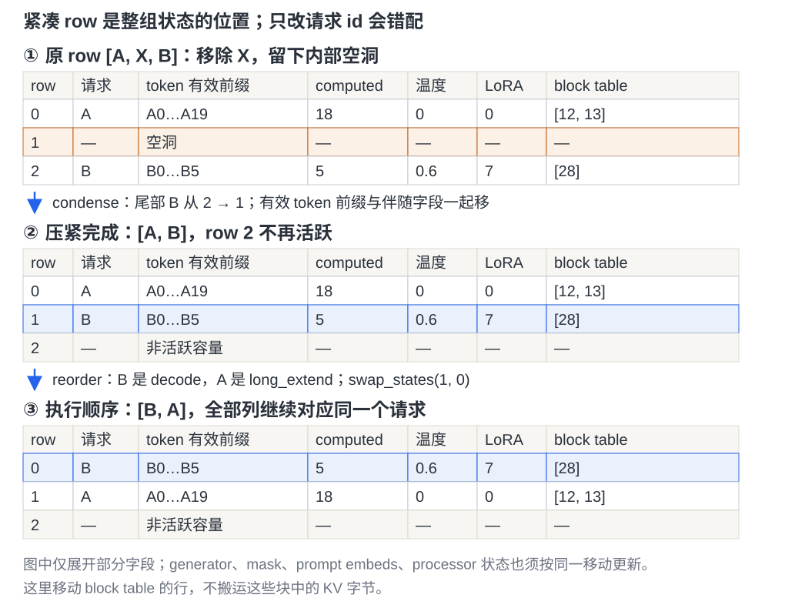
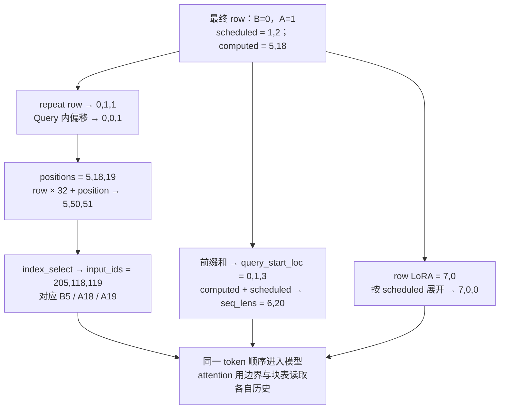
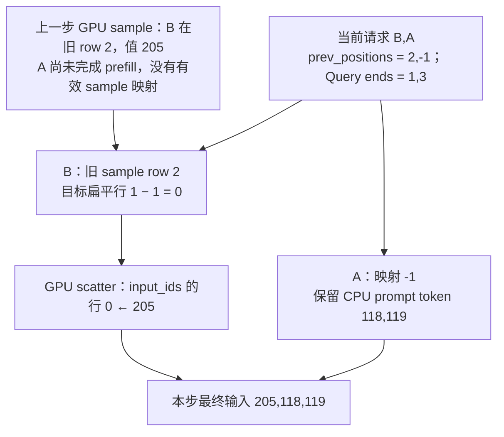

# vLLM Model Runner V1：请求挪了行，哪些输入必须一起挪

> **源码基线**：`vllm-project/vllm@199cb9b964822e59ab9b58d88e7be31eb419a2ae`（`main`，2026-09-07）
> **主题**：用删除一个请求的例子，解释 MRV1 如何压紧持久 batch、同步移动附属状态，再生成 token-major 输入并回传结果。
> **适用范围**：MRV1 请求镜像、row 维护、输入物化、异步依赖和 dummy/profile/capture 生命周期；不重做调度、物理块分配、attention 数值算法或采样分布。
> **最近更新**：2026-09-08。补充可重放的行迁移与索引例子、当前异步边界及 CoW 块复制接缝。

## 1. 删除一个请求，为什么不能只删列表里的名字

上一步 batch 的 row 顺序是 `[A, X, B]`。本步 X 不再运行，A、B 继续；如果只把名字改成 `[A, B]`，而 B 的 token history、block table、temperature 和 LoRA 仍留在 row 2，模型与 sampler 就会把 row 1 的旧内容当成 B。张量形状可能完全合法，结果却属于另一个请求。

MRV1 让**持久状态的 row 同时充当当步模型和采样输入的 row**。它利用相邻步骤请求集合高度重合，只更新加入、移除、进度和新增块，减少 Python 每步重建大张量；代价是活跃 row 必须紧凑，任何移动都要带走整组附属状态。这个出发点及其维护成本在官方 MRV2 设计文档中有明确说明，并非仅从类名推测。

用第 10 页的 A、B 继续演算：A 的 prompt 共 20 个 token，已计算 18 个，本步计算 A18、A19；B 的 prompt 有 5 个 token，已计算 5 个，本步计算上一步采样出的 B5。设 A 使用 greedy、无 LoRA，B 的温度为 0.6、LoRA id 为 7。它们的 KV 表有效部分分别是 `[12,13]`、`[28]`。这些数值都是教学输入。

在阈值为 1、要求 decode 在前的 backend 下，本步发生两次不同变换：

- **压紧**：移除 X 后 `[A, 空洞, B]`，把尾部 B 从 row 2 移到 row 1，得到 `[A, B]`。
- **重排**：B 是 decode，A 是 long extend，交换 row 0、1，得到 `[B, A]`。温度、LoRA、块表和 token 都必须随请求移动。

<!-- 图规格：真实 request-row × 字段二维布局，使用独立SVG。三幅纵向表依次显示移除X后的空洞、尾B填洞、B/A交换；列为row、请求、有效token前缀、computed、温度、LoRA、block table。箭头标2→1和swap(0,1)，蓝色强调B移动、橙色标空洞；图不表示KV字节搬运。 -->

图中“token 有效前缀”包含已存储但尚未计算的输入，所以 A 可以有 A0–A19 而 computed 只有 18。**存有 token ID 与已经生成该位置的 KV 是不同事实。** 图只显示部分字段，后面会把 generator、mask、processor 状态也接进同一次变换。

源码：`docs/design/model_runner_v2.md` 的 Persistent Batch、Removing Async Barrier、No Abuse of dummy_run；`vllm/v1/worker/gpu_input_batch.py::InputBatch.condense`、`InputBatch.swap_states`。

## 2. 哪些状态跟请求活，哪些跟当前 row 活

| 状态 | 保存什么 | 请求本步离开 batch 时 |
|---|---|---|
| `requests[req_id]` / `CachedRequestState` | prompt/output history、computed、各组 block ids、sampling/generator、媒体与位置、LoRA、prompt embeds、pooling 状态等 | 未完成时保留；真正 finished 才删除 |
| `InputBatch` | 连续活跃 row 上的 token、长度、块表、sampling 参数、LoRA 和请求到 row 的映射 | 移除 row；恢复时可以放到新 row |
| runner 固定执行 buffer | 本步 `input_ids`、positions、Query 边界、sequence lengths、request indices 等 | 内容覆盖，预分配地址继续供 eager/graph 使用 |
| 前一步异步快照 | GPU sampled tokens、上一轮有效请求到 row 的映射、CPU copy-ready event | 在下一步实际消费前保留，不能按当前 row 直接解释 |

这不是简单的“CPU 状态和 GPU 状态各一份”。`CachedRequestState` 以 request id 标识长期语义；`InputBatch` 以 row 对齐执行所需字段，且自身就有 CPU/GPU 张量。请求被 preempt 或暂时未调度后，原 row 可被覆盖，长期镜像仍用于恢复。

主线有四个约束：`req_id_to_index` 与活跃 row 的请求互相对应；输入物化前没有内部空洞；退出当步集合不等于请求结束；任何 row-local 状态都按同一变换更新。`remove_request()` 的接口明确要求后续调用 `condense()`，但它没有承诺每次移除都立刻压紧——新请求可能先填掉空洞，省去搬移。

普通 token history 在 CPU 按 `max_num_reqs × max_model_len` 预分配 int32，另有同形的 `is_token_ids` mask；这块 token tensor不直接整块传 GPU，因此不用 pinned memory。长上下文会让该存储过大，源码有明确 TODO。prompt embeddings 则按请求单独存储，避免再预分配同等长度的大 embedding 矩阵。

`CachedRequestState.get_token_id()` 对没有 token ID 的 prompt-embeds 位置会报错，不能凭空恢复 ID；混合输入靠 `prompt_is_token_ids/is_token_ids` 区分。在初始化和 row 搬移中还要考虑 M-RoPE/XD-RoPE、ReplaySSM ring origin、spec token 列表及 accepted-token count 等模式，不能把纯文本的两个长度当作全部状态。

源码：`vllm/v1/worker/gpu_input_batch.py::CachedRequestState`、`InputBatch.__init__`、`InputBatch.add_request`、`InputBatch.remove_request`；`vllm/v1/worker/gpu_model_runner.py::GPUModelRunner.__init__`。

## 3. 本步先改状态，再让所有消费者看到最终 row

### 3.1 `_update_states()` 的实际顺序

runner 消费 Scheduler 已批准的 `SchedulerOutput`，不重新决定本步让谁运行。它首先删除 finished 请求的长期镜像与 batch row；同一个 id 若同时 finished 又作为 new 提交，按结束旧请求、建立新请求处理。随后处理新缓存块清零、CoW 复制和 encoder cache 释放，再从 batch 移除未调度请求。

未调度集合包括 preempted、暂未排到以及必须重新进入恢复路径的请求。长期 `requests` 保留。继续运行的请求按 Scheduler 更新 computed、输出长度和新增 blocks；resume 时替换整份 block ids，而非在已失效的旧表后继续 append。异步 resume 还从 Scheduler 带来的 `all_token_ids` 恢复真实 output history。

新请求或恢复请求先构造/修正镜像，再加入最小空 row；剩余空洞才进入 `condense()`。backend 的 reorder 发生在其后，最后 `refresh_metadata()` 将最终变换应用到 sampling 与 logits processors。若有 ngram GPU 状态增量，也在 batch 稳定后更新。async spec 的接受数还可先按乐观值准备 GPU 输入，待本次 forward 发出后再补 CPU 修正，避免过早等待上一步。

| 请求事件 | 长期镜像怎么处理 | 当前 row 怎么处理 |
|---|---|---|
| new | 创建，按 seed 建立独立 generator（若要求） | 填最小空位，否则追加 |
| 继续运行 | 更新进度、输出长度与 block 增量 | 原 row 增量更新 |
| 本步未调度 / preempted | 保留 | 移除，之后填洞或压紧 |
| resume | 替换恢复后的 block ids，必要时恢复 output IDs | 重新加入，row 不保证与以前相同 |
| finished | 删除并触发相关清理 | 移除 |
| streaming update | 原对象更新，新 prompt 已吸收中间输出 | 先移除，再重新加入，避免同 id 占两行 |

streaming 的具体例子是：旧 prompt `[1,2,3]`，旧输出 `[10,11]`；Scheduler 提交的新完整 prompt 是 `[1,2,3,10,4,5]`、computed=4。runner 采用这份 prompt，而不是自行把两份列表拼起来；清空旧 `output_token_ids`，更新 sampling、block ids 和媒体信息，随后重新加入 batch。旧输出 11 没有出现在新 prompt，就不能偷偷补回去。已有 streaming 测试正是核对原对象复用、先移除以及输出列表清空这些行为。

源码：`vllm/v1/worker/gpu_model_runner.py::GPUModelRunner._update_states`、`GPUModelRunner._update_streaming_request`；`tests/v1/streaming_input/test_gpu_model_runner_streaming.py::test_e2e_streaming_request_update_basic_flow`。

### 3.2 新 CoW 接缝：续写私有块之前，旧内容要复制到位

本基线的 `SchedulerOutput.kv_cache_block_copies` 携带 `(src_block_id,dst_block_id)`。以部分前缀命中为例，Scheduler 已把请求尾块改指向私有 dst；worker 必须先把 src 的已有内容复制过去，之后才能向 dst 续写并读取完整历史。**仅换块号只改变地址，不能自动生成旧 KV。**

MRV1 在 `_update_states()` 中先将 `new_block_ids_to_zero` 对应存储清零，再调用 `copy_kv_cache_blocks_inplace()`，然后才准备输入和执行模型。不能把复制放在清零之前，也不能拖到本次 attention 后。该 helper 按 scheduler block 编号复制，折叠第 10 页的虚拟 kernel-block 拆分；共享同一个 KV view 的层只复制一次，适合整块存储的情况也按 underlying storage 去重。

Scheduler 一侧 `_apply_cow()` 暂保留 src 的 hit-ref，并给 dst 加一份超出请求自身持有的引用，保护收集 CoW 任务前的同一步调度期。Scheduler 取走复制任务时即处理这两份临时引用：未启用延期释放时立即归还；只有相应 KV consumer 与多 in-flight 配置启用 `defer_block_free` 时，才用执行该复制的 step fence 延后归还。runner 负责发出实际复制；引用如何保留、何时由调度侧释放由 [[08_vllm_kv_cache_management_analysis|KV Cache 管理]] 解释。这里不是新增长期 copy event 协议：复制及其后的模型操作依靠执行流顺序，不能把 helper 返回理解为一次 CPU 同步等待 GPU 完成。

源码：`vllm/v1/core/sched/output.py::SchedulerOutput`；`vllm/v1/worker/utils.py::copy_kv_cache_blocks_inplace`；`vllm/v1/core/single_type_kv_cache_manager.py::SingleTypeKVCacheManager._apply_cow`。

## 4. 怎样移动整行，而不是只移动名字

### 4.1 condense 与 reorder 各做一次什么变换

`condense()` 找最小内部空洞，再找末尾最后一个非空 row，将后者搬到前者；尾部连续空行不必填，最后截短请求列表。若所有空洞已被新加入者占用，直接返回；若活跃请求数为零，清空对应列表。它不保证维持原请求顺序，换来的好处是只搬必要的尾部请求，而非把空洞之后所有请求左移。

本例从 `[A, 空洞, B]` 变为 `[A, B]`，移动 `2→1`。以下字段要随 B 同行：有效 token prefix、`is_token_ids`、prompt embeds、prompt/总 token/computed 长度、ReplaySSM origin、spec token 与 accepted count、各组 block-table row、LoRA id、采样温度/top-p/top-k/penalties、allowed-token mask、bad words、generator，以及输出列表引用。按 req_id 保存的集合或字典不需要伪造 row 搬移，但按 row 保存的字典必须换 key。

reorder 不只是旧稿概括的 prefill/decode 二分。当前 helper 依据 scheduled token 数、是否有 context、是否已算完 prompt，将请求放入四区：**decode → short extend → long extend → first prefill**。阈值为 1 时，本例 B 属于 decode，A 属于 long extend，因此 `swap_states(0,1)` 得到 `[B,A]`。源码把误置 row 转成交换序列；不能推导同一区域内始终维持全局稳定顺序。

`swap_states()` 交换两份完整 row 状态，token 数组使用临时副本，避免 NumPy view 别名使一次交换覆盖另一侧；复制范围是两请求有效 token 数的较大者，包含 draft token，未按 `max_model_len` 搬整行。这里搬的是 **block table 行**，不是复制这些物理块里的 KV；真正的 CoW 复制是上一节的另一件事。

### 4.2 插件和 LoRA 怎样跟上同一次移动

logits processor 可能有自己的 row-local 状态，不能因 runner 张量已搬好就假定它也知道。`BatchUpdateBuilder` 记录 add/remove/move；本例会记录单向 `2→1` 和一次 `SWAP(0,1)`。`refresh_metadata()` 取出本步更新，让 thinking-budget state 和各 processor 的 `update_state()` 消费，再重建需要变化的 sampling metadata。

移除记录有顺序约束：先收集全部 removal，再读取排序后的空位；一旦读取过 removed 列表又新增 removal，builder 会抛错。这解释了为何不能随意把请求移除代码塞到 condense 或 add 之后。没有 batch 变更时可以省去重新生成 sampling metadata，必要的 token history 修补仍有自己的消费点。

LoRA 先按请求 row 维护 `request_lora_mapping`，随 condense/swap 移动。最终 `[B,A]` 的 request LoRA 为 `[7,0]`，按本步 token 数 `[1,2]` 展开得到 **token LoRA mapping `[7,0,0]`**；不使用 spec 时每请求取一个 logits，按采样候选数 `[1,1]` 得到 **prompt LoRA mapping `[7,0]`**。这里 `prompt_lora_mapping` 的名字指 sampled-token/logits 对应映射，并非完整 prompt 每个 token 的映射。`set_active_loras()` 随后激活相关 adapter 与 mapping；本页不重复 LoRA 权重加载算法。

源码：`vllm/v1/worker/gpu_input_batch.py::InputBatch.condense`、`InputBatch.swap_states`、`InputBatch.refresh_metadata`、`InputBatch.make_lora_inputs`；`vllm/v1/sample/logits_processor/state.py::BatchUpdateBuilder`；`vllm/v1/attention/backends/utils.py::reorder_batch_to_split_decodes_and_prefills`。

## 5. 最终 row 怎样变成三行模型输入

Scheduler 按请求提交本步 token 数，模型希望一次处理扁平 token 流。按请求逐个 forward 会失去跨请求 batching；让 Scheduler 直接拼设备 tensor 又会把固定 buffer 和设备布局细节推回调度层。MRV1 在完成所有 row 变换后做一次展开。

为便于算地址，设 CPU token-store 的 row stride，即教学 `max_model_len`，为 32；A 的 token ID 为 `100+position`，B 为 `200+position`。真实配置通常大得多，32 只用于验证下表：

| 量 | 本例结果 | 怎么得到 |
|---|---|---|
| 当前请求顺序 | `[B,A]` | condense 与 reorder 已完成 |
| 本步 token 数 | `[1,2]` | 按最终请求顺序读取 Scheduler 字典 |
| `req_indices` | `[0,1,1]` | 每个 row 重复它的本步 token 数 |
| Query 内偏移 | `[0,0,1]` | 每个请求从 0 重新计数 |
| `positions` | `[5,18,19]` | 对应请求的 computed 加 Query 内偏移 |
| CPU flattened token indices | `[5,50,51]` | `row×32+position`：5、32+18、32+19 |
| `input_ids` | `[205,118,119]` | 从 CPU token-store 按上述索引提取 |
| `query_start_loc` | `[0,1,3]` | 本步 token 数前缀和，首元素为 0 |
| `seq_lens` | `[6,20]` | computed 加本步 token 数 |
| `logits_indices` | `[0,2]` | 无 spec 时，每段 Query 的末行 |

<!-- 图规格：索引转换拓扑，不画二维storage。输入为稳定后的[B,A]和scheduled/computed，分别显示repeat、前缀和、row stride索引；输出为三个ids及attention边界，并把LoRA映射接到同一展开顺序。所有值由SVG配套教学replay计算并与正文断言比较。 -->

`_prepare_inputs()` 先提交 block table 的 H2D，让复制与随后 CPU 索引计算重叠。它用 `np.repeat` 和累积长度建立本例索引，再用 `torch.index_select` 将 CPU token history 抽到固定 input buffer。没有异步 GPU token 可复用时，直接把当前 input buffer 传到 GPU。Query 起点的 padding 填最终累积值，保持非递减；sequence-length padding 填 0。

当前 live path 还会把 request indices、Query offsets、scheduled counts 传到 GPU，由 GPU computed 值生成最终 positions/seq_lens，再计算 slot mapping。**CPU 算过 positions 不代表设备输入始终直接采用 CPU 的乐观结果**：async spec 下，前一步被拒绝的 draft 会先用有效接受数在 GPU 修正 computed。普通例子没有这项修正，两边恰好一致。

prompt-embeds 路径按同一索引取 `is_token_ids`，将实际 embedding 分段写入执行 buffer；不能把每个位置都当整数 token。M-RoPE/XD-RoPE 的 pinned 位置矩阵当前按每行复制，避免非连续切片触发 pageable 临时 buffer 而隐式同步；async spec 下还根据 GPU 与 CPU computed 的差值修正多维位置。

builder 随后消费同序的 Query 边界、seq lengths、块表和槽映射。第 10 页已演算它们怎样写入槽 453/210/211 并读取历史，本页不再重复 attention 算法。未完成的 chunked prefill 虽可走统一采样入口，其结果会通过 discard mask 丢弃；本例 A 恰好在本步算完 prompt，因而它的末行可产生有效下一 token。

源码：`vllm/v1/worker/gpu_model_runner.py::GPUModelRunner._prepare_inputs`、`GPUModelRunner._get_cumsum_and_arange`、`GPUModelRunner._prepare_input_ids`；`vllm/v1/worker/gpu_input_batch.py::InputBatch.make_lora_inputs`。

## 6. 异步执行：B 换了 row，上一步 GPU token 还放在旧 row

### 6.1 当前 row → 前一步有效采样 row → 当前 token 行

把同一例子切到 async 模式。上一步 `[A,X,B]` 中，A 只算到 prompt 位置 17，尚未完成 prefill；B 产生了 token ID 205，但它尚未经过 CPU round trip。上一步 GPU sampled tensor 仍按旧 row 存放，B 的结果在 row 2。CPU 的 B5 位置暂时是 `-1` placeholder。

`_bookkeeping_sync()` 在 async 分支保存 GPU sampled tensor，并建立 **仅含有效采样请求**的 `prev_req_id_to_index`；未完成 prefill 的 A 被排除。当前移除 X、压紧和交换后是 `[B,A]`，所以 `_compute_prev_positions()` 得到 **`prev_positions=[2,-1]`**。这里 `-1` 不只表示全新请求，也可表示像 A 一样上一步没有可复用采样结果的请求。

当前 cumulative Query ends 为 `[1,3]`。B 没有 draft，目标扁平输入行是 `1−1=0`；runner 把 `prev_sampled_token_ids[2,0]=205` scatter 到当前 `input_ids[0]`。A 不在旧映射中，保留 CPU 提供的 118、119。先复制混合 batch 的 CPU 基础输入，再覆盖公共 decode token，最终仍是 `[205,118,119]`。

<!-- 图规格：跨step索引拓扑。输入显示前一步B在row2的sample205、当前[B,A]的prev_positions=[2,-1]；分别标GPU scatter到扁平0和CPU填A两行，汇合为三token输入。负分支说明A没有可复用sample，不等于没有请求状态。 -->

若全部公共 decode 的旧 row 恰好等于当前扁平目标、且覆盖连续前缀，源码可用一次 slice copy 代替 scatter；仅“请求集合相同”不够。带 draft 时还要从每段末尾扣除 draft 长度，分别散写采样 token 与 draft suffix。PP 异步广播未完成时，读取 sampled tokens 前先等待该传输；这一等待也不是普遍的“所有 GPU 工作都先同步”。

### 6.2 两个 event 保护不同的东西

`prepare_inputs_event` 保护**被复用的 host 输入 buffer**。本步 CPU 改写 pinned 长度/索引等内存前，`synchronize_input_prep()` 等上一轮记录的事件，确保旧 H2D 已经不再读取它们；本步准备区结束时再记录事件，供下次 real 或 dummy 准备使用。只把 sampled tokens 留在 GPU，不能消除 CPU 覆写旧 H2D 源地址的竞态。

`async_copy_ready_event` 则保护**本步结果的 CPU 可见性**。copy stream 先等 default stream 的生产操作，然后非阻塞复制 tokens、logprobs 和诊断数据并记录完成事件。`AsyncGPUModelRunnerOutput` 持有 GPU tensor 引用直至复制完成；`get_output()` 等事件后才把 host 数据变成列表，清除无效请求的结果并处理 NaN/通信故障信息。输出还复制了 req_ids 与 req_id_to_index，避免下一轮 row 变化改写已返回结果的身份。可选 routed-experts 诊断的共享数据和 slot mapping 则先形成私有 GPU clone，防止下一步覆盖源 buffer 时，独立 copy stream 仍在读取它们。

如果下次 logits processor 确实需要 output history，`InputBatch.update_async_output_token_ids()` 在消费前等同一个结果事件，用真实 token 替换末尾 `-1`。它按旧请求映射定位，且处理 placeholder 数量与实际接受数不同、KV-load 失败导致 token 被丢弃的情况；不是每步都无条件同步整份输出。

因此 MRV1 async 的收益是缩短“sample → D2H → CPU 写回 → H2D”的依赖链，并尽量把等待推迟到消费者。代价是两套 row 映射、placeholder 和共享 host buffer 的 event 协议。新 buffer 若漏出保护区仍可能产生竞态，官方设计文档将此列为 MRV1 的维护成本。

源码：`vllm/v1/worker/gpu_model_runner.py::GPUModelRunner._compute_prev_positions`、`GPUModelRunner._prepare_input_ids`、`GPUModelRunner._bookkeeping_sync`、`GPUModelRunner.synchronize_input_prep`、`AsyncGPUModelRunnerOutput`；`vllm/v1/worker/gpu_input_batch.py::InputBatch.update_async_output_token_ids`。

## 7. forward 与 sample 分开，什么时候结果才算可交付

正常生成路径先在 `execute_model()` 的准备区更新状态、生成输入、决定 padding/执行模式并建立 attention metadata；随后用 `set_forward_context()` 绑定当步 metadata 和槽映射，再执行 model forward。此时 backend 和模型参数已初始化，变化的是本步输入。

最后一个 PP rank 对所需 hidden-state 行计算 logits，把 logits、SchedulerOutput、spec metadata、hidden states、connector 状态等存入 `ExecuteModelState`，返回 `None`。下一次 `sample_tokens(grammar_output)` 取出并清空这份临时状态，应用可选 grammar bitmask，执行 sampler，再推进 hybrid/spec 相关状态和结果 bookkeeping。**得到 logits 不等于已按本步约束选出 token。** 若上一份临时状态尚未被 sample 消费就再次 execute，会明确抛错。

同步路径返回已填好的 `ModelRunnerOutput`；async 路径返回上一节的延迟结果对象，CPU 列表到 `get_output()` 才就绪。涉及 draft forward 时，KV connector 的保存等待与 metadata 清理由 target 延迟到 draft 执行后完成，避免 target 结束就过早关闭本步保存上下文。

这条生成主线有明确旁路：没有 scheduled tokens 时先处理状态变化，再返回空结果或 connector-only 结果；特殊 DP/external-launcher 条件下仍做空 dummy forward 以保持跨 rank 协调。非末尾 PP rank 可返回 intermediate tensors，pooling 模型直接返回 pooling 结果，encoder-only transfer 路径也有专门输出。不能把 `execute_model()` 的所有调用都概括成“总返回 None”。

源码：`vllm/v1/worker/gpu_model_runner.py::GPUModelRunner.execute_model`、`GPUModelRunner.sample_tokens`、`ExecuteModelState`、`AsyncGPUModelRunnerOutput.get_output`。

## 8. dummy、profile、capture 为什么复用这些真实 buffer

profile 若另造一套过度简化的输入，可能漏掉 LoRA、mixed batch、attention workspace 或媒体编码峰值；graph capture 则还要求 replay 使用捕获时的地址。MRV1 因而预分配 input/position/length 等 buffer，并让 `_dummy_run()` 在同一套运行时上合成请求与 token 分段。

- **profile**：`profile_run()` 可先按多模态预算构造编码输入和 encoder cache，再以最大 token budget 调 dummy forward，末尾 rank 运行 dummy sampler 或 pooler，同步后清理临时输出与编码缓存。它是启动内存估计，不保证穷举所有真实 shape 峰值；当前媒体 profile 选最大输入 token 的单一模态。
- **warmup**：dummy 可指定 mixed 或 uniform decode，`force_attention` 在 eager warmup 也构造 metadata；`profile_seq_lens` 能模拟随 context 增长的 workspace，不能只用 Query 数替代历史长度。
- **capture**：`capture_model()` 消费已安排的 capture descriptors，按大 shape 到小 shape 使小 graph 复用内存池。每个 descriptor 先 eager warmup，等待包含辅助流的 warmup 工作完成，再调用 dummy 触发 capture；结束后关闭意外 capture 并锁定 workspace，防止运行期 resize。

`_dummy_run()` 支持 mixed、uniform、LoRA active count、microbatch、profile 与 graph mode 等输入；requested runtime mode 与 dispatcher 得出的模式不符会断言失败。dummy 没有真实 KV 写入槽，所以槽映射填 `-1`；共享 pinned buffer 的准备同样进入 `synchronize_input_prep()`，不能以为“没有真实请求”就可以绕过 async 保护。dummy 还提交已清理的 block-table 行，并为 full replay 重新准备捕获所读 metadata，避免沿用已结束请求的状态索引。当前 ubatched capture 还有 full graph、uniform decode 及阈值条件，不是所有 dummy 都拆 microbatch。

这套复用减少 real 与 capture 的地址/形状偏差，也让一个入口同时承担 profile、warmup、capture 和空 DP forward，分支组合多。新增线上输入时必须核对 dummy 能否形成对应条件；官方设计文档明确将路径漂移列为技术债。具体 graph descriptor、full/piecewise/eager 降级与编译策略仍由 [[19_vllm_compilation_cudagraph_analysis|编译与 CUDA Graph]] 展开。

源码：`vllm/v1/worker/gpu_model_runner.py::GPUModelRunner._dummy_run`、`GPUModelRunner.profile_run`、`GPUModelRunner.capture_model`、`GPUModelRunner._warmup_and_capture`、`GPUModelRunner._capture_cudagraphs`。

## 9. 当前 MRV1 的入口与实际代价

V1 Engine 和 Model Runner V1 是两个维度。`GPUWorker` 根据 `use_v2_model_runner` 选择 `vllm/v1/worker/gpu_model_runner.py` 中的 MRV1 或 `vllm/v1/worker/gpu/model_runner.py` 中的 MRV2；仅看到 `vllm/v1/` 路径不能判断 runner 代际。

`VLLM_USE_V2_MODEL_RUNNER=0` 可显式选择 MRV1；未设置时才走自动判断。当前在特定 ROCm architecture、缺少 Triton 或 MRV2 capability blocker 存在时选 MRV1，否则默认 MRV2。MRV1 仍是活跃兼容路径，但不是能力全集：PCP、DSpark、adaptive draft verification、mixed sliding/full DFlash、DFlash2、diffusion 和 batch-sharded sampling 等会被它的能力检查拒绝。另有 sampling-distribution replay、trace replay 的配置检查明确要求 MRV2。完整选择矩阵留在 [[12_vllm_model_runner_v2_analysis|Model Runner V2]]。

| 得到的收益 | 对应成本或失败位置 | 排查入口 |
|---|---|---|
| 持久 batch 只更新增量 | 相邻集合重合低时频繁进出和搬移，优化效果很差 | `_update_states` 的进出集合 |
| 连续 row 直接供执行与采样使用 | 漏搬一个附属字段就可能跨请求错配 | condense/swap 与 processor BatchUpdate |
| 请求暂离后能恢复 | 镜像与 row 两面需保持一致，resume blocks 必须替换 | `requests` 与 `InputBatch.req_id_to_index` |
| CPU token history 可随机索引 | 内存随最大请求数×最大长度增长，每步仍有索引计算和传输 | token-store 容量与 `_prepare_inputs` |
| GPU 复用上一步 sample | 旧 row、当前 row 与当前扁平 token 行是三种索引 | `prev_positions` 与 scatter target |
| 异步 H2D/D2H 与计算重叠 | host-buffer 重用和 CPU 结果消费分别需要等待边界 | 两种 event，勿互相替代 |
| profile/capture 与真实 buffer 共用 | 多义 dummy 的分支可能遗漏线上条件 | dummy 的 shape、LoRA、metadata 与 mode |

本次用教学演算及源码测试检查了这些变换的表达：已有测试覆盖移除后仍保留请求镜像、condense/swap 后 sampling state 与重建参考一致、streaming 原对象更新和 CoW 的布局/虚拟块复制。未运行 vLLM 的 GPU 或分布式测试，不将文档演算当成端到端正确性证明。

源码：`vllm/config/vllm.py::VllmConfig.use_v2_model_runner`、`VllmConfig._get_v1_model_runner_unsupported_features`、`VllmConfig._verify_sampling_replay_config`、`VllmConfig._verify_trace_replay_config`；`vllm/v1/worker/gpu_worker.py::Worker.init_device`。

## Related Pages

- [[02_engineering/03_infer_frameworks/vllm/02_vllm_architecture_overview_analysis|vLLM 架构概览]] —— 把本页输入物化与结果回传放回请求、资源和设备执行分层。
- [[02_engineering/03_infer_frameworks/vllm/07_vllm_scheduler_analysis|vLLM Scheduler]] —— 解释本页消费的 admission、preemption 与 SchedulerOutput 从何而来。
- [[02_engineering/03_infer_frameworks/vllm/08_vllm_kv_cache_management_analysis|vLLM KV Cache 管理]] —— 展开块表背后的分配、共享、CoW 引用保留与回收生命周期。
- [[02_engineering/03_infer_frameworks/vllm/10_vllm_attention_backends_analysis|vLLM Attention Backend]] —— 接续本页 token-major 输入，解释 metadata、地址转换与 attention 实际读取。
- [[02_engineering/03_infer_frameworks/vllm/12_vllm_model_runner_v2_analysis|Model Runner V2]] —— 对照稳定请求 row、逐步 gather 和 staged writes 怎样改变本页搬移与异步依赖。
- [[02_engineering/03_infer_frameworks/vllm/19_vllm_compilation_cudagraph_analysis|vLLM 编译与 CUDA Graph]] —— 展开 dummy/capture 接缝之上的全局编译与执行模式策略。
