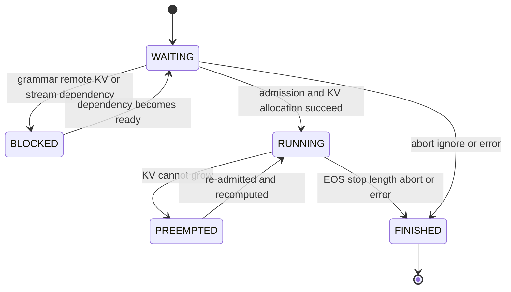
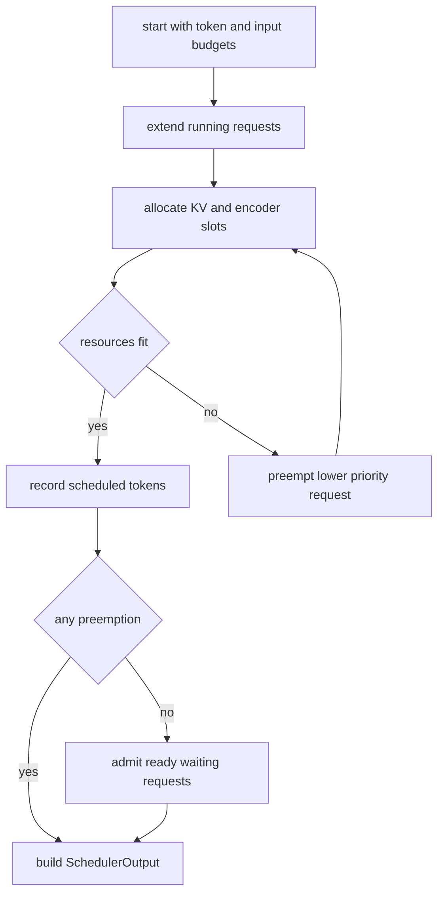

# vLLM Scheduler：每一步重新做 token admission

> **源码基线**：`vllm-project/vllm@d66300a1baa7779c68c7dfa4e51eee2502b48017`
> **中心命题**：Scheduler 不是把请求排个顺序，而是在每个 engine step 内同时分配 token 计算、KV slot、encoder cache 和外部依赖。continuous batching 与 chunked prefill 都是“请求每步只获得一笔 token 预算”的结果；抢占则是已承诺资源无法继续满足时的回滚协议。

## 一、为什么调度单位必须从 request 变成 token

请求级 scheduler 只能决定“这个请求进不进 batch”。但一个 prefill 可能需要几千 token，一个 decode 通常只需要一个 token，投机解码又可能需要多个 lookahead token。若把它们都当一个 request slot，算力和 step latency 完全不可比较。

vLLM 的 `SchedulerOutput` 核心字段是 `req_id -> num_scheduled_tokens`，并保存总 token 数；`vllm/v1/core/sched/output.py:207-223`。因此一次 admission 可写为：

$$
\sum_{r\in\mathcal B} n_r\le B_{\mathrm{token}},
\qquad
\lvert\mathcal B\rvert\le B_{\mathrm{seq}},
$$

其中 $n_r$ 是本轮给请求 $r$ 的 token 数。两条预算分别来自 `max_num_scheduled_tokens` 和 `max_num_running_reqs`；`vllm/v1/core/sched/scheduler.py:110-116`。

## 二、Scheduler 拥有的状态

`RequestStatus` 把 WAITING、RUNNING、PREEMPTED 与各种 FINISHED 状态放在一个有序 enum 中，`is_finished()` 用 `status > PREEMPTED` 判定终态；`vllm/v1/request.py:359-399`。Scheduler 同时持有：

- `requests`：request id 到对象的唯一映射；
- `running`：已经获得活跃资源的请求列表；
- `waiting`：按 FCFS/priority 排序的可准入队列；
- `skipped_waiting`：grammar、remote KV、stream input 等尚未就绪的等待请求；
- KV/encoder managers、connector 和 event publisher；`vllm/v1/core/sched/scheduler.py:69-191`。

核心不变量是：**一个未终止 request 只能由 Scheduler 的一个生命周期位置拥有；runner 可以保存设备镜像，但不能独立把请求改成 FINISHED。**

## 三、一步调度其实是一个多资源事务

`schedule()` 在每轮创建 token budget、输出映射和 preemption 列表，然后先遍历 running；`vllm/v1/core/sched/scheduler.py:477-526`。这不是简单的 running-first 偏好，而是资源所有权的结果：running request 已持有 KV，继续 decode 通常只增加少量 slot；让它们停下来而优先接纳新长 prefill，会浪费已驻留状态并恶化 TPOT。

### 3.1 `num_new_tokens` 是统一工作量

对每个 running request，目标进度与 `num_computed_tokens` 的差得到待算 token；再受 token/input budget、long-prefill threshold、model length、connector 与 speculative lookahead 限制。结果写入 `num_scheduled_tokens`，同时扣减全局 budget；关键循环见 `vllm/v1/core/sched/scheduler.py:526-700`。

chunked prefill 因而不需要一个独立“分块执行器”：当 prompt 剩余 token 大于请求本轮 budget 时，`num_new_tokens` 被截断，这一轮只为该 chunk 分配 KV。下轮同一 request 以新的 computed progress 继续竞争预算。

### 3.2 KV allocation 是 admission 的一部分

Scheduler 不能先把 request 加进 batch、再让 KV 层自行失败。它必须先请求 prefix hit/connector 状态，调用 `allocate_slots()`，只有拿到 blocks 才把 request 计入输出。KV manager 返回 `None` 表示容量事务失败，Scheduler 需要减小/延后请求或抢占其他 request。

这保证 `SchedulerOutput` 是可执行承诺：runner 不应收到一个没有完整 block mapping 的 token batch。块级不变量见 [[02_engineering/03_infer_frameworks/vllm/12_vllm_kv_cache_management_analysis|vLLM KV Cache 管理]]。

## 四、抢占为什么采用 recompute

当 running request 的 KV 无法继续增长，Scheduler 从 running 集合中选择 victim，释放其 KV，并把状态改为 PREEMPTED；`vllm/v1/core/sched/scheduler.py:1340-1370`。恢复时请求重新进入 admission，并从仍可命中的 prefix 或起点重算。

直观替代是把 KV swap 到 CPU，但它引入大规模双向传输、额外容量管理和恢复延迟；在线压力下 swap 可能把一次显存不足放大成 PCIe 拥塞。recompute 用重复 FLOPs 换取简单、确定的显存释放，尤其适合 decode 已计算 token 不多或 prefix cache 能保留公共前缀的情况。

代价也明确：长请求在高压力下反复抢占会产生 starvation 和重复计算。因此当前 admission 加入 `full_sequence_must_fit`、watermark、reserve 等闸门，尽量避免“先过度准入、随后立即抢占”的抖动；具体容量检查在 `vllm/v1/core/kv_cache_manager.py:456-530`。

本轮发生抢占后 Scheduler 不再纳入新的 waiting request；代码用 `if not preempted_reqs` 守住 waiting 阶段，见 `vllm/v1/core/sched/scheduler.py:749-752`。原因是当前资源已经不足，再纳新只会让刚释放的容量被新请求夺走，增加振荡。

## 五、waiting 不是一个简单 FIFO

可准入顺序由 FCFS 或 priority policy 决定，但“排在前面”不等于“本轮一定执行”。waiting request 还可能等待：

- structured-output grammar 编译；
- remote KV load/handshake；
- streaming input 的新 token；
- encoder input/cache；
- LoRA slot、KV slot 或完整序列 admission；
- DP prefill throttle。

blocked request 被放到 `skipped_waiting`，Scheduler 在两个队列间仍按 policy 比较，避免依赖未就绪的头部请求永久阻塞后续工作；blocked status 集合与队列选择见 `vllm/v1/core/sched/scheduler.py:2143-2166`。

这比“遇到第一个不能执行就 break”的队列更复杂，但解决了 head-of-line blocking。代价是公平性不再只由入队时间决定：外部 KV、grammar 和容量条件会改变实际 service order，priority workload 还可能饿死低优先级请求。

## 六、调度提交分成乐观阶段和真实阶段

为了让下一批 CPU 准备与当前 GPU 执行重叠，Scheduler 在 `_update_after_schedule()` 中先登记本轮 scheduled token 和 in-flight state；入口见 `vllm/v1/core/sched/scheduler.py:1383-1423`。这是一笔尚未完全兑现的承诺。

模型返回后，`update_from_output()` 才处理 sampled/accepted token、connector 完成、stop/error、finished request 和延迟释放；`vllm/v1/core/sched/scheduler.py:1737-1801`。若 speculative token 被拒绝，真实 computed progress 必须按接受数回落；若请求执行期间被 abort，输出也不能重新激活它。

由此得到两个不变量：

1. **optimistic progress 只能用于安排 in-flight 工作，不能直接成为可缓存/可释放的最终事实；**
2. **一次 output 必须与产生它的 `SchedulerOutput` 配对，不能按当前队列位置猜测请求映射。**

这也是 async scheduling 最难的部分：它优化的不是一个函数耗时，而是把单阶段状态机改成多笔未完成事务。

## 七、调度结束时怎样自证可执行

调度输出前会计算 `total_num_scheduled_tokens` 并断言不超过最大 token budget、剩余 budget 非负；`vllm/v1/core/sched/scheduler.py:1171-1175`。一份有效输出还必须满足：

- running request 数不超过 sequence budget；
- 每个 scheduled request 有一致的 KV/encoder allocation；
- new/resumed request 携带 runner 建立 row 所需的完整状态；
- cached/new/connector token 边界与本轮执行 token 一致；
- 被抢占或 finished 的 request 不再以活跃 row 消费输出。

`SchedulerOutput` 是控制面到设备面的 ABI，而不是日志结构。对它增加字段通常意味着 runner、PP/DP、connectors 和 async state 都需要重新审计。

## 八、为什么不采用几个直观方案

| 方案 | 为什么简单 | 为什么不适用 | 当前方案代价 |
|---|---|---|---|
| 请求级 FIFO batch | 顺序容易解释 | prefill/decode 工作量不可比，尾部气泡 | 每 step 调度有 CPU 成本 |
| prefill/decode 两套 scheduler | 策略各自独立 | 两套资源 owner 争 KV/算力，mixed batch 困难 | 统一 token budget 调优更复杂 |
| waiting 严格 head blocking | 公平性直观 | grammar/remote KV 未就绪会阻塞所有后续请求 | skipped queue 改变实际顺序 |
| KV 不足就拒绝当前请求 | 无 victim 选择 | running request 可能永远不能前进 | preemption 带来重算和抖动 |
| CPU swap KV | 避免重算 | PCIe/内存带宽和 swap 容量成为新瓶颈 | recompute 消耗重复 FLOPs |
| 输出前不乐观更新 | 状态最简单 | 无法准备下一 in-flight batch | optimistic commit 需要回滚协议 |

## 九、性能取舍与观测

| 调节项 | 直接作用 | 可能副作用 |
|---|---|---|
| 增大 token budget | 提高单步工作量和吞吐 | step latency、decode TPOT、峰值临时内存上升 |
| 增大 max sequences | 更多 decode 并发 | CPU/metadata、KV 压力和 graph shape 增加 |
| 减小 long prefill threshold | 降低长 prompt 对 decode 的阻塞 | TTFT 上升、prefill 分块更多 |
| priority policy | 保护高优请求 | 低优请求 starvation |
| full-sequence admission/watermark | 减少抢占振荡 | 容量利用更保守，waiting 增加 |
| async scheduling | 隐藏 CPU 调度与准备 | in-flight 状态、延迟释放和兼容边界更复杂 |

排障时至少同时观察 waiting/running 数、scheduled tokens、prefill/decode 构成、preemption、KV usage 与 step time。只看吞吐无法判断预算是过小，还是 KV/CPU/attention backend 在阻塞。

## 十、源码阅读顺序

1. `vllm/v1/request.py:59-125,359-399`：请求进度和状态机；
2. `vllm/v1/core/sched/output.py:207-290`：先确定控制面 ABI；
3. `vllm/v1/core/sched/scheduler.py:69-191,477-752`：running-first 与预算；
4. `vllm/v1/core/sched/scheduler.py:749-1175`：waiting admission；
5. `vllm/v1/core/sched/scheduler.py:1340-1423,1737-2049`：抢占、乐观提交与真实结果；
6. `tests/v1/core/test_scheduler.py`：用边界用例验证队列、remote KV、abort 和容量行为。

## Related Pages

- [[02_engineering/03_infer_frameworks/vllm/02_vllm_system_design_principles_analysis|vLLM 系统设计原则]] — token budget 与 TTFT/TPOT/吞吐的全局关系。
- [[02_engineering/03_infer_frameworks/vllm/10_vllm_engine_architecture_analysis|vLLM 引擎架构]] — Scheduler 为何由 EngineCore 唯一持有。
- [[02_engineering/03_infer_frameworks/vllm/12_vllm_kv_cache_management_analysis|vLLM KV Cache 管理]] — admission 的物理容量事务。
- [[02_engineering/03_infer_frameworks/vllm/15_vllm_model_runner_v2_analysis|vLLM Model Runner V2]] — SchedulerOutput 如何变成 persistent row 与异步输入。
- [[02_engineering/03_infer_frameworks/vllm/20_vllm_speculative_decoding_analysis|vLLM 投机解码]] — draft token 如何改变 lookahead 与真实提交。
- [[02_engineering/03_infer_frameworks/vllm/26_vllm_disaggregated_kv_serving_analysis|vLLM 分离式 KV Serving]] — remote KV 如何引入 blocked state 与 deferred free。
- [[02_engineering/03_infer_frameworks/vllm/27_vllm_observability_reliability_analysis|vLLM 可观测性与可靠性]] — scheduler stats 如何进入生产反馈闭环。
