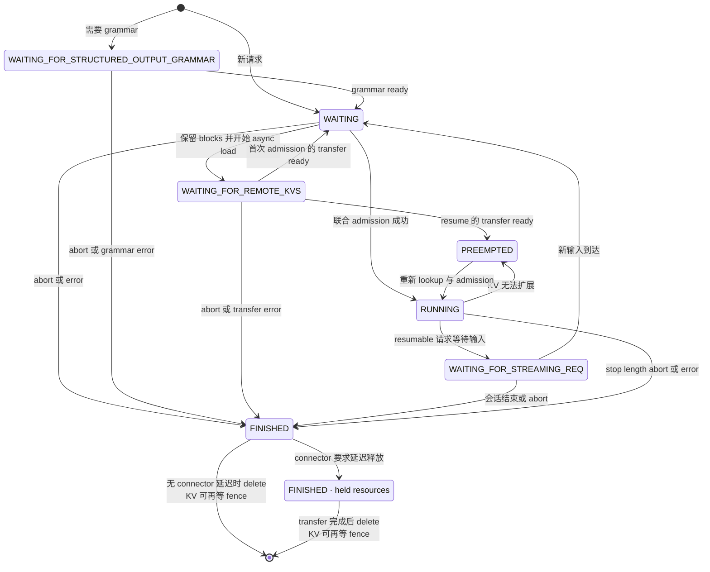
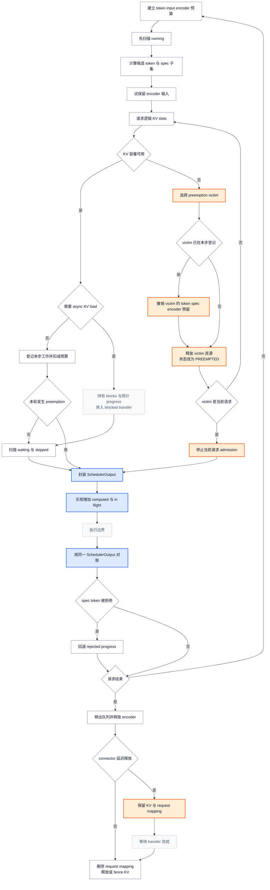

# vLLM Scheduler：多资源 admission 事务与输出提交

> **读者问题**：一次 `schedule()` 怎样同时承诺 request slot、token、encoder、speculative 与逻辑 KV 资源，并在结果回来后把“计划进度”修正为真实进度？
> **源码基线**：`vllm-project/vllm@6b110badbb22d3f66c7218b71138f13b7a6b3419`（`main`，提交时间 2026-08-29T02:40:53Z）
> **中心命题**：Scheduler 不是 batch 排序器，而是多资源 admission 事务的唯一提交者。它先在一个 step 内联合保留 request slot、token/input、encoder、speculative 与逻辑 KV 容量，形成可执行的 `SchedulerOutput`；再以这份 output 为事务凭据乐观推进进度，待执行结果返回后回退被拒 draft、处理 stale output，并在 preempt 或 finish 时释放所有权。
> **所有权边界**：本页拥有 waiting/running、token/encoder/spec 预算、preemption、finish 与 output-side commit；不解释物理 runner 的 persistent row、GPU tensor/graph、KV block/hash/refcount 算法、采样分布或跨实例 KV 协议。
> **最近更新**：2026-08-30。按 `6b110bad` 重建页面，旧基线定位符不再适用。

## 1. 背景：为什么“选几个请求”不足以描述调度

同一批请求的下一步工作并不同质：长 prompt 可能只执行一个 chunk，decode 通常追赶一个新 token，speculative decode 还会把 draft token 纳入验证；多模态请求则只有在 encoder 计算预算与 cache 都允许时才能越过对应输入位置。源码因此明确取消独立的“prefill phase / decoding phase”，统一把目标写成让每个请求的 `num_computed_tokens` 追上 `num_tokens_with_spec`（`vllm/v1/core/sched/scheduler.py:501-512`）。

**为什么不采用直观替代（分析推断）。** 更简单的做法是先按 FIFO 组成 request batch，再让 KV、encoder 或 runner 各自拒绝放不下的工作。问题是 batch 在被拒之前已经消耗了别的资源：token 预算可能已经记账，encoder cache 可能已经触碰，甚至本 step 较早选中的 victim 已写入计划。当前设计把这些决定收回 Scheduler，并要求 KV allocation 成功后才登记 scheduled work（`vllm/v1/core/sched/scheduler.py:655-728`）。

> [!note] 分析推断
> 源码自陈了统一 token-progress 模型，也展示了资源保留顺序，但没有把“事务”作为正式术语。本页用事务描述它，是因为代码同时存在预留、提交、同 step 回滚和最终释放；这是对行为的机制归纳，不是作者原话。

## 2. 先看状态与不变量，再看循环

### 2.1 Scheduler 拥有什么状态

| 状态 | 含义与 owner | 本页关心的边界 | 证据 |
|---|---|---|---|
| `requests` | Scheduler 内 request id 到 `Request` 的权威映射 | 未终止请求先进入映射，最终释放后才删除 | `vllm/v1/core/sched/scheduler.py:188-210`；`vllm/v1/core/sched/scheduler.py:2376-2402`；`vllm/v1/core/sched/scheduler.py:2496-2499` |
| `waiting` / `skipped_waiting` | 可尝试准入与因异步依赖或约束暂跳过的队列 | blocked status 不等于 finished；它仍归 Scheduler 管理 | `vllm/v1/core/sched/scheduler.py:197-214`；`vllm/v1/core/sched/scheduler.py:2213-2237` |
| `running` | 已取得活跃 request slot 与逻辑资源所有权的请求 | `RUNNING` 不保证每 step 都得到 token；encoder 预算不足时可以本轮不调度 | `vllm/v1/core/sched/scheduler.py:198-201`；`tests/v1/core/test_scheduler.py:277-337` |
| progress | `num_tokens_with_spec` 是已知 token 加 draft；`num_computed_tokens` 还包含未回收的乐观进度 | 两者的差是候选工作，不是最终接受量 | `vllm/v1/request.py:159-182`；`vllm/v1/request.py:287-297` |
| step reservations | `num_scheduled_tokens`、新 block、encoder input 与 scheduled spec token 的本轮映射 | 只有可立即执行的联合保留才进入 scheduled-token output；async KV load 是持有 blocks 但不执行的例外 | `vllm/v1/core/sched/scheduler.py:514-533`；`vllm/v1/core/sched/scheduler.py:1114-1145`；`vllm/v1/core/sched/output.py:218-250` |
| lifecycle deltas | `finished_req_ids` 与 `reset_preempted_req_ids` 通知下游清除旧镜像 | 集合在 output 中交接后换成新集合，不能原地清空 output 的引用 | `vllm/v1/core/sched/scheduler.py:203-210`；`vllm/v1/core/sched/scheduler.py:1479-1483` |

请求状态 enum 把三个 blocked waiting 状态、`RUNNING`、`PREEMPTED` 与终态分开；所有位于 `PREEMPTED` 之后的值都被 `is_finished()` 判为终态（`vllm/v1/request.py:364-391`）。图 1 表达的是 Scheduler 眼中的控制状态；`waiting` 与 `skipped_waiting` 是队列位置，不是额外的 `RequestStatus`，`FINISHED · held resources` 也只是资源驻留注记，不是另一个 enum 值。

### 2.2 五条承重不变量

1. **预算守恒**：step 结束时 scheduled token 总数不得超过上限，token/input budget 不得为负，running 数不得超过 request-slot 上限；源码在构造 output 前直接断言这些条件（`vllm/v1/core/sched/scheduler.py:1204-1216`）。
2. **先保留，后决定驻留形态**：普通同步可运行路径只有在 prefix 状态确定、KV slots 成功分配后才从队列弹出，转为 `RUNNING` 并写入 scheduled maps；allocation 返回 `None` 时会撤销 encoder manager 的临时触碰并停止继续准入。async KV load 是例外：allocation 成功后请求持有 blocks、记录预计 computed progress，却转入 `WAITING_FOR_REMOTE_KVS` 并回到 skipped queue，本 step 不进入 `running` 或 scheduled-token output（`vllm/v1/core/sched/scheduler.py:1037-1086`；`vllm/v1/core/sched/scheduler.py:1114-1171`）。
3. **scheduled 不等于 running**：`running` 表示跨 step 的资源/生命周期归属，`num_scheduled_tokens` 才表示本 step 真正执行的子集。encoder budget 测试明确保留三个 running request，却只调度其中两个（`tests/v1/core/test_scheduler.py:326-337`）。
4. **计划进度可以乐观，事实进度必须可回退**：`_update_after_schedule()` 先增加 computed 与 in-flight token，spec rejection 再按拒绝数回退 computed progress（`vllm/v1/core/sched/scheduler.py:1435-1455`；`vllm/v1/core/sched/scheduler.py:1886-1904`）。
5. **结果必须与产生它的计划配对**：output 更新按传入 `SchedulerOutput.num_scheduled_tokens` 遍历，并通过 runner 返回的 `req_id_to_index` 取对应结果；已 abort/finished 的 request 不会被迟到结果重新激活（`vllm/v1/core/sched/scheduler.py:1789-1801`；`vllm/v1/core/sched/scheduler.py:1848-1884`）。

## 3. 为什么是一笔多资源事务

图 2 把一次 step 分成三个阶段：admission 预留、计划提交、结果对账。灰色“执行边界”只是 Scheduler 的外部合同，本页不进入 runner 内部。

### 3.1 token、input 与 speculative accounting

每轮从 `max_num_scheduled_tokens` 建立 token budget，同时从 `max_num_batched_tokens` 建立 input budget；若启用 parallel drafting，每接纳一个请求还要预留 `max_num_new_slots_for_drafting`，所以 input budget 扣除的是本轮 token 加 draft slot，而不是只有 `num_new_tokens`（`vllm/v1/core/sched/scheduler.py:519-531`；`vllm/v1/core/sched/scheduler.py:721-728`）。

对 running request，候选工作量是 `num_tokens_with_spec + num_output_placeholders - num_computed_tokens`，随后依次受 long-prefill threshold、全局 token/input budget、model length、Mamba boundary 与 encoder 可执行边界裁剪（`vllm/v1/core/sched/scheduler.py:550-633`）。这就是 chunked prefill、decode 和 spec validation 共用一个循环的原因：它们只是“已知进度与已计算进度的差”在不同边界下被截断。

speculative token 不是一份脱离 token budget 的免费工作。Scheduler 只把当前 `spec_token_ids` 中落入已批准 token 区间的部分写进 `scheduled_spec_decode_tokens`，随后清空 request 上的旧 draft，等下一轮结果产生新 draft（`vllm/v1/core/sched/scheduler.py:731-747`）。prefill chunk 明确拒收 draft token；测试证明 80-token prompt 在 50-token budget 下第二轮只排剩余 30 个 prompt token，直到 prefill 完成后才排 `1 + 3` 个 decode/spec token（`tests/v1/core/test_scheduler.py:1582-1673`）。

### 3.2 encoder budget 是 token 区间的门，而不只是附加任务

`_try_schedule_encoder_inputs()` 同时返回要计算的 encoder input、被其边界裁剪后的 `num_new_tokens`、新 encoder budget 与外部加载项；输入只有未缓存、未由远端提供且 compute/cache 容量足够时才可调度（`vllm/v1/core/sched/scheduler.py:1587-1616`）。因此 encoder budget 耗尽时，请求可以只前进到多模态占位区间之前，而不是把 decoder token 先算过去。

这种局部裁剪也解释了为什么 `num_new_tokens == 0` 时 running 循环选择 `continue` 而不是 `break`：一个请求可能只是被 encoder、对齐或 lookahead 约束挡住，后面的请求仍可能可执行；源码明确承认这会放松严格 FCFS（`vllm/v1/core/sched/scheduler.py:635-653`）。代价是 service order 不再只由到达时间决定。

## 4. KV allocation 失败时，preemption 怎样回滚已做决定

running 阶段为当前请求调用 `allocate_slots()`；若返回 `None`，FCFS 从 running 尾部、priority policy 按最低优先级和到达时间选择 victim，并持续释放直到当前请求可分配或它自己成为最后一个 victim（`vllm/v1/core/sched/scheduler.py:655-719`）。KV block 的具体选择与回收算法属于 [[02_engineering/03_infer_frameworks/vllm/12_vllm_kv_cache_management_analysis|vLLM KV Cache 管理]]；本页只关心 allocation 的成功/失败合同。

真正体现“事务”的分支发生在 victim 已于本 step 更早被选中时：Scheduler 从 scheduled-running 集合和 `num_scheduled_tokens` 删除它，归还 token/input budget，删除新 block/spec 记录，并按已排 encoder input 数恢复 encoder compute budget（`vllm/v1/core/sched/scheduler.py:675-703`）。如果没有这一步，output 会同时携带“victim 本轮执行”与“victim 已被抢占”两个互相冲突的承诺。

`_preempt_request()` 随后释放 request blocks 与 encoder cache，把状态改为 `PREEMPTED`，把 computed progress 归零、清空 spec token，并把请求放回 waiting 队首；若存在 in-flight output，还会把它标为 stale，以便结果回来时不会再次修改已归零的计数（`vllm/v1/core/sched/scheduler.py:1392-1433`）。这不是 CPU swap：V1 设计文档明确说 swapped preemption 与 `--swap-space` 已移除，prefix caching 加 recompute 取代了它（`docs/design/metrics.md:503-534`）。

一次 preemption 发生后，本轮不再准入新 waiting request，而是直接封装当前计划（`vllm/v1/core/sched/scheduler.py:774-778`）。

> [!note] 分析推断
> 这道 guard 没有解释性注释。本页将它解释为“不要在刚通过 victim 回收容量的同一事务里再引入新 owner”，从而避免回收与新准入互相打架；这是从控制流重建的理由，不是源码自陈。

## 5. waiting admission：就绪、slot 与资源必须同时满足

只有本轮未发生 preemption 且 scheduler 未暂停时，才进入 waiting admission。request-slot 计数不仅包含 `running`，还包含等待 streaming input 但仍占 runner slot 的 session；达到 `max_num_running_reqs` 就停止接纳（`vllm/v1/core/sched/scheduler.py:775-785`）。

`WAITING_FOR_STRUCTURED_OUTPUT_GRAMMAR`、`WAITING_FOR_REMOTE_KVS` 与 `WAITING_FOR_STREAMING_REQ` 都驻留在 `skipped_waiting`。调度遍历时先尝试 promote；依赖仍未完成就移入本 step 的 skipped 队列并继续，因此一个 blocked request 不会把所有后续可执行请求永久挡住（`vllm/v1/core/sched/scheduler.py:787-815`；`vllm/v1/core/sched/scheduler.py:2213-2237`）。

对真正可准入的请求，Scheduler 先查询本地/外部已计算前缀，再计算 token 与 encoder 需求，最后一次性请求 KV slots。**普通同步可运行路径**只有在成功后才 `pop_request()`、追加到 `running`、写入 scheduled maps 并扣减预算（`vllm/v1/core/sched/scheduler.py:837-938`；`vllm/v1/core/sched/scheduler.py:1045-1077`；`vllm/v1/core/sched/scheduler.py:1147-1193`）。这条顺序保证 scheduled-token output 是可执行承诺，而不是需要下游补救的愿望清单。

**async KV held-reservation 例外**发生在同一次 KV allocation 已经成功、但 connector 要异步填充远端 KV 时。Scheduler 先把请求从当前 queue 弹出，再把状态改为 `WAITING_FOR_REMOTE_KVS`、把它放回 skipped queue、记录远端命中对应的 `num_computed_tokens` 并持有已分配 blocks；随后直接 `continue`，所以该请求既不进入 `running`，也不写 `num_scheduled_tokens` 或扣减本轮执行预算（`vllm/v1/core/sched/scheduler.py:1114-1145`）。这里的 allocation 是传输期间的容量保留，不是本 step 的执行承诺；transfer 完成后，请求才被 promote 为 `WAITING` 或 `PREEMPTED`，并重新参加 runnable admission（`vllm/v1/core/sched/scheduler.py:2803-2861`；`vllm/v1/core/sched/scheduler.py:2896-2905`）。

## 6. output-side commit：计划提交不等于结果提交

### 6.1 `SchedulerOutput` 是事务凭据

`SchedulerOutput` 同时携带 new/cached request delta、每请求 scheduled token、scheduled spec token、encoder input、preempted id 与 finished id；这些字段让下游按 request id 应用同一份计划，而不是根据当前队列位置猜测（`vllm/v1/core/sched/output.py:218-270`）。Scheduler 在返回前构造这份对象，然后调用 `_update_after_schedule()`（`vllm/v1/core/sched/scheduler.py:1322-1371`）。

这里发生第一次提交：每个请求的 `num_computed_tokens` 与 `num_in_flight_tokens` 立即加上 scheduled token。这是乐观进度，目的是允许下一次 schedule 在当前结果尚未返回时准备后续 prefill chunk；源码注释同时明确说，未来拒绝的 spec token 要在 `update_from_output()` 回调中调整（`vllm/v1/core/sched/scheduler.py:1435-1455`）。

`AsyncScheduler` 还为将返回的 sampled/spec token 增加 output placeholder，并记录下一次 decode 可调度 step；真实 token 返回时才扣减 placeholder，preemption 后的 stale output 不得再次扣减已经清零的 placeholder（`vllm/v1/core/sched/async_scheduler.py:19-49`；`vllm/v1/core/sched/async_scheduler.py:51-69`）。因此乐观提交换来 CPU/GPU overlap，也把单一状态机变成多笔 in-flight 事务。

### 6.2 结果返回后的真实对账

`update_from_output()` 首先按这份 `SchedulerOutput` 的 request 集合减少 in-flight token；若请求已 abort/finished，迟到结果直接忽略；若结果属于 preemption 前的 stale step，则遵循 deliver 或 drop 模式而不污染重置后的计数（`vllm/v1/core/sched/scheduler.py:1848-1879`）。async regression test 覆盖了“KV 压力下带 in-flight output 的 preemption”，要求 token 恰好交付一次、stale spec rejection 不破坏回滚计数且恢复后不重复采样位置（`tests/v1/core/test_async_scheduler.py:553-613`）。

对 speculative output，Scheduler 用“已排 draft 数减已接受 draft 数”得到 rejection 数，并从 computed progress 与 async placeholder 回退；对 encoder input，则等这一步确实执行后才检查并释放已越过的 cache 项（`vllm/v1/core/sched/scheduler.py:1886-1929`；`vllm/v1/core/sched/scheduler.py:2276-2307`）。这两条规则共同区分了“计划使用过”与“结果已成为事实”。

新 token 随后逐个追加并检查 EOS、stop token、model length 与 max tokens；触发 stop 时先确定 finish reason，再释放请求，最后从 running/waiting 队列移除（`vllm/v1/core/sched/scheduler.py:1942-2049`；`vllm/v1/core/sched/scheduler.py:2105-2111`；`vllm/v1/core/sched/utils.py:94-130`）。未完成的 partial prefill 不产生用户输出，代码对此有显式断言（`vllm/v1/core/sched/scheduler.py:2031-2103`）。

### 6.3 finish 是生命周期释放，不是只改一个 enum

外部 abort 也走 Scheduler 的 `finish_requests()`：它先从 running/waiting/skipped 队列批量移除有效请求，再设置 finished status 并调用统一释放路径（`vllm/v1/core/sched/scheduler.py:2404-2465`）。`_free_request()` 总会通知 connector、释放 encoder cache，并登记 `finished_req_ids`；只有 connector 不要求 delay 时，它才立刻调用 `_free_blocks()` 释放 request KV 并从 `requests` 映射删除（`vllm/v1/core/sched/scheduler.py:2467-2499`）。

若 connector 表明 transfer 仍引用这些 blocks，**物理 KV 释放与 request mapping 删除都会延迟**：request 已是 finished、也已退出 admission 队列，但仍以终态对象留在 `requests` 中并持有 blocks。worker-side connector 报告 receive/send 完成后，`_update_from_kv_xfer_finished()` 才调用 `_free_blocks()` 完成二者（`vllm/v1/core/sched/scheduler.py:2882-2909`）。此外，即使进入 `_free_request_blocks()`，in-flight GPU 写仍可能通过 fence 延迟 blocks 回池；这是 connector 延迟之后的另一层物理安全门（`vllm/v1/core/sched/scheduler.py:2509-2548`）。

因此“finished”有三个可观察面：它立即停止竞争 admission；它通过 `finished_req_ids` 通知下游清理镜像；request mapping 要等 connector 允许后才删除，而物理 blocks 回池还可能在 mapping 删除后继续等待 in-flight fence。无 connector delay 的测试会看到 abort 后 request 立即从映射与 waiting 队列消失，output stop 后 running 只留下未完成请求（`tests/v1/core/test_scheduler.py:125-145`；`tests/v1/core/test_scheduler.py:670-717`）。

## 7. 约束、代价与失败边界

| 约束或代价 | 直接后果 | 证据 |
|---|---|---|
| running-first 不是严格公平承诺 | 被局部约束挡住的请求会被跳过；priority workload 也可能改变服务顺序 | `vllm/v1/core/sched/scheduler.py:635-653`；`vllm/v1/core/sched/scheduler.py:2227-2237` |
| recompute 用重复计算换确定释放 | preempt 会把 computed progress 归零；恢复时重新做 prefix lookup 与 admission | `vllm/v1/core/sched/scheduler.py:1405-1433`；`tests/v1/core/test_scheduler.py:1109-1142` |
| async overlap 扩大 rollback 面 | abort、preempt、spec rejection 与 stale output 都可能跨多个未完成 step | `vllm/v1/request.py:159-179`；`tests/v1/core/test_async_scheduler.py:553-613` |
| encoder 与 spec 不是独立后处理 | 它们会裁剪 token 区间、消耗 input/cache 容量，并决定本 step 能否前进 | `vllm/v1/core/sched/scheduler.py:519-531`；`vllm/v1/core/sched/scheduler.py:611-633` |
| finish 的资源释放可能分阶段 | 生命周期已结束不代表 blocks 或 request mapping 已消失；connector 完成后才 delete，blocks 回池还必须尊重 in-flight fence | `vllm/v1/core/sched/scheduler.py:2467-2499`；`vllm/v1/core/sched/scheduler.py:2882-2909`；`vllm/v1/core/sched/scheduler.py:2509-2548` |

Scheduler 能保证的是“本轮计划在它拥有的逻辑资源视角下自洽”，而不是 GPU 一定无故障、采样一定满足某个分布，或某种 KV block 算法永不碎片化。物理 runner 如何把 delta 投射到 persistent row 属于 [[02_engineering/03_infer_frameworks/vllm/15_vllm_model_runner_v2_analysis|vLLM Model Runner V2]]；逻辑/物理 KV 内部正确性属于 KV owner 页；spec propose/verify 的分布正确性属于 speculative decoding owner 页。

## 8. 源码阅读路径

1. 先读 `Request` 的 progress 字段与 `RequestStatus`：`vllm/v1/request.py:159-182`、`vllm/v1/request.py:364-391`。
2. 再读 output ABI：`vllm/v1/core/sched/output.py:218-270`。
3. 按 running admission、waiting admission、assert/output 的顺序读 `schedule()`：`vllm/v1/core/sched/scheduler.py:501-775`、`vllm/v1/core/sched/scheduler.py:774-1216`、`vllm/v1/core/sched/scheduler.py:1228-1371`。
4. 最后连读 preempt、乐观推进、结果对账与 finish：`vllm/v1/core/sched/scheduler.py:1392-1483`、`vllm/v1/core/sched/scheduler.py:1789-2111`、`vllm/v1/core/sched/scheduler.py:2404-2522`。
5. 用 encoder、spec、async preemption 三组测试检查边界：`tests/v1/core/test_scheduler.py:277-337`、`tests/v1/core/test_scheduler.py:1329-1413`、`tests/v1/core/test_async_scheduler.py:553-613`。

## Related Pages

- [[02_engineering/03_infer_frameworks/vllm/03_vllm_architecture_overview_analysis|vLLM 架构概览]] — 把 Scheduler 放回资源控制层与完整请求生命周期中定位。
- [[02_engineering/03_infer_frameworks/vllm/10_vllm_engine_architecture_analysis|vLLM Engine 架构]] — 解释 EngineCore 怎样调用 Scheduler 并把计划交给 Executor。
- [[02_engineering/03_infer_frameworks/vllm/12_vllm_kv_cache_management_analysis|vLLM KV Cache 管理]] — 深入本页只当作 admission 成败合同的 block、prefix cache 与释放算法。
- [[02_engineering/03_infer_frameworks/vllm/15_vllm_model_runner_v2_analysis|vLLM Model Runner V2]] — 解释 `SchedulerOutput` 怎样更新 persistent row 并进入设备执行。
- [[02_engineering/03_infer_frameworks/vllm/20_vllm_speculative_decoding_analysis|vLLM 投机解码]] — 深入 draft、verify、accept 如何保持采样与 KV 正确。
- [[02_engineering/03_infer_frameworks/vllm/26_vllm_disaggregated_kv_serving_analysis|vLLM 分离式 KV Serving]] — 展开 blocked remote-KV 状态、connector 与延迟释放协议。
