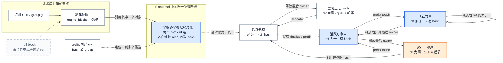

# vLLM KV Cache 管理：分页是单 Engine 的物理块所有权协议

> **读者问题**：一个请求的逻辑 token 位置怎样绑定到唯一物理 KV block；prefix 共享、hybrid layout 与本地 CPU offload 又怎样复用内容而不造成重复分配、越权写入或提前淘汰？
> **源码基线**：`vllm-project/vllm@6b110badbb22d3f66c7218b71138f13b7a6b3419`（冻结的 detached checkout，提交时间 2026-08-29T02:40:53Z）
> **中心命题**：单 Engine 内只有一份 GPU 物理容量真相：`BlockPool.blocks[block_id]`。请求的逻辑 block table、prefix hash、free queue 和 hybrid group 都只是指向这批对象的不同索引；`ref_cnt` 表示活跃所有权，hash 表示内容身份，二者正交。分配因此不是“拿到几个整数”，而是一段先回收安全旧块、再证明容量、最后建立引用并只提交 finalized 内容的所有权事务。
> **所有权边界**：本页拥有逻辑/物理 block、GPU prefix cache、hybrid KV layout、partial-hit copy-on-write、本地 native CPU offload 及 refcount/free/evict 不变量；Scheduler 的 request/token admission、preemption policy 属于 `11`，跨 Engine connector、producer/consumer、lease 与远端传输属于 `26`。
> **最近更新**：2026-08-30。按 `6b110bad` 重建；上一轮基线定位符与“只支持整物理块命中”的表述不再适用。

## 1. 背景：问题不是寻址，而是谁还能读、谁可以写

从所有权角度看（分析推断），请求长度与结束时间在在线生成前不可知；若把 KV 当成每请求独占的连续区间，增长、共享与回收会耦合到搬迁或最坏长度预留。当前实现把固定容量预建成 `KVCacheBlock` 对象，request/group manager 只维护“请求 id → 物理 block 引用序列”，完成时再按这份序列释放；对象字段只有稳定 `block_id`、活跃引用数、可选内容 hash 及 free-list 指针（`vllm/v1/core/kv_cache_utils.py:162-207`；`vllm/v1/core/single_type_kv_cache_manager.py:91-100`）。

**为什么不把分页理解成 kernel 的间接寻址（分析推断）。** block table 的确最终让设备按 id 访问 KV，但正确性先在 CPU 元数据层成立：同一 id 不能同时被两个不知情 owner 当作可写块；共享前缀仍被读取时不能回收；请求放弃引用后，内容可以继续作为 cache 驻留。kernel 只消费这个结果，不负责修复 refcount 或淘汰顺序。

先给出本页后续都依赖的五条不变量：

1. **身份唯一**：`block_id` 是 `BlockPool.blocks` 中对象的稳定索引；逻辑 block 是 `req_to_blocks[request_id]` 中的一个位置，不是第二份物理分配对象（`vllm/v1/core/block_pool.py:162-191`；`vllm/v1/core/single_type_kv_cache_manager.py:91-103`）。
2. **引用守恒**：新分配从 free queue 取出 `ref_cnt == 0` 的对象并增为 1；prefix hit 的 `touch()` 为每个新活跃引用增 1；`free_blocks()` 每释放一个 owner 才减 1（`vllm/v1/core/block_pool.py:647-677`；`vllm/v1/core/block_pool.py:702-747`）。
3. **可驱逐不等于无内容**：`ref_cnt == 0` 只表示没有活跃请求 owner。带 hash 的块仍可命中，同时位于 free queue 中等待淘汰；不带 hash 的块则优先复用（`vllm/v1/core/block_pool.py:33-51`；`vllm/v1/core/block_pool.py:731-747`）。
4. **可写要求私有且无 hash**：普通块只有在非 null、`ref_cnt == 1` 且没有内容 hash 时才可原地写；共享或已发布身份的尾块要先私有化（`vllm/v1/core/block_pool.py:719-721`）。
5. **失败前不建立新 owner**：容量预测完成且空闲数足够后，manager 才 touch 命中块并分配新块；最终进入 hash 的 token 还要排除可能回滚的 draft（`vllm/v1/core/kv_cache_manager.py:509-562`）。

## 2. 为什么选择“一池对象、两种身份”，而不是几份独立 cache

| 直观替代 | 会破坏什么 | 当前路线的代价 |
|---|---|---|
| request 各持有连续 KV 区 | 增长与释放要求连续容量，prefix 共享必须复制 | block table 与元数据间接层 |
| `hash → 独立 tensor` 的 prefix cache | 活跃引用与 cache 驻留成为两套容量账本，难以判断能否淘汰 | hash map、refcount 与 free queue 必须协调 |
| 每个 hybrid group 独立物理池 | 无法利用组间 overlay；一个组空闲时另一个组仍可能耗尽 | 所有 group 必须联合预测并共享 block id 空间 |
| 命中 partial tail 后原地续写 | 旧 hash 指向的内容被新请求修改，其他命中者读到错误 KV | copy-on-write 多占一个块并产生一次设备 copy |
| CPU offload 继续使用 GPU `block_id` 作为身份 | GPU id 可被快速复用，host copy 会被错误内容冒名 | offload 另建内容 key、host slot 与异步完成状态 |

> [!note] 分析推断
> 上表是从当前数据结构、guards 与回归测试重建的设计权衡，不声称这些方案都曾被作者逐项讨论。可验证的事实是：hash index 与 free queue 指向同一个 `KVCacheBlock`；hybrid group overlay 同一 backing allocation；partial hit 使用 copy-on-write；CPU offload 用内容 hash 加 group 建立独立 key（`vllm/v1/core/block_pool.py:33-51`；`vllm/v1/worker/utils.py:385-395`；`vllm/v1/core/single_type_kv_cache_manager.py:346-424`；`vllm/v1/kv_offload/base.py:23-41`）。

## 3. 物理块身份、引用与淘汰状态机

图中的上半部回答“逻辑位置指向谁”，下半部回答“同一个物理对象何时可写、可命中、可淘汰”。hash index 不拥有另一份 KV；它只是内容身份到同一物理对象的旁路索引。

### 3.1 hash 是内容身份，`ref_cnt` 是活跃所有权

内容 hash 链接父 prefix、当前 token 与 MM、LoRA、cache salt、prompt embedding 等额外语义键，因此它标识“到这个边界为止的语义内容”，不是某次请求的 owner id（`vllm/v1/core/kv_cache_utils.py:583-618`；`vllm/v1/core/kv_cache_utils.py:621-648`）。hash 再与 KV group id 组合，防止不同 group 把相同 token prefix 当成同一种物理状态（`vllm/v1/core/block_pool.py:198-223`）。

同一个 hash 可以临时映射到多个物理块。实现刻意不在 block 变满时改写已有 block table 去做去重，因为保持已分配 id 不变能让 block table append-only；代价是相同内容可能短时占用多块（`vllm/v1/core/block_pool.py:33-53`）。这正说明 hash identity 与 physical identity 不能合并。

### 3.2 free queue 同时是容量表和 eviction order

free queue 使用侵入式双向链表，使 prefix hit 能在 O(1) 从队列中间移除一个 `ref_cnt == 0` 的命中块；队列初始按 id 排列，之后按最近使用与链尾优先级维护淘汰次序（`vllm/v1/core/kv_cache_utils.py:229-245`；`vllm/v1/core/kv_cache_utils.py:351-369`）。最后一个 owner 释放时，无 hash 块放到队首以便立即复用，有 hash 块放到队尾保留为 LRU cache；真正重新分配带 hash 的对象时才移除所有指向它的 hash 并清空 identity（`vllm/v1/core/block_pool.py:571-590`；`vllm/v1/core/block_pool.py:679-700`；`vllm/v1/core/block_pool.py:723-747`）。

回归测试把这些规则当作正确性合同：共享 prefix 把三个公共块的 refcount 提升到 2；两个请求都释放后，无 hash tail 排在队首，公共 hashed blocks 排在队尾；容量耗尽时分配顺序正好验证淘汰顺序（`tests/v1/core/test_prefix_caching.py:279-345`）。

## 4. `allocate_slots()` 的事务边界：先安全回收，再计划，再建立 owner

这里的“事务”不是通用数据库事务，也没有任意异常下的 rollback。它是一个更窄的所有权提交边界：**在容量不足的正常失败路径上，不得 touch 新 prefix owner，也不得取出新物理块；但已经证明不再被 attention 读取的旧块可以先回收，并在返回 `None` 后保持回收结果。**

### 4.1 阶段一：只回收已安全越过的旧窗口

manager 先按 `total_computed_tokens - request.num_in_flight_tokens` 调用各 group 的 `remove_skipped_blocks()`。扣掉 in-flight tokens 是因为乐观进度可能仍被正在执行的 attention 读取，也可能因 speculative rejection 回退；被移除的逻辑位置会换成 null block，真实对象才按 refcount 释放（`vllm/v1/core/kv_cache_manager.py:489-507`；`vllm/v1/core/single_type_kv_cache_manager.py:599-663`）。

这一步发生在最终容量检查之前，所以“分配失败完全无副作用”是错误心智模型。保留下来的副作用只有经 attention 语义证明安全的 reclamation，而不是半建立的新 owner。

### 4.2 阶段二：跨 group 预测总需求，失败就停在 mutation fence 前

coordinator 对每个 single-type manager 求本次还需多少块并求和；预测考虑现有 request blocks、local hits、各 group block size 和可回收窗口，但不在此时改变 refcount（`vllm/v1/core/kv_cache_coordinator.py:160-220`；`vllm/v1/core/single_type_kv_cache_manager.py:142-210`）。`KVCacheManager` 将总需求与当前 free blocks 比较，不足直接返回 `None`；watermark、reserved blocks 和 full-sequence admission 是调用者的策略门，本页不展开（`vllm/v1/core/kv_cache_manager.py:462-487`；`vllm/v1/core/kv_cache_manager.py:509-526`）。

### 4.3 阶段三：先保护全部命中，再分配，最后发布 hash

容量通过后，多 group 路径先对**所有 group** 的 local-hit blocks 执行 `touch()`，再为还缺的 computed slots 分配对象；这个两阶段顺序防止较早 group 从 free queue 取走较晚 group 尚未 touch 的命中块（`vllm/v1/core/kv_cache_coordinator.py:222-266`）。回归测试直接断言跨 group 的所有 block id 唯一，且 request 引用的每个非 null block 都有正 refcount（`tests/v1/core/test_prefix_caching.py:3682-3748`）。外部 computed slots 的来源与跨 Engine 完成协议属于 `26`；本页只拥有它们进入本地池时不能破坏已有 owner 的不变量。

随后各 manager 才扩展 `req_to_blocks`。prefix cache 的发布更晚：`num_tokens_to_cache` 被截到 `request.num_tokens`，排除可能被拒绝的 draft；多模块 speculative 路径还会额外扣除可重新 prefill 的尾部（`vllm/v1/core/kv_cache_manager.py:541-564`；`vllm/v1/core/kv_cache_coordinator.py:303-323`）。因此 slot reservation 可以领先于事实，content identity 不可以。

## 5. Prefix cache：整 hash 单元、partial group block 与 copy-on-write

### 5.1 命中必须保留一次真实计算

即使整个 prompt 的 KV 都存在，本轮仍需要模型产生 logits；manager 把最大 cache hit 限制为 `request.num_tokens - 1`。若没有 fine-grained hybrid hit，返回长度还必须按 scheduler block 对齐，所以可能重算的不只最后一个 token（`vllm/v1/core/kv_cache_manager.py:245-263`；`vllm/v1/core/kv_cache_coordinator.py:654-662`）。prefix cache 复用 attention state，不缓存“下一 token 分布”。

### 5.2 “partial”是相对 group block，不是任意 token 边界

request hashes 只在完整 `hash_block_size` 单元上产生，并链式覆盖完整 prefix；当 hybrid group 的真实 block size 是 hash 粒度的倍数时，一个完整 hash 单元可以结束在物理 group block 内部（`vllm/v1/core/kv_cache_utils.py:739-794`）。`cache_partial_block()` 正是在这种边界给**已有物理块**增加旁路 hash，不复制 KV；eviction、reset 或 partial-to-full promotion 必须移除所有指向该对象的 keys（`vllm/v1/core/block_pool.py:445-544`）。

> [!warning] 源码注释与 live behavior 冲突
> `get_computed_blocks()` 的 docstring 仍写着 computed blocks “must be full”（`vllm/v1/core/kv_cache_manager.py:228-243`），但 live code 明确支持 group block 内的 partial hash entry，测试也得到 6-token hit 落在 4-token group block 中并要求 copy-on-write（`tests/v1/core/prefix_cache/test_partial_prefix_cache_hits.py:1143-1214`）。本页按实现与测试解释为：命中边界必须是完整 **hash 单元**，不必是完整 **group 物理块**。

### 5.3 继续生成前必须私有化 partial tail

命中 partial tail 的新请求先 `touch()` 共享源块；需要继续写时，manager 预留新块，把逻辑槽改指向 CoW 目标，并额外 pin 复制两端。复制完成前 source 与 destination 都不能返回 free queue（`vllm/v1/core/single_type_kv_cache_manager.py:230-287`；`vllm/v1/core/single_type_kv_cache_manager.py:329-424`）。`take_kv_cache_block_copies()` 把设备 copy 与 retained endpoints 一起交出，释放方必须等 copy step 完成后再 decref（`vllm/v1/core/kv_cache_manager.py:826-841`；`tests/v1/core/prefix_cache/test_partial_prefix_cache_hits.py:1372-1458`）。

这笔 copy 是 partial reuse 的成本，却守住两件事：旧 hash 继续指向不可变内容，新请求获得 `ref_cnt == 1` 且无 hash 的可写目标。

## 6. Hybrid KV layout：不同时间语义，共用一套物理 block id

hybrid 模型的 full attention、sliding/local attention、Mamba 或 hidden-state cache 对“需要保留多少历史”和“一个 block 覆盖多少 token”有不同答案。当前实现没有给每类 state 一块互不相干的显存：所有 `KVCacheTensor` view 放在同一 backing allocation，cache groups 可以 alias 同一字节范围；这样做之所以安全，正因为一个 block id 在任一时刻只能由一个 group 拥有（`vllm/v1/worker/utils.py:385-395`；`vllm/v1/kv_cache_interface.py:1120-1124`）。

### 6.1 物理 layout 先让 page 可表达

planner 尽量保留每层 cache 语义，同时把 page size 统一到可共享的物理粒度：小 page 可通过增大 block size 对齐；Mamba state 或不能整除的非 MLA attention 可 padding；无法表达的 MLA 组合会进入受限 full-allocation fallback 或报错（`vllm/v1/core/kv_cache_utils.py:1082-1144`；`vllm/v1/core/kv_cache_utils.py:1522-1553`）。混合 page size 还要求 block-compact layout，多个 group 时 layer 维必须位于 block 维之内，否则初始化直接拒绝（`vllm/v1/core/kv_cache_utils.py:1320-1351`）。

统一并非免费：padding 浪费容量；把 local attention 提升成 full-allocation fallback 会保留窗口外 KV，虽然 attention compute 语义不变（`vllm/v1/core/kv_cache_utils.py:1447-1519`）。

### 6.2 逻辑命中必须收敛到共同可执行边界

每个 group 仍有自己的 manager 和 block size，但它们共享一个 `BlockPool`；scheduler granularity 必须同时是 hash size 与各 group block size 的倍数（`vllm/v1/core/kv_cache_coordinator.py:64-104`；`vllm/v1/core/kv_cache_coordinator.py:136-150`）。Hybrid coordinator 按相同 spec 批量查询，再用单调递减的 fixed-point 过程让所有 attention type 接受同一 hit length；某组声称更长并不能让请求越过另一组缺失状态的边界（`vllm/v1/core/kv_cache_coordinator.py:664-708`；`vllm/v1/core/kv_cache_coordinator.py:757-889`）。

fine-grained hit 只在存在 Mamba align group 且所有相关 manager 都支持时开启；否则回退 scheduler-block 对齐。PCP 当前直接拒绝 hybrid attention，DCP hybrid 只接受 full-attention/Mamba 组合（`vllm/v1/core/kv_cache_coordinator.py:595-652`）。这些 guards 的目标不是类型整洁，而是禁止“token 边界对某组有效、对另一组无状态”的伪命中。

## 7. 本地 CPU offload：复制内容，不转移 GPU block 身份

本地 native offload 扩大的是**可复用内容容量**，不是 `BlockPool` 的 GPU block 数。顶层 `kv_offloading_size` 会在 native backend 下选择 `OffloadingConnector`，只有显式环境开关才走 `SimpleCPUOffloadConnector`；本节分析当前默认的前者及其 CPU tier（`vllm/config/vllm.py:939-963`）。跨实例 P/D、remote tier、lease 与网络完成属于 `26`。

### 7.1 GPU 与 CPU 各自有独立 owner namespace

GPU 侧仍以 `block_id` 表示当前物理槽；CPU 侧以 `OffloadKey = block_hash + group_idx` 表示内容，再由 `CPUOffloadingManager` 映射到自己的 host `BlockStatus.block_id`。由此（分析推断），GPU id 被 evict/reuse 不会改写 host 内容身份（`vllm/v1/kv_offload/base.py:23-41`；`vllm/v1/kv_offload/cpu/manager.py:75-104`）。worker 只接收两边 slot 的 copy spec；scheduler-side manager 拥有 host residency、refcount 与 eviction，worker-side 对象只执行异步 GPU↔CPU copy（`vllm/v1/kv_offload/base.py:397-440`；`vllm/v1/kv_offload/base.py:543-558`）。

### 7.2 store 的可见性在 copy 完成后提交

`prepare_store()` 先过滤已有 key、证明有足够 free/evictable host blocks、保护本次输入 key 不被当作 victim，再分配 host slots；新条目此时是 write-pending，lookup 返回 `HIT_PENDING`。只有 `complete_store(success=True)` 才把它们标为 ready/evictable并发布 stored event；失败则删除 key 并归还 slot（`vllm/v1/kv_offload/cpu/manager.py:124-130`；`vllm/v1/kv_offload/cpu/manager.py:169-267`）。测试覆盖了 pending 不可读、完成后命中、失败 store 不覆盖已存在 key，以及 removed event 先于复用该容量的 stored event（`tests/v1/kv_offload/cpu/test_manager.py:147-213`；`tests/v1/kv_offload/cpu/test_manager.py:368-481`）。

### 7.3 load 用临时 ref pin 住 host 内容

`prepare_load()` 要求 key 已 ready；当 refcount 从 0 变 1 时把 host block 从 evictable policy 中移出，多个并发 load 继续累加 ref。`complete_load()` 逐一归还引用，只有最后一个读者结束才重新进入可淘汰集合（`vllm/v1/kv_offload/cpu/manager.py:133-166`）。回归测试验证了双并发 load 只把 evictable count 减一次，第一次完成仍不可淘汰，第二次完成才恢复（`tests/v1/kv_offload/cpu/test_manager.py:968-1007`）。

这与 GPU pool 是同一条设计原则的两次实现：**异步读写期间容量必须被 pin；完成回调是 residency 可见性与可淘汰性的提交点。** 两个 tier 的 refcount 数值彼此独立，不能相互替代。

## 8. 约束、失败边界与阅读顺序

| 边界 | 正确语义 | 证据 |
|---|---|---|
| GPU free blocks 不足 | `allocate_slots()` 返回 `None`；如何 preempt 或延后由 Scheduler 决定 | `vllm/v1/core/kv_cache_manager.py:520-526`；[[02_engineering/03_infer_frameworks/vllm/11_vllm_scheduler_analysis|Scheduler admission 事务]] |
| cached block 仍活跃 | 可移除 hash identity，但 `ref_cnt > 0` 的物理对象不会因此回到 free queue | `vllm/v1/core/block_pool.py:749-766` |
| prefix reset 时仍有 owner | reset 返回 `False`，不强行清空活跃对象的内容身份 | `vllm/v1/core/block_pool.py:768-802` |
| hybrid page/layout 不可表达 | padding、受限 full-allocation fallback，或初始化失败 | `vllm/v1/core/kv_cache_utils.py:1082-1144`；`vllm/v1/core/kv_cache_utils.py:1320-1351` |
| partial CoW copy 尚未完成 | source/destination 继续持有额外引用，不能立即复用 | `vllm/v1/core/single_type_kv_cache_manager.py:404-424`；`vllm/v1/core/kv_cache_manager.py:826-841` |
| CPU store/load 尚未完成 | write-pending 不可读；load-pinned 不可淘汰；失败 store 删除未提交条目 | `vllm/v1/kv_offload/cpu/manager.py:124-166`；`vllm/v1/kv_offload/cpu/manager.py:244-267` |
| CPU offload 平台不支持 | native CPU worker 当前只接受 CUDA-like 与 XPU | `vllm/v1/kv_offload/cpu/spec.py:181-188` |

建议按所有权层次读源码，而不是按调用文件顺序扫完：

1. `vllm/v1/core/kv_cache_utils.py:162-245`：物理对象字段与 free queue 语义；
2. `vllm/v1/core/block_pool.py:143-223,647-802`：identity、refcount、free/evict；
3. `vllm/v1/core/single_type_kv_cache_manager.py:91-210,230-526`：逻辑位置怎样获得、共享、私有化与释放物理对象；
4. `vllm/v1/core/kv_cache_manager.py:343-564` 与 `vllm/v1/core/kv_cache_coordinator.py:160-323`：一次 allocation 的 mutation fence；
5. `vllm/v1/core/kv_cache_utils.py:1082-1144,1320-1444` 与 `vllm/v1/core/kv_cache_coordinator.py:560-889`：hybrid 物理 layout 与共同 hit boundary；
6. `vllm/v1/kv_offload/base.py:23-186`、`vllm/v1/kv_offload/cpu/manager.py:30-267`：本地 host tier 的独立 identity 与完成协议。

## Related Pages

- [[02_engineering/03_infer_frameworks/vllm/11_vllm_scheduler_analysis|vLLM Scheduler]] —— 展开本页刻意排除的 request/token admission、preemption 与 allocation 失败处理策略。
- [[02_engineering/03_infer_frameworks/vllm/14_vllm_attention_backends_analysis|vLLM Attention Backend]] —— 解释 backend 怎样消费本页已经提交的 block table 与物理 layout。
- [[02_engineering/03_infer_frameworks/vllm/15_vllm_model_runner_v2_analysis|vLLM Model Runner V2]] —— 解释逻辑 block delta 怎样镜像到 persistent device row 并执行 CoW copy。
- [[02_engineering/03_infer_frameworks/vllm/20_vllm_speculative_decoding_analysis|vLLM 投机解码]] —— 展开 lookahead slot、draft rejection 与 finalized KV 提交边界。
- [[02_engineering/03_infer_frameworks/vllm/26_vllm_disaggregated_kv_serving_analysis|vLLM 分离式 KV Serving]] —— 拥有跨 Engine connector、producer/consumer、lease 与远端完成协议。
- [[02_engineering/03_infer_frameworks/vllm/27_vllm_observability_reliability_analysis|vLLM 可观测性与可靠性]] —— 解释 prefix hit、eviction、GPU/CPU usage 与 allocation failure 如何成为生产信号。
