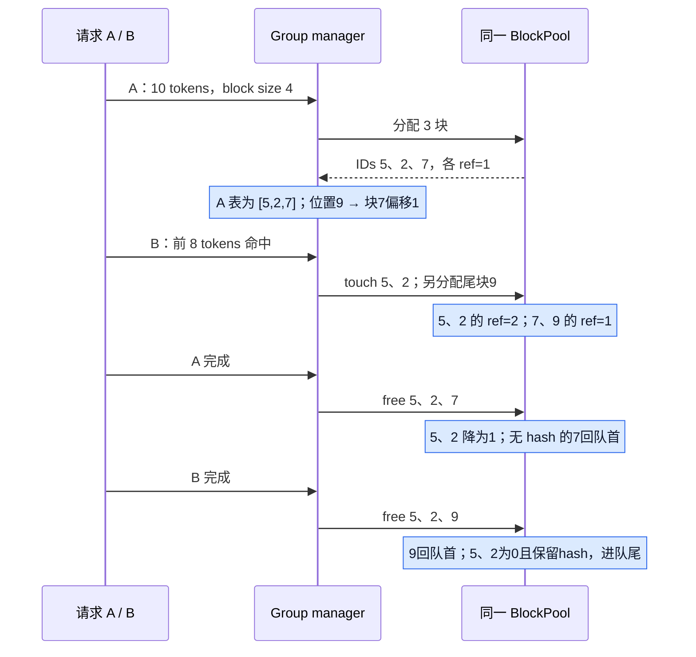
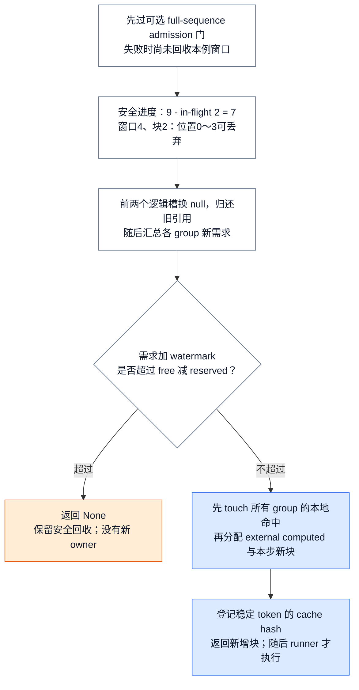
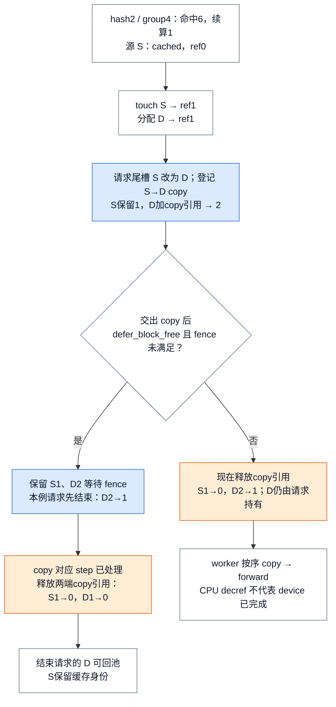
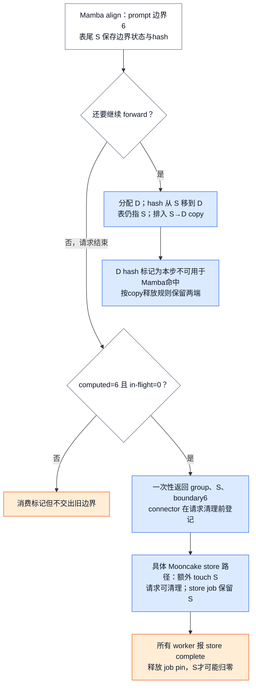
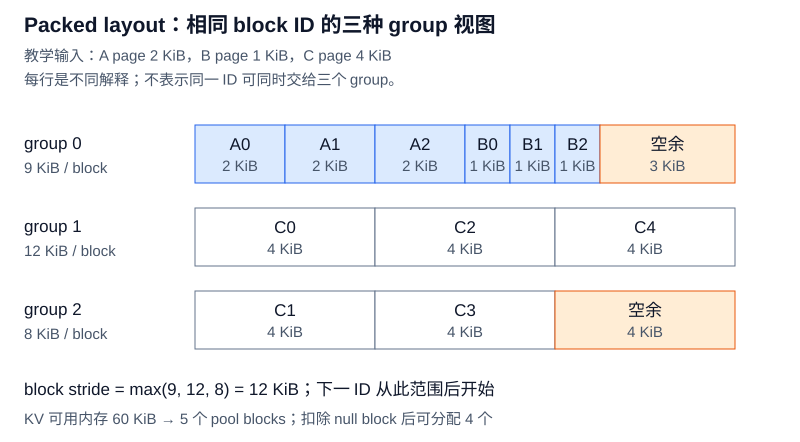
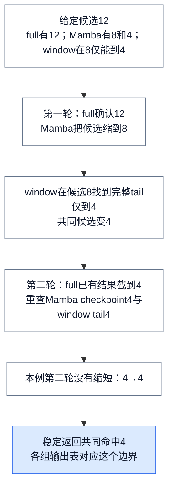
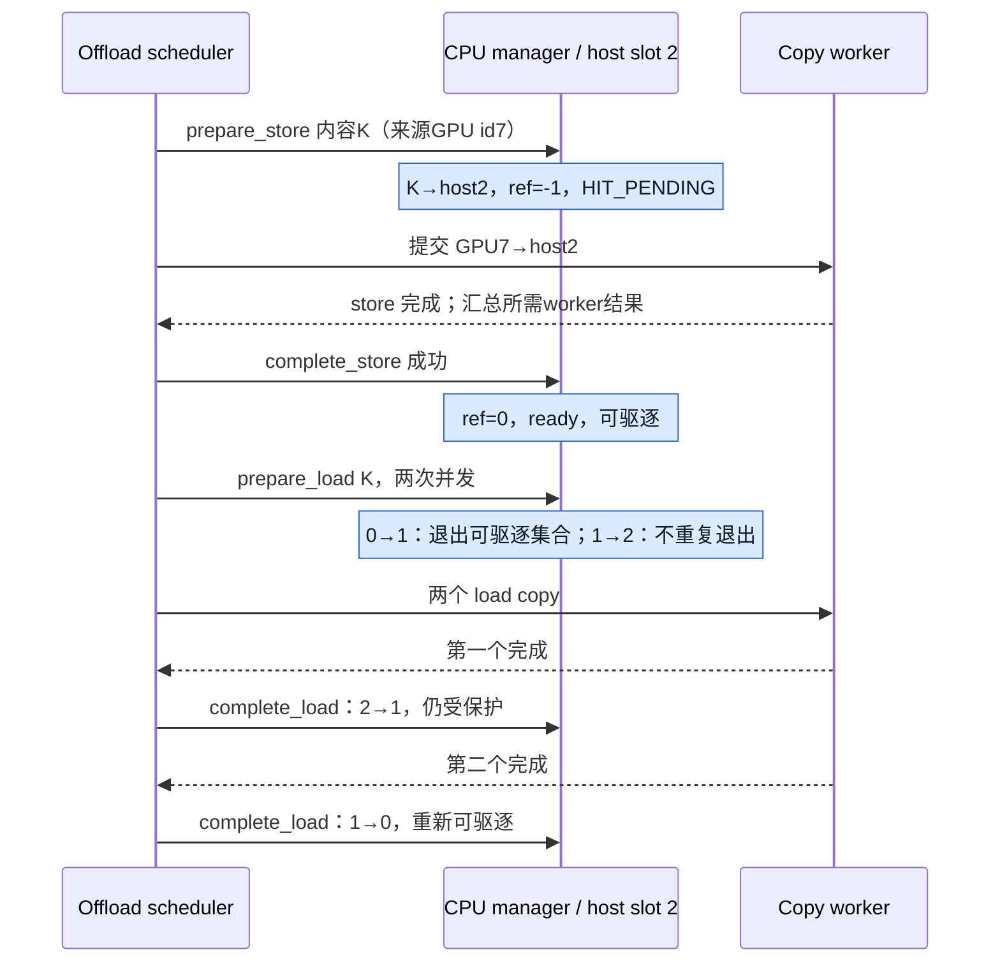

# vLLM KV Cache 管理：请求怎样分块、共享前缀并安全归还容量

> **源码基线**：`vllm-project/vllm@199cb9b964822e59ab9b58d88e7be31eb419a2ae`（main 快照，2026-09-07 UTC）。
> **主题**：一个请求的 token 怎样找到物理 KV 块；前缀共享、部分命中、混合布局和 CPU offload 怎样改变分配与回收。
> **适用范围**：V1 单 Engine 的 BlockPool、prefix cache、hybrid group、partial CoW 与 native CPU tier；请求调度策略见 11，设备执行见 15/16，跨 Engine 传输见 26。
> **最近更新**：2026-09-08。

## 1. 十个 token 为什么不需要一段连续显存

假设一个 group 的块容纳 4 个 token，请求 A 有 10 个 token。它需要 3 个块，但可以拿到物理编号 `[5, 2, 7]`：逻辑块 0、1、2 分别指向它们。token 位置 9 对应逻辑块 2、块内偏移 1，因此写入编号 7 的块内位置 1。若本例 manager 与 kernel 都采用 4-token 粒度，扁平 slot 就是 `7 × 4 + 1 = 29`。这些编号是教学用的某次池状态，不是从全新 pool 开始的分配次序。尾块仍有 2 个暂未使用的位置；分页减少连续预留，却不消除块内碎片。

此后 B 的前 8 个 token 与 A 相同，可以共享 `[5, 2]`，只为自己的尾部取新块 9。A 完成时，块 7 可以归还；块 5、2 仍有 B 使用，不能复用。B 也完成后，这两个块没有活跃引用，却仍可以保留 hash 供下个请求命中。**逻辑位置、物理编号、内容身份、活跃引用数回答的是四个不同问题。**

<!-- Figure spec: 三参与者顺序图重放 A10/B同前8、block4，展示共享块 ref 1→2→1→0 和私有尾归还；输入编号是池状态示例，不声称新池分配次序。 -->

这种间接层允许请求增长而不搬迁整段 KV，也让共享前缀与私有尾部分开管理。代价是 CPU 上要维护 block table、hash map、引用和淘汰队列，设备上要做间接寻址。这是从当前实现重建的设计权衡，不表示源码作者曾逐项比较过所有替代方案。

| 直观替代 | 为什么当前实现需要另一条路 | 相应成本 |
|---|---|---|
| 每请求独占连续 KV 区 | 未知增长和结束时间要求搬迁或按最坏长度预留 | 逻辑表映射物理块 |
| prefix cache 单独维护 `hash → tensor` | 活跃 KV 与缓存 KV 会形成两套容量账 | hash 与 free queue 都索引同一对象 |
| 每种 hybrid group 一套池 | 难以让不同历史长度的 group 共享容量 | 所有组联合预测，使用同一 id 空间 |
| partial tail 命中后原地续写 | 改变仍由旧 hash 标识的内容 | 新块与 copy-on-write |
| CPU tier 直接用 GPU id 标识内容 | GPU id 复用后会指向另一份内容 | 独立内容 key、host slot 和完成状态 |

## 2. 一个块怎样同时“空闲”又“可命中”

`BlockPool.blocks[block_id]` 是物理对象的唯一入口；`req_to_blocks[request_id]` 中每个逻辑槽只是对它的引用。`KVCacheBlock` 保存稳定 id、`ref_cnt`、主 hash、hash 覆盖的 token 数、free-list 前后指针及 null 标记。初始池预建所有对象，取出 id 0 作为 null block；它占容量，用于逻辑占位，但不走普通块的引用维护。

普通块遵守以下规则。取新块要求 `ref_cnt == 0`，移出 free queue 后变为 1；命中块由 `touch()` 增加引用，原先为 0 时还要从 queue 移除；每次 `free_blocks()` 归还一个引用才减 1。只有**非 null、ref 为 1、没有 hash**时，`is_block_writable()` 才允许作为私有可写块。最后一个引用消失后，无 hash 块放队首优先复用；有 hash 块放队尾继续可命中，直到被选作新分配目标才删除旧 hash。

因此 `ref_cnt == 0` 表示可驱逐，不表示没有内容。反过来，删除 hash 只取消检索身份，不会把仍有引用的块释放。reset 也不能强行清空活跃池：`reset_prefix_cache()` 检查除 null 外还有没有已使用块，有就返回 `False`。

free queue 是侵入式双向链表，命中位于中间的零引用块时可 O(1) 摘除，不需要扫描队列或另建链表节点。无 hash 块相当于队首 LIFO 复用，带 hash 块从队尾加入形成缓存淘汰次序；请求释放通常按尾到头进行，优先回收尾部。`test_prefill` 的真实例子使用 16-token 块，三个公共块 `[1,2,3]` 被两请求引用到 2，各有私有尾 4、5；全部释放后队列为 `[5,4,6,7,8,9,10,3,2,1]`。这里既验证尾块优先，也验证公共缓存保留在后部。

### 2.1 相同内容为什么还能有两个物理块

prefix hash 链接父 hash、当前完整 hash 单元的 tokens，以及必要的额外语义键：MM 内容标识和位置、LoRA 名称、首块 cache salt、prompt embedding 的分片摘要。再加 group id，才能区分不同 group 对同一 prefix 保存的状态。实现允许一个 hash 对应多个物理对象；块变满时不必为去重改写已经交给 runner 的 block table。这保留普通表的追加方式，代价是相同内容可能短时重复占块。

hash 也有明确的版本边界：`_gen_lora_extra_hash_keys()` 放入的是 **LoRA 名称**，没有权重内容版本；KV hash 也没有 `weight_version`。`OpenAIServingModels.unload_lora_adapter()` 删除前端映射，不替这条路径清除 Engine KV。因此同名 LoRA 换内容，或仅改变一个 version 字符串，不会自动隔离旧 KV；一致性仍要由外部权重更新与清缓存流程保证，见 [[02_engineering/03_infer_frameworks/vllm/28_vllm_extension_plugin_system_analysis|LoRA]]、[[02_engineering/03_infer_frameworks/vllm/29_vllm_weight_transfer_online_update_analysis|权重装载与更新]]。

## 3. 分配失败之前，哪些旧块已经可以归还

`allocate_slots()` 要解决的不是“剩几个空 id”这一道题。它先确认安全进度，计算各组的当前与新增需求，再保护命中和建立新引用。容量不足时返回 `None`，但已安全回收的旧窗口不会恢复；这不是任意异常都可回滚的通用事务。

### 3.1 用已执行进度回收窗口

看一个窗口长度 4、块长 2 的 sliding-window 请求。调度器记录 `total_computed_tokens=9`，其中 2 个 token 仍在执行；本次回收只认可 `9−2=7`。下一位置 7 需要历史位置 4、5、6，连同当前位置形成长度 4 的窗口，所以 0～3 已经可以移除，逻辑表前两个槽换成 null。若直接按乐观进度 9 计算，会移除 0～5，误删仍需要的位置 4、5。这里假设无额外保留窗口；实际 `extra_retained_tokens` 会进一步推迟回收。

<!-- Figure spec: TB 分配算法图；显示9减inflight2得7、窗口4/块2回收前两块；容量不足出口保留安全回收但没有新touch/allocate；成功出口全部group touch先于任何外部computed分配。 -->

full-sequence admission 是更早的可选门，会在上述回收之前预测整个序列是否可接纳；其 watermark 条件、reserved blocks 和抢占选择归 [[02_engineering/03_infer_frameworks/vllm/11_vllm_scheduler_analysis|调度器]]。通过该门后，manager 才以 `max(0, total_computed_tokens − num_in_flight_tokens)` 调用各组 `remove_skipped_blocks()`。回收以完整物理块为单位，保留 null 槽的位置，不能压缩逻辑历史后让位置错位。

### 3.2 命中块为什么也会消耗 free 容量

本步主模型目标长度是总 computed 加新 token，slot 目标再加 lookahead，并以 `max_model_len` 截断；不能按整个未来生成上限无条件占满。coordinator 汇总各组 `get_num_blocks_to_allocate()`。它考虑当前块、local hit、external computed slots、新 token、lookahead、窗口回收和 partial CoW；有的 manager 会在预测时记录 checkpoint 计划，但这一阶段不建立新块引用。一个 ref 为 0 的命中块虽然不用重算，却已在 free queue 中；新请求 touch 它后便不能再作新块分配，必须计入本次容量占用。partial tail 私有化还要多算目标块。

容量通过后必须**先 touch 全部组的本地命中，再为各组分配 external computed slots**。若按“组 0 touch→组 0 allocate→组 1 touch”循环，组 0 可能取走组 1 尚在 free queue 的命中块。两阶段安排先把所有命中从可驱逐集合中拿走，再扩大各组表。跨组 local/external 混合回归测试断言所有新 owner 的非 null id 不冲突且引用为正。

随后才扩展本步 slots，并调用 `cache_blocks()`。可登记长度最多到 `request.num_tokens`，不把可能被拒绝的 draft 当成稳定内容；多模块投机路径还会扣除可能再次 prefill 的尾部，见 [[02_engineering/03_infer_frameworks/vllm/20_vllm_speculative_decoding_analysis|投机解码]]。

**这里的 finalized 指 token 内容不会因 draft rejection 回滚，不表示 GPU KV 已写完。** `cache_blocks()` 就在 `allocate_slots()` 内，发生在 forward 之前。普通 attention 的 hash 可以供同一步后续请求查询并共享；设备是否可读依赖当步执行和后续 stream 顺序。Mamba 有不同限制：`cached_blocks_this_step` 记录当步新增/迁移的边界 hash；若另一个请求命中的尾块属于该集合，其需求预测直接返回 `num_gpu_blocks + 1`，让本步容量检查失败，下一步清集合后再尝试。CPU hash 登记不能充当设备完成事件。

### 3.3 从新增 id 到 attention 的 slot

分配成功仍只建立了 scheduler 侧关系。完整交付链以 Model Runner V2 为例：

1. `Scheduler.schedule()` 把新请求的完整 block IDs 写入 `NewRequestData`，已驻留请求通过 cached data 携带 `new_block_ids` 追加量，一并放入 `SchedulerOutput`。
2. `add_requests()` 为首次/恢复请求建立稳定 row，`overwrite=True` 写完整表；`update_requests()` 对已有 row 用 `overwrite=False` 追加。request identity 与当步 batch 排序可以分开。
3. runner 按需要清零新块，再执行本步 CoW copy，之后才让 attention 消费这些块。普通追加无需每步重传整个表；Mamba 的缓存尾部处理也要保住已交付的请求表，见下一节。
4. `prepare_attn()` 按 `idx_mapping` gather 当步 block tables，用 `query_start_loc` 和 token positions 得到 slot mapping；metadata builder 再生成 backend 参数。第 1 节的 `9→逻辑块2→物理块7偏移1` 到这里才成为设备地址输入。

稳定 row、异步 table 更新、zero/copy/forward 的具体执行顺序由 15/16 展开。manager block 到 kernel block 的虚拟拆分见 14；它不改变本页 pool 分配和回收的物理单位。

## 4. 命中 6 个 token，为什么还要复制半个块

`get_computed_blocks()` 至多复用 `request.num_tokens−1`：缓存保存 attention state，不保存下一 token 的 logits，仍要有真实计算。普通对齐路径还会向下取 scheduler block 的整数倍，可能重算不只一个 token；prompt logprobs 等需实际计算的路径会跳过 prefix 读取。

“partial”相对于 group 物理块。假设 hash 粒度 2、group 块长 4，前 6 个 token 的 hash 已完整，但第二个物理块只覆盖了其中 2 个有效 token。`cache_partial_block()` 可以给该物理对象登记 6-token 边界的 hash，必要时用旁路 key 保存多个边界；没有另分 tensor。驱逐、reset、提升为更长/full hash 时必须移除旧的主/旁路键，防止旧 key 悬挂到已换内容的对象。

> [!contradiction] 两处注释不能直接当执行规则
> `get_computed_blocks()` 的 docstring 仍写 computed blocks “must be full”，附近整块限制的说明也不能概括当前 partial 路径。测试已覆盖 hash 粒度 2、group 块长 4 的 6-token 命中：必须完整的是 **hash 单元**，不是物理 group block。另一个 `_apply_cow()` 注释说两端保留到 worker copy 完成；调度器实际释放还有条件，见下面的分层说明。

### 4.1 新请求续写：改自己的表，保留旧缓存

假设源块 S 已缓存、ref 为 0，新请求命中 6 个 token 并继续算 1 个。先 touch S，ref 变 1；分配目标 D，ref 为 1；将请求尾槽从 S 改为 D，再给 D 一份 copy 引用，变为 2。S 保留原 hit-ref 作为 copy 的源保护，队列登记 `S→D`。D 在创建时私有且无 hash，copy 为它补齐前 2 个有效位置，随后才追加自己的 token。

<!-- Figure spec: CoW步骤给出S缓存ref0→touch1和D新分配1→额外ref2；强调调度交出前端点保护、条件fence、device顺序三层。defer分支示例abort释放请求ref后D仍1，到fence才归零；普通分支不能画成也等worker。 -->

此处有三层不同保护，不能只读 `_apply_cow()` 注释就合成“所有路径都等 GPU 完成才 decref”。第一层是 **pool 内保护**：manager 准备本步计划期间保留源 hit-ref 和目标额外 ref，防止后续分配意外拿走端点。`take_kv_cache_block_copies()` 将 copy id 对与 retained 对象一起交给 scheduler。第二层是 **有条件的完成 fence**：`_free_cow_retained_blocks()` 仅在 `defer_block_free` 已启用且 fence 未满足时入延迟队列；该开关针对有并发 batch 的 KV consumer。普通分支立即 decref。fence 用执行 copy 的 step 所对应的序号；零 token copy 步本身不推进序号，由其后首个非空步的处理完成覆盖。第三层是 **设备操作有序**：即使 CPU 引用已归还，copy、读写和后续重用仍须遵守 runner 的 stream 顺序，不能据此认为可以乱序复用设备内容。

图中延迟分支特意演示请求先结束：D 的请求引用先减为 1，copy pin 仍在，等 fence 后才能归零；若请求仍活跃，释放额外引用后 D 会保留为 1。D 后续能否原地写还要看有没有被登记成新缓存，不能仅凭 ref 为 1 判断。

### 4.2 正在运行的 Mamba producer：保请求表，移动缓存身份

Mamba align 模式还有相反方向的动作。请求已经在用尾块 S，不能为保留 prompt 边界随意改掉设备表。它继续生成前分配 D，把 S 的缓存 hash 移到 D，登记 `S→D`；请求仍持有 S，D 保存旧边界快照。S 增加一份 copy 引用，D 的初始引用承担 copy 保留；释放 copy 引用后，活跃 S 保留请求引用，D 可以成为 ref 为 0 的缓存块。D 的新 hash 进入 `cached_blocks_this_step`，避免另一个请求在本步 copy 尚未完成时把它作为 Mamba 状态起点。

如果请求刚好停在最后 prompt 的 partial 边界，没有后续 forward，就不需要先复制再导出。新增 `finalize_partial_tail_offloads()` 只在 `num_computed_tokens == boundary_tokens` 且 `num_in_flight_tokens == 0` 时消费一次 producer 标记，返回**当前请求表中的精确 block id**；多走一个 token、有在途计算、或再次调用都不返回这个旧边界。

<!-- Figure spec: 一个Mamba partial边界6例的两分支，上下排列；继续生成分支移动hash并copy，结束分支检验computed6/inflight0，明确Mooncake额外store pin可使请求清理与job完成分离。 -->

这不是所有 connector 都执行的保存动作。一个实际实现是 Mooncake store scheduler 的 `register_finished_partial_tail()`：校验边界、去重 id 后 `touch()` 精确源块，建立带 worker 完成计数的保存任务；它返回 `False` 允许请求正常清理，因为 job 已独立持有引用。直到所有 worker 的 `completed_saves` 到齐才释放 pin；`has_pending_push_work()` 让 Engine 即使没有活跃请求也继续处理未完成保存。网络协议归 26；本页只需要明确“请求完成”不等于“该物理块立刻可复用”。native CPU tier 是后面的另一条路径，不能用同名 offload 把两者的回调混为一谈。

## 5. 不同层的块大小不同，容量怎样统一计算

full attention、sliding/local attention、Mamba、hidden-state cache 对历史保留和每块 token 数的要求各异。每个 group 有自己的 manager 和逻辑表，却共用一个 BlockPool。底层 `KVCacheTensor` 是同一 backing allocation 的不同 view；不同 group 可以解释同一字节范围，因此同一 id 不能同时分配给两个不同 group。一个请求若两组各需 3 块，总共就占 6 个 pool id，不是用 3 个 id 同时装两组状态。

### 5.1 packed groups：取最大组字节数，不是统一每层 page

当前基线不能概括成“先把所有层 page padding 成一样大”。`get_kv_cache_groups()` 先尝试统一 spec/type、专用 GLM5-Next 分组及 hidden-state 分离等路径；适用时用 block-outermost packed groups，之后才走一般统一 page 的 fallback。

packed 路径先按 `UniformTypeKVCacheSpecs` 的语义兼容性分桶；桶内按 page 字节数归类。每种 page 的层数相等时，把“一层各 page”作为 1:1 重复模式；混合 page 的平衡桶必须保留，设定每组重复数的下界，再由 `_approximate_gcd()` 选使 padding 最少的重复数，平手取更大值。非平衡桶整体保留，不会把任意 2:1 比例都当成重复模式。Mamba 桶还会继续拆分，使组内 state 数装入 attention 已要求的 block 大小。

例如一个兼容桶含 3 层 A 和 3 层 B，另一桶有 5 层 C。混合桶设下界 3；重复数 3 的补齐损失为 `0+1=1`，取 4 为 `1+3=4`，取 5 为 `2+0=2`，故选 3。A/B 形成 6 层组，C 按交错分成 `[C0,C2,C4]` 与 `[C1,C3]`。这对应回归测试中 3 MLA + 3 indexer、5 SWA 层形成 6/3/2 个成员的分组形状。下图 page 字节数是单独给定的教学值，不是该测试的模型参数。

<!-- Figure spec: 真二维物理页布局用SVG；给定page A2/B1/C4 KiB和6/3/2成员，逐行真实宽度相加9/12/8，最大stride12，60KiB得5块含null；所有行是同一ID的重叠view，不是可同时分配的三份显存。 -->

图中的 pool block 宽度为 `max(9,12,8)=12 KiB`，不是三行相加的 29 KiB。给 KV 的内存若为 60 KiB，得到 5 个物理块，扣掉 null 后可分配 4 个。普通 packed layout 的地址来自 view offset、层的 `layer_stride`、物理 id 的 `block_stride`；所有 view 共用 backing，总容量不能按 tensor view 的 size 重复累加。

这种布局要求 block compact；混合 page 且多 group 时，还要求 layer 维在 block 维内。布局不支持就不能套此 packed 路径。fallback 仍可能增大 attention block 以匹配 page、padding Mamba 或非 MLA page；无法表达的组合可能采用受限 full-allocation fallback 或直接报错。把 local cache 提升为 full allocation 改变保留容量，不改变 attention 只看窗口的计算语义。

### 5.2 GLM5-Next 与 PP：先分组，再按本 rank 的层重算容量

GLM5-Next 专用路径组合 Mamba、MLA 和压缩 indexer，并利用 Mamba page 可装入 MLA page 的关系安排 alias。真实测试的 34 层 Mamba、11 层 MLA、11 层 indexer 被分成四个 Mamba 组，成员数 9/9/8/8；一个物理 block 的字节跨度是 `11 × MLA page + 11 × indexer page`。Mamba view 使用对应 MLA 区域，必要的 padding 必须能装下；Mamba 比 MLA page 还大时会拒绝。可选 k-pool tail state 共用 indexer 区域，每请求只留一个块，不额外增加这段 backing 字节数。

PP 不能沿用全模型层数直接估每 rank 容量。`_project_kv_cache_groups_to_worker()` 保持 group 身份但过滤非本 rank 层，重新构造局部 spec；测试中一个 stage 有 5 MLA、5 indexer，Mamba 组为 5/5/4/4，跨度于是变为 `5 × MLA page + 5 × indexer page`。全局分组还要满足最不利 PP stage 的 Mamba/MLA 比例：另一测试需要从四组增到五组，得到全局 7/7/7/7/6。若某 stage 有 Mamba 却没有可共同布局的 MLA，配置直接报错，提示调整层分区。

最终各 worker 按可用内存计算，再取能共同使用的最小 `num_blocks`，重新规划 view stride/offset；不是只缩小一个数字而保留旧地址步长。上述 tail scratch 的 `prefix_cacheable=False` 则影响下一节的命中边界：它占本地容量，却不应要求自己也有 prefix hash。

## 6. 多组各自命中后，为什么还要反复缩短长度

即使字节布局成立，所有组仍须能从同一个 token 边界恢复。scheduler 粒度取各有效 group block size 的公倍数；hash 粒度依可缓存组求公约数或验证显式配置，二者职责不同。`prefix_cacheable=False` 的 scratch **不参与 hash 对齐、命中查找和 fine-grained 能力限制**，但仍参与 pool 容量和 scheduler block 的共同约束。

Hybrid coordinator 把相同 spec 的组批量查询，按 full attention 优先的顺序迭代候选长度。某组缩短候选后，需要让其它组重新确认；Mamba 可能只保存稀疏 checkpoint，某窗口也可能只在更短边界有完整 tail，不能把各组独立最长命中简单取 min 就当作最终答案。

用一个明确的教学 lookup 结果演示：最大候选 12；full 可以到 12，Mamba 在不超过 12 时最近 checkpoint 是 8，window 在候选 8 时只能找到长度 4 的完整 tail。候选降到 4 后重新确认，假设 Mamba 的 checkpoint 4 和 window 所需 tail 都存在，就共同命中 4。例子的 lookup 结果是给定输入，不代表所有模型都按这些长度保留状态。

<!-- Figure spec: TB fixed-point 算法数值链；给定三组lookup结果12→8→4，第二轮4稳定，full已查结果可截短，不能丢掉重查Mamba/window步骤。 -->

候选只下降，因此能收敛；full 已经查出的连续结果可截短复用，简单 full + 另一类的组合还有少做一轮的优化。fine-grained 命中要求 Mamba align 且相关可缓存 manager 支持；允许在 group 物理块内部的 hash 边界返回实际 token 数，否则向下对齐 scheduler block。PCP 当前拒绝 hybrid，DCP hybrid 只接受 full/Mamba 组合；有效 attention block 还要考虑分片倍率，不能把 Mamba 的时间块也盲目乘上同一倍率。

EAGLE 的命中裁剪受 `use_eagle_block_drop()` 和具体 group 标记控制，不能把“启用任意 EAGLE”直接等价为每组统一减一块。coordinator 针对候选验证需要的额外边界，并记录本轮已验证组；候选缩短后才重新验证，防止同一候选重复丢块。Mamba checkpoint 的调度对齐和 padding 演算见 11，本页保留的是多组最终能否从同一状态恢复。

缓存保留策略同样影响可命中的边界。默认 `None` 保留密集可达 checkpoint；0 只保留当前恢复仍需的状态；正 interval 在 sliding-window/Mamba 中按分段边界保留，且必须是 scheduler block 的倍数。窗口要保留相应边界的完整 tail，Mamba 要保留状态 checkpoint；两者还保留当前 replay 所需部分和共享分叉点，不能因“只保留最近”删掉别的请求仍引用的状态。它们改变 hash 可达集合，不绕过 pool 引用规则。

## 7. CPU offload 的内容什么时候才算可用

本地 native CPU offload 扩大的是可复用内容容量，不增加 GPU pool block 数。配置 `kv_offloading_size` 且选择 native backend 时，默认创建 `OffloadingConnector`，显式环境开关才选择 `SimpleCPUOffloadConnector`。以下讲默认路径；跨 Engine P/D 与远端 tier 见 26。

GPU 用 block id 标识当前物理槽；CPU 使用 `OffloadKey = block_hash + group_idx` 标识内容，再映射到独立 host `BlockStatus.block_id`。例如 GPU id 7 的内容 K 可以存在 host slot 2；GPU 7 后来分给别的内容，不会让 host slot 2 自动改名。scheduler 侧 CPU manager 维护 residency、引用和 eviction policy，worker 只按 copy spec 执行 GPU↔CPU 复制。

### 7.1 store：先占位置，完成后才能命中

`prepare_store()` 先按可选 store threshold 筛选，过滤已有 key，保护本次输入集合不被选作 victim，并检查 free + evictable 容量。选择 LRU/ARC 等策略淘汰后，才分配 host slot；新条目 `ref_cnt=-1` 表示写入 pending，lookup 是 `HIT_PENDING`，不能当 ready 数据加载。`complete_store(success=True)` 才变成 ref 0、ready、可驱逐，并发布 stored event；失败删除未完成条目、归还 slot，不覆盖已经存在的 ready key。若复用别的内容的容量，removed event 先于新内容的 stored event。

### 7.2 load：第一个读者取出淘汰队列，最后一个读者放回

`prepare_load()` 要求 key ready，ref 从 0 到 1 时才从 evictable 集合移出；第二个并发 load 变为 2，不重复减少 evictable count。每次完成减 1，只有 1→0 才重新允许淘汰。

<!-- Figure spec: 三参与者顺序图给出GPU7内容K/host2，store pending -1→ready0，再双load0→1→2→1→0及evictable状态；说明worker结果经connector汇总所有worker后生效。 -->

worker 的完成不是“提交了一个异步操作”。CPU copy handler 查询结束 event，完成前保留所需缓冲区和 copy 计划；connector scheduler 汇总 job 的 worker 完成数，再通知 manager 提交 store 或释放 load pin。reset 还有旧 job 过滤和旧 load 排空规则，不能将 reset 前晚到的结果登记成新 cache；这与 GPU `reset_prefix_cache()` 遇活跃引用返回 `False` 是不同接口。当前 native CPU worker 支持 CUDA-like 和 XPU，其他平台会拒绝。

GPU pool 与 CPU tier 都要协调内容身份和使用期间的保护，但完成规则不同：CPU pending store 明确在 copy 完成后才 ready；GPU hash 可以在 forward 前登记，CoW 额外引用又有条件 fence。两套引用数不能相互替代，更不能把一种完成点推广给所有 tier。

## 8. 从哪些边界判断性能与正确性

| 观察到的边界 | 应怎样解释 |
|---|---|
| GPU 容量不足，分配返回 `None` | 本次没有新增 owner；已经安全越过的窗口可能已回收，重试/抢占由 Scheduler 决定 |
| 块有 hash 但 ref 为 0 | 可命中的缓存也属于可驱逐容量，命中 touch 后会重新占用这份容量 |
| 删除 hash 后 ref 仍正 | 取消缓存身份不释放活跃对象；prefix reset 也不强拆活跃池 |
| partial hit 节省计算却仍多要一块 | CoW 目标与 copy 是代价；释放两端引用须区分 pool 准备、条件 fence、设备顺序 |
| Mamba 请求结束但块未归零 | 可能还有执行保护或 connector 保存任务的独立 pin；完成消息不代表所有引用都消失 |
| hybrid padding 或 group 变多 | 每 block 字节跨度、每请求所需 pool id 数都影响容量；PP 还要按局部投影与最小共同块数重算 |
| CPU lookup 为 `HIT_PENDING` | 有容量和在途内容，不等于现在可加载；失败 store 会删除未完成条目 |

这些例子依据固定基线源码和已有回归测试重建，教学数字已明确标注；本页没有实跑 GPU kernel、跨 worker 传输或性能基准，不能据此给出实际命中率与时延结论。

建议以以下稳定符号重走主链，而不是把文件整体当引用：

1. `vllm/v1/core/kv_cache_utils.py::KVCacheBlock`、`FreeKVCacheBlockQueue`、`generate_block_hash_extra_keys`：物理字段、队列与内容键；`tests/v1/core/test_prefix_caching.py::test_prefill` 对照共享和释放次序。
2. `vllm/v1/core/block_pool.py::BlockPool.get_new_blocks`、`touch`、`is_block_writable`、`free_blocks`、`cache_partial_block`、`move_block_hashes`、`reset_prefix_cache`：同一对象上的分配、身份和回收。
3. `vllm/v1/core/kv_cache_manager.py::KVCacheManager.get_computed_blocks`、`allocate_slots`；`vllm/v1/core/kv_cache_coordinator.py::KVCacheCoordinator.allocate_new_computed_blocks`：命中上限、容量检查与全组 touch 顺序。
4. `vllm/v1/core/single_type_kv_cache_manager.py::SingleTypeKVCacheManager._apply_cow`、`MambaManager.allocate_new_blocks`、`finalize_partial_tail_offload`；`vllm/v1/core/sched/scheduler.py::Scheduler._free_cow_retained_blocks`、`_connector_finished`：两种 partial 尾处理及条件完成边界。
5. `vllm/v1/core/kv_cache_utils.py::_get_packed_kv_cache_groups`、`_get_kv_cache_groups_glm5_next`、`_get_kv_cache_bytes_per_block`、`_project_kv_cache_groups_to_worker`、`get_kv_cache_configs`：分组、字节跨度与 PP 投影。
6. `vllm/v1/core/kv_cache_coordinator.py::HybridKVCacheCoordinator.find_longest_cache_hit`；`vllm/v1/core/single_type_kv_cache_manager.py::SlidingWindowManager.reachable_block_mask`、`MambaManager.reachable_block_mask`：共同命中长度和保留集合。
7. `vllm/v1/worker/gpu/model_runner.py::GPUModelRunner.add_requests`、`update_requests`、`prepare_attn`：请求表到设备 slot 的交付链。
8. `vllm/distributed/kv_transfer/kv_connector/v1/mooncake/store/scheduler.py::MooncakeStoreScheduler.register_finished_partial_tail`、`update_connector_output`：结束请求的精确边界块如何由保存任务继续持有。
9. `vllm/v1/kv_offload/cpu/manager.py::CPUOffloadingManager.prepare_store`、`complete_store`、`prepare_load`、`complete_load`；`vllm/v1/kv_offload/cpu/gpu_worker.py::SingleDirectionOffloadingHandler.get_finished`：host 内容状态与设备完成。

## Related Pages

- [[02_engineering/03_infer_frameworks/vllm/11_vllm_scheduler_analysis|vLLM Scheduler]] —— 决定 token/request admission、抢占与本页分配失败后的处理，并推导 Mamba checkpoint 对齐。
- [[02_engineering/03_infer_frameworks/vllm/14_vllm_attention_backends_analysis|vLLM Attention Backend]] —— 将本页物理布局与 block table 转为 backend 参数，说明 manager/kernel 粒度转换。
- [[02_engineering/03_infer_frameworks/vllm/15_vllm_model_runner_v1_analysis|Model Runner V1]] / [[02_engineering/03_infer_frameworks/vllm/16_vllm_model_runner_v2_analysis|Model Runner V2]] —— 对照 compact row 与 stable row，并追踪 zero、CoW copy 和 forward 的设备顺序。
- [[02_engineering/03_infer_frameworks/vllm/20_vllm_speculative_decoding_analysis|vLLM 投机解码]] —— 展开 lookahead、draft rejection 与哪些 token 内容可以登记为缓存。
- [[02_engineering/03_infer_frameworks/vllm/26_vllm_disaggregated_kv_serving_analysis|vLLM 分离式 KV Serving]] —— 展开跨 Engine connector、producer/consumer、lease 与远端保存完成。
- [[02_engineering/03_infer_frameworks/vllm/27_vllm_observability_reliability_analysis|vLLM 可观测性与可靠性]] —— 将 prefix hit、eviction、GPU/CPU usage 与 allocation failure 接到生产信号。
