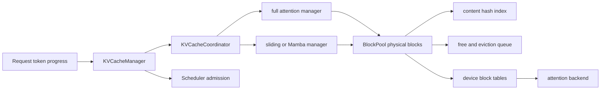
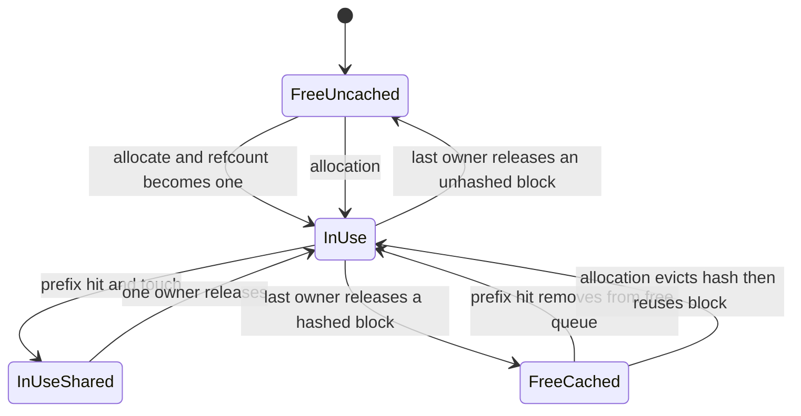
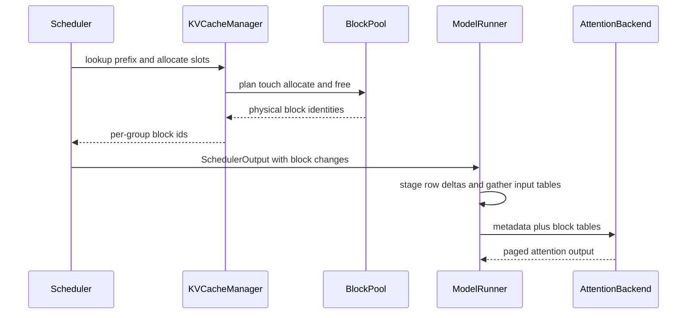

# vLLM KV Cache 管理：分页不是索引技巧，而是物理块所有权协议

> **源码基线**：`vllm-project/vllm@d66300a1baa7779c68c7dfa4e51eee2502b48017`
> **中心命题**：在线生成的 KV 随请求逐 token 增长，长度和生命周期都不可预测。vLLM 用一个全局 `BlockPool` 把物理显存变成带引用计数、内容哈希和淘汰顺序的块；`KVCacheManager` 再把请求级 token 进度翻译成块所有权。PagedAttention 只是设备端消费这份所有权映射的方式。

## 一、为什么“每请求一个连续 KV tensor”不成立

假设请求 $r$ 最终生成 $N_r$ 个 token，标准全注意力 KV 占用近似为：

$$
M_r\approx 2LN_rH_{\mathrm{KV}}D_{\mathrm{head}}B_{\mathrm{dtype}}.
$$

在线接入时 $N_r$ 未知。按 `max_model_len` 为每个请求预留连续空间会产生巨大内部碎片；按实际长度逐步扩容则需要找更大的连续区、搬迁历史 KV，并破坏 CUDA Graph 依赖的地址稳定。固定 batch 可以回避一部分分配问题，却重新引入长度不齐的尾部气泡和无法持续纳新的问题。

vLLM 的选择是把物理 KV 容量预先切成 block。请求不拥有一段连续 tensor，而是持有一个逻辑 block table；attention kernel 通过 table 找到物理 block。这样请求增长只追加 block id，结束只释放引用，prefix sharing 也能让多个请求引用相同物理块。

## 二、三层对象各自拥有哪部分真相

| Owner | 持有的状态 | 不应该知道的内容 |
|---|---|---|
| `KVCacheManager` | 请求 token 进度到 slot 数量的转换、watermark、prefix hit、外部 KV 接合点 | 具体 attention kernel layout |
| `KVCacheCoordinator` | 多 KV group 的共同命中边界、每类 cache manager、块粒度协调 | HTTP、采样文本、路由 |
| `BlockPool` | 全部物理块、refcount、hash index、free/eviction order、事件 | 请求为何被调度、模型语义 |
| Runner `BlockTables` | request row 到设备 block id tensor 的差分镜像 | block 是否应该被分配或淘汰 |

`KVCacheBlock` 自身只保存 block id、refcount、可选内容 hash、覆盖 token 数和 free-list 指针；`vllm/v1/core/kv_cache_utils.py:159-204`。`BlockPool` 在初始化时创建全部物理块、构造 free queue、hash map，并保留一个特殊 null block；`vllm/v1/core/block_pool.py:143-196`。

这给出第一个核心不变量：**物理 block 的唯一身份由 `BlockPool.blocks[block_id]` 决定；请求、group 和 device block table 只能引用它，不能各自复制一份分配真相。**

## 三、物理块状态机

### 3.1 `ref_cnt` 表示活跃所有权，不表示是否有 cache hash

`get_new_blocks()` 只能从 free queue 取块，取出前断言 `ref_cnt == 0`，随后增为 1；若块仍带 prefix hash，则先驱逐旧 hash；`vllm/v1/core/block_pool.py:647-700`。prefix hit 调用 `touch()`：若命中的 block 处于 `ref_cnt == 0` 的可淘汰状态，先从 free queue 移除，再增加引用；`vllm/v1/core/block_pool.py:702-717`。

释放时 refcount 递减到 0 才回 free queue。无 hash block 被放到队首优先复用，仍有有效 hash 的 block 放到队尾形成近似 LRU 淘汰；`vllm/v1/core/block_pool.py:719-743`。所以：

- `ref_cnt > 0`：至少一个请求活跃引用，不能重新分配；
- `ref_cnt == 0` 且有 hash：没有活跃 owner，但仍可作为 prefix cache 命中，也可被淘汰；
- `ref_cnt == 0` 且无 hash：立即可复用；
- null block：特殊占位符，不按普通引用计数释放。

测试把这套协议当作正确性而非性能细节：两个共享前缀的请求把共同 block 的 refcount 提升到 2，全部释放后块回到 free queue，并验证无 hash tail 优先、共享 hashed block 后淘汰的顺序；`tests/v1/core/test_prefix_caching.py:250-345`。

### 3.2 Cache hash 是内容身份，不是所有权

只有可提交的完整内容才能进入 prefix hash index。释放 hashed block 不会立刻删除 hash；只有该物理块被重新分配时 `_maybe_evict_cached_block()` 才移除 hash 并发布删除事件。这样 prefix cache 不需要另一份显存，但 cache residency 与活跃引用成为两个正交维度。

这也解释了为什么 naive `dict[hash] -> tensor` 不够：它没有统一回答容量满时淘汰哪个物理块、被多个请求使用时能否淘汰、请求结束后 tensor 是否仍可复用。vLLM 把 hash index 和 free queue 指向同一个 `KVCacheBlock` 对象，避免元数据与物理容量漂移。

## 四、一次 slot 分配维护什么不变量

`KVCacheManager.allocate_slots()` 的输入同时包含本地 prefix hit、connector 外部命中、本轮新 token、speculative lookahead、encoder token、watermark 和 reserved blocks；它的 block-layout 注释把这些区间明确分开，见 `vllm/v1/core/kv_cache_manager.py:347-442`。

分配不是“需要几个 block 就 pop 几个”，而是三阶段提交：

1. 先判断完整序列 admission gate 和容量水位；
2. 清理 sliding-window 等已不再需要、且不被 in-flight step 读取的块；
3. 计算本地/外部已算 token 与新 token 所需 block，确认容量后才接纳命中块并分配新块。

### 4.1 容量判断先于所有权变更

`full_sequence_must_fit` 会按完整请求长度估算所需块；不足直接返回 `None`，避免 chunked prefill 只看首段而过度准入。之后还要扣除 `reserved_blocks`，并为 waiting/preempted request 留出 watermark；`vllm/v1/core/kv_cache_manager.py:456-530`。

这条顺序非常关键。若先 `touch()` 本地 cache hit，再为另一 KV group 分配外部 block，后者可能从 free queue 复用尚未被保护的命中块，形成同一物理 id 被交给两个 group。当前回归测试明确检查 block id 跨 group 唯一、请求引用块必须 `ref_cnt >= 1`；`tests/v1/core/test_prefix_caching.py:3681-3747`。

因此第二个核心不变量是：**一次多 group allocation 必须先完成全局容量规划，再原子化地建立所有 group 的活跃引用；不能按 group 边查边分配。**

### 4.2 只能缓存已经最终提交的 token

投机 token 可能被拒绝，async step 的乐观进度也可能回滚。分配完成后，manager 用 `min(total_computed_tokens + num_new_tokens, request.num_tokens)` 限制可 cache 的 token，明确排除未验证 draft；`vllm/v1/core/kv_cache_manager.py:552-568`。

清理 sliding-window block 时同样不能按乐观进度释放。实现减去 `request.num_in_flight_tokens`，因为前一批次 attention 仍可能读取这些块，且被拒绝的 speculative token 会回退；`vllm/v1/core/kv_cache_manager.py:498-511`。

第三个核心不变量是：**分配可以为未来 token 预留 slot，但 hash 提交与安全释放只能基于已最终确定、且不再被 in-flight 计算读取的 token。**

## 五、Prefix caching 为什么必须重算最后一个 token

prefix cache 保存的是 attention 的 K/V 状态，不是最后一步 logits。若 prompt 全部命中而本轮不执行模型，就无法产生下一 token 分布。因此 `get_computed_blocks()` 把最大命中长度限制为 `request.num_tokens - 1`；受 block 对齐约束影响，实际可能重算整个最后 block；`vllm/v1/core/kv_cache_manager.py:232-267`。

内容哈希也必须包含足以区分语义的上下文，例如父 block hash、token 内容和 group id。hash 只在完整/允许的边界上建立，partial tail 通常保持无 hash。由此得到：

- prefix caching 消除重复 prefill，不改变采样分布；
- 命中长度必须服从 scheduler/hash block 对齐；
- 权重更新后旧 KV 失效，不能继续命中；
- hash 碰撞或跨实例 hash seed 不一致会破坏复用语义。

当前 reset 只在除 null block 外没有活跃块时成功，否则返回 `False`；`vllm/v1/core/block_pool.py:764-798`。这比强行清 hash 更保守，因为活跃请求仍可能依赖这些 block 的内容身份。

## 六、Hybrid KV：一个请求可以同时需要多种时间语义

混合模型可能同时包含 full attention、sliding window、Mamba/SSM 或 speculative group。不同 group 的真实 block size、可复用历史和淘汰条件不同，但同一请求必须获得一个可共同执行的 token 边界。

`KVCacheCoordinator` 要求 scheduler block size 同时是 hash block size 和各 group block size 的倍数，并让所有 single-type manager 共享一个 `BlockPool`；`vllm/v1/core/kv_cache_coordinator.py:64-150`。`HybridKVCacheCoordinator` 再验证：

- 每组 block size 可由 hash granularity 整除；
- PCP 当前不支持 hybrid attention；
- DCP 只接受显式支持的 FullAttention/Mamba 组合；
- fine-grained partial hit 只有所有相关 manager 都支持时才启用；
- 相同 spec 归为同一 attention group；`vllm/v1/core/kv_cache_coordinator.py:560-698`。

这不是为了把类型系统做复杂，而是阻止“某一 group 已经命中更多 token，但另一 group 没有对应状态”这样的伪命中。对混合模型，cache hit 是多组状态的共同可执行前缀，不是各组命中长度的简单最大值。

## 七、从 Scheduler 到 attention 的最小承重链

设备侧 `BlockTables` 为每个 KV group 维护 `max_num_reqs × max_num_blocks` 的 staged tensor，并另存 input table 与 slot mappings；`vllm/v1/worker/gpu/block_table.py:17-80`。新增 block id 只 stage 到请求 row，多 group 时可用 fused writer 一次应用；`vllm/v1/worker/gpu/block_table.py:107-141`。

这里的边界是：Scheduler/KV manager 决定“哪些物理 id 属于谁”，Runner 决定“怎样高效把变化镜像到 GPU”，attention backend 决定“怎样按 layout 消费”。任一层都不应重新推导其他层的所有权。

## 八、为什么不是更简单的替代方案

| 替代方案 | 缺陷 | 当前设计付出的代价 |
|---|---|---|
| per-request 最大连续预留 | 内部碎片巨大，并发容量由最坏长度决定 | block table 间接寻址与元数据开销 |
| 动态连续扩容 | 搬迁历史 KV，破坏地址稳定和 graph capture | 固定 block 粒度产生最多一个尾块碎片 |
| naive LRU prefix cache | 无法统一活跃引用、淘汰和物理容量 | refcount、hash map、双向 free queue 更复杂 |
| 每个 KV group 独立 pool | 简单隔离类型，但可能一组空闲、另一组耗尽；跨组命中难以原子提交 | shared pool 需要 coordinator 做全局规划 |
| 命中完整 prompt 后直接采样 | cache 中没有本轮 logits | 至少重算最后 token，可能重算一整个 block |
| 分配后再检查容量 | 失败回滚复杂，容易 double allocation/refcount 腐坏 | 预规划需要更复杂的块数计算 |

## 九、失败边界与观测

| 边界 | 表现 | 设计响应 |
|---|---|---|
| free blocks 不足 | `allocate_slots()` 返回 `None` | Scheduler 抢占、延后准入或重算 |
| 活跃块未释放 | prefix reset 失败 | 保持内容身份，不破坏运行请求 |
| backend block size 不兼容 | 初始化/能力检查失败或回退 | 统一 scheduler granularity，选择兼容 backend |
| connector 与本地命中竞态 | duplicate block id、refcount 腐坏 | 两阶段全局规划与 deferred free |
| hybrid group 能力不一致 | partial hit 被关闭或配置拒绝 | 以共同安全边界为准 |
| prefix hit 低 | hash/lookup 开销无收益 | 通过 hit rate、eviction、reuse distance 评估 |

`BlockPool.get_usage()` 用排除 null block 后的 free-block 比例计算占用；`vllm/v1/core/block_pool.py:800-819`。仅看 usage 不够：高 usage 可能来自有价值的可淘汰 prefix cache，也可能来自活跃请求；排障还要结合 refcount、eviction、prefix hit、preemption 和 connector events。

## 十、源码阅读顺序

1. `vllm/v1/core/kv_cache_utils.py:159-204`：先确认 block 元数据的最小状态。
2. `vllm/v1/core/block_pool.py:143-196,647-798`：理解物理所有权、共享、释放和淘汰。
3. `vllm/v1/core/kv_cache_manager.py:232-267,347-568`：理解 prefix hit 与一次 slot transaction。
4. `vllm/v1/core/kv_cache_coordinator.py:64-180,560-698`：理解多 group 为什么不能独立处理。
5. `tests/v1/core/test_prefix_caching.py:250-345,3681-3747`：用测试确认 refcount 和跨组唯一性。
6. `vllm/v1/worker/gpu/block_table.py:17-141`：最后看所有权如何镜像到设备输入。

## Related Pages

- [[02_engineering/03_infer_frameworks/vllm/02_vllm_system_design_principles_analysis|vLLM 系统设计原则]] — KV 容量与 TTFT/吞吐的全局因果关系。
- [[02_engineering/03_infer_frameworks/vllm/11_vllm_scheduler_analysis|vLLM Scheduler]] — 谁决定本轮 token 数以及容量不足时如何抢占。
- [[02_engineering/03_infer_frameworks/vllm/14_vllm_attention_backends_analysis|vLLM Attention Backend]] — block table 与 metadata 如何被 kernel 消费。
- [[02_engineering/03_infer_frameworks/vllm/15_vllm_model_runner_v2_analysis|vLLM Model Runner V2]] — staged block-table 更新如何避免全量 CPU/H2D 重建。
- [[02_engineering/03_infer_frameworks/vllm/20_vllm_speculative_decoding_analysis|vLLM 投机解码]] — lookahead slot 与未验证 token 的提交边界。
- [[02_engineering/03_infer_frameworks/vllm/26_vllm_disaggregated_kv_serving_analysis|vLLM 分离式 KV Serving]] — 单实例物理块如何跨 connector 变成远端 KV 生命周期。
- [[02_engineering/03_infer_frameworks/vllm/27_vllm_observability_reliability_analysis|vLLM 可观测性与可靠性]] — KV events、usage、eviction 与故障信号。
