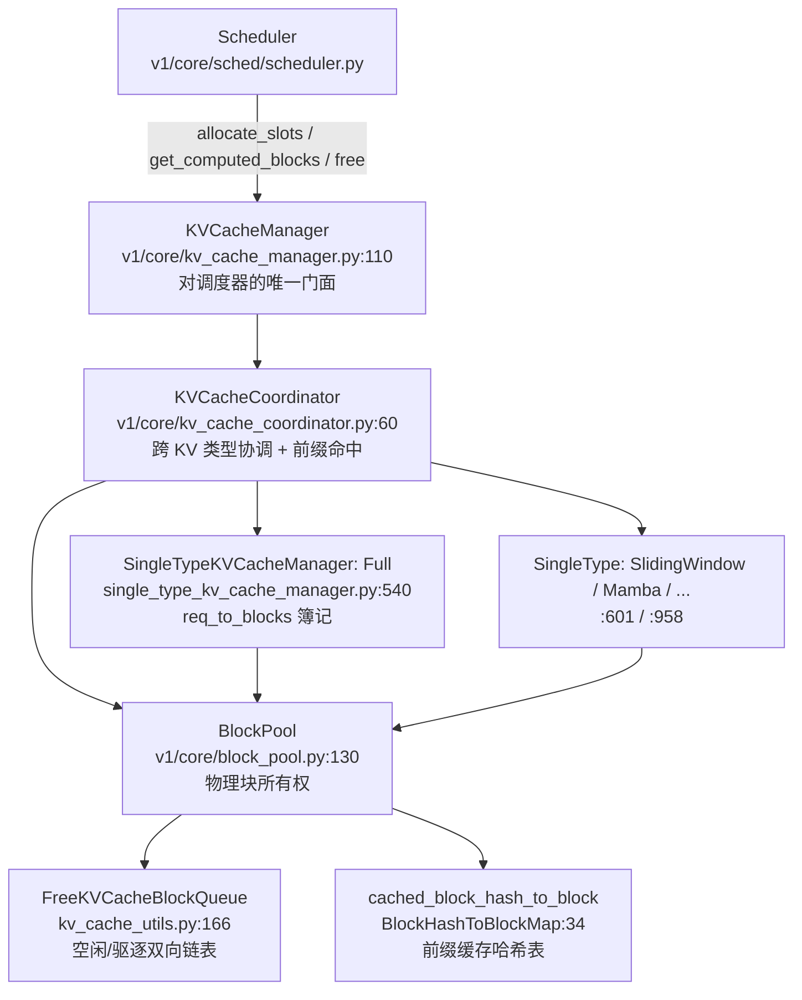

# vLLM KV Cache 管理 —— 分页内存、Block Pool 与前缀缓存

> **代码基准**：vLLM `main` @ `485bbe1c6`(2026-06-21)· V1 引擎
> **最后更新**:2026-06-22 · **系列**:vLLM 推理引擎源码级分析(见 [[vllm/index]])
> **分析维度**:Overview → Quick Start → Deep Dive
>
> 本页回答「vLLM V1 如何用分页内存管理 KV Cache」:逻辑块/物理块、`BlockPool` 的空闲队列与引用计数、`KVCacheManager.allocate_slots` 的块分配生命周期、automatic prefix caching 的块哈希与命中复用、混合注意力(full / sliding window / mamba)的多类型协调,以及启动期显存测算如何决定 `num_gpu_blocks`。**调度策略**(谁先跑、抢占、chunked prefill)归 [[11_vllm_scheduler_analysis]];**注意力 kernel / PagedAttention 计算侧**(block_table 如何喂给 kernel)归 [[14_vllm_attention_backends_analysis]]——本页只讲内存侧。

> 约定:下文 `文件:行号` 路径均**相对包根 `vllm/`**(例如 `v1/core/block_pool.py:333` 即 `vllm/vllm/v1/core/block_pool.py` 第 333 行)。

---

## 一、Overview(总览)

### 1.1 为什么要分页 KV

自回归生成中,每个请求的 KV Cache 随序列长度单调增长,且**终止长度不可预测**。若按「每请求预留 max_model_len 的连续显存」分配,会产生两类浪费:

- **内部碎片**:实际生成远短于 max_model_len,预留的尾部全部闲置;
- **外部碎片**:不同请求的连续大块在显存里交错释放,留下无法被新请求整块利用的空洞。

PagedAttention 的内存侧思想(本页主题)借鉴 OS 虚拟内存分页:把每层 KV 切成固定 `block_size` 个 token 的**物理块**(page),请求持有的是一串**逻辑块 → 物理块**的映射(block table)。于是:

- 显存以**块**为最小分配单位,按需增长,内部碎片上界 = 1 个块;
- 任意空闲块都可分配给任意请求,**外部碎片消失**;
- 相同前缀的逻辑块可指向**同一物理块**(引用计数共享),这就是 prefix caching 的内存基础。

### 1.2 架构分层

V1 把 KV 内存管理拆成「调度器面向的薄接口」+「按 KV 类型分治的内部实现」两层:



关键分工:
- **`KVCacheManager`**(`v1/core/kv_cache_manager.py:110`):对调度器暴露 `allocate_slots` / `get_computed_blocks` / `free`,返回 `KVCacheBlocks`(`:25`)这一不透明句柄,隐藏内部结构。
- **`KVCacheCoordinator`**(`v1/core/kv_cache_coordinator.py:60`):一个模型可能有多种注意力(混合模型),每种是一个 **KV cache group**;coordinator 把一次分配/一次命中扇出到各 group 的 single-type manager,并实现跨 group 的最长前缀命中。
- **`SingleTypeKVCacheManager`**(`v1/core/single_type_kv_cache_manager.py:32`):每种注意力类型一个子类,持有 `req_to_blocks`(请求→块列表簿记,`:80`),实现各自的「跳过窗口外块」「命中查找」逻辑。
- **`BlockPool`**(`v1/core/block_pool.py:130`):**唯一真正拥有物理块**的对象,管理空闲块队列、引用计数、前缀缓存哈希表、LRU 驱逐。

### 1.3 关键概念表

| 概念 | 定义 | 源码锚点 |
|------|------|---------|
| `KVCacheBlock` | 物理块元数据:`block_id` / `ref_cnt` / `_block_hash` / 双向链表指针 | `kv_cache_utils.py:117` |
| `block_size` | 每块 token 数,默认 16 | `config/cache.py:48,46` |
| `FreeKVCacheBlockQueue` | 空闲块双向链表,兼任驱逐顺序(队首先被驱逐) | `kv_cache_utils.py:166` |
| `cached_block_hash_to_block` | 块哈希 → 已缓存块,前缀命中查表 | `block_pool.py:171`(`BlockHashToBlockMap:34`) |
| `ref_cnt` | 引用计数;`0` 即驱逐候选(在空闲队列里) | `kv_cache_utils.py:124` |
| `null_block` | `block_id=0` 占位块,永不缓存/驱逐;填充被跳过的窗口外槽 | `block_pool.py:176` |
| `BlockHash` | 块内容 + 前缀链 + extra_keys 的哈希值(`bytes`) | `kv_cache_utils.py:44,564` |
| `KVCacheSpec` / `KVCacheConfig` / `KVCacheGroupSpec` | KV 类型规格 / 整体配置(含 `num_blocks`)/ 一个 group | `v1/kv_cache_interface.py:96 / 880 / 865` |
| `num_gpu_blocks` | 池容量,启动期 profiling 后写回 | `config/cache.py:144`、`kv_cache_utils.py:951` |
| `watermark` | 准入水位:为 waiting/preempted 请求保留的最小空闲块 | `kv_cache_manager.py:163` |

---

## 二、Quick Start(快速上手)

### 2.1 三个直接相关的 flag

| flag | 默认 | 作用 | 源码 |
|------|------|------|------|
| `--enable-prefix-caching` | `True` | 开/关 automatic prefix caching;关闭时走 `KVCacheCoordinatorNoPrefixCache` | `config/cache.py:92`、`kv_cache_coordinator.py:786` |
| `--block-size` | `16` | 每块 token 数;直接决定块粒度与碎片上界 | `config/cache.py:48,46` |
| `--gpu-memory-utilization` | `0.92` | 目标显存占用率;profiling 后剩余显存换算成 `num_gpu_blocks` | `config/cache.py:67`、`v1/worker/utils.py:410` |

辅助 flag:`--num-gpu-blocks-override`(测试抢占用,直接钦定块数,`config/cache.py:86`)、`--prefix-caching-hash-algo`(`sha256`/`xxhash`…,`config/cache.py:94`)、`--kv-cache-memory-bytes`(绕过 profiling 手动指定 KV 显存,`config/cache.py:167`)。

### 2.2 唯一入口:`KVCacheManager.allocate_slots`

调度器在每个 step 对每个被选中的请求调用一次 `allocate_slots`(`v1/core/kv_cache_manager.py:244`):

```
allocate_slots(request, num_new_tokens, num_new_computed_tokens=0,
               new_computed_blocks=None, num_lookahead_tokens=0, ...)
  → KVCacheBlocks | None      # None 表示空闲块不足,请求本 step 无法调度
```

调度器侧两个调用点(见 [[11_vllm_scheduler_analysis]]):
- **running 请求**(decode/继续 prefill):`scheduler.py:525`,只传 `num_new_tokens` + `num_lookahead_tokens`;
- **waiting 请求**(新到/被抢占):先 `get_computed_blocks`(`scheduler.py:711`)拿前缀命中,再 `allocate_slots`(`scheduler.py:874`)带上 `new_computed_blocks` 把命中块挂进请求。
- 请求结束:`KVCacheManager.free`(`scheduler.py:2087` → `kv_cache_manager.py:460`)。

### 2.3 一次「纯分配」最小路径(无前缀命中)

```
allocate_slots(request, num_new_tokens)               # kv_cache_manager.py:244
  ├─ num_tokens_need_slot = computed + new + lookahead # :389
  ├─ coordinator.get_num_blocks_to_allocate(...)       # :404 → 各 group cdiv(tokens, block_size)
  ├─ if required + watermark > free_blocks: return None # :416 准入失败
  ├─ coordinator.allocate_new_blocks(...)              # :435 → BlockPool.get_new_blocks
  │     └─ free_block_queue.popleft_n(n); ref_cnt+=1   # block_pool.py:347,354
  └─ coordinator.cache_blocks(request, ...)            # :456 写满块的哈希入表(若开启 APC)
```

### 2.4 一次「前缀命中」最小路径

```
get_computed_blocks(request)                           # kv_cache_manager.py:202
  ├─ max_cache_hit_length = num_tokens - 1             # :227 末 token 必须重算以出 logits
  └─ coordinator.find_longest_cache_hit(block_hashes, max)# :228
        └─ 逐块查 cached_block_hash_to_block(命中链)  # block_pool.py:184 / single_type:567
  → (computed_blocks, num_computed_tokens)
allocate_slots(request, num_new_tokens,                # 随后调用
        num_new_computed_tokens, new_computed_blocks)
  └─ coordinator.allocate_new_computed_blocks → touch  # 命中块 ref_cnt+=1,移出空闲队列
```

请求的 `block_hashes` 不是这里现算的:它在 Request 创建/追加 token 时由 `get_request_block_hasher`(`kv_cache_utils.py:660`)增量算好缓存在 `request.block_hashes` 上,命中查找只是拿现成哈希查表。

---

## 三、Deep Dive(源码级深挖)

### 3.1 物理块与空闲队列

**对外句柄 `KVCacheBlocks`**(`kv_cache_manager.py:25`):`KVCacheManager` 的所有公开方法返回它而非裸 `KVCacheBlock`,把内部结构对调度器隐藏。其 `blocks` 字段是 `tuple[Sequence[KVCacheBlock], ...]`——**外层按 KV cache group 索引、内层是该 group 的块列表**(`:33`,之所以 group 在外层,是为将来支持各 group 不同 `block_size`,`:36`)。`get_block_ids`(`:69`)把它摊平成 `tuple[list[int], ...]` 的 **block_table**,这正是喂给 worker / attention kernel 的形态(kernel 侧见 [[14_vllm_attention_backends_analysis]])。空结果复用预建的 `empty_kv_cache_blocks`(`:177`)以避免 GC 抖动;`create_kv_cache_blocks`(`:599`)仅在非空时新建。

**`KVCacheBlock`**(`kv_cache_utils.py:117`,`@dataclass(slots=True)`)字段:
- `block_id`(`:122`)固定物理块编号 `0..num_gpu_blocks-1`;
- `ref_cnt`(`:124`)引用计数,`0` 表示无人使用、是驱逐候选;
- `_block_hash`(`:127`)满块且被缓存时才有值;`block_hash.setter`(`:141`)带断言「已有 hash 不可再设」,必须先 `reset_hash`(`:148`)——这保证物理块在被复用前哈希身份唯一;
- `prev/next_free_block`(`:131`)空闲链表指针;`is_null`(`:135`)null 块标记。

**`FreeKVCacheBlockQueue`**(`kv_cache_utils.py:166`)是手写双向链表(不是 `deque`),目的是支持 **O(1) 从链表中间摘除**(`remove`,`:288`)——前缀命中复用一个仍在空闲队列里的缓存块时,需要把它从中间拔出来。其语义即驱逐顺序(docstring `:176-182`):
- **队首 = 最先被驱逐**;`popleft`/`popleft_n`(`:218,255`)从队首取块分配;
- 释放时按规则重新入队(见 §3.3 驱逐),最近释放的缓存块靠近队尾、活得更久 → 近似 **LRU**;
- `null_block` 在 `BlockPool.__init__` 里 `popleft` 出来并标 `is_null`(`block_pool.py:176`),从此不参与分配。

### 3.2 BlockPool:物理块所有权

`BlockPool`(`block_pool.py:130`)是唯一拥有 `blocks` 列表(`:162`)、`free_block_queue`(`:168`)、`cached_block_hash_to_block`(`:171`)的对象。核心方法:

**取块 `get_new_blocks(n)`**(`:333`):
1. `free_block_queue.popleft_n(n)`(`:347`)从队首批量取;
2. 开启 APC 时,对每块 `_maybe_evict_cached_block`(`:352`)——若该空闲块仍带旧哈希(曾被缓存),此刻才把它从哈希表 `pop` 掉并 `reset_hash`(**惰性驱逐**:释放时不立即清哈希,等真正被复用时才清,从而最大化命中窗口);
3. `ref_cnt += 1`(`:354`)。
注意 `get_new_blocks` **不查缓存**——命中复用走另一条路(§3.4 的 `touch`)。

**还块 `free_blocks(ordered_blocks)`**(`:419`):
- 逐块 `ref_cnt -= 1`(`:431`),仅当降到 `0` 且非 null 才真正回收;
- **回收分流**(`:438-440`):无哈希块 `prepend_n` 到**队首**(永不可能 APC 命中,应最先驱逐);有哈希块 `append_n` 到**队尾**(可被未来请求命中,应最后驱逐)。这就是「先驱逐没有复用价值的块」的 LRU 实现。

**引用计数 `touch(blocks)`**(`:402`):前缀命中复用块时调用——若块 `ref_cnt==0`(在空闲队列里),先 `free_block_queue.remove` 把它拔出(`:413`),再 `ref_cnt += 1`(`:415`)。这是命中块「免于被驱逐」的关键动作。

**容量/用量**:`get_num_free_blocks`(`:496`)直接读链表计数;`get_usage`(`:504`)= `1 - free/(total-1)`(减 1 排除 null 块)。

### 3.3 块哈希与前缀链

**哈希函数 `hash_block_tokens`**(`kv_cache_utils.py:564`):
```
BlockHash = hash_fn( (parent_block_hash, curr_block_token_ids_tuple, extra_keys) )
```
- **前缀链**:第 i 块的哈希把第 i-1 块哈希作为 `parent`(`:585`)——因此哈希不仅编码本块内容,还编码**从序列开头到本块的整条前缀**,两个请求只有前缀逐块完全一致才会哈希相同;
- 首块无 parent 时用全局随机种子 `NONE_HASH`(`:95`,由 `init_none_hash` 初始化,`:99`)防跨进程碰撞;
- **`extra_keys`**(`generate_block_hash_extra_keys`,`:526`)把多模态 mm_hash、LoRA name、`cache_salt`、prompt-embeds 哈希并入 key,避免「token id 相同但多模态/适配器不同」的错误命中。

**增量计算 `get_request_block_hasher`**(`:660`):返回一个闭包,在 Request 追加 token 后只对**新产生的满块**算哈希(`:672` 早停),结果 append 到 `request.block_hashes`。即哈希在请求生命周期内增量累积,分配/命中路径零额外哈希开销。

**写入哈希表 `BlockPool.cache_full_blocks`**(`block_pool.py:211`):请求算出的满块,逐块设 `blk.block_hash`(`:280`,带 group_id 打包,见下)并 `insert` 进 `cached_block_hash_to_block`(`:281`)。打包键 **`make_block_hash_with_group_id`**(`kv_cache_utils.py:57`)= `block_hash + group_id.to_bytes(4)`:同一前缀在不同 KV group(如 full vs sliding)下是不同物理块,必须按 group 区分缓存。

**`BlockHashToBlockMap`**(`block_pool.py:34`):`{key: 单块 | {block_id: 块}}` 的联合类型(`:58`)——同一哈希通常只对一个块,故默认存单块、省 dict 的 GC 开销(NOTE #2);只有出现重复块时才升级为 dict。注意 NOTE #1(`:48`):**不做去重**——即使内容相同也不合并,以保证已分配的 `block_id` 不变、block table 始终 append-only。

**哈希粒度 ≠ 物理块粒度(混合模型)**:`resolve_kv_cache_block_sizes`(`kv_cache_utils.py:594`)返回 `(scheduler_block_size, hash_block_size)` 两个不同尺度。单 group 时二者都等于 `block_size`;多 group 混合模型里各 group 物理 `block_size` 可能不同,于是 `hash_block_size` 取各 group 块大小的 **GCD**(或显式 `--hash-block-size` 覆写),`request.block_hashes` 统一按这个**最细公共粒度**计算。某个 group 落盘时若其物理块更大,`cache_full_blocks` 走 `block_size != hash_block_size` 分支(`block_pool.py:250-261`),用 `BlockHashListWithBlockSize`(`kv_cache_utils.py:2126`)把细粒度哈希链重新聚合到该 group 的块尺度;`BlockHashList`(`:2196`)即「细粒度 `list[BlockHash]` 或聚合视图」的联合类型。这样不同块大小的 group 能共用同一套前缀哈希、跨 group 求公共命中前缀。

### 3.4 `allocate_slots` 块分配生命周期

`allocate_slots`(`kv_cache_manager.py:244`)的 docstring(`:290-322`)给出了 token 区间布局:
```
| < comp > | < new_comp > | < ext_comp > | < new > | < lookahead > |
              已命中本地     连接器外部     本步新算    投机预留
```
执行流(三阶段,docstring `:328`):
1. **算量 + 准入**:`num_local_computed_tokens = computed + new_comp`(`:355`),`num_tokens_need_slot = total_computed + new + lookahead`(`:389`,封顶 `max_model_len`);
   - **watermark**:仅对 waiting/preempted 且已有请求在跑时生效(`:363-370`),`watermark_blocks = watermark * num_blocks`(`:163`),为后续请求留缓冲、抑制频繁抢占;
   - **`full_sequence_must_fit`** 准入门(`:372-387`):chunked prefill 下用整条序列的需求量做准入,避免「只够第一块就放进来、跑到一半 OOM」;
   - 先 `remove_skipped_blocks`(`:400`)释放窗口外块(SWA/chunked 才有效)再算需求,减少驱逐;
2. **算需求 + 容量校验**:`coordinator.get_num_blocks_to_allocate`(`:404`)→ 各 group `cdiv(num_tokens, block_size)` 扣除已有/已命中块(`single_type:132`);
   - `available = free_blocks - reserved_blocks`,`required = need + watermark`;**`if required > available: return None`**(`:416-420`)——这是「本 step 不调度该请求」的唯一信号,调度器据此回退;
3. **落实分配**:
   - `allocate_new_computed_blocks`(`:428` → `coordinator:186`)把命中块挂进请求并 `touch`(两阶段:先 touch 所有 group 的本地命中块,再为外部 token 取新块,防止后处理 group 驱逐前面 group 尚未 touch 的命中块,issue #33775,`coordinator:217-230`);
   - `allocate_new_blocks`(`:435` → `single_type:278` → `BlockPool.get_new_blocks`)为待算 token 取新物理块;
   - 若关闭 APC 或 P/D `delay_cache_blocks`,直接返回(`:444`);否则 `cache_blocks`(`:456`)把新满块(封顶 `request.num_tokens`,**只缓存已确定的 token,排除可能被拒的投机草稿**,`:452`)写入哈希表。

`get_num_blocks_to_allocate`(`single_type:101`)对 **running 请求**走快路:`max(num_required - num_req_blocks, 0)`(`:154`);对首次分配还要把「命中块中当前是驱逐候选(`ref_cnt==0`)的块」计入容量占用(`num_evictable_blocks`,`:177`),因为它们会被 `touch` 移出空闲队列。

### 3.5 `get_computed_blocks` 前缀命中

`get_computed_blocks`(`kv_cache_manager.py:202`):
- 关闭 APC 或请求标了 `skip_reading_prefix_cache`(需要 prompt logprobs / 全 pooling)时直接返回空(`:218`);
- `max_cache_hit_length = num_tokens - 1`(`:227`):**末 token 必须重算**以产出 logits,故命中至多到倒数第二个 token;又因 `allocate_slots` 要求 `num_computed_tokens` 按块对齐,这可能触发整块重算;
- 调 `coordinator.find_longest_cache_hit`(`:228`),记 `prefix_cache_stats`(命中率统计,`:234`)。

**`FullAttentionManager.find_longest_cache_hit`**(`single_type:542`)是最典型实现:从第 0 块起沿 `block_hashes` 逐块查 `get_cached_block`(`:571`),**一旦 miss 立即停**(前缀链特性:第 i 块没缓存则其后必然都没算过,`:567-577`);EAGLE 投机时丢最后一块强制重算(`:578`);最后按 `alignment_tokens` 对齐裁剪(`:582`)。

**一个具体例子**(`block_size=16`,full attention):
- 请求 R1 prompt 50 token → 满块 3 块(token 0..47),尾 2 token 不成块。R1 跑完 `cache_blocks` 把这 3 块写入 `cached_block_hash_to_block`,哈希链 `h0→h1→h2`。R1 结束 `free` 后 3 块 `ref_cnt=0` 回到空闲队列**队尾**(仍带哈希,可命中)。
- 请求 R2 prompt 与 R1 **前 40 token 相同**、之后不同。R2 的 `block_hashes` 前 2 个 = `h0,h1`(token 0..31 逐块全等),第 3 块因 token 32..47 已不同 → `h2'≠h2`。`get_computed_blocks` 命中前 2 块(32 token),第 3 块 miss 即停 → 返回 `(blocks=[B0,B1], num_computed_tokens=32)`。
- `allocate_slots` 对 B0/B1 `touch` → `ref_cnt` 0→1、移出空闲队列;R2 只需为 token 32 之后**新算**的部分取新物理块。于是 R2 省掉前 32 token 的 prefill 计算与显存,B0/B1 被 R1、R2 共享(`ref_cnt` 反映共享数,`get_num_common_prefix_blocks:520` 据此识别 cascade attention 的公共块)。

### 3.6 引用计数如何保证驱逐安全

前缀共享的安全性完全靠 `ref_cnt` 维护,串起来看:

1. **命中复用**:请求 A 命中请求 B 的缓存块 → `add_local_computed_blocks`(`single_type:182`)对命中块 `block_pool.touch`(`:219`)→ `ref_cnt` 从 0 变 1 并**移出空闲队列**(`block_pool:413`),此后该块不可能被 `popleft` 分走;
2. **持有期**:`ref_cnt > 0` 的块不在空闲队列里,`get_new_blocks` 取不到它 → 多请求安全共享同一物理块;
3. **释放**:`free`(`single_type:401`)对请求所有块 `free_blocks`,**逆序**释放(`reversed(...)`,`:409`)——让序列尾部块先回队首、先被驱逐,而**共享的头部前缀块后回、活得更久**;`ref_cnt -= 1` 后只有降到 0 才真正回空闲队列(`block_pool:431`),且**仍带哈希**(可被后续命中);
4. **驱逐**:只有当一个 `ref_cnt==0` 的缓存块被 `popleft` 出来要复用时,`_maybe_evict_cached_block`(`block_pool:365`)才把它从哈希表抹除并 `reset_hash`。

即:**有人引用 → 锁在表外不会被分配;无人引用 → 进空闲队列当 LRU 缓存,被复用前一直可命中,真正复用时才驱逐**。`reset_prefix_cache`(`block_pool:461`)用于 RLHF 权重更新后整体失效:仅当除 null 外全部空闲时清空哈希表(`:470`)。

### 3.7 混合 KV:Coordinator + SingleType + Spec

一个模型可能同时含多种注意力(如 Gemma 的 sliding+full、Jamba 的 mamba+attention),每种是一个 **KV cache group**。`get_kv_cache_coordinator`(`kv_cache_coordinator.py:773`)按情况选三种协调器:

| 协调器 | 适用 | 源码 |
|--------|------|------|
| `KVCacheCoordinatorNoPrefixCache` | 关闭 APC,任意 group 数 | `:368` |
| `UnitaryKVCacheCoordinator` | 单 group(全 full 或全 SWA) | `:418` |
| `HybridKVCacheCoordinator` | 多 group 混合模型 | `:505` |

**single-type 子类**(`single_type_kv_cache_manager.py`)各自实现「窗口外跳过」与「命中查找」:

| 子类 | KV 类型 | 跳过逻辑 `get_num_skipped_tokens` | 命中查找特点 |
|------|---------|-----------------------------------|-------------|
| `FullAttentionManager` `:540` | 全注意力(含 MLA/TQ 经注册映射) | 默认 0,从不释放(`:522`) | 左→右逐块,miss 即停 `:542` |
| `SlidingWindowManager` `:601` | 滑窗 | `max(0, computed - window + 1)` `:796` | 右→左找连续命中段 `:619` |
| `ChunkedLocalAttentionManager` `:808` | 分块局部(Llama4) | 按 chunk 对齐 `:905` | 窗口外块标 null `:813` |
| `MambaManager` `:958` | Mamba/线性注意力 | `computed - 1`(只留末态)`:1206` | 只取最后一个匹配 `:973` |
| `CrossAttentionManager` `:1236` | encoder-decoder 交叉注意力 | 不共享、不缓存(`:1259` 抛错) | 不支持命中 `:1274` |
| `SinkFullAttentionManager` `:1299` | attention-sink | 继承 full,预留 sink 块 `:1320` | 同 full |

`HybridKVCacheCoordinator.find_longest_cache_hit`(`:621`)用**不动点迭代**求跨类型最长公共前缀命中:各类型要么接受当前候选长度、要么把它缩短;任一缩短就重头再扫,因长度单调下降且下界 0 故收敛;full attention 排第一(`:583`)以其左→右扫描给出更紧的初始上界。被跳过的窗口外块在请求块列表里用 `null_block` 占位(`single_type:226`、`remove_skipped_blocks:479`),从而 SWA/Mamba 的物理块占用远小于 full,可服务更长上下文。

**规格层**(`v1/kv_cache_interface.py`):`KVCacheSpec`(`:96`)定义 `block_size` 与 `page_size_bytes`(`:105`,= `2*block_size*num_kv_heads*head_size*dtype_size`,见 `AttentionSpec.real_page_size_bytes:184`);子类 `FullAttentionSpec:205` / `SlidingWindowSpec:478` / `MambaSpec:629` / `CrossAttentionSpec:677` 各自实现 `max_memory_usage_bytes`(单请求最坏占用,供 §3.8 估容);`KVCacheGroupSpec:865` 绑定「层名列表 + 规格」,`KVCacheConfig:880` 汇总 `num_blocks` + 各 group。spec→manager 的映射由 `register_all_kvcache_specs`(`single_type:1361`)经 `KVCacheSpecRegistry` 注册,`get_manager_for_kv_cache_spec`(`:1323`)按 spec 实例取 manager 类,并为 SWA/chunked 注入 recycling-aware 的每请求准入上限(`:1350`)。

### 3.8 显存测算:profiling 决定 `num_gpu_blocks`

池容量不是配的,是**启动期实测**的。链路(engine core → worker → utils):

1. **目标显存** `request_memory`(`v1/worker/utils.py:405`)= `total_memory * gpu_memory_utilization`(`:410`,向上取整);若实际空闲 < 目标则报错;
2. **实测可用** `determine_available_memory`(`v1/worker/gpu_worker.py:400`):跑一次 `profile_run` 在 `memory_profiling` 上下文里(`:434`)测峰值,得
   `available_kv = requested_memory - non_kv_cache_memory - cudagraph_memory`(`:489-493`);其中 `non_kv_cache_memory` = 权重 + 激活峰值 + 非 torch 占用(`:459`)。若设了 `kv_cache_memory_bytes` 则跳过测量直接用(`:412`);
3. **换算块数**:engine core(`v1/engine/core.py:283`)拿到 `available_gpu_memory` 后调 `get_kv_cache_configs`(`:294` → `kv_cache_utils.py:1975`),最终 `get_kv_cache_config_from_groups`(`:1287`)调 **`get_num_blocks`**(`:951`):
   `num_blocks = available_memory // page_size // num_layers`(`:966`,`max(_, 0)`);
4. **写回**:`num_gpu_blocks` 写入 `CacheConfig`(`core.py:306`、`config/cache.py:144`),Worker `initialize_from_config`(`gpu_worker.py:591`)据此 `initialize_kv_cache`(`:606`)真正分配显存张量;`BlockPool` 在 coordinator 构造时按 `kv_cache_config.num_blocks` 建块(`kv_cache_coordinator.py:90`)。

`--num-gpu-blocks-override`(`config/cache.py:86`)经 `may_override_num_blocks`(`kv_cache_utils.py:921`)在此链路末端钦定块数,绕过实测(测试抢占用)。最大并发 = `num_blocks / 单请求最坏块数`(`get_max_concurrency_for_kv_cache_config:900`)。

### 3.9 多模态 encoder cache 与块指标(简述)

- **`EncoderCacheManager`**(`v1/core/encoder_cache_manager.py:17`)是**独立于 KV 块池**的另一套缓存,缓存多模态 encoder 输出(如视觉 embedding),粒度是「单个 mm 输入项」(按 `mm_hash` 标识),容量以 encoder embedding 数计(`:67`)。`check_and_update_cache`(`:94`)命中则把请求 id 加入引用集;无引用项进 `freeable`,分配空间不足时按最旧顺序驱逐。它与 attention 的 cross-attention KV(`CrossAttentionManager`)是两回事:前者缓存「encoder 算什么」,后者是 decoder 交叉注意力的 KV 槽。
- **`KVCacheMetricsCollector`**(`v1/core/kv_cache_metrics.py:46`)按 `sample_rate` 抽样跟踪块的生命周期(分配/访问/驱逐),`on_block_allocated:62` / `on_block_evicted:71` 产出驻留时长、空闲时长、复用间隔等驱逐事件,用于观测前缀缓存效果。

---

## Related Pages
- [[11_vllm_scheduler_analysis]] · [[14_vllm_attention_backends_analysis]] · [[10_vllm_engine_architecture_analysis]] · [[01_vllm_feature_optimizations_overview]]
- [[vllm/index]] · [[../index]]

## Cross-Domain Links
- [[pin_memory_and_memory_semantics_analysis]] —— vLLM KV Cache 内存语义(本库已提及 vLLM KV)
- [[mooncake_analysis]] —— 分布式 KV Cache / 前缀缓存复用
- [[31_megatron_inference_engine_analysis]] —— 块级 paged KV 对照
