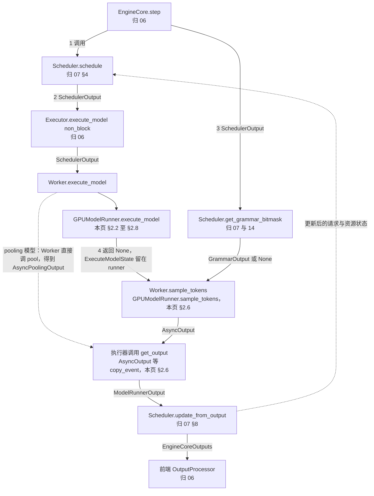
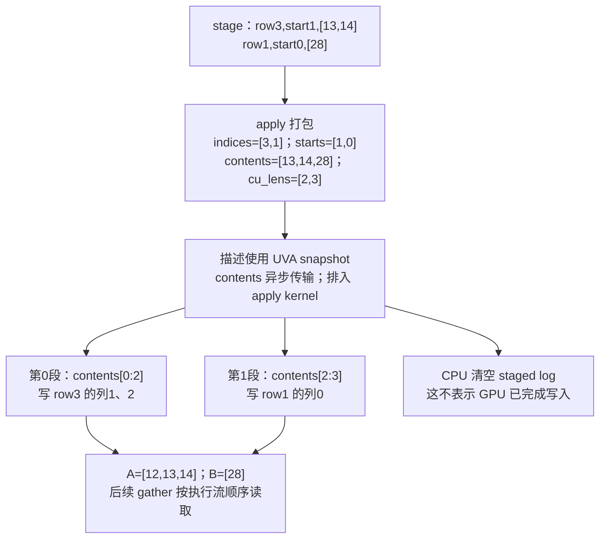
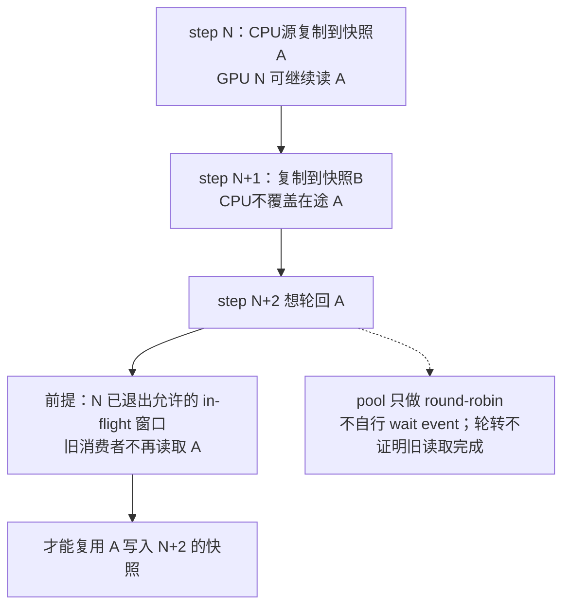
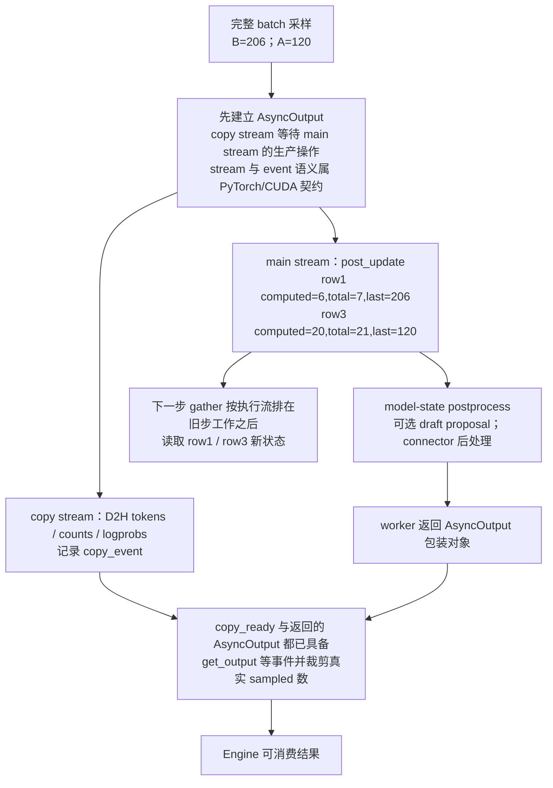
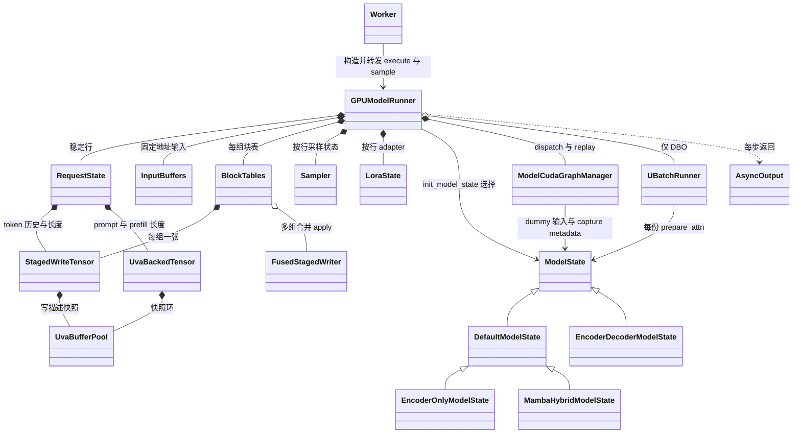

# vLLM Model Runner V2：固定请求行、ModelState 与异步推进怎样生成每步输入

> **源码基线**：`vllm-project/vllm@199cb9b964822e59ab9b58d88e7be31eb419a2ae`（`main`，2026-09-07）
> **主题**：先用单步闭环与核心流程清单定位 MRV2，再确定何时走它；随后用两条请求换序的小例解释稳定请求行、分阶段写入与按步 gather，说明 ModelState 接口、采样后分流推进、受限微批切片与 CUDA Graph 地址生命周期；最后闭合启动顺序与单步交接契约，给出代码路径、相邻接缝、能力矩阵与约束成本、配置契约。核心代码在 `vllm/v1/worker/gpu/`。
> **适用范围**：V1 Engine 内的 Model Runner V2；Core 的 step 与 batch queue 归 06，调度归 07，KV 分配与 Scheduler 侧 CoW 引用归 08，注意力归 10，MRV1 归 11，采样算法归 14，多模态细节归 15，投机解码归 16，DP/EP 归 18，全局编译策略归 19，connector 归 22。
> **最近更新**：2026-09-11。按特性分析重组全页，补核心流程清单、单步闭环图与 SchedulerOutput/ModelRunnerOutput 交接契约，新增 ModelState 抽象，Scheduler 侧 CoW 引用说明移交 08。

## 1. 特性概览

### 1.1 问题：换执行顺序时，长期状态要不要跟着搬？

V1 Engine 的 worker 可以构造两代 runner：MRV1（Model Runner V1，`vllm/v1/worker/gpu_model_runner.py`）与 MRV2（Model Runner V2，`vllm/v1/worker/gpu/model_runner.py`）；GPU worker 直接使用 MRV2，XPU、CPU worker 各用继承它的平台子类（§2.1）。设 worker 最多保存 4 条请求，free list 为 `[0,1,2,3]`；A、X、B 依次加入，`pop()` 从末尾分配，三者进入 state row 3、2、1。X 完成后 row 2 归还，A 和 B 都留在原行。本步 Scheduler 批准 B 算 1 个 token、A 算 2 个，执行顺序为 `[B,A]`。两代 runner 都利用相邻 step 的 batch 高度重合、只写增量；但 MRV1 的持久 batch 同时就是本步输入排列，空洞要压紧、改序要交换 token、块表与采样等 row-local 状态，还要以 `CachedRequestState` 保留 batch 外的请求镜像并处理异步投机的 draft 修正（见 [[11_vllm_model_runner_v1_analysis|Model Runner V1]]）。异步调度下，CPU 为 N+1 步写 host 缓冲时 GPU 可能仍在读 N 步的同一块内存。问题因此是：怎样从长期状态为每步生成连续输入，既不为改序搬家，也不让 CPU 停下来等 GPU。

### 1.2 解决方法

MRV2 把**请求的长期存放位置**与**本步执行顺序**分开：请求在生命周期内占一条固定 state row，本步只生成 batch row → state row 的映射 `idx_mapping=[1,3]`，由 GPU kernel 按映射 gather prompt、进度、上一步采样与块表。CPU 对长期状态只记差量（`StagedWriteTensor`），经轮转的 pinned 快照（`UvaBufferPool`；UVA 即统一虚拟寻址，GPU kernel 可直接读写 pinned host 内存）交给 GPU，不覆盖在途读取；模型专属的输入与状态交给 `ModelState` 接口，runner 本体只保留所有模型共有的路径。采样后，D2H 输出复制与下一步所需的 GPU 状态推进分成两条依赖链；固定地址的输入缓冲让 CUDA Graph 可按 descriptor 复放。

### 1.3 收益、成本与约束

| 维度 | 直接收益 | 必付成本或边界 |
|---|---|---|
| 稳定行 + 按步 gather | 改序、空洞不搬长期状态，无需 batch 外镜像 | 按 `max_num_seqs` 预分配并留空洞；每步多一次 GPU 间接寻址 |
| staged 差量写 | 块表等大表只传增量，一个 kernel 落地 | 描述打包、H2D 与 apply kernel；不提供重叠写的事务语义 |
| UVA 快照环 | CPU 可继续改真值，在途 GPU 读旧快照 | 池深须覆盖在途 step 数；池本身不等 event |
| `ModelState` | 模型差异不进入通用 runner，模型可自带状态类 | 钩子多为默认空实现，漏调用不报错；部分变体拒绝 DBO（dual batch overlap：一步拆成两个微批，让一份的专家 all-to-all 与另一份的计算交叠）或 prompt embeds |
| 异步输出 | D2H 与下一步 GPU 状态推进互不等待 | 在途输出占内存；Engine 可见结果晚于 GPU 推进 |
| 固定地址 + graph | 静态 buffer 可被 FULL/PIECEWISE graph 复用 | capture 时间与显存；descriptor 不匹配即回 eager |
| 受限 DBO | 两个微批的通信与计算交叠 | 仅显式 V2、DP>1、无 graph 等条件；只切 forward，不切采样 |

这些权衡由设计文档与实现重建（**分析推断**），本页没有性能实测。

### 1.4 术语与小例

| 名称 | 本页含义 |
|---|---|
| state row / batch row | 请求长期占用的 `RequestState` 行 / 本步输入中的第几条请求 |
| `idx_mapping` | batch row → state row，本例为 `[1,3]` |
| q、computed | 本步调度的 query token 数 / 已计算 token 数（GPU 为真值，CPU 为乐观上界） |
| `prompt_len`、`prefill_len` | 用户原始 prompt 长度 / 本次加入需预填的完整前缀，恢复时含已有输出 |

小例使用普通 causal attention，无 LoRA、投机或 context parallel。A 的 prompt/prefill 都是 20、已计算 18，token id 取 `100 + position`；B 的 prompt/prefill 是 5、已计算 5，上一步采出 205，总 token 数为 6。块表 A 为 `[12,13]`、B 为 `[28]`，并假设 manager block 与 kernel block 都是 16 token（`BlockTables.blocks_per_kv_block` 为 1），于是 slot mapping 为 `[453,210,211]`，与 [[10_vllm_attention_backends_analysis|Attention Backend]] 的小例一致。容量、token id、块号都是教学值。

### 1.5 位置：MRV2 在 EngineCore 一步里接什么、交什么

MRV2 不决定调度，也不直接把结果交给前端；它夹在 Scheduler 的计划与结果对账之间。下图沿 `EngineCore.step()` 走一轮，边上标注交接对象，节点注明归属页：Core 的 future 配对与 batch queue 归 [[06_vllm_engine_architecture_analysis|Engine 运行]]，计划形成与对账归 [[07_vllm_scheduler_analysis|Scheduler]]，grammar mask 的含义归 [[14_vllm_sampling_structured_output_analysis|采样与结构化输出]]。

<!-- 图规格：单步闭环的交接拓扑，不是时间比例图。Core依次调schedule、非阻塞提交execute_model、再算grammar bitmask；runner在末PP rank返回None，结果留在ExecuteModelState；Core随后以GrammarOutput调sample_tokens；worker返回AsyncOutput，执行器get_output后得到ModelRunnerOutput交update_from_output，产出EngineCoreOutputs并更新下一轮状态。边上只写交接对象，编号表示Core发起的先后。pooling模型用虚线表示：Worker直接调pool，不经sample_tokens。 -->


两处容易读错。其一，Core 先非阻塞提交 `execute_model`，再在 CPU 上算 grammar bitmask，然后才 `future.result()`；两者因此可能重叠（**分析推断**，未测）。MRV2 的 `execute_model()` 在末 PP rank 返回 `None`，结果留在 `ExecuteModelState`，Core 见到 `None` 才调 `sample_tokens(grammar_output)`；pooling 模型由 `Worker.execute_model()` 直接调 `pool()` 返回，不经 `sample_tokens`；非末 PP rank 把 `IntermediateTensors` 交给下一 rank（18）。其二，`AsyncOutput` 只是 worker 返回的包装，执行器调用 `get_output()` 后才变成 `ModelRunnerOutput`（§2.6）。

开启 batch queue（`max_concurrent_batches > 1`，与 §2.3 的快照池深同源）时，Core 改用 `step_with_batch_queue()`；future 与原计划的配对、重放与推迟采样归 [[06_vllm_engine_architecture_analysis|Engine 架构]] §4。从 runner 侧只看得到五点差别：`execute_model` 仍以 non_block 提交，但队列未满时 Core 不等结果就返回去排下一批；本批结构化输出要用上一批的 token 才能算 bitmask 时（`pending_structured_output_tokens`），`sample_tokens` 推迟到旧批对账之后才调用；本批没有任何 scheduled token 时 `model_executed` 仍为假，Core 不采样，直接把 `execute_model` 的 future 入队（runner 内对应 §2.10 的 `no_forward` 分支）；pooling 模型同样不调 `sample_tokens`；EC producer 实例（`is_ec_consumer` 为假）不把本批记为已执行，也不采样。placeholder 与 MRV2 GPU 端 last-sampled 的对应见 §2.10。

### 1.6 核心流程清单

| 核心流程 | 触发与上游输入 | 输出与交接对象 | 下游消费者（归属页） | 本页位置 |
|---|---|---|---|---|
| runner 选择 | `VllmConfig` 构造时的解析与 validator；`Worker.init_device` 读 `use_v2_model_runner`、`is_mm_encoder_only` | 构造好的 `GPUModelRunner`（或 MMEncoder、XPU、CPU 子类）；`max_concurrent_batches` | Worker 与后续全部流程；Scheduler 读同一开关（07） | §2.1、§5.1 |
| 稳定行上的请求增删 | `SchedulerOutput.scheduled_new_reqs`、`finished_req_ids`、`preempted_req_ids` | `RequestState` 行号与双向映射；ModelState、块表、Sampler、LoRA 的按行登记 | 本页 gather 与采样；块号来源归 08 | §2.2 |
| staged 写入与快照 | add/update 路径 stage 的差量；`scheduled_cached_reqs.new_block_ids` | 排入 stream 的 apply kernel；轮转的 UVA 快照 | 本步 gather 与其他 kernel 读者 | §2.3 |
| 每步 gather 与输入准备 | `num_scheduled_tokens`、`scheduled_spec_decode_tokens` 与稳定行 | `InputBatch`：`idx_mapping`、`query_start_loc`、`input_ids`、`positions`、`seq_lens`、`logits_indices` | attention 交接、forward、采样 | §2.4 |
| attention metadata 交接 | `InputBatch`、稳定块表、`kv_cache_config` | gather 后的块表、slot mapping、每层 metadata dict | attention backend 与 metadata builder（10） | §2.4、§2.5 |
| ModelState 钩子 | `load_model()` 选类；每步 runner 的固定调用点 | 模型专属 inputs 与 positions、metadata 额外参数、采样后状态 | runner 的 forward 与采样；多模态细节归 15 | §2.5 |
| forward | dispatch 协商出的 `BatchExecutionDescriptor`；`model_inputs` | hidden states 存入 `ExecuteModelState`；非末 PP 为 `IntermediateTensors` | 采样；下一 PP rank（18） | §2.7、§2.8 |
| 采样与 post_update | Core 以 `GrammarOutput` 调 `sample_tokens()` | `SamplerOutput`；GPU 稳定行上的 computed、last sampled 与 token 历史 | `AsyncOutput`；下一步 gather；投机 draft（16） | §2.6 |
| pooling 输出 | pooling 模型的 `Worker.execute_model()` 见 runner 返回 `None` 后直接调 `GPUModelRunner.pool()`，不经 `sample_tokens` | `AsyncPoolingOutput`；其 `get_output()` 填 `pooler_output` | `Scheduler.update_from_output()` 见到输出即停止请求（07 §8.4）；pooler 与 `PoolingRunner` 内部本域暂无专页 | §2.6 |
| 异步输出交付 | worker 把 `AsyncOutput` 交回执行器 | `AsyncOutput.get_output()` 得到 `ModelRunnerOutput` | `Scheduler.update_from_output()` → `EngineCoreOutputs`（07 §8、06） | §2.6、§2.10 |
| 启动 | `EngineCore.__init__` 构造 executor 并调 `_initialize_kv_caches` | 加载好的模型与 ModelState；KV cache 与块表；预热结果与 captured graph | Scheduler 构造与首个 step（06、07） | §2.9、§3.2 |

## 2. 机制：从一个 step 到整条执行路径

### 2.1 先确定变体：哪些配置真的走 MRV2

**触发与完成点。** 配置在 `VllmConfig` 构造时解析并校验，`Worker.init_device` 读结果构造 runner；完成点是 runner 对象构造完毕，缺能力的显式选择此前已以 `ValueError` 失败。

变体集合来自这些源码选择点：`VllmConfig.use_v2_model_runner` 决定两代 runner；GPU 的 `Worker.init_device` 在 MRV2 下按 `is_mm_encoder_only` 改用只跑 encoder 的 `MMEncoderModelRunner`；`resolve_model_state_cls` 决定模型状态类（§2.5）。同一开关还有兄弟选择点：`XPUWorker` 构造继承 MRV2 runner 的 `XPUModelRunnerV2`，`CPUWorker` 构造同样继承它的 `vllm/v1/worker/cpu/model_runner.py::CPUModelRunner`，容错用的 `WorkerSentinel` 也按该开关选择清理请求的方式。这些 MRV2 平台子类与 encoder-only runner 本域暂无页面，本页只分析 GPU 上的 `GPUModelRunner`；V1 Engine 不等于 MRV1。

| 顺序 | 条件 | 结果 |
|---|---|---|
| 1 | `VLLM_USE_V2_MODEL_RUNNER` 显式 true/false | 用指定 runner；`_validate_v2_model_runner` / `_validate_v1_model_runner` 发现缺能力即 `ValueError`，不静默改选 |
| 2 | 未设变量，ROCm 且 architecture 属 `ROCM_DEFAULT_MRV1_ARCHITECTURES` | 选 V1：`DeepseekV32ForCausalLM`、`DeepseekV4ForCausalLM`、`GlmMoeDsaForCausalLM` |
| 3 | 未设变量，Triton 不可用 | 选 V1；显式 V2 缺 Triton 则报错 |
| 4 | 未设变量，MRV2 blocker 非空 | warning 并选 V1；V1 自身 blocker 仍须通过 |
| 5 | 以上都不触发 | 默认 MRV2 |

第 1、4 步引用的两份能力清单、DBO 的额外限定、replay validator 与 async scheduling 的第二次判定集中在 §5.1。后文只依赖三点：异步与否决定 §2.3 的快照池深；DBO 只在显式启用 V2 时才可能走 §2.7 的路径；模型自带 `get_model_state_cls` 不进入 blocker——LongCat-Flash-Lite 在模型构造时发现未选 MRV2 即抛 `NotImplementedError`，所以因其他 blocker 自动退回 V1 时同样在加载阶段失败，DiffusionGemma 则靠 V1 的 diffusion blocker 保证走 MRV2。

### 2.2 稳定行：请求的长期地址

**触发与完成点。** 每个非 dummy 的 `execute_model()` 开头读 `SchedulerOutput` 的 finished/preempted 与 new 请求，先释放、后分配行；映射在 Python 中立即可见，设备侧初值要到 §2.3 的 apply 排入 stream 才能被后续 kernel 读取。

<!-- 图规格：真实二维状态表与二维batch视图，使用生成器SVG。左边保持4个state row及row2空洞，右边仅两条当步请求；箭头表示batch→state映射而非移动状态。图内给出computed、块表、映射和最终输入，读者可以重建B/A寻址。 -->


`RequestState.add_request()` 从 `free_indices.pop()` 取行，写双向映射，并把 prompt/prefill 长度、token 历史、computed 与 total 长度登记为待写入；`remove_request()` 只删映射并把行号放回 free list，不 condense。新请求 C 会复用刚归还的 row 2；本步未调度的请求仍保留长期行。finish 与 preemption 都走移除，resume 重新加入且不保证回到旧行，设计文档称之为“把抢占当完成”。`finish_requests()` 按排序后的 finished/preempted id 清理，使各 TP rank 的槽位分配顺序一致；源码注释指出 batch-sharded sampling 依槽位推导 rank 归属。

同一 id 也可能再次作为 new request 到来（streaming input）：`add_requests()` 先无条件 `_remove_request()`，再完整 re-add、重新登记 model state，并以 `overwrite=True` 覆盖块表，而不是只改旧对象的 prompt 长度。`_remove_request()` 先调 `model_state.remove_request()`（此时仍能查到行号），再清 `RequestState` 以及 pooling、PP、encoder cache、prompt-logprob、LoRA 等附属状态；行号复用必须伴随这些内容的重建。对应测试检查 free slot 不泄漏、反向映射只剩一个该 id，并核对新的 prompt/prefill 长度。

### 2.3 状态分阶段：固定的是地址，值何时可见各不相同

**触发与完成点。** add/update 路径只 stage 差量；`execute_model()` 在 gather 前依次提交 `RequestState`、ModelState、Sampler 的 apply 与块表 apply。完成点是 apply kernel 已排入当前 stream，设备侧完成语义见本节末的依赖边界。

| 保存的内容 | 谁修改、怎样使用 | 新值何时可消费 |
|---|---|---|
| `req_id_to_index`、反向映射、free list | CPU 管身份与槽位 | add/remove 后 Python 逻辑立即可见；不代表设备初值已写完 |
| `prompt_len`、`prefill_len`（`UvaBackedTensor`） | CPU 真值经 `copy_to_uva()` 复制成 UVA 快照 | 新快照提交后，GPU 后续工作读该快照 |
| `num_computed_tokens_np` | CPU 乐观上界，供 shape/metadata | 不能替代 GPU 真实进度，有 rejected token 时尤其如此 |
| `all_token_ids`、computed/total、last sampled、draft、sampler 与 model state | 稳定 GPU 或 UVA base；staged apply 与 GPU post-update 修改 | 按执行流顺序先于后续读者 |
| `idx_mapping`、`query_start_loc`、`InputBuffers` 切片 | CPU 排序，GPU 按稳定行 gather | 本步 forward 前可用；不持有请求生命周期 |
| sampled token/logprob 等 CPU 输出 | 独立 copy stream 写 host | `AsyncOutput.get_output()` 等 `copy_event` 后才交给 Engine |

`prompt_len` 与 `prefill_len` 不能因本例相等而合并：prompt logprobs 与 frequency penalty 要分开对待 prompt 与输出。`all_token_ids` 形状为 `[max_num_reqs,max_model_len]`，源码注释称它可达数 GB，因此用 `uva_instead_of_gpu=True` 放在 pinned host 上由 GPU 经 UVA 读写；这不是每步整表复制。短而热的状态留在 GPU 或小 `UvaBackedTensor`。

**差量写入。** `StagedWriteTensor` 保留稳定 base，CPU 记四项差量：目标 row、行内起点、拼接内容、内容累计末端。`stage_write()` 只追加 Python 记录；`apply_write()` 才把描述复制进 UVA 快照、把内容异步 H2D，再用一个 Triton kernel 把每段写回对应 row。独立看一次块表更新（这是只演示描述格式的虚构写入，不是贯穿例子的本步：按 [[10_vllm_attention_backends_analysis|Attention Backend]] §2.11 的假设，A 的块 12、13 在首步已分到，本步 A、B 都没有新块，`new_block_ids` 为 None，块表不写）：A 在 row 3 从列 1 写 `[13,14]`，B 在 row 1 从列 0 写 `[28]`，描述为 `indices=[3,1]`、`starts=[1,0]`、`contents=[13,14,28]`、`cu_lens=[2,3]`。第 0 段取 `contents[0:2]` 写 A 的列 1、2，第 1 段取 `contents[2:3]` 写 B 的列 0；A 原列 0 的 12 不动，得到 `[12,13,14]`。这里的 14 只示范预留容量，不增加可见历史。

<!-- 图规格：ragged差量变换是独立算法，使用Mermaid拓扑而非真实存储网格。输入为两条不重叠写记录，中间明确累计长度如何切内容，输出为各稳定row更新后的块号；同时标出apply后清日志不等于GPU完成。 -->


`BlockTables.append_block_ids()` 在 manager block 大于 kernel block 时先把每个块号展开成对应数量的 kernel 块号，写出行容量即 `RuntimeError`。多 KV group 时 `BlockTables.apply_staged_writes()` 用 `FusedStagedWriter` 加入 group id、合并内容与累计偏移，一个 kernel 按组选 base/stride；单组直接 `apply_write()`，无更新即跳过。它减少 launch 与整表拷贝，不提供任意重叠写的事务语义，上例刻意用互不重叠的区间。

**为什么还需要快照环。** non-blocking H2D 返回后 GPU 可能仍在读 host 源；若 CPU 为下一步直接覆盖同一 pinned buffer，GPU 会读到跨步混合值。设计文档指出 MRV1 的 async barrier 必须找全共享源、限制 CPU 工作的组织并可能减少重叠；MRV2 改为分开普通 CPU 真值与供在途工作读取的 pinned 快照。`UvaBufferPool.copy_to_uva()` 每次轮到下一份 buffer，先做 CPU→CPU 复制再交出该份 UVA view；默认深度由 `set_default_max_concurrency(n)` 设为 **`max(2,n)`**，runner 在 `__init__` 中构造任何 pooled buffer 之前以 `max_concurrent_batches` 调用它。该值在异步 MRV2 下为 PP size + 1，否则为 PP size：PP=1 异步时 n=2、池深 2；非异步 PP=1 时 n=1、池深仍为 2；PP=2 异步时池深 3。

<!-- 图规格：深度2的host snapshot生命周期是独立并发机制，使用依赖拓扑而非按比例时间轴。step N用A、N+1用B，N+2只在旧N退出允许inflight窗口后轮回A；明确pool不自行等待事件，CPU普通源与GPU正在读取的快照分离。 -->


以深度 2 为例，第三次提交轮回第一份之前，旧消费者必须已离开 Engine 允许的在途窗口；pool 没有逐槽 event 等待，安全性来自并发上限与提交顺序。构造 `UvaBackedTensor` 时已做过一次快照，不能把“第一次业务提交”硬编码为某个 ring 下标；显式给 `UvaBufferPool` 传深度时，setter 不会替它钳制。

三种 host→device 路径要分清：① `UvaBackedTensor` 保存 CPU 真值和轮转快照；② `async_copy_to_gpu()` 对未 pinned 的 tensor 先 `pin_memory()` 生成副本，已 pinned 时可直接返回原对象，不能声称每次调用都有独立快照；③ `all_token_ids` 的 UVA **base** 是长期地址，由 staged apply 与 post-update kernel 按序写入，不是快照环。行号复用靠设备读写顺序，快照复用靠在途窗口，二者不是同一个 free list。遗漏 apply 会读旧值，池深未随新增并发来源扩大可能回卷覆盖在途源；这是从轮转实现与并发上限重建的**分析推断**，不是本次复现的 race。

**依赖边界。** 上文“GPU 可能仍在读”，以及 §2.6 的跨 stream 等待、§2.8 的 graph 复放与 §4 的“靠 stream 顺序”，都跨进了 PyTorch/CUDA。vLLM 源码能证明的是：快照在哪里分配、换成设备视图与轮转（`UvaBuffer.__init__` 以 `pin_memory=True` 分配，再经 `get_accelerator_view_from_cpu_tensor` 取 UVA 视图）；每步在当前 stream 上依次发出请求状态 apply、zero、CoW copy、块表 apply 与 gather；`AsyncOutput` 在哪里 `wait_stream`、`Event.record` 与 `synchronize`。同一 stream 的执行顺序、event 的完成语义、UVA 读写的一致性以及 CUDA Graph 对指针的绑定，是 PyTorch/CUDA 的公开契约，本页引用而未验证。

### 2.4 把 [B,A] 的稳定行读成三个 token

**触发与完成点。** 请求差量落地、dispatch 协商出 `BatchExecutionDescriptor` 后，`prepare_inputs()` 读本步顺序与稳定行；完成点是 `InputBatch` 返回，准备 kernel 已排在 forward 之前。

本步 q 为 `[1,2]`，前缀和给出 `query_start_loc=[0,1,3]`：B 占 flat `[0,1)`，A 占 `[1,3)`。`prepare_inputs()` 把 `idx_mapping=[1,3]` 异步复制到 GPU，准备 kernel 再按映射读每条请求的 GPU computed。

| 变换 | B：batch 0 → state 1 | A：batch 1 → state 3 | 合并结果 |
|---|---|---|---|
| prefill 输入 | computed=5 已到 prefill=5，跳过 prompt gather | 从 `all_token_ids[3,18:20]` 读 118、119 | flat 1、2 得到 118、119 |
| position 与 seq length | position 5；seq=5+1=6 | position 18、19；seq=18+2=20 | `positions=[5,18,19]`；`seq_lens=[6,20]` |
| 上一步采样输入 | 把 row1 的 last_sampled=205 写 flat 0 | 仍在 prefill 边界内，保留 prompt token | `input_ids=[205,118,119]` |
| 本步要采样的 hidden state | 本请求最后 q 在 flat 0 | 本请求最后 q 在 flat 2 | `logits_indices=[0,2]` |

这些数组含义与 MRV1 相同，来源不同：MRV2 在 GPU 上从稳定行读 prompt、真实进度和 last sampled，无需先在 CPU 拿到 205 再填回。`prepare_attn()` 再按 `[1,3]` gather 块表得到 `[[28],[12,13]]`，结合 positions 得到 slot mapping `[453,210,211]`（28×16+5、13×16+2、13×16+3）；KV 写入与历史读取归 10。

`sort_batch_req_ids()` 先放有 draft 的 verification 请求，再偏好 `num_scheduled_tokens == decode_query_len`，其余按 q 排；同 key 保持原序。源码注释给出理由：attention 侧的 `split_decodes_and_prefills` 依赖 decode 类请求排在最前；它也不是 MRV1 的四区域重排。`get_uniform_decode_token_count()` 还要求没有 prefill，避免短 prefill 恰好 q 相同被判为纯 decode。本例无 draft，累计 logits 数为 `[0,1,2]`，expanded mapping 就是 `idx_mapping`；有 draft 时 runner 生成累计 logits、expanded state index 与 local position，并断言各请求 q 不少于其 logits 数：logits 行取自请求 query 的末尾，行数不够就会读到前一个请求的 hidden state。adaptive verification 还在设备侧压缩输入，CPU 上界与最终 token 数要分开（归 [[16_vllm_speculative_decoding_analysis|投机解码]]）。

其余字段同样按稳定行取值，但不改变请求身份：LoRA adapter id 按 state row 存在 `LoraState`，用 `idx_mapping` 取出后按 q 重复成 token mapping；PCP 分区输入，DCP 生成本 rank 的局部 seq length（均归 [[18_vllm_distributed_inference_analysis|分布式推理]]）；padding 只改变执行容量。多模态 embedding、模型专用 positions 和非首 PP rank 的 intermediate tensors 经 §2.5 的 ModelState 或模型输入接缝进入，不能假定所有模型只吃上表三个数组。

### 2.5 ModelState：模型差异从哪里接入

**触发与完成点。** 状态类在 `load_model()` 选定一次；此后每步由 runner 在固定调用点触发钩子（下表），每个钩子返回即为其完成点，不另设同步。attention metadata 的交接也在这里完成：`prepare_attn()` 返回的每层 metadata dict 进入 forward context，交给 [[10_vllm_attention_backends_analysis|Attention Backend]]。

**为什么要一层接口。** `model_runner.py` 的模块注释要求该文件只含所有模型共有的代码，模型专属行为放进模型专属文件；设计文档第 7 节以此对比 MRV1 庞大而纠缠的 `gpu_model_runner.py`。被拒绝的直观做法是在 runner 里继续按模型类型加分支（encoder-decoder、hybrid、M-RoPE、prompt embeds……），判据是公共路径保持稳定、新模型接入不改 runner：LongCat-Flash-Lite、DiffusionGemma、Qwen4Exp 正是自带状态类接入。以上是源码注释与设计文档陈述的意图；“钩子因此这样分段”是**分析推断**。runner 仍保留少量模型判断，例如 encoder-decoder 有 encoder 输入时强制 eager、`uses_inputs_embeds` 只在首 PP rank 生效、pooling runner 独立构造，委托并非全部。

**变体集合与选择顺序。** 唯一选择点是 `resolve_model_state_cls`，由 `load_model()` 经 `init_model_state` 在模型加载后调用一次，按序命中即返回：① 模型定义了 `get_model_state_cls` 就用模型给的类（`LongcatNgramModelState` 继承 Default，`DiffusionGemmaModelState` 直接继承 `ModelState`，`vllm/models/qwen4_exp` 的 `Qwen4ExpModelState` 继承 MambaHybrid）；② 任一模块是 `CrossAttention` → `EncoderDecoderModelState`；③ 任一 attention 层 `attn_type == ENCODER_ONLY` → `EncoderOnlyModelState`；④ `model_config.is_hybrid` 或 `is_attention_free` → `MambaHybridModelState`；⑤ 否则 `DefaultModelState`。随后若开启 `enable_prompt_embeds` 而该类 `supports_prompt_embeds=False`（基类默认值、EncoderOnly、LongCat），`init_model_state` 直接 `ValueError`；`EncoderDecoderModelState` 也在构造时拒绝。

**钩子在一步中的位置。** 接口只把 `prepare_inputs_embeds`、`prepare_inputs`、`prepare_dummy_inputs`、`prepare_attn` 设为抽象方法，其余默认空实现：

| 阶段 | runner 调用点 | ModelState 钩子与契约 |
|---|---|---|
| 加载 | `load_model` | 构造时（有多模态）建立 encoder runner；`num_new_sampled_tokens_per_step` 参与 `decode_query_len`；`custom_sampler()` 可替换 sampler 与 rejection sampler |
| 建 KV | `initialize_kv_cache` | `get_additional_cg_support()` 收窄 graph 支持（EncoderOnly 自建的 attention group 在此上报）；`UBatchRunner` 持有同一 model state，draft-model speculator 经 `set_attn()` 拿到它 |
| 请求增删 | `add_requests` / `_remove_request` | `add_request(req_index, new_req_data)` 以 state row 为下标登记；全部新请求后 `apply_staged_writes()` 紧跟 `RequestState` 的 apply；`remove_request(req_id)` 先于 `RequestState` 移除 |
| 本步准备 | `execute_model` | runner gather 块表后 `preprocess_state()`（仅真实 batch）；`prepare_attn()` 经 `build_attn_metadata` 组装 metadata，`ModelSpecificAttnMetadata` 可按 KV group 注入额外参数；首 PP rank 调 `prepare_inputs_embeds()`；`prepare_inputs()` 返回的 dict 覆盖默认 `input_ids/positions/inputs_embeds` |
| capture | `ModelCudaGraphManager.capture` | `prepare_dummy_inputs()` 与 `prepare_attn(for_capture=…)` 提供静态输入；`encoder_runner` 的 graph 另行 capture |
| 采样后 | `sample_tokens` → `postprocess_sampled` | `post_update` 之后 `postprocess_state(idx_mapping, num_sampled, num_computed)`；多模态 speculator 前先 `gather_mm_embeddings(draft_lookahead=1)`；非末 PP rank 平时在下一步开头经 `update_pp_decode_requests()` 走同一 `postprocess_sampled`，仅当 `not all_decode_next`（本步可能含非末 prefill chunk）时由 `sample_tokens()` 以 `num_sampled=0` 直接调用 |

`execute_mm_encoder()` 由 `DefaultModelState.prepare_inputs_embeds()` 在 gather 多模态 embedding 之前调用；`MMEncoderModelRunner` 这类不跑语言模型的 runner 也直接调用它，只编码并写入 encoder cache。

**用小例重放 DefaultModelState。** A/B 是纯文本、一维 RoPE，`get_rope_state()` 只在 M-RoPE（3 维位置）或 XD-RoPE（维数取 `ModelConfig.uses_xdrope_dim`）时建状态，因此 `rope_state` 为 None；未开 prompt embeds，也没有 encoder cache。于是 `add_request` 与 `apply_staged_writes` 不写任何东西，`uses_inputs_embeds=False` 让 runner 跳过 `prepare_inputs_embeds`，`prepare_inputs()` 返回空 dict，模型直接吃 §2.4 的 `input_ids=[205,118,119]` 与 `positions=[5,18,19]`。`prepare_attn()` 在非 FULL 模式取未 padding 的 2 条请求、3 个 token，CPU 侧 query 起点 `[0,1,3]`、`max_query_len=2`，用 CPU 上界 `[5+1,18+2]` 得 `max_seq_len=20`，再把块表 `[[28],[12,13]]`、`seq_lens=[6,20]` 与 slot mapping 交给各 KV group 的 builder。FULL graph 下改用 padding 后的请求与 token 数，capture 时 `max_seq_len` 取 `max_model_len` 以覆盖任意复放。`postprocess_state` 是空操作。

**内置变体各自回答什么压力。**

| 变体 | 回答的问题 | 本地工作与状态 | 边界 |
|---|---|---|---|
| `DefaultModelState` | decoder-only，含 M-RoPE/XD-RoPE、多模态与 prompt embeds | `RopeState` staged 位置；`PromptEmbedsState` 加入时一次 H2D、每步一个 kernel 覆盖；`MultiModalPruner` 处理 EVS（Efficient Video Sampling：Qwen2.5-VL 等裁掉部分视频 embedding），重算位置后立即 flush staged writes | 多模态与 prompt embeds 细节见 [[15_vllm_multimodal_execution_analysis|多模态执行]] |
| `EncoderDecoderModelState` | cross-attention 模型（Whisper 等） | encoder 输出作 forward kwarg，并为含 cross-attention 的 KV group 注入 encoder seq lens；数据流见 [[15_vllm_multimodal_execution_analysis|多模态执行]] | 拒绝 prompt embeds；`ubatch_idx` 非 0 即断言 |
| `EncoderOnlyModelState` | BERT 类双向注意力，无 KV cache | 自建非 causal attention group 与空 KV、dummy 块表与 slot mapping；按 pooling 参数生成 `token_type_ids` | 不支持 prompt embeds；断言无 DBO |
| `MambaHybridModelState` | hybrid attention + Mamba/线性注意力 | 每行 `num_accepted_tokens`（加入时重置为 1）；`mamba_cache_mode='align'`（开 prefix caching 时的默认，只缓存落在块边界上的步末 Mamba 状态）下，forward 前以 GPU kernel 跨块迁移状态，采样后按 `idx_mapping` scatter 接受数并做 align 后处理；Kimi-K3 KDA 的 RecoverSSM 投机路径（`VllmConfig.validate_mamba_cached_kernel` 仅在 `CacheConfig.use_replayssm` 开启且投机 token 数大于 0 时置 `use_kda_recoverssm`，并只接受 KimiLinear/Kimi-K3 架构）另由 `RecoverSSMState` 在 `prepare_attn` 末尾收集 `RecoverSSMMetadata`，采样后以实际 `num_sampled` 提交，把运行块列更新为 `(computed+sampled)//块长` 并将接受数复位为 1 | 所有 Mamba 组须共享块长等参数（assert）；断言无 DBO；块与 checkpoint 语义见 [[08_vllm_kv_cache_management_analysis|KV Cache 管理]] §5.1.2 |

**成本与失效边界。** 状态类在加载时选定一次，每步只多几次 Python 调用（分析推断：相对 kernel launch 可忽略，未测）。默认空实现意味着新状态类若 stage 了写入却没在 `apply_staged_writes()` 提交，只会读到旧值而不报错；`MultiModalPruner` 在 gather 后显式 flush 正为此。ModelState 不负责排序、调度或主采样路径。同一“按模型或配置选择实现”的关注还有兄弟轴：attention backend 与 metadata builder 归 10，sampler 与 rejection sampler 归 14/16，speculator 归 16，PCP manager 归 18，graph mode 归 19；batch-sharded sampling 归 [[14_vllm_sampling_structured_output_analysis|采样]] §4.6；pooling runner 目前没有专页，只在本页与 11 提及。

### 2.6 采出 token 后，下一步 GPU 与 Engine 不必同时看见它

**触发与完成点。** `execute_model()` 在末 PP rank 返回 `None` 后，Core 以 `GrammarOutput`（无结构化输出时为 None）调 `sample_tokens()`。完成点有两个：GPU 稳定行的 post-update 排入 stream（下一步 gather 的前提），以及执行器 `get_output()` 返回 `ModelRunnerOutput`（Engine 可见）。

`execute_model()` 把本步 input batch、attention metadata、hidden states 等存进 `ExecuteModelState`；`sample_tokens()` 取走并清空它，为空说明前一次 execute 失败，直接返回 None。最后一个 PP rank 按 `logits_indices` 选 hidden states、算 logits、应用可选 grammar bitmask，再走普通 sampler 或 rejection sampler；batch-sharded sampling 按 rank 分配 logits 工作后 gather 回完整输出。非末 PP rank 走接收并推进 computed 的分支，pooling 走 `pool()` 与 `AsyncPoolingOutput`，不能把每个执行结果都当作 token sampler 输出。

**pooling 输出流。** 触发：`runner_type == "pooling"` 的模型在 `execute_model()` 返回 `None` 后，由 `Worker.execute_model()` 直接调 `GPUModelRunner.pool()`，Core 因而拿到非 `None` 结果，不再调 `sample_tokens`；batch queue 下 Core 直接把 `execute_model` 的 future 入队。`pool()` 取走 `ExecuteModelState`，先做 KV connector 后处理，再由 `PoolingRunner.pool()` 按 `InputBatch` 与稳定行算出 pooler 输出与逐请求的 `finished_mask`，构造 `AsyncPoolingOutput`（copy stream 只复制已完成请求的输出），最后推进 GPU computed；非末 PP rank 只推进 computed 并返回 connector 输出。完成点是执行器调 `AsyncPoolingOutput.get_output()` 填好 `pooler_output`，`update_from_output()` 见到结果即把请求置为 `FINISHED_STOPPED`（07 §8.4）。pooler 算法与 `PoolingRunner` 的内部状态本域暂无专页。

假设本例采出 B=206、A=120，各自 `num_sampled=1`、`num_rejected=0`。GPU `post_update` 按 `[1,3]` 写回：

| state row | computed 更新 | total length 与 last sampled | token 历史追加 |
|---|---|---|---|
| B：1 | 5 + 本步 q 1 − rejected 0 = 6 | total 6→7；last=206 | 位置 6 写 206 |
| A：3 | 18 + 本步 q 2 − rejected 0 = 20 | total 20→21；last=120 | 位置 20 写 120 |

有拒绝时 computed 增量是 q 减 rejected，total 增量是实际 sampled 数，不能用计划的 draft 数代替；需要时还更新 penalty 的 token 计数。随后 `model_state.postprocess_state()` 推进模型专属状态，speculator 再产生并保存下一步 draft。

<!-- 图规格：逻辑依赖拓扑，不是时间栅格。共同采样结果分别进入copy stream和main-stream post_update；主分支还要完成model-state处理、可选draft和connector并返回包装对象。Engine同时需要返回对象与copy_ready才消费；下一步GPU读取稳定行仍依赖post_update，不能把D2H就绪当worker已返回。图只表达vLLM放置wait/record的位置，stream与event的完成语义是PyTorch/CUDA公开契约，未在本页验证。 -->


源码先建 `AsyncOutput` 再排 `postprocess_sampled`，注释说明这样 D2H 不必等后处理。`AsyncOutput` 保留设备结果引用，copy stream 先 `wait_stream(main_stream)`（等待语义见 §2.3 的依赖边界），复制 tokens、计数、logprobs、prompt logprobs 与可选的 NaN 计数、采样 mask、路由专家和 EP 故障标志，再记录 `copy_event`；`get_output()` 等该 event、裁剪到真实 sampled 数并转成 Python 列表，检测到 EP 故障即抛错。worker 主分支还要完成 model-state 后处理、可选 draft 与 connector 后处理才返回这个包装对象；执行器随后才调用 `get_output()`（多进程时在 worker 进程的 `WorkerProc.enqueue_output` 里）把结果送回 Engine。copy event 单独就绪不代表 Engine 已拿到输出；GPU 状态已推进也不代表 Engine 已读到结果，CPU 读到结果更不是下一步 GPU token 的必经回填。这实现了 CPU 准备下一步与设备本步工作重叠的设计意图，但不能推出所有配置“绝无 CPU 等待”：结果等待、DP 协商、微批线程 join、诊断与 offload 仍有各自的同步边界。Engine 的 batch queue 与 Scheduler placeholder/stale-output 协议归 [[07_vllm_scheduler_analysis|Scheduler]]，整条 Engine 链路见 [[02_vllm_architecture_overview_analysis|架构概览]]。

### 2.7 一个请求跨两个微批，后半段该看到多少历史？

**触发与完成点。** 只有 dispatch 协商出 `num_ubatches>1` 时才触发；读整批 `InputBatch`、块表与 slot mapping，决定每份的请求/token 切片与 metadata。完成点是全部微批线程 join、hidden states 拼回整批。

DBO 的配置限制见 §5.1。先看最易错的局部变换：假设 DP 协商后上例 3 个真实 token 补齐到 4，分两份、每份容量 2；这个切点只是教学值，默认阈值（纯 decode 32、含 prefill 512 token）不会让三个 token 触发 DBO。

U0 取 flat `[0,2)`，含 B5、A18；U1 取 `[2,4)`，含 A19 与 padding。A 同时出现在两份中。每份 query 边界减去 token 起点并裁到本份范围；seq length 只扣**该份末尾之后仍未计算的 q**：

- U0 的 `query_start_loc=[0,1,2]`、`seq_lens=[6,19]`。A 原 seq=20，但 A19 还在未来，所以扣 1。
- U1 的 `query_start_loc=[0,1]`、`seq_lens=[20]`，只有 1 个真实 token、容量 2。A18 已在前一份计算，属于当前历史，不能再扣一次。

<!-- 图规格：真实token轴与两份局部metadata并列，使用生成器SVG；4格包含一个padding，切点在2，A跨两份。明确qsl偏移/裁剪及只扣未来query的seq变换，输出hidden合并后整批采样；不表达线程耗时。 -->


`maybe_create_ubatch_slices()` 以 padding 后 token 数的中点切分，按累计 token 找出与每段重叠的请求；`create_ubatch_slices()` 把落在 padding 里的尾段夹到最后一个真实请求，使全 padding 的一份保持零 query、像 dummy run 一样无工作。`_slice_input_batch()` 为每份建独立 `InputBatch`：`query_start_loc`、`seq_lens` 写入 `UBatchRunner` 预分配的专用缓冲以保持地址稳定，多数其他字段只是整批 view，CPU seq 上界则 clone 后调整，因此“除两个 tensor 外一概零拷贝”也不准确。logits 与 draft 字段保留**整批描述**，微批 forward 不能据此分别采样；各份 hidden states 拼回后 `sample()` 只对整批调用一次。

`sync_cudagraph_and_dp_padding()` 用一次 CPU all-reduce 交换各 rank 的 token 数、graph mode、uniform 长度与是否允许微批。微批是全有或全无：专家 all-to-all 是 collective，所有 rank 必须以同一 token 数拆分与 padding（该函数注释），所以只有全部 rank 允许、且最小 rank 的 token 数过阈值（全员 uniform decode 用 decode 阈值，否则用 prefill 阈值）时，才以最大 token 数为共同 padding、eager 执行并拆成 `num_ubatches` 份；任一 rank 不允许就都不拆，token 少到填不满一份的 rank 像 dummy run 一样空转。`UBatchRunner.prepare()` 为每份调用 `model_state.prepare_attn(..., ubatch_idx=i)`；`run()` 每份一个线程、各自的 forward context，在模型内通信点交接 GPU。某份线程抛错时 runner 报告失败的是哪一份，但源码注释承认其余线程不会被唤醒，step 可能挂住。DCP+DBO 未验证：切片保留整条 `dcp_local_seq_lens` view，不能把它当支持声明。

### 2.8 固定地址怎样进入 capture，又怎样在不兼容时退出

**触发与完成点。** capture 在启动的 `compile_or_warm_up_model()` 中触发（§2.9），dispatch 与 replay 在每步 `execute_model()` 中触发；完成点分别是 `capture_model()` 返回并锁定 workspace，以及本步 replay 或模型调用返回。

`InputBuffers` 按最大请求/token 数预分配，真实步往同一地址写动态值；`get_dummy_block_tables()` 返回 forward 使用的同一持久 tensor 并清零，避免 dummy run 经旧块号写入已回收的块。地址稳定只是必要条件，还要匹配已捕获的 shape 与执行语义。

| 阶段 | 本地 runner 的实际动作 | 失败/退出边界 |
|---|---|---|
| resolve | KV/attention 初始化后，结合各组 graph support、ModelState 的附加支持、decode q、TP/cache 形态解析 mode，建立 manager | attention 能力限制模式；adaptive verification 强制 FULL_AND_PIECEWISE；全局降级规则归 19 |
| capture | 构造候选 descriptor，按 PIECEWISE 再 FULL 预热/capture；FULL 与 breakable PIECEWISE 会重建 capture metadata | piecewise 既无 compiled submodule 又未启用 breakable graph 时明确报错 |
| dispatch | 找 token/request 容量、uniform 条件、最大 q、有效 LoRA bucket、`num_ubatches` 兼容的候选 | 未 capture、无匹配，或 profile、encoder-decoder 有 encoder 输入时选 `NONE` |
| replay | FULL 直接 replay 绑定固定 buffer 的 graph；PIECEWISE 调用相应 runner；NONE 正常调用模型，仍可能经过 compiled callable | FULL 切入前等待 offload copy，防止静态 buffer 被旧传输覆盖 |

兼容不等于数值完全相等：`_is_compatible` 要求候选的 token/请求容量不小于实际值，uniform 长度与 max query 按 descriptor 条件检查，有效 LoRA bucket 与微批数必须相等；padding 必须与所选 descriptor 一致，不能因输入地址没变就忽略 shape。

启动顺序：`Worker.compile_or_warm_up_model()` 先跑 compile 尺寸的 `_dummy_run`，再在 `capture_model()` **之前**调用 MRV2 的 `warmup_kernels()`；源码注释说明 capture 之后若扩大 workspace 会释放 graph 已引用的旧指针（graph 如何绑定指针属 §2.3 所说的 PyTorch/CUDA 契约）。`capture_model()` 随后设置占位 LoRA、capture encoder/decoder/speculator graph，并在非 profile 路径 `lock_workspace()`，这是地址生命周期约束。

`_dummy_run` 不创建真实请求生命周期：它构造空 `SchedulerOutput` 交给 `execute_model(dummy_run=True)`，后者跳过稳定行的 add/remove/update，改用 `InputBatch.make_dummy` 的占位输入；capture 走独立的 `capture_model()`。dummy token 分配均衡余数，避免余数全堆到末请求。capture 的 attention metadata 不能省略：除标准 attention，还有持有专门状态的 attention-like 运算需要 metadata；FULL 用 `for_capture=True`，PIECEWISE 用 False。graph 显存估算 `profile_cudagraph_memory()` 用临时 pool 只 capture 最大的两张 FULL graph 并外推，成功与失败路径都清图、model/attention 缓存、临时 manager 与绑定并恢复原 pool；测试覆盖禁用、采样外推、piecewise-only 与 capture 抛错后的 teardown。这降低了多义 dummy 入口的语义混淆，不能据此宣称相关错误都已消除。更广的编译策略、全局降级与启动成本归 [[19_vllm_compilation_cudagraph_analysis|编译与 CUDA Graph]]。

### 2.9 启动：EngineCore 驱动的初始化顺序

**触发与完成点。** `EngineCore.__init__` 触发全部启动工作，runner 只响应 executor 转发的 RPC；完成点是 `compile_or_warm_up_model()` 返回，其后 Core 才创建 `StructuredOutputManager` 与 Scheduler，进入第一个 step。

| 阶段 | 谁驱动、读入什么 | 决定什么 | 结果流向 |
|---|---|---|---|
| 构造 executor | `EngineCore.__init__` 调 `executor_class(vllm_config)`；`Executor.__init__` 进入 `_init_executor`，各 worker 依次 `init_device`、`load_model` | runner 种类（§2.1）；`set_default_max_concurrency`；按 `max_num_seqs`、`max_num_batched_tokens` 预分配稳定行与输入缓冲；加载模型后选 ModelState 与 sampler（§2.5） | 就绪的 runner 与模型 |
| 收集 KV 需求 | `EngineCore._initialize_kv_caches` 调 `get_kv_cache_specs` | 各层 KV spec，并解析 KV 布局 | Core 侧容量规划（08） |
| 测显存 | `determine_available_memory` → `Worker.determine_available_memory`；elastic EP 扩容启动沿用已记下的可用显存、没有 KV cache 的模型直接记 0，二者都跳过这一步 | `profile_run()` 以最大 token 数跑一次跳过 attention 的 dummy forward，再跑 dummy sampler 或 pooler；未显式给 `kv_cache_memory_bytes` 时，CUDA-like 平台且 graph 模式非 NONE 再 `profile_cudagraph_memory()` | 可用于 KV 的字节数回到 Core |
| 分配 KV | Core 生成 `KVCacheConfig` 后调 `initialize_from_config` → `Worker.initialize_from_config` → `initialize_kv_cache` | attention backend、块表、微批 runner、graph mode 与 manager、KV tensor 与 connector | 块表与 graph manager 就绪；Scheduler 用同源配置（08） |
| 预热与 capture | 非 elastic EP 扩容启动时调 `compile_or_warm_up_model` | compile 尺寸 dummy run → `warmup_kernels()` → `capture_model()` 并锁 workspace | 固定地址与 graph 就绪（§2.8） |

`profile_run()` 也经 `_dummy_run` 进入 `execute_model(dummy_run=True)`，不经过稳定行的 add/remove；`profile_cudagraph_memory()` 在正式 KV 之前临时建最小 KV 并事后拆除（§2.8）。KV 容量怎样由这些字节数算出归 [[08_vllm_kv_cache_management_analysis|KV Cache 管理]]；Core 的启动握手与进程拓扑归 [[06_vllm_engine_architecture_analysis|Engine 运行]]。

### 2.10 单步闭环：阶段表与交接契约

**触发与完成点。** Core 把一份 `SchedulerOutput` 经 executor 送到 worker 即触发；完成点有两层：GPU 稳定行已按本步结果推进（下一步 gather 的前提），执行器 `get_output()` 交出 `ModelRunnerOutput` 供 `update_from_output()` 对账（Engine 可见）。前面各节是这条主流程的分段放大：

| 阶段 | 读入什么 | 决定什么 | 结果流向 |
|---|---|---|---|
| 请求差量落地 | finished/preempted/new/cached 请求、`free_encoder_mm_hashes`、`new_block_ids_to_zero`、`kv_cache_block_copies` | 释放与分配哪些 state row、stage 哪些差量、先 zero 再 CoW copy | apply kernel 排入 stream；空步只调 connector 的 `no_forward()` 后返回（§2.2、§2.3、§4） |
| 排序与 dispatch | `num_scheduled_tokens`、每请求 draft 数、LoRA 数；DP 各 rank 的 token 数 | batch 顺序与 `idx_mapping`；graph mode、padding、是否微批 | `BatchExecutionDescriptor` 与 `DPSyncState`（§2.4、§2.7、§2.8） |
| 输入准备 | 稳定行的 prompt、GPU computed、last sampled、draft | `input_ids`、`positions`、`seq_lens`、`query_start_loc`、`logits_indices` | `InputBatch`（§2.4） |
| attention 交接 | `InputBatch`、块表、`kv_cache_config` | gather 后块表与 slot mapping；每层 metadata | forward context，交给 backend（§2.5，归 10） |
| 模型输入与 forward | ModelState 钩子、`scheduled_encoder_inputs`、descriptor | inputs_embeds/positions 覆盖；FULL、PIECEWISE、eager 或微批 | hidden states 存入 `ExecuteModelState`；非末 PP 返回 `IntermediateTensors`（§2.5、§2.7、§2.8） |
| 采样 | `ExecuteModelState`、`GrammarOutput` | logits 行、grammar mask、普通或 rejection 采样 | `SamplerOutput`（§2.6，算法归 14/16） |
| 分流推进 | `SamplerOutput` | 先建 `AsyncOutput` 发起 D2H，再 post-update、ModelState 后处理、draft、connector 后处理 | worker 返回 `AsyncOutput`；GPU 稳定行已推进（§2.6） |
| 交付 | `AsyncOutput`、`copy_event` | 裁剪到真实 sampled 数，转 Python 列表，检查 EP 故障 | `ModelRunnerOutput` → `update_from_output()`（07 §8） |

**输入契约：SchedulerOutput 的 22 个字段。** 按 MRV2 的消费点分组；“不读”指 `vllm/v1/worker/gpu/` 下没有消费它的代码。字段怎样由 `schedule()` 生成归 [[07_vllm_scheduler_analysis|Scheduler]] §4.1、§8.1。

| 字段 | MRV2 消费点 | 用途与说明 |
|---|---|---|
| `scheduled_new_reqs` | `add_requests()` | 取 free row，登记 `RequestState`、ModelState、块表（`overwrite=True`）、LoRA、Sampler；MRV2 下被抢占后恢复的请求也并入这里，带完整 token 历史 |
| `scheduled_cached_reqs` | `update_requests()` | 只读 `req_ids`、`num_computed_tokens`、`new_block_ids`；`new_token_ids`（仅 PP 且非 async 时填写）、MRV1 专用的 `all_token_ids`、`resumed_req_ids`、`num_output_tokens` 都不读 |
| `finished_req_ids`、`preempted_req_ids` | `finish_requests()` | 合并后排序、逐个 `_remove_request()`；finished 还交给 pooling runner 与 KV/EC connector 的 `post_forward()`、`no_forward()` |
| `free_encoder_mm_hashes` | `free_states()` | 从 encoder cache 释放对应输出 |
| `new_block_ids_to_zero`、`kv_cache_block_copies` | `update_requests()` | 先 `zero_block_ids()`，再 `copy_kv_cache_blocks_inplace()`（§4） |
| `num_scheduled_tokens`、`total_num_scheduled_tokens` | `gather_batch_req_state()`、dispatch、LoRA 活跃数；`execute_model()` 与 `Worker.execute_model()` | 每请求 q、排序与 uniform decode 判定；total 为 0 时走 `no_forward()`，Worker 据此决定是否接收 PP intermediate tensors |
| `scheduled_spec_decode_tokens` | `gather_batch_req_state()`、`prepare_inputs()` | 两者都只用每请求 draft 个数：前者据此交给 `sort_batch_req_ids()` 排序并算 adaptive verification 的预算，后者据此生成累计 logits 与 expanded mapping；draft 的值来自 GPU `req_states.draft_tokens` |
| `scheduled_encoder_inputs` | `ModelState.prepare_inputs_embeds()`、`set_active_mm_loras()` | 本步要跑的媒体项；encoder-decoder 有 encoder 输入时强制 eager |
| `has_structured_output_requests` | `prepare_inputs()` 写入 `InputBatch.has_structured_output_reqs` | `DraftTokensHandler` 据此决定是否把 draft D2H 交回 Scheduler 做 grammar 校验 |
| `kv_connector_metadata`、`has_sync_kv_loads` | `ActiveKVConnector.pre_forward()` | 处理抢占、绑定 metadata；有同步 load 时在 forward 前启动 |
| `ec_connector_metadata` | `ActiveECConnector.maybe_get_output()` | 包住 encoder 计算的 EC 传输（15） |
| `num_common_prefix_blocks`、`ec_manager_metadata`、`num_spec_tokens_to_schedule`、`pending_structured_output_tokens`、`kv_connector_block_state`、`scheduled_encoder_input_stats`、`num_invalid_spec_tokens` | MRV2 不读 | `num_common_prefix_blocks`、`ec_manager_metadata` 只有 MRV1 读（MRV2 的 builder 固定 `common_prefix_len=0`）；`num_spec_tokens_to_schedule` 由 `AsyncScheduler._update_after_schedule()` 读来确定 `-1` spec placeholder 列表的长度，MRV1 也读；`pending_structured_output_tokens` 由 EngineCore 决定是否推迟采样；`kv_connector_block_state` 在 Scheduler 本地，到 worker 时恒为 None；后两项供 Scheduler 与 metrics 统计 |

**输出契约：ModelRunnerOutput 的 12 个字段。** 右列只给 `Scheduler.update_from_output()` 处理该字段的 07 小节，规则不在此重述。

| 字段 | MRV2 在哪里填 | 去向（07） |
|---|---|---|
| `req_ids` | `sample_tokens()` 构造时取 `InputBatch.req_ids`，即本步排序后的顺序 | routed-expert 偏移，§8.5 |
| `req_id_to_index` | 同上，按本步 batch 行号生成；源码注释称 MRV2 自身不用，只为兼容 | 结果行定位，§8.3 |
| `sampled_token_ids` | `AsyncOutput.get_output()` 把 D2H 的 token 按 `num_sampled` 裁剪 | §8.1 至 §8.4 |
| `logprobs` | `get_output()` 由复制到 CPU 的 logprobs tensors 转列表 | §8.5 |
| `prompt_logprobs_dict` | `PromptLogprobsWorker` 在 `sample_tokens()` 中计算，`AsyncOutput` 复制到 CPU，`get_output()` 回填 | §8.5 |
| `pooler_output` | `pool()` 返回 `AsyncPoolingOutput`，其 `get_output()` 填写 | §8.4、§8.5 |
| `kv_connector_output` | `kv_connector.post_forward()` 或空步的 `no_forward()`；非末 PP 用 `with_kv_conn_output_only` | §8.3、§8.4、§8.6 |
| `ec_connector_output` | `ec_connector.maybe_get_output()` 包住 encoder 计算后写入；空步经 `with_ec_conn_output` | Scheduler 侧 EC connector（协议见 15） |
| `num_nans_in_logits` | `get_output()` 把 sampler 的 NaN 计数按 `req_ids` 组成 dict；开启 `VLLM_RAISE_ON_LOGIT_NANS` 时直接抛错 | §8.5 |
| `cudagraph_stats` | 开启 `cudagraph_metrics` 时 `execute_model()` 用 `make_cudagraph_stats` 生成，经 `ExecuteModelState` 放入输出 | `make_stats()`，§8.6 |
| `routed_experts` | 开启 routed-expert 返回时 `execute_model()` 捕获，`AsyncOutput` D2H，`get_output()` 转列表 | §8.5 |
| `sampling_masks` | `return_sampling_mask` 时 `AsyncOutput` 复制 mask，`get_output()` 转列表 | §8.5 |

**异步 placeholder 与 GPU last-sampled 是同一缺口的两端。** 07 §8.2 的 AsyncScheduler 在形成 S1 时还没有 S0 采出的值：`AsyncScheduler._update_after_schedule()` 只把 `num_output_placeholders` 加上本步 sampled 与 spec 数，把 spec token 列表填成 `-1`，源码注释写明真实 spec token 由 worker 进程更新。这是缺口的 CPU 端：Scheduler 知道位置数，不知道值。值由 MRV2 在 GPU 上补齐，证据有三处：

1. Scheduler 不把值发下来。`_make_cached_request_data()` 只在 PP 且非 async 时填 `new_token_ids`，`all_token_ids` 只给 MRV1；MRV2 的 `update_requests()` 本来也只读 `num_computed_tokens` 与 `new_block_ids`。
2. 值写在 GPU 稳定行。S0 的 `post_update` 把采样 token 写入 `last_sampled_tokens`、`all_token_ids` 与 `total_len`，并按 q 减 rejected 修正 GPU computed；speculator 把下一步 draft 写入 `req_states.draft_tokens`。
3. S1 直接从稳定行取值。`combine_sampled_and_draft_tokens` 按 `idx_mapping` 读 `last_sampled_tokens` 与 draft 填 `input_ids`，`scheduled_spec_decode_tokens` 只提供 draft 个数。

于是两端各记一本账：Scheduler 用 placeholders 保证 S1 的**数量**（`num_scheduled_tokens`、KV slots）正确，结果回来后在 `update_from_output()` 追加 token 并扣回 placeholders；MRV2 靠执行流顺序保证 S1 的**值**来自 S0 的 post-update（契约边界见 §2.3）。rejected 数在 GPU post-update 与 Scheduler 对账两处各自扣除，CPU 侧的 `num_computed_tokens_np` 只是乐观上界。三种情况会让 CPU 必须拿到值：结构化输出要用旧 token 算 bitmask 时，Core 依 `pending_structured_output_tokens` 推迟采样（§1.5）；spec 与结构化输出同用时，`DraftTokensHandler` 把 draft D2H 交回 Scheduler 校验；被抢占的请求恢复时，Scheduler 在 MRV2 下把它作为 new request 附完整 `_all_token_ids` 重新下发（§2.2），不再依赖旧 GPU 行。MRV2 的非末 PP rank 则由 `PPHandler` 广播取得采样值（§4），同样不读 `new_token_ids`。

## 3. 代码实现

### 3.1 对象与所有权

实线组合表示 runner 持有并独占的状态，空心菱形表示按配置可选，空心三角只画 ModelState 的内置变体；投机器、connector 与 PCP manager 归相邻页，未画入。



| 对象 | 职责与持有的状态 | 不负责什么 |
|---|---|---|
| `Worker`（`gpu_worker.py`） | 按 `use_v2_model_runner` 构造 runner；响应 Core 经 executor 发来的启动 RPC；非首 PP rank 先接收 intermediate tensors | 不计算 blocker（`VllmConfig`），不决定启动顺序（EngineCore） |
| `GPUModelRunner` | 编排一步：请求增删、staged apply、gather、dispatch、forward、采样与 post-update | 不写模型专属输入；不决定 token 预算与 KV 块号 |
| `RequestState` | 双向映射与 free list；`all_token_ids` UVA base；prompt/prefill/total/computed、last sampled、draft | 不保存本步顺序 |
| `InputBuffers` | 固定地址的 input_ids、positions、query 起点、seq lens、padding 标记 | 不持有请求生命周期 |
| `BlockTables` | 每 KV group 的 staged 块表与块数；gather、slot mapping、manager→kernel 块展开 | 不分配块号（08） |
| `StagedWriteTensor`、`FusedStagedWriter` | 稳定 base + 差量日志 + 单 kernel apply | 不提供重叠写的事务语义 |
| `UvaBackedTensor`、`UvaBufferPool` | CPU 真值与 round-robin pinned 快照 | 不等 event，不跟踪在途读者 |
| `ModelState` 及变体 | 模型专属请求状态、inputs_embeds 与 positions、attention metadata、采样后状态 | 不排序、不调度、不负责主采样 |
| `Sampler`、`LoraState` | 以 state row 为下标的采样参数、penalty 计数、adapter id | 采样算法归 14 |
| `ModelCudaGraphManager` | descriptor 候选、capture、dispatch 与 replay | 不决定全局 mode（19） |
| `UBatchRunner` | 微批切片、每份 metadata、线程交接 | 不采样；不支持 graph |
| `AsyncOutput` | 持有设备结果引用、D2H 与 `copy_event`、`get_output()` 裁剪 | 不推进 GPU 状态 |

### 3.2 调用路径

缩进表示调用关系；`A --> B` 表示 A 调用 B，`;` 分隔同一调用者先后发起的调用（行首无箭头时调用者是上一级）；方括号是条件分支或执行边界，纯转发已折叠。启动由 EngineCore 驱动，与 §2.9 的阶段表一一对应：

```text
EngineCore.__init__
+-- executor_class(vllm_config) --> Executor.__init__ --> _init_executor        [各 worker 进程]
|   +-- Worker.init_device
|   |   `-- [use_v2_model_runner] GPUModelRunner.__init__                        [is_mm_encoder_only: MMEncoderModelRunner]
|   |       +-- set_default_max_concurrency(max_concurrent_batches)
|   |       `-- RequestState; InputBuffers; LoraState                            [按 max_num_seqs、max_num_batched_tokens 预分配]
|   `-- Worker.load_model --> GPUModelRunner.load_model
|       +-- init_model_state --> resolve_model_state_cls
|       `-- [末 PP 且非 pooling] Sampler; model_state.custom_sampler
+-- EngineCore._initialize_kv_caches
|   +-- executor.get_kv_cache_specs
|   +-- [有 KV cache 且非 elastic EP 扩容启动] executor.determine_available_memory --> Worker.determine_available_memory
|   |   `-- GPUModelRunner.profile_run --> _dummy_run; [CUDA-like 且有 graph] profile_cudagraph_memory
|   +-- get_kv_cache_configs; generate_scheduler_kv_cache_config
|   +-- executor.initialize_from_config --> Worker.initialize_from_config --> GPUModelRunner.initialize_kv_cache
|   |   +-- init_attn_backend; model_state.get_additional_cg_support
|   |   +-- BlockTables; maybe_build_ubatch_runner                               [use_ubatching 且 DP>1]
|   |   +-- CompilationConfig.resolve_cudagraph_mode_and_sizes; ModelCudaGraphManager
|   |   `-- init_kv_cache
|   `-- [非 elastic EP 扩容启动] executor.compile_or_warm_up_model --> Worker.compile_or_warm_up_model
|       +-- GPUModelRunner._dummy_run --> execute_model(dummy_run=True)
|       +-- warmup_kernels                                                       [必须在 capture 前]
|       `-- [非 enforce_eager] GPUModelRunner.capture_model --> ModelCudaGraphManager.capture; lock_workspace
`-- StructuredOutputManager; Scheduler                                           [KV 初始化之后才构造]
```

一步执行，从 worker 入口到 Engine 可见结果：

```text
Worker.execute_model                                   [非首 PP rank 先 irecv intermediate tensors]
`-- GPUModelRunner.execute_model
    +-- [非 dummy] update_pp_decode_requests; finish_requests; free_states
    +-- add_requests
    |   +-- _remove_request                            [streaming 同 id 先移除]
    |   +-- RequestState.add_request                   [free_indices.pop()]
    |   +-- model_state.add_request; BlockTables.append_block_ids(overwrite=True)
    |   `-- RequestState / model_state / Sampler 的 apply_staged_writes
    +-- update_requests --> [有新块] zero_block_ids; [有 CoW] copy_kv_cache_blocks_inplace
    +-- BlockTables.apply_staged_writes
    +-- [本步无 token] kv_connector.no_forward; return
    +-- gather_batch_req_state --> sort_batch_req_ids
    +-- dispatch_cg_and_sync_dp --> CudaGraphManager.dispatch; [DP>1] sync_cudagraph_and_dp_padding
    +-- prepare_inputs
    |   +-- [有 prefill] prepare_prefill_inputs
    |   +-- prepare_pos_seq_lens
    |   `-- combine_sampled_and_draft_tokens            [返回 logits_indices]
    +-- prepare_attn --> BlockTables.gather_block_tables; compute_slot_mappings
    +-- model_state.preprocess_state
    +-- [num_ubatches>1] UBatchRunner.prepare --> _slice_input_batch; model_state.prepare_attn(ubatch_idx)
    |   [否则]           model_state.prepare_attn --> build_attn_metadata
    +-- [首 PP 且 uses_inputs_embeds] model_state.prepare_inputs_embeds
    +-- model_state.prepare_inputs                     [覆盖默认 model_inputs]
    +-- [FULL]      ModelCudaGraphManager.run_fullgraph --> CudaGraphManager.run_fullgraph --> sync_prev_onload; replay
    |   [微批]      UBatchRunner.run
    |   [PIECEWISE] run_pw_graph    [NONE] model(**model_inputs)
    `-- 保存 ExecuteModelState                          [非末 PP 返回 IntermediateTensors]
Worker.sample_tokens
`-- GPUModelRunner.sample_tokens
    +-- [非末 PP] PPHandler.receive; postprocess_num_computed_tokens; return
    +-- sample --> compute_logits; [grammar] apply_grammar_bitmask; Sampler | RejectionSampler
    +-- AsyncOutput.__init__                           [copy stream 等 main；D2H；record copy_event]
    +-- postprocess_sampled --> post_update; model_state.postprocess_state
    +-- [speculator] propose                           [写 req_states.draft_tokens]
    `-- kv_connector.post_forward; return AsyncOutput
[执行器] WorkerProc.enqueue_output / AsyncOutputFuture.result
`-- AsyncOutput.get_output                             [copy_event.synchronize；裁剪；返回 ModelRunnerOutput]
```

### 3.3 源码阅读路线

1. 选择与构造：`vllm/config/vllm.py::VllmConfig.use_v2_model_runner`、`_get_v2_model_runner_unsupported_features`、`_get_v1_model_runner_unsupported_features`、`_get_dbo_unsupported_features`、`_validate_v2_model_runner`、`_verify_sampling_replay_config`、`_verify_trace_replay_config`、`__post_init__`、`max_concurrent_batches`、`validate_mamba_cached_kernel`；`vllm/v1/worker/gpu_worker.py::Worker.init_device`、`Worker.compile_or_warm_up_model`；兄弟选择点 `vllm/v1/worker/xpu_worker.py::XPUWorker`、`vllm/v1/worker/xpu_model_runner.py::XPUModelRunnerV2`、`vllm/v1/worker/cpu_worker.py::CPUWorker`、`vllm/v1/worker/cpu/model_runner.py::CPUModelRunner`、`vllm/v1/worker/sentinel/gpu_worker_sentinel.py::WorkerSentinel`；`vllm/model_executor/models/longcat_flash_ngram.py::LongcatFlashNgramForCausalLM.__init__`；验证 `tests/test_config.py::test_v2_model_runner_env_tri_state`、`test_models_default_to_v2_model_runner`、`test_v1_model_runner_rejects_v2_only_features`。
2. 启动与单步闭环：`vllm/v1/engine/core.py::EngineCore.__init__`、`_initialize_kv_caches`、`step`、`step_with_batch_queue`；`vllm/v1/executor/abstract.py::Executor.__init__`、`determine_available_memory`、`initialize_from_config`、`compile_or_warm_up_model`；`vllm/v1/worker/gpu_worker.py::Worker.determine_available_memory`、`Worker.execute_model`、`Worker.sample_tokens`；`vllm/v1/worker/gpu/model_runner.py::GPUModelRunner.profile_run`。
3. 交接契约：`vllm/v1/core/sched/output.py::SchedulerOutput`、`CachedRequestData`；`vllm/v1/outputs.py::ModelRunnerOutput`；`vllm/v1/core/sched/scheduler.py::Scheduler.get_grammar_bitmask`、`_make_cached_request_data`、`update_from_output`、`make_stats`；`vllm/v1/core/sched/async_scheduler.py::AsyncScheduler._update_after_schedule`；`vllm/v1/worker/gpu/kv_connector.py::ActiveKVConnector.pre_forward`；`vllm/v1/worker/gpu/ec_connector.py::ActiveECConnector.maybe_get_output`；`vllm/v1/worker/gpu/spec_decode/utils.py::DraftTokensHandler.set_draft_tokens`。
4. 稳定行与请求增删：`vllm/v1/worker/gpu/states.py::RequestState.add_request`、`remove_request`、`apply_staged_writes`；`vllm/v1/worker/gpu/model_runner.py::GPUModelRunner.finish_requests`、`_remove_request`、`add_requests`；`tests/v1/streaming_input/test_gpu_model_runner_v2_streaming.py::test_e2e_streaming_request_update_basic_flow`。
5. 差量与快照：`vllm/v1/worker/gpu/buffer_utils.py::UvaBuffer`、`StagedWriteTensor.apply_write`、`FusedStagedWriter.apply`、`UvaBufferPool.copy_to_uva`、`UvaBackedTensor`、`set_default_max_concurrency`、`async_copy_to_gpu`；`vllm/utils/torch_utils.py::get_accelerator_view_from_cpu_tensor`；`vllm/v1/worker/gpu/block_table.py::BlockTables.append_block_ids`、`apply_staged_writes`。
6. 每步 gather：`vllm/v1/worker/gpu/model_runner.py::GPUModelRunner.execute_model`、`update_requests`、`gather_batch_req_state`、`prepare_inputs`、`prepare_attn`、`sort_batch_req_ids`；`vllm/v1/worker/gpu/input_batch.py::InputBuffers`、`prepare_prefill_inputs`、`prepare_pos_seq_lens`、`combine_sampled_and_draft_tokens`；`vllm/v1/worker/gpu/block_table.py::BlockTables.gather_block_tables`、`compute_slot_mappings`；`vllm/v1/worker/gpu/lora_utils.py::LoraState.make_lora_inputs`；`vllm/v1/worker/utils.py::get_uniform_decode_token_count`、`copy_kv_cache_blocks_inplace`。
7. ModelState：`vllm/v1/worker/gpu/model_states/__init__.py::init_model_state`、`resolve_model_state_cls`；`vllm/v1/worker/gpu/model_states/interface.py::ModelState`、`ModelSpecificAttnMetadata`；`vllm/v1/worker/gpu/model_states/default.py::DefaultModelState`；`vllm/v1/worker/gpu/model_states/encoder_decoder.py::EncoderDecoderModelState`；`vllm/v1/worker/gpu/model_states/encoder_only.py::EncoderOnlyModelState`；`vllm/v1/worker/gpu/model_states/mamba_hybrid.py::MambaHybridModelState`；`vllm/v1/worker/gpu/model_states/prompt_embeds.py::PromptEmbedsState`；`vllm/v1/worker/gpu/model_states/mm_pruning.py::MultiModalPruner`；`vllm/v1/worker/gpu/model_states/recoverssm.py::RecoverSSMState`；模型自带的 `vllm/model_executor/models/diffusion_gemma.py::DiffusionGemmaModelState`、`vllm/models/qwen4_exp/nvidia/model_state.py::Qwen4ExpModelState`（`amd/model_state.py` 同名）；`vllm/v1/worker/gpu/attn_utils.py::build_attn_metadata`；`vllm/v1/worker/mm_encoder_model_runner.py::MMEncoderModelRunner`；`tests/v1/worker/test_mamba_hybrid_model_state.py::test_prepare_attn_forwards_positions`、`test_postprocess_state_scalar_with_int32_mapping`。
8. 采样与输出：`vllm/v1/worker/gpu/model_runner.py::GPUModelRunner.sample_tokens`、`sample`、`postprocess_sampled`、`pool`；`vllm/v1/worker/gpu/input_batch.py::post_update`；`vllm/v1/worker/gpu/async_utils.py::AsyncOutput`、`AsyncPoolingOutput`；`vllm/v1/executor/multiproc_executor.py::WorkerProc.enqueue_output`。
9. 微批：`vllm/v1/worker/gpu/ubatch_utils.py::create_ubatch_slices`、`_slice_input_batch`、`_slice_seq_lens`、`UBatchRunner.prepare`、`UBatchRunner.run`、`maybe_build_ubatch_runner`；`vllm/v1/worker/ubatch_utils.py::maybe_create_ubatch_slices`、`check_ubatch_thresholds`；`vllm/config/parallel.py::ParallelConfig._verify_args`（阈值不小于微批数）；`vllm/v1/worker/gpu/dp_utils.py::dispatch_cg_and_sync_dp`、`sync_cudagraph_and_dp_padding`；`tests/v1/worker/test_gpu_ubatch_slicing.py::test_every_dp_rank_must_agree_to_microbatch`、`test_all_padding_microbatch_has_no_work_to_do`、`test_trailing_microbatch_absorbs_cudagraph_padding`。
10. graph 与地址：`vllm/v1/worker/gpu/input_batch.py::InputBatch.make_dummy`；`vllm/v1/worker/gpu/block_table.py::BlockTables.get_dummy_block_tables`；`vllm/v1/worker/gpu/cudagraph_utils.py::_is_compatible`、`CudaGraphManager.capture`、`CudaGraphManager.dispatch`、`CudaGraphManager.run_fullgraph`、`ModelCudaGraphManager.capture`、`prepare_inputs_to_capture`、`profile_cudagraph_memory`；`vllm/v1/worker/gpu/model_runner.py::GPUModelRunner.capture_model`、`_dummy_run`；`vllm/v1/worker/gpu/warmup.py::warmup_kernels`；`tests/v1/worker/test_gpu_model_runner_v2_cudagraph_profiling.py::test_profile_cudagraph_memory_tears_down_on_capture_error`。
11. 设计意图与状态标注：`docs/design/model_runner_v2.md`；`vllm/v1/worker/gpu/README.md`。

## 4. 相邻机制的接缝

- **CoW 块复制（runner 侧顺序）。** `update_requests()` 先按 `new_block_ids_to_zero` 清零新块，再对 `kv_cache_block_copies` 调 `copy_kv_cache_blocks_inplace()`，之后本步 attention 才读写这些块。helper 按 `data_ptr` 跳过共享同一 view 的层；若 view 的 storage 字节数恰为“块数 × scheduler 块步长”，就把整个 storage 按块视图复制且同一 storage 只复制一次，否则把虚拟 kernel 块折回 scheduler 块维度，再按 `blocks[dst] = blocks[src]` 复制。旧稿写的“独立 head groups”在源码中找不到，按上述规则更正。helper 返回不表示 CPU 等到了 GPU 完成，后续依赖靠 stream 顺序（契约边界见 §2.3）。Scheduler 侧由 `vllm/v1/core/single_type_kv_cache_manager.py::SingleTypeKVCacheManager._apply_cow` 保留的两端引用，以及 `vllm/v1/core/sched/scheduler.py::Scheduler._free_cow_retained_blocks` 只在 `defer_block_free` 时按 fence 延迟释放的规则，归 [[08_vllm_kv_cache_management_analysis|KV Cache 管理]] §5.1.1。
- **零 token step 与 dummy step。** 本步无 token 时仍执行请求增删与块表 apply，然后只调 connector 的 `no_forward()`，不伪造 forward；全部 DP rank 都为 0 时同理。dummy step 反过来跳过真实请求的 add/remove/update，只走占位输入路径。
- **PP。** 非末 rank 在下一步开头由 `update_pp_decode_requests()` 用上一轮广播回的采样结果做 `postprocess_sampled`；PP 通信与 DP/EP 协同归 [[18_vllm_distributed_inference_analysis|分布式推理]]。
- **KV/EC connector。** `pre_forward`、`post_forward`、`no_forward` 分别挂在 forward 前、采样后与空步上；协议归 [[22_vllm_disaggregated_kv_serving_analysis|分离式 KV Serving]]。

## 5. 能力矩阵、约束与成本

### 5.1 能力矩阵与失败边界

§2.1 选择表第 1、4 步引用的两份能力清单如下，括号内是机制的归属页：

| MRV2 blocker：自动改选 V1，显式 V2 报错 | V1 blocker：只能走 MRV2 |
|---|---|
| stock `torch.compile`、TP>1 且启用 sequence parallel（[[19_vllm_compilation_cudagraph_analysis|编译]]）；`external_launcher` 且 PP>1 | prefill context parallel（[[18_vllm_distributed_inference_analysis|分布式推理]]） |
| `ngram`/`ngram_gpu`；spec method 不在 `eagle/eagle3/mtp/dflash/dspark/extract_hidden_states`；parallel drafting 且不是 dflash/dspark（方法见 [[16_vllm_speculative_decoding_analysis|投机解码]]） | DSpark、adaptive draft verification、mixed sliding/full DFlash draft、DFlash2（均见 16） |
| `use_ubatching` 时的 DBO blocker（见下段） | diffusion 模型（HF config 有 `canvas_length`；本域暂无专页） |
| elastic EP（18）；显式或 entry-point custom logits processor（[[14_vllm_sampling_structured_output_analysis|采样]]）；KV sharing fast prefill（本域暂无专页）；`mamba_cache_mode='all'`（08） | batch-sharded sampling（[[14_vllm_sampling_structured_output_analysis|采样]] §4.6） |

**DBO 的限定。** 未设置 runner 变量时，`_get_dbo_unsupported_features` 直接返回 "dual batch overlap"，自动选择会退回 V1。要走当前 V2 路径须显式启用 V2，并同时满足无 LoRA、无投机、PP≤1、DCP/PCP≤1、非多模态/encoder-decoder、非 hybrid、非 MM encoder-only、`cudagraph_mode=NONE`；runner 还只在 DP>1 时构造 `UBatchRunner`，每步由各 DP rank 按阈值共同决定是否真的拆分（§2.7）。旧稿把 DBO 一律列为不支持、把 EAGLE3+PP 单独列为 blocker，均不符合本基线；EAGLE3+PP 仍须满足其余条件，不等于任意组合都已获支持。

**async scheduling 是第二次判定。** runner 选定后，`VllmConfig.__post_init__` 再判定异步调度；显式 false 保持关闭，且这是 async 自己的集合，不能用它扩大 MRV2 的投机白名单：

| 条件 | 显式 async=true | async 未指定 |
|---|---|---|
| executor 不支持 async | 报错 | 关闭 |
| speculative 方法不属 EAGLE/MTP 家族、NGram GPU、draft_model 或 DSpark | 报错 | 关闭 |
| `disable_padded_drafter_batch=True` | 报错 | 关闭 |
| ROCm + DeepEP high-throughput + DBO | 报错 | 关闭 |
| pooling | 不因 pooling 硬拒绝，仍查其他条件 | 因性能影响默认关闭 |
| 其余兼容配置 | 开启 | 开启 |

逐项 guard 如下；每行对应源码中的显式检查，没有检查时注明由哪段计算保证：

| 前提 | 源码边界 | 破坏后的行为 |
|---|---|---|
| 同时存活的请求不超过 `max_num_seqs` 行 | `RequestState.add_request` 的 `assert len(free_indices) > 0` | 断言失败；正常由 Scheduler 的并发上限保证不触发 |
| `prefill_len ≥ prompt_len` | 同一函数的 assert | 断言失败 |
| 块号不超出块表行容量 | `BlockTables.append_block_ids` | `RuntimeError`，不截断 |
| 平台支持 UVA | `UvaBuffer.__init__` | `RuntimeError("UVA is not available")` |
| 显式选择的 runner 具备所需能力 | `VllmConfig._validate_v2_model_runner` / `_validate_v1_model_runner` | `ValueError`，不静默改选 |
| sampling replay mask、trace replay 只在 MRV2 下使用 | `VllmConfig._verify_sampling_replay_config` / `_verify_trace_replay_config` | `ValueError`；sampling replay 还拒绝投机、diffusion、custom logits processor 与非 `processed_logprobs` 的 logprobs 模式（采样侧见 14） |
| 状态类支持 prompt embeds | `init_model_state`；`EncoderDecoderModelState.__init__` | `ValueError` |
| 自带状态类的模型选中 MRV2 | 模型自身 guard，如 `LongcatFlashNgramForCausalLM.__init__` | `NotImplementedError`；不在 `VllmConfig` blocker 中 |
| 投机请求的 q 放得下它的 logits | `GPUModelRunner.prepare_inputs` 的 assert | 断言失败，防止读错 hidden state |
| DBO 阈值不小于微批数 | `ParallelConfig._verify_args` | `ValueError` |
| 非 Default 状态类不遇到微批 | 三个变体 `prepare_attn` 的 `assert ubatch_idx == 0` | 断言 "DBO is not supported"；配置层已先拦截 |
| 快照池深不小于在途 step 数 | 无显式 guard；由 `max_concurrent_batches` 经 `set_default_max_concurrency` 保证 | 回卷覆盖在途源，读到跨步混合值（分析推断，未复现） |
| PIECEWISE 有可用的分段 graph | `ModelCudaGraphManager.capture` | `RuntimeError`，提示改用 breakable graph 或 NONE/FULL |
| FULL 下的 dummy run 带 attention metadata | `execute_model` 的 assert；`_dummy_run` 的 `skip_attn` 仅限 profile | 断言失败 / `ValueError` |
| 微批线程全部成功 | `UBatchRunner.run` | `RuntimeError` 指明失败的微批；兄弟线程可能停在交接点，step 挂住（源码注释） |
| EP all-to-all 无故障 | `AsyncOutput.get_output` | `RuntimeError`，拒绝输出可能损坏的结果 |

### 5.2 成本账与排查

| 机制 | 支付什么 | 失效时的症状 | 先查什么 |
|---|---|---|---|
| 稳定行 + gather | 固定容量带空洞，每步间接寻址 | 请求读到别人的 token/adapter | 双向映射、finish 清理、streaming re-add、`idx_mapping` 是否一致 |
| staged 差量 | 描述打包、H2D、apply kernel 与双视图管理 | CPU 长度看似正确，设备仍读旧值 | 字段是 CPU 上界、staged 未 apply，还是 post-update 尚未轮到 |
| UVA 快照环 | 池深 × 描述缓冲的 pinned 内存 | 偶发跨步污染 | 快照是否过早回卷、新增并发是否超出池深；不只查 row free list |
| ModelState | 每步若干钩子调用，契约靠约定 | 模型专属输入或状态滞后一步 | 是否选到预期的类，是否漏了 `apply_staged_writes` |
| 微批切片 | 每份 metadata、切片与拼接、DP 协调、线程交接，且强制 eager | 后半段少看历史 | 是否只扣本份之后的未来 q；是否误读整批 logits 字段 |
| 异步输出 | 在途输出占内存，结果与错误可见更晚 | Engine 尚无结果但 GPU 已推进 | 是否仍在等 `copy_event`，而非模型未执行 |
| 固定地址 + graph | capture 时间、预留显存、候选组合 | graph 未命中或复放异常 | descriptor、padding、静态地址、预热顺序与 offload 依赖 |

**总账（分析推断）。** MRV2 用 GPU 侧的小 kernel（staged apply、gather、post-update）和少量 pinned 快照，换掉 MRV1 的 CPU 侧搬移、镜像与 async barrier。固定开销随 `max_num_seqs × max_model_len` 的 `all_token_ids` host 内存、池深乘描述缓冲以及 capture 的 graph 显存增长；每步开销是若干 kernel launch、ModelState 钩子调用，DP>1 时再加一次 CPU all-reduce 协商。异步输出另占在途内存：每个尚未消费的 `AsyncOutput` 都持有设备结果引用与 host 副本，数量受 Engine 在途 batch 数限制（`EngineCore.batch_queue_size` 取 `max_concurrent_batches`）。DBO 路径把 graph 收益换成另一组代价：微批步强制 eager、放弃 graph 复放，并多出每份 metadata、线程启动、GPU 交接与 join。收益集中在 CPU 准备与 GPU 执行的重叠；本页没有测量它在何种 batch 规模下抵过 gather 成本。

### 5.3 适用范围与演进

- 普通 dense/MoE、hybrid/attention-free、encoder-only 与 text/多模态 pooling 模型在无 blocker 时默认走 MRV2，异步调度默认开启（pooling 除外），快照池深为 `max(2, max_concurrent_batches)`。
- DBO 仍是窄路径：显式 V2、DP>1、无 graph、无 LoRA/投机/PP/CP、非多模态与 hybrid，且 token 数过阈值；`_get_dbo_unsupported_features` 的 TODO 写明 “DBO with model runner V2 is under development”。
- 设计文档称 MRV2 “not yet feature-complete, not rigorously tested”，`gpu/README.md` 标为 Experimental；`reload_weights()`、`update_config()` 仍借用 MRV1 实现（源码 TODO），KV sharing fast prefill 标注待后续 PR。
- 本页按冻结源码与已读测试重放教学数组，未运行 GPU、分布式或完整 vLLM 测试。阅读时可依次走 §2.2 的 row、§2.3 的 apply、§2.4 的输入、§2.5 的 ModelState 与 §2.6 的回写，再按 §2.10 核对交接契约、按 §2.1 与 §5.1 核对当前配置；不能把单页演算当作所有 backend 与并行组合的端到端证明。

## 6. 配置契约

### 6.1 环境变量与 `VllmConfig` 派生属性

| 名称 | 类型 | 默认 | 契约 |
|---|---|---|---|
| `VLLM_USE_V2_MODEL_RUNNER` | bool 或未设置 | 未设置（None） | 显式值直接定 runner 并触发对应能力校验；未设置才自动选择，DBO 也只在显式设置时进入 V2 的限定检查 |
| `VllmConfig.use_v2_model_runner` | 派生 property | 按 §2.1 顺序计算 | Worker、Scheduler 与各 validator 共同读取 |
| `VllmConfig.max_concurrent_batches` | 派生 property | 异步 MRV2 为 PP size + 1，否则为 PP size | 经 `set_default_max_concurrency` 决定快照池深 `max(2,n)`；同时是 EngineCore 的 batch queue 容量 |

`VllmConfig` 有 29 个类体注解声明，本节覆盖 0 个字段、另列 2 个派生 property；vLLM 域尚无覆盖台账，其余字段的 owner 未记录。

### 6.2 SchedulerConfig

| 字段 | 类型 | 默认 | 契约 |
|---|---|---|---|
| `max_num_seqs` | int | 类默认 128，实际由 EngineArgs 设置 | `RequestState`、采样与 LoRA 状态的行数，即 free list 容量 |
| `max_num_batched_tokens` | int | 类默认 2048，实际由 EngineArgs 设置 | `InputBuffers`、slot mapping 与微批缓冲的 token 容量 |
| `async_scheduling` | bool 或 None | None | None 时按 §5.1 自动判定，显式 true 遇不兼容报错；影响快照池深 |

默认值取自冻结类的字段声明，字段总数按类体注解声明统计（本类含 3 个 ClassVar 默认常量）：`SchedulerConfig` 有 25 个类体注解声明，本表覆盖 3 个；vLLM 域尚无覆盖台账，其余字段的 owner 未记录。

### 6.3 ParallelConfig

| 字段 | 类型 | 默认 | 契约 |
|---|---|---|---|
| `enable_dbo` | bool | False | 开启后 `num_ubatches=2`；V2 下还须满足 §5.1 条件 |
| `ubatch_size` | int | 0 | 大于 1 也启用微批，`num_ubatches` 取该值 |
| `dbo_decode_token_threshold` | int | 32 | 全员 uniform decode 时，最小 rank 的 token 数达到该值才拆 |
| `dbo_prefill_token_threshold` | int | 512 | 含 prefill 时的对应阈值；两个阈值都须不小于微批数 |
| `data_parallel_size` | int | 1 | 大于 1 才构造 `UBatchRunner`，并每步协商 graph descriptor 与 padding |
| `pipeline_parallel_size` | int | 1 | 参与 `max_concurrent_batches`；大于 1 是 DBO blocker |
| `enable_batch_sharded_sampling` | bool 或 None | None，校验后置 False | V1 不支持；模型缺 `compute_logits_local` 时 warning 并关闭 |

`ParallelConfig` 有 61 个类体注解声明（无 ClassVar），本表覆盖 7 个；vLLM 域尚无覆盖台账，其余字段的 owner 未记录。

### 6.4 CompilationConfig

| 字段 | 类型 | 默认 | 契约 |
|---|---|---|---|
| `cudagraph_mode` | CUDAGraphMode | 类声明为 None，有效值由配置解析确定（归 19） | runner 结合 attention 与 ModelState 支持再解析；DBO 要求 NONE；adaptive verification 强制 FULL_AND_PIECEWISE |
| `mode` | CompilationMode | 类声明为 None（归 19） | `STOCK_TORCH_COMPILE` 是 MRV2 blocker |
| `cudagraph_mm_encoder` | bool | False | 与非 eager、模型支持共同决定 ModelState 是否为 encoder 建 graph manager |

`CompilationConfig` 有 36 个类体注解声明（含 1 个 ClassVar `_attention_ops`），本表覆盖 3 个；vLLM 域尚无覆盖台账，其余字段的 owner 未记录。

### 6.5 ModelConfig 与 CacheConfig

| 字段 | 类型 | 默认 | 契约 |
|---|---|---|---|
| `ModelConfig.max_model_len` | int | None，从 HF config 推导 | `all_token_ids` 行宽；capture 时 `max_seq_len` 取该值 |
| `ModelConfig.enable_prompt_embeds` | bool | False | 所选状态类须 `supports_prompt_embeds`，否则 `ValueError` |
| `ModelConfig.enforce_eager` | bool | False | 为 True 时跳过 `capture_model()`，也不建 encoder graph |
| `CacheConfig.mamba_cache_mode` | MambaCacheMode | `"none"` | `'all'` 是 MRV2 blocker；`'align'` 让 `MambaHybridModelState` 在 forward 前迁移状态 |

`ModelConfig` 有 75 个类体注解声明（无 ClassVar），本表覆盖 3 个；`CacheConfig` 有 33 个（含 1 个 ClassVar `DEFAULT_BLOCK_SIZE`），本表覆盖 1 个；vLLM 域尚无覆盖台账，其余字段的 owner 未记录。

## Related Pages

- [[02_engineering/03_infer_frameworks/vllm/11_vllm_model_runner_v1_analysis|vLLM Model Runner V1]] —— 对照 compact row、condense/swap、共享 host buffer 保护与多义 dummy 入口。
- [[02_engineering/03_infer_frameworks/vllm/07_vllm_scheduler_analysis|vLLM Scheduler]] —— 解释本页消费的 token 计划、抢占，以及异步 placeholder 与结果接纳。
- [[02_engineering/03_infer_frameworks/vllm/08_vllm_kv_cache_management_analysis|vLLM KV Cache 管理]] —— 展开块表背后的分配、共享、Scheduler 侧 CoW 引用与回收时序。
- [[02_engineering/03_infer_frameworks/vllm/10_vllm_attention_backends_analysis|vLLM Attention Backend]] —— 接续本步 metadata、KV 写入/历史读取及 backend 的 graph 能力约束。
- [[02_engineering/03_infer_frameworks/vllm/15_vllm_multimodal_execution_analysis|vLLM 多模态执行]] —— 展开 DefaultModelState 与 EncoderDecoderModelState 中的 encoder、M-RoPE 与 prompt embeds。
- [[02_engineering/03_infer_frameworks/vllm/16_vllm_speculative_decoding_analysis|vLLM 投机解码]] —— 展开多 logits、draft 验证与 accepted/rejected 后的状态推进。
- [[02_engineering/03_infer_frameworks/vllm/19_vllm_compilation_cudagraph_analysis|vLLM 编译与 CUDA Graph]] —— 解释编译与 capture 的全局策略、能力降级和启动成本。
