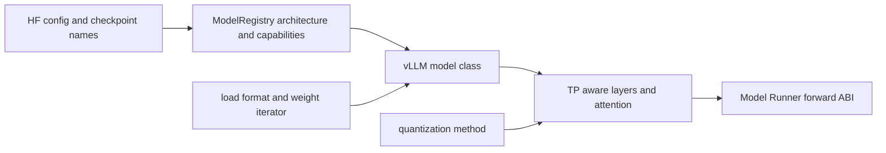

# vLLM 模型库：模型结构、权重格式与并行执行之间的 ABI

> **源码基线**：`vllm-project/vllm@d66300a1baa7779c68c7dfa4e51eee2502b48017`
> **中心命题**：Hugging Face config 能说明“这是哪个模型”，却不能完整说明权重怎样按 TP/PP/EP 切分、QKV/MLP 怎样融合、量化权重何时 repack、forward 怎样接入 paged KV。vLLM 模型库的本质是一层执行 ABI：把外部 checkpoint 语义翻译成 vLLM 的并行层、attention、loader 和 runner 契约。

## 一、为什么不能直接 `AutoModel.from_pretrained()`

通用 Transformers 模型优先表达训练/研究语义：module 名称与 checkpoint 对齐，forward 接受完整 batch tensor，KV 通常由模型对象按序列管理。高吞吐 serving 需要另一组约束：

- 每个 rank 只实例化/加载自己负责的权重 shard；
- Q/K/V、gate/up 等 checkpoint 参数可能合并成一个 runtime parameter；
- attention 不持有请求级 Python cache，而从全局 paged KV 和 metadata 读取；
- PP stage 可能只构造部分 layers；
- quant method 可改变 parameter 形态并在 load 后 repack；
- compile、LoRA、spec decode 和 multimodal runner 需要可检查的能力声明。

直接包一层 adapter 能解决函数签名，不能解决权重 identity、并行所有权和设备 kernel ABI。

## 二、四份契约共同定义一个可运行模型

| 契约 | 回答的问题 | 典型 owner |
|---|---|---|
| Architecture registry | config 中的 architecture 选哪个类、支持哪些任务/能力？ | `ModelRegistry` |
| Construction ABI | 模型怎样接收统一 config、prefix 与 PP 范围？ | model class、interfaces |
| Weight ABI | checkpoint 名称/shape 怎样映射到 runtime parameter shard？ | loader、`load_weights()`、parameter loader |
| Execution ABI | forward、attention、intermediate tensors 和 sampler 怎样接 runner？ | model layers、runner |

把“支持某模型”只理解为 registry 加一个类名，会遗漏后三份契约。

## 三、Registry 为什么同时支持 inspection 与 loading

`ModelRegistry` 的内置表保存 architecture 到 lazy module/class 的映射；实例化时全部转换成 `_LazyRegisteredModel`，避免导入所有模型；`vllm/model_executor/models/registry.py:1474-1490`。外部模型可注册类对象或 `module:class` 字符串，字符串路径明确用于避免导入时初始化 CUDA；`vllm/model_executor/models/registry.py:1085-1136`。

Registry 把两件事分开：

- `inspect_model_cls()` 获取文本生成、pooling、multimodal、PP、hybrid、inner state 等能力；
- `load_model_cls()` 在真正构造模型时才导入类；接口定义在 `vllm/model_executor/models/registry.py:885-925`。

lazy inspection 甚至对源码文件计算 hash、缓存 `_ModelInfo`，cache miss 时在子进程导入模型以避免污染主进程 CUDA 状态；`vllm/model_executor/models/registry.py:928-1040`。这说明 lazy registry 不是启动速度小优化，而是进程模型的正确性边界。

解析还要处理 `model_impl=auto/transformers`、dynamic module、architecture default/convert type 与 in-tree 实现回退；`vllm/model_executor/models/registry.py:1183-1329`。当前策略允许兼容的 Transformers backend，但不会假定任意 `AutoModel` 都满足 vLLM backend contract。

## 四、模型类的构造 ABI

新式模型类应接收 `vllm_config` 和 `prefix`。`initialize_model()` 先解析 architecture、配置 quant method，再检查构造签名；旧式分散的 `config/cache_config/quant_config/lora_config` 参数仍有兼容分支，但会发出 deprecation warning；`vllm/model_executor/model_loader/utils.py:37-93`。

统一构造参数解决三个问题：

1. 子层能从同一个 config 读取 parallel、cache、quant、compile 能力；
2. `prefix` 在嵌套/多模型场景中保持 parameter 与 layer name 全局稳定；
3. compile context 可以在构造期间记录 no-compile layer 与元数据。

模型 interface 则用结构化能力检查代替散落的 architecture 名单。Registry inspection 会提取 text-generation/pooling、multimodal、PP、inner state、attention-free、hybrid、Mamba prefix caching 等属性；`vllm/model_executor/models/registry.py:850-882`。

## 五、并行层把数学分片变成参数加载规则

### 5.1 Column parallel

对 $Y=XA$，column parallel 把输出维切成：

$$
A=[A_1,\ldots,A_p],\qquad Y_i=XA_i.
$$

每个 rank 只创建 `output_size / tp_size` 的 parameter，是否 all-gather 由 layer 决定；`vllm/model_executor/layers/linear.py:407-474`。

### 5.2 Row parallel

row parallel 同时切输入和权重第一维：

$$
X=[X_1,\ldots,X_p],\qquad
A=[A_1^\top,\ldots,A_p^\top]^\top,
$$

局部结果通常需要 all-reduce；接口和分片维度见 `vllm/model_executor/layers/linear.py:1510-1565`。

QKVParallelLinear、MergedColumnParallelLinear 和 fused MoE 再把多份 checkpoint tensor 映射到合并 parameter。这样 fusion 不只是 forward 优化，也改变了 checkpoint-to-runtime 的权重 ABI。

## 六、权重加载是一次名称、形状与所有权转换

loader 层先根据 `load_format` 选择 HF/safetensors、sharded state、tensorizer、streaming 等实现；格式注册与选择在 `vllm/model_executor/model_loader/__init__.py:50-139`。loader 提供权重 iterator，模型自己的 `load_weights()` 决定每个 checkpoint 名称装入哪个 runtime parameter。

典型转换包括：

- `q_proj/k_proj/v_proj` 写入一个 `qkv_proj` 的不同 shard；
- `gate_proj/up_proj` 写入 fused gate-up parameter；
- PP rank 跳过不属于本 stage 的 layer；
- TP parameter loader 只复制当前 rank 的 slice；
- tied embedding、额外 bias、expert shard 和量化 scale 使用专门规则。

Llama runtime class显式声明 `packed_modules_mapping` 并实现自己的 `load_weights()`；`vllm/model_executor/models/llama.py:447-536`。默认 loader 最终调用 model 的 `load_weights(weight_iterator)`，并在可用时检查哪些 parameter 没有加载；`vllm/model_executor/model_loader/default_loader.py:414-449`。

核心不变量是：**checkpoint 中的一个逻辑权重必须恰好覆盖它负责的 runtime shard；跳过必须由 PP/tied/optional 规则解释，重复写入必须由 packed mapping 的 shard id 区分。**

## 七、为什么有 post-load 阶段

量化 checkpoint 的存储格式不一定是 kernel 最终需要的 layout。`process_weights_after_loading()` 遍历 quant method，在目标设备上执行 repack/quantize，并重新协调新 parameter 的 TP 状态；之后再处理 deferred attention、HPC 和 model-level hook；`vllm/model_executor/model_loader/utils.py:96-146`。

若把所有转换塞进 weight iterator，会出现两个问题：转换无法看到完整 module/config，CPU offload 时也未必在 kernel 所需设备。post-load 阶段用更高峰值内存和初始化时间换取运行时更紧凑的 layout。

具体 quant method 选择与 fallback 由 [[02_engineering/03_infer_frameworks/vllm/21_vllm_quantization_analysis|vLLM 量化派发设计]] 负责，本页只拥有模型与权重的接合契约。

## 八、模型与 attention/runner 的边界

模型 forward 应表达层级计算，但不自行管理请求队列或物理 KV block。`Attention` layer 在构造时选择 backend、生成 KV spec，并在 forward context 中取得 metadata、KV tensor 与 slot mapping；`vllm/model_executor/layers/attention/attention.py:218-350,640-698`。

Runner 负责把 `SchedulerOutput` 变成 input ids、positions、block tables 和采样状态；模型只消费 tensor ABI。这样同一模型结构可以在 eager/compile/CUDA Graph、V1/MRV2、不同 attention backend 下复用。

反过来，模型若包含 inner state、hybrid attention、multimodal encoder 或自定义 sampler，就必须通过 interface/ModelState 明确声明，而不是让 runner 按 architecture 名称猜测。

## 九、直观替代方案与代价

| 替代方案 | 为什么不够 | 当前设计代价 |
|---|---|---|
| 直接加载完整 HF model | 每 rank 重复权重，KV/forward ABI 不匹配 | 维护大量 model implementations |
| 通用 `state_dict` strict load | 不理解 fused parameter、TP/PP/EP shard | 每个模型需名称映射和 loader 规则 |
| import 时检查全部模型能力 | 启动慢，可能提前初始化 CUDA/可选依赖 | lazy inspection/cache 更复杂 |
| 只按 architecture 名称写分支 | 能力组合快速增长，out-of-tree 难扩展 | interface contract 需要持续治理 |
| forward 内临时做权重 repack | 每步成本与 graph 不稳定 | post-load 增加启动时间和峰值内存 |
| 每种 quantization 复制模型类 | 组合爆炸 | layer/quant method 接合点更抽象 |

## 十、失败边界与贡献检查清单

新增/更新模型至少要核验：

1. architecture 解析是否选择预期实现，lazy inspection 是否无 CUDA 副作用；
2. model interface 是否准确声明 PP、multimodal、inner state、hybrid 等能力；
3. `vllm_config/prefix` 构造契约是否完整；
4. packed mapping、TP/PP/EP weight loading 是否无漏载/重载；
5. quant post-load 是否改变 parameter identity/TP 状态；
6. attention/KV spec 与 runner 支持矩阵是否一致；
7. dummy/profile、sleep/wake、LoRA、compile 和 reload 是否保持同一权重 ABI。

最小源码阅读顺序：`vllm/model_executor/models/registry.py:850-1040,1085-1383` → `vllm/model_executor/model_loader/__init__.py:50-139` → `vllm/model_executor/model_loader/utils.py:37-146` → 一个目标模型的 `packed_modules_mapping/load_weights` → 对应 TP-aware layers。

## Related Pages

- [[02_engineering/03_infer_frameworks/vllm/10_vllm_engine_architecture_analysis|vLLM 引擎架构]] — 模型对象位于 executor/runner 层而非 EngineCore。
- [[02_engineering/03_infer_frameworks/vllm/14_vllm_attention_backends_analysis|vLLM Attention Backend]] — 模型 attention layer 与 paged KV 的执行契约。
- [[02_engineering/03_infer_frameworks/vllm/15_vllm_model_runner_v2_analysis|vLLM Model Runner V2]] — 模型 forward 前后的输入准备与采样 owner。
- [[02_engineering/03_infer_frameworks/vllm/21_vllm_quantization_analysis|vLLM 量化派发设计]] — quant config、parameter 和 post-load kernel layout。
- [[02_engineering/03_infer_frameworks/vllm/22_vllm_distributed_inference_analysis|vLLM 分布式推理]] — TP/PP/EP rank group 如何消费并行层。
- [[02_engineering/03_infer_frameworks/vllm/28_vllm_extension_plugin_system_analysis|vLLM 插件与扩展边界]] — out-of-tree model、loader 与平台扩展的生命周期。
