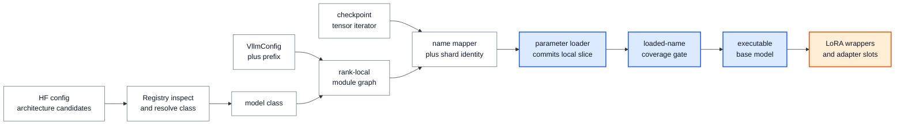

# vLLM 模型库：把 checkpoint 提交为可执行并行模型的 ABI

> **读者问题**：Hugging Face config 中的 architecture 和一串 checkpoint tensor，怎样经过类解析、统一构造、名称/分片映射与可选 LoRA 接合，变成每个 rank 上可执行且没有明显漏载的模型？
> **源码基线**：`vllm-project/vllm@6b110badbb22d3f66c7218b71138f13b7a6b3419`（冻结的 detached checkout，提交时间 2026-08-29T02:40:53Z）
> **中心命题**：vLLM 的“模型支持”不是 registry 里的一行类名，而是一条跨层 ABI：Registry 决定类与能力，统一构造器产生带稳定前缀的 rank-local module graph，模型的 name mapper 把 checkpoint identity 翻译成 runtime parameter 与 packed shard identity，并行层自己的 `weight_loader` 才把数据提交到本 rank 的物理 slice；LoRA 随后复用同一套 module/packed-name 语义，把 adapter 接到已构造的执行图上。
> **所有权边界**：本页拥有内建/外部模型注册与 class resolution、`VllmConfig + prefix` 构造 ABI、通用 checkpoint name mapping 与基础权重提交、TP/PP-aware parameter loading、packed parameter、基础模型上的 LoRA wrapper/adapter attachment。
> **排除概念**：逐 step request row、buffer、graph 与 LoRA batch mapping 属于 `15`；attention metadata/backend 协商属于 `14`；量化格式、scale、post-load transform 与 kernel dispatch 属于 `21`；rank group 创建和 collective ordering 属于 `22`；插件发现与进程级初始化属于 `28`。
> **最近更新**：2026-08-30。按 `6b110bad` 重建；代表模型改为共同 ABI 的证据，并明确 packed shard 完整性与 LoRA attach 的失败边界。

## 1. 背景：模型名称不是可执行性证明

外部 checkpoint 给出的是逻辑 tensor 名与全局 shape；serving rank 实际需要的是部分 PP layer、TP-local parameter、融合后的 QKV/MLP parameter，以及能够被 attention、LoRA 和后续处理按全名定位的 module graph。官方模型贡献指南因此把 `prefix`、并行层替换与 `load_weights()` 列为三个独立要求，而不是把“注册 architecture”当作完成条件（`docs/contributing/model/basic.md:14-23`；`docs/contributing/model/basic.md:88-110`）。

**为什么不直接 `state_dict(strict=True)`（分析推断）。** PyTorch strict load 假设 checkpoint key 与 runtime parameter 一一同名同形；vLLM 则会让 `q_proj/k_proj/v_proj` 三个外部名字写入一个 `qkv_proj`，再由这个 parameter 的 loader 选择 packed offset 和当前 TP rank 的 slice。Qwen2 的 mapping 明写了五个 constituent → fused/shard 映射，QKV layer 再按 `q/k/v` 算不同 offset/size（`vllm/model_executor/models/qwen2.py:323-331`；`vllm/model_executor/layers/linear.py:1059-1083`）。名称映射与物理写入必须分层，不能由一个通用 tensor copy 猜出。

| 直观替代 | 破坏的合同 | 当前路线支付的成本 | 证据 |
|---|---|---|---|
| architecture 名直接 import 一个类 | capability inspection 会导入可选依赖，甚至污染父进程 CUDA 状态 | lazy registry、文件 hash cache 与子进程 inspection | `vllm/model_executor/models/registry.py:914-947`；`vllm/model_executor/models/registry.py:998-1049` |
| 每个模型使用任意构造签名 | loader 必须按模型类型拼 kwargs，组合模型也无法统一嵌套 | 统一 `VllmConfig + prefix`，暂留旧式兼容分支 | `docs/design/arch_overview.md:215-225`；`vllm/model_executor/model_loader/utils.py:54-93` |
| checkpoint loader 直接写 parameter | 文件格式层必须理解 PP、TP 与 packed layout | iterator、model mapper、parameter loader 三段 ABI | `vllm/model_executor/model_loader/base_loader.py:42-80`；`vllm/model_executor/models/utils.py:420-446` |
| 为 adapter 另建一份模型 | 重复基础权重，也失去 base model 的 fused/parallel module identity | 原地 wrapper 与有限 adapter slots | `vllm/lora/model_manager.py:407-542`；`vllm/lora/model_manager.py:1173-1180` |

> [!note] 分析推断
> 上表的替代方案与取舍是从 live code、tests 和同 commit design guide 重建的因果解释；除统一构造器一项有官方 design rationale 外，不声称作者逐项写过这些比较。

## 2. 静态责任：同一个“模型”跨越五个 ABI owner

| owner | 输入 → 输出 | 拥有的状态/不变量 | 不拥有 | 承重证据 |
|---|---|---|---|---|
| Registry | architecture 候选 + model config → class、最终 architecture、capability info | architecture 映射、lazy/imported class、inspection cache、unsupported/fallback 决策 | module graph 与 tensor copy | `vllm/model_executor/models/registry.py:880-925`；`vllm/model_executor/models/registry.py:1274-1378` |
| Constructor | class + `VllmConfig + prefix` → rank-local module graph | module 全名、PP-present layers、parameter shape 与 layer type | checkpoint tensor 来源 | `vllm/model_executor/model_loader/utils.py:37-94`；`vllm/model_executor/models/qwen2.py:334-392` |
| Format loader | load config → `(checkpoint_name, tensor)` iterator | load format 到 loader/iterator 实现的选择、文件读取与 source prefix | tensor 的 runtime owner/shard | `vllm/model_executor/model_loader/__init__.py:32-63`；`vllm/model_executor/model_loader/default_loader.py:244-340` |
| Model/parameter loader | tensor stream → mapped runtime name + local parameter slice | rename/drop/packed shard identity、TP slice、shape copy、loaded-name set | quant kernel layout | `vllm/model_executor/models/utils.py:46-147`；`vllm/model_executor/layers/linear.py:555-580` |
| LoRA manager | executable base graph + adapter checkpoint → wrapped modules + registered slot | wrappable target set、packed child mapping、adapter slot ownership | 当步请求选择哪个 slot | `vllm/lora/model_manager.py:71-152`；`vllm/lora/worker_manager.py:106-154` |

图 1 只画本页拥有的 construction/commit path。蓝色主线表示基础模型必须完成的提交；橙色分支表示 LoRA 是在可执行 base graph 上的可选 attachment。逐 step runner state 和量化内部 post-process 刻意不入图。

这条链的关键不是调用先后本身，而是 identity 逐级变得更具体：architecture string 先变成 class，class 变成当前 rank 的 module/parameter namespace，checkpoint key 再变成 runtime parameter 与 constituent shard，最后才成为设备 parameter 的某个 slice。任一级只产生下一层的输入，不能提前宣称“模型已加载”。

## 3. Registry：先判能力，再在需要构造时导入类

### 3.1 为什么 inspection 与 loading 分开

Registry 既要回答“这个 architecture 支持 PP/多模态/生成等能力吗”，又要给 loader 一个真实 Python class。若每次 capability query 都 import 模型，可选依赖或 module-level CUDA 初始化会进入控制面；当前 `_LazyRegisteredModel.inspect_model_cls()` 先用源码 hash 查 `_ModelInfo` cache，miss 时在子进程 import，而 `load_model_cls()` 才在当前进程真正 `import_module`（`vllm/model_executor/models/registry.py:930-1049`）。回归测试特意要求会初始化 CUDA 的模型在 inspection 后仍保持 CUDA 未初始化，并单独触发 class loading（`tests/models/test_registry.py:80-110`）。

内建表在 `ModelRegistry` 构造时全部转为 lazy `module_name + class_name` 记录；外部注册既可传 class，也可传 `module:class` 字符串，字符串路径的公开理由就是避免 fork 后重新初始化 CUDA（`vllm/model_executor/models/registry.py:1087-1131`；`vllm/model_executor/models/registry.py:1469-1486`）。插件何时被发现、在哪个进程调用注册属于 `28`；注册以后怎样解析 class 属于本页。

### 3.2 resolution 是有序决策，不是字典查找

`_get_model_architecture()` 从 HF config 取 architecture 候选交给 registry；resolution 根据 `model_impl` 决定强制 Transformers/Terratorch、先试 in-tree、在 `auto` 下回退兼容 Transformers backend，最后才报 unsupported，随后还可把生成 class 转成 embedding/classification adapter（`vllm/model_executor/model_loader/utils.py:203-235`；`vllm/model_executor/models/registry.py:1326-1378`）。因此 registry 返回的是“在当前 config policy 下被选中的 class”，不是某个名字的永恒唯一实现。

失败边界是显式的：空 architecture 列表立即报错；已注册但 import/inspection 失败与从未支持、历史移除、迁出插件是不同错误；Transformers module 存在但 backend-incompatible 时也会拒绝（`vllm/model_executor/models/registry.py:1133-1158`；`vllm/model_executor/models/registry.py:1230-1246`；`vllm/model_executor/models/registry.py:1279-1283`）。这比“找不到就任意 `AutoModel`”多一层能力门，代价是 registry、backend compatibility 和 fallback order 必须持续一致。

## 4. 统一构造 ABI：先建立 rank-local namespace

### 4.1 `VllmConfig + prefix` 为什么是 ABI

官方 design 文档给出的明确理由是可扩展性、统一创建和组合模型：新配置进入 `VllmConfig` 后无需继续扩张每个 constructor，runner 也不必按模型猜签名（`docs/design/arch_overview.md:210-225`）。live `initialize_model()` 检查 constructor 是否同时接收 `vllm_config` 与 `prefix`，在带 compile context 的 current-config scope 中构造，并记录 reload metadata（`vllm/model_executor/model_loader/utils.py:37-61`）。

`prefix` 不是装饰性日志名。模型贡献指南要求所有 vLLM module 递归传递完整 state-dict name，以避免 attention layer 注册冲突并让 per-layer 配置命中正确对象（`docs/contributing/model/basic.md:18-24`）。在 Qwen2 中，外层把 `prefix.model` 交给 backbone，embedding、decoder layers 与 LM head 各自继续派生稳定全名；PP rank 不拥有的 embedding/layers/head 则以 missing-layer placeholder 表示（`vllm/model_executor/models/qwen2.py:334-392`；`vllm/model_executor/models/qwen2.py:450-472`）。

> [!contradiction]
> 同 commit 的 `docs/design/arch_overview.md:227-257` 说所有 vLLM model 已改为 keyword-only 统一签名，并把旧参数传入描述为应报错；live `initialize_model()` 仍会对旧式 out-of-tree class 发出 `DeprecationWarning`，再按签名猜 `config/cache_config/quant_config/lora_config/scheduler_config` 并继续构造（`vllm/model_executor/model_loader/utils.py:63-93`）。当前行为应按 code 理解为“统一 ABI 是目标且 in-tree 已采用，但兼容桥尚未删除”，不能把文档的严格失败描述当成 live failure boundary。

### 4.2 PP partial construction 与 weight loading 必须一致

PP 的关键不是“加载完整模型再删层”，而是 constructor 直接生成当前 stage 拥有的 layer 区间与 placeholders。通用 `AutoWeightsLoader` 遇到 `StageMissingLayer` 或 `PPMissingLayer` 会停止该 subtree 的加载（`vllm/model_executor/models/utils.py:345-383`）。所以“未加载”只有在 module graph 本来拥有该 parameter 时才是错误；对别的 PP stage 的 checkpoint tensor，rank-local graph 本身就没有对应 owner。

这条设计以更复杂的 construction/load 协作为代价：stage 选择、prefix 和 skip placeholder 必须对同一个 namespace 达成一致。若模型手写 loader 绕过 placeholder 语义，就可能把“本 stage 不拥有”误判成 missing，或反过来静默丢掉真正属于本 stage 的 tensor。

## 5. 权重提交：文件格式只供给 tensor，parameter 决定写到哪里

### 5.1 构造、加载与 post-load 有明确次序

`get_model()` 只按 `LoadConfig` 选择 loader；`BaseModelLoader.load_model()` 在目标 device/dtype scope 中先 `initialize_model()`，再调用具体 loader 的 `load_weights()`，之后才进入 post-load seam 并返回 `eval()` model（`vllm/model_executor/model_loader/__init__.py:119-139`；`vllm/model_executor/model_loader/base_loader.py:42-82`）。量化或其他 kernel-format transform 的内部逻辑归 `21`；本页只需要守住一个边界：它们看到的输入已经完成基础 checkpoint → runtime parameter 提交。

Default loader 把文件侧实现收敛为 tensor iterator，再调用 model 自己的 `load_weights()`。原因（分析推断）是文件格式知道“有哪些外部 tensors”，模型/层才知道当前 runtime graph 的 fuse、PP 与 TP ownership；把两者混在 loader 会让每个 load format 重复模型语义。live code 的提交点是 `model.load_weights(self.get_all_weights(...))`，随后取得 loaded-name set 做覆盖检查（`vllm/model_executor/model_loader/default_loader.py:414-445`）。

### 5.2 `WeightsMapper` 只改变逻辑 identity，不复制数据

`WeightsMapper` 可以按 regex、substring、prefix、suffix rename/drop，还可把 constituent 名改成 fused runtime 名并附带 `shard_id`；`apply()` 只是重写 name、把 shard metadata 标到 tensor 上并继续 yield（`vllm/model_executor/models/utils.py:46-147`）。它不计算 TP slice，也不应知道 parameter storage layout。

`AutoWeightsLoader` 随后按点分 name 递归 module tree：child 可接管自己的 `load_weights()`，leaf parameter 可接管自己的 `weight_loader()`；未知 nested parameter 或 module 会明确报错，而不是像 `strict=False` 一样静默吞掉（`vllm/model_executor/models/utils.py:199-213`；`vllm/model_executor/models/utils.py:283-313`；`vllm/model_executor/models/utils.py:345-417`）。因此扩展点是局部的：大多数 module 走通用递归，只有真正拥有特殊 storage 的 layer 覆盖写入规则。

权重 tying 也是 identity 问题。loader 只对 `VocabParallelEmbedding` 别名去重；若 checkpoint 只给出被跳过的 alias、没有 canonical name，它会拒绝留下未初始化共享 storage（`vllm/model_executor/models/utils.py:185-196`；`vllm/model_executor/models/utils.py:239-245`；`vllm/model_executor/models/utils.py:448-469`）。测试固定了“tied 时只加载首个名字”和“缺 canonical 必须失败”两条边界（`tests/models/test_utils.py:118-147`）。

### 5.3 并行层的 parameter loader 才是物理 commit

`ColumnParallelLinear` constructor 按 TP size 缩小 output partition，并把 `weight_loader` 安装到 parameter；加载全局 tensor 时，loader 沿 output dimension 取 `tp_rank * local_size` 的 slice，shape 相等后才 `copy_`（`vllm/model_executor/layers/linear.py:445-526`；`vllm/model_executor/layers/linear.py:555-580`）。运行时它保留 local output，只有 `gather_output` 要求时才 all-gather（`vllm/model_executor/layers/linear.py:582-600`）。

`RowParallelLinear` 正好沿 input dimension 建 local weight，必要时先切 input，再把各 rank 的局部 GEMM 结果 all-reduce；bias 只在 rank 0 加，避免 TP 下重复（`vllm/model_executor/layers/linear.py:1641-1708`；`vllm/model_executor/layers/linear.py:1710-1726`；`vllm/model_executor/layers/linear.py:1737-1763`）。本页拥有的是“parameter shape、checkpoint slice 与 layer collective 语义必须同构”；collective group 怎样创建与按什么全局顺序执行归 `22`。

Merged/QKV layer 在这条规则上再增加 packed axis。Merged layer 拒绝越界或非连续 tuple shard id，再把 constituent offset/size 换算到 TP-local parameter；QKV layer 只接受 `q/k/v`，并按 GQA head 数分别计算 offset/size（`vllm/model_executor/layers/linear.py:690-735`；`vllm/model_executor/layers/linear.py:799-845`；`vllm/model_executor/layers/linear.py:1059-1083`）。Transformers fuser 的测试证明 mapper 只在实际 fused prefix 上把六个外部名字改成两个 runtime names，并保留 `[0, 1, q, k, v]` shard identities（`tests/models/transformers/fusers/test_linear.py:565-607`）。

### 5.4 loaded-name gate 能证明什么，不能证明什么

对默认非量化路径，loader 将 `model.named_parameters()` 与 `load_weights()` 返回集合比较；任何完全未触达的 runtime parameter 都会报 `Following weights were not initialized`。若 model 不返回集合、显式关闭 tracking，或进入默认排除的 quantized 路径，这个 gate 不成立（`vllm/model_executor/model_loader/default_loader.py:427-469`）。具体 quant 例外由 `21` 解释。

以下边界需要分开判断：

| failure | 默认路径是否能捕获 | 为什么 | 证据 |
|---|---|---|---|
| checkpoint 名指向不存在的 module/parameter | 是 | recursive lookup 直接 `ValueError` | `vllm/model_executor/models/utils.py:394-417` |
| packed shard id 非法 | 是 | Merged/QKV 在写入前验证 enum/range/连续性 | `vllm/model_executor/layers/linear.py:710-735`；`vllm/model_executor/layers/linear.py:1059-1065` |
| global tensor 无法切成预期 local shape | 是 | local view 与 loaded slice copy 前断言 shape | `vllm/model_executor/layers/linear.py:555-572`；`vllm/model_executor/layers/linear.py:1710-1726` |
| 一个普通 runtime parameter 完全没出现 | 默认非量化路径是 | loaded-name set 与全部 named parameters 做差 | `vllm/model_executor/model_loader/default_loader.py:434-469` |
| fused parameter 只到了一部分 constituent shards | **不由通用 name gate 充分证明** | 多个 constituent 会映射成同一 runtime qualname，返回 set 后 shard identity 被折叠 | `vllm/model_executor/models/utils.py:115-147`；`vllm/model_executor/layers/linear.py:952-975` |

最后一行是对数据流的**分析推断**：只收到 `q_proj` 也足以让 `qkv_proj.weight` 出现在 loaded-name set，通用 tracker 无法据此证明 `k/v` 已写。shape 与 shard-id guard 能证明“到达的写入合法”，不能证明“所有预期 constituent 都到达”。因此 packed model 若存在非标准、可选或条件 shard，必须由 model-specific loader/completeness check 或针对完整 checkpoint 的测试补上；不能把一个 fused parameter name 已出现当成事务完整性的充分条件。

## 6. 代表模型是 ABI 证明，不是 architecture 目录

Llama 与 Qwen2 的价值不在于分别列一遍网络结构，而在于它们证明不同实现能收敛到同一 ABI：两者都用 `VllmConfig + prefix` 构造、都声明 `SupportsLoRA/SupportsPP`、都暴露 packed mapping，backbone 用 `WeightsMapper` 将 QKV 与 gate/up constituent 映射到 fused layer，外层 `AutoWeightsLoader` 再递归让 backbone 接管 mapping（`vllm/model_executor/models/llama.py:344-360`；`vllm/model_executor/models/llama.py:446-543`；`vllm/model_executor/models/qwen2.py:323-331`；`vllm/model_executor/models/qwen2.py:441-504`）。

这也解释了为什么本页不维护“模型 A/B/C 如何实现”的平铺目录。registry 测试对所有 registered architectures 做 import/capability contract 检查，并要求测试 registry 覆盖完整 architecture set；较重的初始化回归则明确选一个覆盖多 workload 的 representative subset，剩余集合另跑（`tests/models/test_registry.py:31-77`；`tests/models/test_registry.py:206-214`；`tests/models/test_initialization.py:27-52`；`tests/models/test_initialization.py:194-207`）。测试策略本身把模型实例当作共同接口的样本，而不是互不相关的产品条目。

一个新模型真正需要证明的是：resolution 选中正确 class；constructor 建出正确 rank-local namespace；每个 checkpoint tensor 通过 mapper/parameter loader 到达唯一合法 storage；完整性 gate 与模型专项测试覆盖默认 gate 看不到的 packed/optional 语义；若声明 LoRA，adapter-visible names 能落回 runtime modules。architecture 名称只是这份证明的入口。

## 7. LoRA attachment：复用 base model 的 module 与 packed-name ABI

### 7.1 为什么 attachment 发生在 base graph 之后

`SupportsLoRA` 不只是布尔 flag；协议还要求 `packed_modules_mapping`、`embedding_modules` 与 manager slot。`supports_lora()` 会对“只设 flag 但缺属性”和“属性齐全但没声明支持”发出诊断（`vllm/model_executor/models/interfaces.py:680-756`）。这意味着 adapter 不是任意 `nn.Module` 的通用补丁，而是 model class 对稳定 module namespace 的能力承诺。

LoRA manager 初始化时先从已构造 base graph 找可支持 modules、处理 packed mapping、创建共享 Punica wrapper，然后遍历真实 `named_modules()`，跳过 PP missing layer，把匹配 layer 原地替换成保存 base layer 的 LoRA wrapper，并给 wrapper 预分配有限 slots（`vllm/lora/model_manager.py:95-152`；`vllm/lora/model_manager.py:407-542`）。**分析推断**：先构造 base graph 再 wrap，胜过在每个 model class 内复制 LoRA 分支，因为 TP/PP layer type、parameter storage 与 prefix 仍由唯一 base implementation 拥有；代价是 wrapper registry 必须覆盖被选择的具体 layer subclass。

### 7.2 packed mapping 是 base weight 与 adapter 的共享语义桥

adapter checkpoint 仍以 `q_proj`、`gate_proj` 等 constituent name 表达，但 runtime 可能只有 `qkv_proj`、`gate_up_proj`。`packed_modules_mapping` 让 deployment target 写 child name 时仍能匹配 fused parent；测试固定了 `gate_proj → gate_up_proj` 的选择行为（`vllm/lora/utils.py:275-315`；`tests/lora/test_lora_manager.py:1088-1104`）。manager 随后把 constituent LoRA weights pack 成 fused wrapper 所需的 slices（`vllm/lora/model_manager.py:645-678`）。

基础 checkpoint 的 `WeightsMapper` 还会被 LoRA 重用，但只取 rename-only 版本：它明确丢弃 stacked mapping 和 `None` drop，因为 LoRA name parsing 必须保留 constituent projection identity；worker loader 取得这个 mapper，验证 PEFT config，再按 expected modules 读取 adapter（`vllm/model_executor/models/utils.py:163-182`；`vllm/lora/worker_manager.py:106-154`）。同一 namespace 因此服务两种不同提交：base tensor 要 stack 到 runtime parameter，adapter tensor 要保留 child identity 后再 pack 到 wrapper slot。wrapper 创建时也按 `max_loras` 预分配有限 slot，而不是为每个请求动态改写 module graph（`vllm/lora/utils.py:107-125`）。

### 7.3 attachment 的失败边界

LoRA 在以下位置 fail closed：base model 不满足 `SupportsLoRA` 时 manager creation 直接拒绝；adapter checkpoint 出现 expected set 之外的 target module 时拒绝；显式 `target_modules` 命中的 runtime layer 没有任何 wrapper implementation 时拒绝；adapter capacity 用尽也拒绝（`vllm/lora/model_manager.py:1263-1287`；`vllm/lora/lora_model.py:212-242`；`vllm/lora/model_manager.py:522-536`；`vllm/lora/model_manager.py:1173-1180`）。测试还区分默认扫描时 unsupported match 可 warning/skip，与用户显式选择该 target 时必须报错，避免“配置说已附着、实际没生效”（`tests/lora/test_lora_manager.py:285-335`）。

attachment 到这里结束：adapter tensors 已装入受 manager 拥有的 slots，并可被 activate（`vllm/lora/worker_manager.py:223-231`）。某一步里哪些 token/request 选择哪个 adapter、mapping 何时对设备可见，是 runner 的 per-step state，归 `15`；本页只保证这些 mapping 引用的 slot 与 module identity 已经合法存在。

## 8. 约束、排查顺序与源码阅读路径

| 症状 | 先问哪个 ABI owner | 最可能的边界 | 首读 locator |
|---|---|---|---|
| architecture unsupported 或落到意外 backend | Registry | candidate order、`model_impl`、backend compatibility | `vllm/model_executor/models/registry.py:1274-1378` |
| 构造时 module 名冲突、PP rank 出现不该有的层 | Constructor | `prefix` 递归或 stage-local graph | `vllm/model_executor/model_loader/utils.py:37-94`；`vllm/model_executor/models/qwen2.py:334-392` |
| checkpoint key 找不到 owner | Model mapper/tree loader | rename/drop rule 或 rank-local placeholder 不一致 | `vllm/model_executor/models/utils.py:345-417` |
| 单 rank tensor shape 错、结果各 rank 不同 | Parallel parameter loader | shard dimension、TP rank/size、packed offset | `vllm/model_executor/layers/linear.py:445-580`；`vllm/model_executor/layers/linear.py:1641-1726` |
| strict tracking 通过但 fused layer 数值异常 | Model-specific completeness | constituent shard 缺失、重复或错误条件 skip | `vllm/model_executor/models/utils.py:115-147`；`vllm/model_executor/model_loader/default_loader.py:447-469` |
| LoRA target 看似存在却未生效 | LoRA attach | rename-only mapper、packed child mapping、wrapper support/slot | `vllm/lora/worker_manager.py:131-154`；`vllm/lora/model_manager.py:407-542` |

推荐按 identity 变具体的顺序阅读，而不是从某个代表模型头读到尾：

1. class/capability：`vllm/model_executor/models/registry.py:880-1049`、`vllm/model_executor/models/registry.py:1274-1378`；
2. construction/load transaction：`vllm/model_executor/model_loader/utils.py:37-94`、`vllm/model_executor/model_loader/base_loader.py:42-82`、`vllm/model_executor/model_loader/default_loader.py:414-469`；
3. generic mapping/commit：`vllm/model_executor/models/utils.py:46-147`、`vllm/model_executor/models/utils.py:199-469`；
4. parallel leaf：`vllm/model_executor/layers/linear.py:414-600`、`vllm/model_executor/layers/linear.py:690-975`、`vllm/model_executor/layers/linear.py:978-1329`、`vllm/model_executor/layers/linear.py:1606-1763`；
5. representative proof 与 LoRA seam：`vllm/model_executor/models/qwen2.py:323-504`、`vllm/lora/model_manager.py:71-152`、`vllm/lora/model_manager.py:407-542`。

## Related Pages

- [[02_engineering/03_infer_frameworks/vllm/03_vllm_architecture_overview_analysis|vLLM 架构概览]] — 把模型/算子层放回从配置到 Engine、Executor 与设备运行时的静态责任图。
- [[02_engineering/03_infer_frameworks/vllm/14_vllm_attention_backends_analysis|vLLM Attention Backend]] — 接续可执行模型向 attention metadata、KV layout 与 backend capability 的运行时合同。
- [[02_engineering/03_infer_frameworks/vllm/15_vllm_model_runner_v1_analysis|Model Runner V1]] / [[02_engineering/03_infer_frameworks/vllm/16_vllm_model_runner_v2_analysis|Model Runner V2]] — 对照本页排除的 compact/stable row、buffer、graph 与 adapter mapping 生命周期。
- [[02_engineering/03_infer_frameworks/vllm/21_vllm_quantization_analysis|vLLM 量化派发设计]] — 深入基础权重提交之后的 scale、post-load transform 与 kernel-format ABI。
- [[02_engineering/03_infer_frameworks/vllm/22_vllm_distributed_inference_analysis|vLLM 分布式推理]] — 解释并行层所消费的 TP/PP/EP rank group 与 collective ordering。
- [[02_engineering/03_infer_frameworks/vllm/28_vllm_extension_plugin_system_analysis|vLLM 插件与扩展边界]] — 拥有 out-of-tree model 注册之前的 plugin discovery、进程作用域与初始化生命周期。
