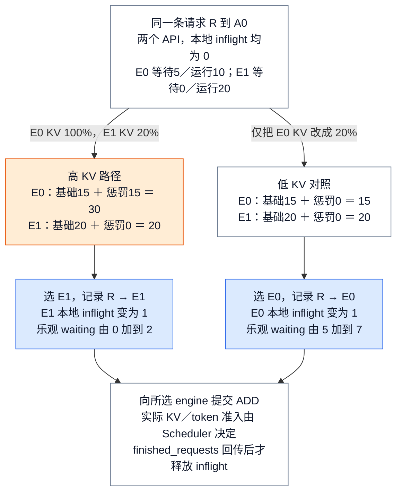
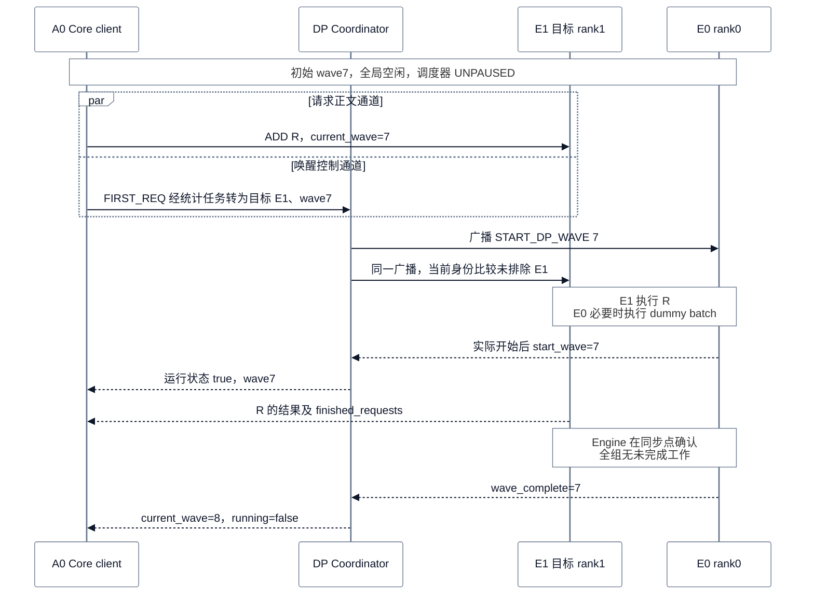
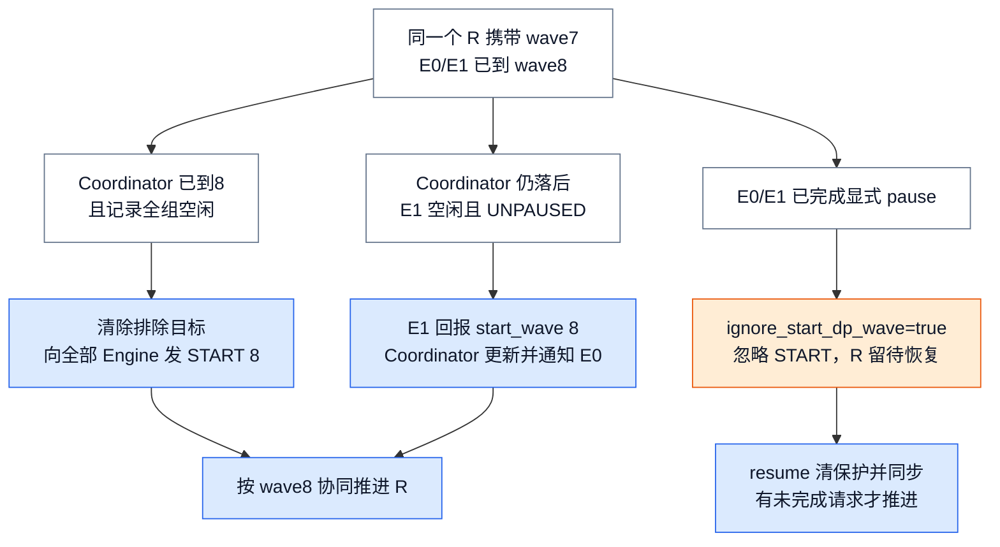
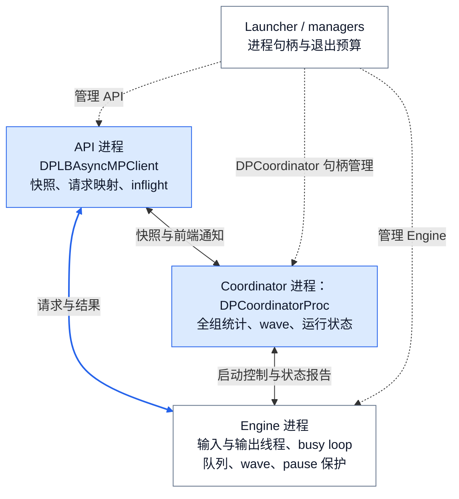

# vLLM Serving 控制面：DP 路由与 Coordinator 协调

> **源码基线**：`vllm-project/vllm@199cb9b964822e59ab9b58d88e7be31eb419a2ae`（`main`，2026-09-07 UTC）
> **主题**：从一个请求的副本选择与空闲唤醒出发，解释 DP 负载反馈、Coordinator 的 wave 协调及 API/Engine 的代码协作。随后闭合部署就绪、故障传播、退出和配置边界。
> **适用范围**：Python 在线 Serving 控制面；请求协议归请求语义页，Engine 调度执行归 Engine/Scheduler 页，设备 collective 归分布式推理页，完整 FT 状态机归可靠性页。
> **最近更新**：2026-09-11。补齐 DP Coordinator 的状态协议、调用路径和成本，重组为特性分析。

## 1. 特性概览

### 1.1 问题背景

一个推理副本扩为 E0、E1 两个 DP（data parallel，数据并行）副本后，请求可以分别进入各自队列，但 API 既要知道“下一条交给谁”，又要知道目标是否已就绪、失败后谁负责关闭服务。对于需要跨 rank 协同推进的 MoE，某个副本没有请求也可能必须参与通信，单凭本地队列为空就停止执行会破坏其他副本的推进。一个副本内部还可由多卡执行，其并行轴见 [[18_vllm_distributed_inference_analysis|分布式推理]]。

### 1.2 解决方法

vLLM 将反馈与请求分发分开：**Coordinator 汇总各 Engine 的统计和协同运行状态，API 侧 Core client 根据反馈选择目标，推理请求正文直接发给所选 Engine。** MoE 再用 `wave` 表示一轮全组共同推进的工作，Coordinator 广播启动通知，Engine 通过全组状态同步决定何时回到空闲，并回报实际开始与结束。`wave` 不是一个请求或一个 batch，也不是每个 token 都经过 Coordinator 批准。

进程管理者负责将这套协议接入服务生命周期：启动时核验地址和各级 READY，运行时观察进程故障，退出时逐层传递剩余等待预算。下面先从副本选择和 wave 两个最小机制讲起，再接到实际进程与调用路径。

### 1.3 收益、开销与约束

| 维度 | 直接收益 | 必付成本或边界 |
|---|---|---|
| DP 路由 | 利用跨 API 的队列反馈与本 API 的未完成计数分散负载 | 快照有延迟；每次内部选路扫描候选 Engines；选中不等于 Scheduler 已准入 |
| MoE wave | 有活的 rank 能带动空闲同伴，结束时统一确认 | 空闲 rank 可能执行 dummy batch；Engine 侧周期性同步；显式 pause 还需保护 |
| 启动 | 区分地址、设备、缓存、通道与服务就绪 | 需要多个握手和等待点，端口出现不能替代完整就绪 |
| 故障与退出 | 将进程错误向服务传播，并限制正常退出等待 | 默认不自动迁移或重放旧请求；drain 可能耗尽预算后被强制终止 |

## 2. DP 路由与 Coordinator 详细方案

### 2.1 先确定变体：请求路由与模型协同是两个维度

变体来自三个源码选择点：`ServeSubcommand.cmd` 解析 LB/入口模式，`EngineCoreClient.make_async_mp_client` 选择固定目标或内部选择器，`VllmConfig.needs_dp_coordinator` 与 `launch_core_engines` 决定 Coordinator 是否创建、是否启用 wave。不能仅从一个开关推导全部部署行为。

| 模型与在线模式，DP 大于一 | 请求选择 | Coordinator 的职责 |
|---|---|---|
| Dense，internal / hybrid LB | 内部 client 在全部／本地候选中选目标 | 只汇总和发布负载；各 Engine 独立推进 |
| MoE，internal / hybrid LB | 同一套内部评分 | 负载反馈及 wave 协调 |
| MoE，external LB | 外部 LB 选择服务，client 固定目标 rank | 保留 wave 协调；Engine 不向它上报 LB 队列统计 |
| Dense，external LB | 配置说明要求改用独立实例 | `needs_dp_coordinator` 返回 false 不能证明此部署受支持 |

实际在线启动只在非 offline 且 DP rank 0 创建 Coordinator。`needs_dp_coordinator` 在模型配置为空时也保守返回 true；模型配置已确定时，仍联合检查 `is_moe` 与 LB 模式。DP=1 不需要它；offline SPMD 另有各 rank 向同地 frontend 回报的路径，不能把在线 Coordinator 流程直接套过去。`GroupCoordinator` 是通信组对象，归分布式推理页，与这里的独立进程不同。

下面沿用 A0/A1 两个 API、E0/E1 两个 Engine 和请求 R。路由实例比较相同队列输入；wave 实例则把这组 Engine 的初态改为空闲，以单独展示唤醒，两次推演不是同时发生。

### 2.2 负载反馈：同一条请求为什么选择 E1？

设 R 到达 A0，E0 等待 5 条、运行 10 条、KV 使用率 100%；E1 等待 0 条、运行 20 条、KV 使用率 20%。两个 API 的 `client_count=2`，A0 本地在途计数先都为零。下文数字是源码规则的教学推演，不是实测。

#### 三个输入，一次线性扫描

`EngineCoreClient.make_async_mp_client` 在 external DP LB 时选择固定目标的 `DPAsyncMPClient`，internal/hybrid 选择 `DPLBAsyncMPClient`；普通单 core 使用 `AsyncMPClient`。下述评分属于内部选择器。请求已指定 `data_parallel_rank`，或 late-interaction pooling 已给出 engine index 时，会绕过评分；请求语义的约束归 [[03_vllm_request_semantics_analysis|请求语义]]。

对每个候选 engine，选择器读取：coordinator 快照中的 waiting、running 和 KV usage；本 API client 对该 engine 的精确 inflight；API client 总数 `client_count`。评分规则依次是：

1. 取 **client_count 乘本地 inflight** 与 **waiting 加 running** 中较大者，作为基础负载。前者为本地 burst 提供不会被陈旧快照抹掉的下限，后者包含其他 API 带来的压力。
2. 若 waiting 非零，再加 **waiting 乘 6，乘 KV usage 超过 0.5 的部分**；usage 不超过 50% 时惩罚为零，usage 为 100% 时额外加三倍 waiting。
3. 从当前扫描起点依次检查，选择分数最小者；同分保持先遇到的 engine。选择后将快照中的 waiting 乐观加 `client_count`，扫描起点向后旋转一位。
4. 保存请求 ID 到 engine 的映射，并将本 client 对该 engine 的 inflight 加一。之后异步发送 ADD，请求携带 `client_index` 与 `current_wave`。

扫描开销随候选 engine 数线性增长，源码仍把大 DP 使用 power-of-two-choices 留作 TODO。乘 `client_count` 不是观测到了别的 API 的精确计数，而是源码用于估计负载的缩放；各 API 并没有共享一个同步的 inflight counter。

#### 用同一条请求对比 KV 压力的作用

对 A0 接收的 R，两个 API 意味着 `client_count=2`。先令 A0 在 E0、E1 上的 inflight 都为 0：

| 候选 | waiting / running / KV | 基础负载 | KV 惩罚 | 最终分数 |
|---|---|---|---|---|
| E0 | 5 / 10 / 1.0 | 0 与 15 取大，得 15 | 5 乘 6 乘 0.5，得 15 | 30 |
| E1 | 0 / 20 / 0.2 | 0 与 20 取大，得 20 | 无 waiting，得 0 | 20，选中 |

只把 E0 的 KV usage 改成 0.2，其惩罚变成 0，最终分数为 15，于是同一组请求数会改选 E0。这个对照正是 `test_dplb_kv_pressure_amplifies_waiting_penalty` 的两种输入。它解释了为何总请求数少的副本未必优先，但不证明这个启发式在任意负载都最优。

<!-- Figure spec: conceptual decision flow for the same R and two engines. Two lanes start from identical waiting/running counts and client_count=2, local inflight=0. High-KV lane computes E0 base15+penalty15=30 versus E1=20, selects E1, then records R→E1 and inflight1. Low-KV lane changes only E0 usage to0.2, computes E0=15 versus E1=20, selects E0 and records R→E0. Blue marks selected-owner record; orange marks high-KV penalty. Final shared box states routing publication is not Scheduler admission or request completion. Not a call graph or proportional chart. -->


图中两个分支是替换输入后的两次独立推演，不是把 R 复制发送两次。waiting 的乐观修改属于 API 侧缓存，尚未改动 Engine Scheduler 的真实等待队列。

#### 为什么还需要本地 inflight？

Coordinator 在统计变化时按默认 100 ms 更新间隔发布，无变化时约每 5 秒刷新；MoE 另有按同步 step 收集的窗口，dense 则没有统一 step 边界。API stats task 排空消息只取最新快照，所以快照会整体替换 `lb_engines`。

考虑空载 E0/E1，A0 连续收到 R、S，R 先选 E0。此时 A0 对 E0 的 inflight 是 1。即使陈旧快照把两边 waiting/running 都重置为零，S 仍看到 E0 基础负载至少为 2，而 E1 为 0，因此选 E1。若仅修改快照 waiting，重绑定会抹掉刚发出的请求，burst 就会错误地反复压向“空”副本。旋转起点进一步去除平局总偏向同一 rank 的问题。

但本地计数不是 send 完成就减一：Core 输出里的 `finished_requests` 被 `DPLBAsyncMPClient.process_engine_outputs` 消费时，才移除映射并减 inflight。abort 也按原映射分组送回原 engine，不能重新做 LB；发送 abort 本身不表示 Engine 已完成取消。更下游的请求终态和输出消费见 [[06_vllm_engine_architecture_analysis|Engine 运行]]。

Engine 在 step 前后检查 waiting/running 计数，**只有计数变化时才构造统计消息，并随包读取 KV usage**；KV 使用率单独变化不保证立即上报。Coordinator 的发布间隔也不是端到端新鲜度上界。MoE 用 `(current_wave, step_counter)` 识别统计窗口，但没有等待每个 rank 同一步统计全部到齐的屏障；遇到乱序会告警，仍更新该 Engine 的计数。因此这里是异步估计，不是全局原子快照。

同样的 R 在 internal LB 与“E0/E1 均属本地候选”的 hybrid LB 下都会选 E1；hybrid 会先按 `engine_ranks_managed` 从全局快照切出本地范围，远端低分并不使请求跨组迁移。若外部 LB 已把 R 送到 E0 的固定服务，external client 就发 E0，不在 vLLM 内比较 30 与 20；外部 LB 如何决策未在本仓核验。Multi-port 将这种固定目标暴露为多个端口，supervisor 负责健康聚合，见 §4.1、§4.4。


### 2.3 Wave 协调：只有 E1 收到 R，为什么 E0 也要醒来？

先限定 MoE 在线 DP，E0/E1 是 rank 0/1，调度器均未被管理接口暂停；所有参与方知道 `current_wave=7`，Engine 全局空闲。A0 选择 E1 后，在 `EngineCoreRequest` 写入 `current_wave=7` 和 `client_index`，提交 ADD，同时通过本地 `FIRST_REQ` 通道通知统计任务。该任务向 Coordinator 发送目标 Engine 身份和 wave，并把 **API 自己的** `engines_running` 乐观置 true。ADD 与通知经过不同通道，不保证 Engine 接收 ADD 和 Coordinator 接收通知的先后。

Coordinator 收到通知且其运行状态仍为 false 时，广播 `START_DP_WAVE`，携带 wave7 和目标 E1 的身份。E0 收到匹配 wave 的通知后设置本地 `engines_running=true`，必要时执行 dummy batch 参加协同计算；E1 也会接收此广播，真实请求仍只有直接发给 E1 的那份。

<!-- Figure spec: sequence, A0 client, Coordinator, E1 target and E0 rank0. Both engines start idle at wave7 and UNPAUSED. A0 submits ADD R directly to E1 and separately notifies Coordinator; no cross-channel delivery order is claimed. Coordinator broadcasts start7 to E0 and E1; the API bytes identity does not match the integer exclusion check. E0 joins stepping. Rank0 reports start only after actual progress, and later reports wave_complete7 after global idle consensus; Coordinator publishes wave8 false. Caption distinguishes R completion from wave completion. -->


> [!contradiction] 排除目标的意图与身份类型不一致
> `EngineIdentity = bytes`，API 的 `FIRST_REQ` 原样携带 `rank.to_bytes(2, "little")`；Coordinator 没有转换类型，Engine 却将 `exclude_eng_index` 与整数 `self.engine_index` 比较。因此此基线的前端唤醒路径实际没有排除 E1。由 Engine 的 `start_wave` 报告触发的广播则使用整数 `outputs.engine_index`，可以排除报告者。这个结论来自静态类型与比较路径核验，未做设备复现，不能把注释中的意图写成已保证的行为。

图展示 R 足以跨过首次全局状态同步的非空 wave；很短的 R 也可能在第一次同步前已完成，于是没有持续 running=true 的阶段，直接报告 wave 完成。源码不保证每次 ADD 都产生一对 start/complete 通知。读图时应能区分三条事实：R 已提交、Engine 已开始推进、全组已空闲。

**为什么需要 Engine 自己的确认？** Coordinator 在发送 START 后不把自己的 `engines_running` 置 true。`DPEngineCoreProc.run_busy_loop` 的 rank 0 在“此前未运行、当前全组仍有工作、没有 pending pause”时回报 `start_wave`；Coordinator 收到有效报告才更新状态并广播给 API。若直接把“发通知”当作“运行”，被 pause 保护丢弃的通知会留下一个永远等不到完成的假运行状态。

结束也由 Engine 判定：`_has_global_unfinished_reqs` 在每个 wave 第一步以及此后 `dp_sync_interval` 的整数倍步调用 `ParallelConfig.sync_dp_state`，其它步保守返回仍需推进；默认间隔 16。该函数对 CPU 两元素整数 tensor 做 SUM：一项统计有未完成工作的 ranks，另一项统计 pending pause 的 ranks。任何 rank 有工作，或只有部分 rank 已请求暂停，都要求继续；全组空闲后各 Engine 将 wave 加一并将 step 归零，rank 0 向 Coordinator 报 `wave_complete=7`。Coordinator 仅在该完成号不落后于自己的 wave 时转到 8/false，旧完成消息不能回退状态。

这次同步发生在 Engine 之间，Coordinator 不执行这个 collective，也不逐步调度 GPU。全组同步、dummy batch 和 MoE 通信的实际执行接续 [[18_vllm_distributed_inference_analysis|分布式推理]] §5.3。R 的 `finished_requests` 可以先于全组空闲出现；API 释放 R 的 inflight 与 wave 递增是两个完成边界。

### 2.4 同一个 R 遇到过期通知或显式 pause

**过期快照。** 把 A0 的缓存改为 wave7，而 E0/E1 已结束上一轮、处于 wave8。若 Coordinator 已知道 wave8 且仍记录全组空闲，它发现前端通知的 7 落后，就清除排除目标，向所有 Engine 广播当前 wave8。如果 Coordinator 的视图也落后，E1 收到旧 ADD 时，`DPEngineCoreProc.add_request` 在“本地空闲且 Scheduler 为 UNPAUSED”的条件下回报 `start_wave=8`，使 Coordinator 更新到 8/true 并通知其余 Engine。若请求反而携带更大的 wave，Engine 先推进本地编号；编号不同不等于请求应该被丢弃。

**显式 pause。** 全局自然空闲表示可以被新请求唤醒；管理接口完成 pause 后，即使有迟到的 R，也必须保持暂停。`_pause_complete` 先设置 `pending_pause=true` 并让循环继续到同步点；所有 ranks 同意后设置 `ignore_start_dp_wave=true`。此时 START 被忽略，旧 ADD 也不能走上述 UNPAUSED 的补偿唤醒分支。已经进入暂停状态的 Scheduler 可以持有迟到请求等待 resume，不能将其计为正在执行。

<!-- Figure spec: same R and same E0/E1, A0 carries stale wave7 while engines are at8. Left branch Coordinator knows8 -> clear exclusion -> start8 to all; middle branch coordinator stale -> E1 idle UNPAUSED reports start8 -> Coordinator wakes E0; right branch explicit pause complete -> ignore START and hold R -> resume sync clears guard and resumes pending work. Orange marks the blocked wake, blue marks corrected wave. -->


三条路径的分界是各方缓存的 wave 与 Engine 的暂停保护，不是 R 的内容变了。两种过期补偿都要满足各自的状态条件；右支必须等待显式恢复，不能通过反复重发 START 绕过 pause。

`resume_scheduler` 拒绝 pause 仍在途的调用；合法恢复先恢复本地 Scheduler、清除忽略标记，再调用 `ParallelConfig.has_unfinished_dp` 同步所有 ranks，有全局未完成请求才继续推进。`test_dp_pause_barrier_request_deadlock` 构造 E0 已等 barrier、R 到 E1 的情况：若 START 让 E1 误入 EP all-to-all，两边等待不同 collective 就会死锁。`test_dp_pause_late_request_does_not_block_drain` 还验证前端的乐观 running 最终被 Coordinator 的 false 覆盖，迟到请求在 resume 后能完成。两项是已读测试合同，本轮未执行 GPU 测试。

## 3. 代码实现分析

### 3.1 进程、对象与状态归属

`DPCoordinator` 是 launcher 侧的进程句柄与地址管理对象，真正循环在子进程的 `DPCoordinatorProc`。API 中的 `DPLBAsyncMPClient` 继承 `DPAsyncMPClient`，在父类的 wave/消息处理上增加评分、请求映射和精确本地计数；这些对象不在 Coordinator 进程中。Engine 内则由输入线程接收并预处理、busy loop 改 Scheduler、输出线程发送结果与控制报告。

<!-- Figure spec: launcher owns API manager, Engine manager and DPCoordinator handle; dotted spawn/management links point to API client process, CoordinatorProc, Engine process. Three bidirectional message edges connect API/Engine for requests and results, API/Coordinator for stats and frontend notifications, and Coordinator/Engine for starts and state reports; their one-way contracts are in the following table. Nodes name locally owned state. Dashed management links auxiliary, blue Coordinator and API routing nodes. -->


图中的双向实线概括消息往返，具体单向消息见下一节；虚线是管理关系。它没有把进程间消息画成直接函数调用。读者应能指出 R 正文绕过 Coordinator，以及三方同名的 running/wave 是各自维护的状态副本。
| 组件 | 持有的状态与责任 | 它不能证明的事实 |
|---|---|---|
| Launcher / process manager | 模式、子进程集合、signal、启动屏障与退出预算 | 请求已经获得 KV 或生成结果 |
| API process | HTTP socket、应用状态、Engine client 生命周期 | Engine 内部真实 token/KV 余量 |
| DP coordinator | 各 engine 的 waiting/running/KV 统计；MoE 的 wave 状态 | 某条请求已被调度；它不接收推理请求正文 |
| Core client | engine 地址与身份、ready 元数据、请求到 engine 映射、本地未完成计数 | 全部 API 的实时负载，以及目标一定能立即执行 |
| EngineCore / workers | Scheduler、KV、模型与设备执行状态 | 外部 LB 已迁走流量，HTTP 调用者已消费最终结果 |

**分析推断**：如果只让一个 round-robin 根据进程存活分发，既会在启动未完成时送入请求，也会忽略高 KV 压力和跨 API 的反馈延迟。源码采用分阶段 ready 与负载评分，能够把这几种不同事实分别确认；这不是关于历史实现曾如何演进的断言。

### 3.2 通信通道与消息合同

| 通道 | 两端及方向 | 承载对象与接收后的效果 |
|---|---|---|
| 请求输入 | API ROUTER → Engine DEALER | ADD 带 `EngineCoreRequest`，经预处理转换为内部 Request 与 wave 后进入 input queue；ABORT 按原目标发送 |
| 请求输出 | Engine PUSH → API PULL | `EngineCoreOutputs` 的 token 输出与 `finished_requests`；API 输出任务消费终态后释放本地映射 |
| 前端协调 | Coordinator XPUB ↔ API XSUB | 下行 `(counts, wave, running)`；上行目标 Engine 身份/wave 或 `SCALE_ELASTIC_EP`；本地 `FIRST_REQ` 先经 API 内 PAIR 转发 |
| Engine 控制 | Coordinator XPUB → Engine XSUB | 初始化 READY；运行期两帧 `START_DP_WAVE` 类型及 `(wave, exclude_engine_index)` |
| Engine 报告 | Engine PUSH → Coordinator PULL | 输出队列中 `client_index=-1` 的 `EngineCoreOutputs`；输出线程补 `engine_index`，Coordinator 断言没有 token outputs 或 utility reply |

地址由绑定端返回实际 endpoint。XPUB/XSUB 上的订阅消息与业务通知有独立分支，不能把控制通道当作普通 token 流。序列化、socket 与进程启动交给 msgspec、ZMQ 和 Python multiprocessing；本页证明 vLLM 的对象、路由与接收分支，不证明外部库内部可靠性或任意故障下的送达。

### 3.3 从构造到请求完成的调用路径

下面缩进表示本进程中的调用；同一缩进项内的箭头表示依次调用的链路。`[进程入口]`、`[异步任务]`、`[消息接收]` 是不同执行边界。Engine 输入/输出线程与 busy loop 通过队列连接，不是同步递归调用。

```text
ServeSubcommand.cmd
`-- [多 API Python 入口] run_multi_api_server
    +-- launch_core_engines（上下文进入）
    |   +-- [需要时] DPCoordinator.__init__
    |   |   `-- Process.start [子进程入口] DPCoordinatorProc.run_coordinator
    |   |       `-- DPCoordinatorProc.process_input_socket
    |   `-- CoreEngineProcManager（启动 Engine 子进程）
    +-- APIServerProcessManager / gather_actual_addresses
    `-- launch_core_engines（上下文退出）
        `-- wait_for_engine_startup（收齐 HELLO/READY）

[API] DPAsyncMPClient.add_request_async
+-- _ensure_stats_update_task [异步任务] run_engine_stats_update_task
+-- DPLBAsyncMPClient.get_core_engine_for_request（记录 R→E1）
+-- AsyncMPClient._send_input → _send_input_message（ROUTER 提交 ADD）
+-- [此前空闲] first_req_send_socket.send（PAIR；转发唤醒通知）
`-- await 发送完成；_ensure_output_queue_task（尚不代表 R 执行完成）

[Engine 输入线程接收 ADD] EngineCoreProc.process_input_sockets
+-- preprocess_add_request（返回内部 Request 与 wave）
`-- input_queue.put_nowait（同一输入线程的后续入队）
[Engine busy loop] DPEngineCoreProc.run_busy_loop
+-- _process_input_queue → _handle_client_request
|   `-- EngineCoreProc._handle_client_request → DPEngineCoreProc.add_request
|       `-- EngineCore.add_request → Scheduler.add_request
+-- _process_engine_step（执行与 Scheduler 更新，详见 Engine 页）
+-- [无真实执行但需协同] execute_dummy_batch
`-- _has_global_unfinished_reqs → [同步点] ParallelConfig.sync_dp_state

[Engine 输出线程] EngineCoreProc.process_output_sockets
+-- client_index=-1 → Coordinator：统计 / start_wave / wave_complete
`-- client_index=A0 → API：结果 / finished_requests
[API 异步任务] AsyncMPClient._ensure_output_queue_task.process_outputs_socket
`-- DPLBAsyncMPClient.process_engine_outputs（消费 finished，释放 R 映射/inflight）
```

`_process_engine_step` 的设备执行、Scheduler 更新与 output queue 入队闭环由 [[06_vllm_engine_architecture_analysis|Engine 运行]] 拥有；此处只折叠该子树，不将 helper 返回当作请求完成。输入发送成功、结果到达 API、HTTP 调用者消费最终结果仍不同，最后一层归 [[03_vllm_request_semantics_analysis|请求语义]]。

控制侧的实际循环也有独立完成条件：`DPCoordinatorProc.process_input_socket` 从前端收到唤醒后调用 `_send_start_wave`；Engine 输入线程把它排入 input queue，busy loop 的 `DPEngineCoreProc._handle_client_request` 检查 wave/排除目标/pause 保护。Engine 再经 output queue 与输出线程报告开始或完成，Coordinator 才发布新的运行状态。§2.3 的时序图应沿这些消息接收入口阅读，不能把广播与 Engine 执行连成一个同步调用栈。

## 4. 配套机制：让控制协议成为可用服务

### 4.1 部署拓扑与 API 数量

多 API 的 Python 入口把同一个监听 socket 交给各 API children，对外共用一个 HTTP 入口；multi-port 则为各本地 DP rank 启动独立端口。增加 API 进程分担 HTTP、输入输出处理；增加 DP 副本增加独立队列和模型执行容量。两者的数量可以不同，worker 数又取决于副本内的并行配置。`ServeSubcommand.cmd` 先拒绝多个互斥 LB 模式，再推导 API 数并选择入口。

| 部署选择 | 未显式设置时的 API 数 | 请求在哪里选择副本 |
|---|---|---|
| Internal LB | 全局 `data_parallel_size` | 各 API 的 Core client 在所管理的全部 DP ranks 中选择 |
| Hybrid LB | `data_parallel_size_local`，未提供则 1 | 外部入口选择本地服务组；组内 client 在本地 ranks 中选择 |
| External LB，或显式 `data_parallel_rank` | 1 | 外部 LB 选择 rank；该 API client 固定发送到自己的 core |
| Multi-port external LB | 顶层默认 1；supervisor 为每个本地 DP rank 启动独立 server | 外部 LB 选择对应端口，supervisor 汇总本地 children 的健康 |
| Headless | 0 | 此进程不启动 HTTP API，为别处的 frontend 提供执行部分 |

表中是 CLI 的默认解析，不是推荐配置。`data_parallel_start_rank` 在未选择其他相关模式时推导 hybrid；multi-port、external、hybrid 同时启用会抛 `ValueError`。Rust frontend 默认按一个多线程进程处理，显式 API count 大于一会被改为一；elastic EP 当前也把 API count 限至至多一。其后才分流到 supervisor、headless、multi-API 或 single-API 四类入口。

Headless 还要区分两种职责：同一 DP 副本内 `node_rank_within_dp > 0` 的节点直接启动 `MultiprocExecutor` 并监控 workers；其余 headless 路径由 `CoreEngineProcManager` 持有本地 cores。headless 拒绝 hybrid，且本地 engine 数必须大于零。这些计数和选择不能从“每 GPU 一个 worker”的示意图反推。

### 4.2 分阶段启动与 READY

#### 先发布实际地址，再允许 Engine 连接

多 API 主流程在 `launch_core_engines()` 上下文中创建 API manager。API child 的 Core client 先 bind 请求与输出通道，再通过 pipe 回报实际 ZMQ endpoint；父进程收齐后，才把地址交入随后执行的 engine handshake。对于 `tcp://host:0`，零是请操作系统选端口的占位值，不能把它当作最终可连接地址。

`APIServerProcessManager.gather_actual_addresses` 按 `client_index` 收集地址，同时观察 children 的 sentinel，并在共享收集 deadline 到期时报错。pipe 与退出事件同时到达时先读 pipe，以免把“已回报后退出”误作“未回报”；真正未回报就退出或 pipe EOF 都会使收集失败。地址已回报也只证明 bind 成功，不证明 child 之后仍然存活。

单 API 的 client 自己启动 engines 时，同样先 bind 并读取 `LAST_ENDPOINT`。Ray DP 是这里的明确分支：主流程使用预分配地址，不走 Python children 的动态地址回收。vLLM 向 ZMQ、操作系统 socket 和 Ray 交付了端点/启动请求；本页核验的是 vLLM 的调用与检查，未验证这些外部运行库内部的传输或调度实现。

#### 设备、缓存、数据通道和全局屏障逐级闭合

| 完成信号 | 发出前发生什么 | 收到后能确认什么 |
|---|---|---|
| Worker `READY` | `WorkerProc` 初始化设备、加载模型并建立响应句柄 | worker 构造完成；其后仍有 message queue 就绪等待，不能跳到 HTTP 可用 |
| Core 数据通道 ready response | EngineCore 构造 executor、profile/分配 KV、compile/warmup、创建 Scheduler；input thread 连接 frontends 并订阅 coordinator | frontend 知道 engine identity、实际模型长度及 cache 元数据，ROUTER 可以向该 engine 发消息 |
| Coordinator `READY` | 收齐初始全部 engine 订阅 | 这组 DP 的 coordinator 通道已经连通；不是推理探针 |
| Launcher handshake `READY` | Core input thread 已等到 coordinator READY，设置本地 ready event，构造过程结束 | launcher 可把该 core 从 CONNECTED 改为 READY；仍需等待其他 cores |
| API app 建立并开始 HTTP serving | Engine client context 建立、查询 supported tasks、初始化 app state | HTTP 前端完成自身启动；不替代外部 LB 或端到端请求验证 |

Executor 父进程会通过 `WorkerProc.wait_for_ready` 收齐所有 worker 响应，EOF 或非 READY 状态使初始化失败。EngineCore 构造时还把 executor-failure callback 注册到 executor，失败会进入控制面，而不是只由 HTTP 层发现。

普通文本主线中，Worker READY 之后 Core 仍需收集各 worker 的 KV spec、确定布局与可用显存、生成 cache 配置、同步可能缩小的模型长度，再初始化 KV 并 compile/warmup。因此“模型已加载”不是“缓存已可用于请求”。具体容量算法见 [[08_vllm_kv_cache_management_analysis|KV Cache 管理]]。

两种 Core ready 的次序尤其重要：**input thread 先给各 frontend 发数据通道 response，再等 coordinator READY，最后 launcher handshake 才发送 READY。** 多 API 中 frontend 可以先拿到元数据，launcher 则继续等待完整拓扑；这是一组并发分支，不能改画成“全部启动屏障通过后 frontend 才收到元数据”的单一链。单 API 自己拥有 engines 时，client 构造先退出 launch 上下文、经过 launcher 屏障，随后才消费已发来的数据通道 response。

`MPClient._apply_ready_response` 会取各 engine `max_model_len` 的较小值、累计 `num_gpu_blocks`，同步实际 `block_size` 与 `mamba_block_size`，并校验 DP stats 地址一致；`kv_cache_size_tokens` 和 `kv_cache_max_concurrency` 保持每 engine 信息，不跨 DP 求和。新 response 还携带并行规模和能力等元数据，不能把“response 已解码”解释为每个字段都被 Python client 汇总。逐 engine 等待受 `VLLM_ENGINE_READY_TIMEOUT_S` 限制，超时明确抛错。

`wait_for_engine_startup` 在收 HELLO/READY 的同时观察 engines、coordinator 和 watched frontends 的 sentinel，核验 rank、local/headless 和合法状态转换；陌生 rank、模式不符、成员提前退出都使启动失败。**collective 配置 hash 的一致性检查只在 coordinated MoE DP 中执行**，并非所有拓扑的普遍校验。

### 4.3 路由、前端准入与 Scheduler 的边界

所有候选都拥挤时，评分仍然选一个最小者；它没有“全部过载则拒绝”的分支。client 输出用无上限 `asyncio.Queue`，ZMQ 工厂对相关 socket 设置 HWM 为 0；这两处传输设置也不能充当有界请求 admission。

> [!contradiction] 旧页面的全局结论需要缩小
> 旧稿据无界 queue/HWM 推断“Serving 没有容量闸门”。新基线已经有 `AsyncLLM.check_admission`：可配置 `max_num_queued_reqs` 和 `max_num_queued_tokens` 触发前端拒绝。因此保留的准确结论是：**DP 评分和消息传输自身不提供硬容量上限**；可选前端 admission、目标选择和 Engine Scheduler 的真实 KV/token admission 不能互相代替。前端计数属于各自 AsyncLLM，不是 coordinator 下发的全局容量保证。

完整的请求拒绝合同由 [[03_vllm_request_semantics_analysis|请求语义]] 解释，Engine 内部本步何时推进由 [[07_vllm_scheduler_analysis|Scheduler]] 解释。这里的路由算法既不自动迁移已经接收的 R，也不提供失败后的请求重放。

### 4.4 故障传播与健康检查

#### 默认进程故障路径与 multi-port 聚合健康

单 API client 对自己拥有的 engine manager 启动存活监控；异常退出会设置 `engine_dead` 并进入清理。多 API children 不拥有这些 engine 进程，父级 `wait_for_completion_or_failure` 同时观察 API children、coordinator 与 engine manager：进程非零退出或 manager 报告意外死亡都会抛服务级错误，主流程 finally 清理进程组。正常零退出与异常退出在这里有区别，不能说任何 sentinel 一亮就抛错。

API watchdog 每 5 秒检查一次 `engine.errored and not engine.is_running`；默认要求 HTTP server 退出。`VLLM_KEEP_ALIVE_ON_ENGINE_DEATH` 可保留 HTTP 进程，但不能使已经失败的 Engine 恢复处理。fatal 输出与 process monitor 怎样让等待者收到异常，由 [[23_vllm_observability_reliability_analysis|可观测性与可靠性]] 统一展开。

Multi-port supervisor 是另一套聚合合同：启动 children 后，先轮询每个 child 的 `/health`，全部通过才启动 supervisor 自己的 HTTP server。因此启动初期外部可能尚不能连接 supervisor 端口，而非必然得到 503。ready 后，任何 child 退出，或一次探测批次最终未全部通过，都会撤销 ready 并关闭本地 children；连接错误可按阈值重试，HTTP 非 200 立即视为探测失败。

supervisor 的 `/health`、`/ready`、`/readyz` 都只返回这份聚合 ready 状态，false 为 503。普通 API `/health` 则调用 `AsyncLLM.check_health`，把 `EngineDeadError` 转为 503；render-only 无 engine 时直接为 200。这不是一次模型推理，也不会逐个检查 FT 的 UNHEALTHY。外部 LB 如何探测和撤走流量属于部署系统的责任，本页没有核验外部 LB 的实现。

#### 显式 FT 是窄例外，健康响应仍不是恢复证明

`enable_fault_tolerance` 默认关闭；开启时只支持单 API，配置校验拒绝 `_api_process_count > 1`。Worker sentinel 还要求 `deepep_low_latency` 或 `nixl_ep` all-to-all backend。因此开篇两个 API 的例子不能原样加一个 FT 开关就获得恢复能力。

启用 FT 后，busy-loop 异常先 abort 旧请求并清 batch queue，本地 executor 已失败时标记 DEAD，否则标记 UNHEALTHY。只有 UNHEALTHY 接受外部 retry；恢复操作完成后才回 HEALTHY，超时仍进入 fatal 路径。它不回滚已发生的局部副作用，也不自动重放旧请求。完整状态机、Worker 清理和依赖边界在 [[23_vllm_observability_reliability_analysis|可靠性机制]]；本页保留的部署结论是：**恢复状态、HTTP 健康、处置后新请求真正完成，需要分别验证。**

### 4.5 退出：共享剩余预算

单 API 收到 SIGTERM/SIGINT 后，launcher 先在执行线程中等待 engine client shutdown，再要求 HTTP server 退出并取消 watchdog；API worker 随后退出 backend context，最后 await HTTP shutdown task、关闭 socket。收到 signal、client shutdown 返回、HTTP 完成退出不是同一个事件。

EngineCore 收到退出请求后停止接受新 ADD。`shutdown_timeout=0` 立即 abort 未完成请求；正值选择 drain，让已接收工作继续推进。`_handle_shutdown` 等 `has_work()` 为 false 才进入资源 teardown；外层 process manager 则限制等待时间并能强制结束进程。drain 不等于保证每个请求成功完成：请求可能失败，或耗尽父级预算后被终止。

多 API 主流程在用户请求 shutdown 时只创建一个绝对 `shutdown_by`：先把预算交给 API manager，再用剩余时长调用 local engine manager，最后交 coordinator。假设总等待预算为 30 秒，API manager 消耗 24 秒，则后两者共享约 6 秒，不是各自再获得 30 秒。各 manager 对自己的 children 也先发 SIGTERM、在同一个 deadline 内逐个 join，最后 kill 仍未退出的进程树。

这条预算规则有明确范围：异常清理没有用户 timeout 时，通用 process cleanup 使用 5 秒 best-effort；ROCm 在请求 timeout 与 process timeout **同时为零**时允许专用设备清理宽限，正请求 timeout 消耗完之后不能重新获得宽限。Multi-port supervisor 还把 `CHILD_EXIT_GRACE_S` 加到进程等待预算，并把同一等待预算用于全部 children。故“共享 deadline”约束的是相应等待阶段，不是承诺整个操作系统 teardown 严格不超过请求 drain timeout。

信号传递和进程树终止经过 Python multiprocessing、操作系统与设备 runtime；本页验证 vLLM 如何传递预算和收集退出，不据此保证所有设备故障都能在固定时刻回收显存。退出后资源与新请求的操作检查见 [[05_vllm_debugging_troubleshooting_guide|调试与排障]]。

### 4.6 Elastic EP 的成员变化接缝

`SCALE_ELASTIC_EP` 是成员数变更通知，独立于首次请求通知。API stats task 在 DP rank0、internal LB 的断言条件下，更新管理 ranks 与负载列表后转发；Coordinator 增补或截短 `EngineState` 列表，统计来自超出当前列表的 rank 时忽略。新 Engine 的订阅可能早于重配完成通知，所以运行中的 Coordinator 也会再次发 READY，既有 Engine 输入线程会忽略重复 READY。

这里只解释控制面成员表和 ready 接缝，不将列表修改当作专家权重、通信组或请求迁移已完成。实际重配及专家执行归 [[18_vllm_distributed_inference_analysis|分布式推理]]，在线参数版本归 [[25_vllm_weight_transfer_online_update_analysis|在线权重更新]]；CLI 目前还会将 elastic EP 的 API 数限制到至多一，因此 A0/A1 双 API 示例不能原样进入这一分支。

## 5. 整体开销、适用场景与失败边界

| 机制 | 得到什么 | 支付什么及扩展上限 |
|---|---|---|
| 内部负载选择 | 综合远端压力与本地新请求 | 每次扫描本 client 的候选 Engine 数；映射占用随本地未完成请求数增长 |
| 统计汇聚与广播 | 多 API 获得跨 Engine 的反馈 | Coordinator 持有每 Engine 三项统计，完整快照随全组大小增长；每个订阅 API 都接收快照，hybrid 收到后再切片 |
| 快照合并 | 减少重复中间状态的消费 | 默认变化时按 100 ms 间隔发布，无变化约 5 s 刷新；MoE 还有最少 50 ms 的条件性 poll 等待，均非新鲜度硬保证 |
| MoE 协同推进 | 空闲 rank 不提前离开共同执行 | 有启动广播、Engine 报告和全组状态同步；增大同步间隔减少同步频率，却可能让空闲确认更晚、dummy 工作更多 |
| 显式 pause/resume | 隔离迟到唤醒与管理操作 | 暂停须等待全 rank 共识，恢复还有一次全局未完成状态归约；单个 rank 未到达会阻塞推进 |
| 启动与关闭 | 全拓扑可核验、等待预算可传递 | 启动依赖最慢参与者；退出预算被前级消耗后，后级可能被强制清理 |

以上数量关系由容器大小、循环和消息字段推导，不是吞吐、延迟或网络字节的测量。总体上，增加 DP 副本扩大执行容量，也增加快照与选择工作；增加 API 分散前端工作，却增加订阅者和相互不可精确观察的本地 inflight。对 MoE，还必须支付共同推进的同步与空闲参与成本；dense internal/hybrid 不承担 wave 同步。

当所有候选都忙时，路由仍选最低分，没有“最低分也太高则拒绝”的分支；硬容量要看 §4.3 的准入。Coordinator 也不是持久化请求日志或高可用主节点协议，默认服务级故障路径见 §4.4，不可从低负载快照推断目标仍健康、失败请求会被其他 Engine 接管。较大 DP 的 P2C 只是评分器源码 TODO，尚非当前算法。

## 6. 配置契约与验证路线

### 6.1 配置选择入口

本节聚焦决定本页分支的配置；表内默认值是冻结配置类的字段默认，CLI 推导值以 §4.1 为准。各类总数按类体注解声明统计，非 Pydantic 运行时字段计数；vLLM 域尚无逐字段归属清单，未覆盖配置以源码及下列相邻页面为入口。

#### ParallelConfig

| 字段 | 类型与默认 | 本页合同 |
|---|---|---|
| `data_parallel_size` | int，1 | DP 总规模，至少 1；与模型类型共同决定是否需要 Coordinator |
| `data_parallel_size_local` | int，1 | 本地规模，不超过总规模；0 另有参数层 sentinel 语义，不能直接当作本地有一个 Engine |
| `data_parallel_external_lb` | bool，false | 外部固定目标模式要求 DP 大于一；配置说明限定 MoE |
| `data_parallel_hybrid_lb` | bool，false | 外部选本地服务组、组内选择本地 ranks |
| `dp_sync_interval` | int，16 | 至少 1，所有 DP ranks 必须一致；wave 首步仍同步 |
| `enable_fault_tolerance` | bool，false | 开启后要求单 API；Worker backend 还受 §4.4 限制 |

该类源码有 61 个类体注解声明，本表覆盖 6 个字段。其它并行与通信字段接 [[18_vllm_distributed_inference_analysis|分布式推理]]。

#### VllmConfig

| 字段／派生属性 | 默认或计算依据 | 本页合同 |
|---|---|---|
| `shutdown_timeout` | int，0 | 非负；0 abort，正值允许 drain，manager 继续约束实际等待 |
| `needs_dp_coordinator` | 派生 property，无独立开关 | DP 大于一且模型未知／MoE／非 external；实际启动还检查 online 与 rank0 |

该类源码有 29 个类体注解声明，本表覆盖 1 个字段。另列 1 个派生 property；其它组合配置接 [[02_vllm_architecture_overview_analysis|架构概览]]。

#### SchedulerConfig

| 字段 | 类型与默认 | 本页合同 |
|---|---|---|
| `max_num_queued_reqs` | int 或 None，None | 配置后供 AsyncLLM 的前端准入检查；不是 Coordinator 的全局容量 |
| `max_num_queued_tokens` | int 或 None，None | 同上，按排队 token 约束；取值非负 |

该类源码有 25 个类体注解声明，本表覆盖 2 个字段。其余调度字段接 [[07_vllm_scheduler_analysis|Scheduler]]。

`api_server_count`、显式 `data_parallel_rank`、`data_parallel_start_rank`、multi-port 与 headless 是部署入口选择，已在 §4.1 保留；`VLLM_ENGINE_READY_TIMEOUT_S` 限定前端等待，`VLLM_KEEP_ALIVE_ON_ENGINE_DEATH` 改变 HTTP 进程保留行为。Coordinator 的 `min_stats_update_interval_ms=100` 是构造参数，不是一个此处可直接使用的 CLI 开关；`enable_wave_coordination` 由模型类型传入，也不应作为任意开启／关闭 MoE 同步的调优项。

### 6.2 文档与实现的冲突

> [!contradiction] 同基线部署文档仍把 KV-aware LB 写为未来能力
> `docs/serving/data_parallel_deployment.md` 的 internal LB 说明仍称只依据 running/waiting、KV-aware 是未来改进；当前 `DPLBAsyncMPClient.get_core_engine_for_request` 已实现上述 KV 惩罚。本页保留冲突并以 live code 为准。

`docs/design/arch_overview.md` 的典型进程数与“DP 大于一就有 coordinator”也只能作简化图解：API 数取决于 CLI 模式，dense external 的配置谓词虽不要求 Coordinator，但 CLI／配置说明将该部署标为不支持，hybrid client 的管理范围又局限本地。定位部署时应先重建实际模式与候选 rank，不能由一张全局示意图认定连接范围。

源码中的 config hash、ready 元数据、统计/wave、FT status 与共享 deadline，都是显式跨进程协作信息。**分析推断**：这些信息使局部状态可被上层核验，但仍有陈旧快照、异步故障与队列容量边界；“反馈更及时、过载更可观察”是基于限制提出的改进方向，不是源码承诺的路线图。评分器的 P2C TODO 仍只表示待实现方向。

### 6.3 从症状找验证入口

| 需要验证的行为 | 已打开的测试合同或观察点 |
|---|---|
| API child 的动态端口能否用于连接 | `test_gather_actual_addresses_end_to_end` 要求全部 endpoint 端口非零且唯一；`test_gather_actual_addresses_child_crash_before_report` 要求 child 未回报就退出时抛错 |
| 陈旧快照能否抹掉 burst 负载 | `test_dplb_burst_round_robins_despite_snapshot_rebinds` 在重绑零快照后要求四 engine 的 inflight 各为 2 |
| 统计和 KV 惩罚是否改变选择 | `test_dplb_snapshot_backpressure_overrides_inflight` 验证远端压力胜过本地零计数；`test_dplb_kv_pressure_amplifies_waiting_penalty` 验证本页 30/20 与 15/20 对照 |
| 暂停后迟到请求是否破坏 drain / barrier | `tests/v1/distributed/test_async_llm_dp.py::test_dp_pause_late_request_does_not_block_drain / test_dp_pause_barrier_request_deadlock`；区分 API 乐观状态、Coordinator 确认状态与 Engine 暂停保护 |
| 何时释放路由计数 | `test_dplb_finished_requests_release_inflight` 消费 finished set 后才要求计数归零、映射消失 |
| 退出是否结束新旧请求与进程 | `test_request_rejection_during_shutdown` 接受状态错、连接错或协议错，要求十次新请求至少一次失败；`test_multi_api_server_shutdown` 覆盖双 API 与 SIGTERM 后清理，不是“每个新请求必返固定 503”的保证 |

以上是源码阅读与测试合同静态核验。本轮未运行多卡模型、在线服务、GPU 故障注入、Ray/Rust frontend 或第三方通信库。若端口存在但服务不工作，依次区分实际 endpoint、Worker/Core/Coordinator 的 ready、client 元数据同步与全局启动屏障；若路由偏斜，联合看快照、本地 inflight、KV 惩罚和映射；若退出拖延，检查哪个等待阶段消耗预算。单次 `/health=200` 不能结束这些验证。

### 6.4 源码阅读路线

路径均相对上方固定基线的 vLLM 仓库；每行聚合一个核验问题，符号用于继续阅读而非充当调用图。

| 问题 | 已打开的稳定入口 |
|---|---|
| 拓扑和进程数怎样确定？ | `vllm/entrypoints/cli/serve.py::ServeSubcommand.cmd / run_headless / run_multi_api_server`；`vllm/v1/engine/core_client.py::EngineCoreClient.make_async_mp_client` |
| 最终地址怎样发布并验证？ | `vllm/v1/utils.py::APIServerProcessManager.gather_actual_addresses`；`vllm/v1/engine/core_client.py::MPClient.__init__`；`tests/entrypoints/launchers/api_server/test_api_server_process_manager.py::test_gather_actual_addresses_end_to_end / test_gather_actual_addresses_child_crash_before_report` |
| Worker 到 Core 两种 ready 怎样排序？ | `vllm/v1/executor/multiproc_executor.py::WorkerProc.__init__ / worker_main / wait_for_ready`；`vllm/v1/engine/core.py::EngineCore.__init__ / _initialize_kv_caches / EngineCoreProc.__init__ / _make_ready_response / process_input_sockets / _perform_handshakes / _perform_handshake` |
| 全局屏障与 frontend 怎样接上？ | `vllm/v1/engine/utils.py::launch_core_engines / wait_for_engine_startup`；`vllm/v1/engine/core_client.py::MPClient._apply_ready_response`；`vllm/entrypoints/launchers/api_server/entry.py::build_async_engine_client_from_engine_args / build_and_serve / run_server_worker` |
| Coordinator 何时存在、反馈什么？ | `vllm/config/vllm.py::VllmConfig.needs_dp_coordinator`；`vllm/v1/engine/coordinator.py::DPCoordinator / DPCoordinatorProc.process_input_socket / _send_start_wave` |
| wave、pause 与恢复怎样闭合？ | `vllm/v1/engine/core.py::DPEngineCoreProc.add_request / _handle_client_request / run_busy_loop / _has_global_unfinished_reqs / _pause_complete / resume_scheduler`；`vllm/config/parallel.py::ParallelConfig.sync_dp_state / has_unfinished_dp`；`tests/v1/distributed/test_async_llm_dp.py::test_dp_pause_late_request_does_not_block_drain / test_dp_pause_barrier_request_deadlock` |
| 线程与 socket 怎样交接？ | `vllm/v1/engine/core.py::EngineCoreProc.process_input_sockets / preprocess_add_request / _process_input_queue / process_output_sockets`；`vllm/v1/engine/core_client.py::AsyncMPClient._send_input / _send_input_message / _ensure_output_queue_task` |
| 评分、发送与完成怎样串起来？ | `vllm/v1/engine/core_client.py::DPAsyncMPClient._ensure_stats_update_task / add_request_async / DPLBAsyncMPClient.get_core_engine_for_request / process_engine_outputs / abort_requests_async`；`tests/v1/engine/test_engine_core_client.py::test_dplb_burst_round_robins_despite_snapshot_rebinds / test_dplb_snapshot_backpressure_overrides_inflight / test_dplb_kv_pressure_amplifies_waiting_penalty / test_dplb_finished_requests_release_inflight` |
| 软路由与前端拒绝边界在哪？ | `vllm/v1/engine/core_client.py::AsyncMPClient.__init__`；`vllm/utils/network_utils.py::make_zmq_socket`；`vllm/v1/engine/async_llm.py::AsyncLLM.check_admission` |
| 进程死亡与健康如何影响服务？ | `vllm/v1/utils.py::wait_for_completion_or_failure`；`vllm/entrypoints/launchers/launcher.py::watchdog_loop / terminate_if_errored`；`vllm/entrypoints/launchers/dp_supervisor.py::DPSupervisor.run / _probe_all_children / _monitor_children / _build_dp_supervisor_app`；`vllm/v1/engine/async_llm.py::AsyncLLM.check_health / errored`；`vllm/entrypoints/serve/instrumentator/health.py::health` |
| FT 为什么不能直接套到多 API？ | `vllm/config/parallel.py::ParallelConfig._validate_parallel_config`；`vllm/v1/fault_tolerance/engine_core_sentinel.py::EngineCoreSentinel.on_fault / handle_command / retry / fault_tolerant_wrapper`；`vllm/v1/worker/sentinel/gpu_worker_sentinel.py::WorkerSentinel.__init__` |
| 退出预算在哪里收紧？ | `vllm/entrypoints/cli/serve.py::run_multi_api_server`；`vllm/entrypoints/launchers/launcher.py::serve_http`；`vllm/v1/utils.py::shutdown`；`vllm/v1/engine/utils.py::get_engine_process_shutdown_timeout`；`vllm/v1/engine/core.py::EngineCoreProc._handle_shutdown / _reject_add_in_shutdown`；`vllm/entrypoints/launchers/dp_supervisor.py::DPSupervisor._shutdown_children`；`tests/entrypoints/launchers/test_shutdown.py::test_request_rejection_during_shutdown / test_multi_api_server_shutdown` |

## Related Pages

- [[02_vllm_architecture_overview_analysis|vLLM 架构概览]] — 从单次模型计算建立整体模块地图，解释本页在在线服务中的位置。
- [[03_vllm_request_semantics_analysis|请求语义]] — 解释 API 解析、前端拒绝、输出渲染与请求级取消。
- [[06_vllm_engine_architecture_analysis|Engine 运行]] — 接续选定 Engine 后的执行协作、请求终态与输出消费。
- [[07_vllm_scheduler_analysis|Scheduler]] — 解释真正的 token/KV 准入，与本页软路由反馈区分。
- [[18_vllm_distributed_inference_analysis|分布式推理]] — 解释副本内 TP/PP 与跨 DP 的 MoE collective，以及 worker 故障域。
- [[23_vllm_observability_reliability_analysis|可观测性与可靠性]] — 展开 FT/fatal 状态、信号可见性以及健康响应的局限。
