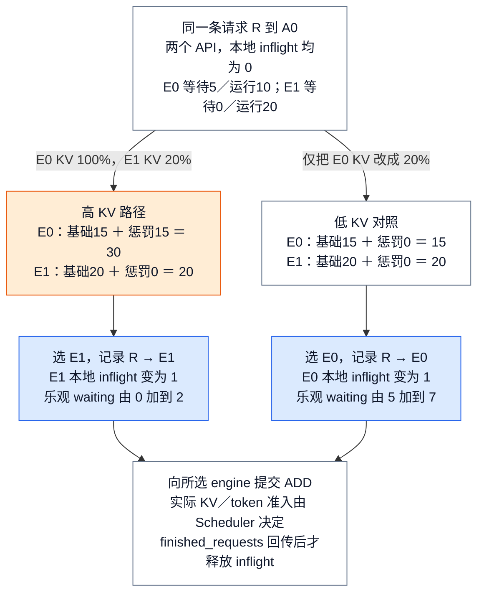

# vLLM Serving 控制面：从一个入口扩为多个推理副本

> **源码基线**：`vllm-project/vllm@199cb9b964822e59ab9b58d88e7be31eb419a2ae`（`main` 快照，2026-09-07 UTC）
> **主题**：从两个推理副本接收请求的场景出发，解释 API 与 Engine 的部署拓扑、分阶段就绪和 DP 负载选择。随后追踪进程故障怎样影响对外服务，以及退出预算怎样在进程管理者之间传递。
> **适用范围**：拥有 Serving 拓扑、通信端点、readiness、DP 路由与进程退出；请求协议归请求语义页，Engine 内部执行归 Engine 页，collective 归分布式推理页，故障状态与观测细节归可靠性页。
> **最近更新**：2026-09-08。按固定新基线复核启动、路由、健康和退出，补数值实例及新行为边界。

## 1. 两个副本都加载了模型，下一条请求应该交给谁？

假设原来一个在线服务只有一个推理副本，现在扩成 E0、E1 两个 **DP 副本**：每个副本接收自己的请求、维护自己的调度队列和 KV Cache。DP 是 data parallel，表示请求批次可以分到不同副本；一个副本内部仍可由多张卡共同执行，具体见 [[18_vllm_distributed_inference_analysis|分布式推理]]。

两个 API 进程 A0、A1 共用一个 HTTP 入口，把前端处理负担分开。现在请求 R 到达 A0：E0 报告等待 5 条、运行 10 条、KV 使用率 100%；E1 没有等待、运行 20 条、KV 使用率 20%。只比较请求总数会选择 E0，但它已在高 KV 压力下积累等待；当前内部路由会给 E0 的等待施加惩罚，最终选择 E1。后文将逐项算出 30 与 20 这两个分数。

这还只是服务已经就绪后的选择。若 E1 仍在加载模型，不能仅因为 HTTP 端口出现就把它当作可用副本；若 E0 的 worker 随后死亡，也不能假设 A0 存活就代表服务仍然健康。Serving 控制面把这些问题拆成三个阶段：**启动时确认各层准备完成，运行时用反馈选择副本，退出时收拢进程与未完成工作。**

这里的数字是根据源码规则构造的教学输入，不是测量结果。普通请求的解析、结果渲染和客户端取消见 [[03_vllm_request_semantics_analysis|请求语义]]；本页从“服务由谁启动，请求送往哪个 Engine”开始。

## 2. 先决定拓扑：增加 API 与增加 DP 解决不同问题

增加 API 进程分担 HTTP、输入输出处理；增加 DP 副本增加独立队列和模型执行容量。两者的数量可以不同，worker 数又取决于副本内的并行配置。`ServeSubcommand.cmd` 先拒绝多个互斥 LB 模式，再推导 API 数并选择入口。

| 部署选择 | 未显式设置时的 API 数 | 请求在哪里选择副本 |
|---|---|---|
| Internal LB | 全局 `data_parallel_size` | 各 API 的 Core client 在所管理的全部 DP ranks 中选择 |
| Hybrid LB | `data_parallel_size_local`，未提供则 1 | 外部入口选择本地服务组；组内 client 在本地 ranks 中选择 |
| External LB，或显式 `data_parallel_rank` | 1 | 外部 LB 选择 rank；该 API client 固定发送到自己的 core |
| Multi-port external LB | 顶层默认 1；supervisor 为每个本地 DP rank 启动独立 server | 外部 LB 选择对应端口，supervisor 汇总本地 children 的健康 |
| Headless | 0 | 此进程不启动 HTTP API，为别处的 frontend 提供执行部分 |

表中是 CLI 的默认解析，不是推荐配置。`data_parallel_start_rank` 在未选择其他相关模式时推导 hybrid；multi-port、external、hybrid 同时启用会抛 `ValueError`。Rust frontend 默认按一个多线程进程处理，显式 API count 大于一会被改为一；elastic EP 当前也把 API count 限至至多一。其后才分流到 supervisor、headless、multi-API 或 single-API 四类入口。

Headless 还要区分两种职责：同一 DP 副本内 `node_rank_within_dp > 0` 的节点直接启动 `MultiprocExecutor` 并监控 workers；其余 headless 路径由 `CoreEngineProcManager` 持有本地 cores。headless 拒绝 hybrid，且本地 engine 数必须大于零。这些计数和选择不能从“每 GPU 一个 worker”的示意图反推。

### 谁保存哪份状态？

| 组件 | 持有的状态与责任 | 它不能证明的事实 |
|---|---|---|
| Launcher / process manager | 模式、子进程集合、signal、启动屏障与退出预算 | 请求已经获得 KV 或生成结果 |
| API process | HTTP socket、应用状态、Engine client 生命周期 | Engine 内部真实 token/KV 余量 |
| DP coordinator | 各 engine 的 waiting/running/KV 统计；MoE 的 wave 状态 | 某条请求已被调度；它不接收推理请求正文 |
| Core client | engine 地址与身份、ready 元数据、请求到 engine 映射、本地未完成计数 | 全部 API 的实时负载，以及目标一定能立即执行 |
| EngineCore / workers | Scheduler、KV、模型与设备执行状态 | 外部 LB 已迁走流量，HTTP 调用者已消费最终结果 |

**分析推断**：如果只让一个 round-robin 根据进程存活分发，既会在启动未完成时送入请求，也会忽略高 KV 压力和跨 API 的反馈延迟。源码采用分阶段 ready 与负载评分，能够把这几种不同事实分别确认；这不是关于历史实现曾如何演进的断言。

## 3. 从进程创建到 API 可用：每种 READY 只证明自己的阶段

### 3.1 先发布实际地址，再允许 Engine 连接

多 API 主流程在 `launch_core_engines()` 上下文中创建 API manager。API child 的 Core client 先 bind 请求与输出通道，再通过 pipe 回报实际 ZMQ endpoint；父进程收齐后，才把地址交入随后执行的 engine handshake。对于 `tcp://host:0`，零是请操作系统选端口的占位值，不能把它当作最终可连接地址。

`APIServerProcessManager.gather_actual_addresses` 按 `client_index` 收集地址，同时观察 children 的 sentinel，并在共享收集 deadline 到期时报错。pipe 与退出事件同时到达时先读 pipe，以免把“已回报后退出”误作“未回报”；真正未回报就退出或 pipe EOF 都会使收集失败。地址已回报也只证明 bind 成功，不证明 child 之后仍然存活。

单 API 的 client 自己启动 engines 时，同样先 bind 并读取 `LAST_ENDPOINT`。Ray DP 是这里的明确分支：主流程使用预分配地址，不走 Python children 的动态地址回收。vLLM 向 ZMQ、操作系统 socket 和 Ray 交付了端点/启动请求；本页核验的是 vLLM 的调用与检查，未验证这些外部运行库内部的传输或调度实现。

### 3.2 设备、缓存、数据通道和全局屏障逐级闭合

| 完成信号 | 发出前发生什么 | 收到后能确认什么 |
|---|---|---|
| Worker `READY` | `WorkerProc` 初始化设备、加载模型并建立响应句柄 | worker 构造完成；其后仍有 message queue 就绪等待，不能跳到 HTTP 可用 |
| Core 数据通道 ready response | EngineCore 构造 executor、profile/分配 KV、compile/warmup、创建 Scheduler；input thread 连接 frontends 并订阅 coordinator | frontend 知道 engine identity、实际模型长度及 cache 元数据，ROUTER 可以向该 engine 发消息 |
| Coordinator `READY` | 收齐初始全部 engine 订阅 | 这组 DP 的 coordinator 通道已经连通；不是推理探针 |
| Launcher handshake `READY` | Core input thread 已等到 coordinator READY，设置本地 ready event，构造过程结束 | launcher 可把该 core 从 CONNECTED 改为 READY；仍需等待其他 cores |
| API app 建立并开始 HTTP serving | Engine client context 建立、查询 supported tasks、初始化 app state | HTTP 前端完成自身启动；不替代外部 LB 或端到端请求验证 |

Executor 父进程会通过 `WorkerProc.wait_for_ready` 收齐所有 worker 响应，EOF 或非 READY 状态使初始化失败。EngineCore 构造时还把 executor-failure callback 注册到 executor，失败会进入控制面，而不是只由 HTTP 层发现。

普通文本主线中，Worker READY 之后 Core 仍需收集各 worker 的 KV spec、确定布局与可用显存、生成 cache 配置、同步可能缩小的模型长度，再初始化 KV 并 compile/warmup。因此“模型已加载”不是“缓存已可用于请求”。具体容量算法见 [[08_vllm_kv_cache_management_analysis|KV Cache 管理]]。

两种 Core ready 的次序尤其重要：**input thread 先给各 frontend 发数据通道 response，再等 coordinator READY，最后 launcher handshake 才发送 READY。** 多 API 中 frontend 可以先拿到元数据，launcher 则继续等待完整拓扑；这是一组并发分支，不能改画成“全部启动屏障通过后 frontend 才收到元数据”的单一链。单 API 自己拥有 engines 时，client 构造先退出 launch 上下文、经过 launcher 屏障，随后才消费已发来的数据通道 response。

`MPClient._apply_ready_response` 会取各 engine `max_model_len` 的较小值、累计 `num_gpu_blocks`，同步实际 `block_size` 与 `mamba_block_size`，并校验 DP stats 地址一致；`kv_cache_size_tokens` 和 `kv_cache_max_concurrency` 保持每 engine 信息，不跨 DP 求和。新 response 还携带并行规模和能力等元数据，不能把“response 已解码”解释为每个字段都被 Python client 汇总。逐 engine 等待受 `VLLM_ENGINE_READY_TIMEOUT_S` 限制，超时明确抛错。

`wait_for_engine_startup` 在收 HELLO/READY 的同时观察 engines、coordinator 和 watched frontends 的 sentinel，核验 rank、local/headless 和合法状态转换；陌生 rank、模式不符、成员提前退出都使启动失败。**collective 配置 hash 的一致性检查只在 coordinated MoE DP 中执行**，并非所有拓扑的普遍校验。

### 3.3 Coordinator 是否存在，取决于模型与 LB 模式

新基线 `VllmConfig.needs_dp_coordinator` 要求 DP 大于一，并满足：模型配置为空、模型为 MoE，或不是 external LB。实际在线启动还要求非 offline 且在 DP rank 0 创建 coordinator。

因此 dense 模型的 internal/hybrid LB 也有 coordinator，但只收集和广播统计；MoE 还开启 wave coordination。**wave 是一轮需要多 rank 一起推进的工作状态**：有请求的 rank 必须让空闲 ranks 知道需要参与，collective 原因归 [[18_vllm_distributed_inference_analysis|分布式推理]]。其启动通知不是完成确认：coordinator 发出 START_DP_WAVE 后不立即认定 engines 已运行，而是等 engine 自己的 start-wave 通知；pause 状态的 engine 可能丢弃启动通知。

这保留了一个共同原则：地址回报证明地址，订阅屏障证明通道，engine 通知证明其报告的运行状态。任何一个都不能替代真实请求完成。

## 4. 回到请求 R：统计反馈怎样变成一次 DP 选择？

### 4.1 三个输入，一次线性扫描

`EngineCoreClient.make_async_mp_client` 在 external DP LB 时选择固定目标的 `DPAsyncMPClient`，internal/hybrid 选择 `DPLBAsyncMPClient`；普通单 core 使用 `AsyncMPClient`。下述评分属于内部选择器。请求已指定 `data_parallel_rank`，或 late-interaction pooling 已给出 engine index 时，会绕过评分；请求语义的约束归 [[03_vllm_request_semantics_analysis|请求语义]]。

对每个候选 engine，选择器读取：coordinator 快照中的 waiting、running 和 KV usage；本 API client 对该 engine 的精确 inflight；API client 总数 `client_count`。评分规则依次是：

1. 取 **client_count 乘本地 inflight** 与 **waiting 加 running** 中较大者，作为基础负载。前者为本地 burst 提供不会被陈旧快照抹掉的下限，后者包含其他 API 带来的压力。
2. 若 waiting 非零，再加 **waiting 乘 6，乘 KV usage 超过 0.5 的部分**；usage 不超过 50% 时惩罚为零，usage 为 100% 时额外加三倍 waiting。
3. 从当前扫描起点依次检查，选择分数最小者；同分保持先遇到的 engine。选择后将快照中的 waiting 乐观加 `client_count`，扫描起点向后旋转一位。
4. 保存请求 ID 到 engine 的映射，并将本 client 对该 engine 的 inflight 加一。之后异步发送 ADD，请求携带 `client_index` 与 `current_wave`。

扫描开销随候选 engine 数线性增长，源码仍把大 DP 使用 power-of-two-choices 留作 TODO。乘 `client_count` 不是观测到了别的 API 的精确计数，而是源码用于估计负载的缩放；各 API 并没有共享一个同步的 inflight counter。

### 4.2 用同一条请求对比 KV 压力的作用

回到 A0 接收的 R，两个 API 意味着 `client_count=2`。先令 A0 在 E0、E1 上的 inflight 都为 0：

| 候选 | waiting / running / KV | 基础负载 | KV 惩罚 | 最终分数 |
|---|---|---|---|---|
| E0 | 5 / 10 / 1.0 | 0 与 15 取大，得 15 | 5 乘 6 乘 0.5，得 15 | 30 |
| E1 | 0 / 20 / 0.2 | 0 与 20 取大，得 20 | 无 waiting，得 0 | 20，选中 |

只把 E0 的 KV usage 改成 0.2，其惩罚变成 0，最终分数为 15，于是同一组请求数会改选 E0。这个对照正是 `test_dplb_kv_pressure_amplifies_waiting_penalty` 的两种输入。它解释了为何总请求数少的副本未必优先，但不证明这个启发式在任意负载都最优。

<!-- Figure spec: conceptual decision flow for the same R and two engines. Two lanes start from identical waiting/running counts and client_count=2, local inflight=0. High-KV lane computes E0 base15+penalty15=30 versus E1=20, selects E1, then records R→E1 and inflight1. Low-KV lane changes only E0 usage to0.2, computes E0=15 versus E1=20, selects E0 and records R→E0. Blue marks selected-owner record; orange marks high-KV penalty. Final shared box states routing publication is not Scheduler admission or request completion. Not a call graph or proportional chart. -->

图中两个分支是替换输入后的两次独立推演，不是把 R 复制发送两次。waiting 的乐观修改属于 API 侧缓存，尚未改动 Engine Scheduler 的真实等待队列。

### 4.3 为什么还需要本地 inflight？

Coordinator 在统计变化时按默认 100 ms 更新间隔发布，无变化时约每 5 秒刷新；MoE 另有按同步 step 收集的窗口，dense 则没有统一 step 边界。API stats task 排空消息只取最新快照，所以快照会整体替换 `lb_engines`。

考虑空载 E0/E1，A0 连续收到 R、S，R 先选 E0。此时 A0 对 E0 的 inflight 是 1。即使陈旧快照把两边 waiting/running 都重置为零，S 仍看到 E0 基础负载至少为 2，而 E1 为 0，因此选 E1。若仅修改快照 waiting，重绑定会抹掉刚发出的请求，burst 就会错误地反复压向“空”副本。旋转起点进一步去除平局总偏向同一 rank 的问题。

但本地计数不是 send 完成就减一：Core 输出里的 `finished_requests` 被 `DPLBAsyncMPClient.process_engine_outputs` 消费时，才移除映射并减 inflight。abort 也按原映射分组送回原 engine，不能重新做 LB；发送 abort 本身不表示 Engine 已完成取消。更下游的请求终态和输出消费见 [[06_vllm_engine_architecture_analysis|Engine 运行]]。

### 4.4 路由反馈、前端 admission 与 Scheduler 是三道不同决策

所有候选都拥挤时，评分仍然选一个最小者；它没有“全部过载则拒绝”的分支。client 输出用无上限 `asyncio.Queue`，ZMQ 工厂对相关 socket 设置 HWM 为 0；这两处传输设置也不能充当有界请求 admission。

> [!contradiction] 旧页面的全局结论需要缩小
> 旧稿据无界 queue/HWM 推断“Serving 没有容量闸门”。新基线已经有 `AsyncLLM.check_admission`：可配置 `max_num_queued_reqs` 和 `max_num_queued_tokens` 触发前端拒绝。因此保留的准确结论是：**DP 评分和消息传输自身不提供硬容量上限**；可选前端 admission、目标选择和 Engine Scheduler 的真实 KV/token admission 不能互相代替。前端计数属于各自 AsyncLLM，不是 coordinator 下发的全局容量保证。

完整的请求拒绝合同由 [[03_vllm_request_semantics_analysis|请求语义]] 解释，Engine 内部本步何时推进由 [[07_vllm_scheduler_analysis|Scheduler]] 解释。这里的路由算法既不自动迁移已经接收的 R，也不提供失败后的请求重放。

## 5. E0 故障后，哪些信号会改变整个服务？

### 5.1 默认进程故障路径与 multi-port 聚合健康

单 API client 对自己拥有的 engine manager 启动存活监控；异常退出会设置 `engine_dead` 并进入清理。多 API children 不拥有这些 engine 进程，父级 `wait_for_completion_or_failure` 同时观察 API children、coordinator 与 engine manager：进程非零退出或 manager 报告意外死亡都会抛服务级错误，主流程 finally 清理进程组。正常零退出与异常退出在这里有区别，不能说任何 sentinel 一亮就抛错。

API watchdog 每 5 秒检查一次 `engine.errored and not engine.is_running`；默认要求 HTTP server 退出。`VLLM_KEEP_ALIVE_ON_ENGINE_DEATH` 可保留 HTTP 进程，但不能使已经失败的 Engine 恢复处理。fatal 输出与 process monitor 怎样让等待者收到异常，由 [[23_vllm_observability_reliability_analysis|可观测性与可靠性]] 统一展开。

Multi-port supervisor 是另一套聚合合同：启动 children 后，先轮询每个 child 的 `/health`，全部通过才启动 supervisor 自己的 HTTP server。因此启动初期外部可能尚不能连接 supervisor 端口，而非必然得到 503。ready 后，任何 child 退出，或一次探测批次最终未全部通过，都会撤销 ready 并关闭本地 children；连接错误可按阈值重试，HTTP 非 200 立即视为探测失败。

supervisor 的 `/health`、`/ready`、`/readyz` 都只返回这份聚合 ready 状态，false 为 503。普通 API `/health` 则调用 `AsyncLLM.check_health`，把 `EngineDeadError` 转为 503；render-only 无 engine 时直接为 200。这不是一次模型推理，也不会逐个检查 FT 的 UNHEALTHY。外部 LB 如何探测和撤走流量属于部署系统的责任，本页没有核验外部 LB 的实现。

### 5.2 显式 FT 是窄例外，健康响应仍不是恢复证明

`enable_fault_tolerance` 默认关闭；开启时只支持单 API，配置校验拒绝 `_api_process_count > 1`。Worker sentinel 还要求 `deepep_low_latency` 或 `nixl_ep` all-to-all backend。因此开篇两个 API 的例子不能原样加一个 FT 开关就获得恢复能力。

启用 FT 后，busy-loop 异常先 abort 旧请求并清 batch queue，本地 executor 已失败时标记 DEAD，否则标记 UNHEALTHY。只有 UNHEALTHY 接受外部 retry；恢复操作完成后才回 HEALTHY，超时仍进入 fatal 路径。它不回滚已发生的局部副作用，也不自动重放旧请求。完整状态机、Worker 清理和依赖边界在 [[23_vllm_observability_reliability_analysis|可靠性机制]]；本页保留的部署结论是：**恢复状态、HTTP 健康、处置后新请求真正完成，需要分别验证。**

## 6. 退出：请求等待预算如何传给多个进程管理者？

单 API 收到 SIGTERM/SIGINT 后，launcher 先在执行线程中等待 engine client shutdown，再要求 HTTP server 退出并取消 watchdog；API worker 随后退出 backend context，最后 await HTTP shutdown task、关闭 socket。收到 signal、client shutdown 返回、HTTP 完成退出不是同一个事件。

EngineCore 收到退出请求后停止接受新 ADD。`shutdown_timeout=0` 立即 abort 未完成请求；正值选择 drain，让已接收工作继续推进。`_handle_shutdown` 等 `has_work()` 为 false 才进入资源 teardown；外层 process manager 则限制等待时间并能强制结束进程。drain 不等于保证每个请求成功完成：请求可能失败，或耗尽父级预算后被终止。

多 API 主流程在用户请求 shutdown 时只创建一个绝对 `shutdown_by`：先把预算交给 API manager，再用剩余时长调用 local engine manager，最后交 coordinator。假设总等待预算为 30 秒，API manager 消耗 24 秒，则后两者共享约 6 秒，不是各自再获得 30 秒。各 manager 对自己的 children 也先发 SIGTERM、在同一个 deadline 内逐个 join，最后 kill 仍未退出的进程树。

这条预算规则有明确范围：异常清理没有用户 timeout 时，通用 process cleanup 使用 5 秒 best-effort；ROCm 在请求 timeout 与 process timeout **同时为零**时允许专用设备清理宽限，正请求 timeout 消耗完之后不能重新获得宽限。Multi-port supervisor 还把 `CHILD_EXIT_GRACE_S` 加到进程等待预算，并把同一等待预算用于全部 children。故“共享 deadline”约束的是相应等待阶段，不是承诺整个操作系统 teardown 严格不超过请求 drain timeout。

信号传递和进程树终止经过 Python multiprocessing、操作系统与设备 runtime；本页验证 vLLM 如何传递预算和收集退出，不据此保证所有设备故障都能在固定时刻回收显存。退出后资源与新请求的操作检查见 [[05_vllm_debugging_troubleshooting_guide|调试与排障]]。

## 7. 已知边界、文档漂移与验证路线

> [!contradiction] 同基线部署文档仍把 KV-aware LB 写为未来能力
> `docs/serving/data_parallel_deployment.md` 的 internal LB 说明仍称只依据 running/waiting、KV-aware 是未来改进；当前 `DPLBAsyncMPClient.get_core_engine_for_request` 已实现上述 KV 惩罚。本页保留冲突并以 live code 为准。

`docs/design/arch_overview.md` 的典型进程数与“DP 大于一就有 coordinator”也只能作简化图解：API 数取决于 CLI 模式，dense external LB 可以不需要 coordinator，hybrid client 的管理范围又局限本地。定位部署时应先重建实际模式与候选 rank，不能由一张全局示意图认定连接范围。

源码中的 config hash、ready 元数据、统计/wave、FT status 与共享 deadline，都是显式跨进程协作信息。**分析推断**：这些信息使局部状态可被上层核验，但仍有陈旧快照、异步故障与队列容量边界；“反馈更及时、过载更可观察”是基于限制提出的改进方向，不是源码承诺的路线图。唯一在评分器直接标出的算法后续项是较大 DP 的 P2C TODO。

### 从症状找验证入口

| 需要验证的行为 | 已打开的测试合同或观察点 |
|---|---|
| API child 的动态端口能否用于连接 | `test_gather_actual_addresses_end_to_end` 要求全部 endpoint 端口非零且唯一；`test_gather_actual_addresses_child_crash_before_report` 要求 child 未回报就退出时抛错 |
| 陈旧快照能否抹掉 burst 负载 | `test_dplb_burst_round_robins_despite_snapshot_rebinds` 在重绑零快照后要求四 engine 的 inflight 各为 2 |
| 统计和 KV 惩罚是否改变选择 | `test_dplb_snapshot_backpressure_overrides_inflight` 验证远端压力胜过本地零计数；`test_dplb_kv_pressure_amplifies_waiting_penalty` 验证本页 30/20 与 15/20 对照 |
| 何时释放路由计数 | `test_dplb_finished_requests_release_inflight` 消费 finished set 后才要求计数归零、映射消失 |
| 退出是否结束新旧请求与进程 | `test_request_rejection_during_shutdown` 接受状态错、连接错或协议错，要求十次新请求至少一次失败；`test_multi_api_server_shutdown` 覆盖双 API 与 SIGTERM 后清理，不是“每个新请求必返固定 503”的保证 |

以上是源码阅读与测试合同静态核验。本轮未运行多卡模型、在线服务、GPU 故障注入、Ray/Rust frontend 或第三方通信库。若端口存在但服务不工作，依次区分实际 endpoint、Worker/Core/Coordinator 的 ready、client 元数据同步与全局启动屏障；若路由偏斜，联合看快照、本地 inflight、KV 惩罚和映射；若退出拖延，检查哪个等待阶段消耗预算。单次 `/health=200` 不能结束这些验证。

### 源码阅读路线

路径均相对上方固定基线的 vLLM 仓库；每行聚合一个核验问题，符号用于继续阅读而非充当调用图。

| 问题 | 已打开的稳定入口 |
|---|---|
| 拓扑和进程数怎样确定？ | `vllm/entrypoints/cli/serve.py::ServeSubcommand.cmd / run_headless / run_multi_api_server`；`vllm/v1/engine/core_client.py::EngineCoreClient.make_async_mp_client` |
| 最终地址怎样发布并验证？ | `vllm/v1/utils.py::APIServerProcessManager.gather_actual_addresses`；`vllm/v1/engine/core_client.py::MPClient.__init__`；`tests/entrypoints/launchers/api_server/test_api_server_process_manager.py::test_gather_actual_addresses_end_to_end / test_gather_actual_addresses_child_crash_before_report` |
| Worker 到 Core 两种 ready 怎样排序？ | `vllm/v1/executor/multiproc_executor.py::WorkerProc.__init__ / worker_main / wait_for_ready`；`vllm/v1/engine/core.py::EngineCore.__init__ / _initialize_kv_caches / EngineCoreProc.__init__ / _make_ready_response / process_input_sockets / _perform_handshakes / _perform_handshake` |
| 全局屏障与 frontend 怎样接上？ | `vllm/v1/engine/utils.py::launch_core_engines / wait_for_engine_startup`；`vllm/v1/engine/core_client.py::MPClient._apply_ready_response`；`vllm/entrypoints/launchers/api_server/entry.py::build_async_engine_client_from_engine_args / build_and_serve / run_server_worker` |
| Coordinator 何时存在、反馈什么？ | `vllm/config/vllm.py::VllmConfig.needs_dp_coordinator`；`vllm/v1/engine/coordinator.py::DPCoordinator / DPCoordinatorProc.process_input_socket / _send_start_wave` |
| 评分、发送与完成怎样串起来？ | `vllm/v1/engine/core_client.py::DPAsyncMPClient._ensure_stats_update_task / add_request_async / DPLBAsyncMPClient.get_core_engine_for_request / process_engine_outputs / abort_requests_async`；`tests/v1/engine/test_engine_core_client.py::test_dplb_burst_round_robins_despite_snapshot_rebinds / test_dplb_snapshot_backpressure_overrides_inflight / test_dplb_kv_pressure_amplifies_waiting_penalty / test_dplb_finished_requests_release_inflight` |
| 软路由与前端拒绝边界在哪？ | `vllm/v1/engine/core_client.py::AsyncMPClient.__init__`；`vllm/utils/network_utils.py::make_zmq_socket`；`vllm/v1/engine/async_llm.py::AsyncLLM.check_admission` |
| 进程死亡与健康如何影响服务？ | `vllm/v1/utils.py::wait_for_completion_or_failure`；`vllm/entrypoints/launchers/launcher.py::watchdog_loop / terminate_if_errored`；`vllm/entrypoints/launchers/dp_supervisor.py::DPSupervisor.run / _probe_all_children / _monitor_children / _build_dp_supervisor_app`；`vllm/v1/engine/async_llm.py::AsyncLLM.check_health / errored`；`vllm/entrypoints/serve/instrumentator/health.py::health` |
| FT 为什么不能直接套到多 API？ | `vllm/config/parallel.py::ParallelConfig._validate_parallel_config`；`vllm/v1/fault_tolerance/engine_core_sentinel.py::EngineCoreSentinel.on_fault / handle_command / retry / fault_tolerant_wrapper`；`vllm/v1/worker/sentinel/gpu_worker_sentinel.py::WorkerSentinel.__init__` |
| 退出预算在哪里收紧？ | `vllm/entrypoints/cli/serve.py::run_multi_api_server`；`vllm/entrypoints/launchers/launcher.py::serve_http`；`vllm/v1/utils.py::shutdown`；`vllm/v1/engine/utils.py::get_engine_process_shutdown_timeout`；`vllm/v1/engine/core.py::EngineCoreProc._handle_shutdown / _reject_add_in_shutdown`；`vllm/entrypoints/launchers/dp_supervisor.py::DPSupervisor._shutdown_children`；`tests/entrypoints/launchers/test_shutdown.py::test_request_rejection_during_shutdown / test_multi_api_server_shutdown` |

## Related Pages

- [[02_vllm_architecture_overview_analysis|vLLM 架构概览]] — 从单次模型计算建立整体模块地图，解释本页在在线服务中的位置。
- [[03_vllm_request_semantics_analysis|请求语义]] — 解释 API 解析、前端拒绝、输出渲染与请求级取消。
- [[06_vllm_engine_architecture_analysis|Engine 运行]] — 接续选定 Engine 后的执行协作、请求终态与输出消费。
- [[07_vllm_scheduler_analysis|Scheduler]] — 解释真正的 token/KV 准入，与本页软路由反馈区分。
- [[18_vllm_distributed_inference_analysis|分布式推理]] — 解释副本内 TP/PP 与跨 DP 的 MoE collective，以及 worker 故障域。
- [[23_vllm_observability_reliability_analysis|可观测性与可靠性]] — 展开 FT/fatal 状态、信号可见性以及健康响应的局限。
