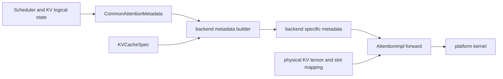

# vLLM Attention Backend：用能力合同连接动态调度与专用 Kernel

> **源码基线**：`vllm-project/vllm@d66300a1baa7779c68c7dfa4e51eee2502b48017`
> **中心命题**：attention backend 不只是 `forward()` 的不同实现。它必须同时定义 KV layout、block size、metadata、batch reorder、量化、context parallel 和 CUDA Graph 能力。vLLM 用 backend/builder 合同把 Scheduler/KV 的逻辑状态翻译成 kernel 输入，避免 runner 按后端名称硬编码路径。

## 一、为什么 attention 是系统接缝

同一模型层可能面对：

- prefill、单 token decode、mixed batch、speculative multi-token decode；
- MHA、GQA、MQA、MLA、sliding window、Mamba 或 cross attention；
- FP16/BF16/FP8 KV、不同比特和 per-head scale；
- full/piecewise/no CUDA Graph；
- TP、DCP、PCP；
- FlashAttention、FlashInfer、Triton、ROCm AITER 等平台 kernel。

如果 `Attention` 只暴露一个共同 forward signature，而其他能力散落在 runner 的 `if backend == ...` 中，任何新 backend 都会横向修改 scheduler、KV、compile 和 graph 代码。vLLM 的设计是让 backend 类声明静态能力，让 metadata builder 负责动态 batch 翻译。

## 二、三段契约

### 2.1 Backend 静态合同

`AttentionBackend` 声明支持 dtype/KV dtype、kernel block sizes、impl/builder class、KV cache shape 与 stride/layout；`vllm/v1/attention/backend.py:55-126`。它回答“这个实现原则上能消费什么存储和硬件”。

### 2.2 Common metadata

`CommonAttentionMetadata` 保存 query start、sequence length、request/token 数、block table、slot mapping，以及 DCP、encoder、prefill、sparse 等可选信息；`vllm/v1/attention/backend.py:456-532`。它是 runner 对动态 batch 的统一描述，不等于某个 kernel 的最终参数。

### 2.3 Metadata builder

每个 builder 把 common metadata 和 `KVCacheSpec` 转为后端专用 metadata，并声明 batch reorder、block-table 原地更新、draft metadata 更新和 graph capture 能力；`vllm/v1/attention/backend.py:672-815`。

核心不变量是：**backend-specific metadata 必须与本轮 request ordering、block table、query/context length 和 capture mode 属于同一快照；不能复用上一轮 metadata 却只更新其中一部分。**

## 三、选择器为什么输入这么多维度

`get_attn_backend()` 收集 head size、dtype、KV dtype、MLA/sink/sparse/multimodal prefix、per-head scale、attention type、sliding window，以及 connector、PCP/DCP、adaptive verification 等全局条件；`vllm/v1/attention/selector.py:105-188`。

随后平台对象根据这些条件解析 backend class；若 backend 要求特定 KV cache layout，选择器会设置全局 layout；`vllm/v1/attention/selector.py:195-226`。这给出初始化顺序约束：

1. 模型/attention 语义和平台能力决定 backend；
2. backend 决定 KV shape/layout 与 block size 能力；
3. KV cache profiling/allocation 才能确定物理容量；
4. Scheduler 才能按实际容量准入。

因此不能在 KV 已分配后随意热切换到需要不同 layout 的 backend。backend selection 更接近模型实例 ABI，而不是每请求策略。

## 四、`Attention` layer 如何接入合同

模型构造 `Attention` 时提供 heads、head size、scale、KV heads、sliding window、cache/quant config 和 layer prefix。layer 解析 KV dtype、per-head scale、skip-layer 配置，再调用 selector；`vllm/model_executor/layers/attention/attention.py:218-350`。

它还会显式拒绝/降级不兼容组合。例如 batch-invariant 模式与特定 backend 的 prefix cache 组合会关闭 prefix caching；ALiBi sqrt、chunk lookback 等特性也要求 backend 声明支持；`vllm/model_executor/layers/attention/attention.py:353-383`。

layer 的 `get_kv_cache_spec()` 把 full/sliding 等 attention 语义转换为 KV manager 可理解的 spec；`vllm/model_executor/layers/attention/attention.py:640-655`。这条边界很关键：Scheduler 不应该识别 FlashAttention 名称，它只处理由 layer/backend 共同确定的 KV spec。

## 五、metadata 是动态系统的“形状证明”

静态模型参数只能说明 head 数和 dtype；每一轮还需要证明：

- flattened query 中每个 request 的起止位置；
- 当前 context length 与 query length；
- 哪些 token 写入哪个 physical slot；
- block table 的 request row 和 group；
- batch 是否 uniform decode、mixed、prefill 或 spec decode；
- common prefix、sliding window、DCP local length 等边界。

Common metadata 同时保留部分 CPU/GPU 版本，是因为 Python 选择逻辑和 GPU kernel 需要不同访问方式；异步模式下某些 CPU length 只是 optimistic upper bound，源码明确警告不能给需要精确 decode length 的 kernel 使用；`vllm/v1/attention/backend.py:469-514`。

这意味着 backend 不能仅凭“字段存在”假设其精度；metadata 字段本身也有同步语义。

## 六、KV 更新与 attention forward 为什么需要显式依赖

某些 backend 在 forward 内写 KV，另一些把 KV update 拆成 custom op。`unified_kv_cache_update()` 从 forward context 取得 layer、KV tensor 和 slot mapping，执行写入并返回 dummy tensor；随后 attention op 接受该 dummy dependency，确保 `torch.compile` 不会重排写入与读取；`vllm/model_executor/layers/attention/attention.py:658-758`。

这是编译系统中的副作用建模：KV tensor 可能通过 context 间接获得，图编译器看不到普通 Python 所有权；dummy data dependency 把“先写 cache、再读 attention”变成图内可保持的顺序。

直观地把 KV update 写成任意 Python side effect，在 eager 下可能正确，在 compile/fusion 后却可能被移除或重排。

## 七、CUDA Graph 能力不是布尔值

`AttentionCGSupport` 区分：

- `ALWAYS`：mixed prefill/decode 也支持；
- `UNIFORM_BATCH`：只支持相同 query length，可覆盖 spec decode；
- `UNIFORM_SINGLE_TOKEN_DECODE`：只支持纯单 token decode；
- `NEVER`；`vllm/v1/attention/backend.py:655-669`。

布尔 `supports_cudagraph` 无法表达 FlashInfer/Mamba 等“decode 可捕获、mixed 不可捕获”的现实。runner 汇总所有 attention group 的最低能力，再由 dispatcher 对当前 batch 选择 full、piecewise 或 eager。官方设计要求 compile 与 capture 尽量解耦、按 batch composition 动态派发；`docs/design/cuda_graphs.md:23-36`。

代价是 backend 必须提供 capture-safe metadata buffer，地址和 shape 不能在 replay 时变化；fused draft loop 还要求 `supports_draft_decode_metadata_update`，否则回退到逐步重建。

## 八、为何允许 batch reorder

不同 kernel 对 uniform decode、short query、prefill 的最优布局不同。builder 可以声明 `reorder_batch_threshold`，把特定 query length 的请求移到 batch 前部；DCP 若不支持 varlen 会把 threshold 收紧为 1；`vllm/v1/attention/backend.py:711-741`。

reorder 的正确性条件是所有 companion state 同步重排：input ids、positions、block table、sampling mapping、output index。只重排 attention metadata 会把请求 A 的 query 与请求 B 的 KV 组合。

MRV2 将 persistent state row 与 per-step input order 分离，正是为了让 gather/reorder 不需要搬动持久 owner；见 [[02_engineering/03_infer_frameworks/vllm/15_vllm_model_runner_v2_analysis|Model Runner V2]]。

## 九、为什么不使用一个万能 backend

| 方案 | 失败原因 | 多 backend 合同的代价 |
|---|---|---|
| 一个通用 PyTorch attention | 覆盖广但 decode/paged KV/MLA 性能不足 | 维护选择矩阵与回退 |
| 每 backend 直接读取 Scheduler | 内核与请求生命周期耦合，无法复用 | metadata 构建有固定成本 |
| 统一一个 KV layout | 简化 manager，但浪费平台/内核特性 | layout 在实例初始化时必须协商 |
| graph 支持用布尔值 | 无法表达 decode-only/uniform-only | 多级 capability 与 dispatcher 更复杂 |
| backend 自行重排局部 tensor | 易实现但破坏跨状态对齐 | runner 必须提供统一 mapping/gather |
| 所有副作用留在 Python | eager 简单，compile 后顺序不可靠 | custom op/fake impl/dummy dependency |

## 十、失败边界与验证顺序

出现 backend 问题时按合同逐层检查：

1. selector 输入是否反映真实 dtype、KV spec、parallel 和 connector 配置；
2. backend 是否支持 head size、block size、KV dtype/layout；
3. common metadata 的 length/order/block table 是否来自同一 batch；
4. builder 是否正确处理 reorder、capture、draft update；
5. KV write 与 attention read 是否有编译可见依赖；
6. 当前 graph mode 是否超过所有 group 的最低能力；
7. fallback 是性能降级还是配置错误。

最小源码阅读顺序：`vllm/v1/attention/selector.py:105-226` → `vllm/v1/attention/backend.py:55-441` → `vllm/v1/attention/backend.py:456-815` → `vllm/model_executor/layers/attention/attention.py:218-390,640-772` → 目标 backend 的 builder/impl。

## Related Pages

- [[02_engineering/03_infer_frameworks/vllm/12_vllm_kv_cache_management_analysis|vLLM KV Cache 管理]] — backend 消费的 block ownership 与 KV spec 来源。
- [[02_engineering/03_infer_frameworks/vllm/13_vllm_model_library_analysis|vLLM 模型与权重 ABI]] — 模型 layer 如何构造 attention 和并行参数。
- [[02_engineering/03_infer_frameworks/vllm/15_vllm_model_runner_v2_analysis|vLLM Model Runner V2]] — common metadata、reorder 和 persistent row 的生产者。
- [[02_engineering/03_infer_frameworks/vllm/20_vllm_speculative_decoding_analysis|vLLM 投机解码]] — multi-token query 和 draft metadata update。
- [[02_engineering/03_infer_frameworks/vllm/21_vllm_quantization_analysis|vLLM 量化派发设计]] — KV dtype、scale 与 attention kernel 兼容性。
- [[02_engineering/03_infer_frameworks/vllm/23_vllm_compilation_cudagraph_analysis|vLLM 编译与 CUDA Graph]] — capability 如何决定 full/piecewise/eager 派发。
- [[02_engineering/03_infer_frameworks/vllm/25_vllm_ir_and_fusion_passes_analysis|vLLM IR 与融合 Pass]] — attention custom op 如何成为图边界。
