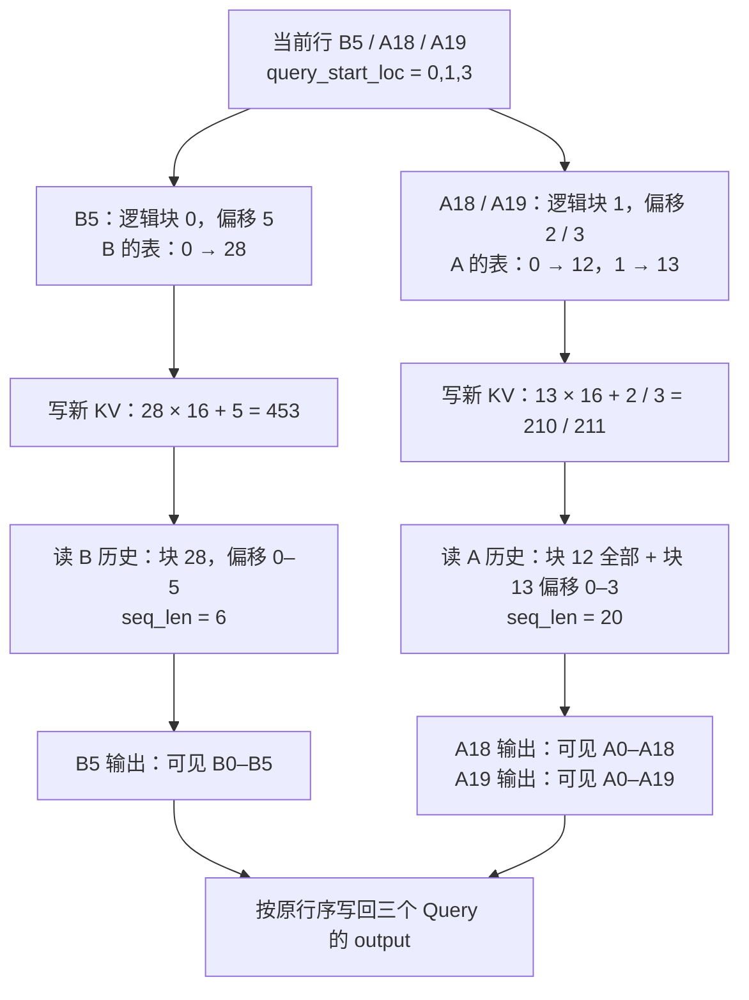
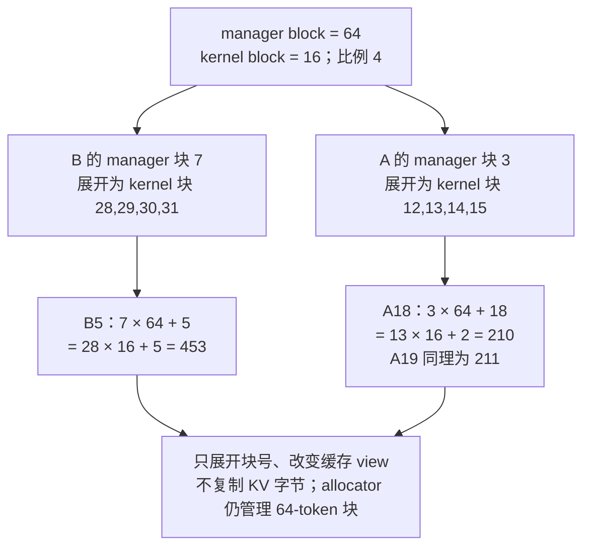

# vLLM Attention Backend：让本步 Query 找到完整 KV 历史

> **源码基线**：`vllm-project/vllm@199cb9b964822e59ab9b58d88e7be31eb419a2ae`（`main`，2026-09-07）
> **主题**：用一个混合 batch 解释新 K/V 写到哪里、当前 Query 怎样读取请求历史，再追踪 spec、backend、layout、builder 与 impl 如何接合。
> **适用范围**：attention 能力选择、KV 表示与 metadata 翻译；请求调度、物理块生命周期、设备 batch 维护和 CUDA Graph 全局派发分别由相邻页展开。
> **最近更新**：2026-09-08。补充地址演算、虚拟块转换，以及当前 B12X、MLA sparse 和布局选择边界。

## 1. 三个新 token，为什么不能只传三个 K/V

一次模型执行只算本步的新 token。假设请求 B 已算完位置 0–4，本步算位置 5；请求 A 已算完位置 0–17，本步续算位置 18、19。模型把当前 Query 排成 `[B5, A18, A19]`，K/V 也只有这三行。但 B5 需要看到 B 的六个位置，A19 需要看到 A 的二十个位置：**新 K/V 是要写入缓存的增量，attention 读取的是缓存中的完整可见历史。**

下面固定一个教学例子：普通 causal decoder，未量化，无上下文并行或推测解码；每个 token 有 4 个 Query head、2 个 KV head，head size 为 64。Q 的形状是 `3×4×64`，新 K/V 各为 `3×2×64`，输出仍为 `3×4×64`。暂设执行 kernel 的 block size 为 16；块号任意选取，用于演算地址，不代表真实模型或性能测试。

| 当步信息 | 教学值 | 它回答的问题 |
|---|---|---|
| 请求顺序 | `[B, A]` | metadata 的第几行属于谁？ |
| `query_start_loc` | `[0, 1, 3]` | B 的 Query 是扁平行 `[0,1)`；A 是 `[1,3)` |
| `seq_lens` | `[6, 20]` | 加上本步 Query 后，每个请求有多少个有效 KV 位置？ |
| `positions` | `[5, 18, 19]` | 三行新 token 各自位于请求内的哪里？ |
| `block_table` 的有效部分 | B：`[28]`；A：`[12, 13]` | 请求的第几个逻辑块存在哪个物理块？ |
| `slot_mapping` | `[453, 210, 211]` | 每行新 K/V 写入哪个物理 token 槽？ |
| 数量与上界 | requests=2，tokens=3，max query=2，max sequence=20 | 分段数、有效行数及 kernel 规划范围 |

`query_start_loc` 是前缀和，长度为请求数加一；相邻差得到 Query 长度 `[1,2]`。`seq_lens` **包含本步 token**，所以用它减去 Query 长度才得到旧 context `[5,18]`。不能把旧 context 长度直接填进 `seq_lens`，否则 kernel 会遗漏本步已经写好的 K/V。当前公共 dataclass 的简短字段注释容易把两者混淆；设备输入生成逻辑和 FlashAttention metadata 明确采用 `computed + query`。

为什么另需两张映射？`slot_mapping` 按**本步 token 行**索引，负责散写；`block_table` 按**请求和逻辑块**索引，负责找到包含旧 token 的历史。Query 的行数不等于历史长度，二者不能互相代替。将请求事实先归一为公共 metadata，也让 backend 不必读取 Scheduler 的 CPU 对象与请求生命周期；这是从当前接口分工得出的设计解释。

源码：`vllm/v1/worker/gpu/input_batch.py::_prepare_pos_seq_lens_kernel`；`vllm/v1/attention/backend.py::CommonAttentionMetadata`；`vllm/v1/attention/backends/flash_attn.py::FlashAttentionMetadata`。

## 2. 把例子走到输出：先写增量，再按请求取历史

### 2.1 地址转换与 causal 可见范围

对于本例，物理槽号是“物理块号 × 16 + 块内偏移”。B5 在逻辑块 0、偏移 5，查 B 的表得到块 28，因此写槽 `28×16+5=453`。A18 在逻辑块 1、偏移 2，查 A 的表得到块 13，因此写槽 `13×16+2=210`；A19 写 211。

随后 B 从块 28 的偏移 0–5 读取六个 KV；A 从块 12 的偏移 0–15 和块 13 的偏移 0–3 读取二十个 KV。causal 语义仍逐 Query 生效：A18 只能读位置 0–18，A19 才能读 0–19。**先写完 A 的两个新 KV，不等于允许较早的 Query 看见较晚的位置。**

<!-- 图规格：拓扑/地址变换图，不画真实二维 storage。输入为按 B/A 分段的三个 Query 与新 K/V；逐分支显示逻辑位置经 block table 得到槽号，再显示完整历史及 causal 输出。读者能重算 453/210/211，并确认当前 Query 行数始终为 3。 -->

缓存写入 kernel 将一个当前 token 行对应的 K/V 写到该槽的各 head；负槽号直接跳过。在 MRV2，padding 区的槽被设为 `-1`，上下文并行下不属于本 rank 的位置也可为 `-1`。因而不能把槽号视为总是有效的连续数组，更不能把补齐行当作真实新 token 写入。

### 2.2 一次调用的实际接线

以 MRV2 的 eager/piecewise 路径和 FlashAttention backend 为例：

1. `GPUModelRunner.prepare_attn()` 按当步请求映射 gather block tables，利用 positions 与 Query 边界计算 slot mappings。本例表的行序必须为 B、A，与 `[0,1,3]` 一致；稳定请求表原来放在什么行不重要。
2. `DefaultModelState.prepare_attn()` 提供当步长度、位置、有效数目和最大长度，`build_attn_metadata()` 为 KV group 建立 `CommonAttentionMetadata`，再调用该组 builder。FlashAttention builder 将 Query 起点、sequence lengths、块表和槽映射放入专用 metadata，按模式增加 scheduler、cascade 或 DCP 所需字段。本例不启用这些分支，`common_prefix_len=0`。
3. runner 用 `set_forward_context()` 将 metadata 和逐层 slot mapping 绑定到这一轮 model forward。模型中的 `Attention` 通过 layer name 找回自己的 metadata、impl 与已绑定的 KV cache；这些动态值不靠改写长期模型参数传递。
4. `Attention.forward()` 在 custom-op 外 reshape Q/K/V、分配 output。FlashAttention 声明 `forward_includes_kv_cache_update=False`，因此先走 `unified_kv_cache_update()`，调用其 `do_kv_cache_update()`，最终由 `reshape_and_cache_flash` 按上述三个槽写 KV。
5. 再进入 `unified_attention_with_output()`。更新操作返回的空 tensor `kv_cache_dummy_dep` 不携带 KV 数值，但建立编译器可见的数据依赖，防止 attention 读缓存被重排到写入前。
6. `FlashAttentionImpl.forward()` 将缓存 view 拆成 K/V，传给 `flash_attn_varlen_func` 的 Q 仍只有本步三行；`cu_seqlens_q` 来自 `[0,1,3]`，`seqused_k` 来自 `[6,20]`，另传 block table 与 causal 条件。结果写入预分配的 output，再恢复模型期望的形状。

这里的“完成”是本层新 KV 已按顺序提供给 attention、三个 Query 的输出已写入；它不表示 Scheduler 已提交整个请求的进度。KV-sharing layer 可以不重复写目标层已有的 KV；由 backend 自己包含更新的实现也不走同一拆分路径。profiling 时 metadata 可以为空，FlashAttention 此时将 output 清零；encoder attention 使用当次 Q/K/V 的路径也不能套用本例的自回归缓存解释。

本页追到 vLLM 的缓存写入 kernel 和第三方 attention 调用参数；未据此声称已验证第三方 kernel 内部数学或 GPU 数值正确性。最关键的不变量是：**同一个 forward 的 Query 边界、请求顺序、块表、槽映射与该层 cache view 必须相互一致，且增量写入先于历史读取。**

源码：`vllm/v1/worker/gpu/model_runner.py::GPUModelRunner.prepare_attn`；`vllm/v1/worker/gpu/model_states/default.py::DefaultModelState.prepare_attn`；`vllm/v1/worker/gpu/attn_utils.py::build_attn_metadata`；`vllm/forward_context.py::set_forward_context`；`vllm/model_executor/layers/attention/attention.py::Attention.forward`、`unified_kv_cache_update`、`unified_attention_with_output`；`vllm/v1/attention/backends/flash_attn.py::FlashAttentionImpl.forward`、`FlashAttentionImpl.do_kv_cache_update`；`csrc/libtorch_stable/cache_kernels.cu::vllm::reshape_and_cache_flash_kernel`。

## 3. 在这一步之前，哪些选择已经固定

Scheduler 不会每一步重新选择 FlashAttention 或 FlashInfer。普通 `Attention` layer 在初始化时选择并保存 backend class，随后构造 impl；每一步变的是刚才那些请求边界和地址。

| 对象 | 输入和产物 | 对本例的作用 |
|---|---|---|
| `AttentionBackend` | 模型、设备和特性条件 → 能力声明、builder/impl 类 | 确认 head size 64、dtype、causal 与 KV 格式可执行 |
| `KVCacheSpec` | attention 语义和 backend packing → 每层缓存内容、page 大小 | 说明每个逻辑块需要保存哪些 KV 字节 |
| `KVCacheLayout` | 所有 backend 的共同支持 → 物理 stride 顺序 | 让槽 453 在实际缓存 view 中只有一种解释 |
| `CommonAttentionMetadata` | 当步 batch → 公共的长度、块表和槽映射 | 保存 B、A 的共同事实 |
| `AttentionMetadataBuilder` | common metadata 与 spec → 专用 metadata | 把公共事实翻译为具体 kernel 的参数与规划数据 |
| `AttentionImpl` | Q/K/V、缓存、metadata 与 output → 本层输出 | 执行第 2 节的写入和读取 |

这使不兼容尽量在使用前暴露：设备或语义不支持在选择时拒绝，存储不兼容在分配前拒绝；当步数据仍需由 runner 和 builder 保证一致。“有统一 forward”本身不能保证这些条件。

### 3.1 capability 不是一个 backend 名字

`validate_configuration()` 汇总多条拒绝原因：head size、activation/KV dtype、block size、compute capability，以及 MM prefix、MLA、sparse、sink、per-head scale、attention type、sliding window、non-causal、batch invariance、KV connector、PCP、adaptive verification 和 DCP 组合。`supports_combination()` 补充交叉约束，例如 FP8 与设备代际、FA 版本的组合；import 成功不代表组合可执行。

这些默认能力并非全部 opt-in：例如基类 `supports_kv_connector()` 默认返回真，特定 backend 再拒绝；`ROCM_ATTN` 因缓存组织与 connector 所需形式不兼容而返回假。selector 只在配置了实际 KV-transfer 实例时传入 connector 条件。这是**选择阶段的能力过滤**，与后面的 connector layout 偏好是两件事。

`get_attn_spec_kind()` 先判 encoder-only/cross，再判 MLA 与 sliding window 的组合，最后得到 full。`backend_per_kind[kind]` 覆盖全局 backend，没配的 kind 继续使用全局或 auto；配置拒绝未知 kind，并将 backend 名解析为枚举。它是模型内不同 KV 语义的覆盖，不是逐请求路由。普通 selector 也不会仅因有 sinks 就推导 `SINK_FULL`；特殊 sink 层另行处理。

selector 只把**用户显式指定**的 block size 作为筛选条件，否则传 `None`，给平台保留选择余地。基类 `supports_block_size()` 对声明的整数或 `MultipleOf(n)` 均可按整除关系接受较大 manager block；最后真正执行的 kernel block 仍需第 5 节的严格协商，具体 backend 也可覆盖这个谓词。

源码：`vllm/v1/attention/backend.py::AttentionBackend.validate_configuration`；`vllm/v1/attention/selector.py::get_attn_spec_kind`、`get_attn_backend`；`vllm/config/attention.py::AttentionConfig.validate_backend_per_kind_before`；`vllm/v1/attention/backends/rocm_attn.py::RocmAttentionBackend.supports_kv_connector`。

### 3.2 auto、显式选择与直接注入

CUDA 先按设备、dense/MLA、Query head 数、head size、KV dtype 和 causal 条件排列候选，再懒导入并调用统一 validator。`ImportError`、`OSError` 和能力拒绝均被记录。auto 取有效候选中优先级最高者；无候选时输出完整配置和各实现原因。显式 backend 只验证指定项，失败就拒绝启动，不自动替换。只固定 block size 时，auto 仍可选择较低优先级实现；若更高优先级者仅因 block size 被排除，会警告可能损失性能。

这吸收了整体架构中 capability 的具体含义：**自动选择是在当前条件下选一个可执行实现，显式选择增加用户硬约束；优先级表达平台政策，不证明任意工作负载上最快。** 例如 CUDA dense 的 SM10 causal 路径先考虑 FlashInfer，其余常规路径先考虑 FlashAttention，后续还有 Triton、Flex、TurboQuant。FP32 可以使 CUDA auto 落到 Flex；并不意味着任何 head size 或设备都可这样回退。

跨平台不能一概而论。ROCm 显式不兼容通常也失败，但 TurboQuant 的分层 KV dtype 有明确例外：普通 boundary layer 保留显式 backend，TurboQuant layer 可走 per-layer auto。其他 dtype 不享受该例外。

`Attention(..., attn_backend=SomeClass)` 是另一个入口：直接注入会绕过 selector，不能假定完整平台过滤已经发生。layer 仍检查 ALiBi sqrt、chunk lookback、Flex block 等局部限制；特定 backend 在 batch-invariant 模式下会关闭 prefix caching。adaptive verification 建立时还会检查目标层是否支持 device/CPU Query 长度不一致，因而也不能把旁路理解为跳过所有后续检查。直接注入者需要自行保证其余设备和特性组合成立。

本页的回退只讨论初始化候选替换。已选 op 内部的 kernel/provider 回退见 [[24_vllm_fused_ops_and_kernels_analysis|融合算子与 kernel]]；full graph、piecewise、eager 的运行期降级见 [[23_vllm_compilation_cudagraph_analysis|编译与 CUDA Graph]]。

源码：`vllm/platforms/cuda.py::_get_backend_priorities`、`CudaPlatformBase.get_valid_backends`、`CudaPlatformBase.get_attn_backend_cls`；`vllm/platforms/rocm.py::RocmPlatform.get_attn_backend_cls`；`vllm/model_executor/layers/attention/attention.py::Attention.__init__`；`vllm/v1/worker/gpu/spec_decode/adaptive_verification.py::maybe_create_adaptive_verification_manager`。

## 4. 选择了 backend，还要让整个模型同意缓存怎么放

### 4.1 spec 与 layout 各自说明什么

spec 描述“存什么”。普通 decoder 生成 full 或 sliding-window spec，encoder-only 不产生自回归 KV spec；cross attention 有自己的接合路径，不能塞进普通 decoder 分支。sliding-window layer 可以在共享 page 字节预算内选自己的 block size，未必与全局 cache block 一样。backend 还可通过 `customize_spec()` 改 packing。

layout 描述“怎样按字节解释”。其逻辑轴是 `L,B,H,N,C`：层、块、head slot、块内 state 和内容字节。普通 KV 时容易将 H 看作 KV heads，但打包实现可改变 `num_head_slots`、`state_content_bytes`，不能套用同一矩形。布局枚举 `LBHNC/LBNHC/LHBNC/BLHNC/BLNHC/BHLNC` 规定 stride 排列，`is_layer_compact`、`is_block_compact`、`is_block_outermost` 等属性供 allocator 判断能否表达目标 packing。

每个 backend 返回有偏好顺序的 supported layouts；`None` 表示任意、无偏好。**先在每个 worker 内**对所有 backend 的声明求交：相同声明保留顺序，不同声明按首选票数排序并按枚举顺序打破平票；空交集报错。

### 4.2 从 worker 候选到全模型固定值

EngineCore 收集 worker 的列表后，要求所有 worker 给出**相同且同序**的候选列表；当前实现不是任意不同 rank 集合再求交。混合 HNC shape 再限制为 block-compact layout。显式 `VLLM_KV_CACHE_LAYOUT` 是硬约束，不兼容就报错；旧别名 NHD/HND 分别映射为 LBNHC/LBHNC。connector 的 layout 要求在此处作为软偏好：不兼容时告警并选第一个共同候选。例如 Nixl 的偏好可以从 connector 查询到，但不能覆盖 backend 的支持集。

解析发生在 memory profiling 前，因为其中的 full graph capture 可能已经需要最小缓存。EngineCore 将结果发给 worker，再复制进最终 `KVCacheConfig`。记录函数允许重复提交同值，拒绝改成另一值；配置已有 layout 时 resolver 会直接返回已记录值。

旧文档曾把布局设置写成 selector 的副作用，这与实际调用链不符。selector 只看到一层，不能替其他层决定布局；当前由 EngineCore 收齐声明后解析。selector 注释中提及的 spec 阶段也不应代替这条实际调用链。**后端名称选对，不等于共享缓存的物理解释已经协商完成。**

源码：`vllm/model_executor/layers/attention/attention.py::Attention.get_kv_cache_spec`；`vllm/v1/kv_cache_layout.py::KVCacheLayout`；`vllm/v1/attention/backends/utils.py::get_supported_kv_cache_layouts`、`resolve_kv_cache_layout`、`record_kv_cache_layout`；`vllm/v1/engine/core.py::EngineCore._initialize_kv_caches`；`vllm/distributed/kv_transfer/kv_connector/utils.py::get_kv_connector_cache_layout`。

## 5. manager block 与 kernel block 不同，为什么槽地址还能相同

第 1 节暂用 kernel block 16。现在加入 allocator：假设 manager 以 64 个 token 为一个块，而同组实现协商出 kernel block 16。B 的 manager 块号为 7，A 为 3；执行侧把每个大块虚拟展开为四个小块：

<!-- 图规格：块号映射拓扑，不画真实二维内存。显示 manager64 到 kernel16 的两个映射，复用 B5/A18/A19；验证大块与小块两种计算得到同一槽号，不变量是原始缓存字节不移动。 -->

`BlockTables.append_block_ids()` 按比例展开块号，后续 gather 对齐请求顺序；slot kernel 用 kernel block size 做除法和取模。本例 block table 展开后 B 有 `[28,29,30,31]`，A 有 `[12,13,14,15]`；`seq_lens` 限定实际只使用 B 的首块和 A 的前两块，后面的已分配容量不是历史 token。

这里的 16 是**假设同组某 backend 要求固定 16 后得到的教学结果**，不能说 FlashAttention 会自动把所有 64 都拆成 16。`select_common_block_size()` 先检查 manager size 是否被组内所有 backend 直接支持：整数声明要求相等，`MultipleOf` 声明要求整除。全都支持就保留 manager size；否则按降序尝试能整除 manager size、且所有 backend 都支持的显式整数候选，取最大者，找不到就报错。多个 `MultipleOf` 已同时整除 manager 时不会凭空选择更小粒度。

缓存 view 的变换还有物理条件：manager size 必须能被 kernel size 整除；拆分时原 block stride 必须是无 padding、无其他层插入的致密 page 字节数。`create_kv_cache_views()` 调整 block 数和 stride，用 `as_strided` 构造 view，并没有搬运 KV。混合层的间隙或 page padding 可能使虚拟拆分不成立，此时硬失败，不能只靠改 block table 修好。

取舍因此有两层。较大 manager block 改变分配粒度及尾部空余；较小 kernel block 增加执行块表条目和寻址粒度，并受 backend kernel 支持约束。虚拟拆分保留 manager 的分配语义，**不会把已按 64 分配的尾部空间变成按 16 回收**。物理块分配和回收继续见 [[12_vllm_kv_cache_management_analysis|KV Cache 管理]]。

源码：`vllm/v1/worker/utils.py::select_common_block_size`、`prepare_kernel_block_sizes`；`vllm/v1/worker/gpu/block_table.py::BlockTables.append_block_ids`、`BlockTables.compute_slot_mappings`；`vllm/v1/kv_cache_interface.py::compute_layer_kv_cache_shape_bytes`、`create_kv_cache_views`。

## 6. metadata 可以共享多少，取决于哪些值真的相同

### 6.1 同一份请求事实，不等于所有层用同一种 metadata

MRV2 初始化 attention groups 时，组内键包含 **backend 完整类名、layer spec 和 Query head 数**，不是只看 backend 名称。KV-sharing layer 接入目标组；每个组为所需 microbatch 建立 builder，选择共同 kernel block size，并可共享串行计算流上使用的 workspace。执行时公共 Query/sequence/positions 信息进入各 KV group，块表和槽映射则按组提供；同一 attention group 的各层共享该次 build 的 metadata 对象。

本例的公共信息很少，真实模式还会提供 encoder lengths、DCP local lengths、MM document ranges、prefill 标记、稀疏模型 positions，以及 `rswa_prefix_lens`（始终可见的前缀再接固定窗口）、`replayssm_decode_base_cpu`（回放环形状态的起点）。还有 logits 索引等 fast-prefill 信息。它们是对应语义的输入，不能把普通 causal 例子的三个数组当成所有模型的完整接口。

full graph 可把请求/token 数补齐到捕获规模，`num_actual_tokens` 的历史名字也不应直接当作永不含 padding 的保证。`max_seq_len` 在 capture 时可取模型上限，普通执行也可从 CPU 上界计算。必须同时看有效行、padding 约定和 backend 消费方式。

尤其在 async speculative decode 下，`seq_lens_cpu_upper_bound` 可能假设全部 draft 被接受，只是上界；需要精确每行 context 的 kernel 不能使用它。adaptive verification 可以让 device 与 CPU 的 Query 分段不同，device `query_start_loc` 才能生成精确 token-to-request 映射。deprecated CPU mirror 属性会隐式 device-to-host 同步；不应为了读取一个字段无意阻塞执行。

### 6.2 build、局部替换和 graph replay 是不同复用

| 能力或路径 | 可以省下什么 | 仍必须满足什么 |
|---|---|---|
| 一次 build 的组内共享 | 同组多层不重复生成相同 metadata | backend、spec、Query head 数和当步事实一致 |
| `supports_update_block_table` | MRV1 同次构建的 hybrid group 可复用相同 spec/builder 结果 | 替换该组块表和槽映射；不是跨 step 无条件缓存 |
| `fast_build` | 优先减少 metadata 构建时间，例如跳过部分规划 | builder 仍要提供可执行参数，不能省掉地址/长度正确性 |
| draft metadata 原地更新 | fused draft loop 更新 persistent tensor，减少重建 | 必须发出 capture-safe 操作；Python 本身不会在 replay 重跑 |
| CUDA Graph capability | 让 runner 知道哪些 batch 形状可捕获 | 多组取最弱能力；不能仅凭一个 backend 支持就捕获全模型 |

例如 FlashAttention 的 `update_block_table()` 浅复制 metadata，只替换 block table 与 slot mapping；它没有重新计算 Query 长度。只有同一轮其余事实本来相同才安全。它的 builder 在 FA3 时声明 mixed-batch `ALWAYS`，其他版本为 `UNIFORM_BATCH`；总的四级能力依次为 mixed batch、统一 Query 长度、单 token decode 和完全不支持。cascade 另有条件，不能从这些等级推出它也可捕获。

builder 还给出 batch reorder 阈值，runner 取所有组的最小值。后端需接受更小阈值，代价可以是把更多 decode 走成 prefill 路径；metadata 不得独自改请求顺序而遗漏其他伴随状态。如何真正移动或映射设备 batch 分别见两代 runner 页面，graph 派发和降级细节见第 23 页。

源码：`vllm/v1/worker/gpu/attn_utils.py::init_attn_backend`、`build_attn_metadata`；`vllm/v1/attention/backend.py::CommonAttentionMetadata`、`AttentionMetadataBuilder`、`AttentionCGSupport`；`vllm/v1/attention/backends/flash_attn.py::FlashAttentionMetadataBuilder.update_block_table`；`vllm/v1/worker/gpu_model_runner.py::GPUModelRunner.calculate_reorder_batch_threshold`。

## 7. 当前实现把这些选择具体化成什么边界

以下列举能够解释选择结果的差异，不是后端性能榜。量化数值转换见 [[21_vllm_quantization_analysis|量化派发]]，provider 内部算法见第 24 页。

| 实现 | 当前声明或局部限制 | 读者应如何理解 |
|---|---|---|
| FlashAttention | 通常为 `MultipleOf(16)`；FA4 某些形状例外。head size、FP8、sink、MM prefix 与 FA 版本/设备共同限制；per-head scale 也取决于版本 | 同样的 backend 名不能替代组合验证；本例只取普通缓存路径 |
| FlashInfer dense | head size 为 64/128/256/512；当前 capability 范围 8.0–12.1；SM10 偏好 LBHNC/BLHNC | 旧设备下界不能沿用，导入成功仍需 layout 和形状验证 |
| FlexAttention | 可接受 FP32，支持 decoder/encoder-only、non-causal、MM prefix、sliding window 和 batch invariance；只声明 LBNHC | FP32 的自动候选仍受全模型布局交集约束 |
| FlashMLA / FlashInfer MLA | 前者 kernel block 64、SM9/10；后者 32/64、SM10，并检查 `qk_nope_head_dim` | MLA 只是进入相应候选集，不能跳过 block、设备与模型维度条件 |
| B12X | BF16 Query，head size 64/128/192/256，SM12.0/12.1；严格只接受 block 64/128，偏好 128；layout 为 LBHNC/BLHNC，需可用 b12x 依赖 | 已注册但**不在当前 CUDA 默认优先级列表**，不能称为 SM12 自动默认项；impl 还拒绝 ALiBi、非默认 softcap、非 decoder 和上下文并行等组合 |
| FlashInfer MLA sparse SM90 | BF16 Query，head size 512/576，kernel 为 64 的倍数，设备 major=9，要求对应 FlashInfer API；只声明 LBHNC | 既非 SM10 也非 SM12 的 MLA sparse 候选分支新增 head-size 判断：head size 512 时优先此项，其余时置于其他 sparse 候选之后；最终仍由设备等谓词过滤 |
| FlashInfer MLA sparse SM120 | kernel block 64/256、设备 major=12、需要 sparse API 与 `index_topk=2048` | backend 候选接受的 dtype 和 impl 最终格式检查不是同一层；impl 要求打包的 `fp8_ds_mla`，不能只凭 selector 的 auto 条目断言任意缓存格式可执行 |

B12X 还展示了为何 spec 可被 backend 修改：它把缓存 head slot 设为 2，分别承载 K/V 平面，每个平面的内容宽度合并各 KV head；这不再是“每个 H 就是一个 KV head”。其 metadata builder 声明 uniform-batch graph 与 block-table 更新能力，但运行时仍检查 K/V page size 一致且为 64 或 128；某些 metadata 必须在 capture 前变为连续 int32，不能在捕获过程中临时补做。

MLA sparse 的地址与规划也不能复用普通 dense 假设。例如 SM90 FlashInfer sparse 在 attention 调用前为选出的 slots 规划稀疏读取，规划必须发生在 CUDA Graph capture 外；其精确 host KV lengths 不能直接拿 async 的乐观 CPU 上界代替。本页只定位这条不同的输入/规划边界，不展开 indexer 选 token 的数值算法。

与稀疏 indexer 相连的另一个新边界是 `_get_indexer_block_alignment()`：配置 `index_kpool>1` 时，CUDA 返回 `index_kpool × paged-MQA page size`；普通取支持页长中的 32，SM120 family 取 64。它被 hybrid block-size 对齐逻辑消费，在当前非 `mamba_cache_mode="all"` 分支中把 attention block 向上对齐。它不是对所有模型无条件执行的 block-size 重写，也不是 `index_topk` 本身。增大对齐值可能改变分配粒度；仍需随后满足 backend 的执行块约束。

源码：`vllm/v1/attention/backends/flash_attn.py::FlashAttentionBackend`；`vllm/v1/attention/backends/flashinfer.py::FlashInferBackend`；`vllm/v1/attention/backends/flex_attention.py::FlexAttentionBackend`；`vllm/v1/attention/backends/mla/flashmla.py::FlashMLABackend`；`vllm/v1/attention/backends/mla/flashinfer_mla.py::FlashInferMLABackend`；`vllm/v1/attention/backends/b12x.py::B12xPagedAttentionBackend`；`vllm/v1/attention/backends/mla/flashinfer_mla_sparse_sm90.py::FlashInferMLASparseSM90Backend`；`vllm/platforms/cuda.py::CudaPlatformBase._get_indexer_block_alignment`；`vllm/platforms/interface.py::Platform._align_hybrid_block_size`。

## 8. 从错误发生的位置反推问题

| 现象 | 先核对的事实 |
|---|---|
| 显式选择启动失败 | 指定项的 import 与 invalid reasons；不要期待 CUDA 偷换实现 |
| auto 换实现或无候选 | 候选优先级、完整 selector config、每项拒绝原因；用户 block size 是否排除了原首选 |
| layout 初始化失败 | worker 内交集、各 worker 候选是否同序一致、mixed HNC 是否要求 block-compact、显式环境值 |
| connector layout 偏好落空 | 是否只是软偏好回退；与 selector 的 connector 能力拒绝分开看 |
| kernel block 无法建立 view | 是否整除 manager block；是否有 padding 或层间交错破坏致密块 stride |
| 选定后仍关闭/拒绝某特性 | layer/impl 的局部 guards，例如 batch-invariant prefix cache、ALiBi、chunk lookback |
| 同一模型某一步读错历史 | 先核对当步请求行序、Query 边界、seq lengths、块表和槽映射，以及写 KV 的依赖顺序；这是定位顺序，不是排除 kernel 缺陷的证明 |

`AttentionBackend.customize_spec()` 目前仍被标为临时兼容 API：layer 先构造 spec，backend 再调整；注释中的未来目标是 backend 直接构造 spec。当前扩展应按实际接口实现，不能把演进注释当作已落地行为。

阅读顺序可从公共 `AttentionBackend/CommonAttentionMetadata` 开始，接 selector 与平台政策，再看布局解析、runner 的 group/build，最后进入具体 builder/impl。源码测试为这些边界提供可复查锚点：per-kind 解析、FP32 selector、common block-size 选择、槽映射、B12X 能力与 SM90 sparse 调用接线均有测试；本次只阅读测试和核对教学演算，未运行 GPU 或可选依赖测试。

## Related Pages

- [[02_engineering/03_infer_frameworks/vllm/11_vllm_scheduler_analysis|vLLM Scheduler]] —— 解释本步 token 和逻辑块怎样被调度出来，以及请求进度何时提交。
- [[02_engineering/03_infer_frameworks/vllm/12_vllm_kv_cache_management_analysis|vLLM KV Cache 管理]] —— 展开物理块分配、共享、回收和 hybrid packing，与本页执行 view 接续。
- [[02_engineering/03_infer_frameworks/vllm/15_vllm_model_runner_v1_analysis|Model Runner V1]] / [[02_engineering/03_infer_frameworks/vllm/16_vllm_model_runner_v2_analysis|Model Runner V2]] —— 对照全状态 swap 与逐步 mapping，解释块表、长度和输入如何保持同序。
- [[02_engineering/03_infer_frameworks/vllm/21_vllm_quantization_analysis|vLLM 量化派发]] —— 展开 KV dtype、scale、加载变换及量化数值路径。
- [[02_engineering/03_infer_frameworks/vllm/23_vllm_compilation_cudagraph_analysis|vLLM 编译与 CUDA Graph]] —— 解释 runner 如何消费最弱 attention capture capability，并选择或降低执行模式。
- [[02_engineering/03_infer_frameworks/vllm/24_vllm_fused_ops_and_kernels_analysis|vLLM 融合算子与专用 Kernel]] —— 继续阅读具体 op、provider 选择及内部计算与性能边界。
