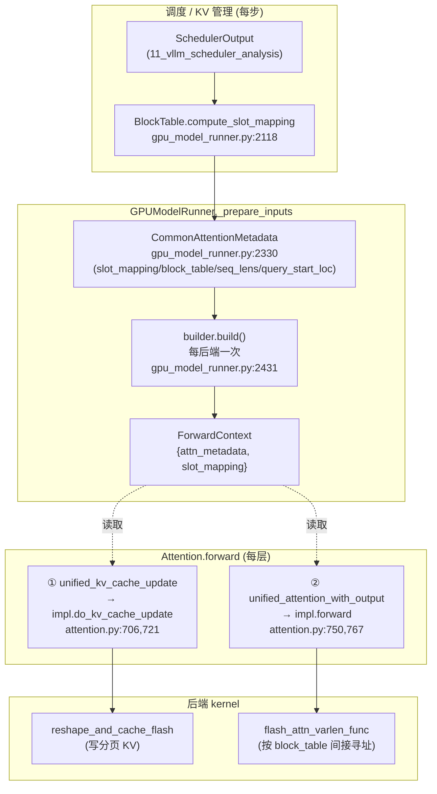

# vLLM 注意力抽象与后端 —— PagedAttention / FlashAttention / FlashInfer / MLA

> **代码基准**:vLLM `main` @ `485bbe1c6`(2026-06-21)· V1 引擎
> **最后更新**:2026-06-22 · **系列**:vLLM 推理引擎源码级分析(见 [[vllm/index]])
> **分析维度**:Overview → Quick Start → Deep Dive
>
> 本页回答:模型里的一个 `Attention` 层在 V1 引擎里到底做了什么(把 K/V 写进**分页** KV cache + 调所选后端做注意力),后端是怎么按平台/dtype/特性选出来的,以及连接「调度 + KV 管理」与「kernel」的 `AttentionMetadata` 桥是怎么搭起来的。内存侧(块如何分配/回收/前缀复用)归 [[12_vllm_kv_cache_management_analysis]];Q/K/V 投影、RoPE 等层内算子归 [[13_vllm_model_library_analysis]];本页只讲**注意力抽象层 → metadata → 后端 → kernel** 这条链路,以及 PagedAttention / FlashAttention / FlashInfer / Triton / MLA 五类后端的分工。

---

## 一、Overview(总览)

### 1.1 注意力在 vLLM 的定位

LLM 推理 99% 的"难"都集中在注意力上:KV cache 占满显存、序列变长、prefill 与 decode 计算特征迥异。vLLM 把注意力抽象成**四层**,每层只管一件事:

| 层 | 代表类型 | 职责 | 关键文件 |
|----|----------|------|----------|
| ① 注意力层(nn.Module) | `Attention` / `MLAAttention` | 在前向里做两件事:**写 KV cache** + **调后端**;对接 `torch.compile` | `model_executor/layers/attention/attention.py:192`、`mla_attention.py:322` |
| ② 后端抽象 + metadata | `AttentionBackend` / `AttentionMetadata` / `AttentionImpl` | 定义"一个后端长什么样";metadata 是每步从调度器输出构建的执行参数 | `v1/attention/backend.py:55,386,812` |
| ③ 具体后端 | FlashAttn / FlashInfer / Triton / FlashMLA … | 把 Q/K/V + metadata 翻译成具体 kernel 调用 | `v1/attention/backends/*.py` |
| ④ kernel/算子 | varlen flash / paged kernel / reshape_and_cache | 真正在 GPU 上跑的 CUDA/Triton 核 | `v1/attention/ops/*.py`、`csrc/` |

核心设计:**层不知道用的是哪个 kernel,kernel 不知道是谁在调度**。中间靠两个抽象解耦——`AttentionImpl`(行为)和 `AttentionMetadata`(数据)。

### 1.2 分层数据流



一句话:**调度器决定每个请求用哪些物理块 → runner 把它压成 `slot_mapping`/`block_table` 等张量(`CommonAttentionMetadata`)→ 每个后端 builder 把它编译成自己的 metadata → 放进 ForwardContext → 每层 forward 从 context 取出来,先写 KV、再做注意力。**

### 1.3 后端一览表

后端清单见枚举 `AttentionBackendEnum`(`v1/attention/backends/registry.py:34`)。常见的:

| 后端 (`get_name`) | 类路径 | 适用 | 特点 |
|---|---|---|---|
| `FLASH_ATTN` | `flash_attn.FlashAttentionBackend:68` | NV/默认 | FA2/FA3/FA4 varlen,统一处理 prefill+decode;FA3 全 CUDA Graph |
| `FLASHINFER` | `flashinfer.FlashInferBackend:325` | NV(Hopper+) | wrapper `plan/run`,FP8 KV、TRT-LLM kernel、cascade 强 |
| `TRITON_ATTN` | `triton_attn.TritonAttentionBackend:248` | 跨平台/无 FA | 纯 Triton `unified_attention`,可移植回退 |
| `FLEX_ATTENTION` | `flex_attention.py` | 实验/batch-invariant | PyTorch FlexAttention,自定义 mask |
| `TRITON_MLA` | `mla/triton_mla.TritonMLABackend:36` | MLA 通用 | MLA decode 走 Triton |
| `FLASHMLA` | `mla/flashmla.FlashMLABackend:47` | MLA(Hopper) | DeepSeek 官方 FlashMLA decode kernel |
| `FLASH_ATTN_MLA` / `CUTLASS_MLA` / `FLASHINFER_MLA` | `mla/*` | MLA(各架构) | MLA prefill/decode 的不同 kernel 选择 |
| `*_SPARSE` / `ROCM_*` / `CPU_ATTN` | `mla/*`、`rocm_*`、`cpu_attn` | DSA / AMD / CPU | 稀疏 MLA、ROCm、CPU 路径 |

> MLA 单独成一大类(`is_mla()==True`,`backend.py:237`)——因为它的 KV cache 形状、metadata、forward 接口都和标准 MHA 不同(详见 §三.6)。

---

## 二、Quick Start(快速上手)

### 2.1 模型层怎么用 `Attention`

模型定义里直接实例化 `Attention`(`model_executor/layers/attention/attention.py:192`),后续每步只调 `forward(query, key, value)`:

```python
# 典型用法(任意 decoder 模型的 attention 子层)
self.attn = Attention(num_heads, head_size, scale, num_kv_heads,
                      cache_config=cache_config, quant_config=quant_config,
                      prefix=f"{prefix}.attn")
...
attn_out = self.attn(q, k, v)   # 内部:写 KV cache + 调后端 kernel
```

模型作者**不需要**关心选了哪个后端、KV cache 在哪、metadata 怎么来——这些都在 `Attention.__init__`/`forward` 内部完成。`Attention` 同时继承 `AttentionLayerBase`(`attention_layer_base.py:12`),向 KV cache 管理暴露 `get_kv_cache_spec()`(`attention.py:581`,返回 `FullAttentionSpec` 等),让引擎知道这一层需要多大的块。

### 2.2 怎么选后端(`VLLM_ATTENTION_BACKEND`)

后端选择是**配置驱动 + 平台兜底**两段式:

1. 用户侧:环境变量 / 引擎参数最终落到 `AttentionConfig.backend`(`config/attention.py:19`)。字符串 `"auto"` 或 `None` 触发自动选择(`validate_backend_before`,`config/attention.py:97`);也可显式给 `FLASH_ATTN` / `FLASHINFER` / `TRITON_ATTN` …(对应 `AttentionBackendEnum` 成员名)。
2. 入口:层 `__init__` 调 `get_attn_backend(head_size, dtype, kv_cache_dtype, use_mla, has_sink, ...)`(`attention.py:319` → `selector.py:54`)。
3. 决策:`selector.py:107` 把 `attention_config.backend` 连同一组特性(dtype、kv_cache_dtype、MLA、sink、sparse、block_size、batch-invariant…)打包成 `AttentionSelectorConfig`,交给 `current_platform.get_attn_backend_cls(...)`(`selector.py:121`)由**平台**做最终裁决并惰性导入类(`_cached_get_attn_backend`,`selector.py:113`,带 `@cache`)。
4. 校验:每个后端类用 `validate_configuration(...)`(`backend.py:308`)逐项检查 head_size/dtype/kv_cache_dtype/sink/sparse/MLA/计算能力是否支持,不支持就给出 `invalid_reasons`,平台据此挑下一个候选。

### 2.3 关键入口(行号速查)

| 你想看 | 去哪 |
|---|---|
| 层前向(写 KV + 调后端) | `attention.py:452`(`Attention.forward`) |
| 后端选择 | `attention.py:318` → `selector.py:54` → `selector.py:121` |
| 后端枚举 / 类路径 | `registry.py:34`(`AttentionBackendEnum`) |
| metadata 公共结构 | `backend.py:393`(`CommonAttentionMetadata`) |
| 某后端把 metadata 编译出来 | `flash_attn.py:406`(`build`) |
| KV 写入 kernel | `attention.py:721` → `flash_attn.py:951`(`reshape_and_cache_flash`) |
| 注意力 kernel | `attention.py:767` → `flash_attn.py:870`(`flash_attn_varlen_func`) |
| MLA 层前向 | `mla.py:120` → `mla_attention.py:538` |

---

## 三、Deep Dive(源码级深挖)

### 3.1 Attention 层前向:写 KV + 调后端的两步走

`Attention.forward`(`attention.py:452`)是整条链路的"现场"。关键点:

**(a) reshape**:把 `[num_tokens, hidden]` 的 q/k/v 视图成 `[-1, num_heads, head_size]`(`attention.py:498-503`),注意这一步**故意放在 custom op 之外**,以减少 piece-wise CUDA Graph 之外的 CPU 开销(注释 `attention.py:496`)。

**(b) 两个 custom op**:V1 把"写 KV"和"做注意力"拆成两个独立的、互相用 dummy tensor 建立数据依赖的 op,确保 `torch.compile` 不会乱序:

```text
attention.py:507  if not forward_includes_kv_cache_update and 不共享KV:
attention.py:513      kv_cache_dummy_dep = unified_kv_cache_update(key, value, layer_name)   # ① 写 KV
attention.py:516  unified_attention_with_output(query, key, value, output, layer_name, dep)  # ② 注意力
```

- `unified_kv_cache_update`(`attention.py:706`)→ `attn_layer.impl.do_kv_cache_update(...)`(`attention.py:721`):把新 K/V 散写进分页 KV cache。
- `unified_attention_with_output`(`attention.py:750`)→ `self.impl.forward(...)`(`attention.py:767`):跑注意力 kernel,结果原地写进 `output`。

是否需要单独的 ① 取决于后端类属性 `forward_includes_kv_cache_update`(`backend.py:66`,默认 `True`)。**FlashAttn/FlashInfer/Triton 都设为 `False`**(`flash_attn.py:96`、`flashinfer.py:450`),即它们把 KV 写入从 forward 里**拆出来**单独做;而老式后端默认在 forward 内部顺手写。这样拆分让 RoPE+KV 写入融合、KV 共享层跳过写入等优化更干净。

**(c) 从 ForwardContext 取上下文**:两个 op 都不直接拿 metadata,而是通过 `get_attention_context(layer_name)`(`attention.py:663`)从**前向上下文**里按层名取:
- `attn_metadata`(`attention.py:686`,可能是 dict / list[dict],后者用于投机解码)
- `kv_cache`(`attention.py:697`,绑定在层上的物理 KV tensor)
- `slot_mapping`(`attention.py:698`,本层这一步每个 token 写到哪个物理 slot)

> 这正是"层不持有调度状态"的关键:metadata 与 slot_mapping 由 runner 每步塞进 `ForwardContext`,层只是消费者。

### 3.2 后端三件套:Backend / Impl / Builder

`AttentionBackend`(`backend.py:55`)是个**只含静态/类方法的工厂**,三个核心出口:
- `get_impl_cls()`(`backend.py:79`)→ 注意力实现类(`AttentionImpl`)。
- `get_builder_cls()`(`backend.py:84`)→ metadata 构建器(`AttentionMetadataBuilder`)。
- `get_kv_cache_shape(...)`(`backend.py:89`)→ 该后端要求的 KV cache 张量形状(不同后端布局不同!见 §3.4)。

外加一组 `supports_*` 能力位(`supports_dtype`/`supports_kv_cache_dtype`/`supports_sink`/`is_mla`…),由 `validate_configuration`(`backend.py:308`)统一驱动选择逻辑。

`AttentionImpl`(`backend.py:812`)定义标准注意力的 `forward(layer, q, k, v, kv_cache, attn_metadata, output, ...)`(`backend.py:839`)。层在 `__init__` 里 `impl_cls = self.attn_backend.get_impl_cls()` 然后实例化 `self.impl`(`attention.py:387-388`)。

`AttentionMetadataBuilder`(`backend.py:565`)的核心是 `build(common_prefix_len, common_attn_metadata, fast_build)`(`backend.py:632`),把通用 metadata 编译成后端私有 metadata。它还携带 CUDA Graph 支持级别 `AttentionCGSupport`(`backend.py:548`:ALWAYS/UNIFORM_BATCH/UNIFORM_SINGLE_TOKEN_DECODE/NEVER)和 `reorder_batch_threshold`——这两者深刻影响 [[23_vllm_compilation_cudagraph_analysis]] 和批次重排。

### 3.3 AttentionMetadata:连接调度/KV 管理与 kernel 的桥

这是全页最关键的数据结构。分两层:

**(a) `CommonAttentionMetadata`(`backend.py:393`)** —— 跨后端、跨层共享,由 runner 每步构建一次。字段(均来自调度器输出 + BlockTable):

| 字段 | 行号 | 含义 | 来源 |
|---|---|---|---|
| `query_start_loc` | `backend.py:402` | `(B+1,)` 每个请求在拼接 query 里的起点(cu_seqlens) | 调度的 token 计数前缀和 |
| `seq_lens` | `backend.py:406` | `(B,)` 每个请求已算 token 数(含历史) | 请求状态 |
| `num_reqs` / `num_actual_tokens` | `backend.py:409,412` | 请求数 / 本批总 token 数 | 调度 |
| `max_query_len` / `max_seq_len` | `backend.py:414,417` | 最长 query / 最长上下文 | 调度 |
| `block_table_tensor` | `backend.py:419` | `(B, max_blocks)` 每请求的逻辑块→物理块映射 | [[12_vllm_kv_cache_management_analysis]] 的 BlockTable |
| `slot_mapping` | `backend.py:420` | `(num_tokens,)` 每个新 token 写入的物理 slot | `BlockTable.compute_slot_mapping` |
| `causal` | `backend.py:422` | 是否因果(可按序列 per-seq) | — |

**(b) 构建链路**:runner 在 `_prepare_inputs` 里:
1. `BlockTable.compute_slot_mapping(...)`(`gpu_model_runner.py:2118`)算出本步 `slot_mapping`(把 token 在序列中的绝对位置换算成"block_id × block_size + 块内偏移")。
2. 组装 `CommonAttentionMetadata cm_base`(`gpu_model_runner.py:2330`),其中 `block_table_tensor`/`slot_mapping` 直接取自 BlockTable(`gpu_model_runner.py:2341-2342`)。
3. 对每个(KV cache 组 × 注意力组)调 `builder.build(common_prefix_len, cm)`(`gpu_model_runner.py:2431`),得到后端私有 metadata(如 `FlashAttentionMetadata`);若多组只差 block_table,走 `builder.update_block_table`(`gpu_model_runner.py:2425`)增量更新。
4. 结果存进按层名索引的 dict,塞进 `ForwardContext`,供 §3.1 的 `get_attention_context` 读取。

**关系小结**:
- 与 [[12_vllm_kv_cache_management_analysis]]:`block_table` 与 `slot_mapping` 都源自块管理器分配的物理块——metadata 是块管理结果的"张量快照"。
- 与 [[11_vllm_scheduler_analysis]]:`SchedulerOutput` 决定了本步哪些请求、各跑多少 token、各自上下文多长,直接喂出 `query_start_loc`/`seq_lens`/`num_*`。

后端私有 metadata 以 `FlashAttentionMetadata`(`flash_attn.py:237`)为例:它把通用字段(`query_start_loc:248`、`seq_lens:250`、`block_table:251`、`slot_mapping:252`)原样抽出,再加 cascade(`use_cascade:255`、`prefix_kv_lens:258`)、AOT 调度元数据(`scheduler_metadata:266`)、`max_num_splits:268` 等 FA 专属项。`build()`(`flash_attn.py:406`)只是把这些组合好。

`v1/attention/backends/utils.py` 提供一批共享 builder 工具:`split_decodes_and_prefills`(`utils.py:538`)、`reorder_batch_to_split_decodes_and_prefills`(`utils.py:637`,把 decode 排到批前部)、`get_kv_cache_layout`/`set_kv_cache_layout`(`utils.py:83,112`)、`infer_global_hyperparameters`(`utils.py:169`)。

### 3.4 PagedAttention 原理:按 block_table 间接寻址

**连续 KV 的问题**:朴素实现要求一个序列的 KV 在显存里物理连续,导致碎片化、无法前缀复用、长度增长要搬运。**PagedAttention 把 KV cache 切成固定大小的物理块**(类比 OS 分页),一个序列的逻辑连续 KV 可以散落在任意物理块上,由 `block_table` 记录"逻辑块 i → 物理块号"。

体现在两处:

**(a) 写入(reshape_and_cache)**:新 token 的 K/V 不是 append 到连续缓冲,而是按 `slot_mapping` **散写**到各自物理 slot。`slot = block_table[req][pos // block_size] * block_size + pos % block_size`。kernel 入口:
- 标准后端:`reshape_and_cache_flash`(`flash_attn.py:951`、`do_kv_cache_update` `flash_attn.py:927`);Triton 版 `triton_reshape_and_cache_flash`(`triton_attn.py:758`)。
- 经典 v0 风格算子封装:`PagedAttention.write_to_paged_cache` → `ops.reshape_and_cache`(`ops/paged_attn.py:31-42`)。
- CUDA 核:`csrc/libtorch_stable/cache_kernels.cu` 里的 `reshape_and_cache_kernel`(:250)、`reshape_and_cache_flash_kernel`(:310)。

**(b) 读取(间接寻址做注意力)**:kernel 读 K/V 时不是顺序扫连续内存,而是**先查 `block_table` 找到物理块,再在块内连续读**,对一串非连续物理块做注意力。现代后端(FlashAttn/Triton/FlashInfer)把这能力**内建进 varlen kernel**:`flash_attn_varlen_func(..., block_table=block_table, cu_seqlens_q=query_start_loc, seqused_k=seq_lens, ...)`(`flash_attn.py:870`)——`block_table` 就是分页间接表,`cu_seqlens_q`/`seqused_k` 处理变长。经典独立 paged kernel 见 `csrc/libtorch_stable/attention/paged_attention_v1.cu` / `paged_attention_v2.cu`,以及 Triton 版 `chunked_prefill_paged_decode.py:46` 的 `kernel_paged_attention_2d`(参数注释明确标了 `block_tables_ptr [num_seqs, max_num_blocks_per_seq]`,`:52`)。

**与连续 KV 的差异**:多一次 `block_table` 间接查表(访存换显存),但消灭了碎片、天然支持前缀共享(多个请求 block_table 指向同一物理块)和动态增长(只需追加块号)。KV cache 形状也据此设计:`FlashAttentionBackend.get_kv_cache_shape` 返回 `(num_blocks, 2, block_size, num_kv_heads, head_size)`(`flash_attn.py:149`)——**num_blocks 是最外维**,块之间无需连续。

### 3.5 统一/变长注意力:一个 kernel 吃下 prefill + decode

V1 的批是**混合**的:同一步里既有 prefill 请求(query 很长、变长)又有 decode 请求(query=1 token)。两种主流处理方式:

**(a) 统一 varlen kernel(默认)**:把所有请求的 query 沿 token 维拼成一根长张量,用 `query_start_loc`(cu_seqlens)切分,一次 kernel 调用同时算完所有请求,prefill 和 decode 只是 query_len 不同而已。
- FlashAttention:`flash_attn_varlen_func`(`flash_attn.py:870-895`)。其实参与 metadata 的对应关系一目了然:

  | kernel 实参 | metadata 字段 | 作用 |
  |---|---|---|
  | `q` | `query[:num_actual_tokens]` | 拼接后的变长 query |
  | `k`/`v` | `key_cache`/`value_cache`(`kv_cache.unbind(1)`,`:768`) | 分页 KV cache |
  | `cu_seqlens_q` | `query_start_loc` | 切分每请求 query 边界 |
  | `seqused_k` | `seq_lens` | 每请求实际 KV 长度 |
  | `block_table` | `block_table` | 分页间接寻址表 |
  | `max_seqlen_q/k` | `max_query_len`/`max_seq_len` | kernel tile 上界 |

- Triton:`TritonAttentionImpl.forward` 调 `unified_attention`(`triton_attn.py:642`,来自 `ops/triton_unified_attention.py`),实参映射同构。

**(b) prefill/decode 分离 kernel(可选/回退)**:配置 `use_prefill_decode_attention`(`config/attention.py:26`)或在 ROCm 等平台上,改走 `chunked_prefill_paged_decode`(`ops/chunked_prefill_paged_decode.py:266`):prefill 用 `context_attention_fwd`(`:300`),decode 用专门的 paged kernel `kernel_paged_attention_2d`(`:46`),再合并。当批被 `reorder_batch_to_split_decodes_and_prefills`(`utils.py:637`)重排成"decode 在前、prefill 在后"时,这种分离很自然。

**chunked prefill 的状态合并**:当 prefill 还要拼接历史上下文(分块计算)时,各块/各段的偏 softmax 结果靠 **log-sum-exp 重缩放**合并:`merge_attn_states`(`ops/merge_attn_states.py:9`,CUDA 核+Triton 兜底)。MLA 的 chunked-context prefill 也用它(见 §3.6)。

### 3.6 MLA(DeepSeek 多头潜在注意力):为何单独一类后端

MLA 把 KV 压成一个**低秩潜在向量** `kv_c`(`[Skv, Lkv]`,DeepSeek-V3 里 Lkv=512)外加一个共享的解耦位置编码 `k_pe`(`[Skv, R]`,R=64),而不是存完整的多头 K/V。因此它从形状到接口都和标准 MHA 不同,必须独立成类(`MLACommonBackend.is_mla()==True`,`mla_attention.py:1226`)。

**(a) KV cache 形状不同**:`MLACommonBackend.get_kv_cache_shape` 返回 `(num_blocks, block_size, head_size)`(`mla_attention.py:1208`)——**单一潜在 cache,没有 KV 二元、没有多头维**,显存占用相比 MHA 大幅下降。写入用专门的 `concat_and_cache_mla`(`backend.py:976`,把 `kv_c_normed` 和 `k_pe` 拼着写;CUDA 核 `cache_kernels.cu:398`)。

**(b) 层前向不同**:外层是 `MultiHeadLatentAttentionWrapper`(`mla.py:34`),`forward`(`mla.py:120`)负责 MLA 预处理——下投影 `kv_a_proj_with_mqa`/`fused_qkv_a_proj`、`q_b_proj` 上投影、对 q_pe/k_pe 做 RoPE(`mla.py:164`),然后调内层 `MLAAttention`(`mla.py:175` → `mla_attention.py:322`)。`MLAAttention.forward`(`mla_attention.py:538`)同样两步走:`do_kv_cache_update`(写潜在 cache,`:571`)+ `forward_impl`(`:580,609`)。

**(c) 吸收式投影 / 两套算法**:MLA 的精髓是把 KV 上投影矩阵 `W_UK`/`W_UV` **吸收**进 Q 投影与输出投影,decode 时不必把潜在向量展开成完整 K/V(模块顶部数学注释 `mla_attention.py:46-118` 写得极清楚):
- **prefill 走 "compute-friendly"(MHA 式)**:`forward_mha`(`mla_attention.py:2275`)。先用 `kv_b_proj` 把 `kv_c` 上投影回 `k_nope`/`v`(`:2302`),拼上 `k_pe` 做标准 MHA;若有历史上下文则分块算并用 `merge_attn_states` 合并(`:2344`)。QK headdim = P+R,V headdim = V。
- **decode 走 "data-movement-friendly"(MQA 式)**:`forward_mqa`(抽象,`mla_attention.py:2359`,各后端实现)。把 `q_nope` 先吸收 `W_UK`(`ql_nope = einsum("snh,lnh->snl", q_nope, W_UK)`,数学注释 `:99`),直接拿**潜在向量当 K 和 V**做 MQA(QK headdim = Lkv+R,V headdim = Lkv),最后用 `W_UV` 把结果投影回来(`:117`)。这样 decode 阶段每 token 只搬一份低秩潜在向量,带宽友好——这正是 MLA 在长上下文 decode 上省显存又快的原因。

**(d) MLA 子后端分工**(`registry.py` + `mla/` 目录):decode kernel 各异——
- `FLASHMLA`:`FlashMLAImpl.forward_mqa`(`mla/flashmla.py:255`)→ `flash_mla_with_kvcache`(`:321`),DeepSeek 官方 Hopper kernel。
- `TRITON_MLA`:`TritonMLAImpl.forward_mqa`(`mla/triton_mla.py:136`)→ `decode_attention_fwd`(`:198`),通用 Triton。
- 另有 `FLASH_ATTN_MLA` / `CUTLASS_MLA` / `FLASHINFER_MLA` 以及稀疏变体 `FLASHMLA_SPARSE` / `FLASHINFER_MLA_SPARSE`(DeepSeek 稀疏注意力 DSA)。prefill 后端则由 `mla_prefill_backend`(`config/attention.py:45`,FLASH_ATTN/FLASHINFER/TRTLLM_RAGGED)单独选。

MLA 的 metadata 也专门定制:`MLACommonMetadata`(`mla_attention.py:1275`)显式区分 `num_decodes`/`num_decode_tokens`/`num_prefills`(`:1300-1302`),并把 `prefill`(`MLACommonPrefillMetadata:1231`,含 chunked-context 工作区)和 `decode`(`MLACommonDecodeMetadata:1265`)分开携带,正因为 prefill/decode 走两套不同算法。模型侧原理详见 [[12_deepseek_v3_analysis]]。

### 3.7 三大标准后端对比(FlashAttention vs FlashInfer vs Triton)

| 维度 | FlashAttention (`flash_attn.py:68`) | FlashInfer (`flashinfer.py:325`) | Triton (`triton_attn.py:248`) |
|---|---|---|---|
| kernel 入口 | `flash_attn_varlen_func`(`:870`) | wrapper `plan()`(`:1169`)/`run()`(`:1565,1752`) | `unified_attention`(`:642`) |
| 执行模型 | 单次 varlen,混合 prefill+decode | 预先 `plan` 调度、`run` 执行;prefill/decode 各一个 wrapper + cascade wrapper | 单次统一 Triton kernel |
| KV 写入 | `forward` 外做(`forward_includes_kv_cache_update=False`,`:96`) | 同左(`:450`) | 同左 |
| CUDA Graph | FA3 全图(`AttentionCGSupport.ALWAYS`,`:313`) | 支持 | 受限 |
| FP8 KV | FA3 + Hopper(`supports_kv_cache_dtype:182`) | 强(可量化 Q) | 支持 per-token-head 量化(`:737`) |
| 强项 | 默认、稳、快、varlen 干净 | FP8、TRT-LLM kernel、cascade/共享前缀 | 可移植、无 FA 依赖时的回退、自定义量化 |
| 典型选择 | NV 通用默认 | 追求极致吞吐 / FP8 / 大前缀复用 | AMD/老卡/调试/特殊 head_size |

三者共享同一套 `CommonAttentionMetadata` 与同一套 PagedAttention 寻址语义,差异只在 kernel 实现与调度策略——这正是注意力抽象解耦的价值:换后端不动模型代码,只改 `VLLM_ATTENTION_BACKEND` 一个开关。

### 3.8 KV cache 物理布局(NHD vs HND)与跨后端一致性

同样是分页 KV cache,不同后端对**块内维度顺序**的偏好不同:`NHD`(num_kv_heads, head_size)还是 `HND`(head_size 在前)。逻辑形状由 `get_kv_cache_shape`(`backend.py:89`)给出,而**物理内存排布**由 `get_kv_cache_stride_order`(`backend.py:118`)返回一个置换来描述。FlashAttention 据 `get_kv_cache_layout()` 在 `NHD`/`HND` 间切换并给出对应 stride 置换(`flash_attn.py:151-170`)。

一致性由 selector 兜底:选定后端后,`_cached_get_attn_backend` 读 `backend.get_required_kv_cache_layout()`(`selector.py:133` → `backend.py:377`),若后端要求特定布局就全局 `set_kv_cache_layout(...)`(`selector.py:135-142`、`utils.py:112`)。`indexes_kv_by_block_stride()`(`backend.py:204`)进一步判断"num_blocks 是否物理最外维",决定能否跨层统一分配 / 页大小填充。这套布局协商保证了 [[12_vllm_kv_cache_management_analysis]] 分配的物理块能被选中的 kernel 正确解读。

### 3.9 第三方/自定义后端

`register_backend`(`registry.py:220`)允许覆盖现有后端或注册 `CUSTOM` 后端(装饰器或直接登记类路径),`AttentionBackendEnum.get_class()`(`registry.py:128`)运行时解析。OOT 平台/插件据此接入自有 kernel,无需改 vLLM 核心。

---

## Related Pages
- [[12_vllm_kv_cache_management_analysis]] · [[13_vllm_model_library_analysis]] · [[11_vllm_scheduler_analysis]] · [[01_vllm_feature_optimizations_overview]]
- [[vllm/index]] · [[../index]]

## Cross-Domain Links
- [[gpu_kernel_guide]] —— FlashAttention / Tensor Core kernel 链路
- [[12_deepseek_v3_analysis]] —— MLA(多头潜在注意力)模型侧原理
- [[31_megatron_inference_engine_analysis]] —— 块级 paged KV 对照
