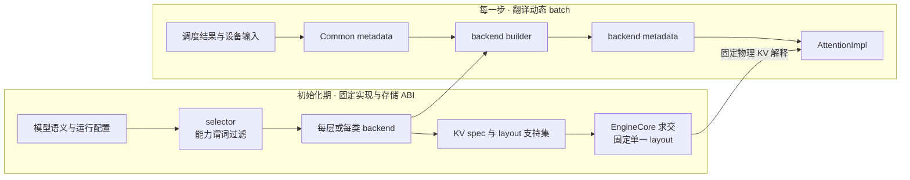

# vLLM Attention Backend：稳定合同先筛能力，动态 Metadata 再接 Kernel

> **读者问题**：模型含有不同 attention 语义、KV dtype、block size 和并行模式时，vLLM 怎样选出可用 backend、固定可共享的 KV 物理布局，再把每一步变化的请求边界翻译成该 backend 可执行的输入？
> **源码基线**：`vllm-project/vllm@6b110badbb22d3f66c7218b71138f13b7a6b3419`（冻结的 detached checkout，`v0.28.1rc0-80-g6b110badbb`，提交时间 2026-08-29T02:40:53Z）
> **中心命题**：attention specialization 被拆成两种时间尺度。初始化期用 backend 能力谓词、KV spec 与全模型 layout 求交固定实现和存储 ABI；执行期由 runner 生成 backend-neutral 的 `CommonAttentionMetadata`，再由 builder 翻译为 backend metadata。Scheduler 因而只需承诺 token 与逻辑 block，kernel 只需消费已经证明自洽的形状、地址和边界。
> **所有权边界**：本页拥有 `AttentionBackend`/builder/impl 合同、per-kind 与平台 backend 选择、KV layout 和 kernel block-size 协商、metadata 翻译、fallback/rejection 语义；全局 admission、preemption 与请求状态属于 `11`，物理 block 生命周期属于 `12`，CUDA Graph 全局派发属于 `23`，kernel/provider 内部实现与收益模型属于 `24`。
> **最近更新**：2026-08-31。补充一次 attention 从 runner metadata 构造到 backend `AttentionImpl.forward()` 的方法级执行链；源码基线不变。

## 1. 背景：动态 batch 不能成为 kernel 的隐式输入

同一个模型实例会同时遇到 decoder、encoder、cross attention，full/sliding/MLA/sparse 语义，普通或量化 KV，以及 PCP、DCP、KV connector、adaptive verification 等运行条件。vLLM 没有把这些条件压成一个 `backend_name` 开关；`AttentionSelectorConfig` 把它们保留为可验证输入，`AttentionBackend.validate_configuration()` 再逐项返回不兼容原因（`vllm/v1/attention/selector.py:21-38`；`vllm/v1/attention/backend.py:263-348`）。

这里先纠正一个常见心智模型：**Scheduler 不会逐 step 选择 FlashAttention 或 FlashInfer。** 普通 `Attention` layer 在模型初始化时调用 selector 并保存 backend class；每一步变化的是 request order、query/context length、block table 与 slot mapping，它们随后进入 metadata builder（`vllm/model_executor/layers/attention/attention.py:336-352`；`vllm/v1/worker/gpu/attn_utils.py:275-337`）。因此 backend selection 更接近模型实例 ABI，metadata 才是动态调度与专用实现之间的接缝。

**为什么不让每个 kernel 直接读取 Scheduler 状态（分析推断）。** 这种直观方案会让 kernel 依赖 request 生命周期、CPU 容器与平台外的同步规则，也无法在同一个逻辑 KV group 中安全复用 metadata。当前路线把动态事实先归一成 common metadata，再由 builder 生成专用对象；代价是初始化时必须协商更多能力，执行时也支付一次明确的 metadata 构建或更新成本。

## 2. 先看稳定合同，再看 backend 名单

### 2.1 五个合同对象分别拥有一层事实

| 合同对象 | 输入 → 输出 | 拥有的稳定事实 | 不拥有 | 证据 |
|---|---|---|---|---|
| `AttentionBackend` class | 模型/平台条件 → impl、builder、能力声明 | dtype、head size、kernel block size、feature predicates、KV layout 支持集 | 当步 request 边界与 kernel 调用细节 | `vllm/v1/attention/backend.py:59-147`；`vllm/v1/attention/backend.py:165-260` |
| `KVCacheSpec` + `KVCacheLayout` | attention 语义与 backend packing → page 语义和物理 stride order | 每层 cache 内容、block 粒度、全模型可用物理 layout | block 的 owner/refcount 与 admission | `vllm/model_executor/layers/attention/attention.py:597-655`；`vllm/v1/kv_cache_layout.py:15-58` |
| `CommonAttentionMetadata` | 当步 batch 与逻辑 KV 映射 → backend-neutral snapshot | query/sequence 边界、request/token 数、block table、slot mapping 及可选 DCP/MM 状态 | backend wrapper、workspace 与 kernel-specific schedule | `vllm/v1/attention/backend.py:368-444` |
| `AttentionMetadataBuilder` | common metadata + `KVCacheSpec` → backend metadata | 翻译、可选 block-table 原地更新、draft metadata 更新、reorder 与 capture 能力 | attention 数值计算 | `vllm/v1/attention/backend.py:584-732` |
| `AttentionImpl` | Q/K/V + physical KV + backend metadata → output | backend forward ABI 以及可选融合能力 | backend 选择与全局调度策略 | `vllm/v1/attention/backend.py:869-938` |

这组边界胜过“统一一个万能 `forward()`”的关键不是少写参数，而是**让变化的来源可判责**：模型/硬件不兼容在 selection 阶段失败，存储布局不兼容在 allocation 前失败，当步长度/顺序错误则落在 metadata snapshot，kernel 内部不再猜测上游状态。

### 2.2 合同跨两个时间尺度

图中初始化路径只发生在模型/KV cache 建立阶段；逐 step 路径不会重新选择 backend 或 layout。`get_attn_backend()` 也明确说明单次 layer selection 看不到其他 layer，layout 必须等所有 backend 都已知后统一解析（`vllm/v1/attention/selector.py:173-191`）。

## 3. 能力谓词：先证明可用，再谈优先级

### 3.1 原子谓词与组合谓词

稳定选择合同先检查 head size、activation dtype、KV dtype、block size；再检查 mm prefix、MLA/dense、sparse/dense、sink、per-head scale、compute capability、attention type、sliding window、non-causal、batch invariance、KV connector、PCP、adaptive verification 与 DCP 组合（`vllm/v1/attention/backend.py:285-334`）。某些限制无法拆成独立布尔值，例如“sink + 某 compute capability”或“特定 head size + FP8 + block size”；backend 用 `supports_combination()` 返回一条可诊断原因，而不是让 platform 重写这些交叉规则（`vllm/v1/attention/backend.py:248-260`；`vllm/v1/attention/backend.py:335-348`）。

block size 也不是简单相等：声明为 `MultipleOf(n)` 时，framework block 只要是 kernel 粒度的整数倍就可通过；这让较大的 KV-manager block 可以在执行侧虚拟拆分（`vllm/v1/attention/backend.py:117-133`）。若一个 KV group 内出现多个 backend，runner 再求所有 backend 都支持、且能整除 manager block 的共同 kernel block size；求不到就直接报错（`vllm/v1/worker/utils.py:310-376`；`vllm/v1/worker/utils.py:442-483`）。

### 3.2 `backend_per_kind` 是每种 KV 语义的 override，不是每请求路由

selector 先由 MLA、sliding window 和 attention type 推导 `KVCacheSpecKind`，然后让 `backend_per_kind[kind]` 覆盖全局 `backend`；未配置的 kind 回落到全局 backend 或 auto（`vllm/v1/attention/selector.py:62-99`；`vllm/v1/attention/selector.py:173-186`）。配置层拒绝未知 kind，并把 backend 字符串解析为注册枚举（`vllm/config/attention.py:176-200`）。测试覆盖 full、MLA、sliding-window MLA、sliding-window 与 cross/encoder-only 的 kind 映射，也验证未知 kind 在配置阶段失败（`tests/v1/attention/test_backend_per_kind.py:14-63`）。

这样做允许 interleaved model 的不同 KV group 选择不同 backend，却仍保持每个 layer 在进程生命周期内稳定。逐请求切换会要求同一 layer 的 impl、builder、workspace、capture buffer 和 KV layout 同时热切换，当前合同并不提供这种事务。

## 4. selector：auto 会降级，显式选择通常会拒绝

本页的 **fallback** 只指初始化期的候选 backend 替换或显式配置拒绝；运行期因 batch/capture 条件从 full CUDA Graph 降到 piecewise/eager 属于 [[23_vllm_compilation_cudagraph_analysis|CUDA Graph 与执行模式]]，已选 attention op 内部在 provider/kernel 间降级属于 [[24_vllm_fused_ops_and_kernels_analysis|kernel/provider fallback]]。三者的发生时间、决策输入和 owner 不同，不能互相代指。

### 4.1 CUDA 的选择算法是“优先级列表 ∩ 能力集合”

CUDA 先按 dense/MLA、device capability、head count、KV dtype 与 non-causal 条件生成有序候选；例如普通 attention 在 SM100 causal 路径优先 FlashInfer，其余路径优先 FlashAttention，后面才是 Triton、Flex 与 TurboQuant（`vllm/platforms/cuda.py:82-163`）。随后它懒加载每个候选并运行同一 `validate_configuration()`；`ImportError`/`OSError` 与能力不匹配都进入 rejected-reasons，auto 最终取仍有效的最高优先级候选（`vllm/platforms/cuda.py:363-401`；`vllm/platforms/cuda.py:461-502`）。

这不是“失败后悄悄使用任意实现”，而是有边界的 fallback：

- **auto**：跳过不可导入或谓词失败的候选，选择剩余候选中的最高优先级；一个都没有时，错误包含完整 selector config 和逐 backend 原因（`vllm/platforms/cuda.py:435-459`）。
- **显式 backend**：只验证用户指定项；不可导入或任一谓词失败都启动失败，不自动换另一个实现（`vllm/platforms/cuda.py:413-433`）。选择器测试也把旧的“显式 backend 失败后 fallback”场景标成 skip，并注明当前不支持这种行为（`tests/kernels/attention/test_attention_selector.py:266-283`）。
- **用户只固定 block size**：auto 仍可换到较低优先级 backend，但若唯一排除原因是该 block size，会发出潜在性能下降警告（`vllm/platforms/cuda.py:471-490`）。

平台拥有选择政策，所以边界并非完全同构。ROCm 对显式不兼容通常同样 fail loud，但 TurboQuant 分层 KV dtype 是一个有注释的例外：boundary layer 继续用显式 backend，TurboQuant layer 可改走 per-layer auto；其他 dtype 不享受该 fallback（`vllm/platforms/rocm.py:627-665`）。因此“显式选择永远 fallback”与“显式选择绝不 fallback”都不是跨平台合同；跨平台稳定的是 backend 提供同一组可验证谓词，platform 决定候选和失败政策。

### 4.2 直接注入 backend 是高级旁路

`Attention(..., attn_backend=...)` 会绕过 selector，直接保存传入 class；之后仍有 ALiBi、chunk lookback、Flex block 等 layer-local guards，但不会自动重跑完整平台候选过滤（`vllm/model_executor/layers/attention/attention.py:339-384`；`vllm/model_executor/layers/attention/attention.py:386-407`）。所以（分析推断）自定义模型直接注入 backend 时，调用者必须自己保证 dtype、设备、layout 与 feature 组合满足合同；这不是 auto selector 的等价入口。

## 5. KV layout：先求全集交集，再做任何物理分配

### 5.1 spec 描述“存什么”，layout 描述“字节怎样排”

普通 layer 把 decoder full/sliding 语义转成 `FullAttentionSpec` 或 `SlidingWindowSpec`，encoder-only 则不产生 autoregressive KV spec；backend 可用 `customize_spec()` 调整 packing（`vllm/model_executor/layers/attention/attention.py:597-655`；`vllm/v1/worker/gpu/attn_utils.py:52-65`）。物理 layout 的逻辑轴固定为 `L, B, H, N, C`，枚举值只改变 stride permutation；`is_block_compact`、`is_layer_compact` 与 `is_block_outermost` 给 allocator 判断某种混合 page packing 能否表达（`vllm/v1/kv_cache_layout.py:11-28`；`vllm/v1/kv_cache_layout.py:39-58`）。

每个 backend 用 `supported_kv_cache_layouts()` 返回偏好顺序，`None` 表示任意 layout。worker 对当前所有 backend 的声明取交集；相同声明保留顺序，不同声明用首选票数排序，空交集硬失败（`vllm/v1/attention/backend.py:350-354`；`vllm/v1/attention/backends/utils.py:190-225`）。这一步说明 layout 不是 selector 的单层副作用：模型可以同时含多个 backend，只有全集已知后才能找到共享物理解释。

> [!contradiction] 旧文档表述与 live code 冲突
> 旧版页面曾声称 selector 选择 backend 后会设置全局 KV layout。当前 selector 明确说明单次选择看不到其他 layer，layout 必须在所有 backend 已知后统一解析（`vllm/v1/attention/selector.py:185-186`）；live implementation 则由 EngineCore 调用 `resolve_kv_cache_layout()`，对全体 worker/backend 支持集求交并一次性提交（`vllm/v1/attention/backends/utils.py:240-308`）。本页以 live code 为准：selector 只选 backend，EngineCore 才提交全模型 layout。

### 5.2 EngineCore 是 layout 的唯一提交点

EngineCore 收集各 worker 的候选列表并要求所有 rank 一致；混合 HNC shape 会进一步把候选收窄到 block-compact layout。显式 `VLLM_KV_CACHE_LAYOUT` 不在候选中会硬失败；connector 偏好若不兼容则只告警并回落首选候选（`vllm/v1/attention/backends/utils.py:240-304`）。解析发生在 memory profiling 前，因为 full CUDA Graph capture 可能已经需要最小 KV cache；结果随后通过 RPC 发给 worker，并复制进最终 `KVCacheConfig`（`vllm/v1/engine/core.py:285-323`）。

提交后的 layout 不允许在进程内改成另一值；worker 重复接收同值可以，冲突值会报错（`vllm/v1/attention/backends/utils.py:228-237`）。这给出一个硬不变量：**backend、layout、KV views 与 metadata 对 block table 的解释必须来自同一次初始化协商。** 已分配后热换成要求另一 layout 的 backend 不是性能降级，而是 ABI 破坏。

## 6. Metadata：把动态调度事实变成 backend 的形状证明

### 6.1 common snapshot 为什么是 seam

`CommonAttentionMetadata` 同时携带 request 的 query 起点、sequence length、实际 request/token 数、最大 query/context、每组 block table 和 slot mapping；DCP local lengths、positions、prefill 标记、MM document ranges 等只在相关模式出现（`vllm/v1/attention/backend.py:377-439`）。runner 为每个 KV cache group 组装这份 snapshot，再让该 group 的每个 builder 生成 backend metadata，并把同一结果挂到共享该 backend/spec 的 layer（`vllm/v1/worker/gpu/attn_utils.py:275-337`）。

这种 seam 的价值（分析推断）是把“调度结果的语义”与“kernel 参数的结构”分开：上游只保证 request ordering、长度、block 与 slot 同步；builder 可以据此建立 wrapper、workspace 或 capture-safe persistent buffer，而无需反查 Scheduler 对象。反过来，任何只更新 block table、却遗留上一轮 query boundaries 的复用都会把两个 batch snapshot 混在一起。

metadata 不是“字段存在就可信”。async speculative decode 下，`seq_lens_cpu_upper_bound` 对 decode row 可能只是假设所有 draft 被接受的乐观上界，源码明确禁止需要精确 per-row decode context 的 kernel 使用它；device `query_start_loc` 才保存 adaptive verification 决定的 per-request split（`vllm/v1/attention/backend.py:422-426`；`vllm/v1/attention/backend.py:509-524`）。CPU mirror 属性还会引入隐式 host-device 同步，注释要求迁向 device tensor（`vllm/v1/attention/backend.py:463-491`）。

### 6.2 builder 暴露的是“可安全复用到什么程度”

builder 的 `supports_update_block_table` 允许相同 spec/builder 在 hybrid group 间复用 metadata，只替换 block table 与 slot mapping；不声明该能力就必须完整 rebuild（`vllm/v1/attention/backend.py:592-599`；`vllm/v1/worker/gpu_model_runner.py:2493-2568`）。`supports_draft_decode_metadata_update` 则说明 fused draft loop 能否在 persistent tensor 上 capture-safe 地原地推进；Python 方法本身不会在 CUDA Graph replay 时重新运行（`vllm/v1/attention/backend.py:724-732`）。

CUDA Graph 能力也不是布尔值：合同区分 mixed batch、uniform query length、纯单-token decode 与完全不支持四级（`vllm/v1/attention/backend.py:567-581`）。runner 只把所有 attention group 的最弱能力及其 backend 名称向上汇总（`vllm/v1/worker/gpu/attn_utils.py:156-180`）；如何据此选择 full、piecewise 或 eager 属于 `23`，本页只拥有这个 capability boundary。

batch reorder 同样由 builder 提供阈值，而 runner 对所有 group 取最小值；后端必须能接受更小阈值，代价只是把更多 decode 当 prefill（`vllm/v1/attention/backend.py:623-653`；`vllm/v1/worker/gpu_model_runner.py:7294-7312`）。reorder 的全局 companion-state 对齐由 runner 拥有，本页只规定 metadata 不能独自改变 request ordering。

### 6.3 一次 attention 调用怎样抵达 backend impl

静态选择只回答“这一层由谁实现”，metadata 只回答“这一批怎样执行”；二者在 `ForwardContext` 中按 layer name 会合。以 Model Runner V2 的 eager/piecewise 路径为例，完整调用链是：

1. runner 先把 `SchedulerOutput` 整理成 token-major `InputBatch`，再从稳定 request rows gather block tables、计算 slot mappings；随后 `model_state.prepare_attn()` 为当步 batch 构造 metadata（`vllm/v1/worker/gpu/model_runner.py:1570-1651`）。此时静态 backend 没变，变化的是 request boundaries、长度和物理 KV 地址。
2. `build_attn_metadata()` 按 KV cache group 建立 `CommonAttentionMetadata`，再调用每个 `AttentionMetadataBuilder.build()`，并把结果按 layer name 写回字典（`vllm/v1/worker/gpu/attn_utils.py:247-337`）。group 级共享避免同合同的 layer 重建相同事实，layer-name 映射则防止不同 spec/backend 取错参数。
3. runner 用 `set_forward_context()` 把 metadata 与逐层 slot mapping 绑定到**这一轮** model forward，然后才调用 eager model 或 piecewise graph（`vllm/v1/worker/gpu/model_runner.py:1719-1759`）。`ForwardContext` 明确把这两项标为 per-forward 动态状态（`vllm/forward_context.py:131-148`）；因此 layer 不需要把 batch 对象写进长期模块状态，也不会在并发/重放时反查 scheduler。
4. 模型层调用 `Attention.forward()` 后，layer 在 custom-op 边界外完成 Q/K/V reshape 与 output allocation；若 backend 不自行更新 KV，它先发出 `unified_kv_cache_update()`，再调用 `unified_attention_with_output()`（`vllm/model_executor/layers/attention/attention.py:478-570`）。这样把 reshape 固定在统一边界，以减少非 CUDA Graph 区域的 CPU 开销，同时让“写 KV”和“读 KV 做 attention”保持可组合。
5. 两个动作被拆开时，`kv_cache_dummy_dep` 不承载数值，却建立数据依赖，防止 `torch.compile` 把 attention 重排到 KV update 之前（`vllm/model_executor/layers/attention/attention.py:530-569`；`vllm/model_executor/layers/attention/attention.py:743-757`）。这解释了为什么不能只说“先调用两个 op”：编译后仍需保存同一因果顺序。
6. `unified_attention_with_output()` 用 layer name 从当前 context 解析 `attn_metadata`、`Attention` 实例与该层 KV cache，最后调用初始化时由 backend class 构造好的 `self.impl.forward(...)` 并写入预分配 output（`vllm/model_executor/layers/attention/attention.py:336-422`；`vllm/model_executor/layers/attention/attention.py:759-772`）。至此静态能力合同与动态 batch snapshot 才真正合流。

这条链的核心不变量是：**backend impl、KV cache view、block table/slot mapping 与 query boundaries 必须属于同一个 layer 和同一个 forward snapshot。** selector 选对但 context 过期，仍会产生跨请求错读；metadata 正确但 KV update 被重排，仍会读到旧内容。两者都不是 kernel 数值误差。

## 7. 代表性 backend：名称只是能力集合的实例

合同建立后，backend 名单才有解释力：

| 代表 backend | 它在合同上声明了什么 | 由选择器看见的边界 |
|---|---|---|
| FlashAttention | kernel block 是 16 的倍数或特定 FA4 page；支持 sliding、batch invariance、non-causal 与多 attention type；per-head quant scale 还取决于 FA version | head size、compute capability、sink、FP8 与 mm-prefix 组合都可能拒绝 | `vllm/v1/attention/backends/flash_attn.py:111-199`；`vllm/v1/attention/backends/flash_attn.py:202-244` |
| FlashInfer dense | head size 集合固定；compute capability 有上下界；SM10 声明 head-major block-interior layout 偏好 | 即使 import 成功，head size、设备代际或 layout 全局交集仍可排除它 | `vllm/v1/attention/backends/flashinfer.py:500-543` |
| FlexAttention | 额外接受 FP32、decoder 与 encoder-only、non-causal/MM prefix，但 KV layout 只能是 `LBNHC` | CUDA selector 测试中 FP32 会落到它；layout 交集仍可排除它 | `vllm/v1/attention/backends/flex_attention.py:90-134`；`tests/kernels/attention/test_attention_selector.py:233-250` |
| FlashMLA / FlashInfer MLA | 前者固定 kernel block 64、支持 SM9/SM10；后者支持 32/64、只支持 SM10，并验证模型的 `qk_nope_head_dim` | “use MLA”只进入 MLA 候选集，最终仍由 block、设备和模型维度谓词决定 | `vllm/v1/attention/backends/mla/flashmla.py:50-97`；`vllm/v1/attention/backends/mla/flashinfer_mla.py:150-207` |

这个表刻意不比较 kernel 内部算法或声称哪个 backend 普遍最快。源码只给出平台特定优先级与某些注释化 benchmark 条件；具体 kernel 路径、provider 和收益边界由 `24` 维护。

## 8. 失败边界与排查顺序

| 现象 | 合同语义 | 先检查 |
|---|---|---|
| 显式 backend 启动失败 | 用户要求的是硬约束；CUDA 不替换不兼容实现 | error 中的逐项 invalid reason；`vllm/platforms/cuda.py:413-430` |
| auto 换了 backend | 更高优先级候选 import 失败或谓词不满足；这是受控性能 fallback | debug reasons 与 priority；`vllm/platforms/cuda.py:363-401` |
| auto 没有候选 | 没有实现满足完整配置，不存在正确的 silent fallback | selector config 与所有 rejected reasons；`vllm/platforms/cuda.py:442-459` |
| KV layout 初始化失败 | 所有 backend/layout 支持集无交集，或 mixed HNC 需要 block-compact 但候选不满足 | backend layout declarations 与 spec shapes；`vllm/v1/attention/backends/utils.py:201-225`；`vllm/v1/attention/backends/utils.py:271-285` |
| connector 想要另一 layout | connector 偏好是软约束；不兼容时保留全模型共同 layout 并告警 | `vllm/v1/attention/backends/utils.py:294-304` |
| 特性在选定 backend 后又被关闭/拒绝 | 组合 guard 尚未全部进入通用 selector，例如 batch-invariant prefix cache 会关闭，ALiBi sqrt 与 chunk lookback 会硬拒绝 | `vllm/model_executor/layers/attention/attention.py:353-384` |
| 同一 backend 偶发读错 request/KV | 首先怀疑 metadata snapshot 或 reorder companion state，不要先归因 kernel 数值 | query boundaries、block table、slot mapping 是否来自同一步；`vllm/v1/attention/backend.py:377-426` |

建议用下面的源码顺序定位，而不是先钻进 kernel：

1. `vllm/v1/attention/backend.py:59-354`：静态能力、拒绝原因与 layout 声明；
2. `vllm/v1/attention/selector.py:102-212`：layer 条件、per-kind override 与平台入口；
3. 对应 `vllm/platforms/<platform>.py`：候选优先级、auto/explicit policy；
4. `vllm/v1/attention/backends/utils.py:190-308`：全模型 layout 求交与提交；
5. `vllm/v1/attention/backend.py:368-732`：common metadata 与 builder 复用能力；
6. `vllm/v1/worker/gpu/attn_utils.py:77-180` 与 `vllm/v1/worker/gpu/attn_utils.py:275-337`：group、builder 和当步 metadata 的接合点；
7. 最后才读目标 backend 的 metadata/impl；kernel 内部继续到 `24`。

## 9. 演进锚点

> [!note] 分析推断
> 当前 `customize_spec()` 被源码标为临时兼容 API：现在由 layer 先建 spec、backend 再 post-hoc 调整；注释给出的目标是让 backend 直接构造并返回 spec（`vllm/v1/attention/backend.py:135-146`）。这会把 KV packing 的所有权进一步收回 backend contract，但在该提交上还不能按未来接口写文档或扩展代码。

## Related Pages

- [[02_engineering/03_infer_frameworks/vllm/11_vllm_scheduler_analysis|vLLM Scheduler]] —— 拥有本页刻意排除的 request/token admission、preemption 与一步资源提交事务。
- [[02_engineering/03_infer_frameworks/vllm/12_vllm_kv_cache_management_analysis|vLLM KV Cache 管理]] —— 展开 backend layout/spec 最终落到的物理 block、hybrid packing 与所有权不变量。
- [[02_engineering/03_infer_frameworks/vllm/15_vllm_model_runner_v1_analysis|Model Runner V1]] / [[02_engineering/03_infer_frameworks/vllm/16_vllm_model_runner_v2_analysis|Model Runner V2]] —— 对照 backend reorder 如何触发 MRV1 全状态 swap，或在 MRV2 中只改变 per-step mapping。
- [[02_engineering/03_infer_frameworks/vllm/21_vllm_quantization_analysis|vLLM 量化派发]] —— 展开 KV dtype、scale、load transform 与量化 kernel 的联合兼容合同。
- [[02_engineering/03_infer_frameworks/vllm/23_vllm_compilation_cudagraph_analysis|vLLM 编译与 CUDA Graph]] —— 解释 runner 如何消费 backend 的最弱 capture capability 并选择执行模式。
- [[02_engineering/03_infer_frameworks/vllm/24_vllm_fused_ops_and_kernels_analysis|vLLM 融合算子与专用 Kernel]] —— 拥有本页排除的 kernel/provider 内部路径、fallback 与性能收益模型。
