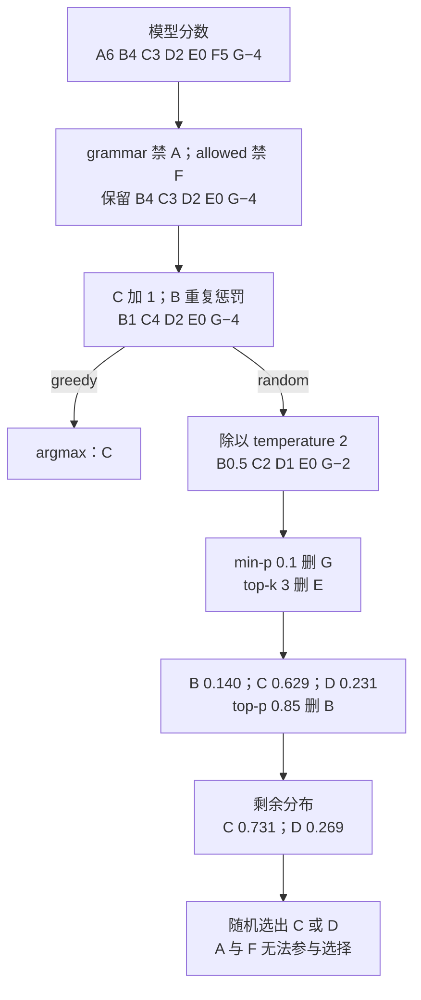
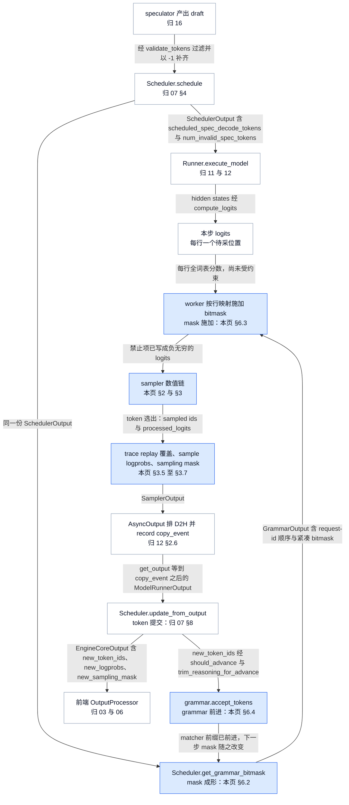
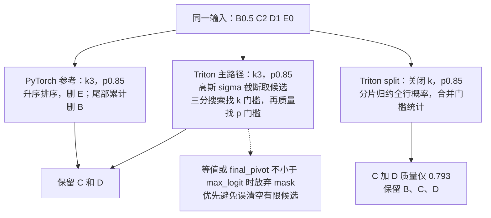
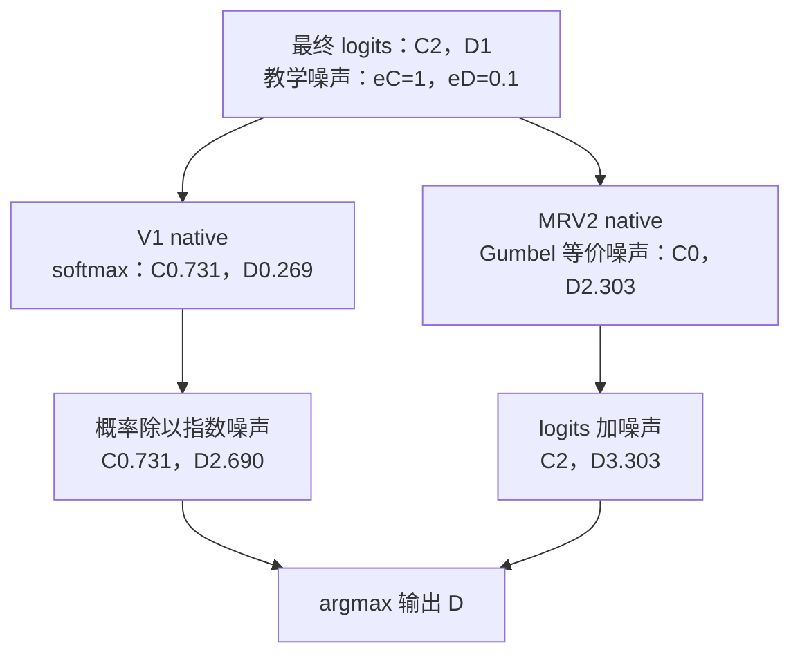
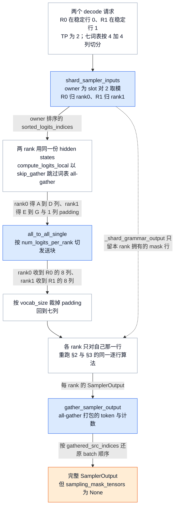
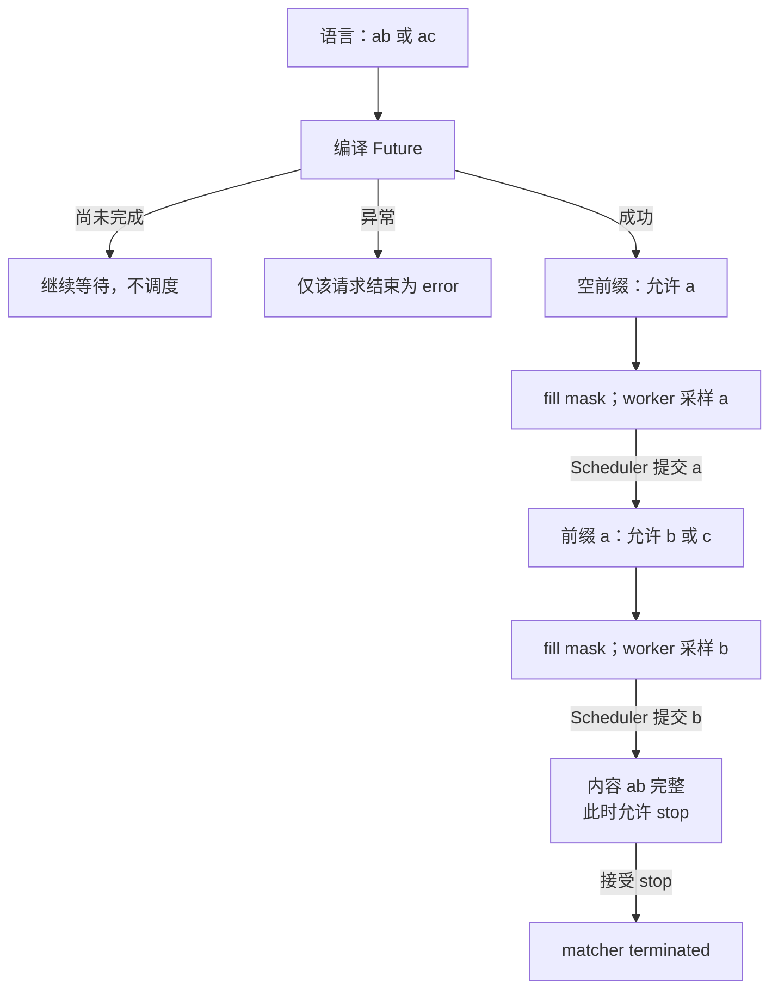

# vLLM 采样与结构化输出：一行 logits 怎样变成合法 token

> **源码基线**：`vllm-project/vllm@199cb9b964822e59ab9b58d88e7be31eb419a2ae`（`main`，2026-09-07）
> **主题**：从一行词表分数演算 hard mask、bias、penalties、temperature、min-p、top-k/top-p 与 token selection，再解释结构化 grammar 如何随已生成前缀产生下一步约束。对照 Model Runner V1/V2 的采样实现与后端选择。
> **适用范围**：普通自回归 token selection、采样参数的算法含义、sample logprobs 的观察口径、trace replay 与 sampling-distribution replay、batch-sharded sampling、grammar 编译与推进；API 字段映射归请求语义页，speculative acceptance 归投机解码页，输出发布归两篇 Runner 页。
> **最近更新**：2026-09-12。补位置闭环图与核心流程清单，接管 sample logprobs 计算、trace replay、sampling-distribution replay 与 batch-sharded sampling 四条采样侧数据面，补 draft 的 grammar 预演与 `-1` 语义、变体枚举依据、调用树与完成边界，并按源码纠正 Triton 过滤的三分搜索描述。

## 1. 为什么“选分数最高的词”还不够

假设模型正在补全一个 JSON 字段，分数最高的 token 却不能接在当前前缀后；次高 token 又是用户禁止输出的内容。模型 logits 只表达模型的偏好，不自动满足请求的语法、重复控制或随机性要求。vLLM 的普通路径因此先改写分数和候选集合，再选择 token；结构化输出则根据**当前已提交前缀**持续更新合法集合。本页负责的就是这一层：**一行 logits 怎样在本步被改写成一个合法候选集合，从中选出一个 token，并把这次选择的结果与 grammar 进度交给下游**。

**它不是什么，同样重要。** 其一，它不是请求参数的 API 层：`temperature`、`logprobs`、`response_format` 怎样从 HTTP 字段映射成 `SamplingParams`/`StructuredOutputsParams`，stop string 协议与 detokenization，归 [[03_vllm_request_semantics_analysis|请求语义页]]。其二，它不是输出发布者：`SamplerOutput` 怎样经 `AsyncOutput` 的 copy stream 变成 `ModelRunnerOutput`、GPU 与 Engine 何时各自可见，归 [[12_vllm_model_runner_v2_analysis|Runner V2]] §2.6 与 [[11_vllm_model_runner_v1_analysis|Runner V1]]；结果怎样切成每请求增量并交还前端，归 [[07_vllm_scheduler_analysis|Scheduler]] §8.4–8.5。其三，它不是 draft 的接受算法：有 draft 时普通 sampler 被整体绕过，接受哪些 draft、残差分布怎样保证无偏，归 [[16_vllm_speculative_decoding_analysis|投机解码页]]；本页只负责交接边界（§4.5）。其四，prompt logprobs 不是 sampler 的产物：`PromptLogprobsWorker` 在采样之后由 runner 调用，实现归 11/12，交付与装配归 07 §8.5，本页只在 §4.4 命名这条轴与交接对象。

本页把两个过程接起来：一行 logits 的数值变换回答“这一刻选谁”，请求级 grammar 回路回答“下一刻哪些 token 还合法”。只要最后仍有合法的有限分数候选，禁止项的负无穷就让其概率为零。这个保证有前提：后续处理不能任意重写禁止项，约束交集也不能为空；`min_tokens` 的恢复分支、thinking budget 的强制覆盖与 trace replay 的强制覆盖将在 §3.6 与 §5 分开讨论。

一种直观替代是先采样、再验证、非法就重试。源码没有给出正式方案比较；**分析推断**是，预先 mask 让普通 step 不必反复进行采样和 CPU 验证，也无需为每次非法选择再跨设备边界。代价是 CPU 先生成合法集合，worker 必须把它精确对齐到本步 logits。

### 1.1 从七个候选开始，完整走一次

下面是**教学值**，不是模型实测。词表有七个 token，按 `A,B,C,D,E,F,G` 排列；单请求单步 logits 形状为 $1\times7$。grammar 此刻只禁止 A；`allowed_token_ids` 只保留 B、C、D、E、G，因此 F 被白名单禁止。输出历史只有 B 出现过两次，prompt 不含其余候选。

设置 C 的 `logit_bias=+1`，`repetition_penalty=2`、`frequency_penalty=0.25`、`presence_penalty=0.5`，`temperature=2`、`min_p=0.1`、`top_k=3`、`top_p=0.85`。本步不触发 min-token、bad-word 或 thinking-budget 分支。本页后续每一条变体与数据面都复用这一组输入。

| 步骤 | A、B、C、D、E、F、G 的分数或候选 | 本步改变了什么 |
|---|---|---|
| 模型输出 | `6, 4, 3, 2, 0, 5, -4` | 模型原本偏爱 A，其次 F |
| grammar，再 allowed mask | `−∞, 4, 3, 2, 0, −∞, -4` | A、F 概率必须为零 |
| C 的 bias | `−∞, 4, 4, 2, 0, −∞, -4` | 有限分数加 1 |
| repetition，再 frequency/presence | `−∞, 1, 4, 2, 0, −∞, -4` | B 变成 $4/2-0.25\times2-0.5=1$ |
| temperature | `−∞, 0.5, 2, 1, 0, −∞, -2` | 每个有限分数除以 2 |
| min-p | B=0.5、C=2、D=1、E=0 | G 低于相对最高概率的门槛 |
| top-k | B=0.5、C=2、D=1 | 只保留三个最高分，E 被去掉 |
| top-p | C=2、D=1 | 三项概率约为 B=0.140、C=0.629、D=0.231；删掉 B 后仍保留约 0.860 的质量 |
| 最终随机分布 | C≈0.731、D≈0.269 | 在剩下的两个 token 上重新归一化 |

这里 min-p 与 top-p 不是同一阈值：min-p 比较单个 token 与最高概率之比；top-p 控制保留集合的累积概率。top-p 使用的是 **top-k 后重新归一化的概率**，不是模型最初的 softmax。greedy 则在影响排名的处理之后选 C，不需要先计算这组随机概率。

<!-- 图1规格：展示同一七词表例子的有序数值变换。入口是A6 B4 C3 D2 E0 F5 G-4；grammar与allowed删除A/F；bias和penalties得到B1 C4 D2 E0 G-4。由此分支到greedy输出C，以及temperature、min-p、top-k、top-p的随机分支，最终C/D。关键不变量是禁止项保持负无穷；本图不包含thinking-budget覆盖与min-token恢复。使用Mermaid表达有序变换而非二维张量布局。 -->



### 1.2 位置：这一层在 EngineCore 一步里接什么、交什么

本特性不自己决定调度，也不自己发布结果：它夹在 Scheduler 的计划与 Scheduler 的结果对账之间，并且**在同一步里被 Scheduler 触碰两次**——一次给出本步 bitmask，一次用返回的 token 推进 grammar。下图沿 `EngineCore.step()` 走一轮，每条边只写跨过它的对象，节点注明归属页。

<!-- 图2规格：位置与闭环图，不是时间比例图。左侧Scheduler.schedule给出SchedulerOutput（含scheduled_spec_decode_tokens与num_invalid_spec_tokens），同一份计划触发get_grammar_bitmask得到GrammarOutput（request-id顺序加bitmask）；runner的hidden states经compute_logits得本步logits，与bitmask在worker汇合后进入sampler数值链；sampler交出SamplingOutput四件套（sampled ids、processed_logits、logprobs、可选sampling mask），经AsyncOutput的copy_event变成ModelRunnerOutput，再由update_from_output分两路：EngineCoreOutput交前端，new_token_ids经should_advance与trim后accept_tokens回到grammar形成闭环。speculator的draft经validate_tokens与-1 padding回流到SchedulerOutput。蓝色是本页负责的环节，其余为邻接归属页。图中刻意让mask成形、mask施加、token选出、token提交、grammar前进各占一个节点，不合并。 -->



**五个边界不能合并。** `fill_bitmask` 返回只说明**mask 已成形**：那是 CPU 上一行 $\lceil V/32\rceil$ 个 int32 字，matcher 进度并未改变。worker 的 kernel 写完 logits 才是**mask 已施加**，此后才有“禁止项为负无穷”这个性质。sampler 的 argmax 返回是**token 已选出**，但它此刻只是 GPU 上一个 int64；`AsyncOutput.get_output()` 等到 `copy_event` 才让 Engine 侧看见它。`Scheduler.update_from_output()` 把它追加进请求、通过 stop 检查，才是**token 已提交**。只有提交下来的 token 经 `should_advance` 与 trim 后进入 `grammar.accept_tokens()`，才是**grammar 已前进**。把任意两者当成同一件事，就会得出错误结论：例如以为 `fill_bitmask` 已经消费了 draft，或者以为采样返回就意味着 grammar 状态已变。§6.4 的 draft 预演之所以要 `rollback`，正是因为预演推进过 matcher 而那些 token 还没有提交。

### 1.3 核心流程清单

“基础”指普通自回归生成也会走到；“条件”指只有开启相应配置或请求参数才存在，不意味着每步推理都经过。

| 核心流程 | 触发与上游输入 | 设计与实现入口 | 产出的可观察变化与交接对象 | 基础/条件 | 本页位置 |
|---|---|---|---|---|---|
| 参数验证与规范化 | 前端 `add_request` 之前，`InputProcessor._validate_params` 调 `SamplingParams.verify` | `SamplingParams.__post_init__`、`_verify_args`、`_validate_spec_decode`、`_validate_trace_replay`、`_validate_structured_outputs` | 非法组合变成 400；greedy 的 k/p/min-p 被重置为 no-op；`structured_outputs._backend` 从 `auto` 落定 | 基础 | §3.1、§5、§6.1、§7.3 |
| 每步 sampling state 构建 | 本步 batch 成形后；V1 由 `InputBatch.refresh_metadata()` 驱动，MRV2 由稳定行的 staged write 驱动 | V1：`refresh_metadata` → `_make_sampling_metadata`；MRV2：`SamplingStates.add_request` + `Sampler.apply_staged_writes` | V1 得到新的 `SamplingMetadata`（行序随 condense 变化）；MRV2 得到稳定行上的 UVA 视图与本步 `idx_mapping` | 基础 | §4.1 |
| custom processor 的行迁移维护 | 本步有请求加入、移出或换行，且 batch 里有 custom logits processor（V1 专有；MRV2 把 custom processor 列为 blocker） | `InputBatch.refresh_metadata` 组装 `BatchUpdate`，`LogitsProcessor.update_state` 按 removed → added → moved 顺序消费 | processor 自己持有的 per-request 状态跟着 batch 行走；`is_argmax_invariant` 声明错误或漏处理 moved，会让 greedy 走错分组或让请求用上别人的状态 | 条件 | §4.2、§4.3 |
| hard mask、bias、penalties、bad words | 请求设置了 `allowed_token_ids`/`logit_bias`/三种 penalty/`bad_words`，且本步该行 `needs_logits_processing` 为真 | MRV2：`LogitBiasState._bias_kernel`、`PenaltiesState._penalties_kernel`、`BadWordsState._bad_words_kernel`；V1：`Sampler.apply_logits_processors` | 对应列被写成负无穷或按历史缩放；FP32 临时 logits 被物化 | 条件 | §2.1、§5 |
| temperature、min-p、top-k/top-p | 该行 temperature 不是 0 或 1，或 min-p 非 0，或 k/p 不是禁用值 | `SamplingStates.apply_temperature`/`apply_min_p`/`apply_top_k_top_p` → `apply_top_k_top_p` → Triton 或 PyTorch | 候选集合收缩；`processed_logits` 成为“过滤后”的行 | 条件 | §2.2、§2.3 |
| token selection 与后端选择 | 上一步结束，本步有待采行 | `gumbel_sample`、`flashinfer_sample`、V1 `TopKTopPSampler.forward_*`、`Sampler.greedy_sample` | `sampled` int64（V1 输出转 int32）；`SamplerOutput.sampled_token_ids` 形状 $R\times1$ | 基础 | §3.1–§3.4 |
| sample logprobs 计算 | 请求设置 `logprobs` 或 `logprob_token_ids`，`get_logprobs_dims` 返回非 None | MRV2：`compute_topk_scores` + `compute_token_logprobs` + `_ranks_kernel`；V1：`Sampler.gather_logprobs`、`gather_specific_token_logprobs` | `LogprobsTensors` 三件套进入 `SamplerOutput`，经 07 §8.5 切成每请求增量 | 条件 | §3.5 |
| trace replay 覆盖 | 引擎开 `--enable-trace-replay` 且请求带 `trace_decode_token_ids` | `TraceReplayState.apply_trace` → `_trace_replay_kernel` | `sampled` 被原地改写为预定 token；logprobs 仍来自真实分布 | 条件 | §3.6 |
| sampling-distribution replay | `ModelConfig.return_sampling_mask` 为真且该行采出了 token | `SamplingMaskTensors.from_logits` → `_compact_sampling_mask_kernel` | `ModelRunnerOutput.sampling_masks`；请求结束时成为 `CompletionOutput.sampling_mask` | 条件 | §3.7 |
| batch-sharded sampling | `ParallelConfig.enable_batch_sharded_sampling` 且模型实现 `compute_logits_local` | `BatchSharder.shard_sampler_inputs` → `all_to_all_logits` → 各 rank sampler → `gather_sampler_output` | 每 rank 只对 $1/\mathrm{TP}$ 的请求跑 sampler；gather 回的 `SamplerOutput` 不含 sampling mask | 条件 | §4.6 |
| spec 路径绕过普通 sampler | `input_batch.num_draft_tokens > 0` 且 `rejection_sampler` 存在 | `GPUModelRunner.sample` 的三分支；V1 `GPUModelRunner._sample` 的两分支 | `Sampler.apply_sampling_params` 整体不执行；grammar bitmask 仍已施加到每个 draft 行与 bonus 行 | 条件 | §4.5 |
| thinking budget 覆盖 | 配了 reasoning parser 且请求 `thinking_token_budget` 用尽 | `ThinkingBudgetState.apply` → `_thinking_budget_kernel` | 结束 marker 的下一 token 分数被写为 `1.0e9`，可能把负无穷位置改回有限值 | 条件 | §5 例外二 |
| min-tokens 恢复 | 请求有 `min_tokens` 与 stop id，且 `restore_when_all_masked` 为真（即带 structured constraint） | V1 `MinTokensLogitsProcessor._mask_stop_token_logits`；MRV2 `_bias_kernel` 的 save/scan/restore | 整行将全为负无穷时，恢复 grammar 已允许的 stop logits | 条件 | §5 例外一 |
| grammar 编译提交与 ready | `EngineCore.preprocess_add_request` 见到有效 structured constraint | `StructuredOutputManager.grammar_init` → 线程池 `_create_grammar`；`StructuredOutputRequest._check_grammar_completion` 以 100 µs timeout 取 Future | 请求在 `WAITING_FOR_STRUCTURED_OUTPUT_GRAMMAR` 与 `WAITING` 之间迁移；编译异常只结束该请求 | 条件 | §6.2 |
| 每步 bitmask 生成与行对齐 | 本步有已排进执行、使用结构化输出且不是 prefill chunk 的请求 | `Scheduler.get_grammar_bitmask` → `StructuredOutputManager.grammar_bitmask`；MRV2 `_build_grammar_mapping` + `_apply_grammar_bitmask_kernel`，V1 `structured_output/utils.py::apply_grammar_bitmask` | `GrammarOutput`（request-id 顺序 + bitmask）；设备上该行的禁止列被写成负无穷 | 条件 | §6.2、§6.3 |
| draft 窗口的 grammar 预演与 `-1` 语义 | 开投机解码且该请求 `should_advance` 为真 | `Scheduler.update_draft_token_ids_in_output` 调 `validate_tokens` 并以 `-1` 补齐；`grammar_bitmask` 读到 `-1` 关闭后续约束 | `scheduler_output.num_invalid_spec_tokens`；该窗口后续位置不再受约束，acceptance 统计的分母也随之扣减 | 条件 | §6.4 |
| accept、reasoning 边界与失败 | `update_from_output` 得到保留下来的 `new_token_ids` | `StructuredOutputManager.should_advance`、`trim_reasoning_for_advance`、`XgrammarGrammar.accept_tokens`/`rollback` | matcher 前进或 terminated；不能接受时请求变 `FINISHED_ERROR` | 条件 | §6.4 |
| 兄弟选择轴的排除 | pooling 模型、prompt logprobs、TPU 平台 | `build_logitsprocs` 的 pooling 分支、`GPUModelRunner.sample_tokens` 调 `PromptLogprobsWorker`、`_load_custom_logitsprocs` 的 TPU 分支 | pooling 根本不进 sampler；prompt logprobs 是 runner 侧产物；TPU 无 custom processor | 条件 | §4.4 |

## 2. 分数如何变成候选分布

### 2.1 hard mask、bias 与 penalties 各做不同的事

logits 是尚未归一化的分数。对普通 softmax 分布，某项分数改为负无穷会令其指数权重为零；有限 bias 则保留该项，只改变相对权重。MRV2 的 allowed-token kernel 先保存允许位置的**当前分数**，再清空整行、恢复保存值。因此 A 即使出现在 allowed list 中，也不会被白名单从先前的 grammar mask 中复活。kernel 用 barrier 保证先保存、再覆盖、再恢复的内存顺序。

重复惩罚不是“看到一次就减固定分”：令 $z_i$ 为加完 bias 的分数，$c_i$ 为 token 在输出历史中的次数，$s_i$ 在 token 已出现于 prompt 或 output 时等于 repetition penalty，否则等于 1。MRV2 kernel 实际执行：

$$
\begin{aligned}
z_i' &= \begin{cases}z_i/s_i,&z_i>0,\\z_i s_i,&z_i\leq0,\end{cases} \\
z_i'' &= z_i'-f c_i-a\,\mathbf{1}[c_i>0].
\end{aligned}
$$

其中 $f$ 是 frequency penalty，$a$ 是 presence penalty。正分数除以大于 1 的重复惩罚会下降；负分数乘以它会更负，所以两种符号都降低重复 token 的相对偏好。frequency 看次数，presence 只看是否出现，二者只统计 output。负的 frequency/presence 值反而促进重复，不能把它们理解成 hard mask。例子里 B 的两次出现产生 0.5 的频率扣分和 0.5 的存在扣分；C 虽被加分，却没有历史惩罚。

`bad_words` 也不是把一个词拆成若干 token 后全部禁用。kernel 比较**已输出后缀**与坏词 token 序列的前缀；只有当前候选会补齐整个坏词时，才把该序列的最后一个 token 禁掉。单 token 坏词的前缀为空，因而直接禁止。这样不会因为禁止一个多 token 词就误禁其组成片段的全部其他用法。

**这两个 kernel 在投机窗口内是位置感知的。** `_penalties_kernel` 读 `expanded_local_pos` 得到本行在请求窗口内的位置 $p$，再 `for prev_pos in tl.range(p)` 把同一步内更早 draft 位置的 token 计入 `output_bin_counts`；`_bad_words_kernel` 用 `effective_len = output_len + p`，超过已提交长度的位置改从 `input_ids` 读 draft token（局部位置 0 是上一步已提交的 token，draft 从 1 开始）。所以一个窗口内第三个位置看到的历史包含前两个 draft，而不是只有已提交前缀。这条与 §4.5 的边界相关：普通 sampler 被绕过时这些 kernel 也不执行。

**同一能力在两代 runner 上的容量与成本不对称。** MRV2 给 `allowed_token_ids`、`logit_bias` 各设 1024 项上限，stop id 设 128 项上限，超出在 `LogitBiasState.add_request` 直接抛错；这三个上限是 **MRV2 独有**的。V1 没有上限，代价是为 `allowed_token_ids` 懒分配一对 $R\times V$ 的 bool 张量（CPU 与 GPU 各一份，源码注释写明“可能很大”），极性是反的——`True` 表示要填负无穷——并且必须在 `remove_request`、`swap_states`、`condense` 时逐行维护。直接后果是：**一个带 2000 个 allowed id 的请求在 V1 被接纳，在 MRV2 被拒绝**；反过来，MRV2 不必为这项能力常驻 $2RV$ 字节。§7.4 把这笔内存记进成本账。

### 2.2 temperature 与 min-p：概率比决定门槛

对正 temperature $T$，先令 $u_i=z_i''/T$，再考虑分布：

$$
q_i=\frac{\exp(u_i-m)}{\sum_j\exp(u_j-m)},\qquad m=\max_j u_j.
$$

减最大值不会改变概率比，但能避免对很大正数取指数。$T$ 不改变有限 logits 的排序，较大的 $T$ 缩小分差，较小的 $T$ 放大分差；它会改变后续 top-p 和 min-p 的结果，因为二者依赖概率。

min-p 为 $\alpha$ 时保留 $q_i\geq\alpha q_{\max}$。分母抵消，MRV2 无需先物化 softmax，直接测试：

$$
u_i\geq m+\log\alpha.
$$

例子中门槛为 $2+\log0.1\approx-0.303$，G 的 -2 被删除，E 的 0 保留；`min_p=0` 是禁用分支，不求其对数。这个推导也说明为什么 min-p 放在 temperature 后：对同一原始分差，温度不同，概率比不同。

### 2.3 top-k/top-p：一个按名次，一个按概率质量

PyTorch 参考实现先将 logits **升序排序**。top-k 找第 k 大的分数门槛，把低于门槛的项设为负无穷；再对剩余项做 softmax，从低概率端累加，删除累计质量不超过 $1-p$ 的尾部，最后 scatter 回 token 原顺序。代码显式保留最高分位置，避免过滤本身把一个正常输入行全部清空。

对例子的 B、C、D，升序概率为 0.140、0.231、0.629。$1-p=0.15$，第一项累积 0.140 可删；到第二项累积 0.371 已超过门槛，必须保留 D，最终 C、D 重新归一化为 0.731、0.269。top-p 保留质量至少达到要求，但不必恰好等于 p，因为不能保留半个 token。

**当前实际 dispatch 需要和参考算法分开读。** `apply_top_k_top_p` 在有 Triton 时直接进入 Triton 实现，没有 Triton 才调用 PyTorch 路径；旧的“小 batch 一律用 PyTorch sort”描述已不适用。Triton 仍按先 top-k、后 top-p 的语义处理，但用门槛搜索代替全词表排序。模块 docstring 把算法归于 “Qrita: High-performance Top-k and Top-p Algorithm for GPUs using Pivot-based Truncation and Selection”，实现由三段组成：

- **候选截断是一个高斯启发式，不是精确筛选。** 第零遍只在**首个 `BLOCK_SIZE` tile**上排除负无穷后求均值与标准差；把 `percentile = k / VOCAB_SIZE * 200`（上限 199）查 `_PERCENTILE_TO_STD_TABLE` 得到 $\sigma$，再按 `sigma + |sigma| * -0.15` 把它收紧 15%，以 $\mathrm{avg}+\mathrm{std}\cdot\sigma$ 为 `outlier_pivot` 把高分候选收进临时 buffer。只有当收进来的候选数超过 $k$ 时才在 buffer 内搜索；否则退回对整行 `[min_logit, max_logit]` 搜索。所以“统计不足时回到整行搜索”是这条启发式的兜底，不是失败。
- **搜索是三分搜索，不是单 pivot 门槛扫描。** 每轮在当前区间的 $1/3$ 与 $2/3$ 处同时取两个 pivot，用**一次融合扫描**同时统计两者的“大于 pivot 的个数”、边界最小值与其重复次数（`_update_min_larger_stats`）。任一 pivot 满足 `k_pivots_num >= k and k_pivots_num - num_min_larger < k` 即终止；否则按两个计数收缩 `min_range`/`max_range`。停止条件是 `num_iters >= 18` 或区间宽度 `< 1e-9`，此时取区间中点。重复值由 `num_keep = num_duplicate_logit - (k_pivots_num - k)` 控制保留数量。
- **小 CUDA batch 的 p-only 路径**：batch 不超过 `_SPLIT_MAX_BATCH = 64`，且该行没有有效 top-k 时，将同一行拆给多个 program。先归约最大值、指数和、有限项数，再以 `_SPLIT_FANOUT = 8` 个候选门槛、`_SPLIT_ROUNDS = 5` 轮搜索汇总各片段的概率质量和边界重复数。找不到精确边界时，退回已评估的、仍满足质量要求的较紧门槛；没有这样的门槛就保留整行。中间合并从已保存的 partials 重建，不需要每轮主机同步。

沿用例子的 `B0.5,C2,D1,E0`：top-k 3 的有效门槛可落在 0 与 0.5 之间，保留 B/C/D；之后 top-p 门槛可落在概率 0.140 与 0.231 之间，保留 C/D。这里给的是**可验证的门槛区间**，不是声称实际 kernel 恰好探测某个教学 pivot。若关闭 top-k，只做 p-only，概率约为 B=0.129、C=0.579、D=0.213、E=0.078；p=0.85 必须保留 B/C/D，因为 C+D 只有约 0.793。split-row 归约的正是这组全行概率质量。

<!-- 图3规格：比较同一输入B0.5 C2 D1 E0的过滤算法。左路排序后k3与p0.85删除E/B；中路Triton三分搜索先计数找k门槛再质量找p门槛，得到同样C/D；右路关闭k的split p-only先分片归约再质量搜索，得到B/C/D。标明输出差异来自关闭k、不是并行误差；虚线支说明门槛退化时的保守多保留。矩形为变换，不表达二维物理布局。 -->



不能将这些路径写成逐位、逐 token 完全相等。PyTorch 的 top-k 使用严格小于门槛，边界同分可能保留超过 k 个；Triton 对重复值有数量处理，但在**第六遍写回前**有一道退化保护：`if not (final_pivot < max_logit): final_pivot = -inf`，也就是当 pivot 达到或超过最大值、或为 NaN 时整行放弃 mask。`test_equal_logits_few_valid` 的 docstring 正是把这条命名为 `final_pivot >= max_logit` guard 的回归测试，并明确允许超过 k，以“至少保留一个有限候选”为该场景的保证。全负无穷输入则只是保持原状（`min_logit` 被钳到 `max_logit`，搜索收敛到负无穷，等价于不 mask）；过滤没有凭空创造有效分布。

## 3. 最后一项随机性与三种“选完之后”的观察口径

### 3.1 greedy 不计算“温度为零的除法”

`SamplingParams.__post_init__` 在验证之后把 greedy 请求的 top-p、top-k、min-p 重置为 no-op。极小正 temperature 会先被抬到数值安全阈值；显式 0 才表示通常所说的 greedy。V1 在所有会影响 argmax 的处理之后先做 argmax，整批 greedy 就直接返回；混合 batch 仍可执行随机路径，再按请求 temperature 用 `torch.where` 选择结果。MRV2 的温度 kernel 跳过 0 和 1，Gumbel kernel 对 0 不加噪声。

在 §1.1 例子里，把 temperature 改成 0，B1、C4、D2、E0、G−4 中 C 胜出。这不是把随机采样公式硬代入 $T=0$，也不能在 bias/penalty 之前就选模型原始 argmax A。

### 3.2 V1 native：用指数噪声竞赛实现 categorical sampling

V1 native 先得到最终 FP32 softmax 概率，再为每个 token 生成独立 $e_i\sim\operatorname{Exp}(1)$，返回：

$$
y=\operatorname*{argmax}_i\frac{q_i}{e_i}.
$$

**数学解释**：这等价于选 $e_i/q_i$ 最小者；它是速率为 $q_i$ 的指数竞赛，所以获胜概率为 $q_i/\sum_jq_j$。这是对源码规则的推导，不是额外执行结果。代码注明不用 `torch.multinomial` 的原因是避免它造成的 CPU–GPU 同步；显式 request generator 的行单独生成噪声。

继续用 C=0.731、D=0.269，若教学噪声为 C=1、D=0.1，则竞赛分数为 0.731 与 2.690，D 胜出。概率较低不等于不会被选中；概率为零的 A/F 则无法赢得有限正噪声竞赛。

### 3.3 MRV2 native：直接在 logits 上加 Gumbel 噪声

MRV2 已有最终 logits C=2、D=1，可以直接取 $y=\operatorname*{argmax}_i(u_i+g_i)$。Gumbel-max identity 给出与 softmax categorical 相同的理论分布，从而省掉只为选 token 而物化完整概率张量的步骤。用同一组教学指数噪声，令 $g_i=-\log e_i$，C 的分数为 2，D 为 $1-\log0.1\approx3.303$，同样选 D。

实际 FP32 实现使用 $g=-\log[-\log(1-U)]$ 的反向 uniform 变换，并在 $U=0$ 附近用 `log1p`、最小正随机值 `_TL_RAND_MIN` 钳制保护尾部；FP64 分支使用通常的 $-\log(-\log U)$。两者理论分布相同，随机位和数值行为不同。词表按 `BLOCK_SIZE = 1024` 分块求局部赢家，最后归约各块赢家。`use_fp64_gumbel` 改变噪声和归约精度，不能据此承诺跨平台逐 token 复现。

**随机流用 (seed, position, token id) 定位，因此与 batch 行序无关。** `SamplingStates.add_request` 在请求没给 `seed` 时也写入一个随机 int64（并用 `seeds_set` 记住“不是用户显式设置”），seed 存在**稳定行**上，kernel 通过 `expanded_idx_mapping` 按稳定行取；`pos` 来自该行的位置而不是它在本步 batch 里的下标。这就是 §4.1 稳定行论证的收益：连续批处理把一个请求从第 3 行搬到第 1 行，它的噪声序列不变。V1 相反——`generators` 是一个以 **batch 行号**为键的 dict，`swap_states` 与 `condense` 必须显式重排它（`swap_dict_values`、`pop`/重新插入），行号维护错了就会让请求用上别人的随机流；这条 V1 行维护归 [[11_vllm_model_runner_v1_analysis|Runner V1]]。

<!-- 图4规格：在C2 D1的同一最终logits上分别画V1指数竞赛与V2Gumbel路径；两路用eC1/eD0.1教学噪声，输出均为D。V1框显示softmax与q/e，V2框显示-log e与logit加噪。输入和结果值使读者独立重建等价性；不是声称两实现实际共享RNG。 -->



### 3.4 真正跑哪一条，还由后端条件决定

枚举依据是 `Sampler.sample` 里的 `use_flashinfer` 布尔表达式与 V1 `TopKTopPSampler.__init__` 的平台分支，不是按类名猜测。

| 路径 | 选择条件与交接边界 | 返回对象的形状与 dtype |
|---|---|---|
| V1 native | 通用回退；显式 generators、FP64 Gumbel 等条件可将优化路径退回此处 | `sampled` 先 `.long()`，`SamplerOutput.sampled_token_ids` 为 int32 的 $R\times1$ |
| MRV2 native | 无 top-k/top-p、含 greedy、含显式 seed，或本步要返回 processed logprobs 时，不使用 FlashInfer | `gumbel_sample` 返回 int64 的 $R$ 维向量，`view(-1,1)` 成 $R\times1$ |
| FlashInfer | CUDA 能力与 `VLLM_USE_FLASHINFER_SAMPLER` 满足 `flashinfer_sampler_supported()`；接收 logits 或 FP32 probabilities 及 k/p，返回 token id。MRV2 在 `return_sampling_mask` 为真时在构造期就禁用它 | 返回 int32，MRV2 立刻 `.to(torch.int64)` |
| V1 CPU/XPU/ROCm | CPU 分支有 compiled 指数竞赛及 native 回退；XPU 自定义 kernel 不支持 per-request generators 时回退；ROCm aiter 为延迟导入，有 seed、FP64 或导入失败等 native 回退 | 与 V1 native 一致 |
| batch-sharded（数据面变体） | `enable_batch_sharded_sampling` 且模型有 `compute_logits_local`；逐行算法不变，只改数据movement | `gather_sampler_output` 重新构造 `SamplerOutput`，`sampled_token_ids` 为 int64 的 $R\times\max L$，`sampling_mask_tensors` 为 None（§4.6） |
| spec 路径（整体绕过） | `num_draft_tokens > 0` 且 `rejection_sampler` 存在时，`Sampler` 不执行；`num_reqs == 0` 时该 rank 的 `sampler_output` 为 None | 由 rejection sampler 决定，归 16（§4.5） |

FlashInfer wrapper 的说明将其实现描述为避免排序的 rejection sampling，并承诺统计等价而非相同采样序列；这是**依赖合同**，本页未打开 FlashInfer/aiter/XPU 扩展内部来证明其算法。请求级 seed 或 processed 分布返回能力不能满足时，vLLM 的选择逻辑会回退。显式启用但设备能力不支持 FlashInfer 会报错；默认选择可警告后回退。

### 3.5 sample logprobs：三种观察点、四种形状

`logprobs` 不是采样的副产品，而是采样两侧的**独立观察**，由本页负责计算，由 07 §8.5 负责切片交付，由 03 负责 API 语义。触发条件是 `get_logprobs_dims`（MRV2）或 `SamplingMetadata.max_num_logprobs`/`logprob_token_ids`（V1）返回非空。

**观察点取在哪里，决定返回值的含义。** V1 在 `Sampler.forward` 最开头取 raw 快照——注意那是 **`logits.to(torch.float32)` 之前、allowed-token mask 之前**，但已在 runner 里施加过 grammar bitmask；所以 V1 的“raw”比“进入 sampler 时”更早一层，却仍不是未受 grammar 约束的模型头输出。`raw_logprobs` 走 `log_softmax`，`raw_logits` 只 clone（或 cast）。processed 口径由 `Sampler.sample` 返回：只有 `logprobs_mode` 属于 `PROCESSED_LOGPROBS_MODES` 才产出，且必须在 temperature、argmax-invariant processors 与 top-k/top-p 之后。MRV2 的对应变量是 `Sampler.sample` 返回的 `processed_logits`；**它在两条后端分支上含义不同**——非 FlashInfer 分支它已经过 `apply_top_k_top_p`，FlashInfer 分支它还是过滤前的张量。但两个消费者都会把 FlashInfer 关掉：processed 模式的 logprobs 由 `sample()` 的 `return_logprobs and logprobs_mode in PROCESSED_LOGPROBS_MODES` 关掉，sampling mask 由构造期的 `not return_sampling_mask` 关掉。**分析推断**：因此实际被读出去的 `processed_logits` 始终是过滤后的行，这个分支差异不可观察；但读源码时不能把该变量当成恒定含义。

**四种形状。** 其一，普通 top-k：`gather_logprobs`（V1）与 `compute_topk_scores`（MRV2）都返回 `num_logprobs + 1` 列——第 0 列是采出 token 自己，其余是 top-k——外加一个 rank。rank 的定义两边一致，都是“本行有多少个 logit 不小于采出 token 的 logit”：V1 用 `torch._dynamo.decorators.mark_unbacked` 后的 compiled `batched_count_greater_than`（`(x >= values).sum(-1)`），MRV2 用 `_ranks_kernel` 做一次 `BLOCK_SIZE=8192` 的全词表扫描。其二，`logprobs=-1`：V1 直接返回整行未排序未定名次的张量（token-ids 与 ranks 位置放空张量），MRV2 则在 `SamplingStates.add_request` 把 -1 折成 `vocab_size`，走的仍是 topk 路径——这是一条真实的两代差异，也是 `max_logprobs == -1` 成为 batch-sharded 阻断条件的原因（固定宽度的 gather 无法为词表宽的请求定尺寸）。其三，`SamplingParams.logprob_token_ids`（generative scoring 用）：给定一组显式 token id，V1 走 `gather_specific_token_logprobs`，MRV2 走 `LogprobTokenIdsState` + `_fill_logprob_token_ids_kernel`；上限 `MAX_LOGPROB_TOKEN_IDS = 128`，且**同时设置时它覆盖 top-k**（V1 在末尾显式 `logprobs_tensors = logprob_token_ids_tensors`）。其四，MRV2 为省显存不物化 $R\times V$ 的 logprobs：`compute_token_logprobs` 的 kernel 只求每行的 `max + logsumexp`，再在给定 token id 上输出 $\ell_i = u_i - m - \log\sum_j e^{u_j-m}$。

**完成点与成本。** logprobs 在 `SamplerOutput.logprobs_tensors` 里仍是 GPU 张量；`AsyncOutput` 把它排入 copy stream，`get_output()` 等到 `copy_event` 才 `tolists()`。成本是每行一到两次全词表扫描（logsumexp 与 rank）加上一次 $R\times(k+1)$ 的 D2H，不是“顺手返回”。这正是 §5 那条警告的机制：raw 与 processed 取自不同位置，rank 由全词表比较得到，**返回分数无法反推最终采样概率**。

### 3.6 trace replay：token 选出之后还可以被覆盖

这是除 thinking budget 之外的**第二个强制覆盖**，而且它发生在选择之后，因此 §1 那句“禁止项永不复活”的保证必须为它留出例外。

**触发**：引擎以 `--enable-trace-replay` 启动（`ModelConfig.enable_trace_replay`，且 `VllmConfig._verify_trace_replay_config` 要求 MRV2），请求携带 `SamplingParams.trace_decode_token_ids`；两个条件缺一，`InputProcessor._validate_params` 直接报错。**读入**：`TraceReplayState` 在稳定行上保存 `trace_token_ids`（$R\times\text{max\_model\_len}$ 的 int32，UVA 背书）与 `trace_len`。**决定**：kernel 用 `total_len - prompt_len` 算出“现在采的是第几个输出 token”——`post_update` 在采样之后才跑，所以 `total_len` 反映的是上一步为止已提交的长度；step 越界或该行无 trace 就直接返回。**交出**：命中就把 `sampled[batch_idx]` 原地改写成预定 token id。

**为什么放在这个位置**：源码注释写明“Overwrite sampled tokens with the replay trace up-front so that computed logprobs reflect the real distribution of the forced token”——即在 `self.sample(...)` 之后、logprobs 计算之前。于是返回的 logprobs 与 rank 描述的是**真实分布下被强制 token 的位置**，而不是一个概率为 1 的假分布。**完成点**：仍是普通路径的完成点，`sampled` 经 `SamplerOutput` → `AsyncOutput` → `ModelRunnerOutput`，下游看不出这个 token 是采的还是塞的。

**为什么 §5 的保证仍然成立**：`SamplingParams._validate_trace_replay` 拒绝 `n != 1`、`prompt_logprobs`、speculative decoding、**structured outputs**、`repetition_detection`、`thinking_token_budget` 与 `bad_words`，并按词表校验每个 id。与 structured outputs 互斥这一条是关键——trace replay 永远不会和 grammar 同时存在，所以它不可能把一个 grammar 禁止的 token 送进 `accept_tokens`。**成本**：一次 $R$ 程序的轻量 kernel，无 CPU 同步、无 placeholder 处理，因为 step 完全由 GPU 上的 `total_len - prompt_len` 导出。**阻断条件**即上面那张排除表；`n>1` 之所以被拒，是因为一条 trace 无法同时定义多路输出。

### 3.7 sampling-distribution replay：把本步真实候选集合带回调用方

**要解决的问题**：调用方拿到 logprobs 只能看到前 k 个分数，无法知道**这一步的随机数究竟是在哪个候选集合上抽取的**。要离线复现或审计一次采样，必须知道那个集合本身。这条数据面就是把它带回去。

**触发与准入**：`ModelConfig.return_sampling_mask` 打开后，`InputProcessor._validate_params` 对每个请求追加两条硬性要求——`temperature > 0` 与 `top_k > 0`，错误文本写明理由是“bound sampling mask size, reduce transfer overhead, and avoid potential OOMs”。这不是风格约束：`max_num_kept` 直接取 `sampling_states.top_k` 在本步 batch 上的最大值，`top_k` 禁用时该值等于词表大小，紧凑行随即被 `from_logits` 内的 `min(max_num_kept, vocab_size, MAX_COMPACT_SUPPORT)` 夹到 $R\times\min(V,2048)$ 的上限，而支撑集几乎必然超过 2048 项，于是每一行都得走下面的位图回退，紧凑表示失去意义。

**读入什么**：`SamplingMaskTensors.from_logits(processed_logits, num_sampled, max_num_kept)`。读的是 `processed_logits`——如 §3.5 所述，由于 `return_sampling_mask` 在 `Sampler.__init__` 里就把 FlashInfer 关掉，这一定是**过滤之后**的行。kernel 逐 `BLOCK_SIZE=8192` 扫全词表，`keep = (logits > -inf) & (logits < inf) & is_active`，即**有限 logit 的支撑集**，正是 Gumbel argmax 真正抽样的那个 nucleus；`is_active` 来自 `num_sampled > 0`，所以 chunked-prefill 那些没有采样的行留空。

**为什么要两种表示**：`token_ids` 是 $R\times\text{max\_num\_kept}$ 的 int32 紧凑行（`max_num_kept` 再被 `min(vocab_size, MAX_COMPACT_SUPPORT=2048)` 夹住），`packed_mask` 是 $R\times\lceil V/8\rceil$ 的 uint8 位图，`counts` 记真实宽度。`tolists()` 按 `counts[row] <= width` 选路：紧凑行放不下时（top-k 边界同分多保留、或 `top_k` 超过 2048）走 `np.unpackbits` + `np.flatnonzero`，得到精确集合。所以位图不是冗余，而是**紧凑行溢出时的精确回退**；`test_sampling_mask_preserves_top_k_boundary_ties` 用 `max_num_kept=3` 但支撑集为 5 的行专门验证这条。

沿用 §1.1 的例子：过滤后 `processed_logits` 行为 `−∞, −∞, 2, 1, −∞, −∞, −∞`，支撑集是 id 2 与 3（C、D）。`top_k=3` 给出 `max_num_kept = min(3, 7, 2048) = 3`，`counts = 2 ≤ 3`，走紧凑路，返回 `[2, 3]`；位图那一个字节为 `0b00001100`。若 top-k 边界出现同分而保留了四项，`counts = 4 > 3`，同一行就改由位图给出精确的四个 id。

**为什么必须 `logprobs_mode = processed_logprobs`**：`VllmConfig._verify_sampling_replay_config` 的报错句子自己写明了原因——“so that returned logprobs are normalized over the same nucleus as the sampling mask”。若返回 raw logprobs，调用方拿到的分数是在全词表上归一化的，与 mask 描述的集合不是同一个概率空间，复现就会算错。同一函数还拒绝非 MRV2、speculative decoding、diffusion 模型与 custom logits processors。

**交出什么、在哪完成**：`SamplerOutput.sampling_mask_tensors` → `AsyncOutput` 排非阻塞 D2H → `get_output()` 在 `copy_event` 之后调 `tolists()` 得到 `SamplingMaskLists`（对全 batch 的 CSR：`token_ids` 加 `offsets`，没采到 token 的行为空区间）→ `ModelRunnerOutput.sampling_masks`。Scheduler 侧 `update_from_output` 在 `return_sampling_mask` 打开且该请求有 `new_token_ids` 时调 `sampling_masks.slice_request(req_index, len(new_token_ids))`（`assert num_positions == 1`，即这条路径只支持每步一个位置，与拒绝投机一致），放进 `EngineCoreOutput.new_sampling_mask`。前端 `OutputProcessor` 把每步的 chunk 累积在 `sampling_mask_chunks` 里，**只在请求结束时**组装成 `CompletionOutput.sampling_mask`。因此“可见”的完成点是请求终止，不是本步返回。

**成本**：每行一次额外的全词表扫描（同时写紧凑行与位图），加上每步 $4Rk + R\lceil V/8\rceil + 4R$ 字节的 D2H，加上 `tolists()` 的 CPU 拼接；并且它把 FlashInfer 整条路径关掉，所以吞吐损失不止于这次扫描。**阻断条件**：上面的配置校验表，外加 `enable_batch_sharded_sampling`——`gather_sampler_output` 不转发 sampling mask（§4.6）。

## 4. 同一规则怎样放进两个 Runner、三条数据面

### 4.1 每步的 sampling state 是怎样建起来的

同一组采样参数在两代 runner 上有两套持久化方式，这决定了后面所有 kernel 的取值方式。

**V1：每步重建 metadata，行号会变。** `InputBatch.refresh_metadata()` 是唯一入口。它先从 `batch_update_builder` 取出本步的 removed/added/moved 差量，交给 thinking-budget holder 与每个 logits processor 的 `update_state(batch_update)`，只有差量非空才重建 `SamplingMetadata`（`_make_sampling_metadata()`：把 temperature、top-p、top-k、min-p 等 CPU 张量 `copy_slice` 到 GPU，装配 `allowed_token_ids_mask`、`bad_words_token_ids`、`generators`、`logprob_token_ids_by_index`）。**完成点**是 `self.sampling_metadata` 被替换；在那之前 processor 拿到的行号仍是旧的。pooling 模型走单独分支：只 `reset()` 差量，必要时重建 metadata，并且根本没有 logits processor（§4.4）。

**MRV2：地址稳定，值分阶段可见。** `Sampler.add_request(req_idx, prompt_len, sampling_params)` 把七个状态对象逐个登记到**稳定行** `req_idx` 上，并顺手算出 `needs_logits_processing[req_idx]`——这个布尔是后面 `apply_sampling_params` 的短路条件：本步没有任何请求需要处理时，连 FP32 copy 都不做。所有写入是 staged 的，`Sampler.apply_staged_writes()` 才统一提交（UVA `copy_to_uva()` 与 `StagedWriteTensor.apply_write()`）。**完成点**是这次提交；此后 kernel 通过 `idx_mapping` / `expanded_idx_mapping` 按稳定行取值。稳定行的分配与回收归 [[12_vllm_model_runner_v2_analysis|Runner V2]] §2.2–2.3。

**这两种设计的可观察差别**：连续批处理改变行序时，V1 必须显式搬 `generators`、`allowed_token_ids_mask` 等按行索引的结构（`swap_states`、`condense`），搬错就让请求用别人的状态；MRV2 不搬，代价是状态表按 `max_num_reqs` 预留而不是按当前 batch 大小。§3.3 已用随机流说明这条收益。

### 4.2 两代 runner 的处理顺序并不相同

MRV2 普通路径的完整顺序是：runner 先施加 grammar → sampler 必要时复制为 FP32 → allowed、bias、min-tokens → repetition/frequency/presence → bad words → thinking budget → temperature → min-p → top-k/top-p → selection。没有任何请求需要变换时跳过 FP32 copy 和相关处理 kernel。

V1 的顺序并不完全相同：grammar → raw 快照 → FP32 → allowed → bad words → 非 argmax-invariant processors → penalties → thinking budget → greedy 检查 → temperature → argmax-invariant processors → top-k/top-p → random。内建 min-token、bias 属于前一组，min-p 属于后一组。`is_argmax_invariant` 的意思是“不会改变 greedy argmax”，不是“不改变分布”；因此全 greedy batch 可以跳过后一组。

custom processor 持有请求状态时，必须消费 `BatchUpdate`，按 removed → added → moved 处理，加入请求时得到的 output-token list 是持续更新的引用。`InputBatch.refresh_metadata` 在构建新的 sampling metadata 前更新 processor（§4.1）。声明错误或行迁移处理错误，都可能让 greedy 走错分支或让请求使用别人的状态；这是扩展接口的责任。

### 4.3 logits processor 的变体集合从哪里枚举出来

枚举依据是 `vllm/v1/sample/logits_processor/__init__.py::build_logitsprocs`——它是唯一的构造点——加上它读的两张名单：

- `BUILTIN_LOGITS_PROCESSORS = [MinTokensLogitsProcessor, LogitBiasLogitsProcessor, MinPLogitsProcessor]`，固定三项；
- `_load_custom_logitsprocs()`，等于 `_load_logitsprocs_plugins()`（entry-point group `LOGITSPROCS_GROUP = "vllm.logits_processors"`）加 `_load_logitsprocs_by_fqcns(ModelConfig.logits_processors)`（`module:Type` 形式的全限定名，必须是 `LogitsProcessor` 子类）。每请求的旧式 `vllm.logits_process.LogitsProcessor` ABI 由 `AdapterLogitsProcessor` 包装接入。

`build_logitsprocs` 同时编码了三处收窄，所以它不只是一个工厂：pooling 模型返回空的 `LogitsProcessors()`，有 custom 项则抛 `STR_POOLING_REJECTS_LOGITSPROCS`；开投机解码时有 custom 项抛 `STR_SPEC_DEC_REJECTS_LOGITSPROCS`，否则只构建 `MinTokensLogitsProcessor` 并 warning “min_p and logit_bias parameters won't work with speculative decoding”；`_load_custom_logitsprocs` 在 `current_platform.is_tpu()` 时直接 `return []`，**TPU 上 custom logits processor 整体不存在**，不是“未验证”。

这套 custom ABI 当前属于 V1。`VllmConfig._get_v2_model_runner_unsupported_features` 把 model-config custom processor 或 `vllm.logits_processors` plugin 列为 MRV2 blocker：自动选择回退 V1，强制 V2 时 validation 报错。更早的 `SamplingParams._validate_spec_decode` 也拒绝 min-p 或 logit-bias 与投机的组合。

### 4.4 兄弟选择轴：谁还在决定“这一行的分数/要不要采样”

一个只围绕 `SamplingParams` 组织的页面会继承该字段的盲区。下表把同一关注（“谁决定这一行的分数，或者这一行要不要被采样”）在其他实体类上的对应轴列出，并指明归属页；本页只证明其存在与交接对象，不解释其内部。

| 兄弟轴 | 同一关注在这里由谁回答 | 交接对象 | 归属页 |
|---|---|---|---|
| pooling 模型：根本不采样 | `build_logitsprocs` 对 `is_pooling_model` 返回空处理器集合；`InputBatch.refresh_metadata` 走独立 pooling 分支；`Worker.execute_model` 直接调 `pool()` | `AsyncPoolingOutput` → `pooler_output`，不经 `sample_tokens` | 12 §2.6、07 §8.4 |
| prompt logprobs：runner 侧产物 | `GPUModelRunner.sample_tokens` **在采样之后**调 `self.prompt_logprobs_worker.compute_prompt_logprobs(...)`；V1 对应 `_bookkeeping_sync()` 里的 `_get_prompt_logprobs_dict()` | `ModelRunnerOutput.prompt_logprobs_dict`（每请求 `LogprobsTensors`），装配与交付见 07 §8.5，API 语义见 03 | 11、12（`PromptLogprobsWorker` 内部本域暂无专页） |
| 平台能力：TPU 无 custom processor | `_load_custom_logitsprocs` 的 `is_tpu()` 早退 | 空的 custom 列表，内建三项仍在 | 本页 §4.3 |
| draft 的接受：不是本页的分布 | `GPUModelRunner.sample` 的 `rejection_sampler` 分支 | `logits`（draft 行 + bonus 行）、`speculator.draft_logits`、`num_sampled`/`num_rejected` | 16（§4.5） |

### 4.5 有 draft 时，整个普通 Sampler 被绕过

这不是“能力不能外推”的模糊说法，而是一个具体的 dispatch。`GPUModelRunner.sample` 有**三个分支**：`input_batch.num_reqs == 0` 时 `sampler_output = None`（该 rank 本步不拥有任何请求，只给 §4.6 的 gather 贡献一块全 padding）；`num_draft_tokens == 0 or self.rejection_sampler is None` 时才 `self.sampler(logits, input_batch)`；否则 `self.rejection_sampler(logits, input_batch, self.speculator.draft_logits)`。**所以有 draft 时 `Sampler.apply_sampling_params` 一行都不执行**——allowed mask、penalties、bad words、thinking budget、temperature、min-p、top-k/top-p 全部不在这一步发生。V1 同构但只有两分支：`GPUModelRunner._sample` 按 `spec_decode_metadata is None` 二选一。

**顺序很重要：grammar 在分支之前。** `if grammar_output is not None: ... apply_grammar_bitmask(...)` 位于三分支之上，作用于 `logits` 的每一行——也就是每个 draft 位置加 bonus 位置都已被约束（§6.3 的行映射正是为此）。所以“绕过 sampler”绝不等于“绕过 grammar”。

**交出与接回。** 跨进 16 的是：本步 `logits`（draft 行 + bonus 行，已施加 bitmask）、`speculator.draft_logits`（draft 侧 `gumbel_sample` 以 `logits_cache=draft_logits` 写入的缓存）、以及接受后的 `num_sampled`/`num_rejected`。`gumbel_block_argmax` 写这个缓存时**刻意在除 temperature 之前**存值，源码注释说明理由：先除会得到一个在缓存 dtype 里普遍不可表示的值，从而被迫用 fp32；消费方（rejection sampler）载入后再除以同一个 temperature，可以逐位复现采样时用的值。`_DRAFT_NOISE_SALT = 1 << 30` 则把 draft 与 target 的噪声流分开（drafting 时 `pos + _DRAFT_NOISE_SALT`）。接受算法与残差分布本身归 [[16_vllm_speculative_decoding_analysis|投机解码页]]。

**成本与阻断。** 绕过普通 sampler 的直接后果是能力损失而不是加速：§4.3 已列出 `build_logitsprocs` 在投机下只保留 min-tokens 且警告 min-p/logit-bias 失效，`_validate_spec_decode` 更早就拒绝这些组合；§3.6 的 trace replay 与 §3.7 的 sampling replay 也都把投机列为阻断条件。

### 4.6 batch-sharded sampling：同一个逐行算法，换一条数据面

**要解决的问题与被卡住的资源。** 默认路径下，每个 TP rank 先算本 rank 的词表分片 logits，再 `tensor_model_parallel_all_gather` 拿到全词表，然后**每个 rank 都把整个 batch 重算一遍 sampler**。被卡住的资源有两处：一次 $R\times V$ 规模的 all-gather，以及 TP 份完全冗余的 sampler 工作。batch-sharded sampling 换一个切法——**按整请求切给 rank**，让每个 rank 只对自己的那份请求做完整 sampler。

**分区轴。** `owner = req_state_idx % tp_size`，即请求的**稳定行号**对 TP 取模；`BatchShardMetadata` 的 docstring 写明每个字段都是复制过来的 `idx_mapping` 与 `cu_num_logits` 的纯函数，因此各 rank 无需通信就能建出同一份计划——前提是稳定行在每个 rank 上分配一致，这正是 `finish_requests()` 按排序后的 id 清理槽位的原因（见 12 §2.2）。取模而不是连续切分，是为了在低占用（slot 分配器优先填低位）时保持各 rank 负载均衡。

**跨边界的对象。** 依次是：`sorted_logits_indices`（owner 排序后的 logits 行号，用它 gather hidden states，使 `compute_logits_local` 直接按 all-to-all 的发送序产出）→ `local_logits`（`compute_logits_local` 以 `skip_gather=True` 调 `LogitsProcessor`，跳过词表 all-gather，得到分片宽度的部分词表 logits）→ `all_to_all_single`（`input_split_sizes = num_logits_per_rank`，`output_split_sizes` 为 TP 份 `num_local_logits`，收到后 `view(tp, L, w).permute(1,0,2).reshape(L, tp*w)` 拼成全词表）→ `logits[:, :vocab_size]`（`skip_gather` 也跳过了原词表裁剪，这里补上）→ 重新分片的 `GrammarOutput`（`_shard_grammar_output` 按本 rank 拥有的 request id 保留 mask 行，一行都不拥有时返回 None）→ 本 rank 的 `SamplerOutput` → `gather_sampler_output`。

**同步点与还原。** 有两处集合通信：`all_to_all_single`（logits 重分布）与 `tensor_model_parallel_all_gather`（打包后的输出，必要时再一次给 logprobs）。输出先被 `_pack_sampler_output_kernel` 压成 $\max R_{\text{rank}}\times(\max L+2\,[+1])$ 的 int64 块（token ids、`num_sampled`、`num_rejected`，可选的 per-request `num_nans` 求和），all-gather 后用 `gathered_src_indices` 反查 `rank*max_num_reqs_per_rank + offset` 还原 batch 顺序。logprobs 走 `_gather_logprobs_tensors`，列宽统一为 `1 + max(num_logprobs, max_token_ids)`——因为某个 rank 的子 batch 恰好没有 draft 时它跑普通 sampler、别的 rank 跑 rejection sampler，两者列数可能不同，两个 mask 负责补齐或截断。

**gather 丢掉了什么。** `gather_sampler_output` 构造的 `SamplerOutput` 不带 `sampling_mask_tensors`，字段取默认 None。这直接变成一条配置阻断而不是静默降级：`_validate_batch_sharded_sampling` 把 `return_sampling_mask` 列为 blocker，注释就写着“gather_sampler_output() drops SamplingMaskTensors: masks come back None”。

**阻断条件全集**（`VllmConfig._validate_batch_sharded_sampling`，显式开启而不满足时抛错）：`tensor_parallel_size <= 1`（没有可切的对象）；`max_num_seqs < tp_size`（请求整份分配，槽位比 rank 少就有 rank 空转）；`max_logprobs == -1`（允许词表宽的 logprobs 请求，固定宽度 gather 无法定尺寸）；`return_sampling_mask`；`speculative_config.enable_adaptive_verification`（adaptive verification 在 GPU 上决定每请求的 draft 切分，而 shard 计划是从 CPU 的 `cu_num_logits_np` 建的，预算一收紧两者就不一致）。此外模型必须实现 `compute_logits_local`，否则 runner 只 warning 并退回复制式采样。

**增量成本。** 省的是 all-gather 与冗余 sampler：**分析推断**（由上述形状推导，未实测）每 rank 收到的 logits 量从 all-gather 的约 $L\cdot V\cdot(\mathrm{TP}-1)/\mathrm{TP}$ 降到 all-to-all 的约 $L\cdot V/\mathrm{TP}$，sampler 逐行工作降到约 $1/\mathrm{TP}$。付的是：一次额外的 hidden-states gather、一次 shard-plan Triton kernel、pack/unpack 两组 kernel、输出侧多一次 all-gather，以及上面那张能力表。数值等价性只有条件承诺：`tests/v1/e2e/general/test_sharded_sampling.py` 的 docstring 说明比较是**容差式而非逐位**的——同一 boot 状态下两种模式逐位一致，跨 boot 状态可差到约 0.25 logprob 并翻转近似平局的 token；真正的 sharding bug 会产生数 nat 级偏差与错乱的 top-k 集合。

沿用 §1.1 的七词表，把它放到两个请求上：R0 在稳定行 0、R1 在稳定行 1，TP=2，词表按 4+4 列切分（第 8 列是 padding）。

<!-- 图5规格：batch-sharded sampling的单步数据面，沿用七词表例子扩成R0/R1两请求、TP=2。展示owner=slot%2的分配、owner排序的hidden states gather、compute_logits_local产出分片列、all_to_all_single后每rank持有自己请求的全词表8列、按vocab_size裁回7列、各rank重跑同一逐行算法、gather_sampler_output按gathered_src_indices还原batch顺序；虚线支表示GrammarOutput按owner重新分片；橙色节点标出gather丢弃sampling_mask_tensors这一能力损失。本图表达数据移动与所有权，不表达时间比例。 -->



## 5. “合法分布”有明确前提和两个重要例外

| 条件或配置 | 执行含义与边界 |
|---|---|
| `temperature` | 有限且在 [0,2]；0 为 greedy，默认 1；极小正值先抬高避免数值问题。开 `return_sampling_mask` 时额外要求严格大于 0 |
| `top_k`、`top_p`、`min_p` | top-k 默认 0 禁用，兼容 -1，必须为整数；MRV2 将禁用或超过词表的值转为词表大小。top-p 在 (0,1]、默认 1；min-p 在 [0,1]、默认 0。开 `return_sampling_mask` 时额外要求 `top_k > 0` |
| 三种 penalties | repetition 有限且大于 0、默认 1；frequency/presence 在 [-2,2]、默认 0；作用历史范围见 §2.1，投机窗口内的位置感知也在那里 |
| `allowed_token_ids`、`logit_bias` | allowed 不可为空，id 按模型 logits 词表大小验证，不依赖 tokenizer 是否存在；**1024 项容量上限是 MRV2 独有**，超出在 `LogitBiasState.add_request` 抛错，V1 无上限但常驻 $2RV$ 字节 bool mask（§2.1、§7.4） |
| `min_tokens`、stop ids | min-tokens 非负且不超过 max-tokens；**MRV2 的 128 个 stop id 上限同样是 MRV2 独有**；stop token 来源的协议映射见请求语义页 |
| `seed`、`logprobs_mode` | MRV2 分别保存随机 seed 与“是否显式设置”标记；未给 seed 时也写入一个随机 int64，噪声流因此按稳定行定位（§3.3）。raw/processed、logits/logprobs 是不同观察口径，不能仅凭返回分数还原最终采样概率，机制见 §3.5 |
| `logprobs`、`logprob_token_ids` | 受 `ModelConfig.max_logprobs` 约束；`logprobs=-1` 在 V1 返回整行、在 MRV2 折成词表宽 topk；`logprob_token_ids` 上限 128 项，与 `logprobs` 同设时覆盖 top-k（§3.5） |
| `trace_decode_token_ids` | 需引擎 `--enable-trace-replay` 且 MRV2；与 `n>1`、`prompt_logprobs`、投机、structured outputs、`repetition_detection`、`thinking_token_budget`、`bad_words` 互斥（§3.6） |

本表是本页算法涉及的字段子集，不是 `SamplingParams` 全字段目录；API、停止与输出选项的映射由 [[03_vllm_request_semantics_analysis|请求语义页]]维护。

**例外一：grammar 已经只允许停止时，min-tokens 可以让步。** 假设 grammar 处理后整行只剩 EOS=1，但尚未达到 min-tokens。普通屏蔽会变成全负无穷；当前 V1 `MinTokensLogitsProcessor._mask_stop_token_logits` 与 MRV2 `_bias_kernel` 均针对 structured 请求保存 stop logits，屏蔽后扫描整行，若全为负无穷，则恢复此前有限的 stop logits。若仍有其他合法 token，继续禁止 EOS。启用条件是 `restore_when_all_masked`，`LogitBiasState.add_request` 把它写为 `int(sampling_params.structured_outputs is not None)`——**无 structured constraint 的请求不启用恢复**，而且这是一个 batch 级 constexpr 里的逐请求门控，`test_v2_min_tokens_mixed_batch_gates_restore_per_request` 验证混合 batch 下互不影响。恢复的是 grammar 已允许的旧值，不会恢复原本已被 grammar 禁止的 stop token。

这纠正了旧稿“没有任何空支持集防护”的说法，也不等于已有通用求解器：恢复只解决该处 stop-mask 冲突。grammar 与 allowed 交集本来为空，或之后的 bad words/custom processor 把剩余项禁尽，仍可能留下全负无穷。Triton 对全负无穷保持 no-op 的测试，只证明过滤不制造 NaN；不证明后续 sampling 得到合法 categorical distribution。

**例外二：thinking budget 是强制覆盖，不是交集过滤。** MRV2 kernel 检测到 reasoning 预算用尽后，把结束 marker 的下一 token 分数直接写为 `1.0e9`；对多 token marker，会识别输出尾部已完成的前缀，继续下一个 marker token。由于它位于前述 masks 之后、temperature 之前（源码注释：“applied before temperature so the forced token is always kept”），这个写入可能把负无穷位置改回有限值。因此“所有 hard mask 之后永不复活 token”只能描述保持负无穷的普通变换链，不能覆盖该强制策略。通常 reasoning gate 尚未启用 grammar，但若额外约束与 marker 冲突，本页没有组合兼容性的运行验证，不把它写成永远满足 grammar 的保证。

**第三个覆盖发生在选择之后**，见 §3.6：trace replay 直接改写已选 token。它与 structured outputs 互斥，因此不会把 grammar 禁止的 token 送进 `accept_tokens`；这条互斥正是上面那句保证在开 trace replay 时仍然成立的原因。

还有一个观察陷阱：两条普通 runner 都在 sampler 前应用 grammar；因此 sampler 所谓 raw 分数不是完全未经 grammar 的原始模型头输出。V1 的 raw 快照甚至取在 FP32 cast 与 allowed mask 之前，processed 模式才反映 sampler 自身 penalties、temperature 与过滤之后的分数；FlashInfer 不暴露处理后 logits，是 §3.4 的回退条件之一。完整口径见 §3.5。

## 6. grammar 如何让下一步合法集合跟着前缀变化

### 6.1 编译的是语言，推进的是每个请求自己的前缀

用一个最小语言 `ab` 或 `ac` 来理解 grammar，教学 tokenizer 将 a、b、c 各编码成单 token：空前缀只允许 a；提交 a 后允许 b/c；提交 b 后内容完整，此时才允许 stop。真实 tokenizer 的一个 token 可能携带多个字符或字节，不能把这个教学字符状态机当成实际 tokenizer；vLLM 把 tokenizer 信息与 schema/grammar 交给 backend，由其判断整个 token 是否可延长合法前缀。

`StructuredOutputsParams` 可表达 JSON schema、JSON object、regex、choice、grammar、structural tag（枚举依据是 `StructuredOutputOptions`）。xgrammar validator 会把 choice 转成 grammar；JSON object 编译为 object 类型 schema；`validate_xgrammar_grammar` 还会在 `grammar_is_likely_lark()` 成立时先 `convert_lark_to_ebnf()` 把 Lark 语法转成 EBNF 再验证，这是一次编译期语法变换。

**backend 变体集合的枚举依据是两处，不能混用。** 其一，`StructuredOutputManager.grammar_init` 是唯一构造点，对 `SamplingParams.structured_outputs._backend` 做 if/elif，取值集合是 `xgrammar`、`guidance`、`outlines`、`lm-format-enforcer`，其余 `raise ValueError`。其二，`auto` 在更早的 `SamplingParams._validate_structured_outputs` 里落定，且它的 fallback 链只有三环：先 `validate_xgrammar_grammar`，失败后按 tokenizer 是否为非 tekken Mistral、schema 是否含 guidance 不支持特性决定落到 `outlines` 还是 `guidance`。**`auto` 因此永远选不到 `lm-format-enforcer`**，它只能被显式指定。显式 backend 没有任何自动 fallback。Manager 目前只构造并保存一个 Engine-level backend（源码注释 “for now”），不能把这段请求参数选择逻辑读成可自由混用多个 backend；每请求的 matcher 进度独立。

**本页只证明共享合同加 xgrammar adapter。** `guidance`、`outlines`、`lm-format-enforcer` 三个 backend 确实存在且可用，但它们的 grammar 表示与 xgrammar 的差异**不在本页范围**，本域也暂无专页；本页证明的是 `StructuredOutputGrammar` ABC 的六个方法及 xgrammar 对它们的实现。ABC 的完整方法集是 `accept_tokens`、`validate_tokens`、`rollback`、`fill_bitmask`、`is_terminated`、`reset`：fill 观察当前合法集合，validate 返回可接受前缀而不留下推进，accept 才改变进度，rollback 撤回预演，`is_terminated` 报告是否已终止，`reset` 把 matcher 归零。jump-forward decoding **在本基线上没有实现**：`XgrammarGrammar` 里只有一条指向 xgrammar `find_jump_forward_string` 文档的注释，没有调用点。

xgrammar adapter 把 tokenizer/vocab 信息交给 `GrammarCompiler`，允许缓存编译产物，但每次返回新的 `GrammarMatcher`。构造时还传两个参数：请求的 `all_stop_token_ids` 作为 `override_stop_tokens`——否则一个“在 tokenizer 看来是普通字符、但请求将它列为 stop”的 token，可能在 JSON 中途触发提前停止，现有 stop-token 回归测试正是验证这条边界；以及 `max_rollback_tokens=self.num_speculative_tokens`，见 §6.4。一处值得记的合同不对称：`StructuredOutputBackend.compile_grammar` 的 ABC docstring 记载了 `stop_token_ids` 参数，但只有 `backend_xgrammar.py` 真正使用它，guidance / outlines / lm-format-enforcer 都接收并忽略。

**依赖范围**：本页核对了 vLLM 的编译、mask、accept、rollback 调用及其测试；没有审计 xgrammar 等库内部的 grammar lowering 与 matcher 实现。其“合法前缀”语义是 adapter 所依赖的合同，不是本页自行证明任意 JSON schema 均可满足。

### 6.2 启动、提交编译、等待 ready、生成本步 mask

**启动时 Manager 已经定下三件事。** `StructuredOutputManager.__init__` 里：`backend` 仍为 None（**首个请求才惰性构造**）；`_use_async_grammar_compilation` 由 `distributed_executor_backend != "external_launcher"` 决定；两个线程池按 CPU 数定容——编译池 `max_workers = max(1, (cpu_count + 1) // 2)`，注释说明默认的 `cpu_count * 5` 对 CPU-bound 任务过高，fill-mask 池在 `max_num_seqs > 128` 时另建，`max_workers = max(1, min(cpu_count // 2, 8))`。tokenizer 是硬前提：`skip_tokenizer_init` 为真时整段（含编译池、tokenizer、reasoning parser 类）都不建立，结构化输出也就无法使用。reasoning parser 只在 Manager 上存**类**，实例是请求级的（`_get_reasoner` 惰性构造），因为某些 parser 依赖每请求的 chat-template kwargs。

请求构造时，有有效 structured constraint 就创建 `StructuredOutputRequest`，状态为 `WAITING_FOR_STRUCTURED_OUTPUT_GRAMMAR`。`EngineCore.preprocess_add_request` 调用 `grammar_init`，通常将 `_create_grammar` 提交到线程池；请求对象持有 Future。取 `grammar` 时以 100 微秒 timeout 检查完成：尚未完成返回 None；完成错误保存为 Exception；成功才得到 grammar 实例。

Scheduler 的 blocked-waiting promotion 遇到 None 继续等待，Exception 进入该请求的编译错误集合，成功则转回普通 WAITING。**提交 Future 不等于可调度，ready 也不等于本步已执行。** `external_launcher` 模式关闭异步编译，因为每个 TP rank 都有 Scheduler，独立 Future 的完成时刻会破坏各 rank 一致的状态推进；同步编译异常仍被包装成完成失败的 Future，交给相同的请求错误路径处理。

本步 Scheduler 仅收集已排进执行、使用结构化输出且不是 prefill chunk 的请求，把 request-id 顺序与 bitmask 一起组成 `GrammarOutput`。manager 调用当前 matcher 的 `fill_bitmask`；不需要约束或 matcher 已 terminated 的位置由 `_fill_bitmasks` 填 full mask（`_full_mask` 是 int32 的 -1，即全 1）。bitmask 每 32 个 token 占一个 int32 字，单行大小为 $\lceil V/32\rceil$ 个字，bit=1 表示保留；这比传递完整浮点 mask 紧凑。缓冲区按 `max_num_seqs * (1 + num_speculative_tokens)` 一次分配。

<!-- 图6规格：以语言ab/ac展示请求编译与跨步FSM。输入schema进入Future；未完成等待、失败只结束该请求；成功到空前缀，mask允许a，经worker采样、Scheduler提交a后才到前缀a；其mask允许b/c，提交b到内容完整，接收stop后terminated。fill不推进状态；图中所有前缀箭头标提交，强调mask不是提交。 -->



### 6.3 mask 行序不同，怎样避免给错请求

manager 将 CPU bitmask 转为 NumPy，以降低传输序列化开销；但 Scheduler 的 compact 请求顺序不保证等于 worker 的 batch 顺序。例如 mask 为 `[R2,R1]`，logits 为 `[R1,R2]`，R2 的约束必须作用到第二行。

MRV2 `_build_grammar_mapping` 将每个 mask row 编为 request index 与 position；kernel 再读取 GPU `cu_num_logits` 找到实际 logits 起点。这样 adaptive verification 改变实际位置偏移后，也无需信任已经过时的 CPU 绝对行号。kernel 只写 active position，并断言 mask 行数等于 mapping 长度。mask 与 mapping 通过 copy stream 异步上传，计算 stream 等待拷贝；使用后 copy stream 还要等待计算 stream，避免暂存区过早复用。

V1 则按请求 id 与 speculative-position offset 建出已按 logits 排序的 mask，再调用 xgrammar 的设备 mask kernel。这里的 mapping 是正确性数据：错位不会只让吞吐下降，而会让 R1 按 R2 的语言生成。mask 应用之后才进入 §2–§4 的 sampler。开 batch-sharded sampling 时还要多一层：`_shard_grammar_output` 先按 owner rank 把 mask 行切开（§4.6），之后仍走同一套行映射。

### 6.4 接受新 token、draft 预演、跨 reasoning 边界、完成与失败

Scheduler `update_from_output` 先调用 `_update_request_with_output` 更新请求并处理 stop，随后对保留下来的 `new_token_ids` 调用 `should_advance` 和 `trim_reasoning_for_advance`，最后 `grammar.accept_tokens`。xgrammar adapter 逐 token 推进 matcher、累计处理次数；一旦 terminated 就忽略之后的 token。任何一个不能接受的 token 返回 false，Scheduler 把请求标为 `FINISHED_ERROR`、不可恢复，并结束请求。

这不是失败时把整个 accept 列表原子回滚：列表中前面已接受的 token 可能已推进 matcher，请求 token 列表也已更新；当前处理是丢弃出错请求、停止继续生成，不是重试这一步。内容语法完整与 matcher terminated 也不同：stop-token 测试在关闭 JSON 字符串后仍断言 `is_terminated()` 为 false，此时停止 token 才成为合法选项。请求也可能先因长度上限或取消结束；grammar 不保证这种外部截断仍返回完整文档。

**draft 在进入下一步之前就被 grammar 预筛过一遍。** 这是本页与 16 之间一条容易漏掉的上游交接。`Scheduler.update_draft_token_ids_in_output`（以及 `update_draft_token_ids` 的对应位置）在 `should_advance(request)` 成立时调 `metadata.grammar.validate_tokens(spec_token_ids)`——注意 `validate_tokens` **只返回可接受前缀、不留下推进**（xgrammar 实现里它先 `accept_token` 再 `self.matcher.rollback(len(accepted_tokens))`）。被截掉的尾部用 `-1` 补齐到原本调度的位置数，个数记进 `scheduler_output.num_invalid_spec_tokens`。

这个 `-1` 是带进下一步 bitmask 生成的信号：`StructuredOutputManager.grammar_bitmask` 逐 token 扫窗口时，`if token == -1: apply_bitmask = False; advance_grammar = False`。后果要说准确——`apply_bitmask` 被关掉后**该请求在这个窗口里所有更晚的位置都不再受约束**，grammar 也不再前进；而 bonus 行由 `bonus_apply = self.should_fill_bitmask(request) or apply_bitmask` 决定，所以在 reasoning 已经结束（或无 reasoner）的常见情形下 **bonus 行仍然受约束**。之所以可以不对后续位置断言合法，是因为这个窗口已经是**已知被截断**的：`-1` 之后的 draft 注定不会被接受，为它们填精确 mask 没有意义。`num_invalid_spec_tokens` 还被 `make_spec_decoding_stats` 与 `request.spec_decode_metrics.observe` 从 draft 分母里扣掉，所以 grammar 筛掉的 draft 不会压低报表里的 acceptance rate。

**rollback 的容量是按投机窗口配的。** `XgrammarBackend.compile_grammar` 构造 matcher 时传 `max_rollback_tokens=self.num_speculative_tokens`（无投机配置时为 0）。这条约束把“预演—回滚”模式的可用深度钉死在投机窗口上：`validate_tokens` 之所以安全，正因为它消耗同一份预算；`grammar_bitmask` 末尾的 `grammar.rollback(state_advancements)` 也受同一上限。`XgrammarGrammar.rollback` 同时重算 `_is_terminated`，所以回滚可以把一个已判终止的 matcher 恢复成未终止。

reasoning-aware 请求额外持有 request-local parser、`reasoning_ended` 和结束 token 绝对位置。默认 marker 之前不施加 grammar；`enable_in_reasoning` 可要求一直约束。若一次返回 `[推理内容, 结束marker, JSON内容]`，`should_advance` 用本次实际 `new_token_ids` 检测边界，trim 只把 marker 后面的后缀交给 grammar。这样不依赖 async/spec 尚未结清的 output-placeholder 数量，也不会把 reasoning marker 当成 JSON 内容。边界无法逐 token 定位时，helper 保守地将整个新窗口视为 reasoning。

多位置 speculative mask 的 grammar 侧预演是：先填当前位置 mask，临时接受对应 draft 得到下一位置 mask，末尾再 rollback 已成功推进的次数，恢复本步起始前缀。若 reasoning 在 draft 窗口中结束，之后的位置和 bonus row 开始受约束；这些较早生成的 draft 未必合法，此分支（`post_reasoning_end_in_window`）先 `validate_tokens` 再 `accept_tokens`，容忍拒绝；而通常已受约束的 draft 无法推进则会 `raise AssertionError`。并行 fill 路径不参与这些：它的进入条件之一是 `max_num_spec_tokens == 0`。**预演完成不算永久提交**，实际接受哪些 draft 的分布算法归投机解码页。

## 7. 端到端闭合、支持边界与成本

### 7.1 从入口到可见：一条真实调用链

下面是本页主路径的紧凑源码索引（不是发表图）。两代 runner 各一棵树；括号里标条件分支与归属页。

```text
EngineCore.step
|-- Scheduler.get_grammar_bitmask                                        [归 07]
|   `-- StructuredOutputManager.grammar_bitmask -> GrammarOutput
|       |-- StructuredOutputManager.should_fill_bitmask
|       |-- StructuredOutputManager._fill_bitmasks -> XgrammarGrammar.fill_bitmask
|       `-- XgrammarGrammar.accept_tokens / rollback                     (draft 预演)
`-- Worker.sample_tokens(grammar_output)
    `-- GPUModelRunner.sample_tokens                                     [MRV2]
        |-- GPUModelRunner.sample
        |   |-- BatchSharder.shard_sampler_inputs                        (条件：batch-sharded)
        |   |-- model.compute_logits  |  compute_logits_local + all_to_all_logits
        |   |-- StructuredOutputsWorker.apply_grammar_bitmask            (条件：有 GrammarOutput)
        |   |   |-- _build_grammar_mapping
        |   |   `-- _apply_grammar_bitmask_kernel
        |   |-- Sampler.__call__                    (num_draft_tokens == 0 或 rejection_sampler is None)
        |   |   |-- Sampler.sample
        |   |   |   |-- Sampler.apply_sampling_params                    (needs_logits_processing 为真)
        |   |   |   |   |-- LogitBiasState.apply_logit_bias -> _bias_kernel
        |   |   |   |   |-- PenaltiesState.apply_penalties -> _penalties_kernel
        |   |   |   |   |-- BadWordsState.apply_bad_words -> _bad_words_kernel
        |   |   |   |   |-- ThinkingBudgetState.apply -> _thinking_budget_kernel
        |   |   |   |   |-- SamplingStates.apply_temperature
        |   |   |   |   `-- SamplingStates.apply_min_p -> _min_p_kernel
        |   |   |   `-- apply_top_k_top_p -> gumbel_sample | flashinfer_sample
        |   |   |-- TraceReplayState.apply_trace                         (条件：trace replay)
        |   |   |-- compute_topk_scores -> compute_token_logprobs / _ranks_kernel   (条件：logprobs)
        |   |   `-- SamplingMaskTensors.from_logits                      (条件：return_sampling_mask)
        |   |-- RejectionSampler.__call__               (num_draft_tokens > 0 且有 rejection_sampler，归 16)
        |   `-- gather_sampler_output                                    (条件：batch-sharded)
        |-- PromptLogprobsWorker.compute_prompt_logprobs                 (归 11、12)
        `-- AsyncOutput.__init__ -> 排 D2H 拷贝、record copy_event       (归 12 §2.6)

Executor -> AsyncOutput.get_output -> ModelRunnerOutput                  [归 06、12]
`-- Scheduler.update_from_output                                         [归 07 §8]
    |-- _update_request_with_output -> new_token_ids、stop 检查
    |-- StructuredOutputManager.should_advance / trim_reasoning_for_advance
    |-- XgrammarGrammar.accept_tokens                                    (失败即 FINISHED_ERROR)
    |-- LogprobsTensors.slice_request -> EngineCoreOutput.new_logprobs
    `-- SamplingMaskLists.slice_request -> EngineCoreOutput.new_sampling_mask

GPUModelRunner.sample_tokens                                             [MRV1]
|-- structured_output/utils.py::apply_grammar_bitmask                    (条件：有 GrammarOutput)
`-- GPUModelRunner._sample
    |-- Sampler.forward                                                 (spec_decode_metadata is None)
    |   |-- compute_logprobs | logits.clone                              (raw 快照，FP32 cast 之前)
    |   |-- Sampler.apply_logits_processors
    |   |   |-- masked_fill_ allowed_token_ids_mask
    |   |   |-- apply_bad_words
    |   |   |-- LogitsProcessors.non_argmax_invariant                    (min-tokens、logit-bias)
    |   |   |-- apply_all_penalties
    |   |   `-- thinking_budget_state_holder.apply_to_logits
    |   |-- Sampler.sample -> apply_temperature -> argmax_invariant -> TopKTopPSampler
    |   `-- Sampler.gather_logprobs | gather_specific_token_logprobs     (条件：logprobs)
    `-- RejectionSampler.__call__                                        (否则，归 16)
```

**完成边界。** 这条链上有五个不同的“完成”，对应 §1.2 那五个节点：`fill_bitmask` 返回 = mask 成形；`_apply_grammar_bitmask_kernel` 写完 = mask 施加；`gumbel_sample`/`flashinfer_sample` 返回 = **token 已选出**，但此刻它只是 GPU 张量，而且还可能被 `TraceReplayState.apply_trace` 覆盖；`AsyncOutput.get_output()` 等到 `copy_event.synchronize()` 并把 `sampled_token_ids` 按 `num_sampled` 截断后 = **Engine 侧可见**（异步拷贝与 event 语义归 12 §2.6）；`Scheduler.update_from_output` 追加 token、通过 stop 检查并 `accept_tokens` 成功 = **token 已提交且 grammar 已前进**。对外可见还要再晚一步：`EngineCoreOutput` 交前端由 07 §8.5 负责，而 `CompletionOutput.sampling_mask` 更是**只在请求结束时**才装配（§3.7）。本页的结果就闭合在这里——一行 logits 经过约束与选择，变成一个已提交进请求、并已改变下一步合法集合的 token。

### 7.2 状态对象与所有权

七个 sampler 侧状态类加两个结构化输出状态类共同决定“这一行用哪组策略”。它们协作方式（谁写、何时可见、谁读、何时失效）是本特性正确性的一部分，所以单列一张表。

| 对象 | 持有什么 | 谁写入、何时可见 | 谁读、何时失效 |
|---|---|---|---|
| `SamplingStates` | 稳定行上的 temperature、top-k、top-p、min-p、seed、`seeds_set`、`num_logprobs` | `add_request` stage，`apply_staged_writes` 的 `copy_to_uva` 才可见；top-k/top-p 初值分别填词表大小与 1 | `apply_temperature`/`apply_min_p`/`get_top_k_top_p`/`any_greedy`/`any_explicit_seed`；行被复用时由新请求覆盖 |
| `LogitBiasState` | allowed ids（≤1024）、logit-bias ids 与值（≤1024）、min-tokens 与 stop ids（≤128）、`restore_when_all_masked` | `add_request` 校验容量后 stage；超限直接抛错 | `_bias_kernel`；例外一的恢复分支由 `restore_when_all_masked` 逐请求门控 |
| `PenaltiesState` | prompt 出现位图、output 计数 $R\times V$ int32、三个 penalty 系数 | 由 `RequestState` 的 token 历史派生，每步随新 token 更新 | `_penalties_kernel`，窗口内更早 draft 的计数在 kernel 内即时累加 |
| `BadWordsState` | 每请求坏词 token 序列与 offsets | `add_request` stage | `_bad_words_kernel`，读 `all_token_ids` 与本步 `input_ids`（draft 位置） |
| `ThinkingBudgetState` | 每请求预算、marker 前缀进度 | `add_request` 加每步 `update_state` | `_thinking_budget_kernel`；V1 对应 `thinking_budget_state_holder` |
| `LogprobTokenIdsState` | 每请求显式 `logprob_token_ids`（≤128） | `add_request` stage | `compute_topk_scores` 的 `_fill_logprob_token_ids_kernel`，覆盖 top-k 列 |
| `TraceReplayState` | 每请求 trace 序列与长度 | `add_request` stage；仅在 `enable_trace_replay` 时构造 | `apply_trace`，step 由 GPU `total_len - prompt_len` 导出，不需要 CPU 同步 |
| `StructuredOutputManager` | Engine 级单 backend（惰性构造）、reasoner 类、两个线程池、共享 bitmask 缓冲 | `__init__` 定线程池与开关，首个结构化请求构造 backend | `grammar_init`、`grammar_bitmask`、`should_advance`；`clear_backend()` 调 `backend.destroy()` 释放 compiler |
| `StructuredOutputRequest` + matcher | 编译 Future 或 grammar 实例、`reasoning_ended`、请求级 reasoner、matcher 进度 | Engine 线程提交 Future；Scheduler 按 100 µs 探测转状态 | Scheduler 的 promotion 与 accept；请求结束即释放，matcher 进度不跨请求共享 |
| `BatchSharder` | TP rank/size、padding 形状 | 构造期按 `max_num_reqs` 与 `decode_query_len` 定尺寸 | 每步 `shard_sampler_inputs`；计划是复制状态的纯函数，不持有跨步状态 |

一条贯穿性的失效规律：MRV2 侧所有 stage 的写入都必须在 `apply_staged_writes()` 里被提交，漏提交的新状态类只会读到旧值而**不报错**（同一风险在 12 §2.3 的 ModelState 上已有记录）。

### 7.3 支持边界

结构化输出必须有 tokenizer（`skip_tokenizer_init` 下 Manager 不建立编译池与 tokenizer），diffusion LLM 在入口被拒绝：并行修订整段 canvas 不符合这里逐前缀 advance 的接口。空 choice、空白 grammar/JSON schema、`json_object=False`、含 NUL 的 regex 均在进入 core 前拒绝。

后端能力还有限制。`has_xgrammar_unsupported_json_features` 的完整拒绝集是：数值类型的 `multipleOf`；数组的 `uniqueItems`、`contains`、`minContains`、`maxContains`；字符串 `format` 不在 `STRING_SUPPORTED_FORMATS` 白名单内；字符串同时带生成式约束（`pattern` 或 `format`）与长度界（`minLength`/`maxLength`）——源码注释说明这是因为 xgrammar 会编译 pattern/format 而**静默丢弃长度界**，输出可能越界却不报错；对象的 `patternProperties`、`propertyNames`。显式选择该 backend 会失败，`auto` 才有机会按上述能力检查回退（且只在 guidance/outlines 之间，见 §6.1）。非 tekken Mistral tokenizer 不能用 guidance，Mistral tokenizer 不能用 lm-format-enforcer，这些由参数验证分支明确执行。

### 7.4 成本账

| 成本 | 为什么产生，以及能避免什么 |
|---|---|
| grammar 编译与填 mask | CPU 工作；编译可异步但请求必须等 ready。普通非 spec 批次超过 128 个 structured 请求时，manager 按 16 个一组并行 fill，并等所有 Future 完成后返回 |
| mask 传输与逐词表应用 | 每个 speculative/bonus position 都有一行 mask；CPU 压缩字传输到设备，worker 扫词表写禁止项 |
| 分数处理 | 无操作时 MRV2 跳过 copy/kernel；有操作时 FP32 临时 logits 及多轮词表读取增加带宽成本 |
| top-k/top-p | PyTorch 排序约为每行 $O(V\log V)$；Triton 用三分搜索（每轮两 pivot、一次融合扫描，至多 18 轮）与高斯截断候选 buffer 换取免全排序，小 batch p-only 再用 split-row 增加并行度。不能仅凭源码承诺固定倍数加速 |
| 历史惩罚 | MRV2 prompt 统计压为 bitmask，但 output 计数仍是 request×vocab 的 int32 tensor，按容量约占 $4RV$ 字节；源码 TODO 明确指出可达 GB 级 |
| V1 的 allowed-token mask | V1 无容量上限的代价：$R\times V$ 的 bool 张量在 CPU 与 GPU 各一份，约 $2RV$ 字节，且要随 `swap_states`/`condense` 逐行维护。MRV2 用 1024 项上限换掉这笔常驻内存（§2.1） |
| sample logprobs | 每行一到两次全词表扫描（logsumexp 与 rank 计数）加 $R\times(k+1)$ 的 D2H；`logprobs=-1` 在 MRV2 折成词表宽 topk，代价按词表增长（§3.5） |
| sampling-distribution replay | 每行一次额外全词表扫描（同时写紧凑行与位图）；每步 D2H 约 $4Rk + R\lceil V/8\rceil + 4R$ 字节；并且它在构造期就关掉 FlashInfer 整条路径（§3.7） |
| batch-sharded sampling | 省下词表 all-gather 与 TP 份冗余 sampler（**分析推断**：通信量约从 $L\cdot V\cdot(\mathrm{TP}-1)/\mathrm{TP}$ 降到 $L\cdot V/\mathrm{TP}$，逐行工作降到 $1/\mathrm{TP}$，未实测）；付出一次 hidden-states gather、shard-plan kernel、pack/unpack kernel 与输出侧 all-gather，并丢失 sampling mask 等能力（§4.6） |
| regex timeout | `compile_regex_with_timeout` 用 `VLLM_REGEX_COMPILATION_TIMEOUT_S`（默认 5 秒）限制等待并抛错，0/负值禁用超时。取消 Future、`shutdown(wait=False)` 不等于强杀已在运行的第三方编译线程，不能宣称超时已回收所有 CPU 工作 |

发展压力只能从已存在的差距推断：custom processor 仍阻止使用 MRV2，penalty 的大计数表仍有压缩 TODO，V1 `apply_all_penalties` 也明确注明现有实现低效、待重做，manager 的单 backend 注释仍写着 “for now”，batch-sharded sampling 对 adaptive verification 与 sampling mask 的两条 blocker 都带 TODO。这说明实现有扩展或优化空间，不代表已承诺某个版本完成。

### 7.5 紧凑源码路线

以下路径均相对冻结的 vLLM 仓库，按阅读问题分组；锚点已实际打开。正文的计算示例是教学推导，本次没有运行 GPU、模型下载或第三方 grammar 编译，列出的 tests 是可复核的测试合同，不能当作本次实跑结果。

| 阅读问题 | 实现与验证锚点 |
|---|---|
| 参数如何规范化和拒绝无效组合 | `vllm/sampling_params.py::SamplingParams.__post_init__`、`SamplingParams._verify_args`、`SamplingParams._validate_logprobs`、`SamplingParams._validate_allowed_token_ids`、`SamplingParams._validate_spec_decode`、`SamplingParams._validate_trace_replay`、`SamplingParams._validate_structured_outputs`；`vllm/v1/engine/input_processor.py::InputProcessor._validate_params`；`tests/v1/structured_output/test_validation.py::test_auto_backend_falls_back_on_unsupported_schema`、`test_structured_outputs_rejected_for_diffusion_models`；`tests/v1/sample/test_trace_replay_params.py::test_trace_decode_token_ids_rejects_structured_outputs` |
| 每步 sampling state 怎样建起来 | `vllm/v1/worker/gpu_input_batch.py::InputBatch.refresh_metadata`、`InputBatch._make_sampling_metadata`、`InputBatch.add_request`、`InputBatch.condense`；`vllm/v1/worker/gpu/sample/states.py::SamplingStates.add_request`、`SamplingStates.apply_staged_writes`；`vllm/v1/worker/gpu/sample/sampler.py::Sampler.add_request`、`Sampler.apply_staged_writes` |
| MRV2 的调用与处理顺序 | `vllm/v1/worker/gpu/model_runner.py::GPUModelRunner.sample_tokens`、`GPUModelRunner.sample`；`vllm/v1/worker/gpu_worker.py::Worker.sample_tokens`；`vllm/v1/worker/gpu/sample/sampler.py::Sampler.__call__`、`Sampler.apply_sampling_params`、`Sampler.sample`；`vllm/v1/worker/gpu/sample/states.py::SamplingStates.get_top_k_top_p`；完成点 `vllm/v1/worker/gpu/async_utils.py::AsyncOutput.get_output`（拷贝与 event 语义归 12 §2.6） |
| hard mask 和历史规则 | `vllm/v1/worker/gpu/sample/logit_bias.py::LogitBiasState.add_request`、`_bias_kernel`、`MAX_NUM_ALLOWED_TOKEN_IDS`、`MAX_NUM_STOP_TOKEN_IDS`；`vllm/v1/worker/gpu/sample/penalties.py::_penalties_kernel`；`vllm/v1/sample/ops/penalties.py::apply_all_penalties`；`vllm/v1/worker/gpu/sample/bad_words.py::_bad_words_kernel`；`vllm/v1/worker/gpu/sample/min_p.py::_min_p_kernel`；`tests/v1/worker/test_gpu_bad_words.py` |
| 特殊恢复与两种覆盖 | `vllm/v1/sample/logits_processor/builtin.py::MinTokensLogitsProcessor._mask_stop_token_logits`；`vllm/v1/worker/gpu/sample/thinking_budget.py::_thinking_budget_kernel`；`vllm/v1/worker/gpu/sample/trace_replay.py::TraceReplayState.apply_trace`、`_trace_replay_kernel`；`tests/v1/worker/test_gpu_logit_bias.py::test_v2_min_tokens_restores_stop_token_when_row_would_be_empty`、`test_v2_min_tokens_mixed_batch_gates_restore_per_request`；`tests/v1/worker/test_gpu_trace_replay.py::test_replay_overwrites_sampled_at_each_step`、`test_past_end_of_trace_leaves_sampled_untouched` |
| 过滤算法与退化 | `vllm/v1/sample/ops/topk_topp_sampler.py::apply_top_k_top_p`、`apply_top_k_top_p_pytorch`；`vllm/v1/sample/ops/topk_topp_triton.py::apply_top_k_top_p_triton`、`_topk_topp_kernel`、`_update_min_larger_stats`、`_PERCENTILE_TO_STD_TABLE`、`_SPLIT_MAX_BATCH`、`_topp_sb_combine`、`_topp_sb_mask_kernel`；`tests/v1/sample/test_topk_topp_sampler.py::TestTritonTopkTopp.test_equal_logits_few_valid`、`TestTritonTopkTopp.test_all_neginf_logits` |
| 随机选择与后端 | `vllm/v1/sample/ops/topk_topp_sampler.py::random_sample`、`sample_with_exponential_noise`、`flashinfer_sample`、`flashinfer_sampler_supported`、`TopKTopPSampler.__init__`、`TopKTopPSampler.forward_cuda`；`vllm/v1/worker/gpu/sample/gumbel.py::gumbel_noised_argmax`、`gumbel_sample`、`gumbel_block_argmax`、`_DRAFT_NOISE_SALT`；`tests/v1/worker/test_gpu_gumbel_sample.py::test_greedy_temperature_zero_returns_argmax`、`test_zero_count_tokens_are_never_sampled`；`tests/v1/sample/test_topk_topp_sampler.py::TestFlashInferDistributionMatch.test_distribution_matches_theoretical` |
| sample logprobs 的口径与形状 | `vllm/v1/sample/sampler.py::Sampler.forward`、`Sampler.sample`、`Sampler.compute_logprobs`、`Sampler.gather_logprobs`、`Sampler.gather_specific_token_logprobs`；`vllm/v1/sample/ops/logprobs.py::batched_count_greater_than`；`vllm/v1/worker/gpu/sample/logprob.py::compute_topk_scores`、`compute_token_logprobs`、`_ranks_kernel`、`LogprobTokenIdsState`；`vllm/config/model.py::PROCESSED_LOGPROBS_MODES`；`tests/v1/sample/test_logprobs.py` |
| sampling-distribution replay | `vllm/config/model.py::ModelConfig.return_sampling_mask`；`vllm/config/vllm.py::VllmConfig._verify_sampling_replay_config`；`vllm/v1/engine/input_processor.py::InputProcessor._validate_params`；`vllm/v1/worker/gpu/sample/output.py::SamplingMaskTensors.from_logits`、`_compact_sampling_mask_kernel`、`MAX_COMPACT_SUPPORT`、`SamplingMaskTensors.tolists`；`vllm/v1/outputs.py::SamplingMaskLists.slice_request`、`ModelRunnerOutput.sampling_masks`；`vllm/v1/engine/output_processor.py` 的 `sampling_mask_chunks`；`tests/v1/test_outputs.py::test_sampling_mask_matches_processed_top_k_top_p_support`、`test_sampling_mask_preserves_top_k_boundary_ties`；`tests/v1/core/test_scheduler.py::test_update_from_output_routes_sampling_masks_by_request` |
| batch-sharded sampling | `vllm/config/parallel.py::ParallelConfig.enable_batch_sharded_sampling`；`vllm/config/vllm.py::VllmConfig._validate_batch_sharded_sampling`；`vllm/v1/worker/gpu/sample/batch_shard.py::BatchSharder.shard_sampler_inputs`、`_build_shard_plan_kernel`、`all_to_all_logits`、`_shard_grammar_output`、`gather_sampler_output`、`_gather_logprobs_tensors`；`vllm/model_executor/layers/logits_processor.py::LogitsProcessor._get_logits`（`skip_gather`）；`tests/v1/worker/test_gpu_batch_shard.py::test_local_batch_partition`、`test_shard_grammar_output`、`test_gather_sampler_output_logprobs_and_nans`；`tests/v1/e2e/general/test_sharded_sampling.py::test_sharded_sampling_outputs_match`；`tests/test_config.py::test_batch_sharded_sampling_rejects_return_sampling_mask` |
| V1 扩展、枚举依据与 greedy 分组 | `vllm/v1/sample/sampler.py::Sampler.apply_logits_processors`；`vllm/v1/sample/logits_processor/__init__.py::BUILTIN_LOGITS_PROCESSORS`、`build_logitsprocs`、`_load_logitsprocs_plugins`、`_load_logitsprocs_by_fqcns`、`_load_custom_logitsprocs`、`AdapterLogitsProcessor`、`LOGITSPROCS_GROUP`；`vllm/v1/sample/logits_processor/interface.py::BatchUpdate`、`LogitsProcessor`；`vllm/v1/sample/logits_processor/state.py::LogitsProcessors.__init__`、`BatchUpdateBuilder`；`vllm/config/vllm.py::VllmConfig.use_v2_model_runner`、`VllmConfig._get_v2_model_runner_unsupported_features`、`VllmConfig._validate_v2_model_runner` |
| spec 边界与 draft 交接 | `vllm/v1/worker/gpu/model_runner.py::GPUModelRunner.sample` 的三分支；`vllm/v1/worker/gpu_model_runner.py::GPUModelRunner._sample`；`vllm/v1/worker/gpu/spec_decode/speculator.py` 中以 `logits_cache=draft_logits` 调 `gumbel_sample` 处；`vllm/v1/core/sched/scheduler.py::Scheduler.update_draft_token_ids`、`Scheduler.update_draft_token_ids_in_output`、`Scheduler.make_spec_decoding_stats` |
| 编译提交、启动与 ready | `vllm/v1/request.py::Request.__init__`；`vllm/v1/engine/core.py::EngineCore.preprocess_add_request`；`vllm/v1/structured_output/__init__.py::StructuredOutputManager.__init__`、`StructuredOutputManager.grammar_init`、`StructuredOutputManager._create_grammar`、`StructuredOutputManager._get_reasoner`；`vllm/v1/structured_output/request.py::StructuredOutputRequest._check_grammar_completion`；`tests/v1/core/test_scheduler.py::test_grammar_compile_error_finishes_only_request` |
| grammar 合同、backend 枚举与 stop 语义 | `vllm/v1/structured_output/backend_types.py::StructuredOutputGrammar`、`StructuredOutputBackend.compile_grammar`、`StructuredOutputOptions`；`vllm/v1/structured_output/backend_xgrammar.py::XgrammarBackend.compile_grammar`、`XgrammarGrammar.accept_tokens`、`XgrammarGrammar.validate_tokens`、`XgrammarGrammar.rollback`、`XgrammarGrammar.reset`、`has_xgrammar_unsupported_json_features`、`STRING_SUPPORTED_FORMATS`、`validate_xgrammar_grammar`；`tests/v1/structured_output/test_backend_xgrammar_stop_tokens.py::test_request_stop_tokens_gated_to_grammar_terminal` |
| mask 创建与正确对齐 | `vllm/v1/core/sched/scheduler.py::Scheduler.get_grammar_bitmask`；`vllm/v1/structured_output/__init__.py::StructuredOutputManager.grammar_bitmask`、`StructuredOutputManager._fill_bitmasks`、`StructuredOutputManager.should_fill_bitmask`；`vllm/v1/worker/gpu/structured_outputs.py::_build_grammar_mapping`、`StructuredOutputsWorker.apply_grammar_bitmask`、`_apply_grammar_bitmask_kernel`；`vllm/v1/structured_output/utils.py::apply_grammar_bitmask` |
| 提交、reasoning 与失败 | `vllm/v1/core/sched/scheduler.py::Scheduler.update_from_output`、`Scheduler._try_promote_blocked_waiting_request`；`vllm/v1/structured_output/__init__.py::StructuredOutputManager.should_advance`、`StructuredOutputManager.trim_reasoning_for_advance`；`tests/v1/structured_output/test_reasoning_structured_output.py::TestReasoningStructuredOutput.test_should_advance_trims_reasoning_prefix_for_json` |
| 兄弟轴与排除 | `vllm/v1/sample/logits_processor/__init__.py::build_logitsprocs`（pooling 与 spec 分支、`STR_POOLING_REJECTS_LOGITSPROCS`、`STR_SPEC_DEC_REJECTS_LOGITSPROCS`）；`vllm/v1/worker/gpu/sample/prompt_logprob.py::PromptLogprobsWorker.compute_prompt_logprobs`；`vllm/v1/worker/gpu_model_runner.py::GPUModelRunner._bookkeeping_sync` 里的 `_get_prompt_logprobs_dict` |
| 编译超时 | `vllm/v1/structured_output/utils.py::compile_regex_with_timeout`；`vllm/envs.py::VLLM_REGEX_COMPILATION_TIMEOUT_S`；`tests/v1/structured_output/test_regex_compilation_timeout.py::TestCompileRegexWithTimeout.test_timeout_raises_value_error`、`TestCompileRegexWithTimeout.test_timeout_disabled_when_zero` |

## Related Pages

- [[03_vllm_request_semantics_analysis|请求语义]] —— 解释 API 字段映射、detokenization、stop string 与流式响应，不把返回分数混同于最终采样分布。
- [[07_vllm_scheduler_analysis|Scheduler]] —— 解释 grammar ready 后请求如何获得 token budget，以及 step 结果怎样更新请求状态；§8.4–8.5 拥有结果切片与增量交付，包括 logprobs 与 sampling mask 的每请求切片。
- [[11_vllm_model_runner_v1_analysis|Model Runner V1]] —— 解释 compact batch、按行维护 `generators` 与 `allowed_token_ids_mask`、processor state 更新与输出回传；`PromptLogprobsWorker` 的 V1 对应路径也在这里。
- [[12_vllm_model_runner_v2_analysis|Model Runner V2]] —— 解释 stable row、staged writes 与 GPU/CPU 输出生效边界；`AsyncOutput` 的 copy/event 语义归其 §2.6。
- [[16_vllm_speculative_decoding_analysis|投机解码]] —— 接管 draft proposal、target verification、acceptance 和残差采样的概率正确性；本页只交接 draft 行 logits、`draft_logits` 缓存与 `num_sampled`/`num_rejected`。
- [[02_vllm_architecture_overview_analysis|架构概览]] —— 把 sampling、grammar、Scheduler 和 worker 放回端到端路径。
- [[02_engineering/03_infer_frameworks/vllm/index|vLLM 知识地图]] —— 提供按能力 owner 组织的领域阅读入口。
