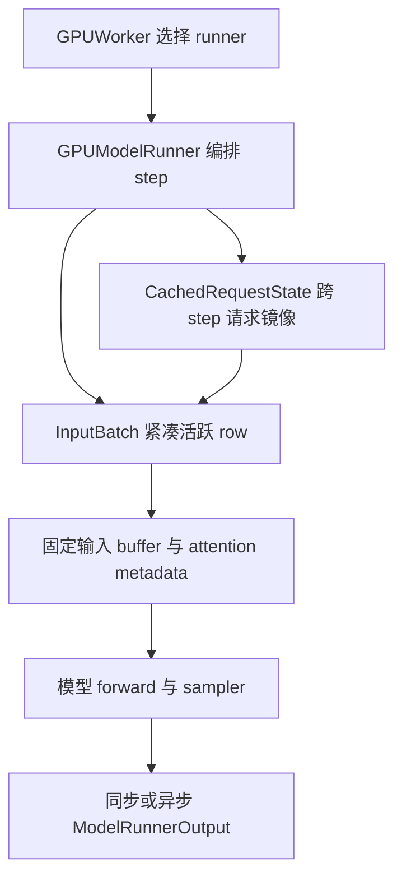
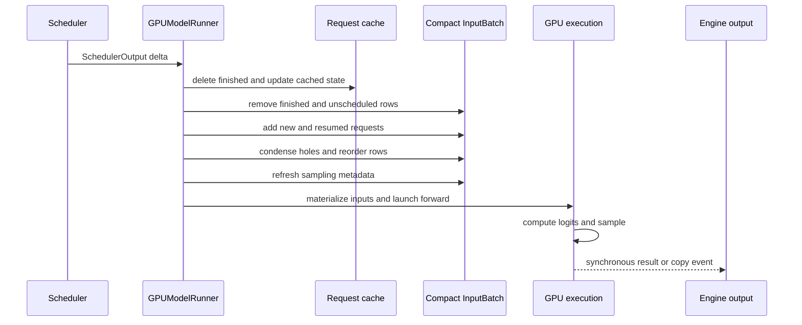

# vLLM Model Runner V1：用紧凑持久批次承接动态计划

> **读者问题**：Model Runner V1 怎样把每步变化的 `SchedulerOutput` 投影成模型、attention 与 sampler 可直接消费的紧凑设备输入；`CachedRequestState` 与 `InputBatch` 为什么同时存在；请求加入、暂停、恢复、重排和完成时哪些状态必须一起移动？
> **源码基线**：`vllm-project/vllm@6b110badbb22d3f66c7218b71138f13b7a6b3419`（冻结的 detached checkout，提交时间 2026-08-29T02:40:53Z）
> **中心命题**：MRV1 的核心不是“每步重建 batch”，而是把相邻 step 高度重合这一事实变成一个**紧凑的 persistent batch**：长期请求语义保存在 `CachedRequestState`，当步活跃请求则占据 `InputBatch` 的连续 row；runner 只应用加入、移除、block 增量和采样参数变化，再把连续 row 直接物化为 token-major 输入。它降低了 Python 重建成本，却把请求身份、batch 顺序和整组 per-request tensor 绑定在同一个 row 上，因此 condense、全状态 reorder 与 async barrier 都成为正确性机制，而不是偶然实现细节。
> **当前定位**：V1 Engine 与 Model Runner V1 是两个不同维度。本基线在无显式覆盖且能力检查通过时默认 MRV2；MRV1 仍是显式选择和兼容 fallback 的活跃执行路径，而不是已删除的旧 Engine。完整选择矩阵归 [[02_engineering/03_infer_frameworks/vllm/16_vllm_model_runner_v2_analysis|Model Runner V2]] 所有。
> **所有权边界**：本页拥有 MRV1 的跨 step 请求镜像、紧凑 persistent batch、condense/reorder、输入物化、forward/sample 分段、异步输出与 dummy/profile/capture 生命周期；不拥有 Scheduler admission、物理 KV 分配、attention backend 内部算法、采样分布或全局编译策略。
> **最近更新**：2026-08-31。补强 request-major 到 token-major 的边界理由，以及 dummy/profile/capture 共用真实 buffer 的设计收益与技术债。

## 1. 概览：MRV1 解决的是重复重建，不是一次 forward

一次 decode step 的请求集合通常只比上一步多或少几个请求。如果每轮都从 Python request 对象重新拼出 block table、temperature、top-p、penalty 和 token history，CPU 会反复重建大量几乎相同的 tensor。vLLM 的设计文档把 MRV1 persistent batch 的出发点明确为：利用相邻 batch 高重合，只应用增量，从而避免每步重建大 tensor（`docs/design/model_runner_v2.md:15-19`）。

MRV1 的选择是让 persistent tensor **同时充当状态存储和当步输入**。这条路线省去了每步从稳定状态 gather 一份 batch view，却要求所有活跃请求始终位于连续 row，并要求同一个 request 的 token、block、sampling、LoRA 和 logits-processor 状态永远共享 row index。设计文档也明确指出，这种耦合使加入、完成和后端重排演变成 tensor-wide bookkeeping，并迫使系统保留一份不受 row 覆盖影响的 `CachedRequestState`（`docs/design/model_runner_v2.md:21-27`）。

| 责任层 | 提供的能力 | 输入 → 输出 | 持有的状态与边界 | 证据 |
|---|---|---|---|---|
| runner 选择 | 在同一个 V1 worker 内选择 MRV1 或 MRV2 | `VllmConfig` → runner 实例 | 只决定实现，不改变 Engine 代际 | `vllm/v1/worker/gpu_worker.py:455-475` |
| step 编排 | 把 Scheduler delta 排成 update、prepare、forward、sample、output | `SchedulerOutput` → runner output | 不重做 admission，只执行已批准计划 | `vllm/v1/worker/gpu_model_runner.py:4235-4318` |
| 请求镜像 | 即使请求暂时不在当步 batch，也保留恢复所需的语义状态 | new/cached request data → `CachedRequestState` | token history、block ids、progress、sampling、媒体与 LoRA | `vllm/v1/worker/gpu_input_batch.py:35-65` |
| 紧凑 batch | 维护当步活跃请求的 row-aligned CPU/GPU tensor | request delta → 连续 row | row index 同时是请求位置和全部附属状态的位置 | `vllm/v1/worker/gpu_input_batch.py:127-205` |
| 输入运行时 | 将 request-major rows 展开成 token-major forward 输入 | row state → ids、positions、slot mapping、attention metadata | 固定 buffer 地址服务真实执行与 CUDA Graph | `vllm/v1/worker/gpu_model_runner.py:814-839`；`vllm/v1/worker/gpu_model_runner.py:1961-2207` |
| 结果提交 | 将 logits 采样并转换成 Engine 可消费结果 | logits → token、logprobs、connector output | 同步路径立即完成；异步路径以 copy event 为可见性门 | `vllm/v1/worker/gpu_model_runner.py:4614-4654`；`vllm/v1/worker/gpu_model_runner.py:292-398` |

静态结构的关键是两层状态而不是类的数量：`requests` 回答“这个请求长期是什么”，`InputBatch` 回答“这一步它排在第几 row、哪些 tensor 与它同行”。后续所有 condense、reorder 和 async 修补都源于这两个问题没有合并，也不能混淆。

## 2. Live path 与源码入口

### 2.1 何时实际进入 MRV1

`GPUWorker` 在 V1 Engine 内部根据 `use_v2_model_runner` 分支构造两个不同模块：MRV2 位于 `vllm/v1/worker/gpu/model_runner.py`，MRV1 位于 `vllm/v1/worker/gpu_model_runner.py`（`vllm/v1/worker/gpu_worker.py:455-475`）。因此看到路径中的 `vllm/v1/` 只能证明它属于 V1 Engine，不能证明 runner 代际。

若要显式观察 MRV1，可将 `VLLM_USE_V2_MODEL_RUNNER` 设为 false；该环境变量未设置时才进入自动选择（`vllm/envs.py:2032-2035`；`vllm/config/vllm.py:620-623`）。自动路径在特定 ROCm architecture、缺少 Triton，或 MRV2 capability check 返回 blocker 时选择 MRV1，否则默认 MRV2（`vllm/config/vllm.py:627-652`）。

MRV1 也不是“能力全集”。prefill context parallel、DSpark、adaptive draft verification、部分 DFlash、diffusion 与 batch-sharded sampling 会被 MRV1 capability check 拒绝（`vllm/config/vllm.py:2471-2501`）。所以正确定位是**双向能力边界中的兼容执行路径**，完整优先级和 blocker 表见 [[02_engineering/03_infer_frameworks/vllm/16_vllm_model_runner_v2_analysis|Model Runner V2]]。

### 2.2 最短源码阅读路径

1. 从 runner 分派开始：`vllm/v1/worker/gpu_worker.py:455-475`。
2. 看长期请求状态与紧凑 row：`vllm/v1/worker/gpu_input_batch.py:35-65`、`vllm/v1/worker/gpu_input_batch.py:92-316`。
3. 沿一个真实 step：`vllm/v1/worker/gpu_model_runner.py:1188-1563`、`vllm/v1/worker/gpu_model_runner.py:4235-4895`。
4. 最后看 dummy/profile/capture 共用生命周期：`vllm/v1/worker/gpu_model_runner.py:5882-6055`、`vllm/v1/worker/gpu_model_runner.py:6500-6573`、`vllm/v1/worker/gpu_model_runner.py:6888-6992`。

## 3. 双层状态：请求身份与 batch row 为什么不能只留一个

### 3.1 背景与设计选择

preemption 或本步未调度并不等于请求完成。若 runner 只保留当前 batch tensor，请求一旦离开 batch，恢复时就丢失 output history、block ids、随机数 generator、媒体位置和 LoRA 等语义；若只保留 Python request 对象，每步又必须重建设备输入。MRV1 因此同时维护：

| 状态面 | 生命周期 | 负责回答 | 离开当步 batch 后是否保留 | 证据 |
|---|---|---|---|---|
| `requests[req_id]` 与 `CachedRequestState` | 从首次加入到真正 finished | prompt/output、逻辑 progress、block ids 与 request-specific feature 是什么 | 是；preempted 或暂未调度时仍保留 | `vllm/v1/worker/gpu_model_runner.py:723-727`；`vllm/v1/worker/gpu_model_runner.py:1229-1249` |
| `InputBatch` row | 仅覆盖当前 step 的 scheduled active set | 该请求位于第几 row，forward/sampler 应读哪组 tensor | 否；离开 batch 时释放 row，resume 时重新加入 | `vllm/v1/worker/gpu_input_batch.py:127-172`；`vllm/v1/worker/gpu_model_runner.py:1450-1512` |
| 固定执行 buffer | runner 生命周期 | 本步 token-major 输入和 graph-stable 地址是什么 | 内容每步覆盖，地址长期稳定 | `vllm/v1/worker/gpu_model_runner.py:814-839` |
| 异步前一步快照 | 相邻两个 in-flight step 之间 | 上一步 GPU token 在当前 row 变换后对应到哪里 | 只保留到当前 step 完成映射与消费 | `vllm/v1/worker/gpu_input_batch.py:309-316`；`vllm/v1/worker/gpu_model_runner.py:1787-1813` |

这不是简单的“CPU cache + GPU cache”。`CachedRequestState` 以 request id 为身份，不受 batch row 改变影响；`InputBatch` 则把所有模型和 sampler 需要的字段按 row 对齐，位置本身就是合同。两者必须在 `_update_states()` 内以固定次序共同更新，否则可能出现 request history 正确、block table 却属于另一请求的交叉污染。

### 3.2 四条承重不变量

1. **`req_id_to_index` 必须与当前 row 内容互逆。** `add_request()` 在同一 index 填 token、progress、block table、sampling、LoRA 与 generator（`vllm/v1/worker/gpu_input_batch.py:350-430`）。
2. **`InputBatch` 在输入物化前必须无内部空洞。** `remove_request()` 的文档明确要求之后调用 `condense()`（`vllm/v1/worker/gpu_input_batch.py:528-536`）。
3. **离开 batch 不等于删除 request state。** unscheduled request 只从 `InputBatch` 移除；finished request 才从 `requests` 和 batch 两面删除（`vllm/v1/worker/gpu_model_runner.py:1198-1213`；`vllm/v1/worker/gpu_model_runner.py:1229-1249`）。
4. **row 移动必须携带所有 row-local owner。** token prefix、block-table row、sampling 参数、LoRA mapping、generator 和 logits-processor state 不能分别移动（`vllm/v1/worker/gpu_input_batch.py:584-699`）。

## 4. 一步状态事务：先让 batch 自洽，再生成设备输入

`_update_states()` 不是一串无关的 dict 操作，而是一次 row-layout 事务。它先移除 finished 和本步 unscheduled row，再构造或更新 request mirror；缺席但本步重新被调度的请求加入空位，剩余空洞被压紧，attention backend 最后才允许重排，采样与 custom logits processor metadata 也只在布局稳定后刷新（`vllm/v1/worker/gpu_model_runner.py:1188-1196`；`vllm/v1/worker/gpu_model_runner.py:1505-1516`）。

| 请求事件 | `CachedRequestState` | `InputBatch` | 为什么必须区分 |
|---|---|---|---|
| new | 新建并登记 | 分配最小可用 row | 建立长期身份与当步位置 |
| 继续运行 | 更新 progress、token、block delta | 原 row 增量更新 | 利用相邻 batch 高重合 |
| 本步未调度或 preempted | 保留 | 移除并留下待填空洞 | 未来 resume 仍需要语义状态 |
| resumed | 更新或替换 block ids | 重新加入，row 可与此前不同 | preemption 后物理 block 与 row 都可能变化 |
| finished | 删除 | 删除 | 只有此时 request 生命周期真正结束 |
| streaming update | 先从 batch 移除，再原地改 request mirror，最后重新加入 | 不允许同一 id 同时占两 row | intermediate output 已进入新 prompt，旧 row 语义不能局部修补（`vllm/v1/worker/gpu_model_runner.py:1622-1644`；`tests/v1/streaming_input/test_gpu_model_runner_streaming.py:50-118`） |

这里的顺序还避免了额外搬移：新请求优先复用刚删除的 row，只有未被填掉的内部空洞才进入 `condense()`（`vllm/v1/worker/gpu_input_batch.py:325-348`；`vllm/v1/worker/gpu_input_batch.py:718-746`）。这说明 MRV1 并非无条件全 batch 拷贝，而是在“直接消费紧凑 row”的约束下尽量把搬移限制到 batch churn。

## 5. Condense 与 reorder：row index 是数据结构的一部分

### 5.1 为什么不能只改请求列表

模型和 sampler 直接消费 row-aligned tensor。若删除 row 2 后只把请求 id 列表压紧，temperature 仍在旧 row、block table 仍指向旧请求、generator 仍以旧 index 为 key，结果不会立即报 shape 错，而会静默改变另一个请求的生成。MRV1 因此把“移动请求”实现为整组状态迁移。

`condense()` 从 batch 尾部取最后一个非空请求，填入最小内部空洞，再同步移动有效 token prefix、computed length、block-table row、LoRA、sampling 与 logits-processor 相关状态，最后截短 Python 列表（`vllm/v1/worker/gpu_input_batch.py:706-836`）。attention backend 若要把 decode 与 prefill 分区，则通过 `swap_states()` 交换两套完整 row；实现特意只复制两请求的有效 token 前缀，避免按 `max_model_len` 搬整行（`vllm/v1/worker/gpu_input_batch.py:584-651`）。

### 5.2 为什么还要 `BatchUpdate`

custom logits processor 可能持有与 batch row 对齐的内部状态。仅移动 runner tensor 不会自动移动插件状态，所以 add、remove、move 被记录成 `BatchUpdate`，在布局稳定后按同一变换同步 processor，再重建 sampling metadata（`vllm/v1/worker/gpu_input_batch.py:275-303`；`vllm/v1/worker/gpu_input_batch.py:838-856`）。测试不是只核请求顺序，而是把 condense/reorder 后的 temperature、top-p、penalty、token history 和 mask 与重新构造的参考 batch 对比（`tests/v1/worker/test_gpu_input_batch.py:223-310`；`tests/v1/worker/test_gpu_input_batch.py:313-377`）。

这条设计的收益是 forward 不需要另做 row gather；代价是新增任何 per-request 状态时，都必须加入 add、remove、condense、swap 和 metadata refresh 的完整迁移协议。漏掉一个字段通常表现为低频错 token，而不是清晰异常。

## 6. 从 request-major row 到 token-major forward

这一转换解决的是两种数据布局的冲突。Scheduler 和 persistent batch 必须按 request 保存不同长度的历史、block table 与 sampling state；模型和 attention kernel 则希望一次消费扁平 token 流，并用 `query_start_loc` 恢复请求边界。若按请求逐个 forward，会失去跨请求 batching；若让 Scheduler 直接生成 token-major tensor，又会把设备布局和固定 buffer 责任推回资源控制层。MRV1 因而把转换放在 runner：上游仍提交 request-major 资源计划，下游只看到已经排好的 token-major 执行输入。

状态事务完成后，`_prepare_inputs()` 才执行这次投影。它先提交 block table 的 H2D copy，以便与后续 CPU 索引计算重叠；随后按每请求 scheduled token 数生成重复的 request index 和累积 query 边界，再以 `num_computed_tokens + query offset` 得到 position（`vllm/v1/worker/gpu_model_runner.py:1961-1997`）。这一步的关键不是“把二维数组 flatten”本身，而是让同一份 `req_indices` 同时约束 token、position、query boundary、seq lens 与 slot mapping，避免这些设备输入分别解释 batch 顺序。

token history 在 `InputBatch` 中是 request-major 的二维 CPU tensor。runner 将 position 与 row stride 合成 flattened index，再用 `torch.index_select` 抽出本步 token-major `input_ids`；同一组 row/order 继续生成 `query_start_loc`、`seq_lens` 和 KV slot mapping（`vllm/v1/worker/gpu_model_runner.py:2009-2026`；`vllm/v1/worker/gpu_model_runner.py:2074-2081`；`vllm/v1/worker/gpu_model_runner.py:2182-2207`）。因而数据流是：

`紧凑 request row → 每请求 token 数 → token-major index → 固定输入 buffer → attention metadata → forward`

这条路线保留了两类复用：request-major state 跨 step 复用，固定 device buffer 地址跨 eager/graph 执行复用。它也支付两类成本：每步仍要在 CPU 计算 flattened indices；`token_ids_cpu` 预分配为 `max_num_reqs × max_model_len`，源码直接标注长上下文下可能过大（`vllm/v1/worker/gpu_input_batch.py:130-140`）。更重要的正确性边界是：`req_indices`、`query_start_loc`、positions 和 slot mapping 必须来自同一份已完成 condense/reorder 的布局；任一字段仍按旧 row 解释，都可能在 shape 正常的情况下读取另一请求的 token 或 KV。

## 7. Async scheduling：在 row 可移动的前提下修补跨 step 依赖

### 7.1 为什么上一步 token 不能简单等 CPU

异步调度希望 CPU 准备 step N+1 时 GPU 仍执行 step N。MRV1 后来加入的 async 路径把上一步 sampled token 保留在 GPU；当前 batch 通过 `prev_req_id_to_index` 和 `prev_positions` 找到旧 row，再把 token scatter 到本步扁平 `input_ids`。当 batch 顺序完全不变时可直接 slice copy，只有重排或混入新请求时才走索引 scatter（`vllm/v1/worker/gpu_model_runner.py:1787-1813`；`vllm/v1/worker/gpu_model_runner.py:1852-1914`）。

这避免了“采样 → D2H → CPU 写回 → H2D”串行链，但没有消除 MRV1 的共享 host-buffer 风险。runner 复用的 CPU tensor 可能仍被异步 H2D 读取，因此下一个 preprocess 进入前通过 `prepare_inputs_event` 等待前一步离开临界区，并在当前输入准备结束时重新记录事件（`vllm/v1/worker/gpu_model_runner.py:784-794`；`vllm/v1/worker/gpu_model_runner.py:3888-3901`）。官方设计文档把这种 barrier 的成本概括为保护对象易遗漏、代码组织受限且可能减少 overlap（`docs/design/model_runner_v2.md:51-78`）。

### 7.2 forward、sample 与 Engine 可见性

`execute_model()` 先完成 state update、输入准备、graph/eager 决策和 target forward，再把 logits 与本步临时上下文保存进 `ExecuteModelState`，返回 `None`（`vllm/v1/worker/gpu_model_runner.py:4235-4244`；`vllm/v1/worker/gpu_model_runner.py:4481-4596`）。`sample_tokens()` 随后消费可选 grammar mask、执行 sampler 并推进 hybrid/spec state；这使“模型已产生 logits”和“token 已按本步约束提交”成为两个明确阶段（`vllm/v1/worker/gpu_model_runner.py:4614-4654`）。

同步调度直接返回填好的 `ModelRunnerOutput`。异步调度则在独立 copy stream 等待 default stream，把 token、logprob 和诊断 tensor 非阻塞复制到 host，并记录 `async_copy_ready_event`；只有 `get_output()` 同步该事件后，CPU list 与错误才对 Engine 可见（`vllm/v1/worker/gpu_model_runner.py:321-354`；`vllm/v1/worker/gpu_model_runner.py:374-398`）。若下一步 logits processor 确实需要 output history，`InputBatch` 才在消费前同步同一个 event，用实际 token 替换 placeholder（`vllm/v1/worker/gpu_input_batch.py:1028-1075`）。

所以 MRV1 的 async 不是“没有同步”，而是把同步推迟到共享 row、共享 host snapshot 或 CPU token 语义真正被消费的边界。MRV2 进一步改变的是状态布局，使更多边界不再需要 barrier；这一差异见 [[02_engineering/03_infer_frameworks/vllm/16_vllm_model_runner_v2_analysis|Model Runner V2]]。

## 8. Dummy、profile 与 CUDA Graph：共用真实 buffer，也共用复杂度

这组路径首先要解决“启动阶段怎样得到与线上执行可信的一致结果”。如果 profile、backend warmup 和 CUDA Graph capture 各自构造一套简化输入，它们可能漏掉真实 batch 的 LoRA、mixed prefill/decode、microbatch 或 attention metadata，最终得到错误峰值或不可 replay 的 graph。MRV1 选择让它们复用真实 runner buffer 和大部分真实 forward path：CUDA Graph replay 要求地址与捕获时一致，runner 因而预分配 `input_ids`、positions、query boundary、length 和 request mapping 等 persistent buffers（`vllm/v1/worker/gpu_model_runner.py:814-839`）。`_dummy_run()` 再合成不同 token/request shape，在这些同地址 buffer 上完成 profile、warmup 或 capture（`vllm/v1/worker/gpu_model_runner.py:5882-5923`；`vllm/v1/worker/gpu_model_runner.py:5951-6018`）。

`profile_run()` 用最大 token budget 驱动 dummy forward 和 dummy sampler，以暴露峰值内存（`vllm/v1/worker/gpu_model_runner.py:6559-6573`）。`capture_model()` 按大 shape 到小 shape 捕获，使小 graph 复用大 graph 的内存池；全部捕获后锁定 workspace，防止线上执行时再次 resize（`vllm/v1/worker/gpu_model_runner.py:6888-6906`；`vllm/v1/worker/gpu_model_runner.py:6945-6992`）。

这一共用的收益是 profile/capture 与真实执行绑定同一地址、shape 规则和 backend 条件；代价是一个入口同时扮演 profile、warmup、capture 和空 DP forward，`is_profile`、graph mode、mixed batch、LoRA 等开关组合成另一套隐式状态机。新增线上输入条件时，开发者既要更新真实 path，也要保证 dummy 能产生等价条件，否则问题可能只在 capture 或上线 shape 中出现。设计文档明确将这种多义 dummy lifecycle 列为 MRV1 技术债，并指出不同路径行为漂移会产生 bug（`docs/design/model_runner_v2.md:171-190`）。本页只解释 MRV1 生命周期；graph mode、descriptor 与全局 fallback 的权威说明仍在 [[02_engineering/03_infer_frameworks/vllm/23_vllm_compilation_cudagraph_analysis|vLLM 编译与 CUDA Graph]]。

## 9. 代价、失败边界与排查顺序

| 机制 | 得到什么 | 支付什么 | 首先验证 |
|---|---|---|---|
| 双层 request/batch state | preemption 后可恢复，同时避免每步全量重建 | 两份状态必须按固定顺序保持一致 | request 是否还在 `requests`；本步是否应在 `InputBatch`（`vllm/v1/worker/gpu_model_runner.py:1229-1249`） |
| compact persistent batch | 连续 row 可直接供模型和 sampler 使用 | batch churn 触发 row 搬移；低 overlap 时优化失效 | 本基线已明确低 overlap 会非常低效（`vllm/v1/worker/gpu_model_runner.py:1243-1249`） |
| 全状态 condense/reorder | 后端获得所需的连续布局 | 任一新增 row-local 字段漏迁移都会错配 | `req_id_to_index`、token prefix、block row、sampling、LoRA 是否同行（`vllm/v1/worker/gpu_input_batch.py:584-699`） |
| request-major token store | 相邻 step 只改 token history 增量 | CPU 内存随 `max_num_reqs × max_model_len` 增长 | 长上下文下 `token_ids_cpu_tensor` 大小（`vllm/v1/worker/gpu_input_batch.py:130-140`） |
| async GPU token reuse | 减少 sampled token 的 CPU round trip | prev/current row 映射、placeholder 与 event 生命周期变复杂 | `prev_positions` 是否对应 condense/reorder 后的当前 row（`vllm/v1/worker/gpu_model_runner.py:2094-2097`） |
| async barrier | 防止 CPU 覆写仍被 H2D 读取的 buffer | 可能阻塞下一步输入准备，且新 buffer 易漏保护 | `prepare_inputs_event` 是否覆盖所有复用 host tensor（`vllm/v1/worker/gpu_model_runner.py:3888-3901`） |
| 多义 dummy path | profile、warmup、capture 复用真实 buffer 和 backend | 分支组合多，dummy 与 real path 可能漂移 | dummy shape、runtime mode 与真实 batch descriptor 是否一致（`vllm/v1/worker/gpu_model_runner.py:5987-6018`） |

MRV1 能保证的是：Scheduler 已批准的逻辑 delta 在一个紧凑 row 布局中自洽，并被物化为模型输入。它不能保证 Scheduler 的 admission、公平性或 block 分配正确；这些问题分别回到 [[02_engineering/03_infer_frameworks/vllm/11_vllm_scheduler_analysis|vLLM Scheduler]] 和 [[02_engineering/03_infer_frameworks/vllm/12_vllm_kv_cache_management_analysis|vLLM KV Cache 管理]]。

## Related Pages

- [[02_engineering/03_infer_frameworks/vllm/03_vllm_architecture_overview_analysis|vLLM 架构概览]] — 把 MRV1 放回请求语义、资源控制和设备执行的完整分层。
- [[02_engineering/03_infer_frameworks/vllm/11_vllm_scheduler_analysis|vLLM Scheduler]] — 解释本页只消费、不重新决定的 admission、preemption 与 `SchedulerOutput`。
- [[02_engineering/03_infer_frameworks/vllm/12_vllm_kv_cache_management_analysis|vLLM KV Cache 管理]] — 深入 block-id row 背后的逻辑/物理 block 生命周期。
- [[02_engineering/03_infer_frameworks/vllm/14_vllm_attention_backends_analysis|vLLM Attention Backend]] — 解释为什么 backend 会要求 decode/prefill reorder 以及它消费的 metadata 合同。
- [[02_engineering/03_infer_frameworks/vllm/16_vllm_model_runner_v2_analysis|vLLM Model Runner V2]] — 对照 stable row、per-step gather、staged write 与 async-first 重新分配的状态所有权。
- [[02_engineering/03_infer_frameworks/vllm/23_vllm_compilation_cudagraph_analysis|vLLM 编译与 CUDA Graph]] — 展开本页 dummy/capture 接缝之上的全局编译与 graph 策略。
