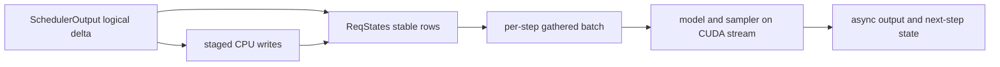

# vLLM Model Runner V2：以稳定状态与异步执行重建 GPU 热路径

> **源码基线**：`vllm-project/vllm@d66300a1baa7779c68c7dfa4e51eee2502b48017`
> **中心命题**：Model Runner V2（MRV2）不是 V1 runner 的整理版，而是一次状态模型重构。它把“请求生命周期内稳定的持久状态”“每一步实际执行的 batch 视图”和“正在飞行的异步缓冲区”分开，使 CPU 能准备 step N+1、GPU 执行 step N，而不靠全 batch 重排维持正确性。

## 一、为什么要从状态模型重做

GPU 推理一步看起来只是准备输入、执行模型、采样，但在线 continuous batching 会不断插入、完成和抢占请求。若持久 tensor 同时也是模型输入，那么请求顺序一变，就必须搬动整批 tensor；异步执行后，CPU 还可能覆盖 GPU 尚未消费的行。

V1 的 persistent batch 正是把持久状态和当步输入耦合在一起，因此需要复杂 reorder 和冗余 `CachedRequestState`。官方设计文档明确把它列为 MRV2 的首要问题；`docs/design/model_runner_v2.md:11-39`。MRV2 选择了三个原则：

1. 每个活跃请求在生命周期内占用稳定 row；
2. 当步顺序由 backend 决定，再从稳定 row gather 出执行视图；
3. 抢占等同于结束该 row，恢复时按新请求重新加入。

第三点很关键：它没有试图让 runner 保留 scheduler 的“暂停”语义，而是用释放再建立状态，缩小跨组件一致性协议。

## 二、三类状态必须分离

### 2.1 请求状态：生命周期内稳定

`ReqStates` 同时维护 `req_id_to_index`、`index_to_req_id` 和空闲 row 列表，并预分配 token、length、block table、sampling 等状态；`vllm/v1/worker/gpu/states.py:20-85`。`add_request()` 从 free list 分配 row，`remove_request()` 释放同一 row；`vllm/v1/worker/gpu/states.py:91-133`。

这里的不变量不是“第 i 个请求永远排第 i”，而是：

> 在 finish、preempt 或 remove 之前，请求 ID 到持久 row 的映射不变；执行顺序可以每步变化。

稳定的是身份映射，不是 batch 排列。这样 backend 可以按 attention 需要排序，而不会破坏请求的长期状态。

### 2.2 执行状态：每步 gather

当步输入只是一张由 `SchedulerOutput` 和稳定 row 派生出的视图。runner 先处理完成请求和新请求，再计算当步 row 映射、更新已有请求状态，最后准备模型输入；`vllm/v1/worker/gpu/model_runner.py:934-1103`。`prepare_inputs()` 从这个 batch 描述构造 attention、position、token 和 graph 所需输入；`vllm/v1/worker/gpu/model_runner.py:1105-1335`。

这使“请求存在哪里”和“这一轮按什么顺序跑”成为两个问题。相比维护一个同时承担两种含义的 tensor，gather 多了一次 GPU 数据整理，却消除了 CPU 侧的大规模 reorder 和备份状态。

### 2.3 传输状态：按并发深度隔离

异步调度意味着同一种 staging buffer 可能同时服务多个未完成 step。`UvaBufferPool` 至少保留两个 buffer，并按并发深度轮转；`vllm/v1/worker/gpu/buffer_utils.py:16-77`。因此缓冲区复用的不变量是：

> 一个 in-flight step 可能读取的 host/UVA 存储，在该 step 离开并发窗口前不得被后续 step 覆盖。

`StagedWriteTensor` 把 CPU source of truth、GPU/UVA 目标和待提交的稀疏写入分开；`vllm/v1/worker/gpu/buffer_utils.py:114-177`。多个 tensor 的稀疏写可由 `FusedStagedWriter` 合并提交；`vllm/v1/worker/gpu/buffer_utils.py:210-268`。其设计目的不是只减少 memcpy 次数，还在于让“写了哪些 row”显式化并保持异步安全。

## 三、一次 step 的逻辑提交

下面是理解状态提交的最小序列，不应把它误当成架构主线：

1. `finish_requests()` 清理已结束或被抢占请求的 runner 状态；`vllm/v1/worker/gpu/model_runner.py:934-957`；
2. `add_requests()` 为新请求建立稳定 row，并暂存初始字段写入；`vllm/v1/worker/gpu/model_runner.py:958-1015`；
3. 更新已有请求的 token、computed length、block table 等增量状态，并生成当步 row 映射；`vllm/v1/worker/gpu/model_runner.py:1016-1103`；
4. `prepare_inputs()` gather 当步输入与 attention metadata；`vllm/v1/worker/gpu/model_runner.py:1105-1335`；
5. `execute_model()` 把模型、connector、speculative 等工作排入设备流；`vllm/v1/worker/gpu/model_runner.py:1411-1706`；
6. `sample_tokens()` 完成采样并返回同步或异步输出；`vllm/v1/worker/gpu/model_runner.py:1710-1864`。

正确性来自每一步对三类状态的边界，而不是这六个函数恰好按此顺序调用。

## 四、Async-first 是一组约束，不是一个线程开关

MRV2 假定模型热路径是一条没有 CPU 同步点的 CUDA stream：CPU 提交工作后即可准备下一步；`docs/design/model_runner_v2.md:43-49`。这要求：

- 输入准备尽量由 GPU kernel 完成，CPU 不读取本步 GPU 结果再决定本步 shape；
- host 数据若通过 UVA 暴露给 GPU，生命周期必须覆盖异步读取；
- 采样和输出回传允许异步 D2H，下一步状态通过明确的 postprocess 边界提交；
- graph replay 使用的 tensor 地址必须稳定，动态值原地更新；
- dummy run、graph capture 和真实 execute 不得各自维护一套漂移的状态语义。

UVA 适合 token 列表等大而稀疏访问的数据：GPU 可直接访问 pinned host memory，避免把整个容器复制到显存；`docs/design/model_runner_v2.md:141-147`。代价是访问延迟和平台能力限制，因此它不是所有 tensor 的默认归宿。

## 五、为什么采样与 metadata 也要 GPU-native

如果模型 forward 已经异步，但 CPU 必须读取 logits 或长度后再拼 metadata，流水仍会被同步点截断。MRV2 把更多输入派生和采样放入 GPU/Triton，让 GPU 已知、CPU 未必及时知道的值仍能继续推进；设计动机见 `docs/design/model_runner_v2.md:126-147`。

这也解释了 stable row 的价值：GPU kernel 可以通过 row mapping gather 长期状态，而不是要求 CPU 先把所有数据重新排成连续的“当前 batch”。

## 六、CUDA Graph 必须拥有显式生命周期

V1 的 `dummy_run` 同时承担 profiling、compile、warmup、空 DP forward 和 graph capture，容易让真实执行与 capture 路径分叉。MRV2 让 dummy run 复用 `execute_model()`，把 CUDA Graph capture 放到独立路径；`docs/design/model_runner_v2.md:171-192`。

显式 graph manager 带来两个设计收益：

1. capture、replay、eager fallback 的决策可以单独审计；
2. speculative draft 的多个依赖 step 可以合并进一个 full graph。

融合 draft graph 不是无条件优化。attention builder 若缓存派生 metadata，必须声明并实现 `update_draft_decode_metadata()`，在 capture 中用 capture-safe GPU 操作原地更新；否则退回逐步重建 metadata；`docs/design/model_runner_v2.md:194-200`。这里的能力声明是正确性合同，而非性能标签。

## 七、MRV2 与 Scheduler、Attention 的边界

MRV2 不决定请求应获得多少 token，也不拥有物理 KV block：

- Scheduler 输出新请求、继续请求、完成请求和 token/block 增量；
- MRV2 把这些逻辑增量提交到稳定 GPU 状态；
- attention backend 决定当步需要的 metadata 与可能的 reorder；
- MRV2 gather 对应 row，并向 backend 提供稳定地址和动态值。

若把 admission policy 放入 runner，就会让 GPU 状态管理反向控制全局公平性；若把 runner row 生命周期放入 backend，则不同 backend 会各自实现请求状态机。当前边界让二者通过 `SchedulerOutput` 与 metadata builder 合同连接。

## 八、为什么仍保留 V1 runner

`GPUWorker` 根据 `vllm_config.use_v2_model_runner` 选择 V2 或 V1 实现；`vllm/v1/worker/gpu_worker.py:423-438`。这不是冗余，而是迁移边界：设计文档仍明确说明 MRV2 尚未 feature-complete，测试和部分设计决策仍在演进；`docs/design/model_runner_v2.md:3-9`。

因此“使用 MRV2”不能被理解为永远更快。支持矩阵、平台、speculative 方法、attention backend 和 graph 能力不满足时，V1 或 eager fallback 仍是合法执行路径。

## 九、替代方案为何不够好

| 方案 | 看似简单之处 | 在 continuous batching 下的代价 |
|---|---|---|
| 每步从 Python 对象重建全部输入 | 没有持久状态协议 | CPU 开销与 batch/token 长度一起增长 |
| 持久 tensor 直接作为当步输入 | 少一次 gather | 插入、完成和 reorder 触发大范围搬移；异步覆盖风险高 |
| 为每个 backend 保存独立请求状态 | backend 自治 | 生命周期重复实现，切换 backend 的一致性成本高 |
| 单个 pinned buffer 循环复用 | 内存最省 | step N+1 可覆盖 step N 正在读取的 host 数据 |
| 所有动态逻辑留在 CPU | 易调试 | 频繁 D2H 同步，破坏 CPU/GPU overlap 与 graph replay |

MRV2 选择的是“稳定持久状态 + GPU gather + 多份 in-flight buffer”。它用有限的预分配和 gather 成本换取更简单的身份不变量与真正可重叠的执行。

## 十、代价、失败边界与排查

这套设计的成本包括：预分配状态占用显存/host memory；row mapping、staged writer 和 graph state 增加组件数量；UVA 依赖平台且不适合高带宽连续访问；异步错误可能延迟到后续边界才暴露。

排查时优先验证不变量：

1. 活跃 `req_id` 是否唯一映射到一个未被复用的 row；
2. finish/preempt 是否在新请求复用 row 前完成清理；
3. 当步 request order 与 gather row mapping 是否一致；
4. staged writes 是否在模型读取前提交，且没有越过并发 buffer 生命周期；
5. graph replay 的地址是否稳定、动态字段是否原地更新；
6. backend 的 draft metadata 能力声明是否与实际缓存状态一致；
7. 异步采样输出是否在下一步消费前完成 postprocess。

最小源码阅读顺序：`docs/design/model_runner_v2.md:1-204` → `vllm/v1/worker/gpu/states.py:20-133` → `vllm/v1/worker/gpu/buffer_utils.py:16-268` → `vllm/v1/worker/gpu/model_runner.py:934-1103,1105-1335,1411-1864` → `vllm/v1/worker/gpu_worker.py:423-438`。

## Related Pages

- [[02_engineering/03_infer_frameworks/vllm/10_vllm_engine_architecture_analysis|vLLM Engine 架构]] — 异步 runner 所在的 EngineCore 与 executor 边界。
- [[02_engineering/03_infer_frameworks/vllm/11_vllm_scheduler_analysis|vLLM Scheduler]] — `SchedulerOutput` 的 admission 与 token/KV 承诺来源。
- [[02_engineering/03_infer_frameworks/vllm/12_vllm_kv_cache_management_analysis|vLLM KV Cache 管理]] — runner block table 映射的物理 block 所有权。
- [[02_engineering/03_infer_frameworks/vllm/14_vllm_attention_backends_analysis|vLLM Attention Backend]] — 当步顺序、metadata 与 graph 能力合同。
- [[02_engineering/03_infer_frameworks/vllm/20_vllm_speculative_decoding_analysis|vLLM 投机解码]] — fused multi-step draft graph 的生产者与验收者。
- [[02_engineering/03_infer_frameworks/vllm/23_vllm_compilation_cudagraph_analysis|vLLM 编译与 CUDA Graph]] — graph capture、replay 和 eager fallback 的系统策略。
