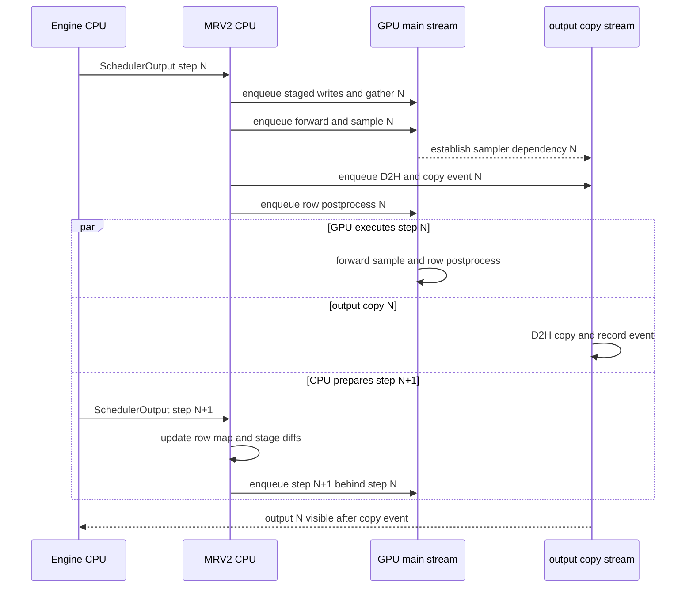

# vLLM Model Runner V2：用稳定行与异步提交重建设备热路径

> **读者问题**：默认 Model Runner V2 怎样把动态的 `SchedulerOutput` 变成地址稳定、可与下一步 CPU 工作重叠的 GPU 执行；一条请求状态何时对 Python、GPU 和 Engine 输出分别可见；哪些配置仍选择或必须选择 V1 runner？
> **源码基线**：`vllm-project/vllm@6b110badbb22d3f66c7218b71138f13b7a6b3419`（`main`，提交时间 2026-08-29T02:40:53Z）
> **中心命题**：MRV2 的关键不是换一组 kernel，而是把“请求生命周期内的稳定 row”“每步按执行顺序 gather 的 batch view”“尚未对设备提交的 CPU staged diff”和“正在飞行的传输/输出”拆成不同状态。这样 step N 的 GPU 工作只依赖已经排入流的快照，CPU 才能准备 step N+1，而不必把 persistent batch 本身反复压紧、重排或用全局 async barrier 保护。
> **所有权边界**：本页拥有 runner 内的 device request row、staged-write/UVA buffer 生命周期、每步 input view、异步输出提交与 MRV2 本地 CUDA Graph capture/dispatch/replay；不拥有全局 admission、waiting/running、公平性、逻辑 KV 分配、attention backend 选择、采样分布或跨实例 KV 协议。全局 admission 的权威解释仍在 [[02_engineering/03_infer_frameworks/vllm/11_vllm_scheduler_analysis|vLLM Scheduler]]。
> **最近更新**：2026-08-30。按 `6b110bad` 重建页面，替换旧基线定位符，并核清 MRV2 默认选择与 V1 双向能力边界。

## 1. 背景：V1 的“persistent batch”为什么仍妨碍异步

逐步从 Python 对象重建 block table、温度和长度等大 tensor 很慢，所以 V1 已经采用 persistent batch，只应用相邻 step 的增量；这个优化的前提是连续 batch 高度重合（`docs/design/model_runner_v2.md:15-19`）。问题在于 V1 把 persistent tensor 直接当作模型与 sampler 输入：请求完成后必须压紧空洞，attention backend 改序时还要交换整组 per-request 状态。现行 V1 代码仍要求 `remove_request()` 后调用 `condense()`，并在压紧时移动 token 前缀、block-table row 与 sampling 状态（`vllm/v1/worker/gpu_input_batch.py:528-588`；`vllm/v1/worker/gpu_input_batch.py:706-805`）。它还保留一份 `CachedRequestState`，以及专为 async scheduling 加 speculative draft 历史的字段（`vllm/v1/worker/gpu_input_batch.py:34-65`）。

MRV2 选择的直观替代并不是“取消持久化”，而是**取消持久状态与当步排列的同一性**：固定容量的状态表只回答请求住在哪个 row；每步 view 再回答这轮按什么顺序执行。官方设计文档把永久 row、preemption 视作完成、恢复时重新加入列为这一路线的三个规则（`docs/design/model_runner_v2.md:31-39`）。

> [!note] 分析推断
> 源码没有把所有替代方案放进一张决策表。本页将当前设计解释为“多一次 GPU gather，换掉 CPU 全 batch 搬移与共享 pinned buffer 的 race 面”：V1 的 `condense()` 证明搬移成本，MRV2 的 `idx_mapping` 和 gather kernel 证明间接寻址，而设计文档明确把共享异步 copy 源的覆盖风险与 barrier 缺点并列（`docs/design/model_runner_v2.md:51-100`）。

## 2. Live path：MRV2 何时默认，V1 何时仍在

V1 engine 与 V1/V2 model runner 是两个独立维度。当前 `GPUWorker` 在同一个 V1 worker 内按 `use_v2_model_runner` 构造 `vllm/v1/worker/gpu/model_runner.py` 或旧的 `vllm/v1/worker/gpu_model_runner.py`；MM encoder-only 任务走专门的 V2 runner（`vllm/v1/worker/gpu_worker.py:455-475`）。

### 2.1 选择优先级

| 优先级 | 条件 | 结果 | 证据 |
|---|---|---|---|
| 1 | `VLLM_USE_V2_MODEL_RUNNER` 显式为 true 或 false | 直接采用用户选择，不进入自动 fallback 判定 | `vllm/envs.py:2032-2035`；`vllm/config/vllm.py:620-623` |
| 2 | 环境变量未设，ROCm 且模型 architecture 是 `DeepseekV32ForCausalLM` 或 `DeepseekV4ForCausalLM` | 自动选择 V1；注释说明原因可能是不支持或 MRV2 在 AMD 更慢 | `vllm/config/vllm.py:69-73`；`vllm/config/vllm.py:627-635` |
| 3 | 环境变量未设且 Triton 不可用 | 自动选择 V1 | `vllm/config/vllm.py:637-641` |
| 4 | 环境变量未设且 MRV2 capability check 返回任何 blocker | 自动选择 V1，并记录 blocker | `vllm/config/vllm.py:643-650` |
| 5 | 前述条件均不触发 | 默认选择 MRV2 | `vllm/config/vllm.py:652` |

**显式选择不是“尽量选择”。** property 先返回环境变量，随后配置初始化对被选中的 runner 做验证：强制 V2 但缺 Triton 或存在 V2 blocker 会抛错；强制 V1 但启用了 V2-only feature 也会抛错，不会再静默换回另一条 runner（`vllm/config/vllm.py:1604-1607`；`vllm/config/vllm.py:2581-2597`）。ROCm 的两个 architecture 只是**自动默认** carve-out，因此显式 true 的优先级更高。

### 2.2 当前 capability 边界

| MRV2 自动 fallback 到 V1 的能力 | V1 会拒绝、必须使用 MRV2 的能力 |
|---|---|
| stock `torch.compile`；TP 下的 sequence parallel；`external_launcher` 加 PP；ngram/ngram_gpu 与白名单外 speculative method；EAGLE parallel drafting；EAGLE3 加 PP；DBO；elastic EP；custom logits processor/plugin；KV sharing fast prefill | prefill context parallel；DSpark；adaptive draft verification；mixed sliding/full DFlash draft；DFlash2；diffusion model；batch-sharded sampling |

左列是 `_get_v2_model_runner_unsupported_features()` 在本基线收集的完整 blocker 集（`vllm/config/vllm.py:2396-2469`）；右列是 `_get_v1_model_runner_unsupported_features()` 的完整集合（`vllm/config/vllm.py:2471-2501`）。这不是“V1 功能总是更多”的单向迁移：两个 runner 已形成双向 capability 边界。测试还把普通 dense/MoE generate、hybrid/attention-free 模型以及 text/multimodal pooling 列为无 blocker 时默认 MRV2 的代表样本（`tests/test_config.py:381-622`）。

> [!contradiction]
> `docs/design/model_runner_v2.md:5-7` 与 `vllm/v1/worker/gpu/README.md:1-4` 仍称 MRV2 未 feature-complete、experimental；live config 却已在 Triton 可用且 capability check 通过时默认返回 true（`vllm/config/vllm.py:620-652`）。本页用 docs 解释设计意图和剩余风险，用 code/tests 决定当前选择行为。

## 3. 先定义状态与可见性，再谈 buffer

MRV2 的异步安全不能从“用了 pinned memory”推出；必须先区分 owner 和提交点。下表中的“可见”是该层能够安全消费新值的最早边界。

| 状态面 | owner 与用途 | 最早可见点 | 不能误读成什么 | 证据 |
|---|---|---|---|---|
| 请求身份 | CPU 上的 `req_id_to_index`、反向映射与 free list | `add_request()` 更新双向映射后，对后续 Python 逻辑可见；`remove_request()` 删除映射并回收 row | 不是当步 batch 顺序，也不代表 staged 数值已到设备 | `vllm/v1/worker/gpu/states.py:27-29`；`vllm/v1/worker/gpu/states.py:91-132` |
| CPU source of truth | `prompt_len`、`prefill_len` 等普通 CPU tensor/NumPy view；`num_computed_tokens_np` 明确只是乐观上界 | CPU 写入后立即对 CPU view 可见；对 GPU 要经过新 UVA snapshot 或单独的 GPU 更新 | 不是“CPU mirror 永远等于 GPU 实值” | `vllm/v1/worker/gpu/buffer_utils.py:91-111`；`vllm/v1/worker/gpu/states.py:40-62` |
| staged diff | row、起点、contents 与 cumulative lengths 的 Python 列表 | `stage_write*()` 后只对 writer 可见；`apply_write()` 才把 descriptor/content 送入设备并排入 apply kernel | 不是调用 `stage_write()` 就完成 H2D | `vllm/v1/worker/gpu/buffer_utils.py:144-172`；`vllm/v1/worker/gpu/buffer_utils.py:174-207` |
| device persistent row | token、length、computed progress、draft、sampling/model-specific state 的稳定设备地址 | staged apply 或 postprocess kernel 已排在同一设备流的先行位置后，对后续 kernel 可见 | 不是连续的“当前 batch” | `vllm/v1/worker/gpu/states.py:31-67`；`vllm/v1/worker/gpu/model_runner.py:1459-1488` |
| per-step batch view | `req_ids`、`batch_idx → req_state_idx`、token counts、固定 input buffers | 本 step 的 `idx_mapping` 与输入准备 kernel 排入流后，对本 step forward 可见 | 不是新的长期 request owner | `vllm/v1/worker/gpu/input_batch.py:41-86`；`vllm/v1/worker/gpu/model_runner.py:1110-1143` |
| Engine 可消费输出 | copy stream 上的 sampled token、logprob 等 CPU 副本 | `AsyncOutput.get_output()` 等到 `copy_event` 后才成为同步的 `ModelRunnerOutput` | 不是 sampler kernel 返回时 CPU 已能读 | `vllm/v1/worker/gpu/async_utils.py:115-168`；`vllm/v1/worker/gpu/async_utils.py:170-206` |

### 3.1 四条承重不变量

1. **活跃请求是一对一 row 映射。** row 从 free list 分配，直到 finish 或 preemption 才归还；resume 是重新 add，而不是恢复旧 row。`finish_requests()` 把 preempted id 并入 finished 集，并按排序顺序释放，使 TP ranks 的 slot 分配保持一致（`vllm/v1/worker/gpu/model_runner.py:972-984`）。
2. **row 稳定不等于 batch order 稳定。** 每步先按 token 数、draft 与 decode query length 排出 `req_ids`，再通过 `req_id_to_index` 生成 `idx_mapping`；因此 backend/runner 可以改变执行排列而不搬动长期状态（`vllm/v1/worker/gpu/model_runner.py:1093-1143`）。
3. **同一状态的 CPU 与 GPU 值可以处于不同阶段。** `num_computed_tokens_np` 是乐观上界，真实 sampled/rejected 结果则由 GPU `post_update` 写回 persistent row；CPU 只能把上界用于 shape/metadata 判断，不能把它当成设备已提交事实（`vllm/v1/worker/gpu/states.py:56-62`；`vllm/v1/worker/gpu/model_runner.py:1287-1295`；`vllm/v1/worker/gpu/model_runner.py:1459-1488`）。
4. **row 复用与 host snapshot 复用是两件事。** row 上的新 GPU 写只要排在旧 step 的读写之后即可安全复用地址；host/UVA snapshot 却必须在所有可能读取它的 in-flight step 离开窗口前保持不变。后者由按最大并发 step 数轮转的 pool 保证，而不是由 row free list 保证（`vllm/v1/worker/gpu/buffer_utils.py:16-23`；`vllm/v1/worker/gpu/buffer_utils.py:53-79`）。这一因果解释属于对同流排序与 ring 深度的分析推断。

streaming input 是对第一条不变量的压力测试：同一个 request id 再次作为 new request 到来时，runner 先 remove 旧状态再完整 re-add；测试要求 free slot 不泄漏、反向映射中该 id 只出现一次，model state 与 block table 也按新 row 重注册（`vllm/v1/worker/gpu/model_runner.py:999-1039`；`tests/v1/streaming_input/test_gpu_model_runner_v2_streaming.py:70-134`）。

## 4. 一步怎样从逻辑 delta 变成设备工作

`execute_model()` 的 runner 内部提交顺序是：先处理上一步 PP 输出，再 remove finished/preempted、释放本地附属状态、add 新请求、更新已有请求的 CPU mirror 与新 block delta，最后 apply block-table writes；这些动作完成后才 gather 本步 batch 并准备输入（`vllm/v1/worker/gpu/model_runner.py:1500-1536`）。这份顺序只消费 Scheduler 已经决定的 `SchedulerOutput`，并不重做 admission。

新请求的初值先写 CPU owner 和 staged log，然后 `add_requests()` 对 request/model/sampler state 调用 apply；block table 的增量则在所有 new/cached request 更新完成后统一 apply（`vllm/v1/worker/gpu/model_runner.py:999-1055`；`vllm/v1/worker/gpu/model_runner.py:1509-1516`）。**可见性门**因此是 apply kernel 在 forward 前已被排入设备流，而不是 CPU 列表已经改变。

图 1 是逻辑并发序列，不按耗时比例绘制。它只表达本页拥有的接缝：Engine 决定 step N+1 的 admission；MRV2 只把 delta 变成排在设备流上的工作。

官方设计明确要求 Scheduler/worker 准备 step N+1 时 GPU 执行 step N，并把核心循环视作无 CPU 同步点的 CUDA stream（`docs/design/model_runner_v2.md:43-47`）。图中 step N+1 的 staged diff 可以在 CPU 上形成，但它对 GPU 的 apply/gather 必须排在 step N 已入队的读取与 postprocess 之后；这就是“准备重叠”与“设备可见顺序”可以同时成立的原因。

## 5. Persistent row 与 per-step gather

`RequestState` 一次性按 `max_num_reqs` 建立双向 row 映射和 token/length/progress/draft 状态；其中可能达到数 GB 的 `all_token_ids` 选择 UVA 来节省显存，而短热状态留在 GPU 或小型 UVA-backed tensor（`vllm/v1/worker/gpu/states.py:9-67`）。`add_request()` 只填一个空闲 row，并把大字段写成 staged diff；`remove_request()` 只删除映射并把 row 归还 free list，不做全 batch condense（`vllm/v1/worker/gpu/states.py:91-132`）。

本步顺序由 `sort_batch_req_ids()` 得出，随后建立 `idx_mapping_np` 并异步复制到 GPU（`vllm/v1/worker/gpu/model_runner.py:1110-1125`；`vllm/v1/worker/gpu/model_runner.py:1162-1166`）。input prep kernel 用这张 mapping 从 persistent rows 读取 prefill token、computed length、last sampled token 与 draft token，生成固定 input buffer 中的 `input_ids`、`positions`、`seq_lens` 等（`vllm/v1/worker/gpu/model_runner.py:1237-1285`）。block table 也先以 stable row 存储，再按 mapping gather 到 forward 专用 buffer（`vllm/v1/worker/gpu/block_table.py:141-168`）。

这条间接寻址支付一次 gather 与固定容量预分配，换掉 V1 的 condense/swap。**分析推断**：它还把 attention 的“本步想怎样排”限制在 batch view；attention metadata 可以消费 `idx_mapping` 和 gathered buffer，而 request row 生命周期仍由 `RequestState`/runner 持有。`idx_mapping`/gather 代码只证明这条数据流，这个所有权边界是本页根据状态 owner 重建的结论，并非源码注释的明文合同。

## 6. Staged write 与 in-flight buffer 生命周期

### 6.1 为什么先记 diff，再一次提交

大 row 每步只改少数片段；全量 H2D 会把 persistent optimization 又变回重建。`StagedWriteTensor` 因此保留稳定的 GPU/UVA base tensor，CPU 只累积 row/start/content；`apply_write()` 把三个 descriptor 放入 UVA pool、把 content 异步送入设备，再启动一个 Triton kernel 应用 ragged diff，最后清空 staged log（`vllm/v1/worker/gpu/buffer_utils.py:114-207`）。多 KV group 的 block table 还用 `FusedStagedWriter` 把各组 diff 合到一次 kernel；单组则直接 apply（`vllm/v1/worker/gpu/block_table.py:47-65`；`vllm/v1/worker/gpu/block_table.py:127-139`）。物理 KV block 的分配与 refcount 不属于这里；本页只拥有 block-id row 的设备镜像提交。

### 6.2 为什么不能复用一份 pinned host buffer

non-blocking copy 返回时 GPU 可能仍读取 host memory；CPU 若立即覆写同一 buffer，就制造跨 step race。官方文档明确把 V1 的 barrier 路线归纳为易漏保护对象、组织僵硬并减少 overlap，MRV2 改为“普通 CPU source of truth + 独立 pinned snapshot”（`docs/design/model_runner_v2.md:51-100`）。

实现不是固定“双缓冲”。MRV2 初始化时先把默认 pool 深度设为 `vllm_config.max_concurrent_batches`，再构造任何 pooled buffer（`vllm/v1/worker/gpu/model_runner.py:211-214`）；异步调度下 MRV2 的并发 batch 上限是 `PP size + 1`，无 PP 时就是 2（`vllm/config/vllm.py:554-565`）。`UvaBufferPool` 以这个深度 round-robin，每次先把 CPU source 拷进下一份 pinned snapshot，再把其 UVA view 交给 GPU（`vllm/v1/worker/gpu/buffer_utils.py:53-88`）。

**失败边界**：pool depth 必须不小于 Engine 的 in-flight batch queue；源码把这条要求写在默认值旁（`vllm/v1/worker/gpu/buffer_utils.py:16-23`）。**分析推断**：若新增并发来源却没有同步扩大 pool，按 round-robin 实现会在旧 step 尚未结束时回卷并覆盖 snapshot；因此 async-first 的正确性可能退化成偶发 data race，而不只是性能下降（`vllm/v1/worker/gpu/buffer_utils.py:53-79`）。

## 7. 输出与下一步状态：两个不同的提交点

模型与 sampler 完成后，MRV2 先创建 `AsyncOutput`：copy stream 等待 main stream，把 sampled token、计数、logprob 等非阻塞复制到 CPU，并记录 `copy_event`（`vllm/v1/worker/gpu/async_utils.py:115-165`）。随后 main stream 上的 `post_update` 用 `idx_mapping` 更新 persistent `num_computed_tokens`、last sampled token、all token ids 与 total length（`vllm/v1/worker/gpu/model_runner.py:1459-1488`）。源码刻意先记录 output copy，再排 postprocess，让 D2H 不必等 row postprocess 完成（`vllm/v1/worker/gpu/model_runner.py:1867-1910`）。

因此有两个可见性点：

1. **对下一步 GPU 工作可见**：postprocess 已排在 main stream，后续 step 的 gather 按流顺序读到更新后的 row；CPU 不必先读取 token 再回填设备。
2. **对 Engine 可见**：`get_output()` 同步 `copy_event` 后才把 NumPy 数据裁成真实 sampled 长度并装回 `ModelRunnerOutput`（`vllm/v1/worker/gpu/async_utils.py:167-206`）。

这比“forward 异步、采样后立刻同步 CPU”更彻底：CPU/GPU overlap 不只覆盖模型 forward，也覆盖输出搬运和 device-side 下一步状态推进。代价是错误和真实输出的 CPU 可见时间被推迟到 event 边界。

## 8. CUDA Graph：固定地址之上的显式生命周期

CUDA Graph 需要 replay 时地址和 shape descriptor 与 capture 合同相容。MRV2 的 `InputBuffers` 在 runner 初始化时按最大 request/token 数预分配固定地址（`vllm/v1/worker/gpu/input_batch.py:17-38`）；dummy block table 也必须返回 forward 使用的同一 persistent tensor，而不是新分配对象（`vllm/v1/worker/gpu/block_table.py:170-181`）。

本地 lifecycle 分四段：

1. **resolve**：KV/attention 初始化后，runner 根据 attention graph support、decode query length、TP 与 cache shape 解析 graph mode 并创建 manager（`vllm/v1/worker/gpu/model_runner.py:618-640`）。
2. **capture**：manager 先建立候选 descriptor，按 PIECEWISE 再 FULL 的顺序 warm up/capture；FULL graph 存进以 descriptor 为 key 的表（`vllm/v1/worker/gpu/cudagraph_utils.py:187-311`；`vllm/v1/worker/gpu/cudagraph_utils.py:313-398`）。
3. **dispatch**：每个真实 batch 按 request 数、token 数、uniform decode shape、LoRA 数和最大 query length 找兼容 descriptor；没有已 capture 的兼容项就返回 `NONE`，即 eager fallback（`vllm/v1/worker/gpu/cudagraph_utils.py:406-434`）。profile 或动态 encoder input 也会主动要求 eager（`vllm/v1/worker/gpu/model_runner.py:1538-1563`）。
4. **replay**：FULL 模式直接 replay 已登记 graph，不再传入 model input，因为动态值已写进 capture 时绑定的 input buffers；PIECEWISE 与 eager 则走各自调用路径（`vllm/v1/worker/gpu/model_runner.py:1719-1759`）。

`dummy_run` 不再拥有另一套 request lifecycle：`execute_model()` 只在非 dummy 时 add/remove/update rows，capture 则由独立 `capture_model()` 驱动（`vllm/v1/worker/gpu/model_runner.py:1500-1522`；`vllm/v1/worker/gpu/model_runner.py:887-933`）。这关闭了 V1 中 profiling、warmup、empty DP forward 与 capture 共用一个多义入口造成的语义漂移，设计意图见 `docs/design/model_runner_v2.md:171-192`。

graph 不是无条件命中。descriptor 不兼容、profile step、动态 encoder input 或 graph mode 为 `NONE` 都回到 eager；FULL replay 从 eager/piecewise 切入前还必须等待 offload copy stream，避免它覆盖 static buffers（`vllm/v1/worker/gpu/cudagraph_utils.py:436-449`）。graph memory profiling 也使用 throwaway pool 并在失败时 teardown；测试把 bootstrap、sample capture、外推与清理顺序固定下来（`tests/v1/worker/test_gpu_model_runner_v2_cudagraph_profiling.py:118-200`）。更广的 compile mode 与 graph 策略归 [[02_engineering/03_infer_frameworks/vllm/23_vllm_compilation_cudagraph_analysis|vLLM 编译与 CUDA Graph]]。

## 9. 代价、失败边界与排查顺序

| 边界 | 支付的成本或失效方式 | 首先验证 |
|---|---|---|
| stable row | 按最大并发请求预分配，空洞不会自动压紧；row 身份错配会把一个请求的 token/sampling state 交给另一个请求 | 双向映射是否互逆；finish/preempt 是否先清理所有 row-local owner（`vllm/v1/worker/gpu/states.py:27-29`；`vllm/v1/worker/gpu/model_runner.py:954-984`） |
| CPU/GPU 双视图 | CPU optimistic upper bound 可领先 GPU，误当真实值会破坏 metadata 或下一步 token 位置 | 当前字段由 CPU staged apply 还是 GPU postprocess 提交（`vllm/v1/worker/gpu/states.py:56-62`；`vllm/v1/worker/gpu/model_runner.py:1459-1488`） |
| staged write | 多了 descriptor、UVA snapshot 与 apply kernel；漏 apply 会读旧值，过早复用 snapshot 会 race | apply 是否在 gather/forward 前入流；pool depth 是否覆盖所有 in-flight steps（`vllm/v1/worker/gpu/buffer_utils.py:16-23`；`vllm/v1/worker/gpu/buffer_utils.py:174-201`） |
| per-step gather | 每步支付 indirection/gather；mapping、request order 与 padded shape 任一不一致都会错行 | `req_ids → idx_mapping → input buffer` 是否来自同一 batch descriptor（`vllm/v1/worker/gpu/model_runner.py:1110-1143`；`vllm/v1/worker/gpu/model_runner.py:1307-1344`） |
| async output | CPU 结果与错误延迟到 event；GPU state commit 与 Engine output commit 不是同一时刻 | copy event 是否先记录、Engine 是否只在 `get_output()` 后读取（`vllm/v1/worker/gpu/async_utils.py:133-168`；`vllm/v1/worker/gpu/model_runner.py:1899-1910`） |
| graph replay | 预捕获占显存且只服务兼容 descriptor；静态地址、attention metadata 或 offload stream 失配可造成错误 replay | dispatch 是否回退 eager；dummy/static buffers 与 real forward 地址是否一致（`vllm/v1/worker/gpu/cudagraph_utils.py:406-449`；`vllm/v1/worker/gpu/block_table.py:170-181`） |

MRV2 能保证的是“已批准的逻辑 delta 以明确顺序成为设备状态”，不是请求应该被批准多少 token。若问题发生在 waiting/running、token/KV budget 或 preemption victim 选择，应回到 Scheduler owner；若发生在物理 block/hash/refcount，应回到 KV owner；若发生在 attention metadata capability，应回到 backend owner。

## 10. 源码阅读路径

1. 先核默认选择与双向 blocker：`vllm/config/vllm.py:620-652`、`vllm/config/vllm.py:2396-2501`、`vllm/v1/worker/gpu_worker.py:455-475`。
2. 再读 row owner 与可见性：`vllm/v1/worker/gpu/states.py:9-132`、`vllm/v1/worker/gpu/buffer_utils.py:16-207`。
3. 沿一次真实 step：`vllm/v1/worker/gpu/model_runner.py:972-1143`、`vllm/v1/worker/gpu/model_runner.py:1500-1759`、`vllm/v1/worker/gpu/model_runner.py:1800-1957`。
4. 最后读 graph 与边界测试：`vllm/v1/worker/gpu/cudagraph_utils.py:187-449`、`tests/v1/streaming_input/test_gpu_model_runner_v2_streaming.py:70-134`、`tests/v1/worker/test_gpu_model_runner_v2_cudagraph_profiling.py:118-200`。

## Related Pages

- [[02_engineering/03_infer_frameworks/vllm/03_vllm_architecture_overview_analysis|vLLM 架构概览]] — 把 MRV2 放回资源控制、分布式执行与设备运行时的完整责任链。
- [[02_engineering/03_infer_frameworks/vllm/11_vllm_scheduler_analysis|vLLM Scheduler]] — 权威解释本页只消费的 admission、preemption 与 `SchedulerOutput` 事务。
- [[02_engineering/03_infer_frameworks/vllm/12_vllm_kv_cache_management_analysis|vLLM KV Cache 管理]] — 深入本页 block-id row 背后的逻辑/物理 block、prefix 与释放所有权。
- [[02_engineering/03_infer_frameworks/vllm/14_vllm_attention_backends_analysis|vLLM Attention Backend]] — 解释 metadata、batch reorder 与 graph capability 合同。
- [[02_engineering/03_infer_frameworks/vllm/20_vllm_speculative_decoding_analysis|vLLM 投机解码]] — 展开 draft、verify 与 device-side postprocess 怎样共享 persistent row。
- [[02_engineering/03_infer_frameworks/vllm/23_vllm_compilation_cudagraph_analysis|vLLM 编译与 CUDA Graph]] — 深入 compile mode、capture policy 与 eager fallback 的全局策略。
