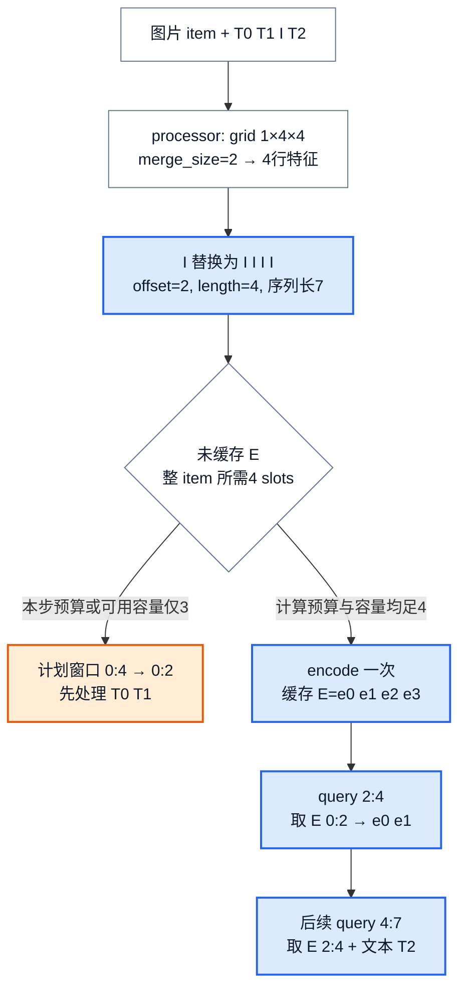
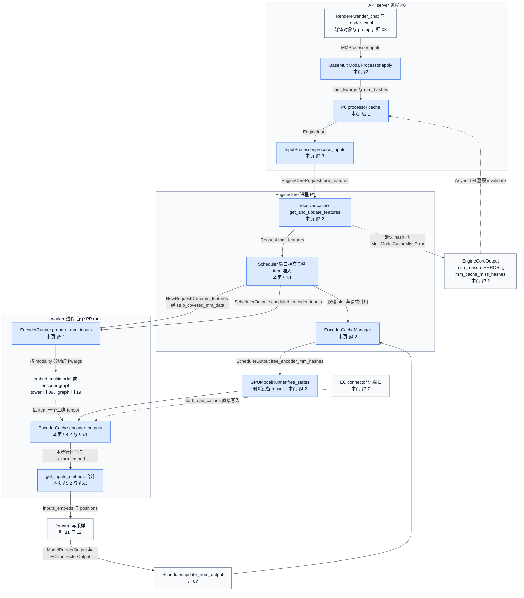
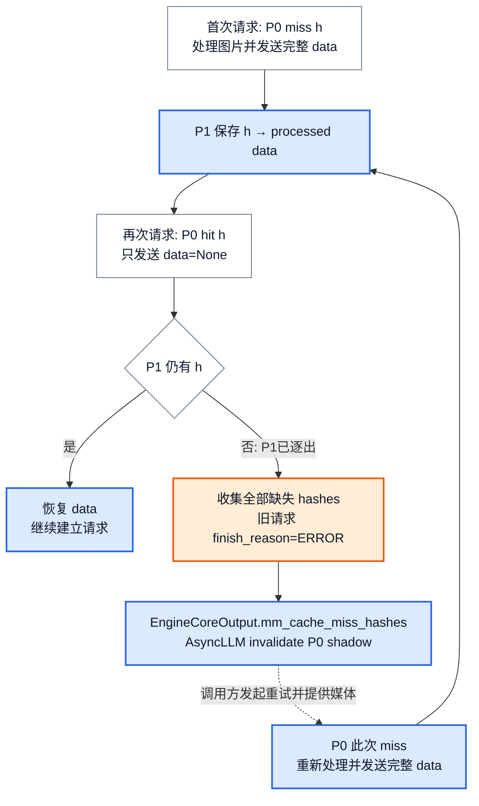
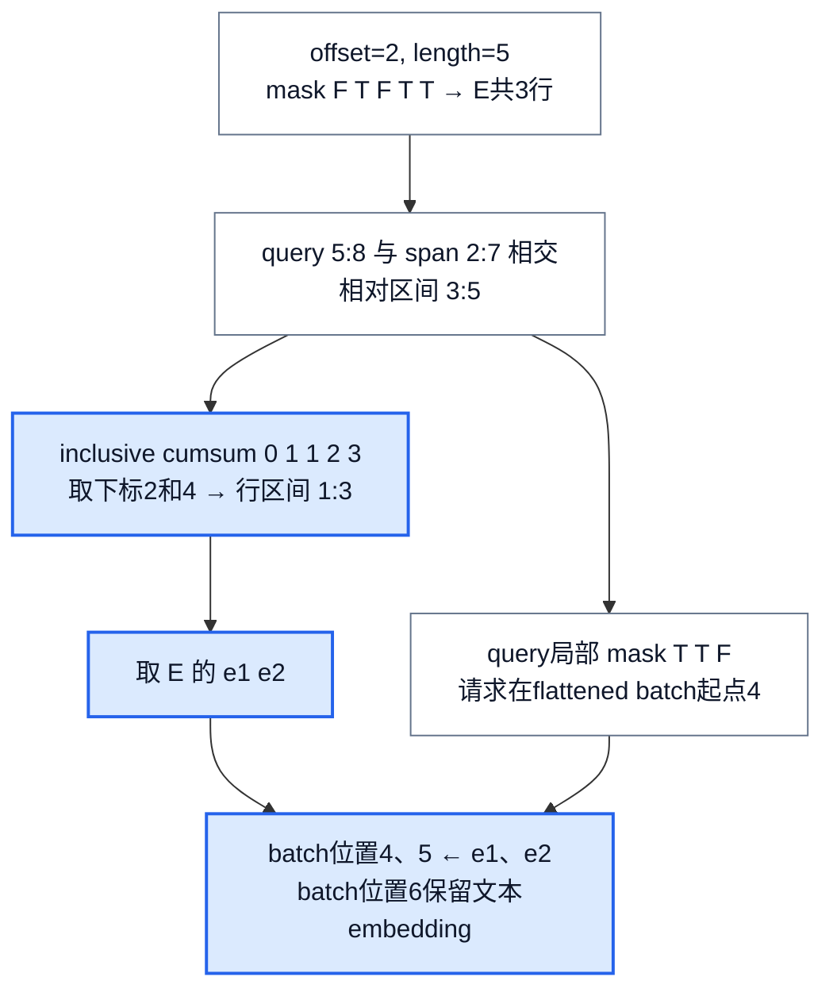
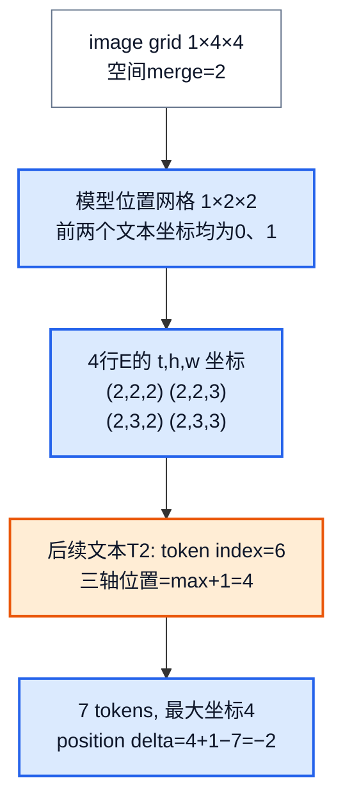
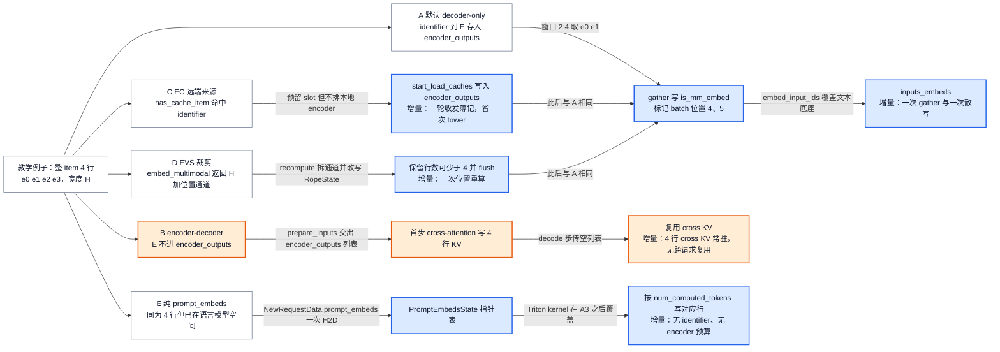

# vLLM 多模态执行：一张图片怎样变成当前 token 的 embedding

> **源码基线**：`vllm-project/vllm@199cb9b964822e59ab9b58d88e7be31eb419a2ae`（`main`，2026-09-07）
> **主题**：用一张图片的占位展开、缓存复用、整 item encoder 准入与分步切片，解释媒体怎样精确替换当前请求的 token embedding，并追踪多模态位置与变体接缝。
> **适用范围**：媒体加载/解析、模型 processor、processor cache、encoder budget/cache、设备侧 encode/gather/merge、多模态位置演算与变体接缝；协议字段归请求语义页，一般调度归 Scheduler 页，KV block hash 算法归 KV 页，模型构造与 embedding 接口接模型库页，具体 VLM 网络内部不在本页展开。
> **最近更新**：2026-09-12。补定位与闭环交接图、核心流程清单、所有权视图、调用树、配置契约与成本账；新增 `strip_covered_mm_data`、`can_allocate` 已提交逐出、抢占预算回补、HF 依赖边界、XD-RoPE、encoder-only 实例、`prompt_embeds` 两条通路、EVS 与四个数据面对照。

## 1. 定位：把媒体字节变成当前 token 窗口的 embedding 行

一次多模态请求里，同一张图片会以三种互不相等的形态出现：用户交来的字节、processor 交给模型的像素特征与网格 metadata、语言模型真正消费的若干行 embedding。这三者之间没有恒等关系，而且每一层都很贵——下载受网络约束，HF processor 是 CPU 密集，视觉塔是 GPU 密集。更麻烦的是**语言模型是分块推进的**：一次 prefill 可能只覆盖图片占位的一部分，但视觉 encoder 通常带双向注意力，不能"先编码半张图"。本页的特性就是把这三种大小对齐起来：**在正确的时刻、按整 item 的粒度算出 embedding，缓存它，再按当前 token 窗口精确切出该窗口需要的那几行，写到 batch 中正确的位置上。** 它的收益是三层缓存都能跨请求复用、大 item 不会把一步撑爆；代价是每步额外的 CPU 索引换算、一份常驻的设备 embedding 缓存，以及一条从前端进程一直延伸到 worker 的跨进程一致性链路。

反过来说，这个特性**不是**下面任何一件事，各自的归属也已明确：

- **不是公开请求/协议表面**。`extra_body={"prompt_embeds": ...}`、chat part 解析、媒体字段的合法取值归 [[03_vllm_request_semantics_analysis|请求语义]]；本页从渲染器交出的 `EngineInput` 开始。
- **不是一般调度器**。队列策略、token/KV 预算、victim 选择、KV 分配失败后的整体回退归 [[07_vllm_scheduler_analysis|Scheduler]]；本页只负责"媒体使得哪段 token 窗口本步不可执行"，以及 encoder 专属的那半份记账。
- **不是 KV block hash 算法**。`identifier` 参与前缀缓存 block hash 这件事本页要点名（§4.1），但 extra key 的组合与 `hash_block_tokens` 归 [[08_vllm_kv_cache_management_analysis|KV Cache 管理]]。
- **不是 VLM 网络内部**。模型注册、构造、权重加载与 `SupportsMultiModal` 接口声明归 [[09_vllm_model_library_analysis|模型库]]；视觉塔与 projector 的层结构不在本页展开。
- **不是 graph capture 的所有者**。`EncoderCudaGraphManager` 与 `EncoderRunner.capture()` 归 [[19_vllm_compilation_cudagraph_analysis|编译与 CUDA Graph]]；本页只说明它在哪个分支接管哪些 modality。
- **不是 ViT attention 后端或量化**。`mm_encoder_attn_backend` 归 [[10_vllm_attention_backends_analysis|Attention 后端]]，`mm_encoder_attn_dtype="fp8"` 与 scale 文件归 [[17_vllm_quantization_analysis|量化]]。
- **不是 encoder 并行机制**。`mm_encoder_tp_mode="data"` 的集合通信与分片归 [[18_vllm_distributed_inference_analysis|分布式推理]]；本页只点名这条轴改变什么、不改变什么（§7.10）。
- **不是设备行布局与输出发布**。稳定行、staged write、采样与结果发布归 [[11_vllm_model_runner_v1_analysis|Model Runner V1]] / [[12_vllm_model_runner_v2_analysis|Model Runner V2]]。

### 1.1 一张图只出现一次，为什么会有三个"大小"

贯穿本页的**教学例子**取 Qwen2-VL 的真实展开规则，但不声称这是某张实测图片的处理结果：HF processor 返回 `image_grid_thw=(1,4,4)`，`merge_size=2`，则视觉占位数为 $1\times4\times4/2^2=4$。简化 token 序列为 `T0,T1,I,T2`，其中 T1/T2 可代表图片周围的 vision-start/end token；本例只跟踪单个 image-pad `I` 的替换，省略聊天模板的其他文本。替换后为 `T0,T1,I,I,I,I,T2`，图片占据零起始半开区间 `[2,6)`，语言模型序列长7。encoder 最终应提供 `E=[e0,e1,e2,e3]`，每行宽度为模型隐藏维度 H（EVS 裁剪模型是这个不变量的唯一例外，见 §7.6）。

这里有两个独立动作：**整张图产生4行 E；当前 token 窗口只取所需的行。** 例如 query `[2,4)` 取 `E[0:2]`，下一窗口 `[4,7)` 取 `E[2:4]`，最后一个位置仍使用 T2 的文本 embedding。chunked prefill 切的是语言模型消费窗口，通常不会把有双向注意力的视觉 encoder 切成"先编码半张图"。依据：`vllm/model_executor/models/qwen2_vl.py::Qwen2VLMultiModalProcessor._get_prompt_updates`、`vllm/v1/core/sched/scheduler.py::Scheduler._try_schedule_encoder_inputs`。

<!-- 图1 spec：从教学图像的processor网格与单占位开始，计算4个替换token与offset=2，再比较预算3导致停在图前、预算4准入整图，最后展示两个query各取E的哪两行。拓扑与数值变换图，不表示物理二维张量布局；蓝色强调展开/切片，橙色标准入失败。 -->


**分析推断**：每次请求都重做下载、processor、encoder，虽能得到同样的输入，却会把三种开销都放回关键路径。vLLM 因而分别复用 URL 字节、processed feature 和 encoder embedding；前两者不能证明第三者有效，例如 tower LoRA 改变后，旧像素处理仍可复用，旧 E 却不再适用。以下先算出占位，再解释两级多模态缓存如何保住这个对应关系。

### 1.2 位置：三个进程之间交接哪些对象

这条链路横跨三个进程，每一跳交接的对象都有名字，而且**六个事实必须分开看**：feature 已建立、逻辑 slot 已分配、设备 E 已可取、本步已合并进 `inputs_embeds`、引用已解除、tensor 已删除。下图边上只写交接对象，节点注明归属页；蓝色是本页负责的环节。

<!-- 图2 spec：跨三进程的闭环位置图。P0 渲染器与 processor 产出 EngineInput，InputProcessor 交出 EngineCoreRequest.mm_features；P1 receiver cache 恢复 data 后交 Scheduler，形成 SchedulerOutput 的 scheduled_encoder_inputs 与 free_encoder_mm_hashes；worker 端 prepare_mm_inputs 到 encoder 到 EncoderCache.encoder_outputs 到 inputs_embeds；虚线为 EC 远端写入与缓存 miss 回传两条非常规边。边只写交接对象，不表示函数调用层级，也不画二维张量布局。 -->


两处容易读错。其一，`SchedulerOutput.free_encoder_mm_hashes` 不是"请求结束"的信号，而是"逻辑 entry 已被逐出、请把设备 tensor 删掉"的信号；请求结束只解除引用（§4.2）。其二，worker 端 `EncoderCache` 只在 `supports_mm_inputs and is_first_pp_rank` 时创建，因此非首 PP rank 既没有 `encoder_outputs`，也拿不到 EC connector（返回 no-op）。依据：`vllm/v1/worker/gpu/model_runner.py::GPUModelRunner.__init__`、`vllm/v1/worker/gpu/ec_connector.py::get_ec_connector`。

### 1.3 核心流程清单

"基础"指普通 decoder-only 多模态生成也会经过；"条件"指启用相应配置或部署形态后才出现。

| 核心流程 | 触发 | 实现入口 | 输出与交接对象 | 下游消费者（归属页） | 本页位置 | 类别 |
|---|---|---|---|---|---|---|
| 媒体加载与解析 | 渲染器拿到 URL/base64/PIL/tensor | `MediaConnector.load_from_url`、`MultiModalDataParser.parse_mm_data` | `MultiModalDataItems` | 模型 processor（本页） | §2.1 | 基础 |
| processor 展开与占位定位 | `Renderer._process_multimodal` | `BaseMultiModalProcessor.apply` | `MultiModalInput`：展开后 token IDs、`mm_kwargs`、`mm_hashes`、`PlaceholderRange` | `InputProcessor`（本页） | §2.2 | 基础 |
| feature 建立与两个 key | `InputProcessor.process_inputs` | `argsort_mm_positions`、`_get_mm_identifier` | `EngineCoreRequest.mm_features` | receiver cache、Scheduler、KV block hash（08） | §2.3 | 基础 |
| processor 两级缓存与漂移恢复 | `mm_processor_cache_gb > 0` | `MultiModalRegistry._get_cache_type` 选出的 sender/receiver 对 | `data=None` 的 feature；或 `mm_cache_miss_hashes` | `Request.from_engine_core_request`；`AsyncLLM._run_output_handler` | §3.1、§3.2 | 条件 |
| 外部已处理 kwargs 注入 | 前端在外部跑完 HF processor | `InputProcessor.inject_into_mm_cache` | 写入 P0 cache 的 item（或 SHM address） | 后续同 hash 请求（本页） | §3.1 | 条件 |
| 整 item 准入与窗口裁剪 | 每次 `Scheduler.schedule` 扫到有 encoder 输入的请求 | `Scheduler._try_schedule_encoder_inputs` | `scheduled_encoder_inputs`、裁剪后的 `num_new_tokens`、`external_load_encoder_input` | 设备 encoder（本页）；token 计划（07） | §4.1 | 基础 |
| 逻辑 slot、引用与逐出通知 | 准入成功、请求结束、抢占、容量不足 | `EncoderCacheManager.allocate` / `check_and_update_cache` / `free_encoder_input` / `can_allocate` / `get_freed_mm_hashes` | `free_encoder_mm_hashes` | `GPUModelRunner.free_states`（本页） | §4.2 | 基础 |
| prefix 覆盖项的 payload 剥离 | 首次下发请求且 `num_computed_tokens > 0` | `NewRequestData.from_request` → `strip_covered_mm_data` | `data=None` 或只留 `keep_on_cpu` 字段的 feature | `prepare_mm_inputs`、`RopeState`、SHM receiver（本页） | §4.2 | 条件 |
| 设备 encoder 执行与发布 | `SchedulerOutput.scheduled_encoder_inputs` 非空 | `ModelState.execute_mm_encoder` → `EncoderRunner.prepare_mm_inputs` / `execute_mm_encoder` | `EncoderCache.encoder_outputs[identifier]` | 本步 gather（本页）；EC producer 的 `save_caches`（本页 §7.7） | §5.1 | 基础 |
| 窗口切片与 embedding 合并 | 每步有非纯 decode 请求 | `EncoderRunner.gather_mm_embeddings` → `get_inputs_embeds` | `mm_embeds` 列表、`is_mm_embed` mask、`inputs_embeds` | forward（11、12） | §5.2、§5.3 | 基础 |
| 多模态位置演算 | 模型声明 M-RoPE 或 XD-RoPE；PrefixLM；EVS | `get_rope_state`、`RopeState.init_prefill_positions` / `prepare_positions`、`compute_mm_prefix_ranges` | `positions` 张量；attention 的 `mm_req_doc_ranges` | forward（12）；attention metadata（10） | §6 | 条件 |
| 释放与失效 | finish、preempt、逐出、`reset_prefix_cache` | `GPUModelRunner._remove_request`、`free_states`、`Scheduler._free_request` | 删除 `req_id → mm_features`、删除 `identifier → E` | 下一步的 gather（本页） | §4.2 | 基础 |
| 启动 profiling 与预算定型 | `EngineCore` 初始化 KV 前的 `profile_run` | `MultiModalBudget`、`compute_mm_encoder_budget`、`get_dummy_encoder_profile_inputs`、`EncoderRunner.profile_encoder_cache` | `encoder_compute_budget`、`encoder_cache_size`；显存峰值计入测量 | Scheduler 构造与 KV 预算（07、08、12） | §4.1、§9.1 | 基础 |
| 权重更新后的 reset | 在线权重更新或调试接口 | `EngineCore.reset_encoder_cache` → `Scheduler.reset_encoder_cache` + runner `reset_encoder_cache` | 清空 `EncoderCacheManager` 状态与 `encoder_outputs` | 后续请求重算 E（本页） | §4.2 | 条件 |
| EC transfer 与 encoder-only 发布 | 配置 `ec_transfer_config` | `get_ec_connector`、`ActiveECConnector.maybe_get_output`、`MMEncoderModelRunner.execute_model` | `ECConnectorOutput`；远端写入的 `encoder_outputs`；`ec_transfer_params` | `Scheduler.update_from_output`（07）；consumer 实例（本页） | §7.7、§7.8 | 条件 |
| encoder 观测统计 | `enable_mm_processor_stats` | `Scheduler._make_scheduled_encoder_input_stats`、`EncoderRunner.timed_encoder_operation` | `SchedulerOutput.scheduled_encoder_input_stats`；`encoder_forward_secs` / `num_encoder_calls` | 指标链路（23） | §9.1 | 条件 |

### 1.4 谁持有状态

跨三个进程共有十一个带状态的所有者，它们的失效条件互不相同——这正是"P0 说有、接收端却没有"和"逻辑容量够、设备 tensor 已被删"两类问题的根源。

| 对象 | 所在进程与生命周期 | 持有什么状态 | 不负责什么 |
|---|---|---|---|
| `MultiModalProcessorOnlyCache` | P0，进程内 | `mm_hash → (item, prompt_updates)`，仅省预处理 | 不减少 IPC payload |
| `MultiModalProcessorSenderCache` | P0，进程内 | `mm_hash → metadata shadow + prompt_updates` | 不持有 tensor；不能证明 P1 还有 |
| `ShmObjectStoreSenderCache` | P0（唯一写者） | 共享内存对象仓 + `_p0_cache` 的 prompt_updates | 不管 worker 何时读完；超限对象不入仓 |
| `MultiModalReceiverCache` | P1 EngineCore，`lru` 时建立 | `mm_hash → 完整 MultiModalKwargsItem` | 不知道 P0 shadow 里还有什么 |
| `ShmObjectStoreReceiverCache` | worker，`shm` 时建立 | 按 address + monotonic id 读对象、维护 reader count | 不写对象仓 |
| `Request.mm_features` | P1 Scheduler，请求存活期 | 该请求全部 item 的 `data` / `identifier` / `mm_hash` / `mm_position` | 不持有 E；下发时经 `strip_covered_mm_data` 剥离 payload |
| `EncoderCacheManager` | P1 Scheduler | `identifier → 引用请求集`、`request_cached_ids`、`freeable`、`freed`、`num_free_slots` / `num_freeable_slots` | 不分配 GPU 内存；不知道 tensor 是否真的还在 |
| `EncoderDecoderCacheManager` | P1 Scheduler（enc-dec） | 仅 `num_free_slots`、`allocated`、`to_free` | 不做跨请求复用；`check_and_update_cache` 恒为 False |
| `EncoderCache` | worker 首 PP rank | `req_id → mm_features` 与 `identifier → E` 两张表 | 不做容量决策；不知道谁还在引用 |
| `RopeState` | worker（M-RoPE / XD-RoPE 模型） | UVA 上的 `prefill_positions`、设备 `positions`、`prefill_delta` | 不定义坐标规则，由模型接口给出 |
| `PromptEmbedsState` | worker（`enable_prompt_embeds`） | `req_id → (embeds, mask)` 与三张 UVA 指针/长度表 | 不进 encoder 缓存、不占 encoder 预算 |
| `ActiveECConnector` | worker 首 PP rank | 本轮绑定的 connector metadata、进入时的 `encoder_outputs` 键集快照 | 不保证网络操作已完成；不替 gather 兜底 |
| `MultiModalPruner` | worker（EVS） | 无长期状态，改写 `RopeState` 的 staged 位置 | 不改变 encoder 缓存键 |

### 1.5 调用树：从渲染到 inputs_embeds

缩进表示 caller → callee；方括号是条件分支或执行边界注记；纯转发已折叠。三段之间由对象交接而非函数调用相连，故分列。

```text
Renderer.render_chat / render_cmpl                          [P0，归 03]
`-- Renderer._process_multimodal
    +-- BaseProcessingInfo.parse_mm_data                    [MultiModalDataParser，本页 §2.1]
    `-- BaseMultiModalProcessor.apply
        +-- _postprocess_prompt
        +-- _cached_apply_hf_processor
        |   +-- [cache is None 或 passthrough_data] _apply_hf_processor   [整体处理，不查缓存]
        |   +-- ProcessorInputs.get_mm_hashes               [h = model id + item + 相关参数]
        |   +-- _get_cache_missing_items                    [P0 命中则清空 data；全 miss 且无 data 则报错]
        |   +-- _apply_hf_processor_main
        |   |   +-- _get_hf_processor_text                  [模型决定交给 HF 的文本]
        |   |   `-- MultiModalProcessingContext.call_hf_processor
        |   |       `-- transformers.ProcessorMixin.__call__          [依赖边界，本页 §2.2]
        |   +-- MultiModalKwargsItems.from_hf_inputs        [按 _get_mm_fields_config 切成 item]
        |   `-- _merge_mm_kwargs                            [先 touch 全部 h，再合并写回]
        `-- _maybe_apply_prompt_updates
            +-- _validate_mm_kwargs / _validate_mm_updates  [只比 item 数]
            +-- _apply_prompt_updates                       [I → I I I I，新序列上记 offset=2]
            `-- _validate_mm_placeholders
InputProcessor.process_inputs(EngineInput, params)          [P0]
+-- _validate_model_inputs -> _validate_model_input         [单 item get_num_embeds ≤ encoder cache size；OOV token 上界]
+-- argsort_mm_positions                                    [按 offset 排序，后续 bisect 的前提]
`-- _get_mm_identifier                                      [identifier = h 或 lora_name:h]
    => EngineCoreRequest.mm_features
EngineCoreProc.run_busy_loop [ADD]                          [P1]
`-- EngineCoreProc.preprocess_add_request
    +-- BaseMultiModalReceiverCache.get_and_update_features  [先 touch 全部，再逐项恢复]
    |   `-- [有缺失] MultiModalCacheMissError -> _handle_mm_cache_miss   [旧请求 ERROR 完成]
    `-- Request.from_engine_core_request                     [同时算 block hash，extra key 含 identifier]
Scheduler.schedule                                          [P1]
+-- Scheduler._try_schedule_encoder_inputs
|   +-- get_mm_features_in_window                            [bisect 求相交区间]
|   +-- EncoderCacheManager.check_and_update_cache           [命中则加引用并退出 freeable]
|   +-- [disable_chunked_mm_input 且 num_computed_tokens < start_pos] 回退到媒体之前
|   +-- EncoderCacheManager.can_allocate                     [先查预算与容量；此处已提交逐出]
|   +-- PlaceholderRange.get_embeds_indices_in_range         [空 mask 窗口跳过该 item]
|   `-- [ec_connector.has_cache_item] 入 external_load 集合，不扣计算预算
+-- EncoderCacheManager.allocate                             [逻辑 slot 记账]
+-- [PRIORITY 抢占 victim] scheduled_encoder_inputs.pop + encoder_compute_budget 回补
+-- EncoderCacheManager.get_freed_mm_hashes                  [同轮重分配的 hash 不上报]
`-- NewRequestData.from_request
    `-- strip_covered_mm_data                                [prefix 全覆盖项丢 data]
    => SchedulerOutput.scheduled_encoder_inputs / free_encoder_mm_hashes / ec_connector_metadata
GPUModelRunner.execute_model                                 [worker；MRV2]
+-- finish_requests -> _remove_request -> EncoderCache.remove_request
+-- free_states -> EncoderCache.free_encoder_cache           [按 free_encoder_mm_hashes 删 tensor]
+-- add_requests -> EncoderCache.add_request                 [req_id → mm_features]
+-- ec_connector.maybe_get_output                            [consumer: start_load_caches；producer: 出口 save_caches]
+-- DefaultModelState.prepare_inputs_embeds
|   +-- ModelState.execute_mm_encoder
|   |   +-- EncoderRunner.prepare_mm_inputs                  [跳过 data=None 与已缓存；prompt_embeds 直接入缓存]
|   |   +-- EncoderRunner.execute_mm_encoder
|   |   |   +-- group_and_batch_mm_kwargs                    [连续同 modality 且字段兼容才同批]
|   |   |   +-- [已 capture 且支持该 modality] EncoderCudaGraphManager.execute      [归 19]
|   |   |   +-- [否则] SupportsMultiModal.embed_multimodal                          [tower，归 09]
|   |   |   `-- sanity_check_mm_encoder_outputs              [只查条数与二维]
|   |   `-- EncoderCache.encoder_outputs.update(zip(identifiers, outputs))
|   +-- EncoderRunner.gather_mm_embeddings                   [窗口 → 行区间 → is_mm_embed]
|   +-- [EVS] MultiModalPruner.recompute -> RopeState.update_prefill_positions -> apply_staged_writes
|   +-- EncoderRunner.get_inputs_embeds
|   |   `-- SupportsMultiModal.embed_input_ids -> _merge_multimodal_embeddings
|   `-- [enable_prompt_embeds] PromptEmbedsState.apply       [Triton kernel 覆盖对应行]
`-- DefaultModelState.prepare_inputs -> RopeState.prepare_positions
    => inputs_embeds 与 positions 进入 forward（归 12）
```

## 2. 从媒体到展开后的 prompt

### 2.1 加载完成，只意味着 processor 可以读它

`MediaConnector` 处理 HTTP、base64 data URL 和显式允许根目录下的 file URL。HTTP 路径检查允许域名并限制最大字节数；file 路径须 resolve 到允许根目录的子路径；不支持的 scheme、非 base64 data 编码及未获允许的路径在这里失败。可选下载缓存以 URL 的 SHA-256 前20个十六进制字符加扩展名寻址，并受容量/TTL 控制；它缓存字节，不以模型或内容变化寻址。相同 URL 并不是相同 processor 输出的证明。依据：`vllm/multimodal/media/connector.py::MediaConnector.load_from_url`、`MediaConnector._media_cache_path`、`MediaConnector._load_data_url`、`MediaConnector._load_file_url`。

`MultiModalDataParser` 再把 PIL、NumPy、Tensor 等对象整理成模型 processor 可接受的 item。image 规范化为 RGB；audio 可按输入采样率重采样并调整声道；video 保留帧与 metadata，模型声明需要 metadata 而调用方未提供时会报错。**parser**（不是 registry）的 `_get_subparsers()` 当前只声明 `audio` / `image` / `video` / `vision_chunk` 四种 modality，`parse_mm_data` 对表外 key 直接抛 `ValueError`。图片 embedding 与像素图片也走不同 item 类，不能仅凭"都是 Tensor"判定要不要运行 tower。渲染器另行注入的 `prompt_embeds` modality **不在这张表里**（§7.4）。依据：`vllm/multimodal/parse.py::MultiModalDataParser._get_subparsers`、`parse_mm_data`、`_parse_image_data`、`_parse_audio_data`、`_parse_video_data`、`is_embeddings`。

### 2.2 processor 同时产出 tensor 参数和 token 更新规则

对例图，模型专用 processor 把规范化图片交给 HF processor，得到像素字段以及 `image_grid_thw`。HF 调用使用什么文本由模型 processor 决定：`_apply_hf_processor_main()` 先用 `_get_hf_processor_text()` 构造模型要求的辅助文本，并把不需要 HF 处理的 passthrough 数据并回结果；没有任何需要 HF 处理的数据时，它连 HF processor 都不调，直接用 passthrough 数据构造 `BatchFeature`。因此不能假设 HF 总在处理完整用户 prompt。

**依赖边界：HF processor 的特征尺寸规则由 transformers 负责，vLLM 不证明它。** 跨界点是 `BaseProcessingInfo.get_hf_processor()` 取得的 `transformers.ProcessorMixin`，由 `MultiModalProcessingContext.call_hf_processor()` 调用；交过去的是 `{text?, **processor_data}` 加一组经 `get_allowed_kwarg_only_overrides()` 过滤后该 processor 真正接受的 kwargs（默认补 `truncation=False` 与 `return_tensors="pt"`），返回的是一个 `BatchFeature`，再由 `MultiModalKwargsItems.from_hf_inputs()` 按模型自己的 `_get_mm_fields_config()` 切成 per-item 的字段。**vLLM 能证明的**只有四件事：交过去的是哪段文本、强加了什么字段布局、占位数是从返回的 `*_grid_thw` 重新推导的（`num_tokens = int(grid_thw.prod()) // merge_size**2`），以及三条 item 数相等的断言。**它不能证明**的是 HF 内部的特征尺寸规则、patch/merge 算术与重采样；那些只能按依赖方发布的契约看待，本页不把它们叙述成读过的执行。这条路径上没有任何 transformers 版本门（`vllm/multimodal/` 内无版本检查），因此版本漂移不会在此报错，只会表现为占位数与实际行数不一致——而那一致性由下面的合并阶段而不是这里保证。若 HF processor 返回的不是 `BatchFeature`，只 warning 不报错。依据：`vllm/multimodal/processing/context.py::MultiModalProcessingContext.get_hf_processor`、`call_hf_processor`、`_postprocess_output`、`vllm/multimodal/processing/processor.py::BaseMultiModalProcessor._apply_hf_processor_main`、`_apply_hf_processor`。

Qwen2-VL 从 tokenizer 的 image/video token 对应 ID 建立匹配目标，用网格乘积除以 `merge_size**2` 得到重复次数。本例不是把 `I` 的 ID 加4，也不是扩大词表；它把**同一个 ID 重复4次**。通用更新器（模块级函数 `_apply_token_matches_with_placeholders`，与 `BaseMultiModalProcessor` 上的同名方法是两个不同符号）按 match 位置复制原文本、插入 replacement，再以插入时的新序列长度记录 offset。因此后续媒体的 offset 必须在展开后的序列上重新形成，不能继续用原 prompt 的位置。依据：`vllm/multimodal/processing/processor.py::_apply_token_matches_with_placeholders`、`vllm/model_executor/models/qwen2_vl.py::Qwen2VLMultiModalProcessor._get_prompt_updates`。

processor 最后返回展开后的 token IDs、processed kwargs、hashes 和 `PlaceholderRange`。`_validate_mm_kwargs()`、`_validate_mm_updates()`、`_validate_mm_placeholders()` 三条检查由 `_maybe_apply_prompt_updates()`（而非 `apply()` 本身）调用，前两条在应用更新之前、第三条在之后；它们只比较各 modality 的 item 数是否一致，能及早发现少图片、少更新或少占位，**不是完整 encoder 输出形状证明**。实际 encoder item 数、二维 rank 以及最终待替换位置数还要在设备合并阶段检查。依据：`vllm/multimodal/processing/processor.py::BaseMultiModalProcessor._maybe_apply_prompt_updates` 及上述三个 validation 方法。

### 2.3 为什么同一张图有两个 key

`ProcessorInputs.get_mm_hashes()` 当前默认把 model id、modality item 与影响处理结果的参数纳入 hash。参数包括媒体加载参数 `media_io_kwargs` 和 HF processor 参数：image/video/audio 分别只取自己的媒体参数、对应 `images_kwargs`/`videos_kwargs`/`audio_kwargs` 及共享平铺参数，避免"只改视频采样配置却让图片失效"。统一 `vision_chunk` 缺少每项来源标签，因此保留全部参数。

提供 UUID 时有一个明确边界：**没有相关参数因子时直接使用 UUID**；有因子时将 UUID 作为媒体身份与 model id、参数重新哈希。直接 UUID 路径不是内容校验，也不会再次把 model id 拼进去；调用方必须保证这个标识真能代表想复用的媒体。若只提供 UUID/空数据且缓存已 miss，processor 无法重建图片，会抛出 data 未提供的错误。依据：`vllm/multimodal/processing/inputs.py::ProcessorInputs.get_mm_hashes`、`vllm/multimodal/processing/processor.py::BaseMultiModalProcessor._get_cache_missing_items`。

`InputProcessor.process_inputs()` 把处理结果展开为按 placeholder offset 排序的 `MultiModalFeatureSpec` 列表——排序由 `argsort_mm_positions()` 完成，这个"按 offset 升序"不变量是后面所有 `bisect` 窗口查询和 block hash 遍历的前提。例图形成一个 image feature，其 `mm_position=(2,4)`；下面五个字段共同解释"如何复用"和"放在哪里"。

| 字段 | 本例及消费者 | 不能混淆的语义 |
|---|---|---|
| `data` | processed 像素字段与 grid metadata | 可能为 None，有两个成因：IPC 缓存命中（可恢复）与 prefix 覆盖后剥离（不恢复，见 §4.2）；不是原始 URL |
| `modality` | image；设备侧据此与字段兼容性分组 | 标签不能替代模型支持检查 |
| `mm_hash` | 记作 h；processor 接收缓存以此查找 | 不含 tower LoRA 前缀 |
| `identifier` | 普通为 h；满足 tower/connector LoRA 条件时为 `lora_name:h` | Scheduler、设备 E 缓存**以及 KV block hash** 使用这个 key（§4.1） |
| `mm_position` | offset=2、length=4、is_embed=None | 指定展开序列位置；可选 mask 会让 span 长度不同于 E 行数 |

只有存在 LoRA request、LoRA config 且开启 tower/connector LoRA 时，`_get_mm_identifier()` 才加入 LoRA name；普通语言侧 LoRA 不自动改变这一规则。receiver 用 `mm_hash or identifier` 恢复 processed data，以兼容未单独给出 mm_hash 的 feature。依据：`vllm/v1/engine/input_processor.py::InputProcessor.process_inputs`、`InputProcessor._get_mm_identifier`、`vllm/multimodal/utils.py::argsort_mm_positions`、`vllm/multimodal/inputs.py::MultiModalFeatureSpec`、`vllm/multimodal/cache.py::BaseMultiModalReceiverCache.get_and_update_features`。

## 3. P0 说"有"，接收端却没有时怎么办

### 3.1 正常命中省掉哪一段工作

processor 按 item 缓存，而不是缓存整个 prompt。假设一个请求含图片 A、B，只有 B miss：先只处理 B，再按原 modality/index 把 A 的缓存结果和 B 的新结果合并；缓存的 prompt update 也恢复为本请求 item index，之后才应用到 prompt。合并前会 touch 全部 hash，避免更新列表前部时把后部仍需命中的项逐出。一条容易漏掉的短路：**只要本请求存在 passthrough 数据，`_cached_apply_hf_processor()` 就整体绕过 item 缓存**，直接走 `_apply_hf_processor()`；因此"没走缓存"不止"容量≤0 或非多模态"这两种成因。依据：`vllm/multimodal/processing/processor.py::BaseMultiModalProcessor._cached_apply_hf_processor`、`_get_cache_missing_items`、`_merge_mm_kwargs`。

配置决定 P0（processor 所在进程）之后是否还有接收缓存：

| 配置/拓扑 | 保存什么、传什么 | 命中收益与边界 |
|---|---|---|
| 非多模态或 `mm_processor_cache_gb <= 0` | 不启用 processor cache | 不获得此层复用 |
| 多 API process，或不满足 IPC 条件的 DP | `MultiModalProcessorOnlyCache`：P0-only 保存完整 kwargs 与 prompt update，仍发送完整 data | 省 preprocessing，不省该 payload 的 IPC |
| 可用 IPC + `mm_processor_cache_type="lru"` | `MultiModalProcessorSenderCache` 保存 metadata shadow/prompt update；EngineCore 侧 `MultiModalReceiverCache` 保存完整 kwargs | P0 hit 发送 `data=None`，P1 按 h 恢复 |
| 可用 IPC + `mm_processor_cache_type="shm"` | `ShmObjectStoreSenderCache` 写对象仓；worker 侧 `ShmObjectStoreReceiverCache` 读取 | 发送 address 与 monotonic id 引用；后者区分地址复用后的对象 |

IPC 条件是 `_api_process_count == 1`，且 `data_parallel_size == 1` 或启用 `data_parallel_external_lb`。Engine 只为 `lru` 建 receiver；worker 只为 `shm` 建 receiver。

这里有两个独立的轴，**不要合成一个**：`mm_processor_cache_type`（`lru`/`shm`）决定**谁保存 processed item**；`mm_tensor_ipc`（`direct_rpc`/`torch_shm`）决定**未命中时 tensor 怎么过进程**——`direct_rpc` 走 msgspec 序列化，`torch_shm` 走 `torch.multiprocessing` 队列（`TensorIpcSender`），后者还使 processor 的输出能留在设备上不回拷主机。`torch_shm` 要求 `world_size_across_dp == 1`，并要求 `VLLM_WORKER_MULTIPROC_METHOD=spawn`，否则配置期报错。容量的度量规则由 `MultiModalCache.get_item_size()` 定义：tensor 按 `nbytes`、其余叶子按 `sys.getsizeof` 求和，LRU 的 `maxsize` 是 `mm_processor_cache_gb` 折算的字节数；SHM 的单对象上限另由 `mm_shm_cache_max_object_size_mb` 控制。它和后面的 encoder embedding slots 是两种资源。

还有第三个入口：前端若已在外部跑完 HF processor，可调 `InputProcessor.inject_into_mm_cache()` 用空 prompt-update 列表把结果塞进 P0 cache（SHM 下返回 address），使命中率统计正确并省掉后续同 hash 请求的重复处理；这个入口把异常整体 warning 吞掉，失败不影响请求。依据：`vllm/multimodal/registry.py::MultiModalRegistry._get_cache_type`、`processor_cache_from_config`、`receiver_cache_from_config`、`vllm/multimodal/cache.py::MultiModalCache.get_item_size`、`MultiModalProcessorOnlyCache`、`MultiModalProcessorSenderCache`、`ShmObjectStoreSenderCache`、`ShmObjectStoreReceiverCache`、`vllm/v1/engine/input_processor.py::InputProcessor.inject_into_mm_cache`、`vllm/v1/engine/core_client.py` 与 `vllm/v1/engine/utils.py` 的 tensor queue 构造、`vllm/config/model.py::ModelConfig` 对 `torch_shm` 的并行度校验。

### 3.2 miss 恢复结束旧请求，再由调用方重试

以 lru 和例图 h 为例：首次 P0 miss，发送完整 processed data，P1 缓存；再次 P0/P1 都 hit，发送 None 即可恢复。如果 P1 已逐出 h 而 P0 shadow 仍保留 h，P1 收到 None 无法恢复。这是两份缓存的漂移，不能据 P0 hit 推断接收端一定有 tensor。

<!-- 图3 spec：同一hash h先填充再命中；独立逐出P1后展示None无法恢复，旧请求以ERROR结束、携带缺失hash回前端并清除shadow；调用方发起的重试是独立箭头，重新提供媒体后P0发送完整data。橙色强调失败和旧请求完成，禁止画后台自动重执行。 -->


真实控制路径是 receiver 汇总本请求**全部缺失 hash**，抛 `MultiModalCacheMissError`；`EngineCoreProc` 在 ADD 分支的 `preprocess_add_request()` 外侧捕获，向原 client index 送出 `EngineCoreOutput`，其中 `new_token_ids=[]`、`finish_reason=ERROR`、`mm_cache_miss_hashes` 为缺失列表，并报告请求 finished。这个请求没有进入正常调度执行。`AsyncLLM._run_output_handler()` 处理回传时逐项 invalidate P0，保证调用方下一次带媒体重试时发送完整数据。**这里没有后台自动重执行原请求，也没有从 None 自动复原图片。** 还要注意 `mm_cache_miss_hashes` 在 `vllm/` 里**只有 `AsyncLLM._run_output_handler()` 一个消费者**，所以"调用方重试即可恢复"是 AsyncLLM 路径的保证，同步 `LLMEngine` 路径不清 shadow。依据：`vllm/multimodal/cache.py::BaseMultiModalReceiverCache.get_and_update_features`、`vllm/v1/engine/core.py::EngineCoreProc._handle_mm_cache_miss`、`vllm/v1/engine/async_llm.py::AsyncLLM._run_output_handler`。

恢复也不是接收缓存的全请求回滚：一次请求里能恢复或带 data 的项仍可被插入，最后一起报告其余缺失项。单 item 超出 LRU 容量时则选择不插入、照常传递和服务，后续可能重复 preprocessing；SHM 的 oversize、保护中的 store 满等路径也可退回传递原 data，不能把每个缓存失败都等同于上述 lru shadow 漂移协议。依据：`vllm/multimodal/cache.py::BaseMultiModalCache.cache_if_fits`、`MultiModalReceiverCache.get_and_update_item`、`ShmObjectStoreSenderCache.get_and_update_item`；`tests/multimodal/test_cache.py::test_mm_cache_miss_batches_all_drifted_hashes`、`test_oversized_item_is_served_uncached`。

## 4. 只有碰到图片的 token 窗口，才需要 encoder

### 4.1 准入按整 item 的 embedding 行数计

启动时 `MultiModalBudget` 先询问模型 processor 每种 modality 单 item 最大输出量；模型没有直接提供时，利用 dummy input 的 placeholder `get_num_embeds()` 求和。tower modality 与 embedding-only modality 分开：后者可由 `enable_mm_embeds` 配合该 modality 原始输入 limit=0 启用，省 tower profiling/执行，但仍需要缓存空间。共享 placeholder 的 modality 会从独立容量项中过滤，避免把 audio-in-video 一概当作两套独立 span。

compute budget 与 encoder cache size 均至少提升到最大单 item 的 embedding 行数（`max(max_num_encoder_input_tokens, max_tokens_per_mm_item)` 与 `max(encoder_cache_size, max_tokens_per_mm_item)`）；禁用 chunked MM 而最大单 item 超过 `max_num_batched_tokens` 时，`compute_mm_encoder_budget()` 直接抛 `ValueError`，启动失败。输入侧还会拒绝 `get_num_embeds()` 超过预分配 encoder cache size 的单 item。源码一些变量/docstring 称之为 tokens，但实际扣减调用 `get_num_embeds()`，不计 span 中夹杂的 break/text token。因此这里用 **embedding slot** 表述这个代理成本，它不是媒体字节数，也不是实际 tower FLOPs。依据：`vllm/multimodal/encoder_budget.py::MultiModalBudget`、`get_mm_max_toks_per_item`、`vllm/v1/core/encoder_cache_manager.py::compute_mm_encoder_budget`、`vllm/v1/engine/input_processor.py::InputProcessor._validate_model_input`。

Scheduler 对本步窗口和 feature 区间做相交查询（`get_mm_features_in_window()` 的 `bisect`），再按以下规则处理：

1. 普通 decoder-only 路径同一 `identifier` 本步只安排一次；`EncoderCacheManager.check_and_update_cache()` 命中时加本请求引用、把 hash 从 `freeable` 取回并跳过计算。
2. 未命中时，`can_allocate()` 检查整 item 的 compute budget 和 cache capacity，包括本请求刚预留的其他 item。例图需要4 slots，即使本步只触及2个 I，也不能只预留2。
3. 不足时裁到图片起点：从 `[0,4)` 退到 `[0,2)`。若 prefix cache 使 computed 位置已经越过起点，图片却无 E 可用，本步只能排0 token。
4. 有空间后再把相交 token 区间转换为 embedding 行区间；稀疏 span 若本窗口没有真正的 embedding 行，可跳过 encoder。当前代码的容量检查在这一步之前，不应改述成"先排除所有空 mask，再检查预算"。
5. 本地计算项进入 `scheduled_encoder_inputs`，随后 `EncoderCacheManager.allocate()` 扣减整 item 预算并分配逻辑 cache entry；外部 E 命中走 §7.7 的 EC 分支。

`disable_chunked_mm_input` 还会把从媒体前方进入、却不能覆盖完整 span 的计划退到媒体之前；具体判断要求 `num_computed_tokens < start_pos`，不是无条件重写一切已经进入 span 的窗口。EAGLE 等路径的 `shift_computed_tokens` 也参与查询和回退，以免多看一个位置却没有 E。依据：`vllm/v1/core/sched/scheduler.py::Scheduler._try_schedule_encoder_inputs`、`Scheduler.schedule`、`vllm/multimodal/utils.py::get_mm_features_in_window`。

**`identifier` 还是 KV 前缀缓存 block hash 的 extra key。** `_gen_mm_extra_hash_keys()` 对每个与块相交的 item 追加 `(mm_feature.identifier, offset - start_token_idx)`（并断言 `identifier` 非 None、假定 features 已按 offset 排序），`generate_block_hash_extra_keys()` 再与 LoRA、cache salt、prompt-embeds 摘要拼成 block hash 的 extra key。两个后果：tower/connector LoRA 前缀不只隔离 E，也顺带隔离了**KV block**；而上面规则3那种"占位 token 已被 prefix 命中、E 却没了"的情形正是因为 KV 与 E 是两套独立生命周期。组合算法归 [[08_vllm_kv_cache_management_analysis|KV Cache 管理]]，本页只点名这个交接。依据：`vllm/v1/core/kv_cache_utils.py::_gen_mm_extra_hash_keys`、`generate_block_hash_extra_keys`。

### 4.2 逻辑容量不等于 tensor 已经存在

Scheduler 的 `EncoderCacheManager` 持有 `identifier → request 引用集`、每请求的 cached item IDs 与可回收 LRU；`can_allocate()` 不分配 GPU 内存。准入写入计划后，首个 PP rank 才运行 encoder，并把 `identifier → E` 放入设备 `EncoderCache`。因此"feature 已建立""逻辑4 slots 已分配""设备 E 已可取"是三个先后成立的事实。

一个请求结束使用图片，只会解除引用；最后一个引用消失后，entry 进入 freeable，仍可能供后续请求复用。有新 allocation 需要容量时才逐出 freeable entry，把 identifier 通过 `free_encoder_mm_hashes` 通知 runner 删除 tensor。新基线还保证两点：同一请求重复出现同一图片，直到最后一个 occurrence 释放才解除 request 引用；同轮逐出后又重新分配的 identifier 不得再出现在释放通知里。依据：`vllm/v1/core/encoder_cache_manager.py::EncoderCacheManager.free_encoder_input`、`can_allocate`、`allocate`、`get_freed_mm_hashes`、`reset`；`vllm/v1/worker/gpu/mm/encoder_cache.py::EncoderCache`。

**上面的三级阶梯之间还夹着第四个事实：逐出已经提交，而它不随后续失败回滚。** `can_allocate()` 在容量检查内部就做逐出——`freeable.popitem(last=False)`、`del self.cached[mm_hash]`、`self.freed.append(mm_hash)`，源码注释明说"物理内存直到 scheduler output 通知 runner 才释放"。真正的 `allocate()` 发生在更晚，只有 `allocate_slots()` 成功后才执行。于是存在这样一条路径：为请求 X 的 item 腾地方而逐出了受害 hash，随后 X 的 KV 分配失败、X 本步未被调度，可被逐出的那些 hash 仍会经 `get_freed_mm_hashes()` → `free_encoder_mm_hashes` → `GPUModelRunner.free_states()` 被真的删掉；`get_freed_mm_hashes()` 只过滤**同一轮里又被重新分配**的 hash，不过滤"为之腾地方的请求最终没排上"。这是一个**已提交的部分副作用，没有回滚**。

抢占则确实有一次撤回，但只在 PRIORITY 策略下、且只撤回计算预算：`Scheduler.schedule()` 里 `allocate_slots()` 失败而选中 victim 时，会 `scheduled_encoder_inputs.pop(preempted_req_id, None)`，并把 `sum(preempted_req.get_num_encoder_embeds(i))` 加回 `encoder_compute_budget`，与 token/input 预算和 `req_to_new_blocks` 的恢复同批进行。`_preempt_request()` 随后调 `encoder_cache_manager.free(request)` 解除该请求的全部引用。**不对称之处值得记住**：计算预算被回补，同一轮里 `can_allocate()` 已经做过的逐出不会撤销。一般 victim 选择与 KV 失败后的整体回退归 [[07_vllm_scheduler_analysis|Scheduler]]。依据：`vllm/v1/core/sched/scheduler.py::Scheduler.schedule`、`Scheduler._preempt_request`。

**prefix 覆盖还会在下发边界上第二次制造 `data=None`。** `NewRequestData.from_request()` 调 `strip_covered_mm_data(request.mm_features, request.num_computed_tokens, uses_mrope=..., uses_xdrope=...)`：凡 span 完全落在已计算前缀内（`offset + length <= num_computed_tokens`）的 item，其 `data` 被丢掉——注释给出的理由是"不可能再为它们安排 encoder 运行"，worker 永远不会消费这份 payload。三种情况被保留：M-RoPE / XD-RoPE 模型只留下 `field.keep_on_cpu` 的字段（位置仍要靠 grid 算，`tests/v1/core/test_output.py::test_strip_covered_mm_data_mrope` 与 `test_strip_covered_mm_data_xdrope` 固定了"只剩 `image_grid_thw`"这一结果，后者的注释说明曾因剥掉 grid 而让第二个相同 prompt 的请求崩溃）；带 `"address"` 的 SHM item 保留，以便 worker 平衡 sender 的引用计数（`ShmObjectStoreReceiverCache.get_and_update_features()` 因此把 `data is None` 当作"已剥离、无需确认"）；跨到未计算区域的 item 完整保留。Scheduler 侧的 `Request` 保有完整 feature，被剥离的只是下发副本。**两个成因必须分开**：IPC 命中的 None 由接收缓存恢复，剥离的 None 永不恢复——读到 `prepare_mm_inputs()` 里 `if mm_feature.data is None: continue` 时不能一律理解为"可恢复的缓存命中"。依据：`vllm/v1/core/sched/output.py::NewRequestData.from_request`、`vllm/multimodal/utils.py::strip_covered_mm_data`、`vllm/multimodal/cache.py::ShmObjectStoreReceiverCache.get_and_update_features`。

设备侧 `req_id → mm_features` 是另一张表。finish/preempt 经 `_remove_request()` 清除请求局部 feature；这不等于删除仍可复用的 `identifier → E`。Runner 的 `free_states()` 消费逐出通知才做后一种删除。权重更新时需清空两侧：`EngineCore.reset_encoder_cache()` 先调 `Scheduler.reset_encoder_cache()`（`EncoderCacheManager.reset()` 清 `cached`/`request_cached_ids`/`freeable`/`freed` 并复位两个 slot 计数），再调 runner 的 `reset_encoder_cache()`（清 `encoder_outputs`）。源码注明这个入口"主要用于调试"，**不会**重新同步 P0 sender 与 P1 receiver 两级 processor 缓存；那两级由另一条入口 `AsyncLLM.reset_mm_cache()` / `LLMEngine.reset_mm_cache()` 清理——先 join 背景 MM warmup、清渲染器侧的 P0 cache，再由 `EngineCore.reset_mm_cache()` 清 P1 receiver 并转发给 worker（worker 侧 `EncoderCache.reset_mm_cache()` 在 V2 下是有注释的 no-op，因为 V2 的 profiling 不用那层 cache）。两条 reset 在有未完成请求时都只打 warning 不阻止。在线权重更新流程归 [[25_vllm_weight_transfer_online_update_analysis|权重传输与在线更新]]；本页只确定媒体导致哪段 token 窗口不可执行、哪些缓存必须跟着失效。依据：`vllm/v1/worker/gpu/model_runner.py::GPUModelRunner.free_states`、`GPUModelRunner._remove_request`、`reset_encoder_cache`、`vllm/v1/engine/core.py::EngineCore.reset_encoder_cache`、`reset_mm_cache`、`vllm/v1/core/sched/scheduler.py::Scheduler.reset_encoder_cache`。

## 5. 切哪几行，替换 batch 中哪些位置

### 5.1 encoder 输出先入缓存，再按本步窗口取用

下述以 MRV2 的函数拆分为主。V1 仍是实际可选路径：自动选择 V2 取决于 Triton、平台及 unsupported feature 检查；显式配置也参与选择。V1 同样消费 `scheduled_encoder_inputs`，按 identifier 缓存，并按 mm_position gather。本页的两 key、整 item 准入和按位置合并不依赖"所有请求都走 V2"。依据：`vllm/config/vllm.py::VllmConfig.use_v2_model_runner`、`vllm/v1/worker/gpu_model_runner.py::GPUModelRunner._execute_mm_encoder`、`GPUModelRunner._gather_mm_embeddings`。

MRV2 仅在 first PP rank 建立 `EncoderCache`、准备多模态输入；新请求先登记 feature。`prepare_mm_inputs()` 按 Scheduler 的 item indices 收集 data，跳过已缓存及 `data=None` 项（两个成因见 §4.2）。需要编码的 kwargs 按**连续 modality 组**处理，组内再受字段布局、共享字段等兼容性约束；不是全局重排后任意 zip 回原顺序。可用的 encoder CUDA Graph 路径会接管支持的 modality——交接对象是分组后的 `mm_kwargs_batch`，捕获与 replay 归 [[19_vllm_compilation_cudagraph_analysis|编译与 CUDA Graph]]；其余调用 `model.embed_multimodal()`。ViT 自身的 attention 后端（`mm_encoder_attn_backend`）与 fp8 ViT attention（`mm_encoder_attn_dtype`、`mm_encoder_fp8_scale_path`）分别归 [[10_vllm_attention_backends_analysis|Attention 后端]] 与 [[17_vllm_quantization_analysis|量化]]，本页只把它们记作相邻配置轴。输出数必须等于输入 item 数，每项必须是二维 tensor；模型还须保持对应顺序（`execute_mm_encoder()` 用 `zip(mm_hashes, encoder_outputs)` 写缓存），单靠 rank 检查抓不到"形状一样但图 A/B 对调"。依据：`vllm/v1/worker/gpu/mm/encoder_runner.py::EncoderRunner.prepare_mm_inputs`、`execute_mm_encoder`、`vllm/multimodal/utils.py::group_and_batch_mm_kwargs`、`vllm/v1/worker/utils.py::sanity_check_mm_encoder_outputs`。

`ModelState.execute_mm_encoder()` 先把 outputs 按 identifiers 写入缓存；后续 gather 才读取它。非 realtime 模型在纯 decode 时（`num_computed_tokens >= prefill_lens` 对所有请求成立）不再 gather prompt 内的媒体；realtime 分支不采用这个跳过条件。因此也可以只完成 encoder 计算/发布，不立即为某个 LM 窗口拼接 embedding——`MMEncoderModelRunner` 就长期停在这一步（§7.8）。gather 返回本步需要的媒体行，并附加 modality 标记；`get_inputs_embeds()` 调用模型合并，再复制进预分配 buffer，以满足后续图执行的稳定缓冲区要求。开启 `enable_mm_processor_stats` 时 `timed_encoder_operation()` 会把每次 encoder 调用计入 `encoder_forward_secs` / `num_encoder_calls`，与 `SchedulerOutput.scheduled_encoder_input_stats` 一起构成本特性的观测交接；指标链路归 [[23_vllm_observability_reliability_analysis|可观测性与可靠性]]。依据：`vllm/v1/worker/gpu/model_states/interface.py::ModelState.execute_mm_encoder`、`vllm/v1/worker/gpu/mm/encoder_runner.py::EncoderRunner.gather_mm_embeddings`、`get_inputs_embeds`、`timed_encoder_operation`、`vllm/v1/core/sched/scheduler.py::Scheduler._make_scheduled_encoder_input_stats`。

### 5.2 稀疏 span：先数 true，再切 E

图1是密集占位，即 `is_embed=None`。下面沿用图片起点2，换成 `PlaceholderRange` 源码注释使用的**稀疏教学例子**：`length=5`，`is_embed=[F,T,F,T,T]`。span 占 `[2,7)` 的5个 token，真正的 E 只有3行；假设位置7还有一个文本 token。本步 query `[5,8)` 长3，对 span 的相交区间为 `[5,7)`，减 offset 后为 `[3,5)`。

令 $m_j$ 是相对位置 j 的0/1 mask，定义半开前缀计数 $C(r)=\sum_{0\le j<r}m_j$。则 token 相对区间 $[a,b)$ 对应 E 的 $[C(a),C(b))$。本例 `C(0..5)=[0,0,1,1,2,3]`，所以 `[3,5)` 变成 `E[1:3]`，恰好2行。源码缓存的是 inclusive `embeds_cumsum=[0,1,1,2,3]`，用 `a-1`/`b-1` 索引实现同一计算；不能把两个 prefix 表的下标混用。依据：`vllm/multimodal/inputs.py::PlaceholderRange.embeds_cumsum`、`get_num_embeds`、`get_embeds_indices_in_range`。

<!-- 图4 spec：同一稀疏mask分别导出总缓存3行、相交区间3:5的prefix计数1:3以及当前query局部mask T T F；若该request在flattenedbatch起点4，则写batch4/5，留下batch6文本embedding。表达一维索引转换算法，不画二维内存栅格。 -->


gather 按本请求在 flattened batch 的 token 起点写 `is_mm_embed`：本例若起点为4，则局部 `T,T,F` 对应 batch 的4、5、6，只有4/5被替换。代码在 CPU mask 上使用 OR，保留其他共享 span feature 已标出的 true，支持 audio-in-video 等共享占位情形；但窗口查询使用二分并依赖位置/结束点排序，不能从 OR 推出支持任意嵌套、任意乱序的重叠区间。这里存在一处**源码内部张力**值得点名：`get_mm_features_in_window()` 的 docstring 假定 features "sorted by offset and non-overlapping"，而 `Qwen3OmniMoeThinkerMultiModalProcessor._derive_audio_from_video_placeholders()` 恰恰产出**同 `start_idx`、同 span 长度**的 audio 与 video 两个 `PlaceholderFeaturesInfo`，两者 `is_embed` 互补（video 侧由 `PromptUpdateDetails.select_token_id(..., embed_token_id=video_token_id)` 生成，audio 侧为 `tokens == audio_token_id`）。这类"完全重合且互补"的重叠仍被 bisect 正确框住并靠 OR 合并，但它不是 docstring 声明的一般情形。依据：`vllm/v1/worker/gpu/mm/encoder_runner.py::EncoderRunner.gather_mm_embeddings`、`vllm/multimodal/utils.py::get_mm_features_in_window`、`vllm/model_executor/models/qwen3_omni_moe_thinker.py::Qwen3OmniMoeThinkerMultiModalProcessor._derive_audio_from_video_placeholders`。

这也解释了普通 target 的错误边界：query 已覆盖媒体而 identifier 查不到 E，gather 抛 `Encoder cache miss`，不能默默用 I 的文本 embedding 冒充图片。仅 drafter lookahead 恰好跨到已处理窗口之外的边界位置，且满足代码中的 `start_pos + draft_lookahead >= query_end`，才可暂时跳过；测试分别覆盖边界回退、内部缺失和 target 缺失。该特例不把缺失 E 的整个媒体 span 都变成可忽略。依据：`tests/v1/worker/test_encoder_runner.py` 的边界与 cache-miss 用例、`gather_mm_embeddings`。

### 5.3 最后一次替换仍要保留 token 身份与顺序

模型先建立文本 embedding 底座，再将 flatten 后的媒体 E 按 `is_multimodal` mask 写入；稀疏例子的非媒体位置保留原值。`_merge_multimodal_embeddings()` 会转换媒体 tensor 到底座 dtype，并对媒体行数与待替换位置数不一致报告错误。隐藏维度、输出顺序、字段含义仍由模型 ABI 共同保证；"长度对上"不足以证明图像语义对上。

一些模型的多模态 placeholder ID 超出语言模型 embedding table。输入验证允许 tokenizer 与 model 两者定义范围的较大上界（`max(tokenizer.max_token_id, model_vocab_size - 1)`），同时拒绝负 ID；不能把 tokenizer 大于 model 的合法 placeholder 一概拒绝。模型若通过 `configure_mm_token_handling()` 标记了这类 OOV placeholder，`_embed_text_input_ids()` 先把已标记媒体位置的临时 lookup ID 换成0（`masked_fill` 而不是压缩掉这些位置），再做文本 lookup 和媒体覆盖，以免查表越界；保留原位置也便于 LoRA mapping。这个机制不是让任意未知文本 ID 都合法。个别模型声明 `requires_raw_input_tokens` 时，runner 在提供 `inputs_embeds` 的同时仍保留原 token IDs 供模型使用。依据：`vllm/v1/engine/input_processor.py::InputProcessor._validate_model_input`、`vllm/model_executor/models/interfaces.py::SupportsMultiModal.configure_mm_token_handling`、`_embed_text_input_ids`、`embed_input_ids`、`vllm/model_executor/models/utils.py::_merge_multimodal_embeddings`、`vllm/v1/worker/gpu/model_runner.py::GPUModelRunner.execute_model`。

## 6. token offset 不等于多模态位置坐标

### 6.1 M-RoPE：三轴坐标与 position delta

图1中图片占 token index 2、3、4、5，并不意味着模型把这四行都当作一维位置2、3、4、5。Qwen2-VL 的 M-RoPE 根据 `image_grid_thw` 与空间 merge 得到网格 `(1,2,2)`，三个轴分别编码时间、高、宽；先前两个文本位置在三轴上都是0、1，媒体坐标从2起步。

按源码 flatten 顺序，四行对应 `(2,2,2)`、`(2,2,3)`、`(2,3,2)`、`(2,3,3)`。随后 T2 的三轴坐标都是4，虽然它的绝对 token index 是6。整个7-token 序列最大位置为4，`mrope_position_delta=max+1−len=5−7=−2`。这不是少了两个 token；是不同轴复用坐标，decode 的位置延续需要这个差值。此处坐标与网格均为教学演算，真实图片网格由 processor 决定。依据：`vllm/model_executor/models/qwen2_vl.py::Qwen2VLForConditionalGeneration.iter_mm_grid_thw`、`get_mrope_input_positions`。

<!-- 图5 spec：用与图1相同的grid与token总长，把空间merge、三轴坐标展开、文本续接max+1以及delta=-2组成数值推导。节点给坐标列表而非画二维图像布局，读者可重算结果；蓝色标位置变换，橙色标tokenindex6与坐标4不同。 -->


### 6.2 XD-RoPE：同一个 RopeState，但 delta 恒为 0

位置平面上有两个变体，选择点是 `get_rope_state()`：`model_config.uses_mrope` 为真时建 `RopeState(num_dims=3, has_delta=True)` 并要求模型实现 `SupportsMRoPE.get_mrope_input_positions()`；否则 `model_config.uses_xdrope_dim > 0`（由 HF config 的 `xdrope_section` 列表长度探测，取 3 或 4）时建 `RopeState(num_dims=uses_xdrope_dim, has_delta=False)` 并要求 `SupportsXDRoPE.get_xdrope_input_positions()`，该接口返回 `[xdrope_dim, num_tokens]` 的 4D(P/W/H/T) 或 3D(W/H/T) 位置；两者都不满足则返回 `None`，走普通一维 arange。

差别集中在两点。其一，**XD-RoPE 没有 §6.1 那个 delta**：`init_prefill_positions()` 只在 `has_delta` 为真时向模型索取并写入 `prefill_delta`，`apply_staged_writes()` 也只在该分支复制 delta；类注释明说 XD-RoPE 的 delta 恒为 0，decode 在所有轴上直接沿用 `orig_pos`。其二，模型接口只返回位置、不返回 delta，因此无法把 §6.1 的"最大坐标 + 1 − 序列长"演算照搬过来。`strip_covered_mm_data()` 对两者一视同仁地保留 `keep_on_cpu` 字段，因为两者都要靠 grid 重算位置。

**当前基线下 `vllm/model_executor/models/` 内没有任何类实现 `get_xdrope_input_positions()`**：`SupportsXDRoPE` 只在 runner 侧被 `cast`/`assert`，kernel 层 `vllm/model_executor/layers/rotary_embedding/xdrope.py::XDRotaryEmbedding` 与配置探测 `uses_xdrope_dim()` 已就位，`tests/v1/core/test_output.py::test_strip_covered_mm_data_xdrope` 的注释提到 HunyuanOCR 这类模型。所以这是一条**已接线、在树内暂无模型的变体**，读者不应把 §6.1 的 M-RoPE 叙述误当成"多维 RoPE 只有一种"。rope kernel 本身（NEOX/GPT-J 两种通道排列、平台分支与 qk-norm+rope 融合 kernel）归 [[20_vllm_fused_ops_and_kernels_analysis|融合算子与 kernel]]；[[10_vllm_attention_backends_analysis|Attention 后端]]不覆盖 rope kernel。依据：`vllm/v1/worker/gpu/mm/rope.py::get_rope_state`、`RopeState`、`RopeState.init_prefill_positions`、`vllm/model_executor/models/interfaces.py::SupportsXDRoPE.get_xdrope_input_positions`、`vllm/transformers_utils/config.py::uses_xdrope_dim`。

### 6.3 位置还有三个消费者

MRV2 的 `DefaultModelState.add_request()` 用完整 prefill token 与媒体 metadata 初始化位置状态，显式 `prompt_embeds` feature 被 `f.modality != "prompt_embeds"` 过滤掉——它是无 grid 的 passthrough modality，而 M-RoPE 假定每个 feature 都有 grid；每步 `prepare_inputs()` 再由 `RopeState.prepare_positions()` 的 Triton kernel 取本窗口对应的位置。除此之外还有两条：EVS 等会改变保留媒体 token 的路径在 gather 后经 `MultiModalPruner.recompute()` 重算位置，并立刻 `apply_staged_writes()` flush，以便同一步的 `prepare_inputs()` 读到新值（§7.6）；`is_mm_prefix_lm` 模型则由 `compute_mm_prefix_ranges()` 把 image/video 的 `extract_embeds_range()` 转成每请求的双向注意力区间，超过 sliding window 的区间被跳过，最终作为 `mm_req_doc_ranges` 进入 attention metadata（语义归 [[10_vllm_attention_backends_analysis|Attention 后端]]）。通用 runner 因而不硬编码所有模型都用一维 arange；具体坐标规则由模型接口提供。依据：`vllm/v1/worker/gpu/model_states/default.py::DefaultModelState.add_request`、`prepare_inputs_embeds`、`prepare_inputs`、`prepare_attn`、`vllm/v1/worker/gpu/attn_utils.py::compute_mm_prefix_ranges`。

## 7. 变体集合：先说清枚举依据

### 7.1 枚举依据：九条选择轴

下表的变体集合不是按类名猜的，而是逐个从源码自己的选择点读出的；本页只展开与"媒体怎样变成 embedding 行"直接相关的那些，其余点名归属。

| 选择轴 | 源码选择点 | 活跃取值 | 本页位置 |
|---|---|---|---|
| modality | `MultiModalDataParser._get_subparsers` | `audio` / `image` / `video` / `vision_chunk`；表外 key 直接 `ValueError` | §7.2 |
| 是否走 tower | `MultiModalBudget` 的 tower / embed-only 划分（`enable_mm_embeds` + 该 modality limit=0） | 像素输入走 tower；`*_embeds` 输入跳过 tower 但仍占缓存 | §7.3 |
| processor cache 平面 | `MultiModalRegistry._get_cache_type` | `None` / `processor_only` / `lru` / `shm` | §3.1 |
| tensor IPC 平面 | `MultiModalConfig.mm_tensor_ipc` | `direct_rpc` / `torch_shm` | §3.1 |
| ModelState 平面 | `resolve_model_state_cls` | 模型自带 `get_model_state_cls` / `EncoderDecoderModelState` / `EncoderOnlyModelState` / `MambaHybridModelState` / `DefaultModelState` | §7.9、§7.10 |
| 位置平面 | `get_rope_state` | `None` / M-RoPE 3 维有 delta / XD-RoPE 3–4 维无 delta | §6.1、§6.2 |
| 裁剪平面 | `maybe_create_mm_pruner` | `None` / `MultiModalPruner` | §7.6 |
| 传输与部署平面 | `get_ec_connector` + `VllmConfig._resolve_mm_encoder_only` | no-op / `ActiveECConnector`；普通实例 / encoder-only 实例 | §7.7、§7.8 |
| encoder 并行与 graph | `MultiModalConfig.mm_encoder_tp_mode` + `vllm/model_executor/models/vision.py::is_vit_use_data_parallel`；`cudagraph_mm_encoder` + `supports_encoder_cudagraph` | `weights` / `data`；有无 encoder graph manager | §7.10 |

另有一条不在 `_get_subparsers` 里、由渲染器注入的 `prompt_embeds` modality，见 §7.4。

### 7.2 video、audio 与统一 vision chunk

video 不是"把 URL 换成视频 URL 后重复图片路径"。加载器的 num_frames/fps 会改变采帧：请求显式 num_frames 且未给 fps 时会移除默认 fps，显式 fps 时会移除默认 num_frames；未在启动配置的 GPU 视频 backend 不会因请求参数就启用。解码与采样改变后续 grid 和占位长度，这也是媒体加载参数进入 hash 的原因。Qwen2-VL 的 video 仍按 grid 乘积/空间 merge 展开，但 M-RoPE 时间轴还乘 `second_per_grid_ts × tokens_per_second` 并转整数，不能照搬静态图片的 t=1。**增量成本**：同一 item 的 slot 计费口径不变（仍是整 item 的 `get_num_embeds()`），但一段视频的行数通常是单图的数十倍，因此它更容易独占 `min(encoder_compute_budget, encoder_cache_size)` 并把窗口裁到媒体之前；这条压力正是 EVS 裁剪（§7.6）要回应的。依据：`vllm/multimodal/media/video.py::VideoMediaIO.merge_kwargs`、`load_bytes`、`vllm/model_executor/models/qwen2_vl.py::Qwen2VLForConditionalGeneration.iter_mm_grid_thw`。

audio 的原始波形与预计算 audio embedding 同样区分；波形重采样/声道处理结束后，长度和占位规则仍由该模型 processor 给出，不能套用图1的网格公式。`vision_chunk` 可统一组织图像/视频块，但当前 parser 明确不支持 vision_chunk embeddings；它的压力是让一个 modality 同时承载图像与视频块，代价是 hash 端失去 per-item 来源标签、只能保留全部参数（§2.3），因此改任一媒体参数都会使全部 chunk 失效。共享 audio/video placeholder 的模型须提供能共同对齐的 mask，gather 的 OR 保住标记，模型仍须输出与这些标记数量、顺序相符的行。依据：`vllm/multimodal/parse.py::MultiModalDataParser._parse_audio_data`、`_parse_vision_chunk_data`、`vllm/multimodal/encoder_budget.py::MultiModalBudget`。

### 7.3 已有 embedding：省略 tower，不省位置与容量

image/audio/video embedding 输入经专门的 embedding item 路径进入模型，值与必需 metadata 由 `embedding_fields` 区分。它回应的压力是"encoder 已经在别处算过了，不要再算一遍"，节省的是 tower 的一次 forward；**不省**的是 encoder cache slot 与位置 metadata。`allow_missing_mm_embeddings` 为真（EC/KV consumer 上由 `VllmConfig.__post_init__` 派生，不可由用户直接设）时允许缺少 embedding values，位置 metadata 仍是必需的——不能因为 E 可远程取得就省略 grid/长度。模型 hidden-size 等输入约束也仍有效。启动侧对应 `enable_mm_embeds` 与该 modality limit=0 的组合：`MultiModalBudget` 把它划入 embed-only，跳过 tower profiling，但仍为它计算缓存容量。依据：`vllm/multimodal/parse.py::MultiModalDataParser.embedding_field_sets` 及 embedding item 类、`vllm/config/multimodal.py::MultiModalConfig.allow_missing_mm_embeddings`、`vllm/multimodal/encoder_budget.py::MultiModalBudget`。

### 7.4 `prompt_embeds`：两条独立通路，不是一个机制

`prompt_embeds` 在本页范围内是**两条互不相同的通路**，渲染器按"是否与其他 modality 混用"分流。公开请求表面（`extra_body`、chat part 解析）归 [[03_vllm_request_semantics_analysis|请求语义]]；本页只负责这两条内部通路。

**通路 A：混合模式，作为一个 mm modality。** 渲染器把 `PROMPT_EMBEDS_PLACEHOLDER_TOKEN` 注册为 special token（`_ensure_prompt_embeds_placeholder_token()`），用 `PromptReplacement` 把一个哨兵 token 展开成 `tensor.shape[0]` 个副本（`_build_prompt_embeds_updates()` → `_expand_prompt_embeds_placeholders()`），再由 `_apply_prompt_embeds_to_engine_input()` 把 `embedding` 字段的 item、`MultiModalHasher.hash_kwargs(mm_hasher_algorithm, prompt_embeds=tensor)` 得到的 hash 和 `PlaceholderRange(offset, length, is_embed=None)` 分别塞进 `engine_input` 的 `mm_kwargs` / `mm_hashes` / `mm_placeholders`。这条通路之后完全走本页主线：它有 `identifier`、进 Scheduler 的整 item 准入、占 encoder cache slot。worker 侧 `prepare_mm_inputs()` 识别 `modality == "prompt_embeds"` 后把 `data["embedding"]` 异步搬到设备、直接写入 `encoder_outputs[identifier]`，**跳过 `embed_multimodal()`**，随后由标准 `is_mm_embed` 路径拼接。两点边界：这个 modality **不在** `_get_subparsers()` 里，它的 hash 也**不来自** `ProcessorInputs.get_mm_hashes()`，所以 §2.3 的两 key 故事（model id + 分 modality 参数）不覆盖它；它也不应误入 image/audio tower。

**通路 B：纯模式，作为 worker 侧独立状态平面。** 没有其他 mm 数据时，渲染器把 prompt 直接改造成 `EmbedsPrompt` 形状：`_apply_prompt_embeds_to_prompt()` 展开哨兵、生成全长 `prompt_embeds` 张量与 `prompt_is_token_ids` mask。这条通路经 `NewRequestData.prompt_embeds` 到达 `PromptEmbedsState`：`add_request()` 时一次 H2D 拷贝并把设备指针、mask 指针、长度写进三张 UVA 表，每步由 `_apply_prompt_embeds_kernel` 这个 Triton kernel **在 `get_inputs_embeds()` 之后**覆盖 `inputs_embeds` 的对应行，寻址靠 `num_computed_tokens` + `query_start_loc` + 可选的 `is_token_ids` mask（mask 为 1 的行是真 token，跳过不覆盖）。这条通路**没有 encoder 缓存、没有 identifier、不占 encoder 预算**，也不经 `is_mm_embed`。

两条通路各有一个独立的拒绝点，不要混同：`DefaultModelState.add_request()` 用 `f.modality != "prompt_embeds"` 把通路 A 的 feature 从 `RopeState.init_prefill_positions()` 过滤掉（它没有 grid，属于通路 A 的问题）；而 `init_model_state()` 在 `enable_prompt_embeds and not cls.supports_prompt_embeds` 时抛 `ValueError`（属于通路 B 的能力要求，`EncoderDecoderModelState` 与 `EncoderOnlyModelState` 都不支持）。**增量成本**：通路 A 复用整条缓存与预算机制，增量只是一次 H2D；通路 B 每请求一次 H2D 加每步一个 kernel，但不参与任何跨请求复用。依据：`vllm/renderers/hf.py::_ensure_prompt_embeds_placeholder_token`、`_build_prompt_embeds_updates`、`_expand_prompt_embeds_placeholders`、`_apply_prompt_embeds_to_prompt`、`_apply_prompt_embeds_to_engine_input`、`vllm/v1/worker/gpu/mm/encoder_runner.py::EncoderRunner.prepare_mm_inputs`、`vllm/v1/worker/gpu/model_states/prompt_embeds.py::PromptEmbedsState`、`vllm/v1/worker/gpu/model_states/default.py::DefaultModelState.add_request`、`prepare_inputs_embeds`、`vllm/v1/worker/gpu/model_states/__init__.py::init_model_state`。

### 7.5 tower/connector LoRA：key 隔离还需设备 mapping

processor h 可以跨 LoRA 共享；encoder identifier 前缀解决的是"旧 E 不能误命中"，并且因为 block hash 用的也是 `identifier`，它顺带隔离了 KV block（§4.1）。执行新 E 时，MRV2 还按本步 scheduled items 构造 LoRA mapping：模型给出各 item 的 tower token 数与 connector token 数，前者展开成 tower 的 token mapping；只有 connector mapping 存在且计数均可用时，再建立 connector mapping。若没有 scheduled items、没有首 rank cache 或不支持 tower/connector LoRA，这一步直接返回。因此不能只改 hash 而漏掉实际 encoder 所用的 adapter。**增量成本**：每步一次按 item 展开的 mapping 构造，加上同一张图在 N 个 LoRA 下最多 N 份 E 与 N 套 prefix block。adapter 生命周期与 kernel 归 [[24_vllm_extension_plugin_system_analysis|扩展与插件]] 与 [[20_vllm_fused_ops_and_kernels_analysis|融合算子与 kernel]]，本页停在 mapping 边界。依据：`vllm/v1/worker/gpu/mm/lora.py::set_active_mm_loras`。

### 7.6 EVS：裁剪同时改变 E 的宽度与位置

EVS（Efficient Video Sampling）回应的压力正是 §7.2 的那条：一段视频的 embedding 行数足以独占整步预算。它裁掉一部分视频 embedding，**代价是打破 §1.1 的一个不变量**——裁剪模型的 `embed_multimodal()` 返回的行比 `model_config.get_inputs_embeds_size()` 更宽，多出来的尾列是 mrope 位置通道。两条分支的处理不同：target forward 走 `MultiModalPruner.recompute()`，按请求切分 flat 的 `mm_embeds`、把位置通道拆出来交给 `SupportsMultiModalPruning.recompute_mrope_positions()`，再 `RopeState.update_prefill_positions()` 写回并立刻 `apply_staged_writes()` flush，使同一步 `prepare_inputs()` 读到新位置；draft forward 走 `MultiModalPruner.strip()`，只按 `embeds[:, :inputs_embeds_size]` 削掉尾列，因为 speculator 复用 target 已重算好的位置，无需写回。

门控是 `maybe_create_mm_pruner()`：要求 `rope_state` 存在且 `has_delta`（即 M-RoPE，XD-RoPE 不适用）、`encoder_cache` 存在、`multimodal_config.is_multimodal_pruning_enabled()`（由 `video_pruning_rate > 0` 决定，算法由 `video_pruning_method` 在 `evs` / `vidcom2` 中选）且模型 `supports_multimodal_pruning`。一个刻意的重复值得知道：`MultiModalPruner._num_window_embeds()` 复刻了 `gather_mm_embeddings()` 的窗口逻辑以便把 flat 列表重新按请求切分，源码注释说明这是为了不把主路径弄脏。**增量成本**：每请求一次位置重算与一次 staged flush，换来保留行数少于原始行数；缓存键不变，所以裁剪后的 E 仍以同一 `identifier` 复用。依据：`vllm/v1/worker/gpu/model_states/mm_pruning.py::MultiModalPruner.recompute`、`strip`、`_num_window_embeds`、`maybe_create_mm_pruner`、`vllm/v1/worker/gpu/model_states/default.py::DefaultModelState.prepare_inputs_embeds`、`gather_mm_embeddings`、`vllm/config/multimodal.py::MultiModalConfig.is_multimodal_pruning_enabled`。

### 7.7 EC transfer：把 E 的来源换成远端，仍须等它可消费

**压力与上限。** 这条变体回应的是"同一张图在多个实例之间重复编码"，以及把编码与语言模型放在不同硬件上的部署需求：consumer 实例不必持有视觉塔的算力预算，就能拿到 E。约束它的资源是 connector 自己的 buffer（`ec_buffer_device`、`ec_buffer_size`）与网络，以及**仍然要过的本地 encoder cache slot**——远端命中省掉的是本地 encoder 的安排与计算预算扣减，不是缓存容量。

Scheduler 的 EC connector 可先用 `ensure_cache_available()` 把尚未可用的远端输入留在 skipped waiting（该请求本轮被 `prepend_request` 放回，不占用其它候选的扫描）。窗口检查中 `has_cache_item(identifier)` 命中时，item 加入 external-load 集合、`num_embeds_to_schedule` 照加、但**不扣 `encoder_compute_budget`**。**当前 `can_allocate()` 检查在 remote-hit 判断之前**，所以不能宣称远端 E 完全绕过 compute-budget 准入门槛：单 item 仍须满足 `num_embeds <= encoder_compute_budget`，只是不消耗这一步的累计额度。分配后 `update_state_after_alloc()` 更新 connector 状态，`build_connector_meta()` 把 metadata 挂到 `SchedulerOutput.ec_connector_metadata`。依据：`vllm/v1/core/sched/scheduler.py::Scheduler.schedule`、`_try_schedule_encoder_inputs`。

首 PP rank 的 `ActiveECConnector.maybe_get_output()` 绑定 metadata；consumer 调 `start_load_caches(self.encoder_cache)` 开始向 `encoder_outputs` 加载，随后进入模型输入准备；producer 在正常返回后对"进入时键集之外新出现的 keys"调 `save_caches()`。`finally` 收集 `get_finished()`、`build_connector_worker_meta()` 并 `clear_connector_metadata()`。即使没有 LM forward，`no_forward()` 仍可推进这套收发；回传 `ECConnectorOutput` 由 Scheduler 的 `update_from_output()` 交 connector 更新。仅仅调用 `start_load_caches()` 不能证明网络操作已经全部完成；本步 gather 所需的 E 必须由具体 connector 保证可读，缺失不能跳过 target 检查。当前 MRV2 对无 EC 配置、无首 rank cache 或 encoder-decoder 返回 no-op connector。

**完成边界在请求级另有一处刻意的顺序**：`Scheduler._free_request()` 先调 `ec_connector.request_finished(request)`，**再**调 `encoder_cache_manager.free(request)`，注释说明这是为了让 connector 还能查到本请求期间 `save_caches()` 记下的 hash、并为响应体产出 `ec_transfer_params`，同时可要求延迟释放 block。此外 `Scheduler.has_requests()` 在 `ec_connector.has_pending_push_work()` 为真时保持为真，使引擎在所有"活"请求结束后仍继续转，直到推送排空。**增量成本**：每请求一次 connector metadata 构建与一轮收发簿记；远端未就绪时请求停在 skipped waiting，换来省掉一次 tower forward。它不适用于编码便宜而网络贵的场景，也不适用于 encoder-decoder（工厂直接返回 no-op）。依据：`vllm/v1/worker/gpu/ec_connector.py::ActiveECConnector.maybe_get_output`、`no_forward`、`get_ec_connector`、`vllm/v1/core/sched/scheduler.py::Scheduler.update_from_output`、`_free_request`、`has_requests`。

### 7.8 encoder-only 实例：这里"完成"的定义变了

EC 的 producer 通常不是一个普通实例：`VllmConfig._resolve_mm_encoder_only()` 在 `ec_transfer_config.is_encode_only`（是 producer 而不是 consumer）时自动把 `mm_config.mm_encoder_only` 置真，`VllmConfig.is_mm_encoder_only` 随之为真，`gpu_worker.py` 于是构造 `MMEncoderModelRunner` 而不是普通 `GPUModelRunner`。这个 runner 的类文档一句话说清它的形状：**不跑语言模型，因此没有 KV cache、没有 sampler、没有 CUDA graph**——`get_kv_cache_spec()` 返回 `{}`，`capture_model()` 返回 0，`_dummy_run`/`_dummy_sampler_run`/`_dummy_pooler_run` 都是空壳，并断言 `dp_size == 1` 且模型必须是多模态的。它的 `execute_model()` 只做请求状态维护、`prepare_inputs`、可选的 `set_active_mm_loras`，然后在 `ec_connector.maybe_get_output()` 上下文里调 `model_state.execute_mm_encoder()`，返回一个空的 encoder-only `ModelRunnerOutput`。

**这改变了"完成"的含义**，所以它属于本页而不只属于部署文档：Scheduler 在 `update_from_output()` 里为这类实例加了一条独立的停止分支——没有新 token、也没有 pooling 输出时，只要 `self.is_mm_encoder_only and request.num_computed_tokens >= request.num_prompt_tokens`，请求即转 `FINISHED_STOPPED`。注释给出的理由值得记住：encoder 输入从不会被排到"encoder cache 装不下的那个 item"之后（§4.1 规则3），所以"整个 prompt 已消费"同时也意味着"prompt 里每个 item 都编码过了"。这类实例还被强制关掉前缀缓存（`is_mm_encoder_only and cache_config.enable_prefix_caching` 时打 info 并置假，理由是它不持 KV cache、coordinator 无组可管），并被列入 DBO 不支持项。

EPD（encode/prefill/decode）整体部署拓扑——`mm_processor_device="auto"` 的解析及其对 `mm_tensor_ipc != "torch_shm"` 的回退、connector 工厂与角色划分——**本页不展开**，它当前在本域没有专页归属（见 §9.4 的空白登记）。依据：`vllm/v1/worker/mm_encoder_model_runner.py::MMEncoderModelRunner`、`vllm/config/vllm.py::VllmConfig._resolve_mm_encoder_only`、`is_mm_encoder_only`、`_get_dbo_unsupported_features`、`vllm/v1/worker/gpu_worker.py` 的 runner 选择、`vllm/v1/core/sched/scheduler.py::Scheduler.update_from_output`。

### 7.9 encoder-decoder：E 进入 cross-attention，而非替换 decoder I

`EncDecMultiModalProcessor` 分别构造 encoder prompt 与 decoder prompt；后者可单独 tokenize。MRV2 状态选择会识别 `CrossAttention` 层并采用 `EncoderDecoderModelState`，也允许模型通过 `get_model_state_cls` 提供自己的状态类。对这类请求，媒体的 start_pos=0 表示"首次 decoder 执行前必须算 encoder"，不是在 decoder token 序列中放入同样长的 E span；已有 decoder computed tokens 后跳过再次编码（`_try_schedule_encoder_inputs()` 对 `is_encoder_decoder` 先把 `lo` 置 0，再在 `num_computed_tokens > 0` 时断言 `start_pos == 0` 并 `continue`）。当前 `EncoderDecoderCacheManager` 不做普通 decoder-only 那种跨请求 E 复用（`check_and_update_cache()` 恒返回 False），并把释放延迟一轮（`get_freed_mm_hashes()` 把上一轮 `allocated` 交出、把本轮 `allocated` 挪进 `to_free`），以模拟 `EncoderCacheManager` 的状态迁移。

`EncoderDecoderModelState` 按当前 `input_batch.req_ids` 顺序重排 scheduled encoder inputs，调 `prepare_mm_inputs()` 后**直接用 `execute_mm_encoder()` 的返回值**、不写 `encoder_cache.encoder_outputs`（源码注释：cross-attention 的 K/V 在首步就写进了 KV cache，decode 步用缓存）；`prepare_inputs()` 把它作为 `{"encoder_outputs": [...]}` forward kwarg 交出并立即清空，decode 步因此传空列表。attention metadata 另由 `_get_encoder_seq_lens()` 给出每请求的 encoder sequence length（等于该请求全部 feature 的 `get_num_embeds()` 之和），只注入含 `CrossAttentionSpec` 的 KV group。这里没有图4那样的 decoder `is_mm_embed` 替换。当前类在构造时就拒绝 `enable_prompt_embeds`，并对 `ubatch_idx != 0` 直接断言 "DBO is not supported"。不能由默认 decoder-only 路径推断它也支持 E 跨请求缓存、prompt embedding 覆盖或相同的 EC transfer。依据：`vllm/multimodal/processing/processor.py::EncDecMultiModalProcessor`、`vllm/v1/worker/gpu/model_states/__init__.py::resolve_model_state_cls`、`vllm/v1/core/encoder_cache_manager.py::EncoderDecoderCacheManager`、`vllm/v1/worker/gpu/model_states/encoder_decoder.py::EncoderDecoderModelState`。

### 7.10 相邻选择轴：点名归属，不在本页展开

| 相邻轴 | 选择点与活跃取值 | 改变什么 / 不改变本页什么 | 归属 |
|---|---|---|---|
| encoder 并行模式 | `MultiModalConfig.mm_encoder_tp_mode`；`weights`（默认，逐层切权重）或 `data`（batch 级 DP，每 rank 持全权重）。`ModelConfig` 构造时若模型未声明 `supports_encoder_tp_data` 则 warning 回退 `weights`；`is_vit_use_data_parallel()` 在 vision head 数不被 TP size 整除时也强制回到 DP | 改变一次 `embed_multimodal()` 内部怎样跨 rank 分工（如 `run_dp_sharded_mrope_vision_model`）；**不改变**两个 key、整 item 准入口径、缓存键或行数 | [[18_vllm_distributed_inference_analysis\|分布式推理]] |
| encoder CUDA Graph | `ModelState.__init__` 的 `not enforce_eager and cudagraph_mm_encoder and supports_encoder_cudagraph(model)`；`EncoderCudaGraphManager` 另按 `mm_encoder_tp_mode == "data"` 与 TP>1 决定 `use_dp` | 交接对象是分组后的 `mm_kwargs_batch`，替换 `embed_multimodal()` 这一次调用；输出仍过 `sanity_check_mm_encoder_outputs` | [[19_vllm_compilation_cudagraph_analysis\|编译与 CUDA Graph]] |
| ViT attention 后端 | `MultiModalConfig.mm_encoder_attn_backend` | 改变 tower 内部 attention 实现 | [[10_vllm_attention_backends_analysis\|Attention 后端]] |
| fp8 ViT attention | `mm_encoder_attn_dtype="fp8"` + `mm_encoder_fp8_scale_path` / `_save_path` / `_save_margin` | 改变 tower 数值精度与标定流程 | [[17_vllm_quantization_analysis\|量化]] |
| 非 `Default` 的多模态 ModelState | `resolve_model_state_cls` 在 `DefaultModelState` 之前先试 `EncoderOnlyModelState`（有 `ENCODER_ONLY` attention 层）与 `MambaHybridModelState`（`is_hybrid` 或 `is_attention_free`） | 两者都是 `DefaultModelState` 子类、未覆盖多模态方法，因此 §5/§6 对 `DefaultModelState` 的说明对它们同样成立；`EncoderOnlyModelState` 额外把 `supports_prompt_embeds` 关掉 | 状态机制归 [[12_vllm_model_runner_v2_analysis\|Model Runner V2]] |
| encoder 统计链路 | `ObservabilityConfig.enable_mm_processor_stats` | 打开 `MultiModalTimingRegistry`、`timed_encoder_operation` 与 `scheduled_encoder_input_stats` | [[23_vllm_observability_reliability_analysis\|可观测性与可靠性]] |

### 7.11 五个数据面用同一个例子对照

前面的变体里有五条**真正不同的数据面**：E 被放到哪里、由谁读、什么时候消失都不一样。下图用同一个教学 item（整 item 4 行、宽度 H）走完每一条，并在末节点标出各自的增量成本。

<!-- 图6 spec：同一教学item的4行E分别经过五条数据面。A默认decoder-only：入encoder_outputs、gather写is_mm_embed、embed_input_ids覆盖底座；B encoder-decoder：不入缓存、作forward kwarg、首步写cross KV、decode传空列表；C EC远端：预留slot不排本地encoder、start_load_caches写入后并入A；D EVS：返回宽出位置通道、recompute改写RopeState后并入A；E纯prompt_embeds：一次H2D入指针表、Triton kernel在A之后覆盖对应行。每条独立可追踪，C与D显式并入A以表明后半段复用；不画二维张量栅格。 -->


## 8. 配置契约

默认值取自冻结基线的字段声明，字段总数按类体注解声明统计。

### `MultiModalConfig`

| 字段 | 类型 | 默认 | 契约 |
|---|---|---|---|
| `limit_per_prompt` | `MMDummyOptions` | `{}`，每 modality 999 | 每 modality 的 item 上限与 dummy 尺寸；配合 `enable_mm_embeds` 置 0 即 embedding-only |
| `enable_mm_embeds` | `bool` | `False` | 允许 `*_embeds` 输入；与某 modality limit=0 组合时跳过该 modality 的 tower profiling，仍算缓存容量 |
| `allow_missing_mm_embeddings` | `bool` | `False`，派生 | 由 `VllmConfig.__post_init__` 在 EC/KV consumer 上置真；允许缺 embedding values，位置 metadata 仍必需 |
| `media_io_kwargs` | `dict[str, dict]` | `{}` | 按 modality 传给媒体加载器；进入该 modality 的 hash 因子 |
| `mm_processor_kwargs` | `dict` 或 `None` | `None` | 转发给 HF processor；按 `_HF_MODALITY_PROCESSOR_KWARGS` 分 modality 收窄后进入 hash；`device` 键即 processor 所在设备 |
| `mm_processor_cache_gb` | `float ≥ 0` | `4` | processor cache 容量（GiB）；**每 API process 与每 engine core process 各一份**，总量为 `mm_processor_cache_gb × (api_server_count + data_parallel_size)`；0 关闭；超单项预算的 item 不入缓存照常服务 |
| `mm_processor_cache_type` | `"lru"` 或 `"shm"` | `"lru"` | 决定谁保存 processed item；`lru` 建 Engine receiver，`shm` 建 worker receiver |
| `mm_shm_cache_max_object_size_mb` | `int ≥ 0` | `128` | SHM 单对象上限；非 `shm` 时设置它即配置期报错 |
| `mm_tensor_ipc` | `"direct_rpc"` 或 `"torch_shm"` | `"direct_rpc"` | **与 cache type 不同的轴**：未命中时 tensor 怎样过进程。`torch_shm` 用 `torch.multiprocessing` 队列、允许 processor 输出留在设备；要求 `world_size_across_dp == 1` 且 `VLLM_WORKER_MULTIPROC_METHOD=spawn` |
| `mm_hasher_algorithm` | `"blake3"`/`"sha256"`/`"sha512"` | `blake3`（可由 `VLLM_MM_HASHER_ALGORITHM` 覆盖） | `get_mm_hashes()` 与 `MultiModalHasher.hash_kwargs()` 使用的算法 |
| `mm_encoder_only` | `bool` | `False` | 跳过语言部分；EC encode-only producer 上由 `_resolve_mm_encoder_only()` 自动置真，并强制关闭前缀缓存 |
| `mm_encoder_tp_mode` | `"weights"` 或 `"data"` | `"weights"` | encoder 并行模式；模型未声明 `supports_encoder_tp_data` 时 warning 回退 |
| `mm_encoder_attn_backend` | `AttentionBackendEnum` 或 `None` | `None` | ViT attention 后端覆盖；`XFORMERS` 已移除，传入即报错 |
| `mm_encoder_attn_dtype` | `"fp8"` 或 `None` | `None` | ViT attention fp8；无 scale 文件即动态标定 |
| `mm_encoder_fp8_scale_path` / `_save_path` / `_save_margin` | `str`/`str`/`float>0` | `None`/`None`/`1.5` | 静态 scale 文件、自动保存路径与保存余量；未开 fp8 时设置前两者即报错，两者同设也报错 |
| `mm_ipc_gpu_memory_gb` | `float ≥ 0` | `0` | 前端进程在引擎设备上预留的 GPU 预算（如硬件视频解码），**从 KV 预算里扣**；0 关闭该门控 |
| `skip_mm_profiling` | `bool` | `False` | 跳过启动期 encoder 与 encoder-cache 显存 profiling，把峰值估计责任交给使用者 |
| `video_pruning_rate` / `video_pruning_method` | `float ∈ [0,1)` 或 `None` / `"evs"` 或 `"vidcom2"` | `None` / `"evs"` | 大于 0 才启用裁剪，决定 `maybe_create_mm_pruner()` 是否建 pruner |
| `mm_device_do_normalize` | `bool` 或 `None` | `True` | 把 do_normalize 移到 ViT 之前由设备做，省 CPU |
| `interleave_mm_strings` | `bool` | `False` | 配合 `--chat-template-content-format=string` 的完全交错多模态 prompt |
| `language_model_only` | `bool` | `False` | 把所有 modality limit 置 0，等价于全量 `--limit-mm-per-prompt 0` |

`MultiModalConfig` 有 24 个类体注解声明，本表覆盖 24 个（其中 fp8 三项合并为一行）。`mm_processor_device` 不属于本类：它是 `ModelConfig` 的 `InitVar`，由 `MultiModalConfig.fold_mm_processor_device()` 折进 `mm_processor_kwargs["device"]`，`"auto"` 留给 `VllmConfig` 在知道 EC 角色后解析。vLLM 域尚无覆盖台账。

### `SchedulerConfig`

| 字段 | 类型 | 默认 | 契约 |
|---|---|---|---|
| `max_num_encoder_input_tokens` | `int`（`init=False`） | `__post_init__` 置为 `max_num_batched_tokens` | encoder 计算预算下界；`compute_mm_encoder_budget()` 再抬到 `max_tokens_per_mm_item`。当前不可直接配置 |
| `encoder_cache_size` | `int`（`init=False`） | 同上 | encoder 缓存容量（embedding 行数）下界；同样会被抬高 |
| `disable_chunked_mm_input` | `bool` | `False`（encoder-decoder 模型 `__post_init__` 强制置真） | 禁止部分调度一个 mm item；与"最大单 item 超过 `max_num_batched_tokens`"组合时启动直接 `ValueError` |
| `max_num_batched_tokens` | `int` | 类默认 2048，实际由 EngineArgs 设置 | 两个 encoder 预算的来源，也是 `EncoderRunner.inputs_embeds` 与 `RopeState.positions` 的 token 容量 |
| `max_num_seqs` | `int` | 类默认 128，实际由 EngineArgs 设置 | `RopeState.prefill_positions` / `PromptEmbedsState` 指针表的行数 |

`SchedulerConfig` 有 25 个类体注解声明（含 3 个 ClassVar 常量与 2 个 InitVar），本表覆盖 5 个；其余字段归 [[07_vllm_scheduler_analysis|Scheduler]] 与 [[11_vllm_model_runner_v1_analysis|Model Runner V1]]。

### `ModelConfig`、`ObservabilityConfig` 与环境变量

| 名称 | 类型 | 默认 | 契约 |
|---|---|---|---|
| `ModelConfig.enable_prompt_embeds` | `bool` | `False` | §7.4 通路 B 的开关；所选 ModelState 须 `supports_prompt_embeds`，否则 `init_model_state()` 抛 `ValueError`；也让渲染器注册占位 special token |
| `ModelConfig.max_model_len` | `int` | 从 HF config 推导 | `RopeState.prefill_positions` 的列宽；也是 `MultiModalBudget` 询问单 item 最大输出量时的 `seq_len` |
| `ModelConfig.mm_processor_device` | `InitVar[str]` | `None` | `"auto"`/`"cpu"`/平台设备名；折进 `mm_processor_kwargs["device"]` 后由 `VllmConfig._resolve_mm_processor_device()` 结合 EC 角色与 `mm_tensor_ipc` 定稿 |
| `ModelConfig.enforce_eager` | `bool` | `False` | 为真时不建 encoder graph manager |
| `ObservabilityConfig.enable_mm_processor_stats` | `bool` | `False` | 打开 `MultiModalTimingRegistry` 与 `EncoderRunner` 的计时；计时路径每次 encoder 调用做两次 accelerator 同步 |
| `CompilationConfig.cudagraph_mm_encoder` | `bool` | `False` | 与非 eager、模型 `supports_encoder_cudagraph` 共同决定是否建 `EncoderCudaGraphManager`（归 19） |
| `VLLM_MM_HASHER_ALGORITHM` | 环境变量 | 未设 | 已弃用于 v0.27，作为 `mm_hasher_algorithm` 的回退来源 |
| `VLLM_OBJECT_STORAGE_SHM_BUFFER_NAME` | 环境变量 | 见 `vllm/envs.py` | SHM 对象仓的共享内存段名；sender 建、receiver 连 |
| `VLLM_WORKER_MULTIPROC_METHOD` | 环境变量 | 平台默认 | 非 `spawn` 时 `mm_tensor_ipc="torch_shm"` 在配置期报错 |

`ModelConfig` 有 75 个类体注解声明（其中 24 个是转交 `MultiModalConfig` 的 `InitVar`），本表覆盖 4 个；`ObservabilityConfig` 有 13 个，本表覆盖 1 个。vLLM 域尚无覆盖台账，其余字段的 owner 未记录。

## 9. 成本账、运行包络与源码路线

### 9.1 成本账

"规模"列凡是从声明形状算出的，都是**按声明推导的算术**而非实测；未做性能测量的项已标注。

| 成本 | 发生在 | 规模（本例或按声明推导） | 引入组件 |
|---|---|---|---|
| 媒体获取与解码 | 每个未缓存 item 一次 | 由字节数与解码 backend 决定；`max_bytes` 是上限 | `MediaConnector` / `VideoMediaIO` |
| HF processor | 每个 miss item 一次 | `timing_ctx.record("apply_hf_processor")` 可观测；本例把一张图变成像素字段 + `image_grid_thw` | `_apply_hf_processor_main` → transformers（依赖边界，内部代价不由本页证明） |
| hash 计算 | 每个 item 每次请求一次 | `timing_ctx.record("get_mm_hashes")`；算法由 `mm_hasher_algorithm` 决定 | `ProcessorInputs.get_mm_hashes` |
| 合并缓存项 | 存在 miss 与 hit 混合时每请求一次 | `timing_ctx.record("merge_mm_kwargs")`；先 touch 全部 hash | `_merge_mm_kwargs` |
| processor cache 主机内存 | 常驻 | `mm_processor_cache_gb × (api_server_count + data_parallel_size)`；单项大小按 tensor `nbytes` + 其余叶子 `sys.getsizeof` 求和 | `MultiModalCache.get_item_size` / `MultiModalConfig` |
| SHM 对象仓 | 常驻 | 同一份 `mm_processor_cache_gb` 的 ring buffer，单对象上限 `mm_shm_cache_max_object_size_mb` | `ShmObjectStore*Cache` |
| tensor IPC | 每个未双命中 item 一次 | P0+P1 双命中省掉整份 payload；`direct_rpc` 为 msgspec 序列化，`torch_shm` 为共享内存/CUDA IPC 句柄 | `MsgpackEncoder` / `TensorIpcSender` |
| encoder slot | 每个 item 一次，按整 item 计 | 是两个不同的闸门，不能合成一个 min：本步的计算上限只有 `Scheduler.max_num_encoder_input_tokens`（构造时取 `mm_budget.encoder_compute_budget`，每轮 `schedule()` 重新播种）；缓存容量是**跨步**的独立池 `EncoderCacheManager.num_free_slots`，不按步重置。`MultiModalBudget.get_encoder_budget()` 的 `min(两者)` 是**启动期**量，用于 `_get_max_items()` 与 profiling 门控，只在缓存全空时才等于单 item 的可行上限（§9.2 第一项按这两个量分别列）。本例整图 4 slots，本步只用 2 行也付 4 | `vllm/v1/core/sched/scheduler.py::Scheduler.max_num_encoder_input_tokens` / `EncoderCacheManager.num_free_slots` / `vllm/multimodal/encoder_budget.py::MultiModalBudget.get_encoder_budget` |
| tower forward | 每个未缓存 item 一次 | 本例 grid 乘积 16 个 patch 产出 4 行；FLOPs 由 tower 结构决定（归 09），slot 数不是它的代理 | `embed_multimodal` 或 encoder graph |
| 设备 E 常驻 | 直到被逐出 | 行数 × H × dtype；本例 4×H | `EncoderCache.encoder_outputs` |
| `inputs_embeds` 缓冲 | 常驻 | `max_num_batched_tokens × get_inputs_embeds_size()` × dtype；为稳定缓冲区而预分配 | `EncoderRunner.inputs_embeds`（无多模态但开 prompt embeds 时为 `DefaultModelState.inputs_embeds`） |
| 位置表（主机 UVA） | 常驻 | `max_num_reqs × num_dims × max_model_len × 4` 字节；源码注释说它"可能极大（数 GB）"。例：256 请求 × 3 维 × 128K × 4 B = 384 MiB | `RopeState.prefill_positions` |
| 设备位置缓冲 | 常驻 | `num_dims × (max_num_batched_tokens + 1) × 8` 字节 | `RopeState.positions` |
| prompt embeds 状态 | 每请求一次 H2D + 每步一个 kernel | 每请求 `len × hidden × dtype` 常驻设备直到请求移除 | `PromptEmbedsState` |
| 前端 GPU 预算 | 常驻 | `mm_ipc_gpu_memory_gb`，从 KV 预算中扣除 | `MultiModalConfig.mm_ipc_gpu_memory_gb` |
| 启动 profiling | 一次 | 最大 modality 的 `mm_max_items_per_batch` 个最大尺寸 dummy item 跑一遍 encoder，输出暂存 `tmp_{i}` 键，峰值计入显存测量；`profile_run()` 末尾 `reset_encoder_cache()` 清掉。`skip_mm_profiling` 可跳过，代价是峰值估计交给使用者 | `profile_run` → `get_dummy_encoder_profile_inputs` → `EncoderRunner.profile_encoder_cache` |
| 每步 CPU | 每步每请求 | 两次 `bisect` 窗口查询 + 每 item 一次 inclusive prefix 查表 + CPU 上的 mask OR 与一次 pinned H2D | `gather_mm_embeddings` / `get_mm_features_in_window` |
| 观测 | 开 `enable_mm_processor_stats` 时每次 encoder 调用 | `timed_encoder_operation` 前后各做一次 `torch.accelerator.synchronize()`——两次强制同步在关键路径上，这是它默认关闭的原因（**分析推断**，未测） | `EncoderRunner.timed_encoder_operation` |

**总账。** 常驻开销主要落在三处：processor cache 的主机内存（按进程数翻倍）、设备上的 `inputs_embeds` 与 E 缓存、以及多维 RoPE 的位置表（主机 UVA，与 `max_num_reqs × max_model_len` 成积）。每请求开销集中在一次下载 + 一次 HF processor + 一次 tower forward，三者都可被对应缓存跨请求摊薄；每步开销只是 CPU 上的窗口查询与索引换算，加上一次按 mask 的散写。所以这个特性适合"同一媒体被反复使用、prompt 较长"的负载；对"每张图只用一次、prompt 很短"的负载，三级缓存只剩成本没有收益，此时把 `mm_processor_cache_gb` 调低反而更合适（**分析推断**，未测）。

### 9.2 运行包络

四个量互相咬合，并且**其中一组组合是启动期硬失败**：

1. `encoder_cache_size` 与 `max_num_encoder_input_tokens` 都由 `max_num_batched_tokens` 初始化（`SchedulerConfig.__post_init__`），再由 `compute_mm_encoder_budget()` 各自抬到不低于 `max_tokens_per_mm_item`。所以缩小 `max_num_batched_tokens` 不会让最大单 item 放不进缓存，只会让整步预算更容易被一个 item 吃满。
2. `disable_chunked_mm_input=True` 且 `max_tokens_per_mm_item > max_num_batched_tokens` → `compute_mm_encoder_budget()` 抛 `ValueError`，**引擎起不来**，提示增大 `max_num_batched_tokens`。这是本页范围内唯一的启动期硬失败。
3. 单 item 的上限由 `InputProcessor._validate_model_input()` 在入口强制：`get_num_embeds() > mm_encoder_cache_size` 即 `VLLMValidationError`，提示调 `--limit-mm-per-prompt`。它拦的是"这一项永远排不上"，而不是"这一步排不上"。
4. 每步能推进的 token 数受 §4.1 规则 2–3 反向约束：一个装不下的 item 会把 `num_new_tokens` 裁到它之前；若 prefix 已越过它的起点，该请求本步排 0 token。因此"预算充足"必须同时指计算预算与缓存容量。

包络之外还有两条不对称，运维时要记住：`can_allocate()` 的逐出已提交、不随 KV 失败回滚（§4.2）；`reset_encoder_cache()` 只清 Scheduler 逻辑状态与设备 E，不重新同步 P0/P1 processor 缓存（§4.2）。

### 9.3 需要保住的条件与失败后果

| 需要保住的条件 | 代价或失败后果 |
|---|---|
| hash 覆盖相关处理参数，UUID 代表稳定内容 | hash/预处理有 CPU 成本；错误 UUID 可能复用错误 feature |
| P0 shadow 与接收缓存分别存在 | 正常 hit 省 tensor IPC；漂移时旧请求 ERROR、清 shadow、调用方重试（仅 AsyncLLM 路径） |
| encoder 准入覆盖整个 item | 即使本步只用2行，也可能为4行支付计算和缓存；大 item 阻止窗口推进 |
| 引用与 freeable/evicted 分开 | 缓存跨请求复用；结束请求不立即释放 GPU E，权重变化需要 reset；`can_allocate` 的逐出无回滚 |
| 下发副本的 payload 与调度侧 feature 分开 | prefix 覆盖项省掉整份 IPC，但 `data=None` 出现两个成因，多维 RoPE 必须保留 grid |
| span、mask、E 行数与输出顺序共同匹配 | 稀疏 mask 省 slot，但多一层 prefix 映射；shape 相同的顺序错误仍危险 |
| 当前窗口有可读 E，位置坐标与所选行一致 | prefix 命中、chunk、lookahead、EC transfer、EVS 都必须接续；普通 target miss 是错误 |
| HF processor 的特征尺寸规则与占位数一致 | 无版本门，漂移不会在边界报错，只表现为合并阶段的行数不符 |

### 9.4 源码阅读路线

建议按六段读取，先复算本页例子再追变体：

1. 位置与 key：`vllm/multimodal/inputs.py::PlaceholderRange`、`MultiModalFeatureSpec`；`vllm/multimodal/processing/inputs.py::ProcessorInputs.get_mm_hashes`；`vllm/multimodal/utils.py::argsort_mm_positions`、`get_mm_features_in_window`。
2. 缺失 item 的处理和占位展开：`vllm/multimodal/processing/processor.py::BaseMultiModalProcessor._cached_apply_hf_processor`、`_merge_mm_kwargs`、`_maybe_apply_prompt_updates`、`apply`；`vllm/multimodal/processing/context.py::MultiModalProcessingContext.call_hf_processor`（依赖边界）；`vllm/model_executor/models/qwen2_vl.py::Qwen2VLMultiModalProcessor._get_prompt_updates`。
3. 缓存传输与恢复：`vllm/multimodal/registry.py::MultiModalRegistry._get_cache_type`；`vllm/multimodal/cache.py::MultiModalCache.get_item_size`、`MultiModalProcessorSenderCache`、`ShmObjectStoreSenderCache`、`BaseMultiModalReceiverCache.get_and_update_features`；`vllm/v1/engine/input_processor.py::InputProcessor.inject_into_mm_cache`；`vllm/v1/engine/core.py::EngineCoreProc._handle_mm_cache_miss`；`vllm/v1/engine/async_llm.py::AsyncLLM._run_output_handler`。
4. 整 item 预算与引用：`vllm/multimodal/encoder_budget.py::MultiModalBudget`、`get_dummy_encoder_profile_inputs`；`vllm/v1/core/encoder_cache_manager.py::compute_mm_encoder_budget`、`EncoderCacheManager.check_and_update_cache`、`can_allocate`、`allocate`、`free_encoder_input`、`get_freed_mm_hashes`、`reset`、`EncoderDecoderCacheManager`；`vllm/v1/core/sched/scheduler.py::Scheduler._try_schedule_encoder_inputs`、`Scheduler.schedule`（抢占回补）、`_free_request`；`vllm/v1/core/sched/output.py::NewRequestData.from_request` 与 `vllm/multimodal/utils.py::strip_covered_mm_data`；`vllm/v1/core/kv_cache_utils.py::_gen_mm_extra_hash_keys`。
5. E 的执行、切片与 merge：`vllm/v1/worker/gpu/mm/encoder_runner.py::EncoderRunner.prepare_mm_inputs`、`execute_mm_encoder`、`profile_encoder_cache`、`gather_mm_embeddings`、`get_inputs_embeds`；`vllm/v1/worker/gpu/mm/encoder_cache.py::EncoderCache`；`vllm/v1/worker/gpu/model_runner.py::GPUModelRunner.free_states`、`profile_run`；`vllm/model_executor/models/interfaces.py::SupportsMultiModal.embed_input_ids`；`vllm/model_executor/models/utils.py::_merge_multimodal_embeddings`。
6. 位置与不同消费方式：`vllm/model_executor/models/qwen2_vl.py::Qwen2VLForConditionalGeneration.get_mrope_input_positions`、`iter_mm_grid_thw`；`vllm/v1/worker/gpu/mm/rope.py::get_rope_state`、`RopeState`；`vllm/v1/worker/gpu/model_states/__init__.py::resolve_model_state_cls`、`init_model_state`；`vllm/v1/worker/gpu/model_states/default.py::DefaultModelState`、`vllm/v1/worker/gpu/model_states/prompt_embeds.py::PromptEmbedsState`、`vllm/v1/worker/gpu/model_states/mm_pruning.py::MultiModalPruner`、`vllm/v1/worker/gpu/model_states/encoder_decoder.py::EncoderDecoderModelState`；`vllm/v1/worker/gpu/ec_connector.py::ActiveECConnector`；`vllm/v1/worker/mm_encoder_model_runner.py::MMEncoderModelRunner`。

已阅读的测试进一步固定负向边界：`tests/multimodal/test_processing.py::test_processor_inputs_hashes_scope_kwargs_by_modality` 验证按 modality 分隔参数；`tests/multimodal/test_cache.py::test_mm_cache_miss_raises_and_recovers`、`test_mm_cache_miss_batches_all_drifted_hashes`、`test_oversized_item_is_served_uncached`、`test_processor_cache_shared_across_loras` 验证恢复/汇总/超限/LoRA 共享；`tests/v1/core/test_output.py::test_strip_covered_mm_data`、`test_strip_covered_mm_data_zero_computed`、`test_strip_covered_mm_data_mrope`、`test_strip_covered_mm_data_xdrope` 固定剥离规则与保留字段；`tests/v1/core/test_encoder_cache_manager.py::test_encoder_cache_with_is_embed_mask` 用100长 span、8个 true 证明只扣8 slots，`test_duplicate_mm_hash_stays_referenced_until_last_free` 与 `test_reallocated_hash_is_not_reported_as_freed` 固定释放时序；`tests/v1/worker/test_encoder_runner.py` 覆盖窗口、cache miss、prompt-embeds passthrough 和 encode 后独立缓存。本页只核对源码与测试断言，教学数字可手算，未执行 GPU、模型或第三方传输依赖测试。

本页范围内仍有一处**无人归属的空白**需要登记而非在此补写：EPD/encoder-only 的**部署拓扑整体**（`mm_processor_device="auto"` 的角色解析及其对 `mm_tensor_ipc` 的回退、EC connector 工厂与角色划分、1P1D 的 rank 约定——其中 KV 平面的 P/D rank 约定已由 [[22_vllm_disaggregated_kv_serving_analysis|分离式 KV Serving]] §11.1 承接，EC 平面的仍无归属）在本域没有专页。本页只覆盖 §7.8 所说的那部分：`MMEncoderModelRunner` 是活的变体、它的完成边界改变了"完成"的含义、以及前缀缓存被强制关闭。

## Related Pages

- [[02_engineering/03_infer_frameworks/vllm/03_vllm_request_semantics_analysis|vLLM 请求语义]] — 从 chat/render 与公开任务字段接到本页的 prompt、媒体对象和显式 embedding 的请求表面。
- [[02_engineering/03_infer_frameworks/vllm/07_vllm_scheduler_analysis|vLLM Scheduler]] — 展开一般 admission、KV 容量、preemption 和计划回退；本页提供 encoder 对 token 窗口的限制与 encoder 专属的那半份记账。
- [[02_engineering/03_infer_frameworks/vllm/08_vllm_kv_cache_management_analysis|vLLM KV Cache 管理]] — 拥有 block hash extra key 的组合算法；本页交接的对象是 `mm_features` 的 `identifier` 与相对块内偏移。
- [[02_engineering/03_infer_frameworks/vllm/09_vllm_model_library_analysis|vLLM 模型库]] — 接续模型注册、构造、权重和 embedding 接口；具体 VLM tower/projector 内部仍在本页范围外。
- [[02_engineering/03_infer_frameworks/vllm/12_vllm_model_runner_v2_analysis|Model Runner V2]] — 接续 stable row、ModelState 选择、设备 step 和输出发布。
- [[02_engineering/03_infer_frameworks/vllm/18_vllm_distributed_inference_analysis|vLLM 分布式推理]] — `mm_encoder_tp_mode="data"` 的 batch 级 DP 机制；本页只说明这条轴不改变缓存键与整 item 口径。
- [[02_engineering/03_infer_frameworks/vllm/23_vllm_observability_reliability_analysis|vLLM 可观测性与可靠性]] — 承接 `scheduled_encoder_input_stats` 与 `encoder_forward_secs` 的指标链路。
