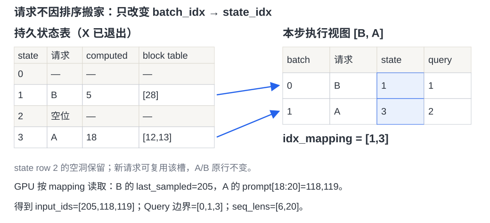
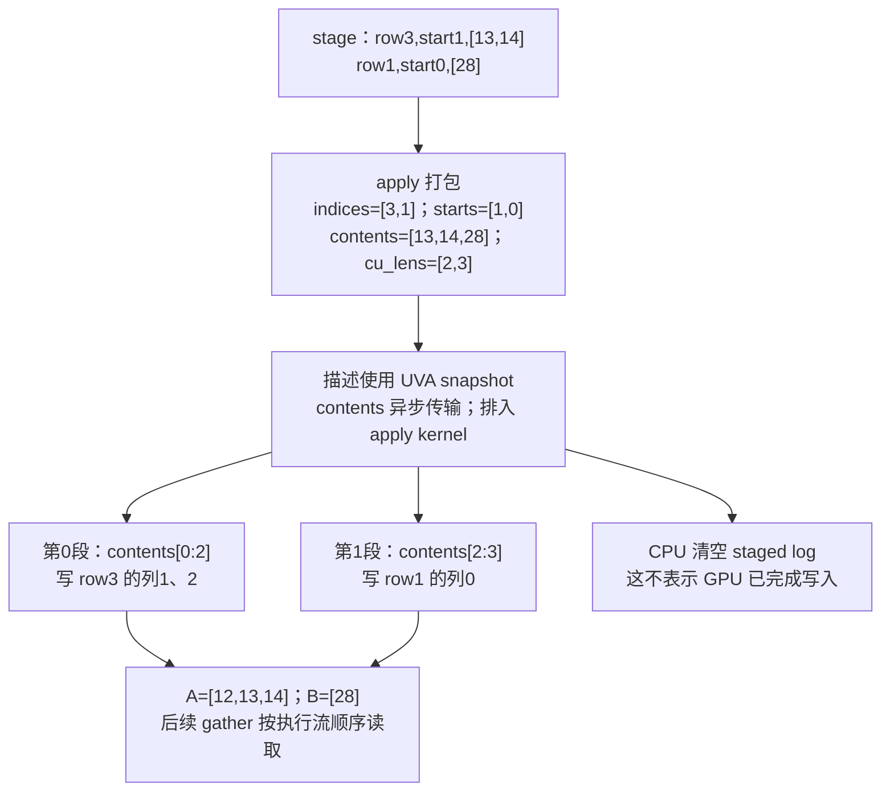
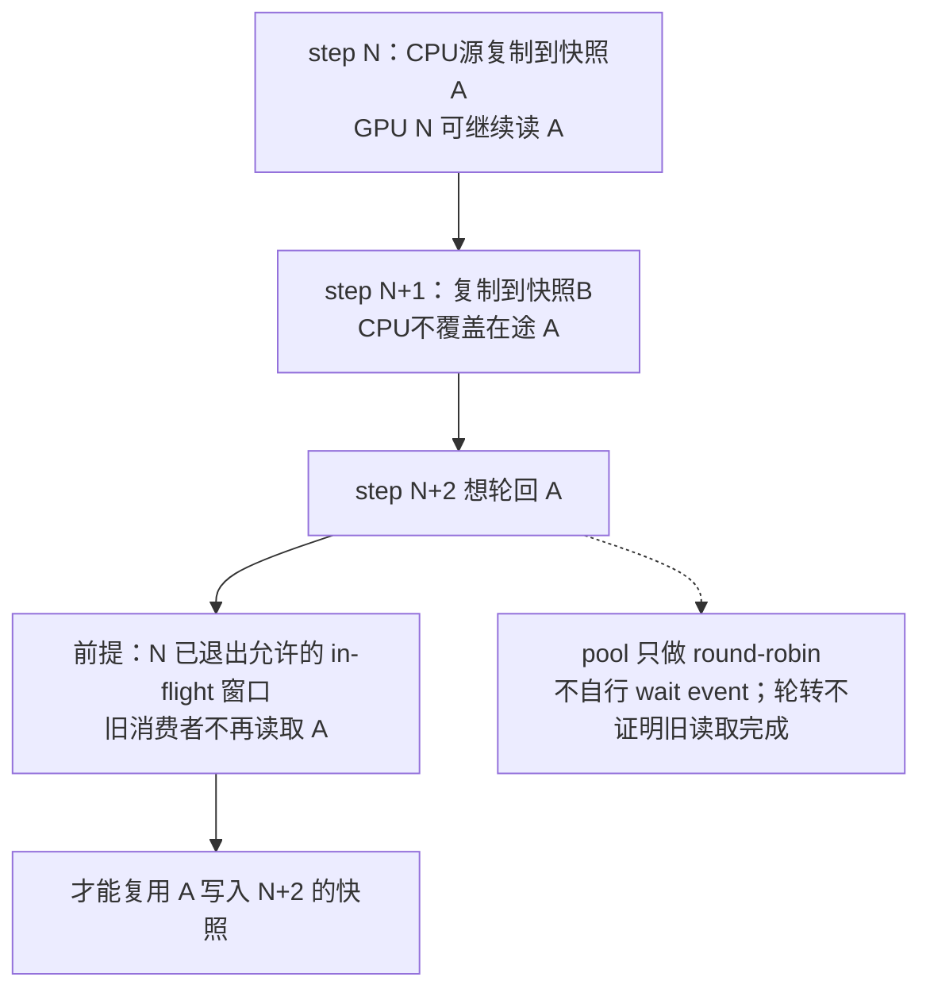
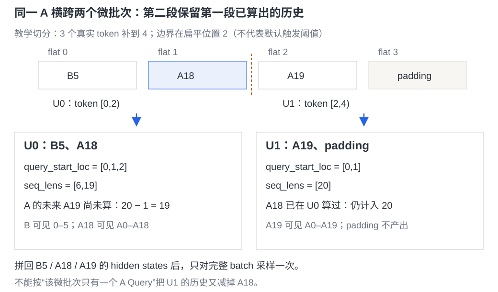
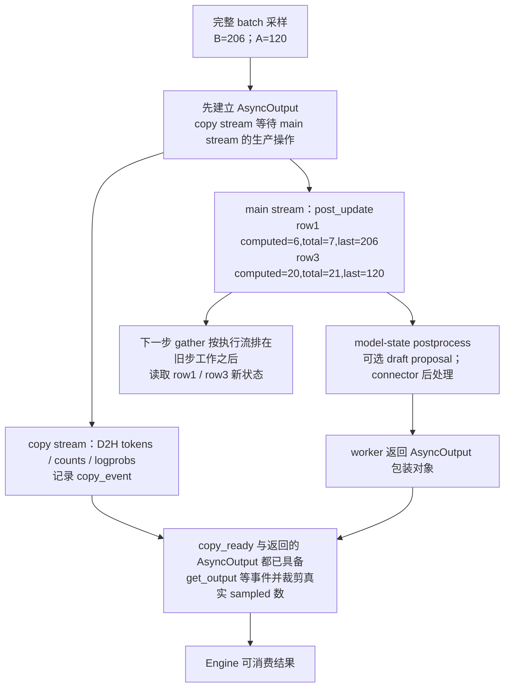

# vLLM Model Runner V2：固定请求行怎样生成每步输入并异步推进状态

> **源码基线**：`vllm-project/vllm@199cb9b964822e59ab9b58d88e7be31eb419a2ae`（main 快照，2026-09-07；只读源码）。
> **主题**：请求不再随 batch 排序搬家后，MRV2 怎样从稳定状态行生成本步 token 输入，并分别推进下一步 GPU 状态和 Engine 可读输出？
> **适用范围**：V1 Engine 内的 Model Runner V2；拥有 runner 选择、稳定行、staged/UVA 生命周期、每步 gather、受限微批切片及本地执行/输出/graph 接缝。调度决策、KV 分配、注意力实现、采样算法和全局编译策略见相关页。
> **最近更新**：2026-09-08。重放固定行与跨微批请求，核对当前双向能力边界、缓冲池深度、CoW 与 capture 前预热顺序。

## 1. 两条请求换执行顺序，为什么不必交换长期状态？

假设 worker 最多保存 4 条请求，free list 初始为 `[0,1,2,3]`。依次加入 A、X、B 时，`pop()` 从末尾分配，三者进入 state row 3、2、1。X 完成后 row 2 归还，A 和 B 都留在原行。现在 Scheduler 批准 B 计算 1 个 token、A 计算 2 个 token；本步执行顺序是 `[B,A]`，runner 只生成 `idx_mapping=[1,3]`：batch row 0 读 state row 1，batch row 1 读 state row 3。

这是与 MRV1 的关键差异。两者都利用连续 batch 高度重合，只更新增量；MRV1 的持久 batch 同时承担当步输入排列，空洞需压紧，改序需交换 row-local 状态。MRV2 把长期存放位置和本步执行顺序分开，接受 GPU gather 的成本，避免为改序搬动整套 token、block table 和采样状态。MRV1 还以 `CachedRequestState` 保留 batch 外的请求镜像，并记录异步投机的 draft 历史；这些细节由 15 展开。这里的成本权衡是结合设计文档和实现的**分析推断**，并非一次实测性能结论。

以下使用普通 causal attention，无 LoRA、投机或 context parallel。A 的 prompt/prefill 长度都是 20，已计算 18，token id 取 `100 + position`；B 的 prompt/prefill 长度是 5，已计算 5，上一步已采出 token 205，所以 B 的总 token 数是 6。它们的块表分别为 `[12,13]`、`[28]`，与 attention 页的小例衔接。以上容量、token id、块号均为教学值。

<!-- 图规格：真实二维状态表与二维batch视图，使用生成器SVG。左边保持4个state row及row2空洞，右边仅两条当步请求；箭头表示batch→state映射而非移动状态。图内给出computed、块表、映射和最终输入，读者可以重建B/A寻址。 -->

`RequestState.remove_request()` 只删双向映射并归还槽位，不做 condense。新 C 可复用刚归还的 row 2；仅本步未调度的请求仍保留长期行。finish/preemption 才移除，resume 重新加入，不能保证回到旧行。runner 按排序后的 finished/preempted id 清理，保持 TP ranks 的槽位分配顺序一致。

源码落点：`vllm/v1/worker/gpu/states.py::RequestState.add_request`、`RequestState.remove_request`；`vllm/v1/worker/gpu/model_runner.py::GPUModelRunner.finish_requests`、`sort_batch_req_ids`；设计理由见 `docs/design/model_runner_v2.md`，MRV1 的搬移过程见 [[15_vllm_model_runner_v1_analysis|Model Runner V1]]。

## 2. 固定的是地址，CPU、GPU 和本步 view 的值仍有阶段差别

| 保存的内容 | 谁修改、怎样使用 | 新值何时可消费 |
|---|---|---|
| `req_id_to_index` 与反向映射、free list | CPU 管请求身份与槽位 | add/remove 后后续 Python 逻辑立即可见；不代表设备初值已写完 |
| `prompt_len`、`prefill_len` 的普通 CPU 源 | CPU 建立请求，复制成 UVA snapshot 给 GPU | 新 snapshot 提交后，GPU 后续工作读取该快照 |
| `num_computed_tokens_np` | CPU 维护乐观上界，供 shape/metadata 判断 | 不能用它代替 GPU 真实进度，尤其有 rejected token 时 |
| `all_token_ids`、computed/total length、last sampled/draft、sampler/model state | 稳定 GPU 或 UVA base；staged apply 和 GPU postprocess 更新 | apply/postprocess 在执行流中先于后续读者执行 |
| `idx_mapping`、`query_start_loc`、固定 input buffers 的本步切片 | CPU 排请求，GPU 按稳定行 gather | 本步准备 kernel 执行后供 forward 使用；不持有请求生命周期 |
| sampled token/logprob 等 CPU 输出 | 独立 copy stream 写 host 副本 | `AsyncOutput.get_output()` 等 `copy_event` 后才可交给 Engine |

`prompt_len` 是原始用户 prompt 长度；`prefill_len` 是这次加入要预填的完整前缀，可包含恢复时已有输出。不能因两者在 A/B 中相等而合并字段。大容量 `all_token_ids` 使用可由 GPU 访问的 pinned host/UVA base，以节省显存；它不是每步复制整个 `[max_num_reqs,max_model_len]` 表。短热状态则留在 GPU 或小型 UVA-backed tensor 中。

streaming input 会让同一 id 再次作为 new request 到来。MRV2 先移除旧行，再完整 re-add，重新注册 model state 和覆盖 block table；不能仅改旧对象的 prompt 长度。对应测试检查 free slot 不泄漏、反向映射只有一个该 id，并检查新 prefill 前缀。清理还覆盖 pooling、encoder、prompt-logprob、LoRA 等附属状态；行号复用必须伴随这些内容的重新建立。

源码落点：`vllm/v1/worker/gpu/states.py::RequestState`；`vllm/v1/worker/gpu/model_runner.py::GPUModelRunner._remove_request`、`GPUModelRunner.add_requests`；`tests/v1/streaming_input/test_gpu_model_runner_v2_streaming.py`。

## 3. 一份 SchedulerOutput 先变成差量写入，再变成可读设备状态

### 3.1 为什么先记片段，不整表传输

每步通常只增加少数 token 或 block id。`StagedWriteTensor` 保留稳定 base，CPU 记录四项差量：目标 row、行内起点、拼接内容、内容累计末端。`stage_write()` 只追加 Python 记录；`apply_write()` 才提交描述和内容，并启动 Triton kernel 把每段写回对应 row。

独立看一个块表更新：A 在 row 3，从列 1 写入 `[13,14]`；B 在 row 1，从列 0 写入 `[28]`。描述为 `indices=[3,1]`、`starts=[1,0]`、`contents=[13,14,28]`、`cu_lens=[2,3]`。第一段取 `contents[0:2]` 写 A 的列 1、2，第二段取 `contents[2:3]` 写 B 的列 0。A 原列 0 的 12 不动，得到 `[12,13,14]`；这里的 14 只示范预留块表容量，不增加当前可见历史长度。

<!-- 图规格：ragged差量变换是独立算法，使用Mermaid拓扑而非真实存储网格。输入为两条不重叠写记录，中间明确累计长度如何切内容，输出为各稳定row更新后的块号；同时标出apply后清日志不等于GPU完成。 -->

多 KV group 的 `FusedStagedWriter` 再加入 group id、合并内容和累计偏移，一次 kernel 选各组 base/stride；单组直接 apply，无更新就跳过。它减少 launch 与全表拷贝，不提供任意重叠写的事务语义。上例刻意使用互不重叠的区间。

### 3.2 本步更新顺序包含 zero → CoW copy

真实 `execute_model()` 依次处理上一步 PP 输出、finished/preempted 请求、本地释放、新请求、cached request 更新，最后统一 apply block-table writes；之后才 gather 本步请求和输入。新请求的 request/model/sampler 初值在 add 路径提交；cached 更新还追加块号并维护 CPU 进度上界。

`update_requests()` 先清零要求初始化的 KV blocks，再处理 `SchedulerOutput.kv_cache_block_copies`，调用实际块复制 helper；随后本步 attention 才会读取或续写这些地址。copy helper 处理共享 storage 去重、独立 head groups，以及将多个虚拟 kernel blocks 折回 scheduler block 维度后复制。本页只追踪执行顺序，复制的布局规则衔接 [[14_vllm_attention_backends_analysis|Attention Backend]]。

Scheduler 的 `_apply_cow()` 已把请求尾块改为私有 dst，并用 src hit-ref 与 dst 额外引用保护收集复制任务前的调度期。取走复制任务时，普通配置立即归还临时引用；启用延期释放的配置才按复制 step 的 fence 等待。不能概括成所有配置都持有到 copy 完成。引用/分配算法归 [[12_vllm_kv_cache_management_analysis|KV Cache 管理]]；worker helper 返回也不表示 CPU 等到了 GPU 完成，后续依赖由执行流顺序保证。

没有 token 的 step 仍可能要执行上述状态或 connector 工作，但不会伪造普通 forward。dummy step 则跳过真实请求 add/remove/update，用单独的占位输入路径。

源码落点：`vllm/v1/worker/gpu/buffer_utils.py::StagedWriteTensor.apply_write`、`FusedStagedWriter.apply`；`vllm/v1/worker/gpu/block_table.py::BlockTables.apply_staged_writes`；`vllm/v1/worker/gpu/model_runner.py::GPUModelRunner.update_requests`、`GPUModelRunner.execute_model`；`vllm/v1/worker/utils.py::copy_kv_cache_blocks_inplace`；`vllm/v1/core/sched/scheduler.py::Scheduler._free_cow_retained_blocks`。

## 4. 为什么 pinned memory 还需要一圈快照

non-blocking H2D 返回后，GPU 可能仍读取 host 源。若 CPU 为下一步直接覆盖同一 pinned buffer，GPU 会读到跨步混合值。设计文档指出，MRV1 的 barrier 路线必须找全共享源，并会限制准备重叠；MRV2 将普通 CPU 真值与供在途工作读取的 pinned snapshot 分开。

`UvaBufferPool` 每次轮转到下一份 buffer，先复制 CPU 源，再交出该份 UVA view。默认深度由 `set_default_max_concurrency(n)` 设为 **`max(2,n)`**，且 runner 在构造 pooled buffers 前设置它。不是所有配置都恰等于 `max_concurrent_batches`：MRV2 异步模式的上限是 `PP size + 1`；PP=1 时 n=2、池深 2，非异步 PP=1 时 n=1、池深仍为 2；PP=2 且异步时深度为 3。

以深度 2 的 pool 为例，两次提交占用不同快照；第三次轮回第一份之前，旧消费者必须已离开 Engine 允许的 in-flight 窗口。pool 本身没有逐槽 event 等待，安全性依赖这个并发上限与提交顺序。构造 `UvaBackedTensor` 已做过一次快照，因此不应把“第一次业务提交”硬编码为某个 ring 下标。显式给 `UvaBufferPool` 传深度时也不能误以为 setter 会替它再次钳制。

<!-- 图规格：深度2的host snapshot生命周期是独立并发机制，使用依赖拓扑而非按比例时间轴。step N用A、N+1用B，N+2只在旧N退出允许inflight窗口后轮回A；明确pool不自行等待事件，CPU普通源与GPU正在读取的快照分离。 -->

还要分清三种路径：

- `UvaBackedTensor` 保存普通 CPU 源和轮转快照；CPU 可继续改自己的源，已经交给 GPU 的旧 snapshot 保持不变。
- `async_copy_to_gpu()` 对普通未 pinned CPU tensor 先构造 pinned 副本；输入已 pinned 时 `pin_memory()` 可直接返回原对象，不能声称任何调用都自动获得独立快照。
- `all_token_ids` 的 UVA **base** 是长期地址，由 staged apply/post-update kernel 依次写入；它不是整表 snapshot ring。row 复用依赖设备读写顺序，host snapshot 复用依赖在途窗口，两者不能混为同一个 free list。

遗漏 apply 会读取旧值；池深没跟新增并发来源一起扩大，则可能回卷覆盖仍在读取的源。这是从轮转实现与并发上限重建的**分析推断**，不是本次复现的 race。

源码落点：`vllm/v1/worker/gpu/buffer_utils.py::set_default_max_concurrency`、`UvaBufferPool.copy_to_uva`、`UvaBackedTensor`、`async_copy_to_gpu`；`vllm/config/vllm.py::VllmConfig.max_concurrent_batches`；`vllm/v1/worker/gpu/model_runner.py::GPUModelRunner.__init__`。

## 5. 把 [B,A] 的稳定行读成三个 token

### 5.1 小例从头重放

本步 q 数为 `[1,2]`，前缀和给出 `query_start_loc=[0,1,3]`。边界含义是 B 占 flat `[0,1)`，A 占 `[1,3)`。runner 复制 `idx_mapping=[1,3]`，准备 kernel 再按映射读取每条请求的 GPU computed 进度。

| 变换 | B：batch 0 → state 1 | A：batch 1 → state 3 | 合并结果 |
|---|---|---|---|
| prefill 输入 | computed=5 已到 prefill=5，跳过 prompt gather | 从 `all_token_ids[3,18:20]` 读 118、119 | flat 1、2 得到 118、119 |
| position 与 seq length | position 5；seq=5+1=6 | position 18、19；seq=18+2=20 | `positions=[5,18,19]`；`seq_lens=[6,20]` |
| 上一步采样输入 | 把 row1 的 last_sampled=205 写 flat 0 | 本步仍在 prefill 边界内，保留 prompt token | `input_ids=[205,118,119]` |
| 本步要采样的 hidden state | 本请求最后 q 在 flat 0 | 本请求最后 q 在 flat 2 | `logits_indices=[0,2]` |

这些数组的含义与 MRV1 相同，但来源不同：MRV2 在 GPU 上从稳定行读取 prompt/真实进度/last sampled，不需先在 CPU 拿到 205 再填回输入。block table 同样按 `[1,3]` gather，得到 `[B 的块表,A 的块表]`；slot mapping 再结合 positions 计算。KV 写入和完整历史读取的演算归 [[14_vllm_attention_backends_analysis|Attention Backend]]。

### 5.2 排序和扩展字段不能悄悄换一套请求顺序

`sort_batch_req_ids()` 先把有 draft 的 verification 请求放前面，再偏好 `num_scheduled_tokens == decode_query_len` 的请求，其余按 q 数排序；相同 key 保持原顺序。它不是 MRV1 的四区域重排算法。`uniform_decode` 还检查没有 prefill，避免短 prefill 恰好 q 数相同就被判为纯 decode。

本例无 draft，每请求一个 logits，累计 logits 计数为 `[0,1,2]`，expanded mapping 与普通 mapping 相同。有 draft 时，一个请求可展开成多条 logits/采样位置；runner 生成累计 logits 数、expanded state index 与 local position，且断言 scheduled q 足以容纳这些 logits，防止错误索引读到前一个请求的 hidden state。adaptive verification 还会在设备侧压缩输入，CPU metadata 上界与最终真实 token 数必须分清。验证/接受算法归 [[20_vllm_speculative_decoding_analysis|投机解码]]。

LoRA 的长期 adapter id 也按 state row 保存，再用 `idx_mapping` 找到本步请求的 adapter，并按各请求 q 数重复成 token mapping。PCP 会分区输入，DCP 生成本 rank 的局部 seq length；padding 改变执行容量，不能变更请求身份。多模态 encoder/embedding、模型专用 positions 和非首 PP rank 的 intermediate tensors 分别进入 model-state/模型输入接缝，不能假定所有模型都只消费上表三个数组。

源码落点：`vllm/v1/worker/gpu/model_runner.py::GPUModelRunner.gather_batch_req_state`、`GPUModelRunner.prepare_inputs`、`sort_batch_req_ids`；`vllm/v1/worker/gpu/input_batch.py::prepare_prefill_inputs`、`prepare_pos_seq_lens`、`combine_sampled_and_draft_tokens`；`vllm/v1/worker/gpu/block_table.py::BlockTables.gather_block_tables`；`vllm/v1/worker/gpu/lora_utils.py::LoraState.make_lora_inputs`。

## 6. 一个请求跨两个微批次，后半段应该看到多少历史？

本基线已有受限制的 MRV2 DBO 路径，不再是笼统“不支持 DBO”。先看它最容易错的局部变换：假设 DP 协商后，上例 3 个真实 token 补齐到 4，分两份，每份容量 2。这个切点仅为教学值，不代表默认阈值已允许三 token 触发 DBO。

U0 取 flat `[0,2)`，包含 B5、A18；U1 取 `[2,4)`，包含 A19 与 padding。A 同时出现在两份中。每份 query 边界减去 token 起点，再裁到本份范围；seq length 则只扣掉**该份末尾之后仍未计算的 q**：

- U0 的 `query_start_loc=[0,1,2]`、`seq_lens=[6,19]`。A 原 seq=20，但 A19 还在未来，所以扣 1。
- U1 的 `query_start_loc=[0,1]`、`seq_lens=[20]`，只有 1 个真实 token、容量 2。A18 已在前一份计算，属于当前历史，不能再扣一次。

<!-- 图规格：真实token轴与两份局部metadata并列，使用生成器SVG；4格包含一个padding，切点在2，A跨两份。明确qsl偏移/裁剪及只扣未来query的seq变换，输出hidden合并后整批采样；不表达线程耗时。 -->

`_slice_input_batch()` 为每份建立独立对象。设备侧 `query_start_loc`、`seq_lens` 写入专用缓冲；多数其他 per-token/per-request device 字段只是 view。CPU seq 上界还会 clone 后调整，因此“除了两个 tensor，其余一概零拷贝”也不准确。尤其 logits/draft 相关字段保留的是**整批描述**，微批 forward 不能据此分别采样；各份 hidden states 拼回后，`sample()` 只对整批调用一次。

DP ranks 共同决定是否使用微批：所有 rank 都允许，且阈值判定通过，才使用协商的 padded token 数；任一 rank 不允许就不拆。全 padding 的局部片段要保持零真实 q；不能因保留一个 request view 而多生成输出。运行时为各份构建 attention metadata，DBO 线程/通信交叠的全局算法不在本页展开。当前配置排除 DCP/PCP 与 DBO；切片源码也明确 DCP+DBO 未验证，不能把存在 `dcp_local_seq_lens` view 当作支持声明。

源码落点：`vllm/v1/worker/gpu/ubatch_utils.py::_slice_input_batch`、`_slice_seq_lens`、`UBatchRunner.prepare`；`vllm/v1/worker/ubatch_utils.py::maybe_create_ubatch_slices`；`vllm/v1/worker/gpu/dp_utils.py::sync_cudagraph_and_dp_padding`；`tests/v1/worker/test_gpu_ubatch_slicing.py`。

## 7. 采出 token 后，下一步 GPU 和 Engine 不必同时看见它

`execute_model()` 保存本步 input batch、hidden states 等临时执行状态；`sample_tokens()` 取走并清空它。最后一个 PP rank 按 `logits_indices` 选择 hidden states、计算 logits、应用可选 grammar bitmask，然后执行普通或 rejection sampler；batch-sharded sampling 会按 rank 分配 logits 工作并 gather 回完整输出。非末 PP rank 走接收/推进状态分支，pooling 也有自己的输出包装，不能把每个执行结果都解释为 token sampler。

假设本例采出 B=206、A=120，各自 `num_sampled=1`、`num_rejected=0`。GPU `post_update` 按 `[1,3]` 写回：

| state row | computed 更新 | total length 与 last sampled | token 历史追加 |
|---|---|---|---|
| B：1 | 5 + 本步 q 1 − rejected 0 = 6 | total 6→7；last=206 | 位置 6 写 206 |
| A：3 | 18 + 本步 q 2 − rejected 0 = 20 | total 20→21；last=120 | 位置 20 写 120 |

有拒绝时，computed 增量是 q 数减 rejected；total 增量是实际 sampled 数，不能用 planned draft 数代替。需要时还更新 repetition/frequency/presence penalties 的 token 计数。model-specific postprocess 随后推进，speculator 再产生/保存下一步 draft。

<!-- 图规格：逻辑依赖拓扑，不是时间栅格。共同采样结果分别进入copy stream和main-stream post_update；主分支还要完成model-state处理、可选draft和connector并返回包装对象。Engine同时需要返回对象与copy_ready才消费；下一步GPU读取稳定行仍依赖post_update，不能把D2H就绪当worker已返回。 -->

源码先建立异步输出复制，再排 row postprocess，使 D2H 不必等待后者。`AsyncOutput` 保留设备结果引用，copy stream 等生产依赖，复制 tokens、计数、logprobs、prompt logprobs、可选诊断/故障信息，再记录 event；`get_output()` 等 event 后裁剪有效长度、转 CPU 结果，并处理错误。worker 主分支还须完成 model-state postprocess、可选 draft proposal 与 connector 后处理，才返回这个包装对象；copy event 单独就绪不是 Engine 已拿到输出的充分条件。GPU 状态已推进不意味着 Engine 已读到结果；CPU 读到结果也不是下一步 GPU token 的必经回填步骤。

这实现了 CPU 准备下一步与设备本步工作重叠的设计意图，但不能推导出所有配置的整条路径“绝无 CPU 等待”：Engine 结果等待、DP 协商、微批线程 join、诊断和 offload 等仍有各自同步边界。Engine 的 batch queue 与 Scheduler placeholder/stale-output 协议由 [[11_vllm_scheduler_analysis|Scheduler]] 及架构链路承接。

源码落点：`vllm/v1/worker/gpu/model_runner.py::GPUModelRunner.sample`、`GPUModelRunner.sample_tokens`、`GPUModelRunner.postprocess_sampled`；`vllm/v1/worker/gpu/input_batch.py::post_update`；`vllm/v1/worker/gpu/async_utils.py::AsyncOutput`、`AsyncPoolingOutput`。

## 8. 这些机制何时真的走 MRV2：选择与异步是两次判定

### 8.1 默认选择与双向拒绝

V1 Engine 不等于 MRV1。`GPUWorker` 在同一 V1 worker 中按配置构造 MRV1/MRV2，MM encoder-only 还有专用 V2 runner。选择按下列顺序进行，显式选择之后仍须通过验证。

| 顺序 | 条件 | 结果 |
|---|---|---|
| 1 | `VLLM_USE_V2_MODEL_RUNNER` 显式 true/false | 使用指定 runner；缺能力时报错，不静默改选 |
| 2 | 未设变量，ROCm 且 architecture 属于默认例外 | 选 V1；当前包括 `DeepseekV32ForCausalLM`、`DeepseekV4ForCausalLM`、`GlmMoeDsaForCausalLM` |
| 3 | 未设变量，Triton 不可用 | 选 V1；显式 V2 缺 Triton 则报错 |
| 4 | 未设变量，MRV2 blocker 非空 | 记录原因并选 V1；随后 V1 自身能力也必须验证 |
| 5 | 以上都不触发 | 默认 MRV2 |

当前完整 blocker 集分列如下；“改选 V1”不能绕过右列验证。

| MRV2 blocker：自动可选 V1，显式 V2 报错 | V1 blocker：必须满足 MRV2 条件 |
|---|---|
| stock `torch.compile`；TP>1 且启用 sequence parallel；`external_launcher` 且 PP>1 | prefill context parallel |
| `ngram`/`ngram_gpu`；spec method 不在 `eagle/eagle3/mtp/dflash/dspark/extract_hidden_states`；parallel drafting 且不是 dflash/dspark | DSpark；adaptive draft verification；mixed sliding/full DFlash draft；DFlash2 |
| `use_ubatching` 时存在下一段 DBO blocker | diffusion model |
| elastic EP；显式或 entry-point custom logits processor；KV sharing fast prefill；`mamba_cache_mode='all'` | batch-sharded sampling |

**DBO 的限定**：未显式设置 runner 变量时，MRV2 将 DBO 作为 blocker；要尝试当前 V2 路径需显式启用 V2，并同时满足无 LoRA、无 speculative、PP≤1、DCP/PCP≤1、非多模态/encoder-decoder、非 hybrid、非 MM encoder-only、CUDA Graph mode 为 `NONE`。执行端还按 DP 与阈值判断是否真正拆分。旧稿把 DBO 一律列为不支持、把 EAGLE3+PP 单独列为 blocker，均不再符合本基线；EAGLE3+PP 仍要满足其余配置条件，并不等于所有组合都已获支持。

另有 replay 配置验证：sampling replay mask 要求 MRV2，并拒绝 speculative、diffusion、自定义 logits processor 及不为 `processed_logprobs` 的 logprobs 配置；trace replay 也要求 MRV2。这些是额外 validator，不能只查上述两份 blocker list。

普通 dense/MoE、hybrid/attention-free，以及 text/multimodal pooling 在没有其他 blocker 时可默认 MRV2。设计文档与 `gpu/README.md` 仍称它 experimental、尚未 feature-complete；这里保留文档的设计定位，用 live config/tests 判断默认行为，不把“默认”解释为覆盖一切特性。

### 8.2 async scheduling 可以独立关闭

runner 选择通过不代表异步调度一定开启。当前 async 判断也区分显式与自动：

| 条件 | 显式 async=true | async 未指定 |
|---|---|---|
| executor 不支持 async | 报错 | 关闭 |
| speculative 方法不属于 EAGLE/MTP 家族、NGram GPU、draft_model 或 DSpark 的允许集合 | 报错 | 关闭 |
| `disable_padded_drafter_batch=True` | 报错 | 关闭 |
| ROCm + DeepEP high-throughput + DBO | 报错 | 关闭 |
| pooling | 不因 pooling 本身触发这项硬拒绝，仍检查其他条件 | 因当前性能影响默认关闭 |
| 其余兼容配置 | 开启 | 开启 |

显式 false 保持关闭。这里是 **async 自己** 的集合，不能用它扩大 MRV2 的 speculative 白名单，例如 async 允许某方法，不表示 V2 也实现该方法。

源码落点：`vllm/config/vllm.py::VllmConfig.use_v2_model_runner`、`VllmConfig._get_v2_model_runner_unsupported_features`、`VllmConfig._get_v1_model_runner_unsupported_features`、`VllmConfig._get_dbo_unsupported_features`、`VllmConfig._verify_sampling_replay_config`、`VllmConfig._verify_trace_replay_config`、`VllmConfig.__post_init__`；代表性默认/强制选择测试见 `tests/test_config.py`。

## 9. 固定地址怎样进入 capture，又怎样在不兼容时退出

`InputBuffers` 按最大请求/token 数预分配，真实步往同一地址写动态值；dummy block table 返回 forward 使用的同一持久 tensor，不能换成新地址。地址稳定只是必要条件，还要匹配已捕获的 shape 和执行语义。

| 阶段 | 本地 runner 的实际动作 | 失败/退出边界 |
|---|---|---|
| resolve | KV/attention 初始化后，结合各组 graph support、decode q、TP/cache 形态解析 mode，建立 manager | attention 能力限制模式；全局降级规则归 23 |
| capture | 构造候选 descriptor，按 PIECEWISE 再 FULL 预热/capture；需要时重建 capture metadata | piecewise 既无 compiled submodule 又未启用 breakable graph 时明确报错 |
| dispatch | 找 token/request 容量、uniform 条件、最大 q、有效 LoRA bucket、`num_ubatches` 兼容的候选 | 未 capture、无匹配或主动 profile/动态 encoder 限制则选 `NONE` |
| replay | FULL 直接 replay 绑定固定 buffer 的 graph；PIECEWISE 调用相应 runner；NONE 正常调用模型，仍可能经过 compiled callable | FULL 切入前等待 offload copy，防止静态 buffer 被旧传输覆盖 |

兼容不等于所有数值完全相等：候选 token/request 容量可大于实际值，uniform/max-query 按 descriptor 条件检查；有效 LoRA bucket 和微批数则必须匹配相应约束。padding 必须与被选 descriptor 一致，不能因为输入地址没变就忽略 shape。

本基线启动顺序尤其要注意：`Worker.compile_or_warm_up_model()` 在 `capture_model()` **之前**调用 MRV2 `warmup_kernels()`。源码解释，预热若在 capture 后扩大 workspace，会释放 graph 已引用的旧指针。随后 capture 还会设置占位 LoRA、捕获 encoder/decoder/speculator 等，并在相应路径锁定 workspace；这是地址生命周期约束。

`dummy_run` 不再创建另一套真实 request lifecycle：它不 add/remove/update 稳定行，而为 profile/warmup/占位执行构造 dummy batch；独立 `capture_model()` 管捕获。dummy token 分配会均衡余数，避免把所有余数堆到末请求。capture 的 attention metadata 也并非可以省略：除标准 attention，还有持有专门状态的 attention-like 运算需要 metadata；FULL 与 PIECEWISE 的 `for_capture` 取值不同。

graph memory profiling 使用临时 pool 和少量捕获样本外推，而非永久留下第二套图；成功与失败路径都清理图、model/attention 缓存、临时 manager 和绑定，并恢复原 pool。测试覆盖禁用、采样/外推、piecewise-only 和 capture 抛错后的 teardown。这里的分离降低了多义 dummy 入口的语义混淆，不能据此宣称所有相关错误已被消除。

更广的编译策略、全局 capability 降级与启动时间/显存成本由 [[23_vllm_compilation_cudagraph_analysis|编译与 CUDA Graph]] 承接。本页只保留稳定输入地址怎样成为 graph 的条件，以及哪些本地入口会拒绝或退出 replay。

源码落点：`vllm/v1/worker/gpu/input_batch.py::InputBuffers`、`InputBatch.make_dummy`；`vllm/v1/worker/gpu/cudagraph_utils.py::_is_compatible`、`CudaGraphManager.capture`、`CudaGraphManager.dispatch`、`CudaGraphManager.run_fullgraph`、`prepare_inputs_to_capture`、`profile_cudagraph_memory`；`vllm/v1/worker/gpu/model_runner.py::GPUModelRunner.capture_model`；`vllm/v1/worker/gpu_worker.py::Worker.compile_or_warm_up_model`。

## 10. 成本与排查：先区分错了哪一份状态

| 现象或边界 | 先查什么 | 对应成本 |
|---|---|---|
| 请求读到别人的 token/adapter | 双向 state mapping、finish 清理、streaming re-add、`idx_mapping` 是否一致 | 固定容量有空洞，每步增加间接寻址/gather |
| CPU 长度看似正确，设备仍读旧值 | 字段是 CPU 上界、staged 未 apply，还是 post-update 尚未到执行顺序 | descriptors、snapshot、apply kernel 与双视图管理 |
| 偶发跨步污染 | host snapshot 是否过早回卷，新增并发是否超过池深；不要只查 row free list | 并发窗口越大，pinned 快照存储越多 |
| 微批后半段少看历史 | 是否只扣本份末尾之后的未来 q；是否误读整批 logits 字段 | per-ubatch metadata、切片/拼接和协调成本 |
| Engine 尚无结果但 GPU 已推进 | 是否仍等 output copy event，而非误判模型未执行 | 在途输出占内存，CPU 输出/错误可见时间推迟 |
| graph 未命中或 replay 异常 | descriptor、padding、静态地址、预热顺序与 offload 依赖 | capture 启动时间、预留显存和候选组合 |

本页按真实源码与已有测试重放了教学数组，未运行 GPU、分布式或完整 vLLM 测试。阅读时可依次走 §1 的 row、§3 的 apply、§5 的输入、§7 的回写，再按当前配置核对 §8；不能把单页演算当作所有 backend/并行组合的端到端证明。

## Related Pages

- [[02_engineering/03_infer_frameworks/vllm/03_vllm_architecture_overview_analysis|vLLM 架构概览]] —— 把本页设备步骤放回 Engine、调度和分布式执行的完整链路。
- [[02_engineering/03_infer_frameworks/vllm/15_vllm_model_runner_v1_analysis|vLLM Model Runner V1]] —— 对照 compact row、condense/swap、共享 host buffer 保护和 dummy 入口。
- [[02_engineering/03_infer_frameworks/vllm/11_vllm_scheduler_analysis|vLLM Scheduler]] —— 解释本页消费的 token 计划、抢占，以及异步 placeholder 与结果接纳。
- [[02_engineering/03_infer_frameworks/vllm/12_vllm_kv_cache_management_analysis|vLLM KV Cache 管理]] —— 展开块表背后的分配、共享、CoW 临时引用和回收时序。
- [[02_engineering/03_infer_frameworks/vllm/14_vllm_attention_backends_analysis|vLLM Attention Backend]] —— 接续本步 metadata、KV 写入/历史读取及 backend 能力约束。
- [[02_engineering/03_infer_frameworks/vllm/20_vllm_speculative_decoding_analysis|vLLM 投机解码]] —— 展开多 logits、draft 验证与 accepted/rejected 后状态推进。
- [[02_engineering/03_infer_frameworks/vllm/23_vllm_compilation_cudagraph_analysis|vLLM 编译与 CUDA Graph]] —— 解释编译/capture 全局策略、能力降级和启动成本。
