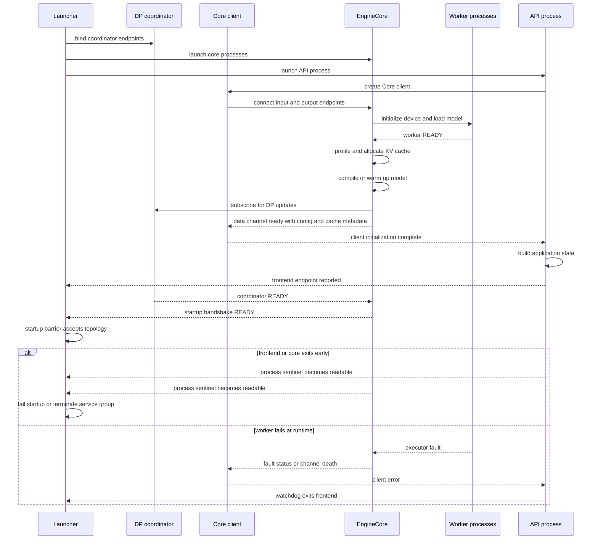

# vLLM Serving 控制面：用分阶段就绪约束服务拓扑

> [!question] 本页回答什么
> `vllm serve` 如何把 launcher、API 进程、DP coordinator、Core client、EngineCore 与 worker 组成一个可对外服务的整体？请求如何选中 DP engine？哪个组件宣告 ready、传播死亡并收紧 shutdown deadline？

> **源码基线**：`vllm-project/vllm@6b110badbb22d3f66c7218b71138f13b7a6b3419`
> **中心命题**：Serving 控制面的核心不是 HTTP 路由，而是一套跨进程所有权协议：launcher 先选择拓扑并持有进程故障域，worker、EngineCore、coordinator、Core client 与 API app 再按依赖顺序逐级解锁；运行期 DP 路由只用统计反馈做软负载均衡，真正的资源准入仍在 Engine 内；退出期则由同一个 deadline 和故障信号把已分散的所有权重新收拢。
> **所有权边界**：本页拥有启动、通信端点、ready/liveness、DP 路由反馈、服务级背压、进程故障域和 shutdown。协议请求的解析、输出渲染与取消语义见 [[02_engineering/03_infer_frameworks/vllm/04_vllm_request_lifecycle_analysis|请求生命周期]]；Engine 内部 `add/step/output` 事务边界见 [[02_engineering/03_infer_frameworks/vllm/10_vllm_engine_architecture_analysis|Engine 架构]]。
> **最近更新**：2026-08-30。按 frozen source `6b110bad` 重建控制面所有权、分阶段 readiness、DP 反馈与故障边界。

## 一、背景：监听端口不等于服务已经成立

一个可接受请求的 vLLM 服务至少横跨五类 owner：

| owner | 持有的状态 | 它不能代替谁 | 证据 |
|---|---|---|---|
| launcher / process manager | 顶层模式、子进程集合、signal、全局 shutdown deadline | 不判断单请求能否分配 KV | `vllm/entrypoints/cli/serve.py:76-153`、`vllm/entrypoints/cli/serve.py:395-410` |
| API process | 监听 socket、应用与 Core client 生命周期 | 不拥有 Engine 内的 scheduler 状态 | `vllm/entrypoints/launchers/api_server/entry.py:36-160`、`vllm/entrypoints/launchers/api_server/entry.py:179-201` |
| DP coordinator | 各 engine 的 waiting/running/KV 统计与请求到达 wave | 不接收请求，也不作最终 admission | `vllm/v1/engine/coordinator.py:305-469` |
| Core client | engine 地址与 ready 响应、请求到 engine 的映射与本地 inflight | 不承诺目标 engine 一定有容量 | `vllm/v1/engine/core_client.py:503-781`、`vllm/v1/engine/core_client.py:1435-1543` |
| EngineCore / worker | 模型、KV cache、scheduler 与 device execution | 不拥有 HTTP 入口和服务进程拓扑 | `vllm/v1/engine/core.py:110-170`、`vllm/v1/engine/core.py:254-345`、`vllm/v1/executor/multiproc_executor.py:640-680` |

CLI 先拒绝互斥的 load-balancing 组合，再按 multi-port、external LB、Rust frontend、hybrid LB 或 internal LB 推导 API server 数量；elastic expert parallel 还会把 API 数限制为一个；`vllm/entrypoints/cli/serve.py:76-142`。这不是“同一服务多开几个 worker”的小优化，而是在选择谁绑定端口、谁创建 core、谁路由和谁负责终止。

最终入口只有四类：multi-port DP supervisor、headless engine、多个 API 进程（含 Rust frontend）和单 API 进程；`vllm/entrypoints/cli/serve.py:144-153`。headless 的非 head 节点可直接启动本地 executor 并原地监控，head 节点则持有 `CoreEngineProcManager`；`vllm/entrypoints/cli/serve.py:178-258`。因此“frontend 数”“DP engine 数”和“worker 数”不是可互换的计数。

## 二、为什么是分层控制面，而不是一个总 supervisor

最直接的替代方案，是由 launcher 创建全部进程，等端口出现后立即把服务标为 ready，再由一个 round-robin 把请求送往任意 core。它少了 handshake、coordinator 和多级 manager，却破坏了三个必要不变量：

1. **配置一致性**：frontend 与 core 必须同意 rank、headless 模式和 config hash，不能只同意一个端口。
2. **依赖完成性**：worker 加载完成不代表 KV cache 已分配，core 构造完成也不代表所有 DP engine 已互相可见。
3. **故障归属**：API、coordinator、core 与 worker 的重启/退出条件不同，单一“进程是否活着”无法表达服务还能否接流量。

当前实现把这些条件拆成一串单向门闩。每一级只宣告自己能证明的事实，上一级只能在下游证明完成后继续：

> [!note] 分析推断
> “单一 supervisor + 端口即 ready”是为解释现有机制而重建的对照方案，不是源码或设计文档声称曾采用过的历史方案。其三个缺口分别由下文的 handshake 校验、分阶段资源初始化与多类 sentinel/status 机制证明。

这张图刻意不画单请求的渲染路径，也不展开 EngineCore 内一次 step 的事务；它只描述“服务何时有资格存在”。

## 三、启动协议：地址、身份与资源逐级闭合

### 3.1 launcher 先固定进程拓扑和通信端点

多 API 路径先建立监听地址和 engine 配置，再进入 `launch_core_engines()` 上下文，随后启动 API manager；`vllm/entrypoints/cli/serve.py:262-370`。当 frontend 使用动态 TCP 端口时，父进程不能把预分配的 `host:0` 当成最终地址：每个 API child 必须经 pipe 回报实际 endpoint，manager 同时观察 child sentinel；未回报就死亡会直接使收集失败；`vllm/v1/utils.py:166-191,247-312`。对应测试覆盖了端口非零且唯一，以及 child 在回报前死亡必须抛错；`tests/entrypoints/launchers/api_server/test_api_server_process_manager.py:318-401`。

Engine 侧同样由 consumer 先 bind；TCP 的最终 port 可以推迟到 bind 后才确定；`vllm/v1/engine/utils.py:1039-1084`。这种“接收者先占端点”的约束消除了 producer 和 consumer 同时抢端口的竞态。

### 3.2 worker READY 只证明设备与模型已装载

`WorkerProc` 构造阶段先初始化 device，再加载 model，随后才向父进程发送 `READY`；`vllm/v1/executor/multiproc_executor.py:640-680,911-924`。executor 父进程会等所有 worker 的 ready message；`vllm/v1/executor/multiproc_executor.py:779-814`。

这个 ready 不能越级解释为“HTTP 可用”。此时 EngineCore 仍可能没有完成 KV 容量测量、cache block 分配和 warmup。

### 3.3 Core 有两种 ready：数据通道响应与 launcher handshake

EngineCore 先构造 executor，再初始化 KV cache，最后才创建 scheduler；`vllm/v1/engine/core.py:110-170`。KV 初始化会收集各 worker 的 KV spec、profile 可用显存、确定 block 配置、初始化 cache，随后 compile 或 warm up；`vllm/v1/engine/core.py:254-345`。

EngineCore 进程在初始化期间注册 executor-failure callback，并用 fault sentinel 把失败纳入控制面；`vllm/v1/engine/core.py:1028-1068`。初始化完成后，input thread 先订阅 coordinator，再向每个 frontend 发送携带模型长度、KV block 数、block size 和初始 DP stats 的数据通道 ready response；随后才阻塞等待 coordinator 的 `READY`；`vllm/v1/engine/core.py:1652-1749`。

这份 response 足以让 Core client 完成自身初始化，却不等于 launcher 的拓扑屏障已经通过。EngineCoreProc 只有等 input thread 收到 coordinator READY 后才能结束构造；包围整个构造过程的 handshake context 随后才向 launcher 发送带 config hash 的 `READY`；`vllm/v1/engine/core.py:1115-1147,1213-1250`。两种 ready 分开，正是因为“数据通道已知 cache 元数据”和“全体 DP 订阅已闭合”不是同一事实。

### 3.4 coordinator READY 是全体订阅屏障

DP coordinator 只在配置需要跨 engine stats/wave 时创建；`vllm/config/vllm.py:705-726`。它绑定统计和 wave endpoint、向父进程报告地址，然后等待所有 EngineCore 完成订阅，再广播 `READY`；`vllm/v1/engine/coordinator.py:59-137,146-250`。这使“某个 core 可运行”和“整个 DP 反馈环已连通”成为两个独立条件。

### 3.5 Core client 把 READY 收敛成 API 可启动条件

`MPClient` 在外部地址模式下连接已存在的 engine；否则自己创建 `CoreEngineProcManager`。两条路径最终都按 engine identity 等待 ready response；`vllm/v1/engine/core_client.py:503-672`。收到响应后，它同步模型长度、KV block、block size 和 DP stats；`vllm/v1/engine/core_client.py:740-781`。

API worker 只有在 engine client context 建立并查询 supported tasks 后才 build app、初始化 app state 并开始 HTTP serving；退出时 context 负责关闭 client；`vllm/entrypoints/launchers/api_server/entry.py:36-160,179-201`。所以 API app 的构造位于数据通道 ready response 之后；但这不取代 launcher 对 coordinator 与全部进程的全局屏障。

最后，launcher 的 startup barrier 同时检查 engine、coordinator 和 watched frontend 的 sentinel，并验证 rank、headless 属性与 config hash；`vllm/v1/engine/utils.py:1250-1410`。多 API 主流程在 barrier 通过后继续观察 frontend、coordinator 和 engine manager，任一关键成员异常退出都升级为服务故障；`vllm/entrypoints/cli/serve.py:372-393`，`vllm/v1/utils.py:525-587`。

## 四、DP 路由：统计反馈是软背压，不是资源承诺

### 4.1 coordinator 汇总两类反馈

coordinator 接收 engine 的 waiting/running/KV cache usage，并接收 frontend 的新请求 wave；`vllm/v1/engine/coordinator.py:305-469`。变化中的 stats 最快按约 100 ms 间隔发送，长期无变化时仍会周期刷新；`vllm/v1/engine/coordinator.py:256-283`。它是反馈广播器，不是集中 scheduler。

### 4.2 Core client 用本地 inflight 修正陈旧快照

`DPLBAsyncMPClient` 同时维护 request-to-engine 映射和 client-local inflight；`vllm/v1/engine/core_client.py:1435-1454`。选 engine 时，它以本地 inflight 与 coordinator 报告的 waiting/running 较大者作为负载基线；若目标已有 waiting 且 KV usage 超过 50%，再施加 KV 压力惩罚。选中后立即乐观增加本地计数，并旋转平局起点；`vllm/v1/engine/core_client.py:1472-1523`。请求完成再减少对应 engine 的 inflight；`vllm/v1/engine/core_client.py:1536-1543`，abort 也必须按原映射回到同一个 engine；`vllm/v1/engine/core_client.py:1591-1611`。

这个设计解决的是反馈延迟：一批请求若在下一次 stats 到达前连续进入，纯快照算法会全部选择同一“最空”engine；本地乐观计数让 burst 仍能摊开。测试明确覆盖 burst 的轮转、coordinator backpressure 和 KV 压力惩罚；`tests/v1/engine/test_engine_core_client.py:247-285`。

### 4.3 背压边界：避免热点，不等于拒绝过载

Core client 的 async 输出队列由无上限 `asyncio.Queue()` 构造；`vllm/v1/engine/core_client.py:978-1016`。底层 ZMQ socket 又把 `RCVHWM` 与 `SNDHWM` 设为 0；`vllm/utils/network_utils.py:310-342`。这意味着 serving 控制面没有一个可作为 admission limit 的消息条数硬上限。

因此这里的“backpressure”必须准确理解为：

- coordinator stats 和 client-local inflight **改变路由偏好**，降低继续压向热点 engine 的概率；
- EngineCore Scheduler 才根据 token budget、KV 和队列状态决定实际推进；
- 若所有 engine 都饱和，路由算法仍会选出其中一个，而不是自动向 HTTP client 返回过载。

把这三层混为一谈，会误以为 KV-aware 路由已经提供了端到端有界排队。它没有；它是软反馈，不是容量闸门。

> [!warning] 文档与实现冲突
> 官方 data-parallel deployment 文档仍称内部 LB 只依据 running/waiting，KV-aware routing 是未来工作；`docs/serving/data_parallel_deployment.md:75-77`。当前 frozen source 已在 waiting 非零且 KV usage 超过阈值时加入 KV 惩罚；`vllm/v1/engine/core_client.py:1488-1505`。本页以代码行为为准。

## 五、运行期故障：把“谁死了”转换成“服务还能做什么”

### 5.1 默认语义是故障域收缩，不是假装降级

API launcher 的 watchdog 周期检查 engine client；当 client 已 errored 且不再 running 时，除非显式设置 keep-alive-on-engine-death，否则要求 HTTP server 退出；`vllm/entrypoints/launchers/launcher.py:180-202`。Core client 的 monitor 观察本地 engine process；异常退出会进入 client error 路径；`vllm/v1/engine/core_client.py:677-738`。

多进程服务由 `wait_for_completion_or_failure()` 同时观察 API children、coordinator 与 core manager；API 非零退出或 engine failed 都会抛出服务级错误；`vllm/v1/utils.py:525-587`。DP supervisor 更严格：它先探测所有本地 rank 的 `/health`，全部通过才启动 supervisor HTTP；ready 后任一 child 或 probe 失败都会清掉 ready 并关闭全组；`vllm/entrypoints/launchers/dp_supervisor.py:270-315,402-523`。

supervisor 自己的 `/health`、`/ready` 和 `/readyz` 只反映这份聚合状态；未 ready 返回 503；`vllm/entrypoints/launchers/dp_supervisor.py:177-238`。普通 API 的 health handler 则把 `EngineDeadError` 转为 503；`vllm/entrypoints/serve/instrumentator/health.py:22-33`。liveness 与 readiness 因而不是端口探针的同义词。

### 5.2 fault tolerance 是显式启用的窄例外

启用 fault tolerance 后，`EngineCoreSentinel` 才接管 executor fault：它 abort 当前请求并清 batch；executor 已失败则进入 `DEAD`，否则进入 `UNHEALTHY` 并把状态推给 client，只有 unhealthy 状态可尝试 recovery；`vllm/v1/fault_tolerance/engine_core_sentinel.py:35-136`。wrapper 受配置开关控制，恢复超时仍升级为 fatal；`vllm/v1/fault_tolerance/engine_core_sentinel.py:173-195`。

所以“worker 出错后服务继续”不是默认承诺。即使启用恢复，也存在清空在途工作、暂时 unhealthy、恢复失败转 fatal 的边界。E2E 测试还受 NIXL 与硬件条件限制；`tests/v1/fault_tolerance/test_fault_tolerance_e2e.py:3-6,320-378`。

## 六、退出协议：一个 deadline 穿过全部 owner

单 API launcher 收到 shutdown signal 后，按 timeout 选择 drain 或 abort，先关闭 engine client，再结束 HTTP server 并取消 watchdog；`vllm/entrypoints/launchers/launcher.py:119-177`。这保证入口停止、backend 清理和监听退出由同一个 owner 排序。

多进程路径把一个绝对 deadline 依次交给 API manager、local engine manager 和 coordinator，每一级只能消费剩余预算；`vllm/entrypoints/cli/serve.py:395-410`。API manager 先发 `SIGTERM`，在共享 deadline 内 join，最后才 kill 未退出的进程树；`vllm/v1/utils.py:598-650`。DP supervisor 对 children 使用同样的“转发 signal—等待剩余预算—强制终止”结构；`vllm/entrypoints/launchers/dp_supervisor.py:525-568`。

这比“每层各有一个完整 timeout”更严格：后者会让总退出时长随 owner 数量相加。测试验证了 shutdown 期间新请求被拒绝，以及多 API 进程在 SIGTERM 下退出；`tests/entrypoints/launchers/test_shutdown.py:464-557`。

EngineCore 本身还区分 drain 与 abort：shutdown 输入会停止接收新的 ADD，并决定等待在途请求还是中止；`vllm/v1/engine/core.py:1492-1584`。这是服务控制面给 Engine 的生命周期指令，不等于本页拥有 Engine 内部的请求状态事务。

## 七、约束、冲突与排查顺序

### 7.1 不能跨越的边界

- **端口已监听不是 ready**：必须继续追踪 worker、KV/warmup、coordinator、Core ready 与 startup barrier。
- **coordinator 不是 scheduler**：它广播统计和 wave，不做 token/KV admission。
- **软路由不是有界队列**：HWM 0 与无界 async queue 使控制面不能声称提供硬容量上限。
- **process alive 不是 healthy**：fault sentinel、client error、aggregated readiness 与 HTTP probe 分别表达不同层的事实。
- **全局 timeout 不是每层 timeout**：清理阶段必须传递剩余预算。

### 7.2 另一个文档漂移点

架构概览文档用固定的“典型进程数”和“DP 大于一就有 coordinator”解释拓扑；`docs/design/arch_overview.md:69-112`。当前代码的 API 数依赖 load-balancing 模式，而 coordinator 还受 MoE 与 external LB 条件约束；`vllm/entrypoints/cli/serve.py:76-142`，`vllm/config/vllm.py:705-726`。排障时应从实际 CLI 分支与 config predicate 开始，不应从示意图反推运行进程。

### 7.3 最短排查路径

1. 在 `serve.py` 确认实际进入的四类拓扑和推导出的 API count。
2. 检查 API/Core/coordinator 最终绑定地址，而不是只看预分配地址。
3. 沿 Worker READY → Core READY → coordinator READY → client ready → app build 找到卡住的门闩。
4. 对路由偏斜，同时比较 coordinator stats、client-local inflight、KV penalty 和 request-to-engine 映射。
5. 对“端口活着但请求失败”，区分 engine error、聚合 readiness、health 503 和 keep-alive 配置。
6. 对退出超时，检查是否仍在传递同一个 deadline，以及哪个 owner 消耗了剩余预算。

## 八、发展趋势：控制面正在变得更显式，但仍不是统一编排器

> [!note] 分析推断
> “控制面协作数据正在显式化”是对多处实现的归纳，不是源码自陈的路线图：launcher handshake 传递并校验 config hash；`vllm/v1/engine/core.py:1238-1250`、`vllm/v1/engine/utils.py:1386-1405`。数据通道 ready response 传递 cache 元数据与 DP stats endpoint，Core client 再同步它们；`vllm/v1/engine/core.py:1652-1692`、`vllm/v1/engine/core_client.py:740-781`。coordinator 先更新本地 waiting/running/KV counts，再把聚合 stats 发布给 frontends；`vllm/v1/engine/coordinator.py:305-419`、`vllm/v1/engine/coordinator.py:259-283`。fault sentinel 把 status 包装进输出，client 收到后刷新本地状态；`vllm/v1/fault_tolerance/engine_core_sentinel.py:105-118`、`vllm/v1/engine/core_client.py:1041-1071`。shutdown deadline 则由 launcher 换算成各 manager 的剩余 timeout；`vllm/entrypoints/cli/serve.py:395-410`。这些事实共同支持“跨 owner 协作信息更显式”这一分析，但不证明某条既定演进路线。

源码仍保留两个清晰限制：DP 选择器中的 power-of-two-choices 仅是 TODO；`vllm/v1/engine/core_client.py:1478-1481`，控制面队列也没有硬 admission cap。

因此合理的演进方向不是把 scheduler 移进 coordinator，而是让控制面反馈更及时、过载信号更可观察、入口 admission 更明确，同时保持 EngineCore 对真实 KV/token 状态的唯一所有权。这一段是基于当前边界的推断，不代表已有实现承诺。

## Related Pages

- [[02_engineering/03_infer_frameworks/vllm/03_vllm_architecture_overview_analysis|vLLM 架构概览]] — 全系统组件地图与跨页责任边界。
- [[02_engineering/03_infer_frameworks/vllm/04_vllm_request_lifecycle_analysis|vLLM 请求生命周期]] — API 解析、输出渲染、取消与请求级错误传播。
- [[02_engineering/03_infer_frameworks/vllm/10_vllm_engine_architecture_analysis|vLLM Engine 架构]] — Core client 之后的 Engine 事务与状态提交边界。
- [[02_engineering/03_infer_frameworks/vllm/11_vllm_scheduler_analysis|vLLM Scheduler]] — 路由完成后的 token/KV admission owner。
- [[02_engineering/03_infer_frameworks/vllm/22_vllm_distributed_inference_analysis|vLLM 分布式推理]] — TP、PP、DP 与 executor/worker 拓扑。
- [[02_engineering/03_infer_frameworks/vllm/27_vllm_observability_reliability_analysis|vLLM 可观测性与可靠性]] — probe、指标、trace 与生产故障诊断。
