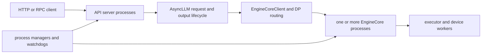

# vLLM Serving 控制面：把协议、路由与生命周期隔离在推理内核之外

> **源码基线**：`vllm-project/vllm@d66300a1baa7779c68c7dfa4e51eee2502b48017`
> **中心命题**：vLLM 的 Serving 层不是给 Engine 套一层 FastAPI。它负责协议适配、进程拓扑、请求/流生命周期、DP 路由、健康传播与有界退出；EngineCore 只负责 token/KV 调度与设备执行。控制面与数据面分开，才允许 API server、engine 数量和负载均衡方式独立扩展。
> **叙事顺序**：本页按五拍组织——背景 → 为什么这么设计（含被否掉的替代）→ 实现思路与细节 → 约束 → 发展趋势（本页无可锚定的在途改动，第 5 拍略）。
> **最近更新**：2026-08-27。按五拍重排章节顺序；机制正文与既有引用未改。

## 一、背景：先明确 Serving 不拥有什么

Serving 层不决定 continuous batching 的 token budget，不分配 KV block，也不选择 attention kernel。它拥有的是：

- HTTP/OpenAI 协议到内部请求的转换与流式响应；
- API server、EngineCore 和 DP coordinator 的进程拓扑；
- 请求到某个 engine 的路由；
- client disconnect、abort、engine death 和 shutdown 的传播；
- readiness、liveness、startup barrier 与资源清理。

如果 API handler 直接调用 GPU runner，那么每个 frontend 都要复制调度状态，扩容 API 进程就会改变推理语义。vLLM 通过 `AsyncLLM`/`EngineCoreClient` 将 frontend 与 EngineCore 隔开，使两侧可用 IPC 队列独立伸缩。

## 二、为什么这么设计：替代方案为何不成立

| 方案 | 初始优势 | 生产环境问题 |
|---|---|---|
| handler 直接调用 runner | 路径短 | frontend 扩容复制推理状态，网络背压阻塞设备控制 |
| 每请求一个 EngineCore IPC reader | 实现直观 | 输出竞争、统计顺序和错误广播难以一致 |
| 只按请求数做 DP round-robin | 无状态 | 长请求和 KV 压力导致热点 engine 持续积压 |
| 端口监听即 ready | 启动快 | 模型/KV/DP rank 未完成 handshake 就接流量 |
| 收到 SIGTERM 立即 kill 全部 | 退出确定 | 丢失可在预算内完成的流式请求，资源清理不完整 |
| 每层独享 shutdown timeout | 局部简单 | 总退出时间随层数相乘，违反编排器 deadline |

当前方案用更多管理进程、IPC 和状态监控换取明确的故障域、独立伸缩与有界生命周期。

> [!note] 推断
> 这张表是本页依据代码行为重建的设计权衡：每一行的“为什么不适用”都能落到后文引用的 `file:line` 上，但“当初权衡过、并因此否掉了它”这层意思由本页承担——源码通常只陈述最终形态，不陈述被否掉的选项。要引用其中某一行，请回到对应小节的 locator，不要引用本表。

## 三、拓扑选择发生在启动控制面

`serve` 入口根据 load-balancing 模式推导 API server 数量：multi-port、Rust frontend、external LB、hybrid LB 与 internal LB 使用不同默认值；`vllm/entrypoints/cli/serve.py:73-139`。随后只进入四种顶层路径之一；`vllm/entrypoints/cli/serve.py:141-150`：

| 入口模式 | frontend | EngineCore | 路由责任 |
|---|---|---|---|
| 单 API server | 当前进程 | 本地或远端 core | 单 client 或内部 DP client |
| 多 API server | 多子进程/Rust frontend | 一组 core | frontend 共享地址，client/内部 LB 分发 |
| multi-port DP supervisor | 每个本地 DP rank 一个 server | 每 rank 对应 engine | 外部或端口级 LB |
| headless | 无 API server | 只启动 core/worker | 外部控制面接入已有地址 |

拓扑分支不是性能参数的排列组合，而是“谁拥有监听端口、谁创建 EngineCore、谁路由请求、谁负责退出”的所有权选择。比如 headless 明确禁止 API server count，并只监控 engine liveness；`vllm/entrypoints/cli/serve.py:175-255`。

## 四、为什么多 API server 要先建地址，再过启动屏障

多 server 路径先构造进程间 input/output 地址，再在 `launch_core_engines()` 上下文中启动 EngineCore 与 API workers；`vllm/entrypoints/cli/serve.py:259-378`。若使用动态 `tcp://host:0`，子进程必须回报实际绑定地址，父进程按 client index 收集；`vllm/v1/utils.py:166-191,247-312`。

启动的不变量是：

> 在对外宣告 ready 前，所有需要参与服务的 frontend 和 EngineCore 必须对同一组通信端点达成一致；任一被监控 frontend 提前退出，都应使 engine startup 失败。

因此 API 进程会被加入 `watched_frontend_processes`；`vllm/entrypoints/cli/serve.py:379-382`。`launch_core_engines()` 在上下文退出时执行 engine handshake/startup barrier；`vllm/v1/engine/utils.py:1103-1247`，实际屏障由 `wait_for_engine_startup()` 实现；`vllm/v1/engine/utils.py:1250-1320`。

如果去掉屏障，端口已监听不等于模型、KV cache 和所有 DP rank 已就绪：请求可能在部分 core 尚未完成初始化时进入，产生难以区分的临时 5xx、hang 或路由偏斜。

## 五、单请求有两条相反方向的生命周期

### 5.1 输入方向：handler 到 EngineCore

API worker 在 async context 中构造 `AsyncLLM`；退出或异常时 context 保证调用 shutdown；`vllm/entrypoints/launchers/api_server/entry.py:35-112`。`AsyncLLM.add_request()` 完成输入处理、内部 request 构造，并为该请求建立独立 `RequestOutputCollector`；`vllm/v1/engine/async_llm.py:294-405`。

请求提交后，frontend 不同步等待 GPU。内部 client 把请求发给 EngineCore，HTTP generator 等待自己的输出队列。这让网络协程的阻塞不占用调度线程。

### 5.2 输出方向：EngineCore 到流式响应

`AsyncLLM` 只创建一个后台 `output_handler`，从 EngineCore 批量拉取输出、交给 `OutputProcessor`，再放入各请求 collector；`vllm/v1/engine/async_llm.py:665-747`。每个 `generate()` 则消费自己的 queue 并 yield 给协议层；`vllm/v1/engine/async_llm.py:570-624`。

这是一个 demultiplex 设计：EngineCore 输出是按 step 聚合的，HTTP 消费是按 request 分离的。若为每个请求直接从 EngineCore 读 IPC，会引入多个竞争消费者，也难以保持 scheduler stats、stop-string abort 和错误广播的一致顺序。

## 六、取消不是 frontend 本地事件

客户端断开时，async generator 被取消或回收，`generate()` 会向 `AsyncLLM.abort()` 传播 request ID；`vllm/v1/engine/async_llm.py:616-663`。abort 先清理输出处理器状态，再通知 EngineCore；`vllm/v1/engine/async_llm.py:749-761`。

这条反向传播必须到达 Scheduler/KV owner。只关闭 HTTP socket 会留下幽灵请求：它继续占用 token budget、KV block 和 GPU 计算，但再没有消费者。相反，EngineCore 已死亡时不再发送 abort，因为资源会随 core shutdown 统一释放；`vllm/v1/engine/async_llm.py:626-630`。

因此请求结束至少有三种不同语义：

- 正常完成：输出处理器看到 finished，流关闭；
- 客户端取消/协议错误：显式 abort 到 EngineCore；
- engine fault：向所有 collector 传播 dead/error，再走进程级清理。

## 七、DP 负载均衡必须看 KV 压力

多个 API client 向多个 DP engine 路由时，仅按请求数 round-robin 会忽略请求长度与 KV 占用差异。`DPLBAsyncMPClient` 的评分同时参考 client-local inflight、engine waiting/running 数量和 KV cache usage；当 waiting 存在且 KV usage 超过 50% 时增加惩罚；`vllm/v1/engine/core_client.py:1435-1507`。

其设计原因是：KV 紧张 engine 的 waiting queue 通常排空更慢。如果继续给它分配请求，排队长度本身会形成正反馈。低 KV usage 时保留 round-robin 行为，避免瞬时 burst 因陈旧快照过度迁移。

这仍只是 admission 前的路由启发式，不替代每个 EngineCore 内部 Scheduler 的真实 token/KV 校验。路由只能选择“尝试哪个 engine”，最终资源承诺仍由目标 core 完成。

## 八、进程管理器拥有故障域

`APIServerProcessManager` 负责创建、监控和终止 API server 子进程；`vllm/v1/utils.py:166-245`。`CoreEngineProcManager` 则负责 EngineCore 的创建、ready 与 shutdown，并通过 process sentinel 监控 liveness；`vllm/v1/engine/utils.py:144-273`。

把两者拆开有两个结果：

1. API worker 失败不需要让每个 worker各自猜测 EngineCore 是否存活；父级统一判定服务拓扑失败；
2. shutdown 可以先停止入口，再给 core 留出 drain 窗口，最后终止 coordinator。

多 API server 主流程用 `wait_for_completion_or_failure()` 同时观察 frontend、engine manager 与 coordinator；`vllm/v1/utils.py:520-588`。这比只等 HTTP server task 更严格：任何一个关键进程意外退出都必须升级为整个服务的故障。

## 九、shutdown 是带预算的分布式协议

单 API server 收到信号后，根据 `shutdown_timeout` 选择 drain 或立即 abort；先停止 engine client，再通知 HTTP server 退出，并取消 watchdog；`vllm/entrypoints/launchers/launcher.py:119-176`。`run_server_worker()` 特意在 backend context 退出后再等待 HTTP shutdown task；`vllm/entrypoints/launchers/api_server/entry.py:179-201`。

多进程路径将同一个 deadline 依次分配给 API manager、local engine manager 和 coordinator；`vllm/entrypoints/cli/serve.py:384-407`。它传递的是剩余时间而不是给每一层完整 timeout，否则三层串行清理可能把总体退出时间放大三倍。

关键不变量是：

> 不再接收新请求之后，已接收请求要么在总预算内完成，要么被明确 abort；任一子进程不能无限延长全局退出。

HTTP watchdog 每隔一段时间检查 `engine.errored && !engine.is_running`，在 backend 死亡时触发 server exit；`vllm/entrypoints/launchers/launcher.py:180-202`。否则流式响应内部抛出的 engine 异常可能只结束单个 generator，而监听进程继续假装健康。

## 十、约束、失败边界与排查顺序

服务层问题应按所有权排查，而不是先看 GPU utilization：

1. CLI 推导出的 API count、DP mode 与 headless/external/internal LB 是否一致；
2. frontend 与 core 是否使用同一组最终 input/output 地址；
3. startup barrier 是否等待所有目标 engine，watched frontend 是否提前退出；
4. request ID 是否建立了唯一 collector 并成功提交 core；
5. output handler 是否存活、是否能持续从 core demultiplex；
6. client disconnect 是否真正触发 core abort；
7. DP 路由快照是否反映 waiting/running/KV 压力；
8. engine death 是否传播到 collector、watchdog 与父进程；
9. shutdown deadline 是否按剩余预算向下传递。

最小源码阅读顺序：`vllm/entrypoints/cli/serve.py:50-150,175-407` → `vllm/entrypoints/launchers/api_server/entry.py:35-112,179-201` → `vllm/v1/engine/async_llm.py:294-405,570-761` → `vllm/v1/engine/core_client.py:1435-1507` → `vllm/v1/engine/utils.py:144-273,1103-1320` → `vllm/entrypoints/launchers/launcher.py:99-202`。

## Related Pages

- [[02_engineering/03_infer_frameworks/vllm/01_vllm_feature_optimizations_guide|vLLM 快速使用]] — 服务启动、压测与常用参数入口。
- [[02_engineering/03_infer_frameworks/vllm/10_vllm_engine_architecture_analysis|vLLM Engine 架构]] — Serving 通过 client 隔离的 EngineCore 数据面。
- [[02_engineering/03_infer_frameworks/vllm/11_vllm_scheduler_analysis|vLLM Scheduler]] — 路由之后实际完成资源 admission 的 owner。
- [[02_engineering/03_infer_frameworks/vllm/22_vllm_distributed_inference_analysis|vLLM 分布式推理]] — TP/PP/DP 拓扑与 executor 通信。
- [[02_engineering/03_infer_frameworks/vllm/26_vllm_disaggregated_kv_serving_analysis|vLLM 分离式 KV Serving]] — prefill/decode 角色与 KV connector 带来的跨服务生命周期。
- [[02_engineering/03_infer_frameworks/vllm/27_vllm_observability_reliability_analysis|vLLM 可观测性与可靠性]] — 指标、trace、故障传播与生产验证。
- [[02_engineering/03_infer_frameworks/vllm/03_vllm_request_flow_walkthrough_analysis|vLLM 请求全链路导览]] —— 本页所述启动拓扑与生命周期，在该页有逐级就绪屏障和跨进程管道的运行期时序。
