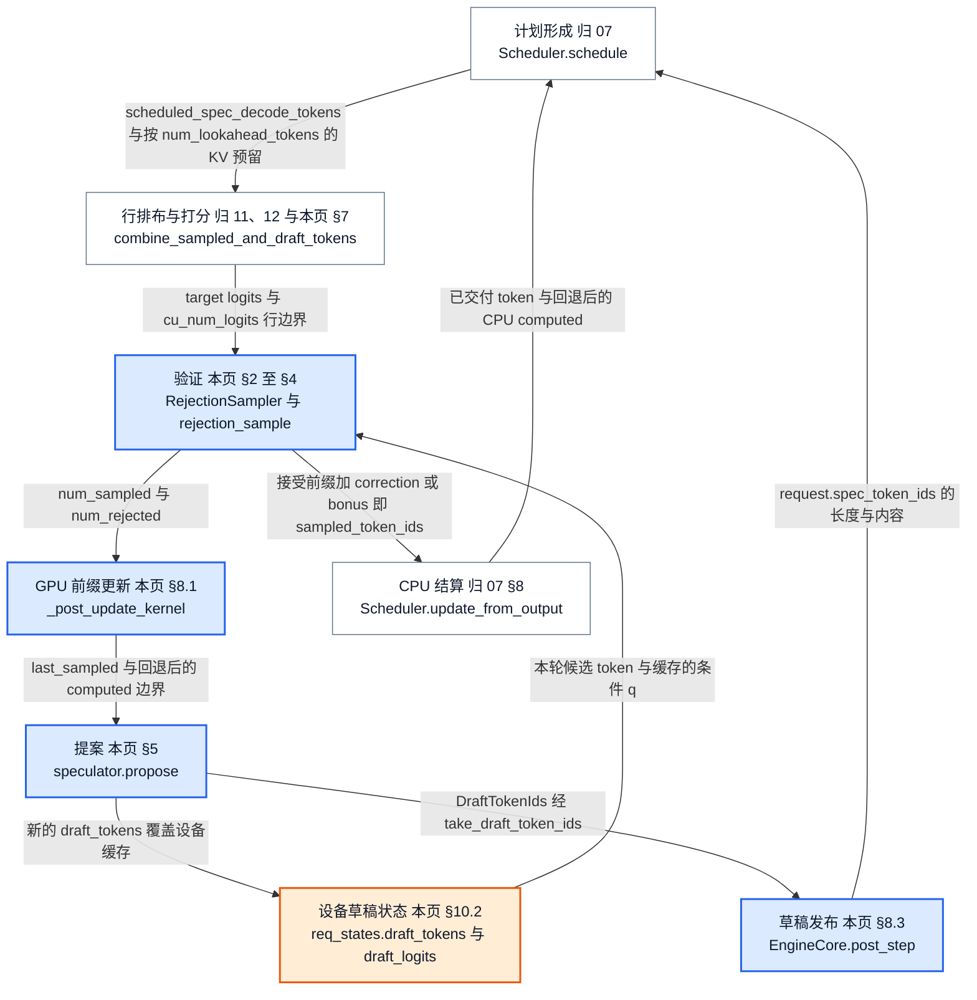
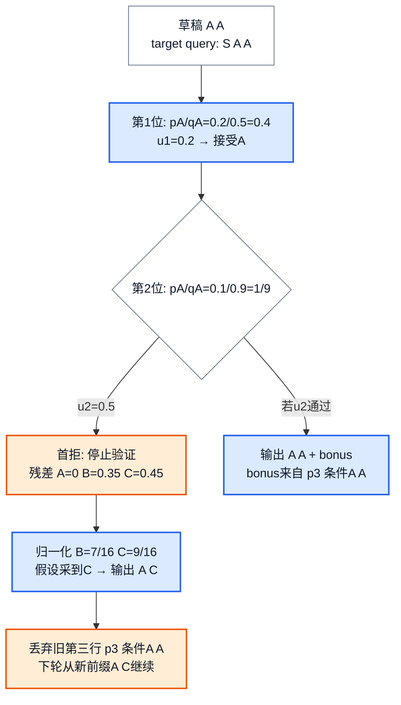
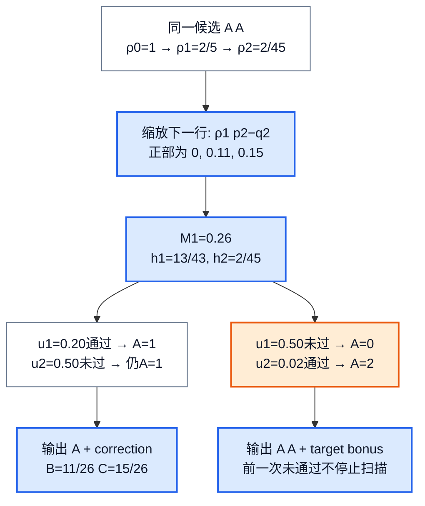
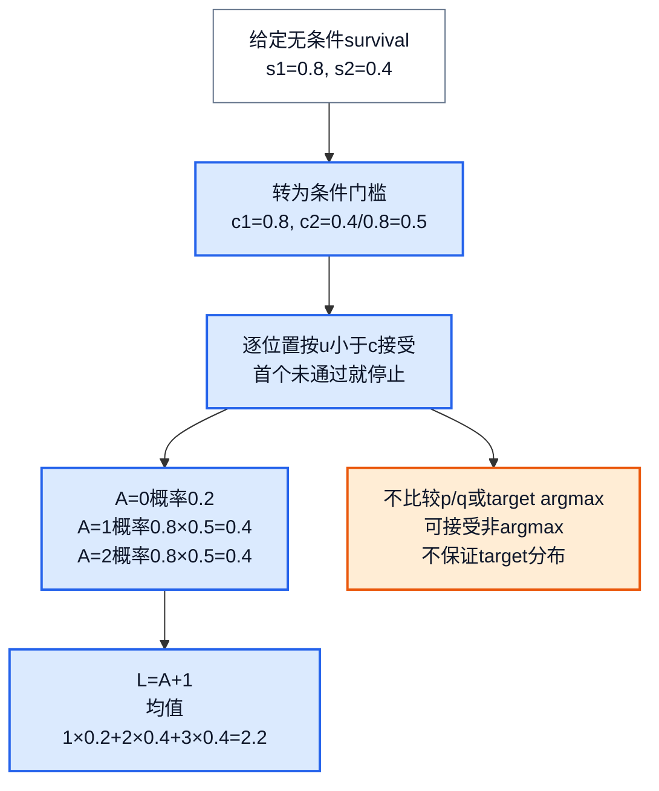
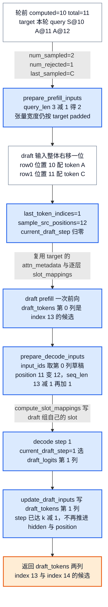
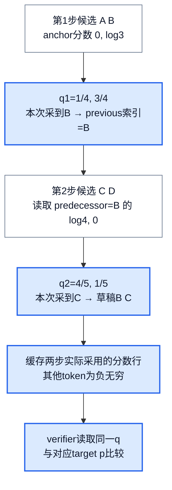
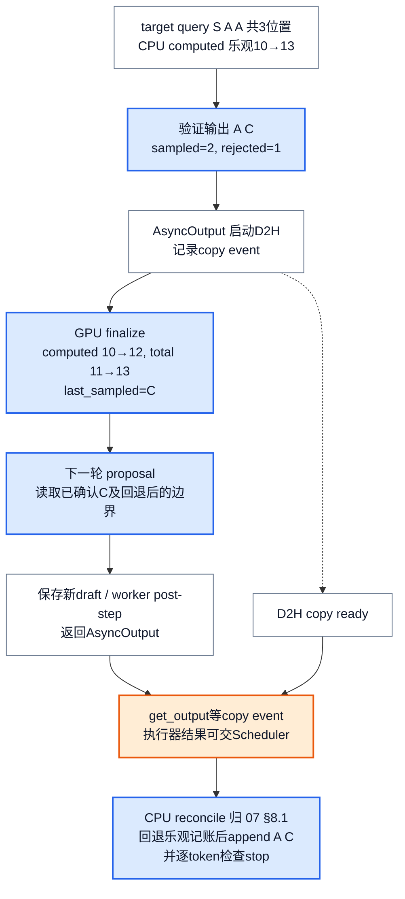
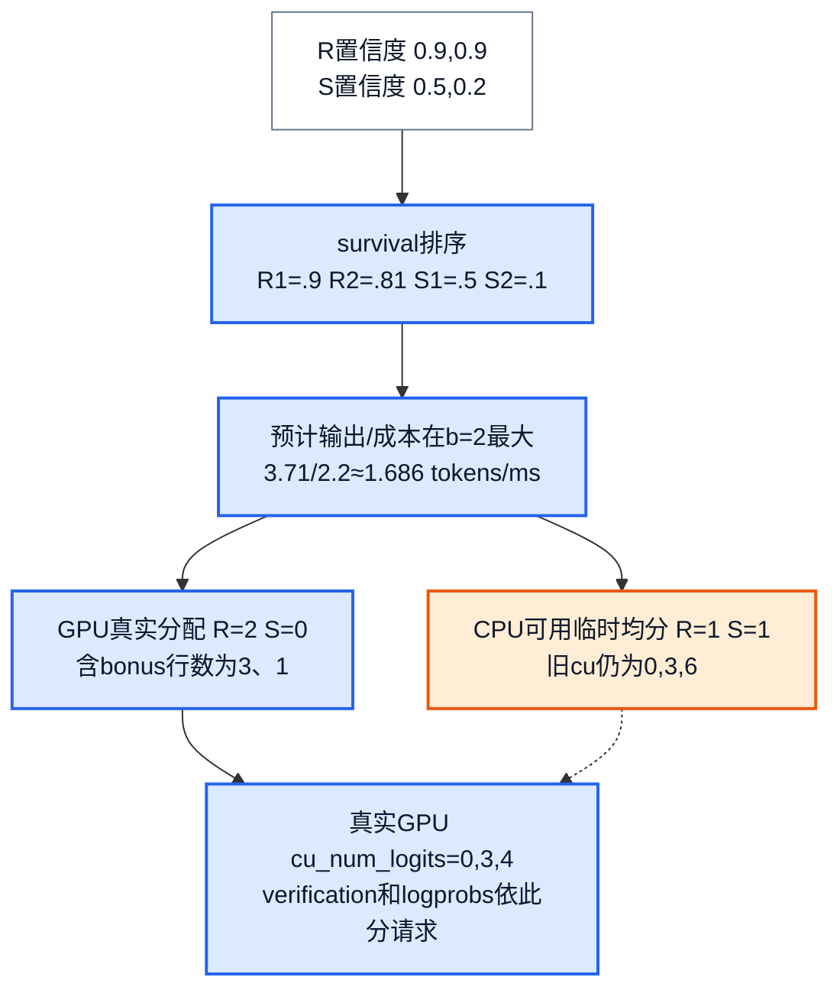

# vLLM 投机解码：怎样验证一串草稿，又只提交正确前缀

> **源码基线**：`vllm-project/vllm@199cb9b964822e59ab9b58d88e7be31eb419a2ae`（`main`，2026-09-07）
> **主题**：从三词表、两步候选推导 standard/block verification 与 correction/bonus，再追踪候选分布、target 打分、GPU 前缀更新和 CPU 结算，解释接受更多 token 何时能省时间。
> **适用范围**：启动构造 → 每步 propose → score → verify → rollback/commit → 草稿发布的完整闭环，含 draft KV 的归属与两个 lookahead 量、候选来源的执行接缝与成本；普通采样参数/grammar 语义归14，通用 KV block 生命周期与 hash/refcount 归08。区分 V1/V2、精确校正与 synthetic 模拟，不把共享 spec 字段的其他任务当作同一算法。
> **最近更新**：2026-09-12。补齐定位与核心流程清单、EAGLE/MTP 自回归 proposer 的逐步重放、启动构造与 draft KV 归属、`num_lookahead_tokens` 与草稿发布路径、调用树/所有权视图与配置契约。

## 1. 多算几个位置，为什么可能更快

普通 decode 每轮只能得到一个新的、可继续推理的 token。投机解码先让便宜的 proposer 猜出若干 token，再用一次较宽的 target forward 同时评价这些位置；目标是减少生成同样多 token 所需的**串行轮数**，并不是让 target 完全不计算那些位置。

设上轮已经采到 token S，但还没计算 S 的 KV；proposer 从含 S 的前缀猜出两个 token `x1,x2`。target 本轮输入 `S,x1,x2`，在三个位置分别给出分布：`p1` 判断 x1，`p2(·|x1)` 判断 x2，`p3(·|x1,x2)` 提供 bonus。如果只认可 x1，就输出 `x1,correction`，丢弃 x2 分支；如果两者都认可，就输出 `x1,x2,bonus`。这里的“丢弃”首先指不提交那条逻辑分支，物理 KV 回收另有时序。

**本页负责的单元是这条闭环本身**：怎样从配置解析出一个 proposer、它的权重与注意力层怎样和 target 分开、它的 KV 从哪个池子扣、每步怎样产生候选与其条件分布 q、一次宽 target forward 怎样按 q 与 p 判定接受长度、被接受的前缀怎样同时修正 GPU 与 CPU 两处进度，以及新草稿怎样回到 Scheduler。**它不是这几样东西**：不是 token 预算调度器（每步 token/input budget、waiting 准入、抢占与结果对账的 CPU 算术归 [[02_engineering/03_infer_frameworks/vllm/07_vllm_scheduler_analysis|Scheduler]]）；不是 KV block 分配器（block 生命周期、hash、refcount、prefix 命中算法归 [[02_engineering/03_infer_frameworks/vllm/08_vllm_kv_cache_management_analysis|KV Cache 管理]]）；不是普通采样参数路径（p 由哪些约束构成、grammar mask 的语义与 advance 归 [[02_engineering/03_infer_frameworks/vllm/14_vllm_sampling_structured_output_analysis|采样与结构化输出]]）；不是 graph 捕获的所有者（bucket/piecewise/eager 的成本跳变归 [[02_engineering/03_infer_frameworks/vllm/19_vllm_compilation_cudagraph_analysis|编译与 CUDA Graph]]）；设备行排布与输出发布归 [[02_engineering/03_infer_frameworks/vllm/11_vllm_model_runner_v1_analysis|Model Runner V1]] / [[02_engineering/03_infer_frameworks/vllm/12_vllm_model_runner_v2_analysis|Model Runner V2]]。本页只在这些边界上说明交接对象。

下文用词表 `A,B,C` 和两行**教学概率**。为便于逐项复算，第二行设为不随第一 token 改变；真实模型必须使用草稿前缀条件下的 p、q。p 是本请求受支持的采样约束处理后的 target 分布，q 是 proposer **实际用来产生候选**的分布。

| 位置 | target p：A、B、C | proposal q：A、B、C | 本轮取到的候选 |
|---|---|---|---|
| 第1位 | `0.20, 0.30, 0.50` | `0.50, 0.25, 0.25` | A |
| 第2位 | `0.10, 0.40, 0.50` | `0.90, 0.05, 0.05` | A |

先把这串 `A,A` 验证清楚，再回看 q 从何而来。若最终接受 A 个草稿，普通自回归轮次在 stop/长度截断前输出 $L=A+1$ 个 token；首拒时的 correction 和全接受后的 bonus 二选一。部分 prefill chunk 尚未完成时例外：不能向用户输出这些采样结果，设备计数会把 `num_sampled` 置0。依据：`vllm/v1/worker/gpu/input_batch.py::_combine_sampled_and_draft_tokens_kernel`、`_get_num_sampled_and_rejected_kernel`、`vllm/v1/worker/gpu/spec_decode/rejection_sampler_utils.py::_insert_resampled_kernel`。

### 1.1 一轮投机在引擎闭环里的位置

同一轮里有六个不能合并的边界：**计划形成**（Scheduler 决定本步排几个候选位置、预留多少 KV）、**提案**（drafter 生成下一轮候选）、**验证**（一次宽 target forward 判定接受长度）、**GPU 前缀更新**（设备侧 computed/last_sampled 立刻回退到正确边界）、**草稿发布**（新候选回到 Scheduler 的 `request.spec_token_ids`）、**CPU 结算**（Scheduler 按原计划回退乐观记账并对外交付 token）。把其中任意两个当成同一时刻，就会得到错误的时序结论：例如“copy 已启动”不等于已提交，提案发生在 CPU 结算**之前**而不是之后。

<!-- 图1 spec：一轮投机在 EngineCore 闭环里的位置。每条边写真实交接对象：scheduled_spec_decode_tokens 与 num_lookahead_tokens 的 KV 预留入场、target logits 与行边界进入 verifier、设备草稿缓存提供候选与条件 q、num_sampled/num_rejected 进 GPU 前缀更新、sampled_token_ids 经 AsyncOutput 进 CPU 结算、DraftTokenIds 经 take_draft_token_ids 进 post_step 再回 Scheduler。节点标归属页，蓝色为本页负责的环节，橙色是跨轮存活的设备状态。拓扑依赖图，不是时间比例图。 -->


### 1.2 核心流程清单

“基础”指任何一次投机运行都会经过；“条件”指只有某个方法或配置才出现，不能从本页读成每次推理都走这些分支。

| 核心流程 | 触发 | 实现入口 | 输出与交接对象 | 下游消费者（归属页） | 本页位置 | 类别 |
|---|---|---|---|---|---|---|
| 启动构造与配置解析 | `VllmConfig.__post_init__` 构造 `SpeculativeConfig` | `SpeculativeConfig.__post_init__`、`_verify_args`、`VllmConfig` 的 runner/async/adaptive validator | 解析后的 `method`、`draft_model_config`、`draft_parallel_config`、`num_speculative_tokens` | Worker 与两个 Runner 的 drafter 选择；Scheduler 读 `num_lookahead_tokens`（07） | §6.1、§11 | 基础 |
| 草稿权重加载与 draft 注意力层分离 | `Worker.load_model` 加载完 target 之后 | `GPUModelRunner.load_model` → `DraftModelSpeculator.load_model` → `load_draft_model` | 构造好的 draft `nn.Module`；`draft_attn_layer_names`；EPLB 登记 | KV spec 收集与 attention group 划分（08、10） | §6.2 | 条件：只有带权重的 drafter，n-gram/suffix 无此步 |
| draft KV 归属与 lookahead 预留 | `EngineCore._initialize_kv_caches`；每步 `allocate_slots` | `get_kv_cache_spec`、`_annotate_eagle_groups`、`speculator.set_attn`、`KVCacheManager.allocate_slots(num_lookahead_tokens=…)` | 同一 `KVCacheConfig` 内的 draft 组；`BlockTables`；每步 lookahead slots | 物理 block 分配与 prefix 命中（08）；每步 slot mapping（10） | §6.3、§6.4 | 条件：`num_lookahead_tokens` 为0的方法不预留 |
| 每步提案 | `sample_tokens()` 内 GPU 前缀更新之后 | `AutoRegressiveSpeculator.propose`，或 DFlash/DSpark/多模块 MTP 的对应 `propose` | `draft_tokens` 张量与 probabilistic 模式下的 `draft_logits` | 下一轮 verifier；草稿发布 | §5.2、§5.3 | 基础 |
| target 行排布与打分 | Scheduler 给出候选数后的 `execute_model` | `combine_sampled_and_draft_tokens`；V1 的 `SpecDecodeMetadata` | `logits_indices`、`cu_num_logits`、`expanded_idx_mapping`/`local_pos` | 采样参数处理与 verifier（14 提供 p 的约束语义） | §7 | 基础 |
| verify：standard / block / synthetic | `RejectionSampler.__call__` | `rejection_sample` 及 `_rejection_kernel`/`_resample_kernel`；block 另加两个累积/残差 kernel | `sampled`、`num_sampled`、可选 logprobs | GPU 前缀更新；CPU 结算 | §2、§3、§4 | standard 基础；block/synthetic 条件（`rejection_sample_method`，block 仅 MRV2） |
| GPU finalize 与 rollback | 验证返回后 | `postprocess_sampled` → `post_update` → `_post_update_kernel` | 设备上的 `num_computed_tokens`、`last_sampled_tokens`、token 历史 | 本轮 proposal；下一步 gather（12） | §8.1 | 基础 |
| 草稿发布回 Scheduler | `EngineCore._process_engine_step` 末尾；batch queue 的 deferred 分支 | `take_draft_token_ids` → `Executor.take_draft_token_ids` → `EngineCore.post_step` → `Scheduler.update_draft_token_ids` | `DraftTokenIds`；写入 `request.spec_token_ids` | 下一次 `schedule()` 的候选数与 grammar 过滤（07、14） | §8.3 | 基础（同步）；条件（batch queue 的 deferred 路线；async 下 `post_step` 为空操作） |
| CPU 结算 | 执行器交回 `ModelRunnerOutput` | `Scheduler.update_from_output`、`_update_request_with_output` | 回退后的 CPU computed；追加的 token 与 stop 判定 | 请求历史、后续调度与用户输出（07 §8） | §8.2 | 基础 |
| grammar 预演与 `-1` 语义 | 请求使用结构化输出；uniform-decode padding；async 调度 | `Scheduler.update_draft_token_ids_in_output`、`Scheduler.schedule` 的 `pad_spec_decode` 分支、`AsyncScheduler._update_after_schedule` | 含 `-1` 的 `scheduled_spec_decode_tokens`；`num_invalid_spec_tokens` | verifier 的 placeholder 分支；统计（23） | §3.3、§7 | 条件：三种来源各有自己的触发 |
| adaptive 预算 | DSpark + `enable_adaptive_verification` | `AdaptiveVerificationManager.get_num_tokens`、`compact_batch`、`_assign_draft_token_budget`、`reallocate_drafts` | 全 batch draft 预算与每请求 admitted count；GPU 真实 `cu_num_logits` | verifier 分块与 logprobs 边界 | §9.3 | 条件 |
| 抢占与在途结果 | KV 不足触发抢占；async 在途结果迟到 | `Scheduler._preempt_request`、`_free_encoder_inputs`、`AsyncScheduler._update_request_with_output` | 清空的未验证草稿；按序或 drop-stale 的结果交付 | 队列与资源回收（07）；多模态 E 缓存（15） | §8.4 | 条件：async 与 drop-stale 模式 |
| CUDA graph 宽度交接 | KV 初始化末尾解析 graph 模式；capture | `decode_query_len`、`VllmConfig.uniform_decode_query_len`、`ModelCudaGraphManager(varlen_decode=…)`、`speculator.init_cudagraph_manager`/`capture` | 统一的 `1 + K` decode query 宽度；drafter 自己的 prefill/decode graph | graph 捕获与降级（19） | §6.2、§9.1 | 基础（非 eager 时）；adaptive 下强制 `FULL_AND_PIECEWISE` 为条件 |

## 2. Standard：少掉的概率质量必须在拒绝时补回来

### 2.1 一行概率的守恒，比“是否猜中”更重要

proposal 按 q 采到 x，standard 以 $\alpha(x)=\min(1,p(x)/q(x))$ 接受；拒绝后从 $r(y)=[p(y)-q(y)]_+/Z$ 采 correction，其中 $[z]_+=\max(z,0)$，$Z=\sum_y[p(y)-q(y)]_+$。

对第1行逐词计算，就能看到为什么不能简单地“拒绝后再从 p 采一次”：

| token | q 提案质量 | 接受概率 α | 被接受而输出的质量 `q×α` | 拒绝后补上的质量 `[p−q]+` | 总输出质量 |
|---|---|---|---|---|---|
| A | 0.50 | 0.40 | 0.20 | 0 | 0.20 |
| B | 0.25 | 1 | 0.25 | 0.05 | 0.30 |
| C | 0.25 | 1 | 0.25 | 0.25 | 0.50 |

总拒绝概率是0.30；correction 在 B/C 间按 `1/6,5/6` 采样。因此对任意 y，$\min(p(y),q(y))+[p(y)-q(y)]_+=p(y)$。如果拒绝时重新采 p，A 会在原有0.20之外又得到 `0.30×0.20=0.06`，立刻产生偏差。这个逐位置守恒在前面候选已被接受的条件下继续成立，才得到目标自回归分布。

### 2.2 两步候选遇到首拒，后面的 target 行不再可用

对 `A,A` 取均匀随机数 `u1=0.20,u2=0.50`。第1位 A 的阈值0.40，接受；第2位 A 的阈值 `0.10/0.90=1/9`，拒绝，验证到此停止。第2行残差为 `0,0.35,0.45`，归一化后 B/C 为 `7/16,9/16`；假定本次 correction 采到 C，输出就是 `A,C`。

目标已经算过的第三行是 `p3(·|A,A)`，不对应现在的前缀 `A,C`，所以本轮不能再把它当 bonus 使用。只有两步全接受，第三行才有正确上下文，直接从中采 bonus。依据：`vllm/v1/worker/gpu/spec_decode/rejection_sampler_utils.py::_rejection_kernel`、`_resample_kernel`。

<!-- 图2 spec：同一AA候选与两行p/q，先比较0.2与0.4，再比较0.5与1/9；展示第二位残差0/.35/.45、归一化7/16和9/16、输出AC及错误上下文第三行被弃用。另给全接受分支到bonus，明确原理而非调用图。 -->


### 2.3 one-hot、greedy target 与数值实现

缺少 full draft logits 时，verifier 将候选视为 one-hot q。若确定性 proposer 总选 A，则第1位接受概率是 p(A)=0.20，拒绝后只删除 A 的 target 质量，B/C 归一化成 `3/8,5/8`；最终仍是 `0.20,0.30,0.50`。这是 n-gram/argmax 等入口采用的校正方式。即使候选来源带随机性，在给定本次候选的条件下按点质量做这套校正、并保持回采随机性独立，仍能得到 p；只是没有利用原提案分布的重叠来提高接受率。例如第1行若候选仍按原 q 抽取，one-hot 校正的平均接受率为 `0.50×0.20+0.25×0.30+0.25×0.50=0.30`，而使用 full q 是0.70。

若 **target** temperature=0，目标策略是 argmax，standard 只接受与 target argmax 相同的连续草稿，首个不同位置直接输出 target argmax。它和“draft 使用 greedy、target 仍随机”是两种情况。默认 `draft_sample_method=greedy` 通常省掉 full q 的持久显存；probabilistic 模式则需要保存实际 q。依据：`vllm/config/speculative.py::SpeculativeConfig.draft_sample_method`、`vllm/v1/worker/gpu/spec_decode/rejection_sampler_utils.py::_rejection_kernel`。

MRV2 在词表块上归约 max/sumexp，再用 `log p(x) > log u + log q(x)` 做 standard 检查。target 已做 temperature，缓存的 draft logits 尚未做，因此读取 q 时还要除 temperature。full q 的 correction 用数值更稳定的 `log r = a + log1p(−exp(b−a))`，仅在 a>b 时保留，其中 a/b 是 target/draft log-prob；词表各块做 Gumbel argmax，再归约到一个 token。V1 则物化 target probabilities，按 `p/q ≥ u` 检查，并预先为各可能拒绝位置做残差/指数竞赛，最后只选首拒位置的结果；它的 bonus 先由普通 Sampler 独立采好。两者算法边际一致不意味着同 seed 逐 token 一致。依据：`vllm/v1/worker/gpu/spec_decode/rejection_sampler_utils.py::_compute_global_logprobs_and_logsumexp`、`_resample_kernel`；`vllm/v1/sample/rejection_sampler.py::RejectionSampler.forward`、`rejection_random_sample_kernel`、`sample_recovered_tokens`、`sample_recovered_tokens_kernel`。

V1 内核的接受判据还带一个显式保护：`draft_prob > 0 and target_prob / draft_prob >= uniform_prob`。源码注释说明 draft 概率本不该为0，检查它只为避免 NaN；实际效果是**零概率草稿一律拒绝**，而不是按比值判定。所以 §2.1 的 `p/q ≥ u` 要读成“在 q(x)>0 的前提下”。依据：`vllm/v1/sample/rejection_sampler.py::rejection_random_sample_kernel`。

分布保证还有 RNG 前提：proposal 和 residual 不可复用同一噪声向量，否则“某 token 赢得草稿 argmax”已经对其余噪声施加条件，残差采样会偏。MRV2 的 `gumbel_noised_argmax()` 对 drafting 的 position 加 `_DRAFT_NOISE_SALT=1<<30`，使同请求同位置的提案与回采分流。窄词表20万 trial 测试专门覆盖这个问题；不能仅以粗粒度大词表统计不显著来证明无偏。依据：`vllm/v1/worker/gpu/sample/gumbel.py::gumbel_noised_argmax`、`tests/v1/spec_decode/test_rejection_sampler_utils.py::test_gumbel_drafted_rejection_sample_is_unbiased`。

## 3. Block：决定整个前缀长度，而非逐位首拒即停

### 3.1 三个量重新分配“接受哪个前缀”

MRV2 的 `block` verification 仍返回一段连续前缀加一个 correction/bonus，但它**不会因为某次局部 threshold 未通过，就立即结束有效草稿的扫描**。对候选 $x_1,\ldots,x_k$，用与 p 区分的符号 ρ 表示源码 `cumulative_log_p` 所保存的递推比值：

$$
\rho_0=1,\qquad
\rho_i=\min\left(1,\rho_{i-1}\frac{p_i(x_i)}{q_i(x_i)}\right).
$$

对 i<k，再看下一位置分布的残差总质量及阈值：

$$
M_i=\sum_y[\rho_i p_{i+1}(y)-q_{i+1}(y)]_+,\qquad
h_i=\frac{M_i}{M_i+1-\rho_i}.
$$

内核写作 `tl.where(denom > 0.0, residual_mass / denom, 1.0)`，即**分母不为正**时取 h=1；这一支同时覆盖浮点上 $\rho_i > 1 + M_i$ 的情形，不只是恰好为0。最后一个有效候选取 $h_k=\rho_k$。依次比较各位置的独立 u，每当 $u_i\le h_i$ 就把 accepted length 更新为 i，未通过则保留此前的长度。扫描结束的最大成功 i 才是最终 A；若一次都未通过则 A=0。它可能在前面某次未通过之后，仍接受更长的完整前缀；不会输出有洞的候选子集。

A<k 时，correction 改为 $r_A(y)\propto[\rho_Ap_{A+1}(y)-q_{A+1}(y)]_+$；A=0 的 ρ 为1，退化为标准首位置残差。A=k 则直接从 target bonus 行采样。one-hot q 的 $M_i=\rho_i(1-p_{i+1}(x_{i+1}))$；回采只需删掉被拒 token，公共 ρ 因子归一化时消去。依据：`vllm/v1/worker/gpu/spec_decode/rejection_sampler_utils.py::_compute_cumulative_log_p_kernel`、`_compute_local_residual_mass_kernel`、`_compute_global_residual_mass`、`_rejection_kernel`、`_resample_kernel`。

### 3.2 把同一串 A,A 真正算一遍

第1位 `ρ1=0.20/0.50=2/5`；第2位 `ρ2=(2/5)×(0.10/0.90)=2/45`。下一行的缩放残差为 `ρ1×p2−q2=(-0.86,0.11,0.15)`，故 `M1=0.26=13/50`，`h1=0.26/(0.26+0.60)=13/43≈0.3023`；最后 `h2=2/45≈0.0444`。

用原来的 `u1=0.20,u2=0.50`，第1次更新 A=1，第2次不更新，输出第一个 A，再从 `B=11/26,C=15/26` 采 correction。这已经不同于 standard 的 `B=7/16,C=9/16`，不能只替换 acceptance rule 而保留原残差。

再取 `u1=0.50,u2=0.02`：block 第1次未通过，但第2次通过，最终 A=2，输出 `A,A,bonus`；同一组 u 在 standard 中会在第1个 A 就停止。这是 block 延长前缀的机制，不是说它对每一条固定候选、每一次随机数都优于 standard。

<!-- 图3 spec：AA的rho递推与下一行缩放残差导出h1=13/43,h2=2/45；两组u一组得到A1且用11/26与15/26补偿，另一组先失败后成功仍A2。必须把block扫描非首拒停止的差异与残差缩放同时表达。 -->


可以进一步检查本例的概率守恒，而不只看两次随机抽签。给定候选 AA，最终 A=2/1/0 的概率分别为 `2/45`、`(1−2/45)×13/43=13/45`、`2/3`。把所有9种 proposal 链以 `q1(x1)q2(x2)` 加权，对各自的三种 A 使用对应 correction；若只输出一个 token，就让下一轮按 target p2 补到两位。得到下面的完整两-token 联合质量，恰好等于 `p1×p2`：

| 第1个输出 | 第2个为A | 第2个为B | 第2个为C |
|---|---|---|---|
| A | 0.02 | 0.08 | 0.10 |
| B | 0.03 | 0.12 | 0.15 |
| C | 0.05 | 0.20 | 0.25 |

这是本页有限词表的精确枚举，不是一般 block 正确性定理的完整证明，也不把“本轮输出长度至少2”的条件分布偷换成完整生成序列分布。源码测试另外检查固定 p/q 的各 emitted position 边际，并用大量 trial 比较平均 accepted length；这些测试支持实现边界，不证明任意实际 workload 都更快。依据：`tests/v1/spec_decode/test_rejection_sampler_utils.py::test_block_verification_rejection_sample`、`test_block_verification_accepts_at_least_as_many`。

### 3.3 无效草稿与 target greedy 是明确分支

`-1` placeholder 不是词表里的一个 token。standard 遇到它必拒；block 遇到它结束可验证区间，前一个真实 token 改用“最后位置”阈值 ρ，不能再使用 placeholder 那一行的下一步残差。即使 `-1` 后还有看似合法的 token，也不能重新进入验证。回采遇到 placeholder 直接使用 target logits；greedy path 则必须写 target argmax，避免留下未初始化输出槽。依据：`_rejection_kernel`、`_resample_kernel`；`tests/v1/spec_decode/test_rejection_sampler_utils.py::test_block_verification_placeholder_truncates_block`、`test_placeholder_blocks_later_draft_tokens`、`test_greedy_placeholder_emits_target_argmax`。

`-1` 从哪里来有四个来源，本页拥有内核侧语义，Scheduler 侧的产生条件见 §7：grammar 校验补齐、uniform-decode 的 CUDA graph padding、async 调度的占位列表，以及 MRV2 在不需要把真实候选送回 CPU 时直接返回的全 `-1` 列表。

target greedy 在内核中先于 block 分支选择，执行普通 argmax 前缀匹配；block 与 synthetic rate 张量不可同时传入。另一个实际边界是 **block 算法实现位于 MRV2**。V1 `RejectionSampler.__init__()` 只读取 synthetic 模式，没有 block 分支；本基线配置/Runner 选择也没有因 `rejection_sample_method=block` 就强制 V2 的对应 guard。因此仅看到配置值不能断言当前 V1 请求正在运行 block 算法。依据：`vllm/v1/worker/gpu/spec_decode/rejection_sampler.py::RejectionSampler.__init__`、`vllm/v1/sample/rejection_sampler.py::RejectionSampler.__init__`、`vllm/config/vllm.py::VllmConfig._get_v2_model_runner_unsupported_features`。

## 4. Synthetic：设定接受经济性，不再做 p/q 校正

synthetic 接受条件改成 `u_i < c_i`。用户给的是无条件 survival `s_i=Pr(A≥i)`，内部换成 `c1=s1`、`ci=si/s(i−1)`；若分母已为0，后续条件率置0。本例若设置 `s=[0.8,0.4]`，实际逐步门槛为 `[0.8,0.5]`，而不是把 `[0.8,0.4]` 再连乘成0.32；对应 A=0/1/2 概率 `0.2,0.4,0.4`，平均输出长度 `1+0.8+0.4=2.2`。依据：`vllm/v1/spec_decode/utils.py::unconditional_to_conditional_rates`、两条 Runner 的 rejection kernel。

<!-- 图4 spec：synthetic独立于p/q，给s=.8/.4先转c=.8/.5，再按首个未通过停止得A0/1/2概率.2/.4/.4和L=A+1平均2.2；旁支明示target greedy也可接受非argmax，因此不能提供target分布保证。拓扑数值变换图，不是物理布局。 -->


当前配置也可直接给 `synthetic_acceptance_length`，它与 rates 二选一。比如 k=3、目标平均长度2.6，内部生成无条件 rates `[1,0.6,0]`，使输出长度仅在2和3之间变化；这不是旧文档用语所暗示的普遍“指数衰减接受率”。配置验证 rates 的长度、[0,1]范围和单调不增，以及 length 在 `[1,k+1]`。依据：`vllm/config/speculative.py::SpeculativeConfig._acceptance_length_to_rates`、`_resolve_synthetic_acceptance_rates`、`_verify_args`。

synthetic 仍复用相同的输出/回采骨架，却已失去 §2 的 `q×α=min(p,q)` 条件；即使 target greedy 也能按给定 rate 接受一个不等于 target argmax 的 draft。它用于受控接受长度实验，不能声称生成分布仍等于 target。相关测试的 oracle 是实际 per-position survival 接近配置，和 standard/block 的分布检验不同。依据：`tests/v1/spec_decode/test_rejection_sampler_utils.py::test_synthetic_rejection_sample`、`tests/v1/spec_decode/test_synthetic_rejection_sampler_utils.py::test_acceptance_length_to_rates`。

## 5. q 从哪里来：共同出口不意味着共同提案算法

### 5.1 变体集合的枚举依据与实际可走的 Runner

枚举依据是三处源码自身的选择点，不是按类名推断：配置的 `SpeculativeMethod` 取值集合、MRV2 的 `vllm/v1/worker/gpu/spec_decode/__init__.py::init_speculator` 分派、V1 的 `vllm/v1/worker/gpu_model_runner.py::GPUModelRunner.__init__` 分支。`SpeculativeMethod` 展平后有 **39** 个字面量成员，其中 `MTPModelTypes` 的 27 个成员里除 `"mtp"` 之外的 26 个在 `__post_init__` 里告警并折叠成 `"mtp"`，因此**实际可区分的方法值是 13 个**：`ngram`、`ngram_gpu`、`suffix`、`medusa`、`mlp_speculator`、`draft_model`、`custom_class`、`eagle`、`eagle3`、`mtp`、`dflash`、`dspark`、`extract_hidden_states`。

`mlp_speculator` 是这 13 个里唯一**可配置但两个 Runner 都未实现**的值：`__post_init__` 会在 draft checkpoint 的 `model_type == "mlp_speculator"` 时把 method 设成它，`_verify_and_get_draft_tp` 还专门把它的 draft TP 压到1并告警；但 `init_speculator` 走到 `else` 抛 `NotImplementedError`，V1 `GPUModelRunner.__init__` 走到 `else` 抛 `ValueError("Unknown speculative decoding method: …")`，`vllm/model_executor/models/registry.py` 里的 `MLPSpeculatorPreTrainedModel` 条目也是注释掉的。所以一个真实 `mlp_speculator` checkpoint 在 runner 构造处失败，而不是在配置校验处。

它们在词表、draft TP、KV dtype、attention backend、额外 slot 和采样模式上有各自约束；不能从共用字段推断所有方法在两个 Runner 都实现。

| 路径 | 当前候选来源及有界接缝 | q 的含义 |
|---|---|---|
| MRV2 EAGLE/EAGLE3/MTP | `AutoRegressiveSpeculator` 先处理已确认的 target token/hidden，再逐步用上一个 draft 生成下一个；EAGLE3 合并辅助 hidden。逐步重放见 §5.2 | probabilistic 时缓存各步实际分布；greedy 时 one-hot |
| MRV2 Gemma4 MTP、多模块 MTP | `use_gemma4_mtp()` 选 `Gemma4Speculator`（仍是自回归子类，但 `advance_draft_positions` 为假，Q-only 共享 target KV、位置不推进）；`use_multi_module_mtp()` 选 `MultiModuleMTPSpeculator`（直接继承 `DraftModelSpeculator`，每个 module 负责一步） | 同上；多模块另受 §7 的 prefill lookahead 约束 |
| MRV2 DFlash | 一次 masked draft forward 产生多位置 hidden，再对各位置采样 | 来自这次并行 hidden 的实际采样 logits；不是额外运行 target |
| MRV2 DSpark、DFlash2 | `DSparkSpeculator`/`DFlash2Speculator` 都继承 `DFlashSpeculator`；backbone 可并行，候选采样仍有顺序依赖，见 §5.3 | 必须保存经过 Markov/selector 修正的条件分布 |
| V1 n-gram / ngram_gpu / suffix | 从已生成上下文匹配可延续 token；suffix 用外部 cache 的模式与频率门槛决定可变长度 | 这些入口返回 token IDs，不提供 full q |
| V1 Step3.5 MTP | `use_step3p5_mtp()`（要求 `method == "mtp"` 且 draft `model_type == "step3p5_mtp"`）选 `Step3p5MTPProposer`，并在 per-group attention metadata 上另设接口。MRV2 **没有专用分支，也没有 unsupported 条目**：`init_speculator` 的 `"mtp"` 分支把它当通用 `MTPSpeculator` 静默跑起来，丢掉的是 V1 那套 per-group 接口——与 §3.3 里 `block` 在 V1 的情形同理，看到配置值不等于跑着专用实现 | 同 MTP |
| V1 draft_model、Medusa、custom_class 等 | 独立 draft 模型运行；Medusa 从 target hidden 经多个 head 各取 argmax；custom 接口交回候选 | 提供完整 q 才走 full-distribution 校正；只给候选则按 §2.3 的点质量处理 |

V2 当前列出的 spec 方法是 eagle/eagle3/mtp/dflash/dspark/extract_hidden_states；ngram/ngram_gpu、draft_model、suffix、Medusa/custom、`mlp_speculator` 等自动选择会落回 V1（`mlp_speculator` 落回 V1 后仍然抛错）。Step3.5 MTP 是另一种情形：它的 `method` 已经折叠成 `mtp`，两个 runner 的 unsupported 表里都没有它，所以 MRV2 不会因此落回 V1，只是按通用 `MTPSpeculator` 运行（见上表）。parallel EAGLE 也未在 V2 实现；DFlash/DSpark 原生支持自己的并行 drafting。反过来，DSpark/adaptive、DFlash2 和需要多 KV group 的混合 sliding/full DFlash 会阻止 V1。显式 Runner 配置还需通过相应 validation。依据：`vllm/config/vllm.py::VllmConfig._get_v2_model_runner_unsupported_features`、`_get_v1_model_runner_unsupported_features`、`vllm/v1/worker/gpu/spec_decode/__init__.py::init_speculator`、`vllm/v1/worker/gpu_model_runner.py::GPUModelRunner.__init__`。

n-gram 的一个最小例子是历史 `A B C A B`，以末尾 `A B` 查到早先同样的串，接上它后面的 token C。CPU 实现用反转序列和 LPS 匹配寻找允许长度内的最长 suffix；相同长度取原序列较早匹配，并截到 k/模型最大长度。依据：`vllm/v1/spec_decode/ngram_proposer.py::_find_longest_matched_ngram_and_propose_tokens`。

suffix 入口则把新输出写入请求 cache，取最近 max_tree_depth 个 token 作 pattern，按 max_spec_factor/min_token_prob 请求延续。这是一条**依赖边界**：树算法在第三方 Arctic Inference 里，本地没有实现，不能编造内部选择过程。本地源码能证明的只有三件事：`_validate_suffix_decoding()` 调 `has_arctic_inference()`，缺库时抛 `ImportError` 并指明版本 `pip install arctic-inference==0.1.1`；未显式给 `num_speculative_tokens` 时默认取 `suffix_decoding_max_tree_depth`（类默认24）并告警；以及本地校验四个 `suffix_decoding_*` 取值范围。跨界传出的对象是 pattern 与两个门槛，传回的是一串 token IDs 且长度可变；其内部为何选中这串，只能按该库的公开文档陈述，不能当作已读执行。依据：`vllm/config/speculative.py::SpeculativeConfig._validate_suffix_decoding`、`vllm/v1/spec_decode/suffix_decoding.py::SuffixDecodingProposer.propose`。

### 5.2 EAGLE/MTP：把同一串 S→x1,x2 的后续走一遍

这是 MRV2 上最常用的 proposer，也是前面各节隐含假设的那一条。`EagleSpeculator`、`MTPSpeculator`、`Gemma4Speculator` 都继承 `AutoRegressiveSpeculator`，后者继承 `DraftModelSpeculator`。接着 §8.1 的状态往下走：轮前 `num_computed_tokens=10`、已确认长度11，target 本轮三个 query 为 S@10、A@11、草稿 A@12；verifier 给出 `num_sampled=2`、`num_rejected=1`，输出 `A,C`，`last_sampled=C`，设备 total 变13、computed 变12。k=2。

**第0步（draft prefill）。** `prepare_prefill_inputs` 的 Triton kernel 先算 `query_len = query_end − query_start = 3`，再 `query_len -= num_rejected` 得 2——被拒位置从有效区间里去掉，但张量形状仍保持与 target 相同的 padded 宽度，源码注释说明这是为了在 CPU 不知道 rejected 数的情况下避免同步，并直接复用 target 的 `query_start_loc`/`seq_lens`。`num_sampled > 0`，所以 `next_token` 取 `last_sampled[req_state_idx] = C`（若本请求还在 chunked prefill，则改取 `next_prefill_tokens`）。接着把 target input ids 整体**右移一位**：`draft_input_ids[0] = target_input_ids[1] = A`；`last_token_index = query_start + query_len − 1 = 1`，该位置写入 `next_token = C`。positions 按原样复制为 `[10, 11]`。最后一个 program 还顺手把 `current_draft_step` 归零，并为 CUDA graph 填齐 `query_start_loc`/`seq_lens`/`last_token_indices` 的尾部。

于是 drafter 的第 P 行携带“位置 P 的 target hidden”加“位置 P+1 的 token”，用来预测位置 P+2 的 token。`_prefill()` 的注释正是这个口径，并据此把采样键设为 `sample_src_positions = positions + 1`：取 `last_token_indices=1` 对应 `positions=11`，得 12。所以 `draft_tokens[:,0]` 是 index 13 的候选，采样键是它前一个位置 12。这一步的 attention 直接复用 target 传进来的 `attn_metadata` 与逐层 `slot_mappings`，源码说明理由是 batch 形状与 KV 布局完全相同。

**第1步（draft decode）。** `prepare_decode_inputs` 把 `draft_tokens[:,0]` 写进 `input_ids`，`sample_src_positions` 12→13，`seq_len = target_seq_len − num_rejected = 13 − 1 = 12`，在 `ADVANCE_DRAFT_POSITIONS` 为真时再 `position 11→12`、`seq_len 12→13`（两者都对 `max_model_len` 做 clamp）。`_multi_step_decode` 随后用 `self.block_tables.compute_slot_mappings(idx_mapping, query_start_loc, positions, …)` 为这一步单独算 slot——写入的是 **draft 组自己的 slot**（§6.3）。这里的逻辑位置12与 §8.1 那个“旧 A@12”同号却不在同一份缓存：被拒草稿留下的陈旧 KV 在 **target 组**，而 draft 组的位置12是本轮第一次写（它的 prefill 只覆盖 draft 位置10与11）。`self.current_draft_step.fill_(step)` 之后，probabilistic 模式下 `sample_draft()` 把这一步的实际分布写进 `draft_logits[:, step]`；greedy 模式 `draft_logits` 为 `None`，直接走 `_greedy_sample_draft()`（`use_local_argmax_reduction` 时改调模型的 `get_top_tokens()`）。`update_draft_inputs` 把采到的 token 写进 `draft_tokens[:, step]`；因为 `step == k − 1`，它在写完后直接返回，不再推进 hidden/position/seq_len。k=1 时 `propose()` 在 prefill 之后就早退，返回 `draft_tokens[:num_reqs, :1]`。

`advance_draft_positions` 是子类可覆盖的**属性**而非动作：Eagle/标准 MTP 为真（每步产生新 KV），Gemma4 MTP 为假（Q-only、共享 target KV、位置恒定）。为假时 `_multi_step_decode` 只在 `step == 1` 建一次 slot mapping 与 metadata，后续步复用。

<!-- 图5 spec：EAGLE/MTP 自回归 proposer 对同一个 S@10/A@11/A@12 例子的逐步重放。输入是 num_sampled=2、num_rejected=1、last_sampled=C；展示 query_len 3 减 1、右移一位后的两行输入、last_token_indices 与 sample_src_positions 的 +1 关系、复用 target slot mapping 的 prefill、decode 步各自的 slot 与 draft_logits 列、以及 step=k−1 的终止条件。有序数值变换图，不是调用图，也不绘制二维 KV 布局。 -->


**第二条执行路径：fused multi-step decode。** `_configure_fused_multi_step_decode()` 在 `set_attn()` 里决定：k=1 关闭；`advance_draft_positions` 为假时强制开启；否则要求所有 attention group 的 `supports_draft_decode_metadata_update` 都为真，任一不支持就打印 info 并退回逐步重建。开启后 `_fused_multi_step_decode` 只建**一次** slot mapping 与 `step=1` 的 metadata，然后在 `_generate_fused_drafts` 的每步之间调 `attn_group.update_draft_decode_metadata(attn_metadata)` 原地推进，省掉每步的 metadata 构建。两条路径的 token 语义相同，差别在每步的 CPU/GPU 构建成本，以及对 backend 能力的要求。

**增量成本。** prefill 步按 target 的 padded query 宽度跑一次 draft forward，因此也为被拒位置付了算力；此后每个 decode 步是每请求1行的 draft forward 加一次采样，逐步重建模式还要加一次 slot mapping 与 metadata 构建。`init_cudagraph_manager()` 为 drafter 建两个 graph manager：prefill 侧宽度 `num_speculative_steps + 1`，decode 侧宽度1，且 decode 只在 target 的 decode 模式为 `FULL` 时用 `FULL_DECODE_ONLY`，否则为 `NONE`——PIECEWISE 不用于 draft decode。依据：`vllm/v1/worker/gpu/spec_decode/autoregressive/speculator.py::AutoRegressiveSpeculator.propose`、`_prefill`、`_multi_step_decode`、`_fused_multi_step_decode`、`_generate_fused_drafts`、`_generate_draft`、`_configure_fused_multi_step_decode`、`advance_draft_positions`、`init_cudagraph_manager`、`_prepare_prefill_inputs_kernel`、`_prepare_decode_inputs_kernel`、`_update_draft_inputs_kernel`；`vllm/v1/worker/gpu/spec_decode/speculator.py::DraftModelSpeculator.sample_draft`、`_greedy_sample_draft`。

### 5.3 并行 hidden 之后，候选仍可能逐步依赖前项

`DraftModelSpeculator.sample_draft()` 的概率模式缓存 **pre-temperature logits**，draft 侧通常只用 temperature、不应用 target 的 top-k/top-p 等约束；源码注释明确这样做“不影响 rejection sampling 之后的输出分布”，只影响接受率。缓存张量的 dtype/填充由 `draft_logits_spec()` 决定，**默认是 `(model_config.head_dtype, 0.0)`**；只有 DFlash2 覆盖成 `(float32, -inf)`。所以“FP32 draft logits”是 DFlash2 的性质，不是通用事实。依据：`vllm/v1/worker/gpu/spec_decode/speculator.py::DraftModelSpeculator.sample_draft`、`draft_logits_spec`、`_copy_request_inputs`；`vllm/v1/worker/gpu/spec_decode/dflash2/speculator.py::DFlash2Speculator.draft_logits_spec`。

DSpark 的 `_sample_sequential()` 先取得所有位置的 base logits，然后以 anchor token 开始，每步加上由上一个已采 draft 的 Markov embedding 产生的 bias，再采样并更新 prev。教学例：某步 B/C base 分数都是0，而 prev=A 时 bias 为 `(0,log 3)`，temperature=1 下实际 q 是 `(1/4,3/4)`，不是 base 的 `(1/2,1/2)`。此外有两处独立的边界：

- top-k 变体 `_sample_sequential_topk()` 先选 base 候选，再只修正这些候选、把其余项设为负无穷；rejection 必须使用截断后的 q。
- `_sample_logits()` 在 draft vocab 小于 target vocab 时，把概率模式的 logits **scatter 回 target token ID 空间**；verifier 读到的列号因此是 target 词表的列号，而不是 draft 自己的。

依据：`vllm/v1/worker/gpu/spec_decode/dspark/speculator.py::DSparkSpeculator._sample_sequential`、`_sample_sequential_topk`、`_sample_logits`。

DFlash2 则先为每步选 K 个候选，selector 给出“前一候选索引→当前候选”的分数。walk 从 anchor 行开始，采到哪个候选，就用其索引选择下一步的分数行；它不是独立按每列最大分挑 token，也不是在这里穷举后做全局最优路径搜索。用两步各两个候选的教学值即可重放：第一步候选 A/B，anchor 分数 `(0,log 3)`，q 为 `(1/4,3/4)`；本次采到 B，第二步 C/D 必须取 predecessor=B 那行 `(log 4,0)`，q 为 `(4/5,1/5)`。若误用 predecessor=A 那行，便验证了另一个 proposal。

<!-- 图6 spec：DFlash2两步候选链，以anchor对A/B的0/log3分数采到B，再按索引B读取第二步C/D的log4/0行；展示实际q与cache只写realized row，未选词负无穷，接verifier的p/q。独立于网络内部的候选路径算法。 -->


概率 DFlash2 把 walk 实际读取的分数行存成 FP32 draft logits，先清掉旧候选位置，再写新候选；未选词保持负无穷。这里用 FP32 是为了避免 selector walk 与低精度缓存对应的 q 不一致；greedy 模式则不分配这份概率缓存。上述 DSpark/DFlash2 例子说明 exact 校正依赖的是**实现所产生的条件 q**，不依赖某个 proposer 名称听起来是否“并行”。依据：`vllm/v1/worker/gpu/spec_decode/dflash2/speculator.py::_selector_walk_kernel`、`_cache_draft_logits_kernel`、`DFlash2Speculator._generate_draft`、`draft_logits_spec`。

V1 还要按当前 request IDs 重排上轮缓存的 draft probabilities，再截到本步各请求实际草稿数；若找不到某请求的概率行，当前实现会告警并返回 None，进入旧的无 full-q 行为。这个 fallback 改成 §2.3 的点质量校正，不能继续按原 full-q 接受率分析；补偿分布也必须跟着所选分支变化。custom proposer 也被配置明确标为 experimental，构造接口可能变化。依据：`vllm/v1/worker/gpu_model_runner.py::GPUModelRunner._get_spec_decode_draft_probs`、`vllm/config/speculative.py::SpeculativeConfig.__post_init__`。

`extract_hidden_states` 虽走 spec 接口，主要用途是缓存 target 辅助 hidden，并从所选请求的 last_sampled 取一列作为 draft 输出；MRV2 要求 k=1、greedy draft、指定辅助层且使用 padded batch。diffusion 也可复用 draft 字段，但没有自回归 bonus。它们不能因为字段相同就套用本页 A+1 的加速或 p/q 正确性推导。依据：`vllm/v1/worker/gpu/spec_decode/extract_hidden_states.py::ExtractHiddenStatesSpeculator`、`vllm/v1/core/sched/async_scheduler.py::AsyncScheduler._update_after_schedule`。

## 6. 启动构造：配置怎样变成一个会写 KV 的 drafter

### 6.1 配置解析：一个坏配置会在哪一步失败

`SpeculativeConfig.__post_init__` 先定 method：`model` 形如模块路径时走 `_is_custom_proposer_path()` → `custom_class`；`model` 恰为字面量 `"ngram"`/`"[ngram]"` → `ngram`；否则默认 `draft_model`。随后折叠 MTP 别名（§5.1）。给了 `num_speculative_tokens` 但没给 `model` 时按 method 补齐：`mtp` 取 target 的 `model_weights or model` 并在未指定时继承 target 的 `quantization`（权重就在 target checkpoint 里）；`dspark` 同理取 target 的 `model`；`ngram`/`ngram_gpu`/`suffix`/`extract_hidden_states` 用同名哨兵串；`custom_class` 缺 `model` 直接报错；其余组合报 “provided but without speculative model”。

有真实 draft 路径时构造 `ModelConfig(runner="draft", …)`，并传 `spec_target_max_model_len=target.max_model_len`；`tokenizer` 只在 `use_heterogeneous_vocab` 为真时用 draft 自己的，否则沿用 target 的。接着按 checkpoint 名/架构自动识别：`"eagle-"`→eagle，`"eagle3"`→eagle3，`"dflash"` 或 `MuseGlimmerAssistantModel`→dflash，`"dspark"`/`Qwen3DSparkModel`/`Qwen3OmniDSparkModel`/`Gemma4DSparkModel`/（`DSparkDraftModel`+qwen3）→dspark，`model_type` 为 `medusa`/`mlp_speculator`/落在 `MTPModelTypes` 内则分别落到 medusa/mlp_speculator/mtp，`draft_model` 原样通过，其余抛 `NotImplementedError("Unsupported speculative method")`。几个修补也在这里：eagle/eagle3 调 `_maybe_override_draft_max_position_embeddings()`，因为 EAGLE 草稿共享 target 的位置空间，draft checkpoint 更小的 `max_position_embeddings` 会把 rotary cache 造小（源码引 #48894）；eagle/eagle3/dflash 用 `EAGLEConfig` 包一层（已是 `EAGLEConfig`/`SpeculatorsConfig` 则跳过）；旧式 Medusa checkpoint 缺 `vocab_size`（默认落到 32001），这里对齐成 target 的词表大小；dflash/dspark 强制 `parallel_drafting = True`；有 `n_predict` 时它既是 k 的默认值，也约束显式 k：只有 `k > n_predict` 且 `k % n_predict != 0` 才抛错（注释写明是为 MTP 模块复用保证整除），所以 `k < n_predict` 不受整除要求。

数值与组合校验分两段：`__post_init__` 末尾拒绝 `dspark_draft_topk` 用在非 DSpark、拒绝 `index_share_for_mtp_iteration` 用在非 mtp、拒绝 `enable_adaptive_verification` 用在非 dspark；`_verify_args()` 再要求 `num_speculative_tokens` 存在且 >0，`synthetic_*` 两者恰给一个且满足范围/单调性，`use_heterogeneous_vocab` 必须 `method="draft_model"` **且** `draft_sample_method="greedy"`，否则走 `verify_equal_vocab_size_if_draft_model()` 要求两边词表大小相等。`draft_tensor_parallel_size` 由 `_verify_and_get_draft_tp()` 解析：未给时取 target TP（`mlp_speculator` 例外，压到1并告警），显式给的只能是1或 target TP。

因此一个坏配置的失败点是分层的：方法/架构不识别 → `__post_init__`；数量、词表、synthetic 组合 → `_verify_args`；Runner 能力与 async/adaptive 组合 → `VllmConfig` 的 validator（§11）；方法可配置但未实现 → runner 构造（§5.1）；`use_local_argmax_reduction` 与模型能力不匹配 → `load_model` 里的 `_validate_local_argmax_reduction()`。

### 6.2 drafter 构造、权重加载与 draft 注意力层分离

MRV2 `GPUModelRunner.__init__` 在 `self.is_last_pp_rank` 为真时调 `init_speculator()`；V1 的条件是 `if self.speculative_config and get_pp_group().is_last_rank`，并带源码自己的 NOTE：目前把**整个 draft model 放在最后一个 PP rank**，“如果 draft model 层数很多就不理想”。两者都在这一步把 `use_aux_hidden_state_outputs` 打开（eagle3/dflash/dspark/extract_hidden_states）。

构造时就分配的持久 buffer 属于 drafter 自己：`idx_mapping`、`temperature`、`seeds`、`draft_tokens`（`[max_num_reqs, k]` int64），以及 **仅在 `draft_sample_method="probabilistic"` 时**才分配的 `draft_logits`（`[max_num_reqs, k, V]`，dtype/填充见 §5.3）。hidden 宽度按 `_target_feeds_hc_residual()` 决定是否乘 `hc_mult`：判据是 target 模型类是否实现 `get_mtp_target_hidden_states()`，源码解释不能只看 `hc_mult`——HY V4 的 backbone 用 iHC（`hc_mult=4`）但 MTP head 消费的是折叠后的 hidden，按 `hc_mult` 加宽会给 `propose()` 送进4倍宽的 buffer。`AutoRegressiveSpeculator` 再加 `hidden_states`、`current_draft_step`、`last_token_indices`、`sample_src_positions`。

权重加载发生在 target 之后：`GPUModelRunner.load_model()` 里 `speculator.load_model(self.model)` → 抽象方法 `load_draft_model(target_model, target_attn_layer_names)`，返回后 `eplb.maybe_register_speculator(...)`。层的分离用了一个顺序技巧：`load_model()` **先**快照当前 `static_forward_context` 里所有 `AttentionLayerBase`（此时只有 target 的），构造完 draft 模型后再取一次全集，`draft_attn_layer_names = all_attn_layers − target_attn_layer_names`。同一处还做两件事：`_validate_local_argmax_reduction()`（probabilistic 组合报错，模型缺 `get_top_tokens()` 报错，可用时打印通信量从 O(vocab) 降到 O(2·tp_size)），以及 target 支持多模态而 drafter 不支持时的降级告警（不给 drafter 传 embedding，改用纯文本输入）。

完成点不是“构造完成”，而是三件事都成立：speculator 存在、draft 注意力层可被单独识别、`draft_logits` 已按需要定形。此后 KV 初始化才能把 draft 组划出来（§6.3），`set_attn()` 交出 target 的块表与 buffer，`init_cudagraph_manager(cudagraph_mode)` 按 drafter 自己的 attention 支持定 graph 模式，最后 `speculator.capture()` 捕获。依据：`vllm/v1/worker/gpu/model_runner.py::GPUModelRunner.__init__`、`load_model`、`initialize_kv_cache`；`vllm/v1/worker/gpu/spec_decode/speculator.py::DraftModelSpeculator.__init__`、`load_model`、`load_draft_model`、`_validate_local_argmax_reduction`、`_target_feeds_hc_residual`；`vllm/v1/worker/gpu_model_runner.py::GPUModelRunner.__init__`。

### 6.3 draft 的 KV 放在哪里、谁付账

这个问题此前 08 与本页互相指认，现在由本页收口：**draft KV 和 target KV 出自同一个 GPU KV 池**。机制很直接——`get_kv_cache_spec(vllm_config)` 遍历 `compilation_config.static_forward_context` 里所有 `AttentionLayerBase` 并取各自的 spec，而 draft 模型的注意力层在构造时就注册进了同一个 context（§6.2 正是利用这一点做集合差）。所以它们进入同一份 `KVCacheSpec` 字典，进而进入同一份 `KVCacheConfig` 的某个 group。**分析推断**（基于这条收集路径与容量按总 blocks 计）：开启投机解码会按 draft 层的 spec 占掉一部分 block 容量，等价于压缩 target 可用的 KV 容量；源码没有为 draft 层单独开池的分支。

交接对象是 `KVCacheConfig.kv_cache_groups` 加 `BlockTables`。MRV2 `initialize_kv_cache()` 在 `# HACK(woosuk)` 注释下调 `speculator.set_attn(model_state, kv_cache_config, block_tables, input_buffers, attn_groups)`，把 **target 的**块表、输入 buffer 与 attention group 一起交给 drafter；drafter 在 `set_attn()` 里用 `init_attn_backend(..., active_layer_names=self.draft_attn_layer_names)` 只为自己那些层建 attention group。同一段代码还算出 `target_attn_layer_names = 所有 group 的层 − draft_attn_layer_names`，交给 adaptive verification 单独校验 target 侧 attention。每步的落点分两种：draft prefill 直接复用 target 传入的逐层 `slot_mappings`（`build_slot_mappings_by_layer` 是按 group 顺序把每组的 slot 行摊到该组各层，draft 组本就在同一份 config 里，所以字典里已经有 draft 层的条目）；draft decode 各步则由 `block_tables.compute_slot_mappings(...)` 按当前 `positions` 重算（§5.2）。

group 身份另有一套标注，且只在 `use_eagle_block_drop()` 为真时才跑。`_annotate_eagle_groups()` 有两条规则，按优先级：① spec 驱动——`MLAAttentionSpec` 上的 `non_causal_multi_token_decode` 由做非因果多 token decode 的 drafter 层声明（当前只有 Kimi-K3 DSpark），它能穿过 `MLAAttentionSpec.merge` 存活，所以合并后仍可识别，充分但不必要；② DeepseekV4 专用的位置 fallback——它的 MTP block 复用 target 自己的 decoder layer、没有 spec 标记，其 draft 注意力层总是最后注册的那一层，因此标记持有该层的 group，但这条只在 packed grouping 路径（group 恰好划分 `kv_cache_spec` 全部层）上有效，由调用方用 `use_deepseek_v4_fallback` 显式开启，源码自带 `FIXME` 认为这是 hacky 检查。

无法识别时的代价是本页必须写清的：`Scheduler` 以 `use_eagle=self.use_eagle_block_drop` 构造 `KVCacheManager`，后者原样传给 coordinator；coordinator 在这个开关为真而没有任何 group 被标注时，把 `eagle_group_ids` 保守地设成**全部 group**，于是每个 group 都按 draft group 处理。注意这个形参名叫 `use_eagle`，绑定的其实是 `use_eagle_block_drop`，所以 `disable_eagle_block_drop=True` 会同时关掉标注与这条 fallback。`_warn_if_unannotated_eagle_mamba()` 记录了这条的后果——Mamba group 的 lookup window 被拓宽到两个连续 chunk，而 align 模式的 checkpoint 从不产生这种形态，于是跨请求的 prefix 复用降到零，外部 KV offload 层只写不命中，**没有报错、也没有对应指标**。它只在确实存在 Mamba group 时打印这条 warning，所以非 Mamba 组合下连这条提示也不会出现。两道门还不是同一个：warning 自己的前置是 `spec_config.use_eagle()`，而标注与 coordinator 的 flag-all 都看 `use_eagle_block_drop`。于是 `disable_eagle_block_drop=True` 且存在 Mamba group 时，标注照样跑不起来、warning 照样打印，但它警告的那个 flag-all 其实不会发生——读日志时不能把这条 warning 直接当作“prefix 复用已经归零”的证据。通用的 block 生命周期、hash/refcount、prefix 命中与 `use_eagle_block_drop` 在命中层面的算法仍归 [[02_engineering/03_infer_frameworks/vllm/08_vllm_kv_cache_management_analysis|KV Cache 管理]]；本页只负责“为什么 draft 的账记在同一个池子、group 身份怎样判定、判不出时损失什么”。依据：`vllm/v1/worker/gpu/attn_utils.py::get_kv_cache_spec`、`build_slot_mappings_by_layer`、`init_attn_backend`；`vllm/config/vllm.py::get_layers_from_vllm_config`；`vllm/v1/core/kv_cache_utils.py::_annotate_eagle_groups`、`_warn_if_unannotated_eagle_mamba`；`vllm/v1/core/kv_cache_coordinator.py::get_kv_cache_coordinator`、`vllm/v1/core/kv_cache_manager.py::KVCacheManager.__init__`；`vllm/v1/worker/gpu/spec_decode/speculator.py::DraftModelSpeculator.set_attn`。

### 6.4 三个容易混淆的宽度：KV 余量、input 预算槽、query 长度

| 量 | 含义与单位 | 每方法取值 | 谁读 | 从哪里扣 |
|---|---|---|---|---|
| `VllmConfig.num_lookahead_tokens` | target query 范围之外还要**预留的 KV slot** 数 | DFlash `k+1`；`use_eagle()`（含 eagle/eagle3/mtp/dflash/dspark）或 `uses_draft_model()` 为 `k`；其余 0 | `Scheduler.__init__` 缓存后传给 `allocate_slots(num_lookahead_tokens=…)`；worker warmup 自建 `SchedulerOutput` 时读同一属性 | KV block 容量，不占 token 预算 |
| `SpeculativeConfig.max_num_new_slots_for_drafting` | 每请求每步**额外的 input-budget 槽**数 | EAGLE3/MTP/n-gram 0；draft_model 1；parallel EAGLE 与 DSpark `k−1`；DFlash 与 PARD（parallel draft_model）`k` | `Scheduler.schedule` 的 `draft_slots` | 只扣 `input_budget`：`request_token_budget = min(token_budget, input_budget − draft_slots)`、`input_budget -= num_new_tokens + draft_slots`；**不扣** `token_budget` |
| `VllmConfig.uniform_decode_query_len` | 一个 decode 请求本步的 **query 行数** | 一律 `1 + k` | graph 宽度与批宽上界；MRV2 另有 `decode_query_len = num_speculative_steps + num_new_sampled_tokens_per_step` | 不是预留量，属于形状 |

`num_lookahead_tokens` 的 docstring 把契约写成硬要求：drafter 会为 target query 范围之外的位置写 KV，所以每个预留 block 的组件都必须加这个余量，而“消费方必须读这个属性，不得自行按方法重推，否则 scheduler 与 warmup 会漂移”。同一 docstring 还解释 DFlash 为什么是 `k+1`：它用 in-fill 式 decode，对最后一个 sampled token 和每个 draft token 都有 query。`uniform_decode_query_len` 的 docstring 反过来禁止从 lookahead 反推 query 长度——两者不是相差常数：DFlash 预留 `k+1` 但仍验证 `1+k` 个 query，EAGLE 预留 `k` 也验证 `1+k`，按 lookahead 推 query 会让 EAGLE 少算整整一个请求的宽度。

一个例外必须点名：**async KV load 期间余量归零**。`Scheduler` 在这条分支上算 `limit_lookahead_tokens = load_kv_async and self.num_lookahead_tokens > 0`，随后 `effective_lookahead_tokens = 0 if limit_lookahead_tokens else self.num_lookahead_tokens`，源码理由是此时还没跑任何 forward，提前分配投机 lookahead 会让本地与远端 block 数不一致。依据：`vllm/config/vllm.py::VllmConfig.num_lookahead_tokens`、`uniform_decode_query_len`、`num_speculative_tokens`；`vllm/config/speculative.py::SpeculativeConfig.max_num_new_slots_for_drafting`；`vllm/v1/core/sched/scheduler.py::Scheduler.schedule`；`vllm/v1/worker/gpu/warmup.py`。

## 7. Target 分布、执行位置与有效前缀必须一致

Scheduler 从 `num_tokens_with_spec` 与 output placeholders 计算应追赶的长度，受 token/input/model-length budget 限制，再为 target query 与 drafter lookahead 申请 KV slots（两个量的区别见 §6.4）。词表行数由本步实际候选数加 bonus 数确定；MRV2 的 cumulative logits offsets 和 `expanded_idx_mapping/local_pos` 把每行对应到正确 request 与候选位置。V1 的 `SpecDecodeMetadata` 分开列出 draft/target/bonus indices。

`scheduled_spec_decode_tokens` 里装什么要分情况，不能一句“被实际选入的候选”了事：

| 情况 | CPU 列表内容 | 真实候选来自哪里 |
|---|---|---|
| 同步调度 + V1 | 上一轮从设备复制回 CPU 的真实 draft ids，按批准区间截断 | 同一份 CPU 列表 |
| 同步调度 + MRV2，且本批无结构化输出请求 | 全 `-1`，长度等于本步候选数 | 设备上的 `req_states.draft_tokens`，经 `combine_sampled_and_draft_tokens` 进 `input_ids`，verifier 再用 `input_ids[logits_indices]` 取 `draft_sampled` |
| 同步调度 + MRV2，本批有结构化输出请求 | 经 D2H 复制回来的真实 ids，供 grammar 校验 | 同上；CPU 列表额外用于过滤 |
| async 调度 | `AsyncScheduler._update_after_schedule` 写入的 `[-1] * num_spec_tokens_to_schedule`，源码注释“actual spec token ids 由 worker 进程更新” | 同设备路径；`post_step` 因此是空操作（§8.3） |
| uniform-decode padding | `Scheduler.schedule` 的 `pad_spec_decode` 分支给**本来没有草稿**的新准入 decode 请求写 `[-1] * num_spec_tokens` | 没有真实候选，这些行只为凑齐 `1 + num_spec_tokens` 的图宽度 |

所以 CPU 上的 `spec_token_ids` 首先是一个**长度契约**，其次才可能是内容。`request.spec_token_ids` 在被写进本步计划后立刻清空，等 `update_draft_token_ids()` 或 async worker 重新填，不能重复消费。`AsyncScheduler` 同时把 `num_output_placeholders` 增加 `num_sampled_tokens_per_step + cur_num_spec_tokens`。padding 分支还有一个保护：Mamba 对齐切分改变了 token 数时，源码宁愿把 padding 整个丢掉（`num_new_tokens = 1`、`pad_spec_decode = False`）也不缩短它，因为被 padding 的尾部行是投机位置而不是 prefill token，缩短会让 sampler 的行数与 query 行数不再匹配。依据：`vllm/v1/core/sched/scheduler.py::Scheduler.schedule`；`vllm/v1/core/sched/async_scheduler.py::AsyncScheduler._update_after_schedule`；`vllm/v1/worker/gpu/input_batch.py::combine_sampled_and_draft_tokens`；`vllm/v1/worker/gpu/spec_decode/rejection_sampler.py::RejectionSampler.__call__`；`vllm/v1/worker/gpu/spec_decode/utils.py::DraftTokensHandler.set_draft_tokens`、`get_draft_tokens`；`vllm/v1/spec_decode/metadata.py::SpecDecodeMetadata`。

p_i 还必须包含假设前面 draft 已成立时的重复惩罚、bad-word 等上下文。V1 显式构造 `outputs`、`outputs+x1` 等逐位置历史；MRV2 将 draft IDs 和 expanded local position 传给普通 sampler 的参数处理。grammar mask 先应用到 target logits，再选普通/rejection sampler。不能拿 raw softmax p 去证明另一套经过约束的目标策略；也不能据共享 sampler 推断所有参数都支持投机，当前请求验证会拒绝 spec 配置下的 min_p/logit_bias 等不支持组合。依据：`vllm/v1/sample/rejection_sampler.py::RejectionSampler._combine_outputs_with_spec_tokens`、`apply_logits_processors`、`apply_sampling_constraints`；`vllm/v1/worker/gpu/model_runner.py::GPUModelRunner.sample`、`vllm/v1/worker/gpu/spec_decode/rejection_sampler.py::RejectionSampler._verify`；`vllm/sampling_params.py::SamplingParams._validate_spec_decode`。

grammar preview 不永久 advance。同步更新（`update_draft_token_ids`）可以先用 `grammar.validate_tokens()` 截掉不合法草稿；已有 scheduled placeholder 长度的路径（`update_draft_token_ids_in_output`）则保留可用前缀，先按原 placeholder 长度裁掉多余项，再用 `-1` 填齐剩余位置并把数量记进 `scheduler_output.num_invalid_spec_tokens`，verifier 按 §3.3 处理，统计也区分 grammar-invalidated drafts。部分 prefill 还未结束时，Scheduler 忽略并清空新草稿；多模块 MTP 的 `_reserve_prefill_lookahead()` 要么让 chunk 完成 prefill，要么为下一块留足已知 token，避免 trailing module 用猜测污染自己的 KV。依据：`vllm/v1/core/sched/scheduler.py::Scheduler.update_draft_token_ids`、`update_draft_token_ids_in_output`、`_reserve_prefill_lookahead`；`tests/v1/core/test_scheduler.py::test_no_spec_tokens_scheduled_for_prefill_chunks`。

独立 draft model 默认校验 target/draft vocab size 相等；heterogeneous vocab 仅允许 draft_model+greedy draft，并需对应 ID 映射（`vocab_mapping.constrain_draft_logits()` 把 draft logits 限制在共享 token 上，`map_draft_to_target_ids()` 再换成 target 的 ID），不能只关闭检查就把两个 tokenizer 的 ID 当成相同语义；源码还留了断言，确保这条路径下不出现 probabilistic draft probs。MRV2 full-logit verifier 对已知 padding 差异取 target/draft 词表宽度的较小值，这是 padding 接缝，不是任意异构词表转换。依据：`vllm/config/speculative.py::SpeculativeConfig._verify_args`、`verify_equal_vocab_size_if_draft_model`；`vllm/v1/spec_decode/llm_base_proposer.py::_greedy_sample`、`_sample_draft_tokens`；`vllm/v1/worker/gpu/spec_decode/rejection_sampler_utils.py::rejection_sample`。

## 8. 已经写过 KV，为什么还要两处结算

### 8.1 用具体长度看 device rollback

回到输出 `A,C` 的例子。轮前 `num_computed_tokens=10`，已确认 token 总长11，最后的 S 位于 index10且尚未计算 KV。target 执行3个 query：S@10、A@11、草稿 A@12；verifier 接受1个 draft、拒绝1个，返回2个 token `A,C`。

MRV2 `_post_update_kernel()` 把 A、C 写入历史 index11、12，total_len 从11变13，last_sampled=C；computed 增量为 `query_len−num_rejected=3−1=2`，所以从10变12。**已确认 token 总长13，但可用 KV 前缀长度12**：C@12 已成为逻辑输出，尚未有正确 KV；旧 A@12 的物理数据可暂存，下一轮从边界12用 C 重写。仅把输出数组改成 A,C 而不调整 computed 边界，会让后续 attention 继续读取错误分支。这个 12/13 的差别是本页独有的设备侧事实，07 只处理 CPU 侧的乐观记账回退。依据：`vllm/v1/worker/gpu/input_batch.py::_post_update_kernel`；物理位置可留待覆盖是根据逻辑长度消费者作出的分析推断，不等同于立即释放每个 block。

### 8.2 GPU finalize → 下一轮 proposal → worker/copy 合流 → CPU 结算

last PP rank 在 sample 后先创建 `AsyncOutput`，启动 D2H 并记录 copy event；这只是传输启动，源码注释说明这样排序是为了让拷贝与 speculator 提案重叠。随后 `postprocess_sampled()` 更新 device 前缀，再调用下一轮 `speculator.propose()`，让它立即消费新的 last token、num_sampled 与 num_rejected；返回的 `draft_tokens` 写进 `req_states.draft_tokens[input_batch.idx_mapping]`。最后把新 draft 交给 `DraftTokensHandler`、处理 post-step connector 输出并返回 async_output。CPU 无须先确认本轮输出，proposer 就能用本地已验证前缀继续。

<!-- 图7 spec：明确三种长度与真正顺序。sample输出AC后copy launch分支可与GPUfinalize重叠；主支GPU computed10→12,total11→13→proposal用C→worker完成；copy ready与worker完成合流后Scheduler才按07§8.1的口径回退乐观记账并append输出。拓扑依赖图，不是比例时间栅格。 -->


worker 主分支和 copy-ready 支线必须在 Scheduler 消费前合流。`AsyncOutput.get_output()` 等 event 后按 num_sampled 截断有效输出；单进程执行器会物化或包装 async output，多进程 WorkerProc 通过 output queue 等完成后送响应；EngineCore 取执行器结果后才调用 `Scheduler.update_from_output()`。因此不能把“copy 已开始”画成 commit，也不能把下一轮 proposer 放到 CPU output commit 之后。依据：`vllm/v1/worker/gpu/model_runner.py::GPUModelRunner.sample_tokens`、`vllm/v1/worker/gpu/async_utils.py::AsyncOutput.get_output`、`vllm/v1/executor/uniproc_executor.py::UniProcExecutor.collective_rpc`、`vllm/v1/executor/multiproc_executor.py::WorkerProc.enqueue_output`、`vllm/v1/engine/core.py::EngineCore.step`。

CPU 这一侧的算术由 07 拥有：Scheduler 在 schedule 结束时已乐观把本步 token 数加到 computed 并记录 in-flight tokens，回传后以“scheduled drafts − accepted drafts”得 rejected 数并据此回退 computed，async 还修正 output placeholders；之后逐个 append 输出 token、检查 stop/长度，并裁掉 stop 后尚未对外提交的 token。完整的四元组账本与 21/20/3 的逐步示例见 [[02_engineering/03_infer_frameworks/vllm/07_vllm_scheduler_analysis|Scheduler]] §8.1，本页不再另算一遍，以免两页的例子各自漂移。两处提交各有消费者：GPU finalize 服务下一 proposal 与设备执行，CPU 结算服务请求历史、后续调度及用户输出。依据：`vllm/v1/core/sched/scheduler.py::Scheduler._update_after_schedule`、`update_from_output`、`_update_request_with_output`。

### 8.3 草稿发布：新候选怎样回到 Scheduler

`update_from_output` 只结算**已交付的 token**；新的**草稿**走另一条路，完成点是 Scheduler 上的 `request.spec_token_ids`，交接对象是 `DraftTokenIds`（`req_ids` 与 `draft_token_ids` 两个并行列表）。本基线有三条路线：

1. **普通同步路线。** `EngineCore._process_engine_step()` 在把本步 outputs 放进 output queue 之后调 `post_step(model_executed)`；`post_step` 的门是 `check_for_draft_tokens and not self.async_scheduling and model_executed`，其中 `check_for_draft_tokens = use_spec_decode or model_config.is_diffusion`。通过后依次是 `Executor.take_draft_token_ids()`（基类对 `collective_rpc` 的结果取 `output[0]`；uniproc 覆写为 `single_value=True`，多进程覆写为 `unique_reply_rank=self.output_rank`，源码注释说明只向单个 worker 取输出是优化）→ `Worker.take_draft_token_ids()` → runner 的 `take_draft_token_ids()` → `Scheduler.update_draft_token_ids(draft_token_ids)`。Scheduler 在这里跳过已结束请求，对 prefill chunk 清空草稿，对结构化输出请求先做 `grammar.validate_tokens()`，最后写 `request.spec_token_ids`。注意 `post_step` 在 `update_from_output` **之后**执行，不在其内部。
2. **batch queue 的 deferred 路线。** `step_with_batch_queue()` 对完旧批之后，如果存在 deferred scheduler output，就先 `take_draft_token_ids()`，再调 `update_draft_token_ids_in_output(draft_token_ids, deferred_scheduler_output)` 过滤并用 `-1` 补齐，**然后**才 `get_grammar_bitmask()` 与 `sample_tokens()`——顺序是为了让 bitmask 跳过不合法草稿。
3. **async 路线。** `post_step` 被门直接跳过；`AsyncScheduler._update_after_schedule` 已经写好 `-1` 占位列表，真实候选留在设备上。

两个 Runner 的 `take_draft_token_ids()` 内容不同，这点直接决定 §7 那张表。MRV2 委托给 `DraftTokensHandler`：`set_draft_tokens()` 只有在 `input_batch.has_structured_output_reqs` 为真时才在独立 copy stream 上做 D2H（并 `record_stream` 防止分配器提前复用临时张量），否则把 `draft_tokens_np` 置 `None`；`get_draft_tokens()` 于是返回 `[[-1] * num_draft_tokens for _ in req_ids]`，源码注释标明“这种情况只在关闭 async 调度时出现”。也就是说 **MRV2 在不需要 grammar 校验时根本不把真实候选送回 CPU，只送回长度**。V1 的 `take_draft_token_ids()` 在 `num_spec_tokens` 与 `_draft_token_req_ids` 都非空时调 `_get_draft_token_ids_cpu()`；`_copy_draft_token_ids_to_cpu()` 在 async 调度下只在结构化输出、penalties 或 bad_words 需要时才复制。依据：`vllm/v1/engine/core.py::EngineCore.post_step`、`step_with_batch_queue`、`_process_engine_step`；`vllm/v1/executor/abstract.py::Executor.take_draft_token_ids`、`vllm/v1/executor/uniproc_executor.py`、`vllm/v1/executor/multiproc_executor.py`；`vllm/v1/worker/gpu_worker.py::Worker.take_draft_token_ids`；`vllm/v1/worker/gpu/model_runner.py::GPUModelRunner.take_draft_token_ids`、`vllm/v1/worker/gpu_model_runner.py::GPUModelRunner.take_draft_token_ids`、`_copy_draft_token_ids_to_cpu`；`vllm/v1/worker/gpu/spec_decode/utils.py::DraftTokensHandler`；`vllm/v1/core/sched/scheduler.py::Scheduler.update_draft_token_ids`、`update_draft_token_ids_in_output`。

### 8.4 V1、抢占和在途结果的边界

V1 不能直接套用图7全部函数顺序：padded GPU drafter 可以直接使用 GPU sampled tensor，在 CPU bookkeeping 完成前 propose；CPU n-gram/suffix 等要等 `_bookkeeping_sync()` 得到有效 token list 后才 propose。这条分岔正由 `disable_padded_drafter_batch` 控制（§11）。输入不适配 drafter 时清掉旧候选，避免下一轮误用；带模型 collectives 的 DP 路径还需 dummy run 保持各 rank 一致。共同要求是只把验证后有效 token 作为新上下文，compact row 与状态发布细节接11。依据：`vllm/v1/worker/gpu_model_runner.py::GPUModelRunner.sample_tokens`、`propose_draft_token_ids`。

抢占释放请求 blocks、重置 computed、清空未验证草稿，但普通 async 在途结果默认仍按序交付，只禁止 stale rejection 修改已重置 counters。新基线还存在明确的 drop-stale 模式，用于 reset-prefix 同步恢复及需要有效 KV 交付的 connector 情形，不能概括成“stale 总丢”或“stale 永不丢”。多模态 E 也要等 confirmed progress（computed 减 output placeholders）再加上 drafter lookahead 确认越过 span 才释放，免得拒绝回退后 gather 读到已逐出的图片。依据：`vllm/v1/core/sched/scheduler.py::Scheduler._preempt_request`、`_free_encoder_inputs`、`vllm/v1/core/sched/async_scheduler.py::AsyncScheduler._update_request_with_output`；`tests/v1/core/test_scheduler.py::test_free_encoder_inputs_respects_unconfirmed_placeholders`。

## 9. k 的收益来自前缀存活，也受宽 query 与显存限制

### 9.1 break-even 必须按每轮实际提交量计算

以下是**分析推断的成本模型**，不是某型号 GPU 的测量：

$$
\mathbb{E}[L]=1+\sum_{i=1}^k\Pr(A\ge i),\qquad
\frac{T_{\mathrm{cycle}}(k,B)}{\mathbb{E}[L]}<T_{\mathrm{target}}(1,B).
$$

cycle 包含关键路径上的 proposal、宽 target score、verification 和 state 成本；存在 proposal/D2H overlap 时，应计重叠后的实测路径，不机械相加。若 survival 为 `[0.8,0.4]`，平均 L=2.2；教学时间中普通单 token 为10ms，投机 cycle 为18ms，则每 token 约8.18ms；cycle 若变25ms，即使接受率相同也要11.36ms，反而更慢。深位置只有在前面全部存活时贡献收益，单看总 accepted/drafted 会掩盖这一点。

| 成本或观察量 | 影响收益的原因 |
|---|---|
| per-position survival / accepted count | 决定多付第 i 个 target 行能换来多少期望输出 |
| drafter 关键路径时间、其自有 KV | 参数小不保证廉价；自回归草稿仍可能串行，collective/graph 也有成本；draft KV 与 target 共用同一池（§6.3） |
| target 随 query 宽度、batch、graph bucket 的时间 | 扩宽不免费；跨 bucket/piecewise/eager 边界会跳变 |
| verifier/FP32 buffer/词表带宽 | standard 需要归约和回采，block 还需累积比值及下一行 residual mass |
| KV 与 input budget | lookahead 和宽 query 可能挤出其他请求，单请求 TPOT 好不等于吞吐更好 |
| drafter 只在最后一个 PP rank | 两个 Runner 都把整个 draft model 放在末 PP rank，V1 源码自带 NOTE 说层多时不理想；这也是 adaptive verification 拒绝 PP 的原因（cost curve 与 confidence 只存在于末 rank） |
| 用户可见 logprobs 的缺口 | 投机路径下 `Sampler.get_logprobs_dims()` 以 `include_token_ids=False` 调用，注释是“rejection sampler 不返回 logprob token ids”；adaptive verification 下 `_get_logprobs_tensors()` 还要 `cu_num_logits.clone()` 才能拿到真实的每请求边界 |

交给 19 的那一跳有具体对象，不只是“graph bucket”：统一的 decode query 宽度是 `VllmConfig.uniform_decode_query_len = 1 + k`，MRV2 侧对应 `decode_query_len = num_speculative_steps + num_new_sampled_tokens_per_step`，它同时进入 `resolve_cudagraph_mode_and_sizes(...)` 与 `ModelCudaGraphManager(..., decode_query_len=…, varlen_decode=self.adaptive_verification is not None)`；开启 adaptive verification 时 runner 先把 `compilation_config.cudagraph_mode` 强制为 `FULL_AND_PIECEWISE`，再解析。drafter 自己的两个 graph 宽度见 §5.2。

额外 drafting slots 也不能统称 k：配置表中普通 EAGLE3/MTP/n-gram 为0，独立 draft model 为1，parallel EAGLE/DSpark 为 k−1，DFlash 与 parallel draft_model 为 k。这些是 Scheduler 已计入每 decode 请求一个 query slot 之外的额外预留，且只从 input budget 扣（§6.4）。依据：`vllm/config/speculative.py::SpeculativeConfig.max_num_new_slots_for_drafting`、`vllm/v1/core/sched/scheduler.py::Scheduler.schedule`、`vllm/v1/worker/gpu/model_runner.py::GPUModelRunner.initialize_kv_cache`、`GPUModelRunner.sample`、`vllm/v1/worker/gpu/spec_decode/rejection_sampler.py::RejectionSampler._get_logprobs_tensors`、`vllm/config/vllm.py::VllmConfig._validate_adaptive_verification`。

### 9.2 1 GiB 是 FP32 分块目标，不是每次验证显存硬上限

MRV2 参数处理会物化 FP32 target logits，`MAX_CHUNK_BYTES=2**30` 给出目标行数 `max(1, floor(2**30/(4×V)))`；例如词表65536时为4096行。`_iter_request_chunks()` 按整个请求打包，不能拆开一个请求的候选/bonus 行。测试中的 cumulative offsets `[0,3,4,11,13]`、目标5行，会得到请求区间 `[0,2)`、`[2,3)`、`[3,4)`，实际分别4、7、2行；单个7行请求会超过目标，而不是被截成5+2。

每 chunk 重建局部 cumulative offsets，target 行及 expanded mapping 随之切片；draft logits 按持久 request-state index 访问，仍保持全局。输出和 logprobs 最后按请求顺序合并。这只减少参数处理临时 buffer 峰值，不限制原始 logits、持久 q 或全部辅助 buffer 的总内存。TODO 提议把 sampling 参数应用融入 rejection kernel，消掉这份临时 buffer 和流量；当前尚未完成。依据：`vllm/v1/worker/gpu/spec_decode/rejection_sampler.py::get_max_chunk_logits`、`_iter_request_chunks`、`RejectionSampler._verify_in_chunks`；`tests/v1/worker/test_gpu_rejection_sampler_chunking.py::test_iter_request_chunks_preserves_request_boundaries`。

### 9.3 静态 batch-size 表与 DSpark adaptive 是两类控制

静态 policy 用配置的 inclusive batch-size 区间选择 k：`num_speculative_tokens_per_batch_size` 经 `build_dynamic_sd_schedule_lookup()` 展开成 1-indexed 的稠密查表（区间之间的空隙沿用前一段的 K，并对配置的 k 取 `min(vllm_num_speculative_tokens, …)`），Scheduler 按本步 scheduled request 数直接索引得到 `num_spec_tokens_to_schedule`；它不观察当前请求难度，并且与 §7 的 uniform-decode padding 互斥（padding 分支要求 `dynamic_sd_lookup is None`）。DSpark adaptive 则用 confidence 估计每个草稿位置的 survival，按预计输出/成本选**全 batch draft 总预算**，再决定分给哪些请求。它只是 confidence/cost 估计，不替代真正的 verification。

用两个均可提2步的教学请求 R/S：R 的置信度 `(0.9,0.9)` 得 survival `(0.9,0.81)`，S 的 `(0.5,0.2)` 得 `(0.5,0.1)`。从高到低取槽位依次为 R1、R2、S1、S2。假设 b=0…4 的总周期成本为 `2.0,2.1,2.2,3.5,4.0` ms，预计总输出为 `2,2.9,3.71,4.21,4.31`，输出/ms 约 `1,1.381,1.686,1.203,1.078`，故选 b=2，全给 R。比值最高不等于把所有高置信度槽都保留。

<!-- 图8 spec：两个请求置信度cumprod得到四个survival，成本表使总预算选2；GPU将两槽都分给R而CPU临时可均分1/1，实际cu必须用GPU0/3/4而非原CPU0/3/6。展示算法选择及边界影响，不绘制二维batch布局。 -->


实现分两步：CPU `get_num_tokens()` 用异步回传的 stale confidences 选预算，GPU `_assign_draft_token_budget()` 用设备上最新 confidence 的 cumprod 为合法 slots 排序，给出每请求 admitted count。survival 随深度不增；代码最终使用 count 作为各请求前缀长度，不把稀疏获胜槽直接当候选序列。cost table 在已捕获 graph 范围内按向上 padding 的阶梯函数计价，超过 capture limit 后才在相应 profile 点间平滑，不能把跨 eager 边界的成本跳变抹掉。依据：`vllm/v1/worker/gpu/spec_decode/adaptive_verification.py::AdaptiveVerificationManager.get_num_tokens`、`reallocate_drafts`、`_assign_draft_token_budget`、`build_cost_tables_from_curves`。

CPU `compact_batch()` 可以用均分 placeholder 保持总 token 数，真实每请求边界只在 GPU 重算；本例旧 CPU cu 为 `[0,3,6]`，真实 GPU cu 为 `[0,3,4]`，不可用旧表切片 compacted logits。adaptive 预算因此受单 verification chunk 的行数约束；返回 expanded logprobs 时也 clone GPU cu，而非把旧 NumPy offsets 转列表。零预算时 CPU 能重新构造每请求 bonus 行边界，并走无草稿采样路径。依据：`AdaptiveVerificationManager.compact_batch`、`reallocate_drafts`、`vllm/v1/worker/gpu/spec_decode/rejection_sampler.py::RejectionSampler._verify_in_chunks`、`_get_logprobs_tensors`。

这个控制器目前限 DSpark/MRV2；LoRA、PP、完全 eager 被配置拒绝，还要求 target attention backend 支持 GPU query-length 变化和相应 varlen graph 能力。profile 无有效 cost curve 会报错，不能假设系统总能“自动找到最佳 k”。把它推广给其他 proposer，需要可校准 confidence 与成本数据；这是根据当前 guard 和输入要求得出的分析方向，不是项目承诺。依据：`vllm/config/speculative.py::SpeculativeConfig.__post_init__`、`vllm/config/vllm.py::VllmConfig._validate_adaptive_verification`、`vllm/v1/worker/gpu/spec_decode/adaptive_verification.py::maybe_create_adaptive_verification_manager`、`AdaptiveVerificationManager.set_cost_curves`。

## 10. 代码实现：一轮投机的调用树与状态归属

### 10.1 调用树

从 EngineCore 的活入口走到“草稿对 Scheduler 可见”的完成点，MRV2 + `AutoRegressiveSpeculator` 路径。归属其他页的节点标出页号；纯转发的 worker/executor 跳数保留，因为省掉它们会造出假边。

```text
EngineCore.step                                                  # 归 06
|-- Scheduler.schedule                                           # 归 07：写 scheduled_spec_decode_tokens
|   `-- KVCacheManager.allocate_slots num_lookahead_tokens=...    # 归 08；余量见 §6.4
|-- Executor.execute_model -> Worker.execute_model
|   `-- GPUModelRunner.execute_model                             # 归 12
|       `-- combine_sampled_and_draft_tokens                      # 候选从设备 draft_tokens 进 input_ids
|-- Executor.sample_tokens -> Worker.sample_tokens
|   `-- GPUModelRunner.sample_tokens
|       |-- GPUModelRunner.sample
|       |   `-- RejectionSampler.__call__                         # gpu/spec_decode/rejection_sampler.py
|       |       |-- RejectionSampler._verify_in_chunks -> _verify
|       |       |   |-- Sampler.apply_sampling_params             # 归 14
|       |       |   `-- rejection_sample                          # rejection_sampler_utils.py
|       |       |       |-- _compute_global_logprobs_and_logsumexp
|       |       |       |-- _compute_cumulative_log_p_kernel                    [block]
|       |       |       |-- _compute_local_residual_mass_kernel
|       |       |       |-- _compute_global_residual_mass                       [block]
|       |       |       |-- _rejection_kernel
|       |       |       `-- _resample_kernel / _insert_resampled_kernel
|       |       `-- RejectionSampler._get_logprobs_tensors
|       |-- AsyncOutput.__init__                                 # 启动 D2H，记录 copy_event
|       |-- GPUModelRunner.postprocess_sampled -> post_update
|       |   `-- _post_update_kernel                              # gpu/input_batch.py；§8.1 的 12/13
|       |-- AutoRegressiveSpeculator.propose                     # §5.2
|       |   |-- prepare_prefill_inputs -> _prepare_prefill_inputs_kernel
|       |   |-- AutoRegressiveSpeculator._prefill
|       |   |   `-- _run_model -> DraftModelSpeculator.sample_draft
|       |   |-- prepare_decode_inputs -> _prepare_decode_inputs_kernel
|       |   `-- _multi_step_decode | _fused_multi_step_decode
|       |       `-- _generate_draft
|       |           `-- _run_model -> sample_draft -> update_draft_inputs
|       `-- DraftTokensHandler.set_draft_tokens                  # 仅结构化输出时才 D2H
|-- AsyncOutput.get_output -> ModelRunnerOutput
`-- Scheduler.update_from_output                                 # 归 07 §8：token 对外可见

EngineCore._process_engine_step
`-- EngineCore.post_step                                         # §8.3，在 update_from_output 之后
    `-- Executor.take_draft_token_ids -> Worker.take_draft_token_ids
        `-- GPUModelRunner.take_draft_token_ids
            `-- DraftTokensHandler.get_draft_tokens -> DraftTokenIds
                `-- Scheduler.update_draft_token_ids             # request.spec_token_ids 可见
```

### 10.2 所有权视图：谁跨轮持有什么

投机解码的状态分散在两个 Runner、drafter、Scheduler 三侧，弄错持有者就会得到错误的时序结论。

| 对象 | 持有者与生命周期 | 关键状态 | 谁改 / 谁读 |
|---|---|---|---|
| `vllm/v1/sample/rejection_sampler.py::RejectionSampler` | V1 runner 在 drafter 构造后创建；`nn.Module` | 只有 `synthetic_conditional_rates` 与 logprobs 模式标记；**没有 block 分支** | 每步 `forward(SpecDecodeMetadata, …)` 读 |
| `vllm/v1/worker/gpu/spec_decode/rejection_sampler.py::RejectionSampler` | MRV2 runner 在 `load_model` 后创建；普通类，不是 Module | `use_block_verification`、`synthetic_conditional_rates`、`enable_adaptive_verification` | 每步 `__call__` → `_verify_in_chunks` → `_verify` |
| `BaseSpeculator` / `DraftModelSpeculator` 及其子类 | 末 PP rank 的 runner 持有，跨轮存活。层次是 `BaseSpeculator` → `DraftModelSpeculator` → `AutoRegressiveSpeculator`（Eagle/MTP/Gemma4）、`MultiModuleMTPSpeculator`、`DFlashSpeculator`（→ DSpark、DFlash2）、`ExtractHiddenStatesSpeculator` | `input_buffers`、`idx_mapping`、`temperature`、`seeds`、`draft_tokens`、可选 `draft_logits`；`draft_attn_layer_names`、`block_tables`、`kv_cache_config`、自己的 `attn_groups` | drafter 自己写；runner 读 `draft_logits` 交给 verifier |
| `AutoRegressiveSpeculator` 的逐步状态 | 同上 | `hidden_states`、`current_draft_step`、`last_token_indices`、`sample_src_positions`、`use_fused_multi_step_decode`、prefill/decode 两个 graph manager | 三个 Triton kernel 写；`sample_draft` 读 `current_draft_step` 选列 |
| `req_states.draft_tokens` | MRV2 runner 的稳定行状态，按 request slot 索引 | 本轮每请求的候选 token | `propose()` 返回后按 `idx_mapping` 覆盖；`combine_sampled_and_draft_tokens` 与 `DraftTokensHandler` 读 |
| `DraftTokensHandler` | MRV2 runner 持有 | 独立 `copy_stream` 与 blocking `copy_event`、`req_ids`、`draft_tokens_np`、`num_draft_tokens` | `set_draft_tokens()` 写、`get_draft_tokens()` 读并同步 event |
| `AdaptiveVerificationManager` | MRV2 runner 在 KV 初始化时按条件创建 | `cost_tables`、`_batch_budget`、`_confidence_probs`、双缓冲的 `_stale_confidences` | `record_confidences` 写；`get_num_tokens`/`compact_batch`/`reallocate_drafts` 读写 |
| `SpecDecodeMetadata` | V1 每步构造的 dataclass，不跨轮 | `draft_token_ids`、`num_draft_tokens`、`cu_num_draft_tokens`、`cu_num_sampled_tokens`、`target_logits_indices`、`bonus_logits_indices`、`logits_indices` | V1 `_prepare_inputs` 写；`RejectionSampler.forward` 读 |
| `Request.spec_token_ids` | Scheduler 持有的 CPU 状态 | 下一步候选的长度，必要时才是真实内容（§7） | `update_draft_token_ids` / `AsyncScheduler` 写；`schedule()` 读后清空 |

## 11. 配置契约

`SpeculativeConfig` 的**类体注解声明共 37 个**，本节登记 31 个；余下6个不登记的理由是：`target_model_config`、`target_parallel_config`、`draft_model_config`、`draft_parallel_config` 是引擎传入或 post-init 派生的内部对象，`revision`、`code_revision` 只透传给 draft `ModelConfig`。vLLM 域尚无覆盖台账，其余字段的 owner 未记录。默认值取自冻结基线的字段声明。

### 11.1 方法与规模

| 字段 | 类型 | 默认 | 契约；报错还是静默降级 |
|---|---|---|---|
| `method` | `SpeculativeMethod` 或 None | None | None 时按 §6.1 推断。方法不识别 → `NotImplementedError`；可配置但未实现（`mlp_speculator`）→ runner 构造处 `NotImplementedError`/`ValueError` |
| `num_speculative_tokens` | int，`gt=0` | None | 未给且 draft config 无 `n_predict` → `ValueError`；`<=0` → `ValueError`；大于 `n_predict` 且不整除 → `ValueError` |
| `model` | str 或 None | None | 模块路径触发 `custom_class`；`"ngram"`/`"[ngram]"` 触发 ngram；mtp/dspark 可为 None（权重在 target checkpoint 内） |
| `enforce_eager` | bool 或 None | None | 覆盖 model_config 的 `enforce_eager`；全 eager 与 adaptive verification 组合 → `ValueError` |
| `max_model_len` | int，`ge=1` | None | 经 `_maybe_override_draft_max_model_len` 决定 draft 的最大长度，用于测试跳过投机 |
| `index_share_for_mtp_iteration` | bool 或 None | None | 非 `mtp` 或无 draft config → `ValueError` |
| `num_speculative_tokens_per_batch_size` | `list[tuple[int,int,int]]` 或 None | None | 展开成稠密查表选每步 k（§9.3）；非空时关闭 uniform-decode padding |

### 11.2 并行、后端与权重

| 字段 | 类型 | 默认 | 契约；报错还是静默降级 |
|---|---|---|---|
| `draft_tensor_parallel_size` | int，`ge=1` | None | 未给时取 target TP（`mlp_speculator` 压到1并告警）；显式给的只能是1或 target TP，否则 `ValueError` |
| `tensor_parallel_size` | int 或 None | None | 只为提示写错参数名而存在；非 None 直接 `ValueError` |
| `attention_backend` | `AttentionBackendEnum` 或 None | None | 只作用于 draft 模型的 attention 选择（eagle/dflash/dspark 各自的 utils 读它）；None 时自动选择。DFlash 需要支持非因果注意力的 backend |
| `kv_cache_dtype` | `CacheDType` 或 None | None | None 时继承 target 的 `--kv-cache-dtype` |
| `moe_backend` | `MoEBackend` 或 None | None | None 时继承 target 的 `--moe-backend` |
| `quantization` | 量化方法或 None | None | 只作用于 draft 权重；mtp/dspark 的 `model=None` 路径会自动继承 target 的量化 |
| `draft_load_config` | `LoadConfig` 或 None | None | None 时复用 target 的 load config |

### 11.3 drafting 行为

| 字段 | 类型 | 默认 | 契约；报错还是静默降级 |
|---|---|---|---|
| `draft_sample_method` | `greedy` 或 `probabilistic` | `greedy` | `probabilistic` 才分配 `[max_num_reqs, k, V]` 的 `draft_logits` 并走 full-q 校正；greedy 按 one-hot 处理（§2.3） |
| `parallel_drafting` | bool | False | dflash/dspark 在 post-init 被强制置真；V2 上对非 dflash/dspark 的 parallel EAGLE 会被列为 V2 blocker |
| `disable_padded_drafter_batch` | bool | False | 决定 V1 的 drafter 在 CPU bookkeeping 之前还是之后 propose（§8.4）；`extract_hidden_states` 直接拒绝该组合；显式 `async_scheduling=True` 时 `ValueError`，`async_scheduling=None` 时告警并静默关闭 async |
| `use_local_argmax_reduction` | bool | False | 与 `draft_sample_method="probabilistic"` 组合 → `ValueError`；draft 模型未实现 `get_top_tokens()` → `ValueError`；可用时把通信量从 O(vocab) 降到 O(2·tp_size) |
| `use_heterogeneous_vocab` | bool | False | 要求 `method="draft_model"` **且** `draft_sample_method="greedy"`，否则 `ValueError`；为真时跳过等词表检查，改用 `vocab_mapping` 的 TLI 约束与 ID 映射 |
| `disable_eagle_block_drop` | bool | False | 为真时 `use_eagle_block_drop()` 为假，`_annotate_eagle_groups` 直接返回；源码标为实验选项，只用于测量接受率影响，不关掉 drafter |
| `dspark_draft_topk` | int，`ge=1` | None | 非 DSpark → `ValueError`；超出 draft 词表范围 → `ValueError`；只支持 `Qwen3DSparkModel`/`Qwen3OmniDSparkModel`，否则 `ValueError`；要求 draft TP 为1 |
| `prompt_lookup_max` / `prompt_lookup_min` | int，`ge=1` | None | 仅 ngram/ngram_gpu 有意义：两者都未给时都默认5，只给一个则另一个跟随；`min > max` → `ValueError`；其他方法被置0 |

### 11.4 验证方式

| 字段 | 类型 | 默认 | 契约；报错还是静默降级 |
|---|---|---|---|
| `rejection_sample_method` | `standard`/`synthetic`/`block` | `standard` | `block` 只在 MRV2 的 `RejectionSampler` 里有分支，V1 无对应实现也无强制 V2 的 guard（§3.3） |
| `synthetic_acceptance_rates` | `list[float]` 或 None | None | 非 synthetic 时给出 → `ValueError`；长度须为 k、取值在 [0,1]、单调不增 |
| `synthetic_acceptance_length` | float 或 None | None | 与 rates 互斥；范围 `[1, k+1]`；解析后内部转成 rates 并把自身置 None |
| `enable_adaptive_verification` | bool | False | 非 dspark → `ValueError`；另外 LoRA、`cudagraph_mode=NONE`、PP>1 各自 `ValueError`；V1 侧列为 V1 blocker。开启后 runner 强制 `cudagraph_mode=FULL_AND_PIECEWISE` 并以 `varlen_decode=True` 建 graph manager |

### 11.5 suffix decoding

| 字段 | 类型 | 默认 | 契约；报错还是静默降级 |
|---|---|---|---|
| `suffix_decoding_max_tree_depth` | int | 24 | 未给 `num_speculative_tokens` 时作为其默认值并告警；`< 1` → `ValueError` |
| `suffix_decoding_max_cached_requests` | int | 10000 | 超出按 FIFO 淘汰；为0则关闭全局 suffix 树、只用 prompt 树；`< 0` → `ValueError` |
| `suffix_decoding_max_spec_factor` | float | 1.0 | 按 prefix 匹配长度放大投机长度；`< 0` → `ValueError` |
| `suffix_decoding_min_token_prob` | float | 0.1 | 频率估计低于此值的 token 不投机；不在 [0,1] → `ValueError` |

缺少第三方 `arctic-inference` 时 `_validate_suffix_decoding()` 抛 `ImportError` 并指定 `pip install arctic-inference==0.1.1`。

### 11.6 派生属性与相邻配置

| 名称 | 来源 | 契约 |
|---|---|---|
| `VllmConfig.num_speculative_tokens` | 派生 property | 优先取 `SpeculativeConfig.num_speculative_tokens`，否则取 diffusion 的 `canvas_length`，都没有则0 |
| `VllmConfig.num_lookahead_tokens` | 派生 property | KV slot 余量；docstring 明确禁止消费方自行按方法重推（§6.4） |
| `VllmConfig.uniform_decode_query_len` | 派生 property | 一律 `1 + k`；docstring 说明不得由 lookahead 反推 |
| `SpeculativeConfig.max_num_new_slots_for_drafting` | 派生 property | 每请求额外 input-budget 槽；docstring 带完整的每算法表 |
| `SchedulerConfig.async_scheduling` | 相邻配置 | 显式为真时，spec 方法不在 `EagleModelTypes ∪ NgramGPUTypes ∪ {draft_model, dspark}` → `ValueError`；为 None 时同样条件只告警并关闭 async |
| `CompilationConfig.cudagraph_mode` | 相邻配置（归 19） | adaptive verification 下被 runner 强制为 `FULL_AND_PIECEWISE` |
| `ParallelConfig.enable_batch_sharded_sampling` | 相邻配置 | 被 `_get_v1_model_runner_unsupported_features` 列为 V1 blocker（与是否投机无关）；开启后投机路径的 logprobs gather 不返回 token ids |

## 12. 阅读和验证时分别问什么

1. **算法是否补足目标质量**：先读 `vllm/v1/worker/gpu/spec_decode/rejection_sampler_utils.py::_rejection_kernel`、`_resample_kernel`，用 §2/§3 的概率表复算；block 再补 cumulative ratio/residual mass 两个 kernel。V1 对照 `vllm/v1/sample/rejection_sampler.py::rejection_sample` 及其内核 `rejection_random_sample_kernel`（注意 `draft_prob > 0` 这一支），不要被类 docstring 中旧的“spec 不支持 top-k/top-p”用语误导，实际 `apply_sampling_constraints()` 已应用这两项。
2. **校正的 q 是否就是实际 q**：读 `vllm/v1/worker/gpu/spec_decode/speculator.py::DraftModelSpeculator.sample_draft` 与 `draft_logits_spec`，再按方法看 `autoregressive/speculator.py` 的三个 Triton kernel（`_prepare_prefill_inputs_kernel`、`_prepare_decode_inputs_kernel`、`_update_draft_inputs_kernel`）、DSpark/DFlash2 的最终 logits 缓存及 V1 request 重排；检验 token ID、temperature、position 和 RNG 分流。
3. **这个 drafter 是怎么被造出来的、KV 记在谁账上**：读 `vllm/config/speculative.py::SpeculativeConfig.__post_init__`、`_verify_args`、`vllm/v1/worker/gpu/spec_decode/__init__.py::init_speculator`、`vllm/v1/worker/gpu/spec_decode/speculator.py::DraftModelSpeculator.load_model`/`set_attn`，再联读 `vllm/v1/worker/gpu/attn_utils.py::get_kv_cache_spec` 与 `vllm/v1/core/kv_cache_utils.py::_annotate_eagle_groups`、`_warn_if_unannotated_eagle_mamba`，核对 §6.3 的“同一池子 + group 身份”结论。
4. **下一个消费者看到哪个前缀**：联读 `vllm/v1/worker/gpu/model_runner.py::GPUModelRunner.sample_tokens`、`vllm/v1/worker/gpu/input_batch.py::_post_update_kernel`、`vllm/v1/worker/gpu/async_utils.py::AsyncOutput.get_output` 与 `vllm/v1/core/sched/scheduler.py::Scheduler.update_from_output`，核对图7的12/13差别；草稿那一侧另读 `vllm/v1/engine/core.py::EngineCore.post_step`、`step_with_batch_queue`、`vllm/v1/worker/gpu/spec_decode/utils.py::DraftTokensHandler` 与 `Scheduler.update_draft_token_ids`，确认 CPU 上的 `spec_token_ids` 何时只是长度。
5. **节省是否覆盖额外开销**：读 `vllm/v1/worker/gpu/spec_decode/rejection_sampler.py::RejectionSampler._verify_in_chunks` 与 `vllm/v1/worker/gpu/spec_decode/adaptive_verification.py::AdaptiveVerificationManager`，同时观察 survival、proposal/target/verifier 时间、`uniform_decode_query_len` 对应的 graph 宽度和 KV 压力。

已读 tests 分别提供不同 oracle：`tests/v1/spec_decode/test_rejection_sampler_utils.py` 的 stochastic/greedy/block/synthetic/placeholder/noise 用例；`tests/v1/spec_decode/test_dflash2.py::test_selector_edges_match_sequential_reference`、`test_selector_asks_for_fp32_proposal_logits`；`tests/v1/worker/test_gpu_rejection_sampler_chunking.py::test_chunked_scores_match_full_batch`、`test_iter_request_chunks_preserves_request_boundaries`；`tests/v1/spec_decode/test_adaptive_verification.py::test_budget_stops_where_marginal_drafts_stop_paying_for_themselves`、`test_budget_caps_at_one_rejection_sampler_chunk`、`test_zero_budget_rebuilds_cpu_cu_num_logits`；`tests/v1/core/test_scheduler.py::test_no_spec_tokens_scheduled_for_prefill_chunks`、`test_free_encoder_inputs_respects_unconfirmed_placeholders`。本页用标准算术复算数值并枚举教学 block 分布，未运行 GPU/模型/外部 suffix 依赖或性能 benchmark；**测试是契约，不是本次会话的实跑结论**。

## Related Pages

- [[02_engineering/03_infer_frameworks/vllm/14_vllm_sampling_structured_output_analysis|vLLM 采样与结构化输出]] — 定义 p 的普通采样约束，以及 grammar preview、mask 与实际输出 advance。
- [[02_engineering/03_infer_frameworks/vllm/07_vllm_scheduler_analysis|vLLM Scheduler]] — 展开 token/input budget、抢占和异步在途请求，§8.1 拥有 CPU 侧乐观记账的回退算术；本页提供候选、draft KV 归属与拒绝结算规则。
- [[02_engineering/03_infer_frameworks/vllm/08_vllm_kv_cache_management_analysis|vLLM KV Cache 管理]] — 接续逻辑边界之外的物理 block 分配、引用、复用及释放；本页 §6.3 负责 draft 组的归属与身份判定。
- [[02_engineering/03_infer_frameworks/vllm/11_vllm_model_runner_v1_analysis|Model Runner V1]] — 说明 compact batch、CPU/GPU proposer 时序与验证结果发布。
- [[02_engineering/03_infer_frameworks/vllm/12_vllm_model_runner_v2_analysis|Model Runner V2]] — 说明 stable row、GPU finalize、PP 与输出拷贝的设备执行接缝。
- [[02_engineering/03_infer_frameworks/vllm/19_vllm_compilation_cudagraph_analysis|vLLM 编译与 CUDA Graph]] — 接续 `uniform_decode_query_len` 对应的 graph 宽度与 piecewise/eager 的成本跳变。
- [[02_engineering/03_infer_frameworks/vllm/23_vllm_observability_reliability_analysis|vLLM 可观测性与可靠性]] — 把接受长度、各阶段时间与 KV 压力接到诊断信号，避免只用单一接受率判断收益。
