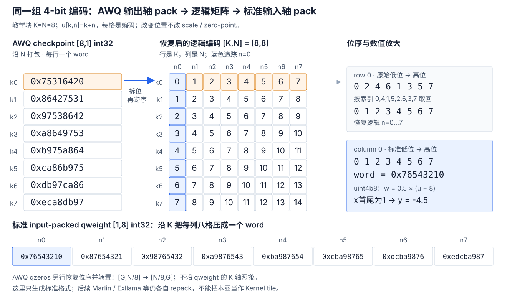
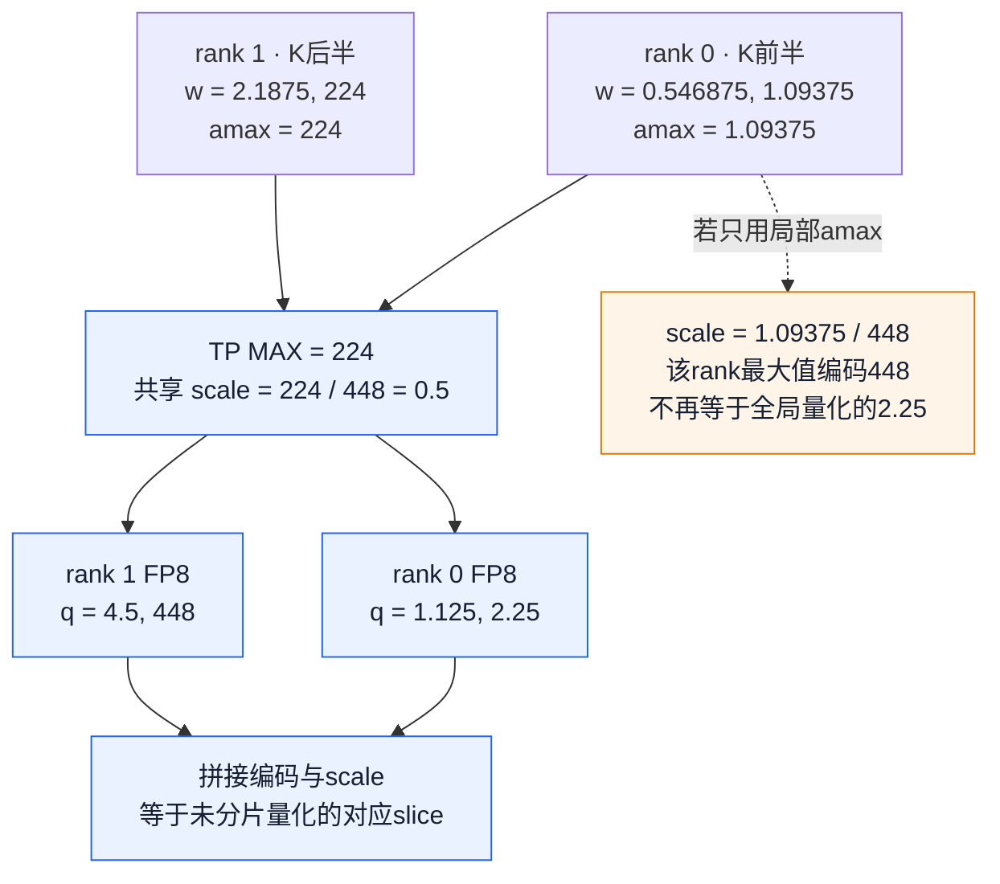
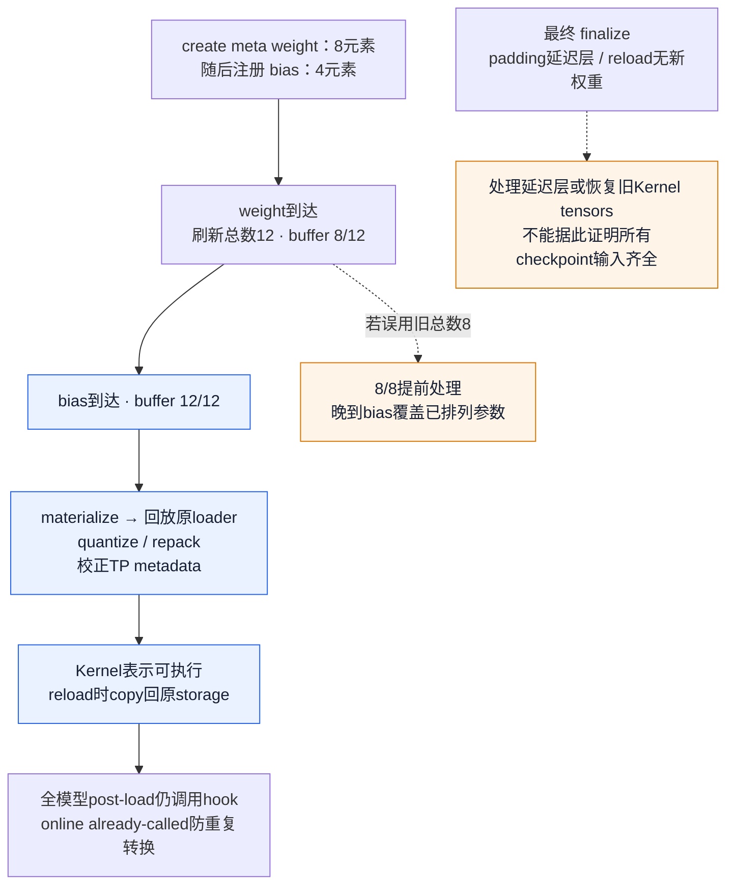
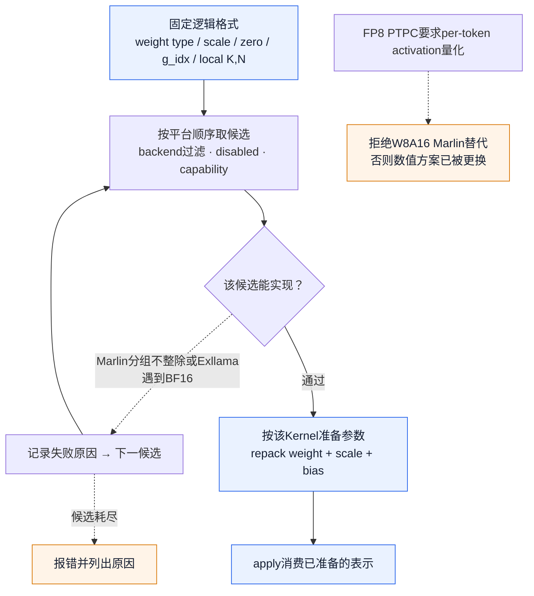

# vLLM 量化执行：一个低精度数怎样穿过 Pack、Scale、TP 与 Kernel

> **源码基线**：`vllm-project/vllm@199cb9b964822e59ab9b58d88e7be31eb419a2ae`（只读 main 快照，2026-09-07 UTC）。
> **主题**：低精度整数或浮点编码怎样恢复参与矩阵乘法的数；配置、分片、加载转换与 Kernel 选择怎样保持同一解释。
> **适用范围**：本页展开量化数值、config → per-layer method → pack/scale 参数 → post-load → dispatch/fallback；通用模型构造与 checkpoint 写入接 [[02_engineering/03_infer_frameworks/vllm/09_vllm_model_library_analysis|09]]，Kernel 内部 tile/provider 接 [[02_engineering/03_infer_frameworks/vllm/20_vllm_fused_ops_and_kernels_analysis|20]]，KV scale 仅保留名称与能力接缝，完整 layout/attention 协商归 08/10。
> **最近更新**：2026-09-08。

## 1. 一个 int32 为什么不能直接当作八个权重

设线性层计算 $y_n=\sum_k x_k\widehat W_{kn}+b_n$。W4A16 只告诉我们权重编码占 4 bit、activation 使用 16 bit，并没有告诉我们最低四位属于哪个 $k,n$，编码 8 表示 8 还是 0，或者哪个 scale 属于这个数。我们先用一个可手算的列说明差别，再把它放回 vLLM 的实际加载链。

教学列的八个已存编码是 $u=(0,1,2,3,4,5,6,7)$，使用 AutoGPTQ 支持的对称 `uint4b8`，固定 bias 为 8，scale 为 $s=0.5$：

$$
\widehat w_k=s(u_k-8)=(-4,-3.5,-3,-2.5,-2,-1.5,-1,-0.5)_k.
$$

这里的 8 是**编码偏移**，不是每次 GEMM 传入的可变 zero-point。取 $x=(1,0,0,0,0,0,0,1)$、$b=0$，得到 $y=-4.5$。若只把编码乘 scale，会算出 $3.5$，虽然 shape、dtype 和 GEMM 调用都可能合法。预量化 checkpoint 已给出编码和 scale；这个例子不声称 vLLM 在加载时重跑 GPTQ 的校准/误差优化算法。

通用整数参考量化可以写为 $q=\operatorname{clip}(\operatorname{round}(w/s)+z,q_{\min},q_{\max})$，反量化为 $s(q-z)$；对称有偏编码则先量化到有符号范围，再加编码 bias。AWQ 的 `uint4` 可使用随 group/channel 变化的显式 $z$，AutoGPTQ 当前 Linear 配置则只接受对称 4/8 bit，`zero_points=False`。二者不能仅凭“都是 INT4”互换。参考 helper 还区分先减 zero 再乘 scale 与先分别乘 scale 再相减的浮点舍入；数学等价不代表 bitwise 一致。

源码收束：`vllm/model_executor/layers/quantization/auto_gptq.py::AutoGPTQConfig.TYPE_MAP`、`AutoGPTQLinearMethod.create_weights`；`vllm/model_executor/layers/quantization/utils/quant_utils.py::quantize_weights`。后者是 tests/benchmarks 的参考实现，不是 AutoGPTQ 在线校准器。

### 1.1 Pack 只改变存放位置，不重新量化

4 bit 的 pack factor 是 $P=32/4=8$。标准 input-packed 格式对固定列 $n$ 存：

$$
Q_{j,n}=\sum_{i=0}^{7}(u_{8j+i,n}\mathbin{\&}15)\,2^{4i},\qquad
u_{8j+i,n}=(Q_{j,n}\gg4i)\mathbin{\&}15.
$$

上面的列得到 `0x76543210`；十六进制左端是高位，所以读低位时仍从编码 0 开始。32 bit 的容器有符号与否不改变这套位提取；mask 去掉算术右移可能带入的符号位。pack 本身不损失精度，舍入和截断发生在产生 $u$ 时。

<!-- Figure 1 spec: 真实 K×N 布局。左上 AWQ checkpoint 的 K=8,N/8=1 八行 int32；中央展开 K×N=8×8 编码 u[k,n]=k+n，第一行与第一列分别用 orange/blue 强调；右侧标准 K/8×N=1×8 按列打包列表。箭头从 AWQ row0 的低位顺序 [0,2,4,6,1,3,5,7] 经 reverse [0,4,1,5,2,6,3,7] 到 logical row0，再从 logical column0 向 input-packed word 0x76543210。下部列出 row0 AWQ word 0x75316420 与列0解码后 scale=.5,bias8,y=-4.5。每个词由 generator 计算，形状和轴独立标注；这不是 Marlin tile 图。 -->

图中人为给定完整 $8\times8$ 编码矩阵 $u_{k,n}=k+n$，它只是格式教学块，不是声称这个小 shape 可直接启动任一优化 Kernel。AWQ checkpoint 的 `qweight` 为 `[K,N/8]`；当前转换函数先逐 int32 拆八个 nibble，再按 `[0,4,1,5,2,6,3,7]` **索引拆出的数组**，恢复逻辑 N 次序。故逻辑首行 0…7 对应的原始低位序列是 0,2,4,6,1,3,5,7，word 是 `0x75316420`。切勿把 reverse 索引列表直接当成写入低位的值序列。

恢复 `[K,N]` 后，函数沿 K 重打包成 `[K/8,N]`。`qzeros` 另有轴变化：原 `[G,N/8]` 先恢复位序，再转成 `[N/8,G]`，新 parameter 的 `output_dim=0,input_dim=1,packed_dim=0`；不能照抄 qweight 的维度属性。scale 仍按逻辑 group/output 解释，随后才由选中的 Kernel 转为自身布局。这里“GPTQ-like standard”指标准编码排列，不意味着 AWQ 的可变 zero-point 变成了 GPTQ 固定 bias。

源码收束：`vllm/model_executor/layers/quantization/utils/quant_utils.py::pack_quantized_values_into_int32`、`unpack_quantized_values_into_int32`；`vllm/model_executor/layers/quantization/auto_awq.py::_convert_awq_to_standard_format`、`AutoAWQMarlinLinearMethod.process_weights_after_loading`。

## 2. Scale 怎样决定真实的量化误差与 TP 一致性

整数 group scale 的作用是给一组编码共享一个格点间距；FP8 则先用 scale 把数放进浮点编码的动态范围，再舍入到可表示的浮点值，格点间距会随指数变化。不能把 FP8 当成“8 bit 均匀整数”。

### 2.1 一次真正的 E4M3 数值变换

取可精确表示为 BF16 的教学 weight 行 $w=(0.546875,1.09375,2.1875,224)$，使用最大有限值为 448 的 E4M3FN、per-tensor scale：

$$
a=\max_k\lvert w_k\rvert=224,\quad s=a/448=0.5,\quad
q=\operatorname{FP8}_{\mathrm{E4M3FN}}(\operatorname{clip}(w/s,-448,448)),\quad
\widehat w=sq.
$$

| 步骤 | 第 0 列 | 第 1 列 | 第 2 列 | 第 3 列 |
|---|---:|---:|---:|---:|
| BF16 原值 $w$ | 0.546875 | 1.09375 | 2.1875 | 224 |
| 缩放后 $w/s$ | 1.09375 | 2.1875 | 4.375 | 448 |
| E4M3FN 最近可表示值 $q$ | 1.125 | 2.25 | 4.5 | 448 |
| 编码 byte（十六进制） | 39 | 41 | 49 | 7e |
| 反量化 $\widehat w$ | 0.5625 | 1.125 | 2.25 | 224 |

1 附近的步长是 $1/8$，2 附近变为 $1/4$，4 附近变为 $1/2$；这解释了三次舍入。取 $x=(1,1,1,0)$，高精度参考是 `3.828125`，量化权重参考是 `3.9375`。若 activation 也动态 FP8 量化，本例 0/1 可在相应 scale 下精确恢复，因此仍能隔离观察权重量化误差；实际 GEMM 的累加与输出舍入另外受 Kernel 影响。

当前在线 per-tensor 实现先用 `aminmax` 避免构造全尺寸 `abs()`，在 FP32 中计算 scale，调用 `scaled_fp8_quant`，把 weight 转置并替换为新 Parameter，再交给 FP8 Kernel 后处理。`_fp8_max` 故意创建 0-d tensor，使求 scale 保留真正除法而不被 Python 常数改写成乘倒数。上例 scale 恰好为 0.5，两种运算相同；一般中点附近不一定相同。静态 FP8 CUDA Kernel 实际读取 scale 的倒数后相乘，并饱和转换为 E4M3；本例选 0.5 使表内理想除法与该实现一致。E4M3FNUZ 平台的本地 helper 使用 224 而非 448，本表只适用于声明的 FN 格式。

per-channel 路径更明确用 `weight / scale`，避免静态量化乘倒数在中点另一侧舍入；其 scale 下限为 $1/(F_{\max}\cdot512)$，零 channel 因而不会除以零。临时 FP32 除法按行分块，目标是 $16\cdot1024^2$ 个元素、约 64 MiB；至少保留一整行，所以特别宽的一行可能超过目标。这里不把这个限制误称整个加载的显存上限。per-tensor 的全零输入没有这一 channel clamp，不能把零 channel 保证泛化到所有 scheme。

源码收束：`vllm/model_executor/layers/quantization/online/fp8.py::_fp8_scale`、`_fp8_channel_scale`、`_fp8_quant_per_channel`、`Fp8PerTensorOnlineLinearMethod.process_weights_after_loading`、`Fp8PtpcOnlineLinearMethod.process_weights_after_loading`；`vllm/model_executor/layers/quantization/utils/quant_utils.py::weight_amax`、`get_fp8_min_max`；`csrc/libtorch_stable/quantization/w8a8/fp8/common.cu::vllm::scaled_fp8_quant_kernel_strided_group_shape`、`csrc/quantization/w8a8/fp8/common.cuh::vllm::scaled_fp8_conversion`。

### 2.2 分片必须沿 scale 的归约维度判断

把同一行沿 K 切给两个 TP rank：rank 0 拿前两项，局部 amax 是 1.09375；rank 1 拿后两项，amax 是 224。若两边各算 scale，rank 0 会用 $1.09375/448$，最大值编码成 448；全局量化时这个值应编码成 2.25。shape 没错，量化网格已经换了。

<!-- Figure 2 spec: 两个 rank 输入各自半行，标出 amax1.09375/224；箭头汇合 MAX 得224，再广播同一scale.5至两个量化框，产出q[1.125,2.25]及[4.5,448]；最后拼接与whole-weight结果相等。aux橙色支线从rank0的局部amax到本地scale1.09375/448，标出错误比较目标qmax448而非2.25。非通信几何/比例时间图。 -->

`amax_for_tp_weight_quant` 只在权重沿 amax **归约的维度**分片时做 MAX collective。权重在 online loader 中用 `[N,K]` 表示：per-tensor 同时归约 N/K，因此 row/column parallel 都需要；per-output-channel 只归约 K，因此 row parallel 需要，column parallel 已持有完整 channel，不需 collective；replicated layer 也无需。测试用 MAX 替身固定未分片 amax，要求局部 FP8 值精确等于全局 slice，channel scale 在 N 分片时也取对应 slice。

MoE 不能直接套“所有 TP group 都 MAX”：`amax_for_moe_weight_quant` 对 `moe_tp_size>1` 使用 EP group 的设备组，覆盖被 DP×PCP×TP 展平的专家内分片；启用 EP、每 rank 拥有完整专家时 `moe_tp_size=1`，不做这次归约。per-block 在线 FP8 使用 128×128 weight block 与对应 activation group，局部块的对齐及 Kernel 支持另行检查，不等于每块都执行 per-tensor 全局 MAX。

源码收束：`vllm/model_executor/layers/quantization/online/fp8.py::_is_tp_sharded`、`Fp8PerBlockOnlineLinearMethod`；`vllm/model_executor/layers/quantization/utils/quant_utils.py::amax_for_tp_weight_quant`、`amax_for_moe_weight_quant`；`tests/quantization/test_online.py::test_online_linear_tp_weight_quant_matches_unsharded`、`test_is_tp_sharded_false_when_scale_is_already_global`、`test_online_moe_tp_weight_quant_matches_ep`。

## 3. 配置如何决定这一层到底解释哪种数

### 3.1 checkpoint 身份、在线目标与 activation 选择

预量化路径先从 HF quant config 读取 `quant_method`，按有序 override 探测兼容 parser/实现，之后检查用户名字是否与解析结果一致。GPTQ override 只接受 checkpoint 声明 `gptq`，且用户为未指定或 `gptq/gptq_marlin/auto_gptq/marlin` 兼容集合；不匹配不能强行用另一种字节布局解释。注册表校验、平台非空支持集合、config 最低 capability 与模型 activation dtype 是后续门槛。平台集合为空仅代表这道过滤不限制，不代表每个 Kernel 可用；deprecated 方法还受显式允许开关限制。

在线 shorthand 描述目标 `QuantKey`，例如 `fp8_per_tensor` 展开 linear/MoE 的 weight spec；显式 `quantization_config` 提供的非空 layer-kind spec 覆盖 shorthand。`targets` 是另一种精确/regex/fnmatch layer 选择方式，与 `linear/moe` 字段互斥，未匹配层保持未量化。online method 当前自选 activation 格式，显式 activation override 尚未接通时会拒绝；base checkpoint method 可能消费 activation-only override，不能将两者混同。`mxfp4/mxfp8` 名字有 checkpoint/online 歧义，loader 优先探查 checkpoint metadata，缺失时才解析为在线 shorthand。

> [!contradiction] 新基线纠正
> 旧稿说预量化名与在线配置混用一律拒绝，当前已不成立。`get_quant_config` 保留 checkpoint config 为主配置，再附加 `online_quantization_config`；逐层解析结果如下：

| checkpoint 给该层的方法 | online 是否选中该层 | 实际结果 |
|---|---|---|
| 已量化 | 否（包括 online ignore） | 保留 checkpoint method；ignore 不会把原量化撤销 |
| 已量化 | 是 | 报 pre-quantized layer 冲突，不重复量化 |
| 普通 linear/MoE 或无方法 | 是 | 使用在线 method，加载浮点 checkpoint 后转换 |
| 普通方法或无方法 | 否 | 保留 base 返回值；Linear 若仍为 None 会构造失败 |
| embedding / ParallelLMHead 等 overlay 范围外层 | 任意 | 保留 checkpoint method，online overlay 只覆盖 LinearBase/RoutedExperts |

例如仅 MoE 预量化的 checkpoint 可以在线量化留下的普通 linear；把全模型 linear 目标施加到已量化 linear 则报错。这是按层组合，不是自动跳过所有冲突。`targets` 不能与 `ignore` 同时匹配同层；fused shards 必须全部恰好匹配一个 target 且得到相同方案，部分命中、多重命中和方案不一致都会失败。

源码收束：`vllm/config/model.py::ModelConfig._verify_quantization`；`vllm/config/vllm.py::VllmConfig._get_quantization_config`；`vllm/platforms/interface.py::Platform.verify_quantization`；`vllm/config/quantization.py::resolve_quantization_config`、`QuantizationConfigArgs._validate_targets_exclusivity`；`vllm/model_executor/model_loader/weight_utils.py::get_quant_config`；`vllm/model_executor/layers/quantization/base_config.py::resolve_quant_method`；`vllm/model_executor/layers/quantization/online/base.py::OnlineQuantizationConfig._get_method_cls`、`_find_matching_targets`、`OnlineQuantizationConfig._resolve_targets_quant_method_metadata`。

### 3.2 名称映射之后，融合投影必须能用同一方案执行

模型构造前，loader 把 HF→vLLM rename mapper 与 `packed_modules_mapping` 传给 config；`SupportsQuant.__new__` 也建立这个接缝。Llama 的 `qkv_proj` 对应 q/k/v 三个逻辑投影，`gate_up_proj` 对应 gate/up 两个。旧 checkpoint 可以分别命名它们，但一次融合 Kernel 不能只有 q 使用量化而 k/v 使用另一个不兼容方案。

skip matcher 会展开 fused prefix 检查 constituent shards；部分 skip 直接报错。当前还先检查 checkpoint 是否直接列了 fused 名字，如 `self_attn.qkv_proj`，若直接匹配就整体 skip，避免明明配置了 fused 名却因展开而漏过。online targets 的一致性是同一原则的另一实现，并非所有 config 都共享一个 matcher。

KV scale 保留窄边界：base mapper 把旧 `.kv_scale` 映到 `.attn.k_scale`，ModelOpt 的 k/v projection scale、fused QKV 与常规 q/k/v scale/zero-point 名也映到 attention 参数。旧 fused 名只直接映 k，不能说这一行同时创造独立 k/v scale；backend 的最终解释接 10。通用名称遍历、packed shard copy 和 TP slice 接 09。

源码收束：`vllm/model_executor/model_loader/utils.py::configure_quant_config`；`vllm/model_executor/models/interfaces.py::SupportsQuant._maybe_apply_model_mapping`；`vllm/model_executor/models/llama.py::LlamaForCausalLM.packed_modules_mapping`；`vllm/model_executor/layers/quantization/utils/quant_utils.py::is_layer_skipped`；`vllm/model_executor/layers/quantization/base_config.py::QuantizationConfig.get_cache_scale_mapper`。

## 4. 一个 AutoGPTQ layer 从字节容器变成可执行参数

`LinearBase` 在构造时解析并绑定 `quant_method`；具体 Linear 立即用全局 shape、TP-local shape、dtype、output partition sizes 与自己的 loader 调 `create_weights()`。推理 `forward` 只处理 bias/返回约定后调用绑定 method；`skip_bias_add` 会把 bias 留给调用方。既有 quant config 却无法返回 Linear method 会失败，不会留待首 token 猜格式。

### 4.1 先选逻辑格式和兼容 Kernel，再分配参数

AutoGPTQ 用 `MPLinearLayerConfig` 保存 full/local `[K,N]`、weight/activation type、group size、zero-point 与 `g_idx`；构造候选前还有 quant type/group 的支持校验。以无 activation-order、4 bit、group size 128、全局 `[1024,512]`、row TP=2 的实际形状例子为例，每 rank 的 `[K_r,N_r]=[512,512]`：

| 参数 | 加载形状 | 语义 |
|---|---|---|
| `qweight` | `[64,512]` int32 | $512/8$ 个 input-packed word，`input_dim=0,output_dim=1,packed_dim=0` |
| `scales` | `[4,512]` activation dtype | 本 rank 四组 K，每个 output channel 一份 scale |
| `qzeros` | `[4,64]` int32 | 加载容器存在；当前对称 GPTQ Kernel 配置不把它当可变 zero-point |
| `g_idx` | `[512]` int32 | 容器先建立；`desc_act=False` 时具体 Kernel 可替换为空 metadata |

启用 `desc_act` 后，weight 的 K 顺序与 group 对应不能只用局部整除还原；scale 会复制完整 global group 表，即本例 `[8,512]`，`g_idx` 指明每个输入属于哪组。group size=-1 表示每 output channel 覆盖完整 K，row parallel 也需复制该 scale；一般无 act-order 的 groupwise row partition 才沿 group 维分片。`desc_act=True` 且 group=-1 没有重排分组收益，config 会规范化为 False。这里 scale 的复制不同于 §2 现场计算 amax 的 MAX collective：预量化 scale 已由 checkpoint 给出。

方法在分配前让 `choose_mp_linear_kernel` 筛选兼容候选，然后创建上述 Parameter 与选定 Kernel 实例；Parameter 的 input/output/packed 维度、pack factor 与 loader 使 checkpoint copy 有明确目标。流式文件枚举与名字分片归 09，本页不把“copy 成功”当成已经可执行。

源码收束：`vllm/model_executor/layers/linear.py::LinearBase.__init__`、`ReplicatedLinear.__init__`、`ReplicatedLinear.forward`；`vllm/model_executor/layers/quantization/auto_gptq.py::AutoGPTQLinearMethod.create_weights`、`AutoGPTQConfig.__init__`；`vllm/model_executor/kernels/linear/mixed_precision/MPLinearKernel.py::MPLinearLayerConfig`；`vllm/model_executor/layers/quantization/utils/marlin_utils.py::marlin_repeat_scales_on_all_ranks`。

### 4.2 Post-load 做哪几种真实变换

正常 loader 顺序是 initialize → `model.load_weights` → 在线 layerwise finalize（若有）→ 全模型 post-load → eval 返回。AutoGPTQ 的 post-load 与 apply 都委托给创建时选定的同一个 Kernel；生产设备布局的对象也消费该布局。

若选择 Marlin，过程不是把 qweight 再 cast 一遍：它先处理 activation 格式所需变换，建立或复用 workspace；有 `g_idx` 时排序 group index 并存 permutation，无该需求时创建空 metadata；标准 packed weight 按需要 padding 后交给 `gptq_marlin_repack`，scale 经过 padding 与 permutation，显式 zero-point 也转换成 Kernel 布局，bias 可能一并排列。正常 group scale 的 permutation 由 `i+8*j` 的 8×8 顺序生成；channelwise/8 bit activation 使用另一组 32 项排列。此处只解释数据为何一起变换，完整 warp/tile 布局交 24。

例如固定偏移 INT4 的 Exllama 后处理需要显式构造 GPTQv1 zero tensor：存的是 bias−1=7，因为该 Kernel 的 v1 解释在推理时再加 1；直接写 8 会再错一格。Exllama 还将 `g_idx` 转成 permutation、shuffle packed weight，并将 scale 转成 activation dtype。它与 Marlin 可表示同一逻辑权重，但 executable bytes 并不相同。

全模型 post-load 在目标设备上下文运行：CPU offload 参数临时移到设备，处理后恢复原有 CPU 参数及被替换的 UVA offload 表示；新加参数不是一概移回 CPU。若 Parameter 被替换，还要用 layer 的 `tp_rank/tp_size` 再校正 metadata，特别是 `disable_tp` 的 replicated layer，不能留着全局 rank 供下次 reload 错切片。该转换需要加载期设备空间，offload 不等于零显存 repack。

`QuantizeMethodBase.process_weights_after_loading` 默认 no-op，`apply` 只约定 create 已发生，没有统一“已 post-load”运行时 guard。新基线的 `weights_already_processed` 也**仍遍历并调用 hook**：方法必须声明 `supports_pre_processed_weights`，在此模式下自行跳过 tensor transform、完成所需运行状态；未声明直接报错。不是全局跳过初始化，更不是 checkpoint 参数完整性证明。

源码收束：`vllm/model_executor/model_loader/base_loader.py::BaseModelLoader.load_model`；`vllm/model_executor/model_loader/utils.py::process_weights_after_loading`、`device_loading_context`；`vllm/model_executor/layers/linear.py::LinearBase.update_param_tp_status`；`vllm/model_executor/layers/quantization/base_config.py::QuantizeMethodBase`；`vllm/model_executor/layers/quantization/auto_gptq.py::AutoGPTQLinearMethod.process_weights_after_loading`、`AutoGPTQLinearMethod.apply`；`vllm/model_executor/kernels/linear/mixed_precision/marlin.py::MarlinLinearKernel.process_weights_after_loading`、`MarlinLinearKernel.apply_weights`；`vllm/model_executor/kernels/linear/mixed_precision/exllama.py::ExllamaLinearKernel.process_weights_after_loading`。

## 5. 在线量化为何要等晚到的 bias

在线 linear 的 `uses_meta_device=True`，create 阶段用 meta weight 描述 `[N_r,K_r]`，并包装 layer 参数的 loader。加载不是“先全模型 BF16，再全模型 FP8”：同层输入到齐后才 materialize → 回放 buffered loads → quantize/repack → 替换参数；reload 还将处理结果 copy 回原 Kernel storage，保持 CUDA Graph 引用。减少的是全模型双表示峰值，代价是局部 BF16 与低精度短时共存、转换计算及 scale collective。

承重回归例子是 weight `[4,2]` 共 8 元素、bias `[4]` 共 4 元素。在线 method 注册 weight 时初始化包装器，但普通 Linear 随后才注册 bias。每次 load 必须刷新该 layer 的总元素数并包装晚注册参数：weight 到达后进度是 8/12，不能按旧 8/8 提前处理；bias 全部写入后才达到 12/12。否则新 bias 会覆盖已按 Kernel 顺序排列的 bias，前向仍能运行却计算错误。

<!-- Figure 3 spec: 创建meta weight8并初始化wrapper，然后late bias4把总数刷新12。weight载入形成buffer8/12，负支线指出按旧8/8会提前permute；bias载入到12/12才materialize/回放原loader/量化repack并设置already-called。正常全模型post-load再到hook而method防重复。独立finalize支线注明padding/未加载/重载旧tensor恢复不是完整性证明；不画成比例时序。 -->

这个按元素计数的触发器仍有边界。源码承认重复小 metadata、padding 和加载顺序的限制；finalize 会处理部分元素未加载的 padding 层，首次未收到权重的层也可进入处理，reload 未收到新权重时可恢复旧 Kernel tensors。因此“8/12 必须等 bias”是具体修复，不应提升成通用“所有必需状态已验证齐全且 hook 全局恰调用一次”。online method 用 already-called flag 防重复数值转换，reload 会先清标志；全模型遍历还会调用 hook。

多个 layer 的 checkpoint tensor 交错到达，也可能让多个 buffered layer 同时存活，源码对此提示额外内存；峰值并非永远严格一层。`DefaultModelLoader.track_weights_loading` 默认只对具备 loaded-name tracking 的非量化模型开启，且其 `has_postprocess_quant` 判断连继承 no-op hook 的普通 linear 参数都可能豁免。它不能证明每个量化字节、bias 和 scale 都真的写到；数值/shape/load 测试仍是不同证据。

源码收束：`vllm/model_executor/layers/quantization/online/fp8.py::OnlineLinearBase.create_weights`；`vllm/model_executor/model_loader/reload/layerwise.py::make_online_process_loader`、`_layerwise_process`、`finalize_layerwise_processing`；`tests/model_executor/model_loader/test_reload.py::test_online_processing_waits_for_late_registered_bias`；`vllm/model_executor/model_loader/default_loader.py::DefaultModelLoader.track_weights_loading`。

## 6. Dispatch 与 fallback 到底允许换什么

### 6.1 能力过滤决定正确性，候选顺序决定优先级

选择器在构造/准备阶段按平台候选表运行，应用 `--linear-backend` 过滤、禁用列表、compute capability 和 `can_implement(config)`，首个兼容者获选；所有候选失败则收集原因报错。scaled-mm 同样区分平台支持与 config/shape 支持，forced candidate 不兼容时可记录原因再回候选列表。所谓 runtime dispatch 是执行时使用已选实现，不是每个 token 重新猜 checkpoint 格式。

以下两个具体谓词说明 GPU 名字不足以判定：Marlin 的 group 128、全局 K=384、local K=192 会失败，因为一组跨了 TP 分界，padding 不能修复原 group 语义；没有 act-order 的单纯 tile 不对齐则可以在 prepare 时补零。若有 act-order，K 绑定全局 group 排列，仍走严格 shape 检查，不允许这类 tile padding。Exllama 则要求 FP16 activation、N 能被 pack factor 整除、正 group size 整除全局 K，并拒绝 input 被 TP 分片时的 act reorder；BF16 layer 即使 shape 对齐也会被拒绝。

<!-- Figure 4 spec: 输入同一逻辑config；按平台优先级依次过backend/disabled/capability，再过numerical+shape谓词，列出Marlin 192%128不为0不可pad与Exllama BF16拒绝；失败回下一个候选，成功创建参数/postload生成该kernel布局/apply；穷尽硬失败。旁路标明PTPC需要dynamic per-token activation，W8A16 Marlin不是合法替代。 -->

混合精度 CUDA 表包含 Cutlass/Machete/AllSpark/Marlin 等有序候选，但不能从 `AutoGPTQLinearMethod` 的名称保证最终一定 Marlin。ROCm 测试固定特定 uint4b8/uint4、group 与架构条件下 RDNA3 → Hybrid → Triton 的选择；XPU/CPU 另有自己的表。AutoAWQ 的“Marlin method”在 CPU/XPU 也可作为标准格式适配器，让 MP selector 选择本地 Kernel，类名同样不是硬件执行证明。

源码收束：`vllm/model_executor/kernels/linear/__init__.py::choose_mp_linear_kernel`、`choose_scaled_mm_linear_kernel`、`is_supported_and_can_implement_kernel`；`vllm/model_executor/kernels/linear/mixed_precision/marlin.py::MarlinLinearKernel.can_implement`；`vllm/model_executor/kernels/linear/mixed_precision/exllama.py::ExllamaLinearKernel.can_implement`；`tests/kernels/quantization/test_w4a16_kernel_selection.py::test_choose_mp_linear_kernel_uint4b8`、`test_choose_mp_linear_kernel_uint4_asymmetric`。

### 6.2 四类退路，以及一次明确放弃低精度 GEMM

| 触发 | 实际处理 | 保持的内容与成本 |
|---|---|---|
| config 明确 ignore 某层 | 返回普通 linear/MoE；若仅 online ignore 且 checkpoint 已量化则保留 checkpoint method | 配置声明的混合精度范围；普通权重占更多内存 |
| 首选 method 不支持 layer | AutoAWQ 回未优化 AWQ，MoE 可回 WNA16 | 仍解释相同 checkpoint 数值；在准备阶段选择相应布局，不把一个 Kernel 的 repack 结果塞给另一个 |
| 某 Kernel 谓词失败 | 尝试同逻辑 config 的后续候选 | 保持 pack/scale/zero/activation 语义，性能和浮点累加顺序未必相同 |
| 候选耗尽 | 进入请求前硬失败 | 不静默换 dtype、scale 粒度或 zero-point |

batch-invariant 模式还有有意的执行退路：在线 per-tensor FP8 若是 Cutlass 直接走其受支持路径；否则把已量化 FP8 weight 按 scale 还原到 BF16 再 ordinary linear，per-channel 路径也有对应 dequant 分支。它保留的是**已量化权重**及确定性执行目标，不恢复原 BF16 checkpoint 的精度；每次 apply 的 dequant/临时高精度权重也消耗时间和内存，并失去低精度 GEMM 收益。不能用该例推出所有 fallback 都保持低精度 activation 的完全相同算法。

相反，在线 PTPC 明确要求 per-token activation FP8；构造时若选到 W8A16 的 `MarlinFP8ScaledMMLinearKernel` 会拒绝，因为只量化 weight 会悄悄改变方案。PTPC 的 batch-invariant dequant 是另一条源码明示的执行策略，不能拿它为一般 Kernel 选择放松数值要求。

源码收束：`vllm/model_executor/layers/quantization/auto_awq.py::AutoAWQConfig.get_quant_method`；`vllm/model_executor/layers/quantization/online/base.py::OnlineQuantizationConfig.get_quant_method`；`vllm/model_executor/layers/quantization/online/fp8.py::Fp8PerTensorOnlineLinearMethod.apply`、`Fp8PtpcOnlineLinearMethod.create_weights`、`Fp8PtpcOnlineLinearMethod.apply`。

## 7. 用什么证据判断“数值没换、成本值得”

§1 的 8×8 例子有 64 个 INT4 编码，仅编码占 32 byte，对比 BF16 的 128 byte；但实际常驻还包含 scale、zero/g_idx、workspace、padding，不能把模型内存直接声称减至四分之一。较小 group 能让局部格点更合适，却增加约 $KN/g$ 个 scale；对某种具体 Kernel 的吞吐收益还取决于 shape、activation 量化、解码带宽和 prefill GEMM 计算量。在线 FP8 将 weight 存储从每元素 2 byte 降为 1 byte，但加载期支付前述量化/归约/临时双表示，batch-invariant dequant 又会改变执行成本。

复核应沿可观察变化进行，而不只检查“模型能生成文本”：

1. **格式与层选择**：记录最终 config/method、online target 冲突与 fused shard 规则；注册表、在线 shorthand 和 deprecated 集合是不同入口，不维护脱离基线的名字支持表。
2. **加载 shape 与 scale**：核对 global/local K,N、pack axis、group/zero/g_idx；TP 数值与未分片基线比较，分开检查 scale 一致和编码一致。
3. **转换后的表示**：比较标准 pack 与目标 repack 的对应值，确认 bias、Parameter TP metadata 与 reload storage；hook 被调用不等于数据完整性已证明。
4. **执行与性能**：记录真正选中 Kernel 和拒绝原因；先与量化参考值比较，再与高精度值比较量化误差，分别测 prefill/decode 与加载峰值，区分误差、确定性和速度。

源码 tests 给出的证据也各有边界：Marlin repack 测试将独立参考 permutation 与 GPU repack 比较，覆盖 act-order/bit width/形状；在线 TP tests 比较 FP8 编码与 scale 的精确 slice；late-bias test 只证明处理时已经见到 bias；online composition tests 检查未量化层替换与已量化层冲突。这些源码断言已阅读，本页只在 CPU 用独立数值生成器验证教学例子并检查图文一致，未运行设备 Kernel、模型加载/生成或性能 benchmark。

源码路线：`tests/kernels/quantization/test_marlin_gemm.py::test_gptq_marlin_repack`、`test_awq_marlin_repack`；`tests/quantization/test_online.py::test_online_prequantized_compatibility`、`test_online_target_rejects_prequantized_layer`、`test_online_ignore_keeps_checkpoint_quantization_linear`；其余数值、TP 与加载断言就近列于上文。

## Related Pages

- [[02_engineering/03_infer_frameworks/vllm/09_vllm_model_library_analysis|vLLM 模型与权重 ABI]] — 接模型构造、checkpoint 枚举、名称映射和 TP 参数写入；本页从低精度参数解释接手，不把 loader 的 loaded-name 检查泛化为完整性证明。
- [[02_engineering/03_infer_frameworks/vllm/20_vllm_fused_ops_and_kernels_analysis|vLLM 融合算子与 Kernel]] — 接 provider、tile、Kernel 内部优化；本页解释重排必须保持的数值与选择条件。
- [[02_engineering/03_infer_frameworks/vllm/18_vllm_distributed_inference_analysis|vLLM 分布式推理]] — 接 TP/EP rank 与 collective；本页解释 scale 为什么只在归约维度被切开时要求共同统计。
- [[02_engineering/03_infer_frameworks/vllm/10_vllm_attention_backends_analysis|vLLM Attention Backend]] — 接 KV dtype、scale 与 attention backend 的能力协商，量化 config 的名称归一化不替它选择 backend。
- [[02_engineering/07_training_reliability/20_batch_invariance_guide|Batch Invariance]] — 接确定性执行目标与验证，本页给出为此保留已量化权重、放弃低精度 GEMM 的具体分支。
