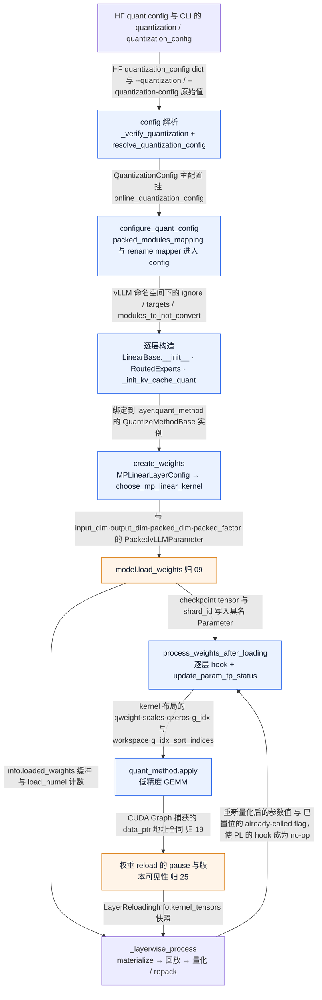
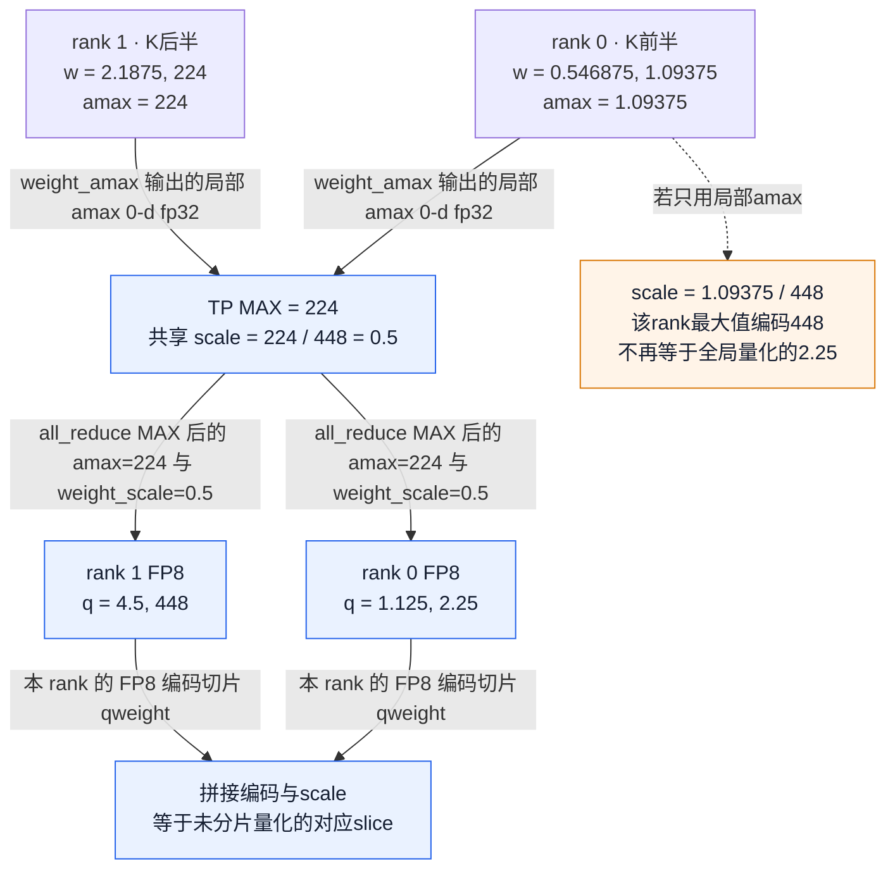
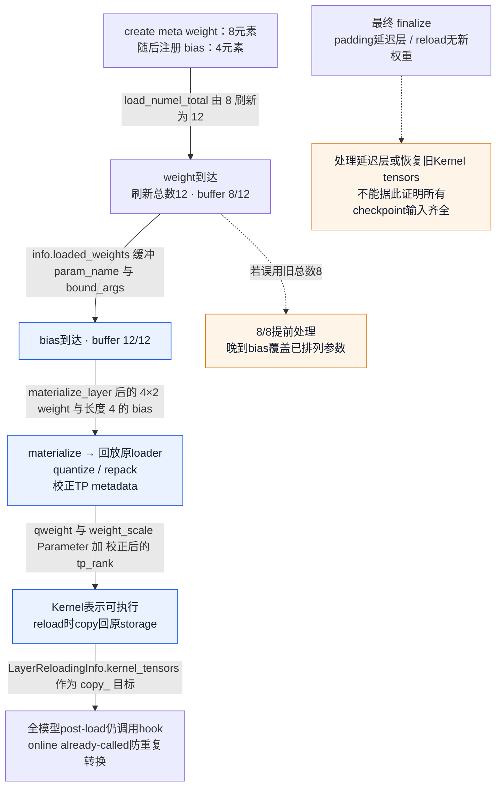
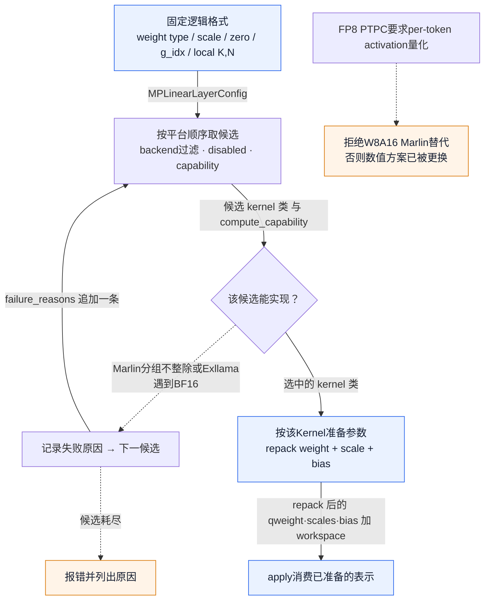

# vLLM 量化执行：一个低精度数怎样穿过 Pack、Scale、TP 与 Kernel

> **源码基线**：`vllm-project/vllm@199cb9b964822e59ab9b58d88e7be31eb419a2ae`（只读 main 快照，2026-09-07 UTC）。
> **主题**：低精度整数或浮点编码怎样恢复参与矩阵乘法的数；配置、分片、加载转换与 Kernel 选择怎样保持同一解释。
> **适用范围**：本页展开量化数值、config → per-layer method → pack/scale 参数 → post-load → dispatch/fallback，并拥有 MoE 量化权重 ABI 与 KV scale **参数的生命周期**；通用模型构造与 checkpoint 写入接 [[02_engineering/03_infer_frameworks/vllm/09_vllm_model_library_analysis|09]]，Kernel 内部 tile/provider 接 [[02_engineering/03_infer_frameworks/vllm/20_vllm_fused_ops_and_kernels_analysis|20]]，KV cache 物理布局接 [[02_engineering/03_infer_frameworks/vllm/08_vllm_kv_cache_management_analysis|08]]，`kv_cache_dtype` 与 backend 的能力协商及 attention kernel 内 scale 的实际使用接 [[02_engineering/03_infer_frameworks/vllm/10_vllm_attention_backends_analysis|10]]，在线换权重的 pause 与版本可见性协议接 [[02_engineering/03_infer_frameworks/vllm/25_vllm_weight_transfer_online_update_analysis|25]]，CUDA Graph 地址合同接 [[02_engineering/03_infer_frameworks/vllm/19_vllm_compilation_cudagraph_analysis|19]]。
> **最近更新**：2026-09-13。补齐定位段、闭环位置图、核心流程清单、逐流程阶段表、所有权与配置契约、调用树与成本账；新增 MoE 量化 ABI 与 KV scale 参数生命周期两节。

## 1. 量化执行层的定位：同一批字节，五处同一个解释

一个 W4A16 checkpoint 交给引擎时，磁盘上只有 int32 容器、若干 scale 表和可选的 zero/g_idx。**量化执行层是把这堆字节变成"可以放进 GEMM 的数"的那条链的所有者**：解析 config 决定这一层到底解释哪种数，为每个 layer 绑定一个 `QuantizeMethodBase`，用带维度属性的 Parameter 给 checkpoint tensor 划出落点，在 post-load 把它们重排成选定 Kernel 的可执行布局，最后在 `apply` 里执行。这条链要保证的不变量只有一条：**同一批低精度字节在配置解析、TP 切分、加载写入、post-load 重排和 kernel 执行五处得到同一个数值解释**。任何一处换了 pack 顺序、scale 粒度或 zero-point 约定，shape 和 dtype 仍然合法，GEMM 仍然能跑，输出却已经不是这个 checkpoint 表达的模型。

反过来，这一层刻意不拥有几样东西，每一样都有真正的 owner。它**不是** checkpoint 文件枚举、loaded-name 追踪与 packed/fused shard 的 TP slice 写入（归 [[02_engineering/03_infer_frameworks/vllm/09_vllm_model_library_analysis|09]]）；**不是** Kernel 内部的 warp/tile 布局、provider 选择与融合收益（归 [[02_engineering/03_infer_frameworks/vllm/20_vllm_fused_ops_and_kernels_analysis|20]]）；**不是** TP/EP 的 rank 拓扑与 collective 实现（归 [[02_engineering/03_infer_frameworks/vllm/18_vllm_distributed_inference_analysis|18]]，本页只判断"要不要归约"）；**不是** KV cache 的物理分页与容量（归 [[02_engineering/03_infer_frameworks/vllm/08_vllm_kv_cache_management_analysis|08]]），也不是 `kv_cache_dtype` 与 attention backend 的能力协商、kernel 内 scale 的实际使用（归 [[02_engineering/03_infer_frameworks/vllm/10_vllm_attention_backends_analysis|10]]）——本页只收 KV scale **参数**从建立到消费的生命周期；**不是** 在线换权重的 pause window 与版本可见性协议（归 [[02_engineering/03_infer_frameworks/vllm/25_vllm_weight_transfer_online_update_analysis|25]]）；**不是** "地址稳定不等于值静止"的 CUDA Graph 合同本身（归 [[02_engineering/03_infer_frameworks/vllm/19_vllm_compilation_cudagraph_analysis|19]]，本页只负责在 reload 时把处理结果写回原 storage）；**不是** IR 层的融合 pass（归 [[02_engineering/03_infer_frameworks/vllm/21_vllm_ir_and_fusion_passes_analysis|21]]）。

<!-- 图1 spec：闭环位置图。输入是 HF quant config 与 CLI 在线参数；沿 config 解析 → 名称映射 → per-layer method 绑定 → create_weights → load_weights（归 09）→ post-load → apply 走主链；在线量化与 reload 从 load_weights 分出 layerwise 支线并回流到 post-load；apply 经 CUDA Graph 地址合同回到 reload 形成闭环。每条边标注跨越边界的真实对象名，不用"调用/返回"空词；不画设备行布局与 kernel tile。 -->


图的闭环点在最后两条边：`apply` 消费的 storage 地址被 CUDA Graph 捕获，于是 reload 不能重新分配，只能把 `LayerReloadingInfo.kernel_tensors` 里的旧 Parameter 交回 `_layerwise_process`，让它把重新量化的值 `copy_` 回去。这条回流是本页与 19/25 的真实交接，第 6.2 节展开。

### 1.1 本页拥有的核心流程

枚举依据是源码自身的选择点，不是主题归纳：`ModelConfig._verify_quantization` 的有序 `overrides` 列表、`resolve_quantization_config`、`resolve_quant_method`、`_ONLINE_LINEAR_METHODS` / `_ONLINE_MOE_METHODS` 两张 dispatch 表、`_POSSIBLE_KERNELS` 等候选表，以及 `BaseModelLoader.load_model` 的四步。据此本页拥有 12 条核心流程。

| 功能 | 要解决的问题 | 设计与实现入口 | 产出的可观察变化 |
|---|---|---|---|
| 1 checkpoint 身份解析 | 磁盘上的 `quant_method` 名字该用哪个 parser/实现解释 | `VllmConfig.__post_init__` → `ModelConfig._verify_quantization()` 的有序 override 探测 | `ModelConfig.quantization` 成为一个已解析的 `QuantizationMethods` 名；不兼容组合抛 `ValueError` |
| 2 在线 overlay 配置解析 | 用户给的 shorthand / `quantization_config` 怎样变成逐层可判定的目标 | `VllmConfig._get_quantization_config` → `resolve_quantization_config` | 返回 `QuantizationConfigArgs` 或 None（`mxfp4`/`mxfp8` 走 deferred 分支），挂到 `quant_config.online_quantization_config` |
| 3 名称映射与 fused 一致性 | HF 名与 vLLM 名不同、一个 fused Kernel 不能有两种方案 | 构造前 `configure_quant_config()`；`SupportsQuant.__new__` | ignore/targets/`modules_to_not_convert` 已在 vLLM 命名空间；每个 fused layer 解析到恰好一个方案，否则 raise |
| 4 per-layer method 绑定 | 这一层到底由谁解释它的字节 | `LinearBase.__init__` / `RoutedExperts` 构造 / `_init_kv_cache_quant` 里的 `resolve_quant_method` | `layer.quant_method` 是一个已实例化的 `QuantizeMethodBase`；Linear 拿不到则 `ValueError("All linear layers should support quant method.")` |
| 5 Kernel 预选 | 参数还没分配就要知道最终由谁执行 | `create_weights` 内 `choose_mp_linear_kernel` / `init_fp8_linear_kernel` | 返回一个 kernel 类并实例化；全部失败则 `ValueError` 逐条列出每个候选的拒绝原因——发生在第一个请求到达之前 |
| 6 参数分配（ABI 建立） | checkpoint tensor 往哪里落、按哪根轴切 | 紧随 #5 的同一次 `create_weights` | layer 上出现带 `input_dim/output_dim/packed_dim/packed_factor` 的具名 Parameter |
| 7 post-load kernel 专属 repack | 标准 pack 不是任何一个 Kernel 的可执行布局 | 全模型 `process_weights_after_loading(model, model_config, target_device)` 遍历 | `qweight/scales/(zeros)/(g_idx)` 变成选定 kernel 的布局，`workspace`/`g_idx_sort_indices` 就位，`update_param_tp_status()` 已重对齐 |
| 8 在线 layerwise materialize / replay / quantize | 不想为在线量化付出全模型双表示峰值 | 首个被 wrap 的 `weight_loader` 调用（`uses_meta_device=True`） | `info.load_numel >= info.load_numel_total` 触发 `_layerwise_process` 直到 `info.reset()`；reload 时 `_copy_and_restore_kernel_tensors` 已把值写回原 storage |
| 9 finalize 收尾 | 有的层永远等不到"元素齐了" | `BaseModelLoader.load_model` 中 `if _has_online_quant(model)` | `finalize_layerwise_processing` 返回、`LOADING_LAYERS.clear()`；每层要么已处理，要么已恢复旧 kernel tensors |
| 10 apply 执行与 batch-invariant 退路 | 确定性执行目标与低精度 GEMM 冲突时怎么办 | 每次 `LinearBase.forward` → `quant_method.apply` | 返回 `out_dtype` 输出张量；`VLLM_BATCH_INVARIANT` 下走 BF16 dequant + `F.linear` |
| 11 MoE 量化权重 ABI 与 post-load | 专家权重是三维的，linear 那套维度属性不适用 | `RoutedExperts` 构造 → `OnlineMoEMethodBase.create_weights` / `AutoGPTQMoEMethod.create_weights` | `w13_weight`/`w2_weight`（或 `w13_qweight`/`w2_qweight`）注册；post-load 后 per-expert scale 与 shuffle 后的 kernel 格式就位 |
| 12 KV scale 参数生命周期 | `get_cache_scale_mapper()` 造出的名字要有人接住 | `_init_kv_cache_quant` → `BaseKVCacheMethod.create_weights` | 四个哨兵 Parameter 被 `del`，值落在 `_k_scale/_v_scale/_q_scale/_prob_scale` device buffer 与 host 镜像上 |

（checkpoint 字节写入本身归 09，不是本页流程，但在第 8.1 节的所有权表里点名。）

### 1.2 哪些每次都走，哪些要开开关

| # | 基础 / 条件 | 触发条件 | 本页位置 |
|---|---|---|---|
| 1 | 基础（有 quant config 时） | checkpoint 声明了 `quant_method` | §4.1 |
| 2 | 条件 | 给了 `--quantization` shorthand 或 `quantization_config` | §4.1 |
| 3 | 基础；其中 fused 展开为条件 | fused 展开仅对有 `packed_modules_mapping` 的模型 | §4.2 |
| 4 | 基础 | 每个 `LinearBase`/`RoutedExperts`/`Attention` 构造 | §4.1、§5 首段 |
| 5 | 基础 | 每个量化 linear 的 `create_weights` | §5.1、§7.1 |
| 6 | 基础 | 同上 | §5.1 |
| 7 | 基础 | 每次 `load_model` | §5.2 |
| 8 | 条件 | 仅 `uses_meta_device=True` 的 online method 或 reload | §6.1 |
| 9 | 条件 | 仅 `_has_online_quant(model)` 为真 | §6.1 |
| 10 | 基础；batch-invariant 退路为条件 | 退路仅 `VLLM_BATCH_INVARIANT=1` | §7.2 |
| 11 | 条件 | 仅 MoE 模型 | §3.3 |
| 12 | 条件 | 仅 `should_load_quant_weights(quant_method)` 为真的 attention 层 | §4.3 |
| — `desc_act` 分支 | 条件 | 仅 act-order checkpoint 且 `group_size != -1` | §5.1 |
| — per-block 128×128 | 条件 | 仅 `fp8_per_block` / mxfp4 等块粒度方案 | §3.1、§3.3 |

## 2. 一个 int32 为什么不能直接当作八个权重

设线性层计算 $y_n=\sum_k x_k\widehat W_{kn}+b_n$。W4A16 只告诉我们权重编码占 4 bit、activation 使用 16 bit，并没有告诉我们最低四位属于哪个 $k,n$，编码 8 表示 8 还是 0，或者哪个 scale 属于这个数。我们先用一个可手算的列说明差别，再把它放回 vLLM 的实际加载链。

教学列的八个已存编码是 $u=(0,1,2,3,4,5,6,7)$，使用 AutoGPTQ 支持的对称 `uint4b8`，固定 bias 为 8，scale 为 $s=0.5$：

$$
\widehat w_k=s(u_k-8)=(-4,-3.5,-3,-2.5,-2,-1.5,-1,-0.5)_k.
$$

这里的 8 是**编码偏移**，不是每次 GEMM 传入的可变 zero-point。取 $x=(1,0,0,0,0,0,0,1)$、$b=0$，得到 $y=-4.5$。若只把编码乘 scale，会算出 $3.5$，虽然 shape、dtype 和 GEMM 调用都可能合法。预量化 checkpoint 已给出编码和 scale；这个例子不声称 vLLM 在加载时重跑 GPTQ 的校准/误差优化算法。

通用整数参考量化可以写为 $q=\operatorname{clip}(\operatorname{round}(w/s)+z,q_{\min},q_{\max})$，反量化为 $s(q-z)$；对称有偏编码则先量化到有符号范围，再加编码 bias。AWQ 的 `uint4` 可使用随 group/channel 变化的显式 $z$，AutoGPTQ 当前 Linear 配置则只接受对称 4/8 bit，`zero_points=False`。二者不能仅凭“都是 INT4”互换。参考 helper 还区分先减 zero 再乘 scale 与先分别乘 scale 再相减的浮点舍入；数学等价不代表 bitwise 一致。

源码收束：`vllm/model_executor/layers/quantization/auto_gptq.py::AutoGPTQConfig.TYPE_MAP`、`AutoGPTQLinearMethod.create_weights`；`vllm/model_executor/layers/quantization/utils/quant_utils.py::quantize_weights`。后者是 tests/benchmarks 的参考实现，不是 AutoGPTQ 在线校准器。

### 2.1 Pack 只改变存放位置，不重新量化

4 bit 的 pack factor 是 $P=32/4=8$。标准 input-packed 格式对固定列 $n$ 存：

$$
Q_{j,n}=\sum_{i=0}^{7}(u_{8j+i,n}\mathbin{\&}15)\,2^{4i},\qquad
u_{8j+i,n}=(Q_{j,n}\gg4i)\mathbin{\&}15.
$$

上面的列得到 `0x76543210`；十六进制左端是高位，所以读低位时仍从编码 0 开始。32 bit 的容器有符号与否不改变这套位提取；mask 去掉算术右移可能带入的符号位。pack 本身不损失精度，舍入和截断发生在产生 $u$ 时。

<!-- Figure 1 spec: 真实 K×N 布局。左上 AWQ checkpoint 的 K=8,N/8=1 八行 int32；中央展开 K×N=8×8 编码 u[k,n]=k+n，第一行与第一列分别用 orange/blue 强调；右侧标准 K/8×N=1×8 按列打包列表。箭头从 AWQ row0 的低位顺序 [0,2,4,6,1,3,5,7] 经 reverse [0,4,1,5,2,6,3,7] 到 logical row0，再从 logical column0 向 input-packed word 0x76543210。下部列出 row0 AWQ word 0x75316420 与列0解码后 scale=.5,bias8,y=-4.5。每个词由 generator 计算，形状和轴独立标注；这不是 Marlin tile 图。 -->


图中人为给定完整 $8\times8$ 编码矩阵 $u_{k,n}=k+n$，它只是格式教学块，不是声称这个小 shape 可直接启动任一优化 Kernel。AWQ checkpoint 的 `qweight` 为 `[K,N/8]`；当前转换函数先逐 int32 拆八个 nibble，再按 `[0,4,1,5,2,6,3,7]` **索引拆出的数组**，恢复逻辑 N 次序。故逻辑首行 0…7 对应的原始低位序列是 0,2,4,6,1,3,5,7，word 是 `0x75316420`。切勿把 reverse 索引列表直接当成写入低位的值序列。

恢复 `[K,N]` 后，函数沿 K 重打包成 `[K/8,N]`。`qzeros` 另有轴变化：原 `[G,N/8]` 先恢复位序，再转成 `[N/8,G]`，新 parameter 的 `output_dim=0,input_dim=1,packed_dim=0`；不能照抄 qweight 的维度属性。scale 仍按逻辑 group/output 解释，随后才由选中的 Kernel 转为自身布局。这里“GPTQ-like standard”指标准编码排列，不意味着 AWQ 的可变 zero-point 变成了 GPTQ 固定 bias。

源码收束：`vllm/model_executor/layers/quantization/utils/quant_utils.py::pack_quantized_values_into_int32`、`unpack_quantized_values_into_int32`；`vllm/model_executor/layers/quantization/auto_awq.py::_convert_awq_to_standard_format`、`AutoAWQMarlinLinearMethod.process_weights_after_loading`。

## 3. Scale 怎样决定真实的量化误差与 TP 一致性

整数 group scale 的作用是给一组编码共享一个格点间距；FP8 则先用 scale 把数放进浮点编码的动态范围，再舍入到可表示的浮点值，格点间距会随指数变化。不能把 FP8 当成“8 bit 均匀整数”。

### 3.1 一次真正的 E4M3 数值变换

取可精确表示为 BF16 的教学 weight 行 $w=(0.546875,1.09375,2.1875,224)$，使用最大有限值为 448 的 E4M3FN、per-tensor scale：

$$
a=\max_k\lvert w_k\rvert=224,\quad s=a/448=0.5,\quad
q=\operatorname{FP8}_{\mathrm{E4M3FN}}(\operatorname{clip}(w/s,-448,448)),\quad
\widehat w=sq.
$$

| 步骤 | 第 0 列 | 第 1 列 | 第 2 列 | 第 3 列 |
|---|---:|---:|---:|---:|
| BF16 原值 $w$ | 0.546875 | 1.09375 | 2.1875 | 224 |
| 缩放后 $w/s$ | 1.09375 | 2.1875 | 4.375 | 448 |
| E4M3FN 最近可表示值 $q$ | 1.125 | 2.25 | 4.5 | 448 |
| 编码 byte（十六进制） | 39 | 41 | 49 | 7e |
| 反量化 $\widehat w$ | 0.5625 | 1.125 | 2.25 | 224 |

1 附近的步长是 $1/8$，2 附近变为 $1/4$，4 附近变为 $1/2$；这解释了三次舍入。取 $x=(1,1,1,0)$，高精度参考是 `3.828125`，量化权重参考是 `3.9375`。若 activation 也动态 FP8 量化，本例 0/1 可在相应 scale 下精确恢复，因此仍能隔离观察权重量化误差；实际 GEMM 的累加与输出舍入另外受 Kernel 影响。

当前在线 per-tensor 实现先用 `aminmax` 避免构造全尺寸 `abs()`，在 FP32 中计算 scale，调用 `scaled_fp8_quant`，把 weight 转置并替换为新 Parameter，再交给 FP8 Kernel 后处理。`_fp8_max` 故意创建 0-d tensor，使求 scale 保留真正除法而不被 Python 常数改写成乘倒数。上例 scale 恰好为 0.5，两种运算相同；一般中点附近不一定相同。静态 FP8 CUDA Kernel 实际读取 scale 的倒数后相乘，并饱和转换为 E4M3；本例选 0.5 使表内理想除法与该实现一致。E4M3FNUZ 平台的本地 helper 使用 224 而非 448，本表只适用于声明的 FN 格式。

per-channel 路径更明确用 `weight / scale`，避免静态量化乘倒数在中点另一侧舍入；其 scale 下限为 $1/(F_{\max}\cdot512)$，零 channel 因而不会除以零。临时 FP32 除法按行分块，目标是 $16\cdot1024^2$ 个元素、约 64 MiB（源码注释按 MB 近似写作 ~64 MB，MiB 是精确值）；至少保留一整行，所以特别宽的一行可能超过目标。这里不把这个限制误称整个加载的显存上限。per-tensor 的全零输入没有这一 channel clamp，不能把零 channel 保证泛化到所有 scheme。

源码收束：`vllm/model_executor/layers/quantization/online/fp8.py::_fp8_scale`、`_fp8_channel_scale`、`_fp8_quant_per_channel`、`Fp8PerTensorOnlineLinearMethod.process_weights_after_loading`、`Fp8PtpcOnlineLinearMethod.process_weights_after_loading`；`vllm/model_executor/layers/quantization/utils/quant_utils.py::weight_amax`、`get_fp8_min_max`；`csrc/libtorch_stable/quantization/w8a8/fp8/common.cu::vllm::scaled_fp8_quant_kernel_strided_group_shape`、`csrc/quantization/w8a8/fp8/common.cuh::vllm::scaled_fp8_conversion`。

### 3.2 分片必须沿 scale 的归约维度判断

把同一行沿 K 切给两个 TP rank：rank 0 拿前两项，局部 amax 是 1.09375；rank 1 拿后两项，amax 是 224。若两边各算 scale，rank 0 会用 $1.09375/448$，最大值编码成 448；全局量化时这个值应编码成 2.25。shape 没错，量化网格已经换了。

<!-- Figure 2 spec: 两个 rank 输入各自半行，标出 amax1.09375/224；箭头汇合 MAX 得224，再广播同一scale.5至两个量化框，产出q[1.125,2.25]及[4.5,448]；最后拼接与whole-weight结果相等。aux橙色支线从rank0的局部amax到本地scale1.09375/448，标出错误比较目标qmax448而非2.25。非通信几何/比例时间图。每条实边标注跨越对象的真名。 -->


`amax_for_tp_weight_quant` 只在权重沿 amax **归约的维度**分片时做 MAX collective。权重在 online loader 中用 `[N,K]` 表示：per-tensor 同时归约 N/K，因此 row/column parallel 都需要；per-output-channel 只归约 K，因此 row parallel 需要，column parallel 已持有完整 channel，不需 collective；replicated layer 也无需。测试用 MAX 替身固定未分片 amax，要求局部 FP8 值精确等于全局 slice，channel scale 在 N 分片时也取对应 slice。

MoE 不能直接套“所有 TP group 都 MAX”：`amax_for_moe_weight_quant` 对 `moe_tp_size>1` 使用 EP group 的设备组，覆盖被 DP×PCP×TP 展平的专家内分片；启用 EP、每 rank 拥有完整专家时 `moe_tp_size=1`，不做这次归约。per-block 在线 FP8 使用 128×128 weight block 与对应 activation group，局部块的对齐及 Kernel 支持另行检查，不等于每块都执行 per-tensor 全局 MAX。

源码收束：`vllm/model_executor/layers/quantization/online/fp8.py::_is_tp_sharded`、`Fp8PerBlockOnlineLinearMethod`；`vllm/model_executor/layers/quantization/utils/quant_utils.py::amax_for_tp_weight_quant`、`amax_for_moe_weight_quant`；`tests/quantization/test_online.py::test_online_linear_tp_weight_quant_matches_unsharded`、`test_is_tp_sharded_false_when_scale_is_already_global`、`test_online_moe_tp_weight_quant_matches_ep`。

### 3.3 同一条守恒规则在三维专家权重上的样子

上一节的判据是"沿 amax 归约的那根轴是否被切开"。MoE 把这条规则原样搬过来，但换了名字、换了维数，也换了 collective 的组，所以值得把同一个 FP8 教学行在专家权重上再走一遍。

**参数不是二维的。** `OnlineMoEMethodBase.create_weights` 在 meta 设备上注册两个三维 Parameter：`w13_weight` 形状 $[E,\ \texttt{w13\_num\_shards}\cdot I_r,\ H]$（gated activation 时 `w13_num_shards=2`，把 gate 与 up 融进同一张量），`w2_weight` 形状 $[E,\ H,\ I_r]$；`self.moe.has_bias` 时另加 `w13_bias` $[E,\ \texttt{w13\_num\_shards}\cdot I_r]$ 与 `w2_bias` $[E,\ H]$。两者都是 (专家, 输出, 输入) 序，所以 §2.1 那套 `input_dim/output_dim/packed_dim/packed_factor` 的 linear ABI 在这里不适用——MoE 侧靠 `set_weight_attrs` 传下去的 loader 属性表达轴语义。预量化侧甚至连轴序都不同：`AutoGPTQMoEMethod.create_weights` 注册的 `w13_qweight` 是 $[E,\ H/P,\ \texttt{w13\_num\_shards}\cdot I_r]$ int32，并显式带上 `is_transposed=True` 与 `quant_method` 为 `GROUP`/`CHANNEL` 的标记。**"MoE 权重的维度属性"必须逐 method 读，不能从 linear 推。**

**padding 位要先清零，但不是每条 lane 都要清。** `OnlineMoEMethodBase._zero_padding` 把 `w13` 每个 shard 超过未 padding 的 `intermediate_size` 的尾部、超过 `hidden_size` 的输入列，以及 `w2` 的对应区域（外加两个 bias 的对应区域）写 0。之所以必要：meta 参数由 `materialize_meta_tensor` 用 `torch.empty_strided` 落地，padding 区是未初始化字节，而块量化会为整块算一个 scale，一块垃圾能污染整块的格点。之所以不是全体：本基线里只有**覆写 `maybe_roundup_sizes` 再做块对齐**的方案调用它——`Fp8PerBlockOnlineMoEMethod`（向 128 取整）与在线 mxfp4。per-tensor 与 PTPC 不覆写 `maybe_roundup_sizes`，**但这不等于它们没有 padding 区**：继承的 `FusedMoEMethodBase.maybe_roundup_sizes` 仍会调 `all2all_utils.maybe_roundup_layer_hidden_size`，在 `use_deepep_ht_kernels` / `use_deepep_ll_kernels` / `use_deepep_v2_kernels` / `use_nixl_ep_kernels` 任一为真时加宽 hidden，`RoutedExperts.__init__` 把结果写回 `moe_config.hidden_dim` 而 `hidden_dim_unpadded` 保留原值。这种组合下 padding 区存在而没有被清零，per-tensor 的 `weight_amax(w13.flatten(1), dim=-1)` 会把未初始化的列一并归约。本页只记录这处不对称，静态阅读判定不了它是无害还是缺陷。

**"per-tensor"在 MoE 里是 per-expert。** `Fp8PerTensorOnlineMoEMethod.process_weights_after_loading` 用 `weight_amax(layer.w13_weight.flatten(1), dim=-1)` 求 amax——`flatten(1)` 把 (输出, 输入) 压成一维、`dim=-1` 归约它，结果每个专家一个标量，`_fp8_scale` 得到长度为 $E$ 的 scale 向量，再逐专家 `ops.scaled_fp8_quant(..., scale=w13_scale[expert])`。`kFp8StaticTensorSym` 命名的是 scheme key，不是"整个专家 stack 共用一个 scale"。

**w13 与 w2 的对称性被守恒规则打破。** `Fp8PtpcOnlineMoEMethod` 是最清楚的一例：

| 张量 | 形状 | amax 沿哪根轴归约 | 这根轴被 TP 切开吗 | 实际做法 |
|---|---|---|---|---|
| `w13_weight` | $[E,\ 2I_r,\ H]$ | 输入轴 $H$（per-output-channel） | 否，$H$ 完整 | `ops.scaled_fp8_quant(scale=None, use_per_token_if_dynamic=True)`，**完全本地、无 collective** |
| `w2_weight` | $[E,\ H,\ I_r]$ | 输入轴 $I_r$（per-output-channel） | 是，TP 沿 $I_r$ 切 | `weight_amax(dim=-1, keepdim=True)` → `amax_for_moe_weight_quant` → EP group `ReduceOp.MAX` → `_fp8_channel_scale` |

把 §3.2 的教学行放进 `w2` 的一个输出通道：$w=(0.546875,1.09375,2.1875,224)$ 沿 $I_r$ 切给两个 rank，局部 amax 分别是 1.09375 与 224，不归约就会让 rank 0 把 1.09375 编码成 448；归约后共享 $s=0.5$，两片的编码正好是未分片结果的对应 slice。同一行如果放进 `w13` 的一个输出通道，$H$ 没有被切开，局部 amax 就已经是全局 amax，多做一次 collective 只是浪费。**"MoE 要不要归约"从来不是"是不是 MoE"决定的，还是那句：看 amax 归约的那根轴有没有被切开。** collective 的组也不是 TP group 而是 EP group 的设备组——因为专家内分片被展平在 DP×PCP×TP 上，恰好是 EP group 的跨度；启用 EP 后 `moe_tp_size=1`，这次归约整个消失。

**完成点。** 三条 lane 最后都汇到 `_Fp8OnlineMoEBase._setup_kernel`：`convert_to_fp8_moe_kernel_format` 按选定的 `Fp8MoeBackend` shuffle 权重与 scale，`replace_parameter` 把 `w13_weight`/`w2_weight`/`w13_{weight_scale|weight_scale_inv}`/`w2_{…}` 换成新表示（这个 helper 就是保证 RL reload 兼容的那个，见 §6.2），最后 `make_fp8_moe_kernel` 造出 `self.moe_kernel`，`layer._already_called_process_weights_after_loading = True`。可观察变化是：`layer.quant_method.moe_kernel`（属主是 **method 对象**，layer 上没有这个属性）非空且 `apply` 能被调用——而这一步只在 `self.moe_quant_config` 为真时才执行。PTPC 还在**构造时**就拒绝会悄悄丢掉 per-channel/per-token 语义的 backend（MARLIN、CPU、FLASHINFER_CUTLASS、FLASHINFER_TRTLLM），与 §7.2 linear 侧那条拒绝同源。

Kernel 内部的 shuffle 布局、backend 选择的性能理由归 [[02_engineering/03_infer_frameworks/vllm/20_vllm_fused_ops_and_kernels_analysis|20]]（§8.3 八条布局分支、§8.4 两条带注释的重排理由）；EP/EPLB 的专家放置与 rank 拓扑归 [[02_engineering/03_infer_frameworks/vllm/18_vllm_distributed_inference_analysis|18]]。本节只到"哪些字节、按哪根轴、用谁的 scale"为止。

源码收束：`vllm/model_executor/layers/quantization/online/moe_base.py::OnlineMoEMethodBase.create_weights`、`OnlineMoEMethodBase._zero_padding`；`vllm/model_executor/layers/quantization/online/fp8.py::_Fp8OnlineMoEBase._setup_kernel`、`Fp8PerTensorOnlineMoEMethod.process_weights_after_loading`、`Fp8PerBlockOnlineMoEMethod.maybe_roundup_sizes`、`Fp8PtpcOnlineMoEMethod.__init__`、`Fp8PtpcOnlineMoEMethod.process_weights_after_loading`；`vllm/model_executor/layers/quantization/auto_gptq.py::AutoGPTQMoEMethod.create_weights`、`get_moe_quant_method`；`vllm/model_executor/model_loader/reload/meta.py::materialize_meta_tensor`。

## 4. 配置如何决定这一层到底解释哪种数

### 4.1 checkpoint 身份、在线目标与 activation 选择

预量化路径先从 HF quant config 读取 `quant_method`，按有序 override 探测兼容 parser/实现，之后检查用户名字是否与解析结果一致。GPTQ override 只接受 checkpoint 声明 `gptq`，且用户为未指定或 `gptq/gptq_marlin/auto_gptq/marlin` 兼容集合；不匹配不能强行用另一种字节布局解释。注册表校验、平台非空支持集合、config 最低 capability 与模型 activation dtype 是后续门槛。平台集合为空仅代表这道过滤不限制，不代表每个 Kernel 可用；deprecated 方法还受显式允许开关限制。

在线 shorthand 描述目标 `QuantKey`，例如 `fp8_per_tensor` 展开 linear/MoE 的 weight spec；显式 `quantization_config` 提供的非空 layer-kind spec 覆盖 shorthand。`targets` 是另一种精确/regex/fnmatch layer 选择方式，与 `linear/moe` 字段互斥，未匹配层保持未量化。online method 当前自选 activation 格式，显式 activation override 尚未接通时会拒绝；base checkpoint method 可能消费 activation-only override，不能将两者混同。`mxfp4/mxfp8` 名字有 checkpoint/online 歧义，loader 优先探查 checkpoint metadata，缺失时才解析为在线 shorthand。

> [!contradiction] 新基线纠正
> 旧稿说预量化名与在线配置混用一律拒绝，当前已不成立。`get_quant_config` 保留 checkpoint config 为主配置，再附加 `online_quantization_config`；逐层解析结果如下：

| checkpoint 给该层的方法 | online 是否选中该层 | 实际结果 |
|---|---|---|
| 已量化 | 否（包括 online ignore） | 保留 checkpoint method；ignore 不会把原量化撤销 |
| 已量化 | 是 | 报 pre-quantized layer 冲突，不重复量化 |
| 普通 linear/MoE 或无方法 | 是 | 使用在线 method，加载浮点 checkpoint 后转换 |
| 普通方法或无方法 | 否 | 保留 base 返回值；Linear 若仍为 None 会构造失败 |
| embedding / ParallelLMHead 等 overlay 范围外层 | 任意 | 保留 checkpoint method，online overlay 只覆盖 LinearBase/RoutedExperts |

例如仅 MoE 预量化的 checkpoint 可以在线量化留下的普通 linear；把全模型 linear 目标施加到已量化 linear 则报错。这是按层组合，不是自动跳过所有冲突。`targets` 不能与 `ignore` 同时匹配同层；fused shards 必须全部恰好匹配一个 target 且得到相同方案，部分命中、多重命中和方案不一致都会失败。

`ignore`/`targets` 之外还有一根**同级的 per-layer 选择轴**：GPTQModel 的 `dynamic` 字段。它是 `dict[regex, dict]`，`-:` 前缀为负匹配（`get_dynamic_override` 返回 `False`，该层直接拿 `UnquantizedLinearMethod` / `UnquantizedFusedMoEMethod`），`+:` 或无前缀为正匹配，`override_config` 在 config 的 deepcopy 上覆写 `bits`/`group_size`/`desc_act`/`sym` 并重算 `pack_factor` 与 `quant_type`，覆写后仍不在 `TYPE_MAP` 里就 raise。本页只登记它的存在与判定顺序（见 §8.2 配置契约表），逐字段行为由 `gptq_utils` 自己拥有。

源码收束：`vllm/config/model.py::ModelConfig._verify_quantization`；`vllm/config/vllm.py::VllmConfig._get_quantization_config`；`vllm/platforms/interface.py::Platform.verify_quantization`；`vllm/config/quantization.py::resolve_quantization_config`、`QuantizationConfigArgs._validate_targets_exclusivity`；`vllm/model_executor/model_loader/weight_utils.py::get_quant_config`；`vllm/model_executor/layers/quantization/base_config.py::resolve_quant_method`；`vllm/model_executor/layers/quantization/online/base.py::OnlineQuantizationConfig._get_method_cls`、`_find_matching_targets`、`OnlineQuantizationConfig._resolve_targets_quant_method_metadata`；`vllm/model_executor/layers/quantization/utils/gptq_utils.py::get_dynamic_override`、`override_config`、`get_linear_quant_method`。

### 4.2 名称映射之后，融合投影必须能用同一方案执行

模型构造前，loader 把 HF→vLLM rename mapper 与 `packed_modules_mapping` 传给 config；`SupportsQuant.__new__` 也建立这个接缝。Llama 的 `qkv_proj` 对应 q/k/v 三个逻辑投影，`gate_up_proj` 对应 gate/up 两个。旧 checkpoint 可以分别命名它们，但一次融合 Kernel 不能只有 q 使用量化而 k/v 使用另一个不兼容方案。

skip matcher 会展开 fused prefix 检查 constituent shards；部分 skip 直接报错。当前还先检查 checkpoint 是否直接列了 fused 名字，如 `self_attn.qkv_proj`，若直接匹配就整体 skip，避免明明配置了 fused 名却因展开而漏过。online targets 的一致性是同一原则的另一实现，并非所有 config 都共享一个 matcher。

KV scale 的名称在这里归一：base mapper 把旧 `.kv_scale` 映到 `.attn.k_scale`，ModelOpt 的 k/v projection scale、fused QKV 与常规 q/k/v scale/zero-point 名也映到 attention 参数。旧 fused 名只直接映 k，不能说这一行同时创造独立 k/v scale。这些名字的**唯一消费者**是下一节的 `BaseKVCacheMethod`；backend 对 scale 的最终使用与 `kv_cache_dtype` 能力协商接 [[02_engineering/03_infer_frameworks/vllm/10_vllm_attention_backends_analysis|10]]。通用名称遍历、packed shard copy 和 TP slice 接 [[02_engineering/03_infer_frameworks/vllm/09_vllm_model_library_analysis|09]]。

源码收束：`vllm/model_executor/model_loader/utils.py::configure_quant_config`；`vllm/model_executor/models/interfaces.py::SupportsQuant._maybe_apply_model_mapping`；`vllm/model_executor/models/llama.py::LlamaForCausalLM.packed_modules_mapping`；`vllm/model_executor/layers/quantization/utils/quant_utils.py::is_layer_skipped`；`vllm/model_executor/layers/quantization/base_config.py::QuantizationConfig.get_cache_scale_mapper`。

### 4.3 KV scale 参数从哨兵到消费

上一节造出了 `.attn.{q,k,v}_scale` 这些名字。接住它们的是一个同样继承 `QuantizeMethodBase` 的方法类，所以它的参数生命周期与本页其它 method 是同一套语义，只是"权重"退化成四个标量。

**建立。** `Attention` / `MLAAttention` 构造时调 `_init_kv_cache_quant`：先 `set_default_quant_scales(layer, register_buffer=True)` 注册四个 float32 buffer `_k_scale/_v_scale/_q_scale/_prob_scale`（全 1.0）以及 host 镜像 `_k_scale_float`/`_v_scale_float`/`_q_scale_float`/`_k_scale_cpu`/`_v_scale_cpu`——注册进 state dict 是为了 `model.to(device)` 能搬走它们，否则 CUDA kernel 会读到 CPU 张量。随后 `resolve_quant_method` 走 §4.1 那条同一解析；只有 `should_load_quant_weights(quant_method)` 为真（非 None 且不是 `UnquantizedLinearMethod`）才 `layer.quant_method.create_weights(layer)`，建立四个**哨兵 Parameter** `q_scale/k_scale/v_scale/prob_scale`，每个都是 `KVCacheScaleParameter()`，值 $-1.0$。

**为什么是哨兵而不是 1.0。** 1.0 是一个合法 scale，用它做默认值就无法区分"checkpoint 给了 1.0"和"checkpoint 没给"。$-1.0$ 落在合法 scale 之外，于是 post-load 可以只靠符号判断。这也是 `KVCacheScaleParameter.weight_loader` 只接受 `numel() == 1` 的原因：per-head scale 是另一种数据面，走 compressed-tensors 的 `_tp_aware_loader`（实例属性赋值遮蔽类级 loader），不能混进这条 scalar-only 通道；形状不对直接 `ValueError`。

**消费。** `BaseKVCacheMethod.process_weights_after_loading` 是**三条早返回 + 一个条件块 + 一段无条件尾巴**，不是四条互斥出口——这个区别决定了最常见的那条路径长什么样：

| 分支 | 触发 | 做什么 |
|---|---|---|
| pre-processed | `is_weights_pre_processed()` 为真 | 四个占位一律 `delattr`，从 `_k_scale` 等已导出的后处理值重建 `_*_float` 与 `_*_cpu` host 副本 |
| 已消费 | 没有 `q_scale` 属性（三条 assert 保证四个一起消失） | 直接返回——这是 reload 路径，scale 已在上一轮被删 |
| per-token-head | `kv_cache_uses_per_token_head_scales(layer.kv_cache_dtype)` | `_k_scale`/`_v_scale` 强制 1.0（scale 由 kernel 在写 cache 时按 token×head 现算），删四个占位 |
| 量化 KV cache（**条件块，不 return**） | `is_quantized_kv_cache(layer.kv_cache_dtype)` | 按符号三态判定 k/v_scale，见下；块尾**继续往下走** |
| 无条件尾巴 | 前三条都没命中时一定到达 | 判定 `q_scale`/`prob_scale`、`is_singleton_float` 校验、`del` 四个占位 |

前三条都以 `return` 结束，第四条没有。所以**最常见的那条路径恰恰是表里看不出的**：`kv_cache_dtype="auto"`（KV cache 未量化）配上一个量化 linear 模型时，前三条都不触发、第四条条件为假，函数仍然执行尾巴——设置 q/prob scale 并删掉四个占位。也就是说"没有量化 KV cache"不等于"这个 method 什么都没做"。

第四条的三态判定正是哨兵的用处：`k_scale > 0 and v_scale > 0` 取各自值；两个都 `< 0` 说明 checkpoint 一个都没给，取 1.0（并在非 e5m2 时 `warning_once`）；恰好一个 `> 0` 说明 checkpoint 只有一个旧式 `kv_scale`、被 §4.2 的 mapper 映到了 k，此时把它复制给 v。**fnuz 平台只有前两态再 `×2`**——"两个都 `< 0`"那条直接取常量 1.0，不加倍，因为它本来就不是从 checkpoint 读来的数。结果不是 python float 就 `ValueError`（"Only support per-tensor scaling factor for fp8 KV cache"）。`q_scale < 0` 时另有一条 `warning_once` 并取 k_scale。

**完成点是一个删除动作**：四个占位 Parameter 被 `del`，值落在 `_q_scale/_k_scale/_v_scale/_prob_scale` 这四个 device buffer 加 `_k_scale_float`/`_k_scale_cpu` 等 host 镜像上。此后 `hasattr(layer, "q_scale")` 为假，正是第二条分支下次 reload 时的判据。

两个容易混淆的边界。其一，`BaseKVCacheMethod` 声明 `supports_pre_processed_weights = True`，所以它是 §5.2 那条 `weights_already_processed` 规则的**正例**：不是被跳过，而是自己走了第一条分支；未声明的 method 在同一模式下会 `RuntimeError`。其二，attention 层在全模型 post-load 里被走了两遍——第一遍是通用循环调 `quant_method.process_weights_after_loading(module)`，也就是本节这个；第二遍是 `is_deferred_attention_layer` 的专门循环调 `Attention.process_weights_after_loading(act_dtype)`，那是 backend impl 自己的钩子。两者签名与职责都不同，不能当成一件事。

KV cache 的物理 layout 与容量归 [[02_engineering/03_infer_frameworks/vllm/08_vllm_kv_cache_management_analysis|08]]；`kv_cache_dtype` 与 backend 的能力协商、attention kernel 里 scale 的实际使用归 [[02_engineering/03_infer_frameworks/vllm/10_vllm_attention_backends_analysis|10]]。

源码收束：`vllm/model_executor/layers/quantization/kv_cache.py::KVCacheScaleParameter`、`BaseKVCacheMethod.create_weights`、`BaseKVCacheMethod.process_weights_after_loading`；`vllm/model_executor/layers/attention/attention.py::_init_kv_cache_quant`、`set_default_quant_scales`、`should_load_quant_weights`、`Attention.process_weights_after_loading`；`vllm/model_executor/layers/attention/__init__.py::is_deferred_attention_layer`。

## 5. 一个 AutoGPTQ layer 从字节容器变成可执行参数

`LinearBase` 在构造时解析并绑定 `quant_method`；具体 Linear 立即用全局 shape、TP-local shape、dtype、output partition sizes 与自己的 loader 调 `create_weights()`。推理 `forward` 只处理 bias/返回约定后调用绑定 method；`skip_bias_add` 会把 bias 留给调用方。既有 quant config 却无法返回 Linear method 会失败，不会留待首 token 猜格式。

### 5.1 先选逻辑格式和兼容 Kernel，再分配参数

AutoGPTQ 用 `MPLinearLayerConfig` 保存 full/local `[K,N]`、weight/activation type、group size、zero-point 与 `g_idx`；构造候选前还有 quant type/group 的支持校验。以无 activation-order、4 bit、group size 128、全局 `[1024,512]`、row TP=2 的实际形状例子为例，每 rank 的 `[K_r,N_r]=[512,512]`：

| 参数 | 加载形状 | 语义 |
|---|---|---|
| `qweight` | `[64,512]` int32 | $512/8$ 个 input-packed word，`input_dim=0,output_dim=1,packed_dim=0` |
| `scales` | `[4,512]` activation dtype | 本 rank 四组 K，每个 output channel 一份 scale |
| `qzeros` | `[4,64]` int32 | 加载容器存在；当前对称 GPTQ Kernel 配置不把它当可变 zero-point |
| `g_idx` | `[512]` int32 | 容器先建立；`desc_act=False` 时具体 Kernel 可替换为空 metadata |

这条流程（清单表 #5 + #6）的阶段划分是：

| 阶段 | 读入什么 | 决定什么 | 结果流向 |
|---|---|---|---|
| 初始化 | `input_size`/`output_size`/`input_size_per_partition`/`output_partition_sizes`/`params_dtype` | 全局与本 rank 的 `[K,N]` | 进入格式描述 |
| 构造 `MPLinearLayerConfig` | quant type、group size、`zero_point`、是否有 `g_idx` | 逻辑数值格式（weight/act type、`zero_points`、`has_g_idx`） | 交给候选筛选，且此后不再改变 |
| `choose_mp_linear_kernel` | 平台候选表、`--linear-backend`、`VLLM_DISABLED_KERNELS`、compute capability、`can_implement(config)` | 由哪个 Kernel 类执行 | 实例化 `self.kernel`；全失败则报错并列出**每个**候选的拒绝原因 |
| `marlin_repeat_scales_on_all_ranks` | `act_order`、`group_size`、是否 row parallel | scale 沿 K 分片还是全 rank 复制 | 决定 `scales_and_zp_size`，即上表的 `4` 还是 `8` |
| 建立 Parameter | 上述 shape 与本层 loader | 每个 checkpoint tensor 的落点与切片规则 | weight loader 有明确目标；`uses_meta_device` 时再挂上 layerwise wrapper |

**完成点：layer 上出现四个带维度属性的 Parameter，且 `self.kernel` 已实例化。** 这两件事同时成立才算这条流程结束——只建了 Parameter 而没选出 Kernel，或选出了 Kernel 而 shape 不对，都不是"半成功"，前者根本不会发生（选择在分配之前），后者直接抛错。

启用 `desc_act` 后，weight 的 K 顺序与 group 对应不能只用局部整除还原；scale 会复制完整 global group 表，即本例 `[8,512]`，`g_idx` 指明每个输入属于哪组。group size=-1 表示每 output channel 覆盖完整 K，row parallel 也需复制该 scale；一般无 act-order 的 groupwise row partition 才沿 group 维分片。`desc_act=True` 且 group=-1 没有重排分组收益，config 会规范化为 False。这里 scale 的复制不同于 §3 现场计算 amax 的 MAX collective：预量化 scale 已由 checkpoint 给出。

方法在分配前让 `choose_mp_linear_kernel` 筛选兼容候选，然后创建上述 Parameter 与选定 Kernel 实例；Parameter 的 input/output/packed 维度、pack factor 与 loader 使 checkpoint copy 有明确目标。流式文件枚举与名字分片归 [[02_engineering/03_infer_frameworks/vllm/09_vllm_model_library_analysis|09]]，本页不把“copy 成功”当成已经可执行。

源码收束：`vllm/model_executor/layers/linear.py::LinearBase.__init__`、`ReplicatedLinear.__init__`、`ReplicatedLinear.forward`；`vllm/model_executor/layers/quantization/auto_gptq.py::AutoGPTQLinearMethod.create_weights`、`AutoGPTQConfig.__init__`；`vllm/model_executor/kernels/linear/mixed_precision/MPLinearKernel.py::MPLinearLayerConfig`；`vllm/model_executor/layers/quantization/utils/marlin_utils.py::marlin_repeat_scales_on_all_ranks`。

### 5.2 Post-load 做哪几种真实变换

正常 loader 顺序是 initialize → `model.load_weights` → 在线 layerwise finalize（若有）→ 全模型 post-load → eval 返回。AutoGPTQ 的 post-load 与 apply 都委托给创建时选定的同一个 Kernel；生产设备布局的对象也消费该布局。这条流程（清单表 #7）的阶段是：

| 阶段 | 读入什么 | 决定什么 | 结果流向 |
|---|---|---|---|
| `maybe_retie_word_embeddings` | 显式 lm_head 与 input embedding 是否同值 | 是否回收一份权重 | 影响后续遍历的模块集合 |
| `device_loading_context` 移入 | 本模块的 CPU-offload / UVA offload 参数集合 | 哪些 tensor 临时搬到 `target_device` | repack 在设备上执行 |
| `quant_method.process_weights_after_loading` | 各 Parameter 的当前布局与 `MPLinearLayerConfig` | 每个 tensor 的目标 kernel 布局，以及 `workspace`/`g_idx_sort_indices` 是新建还是复用 | 写回 layer；`replace_parameter` 决定是换新对象还是就地 copy |
| `update_param_tp_status` | layer 的 `tp_rank`/`tp_size` | 新建 Parameter 上被盖成全局 rank 的 TP metadata 该改成什么 | 下一次 reload / RL refit 才能按正确 offset 取切片 |
| `release_device_memory_under_pressure` | 目标设备的显存压力 | 是否归还 caching allocator 里的 repack 临时块 | UMA 设备不被饿死 |

**完成点：`layer.kernel.apply_weights` 可被调用，且 CPU-offload 参数已按原状恢复。** `device_loading_context` 的 `finally` 明确只恢复原有 CPU 参数与被替换的 UVA offload 表示，"忽略新参数"——post-load 新加的参数不是一概移回 CPU。

若选择 Marlin，过程不是把 qweight 再 cast 一遍：它先处理 activation 格式所需变换（`float8_e4m3fn` 时 `marlin_int4_fp8_preprocess` 并把 scale `×512`），建立或复用 workspace；有 `g_idx` 时排序 group index 并存 permutation，无该需求时创建空 metadata；标准 packed weight 按需要 padding 后交给 `gptq_marlin_repack`，scale 经过 padding 与 permutation，显式 zero-point 也转换成 Kernel 布局，bias 可能一并排列。正常 group scale 的 permutation 由 `i+8*j` 的 8×8 顺序生成；另一组 32 项排列用在 `group_size == -1`、`group_size >= size_k`（即一组覆盖整个 K）或 8 bit activation 三种情形。此处只解释数据为何一起变换，完整 warp/tile 布局交 [[02_engineering/03_infer_frameworks/vllm/20_vllm_fused_ops_and_kernels_analysis|20]]（§8.1 repack 后每条 lane 的字节、§8.2 两组 scale permutation 与 workspace）。

例如固定偏移 INT4 的 Exllama 后处理需要显式构造 GPTQv1 zero tensor：存的是 bias−1=7，因为该 Kernel 的 v1 解释在推理时再加 1；直接写 8 会再错一格。Exllama 还将 `g_idx` 转成 permutation、shuffle packed weight，并将 scale 转成 activation dtype。它与 Marlin 可表示同一逻辑权重，但 executable bytes 并不相同。

全模型 post-load 在目标设备上下文运行：CPU offload 参数临时移到设备，处理后恢复原有 CPU 参数及被替换的 UVA offload 表示；新加参数不是一概移回 CPU。若 Parameter 被替换，还要用 layer 的 `tp_rank/tp_size` 再校正 metadata，特别是 `disable_tp` 的 replicated layer，不能留着全局 rank 供下次 reload 错切片。该转换需要加载期设备空间，offload 不等于零显存 repack。

`QuantizeMethodBase.process_weights_after_loading` 默认 no-op，`apply` 只约定 create 已发生，没有统一“已 post-load”运行时 guard。新基线的 `weights_already_processed` 也**仍遍历并调用 hook**：方法必须声明 `supports_pre_processed_weights`，在此模式下自行跳过 tensor transform、完成所需运行状态；未声明直接报错。不是全局跳过初始化，更不是 checkpoint 参数完整性证明。§4.3 的 `BaseKVCacheMethod` 是声明了该标志并真的走了对应分支的例子。

源码收束：`vllm/model_executor/model_loader/base_loader.py::BaseModelLoader.load_model`；`vllm/model_executor/model_loader/utils.py::process_weights_after_loading`、`device_loading_context`；`vllm/model_executor/layers/linear.py::LinearBase.update_param_tp_status`；`vllm/model_executor/layers/quantization/base_config.py::QuantizeMethodBase`；`vllm/model_executor/layers/quantization/auto_gptq.py::AutoGPTQLinearMethod.process_weights_after_loading`、`AutoGPTQLinearMethod.apply`；`vllm/model_executor/kernels/linear/mixed_precision/marlin.py::MarlinLinearKernel.process_weights_after_loading`、`MarlinLinearKernel.apply_weights`；`vllm/model_executor/layers/quantization/utils/marlin_utils.py::get_scale_perms`、`marlin_permute_scales`；`vllm/model_executor/kernels/linear/mixed_precision/exllama.py::ExllamaLinearKernel.process_weights_after_loading`。

## 6. 在线量化为何要等晚到的 bias

在线 linear 的 `uses_meta_device=True`，create 阶段用 meta weight 描述 `[N_r,K_r]`，并包装 layer 参数的 loader。加载不是“先全模型 BF16，再全模型 FP8”：同层输入到齐后才 materialize → 回放 buffered loads → quantize/repack → 替换参数；reload 还将处理结果 copy 回原 Kernel storage，保持 CUDA Graph 引用（这条交接的三方划分见 §6.2）。减少的是全模型双表示峰值，代价是局部 BF16 与低精度短时共存、转换计算及 scale collective。

### 6.1 触发器是元素计数，完成点是 storage 未变

承重回归例子是 weight `[4,2]` 共 8 元素、bias `[4]` 共 4 元素。在线 method 注册 weight 时初始化包装器，但普通 Linear 随后才注册 bias。每次 load 必须刷新该 layer 的总元素数并包装晚注册参数：weight 到达后进度是 8/12，不能按旧 8/8 提前处理；bias 全部写入后才达到 12/12。否则新 bias 会覆盖已按 Kernel 顺序排列的 bias，前向仍能运行却计算错误。

<!-- Figure 3 spec: 创建meta weight8并初始化wrapper，然后late bias4把总数刷新12。weight载入形成buffer8/12，负支线指出按旧8/8会提前permute；bias载入到12/12才materialize/回放原loader/量化repack并设置already-called。正常全模型post-load再到hook而method防重复。独立finalize支线注明padding/未加载/重载旧tensor恢复不是完整性证明；不画成比例时序。每条实边标注跨越对象的真名。 -->


这条流程（清单表 #8）的阶段是：

| 阶段 | 读入什么 | 决定什么 | 结果流向 |
|---|---|---|---|
| 每次 load 刷新总数 | `get_layer_size(layer)` | 本层"齐"的门槛是多少元素（8 还是 12） | 写进 `info.load_numel_total`；同时重新包装晚注册参数的 loader |
| 缓冲 | `(param_name, bound_args)` 与 `CopyCounter` 数出的 `numel` | 进度是 8/12 还是 12/12；是否要为多层同时缓冲发内存告警 | 累加到 `info.load_numel`，未达阈值直接返回 |
| 达阈值处理 | 缓冲的全部 load 与 layer 的 meta tensor | `materialize_layer` → 清 `_already_called_process_weights_after_loading` → 解包 loader → 回放 → `quant_method.process_weights_after_loading` → `update_param_tp_status` | 得到 kernel 布局的新 Parameter |
| 写回原 storage | `info.kernel_tensors` 快照（仅 reload 路径非空） | 哪些 Parameter/buffer 要 `data.copy_` 回旧对象 | `_place_kernel_tensors` 重新注册旧对象 |

**完成点：`info.reset()`，且 reload 路径下原 storage 的 `data_ptr()` 未变。** 首次加载时 `info.kernel_tensors` 为 None，最后一步是 no-op，完成点退化为 `info.reset()` 加 layer 上出现 kernel 布局的参数。

这个按元素计数的触发器仍有边界。源码承认重复小 metadata、padding 和加载顺序的限制；finalize 会处理部分元素未加载的 padding 层，首次未收到权重的层也可进入处理，reload 未收到新权重时可恢复旧 Kernel tensors。因此“8/12 必须等 bias”是具体修复，不应提升成通用“所有必需状态已验证齐全且 hook 全局恰调用一次”。online method 用 already-called flag 防重复数值转换，reload 会先清标志；全模型遍历还会调用 hook。

多个 layer 的 checkpoint tensor 交错到达，也可能让多个 buffered layer 同时存活，源码对此提示额外内存；峰值并非永远严格一层。`DefaultModelLoader.track_weights_loading` 默认只对具备 loaded-name tracking 的非量化模型开启，且其 `has_postprocess_quant` 判断连继承 no-op hook 的普通 linear 参数都可能豁免。它不能证明每个量化字节、bias 和 scale 都真的写到；数值/shape/load 测试仍是不同证据。

### 6.2 reload 与 CUDA Graph：本页负责哪一半

在线换权重时三件事同时成立，分属三页，混在一起说就会得出"量化 method 保证了 CUDA Graph 有效"这种过强结论。

- **17（本页）拥有量化侧动作**：`_layerwise_process` 里 `delattr(layer._already_called_process_weights_after_loading)`（不清这个标志，第二次 reload 的 method 会直接 return，权重不会被重新量化）→ 回放 buffered loads → `quant_method.process_weights_after_loading` 重新量化/repack → `update_param_tp_status` 重对齐 TP metadata → `_copy_and_restore_kernel_tensors`。
- **25 拥有可见性协议与 pause window**：什么时候允许换、换到一半的版本对请求是否可见。
- **19 拥有地址合同**：捕获的 graph 依赖的是 `data_ptr` 稳定，而不是值静止。

跨边界的对象有三个，名字都要点出来：

| 对象 | 挂在哪 | 谁建立 | 怎样保持地址 |
|---|---|---|---|
| `LayerReloadingInfo.kernel_tensors` | `LAYERWISE_INFO` 里的 per-layer info | `initialize_layerwise_reload` 用 `get_layer_params_buffers(layer)` 快照旧 Parameter/buffer | `_copy_and_restore_kernel_tensors` 逐个 `param.data.copy_(getattr(layer, name))`，再 `_place_kernel_tensors` 把旧对象重新 `register_parameter`/`register_buffer` |
| Marlin `workspace` | **kernel 对象**（`self.workspace`），不在上面的快照里 | 17 的 post-load：`marlin_make_workspace_new(device, existing=getattr(self, "workspace", None))` | 复用旧张量并 `zero_()`；device/dtype/numel 不符直接 `ValueError`，明说"Reload must reuse the workspace storage captured by CUDA graphs" |
| Marlin `g_idx_sort_indices` | layer | 17 的 post-load：act-order 时 `replace_parameter(layer, "g_idx_sort_indices", …, prefer_copy=True)`，否则 `marlin_make_empty_g_idx` | `prefer_copy=True` 在 shape/dtype/device 相容时就地 copy，保住 `data_ptr` |

后两个是**参数以外**也必须保持地址的辅助 storage，正是 17 的 post-load 创建的，因而是 17 → 19 的真实交接物。回归测试 `test_marlin_post_load_preserves_runtime_tensor_addresses` 用两份不同的 act-order 连跑两次 post-load，断言 `kernel.workspace.data_ptr()` 与 `layer.g_idx_sort_indices.data_ptr()` 都不变、workspace 已被清零、sort indices 等于用新 `g_idx` 重算的结果，并且 `g_idx_sort_indices` 是 `torch.nn.Parameter`（这样 layerwise 的 copy-back 才会覆盖到它）。MoE 侧的对应保证由 `_setup_kernel` 里的 `replace_parameter` 提供（§3.3）。

源码收束：`vllm/model_executor/layers/quantization/online/fp8.py::OnlineLinearBase.create_weights`；`vllm/model_executor/model_loader/reload/layerwise.py::make_online_process_loader`、`initialize_layerwise_reload`、`_layerwise_process`、`_copy_and_restore_kernel_tensors`、`_place_kernel_tensors`、`finalize_layerwise_processing`；`vllm/model_executor/utils.py::replace_parameter`；`vllm/model_executor/layers/quantization/utils/marlin_utils.py::marlin_make_workspace_new`；`tests/model_executor/model_loader/test_reload.py::test_online_processing_waits_for_late_registered_bias`、`test_marlin_post_load_preserves_runtime_tensor_addresses`；`vllm/model_executor/model_loader/default_loader.py::DefaultModelLoader.track_weights_loading`。

## 7. Dispatch 与 fallback 到底允许换什么

### 7.1 能力过滤决定正确性，候选顺序决定优先级

选择器在构造/准备阶段按平台候选表运行，应用 `--linear-backend` 过滤、禁用列表、compute capability 和 `can_implement(config)`，首个兼容者获选；所有候选失败则收集原因报错。scaled-mm 同样区分平台支持与 config/shape 支持，forced candidate 不兼容时可记录原因再回候选列表。所谓 runtime dispatch 是执行时使用已选实现，不是每个 token 重新猜 checkpoint 格式。

以下两个具体谓词说明 GPU 名字不足以判定：Marlin 的 group 128、全局 K=384、local K=192 会失败，因为一组跨了 TP 分界，padding 不能修复原 group 语义；没有 act-order 的单纯 tile 不对齐则可以在 prepare 时补零。若有 act-order，K 绑定全局 group 排列，仍走严格 shape 检查，不允许这类 tile padding。Exllama 则要求 FP16 activation、N 能被 pack factor 整除、正 group size 整除全局 K，并拒绝 input 被 TP 分片时的 act reorder；BF16 layer 即使 shape 对齐也会被拒绝。

<!-- Figure 4 spec: 输入同一逻辑config；按平台优先级依次过backend/disabled/capability，再过numerical+shape谓词，列出Marlin 192%128不为0不可pad与Exllama BF16拒绝；失败回下一个候选，成功创建参数/postload生成该kernel布局/apply；穷尽硬失败。旁路标明PTPC需要dynamic per-token activation，W8A16 Marlin不是合法替代。每条实边标注跨越对象的真名。 -->


混合精度 CUDA 表包含 Cutlass/Machete/AllSpark/Marlin 等有序候选，但不能从 `AutoGPTQLinearMethod` 的名称保证最终一定 Marlin。ROCm 测试固定特定 uint4b8/uint4、group 与架构条件下 RDNA3 → Hybrid → Triton 的选择；候选表在这三项之后还有 Conch 与 Exllama。XPU/CPU 另有自己的表。AutoAWQ 的“Marlin method”在 CPU/XPU 也可作为标准格式适配器，让 MP selector 选择本地 Kernel，类名同样不是硬件执行证明。

源码收束：`vllm/model_executor/kernels/linear/__init__.py::choose_mp_linear_kernel`、`choose_scaled_mm_linear_kernel`、`is_supported_and_can_implement_kernel`、`_resolve_backend_kernels`、`_POSSIBLE_KERNELS`；`vllm/model_executor/kernels/linear/mixed_precision/marlin.py::MarlinLinearKernel.can_implement`；`vllm/model_executor/kernels/linear/mixed_precision/exllama.py::ExllamaLinearKernel.can_implement`；`tests/kernels/quantization/test_w4a16_kernel_selection.py::test_choose_mp_linear_kernel_uint4b8`、`test_choose_mp_linear_kernel_uint4_asymmetric`。

### 7.2 四类退路，以及一次明确放弃低精度 GEMM

| 触发 | 实际处理 | 保持的内容与成本 |
|---|---|---|
| config 明确 ignore 某层 | 返回普通 linear/MoE；若仅 online ignore 且 checkpoint 已量化则保留 checkpoint method | 配置声明的混合精度范围；普通权重占更多内存 |
| 首选 method 不支持 layer | AutoAWQ 回未优化 AWQ，MoE 可回 WNA16 | 仍解释相同 checkpoint 数值；在准备阶段选择相应布局，不把一个 Kernel 的 repack 结果塞给另一个 |
| 某 Kernel 谓词失败 | 尝试同逻辑 config 的后续候选 | 保持 pack/scale/zero/activation 语义，性能和浮点累加顺序未必相同 |
| 候选耗尽 | 进入请求前硬失败 | 不静默换 dtype、scale 粒度或 zero-point |

batch-invariant 模式还有有意的执行退路：在线 per-tensor FP8 若是 Cutlass 直接走其受支持路径；否则把已量化 FP8 weight 按 scale 还原到 BF16 再 ordinary linear，per-channel 路径也有对应 dequant 分支。它保留的是**已量化权重**及确定性执行目标，不恢复原 BF16 checkpoint 的精度；每次 apply 的 dequant/临时高精度权重也消耗时间和内存，并失去低精度 GEMM 收益。不能用该例推出所有 fallback 都保持低精度 activation 的完全相同算法。

相反，在线 PTPC 明确要求 per-token activation FP8；构造时若选到 W8A16 的 `MarlinFP8ScaledMMLinearKernel` 会拒绝，因为只量化 weight 会悄悄改变方案。MoE 侧的 `Fp8PtpcOnlineMoEMethod.__init__` 是同一条规则的另一处落点（§3.3）。PTPC 的 batch-invariant dequant 是另一条源码明示的执行策略，不能拿它为一般 Kernel 选择放松数值要求。

源码收束：`vllm/model_executor/layers/quantization/auto_awq.py::AutoAWQConfig.get_quant_method`；`vllm/model_executor/layers/quantization/online/base.py::OnlineQuantizationConfig.get_quant_method`；`vllm/model_executor/layers/quantization/online/fp8.py::Fp8PerTensorOnlineLinearMethod.apply`、`Fp8PtpcOnlineLinearMethod.create_weights`、`Fp8PtpcOnlineLinearMethod.apply`。

## 8. 边界、契约与调用路径

### 8.1 所有权表

| 对象 | 归属 | 谁改 / 谁读 |
|---|---|---|
| `QuantizationConfig` 子类实例、`QuantizationConfigArgs`、`online_quantization_config` | **本页** | `_verify_quantization`/`resolve_quantization_config` 写，`resolve_quant_method` 读 |
| `layer.quant_method`（`QuantizeMethodBase` 实例） | **本页** | `LinearBase.__init__`/`RoutedExperts`/`_init_kv_cache_quant` 写，post-load 与 `apply` 读 |
| weight/scale/zero/g_idx 的 Parameter ABI（`input_dim`/`output_dim`/`packed_dim`/`packed_factor`） | **本页** | `create_weights` 写，09 的 weight loader 读并按之切片 |
| MoE 的 `w13_weight`/`w2_weight`/`w13_qweight`/`w2_qweight` 三维 ABI 与 per-expert scale | **本页**（§3.3） | MoE method 的 `create_weights`/`process_weights_after_loading` 写 |
| `MPLinearLayerConfig`、kernel 选择结果与 `failure_reasons` | **本页** | `choose_mp_linear_kernel` 写，报错信息读 |
| post-load 后的 executable 布局，以及 `workspace`/`g_idx_sort_indices` 辅助 storage | **本页**（§6.2） | Kernel 的 `process_weights_after_loading` 写，`apply_weights` 与 19 的 graph 捕获读 |
| 在线量化触发器 `LayerReloadingInfo.load_numel` / `load_numel_total` | **本页** | `online_process_loader` 写，`_layerwise_process` 读 |
| KV scale 的四个哨兵 Parameter 与其消费判定 | **本页**（§4.3） | `BaseKVCacheMethod.create_weights` 写，同类 `process_weights_after_loading` 消费并删除 |
| checkpoint 文件枚举、loaded-name 集合、packed/fused shard copy 与 TP slice 写入 | [[02_engineering/03_infer_frameworks/vllm/09_vllm_model_library_analysis|09]] | 09 的所有权表把"量化参数布局"指回本页，两边对齐 |
| Kernel 内部 tile/warp/provider 与融合收益 | [[02_engineering/03_infer_frameworks/vllm/20_vllm_fused_ops_and_kernels_analysis|20]] | 20 的适用范围写明"量化 ABI 归 17" |
| collective 实现、rank 拓扑、EP/EPLB 专家放置 | [[02_engineering/03_infer_frameworks/vllm/18_vllm_distributed_inference_analysis|18]] | 本页只判断"要不要归约"与用哪个组 |
| KV cache 物理布局、分页与容量 | [[02_engineering/03_infer_frameworks/vllm/08_vllm_kv_cache_management_analysis|08]] | — |
| `kv_cache_dtype` 与 backend 能力协商、attention kernel 内 scale 的使用 | [[02_engineering/03_infer_frameworks/vllm/10_vllm_attention_backends_analysis|10]] | 本页交出的是已消费成 `_k_scale` 的值 |
| reload 的 pause window 与版本可见性协议 | [[02_engineering/03_infer_frameworks/vllm/25_vllm_weight_transfer_online_update_analysis|25]] | — |
| "地址稳定不是值静止"的 CUDA Graph 合同 | [[02_engineering/03_infer_frameworks/vllm/19_vllm_compilation_cudagraph_analysis|19]] | 本页提供满足该合同的两个辅助 storage |
| IR 层融合 pass | [[02_engineering/03_infer_frameworks/vllm/21_vllm_ir_and_fusion_passes_analysis|21]] | — |

### 8.2 配置契约

覆盖率声明：登记两组结构化字段加三个环境变量与一个 CLI 开关。`QuantizationConfigArgs` **4/4** 字段全覆盖，另登记 `_ONLINE_SHORTHANDS` 的 7 个名字与 `_DEFERRED_ONLINE_SHORTHANDS` 的 2 个；`AutoGPTQConfig.__init__` **8/8**、`AutoAWQConfig.__init__` **6/6** 全覆盖。**不登记**其余 `QuantizationConfig` 子类（compressed-tensors、ModelOpt、mxfp4、moe_wna16 等）的自有字段——本页选 AutoGPTQ / AutoAWQ / 在线 FP8 作为可完整追踪的三条 lane，其余各自拥有自己的字段集合，逐一登记会把契约表变成 API 目录而不增加判定力。

| 字段 | 类型 | 默认 | 契约；报错还是静默降级 |
|---|---|---|---|
| `QuantizationConfigArgs.linear` | `QuantSpec \| None` | `None` | 施加到 `LinearBase`；与 `targets` **互斥**，同时给出 → `ValueError` |
| `QuantizationConfigArgs.moe` | `QuantSpec \| None` | `None` | 施加到 `RoutedExperts`；与 `targets` 互斥 |
| `QuantizationConfigArgs.ignore` | `list[str]` | `[]` | 在线侧支持 fnmatch；与 `targets` 命中同层 → `ValueError` |
| `QuantizationConfigArgs.targets` | `dict[str,str] \| None` | `None` | 值必须是 shorthand 名，否则 `ValueError` 并列出全部合法名；`re:` 前缀的正则编译失败也报错；未匹配层**静默保持未量化** |
| `QuantSpec.weight` / `QuantSpec.activation` | `QuantKeyField` | `None` | `None` 表示回落到 method 自身默认；显式 activation override 尚未接通 → `ValueError` |
| `_ONLINE_SHORTHANDS` | 7 个名字 | — | `fp8_per_tensor` / `fp8_per_block` / `fp8_per_channel` / `mxfp8` / `mxfp4` / `int8_per_channel_weight_only` / `nvfp4_per_token`；后两个只定义 `moe` spec，linear 保持未量化 |
| `_DEFERRED_ONLINE_SHORTHANDS` | `mxfp4` / `mxfp8` | — | 名字与 checkpoint 方法同名；无 `quantization_config` 时**静默返回 None**，让 checkpoint metadata 优先 |
| `AutoGPTQConfig.weight_bits` | `int` | 无（必填 `bits`） | 与 `is_sym` 组成键查 `TYPE_MAP`，缺失 → `ValueError` |
| `AutoGPTQConfig.is_sym` | `bool` | 无（必填 `sym`） | 同上；当前只有 `(4,True)`/`(8,True)` 两条 |
| `AutoGPTQConfig.group_size` | `int` | 无（必填） | `-1` 表示每 output channel 一组；不在 `MARLIN_SUPPORTED_GROUP_SIZES`（`[-1, 32, 64, 128]`）时**在 method 构造时硬报错**——`AutoGPTQLinearMethod.__init__` 无条件调 `verify_marlin_supported`，失败即 `ValueError`，根本走不到 `choose_mp_linear_kernel`。（"失败换候选"那套只适用于 AutoAWQ：它用不抛错的 `check_marlin_supported`，失败回 `AutoAWQLinearMethod`。） |
| `AutoGPTQConfig.desc_act` | `bool` | 无（必填） | `desc_act and group_size == -1` → **静默规范化为 `False`**（一组覆盖整个 output channel，act-order 无收益） |
| `AutoGPTQConfig.lm_head_quantized` | `bool` | `False`（键 `lm_head`） | 为真时 `ParallelLMHead` 也走量化 method |
| `AutoGPTQConfig.dynamic` | `dict[str, dict]` | `{}` | per-module regex 覆盖；`-:` 负匹配 → 该层**静默降级**为 unquantized；`+:` 正匹配覆写 bits/group_size/desc_act/sym，覆写结果不在 `TYPE_MAP` → `ValueError` |
| `AutoGPTQConfig.modules_in_block_to_quantize` | `list[str] \| None` | `None`→`[]` | 不在集合内的层**静默降级**为 unquantized；`apply_vllm_mapper` 会把它翻到 vLLM 命名空间 |
| `AutoGPTQConfig.full_config` | `dict` | 无（原始 config） | 供 MoE 回落 `MoeWNA16Config.from_config` 与 `autoround_version` 探测 |
| `AutoAWQConfig.weight_bits` | `int` | 无（键 `w_bit`/`bits`） | 只接受 4；其它值 `ValueError` 并提示 8-bit 应改走 `backend='awq:marlin'` |
| `AutoAWQConfig.group_size` | `int` | 无（键 `q_group_size`/`group_size`） | 同 GPTQ，由 kernel 谓词判定 |
| `AutoAWQConfig.zero_point` | `bool` | 无（必填） | 决定 `uint4` 是否带显式可变 zero-point |
| `AutoAWQConfig.lm_head_quantized` | `bool` | `False`（键 `lm_head`） | 同 GPTQ |
| `AutoAWQConfig.modules_to_not_convert` | `list[str] \| None` | `None`→`[]` | 命中层**静默降级**为 `UnquantizedLinearMethod` |
| `AutoAWQConfig.full_config` | `dict \| None` | `None`→`{}` | 归一 `quant_method="awq"` 以便 MoE 回落 |
| `--linear-backend` | `LinearBackend` | `auto` | 21 个取值（`auto` 加 20 个具名后端）；请求的后端对某种 layer type 没有 kernel 时**静默降级**——`warning_once` 后回到未过滤候选表，不让引擎启动失败 |
| `VLLM_DISABLED_KERNELS` | `list[str]`（逗号分隔） | `[]` | 按类名禁用候选；被禁的候选进入 `failure_reasons`，全禁则 `ValueError` |
| `VLLM_BATCH_INVARIANT` | `bool` | `False` | 为真时在线 FP8 的 `apply` 走 BF16 dequant + `F.linear`（Cutlass 除外） |
| `VLLM_WEIGHT_OFFLOADING_DISABLE_PIN_MEMORY` | `bool` | `False` | 影响 post-load 时 CPU-offload 参数的往返方式 |

### 8.3 从 config 到 apply 的调用树

下面合流两条路径：预量化 AutoGPTQ 与在线 FP8 overlay。同层节点按调用顺序排列，`[条件]` 分支不一定执行。

```text
VllmConfig.__post_init__
|-- ModelConfig._verify_quantization       -> 有序 overrides 探测 -> quantization 名
|   `-- Platform.verify_quantization       [平台支持集合非空时才限制]
`-- VllmConfig._get_quantization_config
    `-- resolve_quantization_config        -> online_quantization_config
        `-- QuantizationConfigArgs._validate_targets_exclusivity

BaseModelLoader.load_model
|-- initialize_model
|   |-- configure_quant_config(quant_config, model_cls)   [仅非 SupportsQuant；只做 apply_vllm_mapper + 挂 packed_modules_mapping]
|   `-- model_class(vllm_config=…, prefix=…)              [三个层构造是它的子节点，不是上一行的]
|       |-- LinearBase.__init__
|       |   |-- resolve_quant_method -> base / online / raise      [三分支，见 §4.1 表]
|       |   `-- quant_method.create_weights
|       |       |-- choose_mp_linear_kernel(MPLinearLayerConfig)   [失败 -> ValueError 列全部原因]
|       |       |-- marlin_repeat_scales_on_all_ranks              [desc_act 或 channelwise+row -> 全 rank 复制]
|       |       `-- register_parameter(qweight/scales/qzeros/g_idx)
|       |           `-- initialize_online_processing(layer)        [条件：uses_meta_device]
|       |-- RoutedExperts 构造
|       |   `-- OnlineMoEMethodBase.create_weights                 [w13_weight/w2_weight/(bias) 三维 meta 参数]
|       `-- _init_kv_cache_quant(layer, quant_config, prefix)
|           |-- set_default_quant_scales(layer, register_buffer=True)
|           `-- BaseKVCacheMethod.create_weights                   [条件：should_load_quant_weights]
|-- self.load_weights -> model.load_weights                        [归 09]
|   `-- online_process_loader                                      [条件：在线量化 / reload]
|       `-- _layerwise_process   [load_numel >= load_numel_total]
|           |-- materialize_layer
|           |-- delattr(_already_called_process_weights_after_loading)
|           |-- quant_method.process_weights_after_loading
|           |-- layer.update_param_tp_status
|           `-- _copy_and_restore_kernel_tensors                   [条件：kernel_tensors 非空，即 reload]
|               `-- _place_kernel_tensors
|-- finalize_layerwise_processing                                  [条件：_has_online_quant]
|   |-- _finalize_attention_layer -> _reload_attention_scales      [条件：deferred attention]
|   `-- LOADING_LAYERS.clear()
`-- process_weights_after_loading(model, model_config, target_device)
    |-- maybe_retie_word_embeddings
    |-- 第一轮：每个带 QuantizeMethodBase 的 module
    |   |-- 若 is_weights_pre_processed 且未声明 supports_pre_processed_weights -> RuntimeError
    |   |-- device_loading_context(module, target_device)
    |   |   `-- quant_method.process_weights_after_loading
    |   |       |-- MarlinLinearKernel.process_weights_after_loading
    |   |       |   |-- marlin_make_workspace_new(existing=self.workspace)
    |   |       |   |-- marlin_sort_g_idx -> replace_parameter(g_idx_sort_indices, prefer_copy=True)
    |   |       |   `-- marlin_pad_qweight -> gptq_marlin_repack -> marlin_permute_scales
    |   |       |-- ExllamaLinearKernel.process_weights_after_loading   [bias-1=7 的 GPTQv1 zero tensor]
    |   |       `-- BaseKVCacheMethod.process_weights_after_loading     [三条早返回 + 条件块 + 无条件尾巴 del 四个占位]
    |   |-- module.update_param_tp_status
    |   `-- release_device_memory_under_pressure
    `-- 第二轮：is_deferred_attention_layer 的 module
        `-- Attention.process_weights_after_loading(model_config.dtype) -> impl 自己的钩子

LinearBase.forward -> quant_method.apply
`-- kernel.apply_weights                                            [VLLM_BATCH_INVARIANT 下改走 BF16 dequant + F.linear]
```

## 9. 用什么证据判断“数值没换、成本值得”

### 9.1 每条流程付出什么

延迟与吞吐影响是**未实测的结构性分析**，不能读成固定百分比。

| 机制 | 得到什么 | 直接支付与系统影响 | 上限 / 失败边界 |
|---|---|---|---|
| config 解析与有序 override 探测（#1/#2） | 一个已解析、逐层可判定的方案 | 启动期一次性；探测表长度线性 | 不兼容组合在这里就 `ValueError`，不会拖到首 token |
| 名称映射与 fused 一致性（#3） | 一个 fused Kernel 只有一种方案 | 每层一次前缀匹配与 shard 展开 | 部分命中/多重命中/方案不一致都是硬失败 |
| Kernel 候选遍历（#5） | 请求到达前就知道谁执行、为何拒绝 | 启动期每层遍历候选表并调 `can_implement` | 全部失败即硬失败；候选表长度是常数级 |
| pack 存储（#6） | §2 的 8×8 例子 64 个 INT4 编码只占 **32 byte**，对比 BF16 的 **128 byte** | 常驻还要加 scale、zero/g_idx、workspace、padding | 不能因此声称模型内存降到四分之一 |
| group scale 粒度 | 较小 group 让局部格点更合适 | 增加约 $KN/g$ 个 scale | 收益取决于 shape、activation 量化、解码带宽与 prefill 计算量 |
| post-load repack（#7） | 得到选定 Kernel 的可执行布局 | 加载期设备空间；repack 临时块要 `release_device_memory_under_pressure` 归还 | offload 不等于零显存 repack |
| CPU/UVA offload 往返 | 让不常驻设备的参数也能被 repack | 每层一次搬入搬出；`finally` 只恢复原有参数 | 新加参数不会被一概移回 CPU |
| 在线量化加载期（#8） | 权重存储由每元素 2 byte 降为 1 byte，且避开全模型双表示峰值 | 局部 BF16 与低精度短时共存、量化计算、scale collective | 多层交错到达时多个 buffered layer 同时存活，源码在第二层时就 `warning_once` |
| finalize 收尾（#9） | padding 层与首次未收到权重的层也能收敛 | 一次全模型遍历 | 恢复旧 kernel tensors **不是** checkpoint 完整性证明 |
| MoE per-expert 量化与 EP 归约（#11） | 三维专家权重得到与未分片一致的格点 | 逐专家循环量化；`moe_tp_size>1` 时一次 EP group `MAX`；块粒度方案另加 padding 清零 | EP 下 `moe_tp_size=1`，归约整个消失 |
| apply 与 batch-invariant 退路（#10） | 确定性执行目标 | 每次 apply 的 dequant 与临时高精度权重，且失去低精度 GEMM 收益 | 保留的是已量化权重，不恢复原 BF16 精度 |
| KV scale 参数（#12） | 名字有 owner，消费点唯一 | 四个标量 Parameter，加载后即删除 | 只覆盖参数生命周期，不覆盖 kernel 内使用 |

这些支付不能简单相加：pack 省的是常驻显存，在线量化省的是加载期峰值而不是常驻；collective 省的是"两片格点不一致"这种正确性风险，不是时间。只把 group 调小，可能从显存瓶颈换成 scale 读取瓶颈。

### 9.2 复核沿哪些可观察变化进行

复核应沿可观察变化进行，而不只检查“模型能生成文本”：

1. **格式与层选择**：记录最终 config/method、online target 冲突与 fused shard 规则；注册表、在线 shorthand 和 deprecated 集合是不同入口，不维护脱离基线的名字支持表。
2. **加载 shape 与 scale**：核对 global/local K,N、pack axis、group/zero/g_idx；TP 数值与未分片基线比较，分开检查 scale 一致和编码一致。MoE 另核对三维轴序与 per-expert scale 的长度。
3. **转换后的表示**：比较标准 pack 与目标 repack 的对应值，确认 bias、Parameter TP metadata 与 reload storage 地址；hook 被调用不等于数据完整性已证明。
4. **执行与性能**：记录真正选中 Kernel 和拒绝原因；先与量化参考值比较，再与高精度值比较量化误差，分别测 prefill/decode 与加载峰值，区分误差、确定性和速度。

源码 tests 给出的证据也各有边界：Marlin repack 测试将独立参考 permutation 与 GPU repack 比较，覆盖 act-order/bit width/形状；在线 TP tests 比较 FP8 编码与 scale 的精确 slice；late-bias test 只证明处理时已经见到 bias；地址保持 test 只证明两次 post-load 之间 workspace 与 sort-index 的 `data_ptr` 不变；online composition tests 检查未量化层替换与已量化层冲突。这些源码断言已阅读，本页只在 CPU 用独立数值生成器验证教学例子并检查图文一致，未运行设备 Kernel、模型加载/生成或性能 benchmark。

源码路线：`tests/kernels/quantization/test_marlin_gemm.py::test_gptq_marlin_repack`、`test_awq_marlin_repack`；`tests/quantization/test_online.py::test_online_prequantized_compatibility`、`test_online_target_rejects_prequantized_layer`、`test_online_ignore_keeps_checkpoint_quantization_linear`；`tests/model_executor/model_loader/test_reload.py::test_marlin_post_load_preserves_runtime_tensor_addresses`；其余数值、TP 与加载断言就近列于上文，调用顺序见 §8.3。

## Related Pages

- [[02_engineering/03_infer_frameworks/vllm/09_vllm_model_library_analysis|vLLM 模型与权重 ABI]] — 接模型构造、checkpoint 枚举、名称映射和 TP 参数写入；本页从低精度参数解释接手，不把 loader 的 loaded-name 检查泛化为完整性证明。
- [[02_engineering/03_infer_frameworks/vllm/20_vllm_fused_ops_and_kernels_analysis|vLLM 融合算子与 Kernel]] — 接 provider、tile、Kernel 内部优化；本页解释重排必须保持的数值与选择条件，并拥有其页头点名交回的量化 ABI。
- [[02_engineering/03_infer_frameworks/vllm/18_vllm_distributed_inference_analysis|vLLM 分布式推理]] — 接 TP/EP rank 与 collective；本页解释 scale 为什么只在归约维度被切开时要求共同统计。
- [[02_engineering/03_infer_frameworks/vllm/08_vllm_kv_cache_management_analysis|vLLM KV Cache 管理]] — 接 KV cache 的物理布局、分页与容量；本页只到 KV scale 参数被消费为 `_k_scale` 为止。
- [[02_engineering/03_infer_frameworks/vllm/10_vllm_attention_backends_analysis|vLLM Attention Backend]] — 接 KV dtype、scale 与 attention backend 的能力协商，量化 config 的名称归一化不替它选择 backend。
- [[02_engineering/03_infer_frameworks/vllm/25_vllm_weight_transfer_online_update_analysis|vLLM 权重传输与在线更新]] — 接 reload 的 pause window 与版本可见性协议；本页只拥有 reload 中的量化侧动作。
- [[02_engineering/03_infer_frameworks/vllm/19_vllm_compilation_cudagraph_analysis|vLLM 编译与 CUDA Graph]] — 接“地址稳定不是值静止”的合同；本页提供满足它的 `workspace` 与 `g_idx_sort_indices` 两个辅助 storage。
