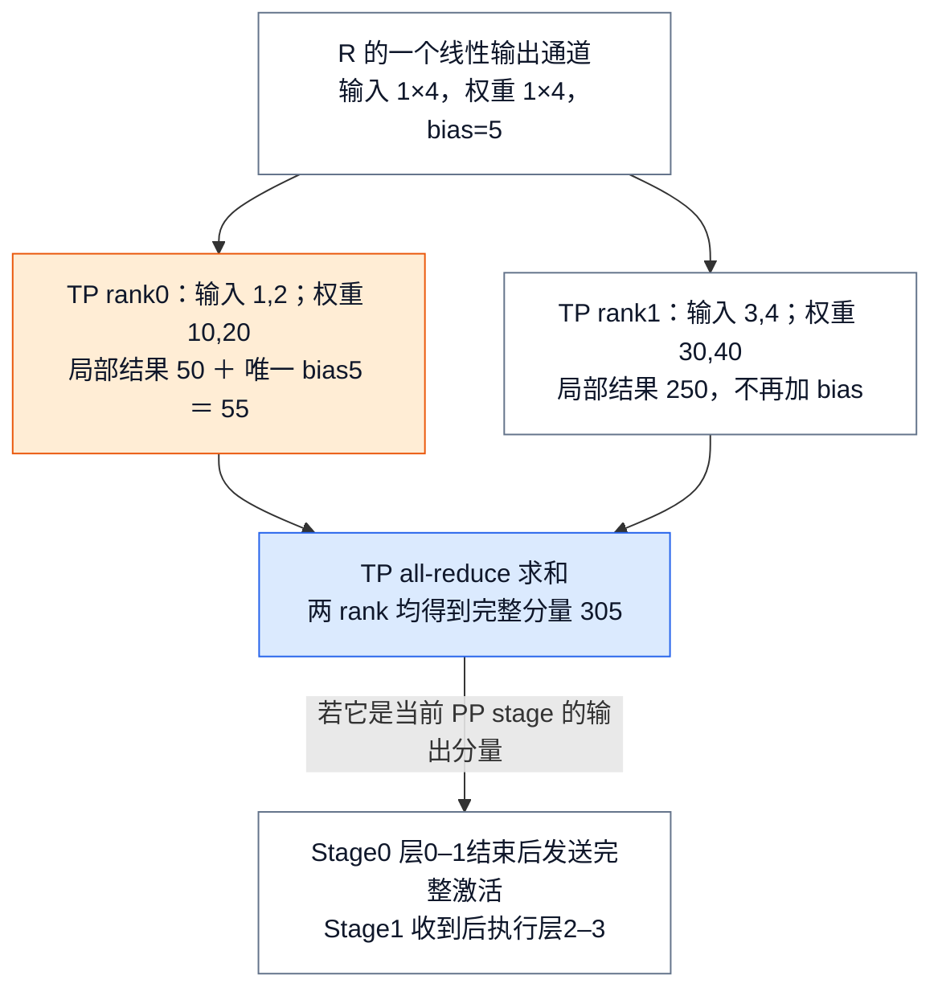
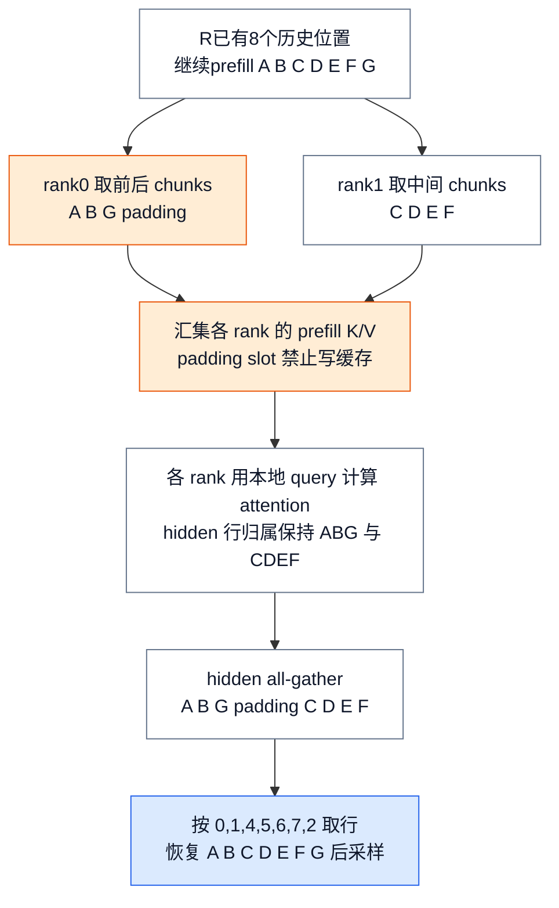
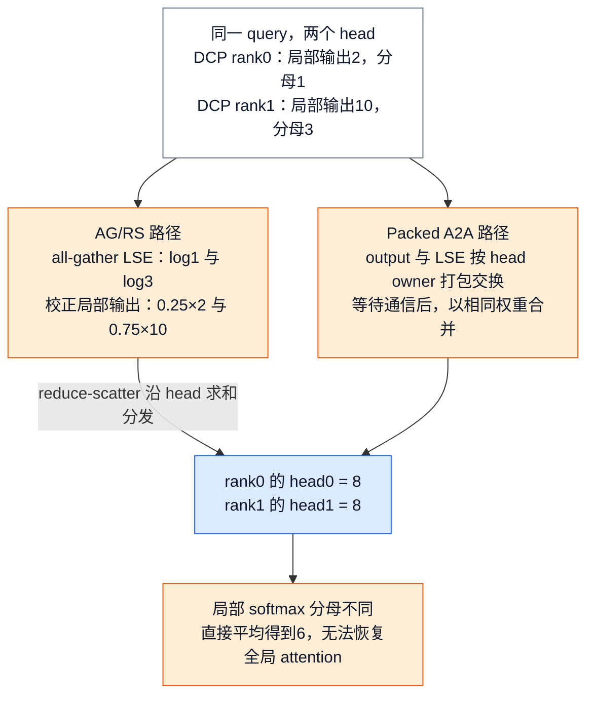
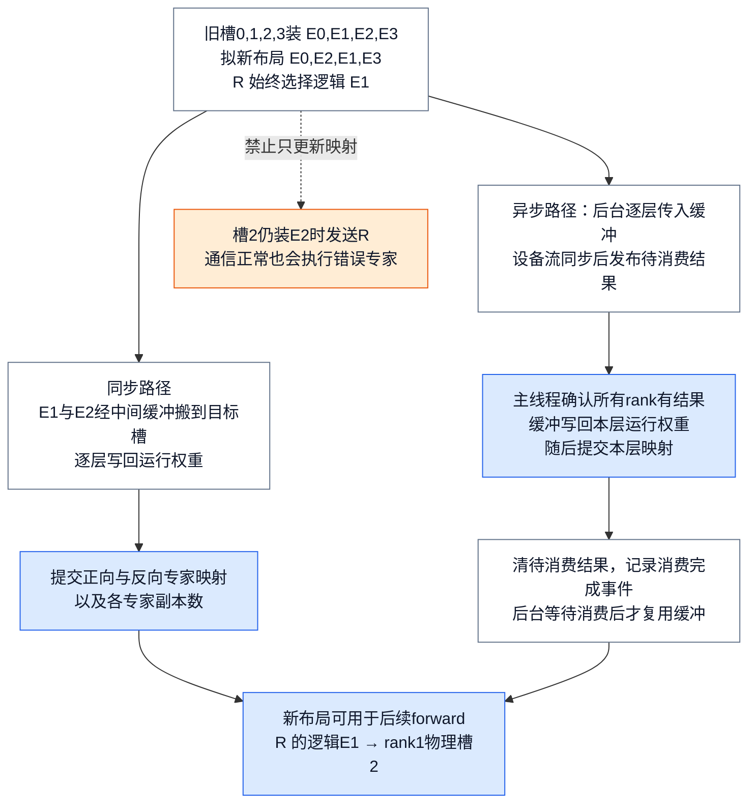
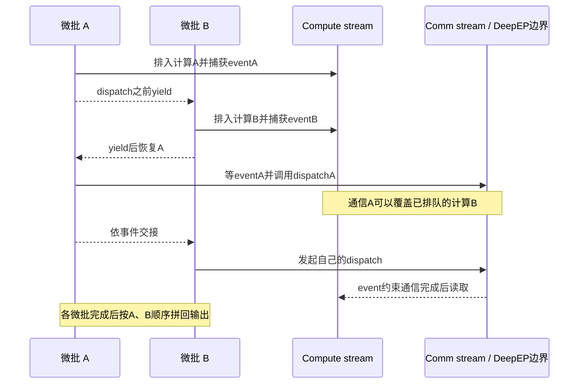

# vLLM 分布式推理：模型怎样切开，又怎样算回一个结果

> **源码基线**：`vllm-project/vllm@199cb9b964822e59ab9b58d88e7be31eb419a2ae`（`main` 快照，2026-09-07 UTC）
> **主题**：从模型容量、请求吞吐和长上下文的不同需求出发，解释 TP/PP/DP/EP/PCP/DCP 分别切什么，以及局部计算如何恢复为正确输出。随后介绍 rank/group 与 executor 的执行合同、EPLB 权重搬迁和微批重叠的完成边界。
> **适用范围**：拥有并行轴、rank/group、executor fan-out、collective 顺序、EPLB 分布式搬迁及 DBO；Serving 路由归13，设备算子归20，编译/图执行归19，在线模型更新归25。
> **最近更新**：2026-09-08。以最小算例补齐切分与重建，并核验新基线 PCP、EPLB 和两代 Runner 微批边界。

## 1. 同样增加两张卡，解决的可能是完全不同的问题

假设一个四层语言模型无法装进单张卡，但两张卡能容纳。请求 R 需要顺序经过这四层才能得到下一 token；请求 S 同时到达。可以把每一层的矩阵分给两张卡一起算，也可以让第一张卡负责前两层、第二张负责后两层。前者是 **TP，tensor parallel**，后者是 **PP，pipeline parallel**。两者都切开一个模型，却需要不同的通信：TP 在层内合并局部结果，PP 在层间传递中间激活。

如果一个副本已经装得下，而问题是 R、S 排队等待，则可以复制整个模型，让两个 **DP，data parallel** 副本分别处理请求。DP 增加独立 batch 容量，却不缩小单个副本。对于只激活部分 experts 的 MoE 模型，**EP，expert parallel** 则把专家分给不同设备，按每个 token 的选择发送计算任务。

长上下文又分两种问题：prefill 的新 token 太多，可以用 **PCP，prefill context parallel** 分担 query/token 计算；decode 的历史 KV 占用太大，可以用 **DCP，decode context parallel** 切历史上下文，再合并局部 attention。它们不能因为名称都含 context 就被当成同一切分。

本页的共同问题是：**设备只持有一部分数据时，哪一次通信把它恢复成正确语义？** 只有先知道这个答案，GPU 数、进程数和 group 数才有意义。下述数字均为教学输入，不是性能测量；选型收益仍需按 [[04_vllm_performance_tuning_guide|评测与调优]] 验证。

| 目标 | 候选轴与切分对象 | 恢复完整语义的动作 | 所需代价 |
|---|---|---|---|
| 单副本权重/显存不足 | TP：层内权重与通道；PP：连续 layer ranges | TP 汇总 partial sums 或拼 output shards；PP 顺序传激活 | 层内同步，或 stage 串行、bubble 与点对点传输 |
| 已能容纳模型，需要更多请求吞吐 | DP：模型副本、请求队列、KV pool | dense 请求在自己的副本完成 | 复制权重与缓存；MoE DP 可能仍处于共同通信域 |
| MoE 专家分布或负载不均 | EP：专家归属；EPLB：物理槽与副本布局 | token dispatch → expert 计算 → combine | all-to-all、负载偏斜、搬迁带宽与临时缓冲 |
| 长 prefill 首 token 太慢 | PCP：本次 query/token 分工 | 交换所需 K/V，恢复输出 token 顺序 | 新增 ranks、padding、K/V 和 hidden gather |
| Decode KV 复制太多 | DCP：已有 ranks 上的 KV token 分片 | LSE 加权合并局部 attention | 每步通信与后端限制；不新增进程 |

官方优化指南建议容量问题先在高带宽域考虑 TP、再评估 PP，吞吐扩展再考虑 DP。这里保留这一部署思路，但不把它当成自动优化公式。EP 只改变 MoE expert 的分布，并不把模型全部 dense layers 变成专家并行。

## 2. 先算一个最小例子：TP 与 PP 怎样恢复模型输出？

### 2.1 TP 的合并是求和还是拼接，取决于切的是哪一维

为说明 `RowParallelLinear.forward`，只取一个输出通道：输入 $x=(1,2,3,4)$，权重 $w=(10,20,30,40)$，bias 为 5。TP=2 沿输入通道分开；rank 0 持有前两个输入/权重，rank 1 持有后两个。普通启用 `reduce_results` 且不延迟 bias 的路径是：

$$
\begin{aligned}
p_0 &= 1\cdot 10+2\cdot 20+5=55, \\
p_1 &= 3\cdot 30+4\cdot 40=250, \\
y &= p_0+p_1=305.
\end{aligned}
$$

每个 rank 的局部 GEMM 只算了一部分求和项，所以要 all-reduce；bias 只在 TP rank 0 加一次。如果两边都加 5，合并会错成 310。相反，`ColumnParallelLinear.forward` 按输出通道保留不同输出 shard：例如两边分别得到前两个和后两个输出通道，`gather_output=True` 时按通道 all-gather 拼起来，不能把不同通道相加。`input_is_parallel`、`reduce_results`、`gather_output`、`skip_bias_add` 决定层接口，通信并不是 executor 在所有层结束后统一补一次。

<!-- Figure spec: R's row-parallel scalar-output layer has input1x4 split into two1x2 shards. rank0 computes55 including the only bias; rank1 computes250. Both partials enter one TP all-reduce producing305 on both ranks. An auxiliary PP continuation sends the completed activation to stage1; stage1 waits for data before layers2-3. Blue highlights reconstruction, orange highlights bias-once constraint. The scalar is one selected activation component, not an entire model output. -->

### 2.2 PP 的局部完成，还不是整个模型完成

四层模型 PP=2 的普通均分为 stage 0 的层0–1、stage 1 的层2–3。`make_layers` 只构造本 stage 的真实层，其余位置放 `PPMissingLayer`；边界由 `get_pp_indices` 决定。`VLLM_PP_LAYER_PARTITION` 可覆盖划分，但数量必须等于 PP size、总和必须等于层数，否则抛错；默认遇到余数会把额外层分配到前面的 partitions，避免都压到含输出处理的末 stage。

R 的激活走完 stage 0 后必须传给 stage 1，不能把 stage 0 的返回值当作最终 token。PP+TP 可以组合：每个 stage 内先按层的 TP 合同算好激活，再跨 stage 传递。代价是 R 的各 stage 有真实数据依赖，增加 stage 并不等价于让 R 的全部层同时执行；多个工作单元的重叠仍取决于运行调度。

## 3. 长上下文：分 query 与分 KV 必须采用不同的重建规则

### 3.1 PCP：七个输入 token 怎样分成两份再恢复顺序？

当前 PCP 运行入口在 MRV2 `PCPManager`。以 R 已计算8个历史位置、正在继续 prefill 的七个新 token A–G、PCP=2 为例，DualChunkSwap 将序列分为四个上取整长度为 2 的 chunks：AB、CD、EF、G。rank 0 取首尾 AB+G，rank 1 取中间 CD+EF。**分析推断**：对 causal attention，后面的 query 可见更多历史，把前后配对有助于分担不均匀计算；实际负载还受缓存历史与后端影响。

rank 0 只有 3 个 token，rank 1 有 4 个；为 all-gather 使用共同长度，rank 0 补一个 padding。模型在本地 query 行上计算，所需 prefill K/V 经 gather 进入 cache；padding 对应的 slot 用写掩码排除。最终 hidden rows gather 成 ABG_ CDEF，再用 `hidden_restore_idx=(0,1,4,5,6,7,2)` 还原 ABCDEFG，采样/后处理重新看到全局 batch。这里选继续 prefill，使两个 segments 都不从位置0开始；若是全新 prefill，`_reorder_segments` 会把从位置0开始的 pure-prefill segment 移到本地末尾，rank0 会排成 GAB，恢复索引也随之重算，不能照搬本例索引。

<!-- Figure spec: PCP2 seven-token input ABCDEFG is transformed into rank0 ABG plus padding and rank1 CDEF. Prefill KV gathering is a necessary side dependency for local query attention, not hidden reconstruction. Local hidden rows gather to ABG_CDEF; restoration indices0,1,4,5,6,7,2 remove pad and restore original identity. Blue marks restore and orange pad/write mask. This is a data-transformation graph, not a spatial memory grid. -->

这不是 decode 的切法：`_iter_rank_chunks` 对 decode 行复制到各 PCP rank，`_gather_prefill_cache_inputs` 保留 decode 写入本地，只 gather 分片 prefill；不能把这张图推演成“PCP 自动消除所有 decode KV 复制”。本页跟随已打开的 MLA PCP 路径；部署文档还讨论 ring-style 方案，但没有据其设想宣称本路径运行了 ring attention。

### 3.2 DCP：不能把两份局部 softmax 输出直接平均

DCP 不增加 world size，而是在已有 TP/PCP ranks 上切 KV context。给 R 的一个 decode query、一个输出分量构造两块局部 KV：两边 attention 的局部 softmax 分母分别为 1、3，归一化局部输出分别为 2、10。每个 rank 保存局部输出及 **LSE，log-sum-exp，即局部 softmax 分母的对数**。

设局部输出为 $o_i$、LSE 为 $\ell_i$，全局输出为：

$$
o=\sum_i\frac{\exp(\ell_i)}{\sum_j\exp(\ell_j)}o_i.
$$

因此本例权重是四分之一和四分之三，结果为 8，而算术平均得到的 6 是错的。实现用减去最大 LSE 的方式稳定计算权重，并处理空 KV shard、无效 LSE；空 shard 贡献零权重，不能让其未定义输出污染结果。

为展示实际 head-scatter，下面取输入形状 B=1、H=2、D=1，并让两个 head 都具有同样的局部分量2/10。两个 DCP rank 都先有对应完整 head 集的局部结果，combine 后 rank 0 留 head0，rank 1 留 head1，各值均为8。

<!-- Figure spec: two DCP ranks, each partial attention shape1x2x1, local outputs2/10 and LSE log1/log3 for both heads. AG/RS lane gathers LSE then rescales and reduce-scatters; packed A2A lane sends output+LSE to head owners then performs the same weighted combine after work.wait. Both lanes produce head0=8 at rank0 and head1=8 at rank1. Orange marks extra communications, blue exact normalization. Same input, alternative paths, no simple-average shortcut. -->

`cp_lse_ag_out_rs` 先 all-gather LSE、校正局部输出，再沿 head reduce-scatter；`dcp_a2a_lse_reduce` 将 output/LSE 打包，以一次异步 `all_to_all_single` 交换，`work.wait()` 后解包加权，同样得到 B×H/N×D。后者明确要求 H 可被 DCP size 整除。`MLADCPManager._init_combine` 依据 `dcp_comm_backend`、PCP 和 direct workspace 可用性选择实现；PCP 的非 A2A 分支用 all-reduce 保留完整 head，direct symmetric-memory 是专用实现入口，不是所有设备都经过上述通用通信函数。后端选择与 kernel 条件见 [[10_vllm_attention_backends_analysis|Attention Backend]]。

DCP 的 KV token 交错存储避免每次增长都重新连续切块；`cp_kv_cache_interleave_size` 是当前共同配置，旧 `dcp_kv_cache_interleave_size` 保留迁移说明。更多 ranks 能减少 KV duplication，却增加 query/partial-output 交换。部署文档的 TP/KV-head 比例是动机说明，当前可接受组合仍须过下节配置与 backend 校验。

## 4. 同一批进程怎样知道自己属于哪些通信组？

### 4.1 逻辑轴、worker 和时间 lane 是三层不同对象

`ParallelConfig` 的模型并行 world size 为 PP×TP×PCP；external launcher 会再把 DP 乘入其进程 world。DCP 不增加 world，EP 复用 DP×PCP×TP ranks，DBO 则只增加时间上的 microbatch lanes。**分析推断**：backend 与切分语义分开，允许 multiprocessing、Ray actor 或外部 launcher 承载相同模型层接口；但 backend 仍必须创建正确成员并满足通信顺序。

普通 `initialize_model_parallel` 将 ranks reshape 为 ExternalDP×DP×PP×PCP×TP，然后转置/展平派生各轴的 group。ExternalDP 是不参与模型通信、可独立 generate 的外层副本；内部 DP 的 ranks 若参与同一模型通信，必须协同推进。

以 MoE 协调域的 DP=2、PP=2、PCP=1、TP=2 为坐标例子，global ranks 0–7 的 TP groups 是 (0,1)、(2,3)、(4,5)、(6,7)；PP groups 为 (0,2)、(1,3)、(4,6)、(5,7)；DP groups 为 (0,4)、(1,5)、(2,6)、(3,7)。DCP=2 时复用上述 TP pairs；EP groups 则是固定 PP 的 (0,1,4,5) 与 (2,3,6,7)。这只是在八个 rank 上定义不同成员关系，不是再创建五套 workers，也不是认证任意模型都支持这组参数。

| Group | 固定坐标与变化坐标 | 对应本地状态 |
|---|---|---|
| TP | 固定 DP/PP/PCP，变化 TP | 当前层权重/activation shard |
| PP | 固定 DP/PCP/TP，变化 PP | 当前 stage 的 layer range |
| DP | 固定 PP/PCP/TP，变化 DP | 当前请求副本；MoE 共同推进状态 |
| PCP | 固定 DP/PP/TP，变化 PCP | 本次 query/token rows |
| DCP | 固定 DP/PP，在 PCP 后 TP 的顺序上成组 | 局部 KV shard 与 partial attention |
| EP / EPLB | 固定 PP，跨 DP/PCP/TP；EPLB另用同成员group | expert 槽位；负载统计与搬迁 |

EP group 只对 MoE 或模型配置为空的初始化场景创建；EPLB 开启时另建同成员 group，隔离后台搬迁通信与 forward collective。Elastic EP 则有 stateless DP/EP/EPLB group 分支，并非所有 group 都是同一种 PyTorch ProcessGroup；当前明确拒绝 multi-node TP/PP 的 elastic EP 初始化。

### 4.2 GroupCoordinator 持有成员身份，不在每层重新计算拓扑

`GroupCoordinator` 保存 global rank、用于设备选择的 local rank、`rank_in_group`、CPU/device group 和 device communicator。默认路径让各 rank 依相同列表调用 `torch.distributed.new_group`，只有成员保存对应组；新基线 `VLLM_DISTRIBUTED_USE_SPLIT_GROUP` 还可切换专门的 subgroup 创建路径，不能再称所有部署都只用 new_group。

`tensor_model_parallel_all_reduce` 直接转到当前 TP group 的 `all_reduce`，coordinator 再根据 size、custom-op 与 communicator 分发。vLLM 可证明的是成员列表、调用顺序和 shape 的交付；NCCL、Gloo、PyTorch、Ray 与 DeepEP 内部执行属于外部依赖，本页没有把它们当作已逐行验证的实现。

这里的关键不是“通信函数都能调用”，而是同一 group 的成员必须以兼容 shape/dtype 进入相同顺序的 collective。违例可能卡住，也可能由通信 timeout 或外部后端报错；源码不存在能在每次 collective 前验证所有远端未来分支的通用 guard。

## 5. 一次 PP+TP step：广播的是执行义务，收回的是指定输出

Executor 管理 worker 生命周期、RPC fan-out、输出汇集与故障；`WorkerBase` 保存 rank、local_rank、配置和设备状态。GPU worker 绑定设备后调用 `init_worker_distributed_environment`，再初始化 model-parallel groups 和本地 model/KV。谁切哪一块由模型配置和层接口决定，谁把这些 worker 叫起来由 `Executor.get_class` 的 backend 选择决定。

`UniProcExecutor` 直接持有 driver worker；multiprocessing 按 local world 创建 workers 并使用广播消息队列；Ray 为 actors 分配 global/local rank 后调用同样的设备初始化接口，传统 Ray executor 还使用专门的 PP compiled DAG 路径，新基线也提供 Ray V2 选择开关。下述执行轨迹固定普通 multiprocessing、PP+TP 文本路径，Ray 图内部不在本轮展开。

1. `EngineCore.step` 从 Scheduler 获得本次 `SchedulerOutput`，非阻塞提交 `execute_model` 后可准备 grammar；到 `future.result()` 才消费本次执行结果。若返回 None，还要调用 `sample_tokens`，处理执行期间的 abort 后，才用原 snapshot `update_from_output`。完整 Engine 事务由 [[06_vllm_engine_architecture_analysis|Engine 运行]] 解释。
2. `MultiprocExecutor.execute_model` 用 `collective_rpc` 广播给所有 workers。普通路径的 `unique_reply_rank` 只让约定 output rank 返回模型结果；TP=2、PP=2、PCP=1 时，它是最后 stage 的第一个 TP worker，即 rank 2。KV/EC connector aggregator 存在时会收集各 worker 输出并合并，不能普遍断言永远只读一份 reply。
3. `GPUWorker.execute_model` 先等上一轮 PP device send handles，避免下一次 forward 覆盖仍在发送的 buffer。非首 stage 发起 `irecv_tensor_dict`，包装为 `AsyncIntermediateTensors`；直到首次访问 tensors 才 wait handles 并做通信后处理，发起 irecv 不是接收完成。
4. Runner 执行本 stage；遇到 row-parallel 层就按第2节合并 partial sums，遇到 DCP/EP 则履行相应恢复合同。非末 stage 返回 `IntermediateTensors`，worker 异步 `isend_tensor_dict`，保留 device handles 到下次 step 等待；末 stage 走输出/采样路径。
5. Executor 的 future 收到约定响应后返回 Engine，随后请求状态提交。它不是给所有通信组附加一个全局 barrier；collective 顺序和异步 buffer lifetime 仍由各路径维持。

三个不变量分别是 membership、order、shape/lifetime：预期成员不能漏掉，第N次 collective 必须语义相同，通信未完成的 buffer 不能被覆盖。它们分别解释“初始化 hang”“首请求或特殊 batch hang”和“不挂但数值错”。

### DP 空闲不能随意退出 MoE 通信

普通 dense DP 在 `run_engine_core` 重配成各自 DP=1，保留用于服务标识的 DP index，能够独立推进；MoE 则进入 `DPEngineCoreProc`，内部 rank offset 与 world 扩展使它们组成共同通信域。某个 rank 没有实际请求但全组仍需推进时，engine 执行 dummy batch；全局 unfinished 状态同步后才能结束 wave。sleep/pause 分支必须遵守自己的限制，不可看到“本地没 token”就进入不同 collective。

`test_dp_pause_barrier_request_deadlock` 的反例是 rank 0 在 DP barrier 等待、rank 1 因错误 wave 通知进入 EP all-to-all。两个都在通信，但等的不是同一次操作；测试要求 paused 状态忽略该启动通知，使后续 barrier 能完成。请求路由和 wave 的服务通知归 [[13_vllm_serving_control_plane_analysis|Serving 控制面]]，它们不能代替此处实际执行的 collective 顺序。

## 6. EP 与 EPLB：逻辑专家不变，物理槽位可以改变

### 6.1 Token 路由先选专家，再查放在哪里

设一个 MoE 层有逻辑专家 E0–E3，EP=2，每 rank 两个物理槽：rank0 的槽0、1装 E0、E1；rank1 的槽2、3装 E2、E3。R 的 token 选择 E1，S 的 token 选择 E3，则 dispatch 分别送到 rank0 的槽1和 rank1 的槽3，执行各专家后，combine 按原 token 身份及路由权重归并。多选专家时，一个 token 可以产生多份 expert 输入，但重建后仍对应原 token。

`BaseRouter._select_experts` 先产生逻辑 `topk_ids` 与权重，再 `_apply_eplb_mapping` 转成物理 ID；capture callback 则在映射前看到逻辑 ID。开启冗余专家时 `logical_to_physical_map` 可为一个逻辑专家列出多个物理副本，`logical_replica_count` 给有效数；路由选一个副本，padding/无效 ID 另有掩码。具体 top-k、token packing、GEMM 与 combine 算子见 [[20_vllm_fused_ops_and_kernels_analysis|融合算子]]。

EPLB 优化的是专家放置，不改变 router 选择的逻辑模型。假定负载策略提出把 E1 与 E2 对调，新的 physical-to-logical map 为 (E0,E2,E1,E3)。这只是为说明提交合同而给定的目标图，不宣称任意负载都会生成这一方案。切换后 R 仍选择 E1，却应送到 rank1 的槽2；如果只改 map 而没搬权重，它会实际执行旧 E2，数值可能错误而通信完全正常。

<!-- Figure spec: two EP ranks with two slots each, old map0,1,2,3 and proposed map0,2,1,3. Sync lane moves weights through intermediate buffers then commits all maps. Async lane transfers one layer on background stream, synchronizes before publishing pending_result, waits for all-rank readiness, copies to workspace and commits that layer, then records consumed_event before buffer reuse. Both converge on R logicalE1→physical slot2/rank1. Orange shows forbidden map-before-weight condition; blue marks commit. -->

### 6.2 同步与异步搬迁的真实完成点不同

`EplbState.step` 把 forward 的物理槽负载记录进 sliding window，rearrange 时按现有 map `scatter_add` 回逻辑专家、跨 ranks 汇总，再交策略生成布局。dummy step 不计实际 token 负载，但仍推进 rearrangement step，保证成员不因空 batch 跳过搬迁 collective。

同步路径先 `rearrange_expert_weights_inplace`：根据旧/新布局找本地可复用项和远端传输项，`move_to_buffer` 执行通信，然后 `move_from_buffer` 写回模型实际权重，最后 `_commit_eplb_maps` 更新三个映射。copy 可以是 GPU 异步操作；这里的正确性依靠执行流顺序，不能把一次 Python `copy_` 返回解释为设备立即完成。profile 分支只做通信/缓冲预留，不提交真实 map。当前 ROCm 正常重排还有收益过滤：估计负载不均衡改善不足5%时可跳过，不能把到达 interval 当作必定搬迁。

异步路径先快照统计并设置 `rebalanced`，通过 event 唤醒后台；后台逐层 transfer，**在自己的 CUDA stream 同步之后**才发布 `pending_result`。主线程的 `step` 用 `_all_ranks_result_ready` 确认所有成员有结果，再写回该层权重、提交该层 map、清 pending，并记录 `consumed_event`。后台必须等待这个事件才能覆盖共享 buffer。`rebalanced` 在最后一层提交后才清除；这不是整个模型所有层一瞬间同时换图，而是层级提交、每层保证权重与映射配对。

代价包括统计窗口、CPU策略计算与 D2H、expert buffer 和传输。后台异常或成员不一致没有事务式全局回滚；源码特别要求 `rebalanced` 在各 rank 保持一致，否则 readiness all-reduce 自身会 hang。`drain_async` 是显式排空待消费结果的路径，可只确认消费而不应用转入权重；不能把“后台 drain 了”误读成“新布局已提交”。

`ShardedRDTWeightTransferEngine.init_transfer_engine` 明确拒绝 `enable_eplb=True`：其初始化时固定的权重 replay 目的槽会被 EPLB 动态搬迁失效。这个组合限制应在部署时先验证，详见 [[25_vllm_weight_transfer_online_update_analysis|在线权重更新]]。EPLB 搬专家与在线换模型权重是两种不同事务，不能共享一条模糊的“权重已更新”完成信号。

## 7. DBO：不改模型切分，用另一份计算填通信等待

DBO 是 dual batch overlap，把同一次 forward 切成两个 microbatches，借 A 的通信窗口推进 B 的计算。`enable_dbo` 时 `num_ubatches=2`；更一般的 `ubatch_size` 也可启用微批。默认 decode/prefill thresholds 分别为32/512 tokens，是否达到门槛还要经全组一致决策；它没有新增 rank 或 process group。

### 7.1 两代 Runner 不能共用一条微批边界结论

| 决策 | MRV1 | MRV2 当前显式启用路径 |
|---|---|---|
| DP 一致性 | 同步微批意愿、原/补齐 token 数与 graph mode，任意否决则全组不切 | 读取全 rank 意愿与 token 数；以最小负载检验门槛，只有全组 uniform decode 才用 decode threshold |
| Padding | 按全组最大 token 数补齐；若最小rank的最后微批为空则全组否决 | 按最大 token 数补齐；允许末微批全为 padding，仍参加 expert collective |
| Graph 接缝 | runtime mode 同步取最小，具体 capture 由图路径管理 | 微批 descriptor、attention metadata 与 forward context 都固定 `CUDAGraphMode.NONE` |
| 重建 | wrapper 按微批编号排序、沿 batch 拼输出 | `UBatchRunner.run` join 后按编号合并 tensor、tuple 或 intermediate tensors |

同一教学输入：DP 两 rank 分别有128、512个真实 token，已共同超过所用 threshold，切成两个256-token微批。MRV1 因 rank0 第二微批无真实 token 而否决；MRV2 让 rank0 第二微批以 padding 继续，保持每 rank 两次 expert all-to-all。这一差异有 `test_microbatching_survives_a_rank_that_cannot_fill_it` 等测试支撑，不能把旧稿的“空末微批必否决”套到 MRV2。

> [!contradiction] 旧基线的 Runner 能力结论已经变化
> 旧稿写“DBO 不受 MRV2 支持，回退 MRV1”。新基线有 MRV2 `UBatchRunner`，但默认选择仍把其视为开发中的能力，需要显式设置 `VLLM_USE_V2_MODEL_RUNNER`；它拒绝 CUDA Graph、LoRA、投机、PP、PCP/DCP、多模态及 hybrid 等组合。PCP 仍只在 MRV2 运行，因此 PCP+DBO 仍不组成受支持路径，理由已是具体兼容校验。编译接缝见 [[19_vllm_compilation_cudagraph_analysis|Compilation 与 CUDA Graph]]。

### 7.2 先交出 CPU 执行权，再让通信覆盖另一微批的计算

`UBatchContext` 用线程 event 控制当前 forward context 的唯一 CPU 持有者，用 GPU event 连接 compute/communication stream。DeepEP high-throughput prepare 先捕获当前 A 的 compute event，**在调用 dispatch 前 yield**；B 才有机会把自己的计算排入 stream。若先执行会阻塞 CPU 的 dispatch，再希望 B 补计算，就可能丢掉重叠窗口。

下图中 A、B 分别处理 R/S 所在的一半 token rows；它只说明依赖和排队次序，不按比例表示持续时间或保证加速比。

<!-- Figure spec: two microbatch halves A/B of one logical batch share ranks. Sequence shows computeA and eventA, yield to enqueue computeB, resumeA to issue DeepEP dispatch, then return to peer. Explicit dependency events protect communication/compute buffers; ordered A/B merge closes output. External DeepEP marked as library call. Not a measured overlap timeline. -->

事件必须覆盖正确的工作范围；在 yield 之后才捕获 A 的 event，可能把 B 的尾部工作也包含进去，抵消重叠。combine 也有通信到计算的事件依赖。vLLM 传给 DeepEP 的是 token、top-k、布局和 event/handle；本页检查其封装及顺序，没有验证外部库在所有设备上的实际并发进度。

### 7.3 Buffer 隔离与失败收尾同样决定能否安全重叠

`WorkspaceManager` 用 `(ubatch,lane)` 选择 workspace；两个 ubatches、两个 lanes 必须得到四份独立 buffers，`test_workspace_lanes_compose_with_ubatches` 正在验证这个合同。MRV2 的 query offsets/sequence length 也使用每微批独立缓冲，不能让 B 的重写污染仍在用的 A。

MRV1 `_allow_microbatching` 另检查 prefix-cache 读写依赖：如果前半 batch 的 reader 使用后半 writer 本步尚未填好的共享 blocks，微批会被否决。完整 batch 的“先写再读”顺序不能自动跨两个微批成立。

微批并发也没有完整的 sibling 异常展开协议。`UBatchRunner.run` 能在所有线程退出后报告具体失败编号；但某微批在 sibling 停在 yield 时死亡，后者可能永远等不到交接，`thread.join()` 就不能完成。代码和 `test_ubatch_runner_names_the_microbatch_that_failed` 都明确指出此缺口，MRV1 共用 handoff 也有同类问题。不能用“异常捕获了”宣称 batch 已清理、其他 lane 已取消。

## 8. 支持边界与从症状进入源码的路线

当前 `ParallelConfig` 要求 PCP=1 时 TP 可被 DCP 整除；PCP>1 时 DCP 只能取1、PCP或TP×PCP，并拒绝 PCP+DP。`PCPManager.validate_config` 当前只接受 MLA，拒绝 PP、encoder-decoder、多模态输入、LoRA、投机与 full CUDA Graph；sparse MLA PCP 还要求 graph NONE。数学上能够 reshape 不代表存在受支持的模型执行路径。

微批的 all-to-all backend 限于 `deepep_low_latency`、`deepep_high_throughput`、`nixl_ep`，配置同时禁用 cascade attention；EPLB 要求 EP 和有效的多rank规模，冗余专家配置也必须配合开启。通信和模型能力校验失败应先解决组合错误，再讨论性能。

| 症状 | 先查哪条合同 | 可观察的验证入口 |
|---|---|---|
| 初始化 hang | world/rank offset、group创建顺序与backend | worker rank日志、`GroupCoordinator` 创建分支 |
| 首请求或 pause/barrier hang | PP接收对端、MoE dummy/wave次序 | `test_dp_pause_barrier_request_deadlock` |
| 特定batch hang | 全rank微批意愿、padding、yield后异常 | `test_every_dp_rank_must_agree_to_microbatch`；`UBatchRunner.run` 的join与handoff |
| 数值错误但通信完成 | TP bias/shard；DCP LSE；EP逻辑/物理map | DCP `test_mathematically_correct`；EPLB shuffle 后权重与冗余副本一致性测试 |
| PCP采样位置错 | padding、hidden_restore_idx、slot写mask | `test_num_tokens_for_dispatch_uses_largest_pcp_rank`；`test_graph_padding_cannot_be_smaller_than_largest_pcp_rank` |
| 重叠时偶发污染 | workspace lane、PP send handle、EPLB consumed event | `test_workspace_lanes_compose_with_ubatches`；EPLB `test_producer_consumer` |

上述测试合同均已阅读，未在本轮运行 GPU、多节点或外部通信库。排查先核对成员与顺序，再记录 shape、stream/event 与真实完成，最后才比较 backend 性能；实际工具操作见 [[05_vllm_debugging_troubleshooting_guide|调试与排障]]。

### 源码阅读路线

路径相对固定基线的 vLLM 仓库；表内同组符号表示一个证据问题，不省略中间层伪装成直接调用。

| 核验问题 | 已打开的稳定入口 |
|---|---|
| 切分与并行约束 | `vllm/config/parallel.py::ParallelConfig._validate_parallel_config / __post_init__ / num_ubatches`；`vllm/model_executor/layers/linear.py::ColumnParallelLinear.forward / RowParallelLinear.forward`；`vllm/model_executor/models/utils.py::make_layers`；`vllm/distributed/utils.py::get_pp_indices` |
| Rank与group | `vllm/distributed/parallel_state.py::init_distributed_environment / initialize_model_parallel / GroupCoordinator.__init__ / all_reduce`；`vllm/distributed/communication_op.py::tensor_model_parallel_all_reduce` |
| PCP切分与重建 | `vllm/v1/worker/gpu/pcp_manager.py::PCPManager.validate_config / _iter_rank_chunks / _reorder_segments / _build_batch_layout / restore_hidden_states`；`vllm/v1/attention/ops/pcp.py::_gather_prefill_cache_inputs / maybe_gather_mla_latent_cache_inputs`；`tests/v1/worker/test_gpu_pcp_manager.py::test_num_tokens_for_dispatch_uses_largest_pcp_rank / test_graph_padding_cannot_be_smaller_than_largest_pcp_rank` |
| DCP数值与通信 | `vllm/v1/attention/ops/dcp.py::_correct_attn_cp_out_kernel / _cp_lse_common / cp_lse_ag_out_rs / dcp_a2a_lse_reduce / MLADCPManager._init_combine`；`tests/distributed/test_dcp_a2a.py::TestLSEWeightedCombine.test_mathematically_correct` |
| Executor到完成输出 | `vllm/v1/executor/abstract.py::Executor.get_class`；`vllm/v1/executor/multiproc_executor.py::MultiprocExecutor._init_executor / execute_model / collective_rpc / _get_output_rank`；`vllm/v1/executor/uniproc_executor.py::UniProcExecutor._init_executor`；`vllm/v1/executor/ray_executor.py::RayDistributedExecutor._init_workers_ray`；`vllm/v1/worker/gpu_worker.py::Worker.execute_model / AsyncIntermediateTensors.wait_for_comm / init_worker_distributed_environment`；`vllm/v1/engine/core.py::EngineCore.step` |
| DP共同推进 | `vllm/v1/engine/core.py::EngineCoreProc.run_engine_core / DPEngineCoreProc.run_busy_loop / _has_global_unfinished_reqs`；`tests/v1/distributed/test_async_llm_dp.py::test_dp_pause_barrier_request_deadlock` |
| EPLB身份与提交 | `vllm/model_executor/layers/fused_moe/router/base_router.py::BaseRouter._select_experts / _apply_eplb_mapping`；`vllm/distributed/eplb/eplb_state.py::EplbState.step / rearrange / _all_ranks_result_ready / drain_async / compute_logical_maps / _commit_eplb_maps / _move_to_workspace`；`vllm/distributed/eplb/async_worker.py::transfer_run_periodically` |
| 权重搬迁与验证 | `vllm/distributed/eplb/rebalance_execute.py::move_to_buffer / move_from_buffer / rearrange_expert_weights_inplace`；`tests/distributed/test_eplb_execute.py::_test_async_transfer_layer_without_mtp_worker / test_rearrange_expert_weights_with_redundancy`；`tests/distributed/test_eplb_events.py::test_producer_consumer`；`vllm/distributed/weight_transfer/sharded_rdt_engine.py::ShardedRDTWeightTransferEngine.init_transfer_engine` |
| 两代微批与图约束 | `vllm/v1/worker/dp_utils.py::_post_process_ubatch / _synchronize_dp_ranks`；`vllm/v1/worker/gpu/dp_utils.py::sync_cudagraph_and_dp_padding`；`vllm/v1/worker/gpu/ubatch_utils.py::UBatchRunner.prepare / run / merge_ubatch_outputs`；`vllm/config/vllm.py::VllmConfig._get_dbo_unsupported_features`；`tests/v1/worker/test_gpu_ubatch_slicing.py::test_microbatching_survives_a_rank_that_cannot_fill_it / test_ubatch_runner_overlaps_and_matches_single_batch / test_ubatch_runner_names_the_microbatch_that_failed` |
| 重叠的buffer与事件 | `vllm/v1/worker/ubatching.py::UBatchContext`；`vllm/v1/worker/workspace.py::WorkspaceManager`；`vllm/v1/worker/gpu_model_runner.py::GPUModelRunner._allow_microbatching`；`vllm/model_executor/layers/fused_moe/prepare_finalize/deepep_ht.py::DeepEPHTPrepareAndFinalize._do_dispatch`；`tests/v1/worker/test_workspace.py::test_workspace_lanes_compose_with_ubatches` |

## Related Pages

- [[02_vllm_architecture_overview_analysis|架构概览]] — 从请求全链路进入本页的并行执行问题。
- [[06_vllm_engine_architecture_analysis|Engine 运行]] — 解释 SchedulerOutput、执行future、采样与状态提交。
- [[09_vllm_model_library_analysis|模型库与模型 ABI]] — 解释模型层如何提供 TP/PP 与本地权重接口。
- [[10_vllm_attention_backends_analysis|Attention Backend]] — 解释 PCP/DCP 所需的数值内核和后端能力。
- [[13_vllm_serving_control_plane_analysis|Serving 控制面]] — 解释 DP请求选择、就绪屏障及服务故障范围。
- [[19_vllm_compilation_cudagraph_analysis|Compilation 与 CUDA Graph]] — 解释 collective与microbatch如何约束图选择和capture。
- [[20_vllm_fused_ops_and_kernels_analysis|融合算子]] — 接续MoE token打包、专家计算及combine的设备细节。
